# CS336 Guest Lecture：从推理系统到全栈算法创新

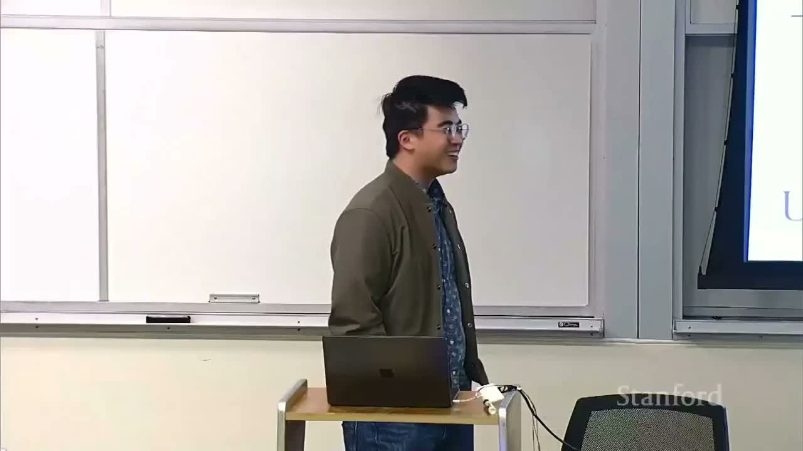

| 项目 | 信息 |
|---|---|
| 视频标题 | Stanford CS336 Language Modeling from Scratch · Spring 2026 · Guest Lecture: Dan Fu |
| 讲者 | Dan Fu |
| 频道 | Stanford Online |
| 视频链接 | https://www.youtube.com/watch?v=9EEm4iMAF5s |
| 时长 | 01:11:40 |
| 字幕 | YouTube 人工英文字幕（en-US），保留时间戳后整理 |
| 处理范围 | 完整主讲 00:00:05--01:00:33，以及 01:00:46--01:11:28 的全部实质性问答 |

> [!NOTE]
> 用户提供的本地 CS336 课件仓库中没有这一场 Guest Lecture 的独立课件，因此本讲义以人工字幕和经过逐帧直接检查的视频画面为准。讲者在 00:07:55--00:08:10 特别说明，前半部分若干系统概览图由生成式 AI 制作，“高层结构不错，但不要太仔细看文字”；图中示例数字、拼写和小标签不能当作权威规格。本讲义只用这些图解释讲者口述确认的机制，并把其中数字视作示意。Parcae 与 Megakernel 研究部分的公式、曲线和表格则直接从清晰可读的视频幻灯片恢复。

## 一、为什么要从“训练模型”转向“服务模型”

### 1.1 讲座的问题意识

CS336 的主线多半是如何把数据、优化器和算力变成一个训练好的语言模型。Dan Fu 把镜头翻到模型的另一侧：当模型已经存在，真实请求怎样经过调度、缓存、GPU kernel 和网络，最后成为用户看到的 token？

讲者用一句非常紧凑的话概括推理系统的任务：

> [!QUOTE]
> **Dan Fu（00:00:37--00:00:46）**：“turn these things from electricity, into tokens, into intelligence.”

这里的“智能”不是某一个 kernel 的产物，而是端到端系统给用户造成的能力体验。可以把这条转换链写成一个教学性的概念式：

$$
\text{electricity}
\xrightarrow{\text{GPU + kernels + inference engine}}
\text{tokens}
\longrightarrow
\text{user-perceived intelligence}.
$$

- electricity：驱动计算硬件的能源输入。
- GPU：执行大规模数值计算的硬件资源。
- kernels：把具体算子落实到 GPU 的底层程序。
- inference engine：负责请求准入、缓存、调度、并行和执行的系统层。
- tokens：模型流式生成并返回给应用的离散输出单位。
- user-perceived intelligence：完整交互所呈现的能力，而非单个算子的性质。

### 1.2 为什么此时推理系统特别重要

讲者先用模型能力和规模的增长建立动机：文本、代码、图像、视频和科学任务都在快速扩展；模型参数和训练计算也在增长。随后他用“马车被汽车替代”的历史故事提醒听众，技术替代常常不是线性发生的。旧系统的问题可能看似只能渐进优化，但新范式一旦跨过可用性阈值，采用速度会突然跃迁。

这也是为什么推理问题不能只当成“把训练代码改成 eval 模式”。当模型进入 coding agent、语音对话、长期会话和自动工具调用，系统面对的是全新的流量结构与可靠性要求。

### 1.3 GPU 是资源，推理软件栈才是转换机制

讲者把 GPU 称作“新石油”，但真正的重点在下一步：石油只有通过发动机才能转成运动，GPU 也只有通过推理引擎和 kernel 才能转成可用 token。抽象模型只是运算组成的有向无环图；它没有自动决定：

- 请求如何组成 batch；
- prefill 和 decode 怎样分工；
- KV Cache 放在哪里；
- 模型怎样跨 GPU 切分；
- 算子怎样映射到硬件；
- 出错时怎样观测和恢复。

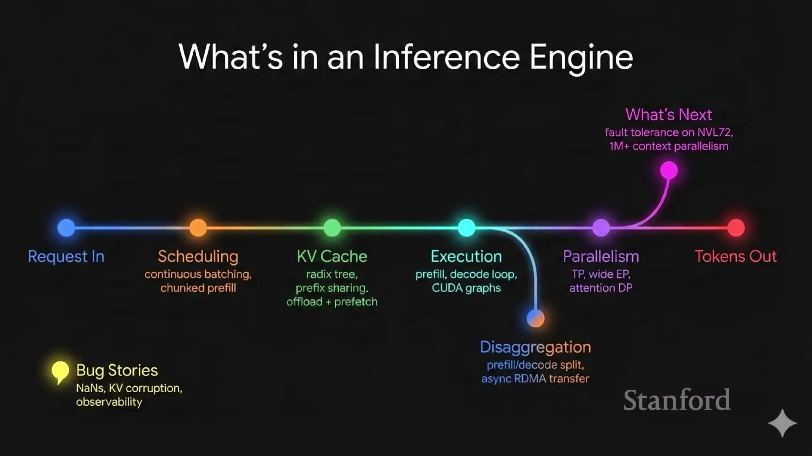

*图 1：请求从进入系统到 token 输出，沿途经过调度、KV Cache、执行、并行和阶段解耦。该页属于讲者提醒过的 AI 生成系统概览图，只取高层结构，不采信小字细节。（视频时间：00:08:20--00:09:38）*

> [!IMPORTANT]
> 本讲的中心命题不是“系统优化也很重要”，而是更强的一步：理解推理、GPU kernel 和硬件约束，可以反过来扩大机器学习算法的设计空间。

### 本章小结

模型训练回答“能力怎样获得”，推理服务回答“能力怎样以可用、低延迟、可扩展且可靠的方式出现”。GPU 只是资源，推理引擎才把模型运算图映射成真实执行。正因为系统约束会改变架构的最优点，推理知识不只是部署技能，也可能成为算法创新的来源。

## 二、一个 token 的一生：工作负载、prefill、decode 与缓存

### 2.1 先定义 workload，再谈优化目标

真实生产流量并不是从同一个长度分布里独立采样的 prompt。讲者列出至少五个必须观察的维度：

- 每轮新增输入 token 数；
- 每轮输出 token 数；
- 一个 session 有多少轮；
- 用户是否反复返回同一会话；
- 两轮之间隔多久，以及已有前缀能命中多少缓存。

语音或即时聊天要求很快开始回应；coding agent 可能长时间调用工具，偶尔才请求人类介入；健身计划一类长期会话可能隔几周才继续。相同的延迟目标，在不同输入长度、输出长度、缓存命中率和会话节奏下，难度完全不同。

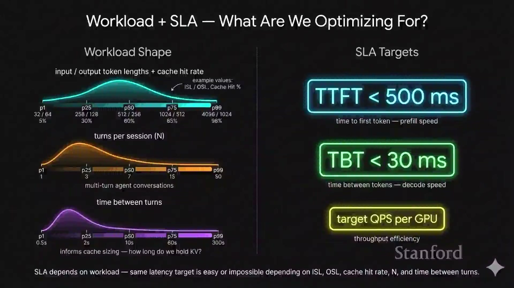

*图 2：工作负载形状决定 TTFT、token 间延迟和单卡吞吐目标是否可达。页面中的分位数和阈值为讲者的 AI 生成示意，不能当作统一生产标准。（视频时间：00:12:32--00:13:43）*

常见服务指标包括：

- TTFT（time to first token）：用户多久看到第一个 token，主要受排队与 prefill 影响；
- TBT/TPOT（time between tokens / time per output token）：流式输出相邻 token 的间隔，主要受 decode 影响；
- 端到端延迟：完整回答何时结束；
- throughput：单位时间、单位 GPU 能服务多少请求或 token。

### 2.2 从请求到 token 的基本流水线

一个请求进入系统后，大致经历以下步骤：

1. 文本被 tokenizer 转成 token；
2. 调度器检查前缀是否已有可复用状态；
3. 新输入进入 prefill；
4. 系统反复执行 decode，每一步产生一个新 token；
5. 对输出做 stop token、格式和安全等后处理；
6. token 被 detokenize 并流式返回。

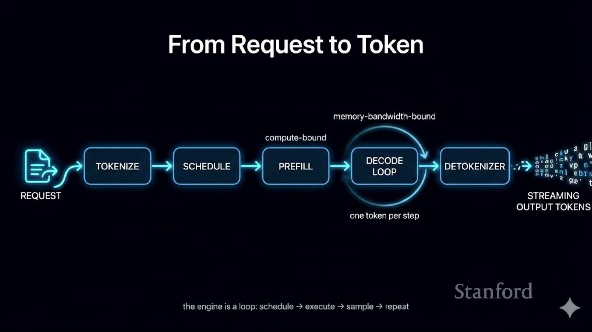

*图 3：prefill 是算力密集阶段，decode loop 是带宽密集阶段；引擎在调度、执行和采样之间持续循环。（视频时间：00:13:45--00:16:17）*

讲者没有展示一段可直接复制的引擎源码，但可以用下面的伪代码准确表达其口头流程：

~~~text
while serving:
    admit_new_requests()
    reuse_matching_prefix_kv()
    schedule_active_requests()
    run_prefill_or_decode()
    sample_tokens()
    apply_stop_and_safety_checks()
    retire_finished_requests()
~~~

这段伪代码的作用是突出：推理引擎不是“一次调用模型”，而是一个持续运行的调度循环。

### 2.3 Prefill 与 decode 是两种完全不同的工作

假设用户把 10,000 个 token 的代码库送入模型，询问其中某个函数。系统首先要把这段新上下文整体处理一遍，这就是 prefill；随后模型才逐 token 写答案，这就是 decode。

- Prefill 批量处理大量输入，矩阵计算规模大，通常更接近 compute/FLOP-bound。
- Decode 每一步只前进一个 token，单步 FLOPs 较小，却要反复访问模型权重和 KV Cache，通常更接近 memory-bandwidth-bound。

一个 prompt 通常只做一次 prefill，却会进行许多次 decode。可以用下面的近似关系表达执行次数：

$$
N_{\mathrm{prefill}} \approx 1,
\qquad
N_{\mathrm{decode}} \approx T_{\mathrm{out}}.
$$

- $N_{\mathrm{prefill}}$：一次请求的 prefill 次数。
- $N_{\mathrm{decode}}$：一次请求的 decode step 数。
- $T_{\mathrm{out}}$：输出 token 数。
- 近似号：speculative decoding、chunked prefill 等实现会改变精确步数。

> [!WARNING]
> “单次 prefill 更慢”和“decode 总成本更高”不是同一个命题。单次 prefill 计算量可能更大，但 decode 会执行很多次。容量规划必须同时考虑单步代价和执行次数。

### 2.4 Continuous batching：batch 成员随时间变化

固定 batch 要等整批请求一起结束，容易让短请求被长请求拖住。Continuous batching 允许请求在任意调度步加入和退出：

- 长请求 A 持续生成；
- 短请求 B 完成后立即释放槽位；
- 新请求 C 在中途加入；
- 若 KV Cache 空间不足，新请求必须等待；
- 请求结束后，排队请求立即占用释放的计算和缓存资源。

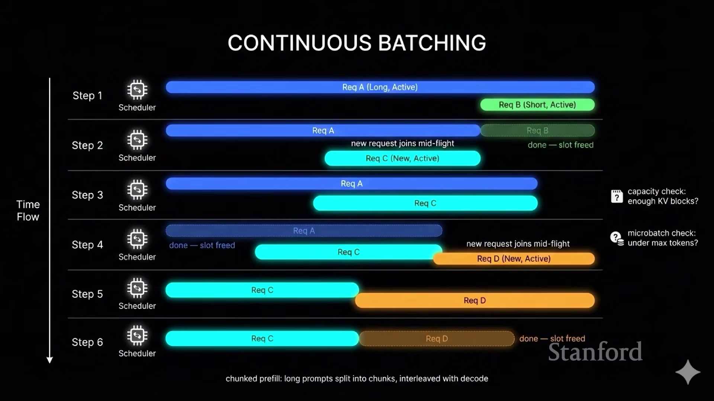

*图 4：请求在不同 step 加入或完成，调度器同时检查 KV block 容量和 microbatch token 数；长 prefill 还可以切块后与 decode 交错。（视频时间：00:16:31--00:18:02）*

Continuous batching 的难点不是把更多请求塞进同一批，而是在每个调度步同时满足计算容量、KV Cache 显存和请求延迟目标。

### 2.5 KV Cache：少算与多占显存的交换

Attention 需要历史 token 的 key/value 状态。KV Cache 保存这些状态，使下一轮追加内容时不必重算整个前缀。

这产生两种复用：

- 单会话增量复用：长书已经 prefill，下一轮只计算新问题；
- 跨请求前缀共享：多个请求使用相同 system prompt，可共享公共前缀块。

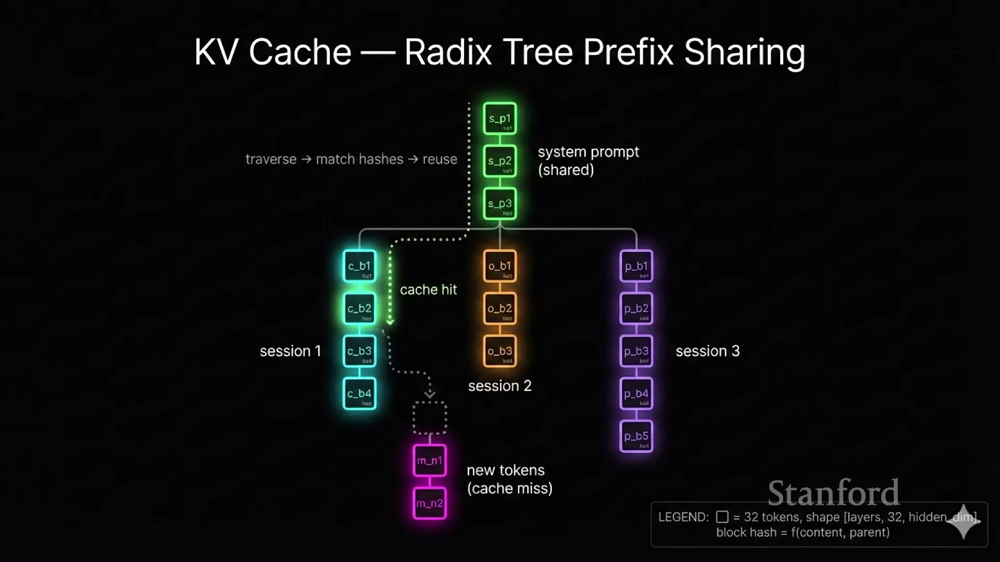

*图 5：系统沿 radix tree 匹配共享 system prompt 和会话前缀；命中的 KV block 可复用，只为新 token 计算缺失后缀。小块名称为示意标签。（视频时间：00:18:02--00:19:00）*

> [!IMPORTANT]
> KV Cache 同时带来“少算”和“多占显存”。上下文越长、并发会话越多，缓存越可能先于 FLOPs 成为容量瓶颈。

### 2.6 模型并行与 prefill/decode 解耦

超大模型装不进单张 GPU 时，需要跨卡切分。讲者区分了两类常见方式：

- Tensor parallelism：把张量和矩阵运算拆到多张卡；
- Expert parallelism：在 MoE 中把不同 expert 放到不同 GPU。

切分方式决定最少需要多少 GPU、通信瓶颈在哪里，以及可以同时保留多少 session。更进一步，prefill 和 decode 的资源特性不同，因此可以放到不同 worker pool：

- prefill workers 为批量算力优化；
- decode workers 为低延迟和内存带宽优化；
- 两边可采用不同调度、并行甚至硬件。

### 2.7 规模化可靠性：小概率不是零

当系统每天处理巨量 token 时，触发率极低的错误也会持续发生。若一次相关操作的故障概率为 $p$，执行 $N$ 次，则期望故障数为：

$$
\mathbb{E}[\text{failures}] = Np.
$$

- $p$：单次相关操作触发错误的概率。
- $N$：系统执行该操作的总次数。
- $\mathbb{E}[\text{failures}]$：期望出现的故障次数。

讲者给出三类生产症状：

1. kernel 的稀有数值错误让 logits 出现 NaN，模型可能开始重复同一个 token；
2. tool-call 结束或合并逻辑出错，使模型不断请求同一工具，产生数万 token 的 doom loop；
3. kernel 的 off-by-one 错误读入未初始化显存，污染 attention 状态，偶然生成一个中文字符；自回归模型随后把这个字符当成上下文线索，整段输出可能偏转到中文。

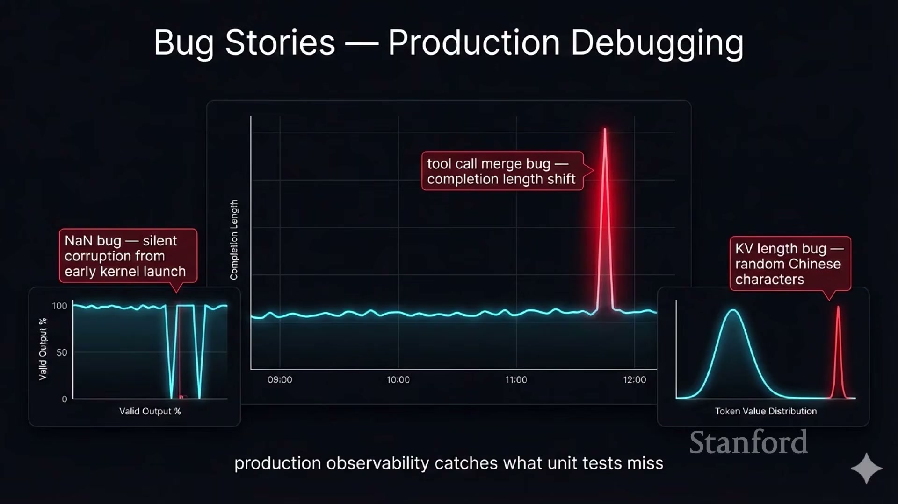

*图 6：有效输出率骤降、completion length 突增和 token 值分布异常，分别提示不同的 kernel 或运行时故障。（视频时间：00:21:52--00:25:27）*

> [!WARNING]
> 异常文本不能自动归因于训练数据、量化或“模型人格”。重复 token、工具调用失控、随机语言切换，都可能是 serving kernel、状态机或内存错误的外在症状。

### 本章小结

推理系统的正确起点是 workload，而不是某个孤立 benchmark。workload 决定 TTFT、TBT 和吞吐目标；prefill 与 decode 又因算力和带宽性质不同而需要不同优化；continuous batching 与 KV Cache 把调度变成动态资源分配；大规模服务还要求从可观测性中识别极低概率的系统错误。

## 三、把 KV Cache 当成分层存储系统

### 3.1 GPU、CPU 与 SSD 的冷热层级

生产服务希望保留尽可能多的会话状态，但 GPU HBM 有限，于是 KV Cache 自然形成分层：

1. GPU HBM：最快、最小、最昂贵，保存 hot blocks；
2. CPU DRAM：更大但更慢，保存 warm blocks；
3. NVMe/更远存储：容量最大、回迁最慢，保存 cold blocks。

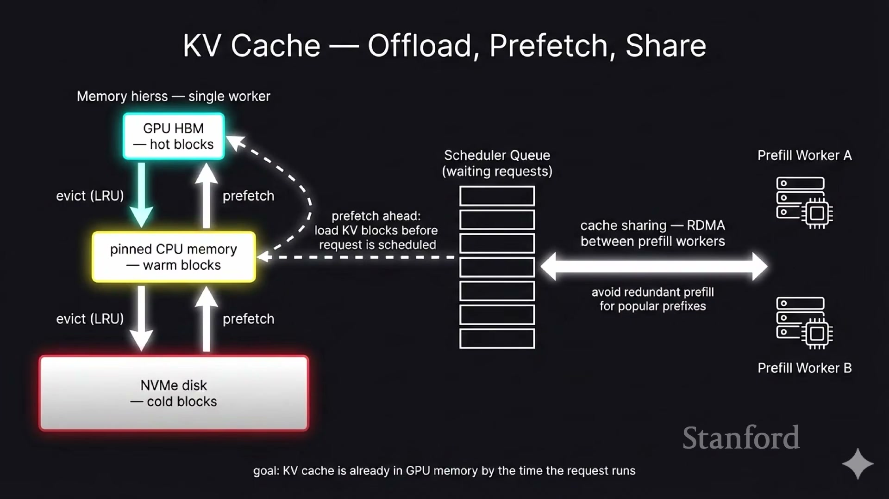

*图 7：KV block 在 GPU HBM、pinned CPU memory 和 NVMe 之间逐出或预取；请求真正执行前，希望相关 KV 已回到 GPU。页内 “Memory hierss” 等拼写来自讲者提醒过的 AI 生成图，不影响口述确认的层级机制。（视频时间：00:25:31--00:29:28）*

昂贵 GPU 仍可能被便宜得多的 CPU 或慢存储卡住。端到端吞吐由最慢的数据路径决定，单纯增加 GPU 算力不会自动消除 host 侧瓶颈。

### 3.2 这是操作系统 paging 问题的新版本

讲者把 KV 迁移类比为经典虚拟内存：

- 快层放不下时要 eviction；
- 无法预测未来时可用 LRU 等启发式；
- 如果能观察到行为信号，就可以 prefetch。

例如，用户在界面里打开一个月前的旧会话，往往意味着即将继续提问。系统可以在用户真正发送消息前，把该会话的 KV 从慢层搬回 GPU。

目标并不是让所有请求永远命中 HBM，而是在满足 SLA 的前提下，用固定 GPU footprint 承载更多流量。低延迟请求、可预测复用请求和一次性批处理请求，不应采用同一种 offload 策略。

### 3.3 Cache-aware prefill-decode disaggregation

讲者展示的系统优化案例是 Cache-aware Prefill-decode Disaggregation（CPD）。关键观察是在线请求并不均质：

- 冷请求：全新会话、低 cache hit、长 prompt，需要大量 prefill；
- 暖请求：已有会话、高 cache hit，只追加很短的新问题。

若平均每个会话有 $T$ 轮，每个会话只在第一轮冷启动，则冷请求占比可粗略估为：

$$
p_{\mathrm{fresh}} \approx \frac{1}{T}.
$$

- $p_{\mathrm{fresh}}$：新会话请求的近似比例。
- $T$：一个会话的平均轮数。
- 当 $T=10$ 时，解释性估算约为 $10\%$；这不是所有产品的固定统计。

路由逻辑可以结构化为：

~~~python
if cache_hit_rate(request) is low:
    route(request, cold_prefill_gpu_pool)
else:
    route(request, warm_request_gpu_pool)
~~~

这不是视频中的源代码，而是对讲者所说“两行 routing logic”的忠实重写。它把长 prefill 和短增量请求分开，减少大请求对低延迟请求的干扰。

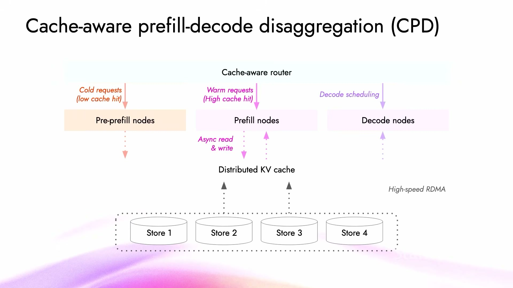

*图 8：cache-aware router 把低命中冷请求、高命中暖请求与 decode 调度分配到不同节点，并通过分布式 KV Cache 连接。（视频时间：00:31:42--00:33:30）*

讲者报告该工作在其测试中最高约 **40% faster serving**。字幕和画面没有给出足够完整的硬件、流量和指标口径，因此应把它理解为该工作在特定设置下的结果，而不是普适承诺。

> [!IMPORTANT]
> 这个案例的价值不在代码短，而在路由器看到了 cache hit rate 这个关键特征。系统级收益常常来自正确划分工作负载，而不只是把单个 kernel 再加速一点。

### 3.4 更大互连域带来的开放问题

当 64 或 72 张 GPU 被高速互连成一个大计算域，问题也随之扩大：

- trillion-parameter 模型怎样切分；
- 单张 GPU 或连接器失效时怎样继续服务；
- 百万 token 上下文怎样跨卡分布；
- KV Cache、模型权重与通信怎样共同预算；
- 容错开销是否会吞掉扩展收益。

这些问题说明，推理研究正在重新遇到分布式系统、存储和容错中的经典主题，只是数据对象变成了模型权重、activation 与 KV block。

### 本章小结

KV Cache 管理本质上是数据局部性问题：越快的存储越小，越大的存储越慢。offload、eviction、prefetch 与跨 worker 共享必须围绕请求复用概率和 SLA 设计。CPD 进一步说明，请求的缓存冷热本身就是调度特征，合理路由可以获得远大于代码复杂度的系统收益。

## 四、Megakernel：从逐算子执行到全局依赖调度

### 4.1 Decode 为什么会把 GPU 变成“内存搬运器”

Decode 每生成一个 token 都要再走一遍模型。与训练或长 prefill 能充分展开并行矩阵计算不同，batch size 较小时的 decode 算术强度很低，却要不断读取权重。讲者因此把 GPU 形容成：

> [!QUOTE]
> **Dan Fu（00:34:54--00:35:03）**：“a glorified memory loader.”

传统实现通常为 normalization、matmul、attention 等算子分别写 kernel。这种模块化降低了编程难度，但带来两类结构性空洞：

- kernel launch 与 teardown 之间的 gap；
- tail effect：不同处理单元工作长度不同，短任务完成后只能等最慢任务。

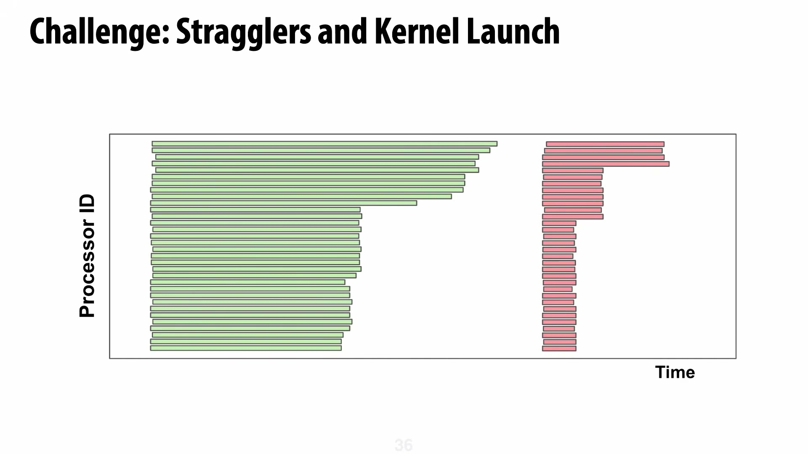

*图 9：纵轴是处理单元，横轴是时间；绿色和红色 kernel 之间存在 launch gap，同一 kernel 内也有长短不齐的 tail。（视频时间：00:36:03--00:37:32）*

> [!IMPORTANT]
> 单个 kernel 已经很快，不代表端到端模型很快。只要 kernel 边界强制切断了本可重叠的工作，全局利用率仍会受限。

### 4.2 读懂 Megakernel 所需的最小 CUDA 执行模型

先把几个容易混用的层级固定下来。一个 **kernel** 是在 GPU 上运行的一段程序；启动 kernel 时会产生一个 grid，grid 被切成多个 **thread block**。每个 block 被调度到某个 SM 上，block 内线程再以 **warp** 为基本执行组；在 NVIDIA GPU 上，一个 warp 通常含 32 个线程。同一 warp 的线程共同推进指令，不同 warp 则可在等待数据时交错执行。

数据所在的位置决定等待有多贵：

- **register** 是每线程私有的片上状态，容量最小、访问最快；
- **shared memory** 是同一 block 可协作使用的片上 SRAM，适合存 tile、partial sum 和 softmax 统计量；
- **HBM** 容量大，却要经过更长的数据通路，decode 的权重和 KV Cache 主要存放于此；
- warp 内可用 shuffle 等原语交换数据，block 内可用 barrier 同步；普通 block barrier 不能让不同 block 全局同步。

用一个具体但仅用于教学的 attention decode 形状来标注这些边界。设 BF16、batch size 为 1、32 个 heads、每个 head 维度 128、历史长度 4096：

$$
Q\in\mathbb{R}^{1\times32\times1\times128},\qquad
K,V\in\mathbb{R}^{1\times32\times4096\times128}.
$$

- $Q$：当前 token 的 query，约 8 KiB。
- $K,V$：历史 KV Cache；BF16 下各约 32 MiB。
- 1：batch size，也表示当前 decode 步只有一个 query token。
- 32：attention head 数。
- 128：每个 head 的维度。
- 4096：已经缓存的历史 token 数。

这一步仅 KV Cache 的理论读取量就约为：

$$
M_{KV}=2BH Ld_hb=64\ \mathrm{MiB}.
$$

- $M_{KV}$：一次 decode attention 对 K、V 的合计读取量。
- $B=1$：batch size。
- $H=32$：head 数。
- $L=4096$：历史长度。
- $d_h=128$：head dimension。
- $b=2$ bytes：BF16 每元素字节数。
- 系数 2：K 与 V 两份缓存。

一个典型的 tiled attention kernel 可以让一个 block 负责一个 head 或其中一段 token tile。各 warp 协作从 HBM 读入一小块 K/V，在 registers/shared memory 中完成 $QK^\top$、局部最大值与指数和、再累积 $PV$；最终只向 HBM 写约 8 KiB 的输出 $O\in\mathbb{R}^{1\times32\times1\times128}$。下面的表把 Megakernel 想隐藏的空档具体化：

| 阶段 | 主要读写 | 必须等待什么 | 可以与什么重叠 |
|---|---|---|---|
| 读取第 $r$ 个 K/V tile | HBM → shared/register | 目标 buffer 可写 | 其他 warp 对第 $r-1$ 个 tile 做点积、softmax 更新与 $PV$ |
| tile 内 $QK^\top$ 与归约 | register/shared | 协作 load 完成；warp/block 内归约同步 | load/store workers 预取第 $r+1$ 个 tile |
| 在线 softmax 与 $PV$ | register/shared | 当前 score 与统计量 ready | 预取后续 KV；准备不依赖 attention 输出的元数据 |
| 写 attention 输出 | register → HBM 或片上后继 buffer | 所有 token tiles 的归约完成 | 可提前读取 O-projection 权重，但不能提前计算依赖尚未完成的输出 |

同步点同样分层：warp 内归约只约束一个 warp；多个 warp 共同消费 shared-memory tile 前需要 block barrier；不同 blocks 若要合并 head/tile 结果，需要原子计数、带内存顺序的 ready flag、persistent scheduler 协议，或退回 kernel 边界提供的全局完成点。Megakernel 扩大调度域的价值，正是把“下一 kernel 才能开始的全局栅栏”改成更细的 ready 条件，但它并没有删除同步和内存一致性。

> [!IMPORTANT]
> 在这个例子里，真正值得重叠的是 **HBM 搬运与已经 ready 的片上计算**。历史 KV 尚未到达时不能计算对应 score；attention 输出尚未归约完成时也不能执行依赖它的 O projection。Megakernel 优化的是依赖图中的空隙，不是数学依赖本身。

### 4.3 Megakernel 的核心是扩大调度域

Megakernel 把多个原本分立的操作放进一个大 kernel，统一观察依赖和资源。它与 FlashAttention 的 fusion 思想相似，但范围更大：

- 单个 kernel 端到端调度多类 workload；
- 以细粒度依赖决定哪个子任务 ready；
- 用一个任务的可执行部分填补另一个任务的等待；
- 消除部分 kernel launch 开销。

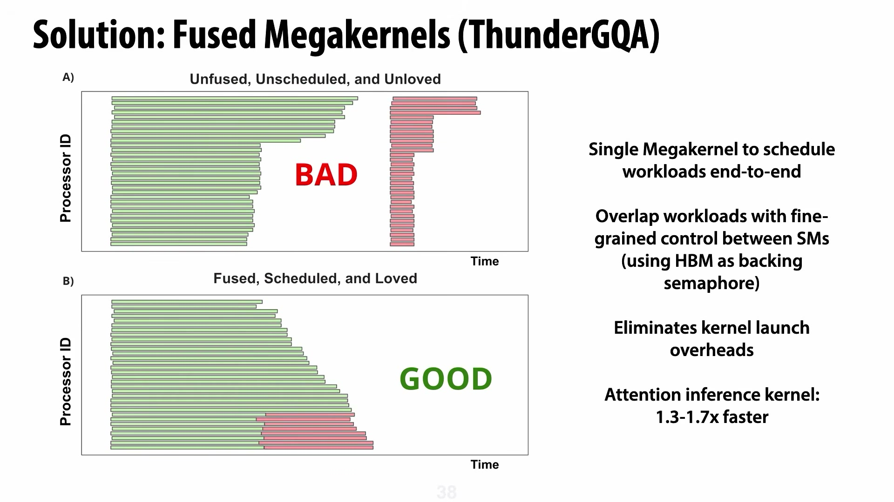

*图 10：上图的两个 workload 被大空档分开；下图在一个 Megakernel 中细粒度重叠。该 attention inference kernel 的幻灯片结果为 1.3--1.7× 加速。（视频时间：00:37:32--00:38:23）*

讲者给出的概念变化很重要：不要只把 GPU 看成“一次执行一个大操作的设备”，而应把它看成拥有许多执行单元、需要依赖感知调度的分布式系统。

### 4.4 把整个 Llama-1B layer 放进一个 kernel

团队把这种思路从 attention 扩展到整层乃至 whole-model Megakernel。此时不同颜色代表 QKV、attention、output projection 和 FFN 等子任务，传统算子边界不再是唯一调度边界。

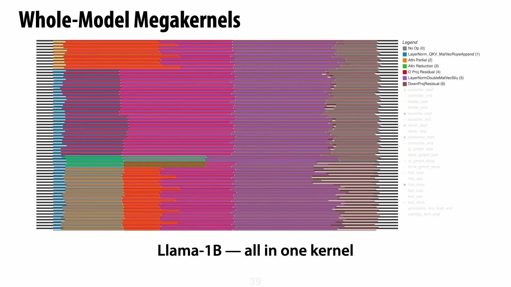

*图 11：Llama-1B 的多类操作被放进同一 kernel；颜色交叠表示全局调度器在真实依赖允许时并行准备或执行工作。（视频时间：00:38:31--00:39:03）*

这里不能误解为“随意乱序执行 Transformer”。Megakernel 仍遵守数学依赖，只是把可提前做的数据搬运和准备工作提早：

- QKV + RoPE 尚未完全结束时，可以先加载历史 KV Cache；
- attention 尚未结束时，可以先加载 O projection 的权重；
- 后继矩阵乘本身仍要等输入 ready，但其数据准备不必等待。

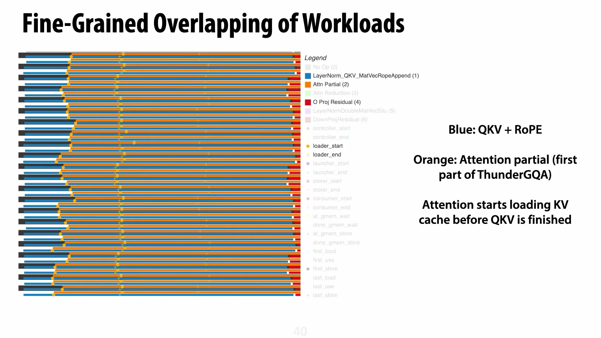

*图 12：蓝色是 QKV + RoPE，橙色是 attention 前部；KV Cache 的加载在 QKV 全部完成前已经开始，从而隐藏部分内存延迟。（视频时间：00:39:03--00:39:58）*

> [!WARNING]
> “重叠操作”不等于忽略数据依赖。被提前的是已经具备条件的 load、prefetch 或局部工作，而不是尚未获得输入的后继计算。

### 4.5 ThunderKittens 与性能上限

实现这类调度需要比高层推理 API 更细的控制。讲者介绍了团队的 ThunderKittens kernel-writing library：

- sub-kernel 可以独立组织；
- instruction-based abstraction 描述可调度工作；
- load/store workers 与 compute workers 协作；
- 虚拟化 shared-memory 结构协调数据。

它在定位上可与 Triton 类比，但更低层、更依赖硬件知识，也更难开发。

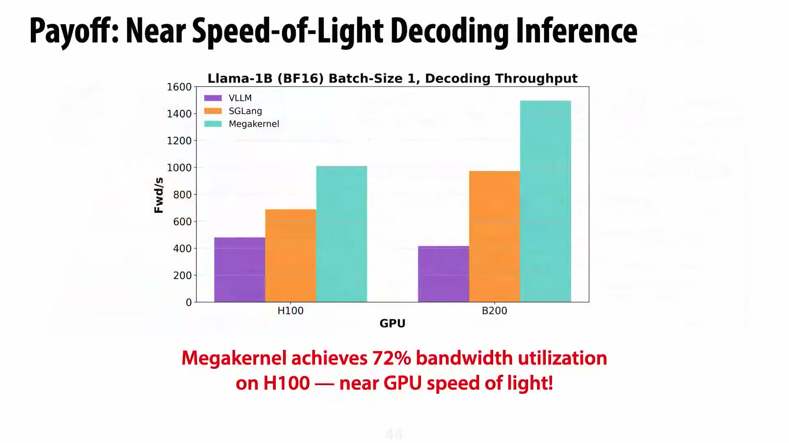

*图 13：Llama-1B、BF16、batch size 1 的 decode 吞吐比较；幻灯片称 Megakernel 在 H100 上达到约 72% 带宽利用率，并在 H100/B200 上高于图中的 vLLM 与 SGLang。（视频时间：00:40:56--00:41:31）*

“speed of light”是讲者对硬件带宽上限的比喻。72% 指特定设置下的 bandwidth utilization，不是 GPU occupancy、FLOP 峰值利用率或通用端到端效率。

### 4.6 极致性能的代价

问答中有人直接询问 Megakernel 的 trade-off。讲者的回答是：

> [!QUOTE]
> **Dan Fu（01:03:37--01:03:44）**：“blood, sweat, and tears.”

他的量化例子是：一名优秀 kernel 工程师花一年，可能只能覆盖一种硬件、两三个模型和 batch size 1--16；batch size 17 都可能需要大量重做。Compiler 自动化值得研究，但当前仍很困难。

因此 Megakernel 的真实选择题不是“更快好不好”，而是：

- 性能收益是否足够大；
- 目标模型和 shape 是否稳定；
- 硬件是否值得长期绑定；
- 人力、验证和维护成本是否可承受。

### 本章小结

Megakernel 解决的是执行模型的边界问题：逐算子 kernel 让可编程性更好，却把全局调度切碎；扩大调度域后，系统可以让 warp/block 级片上计算与 HBM load 更充分地重叠，填补 tail 并减少 launch gap。它不能绕过 block 间同步、ready 条件与真实数据依赖。它能逼近硬件上限，但越接近极致性能，方案往往越专用、越昂贵、越难覆盖变化的模型与 batch shape。

## 五、Parcae：把“重复计算”变成新的模型尺度

### 5.1 参数与数据之外，还能怎样 scale

讲者的第二个研究项目是 Parcae，一种 principled looped Transformer。传统 Transformer 每层有独立参数；looped Transformer 让 activation 多次经过同一组共享 block。

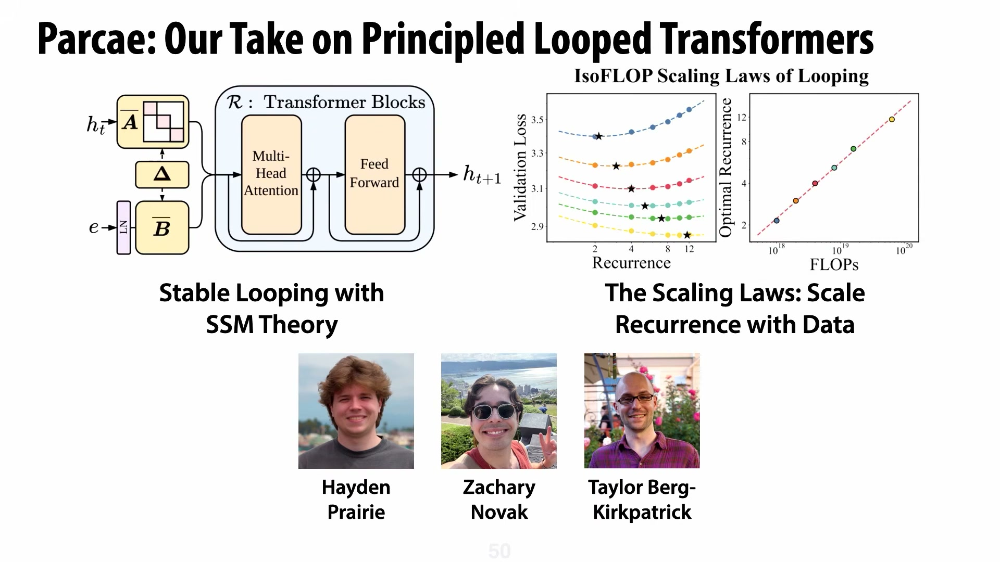

*图 14：左侧是用 SSM 理论稳定循环，右侧是 recurrence 与 FLOPs 的 scaling law；Parcae 把共享 block 的重复次数变成独立设计轴。（视频时间：00:42:32--00:43:29）*

循环带来三个动机：

1. 参数量固定时，可以增加 FLOPs；
2. 相同参数可能通过重复复合获得更高表达力；
3. 更少独立参数可能改善 quality/intelligence per parameter。

但参数不增加不代表计算免费。更多 recurrence 会增加训练 FLOPs 和推理 latency，它是在参数存储与重复计算之间重新分配预算。

### 5.2 朴素循环为什么训练不稳定

讲者展示的学习率 sweep 非常敏感：此前的 Recurrent Depth Model（RDM）在许多设置下不收敛、出现 NaN 或明显 loss spike；简单地在每层加 normalization，只在部分学习率上能跑，并没有解释失稳原因。

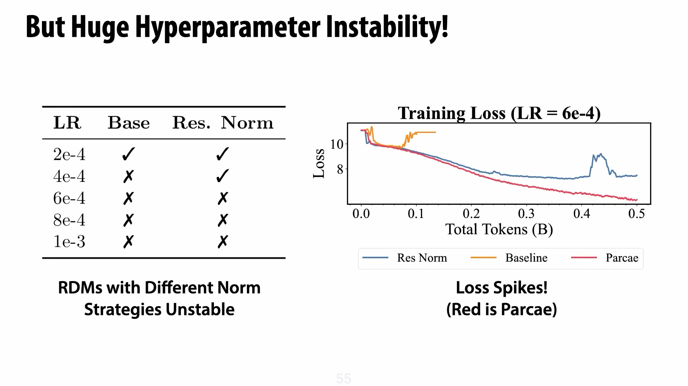

*图 15：RDM baseline 与 residual normalization 在多个学习率下失败；6e-4 时蓝线出现明显 loss spike，而 Parcae 红线保持下降。（视频时间：00:45:38--00:46:39）*

> [!IMPORTANT]
> 问题不是找到一个“刚好能跑”的学习率，而是解释共享变换反复作用时，状态为什么会放大，以及怎样从结构上阻止这种放大。

### 5.3 把复杂 Transformer 抽象成残差动力系统

Attention、RoPE、GELU 和 FFN 都是复杂非线性。团队没有直接展开每个细节，而是把 Transformer block 统一记为非线性算子 $\overline{\mathcal R}$，单独分析循环之间的残差状态。

讲者幻灯片给出的动力系统为：

$$
h_{t+1}
=
\overline{A}h_t
+
\overline{B}e
+
\overline{\mathcal R}(h_t,e).
$$

- $h_t$：第 $t$ 次循环的 residual state。
- $e$：进入循环的初始输入，经 LayerNorm 后注入。
- $\overline{A}$：每轮对当前 residual state 的线性状态转移。
- $\overline{B}$：对初始输入的线性注入。
- $\overline{\mathcal R}(h_t,e)$：由共享 Transformer blocks 产生的复杂非线性更新。

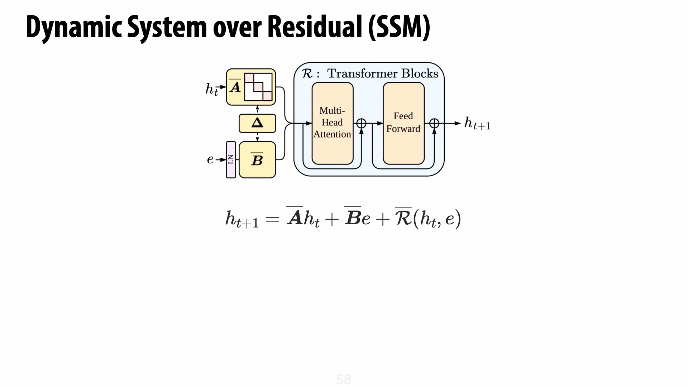

*图 16：复杂 Transformer blocks 被封装为非线性算子，线性状态转移 $\overline A$ 和输入注入 $\overline B$ 被显式暴露出来。（视频时间：00:47:46--00:49:01）*

这个抽象不意味着非线性不重要，而是先隔离一个更容易分析、又可能直接控制数值量级的骨架。

### 5.4 线性化后，高次幂暴露稳定性根因

若为了诊断暂时去掉复杂非线性，系统变为：

$$
h_{t+1}
=
\overline{A}h_t
+
\overline{B}e.
$$

- $h_{t+1}$：下一次循环状态。
- $\overline A h_t$：上一状态经过一次转移后的贡献。
- $\overline B e$：每轮注入的输入贡献。

幻灯片给出的闭式解为：

$$
h_{t+1}
=
\overline{A}^{\,t}h_1
+
\left(
\sum_{n=0}^{t-1}\overline{A}^{\,n}
\right)
\overline{B}e.
$$

- $t$：已经进行的循环步数。
- $h_1$：初始循环状态。
- $\overline A^{\,t}$：状态转移被重复复合 $t$ 次。
- $\sum_{n=0}^{t-1}\overline A^{\,n}$：历次输入注入在状态转移下的累计。

危险项正是 $\overline A$ 的高次幂。若把它简化成标量 2，循环 16 次就会产生：

$$
2^{16}=65{,}536.
$$

- 2：每一步在某个方向上的放大倍数。
- 16：循环次数。
- 65,536：重复复合后的总放大量。

矩阵情形的关键量是谱半径：

$$
\rho(\overline A)
=
\max_i\left|\lambda_i(\overline A)\right|.
$$

- $\lambda_i(\overline A)$：$\overline A$ 的第 $i$ 个特征值。
- $\rho(\overline A)$：所有特征值绝对值的最大值，刻画长期线性动态的最大渐近放大率。

*图 17：闭式解中被红框标出的 $\overline A$ 高次幂控制长期量级；addition 是边际稳定，普通 concatenation 的状态转移可能不稳定。（视频时间：00:49:24--00:51:08）*

> [!WARNING]
> 讲者口头把 spectral radius 类比成“另一种 norm”，只能当直觉。谱半径是最大特征值绝对值，矩阵范数是另一类量；两者相关但一般不相等。

#### 一个 2×2 例子：渐近稳定不等于每一步都缩小

下面这个非正规矩阵能把三类概念明确分开：

$$
A=
\begin{bmatrix}
0.9 & 10\\
0 & 0.9
\end{bmatrix}.
$$

- $A$：一个带强上三角耦合的 $2\times2$ 状态转移矩阵。
- 两个对角元素 0.9：也是 $A$ 的两个特征值。
- 非对角元素 10：让两个状态方向强烈耦合，但不改变特征值。

它的两个特征值都是 0.9，因此谱半径为：

$$
\lambda_1(A)=\lambda_2(A)=0.9,\qquad \rho(A)=0.9<1.
$$

- $\lambda_1,\lambda_2$：特征值，描述特征方向上的线性缩放；这个例子是缺陷矩阵，只有一个独立特征向量。
- $\rho(A)$：特征值绝对值的最大值，决定线性齐次系统 $h_{t+1}=Ah_t$ 的长期渐近速率。

但矩阵范数回答的是另一个问题：一步之内，最坏方向最多可能被放大多少。取单位向量 $e_2=[0,1]^\top$，就有：

$$
\|A\|_2\geq\|Ae_2\|_2
=\sqrt{10^2+0.9^2}
\approx10.04.
$$

- $\|A\|_2$：诱导 2-范数，也就是一步最大奇异值放大率。
- $e_2$：第二个坐标方向的单位向量。
- $\|Ae_2\|_2$：这个具体方向经过一步后的长度，已超过 10。

所以同一个 $A$ 可以同时满足 $\rho(A)=0.9$ 和 $\|A\|_2>10$。更直观地，它的高次幂为：

$$
A^t=
\begin{bmatrix}
0.9^t & 10t\,0.9^{t-1}\\
0 & 0.9^t
\end{bmatrix}.
$$

- $t$：离散循环步数。
- $0.9^t$：最终会指数衰减的对角项。
- $10t\,0.9^{t-1}$：先受线性因子 $t$ 推高、长期再被指数衰减压下的 transient 项。

例如 $t=10$ 时，$A^{10}e_2$ 的第一分量约为 $100\times0.9^9\approx38.7$：状态可在有限循环中从 1 放大到接近 39；但当 $t\to\infty$，$t0.9^{t-1}\to0$，所以 $A^t\to0$。这叫 **finite-step transient growth** 与 **长期渐近稳定** 并存。Parcae 的循环次数有限，训练又会反向传播梯度，因此只看无穷远结论可能漏掉实践中足以触发 overflow 或 loss spike 的中途峰值。

> [!WARNING]
> 对线性、时不变、无外力的系统，$\rho(A)<1$ 能推出 $A^t\to0$；它不能单独推出完整的非线性训练系统稳定。原模型还有 $\overline{\mathcal R}(h_t,e)$、持续输入 $\overline Be$、LayerNorm、有限精度，训练时参数和 $A$ 也在被优化器更新。局部线性化的真实 Jacobian 是 $A+\partial\overline{\mathcal R}/\partial h$；若要给出更强的收缩保证，需要控制相关状态区域内 Jacobian 的诱导范数或非线性 Lipschitz 常数，并另外分析梯度与优化器动态。Parcae 的 $\rho(\overline A)<1$ 是重要结构条件和实验上有效的设计，不是整个训练过程的充分定理。

### 5.5 Parcae 从参数化层面保证稳定

Parcae 的选择不是等激活爆炸后再强制归一化，而是约束状态转移本身：

- 用具有负对角生成结构的参数化构造 $\overline A$；
- 通过 ZOH（zero-order hold）得到离散转移；
- 约束输入注入 $\overline B$；
- 使 $\rho(\overline A)<1$，让线性系统处于稳定区间。

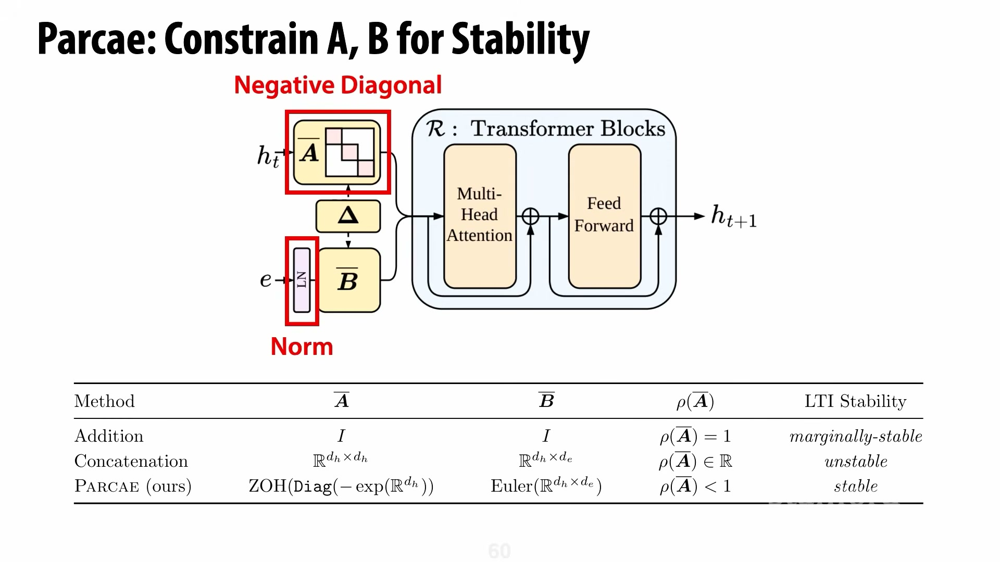

*图 18：Parcae 用负对角结构和输入 norm 约束构造稳定的 $\overline A,\overline B$；表格明确给出 $\rho(\overline A)<1$ 与 stable。（视频时间：00:51:11--00:51:55）*

这种方法与“每轮把激活压回单位范数”有本质区别。后者让模型扩大表示空间的趋势与 normalization 回拉持续对抗，仍可能出现 loss spike；前者改变了产生状态演化的机制。

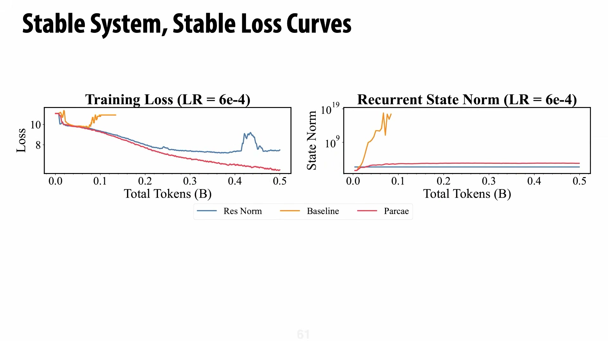

*图 19：6e-4 学习率下，未约束 baseline 的 recurrent state norm 上升到约 $10^{19}$；Parcae 的 loss 和 state norm 保持稳定，residual normalization 仍出现后期尖峰。（视频时间：00:51:55--00:53:16）*

### 5.6 稳定性没有牺牲质量

幻灯片的 100M 与 350M 对比中，Parcae 相对 RDM：

- 100M：平均分从 45.03 提升到 46.83；
- 350M：平均分从 49.45 提升到 50.12；
- 同时在验证损失、WikiText 和多数下游任务上占优，但并非每一列都绝对更好。

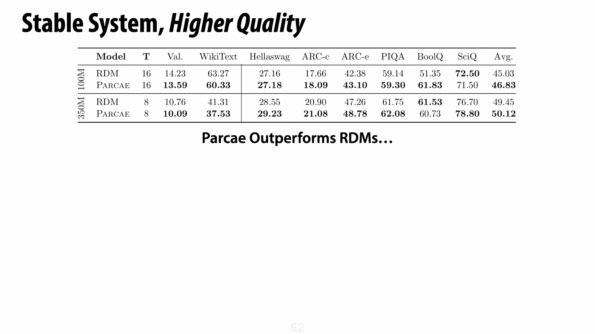

*图 20：Parcae 在 100M/350M、相同循环次数的比较中获得更好的平均结果；粗体标出各列较优值。（视频时间：00:53:26--00:54:10）*

这支持一个重要结论：稳定约束去掉的是无效的数值爆炸自由度，不一定削弱任务所需的有效表达能力。

### 本章小结

Parcae 把共享 block 的重复执行变成新的计算尺度，但循环也把模型变成动力系统。在线性齐次近似里，谱半径描述长期渐近行为，诱导矩阵范数与 $A^t$ 则能暴露有限步 transient growth；$\rho(A)<1$ 本身不是完整非线性训练系统稳定的充分条件。Parcae 通过稳定参数化从源头限制状态转移，比事后 normalization 更根本；实验表明，这种设计不仅减少 loss spike，也能提升模型质量。

## 六、Recurrence scaling law：数据越多，应该循环得越深吗

### 6.1 从二维 scaling law 到第三个尺度轴

经典 scaling law 讨论：给定更多训练预算，应该增加参数还是增加数据？Parcae 加入第三个变量——recurrence。于是问题变成：

- 参数量增加多少；
- 数据量增加多少；
- 共享 block 应重复多少次。

在 iso-parameter / iso-FLOP 实验中，讲者展示 140M 和 370M 两种模型的验证损失随 recurrence 的 U 形曲线。黑色星号是每个 FLOP 预算下的最佳循环次数。

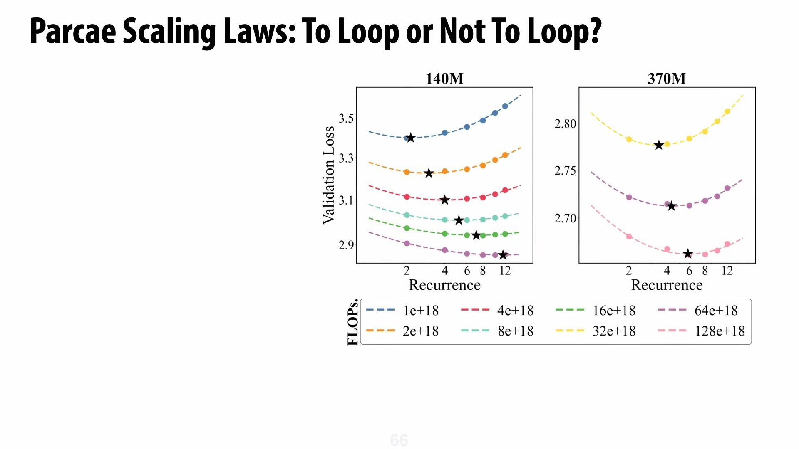

*图 21：随着 FLOP 预算/数据增加，最佳 recurrence 的黑色星号整体向右移动；两种参数规模都出现相同趋势。（视频时间：00:55:48--00:57:15）*

核心观察是：

> [!QUOTE]
> **Dan Fu（00:56:45--00:57:00）**：“As you increase the amount of data, you should actually also be increasing the amount of recurrences.”

这不是说 recurrence 越多越好。每条曲线都有最佳点，过少无法充分复用参数，过多则浪费计算或伤害优化。

### 6.2 等 FLOPs 下，循环与“只喂更多数据”的比较

讲者进一步固定参数规模和训练 FLOPs，对比：

- fixed-depth：保持 recurrence 为 1，把预算主要用于更多数据；
- optimal looping：按 scaling law 选择 recurrence。

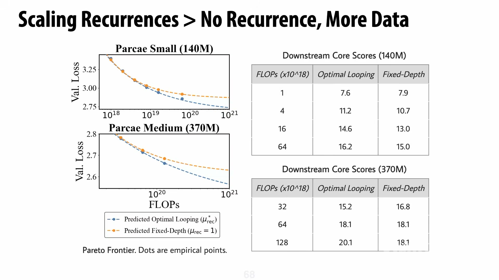

*图 22：对 140M 和 370M 模型，预测的 optimal looping Pareto frontier 在较大 FLOP 区域获得更低验证损失；右侧列出下游 core scores。（视频时间：00:58:36--00:59:27）*

在图示较大预算下，蓝色 optimal looping 曲线低于橙色 fixed-depth 曲线，表明把一部分预算用于重复精炼状态，可能比只增加训练 token 更有效。

### 6.3 应怎样理解这个结果

> [!IMPORTANT]
> 这是初步 scaling-law 证据，不是“所有大模型都必须循环”的定理。更稳妥的结论是：recurrence 值得成为 compute-optimal 配置搜索中的独立轴。

现实含义有三层：

1. 参数相同不意味着计算路径必须相同；
2. 当模型大小受部署约束时，recurrence 提供了增加计算深度的方式；
3. 当前主流模型大多位于显式共享块循环很少的区域，可能尚未探索最佳参数复用点。

但模型、数据、优化器、上下文长度和推理 workload 都可能改变最佳 recurrence，不能从小规模曲线直接外推到任意 frontier model。

### 本章小结

Parcae 把 scaling law 从“参数 × 数据”扩展为“参数 × 数据 × recurrence”。实验趋势显示，在固定参数规模下，数据和训练 FLOPs 增加时，最佳循环次数也上升；等 FLOPs 比较进一步显示，合理循环可能优于只增加数据。这个结论的价值是打开搜索空间，而不是提前宣布唯一架构。

## 七、问答中的全栈设计原则

### 7.1 预训练模型能否直接重复几层

观众问 Parcae 是否必须从头训练。讲者提到一个观察性结果：有人在现有模型中重复运行两三层，没有重新训练，却让部分数学任务变好。团队正在检查 activation 和 weight 以理解原因。

讲者对此的态度是好奇而谨慎：

> [!QUOTE]
> **Dan Fu（01:01:31--01:01:42）**：“It disturbs me.”

不能把这个例子推广成“任意模型重复层都会变强”。它更像一个值得解释的反常现象：固定参数、只改变计算路径，也可能改变能力。

### 7.2 少参数的推理收益来自跨过显存阈值

循环模型的价值不只是训练 scaling。更少独立参数意味着权重占用更少，可能：

- 为 KV Cache 留出更多显存；
- 让模型从多卡缩到更少卡；
- 减少跨卡通信；
- 让小 recurrent block 被一个紧凑 Megakernel 覆盖；
- 让权重常驻更高层级的高速内存。

显存预算可以用下面的教学式表达：

$$
M_{\mathrm{weights}}
+
M_{\mathrm{KV}}
+
M_{\mathrm{runtime}}
\le
M_{\mathrm{device}}.
$$

- $M_{\mathrm{weights}}$：独立模型参数占用。
- $M_{\mathrm{KV}}$：并发会话的 KV Cache 占用。
- $M_{\mathrm{runtime}}$：activation、临时 buffer 和运行时开销。
- $M_{\mathrm{device}}$：目标设备可用内存。

收益常常是非线性的：模型一旦刚好能从多卡变单卡，或 block 刚好能常驻片上内存，延迟与通信会突然下降。

### 7.3 从目标硬件反推模型

当最终平台是 NVIDIA、AMD、Groq 或 Cerebras 等不同硬件时，讲者建议按如下顺序设计：

1. 先看设备内存；
2. 决定模型大小并为 KV Cache 留空间；
3. 再选择硬件原生支持的数值格式；
4. 根据通信和 kernel 能力调整架构。

他用 NVFP4 与 MXFP4 说明：量化格式并非抽象数学标签，而与目标芯片的硬件路径绑定。关于部分中国模型可能针对 Huawei 芯片选择量化格式，讲者明确是在做观察性推测，不能写成已证实因果。

### 7.4 Compute-optimal 永远附带约束

观众问，应该增加 recurrence 还是增加独立参数。讲者的回答不是二选一，而是先问约束是什么：

- 固定 FLOP budget 时，怎样分配参数、数据和循环；
- 模型尺寸已固定时，是否训练更久；
- 部署尺寸受限时，是否用 loop 增加深度；
- 数据有限时，模型多大才不会训练不足；
- 开源发布时，用户设备能否运行。

若没有部署或尺寸限制，更多参数与更多数据通常仍能提高质量。Recurrence 的优势来自额外约束下的预算重分配。

### 7.5 Workload 决定注意力与缓存架构

Agentic coding 会反复回到同一上下文，因此需要：

- 尽可能保持 KV Cache hot；
- 用 MLA 或低精度降低 KV 容量压力；
- 优化连续 decode。

一次性批处理则不同。例如只做文档编码或检索，可用 non-causal/bidirectional attention 一次处理输入并保存向量；对话工作流必然包含自回归 decode；T5 的 encoder-decoder 是两者之间的一种折中。

> [!IMPORTANT]
> 没有一种架构在所有 workload 上都最优。上下文是否复用、是否需要生成、KV Cache 压力和延迟目标，都会改变模型设计点。

### 7.6 Megakernel 与多 GPU 通信

最后一个问题是：多 GPU 的 NCCL 通信能否进入 Megakernel？

讲者回答：

- NCCL call 可以在正确设置下融合进 Megakernel；
- 通信调用自身的物理延迟仍可能成为下限；
- 团队有早期探索，但尚未找到足够强的通用 use case；
- 更现实的趋势是为模型局部写小 Megakernel，而不是默认把整个分布式模型放进一个 kernel。

这再次说明“全栈”不等于“全部融合”。融合边界应由通信延迟、workload、维护成本和 shape 覆盖共同决定。

### 本章小结

问答把技术细节整理成一条 co-design 方法：从 workload 和硬件阈值出发，联合选择模型大小、recurrence、KV Cache、attention 形式、量化格式、设备放置、通信边界和 kernel 融合粒度。所谓最优始终依赖 FLOPs、memory、data、latency 与工程人力约束。

## 总结与延伸

### 8.1 讲者的实质性收束

讲者在正式问答前把全场 takeaway 写在最后一页：

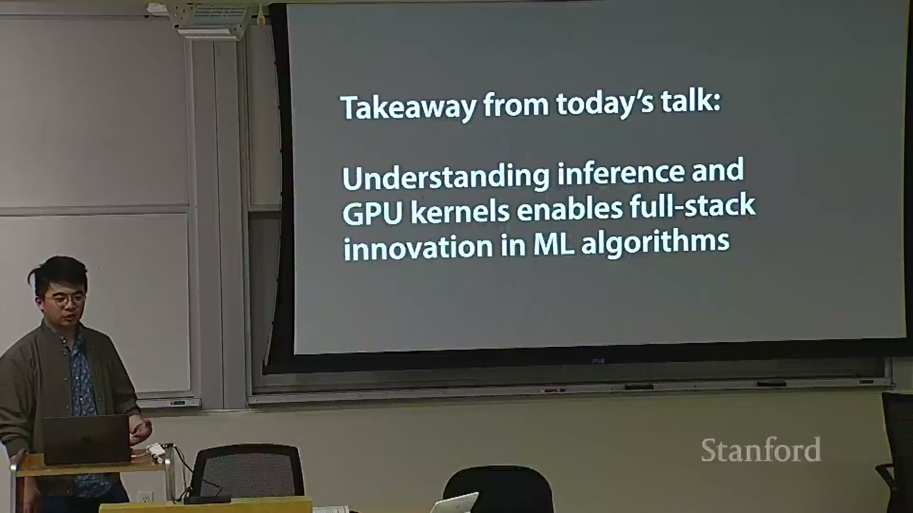

*图 23：理解 inference 和 GPU kernels，能够推动机器学习算法的 full-stack innovation。（视频时间：00:59:30--01:00:31）*

这句话贯穿了三层案例：

- 路由层：cache-aware routing 用 workload 特征改变资源分配；
- kernel 层：Megakernel 扩大调度域，隐藏 load 和 launch gap；
- 架构层：Parcae 用共享 block 和稳定动力系统改变参数与计算的交换方式。

### 8.2 全讲的机制压缩

可以把本讲压缩成一条因果链：

1. 应用产生特定 workload；
2. workload 决定 TTFT、TBT、吞吐和缓存复用目标；
3. 这些目标决定调度、KV 层级、prefill/decode 分工和并行；
4. 系统瓶颈暴露 kernel 边界与硬件约束；
5. 对底层约束的理解反过来启发新的模型架构；
6. 新架构又改变权重、KV Cache、通信和服务方式。

因此，训练、推理、kernel 和硬件不是线性流水线上的独立部门，而是互相定义最优点的闭环。

### 8.3 三个最值得带走的判断

> [!IMPORTANT]
> **第一，优化对象是完整工作负载。** 单 kernel、单请求或单一长度 benchmark 的胜利，不足以证明生产系统更好。

> [!IMPORTANT]
> **第二，系统边界本身就是研究变量。** 把冷/暖请求分池、把多个算子放进统一调度域、把同一 block 重复多次，都在重新划分边界。

> [!IMPORTANT]
> **第三，最优解带条件。** 更大的模型、更深的循环、更激进的融合或更多缓存，都必须放进 FLOPs、显存、延迟、通信和人力约束里判断。

### 8.4 开放问题与实践方向

- 如何自动找到 Megakernel 的最佳融合边界，而不是靠一年级别的人力定制？
- 如何把 KV Cache 的冷热预测、用户行为信号与 SLA 放进统一调度目标？
- Parcae 的 recurrence scaling law 能否跨越模型规模、数据分布和训练配方继续成立？
- 预训练模型重复现有层为何有时改善推理，哪些 activation 或 weight 结构在起作用？
- 如何为多 GPU Megakernel 建立通信延迟、内存和计算的联合性能模型？
- 当系统规模极大时，怎样用可观测性把模型异常与 kernel/runtime 异常可靠区分？

对实践者而言，一个可操作的下一步是：先测量自己的输入/输出长度、会话轮数、turn 间隔和 cache hit rate，再选择 batching、KV 层级和 prefill/decode 策略；对研究者而言，则应把部署约束提前带进模型设计，而不是在训练完成后才适配硬件。

### 本章小结

Dan Fu 的核心观点是：推理系统不是模型完成后的附属工程，而是机器学习创新空间的一部分。Routing、kernel、architecture 和 hardware 共同决定端到端能力；越接近硬件极限，收益越可能非线性，但方案也越专用、越昂贵。真正的全栈研究，就是在这些相互作用的约束中寻找新的、可验证的设计点。
