# Stanford CS336 2026 Lecture 1：Overview, Tokenization

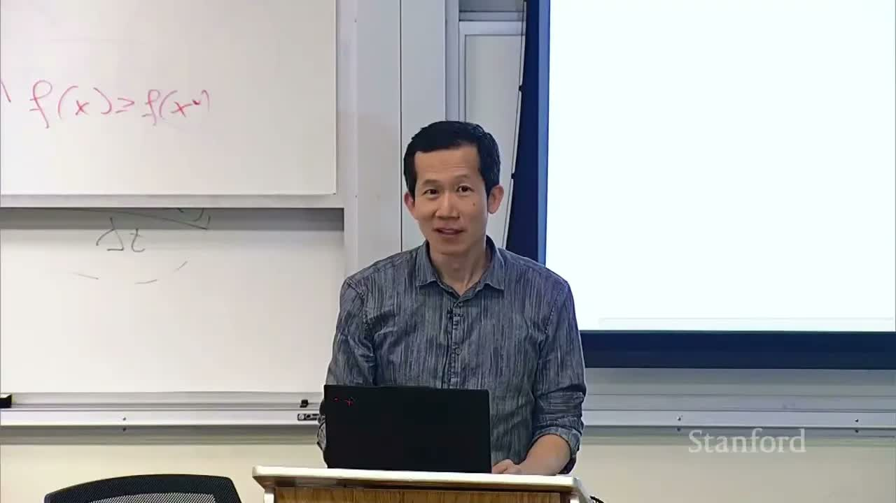

- **视频标题**：Stanford CS336 Language Modeling from Scratch | Spring 2026 | Lecture 1: Overview, Tokenization
- **主讲 / 频道**：Stanford Online
- **视频链接**：<https://www.youtube.com/watch?v=JuoVZkPBiKk>
- **时长**：01:19:21
- **材料范围**：人工英文字幕、1080p 课程视频与官方 `lecture_01.py`
- **课程定位**：先解释为何要从零构建语言模型、全课五个单元如何围绕效率联结，再以 Tokenization 作为第一个完整技术案例

> [!IMPORTANT]
> 这堂课的统一问题不是“最新模型用了什么技巧”，而是：**给定数据与计算预算，怎样构造效果最好的模型？** 课程把答案拆成可迁移的 mechanics、mindset 与需要警惕尺度变化的 intuitions；Tokenization 则把这套思路第一次落到可运行代码上。

## 1. 为什么要从零构建语言模型

### 1.1 抽象提高生产力，也会遮住研究对象

过去十年，使用语言模型的抽象层不断升高：早期研究者自己实现和训练模型，后来下载 BERT 等预训练权重微调，如今大量工作直接调用 GPT、Claude 或 Gemini 一类模型。抽象让应用开发更快，但语言模型是一种 **leaky abstraction**：当问题涉及训练数据、模型结构、优化器或并行方式时，API 无法替代对底层机制的理解。

为什么“漏”如此关键？因为当前大模型研究中最有价值的问题，几乎都位于抽象层的边界之下：训练 loss 突然发散时，需要理解优化器、初始化与数值精度之间的耦合；推理成本超标时，需要理解 KV cache 的内存占用与 attention 的计算结构；评测结果异常时，需要理解 tokenizer 如何把文本切成模型真正看到的单元。只停留在 API 层，这些问题全部不可见——你既无法诊断，也无法提出假设，更谈不上验证。

因此课程选择“通过构建来理解”。这里的“from scratch”不是复刻一个闭源前沿模型，而是亲手完成一条规模较小但结构完整的链路：

```text
raw text
  → tokenizer
  → Transformer
  → loss / optimizer / training loop
  → kernels / parallelism
  → scaling recipe
  → data pipeline
  → alignment
```

这条链路上每一环都对应课程的一个单元，也对应一项作业。它的价值不在于任何单独一环多么新颖，而在于**环与环之间的接口**：tokenizer 的输出长度决定 attention 的计算量，模型的 shape 决定 kernel 的并行方式，kernel 的吞吐决定能在固定预算内训练多少 token，而训练数据的构成又反过来决定 tokenizer 应该学到怎样的词表。只有亲手实现过整条链路，这些耦合关系才会从“听说过的常识”变成“可以测量的事实”。

讲者强调，课程不会真的从晶体管开始：PyTorch、GPU 和集群仍然是已有抽象。关键在于把抽象下钻到足以回答研究问题的层级，并让代码、测量与讲义彼此对应。判断“下钻得够不够”的标准很实际：当你面对一个现象（loss 尖峰、吞吐下降、评测抖动）时，能否写出一个可执行的实验来区分 competing hypotheses。能做到这一点的抽象层级，就是这门课要带你到达的层级。

### 1.2 工业化造成尺度与透明度鸿沟

现代前沿模型的训练已经工业化。讲者把 GPT-4 约一亿美元的成本称作“据称”，把当前约十亿美元量级明确标为推测；这些数字的作用是提示数量级，而不是提供可审计的成本表。更棘手的是，前沿模型通常不公开完整架构、规模、硬件、训练计算、数据构造和训练方法。


*图 1：官方课件截取 GPT-4 技术报告对未公开项目的说明。这里能支持“关键训练细节不透明”，不能扩写成“公众对模型一无所知”。（字幕区间：00:05:18--00:05:33）*

这带来一个方法论上的困境：最前沿的系统恰恰是外部研究者最无法直接研究的系统。课程的回应是用小规模、完全透明的系统做研究训练场。但随之而来的问题是：小模型上得到的结论，有多少能迁移到大模型？课堂里的模型小于 1B 参数，而产业模型大得多。为什么小模型结论不能机械外推？第一个例子是计算构成会变：在课件引用的 OPT 分析中，较小模型的 MLP/FFN 只占约 44% FLOPs，到 175B 时上升到约 80%。在小模型上极力优化 attention，不一定能给大模型带来同等收益。


*图 2：OPT 不同规模中 embedding、attention、FFN 等部分的 FLOPs 占比；规模增长后优化重点发生变化。（字幕区间：00:06:01--00:06:33）*

这个例子的含义值得展开。假设你在 125M 模型上把 attention 的 FLOPs 优化掉 50%，由于 attention 此时占比较大（embedding 与 attention 合计过半），整体加速可能相当可观；但同样的优化搬到 175B 模型上，FFN 已占约 80%，attention 的绝对占比大幅缩水，相同的相对改进对端到端训练时间的影响会被稀释数倍。优化工作的“价值密度”随尺度重新分配——这正是为什么系统研究必须先做资源账本（resource accounting），再决定优化目标，而不是凭借小尺度上的直觉行事。

第二个例子是行为曲线可能非线性。若某项 zero-shot 或 few-shot 能力只在更大训练 FLOPs 后明显出现，小模型实验就观察不到它。图中“突然上升”是经验现象，不自动证明存在严格的物理相变。


*图 3：八项任务的性能随训练 FLOPs 变化；它提醒我们，小尺度无提升不等于大尺度仍无提升。（字幕区间：00:06:33--00:07:09）*

对这类曲线要同时保持两种警惕。其一，不能把小尺度上“没有提升”外推为“这条路线无效”——多步算术、指令跟随等能力在小模型上常常平贴随机水平，直到某个训练量之后才快速爬升。其二，也不能把“突然上升”神秘化：后续研究指出，部分 emergent 现象与评测指标的离散性有关（例如 exact match 会把连续的内部进步压成全有或全无），换用连续指标后曲线可以变得平滑。无论哪种解释，结论一致：**小尺度实验能否代表大尺度行为，本身就是一个需要用证据回答的问题**，而不是默认成立的假设。

### 1.3 三类知识的可迁移边界

课程把能学到的知识分成三类：

- **Mechanics**：Transformer、优化器、模型并行、kernel 如何工作。只要实现和数学没有变，通常能跨尺度迁移。
- **Mindset**：profile、benchmark、认真计算资源账单，并持续追问单位资源是否用在最有价值的地方。它也能跨尺度迁移。
- **Intuitions**：某种数据、结构或超参数“应该更好”的经验判断。它最容易随模型、数据和计算规模改变。

这三类的区分是整门课的“认识论框架”。Mechanics 是数学与代码层面的机制：反向传播如何流过 LayerNorm，all-reduce 如何把梯度平均到 $K$ 张卡上，这些内容一旦推导清楚，放之四海皆准。Mindset 是研究方法论：先测量再优化，先算账再决定方向，它对任何尺度都成立，因为资源的稀缺性在任何尺度都成立。Intuitions 则不同——“这个学习率比较稳”“这类数据混合更好”“attention 是瓶颈”——这些判断都是在特定尺度、特定数据、特定硬件上形成的压缩经验，换一个 regime 就可能失效。课程反复训练的一种能力，就是在引用任何结论时先自问：它属于哪一类？

SwiGLU 论文的幽默结论正好展示第三类知识的局限：实验显示结构有效，却没有完整理论解释。


*图 4：实验发现可以先于完整解释；这不是说理论无用，而是要求研究者诚实地区分测量结果与因果解释。（字幕区间：00:08:49--00:09:15）*

这个例子还提示了一个更微妙的事实：即便在同一尺度内，“有效”与“知道为什么有效”之间也可能存在鸿沟。SwiGLU 如今已是 Llama 等主流模型的标准组件，但它的优势来自门控带来的优化景观改善、梯度倍乘效应，还是单纯的参数再分配，至今没有完全公认的解释。对研究者的实际要求不是“拒绝使用没有理论的组件”，而是**在实验记录中把测量结论与因果猜测分开标注**，避免后者随时间悄悄升格为前者。

### 1.4 Bitter Lesson 的正确落点是可扩展算法

常见误读是“规模决定一切，算法不重要”。课程给出的解释恰好相反：重要的是 **能随规模继续工作的算法**。讲者用一句纲领式关系表达：

$$
\text{accuracy}\approx \text{efficiency}\times \text{resources}.
$$

- $\text{accuracy}$：这里泛指模型最终效果，并非单一分类准确率。
- $\text{efficiency}$：单位数据、计算、内存或通信带来的有效进展。
- $\text{resources}$：可用数据与硬件预算。

这不是量纲严格的物理定律，而是研究 framing。在小实验里慢两倍可能只是多等一会儿；在昂贵训练中，5% 的改进就可能意味着巨额节省。课程最终问题因此是：**给定数据与计算预算，能构建怎样的最佳模型？**

Sutton 的 Bitter Lesson 原文论断是：回顾 AI 七十年，依赖人类手工知识的路线屡屡被依赖通用计算（搜索与学习）的路线超越。但注意这个论断的逻辑结构——它并没有说“任何算法都一样好”，而是说**历史上胜出的算法恰恰是那些能继续吃掉更多计算的算法**。一个在小尺度上精致但随规模饱和的技巧，会被一个朴素但可持续吸收资源的通用方法击败。因此 Bitter Lesson 的真正推论是双重的：一方面，评估新算法时“它能否随 scale 继续改进”应成为一等公民标准；另一方面，纯粹的暴力扩资源而不改进效率，等于主动放弃了这个 framing 中效率因子的全部杠杆。这门课的全部技术内容，本质上都是在研究 $\text{efficiency}$ 这一项如何在各个环节被最大化。

### 本章小结

- API 抽象很有价值，但基础研究常需要进入训练与系统内部。
- 小模型能教 mechanics 与 mindset，却不能保证所有经验直觉外推到大模型。
- 规模会改变计算构成，也可能改变可观察行为。
- Bitter Lesson 强调可扩展算法；效率不是附属优化，而是模型能力的一部分。

## 2. 技术谱系、开放生态与课程方法

### 2.1 从 N-gram 到 agent：变化的是能力界面

课程用一条历史线把许多论文放到同一问题里：

1. Shannon 熵与 N-gram 建立统计语言建模基础。
2. LSTM、seq2seq、Adam、attention、Transformer、MoE 和模型并行提供神经网络组件。
3. ELMo、BERT、T5 让预训练模型成为通用表示或任务起点。
4. GPT-2、scaling laws、GPT-3、PaLM 与 Chinchilla 把规模、in-context learning 和 compute-optimal 训练推到中心。
5. ChatGPT 把语言模型变成对话界面；更长上下文与工具调用进一步把它变成 agent。

这个历史不是“旧模型都被淘汰”。模型的使用规格变了，但 attention、kernel、optimization、data processing 等 fundamentals 仍然贯穿其中。

值得指出的是这条线索的内在连续性。Shannon 在 1950 年代就用 N-gram 逼近英文的熵，其核心操作——用条件概率 $p(x_t \mid x_{<t})$ 分解序列概率——与今天 GPT 的训练目标在数学上是同一个对象：

$$
p(x_1, \dots, x_T) = \prod_{t=1}^{T} p(x_t \mid x_{<t}).
$$

- $x_t$：序列中第 $t$ 个 token。
- $p(x_t \mid x_{<t})$：给定全部历史后下一个 token 的条件概率。

变化的不是目标，而是三件事：参数化这个条件分布的函数族（从计数表到 Transformer）、可投入的资源和数据量、以及模型暴露给用户的界面（从概率表到对话再到 agent）。理解这条线有助于抵抗一种常见的错觉——把“最新界面”误认为“全新科学”。agent 系统里的规划、工具调用、长上下文检索，最终都要落回同一个 next-token 模型的能力与成本，而这些正是本课五个单元要处理的问题。

### 2.2 Open-weight 不等于 fully open

开放生态至少有不同层级：

| 开放内容 | 能回答的问题 | 仍缺什么 |
|---|---|---|
| 只有 API | 模型会输出什么 | 权重、训练与数据细节 |
| 权重 + 论文 | 可部署、可测量部分结构 | 完整训练代码与数据配方 |
| 权重 + 论文 + 代码 + 数据 | 更接近可复现与可审计 | 仍可能缺集群环境、数据混合细节 |

讲者指出，Llama、Mistral、DeepSeek、Qwen、Kimi、GLM、MiniMax、MIMO 等 open-weight 系列正接近闭源模型；OLMo、Nemotron 与 Marin 等项目则尝试进一步开放代码和数据。这里的判断是授课时点的生态概览，不应把“approaching”理解成每个模型在每项任务都追平。

这张表之所以重要，是因为“开放”一词在公共讨论中常被当成二元属性，而研究可复现性却是一个连续谱。只有权重时，你可以做推理、微调、机制可解释性探针，甚至测量某些训练动力学的事后痕迹；但你无法回答“这个能力来自哪一批数据”“训练曲线中段发生过什么”“换掉这个数据混合会怎样”。补齐代码后，训练过程本身成为研究对象；再补齐数据，因果归因（数据 → 行为）才真正可行。即便如此，集群拓扑、故障恢复策略、数据清洗的确切顺序等“环境性细节”仍可能缺失，而这些细节有时恰恰是大规模训练能否成功的关键。阅读任何一篇开放模型的报告时，都应先定位它停在这张表的哪一行，再决定能从中引用什么强度的结论。

### 2.3 Executable lecture：讲义也是程序

官方课件本身是可执行 Python，而非静态幻灯片。例如：

```python
total = 0
for x in [1, 2, 3]:
    total += x
```

运行时会展示代码、变量值和层级结构。这个形式与课程方法一致：不要把实现当作不可修改的截图；应该运行它、检查中间状态、测量速度并验证不变量。

这门课选择可执行课件，并非单纯的工程趣味。它实际上把“读讲义”从被动消费改造成主动实验：每一段出现在屏幕上的代码，读者都可以原样运行、修改参数、打印中间变量。本讲后半的 tokenizer 内容就是按这个方式组织的——每个教学实现都紧接着一次现场运行，课堂上展示的 token ID、词表大小、压缩比率，全部是可复现的程序输出而非静态数字。这也给读者提出了一个学习建议：读这份讲义时，凡是遇到代码块，都值得亲手跑一遍，并刻意构造讲义之外的输入（空字符串、超长文本、罕见 Unicode）去试探实现的边界。

### 2.4 五项作业是一条完整流水线

五项作业依次对应 Basics、Systems、Scaling Laws、Data、Alignment。作业不给大量 scaffolding code，但提供单元测试和 adapter interface：先在本地证明正确，再到集群上测 accuracy 与 speed。Leaderboard 不是单纯竞速；不同任务会在固定预算下考察 perplexity、准确率或吞吐。

课程允许 AI 做解释和 tutoring，但核心目标是形成自己的机制理解。若 coding agent 直接代写而学生无法解释代码，作业即使通过测试也没有完成学习目标。具体政策仍应以正式课程规则为准。

把五项作业连起来看，它们构成一个刻意设计的闭环：Assignment 1（Basics）产出一个能训练的小模型；Assignment 2（Systems）让你把这个模型训得更快；Assignment 3（Scaling Laws）让你用一系列小模型预测更大模型的行为；Assignment 4（Data）让你为训练构造数据；Assignment 5（Alignment）让模型从“会续写”变成“会回答”。注意其中只有 Assignment 1 考察“能不能做对”，后面四项考察的都是“在约束下能做多好”——这与全课的效率 framing 完全同构。测试先行（test-driven）的设计也有深意：单元测试定义的是正确性下限，而 leaderboard 上的指标定义的是优化方向，两者之间的空间正是学生练习资源权衡的场所。

### 本章小结

- 语言模型的交互形态不断变化，但底层训练与系统机制有延续性。
- Open-weight、open code 与 open data 是不同承诺，不能混为一谈。
- Executable lecture 把“能运行、能检查”变成课程材料的组成部分。
- 五项作业沿完整 LM 栈展开，正确性与效率都必须被实测。

## 3. Basics：从 token 到可训练的 Transformer

### 3.1 三个组件与三项约束

Basics 的最小闭环是：tokenize 数据、定义模型、实现训练。课程并不把它们视为互不相关的模块，而是要求同时平衡：

- **Expressivity**：能否表示复杂依赖；
- **Stability**：激活、参数与梯度是否保持可训练；
- **Efficiency**：计算、内存和推理代价是否可承受。

Tokenization 决定模型看到的“原子”；架构决定信息如何交互；训练目标与优化器决定怎样从数据中更新参数。改变任何一项都会反馈到另外两项。

这三项约束之间存在真实的张力，值得逐一展开。**Expressivity** 要求模型能拟合训练数据中存在的依赖结构——例如长距离指代、代码括号配对、多步算术进位；对 tokenization 而言，它要求 token 序列不丢失对语义重要的信息（word tokenizer 把新词压成 UNK 就是表达力的直接损失）。**Stability** 是优化层面的约束：参数化方式再强，如果初始化让激活方差随深度指数增长，训练在前几百步就会发散，表达力无从兑现。**Efficiency** 则是资源层面的约束：一个每层都要做全局稠密计算的架构也许表达力足够，但在固定预算下能训练的 token 数会等比例缩水，最终效果反而更差。三者之中任何一项取极值都会损害另外两项，Basics 单元的全部设计选择本质上都是在这张三角形的内部寻找合适的点。

### 3.2 现代 Transformer 是一组连续的工程选择

原始 Transformer 只是起点。现代语言模型会在以下维度做选择：

- activation：ReLU、SwiGLU；
- position：绝对位置、sinusoidal、RoPE；
- normalization：LayerNorm、RMSNorm、QK norm、pre-norm / post-norm；
- attention：full、local/sparse、GQA、MLA；
- sequence model：attention、linear attention、Mamba、Gated DeltaNet 及混合结构；
- MLP：dense 或 MoE；
- shape：宽度、深度、head 数、expert 数。


*图 5：token/position embedding 进入堆叠 block；每层由 causal self-attention、FFN、residual 与 normalization 组成，最后经线性层和 softmax 预测 token。（字幕区间：00:29:54--00:31:48）*

标准 self-attention 对序列长度 $L$ 的两两交互会形成 $L\times L$ 的 attention matrix，因此主要计算与存储常按 $O(L^2)$ 增长。Tokenization 若把 byte 序列压短，就会直接影响这里的成本。

这个二次项值得在本讲就给出定量感觉，因为它是后面所有 tokenization 讨论的“债主”。设某段文本用 byte 表示需要 $L_{\text{byte}}$ 个 token，用压缩比为 $r$（bytes/token）的 tokenizer 表示需要 $L_{\text{tok}} \approx L_{\text{byte}}/r$ 个 token。忽略线性项后，attention 的计算与存储之比为

$$
\frac{L_{\text{byte}}^2}{L_{\text{tok}}^2} \approx r^2.
$$

- $r$：tokenizer 的压缩比（bytes/token）。
- $L_{\text{byte}}, L_{\text{tok}}$：同一段文本在两种表示下的序列长度。

以本讲后面的实例估算：byte tokenizer 的 $r=1$，课堂演示的 `o200k_base` 在该样例上 $r=2.5$，attention 成本因此相差约 $2.5^2 = 6.25$ 倍。换言之，**tokenizer 的压缩比在 attention 成本上是被平方放大的**——这就是为什么课程把一个“文本预处理”步骤提升到全课第一个技术专题的高度。

### 3.3 训练稳定性不是“调几个参数”

课程列出的训练选择包括：

- next-token 或 multi-token prediction；
- AdamW、SOAP、Muon 等优化器；
- Xavier、$\mu$P 等初始化/参数化方法；
- cosine、WSD 等学习率日程；
- dropout、weight decay、batch size；
- MoE 的负载均衡。

这些选项表面上都是超参数，组合起来却可能决定训练是稳定收敛，还是直接发散。Assignment 1 因此要求完成 BPE、Transformer、loss、optimizer 和完整 training step，而不是只拼装现成模块。

从机制上看，稳定性问题大多可归约为“信号在深度与步数两个维度上的尺度控制”。前向传播时，每层对激活做一次线性变换加非线性，若各层的雅可比奇异值系统性大于 1，激活方差随深度指数增长；系统性小于 1 则相反，梯度在反传时消失。初始化（如 Xavier 按 $1/\sqrt{d_{\text{in}}}$ 缩放权重）的目标是让各层在训练开始时近似保方差；normalization 与 residual connection 则是在训练过程中持续维持这一性质。学习率日程处理的是时间维度的尺度：warmup 防止早期梯度估计噪声过大时步子太猛，decay 让后期参数落在 loss 盆地的平坦区域。这些机制彼此替代又彼此耦合——例如 pre-norm 结构之所以比 post-norm 更容易训练，正是因为它让 residual 通路成为一条无变换的恒等通道，梯度可以不经衰减地传回底层；代价则是深层的有效贡献被稀释，这又是另一类权衡。课程在这里不追求穷举结论，而是建立一种诊断习惯：看到发散或停滞，先测量激活与梯度的尺度，再推断哪一环的尺度控制失效。

### 本章小结

- Basics 是 tokenizer、模型结构与训练算法组成的闭环。
- 架构设计同时服务表达能力、稳定性和效率。
- attention 的序列长度代价解释了为什么 token compression 重要。
- “超参数”在大规模训练中可能决定整次运行是否可用。

## 4. Systems 与 Scaling Laws：把资源变成可预测的能力

### 4.1 先做资源账本：$C\approx6ND$

对 dense Transformer，课程使用训练 FLOPs 的近似：

$$
C\approx 6ND.
$$

- $C$：训练总浮点运算次数（FLOPs）。
- $N$：模型参数量。
- $D$：训练 token 数。
- 常数 6：把每个参数、每个 token 的前向与反向主要矩阵计算压缩成课程级估算。

这个公式是全课最常用的资源账本，我们把它的来龙去脉完整推一遍。

#### 4.1.1 前向：每个参数约 2 FLOPs

Transformer 的绝大多数参数生活在矩阵乘法里：attention 的 $W_Q, W_K, W_V, W_O$，FFN 的两个大矩阵，embedding 与输出投影。考虑其中一个权重矩阵 $W \in \mathbb{R}^{m \times n}$ 作用在单个 token 的激活 $x \in \mathbb{R}^n$ 上，计算 $y = Wx$。按定义

$$
y_i = \sum_{j=1}^{n} W_{ij}\, x_j, \qquad i = 1, \dots, m.
$$

- $W_{ij}$：权重矩阵第 $i$ 行第 $j$ 列的元素，对应一个标量参数。
- $x_j$：输入激活的第 $j$ 个分量。
- $y_i$：输出激活的第 $i$ 个分量。

每个 $y_i$ 需要 $n$ 次乘法和 $n-1$ 次加法，合计约 $2n$ 次浮点运算；$m$ 个输出合计约 $2mn$ 次。注意 $mn$ 恰好是矩阵的参数量 $|W|$，于是

$$
\text{前向 FLOPs} \approx 2\,|W| \quad (\text{每 token}).
$$

即**每个参数在前向传播中为每个 token 贡献约 2 次运算**（一次乘、一次加，常合并记作一次乘加）。对所有矩阵求和，一个 token 的前向成本约为 $2N$ FLOPs。

#### 4.1.2 反向：每个参数再约 4 FLOPs

训练的真正开销在反向传播。对同一个 $y = Wx$，设损失对输出的梯度 $\frac{\partial L}{\partial y}$ 已知（来自更上层的反传）。链式法则要求我们计算两样东西。

第一，对输入激活的梯度，以便继续向更下层传播：

$$
\frac{\partial L}{\partial x} = W^{\top} \frac{\partial L}{\partial y}.
$$

- $\frac{\partial L}{\partial x} \in \mathbb{R}^n$：损失对输入激活的梯度。
- $W^{\top} \in \mathbb{R}^{n \times m}$：权重矩阵的转置。

这又是一次矩阵—向量乘，含 $nm$ 个乘加，约 $2|W|$ FLOPs。

第二，对参数本身的梯度，以便优化器更新：

$$
\frac{\partial L}{\partial W} = \frac{\partial L}{\partial y}\, x^{\top}.
$$

- $\frac{\partial L}{\partial W} \in \mathbb{R}^{m \times n}$：与 $W$ 同形的参数梯度，由输出梯度与输入激活的外积给出。

外积的每个元素是两次运算（一次乘、累加时一次加），同样约 $2|W|$ FLOPs。两项相加，反向传播每个参数每个 token 约 $4$ FLOPs，恰为前向的两倍。

#### 4.1.3 合计与被忽略的项

前向 $2N$ 加反向 $4N$，得到每个 token 约 $6N$ FLOPs；乘以训练 token 总数 $D$ 即 $C \approx 6ND$。这个近似的价值在于把训练成本变成两个可规划量的乘积，但必须清楚它忽略了什么：

- **attention 的序列项**：$QK^{\top}$ 与注意力加权求和的计算量按 $O(L \cdot d_{\text{model}})$ 每 token 每 layer 增长（$L$ 为上下文长度），这部分与参数量无关，在短上下文小模型上占比可观，长上下文时甚至可以主导总成本；
- **非矩阵乘运算**：激活函数、normalization、residual 相加都是逐元素操作，FLOPs 小但内存搬运不小；
- **优化器状态更新**：AdamW 每步对每个参数做常数次运算，但它按 step 摊销到一个 batch 的全部 token 上，单 token 成本可忽略；
- **embedding 查表**：几乎无乘加；
- **通信与利用率**：公式假设硬件 100% 有效利用，实际要打 MFU（model FLOPs utilization）折扣。

因此 $6ND$ 的正确用法是数量级规划与相对比较，而不是精确报价。也请注意它对 MoE 模型要按**每 token 激活的参数量**而非总参数量计算，这是稀疏结构改变资源账本的第一处体现。

#### 4.1.4 数值例子与验算

例如 70B 参数训练 1T token：

```python
total_flops = 6 * 70e9 * 1e12  # 4.2e23 FLOPs
```

得到约 $4.2\times10^{23}$ FLOPs。它是做数量级规划的公式，不包含所有 kernel、稀疏结构、通信和硬件利用率细节。

再把这个数字换算成时间，感觉会更具体。课程后面提到 B200 的 bf16 峰值约 $2.25\times10^{15}$ FLOP/s；大规模训练的实际 MFU 常见在 30%–50% 区间。取 40% 即每卡有效约 $9\times10^{14}$ FLOP/s，则

$$
\frac{4.2\times10^{23}}{9\times10^{14}} \approx 4.7\times10^{8}\ \text{GPU·秒} \approx 5400\ \text{GPU·天}.
$$

- 分子：训练总 FLOPs。
- 分母：单卡有效吞吐（峰值乘 MFU）。

在 1024 张卡上理想扩展，墙钟时间约 $5.3$ 天。这个估算虽然粗糙，却立刻回答了许多战略问题：预算翻一倍能买多大模型？训练推迟一周意味着什么？这类换算是 scaling 讨论的通用语言。

### 4.2 峰值算力不等于实际速度

GPU 必须在 compute 与 memory 间搬运数据。课堂用 B200 举例：bf16 峰值约 2.25 PFLOP/s，内存带宽约 8 TB/s。若每次运算需要从 HBM 搬大量数据，计算单元会等待内存，程序成为 memory-bound。

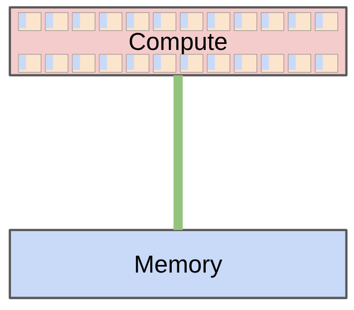
*图 6：计算单元与显存之间的通路决定实际吞吐；硬件峰值只有在数据能及时送达时才可利用。（字幕区间：00:36:58--00:37:57）*

把这两个数字放在一起做一个除法，就能得到硬件的**算术强度拐点**（ridge point）：

$$
I^{*} = \frac{\text{峰值算力}}{\text{内存带宽}} = \frac{2.25\times10^{15}\ \text{FLOP/s}}{8\times10^{12}\ \text{byte/s}} \approx 281\ \text{FLOP/byte}.
$$

- $I^{*}$：机器平衡点对应的算术强度，即每搬运 1 byte 数据需要执行约 281 次运算，计算单元才不至空转。

一个 kernel 若每读 1 byte 只做几次运算（如 softmax、LayerNorm、逐元素激活），它注定 memory-bound，峰值算力再高也用不上；只有大矩阵乘这类每 byte 数百次运算的操作才接近 compute-bound。Systems 的统一原则是减少 data movement：

- fusion：一次读入后完成多项操作，再写回；
- tiling / FlashAttention：把适合的数据块留在更快的片上存储；
- parallelism：在 data、tensor、pipeline、sequence、expert 等维度切分；
- distributed collectives：用 gather、reduce、all-reduce 协调多 GPU 状态。

这四条其实是同一原则在不同层级的体现：fusion 与 tiling 在单卡内部减少 HBM 往返，parallelism 与 collectives 在多卡之间组织必要的通信并尽量让通信与计算重叠。学习 Systems 单元时，建议始终带着算术强度这把尺子：先估算操作的 FLOP/byte，再判断瓶颈在计算还是搬运，最后才谈得上选择优化手段。

### 4.3 Prefill 与 decode 的瓶颈不同

推理有两个阶段：prefill 一次处理完整 prompt，建立各层 KV cache；decode 每次只生成一个新 token，并反复读取权重与缓存。前者更像训练，通常更容易使用并行计算；后者常受内存带宽和请求调度限制。


*图 7：已知 prompt 可并行 prefill，后续 token 必须自回归生成；KV cache 避免重复计算历史状态。（字幕区间：00:42:35--00:43:03）*

用算术强度语言可以精确说出两者的差别。Prefill 阶段一次处理 prompt 中全部 token，权重矩阵被读取一次后服务于整个批次的运算，算术强度高，通常 compute-bound；decode 阶段每步只来一个 token，却仍要把全部权重（对 70B bf16 模型约 140 GB）从 HBM 读一遍，算术强度被压到接近逐元素水平，必然 memory-bound——此时每步延迟基本由“把权重读完一遍需要多久”决定，batching 之所以有效，正是因为它让一次权重读取服务更多并发请求，把算术强度拉回可用区间。KV cache 同理：它用显存空间换取对历史 key/value 的重算，是把 $O(L^2)$ 的重计算换成 $O(L)$ 的存储读取。

可用 pruning、quantization、distillation、speculative decoding、专用 fused kernel 和 continuous batching 提速。Speculative decoding 的直觉是：便宜模型先猜一段 token，大模型并行核验；猜对时一次接受多个 token。

### 4.4 Scaling recipe：把预算映射为配置

当预算达到 $10^{24}$ 或 $10^{25}$ FLOPs 时，不可能在目标规模上反复调参。课程要求把思维从“训练一个模型”改成：

$$
\text{FLOP budget}
\longmapsto
\{N,D,\text{learning rate, batch size, shape, ...}\}.
$$

这就是 scaling recipe。研究者在较小预算上运行实验、拟合 loss 与规模关系，再预测目标规模。一个重要认识是：**predictability 至少和 optimality 同样重要。** 某个小规模点略优但无法稳定外推，可能不如一个稍逊却可预测的 recipe。

Scaling law 也不是自然界自动存在的定律。学习率、batch size、参数化和模型 shape 必须随规模以可预测方式变化；$\mu$P 等方法的价值之一，就是改善超参数跨尺度迁移。

为什么“可预测”值得与“最优”并列？因为大预算训练是不可逆决策：一次 $10^{25}$ FLOPs 的运行没有预算做第二次，配置必须在启动前确定。一个 recipe 若在小尺度上拟合出干净的幂律（loss 对 $\log C$ 近似线性、残差小且方向一致），我们可以对它的外推误差做出有根据的置信判断；反之，若小尺度上的优势来自对特定规模的偶然调参，外推时误差的符号和幅度都未知。换言之，scaling 研究追求的不是曲线上的最低点，而是**误差可控的曲线**。这也解释了 $\mu$P 的地位：它通过规定宽度变化时初始化与学习率的缩放规则，让“小模型上调好的超参数”在数学上保持意义不变，把超参数从 intuition 类知识升格为 mechanics 类知识。

### 4.5 Chinchilla：参数与 token 的预算分配

在固定 $C=6ND$ 下，多参数、少 token 与少参数、多 token 都可能浪费预算。Chinchilla 方法对每个 FLOPs budget 扫描不同模型大小，得到 U 形 ISOFLOP 曲线的最优点，再拟合最优 $N$ 与 $D$ 随预算的变化。

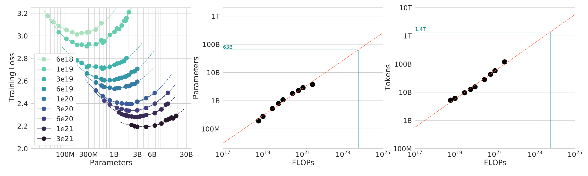
*图 8：左图在各预算上寻找最低 loss 的参数量，中、右图分别拟合最优模型大小与训练 token 数。（字幕区间：00:49:36--00:50:50）*

这里把逻辑链条补全，为 Lecture 9 的正式推导做准备。约束是 $C \approx 6ND$ 固定，于是 $D = C/(6N)$：增大 $N$ 必然等比例压缩 $D$。两端各有一种失败模式——$N$ 太大时模型容量充足却没见过足够数据（undertrained，loss 被数据量限制）；$N$ 太小时数据充沛却装不下其中的规律（underparameterized，loss 被容量限制）。对每个预算 $C$ 扫描一组 $N$、按 $D=C/(6N)$ 训练到底，最终 loss 对 $N$ 的曲线因此呈 U 形，谷底给出该预算下的最优 $N^{*}(C)$。对多个 $C$ 重复此过程，再对 $(C, N^{*})$ 与 $(C, D^{*})$ 拟合幂律

$$
N^{*}(C) \propto C^{a}, \qquad D^{*}(C) \propto C^{b}, \qquad a + b = 1,
$$

- $a, b$：最优模型规模与最优 token 数随预算增长的幂指数；两者之和为 1 是约束 $C \propto ND$ 的直接推论。

Chinchilla 拟合出 $a \approx b \approx 0.5$，即预算增长时**参数量与数据量应大致等比扩张**，其直接推论就是 $D^{*}/N^{*}$ 近似为常数。课程给出粗略规则：

$$
D\approx20N.
$$

- $D$：训练 token 数。
- $N$：模型参数量。
- 例子：$N=70\text{B}$ 时，$D\approx1.4\text{T}$。

这只是经验 rule of thumb，会随数据和架构变化，并且没有纳入部署推理成本。若推理很贵，工程上可能偏向更小模型、更多训练 token，即便这不是纯训练 FLOPs 下的最优点。

#### 4.5.1 入门版的预算分配直觉

为什么“多参数、少 token”会浪费预算？用 4.1 节的账本换个写法：固定 $C$ 时，训练 token 数 $D = C/(6N)$，模型在训练中看到的**数据量与参数量成反比**。loss 由两类误差组成：容量不足带来的近似误差（随 $N$ 增大而下降）与数据不足带来的统计误差（随 $D$ 增大而下降）。把全部预算押在一端，会让另一类误差成为不可逾越的下限。U 形曲线的谷底正是两类误差取得平衡的点。这个“两误差平衡”的图景在 Lecture 9 会被提升为严格的参数化分解 $L(N,D) = E + A/N^{\alpha} + B/D^{\beta}$，届时我们会从数据中拟合指数并推出最优比例 $a = \beta/(\alpha+\beta)$；本讲只需记住结论的方向：**在 compute-optimal 意义下，模型规模与数据规模应当协同增长，而不是先堆参数再说**。

最后一点工程注脚：$D \approx 20N$ 描述的是“训练一次、不再使用”的最优。现实中模型要服务海量推理请求，推理成本按 token 与参数量线性累计；让模型小一点、训练久一点（overtrain），单次训练虽然偏离 IsoFLOP 谷底，全生命周期总成本却可能更低。Llama 系列按这个逻辑训练了远超 20:1 的 token 数。资源账本的口径从“训练 FLOPs”换成“训练 + 推理总成本”，最优配置随之移动——这是 framing 公式中 $\text{resources}$ 一项定义权重的绝佳示例。

### 本章小结

- $C\approx6ND$ 是规划 dense Transformer 训练数量级的近似账本。
- 实际速度取决于计算、内存和通信，而非只看峰值 FLOPs。
- prefill 与 decode 的并行性和瓶颈不同。
- Scaling recipe 用小实验决定大预算配置；可预测性本身是一项核心目标。
- $D\approx20N$ 是有边界的教学近似，不是跨模型永久成立的定律。

## 5. Data、Alignment 与全课的效率主线

### 5.1 先定义能力，再决定数据

“训练什么数据”不能脱离“希望模型会什么”。课程从 evaluation 开始：

- **Internal eval** 服务开发决策，重视小尺度趋势平滑、相对比较稳定；
- **External eval** 衡量真实用途，重视绝对质量和 ecological validity。

私有文档 perplexity、GPQA、HLE、SWE-Bench、Terminal-Bench 测量的能力不同，任何单一分数都不能完整代表模型。目标确定后，数据依次经历：

```text
curation
→ transformation
→ filtering
→ deduplication
→ mixing
→ rewriting / synthetic data
```

过滤的效率逻辑非常直接：固定 compute budget 下，在坏数据上花更多时间，就意味着在好数据上花更少时间。与此同时，训练者还必须处理许可、版权、隐私和数据污染，而不能把“公开可访问”自动视为“可随意训练”。

这条 pipeline 中每一步都值得用效率的眼光重读一遍。curation 决定候选池的组成，是全部后续步骤的上限；transformation（HTML 转文本、OCR、格式归一）决定信息的保真度；filtering 用分类器或启发式剔除低价值样本，本质上是把每个训练 token 的期望边际贡献重新排序；deduplication 防止同一信息重复消耗 token 预算并降低 memorization 风险；mixing 决定各领域数据的比例，直接影响最终能力的配比；rewriting 与 synthetic data 则用已有模型生成更符合目标的样本，把“数据筛选”升级为“数据改造”。整套流程可以看作一个多阶段的最优化问题：在固定 token 预算 $D$ 下，选择训练语料的分布，使目标能力上的 loss 最小。Lecture 9 之后的 Data 单元会把 mixing 与 dedup 展开为各自的算法专题（如 RegMix、MinHash/LSH），本讲先建立这张地图。

### 5.2 Alignment：评价往往比生成更容易

预训练给出 next-token 模型，但并不保证回答符合人类目标。Alignment 利用弱监督：模型先生成多个 response，再由 human、verifier 或 LM judge 给反馈，最后提高较好回答的概率。

```text
prompt
  → model responses
  → human / verifier / LM judge
  → preference or reward signal
  → PPO / GRPO / DPO update
```

PPO、GRPO 属于 RL 路线；DPO 可直接从 preference pairs 学习。RL 的困难不只在算法不稳定，还在 rollout 需要高吞吐推理系统；为了保持 on-policy，样本又不能无限复用。系统效率与统计目标在这里再次耦合。

“评价比生成容易”这一不对称性是 alignment 的方法论基石。让一个模型写出正确的数学证明很难，但判断一个证明是否正确容易得多（对 verifiable domain 甚至可以程序化验证）；写出优雅代码很难，跑通单元测试容易。Alignment 算法正是要把这种廉价的评价信号转化为对生成能力的改进：对同一 prompt 采样多个 response，用 verifier 或偏好模型打分，再把概率质量推向高分样本。这解释了为什么 RL 阶段的系统瓶颈与预训练不同——预训练瓶颈在前向/反向的矩阵乘吞吐，而 RL 的 rollout 阶段要做大规模自回归生成，瓶颈落在 4.3 节讨论的 decode 推理效率上；GRPO 等方法省去 value model、用组内相对优势做基线，部分动机也正是压缩这一阶段的内存与计算开销。

### 5.3 五个单元其实在解同一道题

课程在进入 Tokenization 前再次把全课压缩成效率问题：

| 单元 | 主要资源瓶颈 | 核心效率动作 |
|---|---|---|
| Basics | 序列、参数、优化稳定性 | 选表达力足够且可训练的表示与架构 |
| Systems | HBM 与跨 GPU 搬运 | fusion、tiling、parallelism |
| Scaling | 大预算无法穷举 | 用小实验建立可外推 recipe |
| Data | 训练 token 价值不同 | 把 FLOPs 留给目标相关、高价值数据 |
| Alignment | rollout 昂贵且反馈稀疏 | 用弱监督与高效推理放大评价信号 |

这也解释了 Lecture 1 为什么最后详细讲 Tokenization：它同时影响数据表示、序列长度、attention 成本、模型容量分配和训练吞吐，是一个缩小版的全课程问题。

这张表还可以沿着 1.4 节的 framing 再压缩一步：五个单元分别对应 $\text{efficiency}$ 在不同资源维度上的定义——Basics 优化“每个 FLOP 换多少表达能力”，Systems 优化“每个 FLOP 有多少真正落到有用计算上”，Scaling 优化“每个实验 FLOP 换多少对大预算决策的信息”，Data 优化“每个训练 token 换多少目标能力”，Alignment 优化“每个 rollout token 换多少偏好信号”。带着这张表学后续课程，每当遇到一个新技术，都可以先定位它属于哪一行、改变的是哪个资源口径。

### 本章小结

- Evaluation 定义目标能力，数据 pipeline 才能围绕目标构造。
- 数据质量、合法性与污染都属于训练系统的一部分。
- Alignment 用“更容易评价”这一不对称性提供弱监督。
- Basics、Systems、Scaling、Data、Alignment 都在优化固定资源下的有效学习。

## 6. Tokenizer：在字符串与整数序列之间建立可逆接口

### 6.1 问题定义

语言模型对 token index 序列建模，而输入通常是 Unicode string。Tokenizer 至少要提供：

```python
class Tokenizer(ABC):
    def encode(self, string: str) -> list[int]: ...
    def decode(self, indices: list[int]) -> str: ...
```

最基本的正确性条件是 roundtrip：

$$
\operatorname{decode}(\operatorname{encode}(s))=s.
$$

- $s$：任意支持的输入字符串。
- `encode`：把字符串映射为 token ID 序列。
- `decode`：把 ID 序列还原为字符串。


*图 9：文本先被分成可变边界的 token，再映射为整数；解码应恢复原字符串。（字幕区间：01:05:31--01:05:50）*

Token ID 的数值大小没有语义，只是 vocabulary index。Roundtrip 也只证明可逆，不证明序列短、词表合理或训练高效。

#### 6.1.1 形式化：一个保留信息的接口

把问题说得更形式一些。设 $\Sigma$ 为字符集（对 Unicode 文本，$\Sigma$ 为全部 code point），$\Sigma^{*}$ 为所有有限字符串的集合，$V$ 为词表大小，$[V] = \{0, 1, \dots, V-1\}$ 为合法 token ID 集合。tokenizer 是一对映射

$$
\operatorname{encode} : \Sigma^{*} \to [V]^{*}, \qquad
\operatorname{decode} : [V]^{*} \to \Sigma^{*},
$$

- $\Sigma^{*}$、$[V]^{*}$：字符序列与 token ID 序列的集合（含空序列）。

roundtrip 条件 $\operatorname{decode} \circ \operatorname{encode} = \operatorname{id}_{\Sigma^{*}}$ 要求 $\operatorname{encode}$ 是**单射**（injective）：不同字符串必须编码为不同序列，否则信息在入口处就已丢失，任何后续模型都无从恢复。注意反方向不要求：$\operatorname{decode}$ 不必是单射，也不要求对每个任意 ID 序列都有意义——模型采样可能产生非法 ID 组合，工程实现必须决定此时报错还是容错，这也是 8.5 节“任意 token ID 拼出的 bytes 未必是合法 UTF-8”这一陷阱的来源。

除了正确性，我们还关心两个效率量。其一是**序列长度** $|\operatorname{encode}(s)|$，它直接进入 3.2 节的 $O(L^2)$ attention 成本；其二是**词表大小** $V$，它决定 embedding 矩阵与输出投影的参数量（各含 $V \times d_{\text{model}}$ 个参数）以及输出分布的支持集。Tokenization 设计的全部艺术，就是在“单射覆盖一切输入”这条硬约束下，对这两个量做权衡。

### 6.2 真实 tokenizer 的边界并不像“单词”

课堂使用 `tiktoken` 的 `o200k_base`，并称其为 GPT-5 tokenizer。对 `"Hello, 🌍! 你好!"` 的现场运行得到 8 个 token ID：

```text
[13225, 11, 130321, 235, 0, 220, 177519, 0]
```

随后解码回原字符串。这个例子展示：

- 前导空格常与后面的词合并成同一 token；
- 同一个词出现在句首和句中，可能是完全不同的 ID；
- 数字可能每若干位一组，不保证与人类十进制分组一致；
- emoji 或多语言字符不一定对应一个 token。

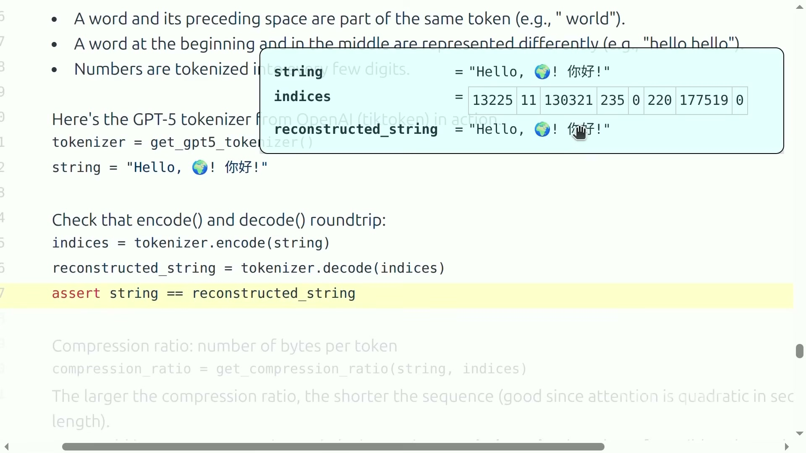
*图 10：现场变量检查显示 8 个 token ID，并成功还原多语言字符串。（字幕区间：01:07:00--01:07:25）*

这四条观察合起来传达一个要点：token 边界是训练数据频率与算法规则的产物，与人类语言直觉仅有松散对应。“Hello” 与 “ hello”（带前导空格）是不同的 token，意味着模型需要从数据中学习二者的等价性，而不是由 tokenizer 免费赠送；数字被按固定位数切分，意味着算术能力部分取决于进位恰好落在 token 边界内还是跨边界——后续课程讨论算术与推理时，这会作为一个反复出现的背景因素。对刚转入大模型领域的读者，建议在接触任何新模型时先亲手用它的 tokenizer 编码几条代表性文本（自己的名字、一段代码、一串数字），建立起“模型实际看到什么”的直觉，这比任何抽象描述都更有效。

### 6.3 Compression ratio 与 vocabulary trade-off

课程定义：

$$
\text{compression ratio}
=\frac{\text{input UTF-8 bytes}}{\text{number of tokens}}.
$$

- 分子：输入字符串编码为 UTF-8 后的 byte 数。
- 分母：token 数量。
- 比率越大：平均每个 token 承载更多 bytes，序列越短。

例子中有 20 bytes、8 tokens，所以比率是 $20/8=2.5$ bytes/token。实现为：

```python
def get_compression_ratio(string, indices):
    num_bytes = len(bytes(string, encoding="utf-8"))
    num_tokens = len(indices)
    return num_bytes / num_tokens
```

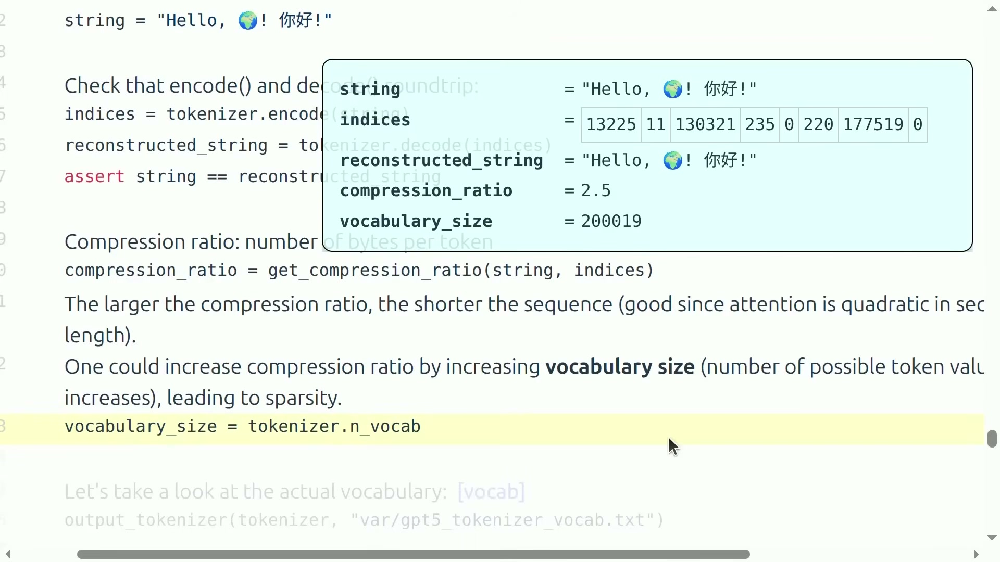
*图 11：同一示例的 `compression_ratio=2.5`，`o200k_base` 的现场 `vocabulary_size=200019`；扩大词表可缩短序列，却会增加类别稀疏性。（字幕区间：01:07:25--01:08:25）*

更短序列可降低标准 attention 的二次成本，但不能无限扩大词表。更大的 vocabulary 会增加 embedding 和输出层参数，让大量 token 更稀疏、训练样本不足。现实 tokenizer 常有 100K 或 200K 词表，正是在序列长度与词表利用率之间折中。

#### 6.3.1 词表—序列长度权衡的定量骨架

为什么“扩大词表缩短序列”不能无限进行下去？把账算开。设语料总量为 $B$ bytes，词表大小为 $V$，平均压缩比为 $r(V)$（bytes/token，随 $V$ 递增但增速递减）。三个量随之变化：

1. **序列长度与训练成本**：token 总数 $D \approx B / r(V)$。词表越大，$r$ 越大，$D$ 越小，attention 成本按平方受益（3.2 节）；但收益递减——$r$ 的增长速度随 $V$ 快速放缓，因为低频子串能贡献的合并越来越少。
2. **参数成本**：embedding 与输出层各含 $V \cdot d_{\text{model}}$ 参数。以 $d_{\text{model}} = 4096$ 计，词表从 32K 扩到 200K 增加约 $2 \times 168000 \times 4096 \approx 1.4\times10^{9}$ 参数，对小模型而言这可以占到总参数的相当比例，直接挤占 $C \approx 6ND$ 账本中 $N$ 的预算。
3. **统计成本**：每个 token 类型在训练集中出现的期望次数约为 $D \cdot p_t$（$p_t$ 为该 token 的频率）。词表越大，频率分布尾部越长，稀有 token 的 embedding 与输出向量在整个训练中只被更新寥寥数次，参数处于事实上的欠训练状态——词表在“名义容量”与“有效容量”之间出现落差。

把三条放在一起，最优 $V$ 出现在“再扩大词表带来的序列缩短收益”与“参数和稀疏性成本”相等的位置。100K–200K 这个当代常见区间，正是英语为中心、多语言与代码并重语料上的经验平衡点；语料构成变化（例如纯英文 vs 强多语言 vs 加入大量代码与数学符号）会移动这个平衡点。这也是为什么 tokenizer 设计与数据 pipeline 同属一个优化问题，而不是可以独立决定的前置步骤。

### 本章小结

- Tokenizer 是 string 与 integer sequence 之间的可逆接口。
- Roundtrip 是必要条件，但不是效率或质量的充分条件。
- Token 边界由训练与规则决定，不等于词、字符或可见符号。
- Compression ratio 越高通常序列越短，但更大词表会带来参数与稀疏性成本。

## 7. 字符、字节与词：三种朴素方案为何都不够好

在进入 BPE 之前，先把三个最直观的候选方案推到极限，看清它们各自的死穴。这个“先排除朴素解”的过程不是教学铺垫，而是设计论证本身：BPE 的每一条性质，都对应着这三个方案中某一条具体的失败。

### 7.1 Character tokenizer：可逆但“大词表 + 长序列”

Python `str` 可按 Unicode code point 迭代，于是最直接的 tokenizer 是：

```python
class CharacterTokenizer(Tokenizer):
    def encode(self, string):
        return list(map(ord, string))

    def decode(self, indices):
        return "".join(map(chr, indices))
```

例如 `ord("a") == 97`，`ord("🌍") == 127757`。现场示例能 roundtrip，但观察到的最大 ID 推出的 `127758` 只是该示例所需词表的下界，不是 Unicode 字符总数。课程用约 150K characters 说明：词表很大，且许多 code point 极少出现；与此同时，一个 code point 通常仍占一个 token，压缩率并不高。

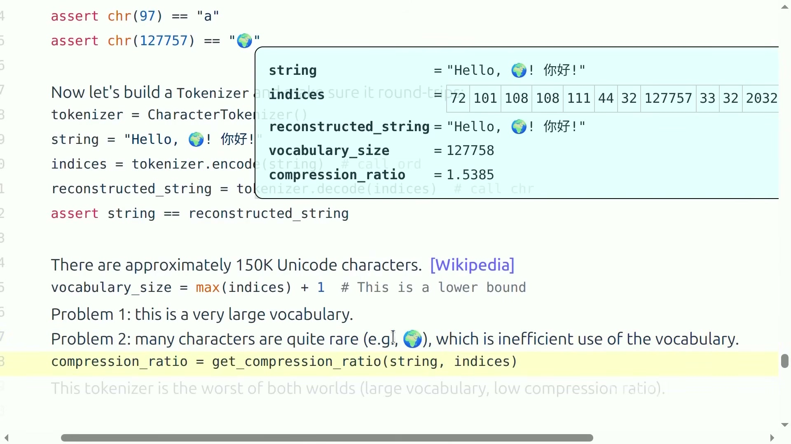
*图 12：同一字符串被映射为 code point ID；现场下界 vocabulary size 为 127758，compression ratio 约 1.5385。（字幕区间：01:08:34--01:09:45）*

还要注意，Unicode code point 不总等于用户看到的 grapheme cluster。组合音标或某些 emoji 可能由多个 code point 组成。

#### 7.1.1 定量检查

roundtrip 的正确性由 `ord` 与 `chr` 互为逆映射保证，无需多言；问题全在效率一侧。以课堂示例 `"Hello, 🌍! 你好!"` 验算：字符串含 13 个 code point（英文字母与标点各 1 byte，🌍 为 4 bytes，中文字符各 3 bytes，UTF-8 合计 20 bytes），于是

$$
\text{compression ratio} = \frac{20}{13} \approx 1.5385,
$$

与图 12 的现场输出一致。词表一侧的问题更棘手：Unicode 已分配的 code point 超过 14 万个，潜在空间达 $0 \sim 10FFFF_{16}$，而其中绝大多数（稀有文字、历史字符、未使用平面）在训练语料中出现次数极少甚至为零。6.3.1 节的稀疏性分析在这里完全适用：一个 150K 的词表，实际高频使用的可能只有几千项，其余全部是占用 embedding 参数却几乎得不到梯度更新的死重。Character tokenizer 因此同时吞下“大词表”与“长序列”两颗苦果，是三个方案中两头都不讨好的一个。

### 7.2 Byte tokenizer：固定 256 词表但序列最长

UTF-8 把任意 Unicode string 编码为 0–255 的 bytes：

```python
bytes("a", encoding="utf-8")   # b"a"
bytes("🌍", encoding="utf-8")  # b"\xf0\x9f\x8c\x8d"
```

Byte tokenizer 的词表固定为 256，覆盖所有合法 UTF-8 文本，也没有 OOV。但一个 byte 就是一个 token，因此：

$$
\text{compression ratio}=1.
$$

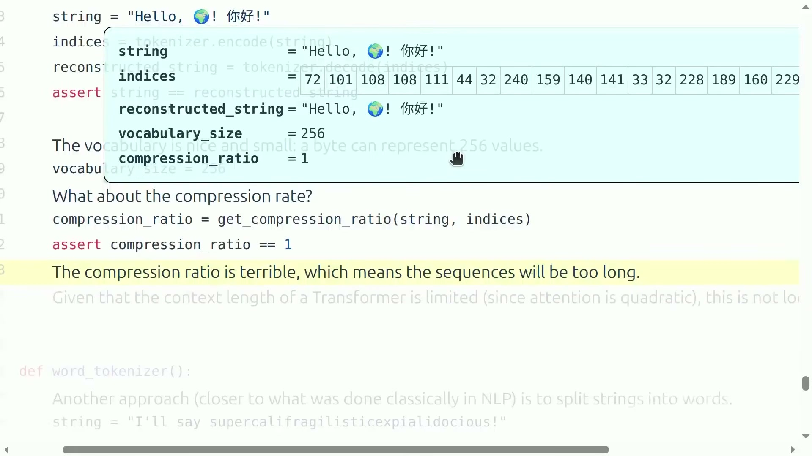
*图 13：emoji 和中文字符展开为多个 UTF-8 bytes；vocabulary size 固定为 256，但 compression ratio 恰为 1。（字幕区间：01:09:47--01:10:45）*

小词表不自动等于高效：序列更长会放大 attention 成本。课程认为端到端 byte-level 模型值得探索，但授课时点尚未扩展到前沿模型规模。

#### 7.2.1 为什么 256 是“正确但不够”的基线

Byte 方案有两个其他方案无法同时具备的优点，值得明确记录。第一，**完备性**：任何 Unicode 字符串都有 UTF-8 编码，词表 256 个 token 恒够，OOV 问题在定义上不存在；第二，**均匀性**：256 个 token 每一个都在语料中大量出现，词表利用率接近 100%，没有 character 方案的死重。它唯一但致命的缺点是序列长度：对同一段文本，byte 序列长度恒等于 byte 数，对比 7.1.1 的例子，20 bytes 对应 20 个 token，是 `o200k_base`（8 个）的 2.5 倍。按 3.2 节的平方关系，attention 成本约放大 $6.25$ 倍；对长文档，这个倍数直接决定上下文窗口能装多少真实内容。Byte 方案因此更像一个“理论基线”：它证明完备覆盖与小词表可以同时成立，剩下的问题只是如何在不放弃这两个优点的前提下把序列压短。

### 7.3 Word tokenizer：语义清楚却无法封闭词表

教学实现用正则切分：

```python
chunks = regex.findall(r"\w+|.", string)
```

连续字母数字形成 chunk，其余字符单独保留。词具有较稳定语义，示例 compression ratio 可达到 5.5；但词表等于训练集中的 distinct chunks，长尾会非常大。测试时遇到新词，只能映射为 `UNK`，信息被抹掉，还会扭曲 perplexity。

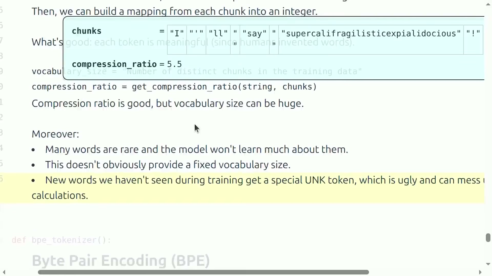
*图 14：教学正则给出可读 chunk，但新词必须落入 UNK，词表也没有自然上界。（字幕区间：01:10:45--01:11:58）*

这段正则只是教学例子，不等于现代 production tokenizer 的完整 pre-tokenization。

#### 7.3.1 OOV 失真的定量来源

Word 方案的压缩比确实诱人——按 Zipf 定律，语言中高频词集中度很高，用整词作 token 可以让绝大多数位置一步到位。但它的代价是结构性的：语言的词汇是**开放集**，新词（产品名、网络用语、拼写变体、代码标识符）持续产生，任何有限训练集确定的词表都无法封闭。设词表外词在测试语料中的占比为 $\gamma$，它们全部被折叠为同一个 UNK，后果有两层：其一，roundtrip 失败，UNK 无法解码回原词，生成端输出 UNK 等于输出乱码占位符；其二，perplexity 被系统性扭曲——所有词外词共享一个 ID，模型对它们的“预测”实际上是在预测“这里出现某个未知词”这个事件的概率，与真实文本概率不可比。早期神经机器翻译系统（word-level、词表 30K–50K）正是被这个问题反复折磨，这才有了 2016 年把 BPE 引入 NMT 的动机：需要一种方案，在保留“常见单位整体编码”的压缩收益的同时，让任何罕见单位都能分解为更小的已知片段。

### 7.4 三种方案的共同矛盾

| 方案 | 词表 | 序列 | 未见文本 | 主要失败 |
|---|---:|---:|---|---|
| Character | 大且含大量稀有项 | 较长 | 通常可表示 | 词表利用率低 |
| Byte | 固定 256 | 最长 | 完全覆盖 | compression ratio = 1 |
| Word | 巨大、开放 | 较短 | 依赖 UNK | 长尾、OOV、概率失真 |

理想方案应同时做到：从 byte 获得全覆盖；让常见片段合并以缩短序列；遇到罕见片段仍能退回更小单元。这正是 BPE 的设计位置。

把这张表与 6.1.1 的形式化对照，可以看出三种方案各自牺牲了什么：character 牺牲了词表效率，byte 牺牲了序列长度，word 牺牲了单射性（UNK 使 encode 不再可逆）。三个方案恰好占据设计空间的三个极端，而理想的第四条路需要**可变粒度**——粒度不能再是全局固定的（一律字符 / 一律字节 / 一律词），而要随片段频率自适应：高频片段用大粒度，低频片段退回小粒度，最低粒度必须有完备覆盖。这个要求用一句话概括就是：**让词表成为数据的函数，而不是先验固定的集合**。

### 本章小结

- Character tokenizer 可逆，却浪费大词表并保留较长序列。
- Byte tokenizer 只有 256 个 token，但 compression ratio 为 1。
- Word tokenizer 压缩好，却有巨大长尾和不可避免的 OOV/UNK。
- 关键矛盾是全覆盖、词表大小与序列长度无法由固定粒度同时解决。

## 8. Byte Pair Encoding：用数据学习可变粒度 chunk

### 8.1 BPE 的核心思想

BPE 最初是数据压缩算法，后来进入神经机器翻译，再被 GPT-2 用于语言模型。它从 256 个单 byte token 开始，反复合并训练语料中最常见的相邻 pair：

- 常见序列逐步变成一个 token；
- 罕见序列保留为多个较小 token；
- 任意 UTF-8 文本仍能退回 bytes 表示，不需要 UNK。

训练参数可写成：

```python
@dataclass(frozen=True)
class BPETokenizerParams:
    vocab: dict[int, bytes]
    merges: dict[tuple[int, int], int]
```

- `vocab`：token ID 到 byte sequence 的映射。
- `merges`：旧 token pair 到新 token ID 的映射。
- merge 的顺序本身也是参数；交换应用顺序可能改变编码结果。

对照 7.4 节提炼出的设计要求，BPE 的三条性质逐一回应：从 256 个 byte 出发保证了**完备覆盖**（任何输入的初始表示都存在）；按频率合并让**粒度随数据自适应**（高频片段长成大 token）；合并只增不删、最小单元始终保留，保证了**罕见片段可分解**（未参与合并的片段留在 byte 层）。注意 `merges` 用 dict 保存（Python 3.7+ 字典保序），其迭代顺序就是训练时的合并顺序——这不是实现细节，而是编码算法的语义组成部分：同一个词表配上不同顺序的 merges，是本质上不同的 tokenizer。

### 8.2 单次 merge 必须替换不重叠 pair

```python
def merge(indices, pair, new_index):
    new_indices = []
    i = 0
    while i < len(indices):
        if (
            i + 1 < len(indices)
            and indices[i] == pair[0]
            and indices[i + 1] == pair[1]
        ):
            new_indices.append(new_index)
            i += 2
        else:
            new_indices.append(indices[i])
            i += 1
    return new_indices
```

匹配成功后 `i += 2`，表示两个旧 token 同时被消费。Pair 计数允许相邻窗口重叠，但一次替换不能重叠。例如 `[x,x,x]` 中 pair `(x,x)` 在计数窗口里出现两次，左到右 merge 一轮只能合并其中一对。

#### 8.2.1 不重叠替换的正确性论证

这里藏着整个算法唯一需要小心的不变量，值得写清楚。**问题**：同一轮中，相邻窗口共享 token，若允许重叠替换，替换结果将依赖处理顺序且可能引入训练统计中不存在的 token 组合。**论证**：从左到右扫描，维护不变量“`new_indices` 中不含等于 `pair` 的相邻对”。扫描到位置 $i$ 时若命中 pair，则两个 token 同时消费（`i += 2`），新 token `new_index` 落位后，下一次检查从 $i+2$ 开始——新 token 右侧的邻接对可以是任何组合，但不会是 `pair` 本身，因为 `pair[0]` 是旧 token 而 `new_index` 是新分配的 ID；若未命中则单 token 前进（`i += 1`）。归纳可得，`merge` 返回的序列中不再存在任何相邻的 `pair` 出现——这是每一轮结束后的** Exhaustion 不变量**，它在 8.4 节的编码正确性论证中会再次用到。至于 `[x,x,x]` 的例子：计数时窗口 $(x_1,x_2)$ 与 $(x_2,x_3)$ 各计一次（计数允许重叠，这没有错——它如实反映了语料中该 pair 的邻接频率），替换时左起消费 $x_1, x_2$，$x_3$ 留下，一轮只合并一次。计数与替换使用不同的重叠规则，是算法的有意设计，不是疏漏。

### 8.3 训练循环：统计、选择、建词、替换

课程用 `"the cat in the hat"` 做三轮 merge：

```python
indices = list(map(int, string.encode("utf-8")))
vocab = {x: bytes([x]) for x in range(256)}
merges = {}

for i in range(num_merges):
    counts = count_adjacent_pairs(indices)
    pair = max(counts, key=counts.get)
    new_index = 256 + i
    merges[pair] = new_index
    vocab[new_index] = vocab[pair[0]] + vocab[pair[1]]
    indices = merge(indices, pair, new_index)
```

第一轮 `(116,104)` 即 bytes `t,h` 出现两次，创建 token 256 表示 `b"th"`。第二轮将 `(256,101)` 合并为 257，即 `b"the"`。第三轮因同频 pair 的插入顺序选择 `(257,32)`，创建 258，表示 `b"the "`。课堂也明确指出有 ties；生产实现必须规定确定的 tie-breaking，不能依赖偶然字典顺序。

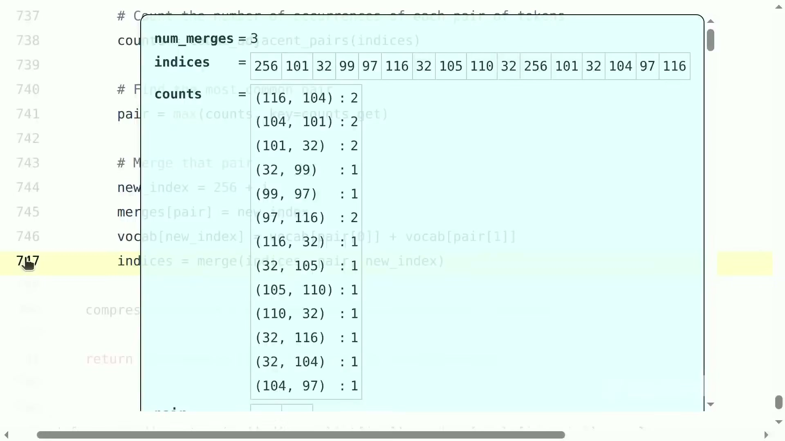
*图 15：`th` 已由 256 代替；pair 统计仍显示多组同频候选，解释了 tie-breaking 为什么必须显式定义。（字幕区间：01:13:20--01:15:07）*

相邻 pair 的统计很直接：

```python
def count_adjacent_pairs(indices):
    counts = defaultdict(int)
    for index1, index2 in zip(indices, indices[1:]):
        counts[(index1, index2)] += 1
    return counts
```

每一轮都会让 vocabulary 增加 1，让训练序列缩短若干位置。这个 toy corpus 三轮后 compression ratio 为 1.5。

#### 8.3.1 逐步步进示例：四轮 merge 完整演示

课堂的 `"the cat in the hat"` 演示了机制；为了看清“词表随数据生长”的全貌，我们再用一个有词频的小语料完整走四轮。为可读性用字符而非 byte 展示（真实实现从 256 个 byte 出发，机制完全相同）。设语料为四个词及其频次（`_` 表示词尾空格，作为显式的词边界符号）：

| 词 | 频次 | 初始序列 |
|---|---:|---|
| `low_` | 5 | `l o w _` |
| `lower_` | 2 | `l o w e r _` |
| `newest_` | 6 | `n e w e s t _` |
| `widest_` | 3 | `w i d e s t _` |

初始词表为全部出现的单字符。按频次加权统计相邻 pair（各序列的 pair 计数乘以其频次），逐轮合并：

**第 1 轮**。高频 pair 候选：$(e, s)$ 出现于 `newest_`（6 次）与 `widest_`（3 次），共 9 次，为全场最高。合并为 token `es`。语料变为：`l o w _`×5，`l o w e r _`×2，`n e w es t _`×6，`w i d es t _`×3。词表新增 `es`。

**第 2 轮**。新的高频 pair：$(es, t)$ 同样出现 $6+3=9$ 次。合并为 `est`。语料：`l o w _`×5，`l o w e r _`×2，`n e w est _`×6，`w i d est _`×3。词表新增 `est`。

**第 3 轮**。$(est, \_)$ 出现 9 次，合并为 `est_`。语料：`l o w _`×5，`l o w e r _`×2，`n e w est_`×6，`w i d est_`×3。词表新增 `est_`。

**第 4 轮**。$(l, o)$ 出现于 `low_`（5 次）与 `lower_`（2 次），共 7 次，为当前最高。合并为 `lo`。语料：`lo w _`×5，`lo w e r _`×2，`n e w est_`×6，`w i d est_`×3。词表新增 `lo`。

四轮下来，词表从 11 个单字符增长到 15 个 token；后缀 `est_` 整体成为一个 token——它恰好是英文最高级后缀，这不是巧合，而是频率统计对形态学规律的自然捕捉（这正是 Sennrich 等人当年把 BPE 引入 NMT 时展示的原始例子）。编码一个新词如 `lowest_`：从字符序列 `l o w e s t _` 出发，按 merge 顺序应用——`es` 命中得 `l o w es t _`，`est` 命中得 `l o w est _`，`est_` 命中得 `l o w est_`，`lo` 命中得 `lo w est_`，最终 3 个 token。注意 `lowest_` 从未出现在训练语料中，却被分解为三个已学习的片段，无需 UNK——这就是 7.3 节 OOV 问题的正面回答。

### 8.4 编码与解码

训练完成后，编码新文本从 UTF-8 bytes 开始，按训练顺序应用 merge：

```python
class BPETokenizer(Tokenizer):
    def encode(self, string):
        indices = list(map(int, string.encode("utf-8")))
        for pair, new_index in self.params.merges.items():
            indices = merge(indices, pair, new_index)
        return indices

    def decode(self, indices):
        bytes_list = list(map(self.params.vocab.get, indices))
        return b"".join(bytes_list).decode("utf-8")
```

对 `"the quick brown fox"`，最初的 `the ` 被 token 258 表示，其余未学到的部分退回单 bytes，仍然可以完整解码。

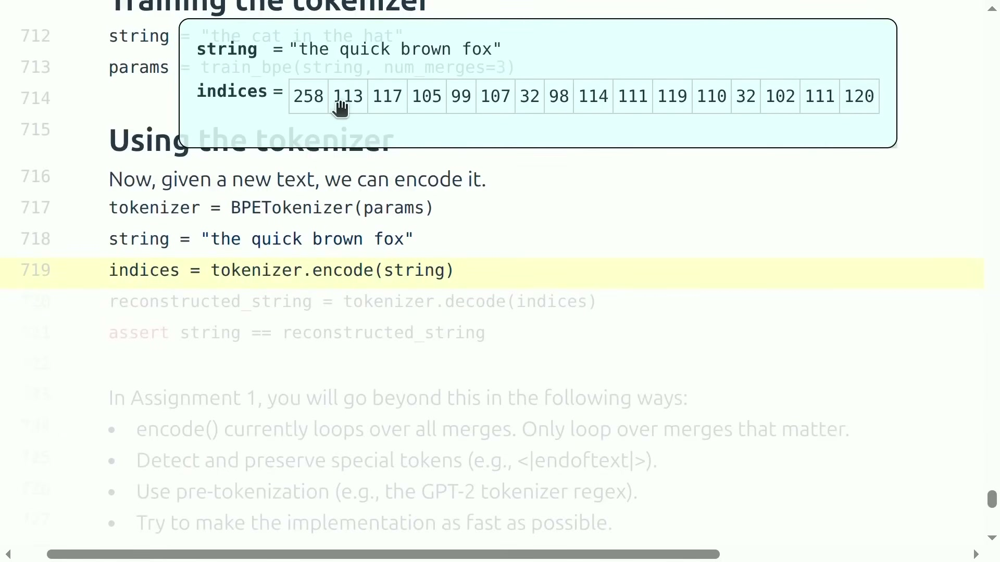
*图 16：`the ` 被压成 ID 258，其余罕见片段仍由 byte ID 组成，体现“常见片段合并、罕见片段退化”的原则。（字幕区间：01:15:21--01:16:06）*

#### 8.4.1 按序贪心应用的正确性

编码循环按 merge 的训练顺序逐条应用，这相当于一种贪心策略；它的正确性依赖 8.2.1 的 Exhaustion 不变量加一个秩论证。把 merges 按训练顺序编号 $1, 2, \dots, M$（秩越小越早）。**不变量**：应用完秩 $r$ 的 merge 后，(i) 序列中不再存在秩 $\le r$ 的任何 pair；(ii) 序列中每个 token 都是秩 $\le r$ 的合并结果（或原始 byte）。**归纳步骤**：应用秩 $r+1$ 的 merge 时，新产生的 token $T_{r+1}$ 是刚刚创建的 ID；任何因它落位而新形成的相邻 pair 必然包含 $T_{r+1}$，而这样的 pair 在训练时只可能在第 $r+1$ 轮之后才存在（它的组成部分此前不存在），因此其秩必大于 $r+1$——**应用高秩 merge 永远不会重新引入低秩 pair**，(i) 对 $r+1$ 保持。由归纳法，处理完全部 $M$ 条规则后结果唯一确定，与扫描顺序无关。这也说明为什么“按秩贪心”恰好复现训练行为：在训练语料上，编码过程逐步重放的正是训练时的合并历史，二者逐轮等价。对训练语料之外的文本，同一论证保证编码结果唯一，只是某些 pair 从不命中，序列退化到更小的单元。

#### 8.4.2 解码的可逆性

`decode` 只做一次查表加拼接。其可逆性来自合并操作的定义：`vocab[new_index] = vocab[pair[0]] + vocab[pair[1]]`，即每个新 token 的 byte 串恒等于其两个成分的拼接。对任意 token 序列做 $\sum_i \text{len}(\text{vocab}[id_i])$ 的 byte 计数，合并前后不变；编码从原始 byte 序列出发、每次合并都保持拼接等价，故 $\operatorname{decode}(\operatorname{encode}(s))$ 重构出的 byte 序列与 $s$ 的 UTF-8 编码逐字节相同，再经 UTF-8 解码即得原字符串。Roundtrip 成立——而且它不要求输入出现在训练语料中，这正是 6.1.1 单射性要求在 BPE 上的兑现。

### 8.5 教学实现正确，但工程上极慢

课程代码会遍历所有 merge rules 并反复扫描整个序列。若 vocabulary 有 $V$ 项，规则数量约为 $V-256$；大词表下代价很高。Assignment 1 要求：

1. 只处理当前序列真正相关的 merges，并建立合适索引；
2. 识别并保护 `<|endoftext|>` 等 special token；
3. 使用 GPT-2 tokenizer regex 一类 pre-tokenization，先把长文本切成 chunk；
4. 尽可能优化速度，必要时可使用 Rust、C 等实现。

#### 8.5.1 慢在哪里：复杂度拆解

把教学实现的成本写清楚，优化方向就自然浮现。编码一条长为 $n$ 的序列、规则数为 $M = V - 256$：外层循环 $M$ 条规则，每条规则全序列扫描一次 $O(n)$，合计 $O(Mn)$。对 $V = 200\text{K}$ 词表与一段 $n = 10^4$ 的文本，这是约 $2\times10^{9}$ 次操作的量级，且每一步都是 Python 解释器逐元素执行。训练侧同理：朴素实现每轮重新统计全语料的 pair 频率，$M$ 轮合计 $O(M \cdot N_{\text{corpus}})$，其中绝大多数 pair 计数在两轮之间根本没有变化。对应的经典优化包括：训练时按词（或 pre-token chunk）聚合频次、用堆维护 pair 计数、只增量更新受上一轮合并影响的邻接位置（类似 Huffman 编码的构建，复杂度可降到接近 $O(N_{\text{corpus}} \log V)$）；编码时按 chunk 内出现的 token 反查相关规则（建立 token → merges 的索引），让实际应用的规则数远小于 $M$。Pre-tokenization 在其中扮演双重角色：既把长文本切成短 chunk 缩小每次扫描的 $n$，又划定了 merge 不得跨越的语义边界（数字、单词、标点各自成块，避免“逗号 + 下一词”这类无意义合并）。

容易忽略的陷阱包括：

- `merges` 必须保留训练顺序；
- special token 不能当普通 byte sequence 被拆散；
- 任意 token ID 拼出的 bytes 未必是合法 UTF-8，只有合法 `encode` 输出可保证 roundtrip；
- BPE 优化频率与序列长度，不保证边界符合人类语义；
- pre-tokenization 不只是加速，也限制不希望跨越的 merge 边界。

### 8.6 BPE 是有效启发式，不是终点

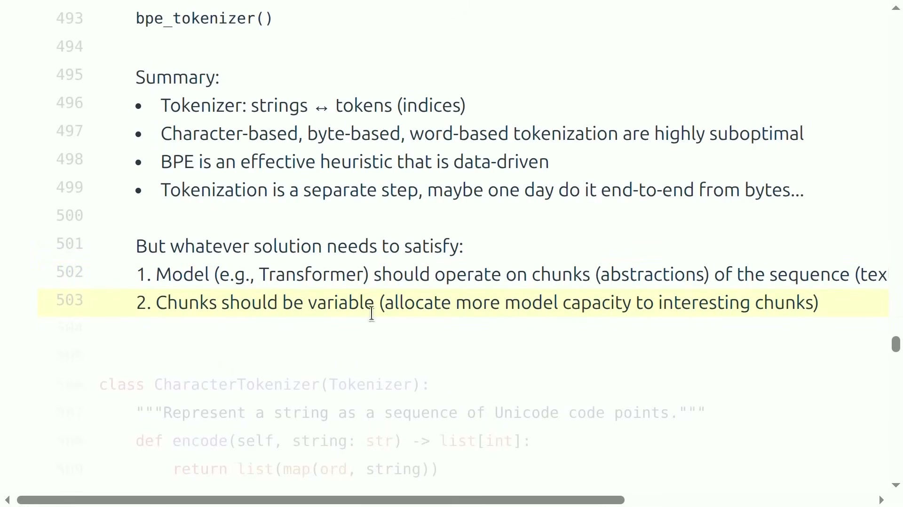
*图 17：即使未来端到端从 bytes 学习，模型仍需要序列抽象，并让 chunk 粒度随信息内容变化。（字幕区间：01:17:31--01:18:58）*

课程对未来方案提出两个比“必须使用 BPE”更本质的要求：

1. Transformer 应在序列的 chunks / abstractions 上工作，而不是平等对待每一个低层 byte；
2. chunk 应可变，把更多模型容量分配给有信息、难预测或“有趣”的位置。

#### 8.6.1 压缩收益的来源：变长编码的视角

BPE 为什么有效？用信息论的语言可以给出干净直觉。定长编码（byte tokenizer）给每个单位分配相同的编码成本（1 token），无视其出现频率；而信源编码的基本结论是：**最优码长应与单位的惊异度（surprisal）$-\log p$ 匹配**——高频单位用短码，低频单位用长码。BPE 恰好是这个原则的一种贪心实现：每轮合并把语料中当前最高频的相邻 pair 提升为一个单位，等于反复把最短的编码（1 token）授予当前最频繁的片段；未被合并的罕见片段保持更长的多 token 编码。这与 Huffman 编码“按频率构建最优前缀码”在精神上同源，只是 BPE 用简单的迭代合并替代了严格的最优性。由此也解释了它的两个局限：其一，频率是唯一的准则——语义上重要但频率不高的边界（如数学符号与变量之间）不会被特殊对待；其二，分块在训练完成后冻结——同一文本在任何上下文中都得到相同的切分，无法根据当前任务的难点动态调整粒度。

视频、DNA 等序列更能说明这一点：原始单位可能低信噪比，建模前需要抽象；不同区段又不应获得相同计算。BPE 用频率启发式近似这种 variable computation，但未来可以由端到端模型学得更动态的分块。

#### 8.6.2 通往可学习分块的方向

把上面两条局限反过来说，就是下一代 tokenization 的研究议程：让分块本身成为模型的一部分、随上下文动态决定。Byte-level 的层级模型（如 MEGA-byte 及后续工作）尝试用小型 byte 模型加 patch 化的大模型组合，把“多少 byte 聚成一个 patch”交给学习；更激进的端到端方案让模型直接预测边界的概率。截至授课时点，这类方法尚未在前沿规模上取代 BPE——原因回到本讲反复出现的主题：BPE 的实现成熟、压缩率高、与现有训练与推理栈完全解耦，替换它的收益必须覆盖整条链路的工程成本。这也正是把 tokenization 放在 Lecture 1 的最后用意：它看似只是文本预处理，实际上把表示、数据、系统与 scaling 四条线全部牵动，是全课问题的一个可完整实现的缩影。

### 本章小结

- BPE 从单 bytes 出发，通过频繁相邻 pair 的迭代合并学习词表。
- 常见序列变成单 token，罕见序列退回小单元，因此同时获得压缩与全覆盖。
- Merge order、tie-breaking、不重叠替换和 special token 都是正确性要求。
- 朴素实现虽然完整，却需要索引、pre-tokenization 与底层优化才能实用。
- BPE 是数据驱动的有效启发式；更长期目标是可学习、可变粒度的序列抽象。

## 总结与延伸

Lecture 1 建立了一条贯穿全课的因果链：

```text
前沿模型规模巨大且细节不透明
        ↓
不能只复制结果，要学习可迁移的机制与方法
        ↓
固定资源下，效率决定能做多少有效学习
        ↓
Basics / Systems / Scaling / Data / Alignment
分别优化表示、搬运、决策、样本与反馈
        ↓
Tokenization 成为第一个完整案例
```

真正值得保留的结论有四层：

1. **研究方法**：构建、运行、profile、benchmark，比只记住某个模型名称更可迁移。
2. **尺度意识**：小模型适合验证 mechanics，却可能给出错误的大模型 intuition。
3. **资源意识**：计算、内存、通信和数据都有限；局部算法改进只有进入完整资源账本才有意义。
4. **表示意识**：Tokenizer 不是文本预处理的边角步骤，它决定序列长度、词表容量、计算分配和可表达范围。

沿这条线继续学习时，可以带着三个检查问题：

- 这个结论是可证明的 mechanics，经过测量的经验，还是可能随规模变化的 intuition？
- 它节省的是 FLOPs、memory bytes、通信、训练 token，还是推理 latency？
- 局部优化是否在新的规模、数据分布和部署目标下仍然成立？

下一讲从 resource accounting 开始，把这里的效率 framing 进一步变成可计算的 Transformer 资源账本——4.1 节推导的 $C \approx 6ND$ 只是第一步，届时我们将按层、按操作、按字节逐一拆解一个真实训练步的成本构成。

### 本章小结

- 本讲用 tokenization 建立了“机制理解、资源核算与可执行验证”这条全课主线。
- Tokenizer 同时影响表示粒度、序列长度、词表容量与后续 Transformer 成本。
- 学习任何规模化结论时，都应同时检查事实边界、资源口径和尺度迁移条件。
