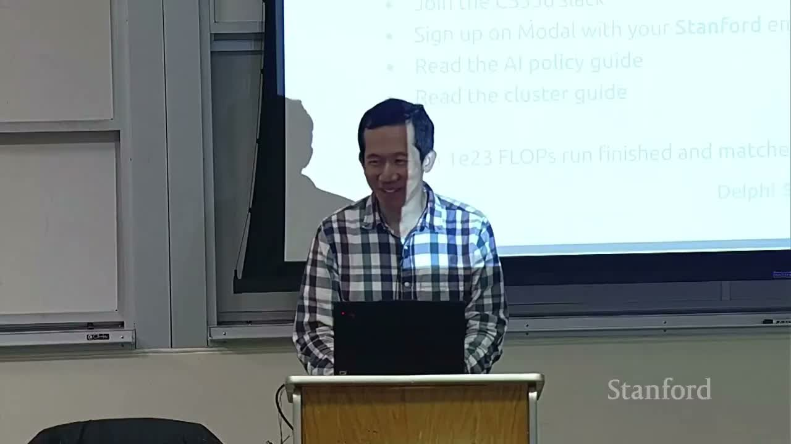
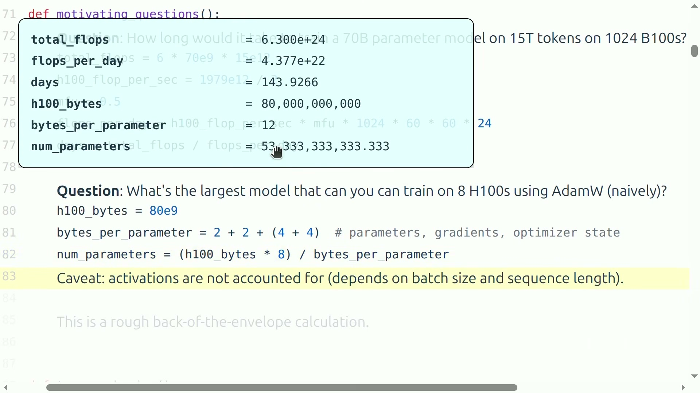
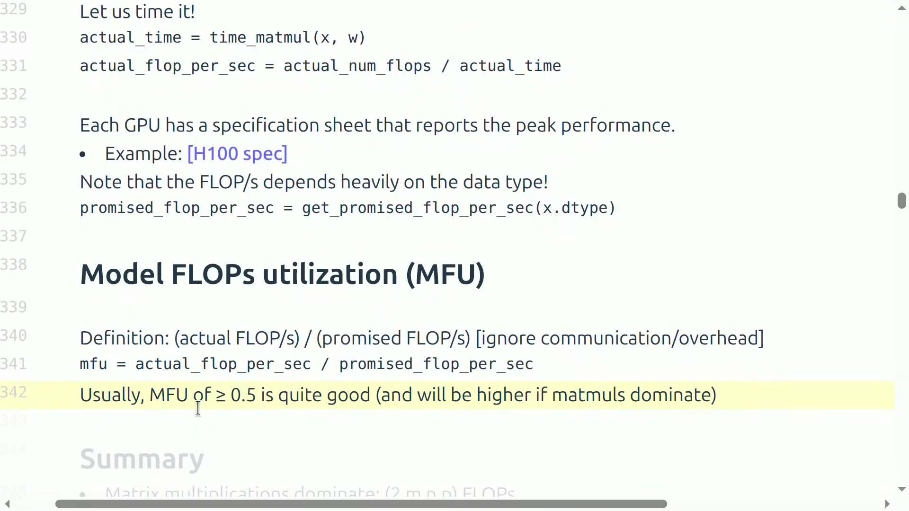
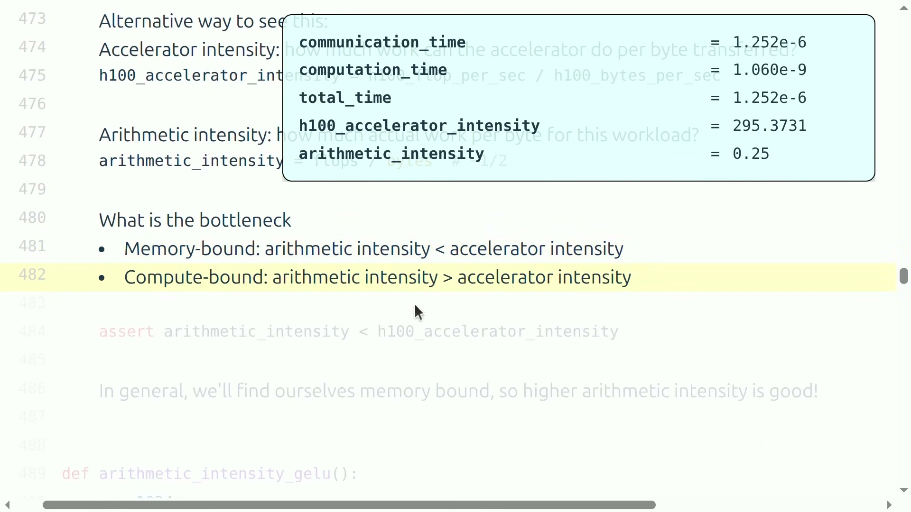
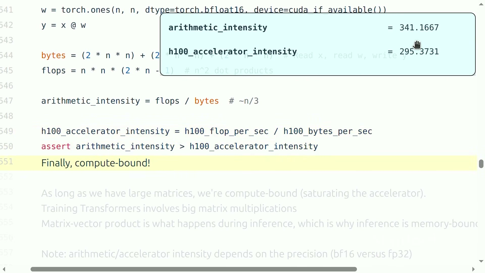
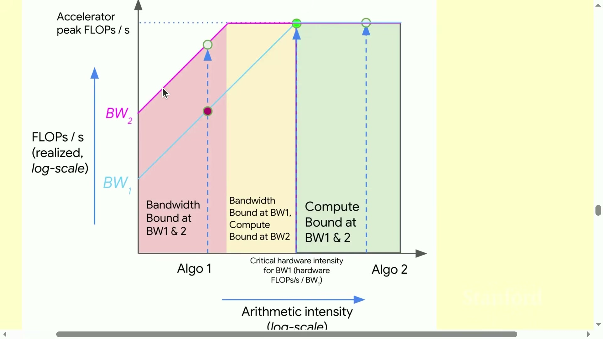
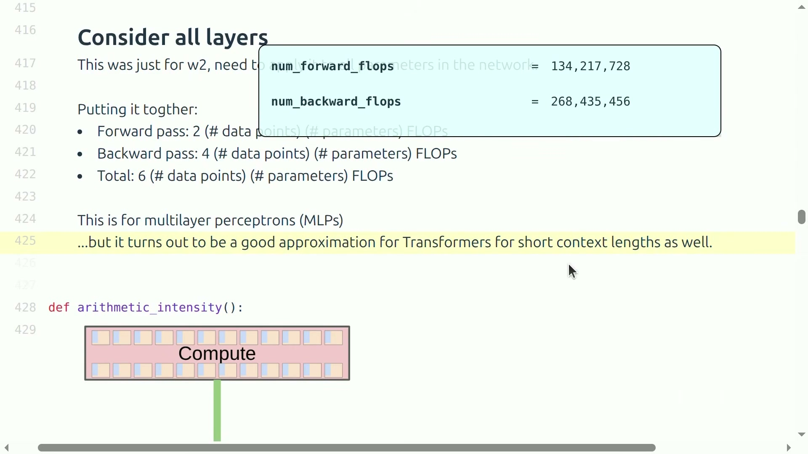
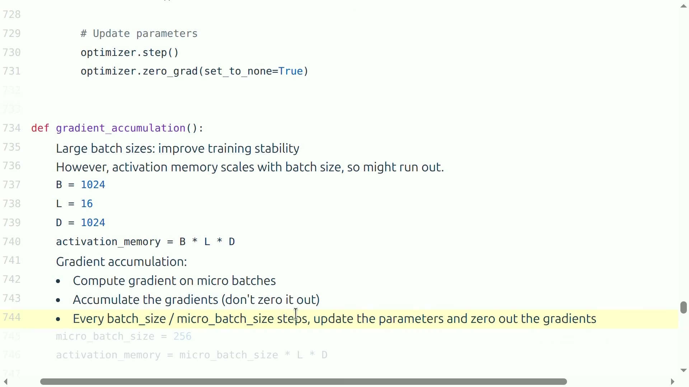
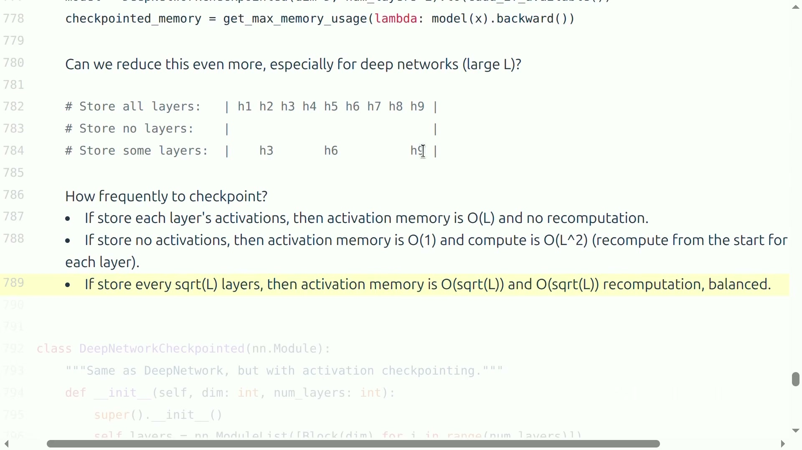
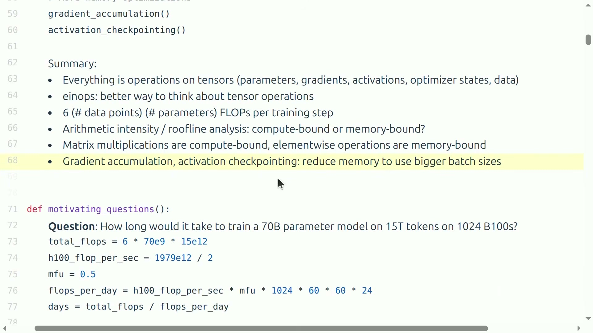

# Stanford CS336 2026 第 2 讲：PyTorch、einops 与训练资源核算

- 课程：Stanford CS336 — Language Modeling from Scratch
- 讲次：Lecture 2 — PyTorch (einops)
- 频道：Stanford Online
- 时长：01:17:25
- 原视频：[YouTube](https://www.youtube.com/watch?v=kuYAsz7zspQ)
- 讲义依据：英文人工字幕、课程视频画面与官方 <code>lecture_02.py</code>

> [!IMPORTANT]
> 这讲并不是一份 PyTorch API 速查表。它建立的是训练语言模型所需的“资源会计学”：任何对象先还原成张量，再追踪它的 shape、dtype、device、FLOPs、内存流量和生命周期。后续实现 Transformer、优化训练吞吐或排查 OOM，都依赖这套语言。

## 导读：从一行 PyTorch 代码看到整台训练机器

### 这讲要解决什么问题

看到 <code>y = x @ w</code> 时，初学者通常只问“结果是多少”；这讲要求继续追问：

1. <code>x</code>、<code>w</code> 和 <code>y</code> 的每个维度分别代表什么？
2. 每个元素用多少字节，张量存放在 CPU 还是 GPU？
3. 这次运算做了多少 FLOPs，用了多少秒，利用了硬件峰值的几成？
4. 时间到底花在算术单元，还是花在显存搬运？
5. 反向传播、优化器状态与激活又会把计算和显存放大多少？

这五个问题串成了本讲的教学主线：

**张量表示 → dtype 与显存 → einops 与维度语义 → FLOPs/MFU → 算术强度/Roofline → 反向传播 → 优化器与训练循环 → 显存换计算。**

这条主线的内在逻辑值得先点明：第 1、2 问回答“对象是什么、放在哪里”，对应张量的 shape、dtype、device 三份元数据；第 3 问把代码翻译成算术工作量，即 FLOPs 计数与实际吞吐；第 4 问区分两类本质不同的瓶颈——计算受限与带宽受限，对应算术强度与 Roofline 模型；第 5 问把视角从单个算子扩展到完整训练步，反向传播、优化器状态与激活保存会让“前向看起来很小”的模型消耗数倍的计算与显存。学完整讲后，读者面对任何一段训练代码，都应当能回答三个工程判断：**能否放下（显存账）、要跑多久（时间账）、瓶颈在哪里（Roofline 账）**。

### 初学者需要的最少前置知识

- **标量、向量、矩阵**：分别可看成 rank 0、rank 1、rank 2 的张量。
- **矩阵乘法**：内侧维度相等，并沿该维度做“乘后求和”。
- **导数与链式法则**：反向传播只是把局部导数按计算图从后往前组合。
- **二进制位**：1 byte = 8 bits；dtype 的位数直接决定单元素存储成本。
- **数量级估算**：先忽略小项得出可用上界，再逐项补回通信、激活与系统开销。

其中最后一项——数量级估算（napkin math 或 back-of-the-envelope calculation）——是本讲反复强调的工作方式。它的方法论可以概括为三步：先确定主导项（例如矩阵乘法的 FLOPs），用主导项算出量级；再列出被忽略的次要项（例如通信、激活、kernel 启动）；最后把结论标注为上界、下界或经验估计。这样做不是为了偷懒，而是因为昂贵实验的成本结构通常在量级阶段就已经确定，小数点后的精确并不改变决策。

> [!NOTE]
> 讲者在开头提到 Marin 的 $10^{23}$ FLOPs 训练实验按期完成，用它强调：训练规模虽然巨大，却可以被资源模型提前预测。napkin math 不是追求小数点后的“精确”，而是帮助我们在启动昂贵实验前发现数量级错误。

### 本章小结

- 一行张量代码同时隐含 shape、dtype、device、计算量与数据移动。
- 本讲的目标是形成统一的资源核算框架，而不是孤立记忆 API。
- 后文每个公式都服务于一个实际判断：能否放下、要跑多久、瓶颈在哪里。

## 一、先做两道数量级估算

在展开任何理论之前，我们先用两道估算题建立“手感”。这两道题分别对应训练资源核算的两个基本维度：**时间**（给定模型与数据规模，训练要多久）与**空间**（给定硬件显存，最多能放下多大的模型）。读者不必记住具体数字，而应掌握每一步把物理量换算成另一个物理量的方法。

### 1. 训练 70B 模型需要多久

对以矩阵乘法为主、上下文不太长的 Transformer，训练总计算量常用 $6NP$ 粗估。把参数量 $P=70\times10^9$、训练 token 数 $N=15\times10^{12}$ 代入：

$$
C_{\text{train}} \approx 6NP
$$

- $C_{\text{train}}$：完整训练所需浮点运算数，单位 FLOPs。
- $N$：训练中处理的数据点数；语言模型里通常近似为 token 数。
- $P$：模型参数量。
- 系数 $6$：前向约 $2NP$，反向约 $4NP$，后文会推导。

先把分子算出来。代入数值，逐步合并数量级：

$$
C_{\text{train}}
\approx 6 \times \left(70\times10^{9}\right) \times \left(15\times10^{12}\right)
= 6\times 70 \times 15 \times 10^{21}
= 6300\times10^{21}
= 6.3\times10^{24}\ \text{FLOPs}
$$

- $70\times10^{9}$：70B 参数量。
- $15\times10^{12}$：15T token。
- $6\times70\times15=6300$：三个有效数字部分相乘。
- $10^{9}\times10^{12}=10^{21}$：两个数量级部分相加。

也就是说，这次训练大约要做 $6.3\times10^{24}$ 次浮点运算——即 6.3 YottaFLOPs。这个数字本身没有意义，只有除以集群每天能完成的有效计算量，才能变成时间。

一张 H100 的稠密 16 位矩阵乘法峰值按课件取 $1979/2$ TFLOP/s，再乘 50% MFU、1024 张卡和每天的秒数：

$$
C_{\text{day}}
=
\frac{1979\times10^{12}}{2}
\times 0.5
\times 1024
\times 86400
$$

- $C_{\text{day}}$：1024 张 H100 一天实际可完成的 FLOPs。
- $1979\times10^{12}$：带结构化稀疏时的标称 FLOP/s。
- 除以 $2$：换成不利用稀疏的稠密峰值。
- $0.5$：假定 MFU 为 50%。
- $1024$：GPU 数量。
- $86400$：一天的秒数。

逐项计算这个乘积。第一步，把稀疏峰值折成稠密峰值：

$$
\frac{1979\times10^{12}}{2} = 989.5\times10^{12}\ \text{FLOP/s（单卡稠密 16 位峰值）}
$$

第二步，乘 MFU，得到单卡有效吞吐：

$$
989.5\times10^{12}\times0.5 = 494.75\times10^{12}\ \text{FLOP/s（单卡有效）}
$$

第三步，乘卡数，得到集群有效吞吐：

$$
494.75\times10^{12}\times1024 \approx 5.066\times10^{17}\ \text{FLOP/s（1024 卡有效）}
$$

第四步，乘一天的秒数，得到集群日产能：

$$
C_{\text{day}} \approx 5.066\times10^{17}\times86400 \approx 4.377\times10^{22}\ \text{FLOPs}
$$

于是训练时间约为：

$$
T_{\text{days}}
=
\frac{6\times70\times10^9\times15\times10^{12}}
{C_{\text{day}}}
=
\frac{6.3\times10^{24}}{4.377\times10^{22}}
\approx 143.93\ \text{days}
$$

- $T_{\text{days}}$：训练天数。
- 分子：训练总 FLOPs。
- $C_{\text{day}}$：整套集群每天的有效计算量。

口头讲解把结果约成 143 天；按官方代码的数值实际约为 143.93 天，因此更稳妥的表述是“约 144 天”。这仍是理想化估算：未计入故障、评估、保存 checkpoint、数据等待与通信波动。工程中常见的做法是在此类理想值上乘一个 1.2–1.5 的“现实系数”，但系数的取值必须来自自身集群的历史数据，而不是拍脑袋。

#### 这道题教会我们的三件事

第一，**单位是检查器**。整个推导中，FLOPs 除以 FLOP/s 得到秒，每一步量纲都对得上；如果某一步把 FLOPs 乘了时间，量纲立刻报错——这正是 napkin math 防止大错的第一道防线。

第二，**假设必须显式写出**。这道题用了至少四个假设：$6NP$ 近似成立（忽略 attention 的序列二次项）、MFU 恒为 50%、1024 张卡全程可用、通信开销已被 MFU 吸收。任何一个假设变化，结论都会成比例变化。

第三，**结论要标注类型**。“约 144 天”是一个理想化下界（真实时间只会更长），而不是预测值。把估算结论分成上界、下界与经验估计三类，是专业资源核算的基本习惯。

### 2. 8 张 80 GB H100 最多放多大 AdamW 模型

第二道题问的是空间。训练时显存里同时驻留的不止参数本身，还有梯度与优化器状态。采用常见混合精度账本，每个参数至少对应：

- bf16 参数：2 bytes；
- bf16 梯度：2 bytes；
- fp32 Adam 一阶矩：4 bytes；
- fp32 Adam 二阶矩：4 bytes。

这里每一项都值得追问来源：参数为什么用 bf16——因为前向/反向计算希望吃满 Tensor Core 的 16 位峰值，且参数本身对舍入噪声不敏感；梯度为什么用 bf16——因为它是矩阵乘法的直接输出，与激活同精度便于流水线；而 Adam 的两个矩为什么必须用 fp32——因为它们是跨成千上万步累积的小量，bf16 的 7 位尾数会在累积过程中丢失有效增量（第七节会展开这一点）。

因此仅模型状态就需要：

$$
M_{\text{state/param}} = 2+2+4+4=12\ \text{bytes/parameter}
$$

- $M_{\text{state/param}}$：每个参数对应的模型状态显存。
- 四项依次是参数、梯度、一阶矩、二阶矩。

注意这 12 bytes 是一种特定口径：它假设参数与梯度只存 bf16 副本、优化器不额外保存 fp32 主权重。若采用带 fp32 master weights 的完整混合精度方案，还要再加 4 bytes，成为 16 bytes/parameter。两种口径在文献中都很常见，比较任何显存数字前必须先确认口径。

8 张 80 GB 卡的理论参数上界为：

$$
P_{\max}
=
\frac{8\times80\times10^9}{12}
=
\frac{640\times10^{9}}{12}
\approx 5.33\times10^{10}
=53.3\text{B}
$$

- $P_{\max}$：理论最大参数量。
- $8\times80\times10^9$：按十进制 GB 计算的总显存字节数。
- $12$：每参数模型状态字节数。

*图：讲者在完整揭示公式后得到约 53.33B，并立刻强调激活尚未计入。（字幕定位：00:02:51--00:03:35）*

> [!WARNING]
> 53.3B 是明显偏乐观的上界，不是“8 张 H100 真能直接训练 53B”的承诺。激活、临时 buffer、CUDA context、通信 bucket 和显存碎片都要占空间；若不做 ZeRO/FSDP 等切分，每张卡还可能持有完整模型副本。

这个警告值得展开。一个 53B 模型若真的按上式平铺到 8 张卡上，每张卡分到约 80 GB 的模型状态后，连一个字节的激活都放不下——而训练没有激活就无法反向传播。实践中，单步激活的峰值可能达到数十 GB（取决于 batch、序列长度与层数，见第七节的 $2BDL$ 项），CUDA context 与 allocator 碎片通常再吃掉数 GB。因此真实可用的参数上限往往要把理论值打对折甚至更多；这也正是 ZeRO、FSDP、梯度累积与激活检查点这些技术存在的理由（本讲最后两节逐步展开）。

### 一张可复用的 napkin-math 清单

估算训练资源时，按下面顺序最不容易漏项：

1. 明确总工作量：token 数、参数量、序列长度、训练步数。
2. 明确硬件理论值对应的 dtype，以及是否含稀疏加速。
3. 用 MFU 把理论峰值折成可实现吞吐。
4. 分清总集群资源与单卡资源。
5. 把结果标成上界、下界或经验估计，并写出忽略项。

这份清单的五步对应五种最常见的估算错误：工作量算错（把 token 数当样本数、漏掉序列维）、峰值拿错（拿稀疏峰值当稠密峰值、拿 bf16 峰值当 fp32 峰值）、忘记折算（把理论峰值当实际吞吐）、量级混乱（把单卡数字当集群数字或反之）、结论误读（把上界当承诺）。后文每一节都会反复回到这五步。

### 本章小结

- $6NP$ 把模型与数据规模转成训练 FLOPs，70B/15T/1024 H100 的理想估算约 144 天。
- AdamW 混合精度模型状态常按 12 bytes/parameter 起算，8×80 GB 的纯状态上界约 53.3B。
- 数量级估算的价值是暴露假设；任何未计入的激活、通信与系统开销都必须明确写出。

## 二、张量、dtype 与 device：先把显存账算清楚

### 张量不仅有数值，还有三份元数据

语言模型中的数据、参数、梯度、优化器状态和激活，最终都是张量。理解一个张量至少要同时看：

- **shape**：每个轴多长、语义是什么；
- **dtype**：每个元素如何编码、占多少字节；
- **device**：位于 CPU 内存还是某张 GPU 的显存。

例如 Transformer 常见 rank-4 激活可写成 $(B,S,H,D)$：

- $B$：batch size；
- $S$：sequence length；
- $H$：attention head 数；
- $D$：每个 head 的隐藏维度。

张量显存由元素个数与单元素字节数相乘：

$$
M_{\text{tensor}}
=
\left(\prod_{i=1}^{r} d_i\right)s
$$

- $M_{\text{tensor}}$：张量占用的字节数。
- $r$：张量 rank，即轴数。
- $d_i$：第 $i$ 个轴的长度。
- $s$：dtype 的单元素字节数。

例如默认 fp32 的 $4\times8$ 张量有 32 个元素，每个 4 bytes，共 128 bytes。GPT-3 前馈层中一个 $49152\times12288$ 的 fp32 权重矩阵约占 2.25 GiB，这说明 dtype 不是实现细节，而是模型能否放入设备的首要条件。

我们不妨把这个例子验算一遍，作为本节的第一个练习：

$$
49152\times12288 = 603{,}979{,}776 \approx 6.04\times10^{8}\ \text{个元素}
$$

$$
6.04\times10^{8}\times4\ \text{bytes} \approx 2.42\times10^{9}\ \text{bytes} = 2.42\ \text{GB} \approx 2.25\ \text{GiB}
$$

注意 GB（$10^9$ bytes）与 GiB（$2^{30}$ bytes）的差别：$2.42\times10^{9}/2^{30}\approx2.25$。硬件厂商标称显存用十进制 GB，而操作系统与 PyTorch 常按二进制 GiB 显示——80 GB 的 H100 实际显示约 74.5 GiB。做显存账时混用两个单位会产生约 7% 的系统性误差，必须在账本开头统一口径。

### fp32、fp16 与 bf16 的取舍

浮点数的本质是把一个实数编码为“符号、指数、尾数”三段二进制位：

$$
x = (-1)^{\text{sign}}\times 1.\text{mantissa}\times 2^{\text{exponent}-\text{bias}}
$$

- $\text{sign}$：符号位，0 为正、1 为负。
- $\text{mantissa}$：尾数，决定有效数字的位数，即相对精度。
- $\text{exponent}$：指数，决定可表示的数量级范围。
- $\text{bias}$：指数偏移，使指数可以表示负数；fp32 与 bf16 为 127，fp16 为 15。

三种 dtype 的差别完全在于这三段位数的分配。

*图：fp32 由 1 位符号、8 位指数和 23 位尾数组成。（对应视频字幕区间：00:05:56--00:07:16）*

*图：fp16 减少到 5 位指数、10 位尾数，显存减半但动态范围明显变窄。（对应视频字幕区间：00:07:16--00:09:00）*

*图：bf16 保留 fp32 的 8 位指数，只缩短尾数，因此兼顾 2-byte 存储与较大动态范围。（对应视频字幕区间：00:09:00--00:10:50）*

| dtype | 每元素 | 指数位 | 尾数位 | 训练中的主要特点 |
|---|---:|---:|---:|---|
| fp32 | 4 B | 8 | 23 | 范围和精度都较好，但显存与带宽成本高 |
| fp16 | 2 B | 5 | 10 | 精度尚可，动态范围窄，$10^{-8}$ 可能下溢为 0 |
| bf16 | 2 B | 8 | 7 | 动态范围接近 fp32，分辨率较粗，通常更适合大模型训练 |

这里要区分两个概念：

- **动态范围**决定“多大或多小的数还能表示”；
- **分辨率/精度**决定“相邻可表示数有多密”。

我们把三种格式的关键数值边界逐一算出来，以便后文引用。动态范围方面：fp32 与 bf16 的指数同为 8 位、bias 127，最大正规格数约为

$$
\left(2-2^{-23}\right)\times2^{128}\approx3.4\times10^{38}
\quad(\text{fp32}),\qquad
\left(2-2^{-7}\right)\times2^{128}\approx3.39\times10^{38}
\quad(\text{bf16})
$$

最小正正规格数均为 $2^{-126}\approx1.18\times10^{-38}$。而 fp16 只有 5 位指数、bias 15，最大可表示数只有 $65504$，最小正正规格数为 $2^{-14}\approx6.1\times10^{-5}$，再往下靠次正规数延伸到约 $5.96\times10^{-8}$。

分辨率方面，机器精度 $\varepsilon$（1 与下一个可表示数之间的相对间距）由尾数位决定：

$$
\varepsilon_{\text{fp32}}=2^{-23}\approx1.19\times10^{-7},\qquad
\varepsilon_{\text{fp16}}=2^{-10}\approx9.77\times10^{-4},\qquad
\varepsilon_{\text{bf16}}=2^{-7}\approx7.81\times10^{-3}
$$

bf16 不是“全面优于 fp16”：它用更多指数位换取范围，也因此只有更少尾数位。但深度学习往往更怕梯度直接上溢/下溢，而能容忍一定舍入噪声。

#### 为什么 bf16 在深度学习中取代了 fp16：梯度下溢分析

关键在梯度的典型量级。大模型训练中后期，许多参数的梯度绝对值落在 $10^{-6}$ 到 $10^{-9}$ 区间。对照上面的边界：fp16 的最小正次正规数约为 $5.96\times10^{-8}$，因此 $10^{-8}$ 量级的梯度在 fp16 中直接下溢为 0——不是“变得不精确”，而是完全消失，对应参数从此停止更新。而同一个值在 bf16 中距离下溢边界 $10^{-38}$ 还有 30 个数量级，安全得多。

另一方面，bf16 牺牲的精度（$\varepsilon\approx0.78\%$）对前向激活通常无害：激活值本身量级在 $O(1)$，0.78% 的相对扰动会被网络后续的归一化与大量参数的平均效应吸收。换句话说，深度学习对“范围不足”是硬失败（梯度清零、损失 NaN），对“精度不足”是软退化（收敛略慢、噪声略大）。bf16 用软退化换掉了硬失败，这是它成为大模型训练默认 dtype 的根本原因。fp16 并未被淘汰——推理与部分推理/训练混合场景仍常用它，因为推理没有梯度下溢问题，而 fp16 多出的 3 位尾数能带来更小的量化误差。

### 混合精度与 AMP

既然不同对象对范围和精度的敏感度不同，一个自然的策略是“按对象分配 dtype”，这就是混合精度训练。一个常见策略是让大体量对象使用 bf16，让跨很多步累积的小状态使用 fp32：

- 参数、激活、梯度：bf16；
- 优化器的一阶/二阶矩：fp32；
- 对数、指数、归一化等数值敏感操作：按框架策略保留更高精度。

为什么优化器状态必须是 fp32？以 Adam 的二阶矩为例，它是梯度平方的指数滑动平均：单步增量 $(1-\beta_2)g_t^2$ 在 $\beta_2=0.95$、$g_t\sim10^{-4}$ 时只有约 $5\times10^{-10}$，而状态本身约为 $10^{-8}$ 量级。若状态用 bf16 存储，增量相对状态的比值约 $5\%$、尚在 $\varepsilon_{\text{bf16}}\approx0.78\%$ 之上时还能更新；但随着训练推进、状态累积变大而增量变小，一旦增量与状态之比低于 $\varepsilon_{\text{bf16}}$，更新就会被舍入吞掉，状态“冻结”。fp32 的 $\varepsilon\approx10^{-7}$ 把这个冻结点推远了四个数量级，代价只是每个状态多 2 bytes。

PyTorch AMP 用上下文管理器自动选择合适精度。下面代码的角色，是声明“在这一区域内，安全的 CUDA 运算优先使用 bf16”：

~~~python
with torch.amp.autocast("cuda", dtype=torch.bfloat16):
    output = model(inputs)
    loss = loss_fn(output, targets)
~~~

逐行看这段代码：第一行进入 autocast 上下文，指明设备类型与目标低精度格式；第二行执行模型前向，框架内部维护一张算子白名单/黑名单——矩阵乘法、卷积等白名单算子自动转为 bf16 执行，softmax、归一化、求和等数值敏感算子保持 fp32；第三行计算损失，通常在 fp32 中完成。离开上下文后，代码恢复原来的默认精度策略。AMP 是按算子调度 dtype，不等于把上下文里新建的每个张量无条件变成 bf16，也不等于数值稳定性从此无需检查。

#### master weights 与 loss scaling：fp16 时代的两件补救装置

bf16 普及之前，fp16 训练必须额外解决两个问题，这两件装置至今仍是理解混合精度的必修课。

**第一，fp32 主权重（master weights）。** 参数更新 $\theta\leftarrow\theta-\eta g$ 中，若 $\theta$ 用 fp16 存储，学习率较小时更新量 $\eta g$ 可能低于 $\theta$ 在 fp16 下的最小可表示增量，更新被舍入为零。解决办法是让优化器在 fp32 主权重上做更新，每步更新后再把主权重转成 fp16 供前向使用。这会给每个参数增加 4 bytes 的 fp32 副本——第一节 12 bytes/parameter 的口径省略了它，而带 master weights 的完整口径是 16 bytes/parameter。

**第二，损失缩放（loss scaling）。** 动机来自前述梯度下溢：fp16 下 $10^{-8}$ 量级的梯度变为 0。思路是把梯度“左移”到 fp16 的有效区间内——反向传播前先把损失乘一个常数 $S$（典型如 $2^{15}$）：

$$
\tilde{\ell}=S\,\ell
\quad\Longrightarrow\quad
\tilde{g}=\frac{\partial\tilde{\ell}}{\partial\theta}=S\,\frac{\partial\ell}{\partial\theta}=S\,g
$$

由链式法则，损失乘以常数会把整个梯度场同比例放大 $S$ 倍；原本 $10^{-8}$ 的梯度放大 $2^{15}\approx3.3\times10^{4}$ 倍后约 $3.3\times10^{-4}$，落回 fp16 的正常表示区间，不再下溢。优化器更新前再统一除以 $S$ 还原：

$$
g=\frac{\tilde{g}}{S}
$$

由于缩放是线性的，$\tilde{g}/S$ 与直接计算的 $g$ 在数学上严格相等；唯一的要求是 $S$ 不能大到让梯度上溢（超过 $65504$ 变为 inf）。实践中框架采用动态损失缩放：从较大的 $S$ 出发，若某步检测到 inf/NaN 梯度就跳过更新并把 $S$ 减半，若连续若干步正常则把 $S$ 翻倍。bf16 的动态范围与 fp32 相当，梯度几乎不会下溢，因此 bf16 训练通常**不需要** loss scaling——这是 bf16 取代 fp16 后工程上最大的简化之一。

> [!NOTE]
> 视频还讨论了 FP8 与 NVFP4。它们依靠多个格式、分块 scale 和 NVIDIA 库内的专用 kernel 扩大可用范围。关键思想不是“位数越少越好”，而是用局部缩放和算子选择，把量化误差控制在训练可承受范围内。

可以把这个思想与 loss scaling 对照：两者都是“用一个额外的缩放因子把数值搬回当前格式的有效区间”，区别只在于缩放的粒度——loss scaling 对整个梯度场用一个全局常数，FP8 则对每块（如 128 元素）各配一个缩放因子，粒度越细，同样的位数能覆盖的范围越大。

### device：CPU 与 GPU 之间不是透明的

*图：张量必须显式位于执行算子的设备上，CPU↔GPU 复制本身也有成本。（对应视频字幕区间：00:17:17--00:17:58）*

PyTorch 默认在 CPU 上创建张量。把模型放到 CUDA 后，输入也必须迁移到相同 device：

~~~python
device = torch.device("cuda" if torch.cuda.is_available() else "cpu")
model = model.to(device)
x = x.to(device)
y = model(x)
~~~

这段代码先统一选择设备，再把模型和输入放到同一处。若遗漏输入迁移，通常会得到 device mismatch；若频繁在循环中往返复制，即使代码能运行，PCIe/NVLink 传输也可能成为瓶颈。

搬运的成本可以用数字感知：H100 的 HBM 显存带宽约 3.35 TB/s，而 PCIe Gen5 x16 的单向带宽约 64 GB/s——相差 50 倍以上。一个在显存内只需 1 ms 搬完的数据，若每步都要从 CPU 经 PCIe 传一遍，就要花 50 ms 以上。因此训练循环的铁律是：**数据一旦上卡就不再下来**，预处理尽量在 GPU 上完成，跨设备复制只发生在每个 epoch 的边界。多卡场景同理：NVLink（约 900 GB/s）远快于 PCIe，但远慢于 HBM，通信量必须当作独立成本项纳入账本，这正是后续并行课程的主题。

### 本章小结

- 张量必须联合检查 shape、dtype 与 device。
- 显存等于元素数乘单元素字节数；降低 dtype 同时降低存储与带宽需求。
- bf16 以尾数精度换动态范围，混合精度则让不同对象采用不同 dtype。
- fp16 训练靠 fp32 master weights 与 loss scaling 补救下溢/舍入问题；bf16 因范围足够而通常免掉 loss scaling。
- CPU/GPU 搬运是显式且有成本的，模型和输入必须位于兼容设备。

## 三、einops：用名字而不是位置理解维度

### 为什么负索引很危险

传统写法 <code>x @ y.transpose(-2, -1)</code> 很短，但 <code>-2</code>、<code>-1</code> 的语义只存在于程序员脑中。模型从三维扩成四维，或者 batch 维发生广播时，代码可能不报错却算错轴。

这类 bug 的可怕之处在于它是**静默**的：transpose 错轴之后，shape 往往仍然合法（尤其当两个轴长度相同或能广播时），前向照常运行，loss 照常下降——只是学到的数学对象已经不是你设计的那个。等发现下游指标异常时，错误的训练可能已烧掉大量算力。

einops 的核心价值是：把“轴的位置”改写成“轴的名字”，让 shape 推理成为代码的一部分。表达式 <code>"batch seq hidden"</code> 本身就是一份可执行的 shape 文档：读代码的人不需要反查“第 0 维是什么”，写代码的人也无法在“第 0 维”上偷偷犯错——轴名不匹配会立即报错，而不是静默广播。

### einsum：命名收缩轴

einsum（爱因斯坦求和约定）的语法规则只有三条，却足以表达深度学习中几乎所有的张量运算：

1. **输入侧**用逗号分隔各操作数的下标串，每个下标命名一个轴；**箭头右侧**是输出的下标串。
2. 在输入中出现、**在输出中也出现**的下标是保留轴：不同操作数中同名轴长度必须相等（或可广播），输出沿这些轴对齐排列。
3. 在输入中出现、**在输出中消失**的下标是收缩轴：先把各操作数沿同名轴对齐相乘，再沿消失轴求和。

用数学语言写，若输入为 $X_{a b c}$ 与 $Y_{a c d}$，表达式 <code>"abc, acd -> abd"</code> 定义：

$$
Z_{abd}=\sum_{c}X_{abc}\,Y_{acd}
$$

- $Z_{abd}$：输出张量的元素。
- $a,b,d$：保留轴，逐元素对齐。
- $c$：收缩轴，相乘后求和。

下面代码的角色，是对 batch 内两个序列的 hidden 维做内积，得到两两相似度：

~~~python
from einops import einsum

# x: [batch, seq1, hidden]
# y: [batch, seq2, hidden]
scores = einsum(
    x,
    y,
    "batch seq1 hidden, batch seq2 hidden -> batch seq1 seq2",
)
~~~

输出里保留 <code>batch seq1 seq2</code>，而输入中出现、输出中消失的 <code>hidden</code> 会被乘后求和。对应的逐元素定义正是注意力分数的核心：

$$
\text{scores}_{b\,s_1\,s_2}=\sum_{h}X_{b\,s_1\,h}\,Y_{b\,s_2\,h}
$$

- $X_{b s_1 h}$：query 序列在位置 $s_1$、通道 $h$ 的激活。
- $Y_{b s_2 h}$：key 序列在位置 $s_2$、通道 $h$ 的激活。
- $\text{scores}_{b s_1 s_2}$：位置 $s_1$ 对 $s_2$ 的未归一化相似度。

也可用省略号保留任意数量的前导维：

~~~python
scores = einsum(
    x,
    y,
    "... seq1 hidden, ... seq2 hidden -> ... seq1 seq2",
)
~~~

这里的省略号表达“这些维度参与广播并原样保留”，不是“随便忽略”。当张量从 <code>[batch, seq, hidden]</code> 扩展为 <code>[batch, heads, seq, hidden]</code> 时，同一行代码无需修改——省略号自动吸收新增的 head 轴。这种“对前导维数量不敏感”的写法是多头注意力实现的标准模式。

#### 三个基本模式的逐个推导

**模式一：转置。** <code>einsum(x, "i j -> j i")</code> 中两个下标都保留、只是顺序对调，对应 $Z_{ji}=X_{ij}$。它说明 einsum 的保留轴规则天然包含轴重排。

**模式二：批量矩阵乘。** <code>"b i k, b k j -> b i j"</code> 中 $b,i,j$ 保留、$k$ 收缩，逐元素定义为 $Z_{bij}=\sum_k X_{bik}Y_{bkj}$——正是每个 batch 样本独立做一次矩阵乘法。去掉 $b$ 就退化为普通矩阵乘 <code>"i k, k j -> i j"</code>。

**模式三：注意力分数。** 多头场景写成 <code>"b h s d, b h t d -> b h s t"</code>：保留 $b,h,s,t$，收缩通道轴 $d$，逐元素为 $Z_{bhst}=\sum_d X_{bhsd}Y_{bhtd}$。与上面 <code>scores</code> 的例子相比，只是用省略号展开的前导维变成了显式的 $b,h$。三者其实是同一条规则在不同 rank 下的实例——这正是 einsum 的教学价值：一次学会，处处复用。

### reduce：明确消去哪一轴

下面代码的角色，是沿 hidden 维求和，同时保留此前所有维度：

~~~python
from einops import reduce

# x: [..., hidden]
y = reduce(x, "... hidden -> ...", "sum")
~~~

如果改成 <code>"mean"</code>、<code>"max"</code> 等，就改变归约规则。读者无需反查 <code>dim=-1</code> 当前究竟对应哪个语义轴。数学上，这行代码表达的是 $y_{\cdots}=\sum_{h}x_{\cdots h}$，而归约轴的语义由名字 <code>hidden</code> 锚定——即使上游重构改变了张量的 rank，只要最后一维仍是 hidden，表达式就无需修改。

### rearrange：拆开与合并复合维度

多头计算经常把 <code>heads × hidden</code> 压平为一个 total hidden 轴。下面代码依次完成“拆头 → 每头线性变换 → 合并”：

~~~python
from einops import einsum, rearrange

# x: [seq, total_hidden] = [3, 8]
# w: [hidden1, hidden2] = [4, 4]
x = rearrange(
    x,
    "... (heads hidden1) -> ... heads hidden1",
    heads=2,
)
# x: [3, 2, 4]

x = einsum(
    x,
    w,
    "... hidden1, hidden1 hidden2 -> ... hidden2",
)
# x: [3, 2, 4]

x = rearrange(
    x,
    "... heads hidden2 -> ... (heads hidden2)",
)
# x: [3, 8]
~~~

括号表示多个轴的乘积。已知 total hidden 为 8、heads 为 2，einops 可推断 hidden1 为 4；若不能整除，会立即报错。这种“让 shape 假设可执行”比在注释里写一句更可靠。

逐行追踪这段代码的数据流：初始 <code>x</code> 的每行是 8 维向量，被解释为 2 个 head 各 4 维的拼接；第一步 rearrange 把复合轴 <code>(heads hidden1)</code> 拆成两个独立轴，shape 从 <code>[3, 8]</code> 变为 <code>[3, 2, 4]</code>；第二步 einsum 对每个 head 的 4 维向量独立施加同一个 $4\times4$ 线性变换 $W$，即 $Z_{b\,e\,j}=\sum_{i}X_{b\,e\,i}W_{ij}$（$e$ 为 head 轴，参与广播保留）；第三步 rearrange 把两个轴重新压平回 8 维。整个流程等价于一个分块对角矩阵乘法，但没有构造任何显式的分块矩阵——head 维只是张量的一个普通轴。

> [!WARNING]
> 轴名只保证账目清楚，不替你保证数学意图正确。两个同长度轴即使语义不同，也可能通过 shape 检查。仍应在每个关键变换旁标出输入、输出 shape，并用小张量测试数值。

### 本章小结

- <code>einsum</code> 命名保留轴和收缩轴，适合矩阵乘法、注意力与批量内积。
- <code>reduce</code> 把归约掉的轴写在表达式中。
- <code>rearrange</code> 用括号拆分/合并复合维度，使多头结构更可读。
- einops 的真正收益是把 shape 假设变成可检查的代码。

## 四、从 $2BDK$ 到 FLOP/s 与 MFU

### FLOPs 和 FLOP/s 不是同一件事

- **FLOPs** 是完成某项任务做了多少浮点运算，描述工作量。
- **FLOP/s** 是每秒完成多少浮点运算，描述执行速度。

两者的关系是“工作量 ÷ 速度 = 时间”，与物理中的“路程 ÷ 速度 = 时间”完全同构。混淆两者会导致量纲错误，而量纲错误正是 napkin math 中最容易自查、也最不该犯的错误。

对 $X\in\mathbb{R}^{B\times D}$ 和 $W\in\mathbb{R}^{D\times K}$，输出有 $BK$ 个元素。每个元素做 $D$ 次乘法和 $D-1$ 次加法，因此精确工作量是：

$$
C_{\text{matmul}}=BK(2D-1)\approx2BDK
$$

- $C_{\text{matmul}}$：这次矩阵乘法的 FLOPs。
- $B$：输入行数，训练示例里通常对应 batch 中的数据点数。
- $D$：收缩维长度。
- $K$：输出维度。
- 近似号：当 $D$ 很大时忽略相对较小的 $-BK$。

把推导再展开一步：输出 $Y=XW$ 的第 $(b,k)$ 个元素是 $Y_{bk}=\sum_{d=1}^{D}X_{bd}W_{dk}$。这个内积需要 $D$ 次乘法（每对 $X_{bd}W_{dk}$ 一次）与 $D-1$ 次加法（把 $D$ 个乘积连加需要 $D-1$ 个加号），合计 $2D-1$ 次浮点运算。$BK$ 个输出元素各自独立地做一次这样的内积，于是总数为 $BK(2D-1)=2BDK-BK$。当 $D$ 达到数千（大模型隐藏维的典型量级）时，$2D-1\approx2D$ 的相对误差不到千分之一，这就是 $2BDK$ 近似的来源。

测出运行时间后，实际吞吐必须用工作量除以时间：

$$
R_{\text{actual}}
=
\frac{C_{\text{matmul}}}{T_{\text{measured}}}
$$

- $R_{\text{actual}}$：实际 FLOP/s。
- $C_{\text{matmul}}$：已知的运算 FLOPs。
- $T_{\text{measured}}$：同步后测得的秒数。

> [!WARNING]
> 字幕在这一处把口头关系转写成了“FLOPs times time”，但量纲与官方代码都明确是 FLOPs 除以时间。CUDA 默认异步，计时前后还必须同步，否则测到的可能只是 kernel 提交时间。

一个最小、可复用的 GPU benchmark 结构如下。代码的角色是预热、同步并记录多次耗时：

~~~python
import time
import torch

def benchmark(fn, trials=5):
    for _ in range(2):
        fn()
    if torch.cuda.is_available():
        torch.cuda.synchronize()

    times = []
    for _ in range(trials):
        start = time.perf_counter()
        fn()
        if torch.cuda.is_available():
            torch.cuda.synchronize()
        times.append(time.perf_counter() - start)
    return min(times)
~~~

逐段解释：前两次调用是预热——CUDA 的首次 kernel 启动包含 JIT 编译、模块加载与显存分配等一次性开销，计入测量会严重高估耗时；预热后的 <code>synchronize</code> 确保所有遗留工作排空。测量循环中，<code>perf_counter</code> 取高精度墙钟时间戳，调用 <code>fn</code> 只把 kernel 提交到 GPU 队列（异步、立即返回），随后的 <code>synchronize</code> 阻塞 CPU 直到 GPU 真正算完——两次时间戳之差才是 kernel 的真实墙钟耗时。

取最小值接近“系统干扰较少时”的 kernel 性能；若目标是用户体验或稳定吞吐，也应报告中位数和尾延迟。

### MFU：离对应精度的硬件峰值还有多远

MFU 用实际吞吐除以该 dtype、该模式下的硬件标称峰值：

$$
\mathrm{MFU}
=
\frac{R_{\text{actual}}}{R_{\text{promised}}}
$$

- $\mathrm{MFU}$：Model FLOPs Utilization，取值通常在 0 到 1。
- $R_{\text{actual}}$：按实际工作量与同步时间算得的 FLOP/s。
- $R_{\text{promised}}$：硬件规格表在相同 dtype、稀疏模式下的峰值 FLOP/s。

*图：完整画面同时给出实际 FLOP/s、promised FLOP/s 与二者比值；讲者把 MFU ≥ 0.5 作为相当不错的经验水平。（字幕定位：00:37:12--00:38:42）*

> [!NOTE]
> 官方代码里的线性层 benchmark 默认创建 fp32 张量，所以该例应比较 H100 的 fp32 峰值（代码映射为 67.5 TFLOP/s），不能拿前面用于 bf16/fp16 稠密估算的 $1979/2$ TFLOP/s 直接作分母。

这个 NOTE 指出了 MFU 最常见的口径错误：**分子分母的 dtype 不匹配**。H100 规格表上，16 位 Tensor Core 的稠密峰值约 989.5 TFLOP/s，而 fp32（经 TF32 加速）只有它的零头。若实际测的是 fp32 GEMM 的吞吐，却拿 989.5 作分母，算出的 MFU 会被系统性压低十几倍，把一个完全健康的实现误判为“严重低效”。同理，稀疏峰值（规格表常标在首位的大数字）也只能用于真正利用结构化稀疏的 kernel。

视频现场还用 8 张 H100 的累计能力做数量级感知：先说“两周”，随后自我修正为“一周、约 $5\times10^{21}$ FLOPs”；当前官方源码仍写“两周”，计算约 $9.58\times10^{21}$ FLOPs。两者只是时长假设不同，最终讲义保留这项版本差异，避免混成同一个数字。

#### MFU 常见误区清单

除了 dtype 口径，还有三类误区值得警惕：

1. **把 MFU 当硬件利用率。** MFU 的分子里只计入“模型理论上需要的 FLOPs”，不包含重算、kernel 空转与通信等待；它回答“有用功占峰值的几成”，而不是“GPU 有多忙”。一块 MFU 30% 的 GPU 可能 100% 的时间都在干活——只是 70% 的时间在搬数据而非做算术。
2. **重算是否计入分子。** 开了激活检查点后，实际执行的 FLOPs 增加了，但 MFU 的分子通常仍按“无重算的模型 FLOPs”计（否则指标会虚高）。比较不同 checkpoint 策略的 MFU 前，必须确认分子口径。
3. **跨硬件比较。** MFU 是相对自身硬件峰值的比值，A100 上的 40% 与 H100 上的 40% 对应的绝对吞吐完全不同；跨硬件比较效率时应同时报告绝对 FLOP/s。

### MFU 低不一定说明“代码写坏了”

MFU 把通信、调度、数据等待和低算术强度都算进损失，却不告诉你是哪一项造成的。小矩阵、形状不适合 Tensor Core、dtype 不匹配、频繁 kernel launch 或显存带宽饱和，都可能让 MFU 远低于 1。下一章用 arithmetic intensity 把“算得慢”拆成计算瓶颈与内存瓶颈。

### 本章小结

- $BK(2D-1)$ 是矩阵乘法精确 FLOPs，$2BDK$ 是大维度下的常用近似。
- 实际 FLOP/s 等于 FLOPs 除以同步后的耗时。
- MFU 的分母必须与实测 dtype、稀疏模式一致。
- MFU 是结果指标；定位根因还需要算术强度与 Roofline。

## 五、算术强度与 Roofline：为什么算力常在等数据

### 一次算子的时间来自两条路径

一个算子在 GPU 上的执行可以分解为两条并行的路径：把数据从 HBM 搬进 SM、算完再写回的**搬运路径**，以及在算术单元里完成浮点运算的**计算路径**。理想化地假设数据搬运和计算完全重叠，则算子时间由较慢一项决定：

$$
T_{\text{op}}
=
\max\left(
\frac{Q_{\text{bytes}}}{BW},
\frac{C_{\text{flops}}}{R_{\text{peak}}}
\right)
$$

- $T_{\text{op}}$：算子理想执行时间。
- $Q_{\text{bytes}}$：从显存读写的总字节数。
- $BW$：显存带宽，单位 bytes/s。
- $C_{\text{flops}}$：算子浮点运算数。
- $R_{\text{peak}}$：加速器对应 dtype 的峰值 FLOP/s。
- $\max$：两条路径即使重叠，也必须等待较慢者完成。

这个模型做了两个简化假设：搬运与计算能完美流水线重叠（忽略 kernel 启动与同步气泡），以及数据每项只搬运一次（忽略 cache 未命中导致的重复读取）。真实系统只会比它更慢，因此 $T_{\text{op}}$ 是该算子的理论下界。

工作负载的算术强度定义为每搬运一字节完成多少 FLOPs：

$$
I_{\text{workload}}
=
\frac{C_{\text{flops}}}{Q_{\text{bytes}}}
$$

- $I_{\text{workload}}$：工作负载算术强度，单位 FLOP/byte。
- $C_{\text{flops}}$：算术工作量。
- $Q_{\text{bytes}}$：必要数据移动量。

硬件的“加速器强度”则是峰值算力与带宽之比：

$$
I_{\text{accelerator}}
=
\frac{R_{\text{peak}}}{BW}
$$

- $I_{\text{accelerator}}$：从 memory-bound 转向 compute-bound 的阈值。
- $R_{\text{peak}}$：硬件峰值 FLOP/s。
- $BW$：显存带宽。

阈值的意义来自一次量纲对齐：令两条路径耗时相等，$\frac{Q}{BW}=\frac{C}{R_{\text{peak}}}$，解出临界强度 $\frac{C}{Q}=\frac{R_{\text{peak}}}{BW}$。也就是说，当工作负载的算术强度恰好等于硬件强度时，搬运与计算同时完成；低于它则搬运是瓶颈，高于它则计算是瓶颈。

课件用 H100 稠密 16 位峰值 $989.5$ TFLOP/s 和 $3.35$ TB/s，得到约 $295.37$ FLOP/byte。低于这个阈值偏 memory-bound，高于它才有机会偏 compute-bound。验算：

$$
I_{\text{accelerator}}
=
\frac{989.5\times10^{12}\ \text{FLOP/s}}{3.35\times10^{12}\ \text{bytes/s}}
\approx 295.37\ \text{FLOP/byte}
$$

*图：完整画面同时展示通信时间、计算时间、硬件阈值约 295.37 FLOP/byte，以及 ReLU 仅 0.25 FLOP/byte。（字幕定位：00:45:56--00:47:42）*

### 用五个算子建立直觉

以下估算沿用课件的 bf16：读写一个元素各 2 bytes，并假设输入只从 HBM 读取一次、输出只写回一次。

| 算子 | 近似 FLOPs | 近似字节数 | 算术强度 | 典型判断 |
|---|---:|---:|---:|---|
| ReLU，长度 $n$ | $n$ | $4n$ | $1/4$ | memory-bound |
| GELU，长度 $n$ | $20n$ | $4n$ | $5$ | 仍 memory-bound |
| 点积，长度 $n$ | $2n-1$ | $4n+2$ | $\approx1/2$ | memory-bound |
| 矩阵×向量，$n\times n$ | $n(2n-1)$ | $\approx2n^2$ | $\approx1$ | memory-bound |
| 矩阵×矩阵，$n\times n$ | $n^2(2n-1)$ | $6n^2$ | $\approx n/3$ | $n$ 足够大时 compute-bound |

逐项推导这张表，体会“FLOPs 与字节数各自怎么数”：

**ReLU。** $\text{ReLU}(x)=\max(0,x)$，每个元素一次比较（计 1 FLOP），$n$ 个元素共 $n$ FLOPs。字节数：读入 $n$ 个 bf16 元素 $2n$ bytes，写出 $n$ 个结果 $2n$ bytes，合计 $4n$。强度 $n/4n=1/4$，与 $n$ 无关——无论张量多大，ReLU 永远 memory-bound。

**GELU。** 课件按 tanh 近似估计每个元素约 20 次浮点运算（见下式：一次立方、若干乘加、一次 tanh、再若干乘加），共约 $20n$ FLOPs；字节数与 ReLU 相同为 $4n$。强度 $20n/4n=5$，是 ReLU 的 20 倍，却仍远低于 $295.37$ 的阈值。

**点积。** 长度 $n$ 的两个向量内积：$n$ 次乘法加 $n-1$ 次加法，共 $2n-1$ FLOPs。字节数：读两个向量 $4n$ bytes，写出一个标量 2 bytes，共 $4n+2$。强度 $\frac{2n-1}{4n+2}\to\frac{1}{2}$（$n$ 大时）。

**矩阵乘向量。** $y=Wx$ 的输出有 $n$ 个元素，每个是长度 $n$ 的内积（$2n-1$ FLOPs），共 $n(2n-1)\approx2n^2$ FLOPs。字节数：读矩阵 $2n^2$、读向量 $2n$、写向量 $2n$，矩阵项主导，约 $2n^2$。强度 $\approx\frac{2n^2}{2n^2}=1$——矩阵的每个元素只被使用一次，没有任何数据复用。

**矩阵乘矩阵。** $C=AB$ 的输出有 $n^2$ 个元素，每个是长度 $n$ 的内积，共 $n^2(2n-1)\approx2n^3$ FLOPs。字节数：读 $A$、$B$ 各 $2n^2$，写 $C$ 为 $2n^2$，共 $6n^2$（理想假设每元素只搬一次）。强度 $\approx\frac{2n^3}{6n^2}=\frac{n}{3}$——强度随 $n$ 线性增长，因为计算量按立方增长而搬运量只按平方增长。这个“立方对平方”的不对称，正是大矩阵乘法能吃满算力的数学根源，也是唯一可能越过阈值的算子类型。

GELU 比 ReLU 做更多计算，却移动相近的数据。课件采用常见 tanh 近似：

$$
\mathrm{GELU}(x)
\approx
\frac{x}{2}
\left[
1+\tanh\left(
\sqrt{\frac{2}{\pi}}
\left(x+0.044715x^3\right)
\right)
\right]
$$

- $x$：输入标量。
- $\mathrm{GELU}(x)$：平滑门控后的输出。
- $\tanh$：双曲正切。
- $0.044715$：该近似的拟合系数。

孤立 kernel 中，ReLU 未必会按 FLOPs 比例显著快于 GELU，因为两者都可能主要等待相同规模的数据搬运。这解释了为什么算子融合（把 LayerNorm、激活、残差加合并进一个 kernel）常常比换更快的单个算子更有效：融合减少的是搬运次数，而搬运才是瓶颈项。

对 $n=1024$ 的 bf16 方阵乘法，课件得到约 $341.17$ FLOP/byte，已经越过 $295.37$ 的 H100 阈值。验算：$\frac{1024}{3}\approx341.33$，精确式 $\frac{1024^2\times(2\times1024-1)}{6\times1024^2}=\frac{2047}{6}\approx341.17$，与课件一致：

*图：完整画面展示矩阵乘法强度约 341.17，大于硬件强度约 295.37，因此该形状进入 compute-bound 一侧。（字幕定位：00:51:21--00:52:59）*

> [!WARNING]
> “矩阵乘法是 compute-bound”必须带尺寸与复用条件。小 GEMM、瘦长矩阵、矩阵向量乘法以及自回归逐 token 解码，可能复用不足而 memory-bound。dtype 改变时，峰值算力和每元素字节数也会同时改变阈值。

最后半句值得展开：把 bf16 换成 fp8，$R_{\text{peak}}$ 大约翻倍而每元素字节减半，$I_{\text{accelerator}}$ 随之增大为原来的约 4 倍——同一形状的 GEMM 可能从 compute-bound 跌回 memory-bound。反过来，自回归解码每步是“矩阵 × 单 token 向量”，本质是上表中的矩阵×向量（强度约 1），因此 decode 阶段天然 memory-bound，这也是推理优化围绕 KV cache 与批量化展开的深层原因。

### Roofline 把两个上限画在一张图里

Roofline 的横轴是算术强度，纵轴是可实现 FLOP/s。低强度区域受带宽限制，性能随强度线性上升；越过拐点后受峰值算力限制，形成水平屋顶。

*图：斜线是带宽上限，水平线是计算峰值，拐点就是 accelerator intensity。（字幕定位：00:55:49--00:57:01）*

数学上，可实现吞吐是两条直线的下包络：

$$
R_{\text{attainable}}(I)
=
\min\left(
BW\cdot I,\;
R_{\text{peak}}
\right)
$$

- $R_{\text{attainable}}$：给定算术强度 $I$ 下的理想吞吐上界。
- $BW\cdot I$：带宽上限——每秒搬 $BW$ 字节、每字节支撑 $I$ 次 FLOP。
- $R_{\text{peak}}$：算力上限——水平屋顶。
- 两线交点恰在 $I=I_{\text{accelerator}}$，即拐点（ridge point）。

在只考虑这两个理想上限时，MFU 上界可写为：

$$
\mathrm{MFU}_{\text{roofline}}
=
\min\left(
1,
\frac{I_{\text{workload}}}{I_{\text{accelerator}}}
\right)
$$

- $\mathrm{MFU}_{\text{roofline}}$：Roofline 模型给出的理想利用率上界。
- $I_{\text{workload}}$：算子算术强度。
- $I_{\text{accelerator}}$：硬件算力/带宽阈值。
- $1$：达到计算峰值后的上限。

这是官方课件给出的模型化关系，不表示真实系统一定达到该值。kernel 启动、通信、缓存行为、数据布局和并行同步会继续压低实际 MFU。Roofline 的正确用法是**归因**：先算工作负载的强度落在拐点哪一侧——在左侧，优化方向是减少搬运（融合、增大 batch、改善数据布局），增加算力毫无收益；在右侧，优化方向才是提高计算占用（更大 GEMM、Tensor Core 友好形状、避免 kernel 气泡）。

### 本章小结

- 算子时间由数据移动与计算两条路径中更慢的一条控制。
- 算术强度是 FLOPs/byte；与硬件的 FLOP/s÷bytes/s 阈值比较即可初判瓶颈。
- 元素级算子、点积和矩阵向量乘法常偏 memory-bound；足够大的 GEMM 才容易 compute-bound。
- Roofline 给出理想性能上界，不替代真实 profiling。

## 六、反向传播为何把 $2$ 变成 $6$

### 计算图与链式法则

*图：每层把前一层激活变成下一层激活；反向必须沿同一路径逆序传播梯度。（对应视频字幕区间：00:57:45--00:58:14）*

考虑标量损失：

$$
\ell=\frac{1}{2}(x^\top w-5)^2
$$

- $\ell$：标量损失。
- $x$：输入向量。
- $w$：需要求梯度的参数向量。
- $x^\top w$：模型预测。
- $5$：示例目标值。

这个玩具例子的链式法则值得完整走一遍，因为它包含了反向传播的全部机制。令 $z=x^\top w$，则 $\ell=\frac{1}{2}(z-5)^2$。链式法则分两步：

$$
\frac{\partial\ell}{\partial w}
=
\frac{\partial\ell}{\partial z}\cdot\frac{\partial z}{\partial w}
=
(z-5)\cdot x
$$

- $\partial\ell/\partial z=z-5$：损失对中间量的局部导数。
- $\partial z/\partial w=x$：中间量对参数的局部导数——注意它正是前向的输入 $x$。

第二步暴露了关键事实：**计算参数梯度需要前向的中间值**。本例中 $\partial z/\partial w=x$，推广到多层网络，第 $l$ 层的参数梯度永远依赖第 $l$ 层的输入激活。这就是 autograd 必须保存中间激活的数学原因，也是激活显存成为训练显存核心组成的根源。

PyTorch 只会为 <code>requires_grad=True</code> 的叶子张量建立所需计算图；调用 <code>loss.backward()</code> 后，梯度累加进 <code>w.grad</code>。注意是“累加”而非覆盖，这正是后文梯度累积可行的基础。

### 一层线性变换的反向包含两个矩阵乘法

设一层前向为 $H_2=H_1W_2$，其中 $H_1\in\mathbb{R}^{B\times D}$、$W_2\in\mathbb{R}^{D\times K}$、$H_2\in\mathbb{R}^{B\times K}$。前向只做一次矩阵乘法，成本约 $2BDK$。反向既要把梯度传给输入，也要计算权重梯度：

$$
\frac{\partial\ell}{\partial H_1}
=
\frac{\partial\ell}{\partial H_2}W_2^\top,
\qquad
\frac{\partial\ell}{\partial W_2}
=
H_1^\top\frac{\partial\ell}{\partial H_2}
$$

- $\ell$：最终标量损失。
- $H_1$：该层输入激活。
- $H_2$：该层输出激活。
- $W_2$：该层权重。
- $\partial\ell/\partial H_2$：从后续层传入的上游梯度，记作 $\Delta\in\mathbb{R}^{B\times K}$。
- $\partial\ell/\partial H_1$：继续向前一层传播的梯度。
- $\partial\ell/\partial W_2$：用于更新权重的梯度。

这两个矩阵等式不是背下来的，而是逐元素链式法则的紧凑写法。前向的逐元素定义是

$$
(H_2)_{bk}=\sum_{d=1}^{D}(H_1)_{bd}(W_2)_{dk}
$$

固定某个权重元素 $(W_2)_{dk}$，它只通过输出元素 $(H_2)_{bk}$ 影响损失（对不同的 $b$ 各出现一次），于是

$$
\frac{\partial\ell}{\partial (W_2)_{dk}}
=
\sum_{b=1}^{B}\frac{\partial\ell}{\partial (H_2)_{bk}}\cdot(H_1)_{bd}
=
\sum_{b}(H_1)_{bd}\,\Delta_{bk}
$$

这正是一次矩阵乘法 $(H_1^\top\Delta)_{dk}$ 的逐元素定义：$H_1^\top\in\mathbb{R}^{D\times B}$ 乘 $\Delta\in\mathbb{R}^{B\times K}$，按第四节的公式成本为 $2BDK$。

同理，固定输入元素 $(H_1)_{bd}$，它通过整行输出 $(H_2)_{b\,\cdot}$ 影响损失：

$$
\frac{\partial\ell}{\partial (H_1)_{bd}}
=
\sum_{k=1}^{K}\Delta_{bk}\,(W_2)_{dk}
=
\left(\Delta W_2^\top\right)_{bd}
$$

即 $\Delta\in\mathbb{R}^{B\times K}$ 乘 $W_2^\top\in\mathbb{R}^{K\times D}$，成本同样是 $2BDK$。

若矩阵规模相近，每个矩阵乘法成本近似相同：

- 前向：1 次，约 $2BD^2$ FLOPs；
- 反向：2 次，约 $4BD^2$ FLOPs；
- 合计：3 次，约 $6BD^2$ FLOPs。

反向恰为前向的两倍，这不是巧合：反向需要把“局部导数 × 上游梯度”应用到两条边上——一条通向参数、一条通向输入，每条边的成本与前向同阶。推广到参数量 $P$、一个 batch 含 $B$ 个数据点时，单个训练 step 是：

$$
C_{\text{step}}\approx6BP
$$

- $C_{\text{step}}$：单个 batch 的训练 FLOPs。
- $B$：本 step 的数据点数；语言模型里应结合 token 数理解。
- $P$：参与稠密计算的参数量。
- $6$：前向 $2$ 加反向 $4$。

从单层到整个模型的推广依赖一个观察：对稠密 Transformer 的线性层，FLOPs 与参数量成正比——一个形状为 $D\times K$ 的权重矩阵有 $DK$ 个参数，前向成本 $2BDK=2B\cdot DK$ 恰为“每参数 $2B$ FLOPs”。把所有线性层相加，前向约 $2BP$，反向约 $4BP$，合计 $6BP$。

完整数据集共有 $N$ 个数据点时才写：

$$
C_{\text{train}}\approx6NP
$$

- $C_{\text{train}}$：完整训练过程 FLOPs。
- $N$：训练总数据点/token 数。
- $P$：模型参数量。

*图：讲者先对单层反向的两个矩阵乘法计数，再总结为完整训练的 $6NP$ 近似。（字幕定位：01:05:40--01:06:43）*

> [!NOTE]
> 视频总结页的“per training step 为 $6NP$”容易混淆符号：若 $N$ 指完整训练集/token 总数，它描述完整训练；若讨论单 step，应写 $6BP$。此外，长上下文下 attention 的序列长度二次项不可忽略，$6NP$ 不再覆盖所有主要计算。

NOTE 的最后一句补充量化：attention 分数计算的成本约为 $2BS^2d$（$S$ 为序列长，$d$ 为总隐藏维），而线性层成本约 $2BSd^2$；当 $S$ 接近 $d$ 量级时两者相当，$S$ 更大则 attention 项主导。因此 $6NP$ 隐含“序列长度远小于隐藏维”的假设——对 $S=2048$、$d=4096$ 的典型配置成立，对超长上下文模型则必须单列 attention 项。

### 用模块代码看激活为何要保留

下面代码的角色，是构造 $L$ 个“线性层 + ReLU”顺序连接的深层网络：

~~~python
class Block(torch.nn.Module):
    def __init__(self, dim):
        super().__init__()
        self.weight = torch.nn.Parameter(
            torch.randn(dim, dim) / math.sqrt(dim)
        )

    def forward(self, x):
        return torch.relu(x @ self.weight)

class DeepNetwork(torch.nn.Module):
    def __init__(self, dim, num_layers):
        super().__init__()
        self.layers = torch.nn.ModuleList(
            [Block(dim) for _ in range(num_layers)]
        )

    def forward(self, x):
        for layer in self.layers:
            x = layer(x)
        return x
~~~

逐段解读：<code>Block</code> 中权重按 $1/\sqrt{\dim}$ 缩放初始化，使前向激活的方差不随深度爆炸或消失（$\dim$ 维随机向量内积的方差正比于 $\dim$，除以 $\sqrt{\dim}$ 后归一）；<code>forward</code> 先做线性变换再过 ReLU。<code>DeepNetwork</code> 用 <code>ModuleList</code> 注册 $L$ 个 Block——必须用 <code>ModuleList</code> 而非普通 Python list，否则子模块不会进入 <code>model.parameters()</code>，优化器将看不到这些参数。

每层反向计算权重梯度时需要该层前向输入（上文 $\partial\ell/\partial W_2=H_1^\top\Delta$ 中的 $H_1$），因此 autograd 默认保存中间激活。网络越深、batch 越大，这部分显存越显著。量化地说，这个网络每层保存一份形状为 $(B,D)$ 的 bf16 激活，$L$ 层共 $2BDL$ bytes——这就是下一节显存账中激活项的来源。

### 本章小结

- 反向传播沿计算图逆序应用链式法则，既算输入梯度也算参数梯度。
- 对稠密线性层，反向约为前向 FLOPs 的 2 倍，训练合计约为前向的 3 倍。
- 单 step 常写 $6BP$，完整训练常写 $6NP$；不要混用 batch 与全数据集符号。
- 中间激活是反向所需的缓存，因此成为训练显存的核心组成。

## 七、优化器状态与完整训练循环

### 从 SGD 到 AdaGrad、RMSProp 与 Adam

我们把 Adam 家族当作一条逐步修补缺陷的演化链来推导，每一步只为解决上一步的一个具体问题。

**第 0 步：朴素 SGD。** 直接沿负梯度方向走固定步长：

$$
\theta_t=\theta_{t-1}-\eta\, g_t
$$

- $\theta_t$：第 $t$ 步更新后的参数。
- $\eta$：学习率。
- $g_t=\nabla_\theta\ell_t$：当前 batch 上的梯度。

缺陷：随机 batch 使 $g_t$ 噪声大，轨迹在峡谷形损失曲面上震荡；且所有坐标共用一个步长，对梯度天然很小的参数（稀疏特征、深层参数）更新过慢。

**第 1 步：动量（momentum）。** 用指数滑动平均平滑梯度方向：

$$
v_t=\beta\,v_{t-1}+g_t,\qquad \theta_t=\theta_{t-1}-\eta\, v_t
$$

- $v_t$：梯度的动量缓冲。
- $\beta$：动量系数，典型 0.9。

把递推展开就能看出“滑动平均”的含义：$v_t=\sum_{i=1}^{t}\beta^{\,t-i}g_i$——历史梯度以 $\beta$ 的幂次衰减加权。$\beta=0.9$ 时，有效记忆跨度约 $\frac{1}{1-\beta}=10$ 步。动量让持续同向的梯度累积加速、让来回震荡的分量相互抵消，缓解了 SGD 的第一个缺陷。

**第 2 步：AdaGrad。** 解决“共用步长”问题：为每个坐标累积历史平方梯度，按累计尺度缩放步长：

$$
G_t=G_{t-1}+g_t^2
$$

- $G_t$：第 $t$ 步后每个参数坐标的平方梯度累积量。
- $G_{t-1}$：上一步优化器状态。
- $g_t$：当前梯度。
- 平方：逐元素平方。

参数更新为：

$$
\theta_t
=
\theta_{t-1}
-\eta\frac{g_t}{\sqrt{G_t+\epsilon}}
$$

- $\theta_t$：更新后的参数。
- $\theta_{t-1}$：更新前参数。
- $\eta$：学习率。
- $g_t$：当前梯度。
- $G_t$：累计平方梯度。
- $\epsilon$：避免除零的小常数。

直觉：历史上梯度大的坐标，$G_t$ 大、步长被压小；梯度小的坐标步长相对放大——实现了逐坐标自适应。但 $G_t$ 只增不减，训练后期所有坐标的有效步长都趋于零，学习会“熄火”。

**第 3 步：RMSProp。** 把 AdaGrad 的无限记忆改为指数滑动平均，让步长能随近期梯度回升：

$$
v_t=\beta_2\,v_{t-1}+(1-\beta_2)\,g_t^2,\qquad
\theta_t=\theta_{t-1}-\eta\,\frac{g_t}{\sqrt{v_t+\epsilon}}
$$

- $v_t$：平方梯度的指数滑动平均。
- $\beta_2$：二阶矩衰减系数，典型 0.99 或 0.999。

**第 4 步：Adam。** 把第 1 步的一阶动量与第 3 步的二阶缩放合并：

$$
m_t=\beta_1 m_{t-1}+(1-\beta_1)g_t,\qquad
v_t=\beta_2 v_{t-1}+(1-\beta_2)g_t^2
$$

$$
\hat{m}_t=\frac{m_t}{1-\beta_1^{\,t}},\qquad
\hat{v}_t=\frac{v_t}{1-\beta_2^{\,t}}
$$

$$
\theta_t=\theta_{t-1}-\eta\,\frac{\hat{m}_t}{\sqrt{\hat{v}_t}+\epsilon}
$$

- $m_t$：一阶矩（梯度的滑动平均），$\beta_1$ 典型 0.9。
- $v_t$：二阶矩（平方梯度的滑动平均），$\beta_2$ 典型 0.999。
- $\hat{m}_t,\hat{v}_t$：偏差修正后的矩估计。
- $1-\beta^t$：偏差修正因子，下式推导。

#### 偏差修正项 $1-\beta^t$ 的推导

$m_t$ 与 $v_t$ 都从零初始化，导致早期估计系统性偏小（偏向 0）。把一阶矩递推展开：

$$
m_t=(1-\beta_1)\sum_{i=1}^{t}\beta_1^{\,t-i}g_i
$$

假设梯度序列平稳，即 $\mathbb{E}[g_i]=\mathbb{E}[g]$ 对所有 $i$ 成立，取期望：

$$
\mathbb{E}[m_t]
=
(1-\beta_1)\,\mathbb{E}[g]\sum_{i=1}^{t}\beta_1^{\,t-i}
=
(1-\beta_1)\,\mathbb{E}[g]\cdot\frac{1-\beta_1^{\,t}}{1-\beta_1}
=
\left(1-\beta_1^{\,t}\right)\mathbb{E}[g]
$$

- $\sum_{i=1}^{t}\beta_1^{t-i}$：首项 1、公比 $\beta_1$ 的等比数列前 $t$ 项和，等于 $\frac{1-\beta_1^t}{1-\beta_1}$。

于是 $\mathbb{E}[m_t]$ 比真值 $\mathbb{E}[g]$ 小一个因子 $(1-\beta_1^t)$；除以这个因子即得无偏估计 $\hat m_t$。$t$ 小时修正显著（$t=1$、$\beta_1=0.9$ 时因子为 $0.1$，修正把 $m_1$ 放大 10 倍）；$t\to\infty$ 时 $\beta_1^t\to0$，修正自然消失。$v_t$ 的推导完全相同，只需把 $g_i$ 换成 $g_i^2$、$\beta_1$ 换成 $\beta_2$。

关系可这样记：

- momentum：SGD 加梯度的指数滑动平均；
- AdaGrad：SGD 除以历史平方梯度的累计尺度；
- RMSProp：把 AdaGrad 的平方梯度累计改成指数滑动平均；
- Adam：结合一阶动量与二阶矩缩放。

AdamW 再把权重衰减从梯度中解耦（直接对参数乘 $(1-\eta\lambda)$ 而非把 $\lambda\theta$ 加进梯度），是目前大模型训练的默认优化器；其状态与 Adam 完全相同，因此下文的显存账对两者一致。

### 训练显存的四本账

优化器的每一步演化都在增加持久状态：SGD 无状态，momentum 多一份 $v$，Adam 多 $m$ 与 $v$ 两份。按常见混合精度口径逐项列出 Adam 家族的显存账（$P$ 为参数量，单位 bytes）：

| 组成 | 本讲简化口径 | 带 fp32 master 的完整口径 |
|---|---:|---:|
| bf16 参数 | $2P$ | $2P$ |
| bf16 梯度 | $2P$ | $2P$ |
| fp32 主权重 | — | $4P$ |
| fp32 一阶矩 $m$ | $4P$ | $4P$ |
| fp32 二阶矩 $v$ | $4P$ | $4P$ |
| 合计 | $12P$ | $16P$ |

对本讲的简化深网，bf16 参数/梯度、fp32 AdaGrad 状态下：

$$
M_{\text{total}}
=
2P+2P+4P+2BDL
$$

- $M_{\text{total}}$：这份简化账本的总字节数。
- $P$：参数量。
- 第一个 $2P$：bf16 参数。
- 第二个 $2P$：bf16 梯度。
- $4P$：fp32 AdaGrad 二阶状态；Adam 会是 $8P$。
- $B$：batch size。
- $D$：每层激活宽度。
- $L$：层数。
- $2BDL$：按每层保存一个 bf16 激活的简化估算。

这仍未含临时张量、allocator 保留区和通信 buffer。激活项依赖 batch、序列长度和模型结构，而参数/梯度/优化器状态主要随 $P$ 线性增长。

注意两本账的缩放行为不同：模型状态四项（参数、梯度、两个矩）只随 $P$ 增长，与 batch、序列长度无关——无论用多大的 batch，70B 模型的 Adam 状态都是固定的 $12\times70\text{G}=840$ GB；而激活项 $2BDL$ 随 $B$ 与 $S$ 线性增长。这一区分决定了第八节两种省显存技术的分工：它们都只削激活，不碰模型状态；模型状态的切分要靠 ZeRO/FSDP（后续并行课程的主题）。

> [!WARNING]
> 视频中某个显存 inspector 画面把已经是“总参数字节”的变量再次乘 2 或 4，变量命名与注释不一致。上式按官方源码的最终单位口径重写：每一项都直接是 bytes，避免对 <code>parameter_memory</code> 重复乘 dtype 系数。

### 完整训练循环：视频略过，但源码保留

讲者在 01:12:04 左右为了时间跳过了训练循环细讲。下面内容来自同讲官方源码，作用是把此前分散的对象串起来：

~~~python
model = DeepNetwork(dim=D, num_layers=L).to(device)
optimizer = AdaGrad(model.parameters(), lr=0.01)

for step in range(num_train_steps):
    x, y = get_batch()

    # 1. forward
    pred_y = model(x).mean()
    loss = torch.nn.functional.mse_loss(pred_y, y)

    # 2. backward
    loss.backward()

    # 3. update
    optimizer.step()

    # 4. clear accumulated gradients
    optimizer.zero_grad(set_to_none=True)
~~~

四步的资源生命周期是：

1. **forward** 创建激活并构造 autograd 图；
2. **backward** 读取激活，生成/累加梯度；
3. **step** 读取梯度和优化器状态，更新参数与状态；
4. **zero_grad** 释放或清空梯度，准备下一步。

把生命周期再细化到显存曲线：forward 期间激活显存单调爬升，在 loss 处达到峰值；backward 期间逐层释放激活、同时填充梯度显存；step 只读写参数、梯度与优化器状态这三份常驻张量，显存曲线平坦；zero_grad 把梯度显存归零。于是单步的显存峰值出现在“激活最多 + 梯度已满”的交接时刻——这正是估算峰值显存时不能只看模型状态、必须加上激活峰值项的原因。

<code>set_to_none=True</code> 通常比填零更节省写带宽，并能区分“没有梯度”与“梯度恰为零”。若把清零放错位置，可能意外累积梯度或在更新前把梯度删除。

> [!NOTE]
> 源码示例让标量 <code>pred_y</code> 与向量 <code>y</code> 做 MSE，会发生广播；它适合演示训练循环，却不是严谨的监督建模结构。真实任务应先断言预测与目标 shape 符合设计。

### 本章小结

- 优化器通过保存历史统计量改变每个参数的更新尺度，因此会增加持久显存。
- AdaGrad 状态为 4 bytes/parameter；常见混合精度 Adam 两个 fp32 矩合计 8 bytes/parameter，加 fp32 主权重则再增 4。
- 偏差修正项 $1-\beta^t$ 来自零初始化矩估计的期望偏差，可严格推导。
- 训练循环的顺序是 forward、backward、step、zero_grad。
- 应对每项显存统一使用“字节”口径，并检查广播是否掩盖 shape 错误。

## 八、显存不足时：梯度累积与激活检查点

### 梯度累积：把大 batch 拆成多个 micro-batch

大 batch 往往有更稳定的梯度估计，但一次放入全部样本会让激活随 $B$ 增长。梯度累积利用 <code>.backward()</code> 默认累加梯度的行为：

~~~python
optimizer.zero_grad(set_to_none=True)

for micro_x, micro_y in micro_batches:
    pred = model(micro_x)
    loss = loss_fn(pred, micro_y) / num_micro_batches
    loss.backward()

optimizer.step()
~~~

这段代码每次只保留一个 micro-batch 的激活，所有 micro-batch 的梯度累加完才更新参数。若损失默认取 micro-batch 均值，除以 <code>num_micro_batches</code> 可使最终梯度等价于完整大 batch 的平均梯度。

*图：完整画面列出计算 micro-batch、暂不清梯度、累计到目标 batch 后再更新并清零。（字幕定位：01:12:30--01:13:19）*

#### 等效性论证

设完整 batch $\mathcal{B}$ 被均分为 $K$ 个 micro-batch $\mathcal{B}_1,\dots,\mathcal{B}_K$，每个含 $|\mathcal{B}|/K$ 个样本。完整 batch 的平均损失为

$$
\mathcal{L}_{\text{full}}
=
\frac{1}{|\mathcal{B}|}\sum_{i\in\mathcal{B}}\ell_i
=
\frac{1}{K}\sum_{k=1}^{K}\underbrace{\frac{1}{|\mathcal{B}_k|}\sum_{i\in\mathcal{B}_k}\ell_i}_{\mathcal{L}_k}
=
\frac{1}{K}\sum_{k=1}^{K}\mathcal{L}_k
$$

- $\ell_i$：样本 $i$ 的逐样本损失。
- $\mathcal{L}_k$：第 $k$ 个 micro-batch 的平均损失，即 <code>loss_fn</code> 的默认输出。

对等式两端取梯度。梯度是线性算子，求和与常数可以自由进出：

$$
\nabla\mathcal{L}_{\text{full}}
=
\frac{1}{K}\sum_{k=1}^{K}\nabla\mathcal{L}_k
=
\sum_{k=1}^{K}\nabla\!\left(\frac{\mathcal{L}_k}{K}\right)
$$

右端正是代码做的事：每个 micro-batch 的损失除以 <code>num_micro_batches</code> 后调 <code>backward()</code>，梯度累加进 <code>.grad</code>；$K$ 次累加的总和等于完整 batch 的平均梯度。参数更新 <code>step()</code> 只执行一次，因此整个流程在数学上与单次大 batch 严格等价（在均分、损失取均值、无状态算子的前提下）。

把 batch 从 $B$ 拆成 $K$ 个 micro-batch 后，简化激活峰值近似变为：

$$
M_{\text{act,peak}}
\approx
2\frac{B}{K}DL
$$

- $M_{\text{act,peak}}$：单次 micro-batch 的激活峰值字节数。
- $2$：bf16 每元素 2 bytes。
- $B$：目标有效 batch size。
- $K$：micro-batch 数量。
- $D$：激活宽度。
- $L$：层数。

> [!WARNING]
> 视频口头有一句“save compute”，但梯度累积主要节省的是**激活峰值显存**，并不减少处理相同样本的总算术量；更多小 kernel 还可能降低吞吐。含 dropout、BatchNorm 或按 step 调度器时，micro-batch 与单次大 batch 也未必完全等价。

WARNING 中“未必完全等价”的三类原因值得逐一理解：**BatchNorm** 用 batch 统计量归一化，micro-batch 的统计量与大 batch 不同（Transformer 用 LayerNorm，不受影响）；**dropout** 的随机掩码按 micro-batch 独立采样，与大 batch 的掩码分布相同但具体实现下 RNG 消耗序列不同，结果只在期望意义下一致；**学习率调度器**若按 optimizer step 计数，则梯度累积不改变调度——但若误按 micro-step 计数，学习率会衰减快 $K$ 倍。另外，不等分的 micro-batch（最后一个不满）需要按样本数加权而非除以 $K$，否则会系统性偏置梯度。

### 激活检查点：前向少存，反向重算

Activation checkpointing、gradient checkpointing 与 rematerialization 在本讲中指同一思想：

- 前向只保存部分层的激活；
- 反向需要缺失激活时，从最近 checkpoint 重新前向；
- 用额外计算换更低显存。

PyTorch 的最小形式如下。代码的角色，是让某层的中间激活不常驻，而在反向时重新执行该层：

~~~python
from torch.utils.checkpoint import checkpoint

for layer in self.layers:
    x = checkpoint(layer, x, use_reentrant=False)
~~~

机制分解：前向经过 <code>checkpoint(layer, x)</code> 时，PyTorch 只保存输入 <code>x</code> 与输出，丢弃 layer 内部为 autograd 准备的中间激活；反向传播到达该层、需要中间激活时，框架用保存的输入重新执行一次 <code>layer(x)</code> 重建它们，再继续反向。随机算子必须正确保存/恢复 RNG 状态（<code>use_reentrant=False</code> 的新实现会自动处理 dropout 的 RNG）；有副作用、依赖全局可变状态或前后不确定的函数，不适合直接重算。

### checkpoint 频率的复杂度

对 $L$ 层链式网络，有三种理想策略：

| 策略 | 保存的激活规模 | 额外重算 |
|---|---:|---:|
| 保存每层 | $O(L)$ | 无 |
| 一个都不保存，每次从头重算 | $O(1)$ | $O(L^2)$ |
| 每隔 $\sqrt L$ 层保存 | $O(\sqrt L)$ | 总重算 $O(L)$ |

推导第二行：若只保存输入，反向到第 $L$ 层时需从输入重算 $L$ 层恢复激活；到第 $L-1$ 层时重算 $L-1$ 层；……总额外前向层次为 $L+(L-1)+\cdots+1=\frac{L(L+1)}{2}=O(L^2)$——显存省到极致，代价是计算量按平方膨胀。

推导第三行：把 $L$ 层切成 $\sqrt L$ 段、每段 $\sqrt L$ 层，只在段边界保存激活（共 $\sqrt L$ 份，峰值显存 $O(\sqrt L)$）。反向进入某段时，从段首 checkpoint 重算该段至多 $\sqrt L$ 层，重建段内激活后逐层反向；每段重算一次，$\sqrt L$ 段共重算 $\sqrt L\times\sqrt L=L$ 层，总额外前向为 $O(L)$——即大约多付**一次完整前向**的成本。对照第六节，一次前向约 $2BP$，而完整训练步为 $6BP$，因此全开 checkpoint 的典型开销约为 30%–40% 的额外 FLOPs，换取激活显存从 $O(L)$ 降到 $O(\sqrt L)$。

*图：画面把“全存、全不存、每隔 $\sqrt L$ 层存”并列，直观展示显存与重算的折中。（字幕定位：01:15:33--01:16:15）*

> [!WARNING]
> 视频画面把第三种策略的 recomputation 标作 $O(\sqrt L)$，而官方源码写 $O(L)$。可兼容的精确定义是：checkpoint 间最长重算段为 $O(\sqrt L)$，但遍历整网反向时，总额外重算仍是 $O(L)$。另外，源码演示的“每层都调用 checkpoint”与“只在每隔 $\sqrt L$ 层保存边界”不是同一调度策略。

### 两种技术解决不同的轴

- 梯度累积主要把激活峰值对 batch 的依赖从 $B$ 降到 micro-batch 大小。
- 激活检查点主要降低对网络深度与中间激活数量的依赖。
- 两者都不会减少参数、梯度和优化器状态本身。
- 两者可组合，但会增加执行次数、调度开销或重算 FLOPs。

组合使用时账本会叠乘：$K$ 个 micro-batch 把激活峰值除以 $K$，checkpoint 再把每层激活的驻留时间从“整个反向期间”缩短到“所在段的重算窗口”。但两者对模型状态（$12P$ 或 $16P$ 那四项）都无能为力——当模型状态本身就超过单卡显存时，唯一出路是把它切分到多卡，即 ZeRO/FSDP 的主题。这也是为什么本节标题是“显存不足时”的**前两种**技术而非全部答案。

### 本章小结

- 梯度累积用多个 micro-batch 模拟有效大 batch，核心收益是降低激活峰值显存。
- 损失缩放、清梯度时机和有状态算子决定其是否与大 batch 等价。
- 激活检查点通过反向重算换显存，checkpoint 频率决定时空折中。
- 每隔 $\sqrt L$ 层保存时，激活规模为 $O(\sqrt L)$，全网总额外重算应按 $O(L)$ 理解。

## 总结与延伸

### 一张统一资源账

*图：结尾把张量、混合精度、算术强度、$6NP$、显存组成与两种显存优化串成同一条主线。（字幕定位：01:16:16--01:17:13）*

遇到任何训练算子，可以沿下面的顺序审计：

1. **语义账**：每个张量的轴分别是什么？einops 表达式是否保留/消去了正确维度？
2. **存储账**：元素数是多少？dtype 每元素几字节？参数、梯度、优化器状态、激活各自活多久？
3. **计算账**：精确 FLOPs 是多少？可否近似为 $2BDK$、$6BP$ 或 $6NP$？
4. **时间账**：实测是否正确同步？实际 FLOP/s 与同 dtype 的峰值相比，MFU 多高？
5. **瓶颈账**：FLOPs/byte 位于 Roofline 拐点哪侧？应该减少搬运还是提高计算占用？
6. **交换账**：若 OOM，是拆 micro-batch，还是少存激活并接受重算？

这六步恰好对应本讲的六章主线，顺序不能乱：语义错了后面全是白算（轴错则 FLOPs 与字节数全错）；存储账与时间账互为表里（字节数既是显存也是搬运量）；瓶颈账决定优化方向；交换账是最后才动用的手段。

### 本讲最容易带走的五个误区

1. **“低精度只是少占显存”**：它也改变带宽、Tensor Core 峰值、动态范围和 Roofline 阈值。
2. **“FLOPs 多就一定慢”**：memory-bound 算子增加少量计算可能几乎不增加耗时，算子融合甚至会因减少搬运而更快。
3. **“矩阵乘法总是 compute-bound”**：只有形状足够大、数据复用充分时成立。
4. **“梯度累积省计算”**：它主要省峰值激活显存，总 FLOPs 不会凭空消失。
5. **“checkpoint 的复杂度只有一个答案”**：要明确讨论最长重算段、全网总重算，还是具体 PyTorch 调度。

### 建议动手实验

- 把 einops 三个例子的 shape 改错一次，观察哪类错误能被立即捕获。
- 对 fp32、fp16、bf16 的同形状 GEMM 分别测吞吐，确认 MFU 分母也随 dtype 改变。
- 从小到大扫描方阵维度，画出实际 FLOP/s 与算术强度，寻找从 memory-bound 到 compute-bound 的转折。
- 在固定有效 batch 下改变 micro-batch 数，记录峰值显存、step 时间和最终梯度差异。
- 对同一深网比较无 checkpoint、逐层 checkpoint、分段 checkpoint 的峰值显存与重算时间。

其中第三个实验是本讲理论与实践的交汇点：按 $n/3$ 的强度公式，bf16 下转折点应在 $n\approx3\times295.37\approx886$ 附近；实测画出的曲线若在该处出现斜率突变，说明你的测量、计数与 Roofline 模型三者自洽——这是检验自己是否真正掌握这套核算框架的最直接方式。

### 向后续课程延伸

本讲的简化模型以稠密线性层为主。进入 Transformer 后，还要把 embedding、attention 的 $S^2$ 项、MLP expansion、KV cache、通信与并行切分逐项加入账本。方法不变：所有复杂系统最终仍应还原成“哪些张量在何时以何种精度流向哪里，并为此做了多少算术”。

### 本章小结

- shape、dtype、device、FLOPs、bytes 和生命周期共同决定训练可行性。
- MFU 描述离峰值多远，算术强度解释为什么远。
- $6NP$ 是有假设的近似，显存账也必须显式列出忽略项。
- 梯度累积和激活检查点是两种不同方向的显存—计算交换。
- 能把每一项写成带单位的账，才真正具备从零实现与优化语言模型的基础。
