# Stanford CS336 2026 Lecture 3：Architectures

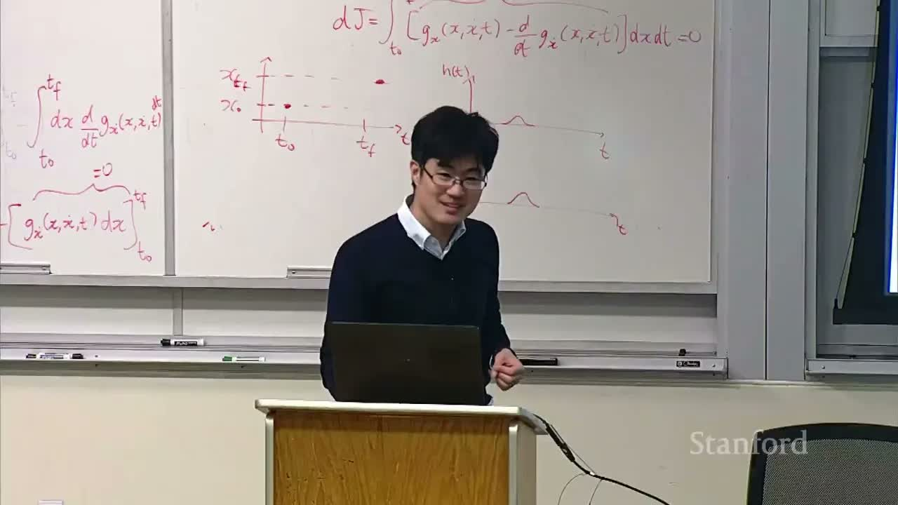

> [!NOTE]
> **课程**：Stanford CS336 — Language Modeling from Scratch（Spring 2026）  
> **讲次**：Lecture 3: Architectures  
> **讲者**：Tatsunori Hashimoto  
> **视频**：[YouTube 原视频](https://www.youtube.com/watch?v=lVynu4bo1rY)  
> **时长**：约 1 小时 29 分钟  
> **材料说明**：讲义基于公开视频、人工英文字幕与官方课件交叉整理；公开仓库不再分发这些原始文件。

这节课不是要寻找一个永远正确的“最佳 Transformer”，而是训练一种更有用的判断能力：看到一项架构改动时，先问它在解决什么约束——优化稳定性、泛化、训练吞吐，还是推理解码成本；再看证据是否真的支持它成为默认选择。整堂课可以压缩成一条主线：**现代语言模型的架构，是模型质量、优化稳定性和硬件效率共同塑造的工程折中。**

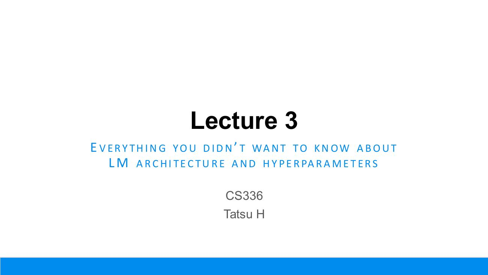

课件标题页点出本讲主题——“关于 LM 架构与超参数，你不想知道的一切”（Everything you didn't want to know about LM architecture and hyperparameters），讲者为 Tatsunori Hashimoto。标题的调侃语气暗示本讲的内容密度：架构与超参数的细节琐碎且缺乏统一理论，但正是这些细节决定了训练能否跑稳、服务能否跑得起。


大纲页给出本讲的两段式结构：先快速回顾现代 Transformer 的组成（即读者在作业中实现的那个变体），再逐一讨论架构与训练过程中的常见变体。讲者在这一页写下本讲的方法论基调——最好的学习方式是动手实践，其次是学习他人的经验；本讲属于后者，即把公开模型与论文中沉淀的经验系统性地转述给读者。

> [!IMPORTANT]
> 阅读本讲需要知道 token、向量、矩阵乘法、softmax、残差连接和自注意力的基本概念。若暂时不熟悉 Jacobian、arithmetic intensity 或 KV cache，不影响开始学习；对应概念会在第一次出现时补足。

## 0. 阅读前的五分钟桥接：一个 token 怎样穿过注意力层

在进入架构演化的讨论之前，我们先用最小的数学工具把一个 token 从离散 ID 一路送到残差流的完整旅程走一遍。后续每一章的架构争论——pre-norm 还是 post-norm、ReLU 还是 SwiGLU、RoPE 还是绝对位置、MHA 还是 GQA——本质上都是在改动这条旅程中的某一个环节。先把环节认全，后面的每个改动才能立即定位到它在数据流中的位置。

### 0.1 从 token 到 embedding

语言模型先用 tokenizer 把文本切成 token，再把每个 token 映射成整数 ID。例如，“猫爱鱼”可能被切成 `['猫', '爱', '鱼']`，对应 ID `[17, 42, 9]`。ID 本身没有大小或距离意义——ID 42 与 ID 9 并不比 ID 42 与 ID 41 “更近”；模型只把 ID 当作 embedding 表中的行号。这一点看似简单，却是理解整个架构的起点：网络的一切几何结构都不是从 ID 继承来的，而是从那张可学习的表中**学出来**的。

若词表有 $V$ 行、每个 token 用 $d_{\text{model}}$ 个数表示，那么查表过程可写成：

$$
X=E[\text{ids}],
\qquad
E\in\mathbb{R}^{V\times d_{\text{model}}},
\qquad
X\in\mathbb{R}^{n\times d_{\text{model}}}.
$$

- $E$：token-embedding 查找表；
- $V$：词表大小；
- $d_{\text{model}}$：每个 token 的隐藏向量维度；
- $\text{ids}$：长度为 $n$ 的 token-ID 序列；
- $n$：当前序列的 token 数；
- $X$：查表后按序排列的 token 表示矩阵。

一个便于观察 shape 的玩具例子是 $n=3,d_{\text{model}}=4$：三个 token 查表后得到 `X.shape = [3, 4]`，也就是三行 token、每行四个特征。真实模型只是把 4 换成数千，并增加 batch 维。

从参数量角度看，这张表并不便宜：$V\times d_{\text{model}}$ 个参数。若 $V=128{,}000$、$d_{\text{model}}=4096$，仅 embedding 表就有约 $5.24\times 10^{8}$ 个参数，按 FP16 存储约 1.0 GB。这也解释了第 6 章讨论词表大小时为什么不能只看“分词更省 token”这一面——词表本身直接占据参数与显存预算。

> [!NOTE]
> embedding 查表是一次 gather 操作而非矩阵乘法：它只读取被命中的行，FLOP 几乎为零，成本全部在显存带宽上。这是本讲反复出现的主题——“便宜”与“贵”要同时按计算量和数据移动量衡量——的第一次亮相。

### 0.2 Q、K、V 各自负责什么

自注意力把同一份输入 $X$ 线性投影成三种角色：**Q（query）表示当前 token 想找什么，K（key）表示每个 token 可以用什么特征被匹配，V（value）表示匹配成功后真正取回什么内容。** 三种角色共享输入却使用独立的投影矩阵，这使得“匹配用的特征”和“被读取的内容”可以解耦：两个 token 可以因为语法角色相近而互相匹配（Q/K 空间），却交换语义内容（V 空间）。

为了先看清数据流，暂时忽略多头拆分：

$$
Q=XW_Q,
\qquad
K=XW_K,
\qquad
V=XW_V.
$$

- $X\in\mathbb{R}^{n\times d_{\text{model}}}$：输入 token 表示；
- $W_Q,W_K,W_V$：可学习的 query、key、value 投影矩阵；
- $Q$：每个位置的查询向量；
- $K$：每个位置的匹配键向量；
- $V$：每个位置可被聚合的内容向量。

在上面的 `[3, 4]` 玩具输入中，若有两个 head、每个 head 两维，那么投影结果可从 `[n, d_model] = [3, 4]` 重排为 `[heads, seq, head_dim] = [2, 3, 2]`。每个 head 都会独立做一次“Q 找 K，再按权重读取 V”。

为什么要拆成多个 head 而不是用一个大的 Q/K/V？可以从两个角度理解。其一是表达能力：单个内积只能在一个相似性度量下匹配，多个 head 允许模型在不同子空间里同时维持多种匹配关系——一个 head 关注句法依存，另一个关注指代关系。其二是工程角度：head 拆分把一次大的矩阵运算变成若干次中小规模、可独立调度的运算，并且为后文 GQA/MQA 的“按 head 共享”提供了粒度单位。

三个投影矩阵的参数量也值得一提。标准 MHA 中 $W_Q,W_K,W_V$ 各为 $d_{\text{model}}\times d_{\text{model}}$，再加上输出投影 $W_O$，单层注意力约有 $4d_{\text{model}}^2$ 个参数。当 $d_{\text{model}}=4096$ 时约为 $6.7\times10^{7}$，与一层 FFN（约 $8d_{\text{model}}^2$，见第 3 章）相比大约是三分之一——这个比例在后文估算 KV cache 与参数量对比时会用到。

#### 手算一次：两个 token、两维特征的完整注意力

取 $n=2,d_{\text{model}}=2$，输入 $X=\begin{bmatrix}1&0\\0&1\end{bmatrix}$（两个 token 分别是单位向量）。设投影矩阵为单位矩阵（$W_Q=W_K=W_V=I$），则 $Q=K=V=X$。注意力 logits 为

$$
QK^\top=\begin{bmatrix}1&0\\0&1\end{bmatrix}，\qquad
S=\frac{QK^\top}{\sqrt{2}}=\begin{bmatrix}0.707&0\\0&0.707\end{bmatrix}.
$$

- $QK^\top$：未缩放的两两内积；
- $S$：除以 $\sqrt{d_h}=\sqrt{2}$ 后的 logits。

施加 causal mask 后第一行变为 $[0.707,-\infty]$，第二行保持 $[0,0.707]$。逐行 softmax（$e^{0.707}\approx 2.028$，$1+2.028=3.028$）：

$$
A=\begin{bmatrix}1&0\\0.330&0.670\end{bmatrix},
\qquad
O=AV=\begin{bmatrix}1&0\\0.330&0.670\end{bmatrix}.
$$

- 第一行：第一个 token 只能看自己，权重全给自身；
- 第二行：$\operatorname{softmax}(0,0.707)$ 的两项为 $1/3.028\approx 0.330$ 与 $2.028/3.028\approx 0.670$。

验算两点：每行权重之和分别为 $1$ 与 $1.000$，符合 softmax 的归一性；$O$ 的第一行等于 $V$ 的第一行，说明“没有历史可读时输出即自身 value”。输出第二行 $0.330\times(1,0)+0.670\times(0,1)=(0.330,0.670)$——第二个 token 的表示被更新为自身与前文的凸组合，这就是一层注意力对一条表示做的全部事情。

### 0.3 causal mask 与 softmax

decoder-only 语言模型只能使用当前位置及其左侧 token，不能偷看未来答案。它先算 Q/K 相似度，再把未来位置的 score 加上 $-\infty$，最后沿每一行做 softmax：

$$
A=\operatorname{softmax}\!\left(\frac{QK^\top}{\sqrt{d_h}}+M\right),
\qquad
O=AV.
$$

- $Q,K,V$：query、key、value；
- $K^\top$：把 key 的 token 维转置以计算两两内积；
- $d_h$：一个 attention head 的维度；
- $M$：causal mask，对允许位置填 0，对未来位置填 $-\infty$；
- $A$：每个 query 对可见 token 的注意力概率；
- $O$：对 value 加权求和后的输出；
- $\operatorname{softmax}$：把一行有限 scores 转成总和为 1 的非负权重。

三个 token 的 mask 是一个下三角结构：第一行只能看第一个 token，第二行能看前两个，第三行能看全部三个。

| query 位置 | K₁ | K₂ | K₃ |
|---|---:|---:|---:|
| 1 | 0 | $-\infty$ | $-\infty$ |
| 2 | 0 | 0 | $-\infty$ |
| 3 | 0 | 0 | 0 |

例如第二个 token 在 mask 后的 scores 若为 `[2, 1, −∞]`，softmax 约为 `[0.731, 0.269, 0]`：未来的第三个 token 权重严格为零，其余权重总和为一。softmax 因而不是“选择唯一 token”，而是产生一个可微的加权读取方案。

causal mask 的工程实现只需一次下三角布尔索引。下面这段代码同时演示了 mask 构造与数值稳定的 softmax：

```python
import torch

def causal_mask(n: int) -> torch.Tensor:
    """生成 [n, n] 的加性因果掩码：可见位置为 0，未来位置为 -inf。"""
    mask = torch.full((n, n), float("-inf"))
    return torch.triu(mask, diagonal=1)  # 上三角（不含主对角线）填 -inf

def stable_softmax(s: torch.Tensor, dim: int = -1) -> torch.Tensor:
    """先减行内最大值再做 softmax，避免 exp 上溢。"""
    s = s - s.max(dim=dim, keepdim=True).values
    e = torch.exp(s)
    return e / e.sum(dim=dim, keepdim=True)

scores = torch.tensor([[2.0, 1.0]]) + causal_mask(3)[1]  # 模拟第 2 行的 masked scores
probs = stable_softmax(scores)  # tensor([0.7311, 0.2689, 0.0000])
```

#### 推导：softmax 为什么要先减最大值

softmax 的第 $i$ 个分量定义为

$$
\operatorname{softmax}(z)_i=\frac{e^{z_i}}{\sum_{j=1}^{n}e^{z_j}}.
$$

- $z\in\mathbb{R}^{n}$：一行原始 scores；
- $z_i$：第 $i$ 个 score；
- $n$：该行可见位置数；
- $e^{z_i}$：指数化后的未归一化权重。

直接按此式计算有数值风险：FP16 的最大可表示数约为 $65504$，而 $e^{89}\approx 4.5\times10^{38}$ 已超出 FP32 上限（约 $3.4\times10^{38}$），$e^{z_i}$ 只要 $z_i>88.7$ 就在 FP32 中溢出为 $\mathrm{inf}$，进而使分子分母同时为 $\mathrm{inf}$，结果为 NaN。反过来，若所有 $z_j$ 都是很大的负数，$e^{z_j}$ 会下溢为 0，分母为零。

利用指数函数的平移不变性可以解决：对任意常数 $c$，

$$
\frac{e^{z_i-c}}{\sum_j e^{z_j-c}}
=\frac{e^{z_i}e^{-c}}{e^{-c}\sum_j e^{z_j}}
=\frac{e^{z_i}}{\sum_j e^{z_j}}
=\operatorname{softmax}(z)_i.
$$

取 $c=\max_j z_j$ 后，最大分量的指数为 $0$（$e^0=1$），其余分量指数均为非正数，因此所有 $e^{z_j-c}\in(0,1]$，既不会上溢，分母也至少为 1，不会下溢为零。这是**数学恒等变换**，不改变任何梯度方向，只改变浮点路径。第 7 章将看到，这类“数学等价但数值不同”的考量在大模型里反复出现：减最大值能防止有限精度溢出，却不能防止 logit 尺度本身的无界增长，后者要靠 z-loss、QK norm、soft-cap 这类架构级手段。

### 0.4 residual block 为什么要把输入加回来

注意力或 FFN 不必从头重写整条表示；它只计算需要添加的修正量，再与原输入相加：

$$
Y=X+F(X).
$$

- $X$：子层输入；
- $F$：attention 或 FFN 子层；
- $F(X)$：子层建议写入 residual stream 的增量；
- $Y$：相加后的输出，shape 与 $X$ 完全相同。

若某个二维 token 表示是 `[1, −1]`，子层给出的修正是 `[0.2, 0.3]`，残差输出就是 `[1.2, −0.7]`。这种“保留旧信息、逐层写增量”的结构，正是后文讨论 pre-norm、干净 residual path 和训练稳定性的起点。

残差结构还有一个常被忽略的统计效果：若各层增量近似零均值且弱相关，$L$ 层之后 residual stream 的方差大致随层数线性增长，$\operatorname{Var}(x_L)\approx \operatorname{Var}(x_0)+\sum_\ell \operatorname{Var}(F_\ell)$。这意味着深层网络中，后层子层看到的是信噪比不断变化、幅度逐渐增大的输入——这正是为什么归一化放在哪里（第 2 章）、以及初始化时是否把子层输出缩得很小（如把输出投影初始化为零或乘小系数），都会对训练动力学产生实质影响。

### 本章小结

- embedding 把离散 token ID 查表成连续向量，序列因此成为 `[seq, d_model]` 矩阵；查表本身按数据移动计费而非按 FLOP 计费。
- Q 用来查询，K 用来匹配，V 是实际被加权读取的内容；多 head 让不同子空间并行维持多种匹配关系。
- causal mask 阻止未来信息进入当前 token；softmax 把可见位置的 scores 变成概率权重；减最大值是保证浮点路径安全的恒等变换。
- residual block 让每个子层只学习增量，并保持输入输出 shape 一致；其代价是 residual stream 的方差随深度累积。

## 1. 如何读懂架构演化：从原始 Transformer 到现代配方

### 1.1 先确定评价轴，而不是背模型名字

讲者先声明本讲采用 survey 视角：比较公开模型的架构选择，再结合论文中的消融实验判断哪些变化较稳健。一个改动是否“好”，至少要同时看三条轴：

- **泛化与最终质量**：给定训练计算量，验证损失或下游能力是否更好；
- **GPU 效率**：每秒能处理多少 token，数据搬运是否成为瓶颈；
- **训练稳定性**：大规模训练是否容易出现 loss spike、溢出或发散。

这三条轴经常互相冲突。例如，某个归一化可能几乎不改变参数量，却增加低 arithmetic-intensity 的数据移动；某个注意力变体可能稍损质量，却显著降低在线服务时的 KV cache 带宽。因而“更新”不等于“更优”，默认值也不等于定律。

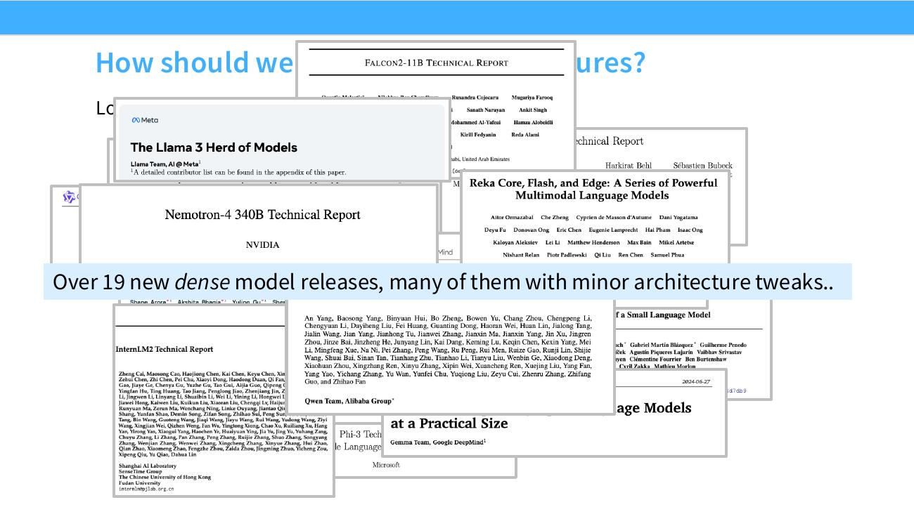

这一页指出仅 2024–2025 年就有超过 19 个新的稠密模型发布，其中许多只做了微小的架构调整。面对如此密集的发布节奏，逐个背诵模型名字显然不可行——这正是本节先确立评价轴的原因：只有抓住“改动解决了什么约束”，才能把源源不断的发布归并到有限的几个设计维度上。


讲者用这一页（一张密集排列的模型 logo 图）直观回答“今年真有那么多模型发布吗”——答案是肯定的。幻灯片的视觉冲击服务于同一个方法论结论：架构“新闻”的供给速度远超任何个人的跟踪能力，因此必须依靠结构化的比较框架而非逐个跟进。

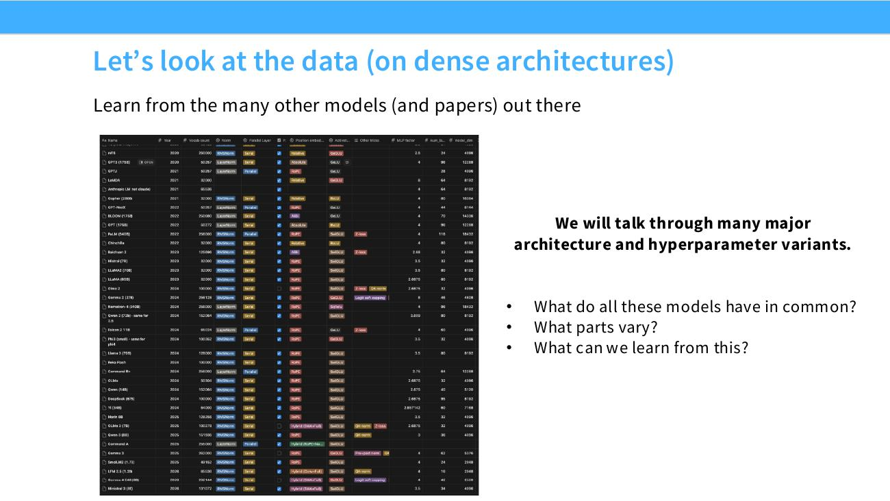

这一页明确本讲的数据来源与方法：从众多公开模型（及其论文）中提取经验，回答三个问题——所有这些模型有什么共同点、哪些部分在变化、我们能从中学到什么。注意讲者限定了讨论范围是**稠密（dense）架构**，MoE 等稀疏结构不在本讲覆盖之内。

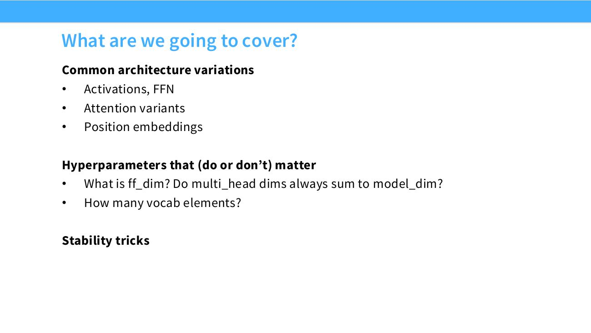

这一页列出本讲的三大板块：常见架构变体（激活与 FFN、注意力变体、位置嵌入）、（有或没有实际影响的）超参数（FFN 宽度、多头维度与模型维度的关系、词表大小）、以及稳定性技巧。这份清单与本讲义的章节结构一一对应：第 2–5 章覆盖架构变体，第 6 章覆盖超参数，第 7 章覆盖稳定性，第 8–9 章则展开注意力变体中与服务成本最相关的部分。

这里需要澄清一个方法论问题：公开模型报告里的架构选择，绝大多数是**联合优化**的产物——同一团队在同一硬件、同一数据配比、同一训练预算下试出来的局部最优。把 A 模型的归一化、B 模型的位置编码、C 模型的 FFN 拼在一起，并不能保证继承各自报告中的收益，因为组件之间存在交互（例如 QK norm 会改变 attention logit 的尺度分布，从而改变 soft-cap 是否必要）。因此本讲对每一个组件都追问两个问题：它单独解决了什么约束？它与其他组件组合时约束是否仍然存在？

评价证据的强弱也有层次之分，从弱到强大致是：单一模型的工程报告（只说明“这样做能跑通”）、同族模型的消融对比（说明“在这个设置下 A 优于 B”）、跨规模多预算的 scaling 消融（说明“A 的优势随规模保持稳定”）。本讲引用的课件证据多属前两类，因此结论都应以“默认值候选”而非“定律”的口吻对待。

### 1.2 原始 Transformer 与现代 decoder-only 模型

2017 年的 Transformer 同时包含 encoder 与 decoder；每个子层后做 LayerNorm，FFN 使用 ReLU，位置由绝对位置嵌入提供。其历史结构如下。

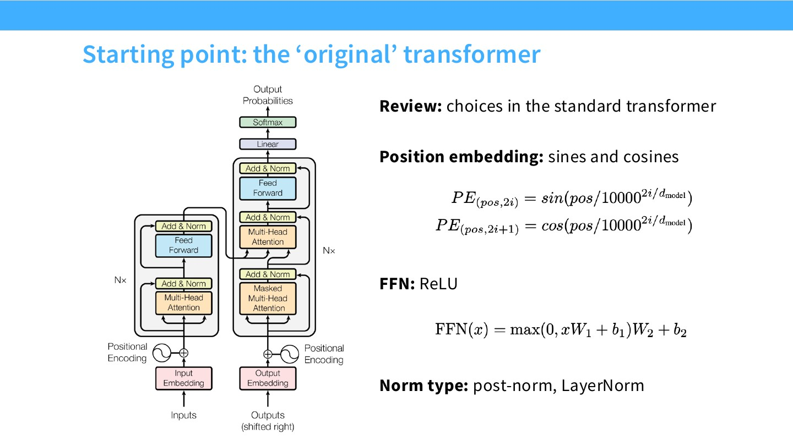
*图 1：原始 Transformer 的 encoder–decoder、post-norm、ReLU 与绝对位置编码（视频 00:01:47–00:02:54）。*

现代大语言模型通常只保留因果 decoder 堆栈，并常见以下组合：pre-norm 或 RMSNorm、无 bias 的线性层、SwiGLU/GeGLU、RoPE，以及针对解码吞吐设计的 GQA。课件用一张总览图把这些差异放在同一页面。

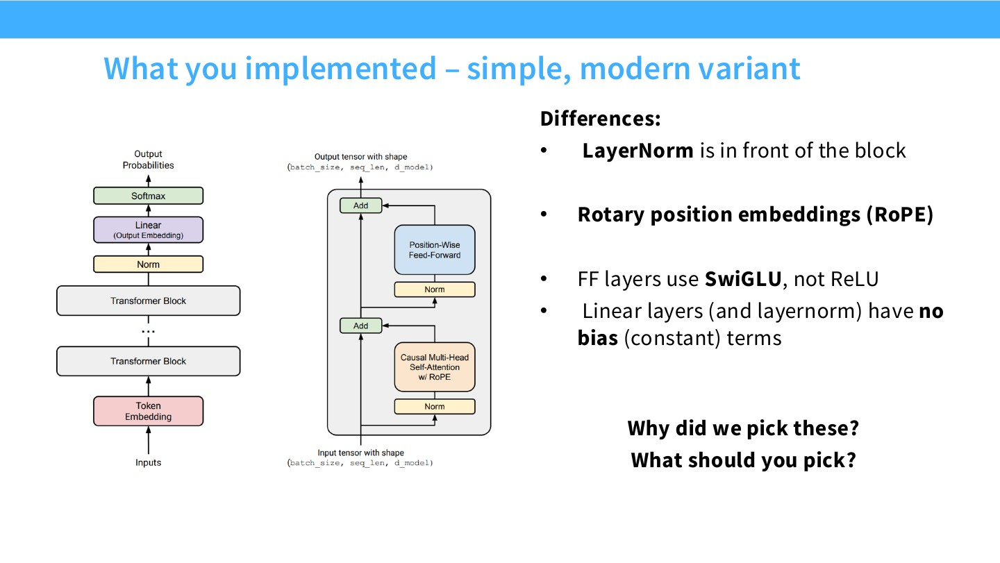
*图 2：现代 decoder-only Transformer 的常见组件（视频 00:01:47–00:04:53）。*

为什么 encoder 消失了？这不是说双向注意力没有价值，而是训练目标与推理形态共同选择的结果：因果语言建模只需要左向上下文，单一堆栈让预训练、微调和在线解码共享同一套内核与权重布局；而 encoder–decoder 架构在纯生成任务上要额外维护 cross-attention 与两套堆栈，参数与服务成本都不划算。双向性带来的理解能力损失，则通过更大规模的因果预训练被经验性地弥补回来。

逐项对照两张图，可以把七年的架构演化列成一张“改动—动机”对照表（后续各章逐一展开）：

| 组件 | 原始 Transformer | 现代常见选择 | 主要动机 |
|---|---|---|---|
| 堆栈 | encoder + decoder | 仅因果 decoder | 训练目标与推理形态统一 |
| 归一化位置 | post-norm | pre-norm | 深层优化稳定性 |
| 归一化算子 | LayerNorm | RMSNorm | 减少中心化计算与参数 |
| 线性层 bias | 有 | 通常无 | 减少参数与内核分支 |
| FFN 激活 | ReLU | SwiGLU/GeGLU | 条件门控的表达力 |
| 位置表示 | 绝对位置嵌入 | RoPE（或混合 NoPE） | 相对位置几何与长度泛化 |
| KV 结构 | MHA | GQA/MQA | 解码带宽与 KV cache 成本 |

这种收敛并非终点。讲者强调，LLaMA 一类公开配方曾使社区暂时趋同，但更大上下文、更低推理成本和更稳定训练又带回 QK norm、局部—全局混合注意力等设计。因此应把“现代架构”理解为一个随约束变化的前沿，而不是固定模板。

为什么 LLaMA 配方会造成趋同？机制并不神秘：它第一次把“数据管线、超参数、架构细节全部公开且可复现”的训练配方放到了社区面前，复现成本低、基线质量高，后续工作自然以它为起点做增量改动，而不是各自从零搜索架构空间。这带来一个方法论上的提醒：趋同可能反映的是**搜索成本的降低**而非**最优性的证明**。当推理成本与上下文长度成为主要矛盾后，社区又开始偏离 LLaMA 配方——趋同与分化交替出现，恰好说明架构前沿由约束驱动而非由惯性驱动。

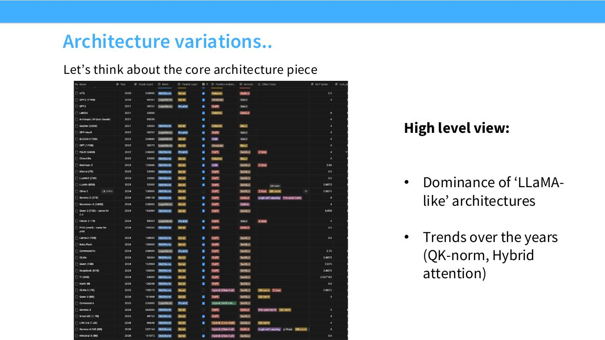

这一页给出高层观察：近年公开模型中“LLaMA-like”架构占据主导地位，但趋势并未停驻——QK-norm、混合注意力（hybrid attention）等新元素正在进入主流配方。这张总览图为后续章节定了调：第 2–5 章解释 LLaMA 配方本身的合理性，第 7、9 章则解释 QK-norm 与混合注意力为何会突破这个配方的边界。

### 本章小结

- 架构选择必须放在质量、硬件效率和稳定性三条轴上评价，且组件之间存在交互，不能跨模型随意拼接结论。
- 从原始 Transformer 到现代 LLM，变化集中在 block 排列、归一化、FFN、位置表示和注意力服务成本。
- 公开模型的共同做法是经验起点，不是无需验证的真理；证据强度从工程报告到跨规模消融有明确层次。

## 2. Residual stream 与 normalization：让深层网络可训练

### 2.1 Post-norm 与 pre-norm 的真正差别

残差连接的目标，是让信息和梯度能沿一条接近恒等映射的路径跨越很多层。原始 Transformer 在“残差相加之后”归一化，即 post-norm：

$$
x_{\ell+1}=\operatorname{LN}\!\left(x_\ell+F_\ell(x_\ell)\right).
$$

- $x_\ell$：第 $\ell$ 层输入的 residual-stream 表示；
- $x_{\ell+1}$：该子层输出；
- $F_\ell$：第 $\ell$ 层的注意力或 FFN 变换；
- $\operatorname{LN}$：LayerNorm；
- $\ell$：层索引。

现代模型常把归一化移到子层之前，即 pre-norm：

$$
x_{\ell+1}=x_\ell+F_\ell\!\left(\operatorname{N}(x_\ell)\right).
$$

- $x_\ell$、$x_{\ell+1}$：相邻两层的 residual-stream 表示；
- $F_\ell$：注意力或 FFN 子层；
- $\operatorname{N}$：LayerNorm、RMSNorm 等归一化；
- $\ell$：层索引。

两种写法的差别看似只是把 $\operatorname{N}$ 挪了一个位置，但对深层堆叠而言后果截然不同。关键观察是：post-norm 中归一化**躺在残差主路上**——信息从第 0 层流到第 $L$ 层，途中要经过 $L$ 次 LayerNorm；pre-norm 中残差主路是纯粹的加法链，归一化只出现在每个分支的入口。主路上每多一个非恒等变换，梯度就多乘一个非恒等的 Jacobian 因子。

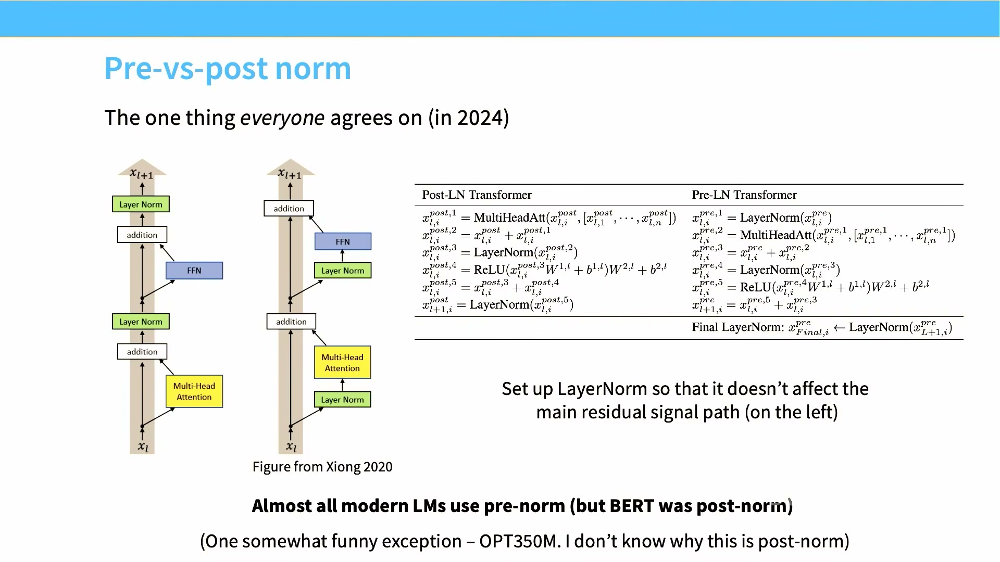
*图 3：讲者比较“先残差后归一化”和“先归一化后残差”（视频 00:07:31–00:09:29）。*

pre-norm 更稳定的直觉来自它保留的“干净残差路径”。对一层求 Jacobian：

$$
\frac{\partial x_{\ell+1}}{\partial x_\ell}
=I+\frac{\partial F_\ell(\operatorname{N}(x_\ell))}{\partial x_\ell}.
$$

- $\partial x_{\ell+1}/\partial x_\ell$：输出对输入的 Jacobian；
- $I$：恒等矩阵，对应残差直通路径；
- $F_\ell$：子层变换；
- $\operatorname{N}$：子层输入上的归一化；
- $x_\ell$：该层输入。

即使第二项的尺度不理想，梯度仍有恒等项 $I$ 可以传播。post-norm 则让归一化处在整条残差路径上，深层网络更依赖 warmup 和初始化细节。课件中的实验显示，post-norm 在缺少足够 warmup 时更容易失稳；pre-norm 更像一个稳健默认值。

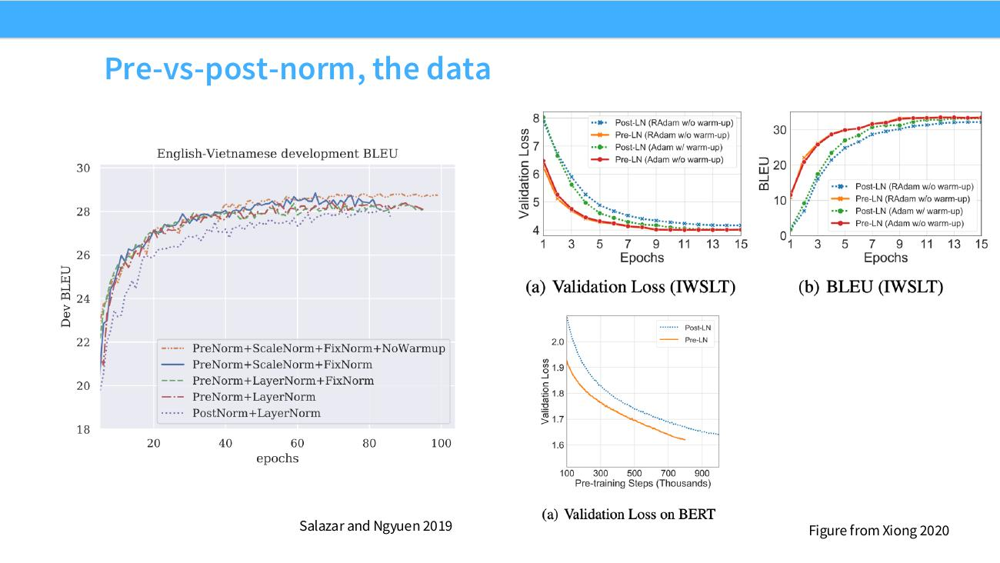

这一页并排放置两组实验证据：Salazar & Nguyen 2019 的对比曲线与 Xiong et al. 2020 的图示。两组独立工作在不同设置下观察到同一现象——post-norm 深层 Transformer 的训练曲线更不稳定、对学习率与 warmup 更敏感。这正是上面 Jacobian 分析所预言的：主路上的归一化 Jacobian 连乘使训练初期的尺度失配被层数放大。

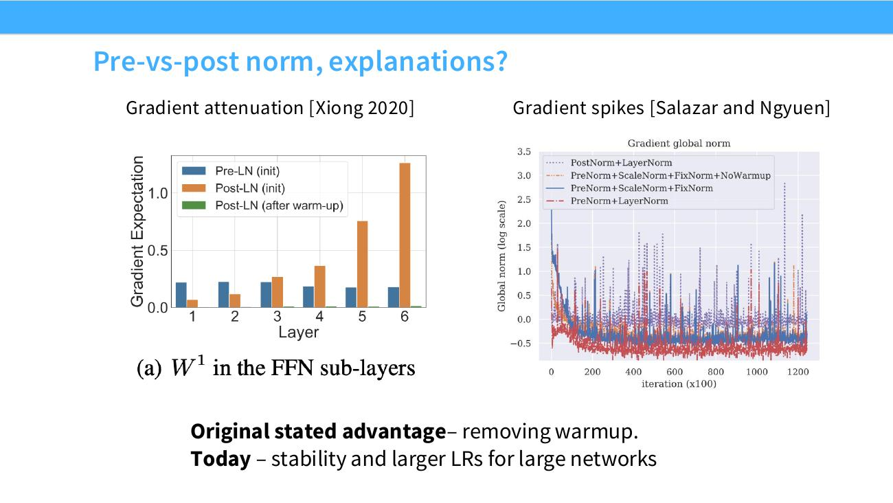

课件归纳了两类解释：Xiong 2020 的“梯度衰减”视角（post-norm 的梯度在深层被系统性压缩）与 Salazar & Nguyen 的“梯度尖峰”视角（post-norm 更容易出现破坏性的大梯度事件）。这一页还记录了该结论的历史演变：Xiong 2020 最初声称的优势是可以去掉 warmup，而今天更准确的表述是 pre-norm 为大网络带来了稳定性，从而允许使用更大的学习率。下面的 $L$ 层链式展开把“梯度衰减”解释写成了显式代数。

我们可以把这个单层的结论显式推广到 $L$ 层。设每个 block 由两个子层组成，residual 主路上的输出为

$$
x_L=x_0+\sum_{\ell=0}^{L-1}\Bigl(F_{\ell,1}\bigl(\operatorname{N}_{\ell,1}(x_\ell^{(1)})\bigr)+F_{\ell,2}\bigl(\operatorname{N}_{\ell,2}(x_\ell^{(2)})\bigr)\Bigr),
$$

其中 $x_\ell^{(1)},x_\ell^{(2)}$ 是 block 内的中间状态。对损失 $\mathcal{L}$ 关于最浅层表示 $x_0$ 的梯度做链式展开：

$$
\frac{\partial \mathcal{L}}{\partial x_0}
=\frac{\partial \mathcal{L}}{\partial x_L}\prod_{\ell=0}^{L-1}\left(I+\frac{\partial F_\ell\circ \operatorname{N}_\ell}{\partial x_\ell}\right).
$$

把乘积展开，会得到 $2^L$ 项，其中有一项是 $\partial\mathcal{L}/\partial x_L$ 乘以一串恒等矩阵——即**不经过任何子层的纯直通项**。其余各项至少经过一个子层 Jacobian。只要各子层 Jacobian 的谱范数不系统性大于 1，直通项就保证了梯度的下界不会随深度指数消失。对照之下，post-norm 的对应展开是

$$
\frac{\partial \mathcal{L}}{\partial x_0}
=\frac{\partial \mathcal{L}}{\partial x_L}\prod_{\ell=0}^{L-1}\frac{\partial\operatorname{LN}}{\partial(\cdot)}\left(I+\frac{\partial F_\ell}{\partial x_\ell}\right),
$$

每一项都被 $L$ 个归一化 Jacobian 调制。LayerNorm 的 Jacobian 是各向异性的投影型算子（见 2.2 节的推导），其连乘没有恒等项保底；训练初期子层输出尺度尚未稳定时，这条路径上的缩放失配会被层数放大，这正是 post-norm 必须依赖谨慎 warmup 的数学根源。

> [!WARNING]
> “pre-norm 更稳定”不等于“任何条件下最终质量都更高”。它主要改善优化条件；一些工作会用 sandwich norm、额外缩放或其他 post-norm 变体尝试换取更好表示能力。

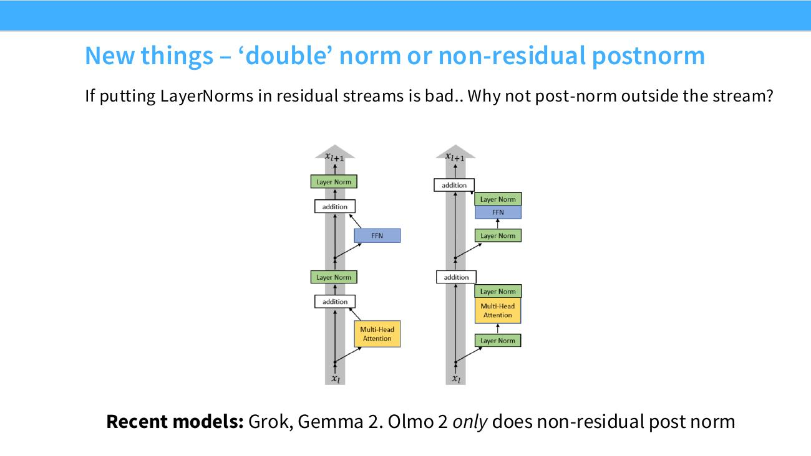

这一页介绍对 pre-norm 共识的近期修正：既然把 LayerNorm 放进残差流不好，何不在残差流**之外**再加一个 post-norm？Grok 与 Gemma 2 采用了这类“双重”归一化，而 OLMo 2 只做残差流外的非残差 post-norm。这与上文 final norm 的讨论属于同一思路：残差主路保持纯净，但在读出端对累积放大的表示做一次尺度压回。

pre-norm 也有一个教科书里较少强调的副作用：由于最终输出是 $x_0$ 与各层增量的和，若某一层学到的增量始终很小，它就近似被“跳过”，深层网络因而表现得像一个带隐式加权的浅层集成——这正是“residual network 是指数多个浅路径的集成”这一经典观点的推论。从系统角度看，这也意味着 pre-norm 深层网络的**有效深度**往往小于名义层数；一些模型会在最后再加一个 final norm（这正是 LLaMA 等配方的做法），把累积放大的 residual stream 重新压回受控尺度后再接输出头。

### 2.2 LayerNorm 与 RMSNorm

LayerNorm 同时减去均值并按标准差缩放。对单个 token 的 $d$ 维隐藏向量，标准写法是：

$$
\mu(x)=\frac{1}{d}\sum_{i=1}^{d}x_i,
\qquad
\operatorname{LN}(x)_i
=\gamma_i\frac{x_i-\mu(x)}{\sqrt{\frac{1}{d}\sum_{j=1}^{d}(x_j-\mu(x))^2+\varepsilon}}+\beta_i.
$$

- $x\in\mathbb{R}^d$：一个 token 的隐藏向量；
- $x_i$：第 $i$ 个通道；
- $d$：隐藏维度；
- $\mu(x)$：通道均值；
- $\gamma_i$、$\beta_i$：可学习的缩放与平移参数；
- $\varepsilon$：防止分母为零的数值稳定项；
- $i,j$：通道索引。

RMSNorm 删除中心化，只按均方根缩放：

$$
\operatorname{RMSNorm}(x)_i
=\gamma_i\frac{x_i}{\sqrt{\frac{1}{d}\sum_{j=1}^{d}x_j^2+\varepsilon}}.
$$

- $x_i$：输入向量第 $i$ 个通道；
- $d$：隐藏维度；
- $\gamma_i$：可学习缩放参数；
- $\varepsilon$：数值稳定项；
- $j$：均方根统计中的通道索引。

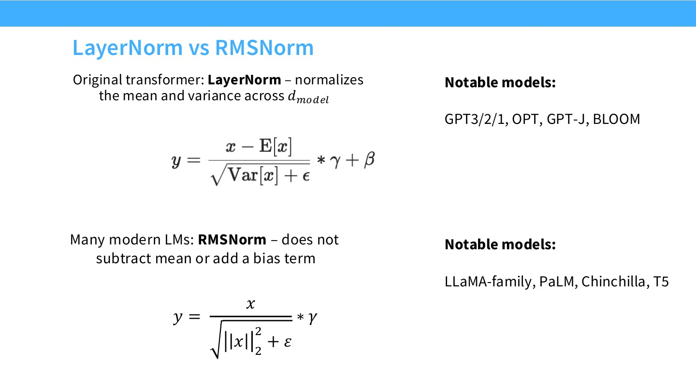
*图 4：课件对照两种归一化；正文采用含 $1/d$ 的标准 RMSNorm 定义（视频 00:13:56–00:14:50）。*

> [!WARNING]
> 课件的 RMSNorm 简写容易被读成 $\sqrt{\sum_i x_i^2}$，漏掉均值因子 $1/d$。标准 RMS 是 root **mean** square；实现还可能在累积精度、epsilon 位置和是否保留可学习缩放上不同。

RMSNorm 少了均值计算和 bias，表达更简洁，但不能只凭 FLOP 数判断它一定更快。归一化的算术量很小，实际可能由读取、写回整条 hidden state 的数据移动主导。

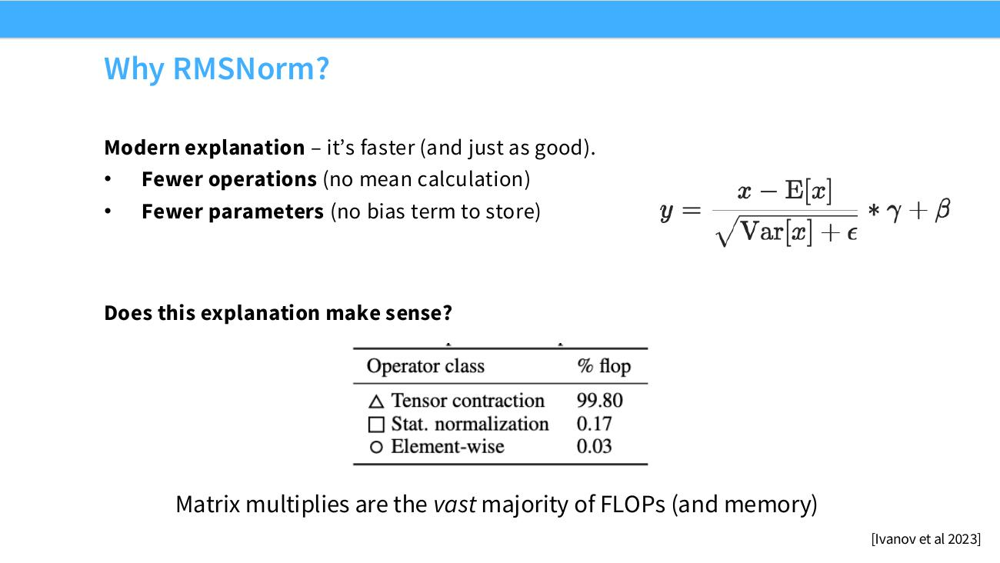

这一页给出 RMSNorm 的现代解释——更快且质量相当：少了均值计算的操作数、少了 bias 参数的存储。但讲者随即追问“这个解释说得通吗”，并引用 Ivanov et al. 2023 的分析指出：矩阵乘法才是 FLOP 与显存的绝对主体，归一化省下的那点 FLOP 在总账里微不足道。这为下一页的结论埋下伏笔。

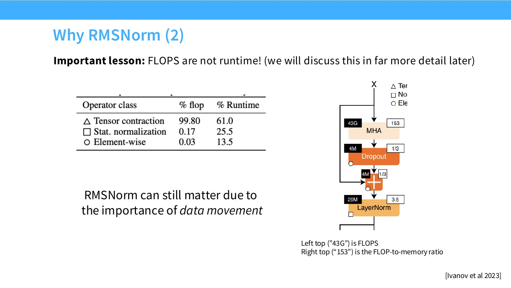
*图 5：低 FLOP 操作也可能因数据搬运而占据可观运行时间（视频 00:15:34–00:17:31）。*

这里需要一个系统概念：**arithmetic intensity** 是每搬运一个字节完成多少次算术操作。矩阵乘法能复用数据，强度高；norm、逐元素激活往往强度低。所以现代架构也常去掉线性层 bias：质量上通常无明显收益，同时减少参数、内核分支和数据流复杂度。

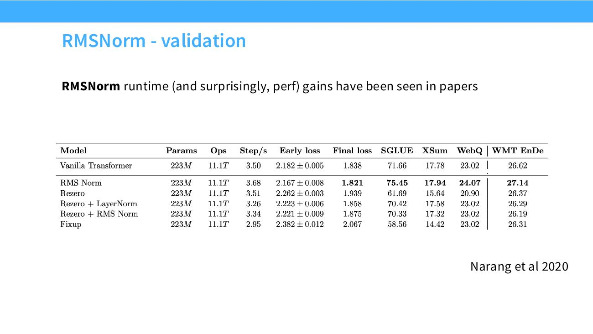

这一页展示 Narang et al. 2020 的验证结果：RMSNorm 在论文实验中不仅带来了运行时间收益，甚至（有些意外地）带来了轻微的性能收益。这支持把 RMSNorm 作为默认值候选，但需注意证据等级——它仍属“同族设置下的消融对比”，而非跨规模的定律。

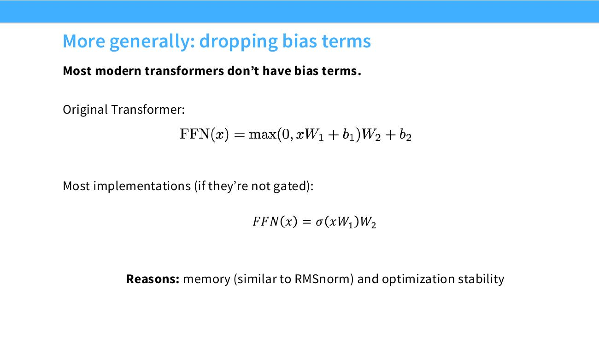

课件把 RMSNorm 的逻辑推广到整个网络：大多数现代 Transformer 完全不带 bias 项。原始 Transformer 的 FFN 写作 $\operatorname{FFN}(x)=\sigma(xW_1+b_1)W_2+b_2$，而现代实现（非门控情形下）写作 $\operatorname{FFN}(x)=\sigma(xW_1)W_2$。理由与 RMSNorm 同源——减少显存中的参数搬运，同时观察到对优化稳定性无害甚至有益。

#### 推导：两种归一化的 Jacobian 结构

归一化对梯度行为的影响，可以从它的 Jacobian 看清楚。记 RMSNorm 的均方根为 $r=\sqrt{\frac{1}{d}\sum_j x_j^2}$（暂略 $\varepsilon$），输出 $y_i=\gamma_i x_i/r$。对 $x_k$ 求偏导：

$$
\frac{\partial y_i}{\partial x_k}
=\frac{\gamma_i}{r}\delta_{ik}
+\gamma_i x_i\cdot\frac{\partial (1/r)}{\partial x_k}
=\frac{\gamma_i}{r}\delta_{ik}
-\frac{\gamma_i x_i x_k}{d\,r^{3}}.
$$

写成矩阵形式（暂取 $\gamma_i=1$）：

$$
\frac{\partial y}{\partial x}
=\frac{1}{r}\left(I-\frac{xx^\top}{d\,r^{2}}\right)
=\frac{1}{r}\left(I-\frac{xx^\top}{\|x\|^2}\right).
$$

- $\partial y/\partial x$：RMSNorm 的 Jacobian；
- $r$：输入的均方根；
- $\delta_{ik}$：Kronecker 符号；
- $xx^\top/\|x\|^2$：沿输入方向的秩一投影。

括号内正是**减去输入方向分量的投影算子**：RMSNorm 的 Jacobian 把梯度中与 $x$ 平行的分量完全消去，只保留与 $x$ 垂直的部分，并整体缩放 $1/r$。这有两层含义。其一，梯度被自动“去尺度化”——输入整体放大 $\alpha$ 倍，输出不变（$r$ 同步放大，$x/r$ 不变），故 RMSNorm 对输入的尺度漂移具有不变性，这正是它在 pre-norm 分支入口处的价值。其二，秩一修正项的范数为 $1/d$ 量级，当 $d$ 很大时 Jacobian 接近 $I/r$，近似良态。

LayerNorm 的推导类似，但先减均值。记 $\bar x=x-\mu(x)\mathbf 1$，$s=\sqrt{\frac{1}{d}\|\bar x\|^2}$，则（同样取 $\gamma=1,\beta=0$）：

$$
\frac{\partial y}{\partial x}
=\frac{1}{s}\left(I-\frac{\bar x\bar x^\top}{\|\bar x\|^2}\right)\left(I-\frac{1}{d}\mathbf 1\mathbf 1^\top\right).
$$

- $s$：中心化后的标准差；
- $\bar x$：去均值向量；
- $\mathbf 1$：全一向量；
- $I-\mathbf 1\mathbf 1^\top/d$：中心化投影（消去沿全一方向的分量）；
- $I-\bar x\bar x^\top/\|\bar x\|^2$：消去沿中心化输入方向的分量。

LayerNorm 的 Jacobian 是**两个投影的复合**：先消去均值方向，再消去 $\bar x$ 方向。它比 RMSNorm 多一个约束方向，因此对输入的平移（所有分量同加常数）也不变。这个额外的平移不变性在理论上更“干净”，但实践中均值方向通常不携带多少任务信息，去掉它换来的收益有限——这正是 RMSNorm 能以更简单的形式达到近似效果的原因。从优化角度看，两者的 Jacobian 都含 $1/r$ 或 $1/s$ 因子：当输入范数因 residual 累积而增大时，归一化层回传的梯度被等比例压缩，这种自适应的梯度缩放本身就有稳定训练的作用。

#### RMSNorm 的参考实现

```python
import torch
import torch.nn as nn

class RMSNorm(nn.Module):
    def __init__(self, d: int, eps: float = 1e-6):
        super().__init__()
        self.weight = nn.Parameter(torch.ones(d))  # 对应公式中的 γ
        self.eps = eps

    def forward(self, x: torch.Tensor) -> torch.Tensor:
        # x: [..., d]，对最后一维求均方根
        # 统计量在 FP32 中累积，避免半精度下方和溢出
        ms = x.float().pow(2).mean(dim=-1, keepdim=True)   # (1/d)·Σx_j²
        x_normed = x * torch.rsqrt(ms + self.eps)          # x / √(ms + ε)
        return (self.weight * x_normed).type_as(x)
```

注意实现与公式的两个工程偏差：其一，`rsqrt(ms + eps)` 中 $\varepsilon$ 加在均方**内部**再开根号，与公式 $\sqrt{\mathrm{ms}+\varepsilon}$ 一致，但有些实现把 $\varepsilon$ 加在根号外的分母上，小输入时行为不同；其二，统计量用 FP32 累积而输入保持原精度，这是大规模训练中防止方和舍入误差的标准做法。以 $d=4096$、分量量级 $1$ 为例，方和约 $4096$，FP16 的相对精度约 $2^{-10}$，累积误差可达数个 ULP；FP32 下则完全安全。

### 2.3 一次 block 的信息流

典型 pre-norm decoder block 可写成两步：

$$
h_\ell=x_\ell+\operatorname{Attn}(\operatorname{N}_1(x_\ell)),
\qquad
x_{\ell+1}=h_\ell+\operatorname{FFN}(\operatorname{N}_2(h_\ell)).
$$

- $x_\ell$：block 输入；
- $h_\ell$：注意力残差相加后的中间状态；
- $x_{\ell+1}$：block 输出；
- $\operatorname{Attn}$：因果自注意力；
- $\operatorname{FFN}$：逐 token 前馈网络；
- $\operatorname{N}_1,\operatorname{N}_2$：两处独立的归一化层。

把这两步展开成一条完整的读写链，可以更清楚地看到归一化的“守门”角色：

1. 从总线读出 $x_\ell$，经 $\operatorname{N}_1$ 压回单位尺度后送入注意力；
2. 注意力在 token 之间交换信息，把增量写回总线得到 $h_\ell$；
3. 从总线读出 $h_\ell$，经 $\operatorname{N}_2$ 再次压回单位尺度后送入 FFN；
4. FFN 在单个 token 内做通道混合，把增量写回总线得到 $x_{\ell+1}$。

每次“读出”都先归一化，保证子层看到的输入尺度与总线上累积的幅度解耦；每次“写回”都是纯加法，保证总线上的历史信息不被覆盖。这套“归一化读出、加法写回”的协议，是 pre-norm 架构能在上百层深度下稳定训练的核心机制。

> [!IMPORTANT]
> residual stream 可以理解为贯穿网络深度的共享“信息总线”。注意力负责 token 间通信，FFN 负责每个 token 内的通道变换；两者把增量写回同一条总线。

#### 数值例子：block 内的尺度演化

用一个可手算的微型 block 把上面的读写链走一遍。设 $d=4$，某 token 的输入为 $x=(2,0,0,0)$，其均方根为 $r=\sqrt{4/4}=1$，故 $\operatorname{N}_1(x)=x$（已恰好在单位尺度上）。设注意力分支对该位置输出的增量为 $\operatorname{Attn}(\operatorname{N}_1(x))=(0.5,-0.5,0,0)$，则中间状态

$$
h=x+(0.5,-0.5,0,0)=(2.5,-0.5,0,0),
\qquad
r_h=\sqrt{\tfrac{1}{4}(6.25+0.25)}=\sqrt{1.625}\approx 1.275.
$$

- $h$：注意力写回后的中间状态；
- $r_h$：$h$ 的均方根；
- 其余符号与上文一致。

FFN 的入口归一化先把 $h$ 压回单位尺度，$\operatorname{N}_2(h)=h/1.275\approx(1.961,-0.392,0,0)$，再送入 FFN。设 FFN 增量为 $(0.1,0.2,0.3,0)$，最终输出

$$
x'=h+(0.1,0.2,0.3,0)=(2.6,-0.3,0.3,0),
\qquad
r_{x'}=\sqrt{\tfrac{1}{4}(6.76+0.09+0.09)}\approx 1.313.
$$

观察两个要点。其一，residual 主路上的幅度从 $r=1$ 漂到 $1.313$——这正是第 0 章说的方差随深度累积，本例仅两个子层就已可见；其二，FFN 实际看到的输入幅度永远是 1 附近（归一化的作用），与子层在总线上的绝对位置无关。“总线漂移、分支读数恒定”这对反差，是 pre-norm 协议的最小完整演示。

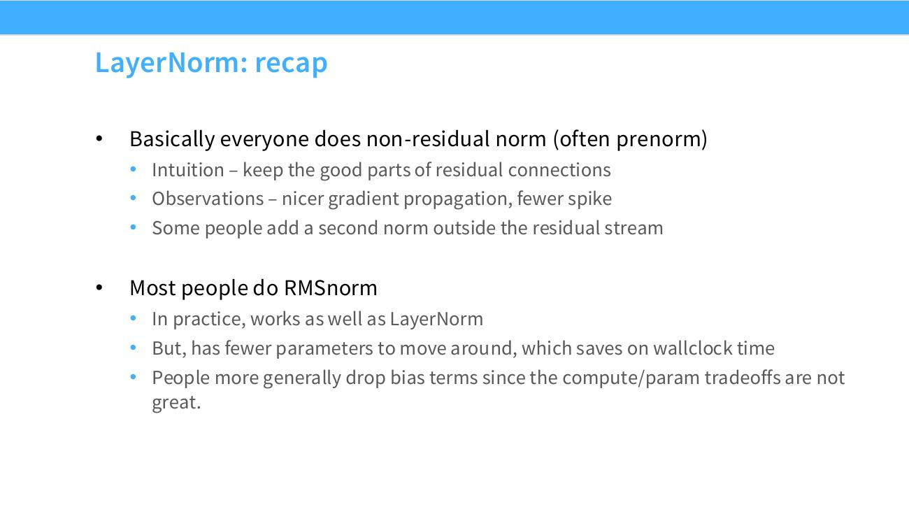

课件的归一化小结页归纳四条结论：几乎所有人都采用残差流外的归一化（通常是 pre-norm），直觉是保留残差连接的好处，观测到更平滑的梯度传播与更少的尖峰，部分模型在残差流外加第二个 norm；RMSNorm 实践中与 LayerNorm 相当，但因需要搬运的参数更少而节省 wall-clock 时间；更一般地，bias 项因计算/参数性价比不佳而被普遍丢弃。本节的 Jacobian 推导与数值例子为这四条经验结论提供了机制层面的解释。

### 本章小结

- pre-norm 的核心价值是保留带恒等 Jacobian 项的干净残差路径；post-norm 把归一化 Jacobian 连乘放在主路上，深层时依赖 warmup。
- RMSNorm 删除均值中心化，已成为常见默认值，但具体速度取决于内核与数据移动；其 Jacobian 是带 $1/r$ 缩放的投影算子，天然去尺度化。
- 少 bias、少低强度操作是系统效率选择，不应被包装成纯粹的表示理论结论。
- 对课件公式要核对标准定义，特别是 RMSNorm 的 $1/d$。

## 3. FFN：从激活函数到 gated MLP

### 3.1 为什么不再满足于 ReLU

传统 FFN 先扩宽、激活，再投影回 residual 维度：

$$
\operatorname{FFN}(x)=W_2\,\sigma(W_1x).
$$

- $x\in\mathbb{R}^{d_{\text{model}}}$：输入 token 表示；
- $W_1\in\mathbb{R}^{d_{\text{ff}}\times d_{\text{model}}}$：上投影；
- $W_2\in\mathbb{R}^{d_{\text{model}}\times d_{\text{ff}}}$：下投影；
- $d_{\text{model}}$：residual-stream 宽度；
- $d_{\text{ff}}$：FFN 中间宽度；
- $\sigma$：ReLU、GELU 等逐元素激活。

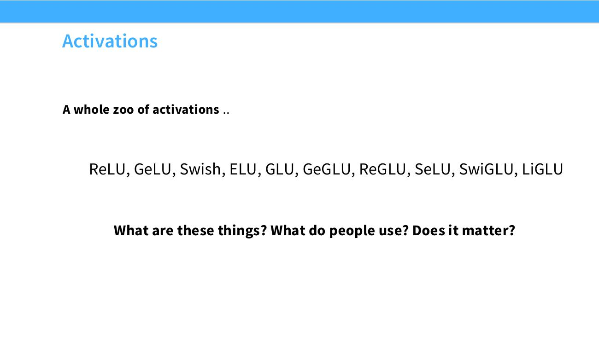

课件在这一页摆出激活函数的全家福：ReLU、GeLU、Swish、ELU、GLU、GeGLU、ReGLU、SeLU、SwiGLU、LiGLU，并抛出三问——这些是什么、大家在用什么、选择是否真的重要。本节余下的推导将回答前两问，第三问的答案则来自下两页的消融证据。

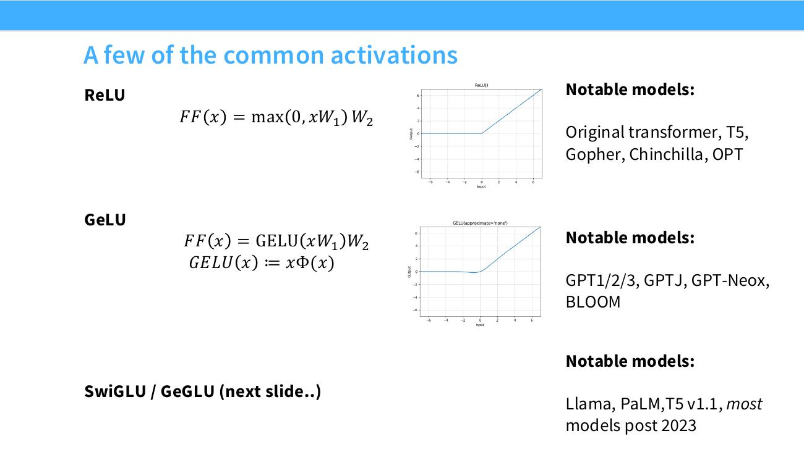

这一页写出两个主流非门控 FFN 的公式与阵营：ReLU 版 $\operatorname{FFN}(x)=\max(0,xW_1)W_2$（原始 Transformer、T5、Gopher、Chinchilla、OPT），GeLU 版 $\operatorname{FFN}(x)=\operatorname{GELU}(xW_1)W_2$，其中 $\operatorname{GELU}(x)\coloneqq x\Phi(x)$（GPT-1/2/3、GPT-J、GPT-NeoX、BLOOM），并预告 SwiGLU/GeGLU 在下一页。下方正文把 GELU 与 SiLU 的函数形态、导数与负半轴行为做了完整对比。

ReLU 是 $\max(0,x)$，计算便宜但负半轴梯度为零；GELU 以平滑概率门控近似保留小负值。现代模型更常使用显式 gated 结构，让一条分支生成内容，另一条分支决定每个通道通过多少。

在展开 gated 结构之前，先把两个平滑激活的函数形态和导数性质写清楚，因为后文的门控分支直接以它们为非线性。GELU 的定义是输入乘以标准正态分布的累积分布函数：

$$
\operatorname{GELU}(z)=z\,\Phi(z)
\approx \frac{z}{2}\left(1+\tanh\!\left(\sqrt{\tfrac{2}{\pi}}\bigl(z+0.044715z^3\bigr)\right)\right),
$$

- $z$：激活前的标量输入；
- $\Phi(z)$：标准正态分布的 CDF；
- 第二个式子：工程中常用的 tanh 近似。

其导数为 $\operatorname{GELU}'(z)=\Phi(z)+z\phi(z)$（$\phi$ 为标准正态密度）。在 $z\to+\infty$ 时 $\Phi(z)\to 1$，GELU 渐近等于恒等映射；$z\to-\infty$ 时 $\Phi(z)$ 按高斯尾部**指数级**压向零，负半轴比 SiLU 衰减更快。SiLU 则简单得多：

$$
\operatorname{SiLU}(z)=z\,\sigma(z),
\qquad
\operatorname{SiLU}'(z)=\sigma(z)\bigl(1+z\,\sigma(-z)\bigr),
$$

- $\sigma(z)=1/(1+e^{-z})$：sigmoid 函数。

SiLU 的负半轴按 $z e^{z}$ 的速度衰减（比 GELU 的高斯尾部慢），并在 $z\approx -1.28$ 处取到最小值约 $-0.278$——也就是说它不是单调函数，小负输入会被映到小负输出。两者在原点附近都可微、梯度平滑过渡，避免了 ReLU 在零点处梯度从 1 跳到 0 的不连续；负半轴的非零输出则避免了“死神经元”问题。这些性质决定了它们作为门控函数的行为：gate 输出不是硬开关，而是随输入平滑变化的可微软开关。

代入几个具体数值建立直觉。SiLU：$\operatorname{SiLU}(-2)=-2\sigma(-2)\approx -2\times 0.119=-0.238$；$\operatorname{SiLU}(-1.28)\approx -0.278$（最低点）；$\operatorname{SiLU}(0)=0$；$\operatorname{SiLU}(2)=2\sigma(2)\approx 2\times 0.881=1.762$；$\operatorname{SiLU}(5)\approx 5\times 0.9933=4.967$，已接近恒等。GELU 在同样几点：$\operatorname{GELU}(-2)=-2\Phi(-2)\approx -2\times 0.0228=-0.046$，比 SiLU 的 $-0.238$ 小五倍——高斯尾部让 GELU 的负值压制更强；$\operatorname{GELU}(2)\approx 2\times 0.9772=1.954$。导数方面，$\operatorname{SiLU}'(0)=0.5$，$\operatorname{SiLU}'(2)=\sigma(2)(1+2\sigma(-2))\approx 0.881\times 1.238\approx 1.09$——注意它**可以超过 1**，这与 sigmoid 类函数“处处压缩”的直觉相反，门控分支因此不会系统性地衰减前向信号。

ReGLU 的基本形式为：

$$
\operatorname{ReGLU}(x)=\bigl(\operatorname{ReLU}(xW_g)\odot xW_v\bigr)W_o.
$$

- $x$：输入 token 表示；
- $W_g$：gate 分支投影；
- $W_v$：value/content 分支投影；
- $W_o$：输出投影；
- $\operatorname{ReLU}$：门控分支的激活函数；
- $\odot$：逐元素乘法。

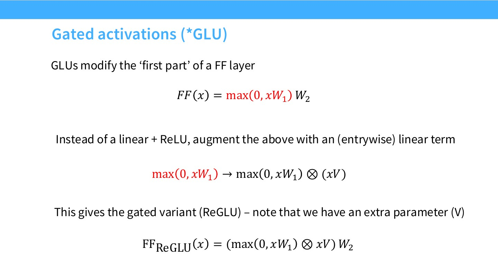
*图 6：一条分支产生 gate，另一条分支携带内容，二者逐元素相乘（视频 00:21:50–00:23:23）。*

把 gate 激活替换为 GELU 或 SiLU，就得到 GeGLU 与 SwiGLU：

$$
\operatorname{GeGLU}(x)=\bigl(\operatorname{GELU}(xW_g)\odot xW_v\bigr)W_o,
\qquad
\operatorname{SwiGLU}(x)=\bigl(\operatorname{SiLU}(xW_g)\odot xW_v\bigr)W_o.
$$

- $x,W_g,W_v,W_o,\odot$：含义与 ReGLU 相同；
- $\operatorname{GELU}$：Gaussian Error Linear Unit；
- $\operatorname{SiLU}(z)=z\,\sigma(z)$：Sigmoid Linear Unit；
- $\sigma(z)$：sigmoid 函数。

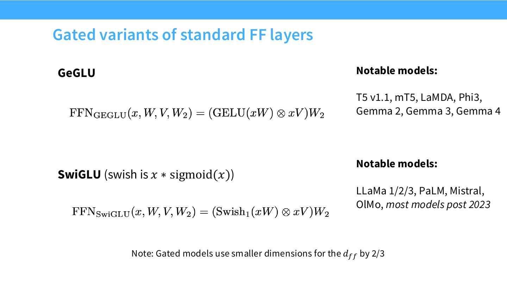
*图 7：GLU 家族只改变 gate 分支的非线性（视频 00:23:23–00:25:01）。*

门控相对单分支激活的本质提升，在于它把“是否通过”与“通过什么”拆成两组独立参数。对中间层第 $k$ 个通道，输出为 $a(xW_g)_k\cdot(xW_v)_k$：$W_v$ 的第 $k$ 行决定该通道编码什么内容，$W_g$ 的第 $k$ 行决定什么输入模式下该通道开放。普通 FFN 中一个通道只能同时承担这两个职责。从函数逼近角度看，门控使 FFN 对输入是**分段双线性**的——固定 gate 分支时，输出对 $xW_v$ 线性；固定 value 分支时，对 gate 分支也（分段）线性——乘积结构大幅增加了单位参数能表达的分段数量。这也解释了门控的一个训练特性：gate 分支的梯度为 $\sigma'(\cdot)\cdot (xW_v)$，value 分支的梯度为 $a(\cdot)\cdot W_o^\top(\cdots)$，两条分支互为对方的梯度调制因子，优化早期常出现门控值缓慢分化、随后通道功能快速特化的两阶段现象。

一个最小但完整的 SwiGLU FFN 参考实现：

```python
import torch
import torch.nn as nn

class SwiGLUFFN(nn.Module):
    def __init__(self, d_model: int, d_gate: int):
        super().__init__()
        self.w_gate = nn.Linear(d_model, d_gate, bias=False)   # W_g
        self.w_value = nn.Linear(d_model, d_gate, bias=False)  # W_v
        self.w_out = nn.Linear(d_gate, d_model, bias=False)    # W_o

    def forward(self, x: torch.Tensor) -> torch.Tensor:
        # x: [B, n, d_model]
        gate = torch.nn.functional.silu(self.w_gate(x))  # [B, n, d_gate]
        value = self.w_value(x)                          # [B, n, d_gate]
        return self.w_out(gate * value)                  # [B, n, d_model]
```

注意三个线性层都不带 bias——这与第 2 章“去掉低收益逐元素操作”的系统结论一致，也是 LLaMA 等公开配方的标准写法。

### 3.2 为什么 gated FFN 常取传统宽度的 $2/3$

普通 FFN 有两个主要矩阵，参数量近似 $2d_{\text{model}}d_{\text{ff}}$；gated FFN 有 gate、value、output 三个矩阵，参数量近似 $3d_{\text{model}}d_{\text{gate}}$。若希望参数量和矩阵计算预算相近，令两者相等：

$$
3d_{\text{model}}d_{\text{gate}}
\approx 2d_{\text{model}}d_{\text{ff}}
\quad\Longrightarrow\quad
d_{\text{gate}}\approx\frac{2}{3}d_{\text{ff}}.
$$

- $d_{\text{model}}$：模型隐藏宽度；
- $d_{\text{ff}}$：普通两矩阵 FFN 的中间宽度；
- $d_{\text{gate}}$：三矩阵 gated FFN 的中间宽度；
- $2$、$3$：两类 FFN 的主矩阵数量。

> [!IMPORTANT]
> “$2/3$”不是激活函数的神秘常数，而是预算配平。若传统 FFN 取 $d_{\text{ff}}=4d_{\text{model}}$，预算相当的 gated FFN 就约为 $d_{\text{gate}}=\frac{8}{3}d_{\text{model}}$。

用具体数字验算一次。设 $d_{\text{model}}=1024$，传统配方取 $d_{\text{ff}}=4096$：参数量为 $2\times 1024\times 4096=8{,}388{,}608$。改用三矩阵门控并保持总参数不变，$d_{\text{gate}}=\frac{8{,}388{,}608}{3\times 1024}\approx 2730.7$。工程上不会取 2730 这种别扭的数字——2730 不能被 256 整除，不利于张量核分块；常见做法是对齐到 256 的倍数，取 $d_{\text{gate}}=2816$（即 $11\times 256$，恰好就是 LLaMA-7B 在其 $d_{\text{model}}=4096, d_{\text{ff}}=11008$ 中采用的 $2.6875\times$ 比例所体现的思路：$11008=43\times 256$，且 $11008/4096\approx 2.69\approx 8/3$）。FLOP 侧同理：矩阵乘法的 FLOP 与参数量同阶（每个参数参与一次乘加），参数量配平即 FLOP 配平，因此 $2/3$ 换算同时保证了两类 FFN 在“参数预算”与“计算预算”两种口径下都可比。

实验上，GLU 变体常在相似计算预算下优于普通 ReLU/GELU FFN；但差距、排序和最佳宽度都会随规模与训练设置改变。讲者借此反复强调：用消融支持默认值，而不是把模型家族的流行度当因果证据。

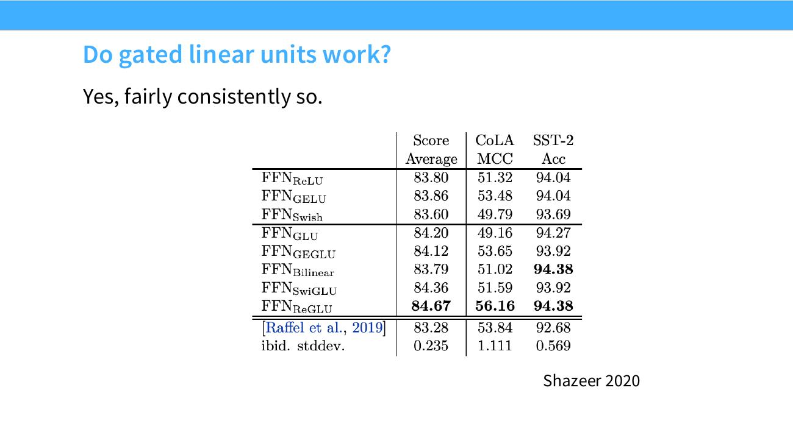

对“门控线性单元真的有效吗”，这一页给出肯定答案——相当一致地有效。课件配图为 Shazeer 2020 的 GLU 变体对比实验，在多个任务与设置下，门控变体在相近预算下优于对应的非门控基线。这正是把 SwiGLU/GeGLU 列为“强默认值”的主要证据来源。

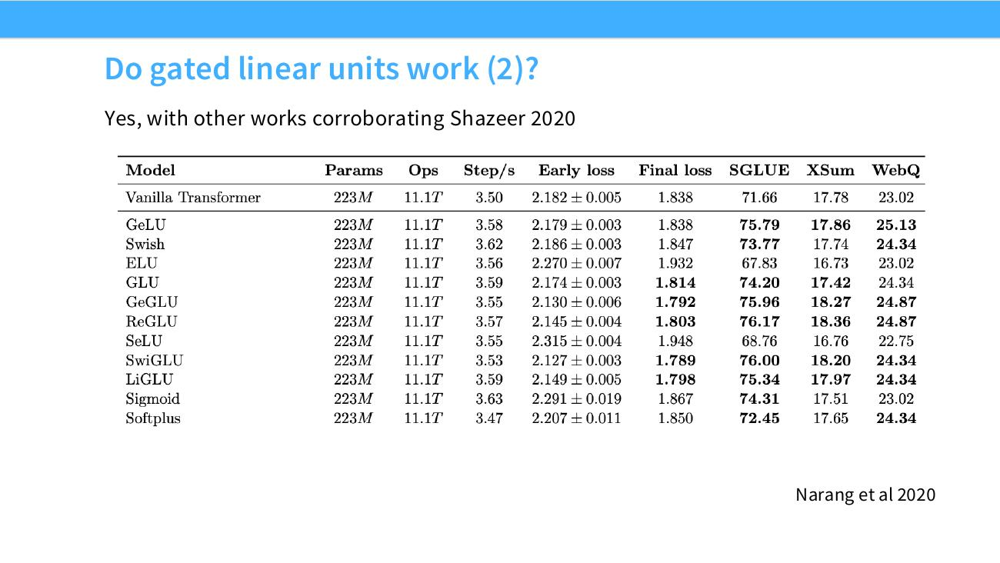

这一页补充独立佐证：Narang et al. 2020 在另一套训练设置中复现了门控变体的收益。两项工作在相互独立的设置下得到同向结论，提升了证据等级——但按第 1 章的证据分层，它仍属于“同族消融对比”而非跨规模定律，因此正文保持“强默认值而非必然”的措辞。

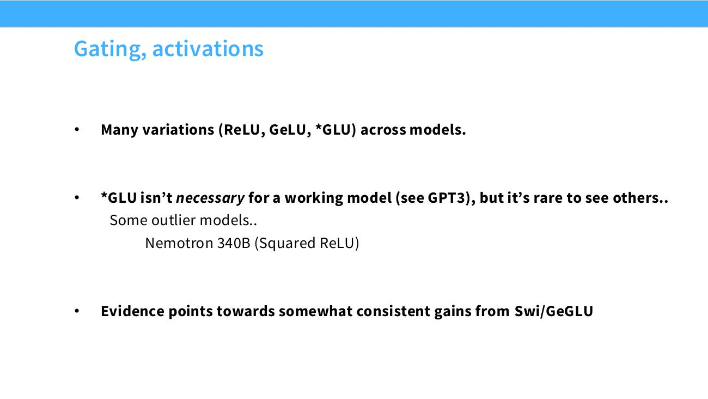

课件的激活小结页归纳：各模型在 ReLU、GeLU、*GLU 之间有多种变化；*GLU 不是能跑通的必要条件（GPT-3 就是反例），但如今已很少见到非门控选择；证据指向 SwiGLU/GeGLU 有相当一致的收益。课件还点名了一个例外模型——Nemotron 340B 使用 Squared ReLU，提醒读者默认值之外仍有活跃的探索。

### 本章小结

- FFN 对每个 token 独立地做通道混合；注意力才负责跨 token 通信。
- GLU 用内容分支乘门控分支，使网络能按输入选择通过哪些通道；门控把“是否通过”与“通过什么”解耦为两组参数。
- GELU 与 SiLU 都是平滑、非单调的软开关，负半轴衰减速率不同（高斯尾部对指数尾部）。
- gated FFN 的 $2/3$ 宽度来自三矩阵与两矩阵之间的预算匹配，工程上再对齐到硬件友好倍数。
- SwiGLU/GeGLU 是有经验支持的强默认值，但仍需在目标规模和系统上验证。

## 4. Serial 还是 parallel：block 排列也是系统设计

### 4.1 串行 block

上一章默认采用串行排列：注意力先更新 residual stream，FFN 再读取更新后的状态。为看清依赖关系，可写成：

$$
h=x+\operatorname{Attn}(\operatorname{N}_1(x)),
\qquad
y=h+\operatorname{FFN}(\operatorname{N}_2(h)).
$$

- $x$：block 输入；
- $h$：注意力后的中间 residual state；
- $y$：block 输出；
- $\operatorname{Attn}$：自注意力分支；
- $\operatorname{FFN}$：前馈分支；
- $\operatorname{N}_1,\operatorname{N}_2$：对应分支前的归一化。

因为 FFN 必须等待注意力结果，两个大分支不能完全并行执行。好处是 FFN 能直接处理注意力刚汇聚的信息，表达路径更深。

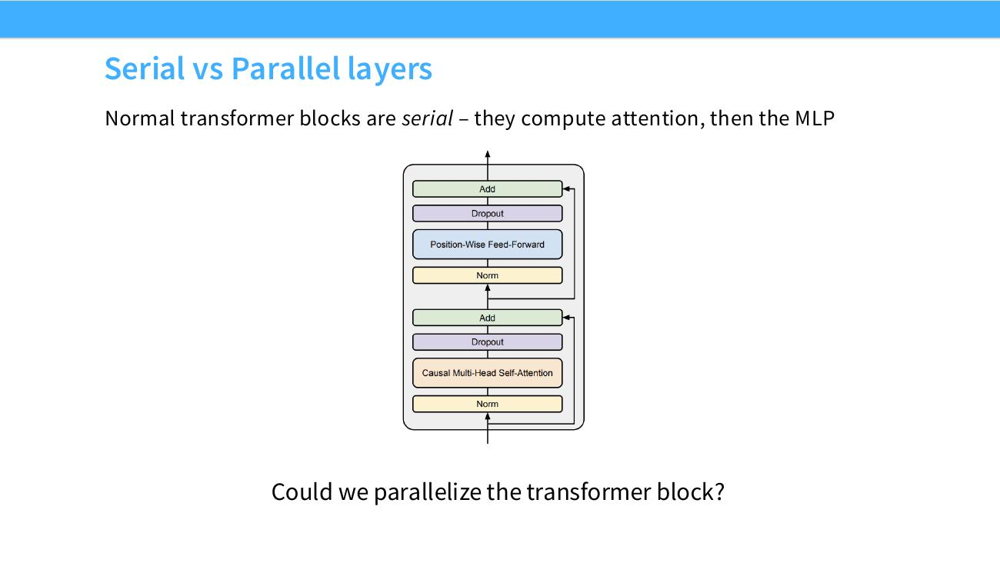

课件在此提出问题：普通 Transformer block 是串行的——先算注意力、再算 MLP；能不能把 Transformer block 并行化？这个提问方式本身就体现了本讲的方法论：架构图中的一条顺序依赖，同时是表达路径（FFN 能否读到本层注意力的结果）与系统关键路径（两个大矩阵运算能否重叠调度），下文从两个角度分别展开。

从梯度流看，串行 block 的输出对输入的 Jacobian 为

$$
\frac{\partial y}{\partial x}
=\left(I+\frac{\partial \operatorname{FFN}}{\partial h}\right)\left(I+\frac{\partial \operatorname{Attn}}{\partial x}\right),
$$

- $\partial\operatorname{FFN}/\partial h$：FFN 分支（含其入口归一化）对中间状态的 Jacobian；
- $\partial\operatorname{Attn}/\partial x$：注意力分支对 block 输入的 Jacobian。

展开后得到四项：纯直通项 $I$、只过注意力的项、只过 FFN 的项，以及**串联经过两个子层的复合项**。复合项的存在意味着：即使注意力分支单独学不出有用的梯度信号，FFN 的 Jacobian 仍可能把它“摆渡”回输入——两个子层在优化上是互相耦合的。这种耦合既是表达能力（FFN 可以精炼注意力的输出），也是优化负担（一个分支的失稳会通过复合项污染另一个分支的梯度）。

### 4.2 并行 block

parallel block 让两个分支读取同一个归一化输入，再把结果一起写回：

$$
y=x+\operatorname{Attn}(\operatorname{N}(x))
  +\operatorname{FFN}(\operatorname{N}(x)).
$$

- $x$、$y$：block 输入与输出；
- $\operatorname{N}$：共享或等价复用的归一化结果；
- $\operatorname{Attn}$：注意力分支；
- $\operatorname{FFN}$：前馈分支。

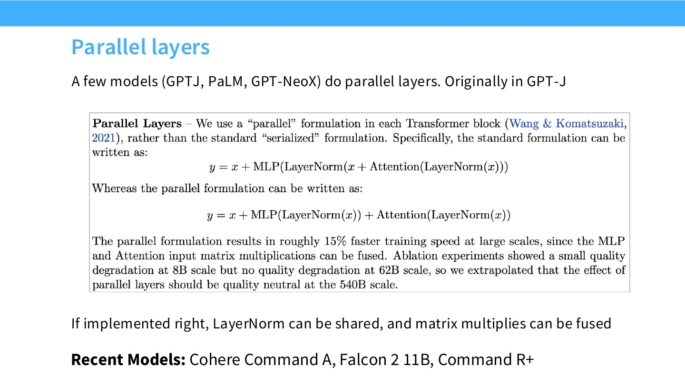
*图 8：串行路径具有分支依赖，并行路径可同时计算 attention 与 FFN（视频 00:27:09–00:29:29）。*

并行 block 的 Jacobian 结构完全不同：

$$
\frac{\partial y}{\partial x}
=I+\frac{\partial \operatorname{Attn}}{\partial x}+\frac{\partial \operatorname{FFN}}{\partial x}.
$$

- 三项：直通项、注意力项与 FFN 项以**加法**而非乘法组合。

加法结构意味着两个分支的梯度路径互不经过对方：FFN 的梯度不会被注意力的 Jacobian 调制，反之亦然。这带来两个后果。其一，每个分支的优化更“独立”，训练初期两个分支可以各自学习而不必等待对方稳定；其二，复合表达路径消失了——单层之内不再有“先通信后加工”的两步结构，等价的复合要靠堆叠更多层来补偿。从这个角度看，parallel block 相当于用**深度换并行度**：把原来一个 block 内的两级串行依赖摊平，再用更多 block 数补回表达深度。GPT-J、PaLM、Falcon 等模型的实践表明，在相同层数下并行版本的质量损失通常很小，有时甚至可忽略。

并行形式减少了关键路径和一次 normalization/activation 读写机会，适合追求训练吞吐；代价是单个 block 内 FFN 看不到本层注意力刚生成的结果。实际质量差距可能很小，也可能依赖模型规模与并行实现，因此它是“系统—模型协同”的典型例子。

关键路径的缩短对分布式训练尤其重要：注意力分支（含 all-reduce 通信）与 FFN 分支（另一组矩阵乘法）可以重叠调度，通信等待被计算掩盖；同时，两个分支共享一次归一化输入，省掉一次完整的 hidden state 读写——按第 2 章的 arithmetic-intensity 分析，这种逐元素操作的节省在低强度路径上是实打实的时间收益。

两种 block 的最小可运行对照实现：

```python
import torch
import torch.nn as nn

class SerialBlock(nn.Module):
    def __init__(self, attn, ffn, norm1, norm2):
        super().__init__()
        self.attn, self.ffn, self.n1, self.n2 = attn, ffn, norm1, norm2

    def forward(self, x):                    # x: [B, n, d_model]
        h = x + self.attn(self.n1(x))        # FFN 依赖 h：必须先等注意力完成
        return h + self.ffn(self.n2(h))

class ParallelBlock(nn.Module):
    def __init__(self, attn, ffn, norm):
        super().__init__()
        self.attn, self.ffn, self.n = attn, ffn, norm

    def forward(self, x):                    # x: [B, n, d_model]
        z = self.n(x)                        # 归一化只做一次
        return x + self.attn(z) + self.ffn(z)  # 两个分支无相互依赖，可并发
```

对照代码可见三个结构性差别：串行版需要两个归一化层和两次读入，并行版共享一次；串行版的第二行必须等第一行算完，并行版的两个分支之间没有任何数据依赖；并行版的两个增量直接相加，一些实现会在这里额外乘 $1/\sqrt{2}$ 类的缩放以控制写入总线的方差——这又是第 0 章方差累积问题的回声。

> [!NOTE]
> 这里的 parallel 指一个 block 内的 attention/FFN 分支并行，不是 tensor parallel、pipeline parallel 或 data parallel。后几者描述的是模型如何分布到设备上。

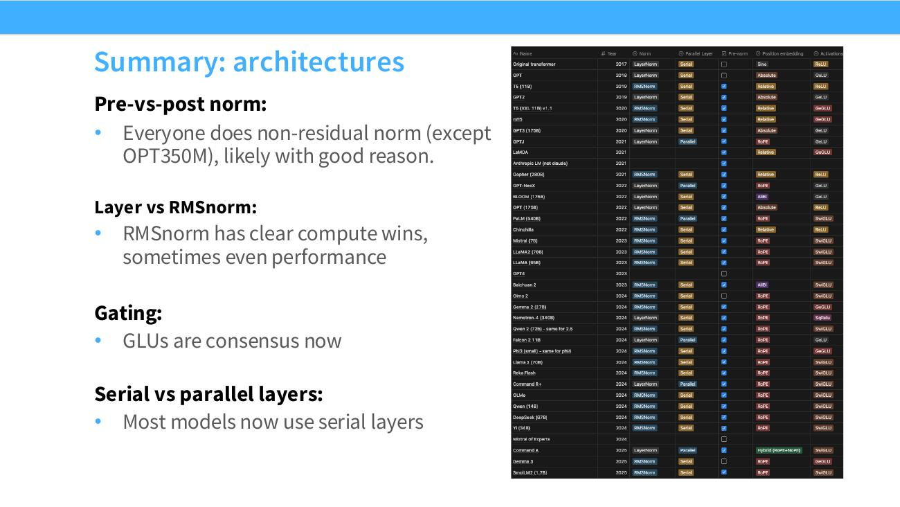

课件的架构小结页收束第 2–4 章的四个议题：pre-norm 与 post-norm 之争以非残差归一化（除 OPT-350M 外）告终，且很可能有充分理由；LayerNorm 与 RMSNorm 之争中 RMSNorm 有明确的计算收益、有时甚至有性能收益；门控（GLU）已是共识；而串行与并行层之争以串行层为当前大多数模型的选择收尾。值得注意的是前三项都有机制性解释，唯独串行的回归更多依赖经验。

### 本章小结

- serial block 允许 FFN 使用同层注意力输出，Jacobian 含跨分支复合项，但增加顺序依赖。
- parallel block 的 Jacobian 是加法结构，分支梯度解耦，缩短关键路径，但改变了单层的信息依赖。
- parallel 本质上是用深度换并行度；等价表达能力要靠层数补回。
- 架构图中一条连线的改变，可能同时影响表示能力、内核调度和通信重叠。

## 5. 从相对位置目标推导 RoPE

### 5.1 为什么内容向量本身不够

自注意力若只比较 token 内容，就无法区分“同一个词出现在第 2 位”和“出现在第 200 位”。位置方案大体包括：把绝对位置向量加到输入、在 attention score 上加相对位置 bias、或直接让 query/key 的几何关系编码相对距离。

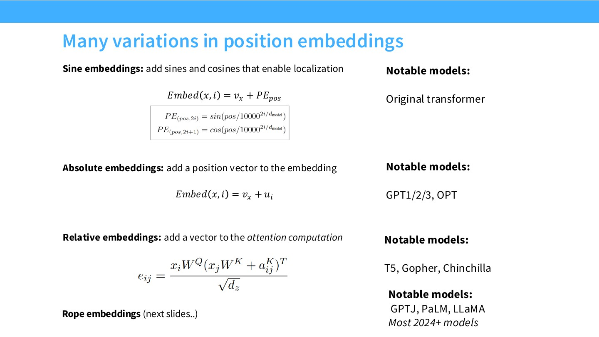
*图 9：绝对位置、相对 bias 与旋转式位置编码的对照（视频 00:31:04–00:33:01）。*

三种方案各有一个结构性短板。绝对位置嵌入把位置向量加到输入 embedding 上，位置信息在进入注意力前就与内容混在一起，模型需要自己学会把它分离出来；相对位置 bias（如 T5、ALiBi 的做法）直接在 logits 上加一个只依赖距离的标量项，实现简单、外推性好，但每个 head 只能表达一个标量距离偏好，位置与内容之间没有乘法交互；RoPE 走的是第三条路——让位置以**旋转**的方式进入 Q/K，使内积自动成为相对位移的函数。

RoPE 想实现的目标可写为：内容 $x,y$ 位于位置 $i,j$ 时，变换后的内积只通过相对位移 $i-j$ 依赖位置：

$$
\left\langle f(x,i),f(y,j)\right\rangle
=g(x,y,i-j).
$$

- $x,y$：两个 token 的内容表示，实际进入注意力时对应 query/key 子向量；
- $i,j$：两个 token 的绝对位置；
- $f(\cdot,\cdot)$：把内容与位置结合的变换；
- $g$：仅依赖内容和相对位移的打分函数；
- $\langle\cdot,\cdot\rangle$：向量内积。

这个目标比“记住一个固定长度的位置表”更贴合注意力：模型做匹配时通常更关心两个 token 相隔多远，而非它们从序列开头数到第几位。句法依存、指代、局部重复模式等语言现象几乎都是相对位置现象——“动词在其主语之后若干位置”这条规律在任何绝对起点下都成立。绝对位置表则把这种平移不变性藏进了需要学习的数据统计里，而且表的长度硬性限制了可处理的最大序列。

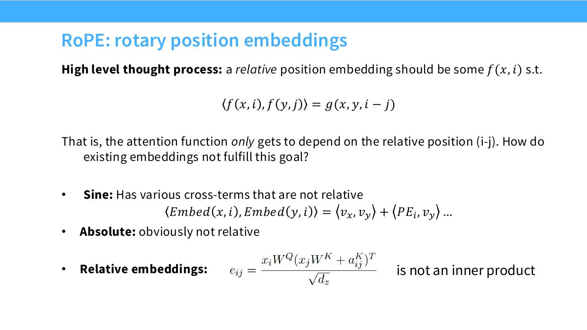

课件把 RoPE 的设计目标写成函数方程：寻找 $f(x,i)$ 使 $\langle f(x,i),f(y,j)\rangle=g(x,y,i-j)$，即注意力打分只通过相对位移 $i-j$ 依赖位置。这一页还逐一检验了现有方案为何不达标：正弦嵌入的内积展开含 $\langle v_x,v_y\rangle+\langle PE_i,v_y\rangle+\cdots$ 等非相对交叉项，绝对嵌入显然非相对，而 T5 式相对嵌入给出的根本不是内积形式。下面的二维旋转构造正是这个函数方程的解。

### 5.2 二维旋转如何自动得到相对位置

从二维向量开始最直观。定义旋转矩阵：

$$
R(\theta)=
\begin{bmatrix}
\cos\theta & -\sin\theta\\
\sin\theta & \cos\theta
\end{bmatrix},
\qquad
f(x,i)=R(i\theta)x.
$$

- $R(\theta)$：逆时针旋转角度 $\theta$ 的二维矩阵；
- $\theta$：该二维通道对的基础旋转频率；
- $i$：位置索引；
- $x$：二维内容向量；
- $f(x,i)$：旋转后带位置信息的向量。

两个旋转后向量的内积为：

$$
\bigl(R(i\theta)x\bigr)^\top R(j\theta)y
=x^\top R((j-i)\theta)y.
$$

- $x,y$：两个二维内容向量；
- $i,j$：各自位置；
- $(\cdot)^\top$：转置；
- $R((j-i)\theta)$：由相对位移决定的旋转。

等式使用 $R(i\theta)^\top R(j\theta)=R((j-i)\theta)$。绝对位置因此在内积中消去，只剩相对位移。

把这一步的代数补全。旋转矩阵是正交矩阵，满足 $R(\theta)^\top=R(\theta)^{-1}=R(-\theta)$（逆矩阵即反向旋转），且同维旋转满足乘法可加性 $R(\alpha)R(\beta)=R(\alpha+\beta)$。于是：

$$
\bigl(R(i\theta)x\bigr)^\top R(j\theta)y
=x^\top R(i\theta)^\top R(j\theta)\,y
=x^\top R(-i\theta)R(j\theta)\,y
=x^\top R\bigl((j-i)\theta\bigr)y.
$$

每一步都只用到正交性与角度可加性，与 $x,y$ 的取值无关——这就是“内积只依赖相对位移”的完整证明。它还附带一个对称性结论：交换 $i,j$ 相当于把旋转反向，$x^\top R((i-j)\theta)y=y^\top R((j-i)\theta)x$，即相对位置打分在交换 Q/K 后是转置关系，与注意力 score 矩阵的转置对称性一致。

#### 手算一次：平移绝对位置，内积保持不变

先明确真实实现里的 shape：投影并拆头后，query 通常是 `Q.shape = [B, H_q, n, d_h]`，key 是 `K.shape = [B, H_kv, n, d_h]`。在标准 MHA 中 $H_q=H_{kv}$；在 GQA/MQA 中，一个 KV head 会供一组或全部 query heads 使用。RoPE 沿最后的 $d_h$ 维，把它分成 $d_h/2$ 个二维对。下面只取 `B = H_q = H_kv = 1, n = 2, d_h = 2` 的单个二维对手算。

取基础角度 $\theta=\pi/2$，两个内容向量和位置为：

$$
q=(1,0)^\top,
\qquad
k=(0,1)^\top,
\qquad
i=1,
\qquad
j=2.
$$

- $q$：位置 $i$ 上的二维 query；
- $k$：位置 $j$ 上的二维 key；
- $i,j$：两个绝对位置；
- $\theta$：每前进一个位置增加的旋转角度；
- $(\cdot)^\top$：把坐标写成列向量。

分别旋转后：

$$
R(i\theta)q=R(\pi/2)(1,0)^\top=(0,1)^\top,
\qquad
R(j\theta)k=R(\pi)(0,1)^\top=(0,-1)^\top,
$$

- $R(i\theta)q$：位置 1 上旋转后的 query；
- $R(j\theta)k$：位置 2 上旋转后的 key；
- $R(\pi/2)$：逆时针旋转 $90^\circ$；
- $R(\pi)$：逆时针旋转 $180^\circ$。

所以 attention 内积为：

$$
\bigl(R(i\theta)q\bigr)^\top R(j\theta)k
=(0,1)\cdot(0,-1)=-1.
$$

- $\bigl(R(i\theta)q\bigr)^\top R(j\theta)k$：带位置旋转的 Q/K 内积；
- $\cdot$：二维点积；
- $-1$：本例得到的相似度。

现在把两个绝对位置同时向右平移 3，改成 $i'=4,j'=5$，内容向量不变。此时旋转后的 query 为 $(1,0)$，key 为 $(-1,0)$，内积仍为 $-1$。两组位置分别是 $(1,2)$ 与 $(4,5)$，但都有 $j-i=1$；结果相同，直接验证了内积只依赖相对位移。写成 $i-j$ 或 $j-i$ 只是旋转方向的符号约定，关键是绝对位置的共同平移会消去。

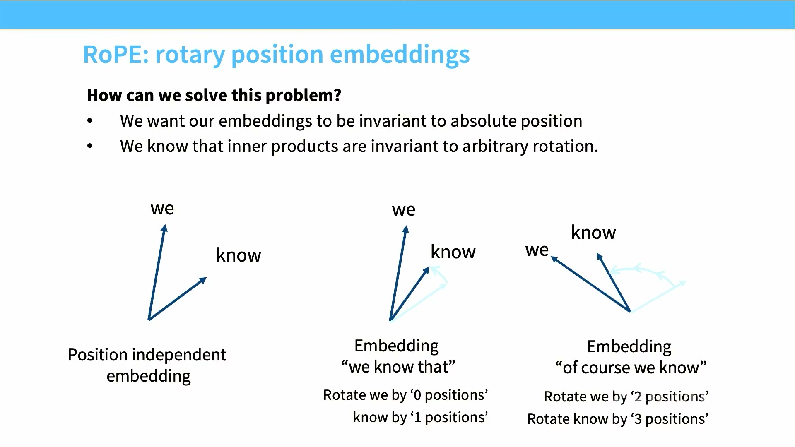
*图 10：以二维旋转解释为何注意力内积只保留相对角度（视频 00:34:25–00:36:06）。*

还有一个值得注意的范数性质：旋转是正交变换，不改变向量长度，$\|R(i\theta)x\|=\|x\|$。因此 RoPE 只改变 Q/K 的**方向**而不改变其尺度，attention logit 的幅度仍由内容向量的范数决定，位置只调制相对角度。这一点与第 7 章的 QK norm 形成自然分工：RoPE 管位置几何，QK norm 管范数尺度，两者作用在向量性质的不同方面，可以叠加。

### 5.3 扩展到高维：不同通道对使用不同频率

高维 RoPE 不是在“三维小块”上旋转，而是把维度分成许多**二维对**，每一对使用不同频率。对第 $m$ 对维度：

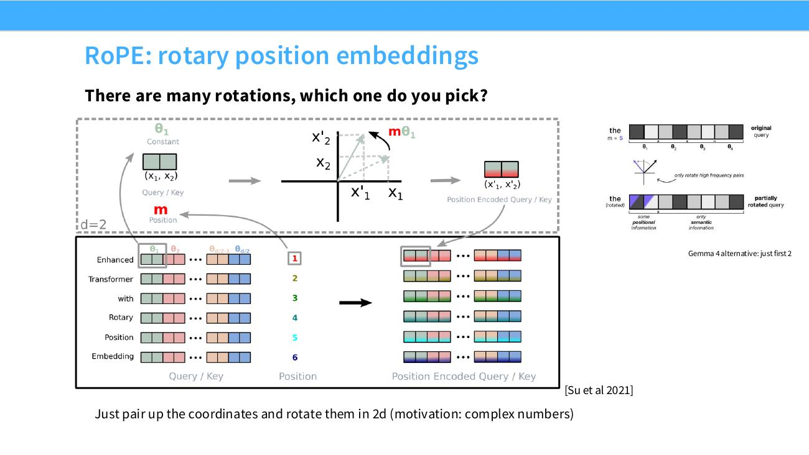

这一页回答“旋转有无穷多种，选哪一种”的问题（出处 Su et al. 2021）：把坐标两两配对，在每个二维子平面内分别旋转，动机来自复数乘法。课件还加注 Gemma 4 的替代做法——只用前两对坐标做旋转。需要再次提醒：讲者口述中的 “3D pairs” 应理解为二维通道对，本节开头的正文已作澄清。

$$
\theta_m=\Theta^{-2m/d_h},
\qquad
\widetilde q_i^{(m)}=R(i\theta_m)q_i^{(m)},
\qquad
\widetilde k_j^{(m)}=R(j\theta_m)k_j^{(m)}.
$$

- $m$：二维通道对索引；
- $d_h$：单个 attention head 的维度；
- $\Theta$：频率基数，常见配方会选择一个较大的常数；
- $\theta_m$：第 $m$ 对通道的旋转频率；
- $q_i^{(m)},k_j^{(m)}$：位置 $i,j$ 上第 $m$ 个二维 query/key 子向量；
- $\widetilde q_i^{(m)},\widetilde k_j^{(m)}$：应用 RoPE 后的 query/key。

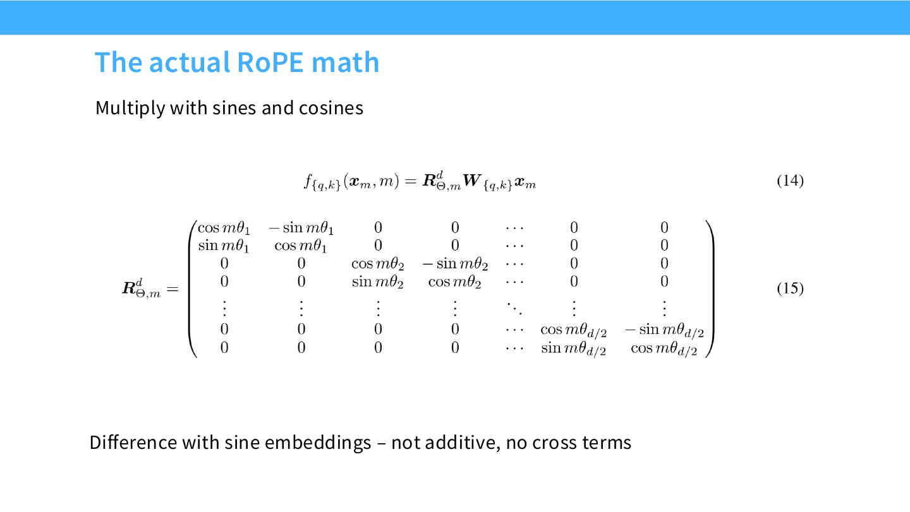
*图 11：高维向量由多个二维旋转块组成，而非一个高维“整体角度”（视频 00:36:06–00:38:15）。*

快频率通道对区分近距离位置，慢频率通道对承载更长周期结构，类似一组多尺度相位特征。实现时通常用 even/odd 通道重排和预计算的 sine/cosine 完成，不显式构造大矩阵。

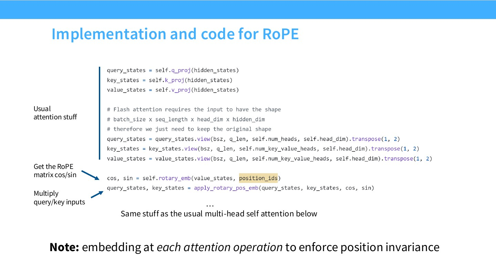
*图 12：用逐元素 sine/cosine 与通道配对实现旋转（视频 00:38:15–00:39:02）。*

频率的几何级数设计值得细算。以 $d_h=128$（即 64 个二维对）、$\Theta=10000$ 为例：最快的一对 $m=0$ 有 $\theta_0=1$，即每个位置旋转 1 弧度，约每 6.28 个位置转满一圈，适合区分相邻几个 token 的相对距离；最慢的一对 $m=63$ 有 $\theta_{63}=10000^{-126/128}\approx 10^{-3.94}\approx 1.15\times10^{-4}$，其周期为 $2\pi/\theta_{63}\approx 5.5\times10^{4}$ 个位置——足以覆盖数万 token 的上下文而不发生相位回绕。不同通道对如同一组不同齿比的齿轮：快齿轮记录精确的小位移，慢齿轮记录粗粒度的大位移，内积则是所有通道对贡献之和

$$
\bigl\langle \widetilde q_i,\widetilde k_j\bigr\rangle
=\sum_{m=0}^{d_h/2-1}\bigl(q_i^{(m)}\bigr)^\top R\bigl((j-i)\theta_m\bigr)k_j^{(m)},
$$

每一项都是同一相对位移 $j-i$ 在不同频率下的响应。这种多频率叠加恰好类似于傅里叶特征对位置的编码，区别只在于它是通过正交变换作用在可学习内容上，而不是把固定频率特征直接拼接进输入。

一段与上述公式逐一对应的参考实现：

```python
import torch

def precompute_rope(d_h: int, max_len: int, theta: float = 10000.0):
    """预计算各位置、各二维对的 cos/sin。返回 shape 均为 [max_len, d_h // 2]。"""
    inv_freq = theta ** (-torch.arange(0, d_h, 2).float() / d_h)  # θ_m = Θ^(-2m/d_h)
    pos = torch.arange(max_len).float()                          # 位置 i
    freqs = torch.outer(pos, inv_freq)                           # i·θ_m
    return freqs.cos(), freqs.sin()

def apply_rope(x: torch.Tensor, cos: torch.Tensor, sin: torch.Tensor) -> torch.Tensor:
    """x: [B, H, n, d_h]；cos/sin: [n, d_h//2]，广播到 batch 与 head 维。"""
    x_even, x_odd = x[..., 0::2], x[..., 1::2]       # 拆分二维对的两个分量
    rot_even = x_even * cos.unsqueeze(0).unsqueeze(0) - x_odd * sin.unsqueeze(0).unsqueeze(0)
    rot_odd = x_even * sin.unsqueeze(0).unsqueeze(0) + x_odd * cos.unsqueeze(0).unsqueeze(0)
    out = torch.stack([rot_even, rot_odd], dim=-1)   # 交错还原
    return out.flatten(-2)                           # [B, H, n, d_h]

# 用法：对 Q、K 分别应用（不作用于 V）
cos, sin = precompute_rope(d_h=128, max_len=4096)
# q_rot = apply_rope(q, cos[: q.size(2)], sin[: q.size(2)])
```

对应旋转矩阵的展开式 $R(i\theta_m)(a,b)=(a\cos i\theta_m - b\sin i\theta_m,\ a\sin i\theta_m + b\cos i\theta_m)$：偶数分量取第一式，奇数分量取第二式。代码中的 `x_even * cos - x_odd * sin` 与 `x_even * sin + x_odd * cos` 正是这两行。预计算把每个位置的三角函数从运行时开销变为一次查表，代价仅是 `[max_len, d_h/2]` 大小的两张表。

> [!IMPORTANT]
> RoPE 通常只作用于 **Q 和 K**，因为位置需要进入 attention score；V 不必旋转。把 RoPE 加到 residual stream 或 V 上，是不同的设计，不能与标准实现混为一谈。

> [!WARNING]
> 课件/口述中有两个易错点：一个位置示意把第二个 token 的位置也写成了 $i$，语义上应为 $j$；口头提到的“3D pairs”应理解为二维通道对。RoPE 的长上下文外推也并非自动保证，频率基数、训练长度和后续 scaling 方法都会影响结果。

为什么外推不自动保证？当推理长度超过训练长度时，慢速通道对的相位 $i\theta_m$ 进入训练中从未见过的区间，内积响应偏离训练分布；而快速通道对早已回绕多圈，其响应接近伪随机。社区的对策——位置插值（把位置索引线性压缩回训练范围）、NTK 感知的频率基数调整、YaRN 类的分频段缩放——本质上都是在重新映射 $i\theta_m$ 的取值范围，这已超出本讲范围，但记住结论：**RoPE 的相对性是对称性保证，外推性则是训练分布问题，两者不能混为一谈。**

#### 追问：为什么旋转 Q 和 K，而不是只旋转其中一个

假设只旋转 K，即 $\widetilde q=q,\widetilde k=R(j\theta)k$，内积为 $q^\top R(j\theta)k$——绝对位置 $j$ 原样保留，相对位移目标直接失败。假设两边用不同角度旋转，内积变为 $x^\top R((j-i)\theta')R(i(\theta-\theta'))y$ 一类混合项，绝对位置同样无法完全消去。只有“同一频率、同一约定、两边各按自己位置旋转”，正交矩阵的乘法链才能在中间恰好抵消成 $R((j-i)\theta)$。这解释了实现上的一个硬约束：Q 与 K 必须共享同一份频率表和同一个位置计数基准；跨序列拼接、packed sequence 或 prefix cache 场景中位置索引若错位，破坏的正是这个对称性。

#### 追问：为什么 V 不旋转

从信息流向看，V 的内容经过注意力加权后直接写回 residual stream，它的取值会成为后续层的输入表示。若对 V 也施加位置旋转，那么 residual stream 中的每条表示都会携带一个随绝对位置旋转的“相位”，而 FFN 与后续子层并不知道如何消除它——位置信息本应是 attention score 的调制项，却被混进了内容通道。更根本地说，5.1 节的推导目标只要求 score 感知相对位移；对 V 旋转既不服务于这个目标，又污染了内容表示，所以标准实现明确不旋转 V。

### 本章小结

- 位置表示的关键目标是让 attention score 感知相对位移；绝对嵌入、相对 bias 与 RoPE 是三条不同的实现路线。
- 二维旋转的内积自然把绝对角度化为角度差，这是 RoPE 的数学核心；证明只用到旋转的正交性与角度可加性。
- 高维 RoPE 将 head 维度拆成多个二维对，并使用多尺度频率；快通道记小位移，慢通道记大位移。
- 旋转保范数，因此 RoPE 与 QK norm 分别作用于方向与尺度，可以叠加。
- 标准 RoPE 旋转 Q/K，不旋转 V；它改善位置建模，但不自动解决所有长度外推问题。

## 6. 超参数默认值：经验盆地、预算约束与反例

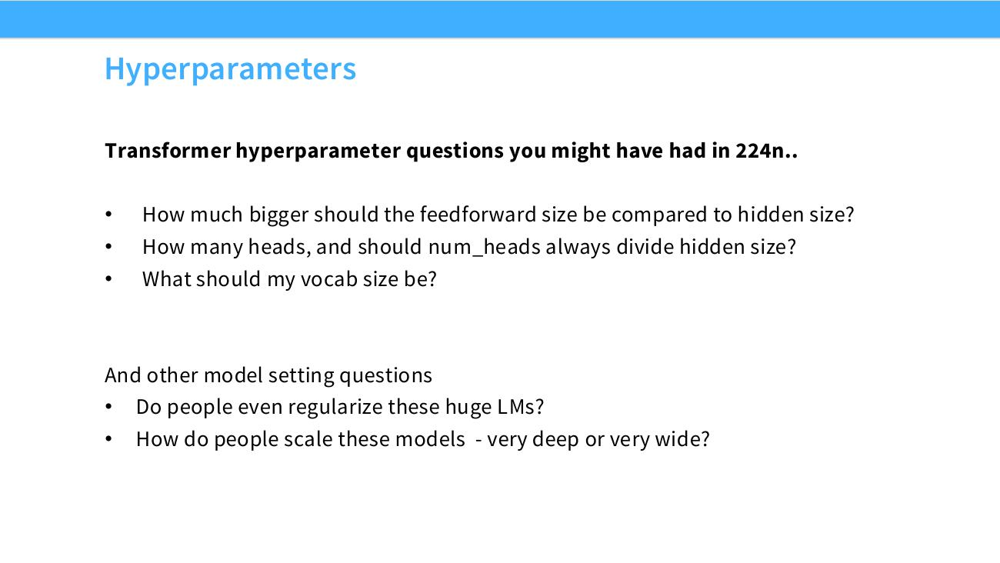

课件用一页问题清单开启超参数部分：FFN 宽度应该是隐藏宽度的几倍？头数应该是多少、num_heads 是否必须整除 hidden size？词表应该多大？以及更宏观的问题——这么大的模型还需要正则化吗？模型应该做得深还是宽？这些问题正是本章五个小节的组织线索，讲者特别提醒这些是“你在 224n 里可能想过的问题”。

### 6.1 FFN 宽度：从 $4\times$ 到 $8/3\times$，再到更宽

早期 Transformer 常令普通 FFN 宽度为模型宽度的四倍：

$$
d_{\text{ff}}=4d_{\text{model}}.
$$

- $d_{\text{ff}}$：FFN 中间维度；
- $d_{\text{model}}$：residual-stream 隐藏维度；
- $4$：历史经验倍数。

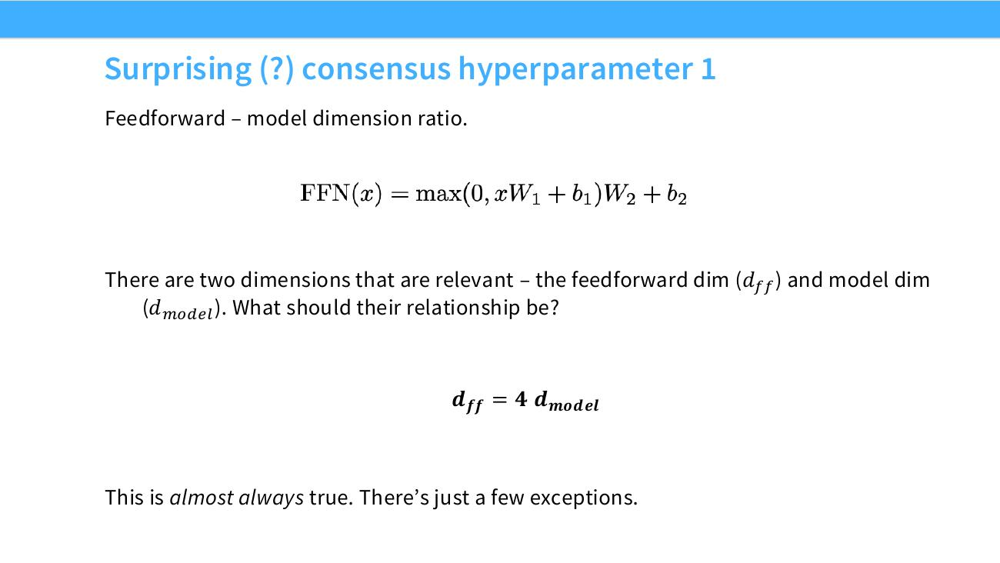

课件把 $d_{ff}$ 与 $d_{model}$ 的关系列为第一个“出人意料的共识超参数”：$d_{ff}=4d_{model}$ 几乎总是成立，只有少数例外。注意讲者的措辞——“surprising (?) consensus”带着疑问语气，暗示这种一致性未必来自深刻的优化理由，而可能只是历史惯性；下面的例外与盆地证据将逐步证实这一点。

改用三矩阵 GLU 并保持相近参数预算时，常见换算是：

$$
d_{\text{gate}}\approx\frac{8}{3}d_{\text{model}}.
$$

- $d_{\text{gate}}$：gated FFN 的中间维度；
- $d_{\text{model}}$：模型隐藏维度；
- $8/3$：由 $4\times$ 普通 FFN 乘预算因子 $2/3$ 得到。

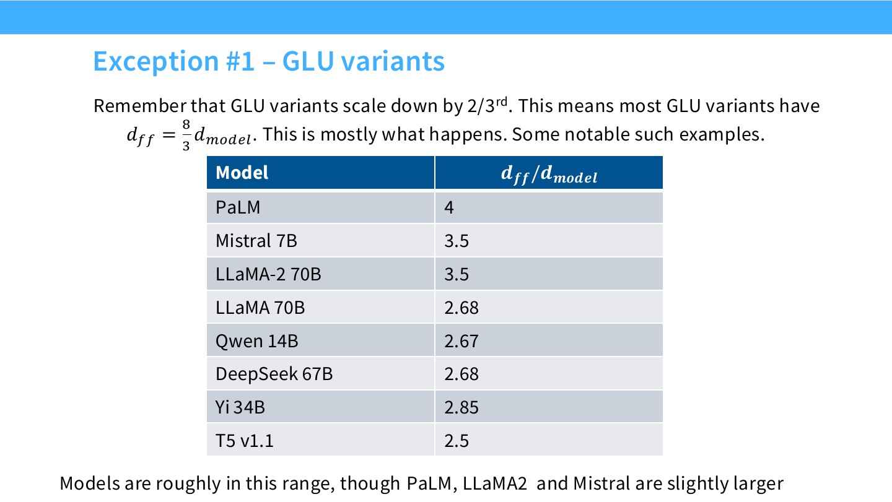
*图 13：两矩阵 FFN 与三矩阵 GLU 在相近预算下的中间宽度（视频 00:44:37–00:46:42）。*

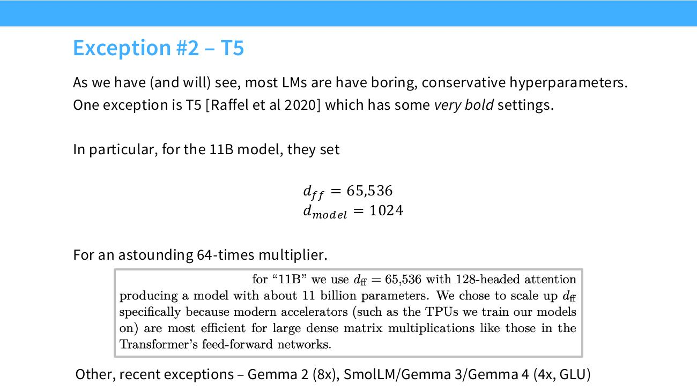

这一页展示最激进的反例：T5 的 11B 模型设 $d_{ff}=65{,}536$、$d_{model}=1024$，高达 64 倍的乘数。课件同时列出近期其他例外——Gemma 2 用 8 倍，SmolLM/Gemma 3/Gemma 4 用 4 倍（GLU）。T5 的存在直接否定了“4 倍是尖锐最优”的可能，但下一页会说明这并不等于任何倍数都一样好。

但 T5 等实验也探索了远高于 $4\times$ 的中间维度，并不支持一个尖锐唯一最优值。课件展示的曲线更像宽阔的经验盆地：在固定预算下，一段范围内的性能相近。

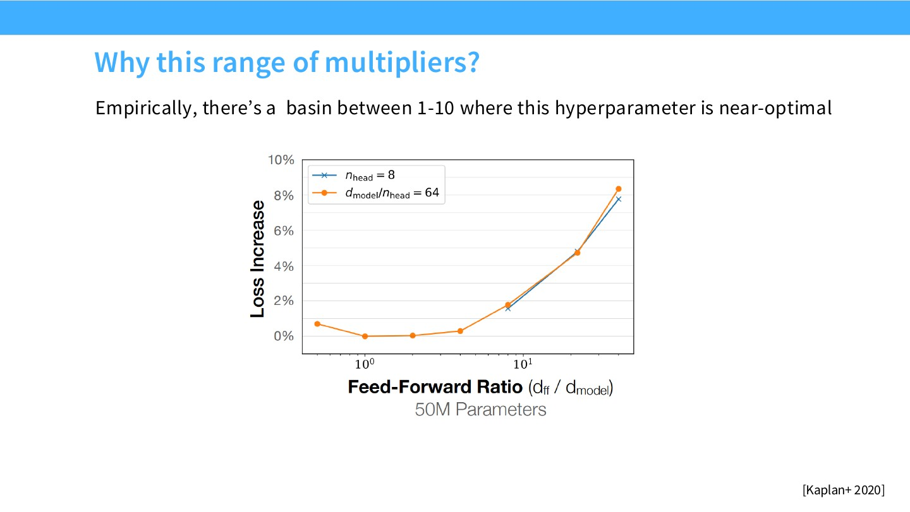
*图 14：FFN 宽度并非只有一个精确最优点（视频 00:47:54–00:49:55）。*

“盆地平坦”这件事本身有重要的实践推论：若性能在一个区间内几乎不变，那么超参数选择的自由度就应该全部让渡给**系统约束**——选择能被硬件整除、利于并行切分、便于内核融合的宽度，而不是逼近某个论文里的精确比例。例如 $d_{\text{gate}}$ 对齐到 128 或 256 的倍数，可使矩阵分块不浪费张量核；$d_{\text{model}}$ 能被 tensor-parallel 度数整除，可避免切片时的负载不均。这些都是零质量代价的纯收益。

把 FFN 在整层参数中的占比也算出来，可以判断“在 FFN 宽度上做文章”到底有多大杠杆。单层参数近似为

$$
N_{\text{layer}}
=\underbrace{4d_{\text{model}}^2}_{\text{注意力}}
+\underbrace{3d_{\text{model}}d_{\text{gate}}}_{\text{FFN}}.
$$

- $N_{\text{layer}}$：单个 decoder block 的参数量；
- $4d_{\text{model}}^2$：$W_Q,W_K,W_V,W_O$ 四个方阵（MHA 情形）；
- $3d_{\text{model}}d_{\text{gate}}$：SwiGLU 的三个矩阵。

取 $d_{\text{model}}=4096$、$d_{\text{gate}}=11008$（LLaMA-7B 配置）：注意力约 $6.71\times10^7$，FFN 约 $1.35\times10^8$，FFN 占比约 $2/3$。这意味着 FFN 宽度的每一点调整都会以近两倍的杠杆影响总参数量与训练 FLOP——在盆地平坦的前提下，把 $d_{\text{gate}}$ 从 $8/3\times$ 微调到硬件友好值，几乎不改变质量，却直接改变显存与吞吐。

这给出更实用的选择法：先满足张量核友好的倍数与并行切分，再在小规模代理实验中扫一段合理范围；不要为复制论文里的小数比例破坏硬件效率。

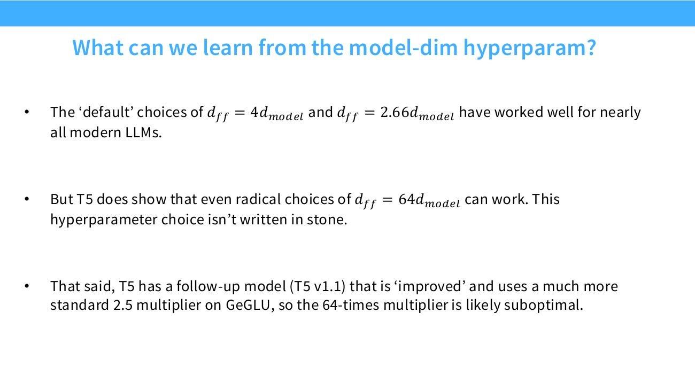

课件对这一议题的三点总结：$d_{ff}=4d_{model}$ 与 $d_{ff}=2.66d_{model}$ 两个默认值对几乎所有现代 LLM 都工作良好；T5 证明 $d_{ff}=64d_{model}$ 这样的激进选择也能跑通——此超参数并非铁板一块；但 T5 的改进版 T5 v1.1 改用了更标准的 GeGLU + 2.5 倍，说明 64 倍很可能确实次优。这三点合起来正是正文“盆地平坦、默认值居中”结论的课件依据。

### 6.2 Head 维度与模型 aspect ratio

多头注意力常满足：

$$
d_{\text{model}}=H_qd_h.
$$

- $d_{\text{model}}$：模型隐藏宽度；
- $H_q$：query head 数量；
- $d_h$：单个 head 的维度。

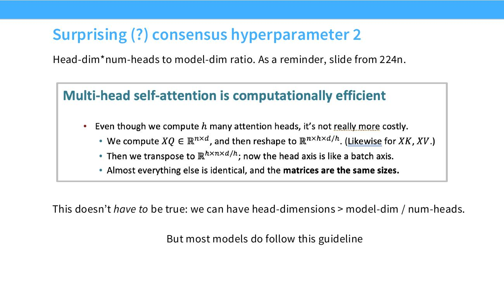

第二个共识超参数是 head-dim 乘以 head 数与 model-dim 的比值。课件提醒（引自 224n 的一页）：$d_h\times H=d_{model}$ 并非必须成立——head 维度完全可以大于 $d_{model}/H$，但大多数模型确实遵循这一准则。下面正文的换算实例说明，这个等式只固定参数量，乘积内部的比例仍是自由旋钮。

实践中 $d_h$ 常取 64、128 一类硬件友好值，但它不是尺度定律。增大 $H_q$ 或 $d_h$ 都能扩宽模型，却会影响 RoPE 频率布局、attention kernel 与 KV cache 形状。

#### 换算实例：同一 $d_{\text{model}}$ 的两种拆法

固定 $d_{\text{model}}=4096$，比较两种合法拆分。方案甲：$H_q=32,d_h=128$；方案乙：$H_q=64,d_h=64$。两者的注意力投影参数量完全相同（都是 $4d_{\text{model}}^2$），但以下性质不同：

- RoPE 通道对数：甲每 head 有 $128/2=64$ 个频率对，乙只有 $32$ 个；甲的最慢频率 $\Theta^{-126/128}$ 比乙的 $\Theta^{-62/64}$ 更低，单 head 内可表达的最长周期更长。
- attention score 矩阵：甲是 $32$ 个 $n\times n$ 矩阵，乙是 $64$ 个，后者的 score 计算与 softmax 总元素量翻倍，但每个 head 的内积长度减半——总 FLOP 相同（都是 $n^2d_{\text{model}}$ 量级），kernel 的并行粒度与寄存器压力却不同。
- KV cache 形状：在相同 $H_{kv}$ 下，乙的单层 cache 是 $2nH_{kv}\times 64$，比甲的 $2nH_{kv}\times 128$ 小一半；等价地说，乙可以在相同 cache 预算下容纳两倍 $H_{kv}$。

这个例子的要点是：$d_{\text{model}}=H_qd_h$ 这个等式只固定了参数量，**乘积内部的比例是一个自由旋钮**，它同时拧动位置编码分辨率、内核行为与缓存成本。

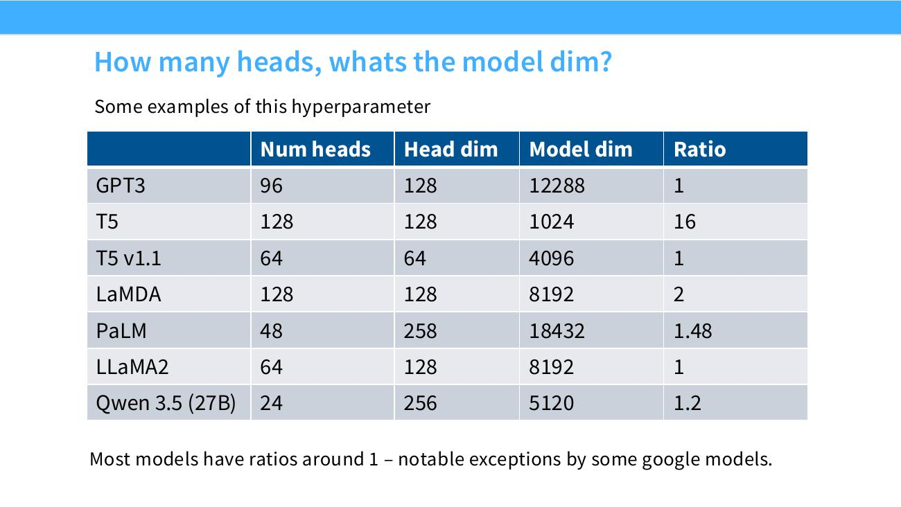

课件汇总了七个模型的实际配置：GPT-3（96 头、128 维、$d_{model}=12288$、比值 1）、T5（128 头、128 维、1024、比值 16）、T5 v1.1（64、64、4096、1）、LaMDA（128、128、8192、2）、PaLM（48、258、18432、1.48）、LLaMA-2（64、128、8192、1）、Qwen 3.5 27B（24、256、5120、1.2）。多数模型比值在 1 附近，例外主要来自 Google 系模型。注意 PaLM 一行的内部不一致——按所列数字重算约为 0.672 而非 1.48，见下方 WARNING 的验算。

给定参数预算，模型还要在“更深”和“更宽”之间选择。一个常用描述是 aspect ratio：

$$
\rho=\frac{d_{\text{model}}}{L}.
$$

- $\rho$：宽深比；
- $d_{\text{model}}$：隐藏宽度；
- $L$：Transformer block 数量。

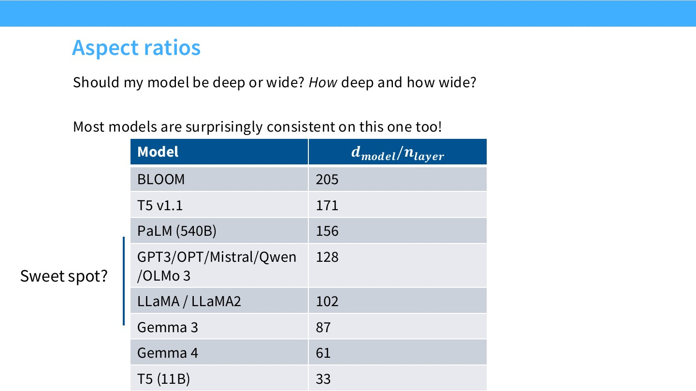
*图 15：不同模型族在层数与隐藏宽度之间采用不同折中（视频 00:51:31–00:53:12）。*

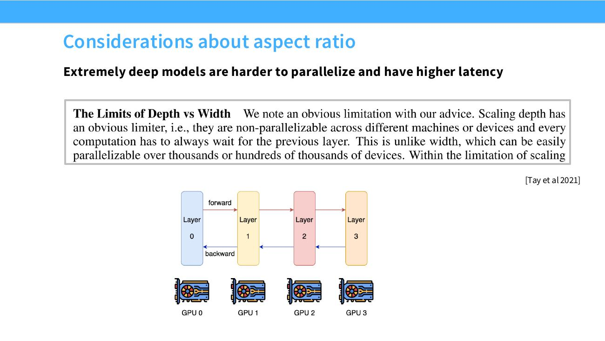

这一页指出宽深比选择背后的系统约束（引用 Tay et al. 2021）：极深的模型更难并行化、延迟更高——层数是串行关键路径的唯一来源，无法通过加宽弥补。这与正文对深度方向代价的展开（pipeline 气泡、激活存储线性增长）互为补充：课件给结论，正文给机制。

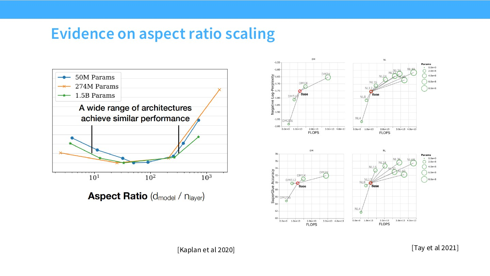
*图 16：固定或近似固定预算下，宽深比存在较宽的可行区间（视频 00:53:12–00:55:08）。*

更深会增加串行关键路径、激活存储和 pipeline 切分难度；更宽能提高大矩阵效率，却加大每层参数、通信与激活。讲者的结论不是“固定某个比值”，而是公开模型落在一片相对宽的区域。

把两端的代价写得更具体一些，有助于理解为什么存在可行区而非最优点。深度方向：层数 $L$ 增加一层，串行延迟增加一层的执行时间（无法通过加宽度弥补），pipeline 并行的气泡比例随阶段数变化，激活 checkpoint 的存储与重算开销线性增长；但深度的收益是复合表达能力——第 4 章说过，串行层数是“先通信后加工”这类复合路径的唯一来源。宽度方向：$d_{\text{model}}$ 加倍使每层参数与激活大致变为四倍与两倍（矩阵参数随 $d^2$ 增长，激活随 $d$ 增长），大矩阵的 arithmetic intensity 更高、张量核利用率更好；但注意力之外的计算并不因变宽而自动获得新的信息路由能力。两个方向的边际收益都在递减，交叠区域就形成了那张图里的宽阔盆地。

> [!WARNING]
> 课件中一个 PaLM 表格行存在内部不一致：按所列 $48\times258/18432$ 计算约为 $0.672$，不是 $1.48$；其中 258 也很可能是 256。不要把这行小数当作可靠经验常数。

顺带指出这个警告的教学意义：连 PaLM 这样被反复引用的论文表格里都有内部不一致的行，说明“从论文表格里抄默认比例”这一做法本身就需要交叉验算。验算方式很简单——aspect ratio 的定义是 $\rho=d_{\text{model}}/L$，而课件中该行疑似计算了 $L\times H_q/d_{\text{model}}$ 之类的其他组合；无论原意是什么，$0.672$ 与 $1.48$ 的差异都大到足以改变结论，必须以定义式重算为准。

### 6.3 Vocabulary size 与公平比较

词表变大可以缩短序列，却让 embedding 与输出 softmax 变大；词表变小则相反。近年来公开模型的词表常从数万扩到十万乃至更多，原因还包括多语言、代码和工具调用特殊 token。

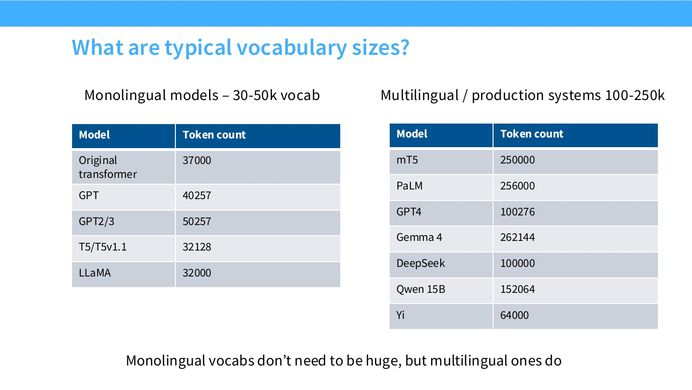
*图 17：不同模型族选择的 vocabulary size 差异很大（视频 00:55:11–00:57:12）。*

不同 tokenizer 下，per-token perplexity 不能直接横比，因为一个 token 覆盖的原始字符或字节数不同。更公平的归一化指标是 bits per byte：

$$
\operatorname{BPB}
=-\frac{1}{B\ln 2}\sum_{t=1}^{T}\log p(x_t\mid x_{<t}).
$$

- $B$：原始文本的字节数；
- $T$：token 数；
- $x_t$：第 $t$ 个 token；
- $x_{<t}$：它之前的 token 前缀；
- $p(x_t\mid x_{<t})$：模型赋予真实下一个 token 的概率；
- $\ln 2$：把自然对数损失换算成 bit 的因子。

用一个数值例子把归一化过程算到底。假设一段文本原始占 $B=1000$ 字节，tokenizer A 把它切成 $T_A=250$ 个 token，模型在其上的逐 token 交叉熵总和为 $\sum_t -\ln p_A = 1250$ nat；tokenizer B 切成 $T_B=200$ 个 token，损失总和为 $\sum_t -\ln p_B = 1230$ nat。两者的 per-token 平均损失分别为 $5.0$ nat 与 $6.15$ nat——若只看这个数，A 似乎显著更好。换算成 BPB：

$$
\operatorname{BPB}_A=\frac{1250}{1000\times\ln 2}\approx\frac{1250}{693.1}\approx 1.803\ \text{bit/byte},
\qquad
\operatorname{BPB}_B=\frac{1230}{693.1}\approx 1.775\ \text{bit/byte}.
$$

结论反转：B 用更粗的 token 覆盖了同样多的原始信息，单位字节的不确定性反而略低。这正是 BPB 的设计意图——把分母换成与 tokenizer 无关的原始字节数，逐 token 损失的口径差异（A 的 token 多、每个 token 的“平均信息密度”自然低）就被消掉了。

> [!NOTE]
> 直观上，BPB 问的是“平均每个原始字节还剩多少不确定性”。它能削弱 tokenizer 粒度差异，但仍不替代同数据、同计算预算的严格比较；多模态 token 更不能简单当普通文本字节处理。

词表大小还有第三个常被忽略的维度：输出 softmax 的计算与采样成本。输出 logits 的计算是一次 $d_{\text{model}}\times V$ 的矩阵乘法，$V=256{,}000$ 时这一步的参数量（$d_{\text{model}}\cdot V$，若与输入 embedding 共享则翻倍利用）可达 $10^9$ 量级；训练时完整的 softmax 归一化需要物化 $[\text{batch}\times\text{seq}, V]$ 的 logits 张量，在大词表下这往往是训练显存峰值的主要贡献者之一，也是各路 fused cross-entropy 内核存在的直接原因。

### 6.4 Dropout、weight decay 与训练尺度

大规模预训练通常数据充足、训练轮次少，传统 dropout 的收益较弱，还会妨碍 fused kernel 和确定性。公开配方常把 dropout 设为零，但“几乎无限数据”是前提；小数据微调或反复过拟合同一数据时，它仍可能有用。

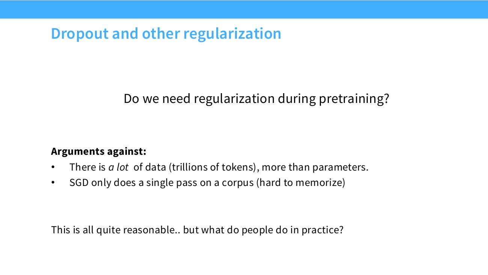

课件先摆出反对预训练正则化的两条理由：数据量以万亿 token 计、超过参数量，SGD 对语料只过一遍（难以记住数据）。讲者随即评论“这些都相当合理……但人们实际怎么做呢”，把问题从理论转向实践——下一页的模型配置表给出答案。

这个结论可以从偏差—方差的角度理解。dropout 是一种正则化手段，它用训练时的随机扰动换取更小的过拟合方差；正则化是否有收益，取决于模型的容量是否超出数据所能支撑的程度。预训练阶段，单 epoch 的数据量以万亿 token 计，模型几乎见不到重复样本，泛化误差的瓶颈在优化与容量而非记忆，此时 dropout 引入的额外噪声只会拖慢收敛。微调阶段则完全相反：数据常常只有数千到数百万样本，且要训练多个 epoch，记忆风险真实存在，dropout（或等价的数据侧正则化）重新变得有意义。同一条“dropout=0”的规则，在两个阶段的前提恰好相反，这就是“默认值必须连同前提一起迁移”的又一例。

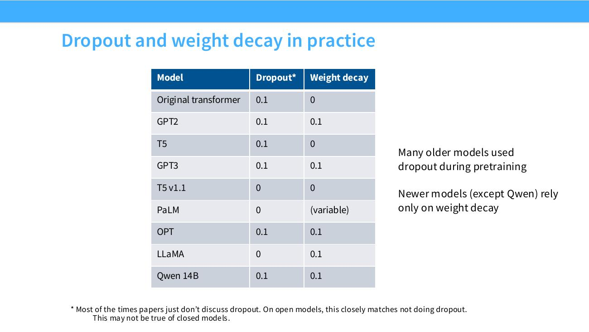

课件用一张配置表回答上一页的问题：原始 Transformer（dropout 0.1、weight decay 0）、GPT-2（0.1、0.1）、T5（0.1、0）、GPT-3（0.1、0.1）、T5 v1.1（0、0）、PaLM（0、可变）、OPT（0.1、0.1）、LLaMA（0、0.1）。课件批注指出趋势：许多旧模型在预训练中使用 dropout，而新模型（除 Qwen 外）只依赖 weight decay。这张表是正文“dropout=0 成为预训练默认”结论的直接数据来源。

weight decay 在 AdamW 中把参数衰减与梯度更新解耦：

$$
\theta_{t+1}=\theta_t-\eta_t\widehat m_t-\eta_t\lambda\theta_t.
$$

- $\theta_t$：第 $t$ 步参数；
- $\theta_{t+1}$：更新后参数；
- $\eta_t$：学习率；
- $\widehat m_t$：经 Adam 二阶统计缩放后的更新方向，此处用简写表示；
- $\lambda$：weight-decay 系数；
- $t$：优化步索引。

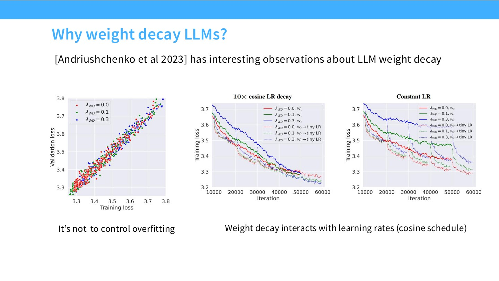
*图 18：AdamW 中实际衰减强度同时受 $\lambda$ 与学习率调度影响（视频 01:01:39–01:03:24）。*

每步乘法因子近似为 $1-\eta_t\lambda$，因此同一个 $\lambda$ 在不同学习率、训练步数下含义不同。讲者建议把它视为与学习率计划耦合的优化超参数，而不是独立正则化旋钮。

算一笔账来体会这个耦合。取 $\lambda=0.1$：在学习率峰值 $\eta=3\times10^{-4}$ 时，每步的纯衰减因子为 $1-3\times10^{-5}$；若训练 $10^5$ 步且学习率全程保持峰值，仅衰减项造成的累计收缩约为 $(1-3\times10^{-5})^{10^5}\approx e^{-3}\approx 0.05$——即哪怕梯度项完全消失，参数也会被压到初始范数的 5%。但余弦调度的后段学习率降到峰值的十分之一以下，衰减几乎关闭。因此“$\lambda=0.1$”在 3 万步训练与 30 万步训练中的实际正则化强度相差近一个数量级；迁移他人的 weight decay 而不同时迁移学习率与步数，等于没有迁移。

为什么 AdamW 要把衰减从梯度里拿出来？在经典 Adam 中，L2 惩罚以 $\lambda\theta$ 的形式进入梯度，再被二阶动量 $\widehat v_t$ 逐参数缩放——梯度大的参数衰减被放大，梯度小的参数衰减被抑制，正则化强度意外地与损失面曲率耦合。AdamW 把 $-\eta\lambda\theta$ 作为独立项加在最后，使所有参数按统一比例收缩，衰减强度只由 $\eta_t\lambda$ 决定，不再依赖梯度统计。这正是上式要单独写成三项而不是把 $\lambda\theta$ 塞进 $\widehat m_t$ 的原因。

> [!IMPORTANT]
> 选择默认值的顺序应是：先明确预算与服务约束，再找文献给出的可行区间，最后用本任务消融验证。模型表格能告诉你“大家试过什么”，不能证明“为什么有效”。

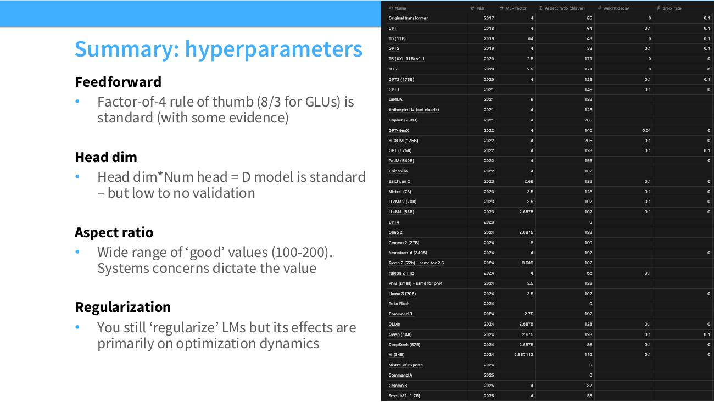

课件的超参数小结页收束四个议题：FFN 宽度的 4 倍经验法则（GLU 为 8/3 倍）是标准做法且有一定证据；head-dim 乘头数等于 model-dim 是标准但几乎未被验证的约定；宽深比在 100–200 的宽区间内都可行、具体取值由系统考量决定；正则化方面“你仍然在‘正则化’LLM，但其效果已与经典含义不同”（weight decay 实为优化超参数）。本节的数值验算与机制分析为这四条结论分别补上了推导链。

### 本章小结

- FFN 宽度、head 维度与宽深比通常存在宽阔可行区，而非单点最优；盆地平坦时选择自由度应让渡给系统约束。
- 硬件整除、通信和关键路径是选择维度时的一等约束。
- 不同 tokenizer 应用 BPB 等按原始单位归一化的指标比较；per-token 困惑度的横比结论可能在换算后反转。
- dropout 是否需要取决于数据复用程度；weight decay 必须与学习率和训练步数一起解释，AdamW 的解耦写法保证衰减速率与梯度统计无关。

## 7. Softmax 稳定性的三个控制点

### 7.1 先定位风险：模型里有两处大 softmax

规模增大后，训练损失偶发尖峰并非小事：一次数值爆炸可能污染 optimizer state，浪费数千张 GPU 的计算。课件先定位两处风险点：输出 vocabulary softmax，以及 attention softmax。

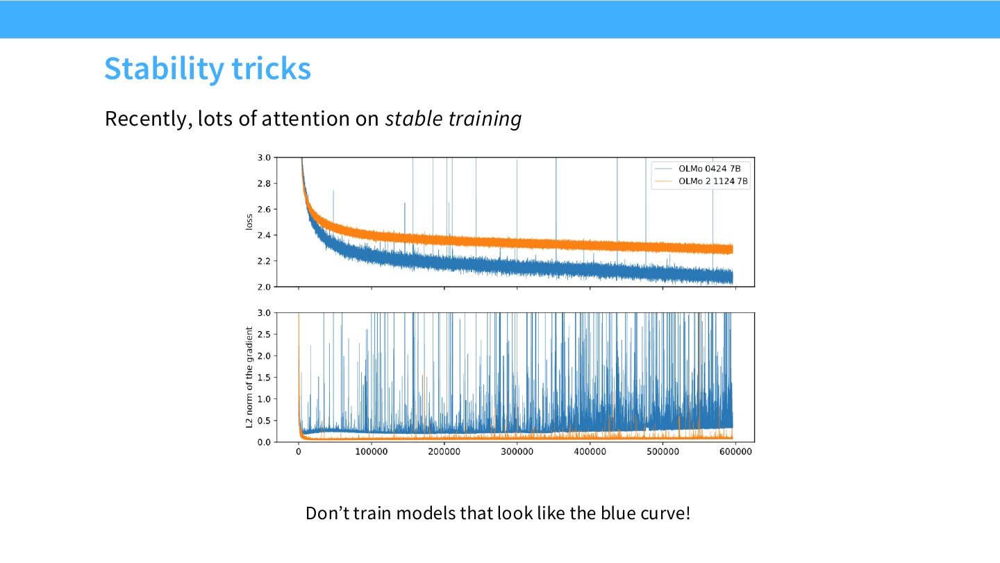
*图 19：更大训练运行可能出现突发 loss spike，需要架构级稳定措施（视频 01:05:01–01:06:24）。*

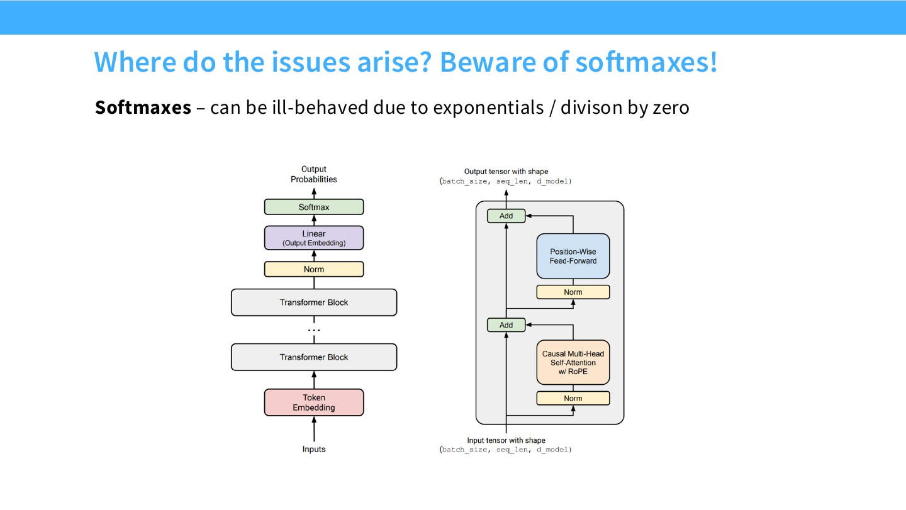
*图 20：输出层 softmax 与 attention softmax 分别受 logit 尺度影响（视频 01:06:24–01:07:07）。*

softmax 本身可以用“先减最大值”稳定计算，但若上游 logit 范数持续变大，仍会造成极尖分布、低精度下溢、梯度恶化或训练动力学失控。三个常见控制点分别作用在输出 logits、Q/K 向量和 attention logits。

第 0 章已经证明减最大值是数学恒等变换，它能保证单次前向不溢出。但训练是迭代过程：若某个参数方向能持续推高 logit 范数而不受损失惩罚，模型会在每一步都停留在“靠减最大值勉强不炸”的边缘状态。此时即使前向数值安全，梯度的有效信噪比也在恶化——softmax 的 Jacobian 为 $\operatorname{diag}(p)-pp^\top$，分布越尖，绝大多数类别的概率 $p_i$ 越接近零，其梯度被二次方级压缩，学习信号退化为只在 top 几个类别之间流动；同时一步意外的 logit 飙升就可能让 FP16/BF16 的中间量溢出，把 NaN 写进 Adam 的二阶动量，之后即使回退权重，被污染的 $\widehat v_t$ 也会持续压低有效学习率。这就是 loss spike 的完整因果链，也是为什么需要架构级而非仅数值级的稳定手段。

为什么规模增大后问题才暴露？两个机制。其一，logit 尺度的漂移是逐层、逐步累积的随机游走，训练步数与参数量越大，走到极端区域的概率越高；其二，大模型使用更低精度（BF16/FP16 混合）与更激进的学习率，留给数值误差的余量更薄。小模型上“碰巧没炸”的配置，放大一百倍后就成了定时炸弹。

### 7.2 输出端：z-loss

交叉熵只关心各类别 logit 的相对差值：给所有 logit 加同一个常数，概率不变。这留下一个不受任务损失约束的整体漂移方向。z-loss 对 log-partition 加惩罚，让输出尺度不至于无界漂移。若总目标采用最小化约定，可写为：

$$
L=L_{\text{CE}}+\alpha\left(\log\sum_{v=1}^{V}e^{z_v}\right)^2.
$$

- $L$：加入稳定项后的总损失；
- $L_{\text{CE}}$：交叉熵损失；
- $\alpha$：z-loss 权重；
- $z_v$：词表第 $v$ 项的输出 logit；
- $V$：词表大小；
- $\log\sum_v e^{z_v}$：log-partition，也称 log-sum-exp。

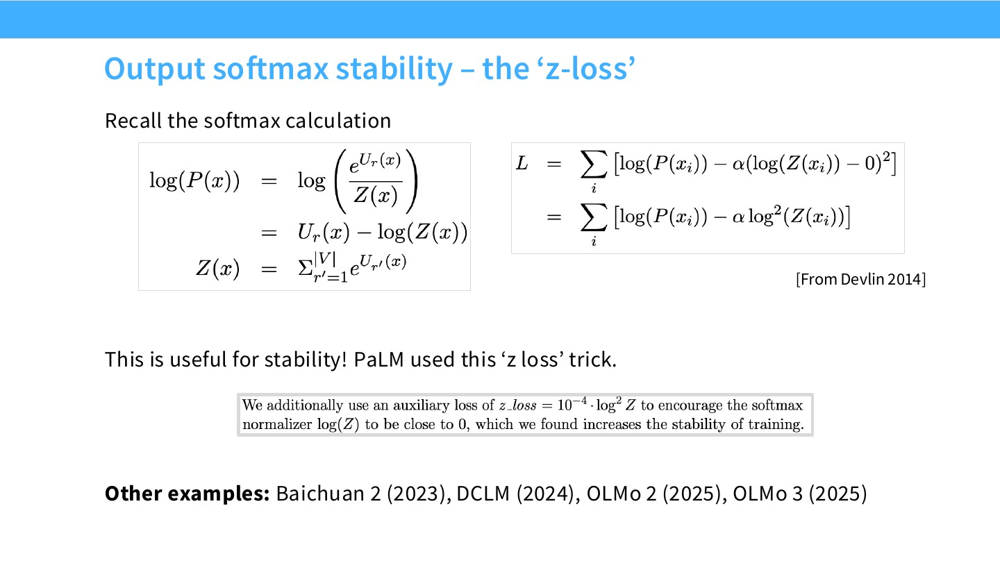
*图 21：z-loss 控制输出 softmax 前的整体 logit 尺度（视频 01:07:07–01:09:28）。*

> [!WARNING]
> 若论文把目标写成要**最大化**的 log-likelihood，正负号会与上式相反。判断 z-loss 的作用应看它是否惩罚过大的 log-partition，而不能脱离优化约定机械背符号。

#### 推导：z-loss 的梯度长什么样

记 $Z=\sum_v e^{z_v}$，$\log Z$ 为 log-partition。z-loss 项对第 $v$ 个 logit 的梯度为

$$
\frac{\partial}{\partial z_v}\alpha(\log Z)^2
=\alpha\cdot 2\log Z\cdot\frac{\partial \log Z}{\partial z_v}
=2\alpha\log Z\cdot\frac{e^{z_v}}{Z}
=2\alpha\log Z\cdot p_v,
$$

- $p_v=e^{z_v}/Z$：softmax 后的第 $v$ 类概率；
- $2\alpha\log Z$：所有类别共享的标量强度。

结果非常干净：**每个 logit 收到的惩罚梯度正比于自己的 softmax 概率，整体强度正比于当前 log-partition。** 这意味着 z-loss 是一种自适应的全局缩放水压——当 $\log Z$ 很大（所有 logit 整体偏高）时，所有 logit 被按概率加权往下压；当 $\log Z$ 接近零或略负时，惩罚自动减弱甚至反向。它不限制 logit 之间的**差值**（相对竞争力，那是交叉熵管的），只压整体的绝对高度，恰好补上交叉熵的平移不变性留下的那个自由方向。$\alpha$ 的典型取值很小（如 $10^{-4}$），目的正是在不干扰主任务的前提下钉住这个漂移方向。

### 7.3 注意力输入端：QK norm

标准 scaled dot-product attention 为：

$$
S=\frac{QK^\top}{\sqrt{d_h}},
\qquad
A=\operatorname{softmax}(S),
\qquad
O=AV.
$$

- $Q,K,V$：query、key、value 矩阵；
- $d_h$：单个 head 维度；
- $S$：softmax 前的 attention logits；
- $A$：归一化后的 attention 权重；
- $O$：attention 输出。

即使除以 $\sqrt{d_h}$，训练过程中 Q/K 范数仍可能增长，使 $S$ 变得极端。QK norm 在点积前分别归一化 Q 与 K：

$$
\widehat Q=\operatorname{N}_q(Q),
\qquad
\widehat K=\operatorname{N}_k(K),
\qquad
S=\frac{\widehat Q\widehat K^\top}{\sqrt{d_h}}.
$$

- $Q,K$：线性投影得到的原始 query/key；
- $\operatorname{N}_q,\operatorname{N}_k$：head 维度上的归一化，可带独立参数；
- $\widehat Q,\widehat K$：归一化后的 query/key；
- $S$：受控的 attention logits；
- $d_h$：单个 head 维度。

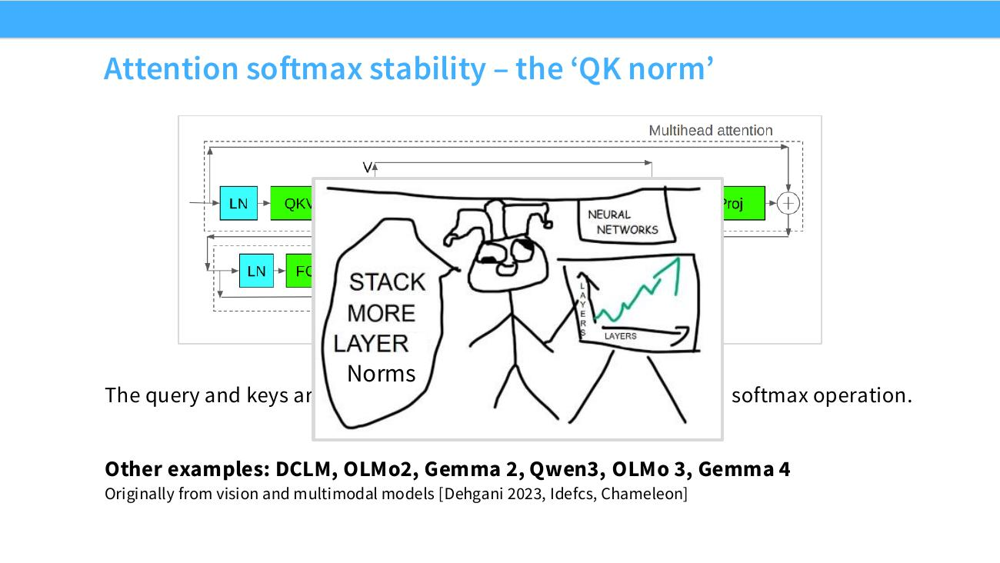

这一页介绍第二个控制点：query 与 key 在进入 softmax 运算之前先做 Layer（RMS）归一化。课件列出采用者 DCLM、OLMo 2、Gemma 2、Qwen3、OLMo 3、Gemma 4，并注明该技术最初来自视觉与多模态模型（Dehghani 2023、IDEFICS、Chameleon）。下文的 $\sqrt{d_h}$ 方差推导解释了为什么初始化时的缩放不足以约束训练中的范数漂移。

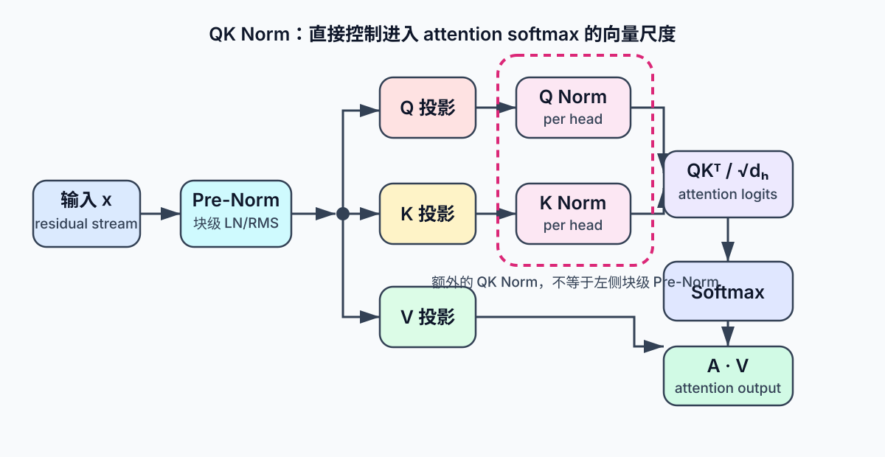
*图 22：QK norm 作用于投影后的 Q/K、点积之前；不要与 block 输入的 pre-norm 混淆（视频 01:09:28–01:12:07）。*

> [!IMPORTANT]
> block pre-norm 控制进入整个 attention/FFN 子层的 residual state；QK norm 专门控制 attention score 的两个输入。二者解决的数值路径不同，可以同时存在。

#### 推导：$\sqrt{d_h}$ 缩放从哪来

要理解 QK norm 为什么必要，先要明白标准缩放解决的是什么、又没解决什么。设 query 向量 $q$ 与 key 向量 $k$ 的各分量独立、零均值、单位方差（初始化后近似成立）。内积 $q^\top k=\sum_{i=1}^{d_h}q_ik_i$ 的均值与方差为

$$
\mathbb{E}[q^\top k]=\sum_{i=1}^{d_h}\mathbb{E}[q_i]\mathbb{E}[k_i]=0,
\qquad
\operatorname{Var}(q^\top k)=\sum_{i=1}^{d_h}\mathbb{E}[q_i^2]\,\mathbb{E}[k_i^2]=d_h.
$$

- $\mathbb{E}[\cdot]$、$\operatorname{Var}(\cdot)$：期望与方差；
- 独立性用于把乘积的期望拆成期望的乘积，方差同理（交叉项因零均值消失）。

于是内积的标准差为 $\sqrt{d_h}$——head 维度越大，未缩放的 logit 波动越大，softmax 越容易饱和。除以 $\sqrt{d_h}$ 恰好把方差归一到 1，这就是缩放的全部理由：它是**初始化时刻的方差配平**，不是对训练中分布的任何保证。

训练中会发生什么？注意力要学会“尖锐地锁定少数相关 key”，最直接的方式就是推高相关方向的 $\|q\|$ 与 $\|k\|$——因为 logit $q^\top k$ 对范数是双线性的，范数翻倍，logit 差值翻倍。交叉熵梯度对更尖的正确分布持续给出正反馈，$\|q\|\|k\|$ 便可能无界增长；一旦乘积远超 $\sqrt{d_h}$，初始化时的方差配平就失效了。QK norm 正是切断这条反馈：把 $\widehat q,\widehat k$ 钉在单位尺度（或其可学习缩放内）之后，$S$ 的范围被结构性限制，模型想变尖只能靠调整方向（让相关 Q/K 更对齐），而不是无限放大范数。注意这同时引入一个表达力约束——最大 logit 差有了上界——这与下一节 soft-cap 的效果方向一致，但实现机制完全不同。

用数字体会“方向变尖”与“范数变尖”的差别。设 $d_h=128$，两个 key 与 query 的夹角余弦分别为 $0.9$ 与 $0.8$（内容相近、需要区分）。不约束范数时，若把 $\|q\|=\|k\|=10$，logit 为 $10\times10\times0.9/\sqrt{128}\approx 7.95$ 与 $7.07$，差值 $0.88$；若放任范数涨到 $100$，差值变为 $88$——softmax 给出极端 one-hot。加 QK norm 后（取 RMS 归一化且 $\gamma=1$），$\|\widehat q\|=\|\widehat k\|=\sqrt{d_h}$（RMSNorm 输出每分量均方根为 1，故范数为 $\sqrt{d_h}$），logit 恰为 $d_h\cos\theta/\sqrt{d_h}=\sqrt{d_h}\cos\theta$：差值是 $\sqrt{128}\times 0.1\approx 1.13$，**只由夹角决定，与训练进程无关**。这个例子的附带结论值得记住：QK norm 之后 attention logit 的自然量纲是 $\sqrt{d_h}$ 乘余弦相似度——尺度被彻底几何化。

### 7.4 注意力 logit 端：soft-cap

另一条路线是直接把 attention logits 压到有限范围。常见平滑裁剪为：

$$
\widetilde S=c\tanh\left(\frac{S}{c}\right),
\qquad
A=\operatorname{softmax}(\widetilde S).
$$

- $S$：原始 attention logits；
- $c>0$：soft-cap 阈值；
- $\tanh$：双曲正切函数；
- $\widetilde S$：平滑限制在约 $[-c,c]$ 的 logits；
- $A$：attention 权重。

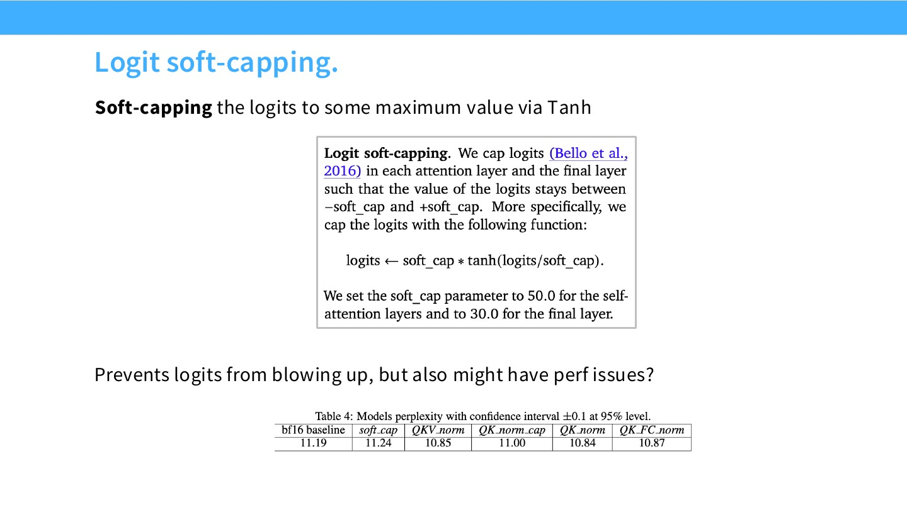
*图 23：用 $c\tanh(S/c)$ 平滑限制 attention logit（视频 01:12:07–01:13:56）。*

当 $|S|\ll c$ 时，$\tanh(S/c)\approx S/c$，变换近似恒等；当 $|S|$ 很大时才逐渐饱和。它能提高稳定性，却也可能阻止模型形成非常尖锐的注意力，课件中的结果提示 perplexity 可能受损。因而这是稳定性—表达力的直接交换。

#### 推导：soft-cap 的渐近行为与梯度

把“近似恒等”与“逐渐饱和”量化。$\tanh$ 在零点的 Taylor 展开为 $\tanh(u)=u-u^3/3+O(u^5)$，代入 $u=S/c$：

$$
c\tanh\!\left(\frac{S}{c}\right)=S-\frac{S^3}{3c^2}+O\!\left(\frac{S^5}{c^4}\right).
$$

- 第一项：恒等映射；
- 修正项：相对偏差约为 $S^2/(3c^2)$，当 $|S|=0.1c$ 时仅约 $0.3\%$。

另一端，$S\to+\infty$ 时 $\tanh(S/c)\to 1$，logit 被钉在 $c$；渐近差为 $1-\tanh(u)=2e^{-2u}+O(e^{-4u})$，即饱和是指数级逼近的。对梯度而言，$\frac{\partial \widetilde S}{\partial S}=\operatorname{sech}^2(S/c)=1-\tanh^2(S/c)$：线性区梯度约为 1，$|S|=2c$ 时降到约 $0.07$，$|S|=3c$ 时约 $0.01$。这意味着 soft-cap 对极端 logit 的梯度是**指数关闭**的——超出阈值的 logit 几乎不再收到学习信号。好处是失控方向被彻底掐断；代价是模型无法通过继续推高 logit 来表达“这个匹配应该再强一点”，尖锐注意力的上限被 $2c$ 的 logit 差（最强与最弱 key 之间最多差 $2c$）硬性封顶。取 $c=30$（Gemma 2 曾用的量级）时，注意力权重比在任意两个可见位置间最多相差 $e^{60}$——看似巨大，但与不设限时训练后期可达到的 logit 动态范围相比，仍然是实质约束。

三个控制点的作用位置可以一句话区分：z-loss 钉输出 softmax 的整体高度，QK norm 钉 attention logit 的**输入范数**，soft-cap 钉 attention logit 的**输出范围**。三者可叠加，但每一层干预都在表达能力上收一笔税；工程上的正确姿势是先监控，再对真正失控的路径施加最小干预。

用 $c=30$ 走一遍数值。某行 attention logits 为 $[0.5,\ 8,\ 60,\ -45]$：经 soft-cap 后，$0.5\to 30\tanh(0.0167)\approx 0.500$（几乎不变）；$8\to 30\tanh(0.2667)\approx 30\times 0.2605\approx 7.81$（小幅压缩）；$60\to 30\tanh(2)\approx 28.92$（强压缩）；$-45\to 30\tanh(-1.5)\approx -27.15$。压缩后 logit 差从 $60-(-45)=105$ 降到 $28.92-(-27.15)\approx 56.1$，注意力权重比的上界从 $e^{105}$（物理上无法表示）降到 $e^{56.1}$——仍然允许非常尖的分布，但把失控的那一段削掉了。这个例子也直观显示了 soft-cap 的渐进保真：正常区（$|S|\lesssim 0.3c$）几乎逐值保留，只有越界部分被压回。

### 本章小结

- 输出 softmax 与 attention softmax 是两条独立的尺度风险路径；loss spike 的完整链条包含前向溢出与 optimizer state 污染。
- z-loss 约束输出 log-partition，其梯度正比于各类别概率，整体强度随 $\log Z$ 自适应。
- $\sqrt{d_h}$ 缩放是初始化时刻的方差配平；QK norm 切断训练中“放大范数以变尖”的正反馈。
- soft-cap 在线性区近似恒等、饱和区指数关闭梯度，用最大 logit 差 $2c$ 换来结构性稳定。
- 数值稳定措施并非免费，可能改变优化目标或限制注意力尖锐度；实践中应先监控 logit/QK 范数与 loss spike，再选择最小必要干预。

## 8. Decode 为什么 memory-bound：KV cache、MQA 与 GQA

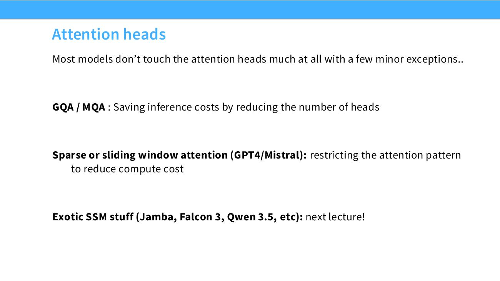

课件在进入细节前先总览注意力头的改动方向：大多数模型对注意力头本身改动很少，例外主要有三类——GQA/MQA 通过减少头数节省推理成本；稀疏或滑动窗口注意力（GPT-4/Mistral）通过限制注意力模式降低计算量；以及更激进的 SSM 类结构（Jamba、Falcon 3、Qwen 3.5 等，属于下一讲内容）。本章覆盖第一类，第 9 章覆盖第二类。

### 8.1 Prefill 和 decode 是两种不同工作负载

输入一个长度为 $n$ 的 prompt 时，prefill 会并行处理全部 token。单层投影和 attention 的主要量级可概括为：

$$
\operatorname{cost}_{\text{prefill}}
=O(nd_{\text{model}}^2)+O(n^2d_hH_q).
$$

- $n$：prompt token 数；
- $d_{\text{model}}$：模型隐藏宽度；
- $d_h$：单个 attention head 维度；
- $H_q$：query head 数；
- $O(nd_{\text{model}}^2)$：Q/K/V/O 与 FFN 等大线性投影的代表性量级；
- $O(n^2d_hH_q)$：全注意力 score 与 value 聚合的序列二次项。

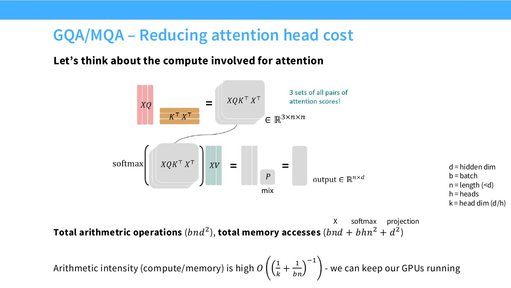
*图 24：prefill 同时处理整段 prompt，矩阵较大、并行度高（视频 01:15:16–01:16:59）。*

大矩阵乘法有较高数据复用，prefill 往往更接近 compute-bound。注意不要把所有“平方”混为一谈：$d_{\text{model}}^2$ 来自宽度方向投影，$n^2$ 才来自 token 两两交互。

用 roofline 模型把这件事说透。GPU 的峰值算力（FLOP/s）与峰值显存带宽（byte/s）之比称为 machine balance，A100 上约为 $312\ \text{TFLOP/s} \div 2\ \text{TB/s}\approx 156\ \text{FLOP/byte}$：任何操作的 arithmetic intensity 超过 156 才算 compute-bound，否则是 memory-bound。prefill 中一个 $n\times d$ 乘 $d\times d$ 的矩阵乘法，FLOP 约 $2nd^2$，数据移动约 $(nd+d^2+nd)\times 2$ 字节（FP16），强度约 $nd/(n+d)$；当 $n=4096,d=4096$ 时强度约 $2048\ \text{FLOP/byte}$，远超 156，稳稳的 compute-bound。decode 的对应计算几乎全是矩阵—向量乘：$n=1$ 时强度退化为 $d/(1+d)\approx 1\ \text{FLOP/byte}$，离 156 差两个数量级——decode 的每一纳秒几乎都在等显存。

生成阶段每次只新增一个 token。若把历史 token 的 K/V 保存下来，第 $t$ 步只需计算新 token 的 Q/K/V，再让新 Q 读取历史 K/V：

$$
q_t=x_tW_Q,
\qquad
k_t=x_tW_K,
\qquad
v_t=x_tW_V,
$$

- $x_t$：第 $t$ 个新 token 的隐藏状态；
- $W_Q,W_K,W_V$：query、key、value 投影矩阵；
- $q_t,k_t,v_t$：新 token 的 query、key、value。

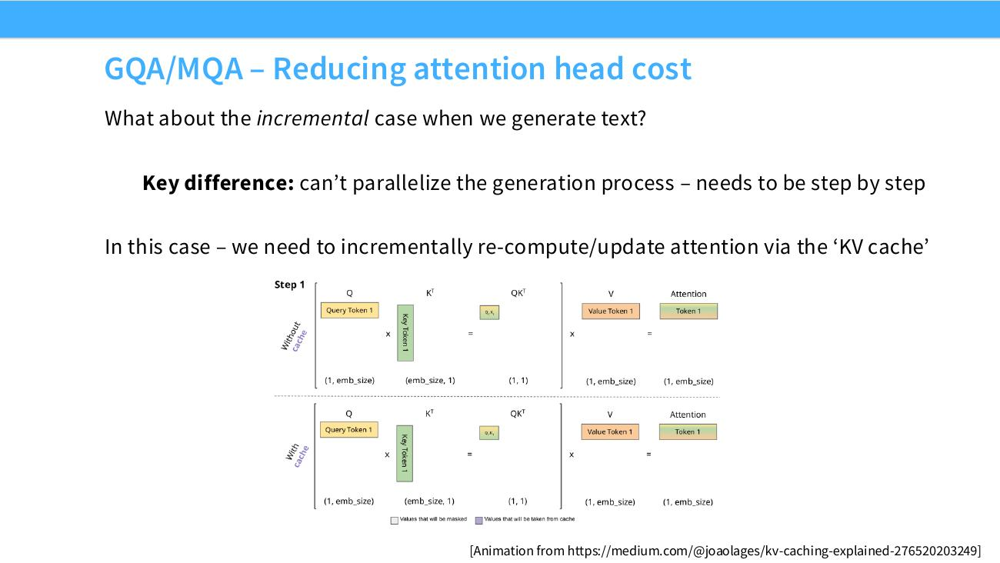

这一页转向增量（decode）情形：生成文本时无法并行，必须逐 token 进行，因此需要通过 KV cache 增量地复用历史计算。课件配了一个 KV cache 的动画示意（出处见课件标注的 Medium 链接）。提醒读者按上文 WARNING 的澄清理解动画：cache 保存的是 K 与 V，不是 Q，也不是 attention 矩阵。

#### 从 hidden state 到 KV cache：逐步看 shape

用带 batch 的标准布局表示，一层输入 hidden state 的 shape 是 `[B, n, d_model]`。投影和拆头并不是“再创造一份序列”，而是把最后的特征维组织成 head：

1. 输入：`X.shape = [B, n, d_model]`。
2. Q 投影：先得到 `[B, n, H_q × d_h]`，再重排为 `[B, H_q, n, d_h]`。
3. K/V 投影：各先得到 `[B, n, H_kv × d_h]`，再重排为 `[B, H_kv, n, d_h]`。
4. cache：每一层分别保存 `K_cache` 与 `V_cache`，shape 都是 `[B, H_kv, cached_seq, d_h]`。

这里 $d_{\text{model}}=H_qd_h$ 是常见设置；GQA/MQA 中 $H_{kv}<H_q$，所以 K/V 投影宽度和 cache 都会变小。一个具体例子是 `B=1, H_q=8, H_kv=2, d_h=64, d_model=512, n=3`：

| 张量 | shape | 含义 |
|---|---|---|
| hidden `X` | `[1, 3, 512]` | 三个 token 的 residual 表示 |
| `Q` | `[1, 8, 3, 64]` | 八个 query heads |
| `K`、`V` | 各 `[1, 2, 3, 64]` | 两个共享 KV heads |
| 每层 KV cache | 两份 `[1, 2, 3, 64]` | 一份 K、一份 V |

decode 新增第 4 个 token 时，当前 hidden shape 是 `[1, 1, 512]`。它产生 `Q_new: [1, 8, 1, 64]` 与 `K_new/V_new: [1, 2, 1, 64]`；只把新 K/V 沿 `cached_seq` 轴追加，cache 从 `[1, 2, 3, 64]` 变为 `[1, 2, 4, 64]`。`Q_new` 只用于当前步，不写入 cache。随后每个 query head 与它所属 KV group 的四个历史 keys 做点积，score shape 为 `[1, 8, 1, 4]`。

KV cache 逐步 append 的最小参考实现：

```python
import torch

B, H_kv, d_h = 1, 2, 64
k_cache = torch.zeros(B, H_kv, 0, d_h)  # 初始为空: [1, 2, 0, 64]
v_cache = torch.zeros(B, H_kv, 0, d_h)

def decode_step(k_new, v_new, k_cache, v_cache):
    # k_new/v_new: [B, H_kv, 1, d_h]，当前步新 token 的 K/V
    k_cache = torch.cat([k_cache, k_new], dim=2)  # 沿 cached_seq 轴追加
    v_cache = torch.cat([v_cache, v_new], dim=2)
    return k_cache, v_cache

# prefill 3 个 token，再 decode 2 步，观察 cached_seq 维增长:
# [1,2,0,64] → [1,2,3,64] → [1,2,4,64] → [1,2,5,64]
```

生产实现不会真的每步 `torch.cat`（每次拼接都要重新分配并拷贝整个 cache），而是预分配 `[B, H_kv, max_seq, d_h]` 的显存块、维护一个写入指针按位写入；vLLM 类的系统进一步把 cache 切成固定大小的 page 用页表索引，以支持变长序列的显存复用。教学代码里的 cat 只是为了把 shape 变化显示出来。

随后计算：

$$
o_t=\operatorname{softmax}\!\left(\frac{q_tK_{\le t}^{\top}}{\sqrt{d_h}}\right)V_{\le t}.
$$

- $o_t$：第 $t$ 步 attention 输出；
- $q_t$：当前 token 的 query；
- $K_{\le t},V_{\le t}$：截至当前步缓存的全部 key/value；
- $d_h$：单个 head 维度；
- $\operatorname{softmax}$：沿历史位置归一化。

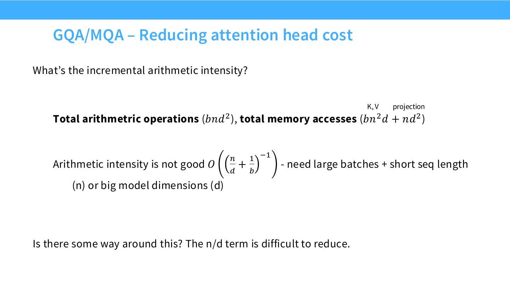
*图 25：decode 每步 query 很小，却要反复读取随上下文增长的 K/V cache（视频 01:16:59–01:19:36）。*

> [!WARNING]
> **KV cache 缓存的是 K 和 V，不是 Q，也不是 QK attention matrix。** Q 只服务当前生成步，attention score 每步根据当前 Q 与历史 K 重新计算。课堂动画/口述在这里容易造成误解，正文采用标准实现解释。

为什么不缓存 Q？因为第 $t$ 步的输出只依赖当前 query $q_t$：历史 query 对应的输出在过去各步已经算完并写回 residual stream 了，未来的 query 尚不存在。缓存 Q 不会省掉任何计算。为什么不缓存 attention matrix？因为它的大小是 $n\times n$（逐 head），比 K/V 的 $2n$ 大一个数量级，而且每步只需它的**最后一行**（当前 query 对所有 key 的权重），重新算这一行的代价是一次向量—矩阵乘，远小于存储整个矩阵的成本。

每个请求、每层的缓存元素量近似为：

$$
N_{\text{KV}}=2nH_{kv}d_h.
$$

- $N_{\text{KV}}$：K 与 V 的缓存元素总数；
- $2$：分别对应 K 和 V；
- $n$：已缓存上下文长度；
- $H_{kv}$：key/value head 数；
- $d_h$：每个 KV head 维度。

decode 的单步矩阵很瘦，难以充分复用读入的 K/V，常由显存带宽而非峰值 FLOPs 限制。因此缩小 $H_{kv}$ 直接改善并发数、带宽和延迟。

#### 数值例子：decode 单步的时间花在哪里

沿用 8.2 节的配置（$L=32$、$d_{\text{model}}=4096$、$H_q=32$、$d_h=128$、FP16），先算单请求、batch 为 1 时生成一个 token 要读多少字节。权重侧：全部参数约 $7\times10^9$ 个，FP16 下约 $14\ \text{GB}$，每步必须完整读一遍（batch 为 1 时无法摊薄）。cache 侧：上下文 $n=8192$ 时 MHA cache 为 $4.0\ \text{GiB}$（8.2 节已算）。合计每 token 读取约 $18\ \text{GB}$。A100 显存带宽约 $2\ \text{TB/s}$，理论下单 token 延迟下界约

$$
t_{\text{token}}\gtrsim\frac{18\ \text{GB}}{2\ \text{TB/s}}\approx 9\ \text{ms},
$$

即 batch 为 1 时每秒最多约 110 token——而且这已假设带宽利用率为 100%，实际内核通常只能达到峰值的六七成。同一时刻，这一步的计算量约为 $2\times 7\times10^9=1.4\times10^{10}$ FLOP，在 $312\ \text{TFLOP/s}$ 上只需 $0.045\ \text{ms}$：计算只占访存时间的两百分之一。这就是“decode 是 memory-bound”的全部含义，也是一切 decode 优化（GQA、量化 cache、投机解码、连续批处理）都围绕**减少或摊薄字节读取**展开的原因。

### 8.2 MHA、MQA 与 GQA

标准 multi-head attention（MHA）让每个 query head 都有独立 K/V head：

$$
H_{kv}=H_q.
$$

- $H_{kv}$：key/value head 数；
- $H_q$：query head 数。

multi-query attention（MQA）让所有 query head 共享一组 K/V：

$$
H_{kv}=1.
$$

- $H_{kv}$：共享的 KV head 数；
- $1$：所有 query head 共用一组 K 和 V。

grouped-query attention（GQA）位于二者之间，让若干 query head 共享一个 KV head：

$$
1<H_{kv}<H_q,
\qquad
g=\frac{H_q}{H_{kv}}.
$$

- $H_q$：query head 数；
- $H_{kv}$：KV head 数；
- $g$：每个 KV head 服务的 query head 数，通常要求整除。

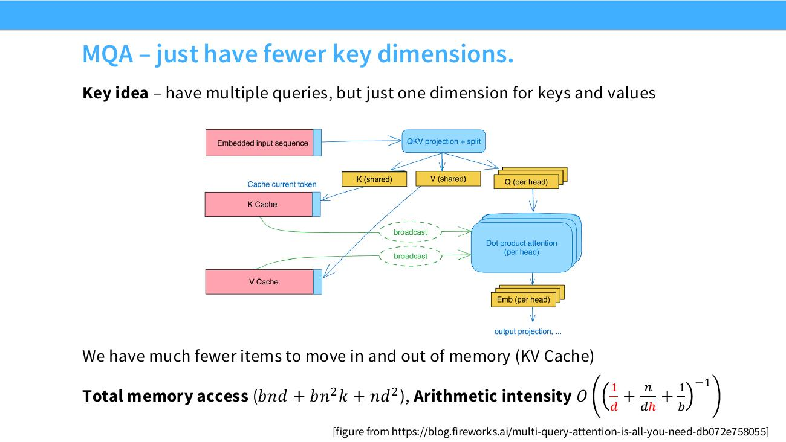

课件给出 MQA 的核心思想：保留多个 query，但 key 和 value 只保留一份——进出显存的数据（KV cache）因此大幅减少。这一页给出定量结果：总访存降为 $O(bnd+bn^2k+nd^2)$ 量级，算术强度变为 $O(1/d+n/(dh)+1/b)^{-1}$，困扰上一页的 $n/d$ 项被缩小为 $n/(dh)$。配图出自 Fireworks AI 的博客。再次提醒：“one dimension”指一个共享 KV head，$d_h$ 并未坍缩（见上方 WARNING）。

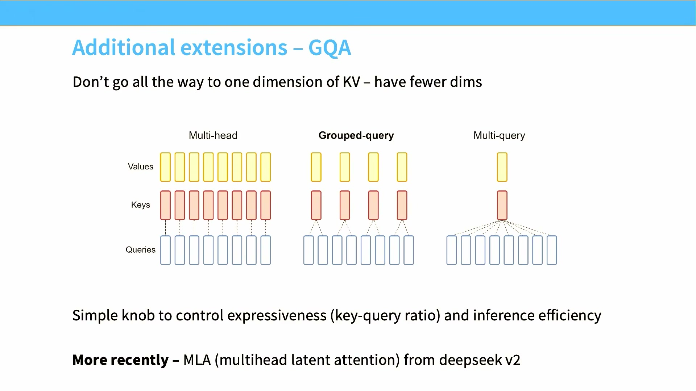
*图 26：从每个 Q head 独享 K/V，过渡到分组共享，再到全共享（视频 01:20:49–01:21:59）。*

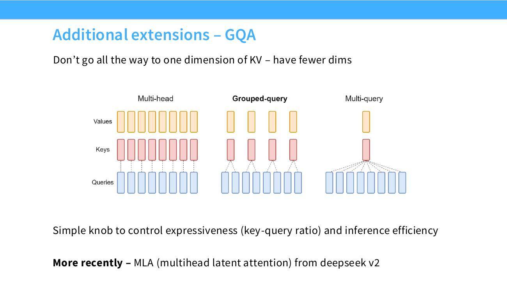

这一页把 MQA 的极端做法回调为连续旋钮：不必一路减到一份 KV，而是保留较少的若干份——key-query 比例成为同时控制表达力与推理效率的简单旋钮。课件还提到更近期的 MLA（multi-head latent attention，出自 DeepSeek-V2），把 KV 压缩思路推进到低秩潜空间，属于同一思想谱系的延伸。

> [!WARNING]
> MQA 的“one dimension”应理解为**一个共享 KV head**，不是把 key/value 压成单个标量维。$d_h$ 仍是完整 head 维度。

从 MHA 改成 MQA/GQA 并不是让 FLOPs 凭空消失，而是减少缓存读取，使每字节数据对应更多 query-head 计算，即提高 arithmetic intensity。讲者在现场先说反、随后自我纠正；正确方向是：共享 K/V 通常提高而非降低解码阶段的 arithmetic intensity。

#### 定量对比：参数量与 KV cache 的具体数字

取一个贴近现实的配置：$d_{\text{model}}=4096$，$H_q=32$，$d_h=128$，$L=32$ 层，FP16（$b=2$ 字节），上下文 $n=8192$。三种结构的投影参数量（仅注意力内部）与单请求 KV cache 如下。

参数量：MHA 中 $W_Q,W_K,W_V,W_O$ 各为 $d_{\text{model}}\times d_{\text{model}}$，合计 $4\times 4096^2\approx 6.71\times10^7$。GQA 取 $H_{kv}=8$ 时，$W_K,W_V$ 的宽度变为 $H_{kv}d_h=1024$，注意力参数为 $4096^2+2\times 4096\times 1024+4096^2\approx 4.19\times10^7$。MQA 的 $W_K,W_V$ 宽度仅 $128$，参数约 $3.38\times10^7$。

KV cache 用 $M_{\text{KV}}=2LnH_{kv}d_hb$ 逐式计算：

$$
\begin{aligned}
\text{MHA:}\quad &2\times32\times8192\times32\times128\times2\ \text{B}
=4.295\times10^{9}\ \text{B}\approx 4.00\ \text{GiB},\\
\text{GQA-8:}\quad &2\times32\times8192\times8\times128\times2\ \text{B}
=1.074\times10^{9}\ \text{B}\approx 1.00\ \text{GiB},\\
\text{MQA:}\quad &2\times32\times8192\times1\times128\times2\ \text{B}
=1.342\times10^{8}\ \text{B}\approx 128\ \text{MiB}.
\end{aligned}
$$

- $L=32$：层数；
- $n=8192$：上下文长度；
- $b=2$：FP16 字节数；
- 其余符号与上文相同。

两个直接推论。其一，cache 与 $H_{kv}$ 严格成正比，GQA-8 恰好是 MHA 的 $8/32=1/4$，MQA 是 $1/32$——架构选择直接翻译成显存数字。其二，把 cache 与模型权重对比：该模型注意力参数按 FP16 约 134 MiB/层，全模型（含 FFN）约 7 B 参数、14 GiB 权重；单个 8 K 请求的 MHA cache 已达 4 GiB，接近权重量的三成。在线服务要并发几十个请求时，cache 而非权重成为显存瓶颈，这就是 MQA/GQA 在服务侧的根本动机。

GQA 在计算时的标准展开方式是把每个 KV head 复制 $g$ 份以对齐 query heads：

```python
import torch

def repeat_kv(kv: torch.Tensor, g: int) -> torch.Tensor:
    """kv: [B, H_kv, n, d_h] -> [B, H_kv * g, n, d_h]，组内 query 共享同一份 KV。"""
    B, H_kv, n, d_h = kv.shape
    if g == 1:
        return kv
    kv = kv[:, :, None, :, :].expand(B, H_kv, g, n, d_h)  # 插入组维并广播
    return kv.reshape(B, H_kv * g, n, d_h)

# 用法：attn_scores = q @ repeat_kv(k_cache, g).transpose(-1, -2) / sqrt(d_h)
```

`expand` 不产生拷贝（stride 为 0 的视图），`reshape` 通常也共享存储；因此 GQA 的“复制”在显存上是免费的，真正读入 cache 的仍只有 $H_{kv}$ 份数据——这正对应上面的带宽结论。生产内核（FlashAttention 及各路 decode kernel）则直接在寻址时按 $h_q \mapsto h_q/g$ 映射到对应 KV head，连视图都不必建。

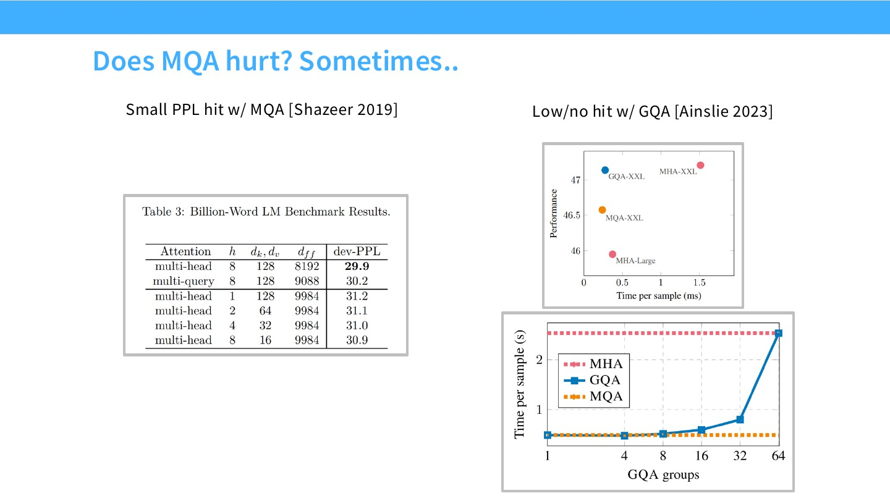
*图 27：GQA 常取得接近 MHA 的质量和接近 MQA 的服务收益，但差异并非恒为零（视频 01:21:59–01:23:14）。*

图中一个 MQA 结果从约 29.9 变化到 30.2，差距虽小却说明质量并非数学保证。选择 $H_{kv}$ 应结合目标 batch、上下文长度、显存容量和评测，而不能只看架构名称。

从表示角度理解质量为何通常只小损：同一 KV head 服务的 $g$ 个 query head 读取的是同一份内容库，但各自的 $W_Q$ 不同，读取的**权重分布**不同；共享压缩的是“可存储的独立内容槽数”，而不是“可执行的独立查询数”。只要内容槽没有少到放不下任务所需的模式，质量损失就有限。反之，若任务需要大量互相排斥的检索模式（如同时维护许多不同实体的细粒度信息），$H_{kv}$ 过小就会真正掉点——这也是“按评测而非按名称选择”的具体含义。

### 8.3 一个可操作的服务估算

若元素采用 $b$ 字节、模型有 $L$ 层，则单请求 KV cache 近似为：

$$
M_{\text{KV}}=2LnH_{kv}d_hb.
$$

- $M_{\text{KV}}$：单请求 KV cache 字节数；
- $L$：层数；
- $n$：上下文 token 数；
- $H_{kv}$：KV head 数；
- $d_h$：head 维度；
- $b$：每个缓存元素的字节数；
- $2$：K 与 V 两份缓存。

这个估算先忽略 allocator 分页、量化元数据和 padding，却足以做架构比较：在其他量不变时，GQA 相对 MHA 的 cache 比例约为 $H_{kv}/H_q$。

再把估算推到吞吐层面。设单卡显存可供 cache 使用 $C$ 字节，则可并发的最大请求数约为 $C/M_{\text{KV}}$——cache 缩小四倍，并发上限近似放大四倍。decode 阶段每生成一个 token 需要把**全部层、全部 cache** 从显存读一遍，读取量为 $M_{\text{KV}}$（严格说还要加上权重 $M_W$）；若带宽为 $\beta$，单 token 的理论下界延迟约为 $(M_W+M_{\text{KV}}\times B_{\text{batch}})/\beta$，其中并发 $B_{\text{batch}}$ 的 cache 读取无法互相复用（每个请求的 cache 是私有的），而权重读取可以。于是得到 decode 吞吐的核心不等式：**权重读一次，cache 读 $B_{\text{batch}}$ 次**。cache 越小，同样的带宽能养活越大的 batch，GPU 才越有机会从 memory-bound 的深坑里爬出来。这就是“缩小 $H_{kv}$ 直接改善并发数、带宽和延迟”的完整机制链。

用一组数字把不等式坐实。沿用 8.2 节的模型（权重约 14 GB），设一张 80 GB 显卡扣掉权重与运行时开销后剩 $C=40\ \text{GB}$ 给 cache，上下文均为 $n=8192$：MHA（$M_{\text{KV}}\approx4.0\ \text{GiB}$）最多并发约 10 个请求；GQA-8（$1.0\ \text{GiB}$）约 40 个；MQA（$128\ \text{MiB}$）约 320 个。再算每 token 的总读取量：MHA 在满并发时为 $14\ \text{GB}+10\times4\ \text{GB}=54\ \text{GB}$，理论单步约 $27\ \text{ms}$，整卡吞吐约 $10/0.027\approx370\ \text{token/s}$；GQA-8 满并发为 $14+40=54\ \text{GB}$，同样约 $27\ \text{ms}$，但吞吐是 $40/0.027\approx1480\ \text{token/s}$；MQA 为 $14+320\times0.125=54\ \text{GB}$，吞吐约 $320/0.027\approx11800\ \text{token/s}$。三种架构在**相同的显存预算与相同的单步延迟**下，整卡吞吐相差一个数量级以上——而唯一的改动只是 $H_{kv}$。这个算式也解释了为什么服务侧愿意为 GQA 付出一点点质量风险：它几乎不改变每步延迟，却直接放大并发与总吞吐。

> [!IMPORTANT]
> 训练吞吐好不代表在线 decode 好。评估服务架构时至少分开测 prompt prefill 延迟、单 token decode 延迟、可并发 batch 和长上下文显存占用。

### 本章小结

- prefill 具有大矩阵和高并行度，强度远超 machine balance；decode 每步很小，却持续读取历史 K/V，强度约 1 FLOP/byte，常受显存带宽限制。
- KV cache 只保存 K/V，使生成免于重算历史表示，但内存随层数和上下文线性增长；不缓存 Q 与 attention matrix 都有明确的计算论理由。
- MQA/GQA 通过减少 KV head 数降低 cache 与带宽，定量上 cache 与 $H_{kv}$ 严格成正比；GQA 在质量和效率间提供连续旋钮。
- decode 吞吐的核心结构是“权重读一次、cache 读 batch 次”，缩小 cache 直接放大可并发 batch。
- 质量接近不是理论保证，最终选择必须以目标服务负载实测。

## 9. 长上下文：稀疏、滑动窗口与局部—全局混合

### 9.1 全注意力为什么难扩展

长度为 $n$ 的 full causal attention 需要约 $n(n+1)/2$ 个可见连接，复杂度为 $O(n^2)$。当上下文扩到数十万 token，二次项会压过其他计算与内存成本。

代入具体数字：$n=131072$（128 K）时，可见连接数为 $n(n+1)/2\approx 8.59\times10^9$。即使不物化 attention 矩阵（FlashAttention 只保留 O(n) 的归一化状态），score 与聚合的计算量仍随这个数线性增长；而在 decode 侧，每生成一个 token 要读取的 cache 也随 $n$ 线性增长——二次计算与线性带宽两条成本曲线在长上下文下同时恶化，这就是“难扩展”的完整图景。

sparse attention 的目标是让每个 token 只连接一部分位置，例如局部邻域、固定步长或少量全局 token。

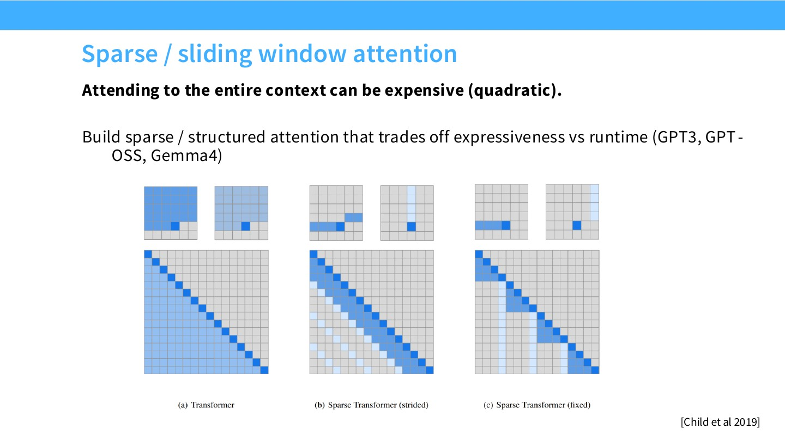
*图 28：局部、跨步与全局连接可组合成稀疏模式（视频 01:25:08–01:25:57）。*

最简单的 sliding-window attention（SWA）只看最近 $w$ 个 token，连接数从二次降为线性量级：

$$
\operatorname{cost}_{\text{SWA}}=O(nwd_hH_q).
$$

- $n$：序列长度；
- $w$：滑动窗口大小；
- $d_h$：单个 head 维度；
- $H_q$：query head 数；
- $O(nwd_hH_q)$：窗口注意力 score 与聚合的量级。

当 $w\ll n$ 时节省巨大，但任意两个远距离 token 无法在一层直接通信。堆叠多层会扩大感受野，却仍可能使精确长程检索更困难。

#### 推导：SWA 的感受野随层数如何扩展

“堆叠多层会扩大感受野”可以算得很具体。设窗口大小为 $w$（含自身），即每层每个位置能看到左边 $w-1$ 个位置。第 1 层之后，位置 $i$ 的表示包含区间 $[i-w+1,\ i]$ 的信息。第 2 层中，位置 $i$ 从位置 $i-w+1$ 读取信息，而后者在第 1 层时已经聚合了 $[i-2w+2,\ i-w+1]$ 的信息，故两层之后位置 $i$ 的有效区间为 $[i-2(w-1),\ i]$。归纳可得，$\ell$ 层之后

$$
\text{感受野半径}= \ell(w-1),
\qquad
\text{有效区间}=[i-\ell(w-1),\ i].
$$

- $\ell$：层数；
- $w-1$：每层向左扩展的距离；
- 该推导假设每层窗口严格对齐且不跨层跳跃。

以 $w=4096$、$L=32$ 层为例，最深层位置理论上能“感知”约 $32\times 4095\approx 13$ 万 token 之外的信息——看似覆盖了超长上下文。但这里有一个关键区分：**信息可达**不等于**信息可取**。远距离信息要经过 32 次加权平均的接力，每一步都是一次 convex combination，幅度被逐层稀释、细节被逐层平滑；要从中精确检索某个具体 token 的原文内容（needle retrieval 类任务），接力的保真度远不及一条直达的注意力边。这就是“堆叠扩大感受野，却仍可能使精确长程检索更困难”的定量来源：可达范围按 $\ell(w-1)$ 线性增长，而可达信号的强度大致随接力次数衰减。

用一个极简模型感受衰减速度。假设每层中，承载某段远距离信息的表示以注意力权重 $\bar a$ 被下一跳读取（$\bar a<1$，因为窗口内还有其他 $w-1$ 个位置分走权重），接力 $\ell$ 层后该信息的贡献幅度约为 $\bar a^{\ell}$。取一个相当乐观的 $\bar a=0.5$（窗口内一半权重给了“正确”的接力位置）：$\ell=8$ 层后只剩 $0.5^8\approx 0.4\%$；$\ell=32$ 层后约 $2\times10^{-10}$，早已被其他位置的信号淹没。真实模型当然能通过训练学到近似“直通转发”的注意力模式（把绝大部分权重集中到单一接力位置），但这要求每一跳都精确配合，任何一跳的权重分散都会按乘法侵蚀末端信号。相比之下，一层 full attention 对任意距离都是一次直达读取，不存在乘法衰减——这就是混合架构必须保留全局层的根本原因。

### 9.2 交错 full 与 local attention

当前常见折中是多数层用 SWA，隔若干层插入一次 full attention。局部层便宜地处理邻近模式，全局层周期性地重新连通整个序列。

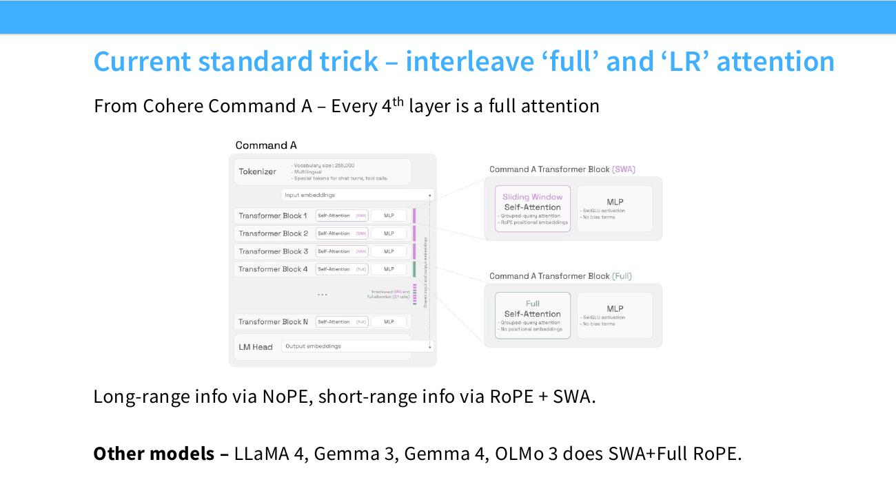

课件称交错结构为“当前标准技巧”：以 Cohere Command A 为例，每第 4 层是一次 full attention；长程信息靠 NoPE 传递，短程信息靠 RoPE + SWA 处理。其他采用者包括 LLaMA 4、Gemma 3、Gemma 4，OLMo 3 则采用 SWA + 全程 RoPE 的变体。下文对“局部 RoPE + 全局 NoPE”组合的自洽性给出了机制解释。

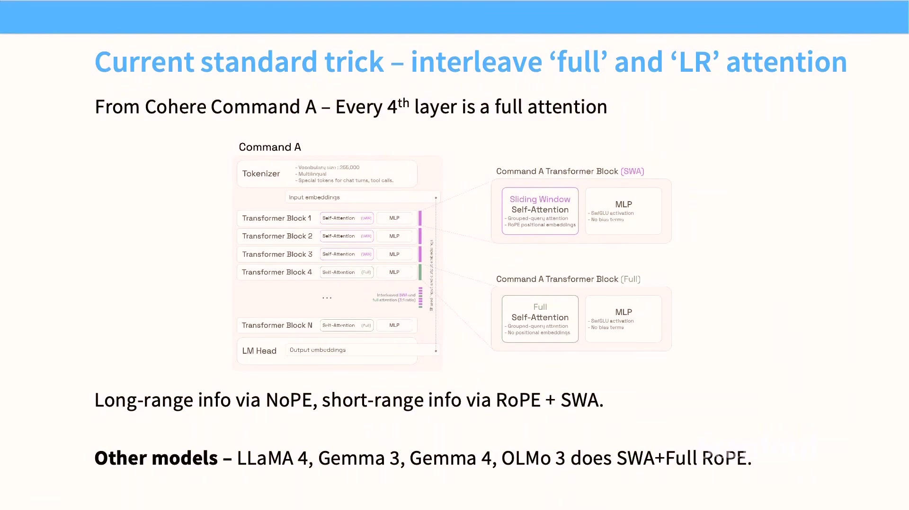
*图 29：示例每四层插入一层 full attention，其余使用 sliding-window attention（视频 01:25:57–01:27:13）。*

若每 $r$ 层中有一层 full attention，粗略量级为：

$$
\operatorname{cost}_{\text{hybrid}}
\approx O\!\left(\left(L-\frac{L}{r}\right)nwd_hH_q
+\frac{L}{r}n^2d_hH_q\right).
$$

- $L$：总层数；
- $n$：序列长度；
- $w$：局部窗口大小；
- $r$：full-attention 层的间隔；
- $d_h$：head 维度；
- $H_q$：query head 数；
- 第一项：约 $L-L/r$ 个局部注意力层的成本；
- 第二项：约 $L/r$ 个全注意力层的成本。

这个公式是理解量级的教学近似；FlashAttention、padding、序列打包和并行策略都会改变常数。

代入具体数字感受折中的力度。设 $L=32$，$r=8$（每 8 层 1 层 full，即 4 层 full、28 层 SWA），$n=131072$，$w=4096$，head 因子 $d_hH_q$ 作为公共项省略：局部项约 $28\times 1.31\times10^5\times 4096\approx 1.50\times10^{10}$，全局项约 $4\times (1.31\times10^5)^2\approx 6.87\times10^{10}$——即使只有八分之一的层是 full attention，二次项仍贡献了总注意力成本的约 82%。结论：混合架构的成本大头在 full 层，继续压低 $r$ 的边际收益递减，而增大 $w$ 对局部项是线性的。这解释了为什么近期模型倾向用**较小窗口 + 稀疏全局层**的组合，而不是大窗口。

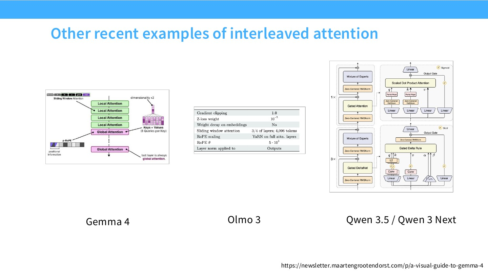
*图 30：公开模型采用不同的 full/local 比例、位置编码和窗口方案（视频 01:27:13–01:28:38）。*

课件以 Command A 等模型说明：局部层可配 RoPE 以表达短程相对位置，全局层有时使用 NoPE；其他公开模型则采用 full RoPE。这里最重要的不是背某个版本列表，而是理解三个独立旋钮：**哪些层全局、窗口多大、位置编码作用在哪些层。** 模型版本更新很快，表格应视作授课时点的快照。

全局层用 NoPE 的动机值得展开：RoPE 的慢速通道对在远超训练长度时相位行为失真（第 5 章），而全局层恰恰是唯一需要处理超长相对距离的层；去掉显式位置编码后，模型依靠 causal mask 的三角结构与内容本身推断顺序，外推反而更稳。局部层则不同——窗口内的相对距离都在 RoPE 的可靠频段内，保留 RoPE 能精确表达短程位置。于是“局部 RoPE + 全局 NoPE”成为一个结构上自洽的组合：每层都用最适合其作用尺度的位置机制。

> [!IMPORTANT]
> GQA 与 SWA 优化不同维度：GQA 减少每个历史位置保存/读取的 KV head，SWA 减少需要访问的历史位置数。二者可以叠加。

叠加后的 cache 公式也要相应修正：SWA 层的 cache 只需保留最近 $w$ 个位置，$M_{\text{KV}}^{\text{SWA}}=2wH_{kv}d_hb$，与 $n$ 无关；混合模型中仅 $L/r$ 个全局层的 cache 随上下文增长。完整写成一个式子：

$$
M_{\text{KV}}^{\text{hybrid}}
=2bH_{kv}d_h\left(\left(L-\frac{L}{r}\right)w+\frac{L}{r}n\right).
$$

- $M_{\text{KV}}^{\text{hybrid}}$：混合架构的单请求 KV cache 字节数；
- $b$：元素字节数；
- $H_{kv},d_h$：KV head 数与 head 维度；
- $L,r$：总层数与 full-attention 层间隔；
- $w,n$：局部窗口大小与上下文长度；
- 括号内第一项：局部层的固定窗口缓存；
- 第二项：全局层随上下文增长的缓存。

长上下文服务里，cache 公式从“每层都线性增长”变为“只有全局层线性增长”，这与上段成本分析的结论互为镜像：**混合架构中，全局层同时是计算与显存的双重瓶颈，而局部层几乎免费。** 设计旋钮（$r$、$w$、$H_{kv}$）因此都应该围绕“全局层尽量少而够用”来调。

### 9.3 如何验证长上下文架构

只测短序列 perplexity 会漏掉核心风险。合理验证至少包含：

- 不同长度下的 prefill/decode 延迟与峰值显存；
- 长程检索、跨段推理与局部语言建模分别评测；
- full 层间隔和窗口大小的消融；
- 训练长度内与长度外的 RoPE/位置外推稳定性；
- 相同服务吞吐或相同计算预算下的质量比较。

为什么“长程检索、跨段推理与局部语言建模”必须分开测？三者依赖的能力恰好对应本章的三个机制：局部语言建模只考验窗口内的 next-token 预测，SWA 层即可胜任，分数再高也说明不了全局能力；长程检索（needle 类）考验的是把一段远处原文**无损搬运**到当前位置的能力，依赖全局层与 RoPE 外推的保真度；跨段推理则要求多处远处信息**同时在场并交互**，是对信息可达性与表示容量的联合考验。一个架构完全可能在前一项满分、后两项失效——这正是单一 perplexity 数字掩盖的风险结构。

系统侧的验证同样有清单可循，按负载拆成四项：

- **prefill 延迟**：随 $n$ 的 scaling 曲线是否符合 $O(n^2)$ 与窗口设计的预期，长 prompt 下是否出现显存峰值；
- **单 token decode 延迟**：随已缓存上下文长度的增长斜率，直接反映 cache 读取成本；
- **可并发 batch**：给定显存预算下 cache 公式预测值与实测的偏差（检验 allocator 与分页开销）；
- **长上下文峰值显存**：权重、cache、激活三者的占比分解，确认瓶颈在哪一项再谈优化方向。

架构侧与系统侧的清单合起来，才构成一次完整的长上下文验证。

### 本章小结

- full attention 的序列二次项限制超长上下文扩展。
- SWA 将连接规模降到 $O(nw)$，感受野按 $\ell(w-1)$ 随层数线性扩展，但代价是远距离信息要多次接力，精确检索变难。
- 局部—全局交错用少量 full 层恢复全局信息流；混合架构的计算与 cache 双重瓶颈都集中在全局层。
- “局部 RoPE + 全局 NoPE”是让每层的位置机制匹配其作用尺度的自洽设计。
- GQA、SWA 和位置编码分别控制 KV 通道数、可见位置数与位置几何，可以联合设计。

## 总结与延伸

### 一张决策地图

本讲的组件不是一袋互不相关的 tricks。它们分别作用在 Transformer 的不同瓶颈上：

| 目标 | 主要组件 | 解决的问题 | 需要警惕的代价 |
|---|---|---|---|
| 深层优化 | pre-norm、RMSNorm、干净残差路径 | 梯度传播与训练稳定 | 最终质量并非总是占优 |
| FFN 表达 | SwiGLU/GeGLU、宽度比例 | 条件通道选择 | 三矩阵增加参数，需按预算缩宽 |
| 位置信息 | RoPE | attention score 的相对位置几何 | 长度外推依赖频率和训练范围 |
| 数值稳定 | z-loss、QK norm、soft-cap | 控制两处 softmax 的 logit 尺度 | 额外约束可能损失表达或 perplexity |
| 解码效率 | KV cache、MQA/GQA | 降低重复计算、缓存与带宽 | 过度共享 KV 可能损质量 |
| 长上下文 | SWA、full/local hybrid | 缓解 $n^2$ 注意力成本 | 远程信息路径变长、需专门评测 |

回看全讲，这张表可以进一步压缩成四个分析层面：residual path（第 2、4 章）回答“梯度怎么流”；logit 尺度（第 7 章）回答“数值怎么不失控”；数据移动（第 2、8 章的 arithmetic intensity 线索）回答“时间花在哪”；信息可达性（第 5、9 章）回答“哪些 token 能影响哪些 token”。任何一项新架构改动，先在这四个层面上各问一遍，它的收益与代价基本就无所遁形。

### 五个可以迁移到新模型的判断问题

1. **改动优化的是哪一个目标？** 是训练 loss、稳定性、训练吞吐，还是在线 decode？
2. **比较是否预算公平？** 参数、token、FLOPs、wall-clock 与服务吞吐不能混作一个尺度。
3. **收益来自数学结构还是硬件实现？** FLOP 更少不保证更快，低 arithmetic-intensity 操作可能由带宽主导。
4. **证据覆盖了目标工作负载吗？** 短序列预训练结果不能证明长上下文服务最优。
5. **所谓默认值有多宽的容忍区？** 若性能盆地平坦，应优先选择更利于整除、并行和内核融合的点。

### 建议的延伸练习

- 在同一小模型上实现 post-norm 与 pre-norm，记录不同 warmup 下的梯度范数和 loss spike。
- 以相同参数量比较 GELU FFN 与 SwiGLU，而不是直接使用相同中间宽度。
- 手写二维 RoPE，数值验证旋转后内积只依赖 $i-j$；再扩展到多频率通道对。
- 用 $M_{\text{KV}}=2LnH_{kv}d_hb$ 估算 MHA、GQA、MQA 的单请求缓存，并与真实服务 profiler 对照。
- 在 needle retrieval 与语言建模上分别扫描 SWA 窗口和 full-layer 间隔，观察效率—长程能力前沿。

补充两个衔接本讲推导的练习：其一，数值验证第 7 章的方差配平——随机生成单位方差的 $q,k\in\mathbb{R}^{128}$，统计 $q^\top k$ 与 $q^\top k/\sqrt{128}$ 的经验方差，再逐步放大 $\|k\|$ 观察 softmax 饱和过程，直观感受 QK norm 切断的那条正反馈；其二，用 8.3 节的带宽模型给一块真实 GPU 算 decode 的理论 token/s 上界，再与 vLLM 等框架的实测对照，分析差距来自权重读取、cache 读取还是内核开销。

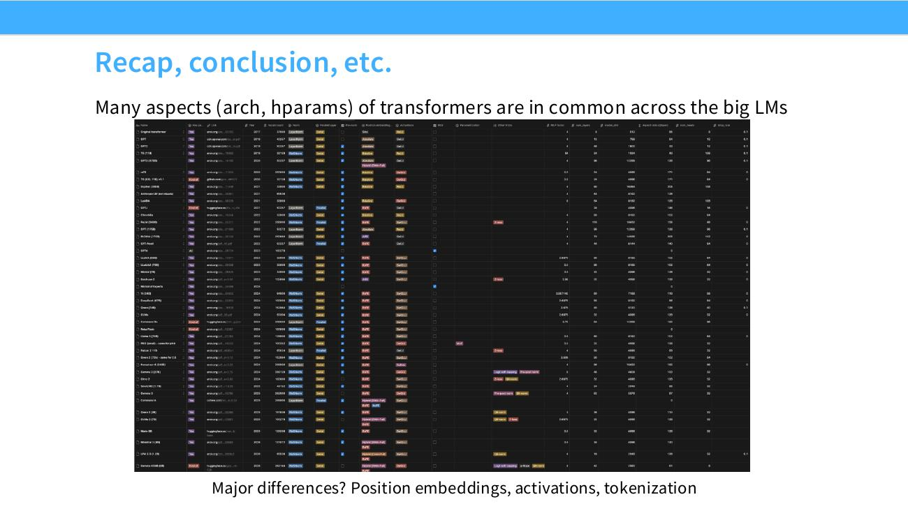

课件的收尾页给出全讲结论：主流大模型在架构与超参数的许多方面高度一致，真正的主要差异集中在位置嵌入、激活函数与 tokenization 三处。这与此处“决策地图”表的精神一致——共性来自质量、稳定性与硬件效率三条轴的共同约束，而差异点正是约束尚未收敛或仍在移动的前沿。

### 最终结论

现代 Transformer 的主干之所以看似稳定，是因为许多选择已经在质量、稳定性和硬件效率之间找到宽阔可行区；它之所以仍在快速变化，是因为训练规模、上下文长度和在线服务约束不断移动。真正可迁移的知识不是“某模型用了什么”，而是能从 residual path、logit 尺度、数据移动和信息可达性四个层面解释：**一项设计为什么可能有效、在哪种负载下有效、又可能在哪里失败。**

### 本章小结

- 把架构组件映射到具体瓶颈，才能避免无目的堆叠技巧。
- 默认配方适合作为实验起点，不可替代预算公平的消融和目标负载测试。
- 模型、优化器和硬件共同决定最终系统；架构研究本质上也是系统研究。


