# CS336 2026 Lecture 4：Attention Alternatives 与稀疏专家模型


- **原视频标题**：Stanford CS336 Language Modeling from Scratch | Spring 2026 | Lecture 4: Attention Alternatives
- **讲者**：Tatsu Hashimoto
- **频道**：Stanford Online
- **视频链接**：<https://www.youtube.com/watch?v=cKSwj_qZ8Jg>
- **时长**：01:26:20
- **资料范围**：人工英文字幕、完整 1080p 视频、60 页官方课件

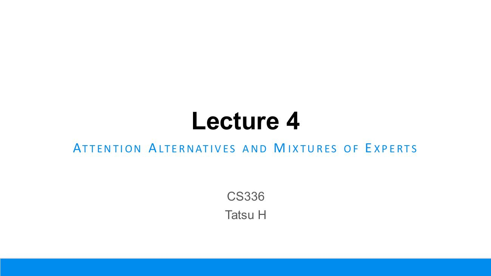

本页为课程封面：Lecture 4 把两个看似独立的话题——attention 的替代方案与混合专家模型——并列在同一讲标题之下。这个并置本身就是全讲的纲领：两者都是对"计算与参数的无条件使用"提出的条件化改造，前者条件化"读哪些历史"，后者条件化"用哪些参数"。

这节课研究一个贯穿现代大模型设计的问题：**模型怎样在容量继续增长时，不让每个 token 的计算与内存访问同步爆炸？** 前半场从 attention 的二次成本出发，依次讨论线性 attention、循环状态模型、Mamba-2、Gated Delta Net（GDN）、混合架构和 DeepSeek Sparse Attention（DSA）；后半场转向 Mixture of Experts（MoE），解释路由、负载均衡、并行通信、数值稳定性、微调、upcycling，以及 DeepSeek V1 到 V3 的演化。

两条主线表面上不同，实质上都属于 **conditional computation**：attention alternatives 决定“从哪些历史状态读取”，MoE 决定“激活哪些参数”。我们在阅读全讲时可以始终带着这个统一视角：每一种新机制都是在回答“当前 token 真正需要哪些信息、哪些参数”，然后为这个回答付出选择器、状态或通信的代价。

本讲义在课件与视频的基础上做了大幅扩写：所有被省略的代数步骤都被补全，每个核心公式后附逐项符号说明，关键机制配有可运行的 PyTorch 玩具实现与数值验算，并对课件中的口误、歧义与经验结论的适用范围做了更明确的标注。

## 1. 为什么需要 Attention Alternatives

### 1.1 阅读前需要的四个概念

在进入推导之前，我们先把本讲反复使用的四个概念固定下来。它们看似基础，但后面许多论证（尤其是复杂度与显存的定量估算）都依赖对这些概念的精确理解。

- **Attention**：query 与一组 keys 计算相似度，再用所得权重聚合 values；因果语言模型只能读取当前位置及其之前的 tokens。从信息流动的角度看，attention 是 Transformer 中唯一让不同位置互相交换信息的操作，FFN 与归一化都是逐位置独立的。
- **FFN**：Transformer block 中对每个 token 独立应用的前馈网络，通常占据大量参数和计算。在标准配置下（隐层维度约为模型维度的四倍），FFN 大约占整个模型三分之二的参数量，这正是后半场 MoE 把手术刀对准 FFN 的原因。
- **KV cache**：自回归推理时缓存历史 tokens 的 keys/values，避免每一步重新计算；上下文越长，缓存越大。KV cache 把推理的计算瓶颈转化为内存容量与带宽瓶颈：每生成一个 token，都要把整段历史对应的 KV 从显存中读入计算单元。
- **FLOPs 与带宽**：FLOPs 衡量算术工作量，带宽衡量数据搬运速度。理论乘法次数更少，不代表在真实 GPU 上必然更快。一个算子是否划算，取决于它是 compute-bound（受算术吞吐限制）还是 memory-bound（受数据搬运限制），而 attention 在长序列下往往两者兼受。

### 1.2 Softmax attention 到底算了什么

先固定一个 query 位置 `t`。它与每个 key 位置 `s` 做缩放内积，加入 causal mask，再沿 **key 位置这一维** 做 softmax；最后用所得概率加权 values：

$$
\begin{aligned}
z_{t,s}&=\frac{q_t^\top k_s}{\sqrt{d_k}}+m_{t,s},\\
m_{t,s}&=\begin{cases}0,&s\le t,\\-\infty,&s>t,\end{cases}\\
a_{t,s}&=\frac{\exp(z_{t,s})}{\sum_{r=1}^{n}\exp(z_{t,r})},\qquad
y_t=\sum_{s=1}^{n}a_{t,s}v_s.
\end{aligned}
$$

- `t`：当前 query 的位置。
- `s,r`：被读取的 key/value 位置索引。
- `n`：序列长度。
- `q_t`：位置 `t` 的 query 向量。
- `k_s`：位置 `s` 的 key 向量。
- `v_s`：位置 `s` 的 value 向量。
- `d_k`：query/key 维度；平方根缩放用于控制 logit 尺度。
- `m_{t,s}`：causal mask；未来位置取负无穷。
- `z_{t,s}`：加入缩放与 mask 后的 attention logit。
- `a_{t,s}`：位置 `t` 分给位置 `s` 的 attention 权重。
- `y_t`：位置 `t` 聚合后的 attention 输出。
- `exp`：指数函数。
- `T`：向量转置。

为什么要除以 $\sqrt{d_k}$？若 $q$ 与 $k$ 的各分量近似独立、均值为零、方差为一，则内积 $q^\top k=\sum_{i=1}^{d_k}q_ik_i$ 的方差约为 $d_k$，即 logits 的量级随 $\sqrt{d_k}$ 增长。量纲过大的 logits 会把 softmax 推入饱和区：最大项对应的梯度趋于零，训练信号消失。除以 $\sqrt{d_k}$ 把 logits 的标准差拉回 $O(1)$ 量级，使 softmax 工作在梯度敏感区间。这个缩放不改变任何渐近复杂度，但对优化稳定性至关重要。

做一个可手算的例子。假设序列有 3 个位置，当前 query 位于 `t=2`；即使未来位置 3 的原始 logit 高达 99，causal mask 也会把它完全排除：

$$
\begin{aligned}
z_{2,:}&=[1,2,99]+[0,0,-\infty]=[1,2,-\infty],\\
a_{2,:}&=\operatorname{softmax}(z_{2,:})\approx[0.269,0.731,0],\\
[v_1,v_2,v_3]&=[10,0,-10]\quad\Longrightarrow\quad y_2\approx0.269\times10+0.731\times0+0\times(-10)=2.69.
\end{aligned}
$$

- `z_{2,:}`：query 2 对全部三个 key 位置的 masked logits。
- `a_{2,:}`：沿 key 位置维归一化后的权重，三项之和为 1。
- `v_1,v_2,v_3`：为便于手算而设为标量的三个 values。
- `y_2`：query 2 的加权输出。
- `softmax`：对同一个 query 的全部允许 key logits 做指数归一化。
- `∞`：无穷大；`exp(-∞)=0`。
- `≈`：数值近似。

验算一下 softmax 数值：$\exp(1)\approx2.718$，$\exp(2)\approx7.389$，$\exp(-\infty)=0$，归一化常数为 $2.718+7.389=10.107$，于是 $a_{2,1}=2.718/10.107\approx0.269$，$a_{2,2}=7.389/10.107\approx0.731$，权重之和恰为 1。输出 $y_2=0.269\times10+0.731\times0=2.69$，与上式一致。

在实际多头实现中，attention logits 常写成 `[B,H,T_q,T_k]`；softmax 沿最后的 `T_k` 维执行。它不会跨 batch、head 或不同 query 相互归一化。训练时 causal mask 阻止看到未来 token；自回归推理时，KV cache 中本来就只有已经生成的历史位置，因此 mask 在推理时通常是隐含的而非显式构造的。

> [!IMPORTANT]
> softmax 同时做两件事：把 logits 变成非负且和为 1 的读取权重，并让每个 query 的权重依赖同一行全部 keys。后一个全局耦合正是简单结合律不能直接穿过 softmax 的原因——归一化分母把所有 key 位置纠缠在一起，先算哪一对乘法都会丢失这个分母。

#### 计算量的逐项推导：$O(n^2d)$ 从哪里来

我们把 softmax attention 的核心计算拆成两步矩阵乘法，逐统计数乘加（multiply-accumulate，MAC）次数。设 $Q,K\in\mathbb R^{n\times d_k}$，$V\in\mathbb R^{n\times d_v}$。

第一步，计算 logits 矩阵 $QK^\top$：结果有 $n\times n$ 个元素，每个元素是一个长度为 $d_k$ 的内积，需要 $d_k$ 次乘加，因此共需

$$
n^2\,d_k\ \text{次乘加}.
$$

第二步，计算加权聚合 $AV$，其中 $A=\operatorname{softmax}(QK^\top/\sqrt{d_k})\in\mathbb R^{n\times n}$：结果有 $n\times d_v$ 个元素，每个元素是长度为 $n$ 的内积，共需

$$
n^2\,d_v\ \text{次乘加}.
$$

中间的 softmax 本身需要 $n^2$ 次指数与归一化，量级为 $O(n^2)$，被两项矩阵乘法主导。于是 attention 核心部分的总成本为

$$
n^2(d_k+d_v)\ \text{次乘加}\;=\;O(n^2d),
$$

其中 $d$ 代表 head 维度量级。此外别忘了 $Q,K,V$ 的线性投影：每个投影是 $n\times d_{\text{model}}$ 乘 $d_{\text{model}}\times d_{\text{model}}$ 级别，合计 $O(nd_{\text{model}}^2)$，对序列长度只是线性的。**当 $n$ 增大到数万乃至数百万时，$O(n^2d)$ 项不可避免地超过投影项成为主导**，这就是二次成本的精确来源。

代入具体数字感受一下。取单 head、$d_k=d_v=128$、$n=8192$：仅 $QK^\top$ 一步就需要 $8192^2\times128\approx8.59\times10^9$ 次乘加（约 17.2 GFLOP，按一次乘加等于两次浮点运算计）；一个有 32 个 attention heads 的层，仅两步核心矩阵乘法就超过 1 TFLOP。若把 $n$ 翻倍到 16384，这部分成本变为四倍，而投影成本只变为两倍——两条增长曲线的斜率差异，正是长上下文焦虑的算术本质。

#### 显存的逐项推导：attention 矩阵与 KV cache

朴素实现要把 $A\in\mathbb R^{n\times n}$ 物化到显存。仍取 $n=8192$、32 heads、FP16（每元素 2 字节），单个层的 attention 矩阵占

$$
8192^2\times2\ \text{字节}\times32\approx4.3\ \text{GB},
$$

这还只是一层、一个 batch 元素。FlashAttention 的核心贡献就是用分块重计算避免物化这个矩阵，把显存占用降回 $O(nd)$，但它不改变乘加次数本身。

推理侧的瓶颈则是 KV cache。每生成一个 token，需要为每层保存它的 key 与 value。设模型有 $L$ 层、每层 $H_{kv}$ 个 KV heads、head 维度 $d_h$、精度 2 字节，则**每个 token 每层**的缓存字节数为

$$
2\times H_{kv}\times d_h\times2\ \text{字节}.
$$

以 Llama-3-8B 风格的 GQA 配置估算（$L=32$，$H_{kv}=8$，$d_h=128$）：每 token 全模型缓存为 $32\times2\times8\times128\times2=131072$ 字节 $\approx128$ KB。一百万 tokens 的上下文就需要约 128 GB 显存，超过单张旗舰 GPU 的容量。这个数字解释了为什么第 10 节的 MLA（把每 token 每层缓存压到约 1 KB 量级）在工程上如此重要，也解释了为什么 KV cache 压缩与 attention 计算压缩是本讲一体两面的主题。

### 1.3 长上下文首先是系统问题

标准自注意力让每个 query 与所有历史 key 比较。序列长度从 `n` 增长到 `2n` 时，注意力矩阵面积约增至四倍；KV cache、显存带宽和 kernel 调度也随之变成瓶颈。长上下文并不只是“把 position embedding 拉长”，而是要重新安排：

- 哪些历史 token 值得被读取；
- 是否必须保留所有历史 token 的显式表示；
- 训练时的并行性与推理时的逐 token 延迟如何兼顾；
- 理论 FLOPs 的改善能否转化成真实硬件收益。

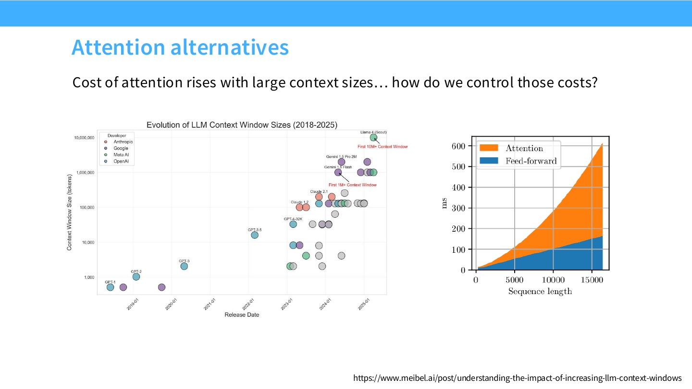

*图：上下文窗口与 attention/FFN 成本的增长趋势。官方课件第 2 页；视频对应讲解区间：`00:01:35--00:02:49`。*

讲者先给出两个直观基线。**局部 attention** 只看固定窗口，成本可控但可能漏掉远距离依赖；**少量全局层 + 大量局部层** 能恢复部分长程信息，却仍需要为“哪些层做全局”付出架构和系统复杂度。**FlashAttention** 则通过避免显式物化巨大 attention matrix、重排计算并减少显存搬运，能获得显著的常数项收益，却没有消除 `n²`。当目标走向数百万 tokens 时，课程因此继续追问：能否改变 attention 本身的计算形态？

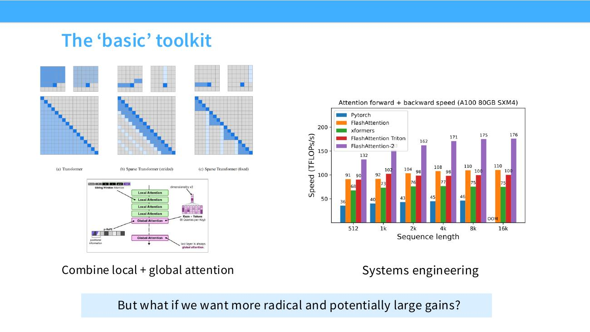

本页（课件第 3 页）汇总了不改变 attention 本质时的"基础工具箱"。左上是 Sparse Transformer 的 strided 与 fixed 稀疏注意力模式：把 $n\times n$ 的完整注意力矩阵裁成带状加若干全局列，每个 query 只读 $O(w)$ 或 $O(\sqrt n)$ 个 keys；左下是 Longformer 式的堆叠方案——多数层做 sliding window 局部注意力，只在少数层做全局注意力，且最后一层总是全局层。右侧柱状图是各实现（PyTorch 朴素版、FlashAttention、xformers、FlashAttention Triton、FlashAttention-2）在 A100 上的前反向吞吐：FlashAttention-2 随序列变长优势扩大，16k 时朴素 PyTorch 实现已经 OOM，而 FA-2 仍维持约 176 TFLOPs/s。页面底部的设问"But what if we want more radical and potentially large gains?"正是本讲的出发点：常数项与窗口优化之外，能否改写计算形态本身。

值得强调的是，这三条基线分别对应三种不同性质的优化：局部 attention 改变**渐近复杂度**（每个 query 只读 $O(w)$ 个 keys，$w$ 为窗口宽），混合层改变**常数因子**（只有少数层付二次成本），FlashAttention 则只优化**硬件执行效率**（同样多的乘加，但显存搬运量大幅下降）。一个完整的长上下文方案通常需要三者协同，而不是互相替代。

> [!IMPORTANT]
> “支持更长 context window”与“渐近复杂度更优”是两件事。前者是产品或模型能力，后者是算法成本；必须结合实际 kernel、精度、通信与质量一起判断。一个模型可以通过堆叠显存和工程优化支持 1M context，同时每一步仍在支付二次注意力的账单。

### 1.4 三种节省计算的基本策略

本讲出现的方案可以先按信息保存方式分类：

1. **压缩历史**：把过去累积进固定大小状态，如 linear attention、SSM、Mamba、GDN；
2. **稀疏读取历史**：仍保留显式 token memory，但先用轻量 indexer 选出少量位置，如 DSA；
3. **稀疏激活参数**：每个 token 只经过少数专家，如 MoE。

这三类方法都不是无条件胜出。固定状态可能丢失细节；稀疏检索仍需索引成本；MoE 又把计算问题转化成离散路由、通信和负载问题。我们可以把它们放在同一张对照表中，明确每类方法“省下了什么”与“付出了什么”：

| 策略 | 省下的成本 | 新增的成本 | 信息损失风险 |
|---|---|---|---|
| 压缩历史（线性 attention / SSM / GDN） | $n^2$ 成对交互与 KV cache | 状态更新与读取的结构设计 | 固定容量状态可能挤出远期细节 |
| 稀疏读取（DSA） | 大部分精细 attention 计算 | indexer 打分与 top-k 选择 | 选错位置即永久漏读 |
| 稀疏激活（MoE） | 每 token 的 FFN FLOPs | 路由、all-to-all 通信、负载均衡 | 路由不当导致专家利用不足 |

注意前两类作用于**序列轴**，第三类作用于**参数轴**，因此它们原则上可以叠加——DeepSeek V3 正是同时使用 MLA（压缩 KV cache）、稀疏激活（MoE）与多 token 预测的范例。

### 本章小结

- 标准 attention 的主要压力来自随序列长度增长的成对交互和 KV cache：核心矩阵乘法的成本精确为 $n^2(d_k+d_v)$ 次乘加，KV cache 则随上下文长度线性增长且无法分摊。
- FlashAttention 与局部/全局混合仍然很重要；渐近复杂度和常数项优化必须同时看。
- Attention alternatives 的目标不是单纯减少一个 Big-O，而是在质量、并行性、带宽、内存和延迟之间重新分配成本。
- 后续所有方法都可理解为“只让当前 token 读取必要的信息或激活必要的参数”。

## 2. Linear Attention：结合律与循环状态的双重视角

### 2.1 先移除无法交换的非线性

标准 attention 先形成 `QK^T`，再对权重施加 `ρ`（通常是 softmax），最后与 `V` 相乘。若 `ρ` 是恒等映射，矩阵乘法结合律允许先算 `K^T V`，避免显式构造 `n×n` 矩阵：

$$
\begin{aligned}
Q&\in\mathbb{R}^{n\times d_k},\quad K\in\mathbb{R}^{n\times d_k},\quad V\in\mathbb{R}^{n\times d_v},\\
\operatorname{Attn}(Q,K,V)&=\rho(QK^\top)V,\\
\rho=\operatorname{Id}\quad\Longrightarrow\quad (QK^\top)V&=Q(K^\top V).
\end{aligned}
$$

- `n`：序列长度。
- `d_k`：query/key 维度。
- `d_v`：value 维度。
- `Q`：所有位置的 query 矩阵。
- `K`：所有位置的 key 矩阵。
- `V`：所有位置的 value 矩阵。
- `ρ`：施加在 attention logits 或 weights 上的变换。
- `Id`：恒等映射。
- `T`：矩阵转置。
- `Attn`：attention 运算。

我们把两种结合顺序的乘加次数逐项算出。左结合（标准顺序）：先算 $QK^\top$，这是 $n^2d_k$ 次乘加；再用结果左乘 $V$，这是 $n^2d_v$ 次乘加，合计

$$
n^2d_k+n^2d_v\ \text{次乘加}.
$$

右结合（线性顺序）：先算 $K^\top V$。$K^\top$ 是 $d_k\times n$，$V$ 是 $n\times d_v$，结果 $d_k\times d_v$ 的每个元素是长度为 $n$ 的内积，共 $nd_kd_v$ 次乘加；再算 $Q(K^\top V)$，$n\times d_k$ 乘 $d_k\times d_v$，同样是 $nd_kd_v$ 次乘加，合计

$$
2nd_kd_v\ \text{次乘加}.
$$

两者之比约为 $n^2d/(2nd^2)=n/(2d)$：当 $n=65536$、$d=128$ 时，右结合理论上节省约 256 倍乘加。**序列长度方向从二次变为线性**，而代价是 $d\times d$ 维的中间矩阵——只要 head 维度远小于序列长度，这笔交换就极其划算。

代入一组完整数字验算。取 $n=32768$、$d_k=d_v=128$：左结合的乘加数为

$$
n^2d_k+n^2d_v=32768^2\times128+32768^2\times128=2\times1.37\times10^{11}\approx2.75\times10^{11},
$$

右结合的乘加数为

$$
2nd_kd_v=2\times32768\times128\times128\approx1.07\times10^{9},
$$

比值约为 $256$，与公式 $n/(2d)=32768/256=128$ 量级吻合（精确比值为 $n(d_k+d_v)/(2d_kd_v)=n/d$ 当 $d_k=d_v$ 时，即 256）。同时注意右结合的中间矩阵 $K^\top V$ 只有 $128\times128$ 大小，不到 16K 个元素，显存代价可以忽略。**节省的倍数随 $n$ 线性增长**——序列越长，结合律改写越划算，这与 FlashAttention 的常数项优化（倍数固定）形成本质对照。

还要补一句因果性带来的细节：上面的右结合计数对非因果（双向）序列精确成立；对因果序列，位置 $t$ 只应读取 $s\le t$ 的历史，朴素地对整段序列先算 $K^\top V$ 会把未来信息泄漏给过去位置。正确做法是按时间分块（chunkwise）：块内用矩阵并行、块间用状态递推，复杂度仍是 $O(nd^2)$ 量级，只是常数略增。Mamba-2 的 SSD 算法正是这一思想的系统化。

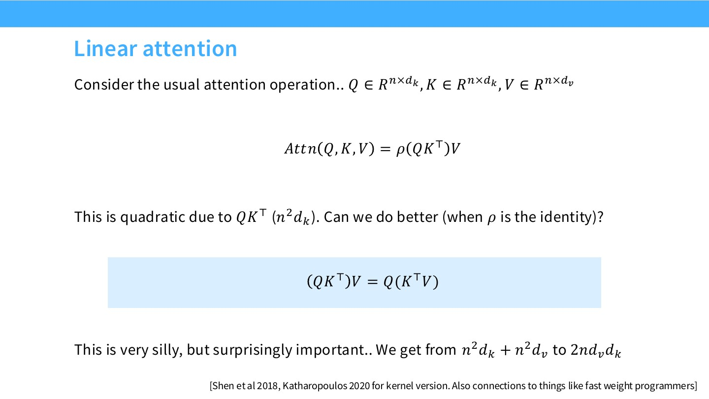

*图：从 `(QK^T)V` 改写为 `Q(K^T V)` 及两种成本。官方课件第 4 页；视频对应讲解区间：`00:05:47--00:08:04`。*

> [!WARNING]
> 这里最关键的隐藏条件是 `ρ` 必须允许这种分解。softmax 不能直接“穿过”结合律：分母 $\sum_r\exp(z_{t,r})$ 把同一行的所有 key 位置耦合在一起，任何先压缩历史的做法都无法事后还原这个分母。因此从 softmax attention 改成纯线性 attention 是有损的架构改变，不是等价加速。

#### 特征映射 $\phi$：让“线性化”尽量逼近 softmax

直接把 $\rho$ 换成恒等映射有一个明显缺陷：$q^\top k$ 可正可负，“权重”不再是非负的读取权重，历史信息会相互抵消。Katharopoulos 等人（2020）与 Performer 等工作的思路是引入特征映射 $\phi:\mathbb R^{d_k}\to\mathbb R^{D}$，把内积改写为

$$
\operatorname{sim}(q,k)\approx\phi(q)^\top\phi(k),
$$

并要求 $\phi$ 逐维非负（例如 $\phi(x)=\operatorname{elu}(x)+1$），这样 $\phi(q)^\top\phi(k)\ge0$，保持了“权重非负”的语义。Performer 进一步构造随机特征使 $\phi(q)^\top\phi(k)$ 在期望意义下逼近 $\exp(q^\top k)$，即把 softmax 核函数蒙特卡洛化。于是线性 attention 的一般形式为

$$
y_t=\frac{\phi(q_t)^\top\sum_{s\le t}\phi(k_s)v_s}{\phi(q_t)^\top\sum_{s\le t}\phi(k_s)},
$$

- $y_t$：位置 $t$ 的输出。
- $\phi(\cdot)$：逐维非负的特征映射。
- $q_t,k_s$：位置 `t` 的 query 与位置 `s` 的 key。
- $v_s$：位置 `s` 的 value。
- 分子：特征空间中 key-value 外积的加权和。
- 分母：归一化项，对应 softmax 分母的线性近似；许多现代线性 attention 变体直接省略它。

注意分子正是可以在历史维度上先求和再读取的形式，分母同理（把 $v_s$ 换成标量 1 即可）。**特征映射是线性 attention 的质量旋钮**：它决定了线性化之后还能保留多少 softmax 的尖锐选择能力。

### 2.2 同一运算可以写成 RNN

对因果序列逐位置展开，`K^T V` 就是历史 key-value 外积的累计状态。带上特征映射，递推形式为

$$
S_t=S_{t-1}+\phi(k_t)v_t^\top,\qquad y_t=\phi(q_t)^\top S_t.
$$

- `t`：当前位置。
- `k_t`：当前位置的 key 向量。
- `v_t`：当前位置的 value 向量。
- `q_t`：当前位置的 query 向量。
- `S_t`：截至位置 `t` 的累计 key-value 状态，形状约为 `d_k×d_v`。
- `S_{t-1}`：上一位置的累计状态。
- `y_t`：当前位置输出。
- `T`：向量转置。
- `φ(·)`：逐维非负的特征映射（为简洁也常省略不写）。

我们严格证明递推形式与并行形式代数等价。对 $t$ 做数学归纳：基例 $S_0=0$。归纳假设 $S_{t-1}=\sum_{s=1}^{t-1}\phi(k_s)v_s^\top$，则

$$
S_t=S_{t-1}+\phi(k_t)v_t^\top=\sum_{s=1}^{t-1}\phi(k_s)v_s^\top+\phi(k_t)v_t^\top=\sum_{s=1}^{t}\phi(k_s)v_s^\top.
$$

于是

$$
y_t=\phi(q_t)^\top S_t=\sum_{s=1}^{t}\phi(q_t)^\top\phi(k_s)\,v_s^\top,
$$

即 $y_t$ 的第 $j$ 个分量为 $\sum_{s\le t}\bigl(\phi(q_t)^\top\phi(k_s)\bigr)(v_s)_j$——这正是因果线性 attention 并行形式的逐元素写法，两者**逐项相等，没有任何近似**。

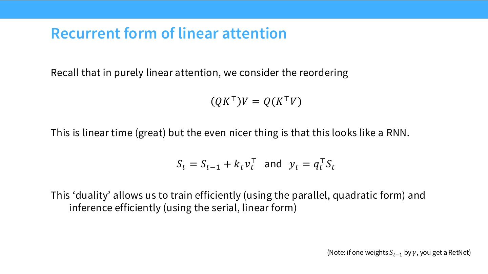

*图：parallel form 与 recurrent form 的精确对应。官方课件第 5 页；视频对应讲解区间：`00:08:04--00:09:49`。*

这产生一个极有价值的 duality：训练时可以用并行矩阵形式吞吐整段序列（充分利用 GPU 的大矩阵乘吞吐），推理时用串行 recurrence，只维护固定大小状态——无论上下文已经多长，每生成一个 token 的计算与显存都是 $O(d_kd_v)$ 的常数。课堂问答专门澄清了两种“损失”不能混为一谈：

- 去掉 softmax 会改变模型，是潜在质量损失；
- 在已经线性化之后，把 parallel form 改写成 recurrent form 是代数等价，不再增加近似误差。

> [!IMPORTANT]
> 训练/推理双形态是本讲前半场的核心：同一线性运算可在训练时并行、在自回归推理时递推。这也是所有线性化方案相对稀疏检索方案的独有优势——推理状态的大小与历史长度完全解耦。

下面的玩具实现把两种形态并排写出，读者可以自行验证它们对同一输入给出逐位相同（至多浮点舍入差异）的输出：

```python
import torch

def linear_attn_parallel(Q, K, V, phi):
    # Q, K: [n, d_k]；V: [n, d_v]；phi: 逐维非负特征映射
    Qf, Kf = phi(Q), phi(K)
    S = Kf.transpose(-1, -2) @ V   # [d_k, d_v]：先压缩全部历史
    return Qf @ S                  # [n, d_v]：每个 query 一次性读取

def linear_attn_recurrent(Q, K, V, phi):
    n, d_k = K.shape
    d_v = V.shape[-1]
    S = torch.zeros(d_k, d_v)      # 固定大小状态，与 n 无关
    outs = []
    for t in range(n):
        # 外积 [d_k, 1] @ [1, d_v] 累加进状态
        S = S + phi(K[t]).unsqueeze(-1) @ V[t].unsqueeze(0)
        outs.append(phi(Q[t]) @ S)  # [d_v]：只读状态，不看历史 token
    return torch.stack(outs)

phi = lambda x: torch.nn.functional.elu(x) + 1  # 常用非负特征映射
```

需要说明，因果并行形式要求每个位置只读取 $s\le t$ 的历史，上面的 `linear_attn_parallel` 为突出结构省略了因果掩码；完整实现需对 $QK^\top$ 施加下三角掩码，或使用分块（chunkwise）形式兼顾因果与并行，这正是 Mamba-2 论文中 SSD 算法的出发点。

### 2.3 为什么纯线性状态还不够

简单加法会让所有历史以相同规则进入状态，表达力不足。从信息论的角度看，$S_t$ 是一个 $d_k\times d_v$ 的矩阵，能“分辨”的历史模式数量受限于其秩与数值精度；当序列长度远超状态容量时，远期信息不可避免地被新写入的内容淹没或干扰。现实模型因此加入输入相关的衰减、选择性写入、局部卷积或少量 full attention 层。问题从“能否压缩历史”转为“怎样有选择地保留、覆盖与遗忘”。

这也预告了下一节的演化路线：Mamba-2 给状态加**标量衰减门**（整体遗忘），GDN 再加**方向性擦除**（沿特定 key 方向改写），两者都是在“写入规则”上做文章，而不改变 $O(nd^2)$ 的渐近成本。

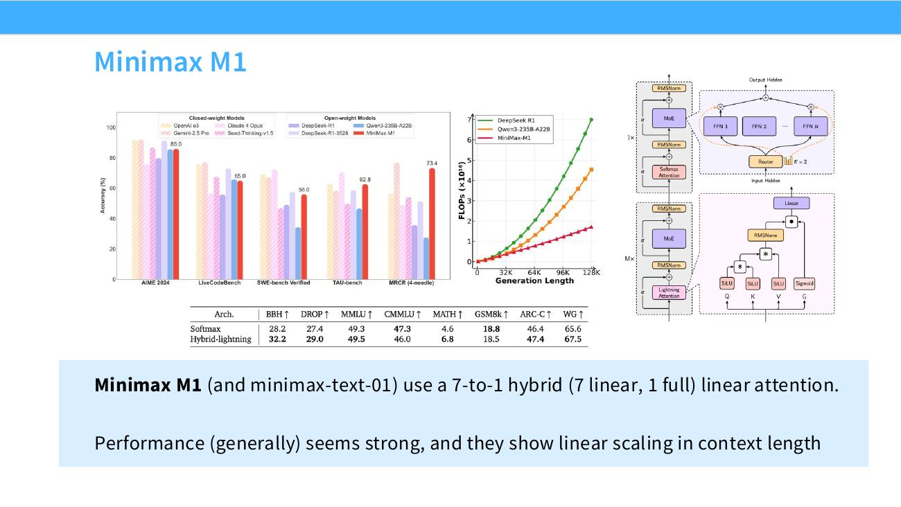

在展开状态改造之前，课件先用 MiniMax M1 证明这条路线"真的能用"（课件第 6 页）。左图是 M1 与同期开闭源模型在 AIME、LiveCodeBench、SWE-bench 等基准上的对比，性能总体处于第一梯队；中间的 FLOPs–生成长度曲线是关键证据：DeepSeek R1 与 Qwen3-235B 的解码成本随生成长度二次上翘，M1 则近似线性——128k 生成时成本仅为前者的几分之一。右上的架构图显示 M1 每 8 个 block 中 7 个用 lightning（线性）attention、1 个用 softmax attention，即 7:1 混合；下方小表显示 hybrid-lightning 在 BBH、DROP 等多数指标上还不劣于纯 softmax 对照。这页确立了全讲前半场的经验基调：线性化不是只有理论好看的玩具。

### 本章小结

- 线性 attention 的速度来自移除/分解 softmax 后改变乘法顺序：$n^2d_k+n^2d_v$ 对 $2nd_kd_v$，序列轴由二次变线性。
- 特征映射 $\phi$ 负责在去掉 softmax 后维持非负权重语义，是质量与速度交换的旋钮。
- 其 parallel 与 recurrent 两种形式在代数上等价（归纳法可证），分别适配训练和推理。
- 真正困难不在累计状态，而在让有限状态具备选择性记忆与遗忘能力。

## 3. 从 Mamba-2 到 GDN：给状态加门，并与 Attention 混合

### 3.1 Mamba-2 的教学性简化

在简单 recurrence 上加入输入相关衰减门和直接通路，可以得到课程用来解释 Mamba-2 的简化力学：

$$
S_t=\gamma_tS_{t-1}+k_tv_t^\top,\qquad
y_t=q_t^\top S_t+v_t^\top D,\qquad
\gamma_t=f(x_t).
$$

- `S_t`：当前位置更新后的状态。
- `S_{t-1}`：上一位置状态。
- `γ_t`：由当前输入决定的状态保留/衰减门。
- `k_t`：当前位置 key。
- `v_t`：当前位置 value。
- `q_t`：当前位置 query。
- `y_t`：当前位置输出。
- `D`：直接或 skip 路径参数。
- `x_t`：当前位置输入。
- `f`：把输入映射为门值的函数。
- `T`：向量转置。

把递推展开几步，可以看清衰减门的作用。设 $S_0=0$，则

$$
S_t=\sum_{s=1}^{t}\Bigl(\prod_{r=s+1}^{t}\gamma_r\Bigr)k_sv_s^\top,
$$

- $\prod_{r=s+1}^{t}\gamma_r$：位置 `s` 的写入在到达位置 `t` 之前经历的累计衰减。

也就是说，每条历史写入都乘上了一个随距离指数衰减（若 $\gamma_r<1$）的权重。与纯累加相比，模型获得了“遗忘”的能力；与固定的指数衰减相比，$\gamma_t$ 由输入决定，模型可以**选择性地**记住某些内容（在这些区间令 $\gamma$ 接近 1）而快速遗忘另一些内容。这正是 SSM 文献中“selection mechanism”的几何含义。

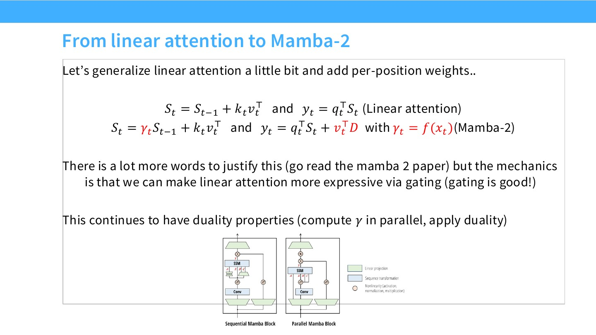

*图：从 linear attention 到带衰减门与 skip path 的 Mamba-2 简化式。官方课件第 7 页；视频对应讲解区间：`00:11:11--00:13:25`。*

> [!NOTE]
> 这不是完整 Mamba-2 block。实际模型还包含 projection、卷积、规范化和更具体的 SSM 参数化（如对角状态矩阵、SSD 分块结构）；课程这里只保留与 linear attention 对照所需的状态更新骨架。把这个简化式当作理解入口，而不是实现蓝本。

课堂提问还指出 `v_t^T D` 看似绕过状态。讲者的回答是：它给当前输入一条直接的局部通路，状态负责跨位置记忆，两者承担不同职责。从梯度的角度看，skip 路径还为深层堆叠提供了一条不受门控衰减影响的信号通道，缓解了长链乘积带来的梯度消失。

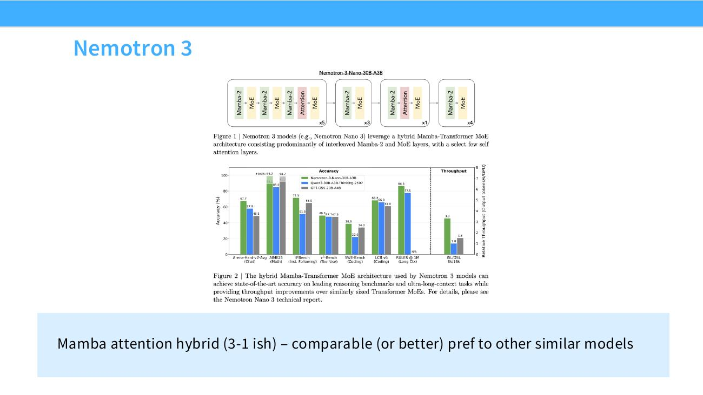

本页（课件第 8 页）给出 Mamba 路线的工业证据：Nemotron-3-Nano-30B-A3B 以 Mamba-2 层为主、穿插少量 self-attention 层并搭配 MoE（约 3:1 的混合比例），在 Arena-Hard、AIME25、RULER@1M 等基准上达到或超过同量级 Qwen3-30B 与 GPT-OSS-20B，而右侧吞吐图显示其解码吞吐约为对照模型的 3 倍以上。这页与第 6 页 MiniMax M1 互为印证：不同厂商、不同线性层选型，都得到"混合比例很小、性能不降、推理大增"的一致结论。

### 3.2 Gated Delta Net：写入前先沿 key 方向擦除

如果只衰减整个状态，模型不能精确改写某一类记忆——$\gamma_t$ 是一个标量，对所有 key 方向一视同仁。GDN 在当前 key 方向上先擦除旧内容，再写入新 value：

$$
\begin{aligned}
S_t&=\gamma_t\bigl(I-\beta_tk_tk_t^\top\bigr)S_{t-1}+\beta_tk_tv_t^\top,\\
y_t&=q_t^\top S_t,\qquad \gamma_t=f_\gamma(x_t),\quad \beta_t=f_\beta(x_t).
\end{aligned}
$$

- `S_t`：更新后的状态，`S_t∈R^{d_k×d_v}`。
- `S_{t-1}`：旧状态，形状同样是 `d_k×d_v`。
- `I`：`d_k×d_k` 单位矩阵。
- `β_t`：输入相关的写入/擦除门；为零时不写入。
- `k_tk_t^T`：当前 key 方向的外积。
- `γ_t`：旧状态整体保留门。
- `k_t`：当前 key，按 `d_k×1` 列向量理解。
- `v_t`：当前 value，按 `d_v×1` 列向量理解。
- `q_t`：当前 query，按 `d_k×1` 列向量理解。
- `y_t`：当前位置输出，形状为 `d_v×1`；公式中的 `q_t^T S_t` 横向写作 `1×d_v`。
- `x_t`：当前位置输入。
- `f_γ,f_β`：生成两个门值的输入相关函数。
- `T`：向量转置。

#### 擦除算子的几何意义

关键是理解 $I-\beta_tk_tk_t^\top$ 这个矩阵对状态做了什么。先设 $\|k_t\|=1$（key 已归一化）。$k_tk_t^\top$ 是沿 $k_t$ 方向的秩一投影算子：对任意向量 $u$，$(k_tk_t^\top)u=k_t(k_t^\top u)$ 取出 $u$ 在 $k_t$ 方向上的分量。因此

$$
\bigl(I-\beta_tk_tk_t^\top\bigr)u=u-\beta_t(k_t^\top u)k_t,
$$

即把 $u$ 沿 $k_t$ 方向的分量缩减为原来的 $(1-\beta_t)$ 倍，正交方向分量原样保留。当 $\beta_t=1$ 时，它就是**向 $k_t$ 正交补空间的投影**，把 $k_t$ 方向的分量完全抹除；当 $0<\beta_t<1$ 时，是部分擦除。这个矩阵左乘状态 $S_{t-1}$，就是对 $S_{t-1}$ 的每一列做上述操作——换言之，**所有“能通过 key $k_t$ 被读到”的旧内容都被按比例擦除**。

最有说服力的验证是写入之后立刻用同一个 key 读取：

$$
S_tk_t=\gamma_t\bigl(I-\beta_tk_tk_t^\top\bigr)S_{t-1}k_t+\beta_tk_tv_t^\top k_t
=\gamma_t(1-\beta_t)\,S_{t-1}k_t+\beta_t\|k_t\|^2v_t.
$$

- $S_{t-1}k_t$：旧状态在 key $k_t$ 下会读出的 value。
- $\|k_t\|^2$：key 的模长平方，归一化时等于 1。

取 $\gamma_t=1$、$\|k_t\|=1$，上式化为 $(1-\beta_t)(\text{旧值})+\beta_t(\text{新值})$：这正是 **delta rule**——读取结果在旧值与新值之间按 $\beta_t$ 插值，模型可以精确地把某个 key 关联的内容**改写**为新值，而不是像纯累加那样只能叠加。这为“关联记忆”（associative memory）提供了经典的学习规则：状态 $S$ 扮演 key→value 查找表，delta rule 是在线更新该表条目的规则。

下面的玩具实现把 GDN 的单层循环写出，并验证“写入后用同一 key 读取得到插值结果”这一性质：

```python
import torch

d_k, d_v = 4, 3
S = torch.randn(d_k, d_v)            # 初始状态（关联记忆表）
k = torch.nn.functional.normalize(torch.randn(d_k), dim=0)  # 单位 key
v = torch.tensor([1.0, 2.0, 3.0])    # 要写入的新 value
beta, gamma = 0.8, 1.0               # 擦除/写入强度与保留门

old_read = k @ S                     # 写入前：旧状态下 key 读到的值
erase = torch.eye(d_k) - beta * torch.outer(k, k)   # I - β k kᵀ
S = gamma * (erase @ S) + beta * torch.outer(k, v)  # 擦除 + 写入
new_read = k @ S                     # 写入后：同一 key 读到的值
expected = (1 - beta) * old_read + beta * v         # delta rule 插值
assert torch.allclose(new_read, expected, atol=1e-5)
```

运行后可以确认：`new_read` 精确等于旧读出值与新 value 按 $\beta=0.8$ 的凸组合，擦除算子严格兑现了几何直觉。若把 $\beta$ 设为 0，状态原样保留；设为 1 且 $\gamma=1$，旧方向内容被完全覆盖——门的两端分别退化为“只读不写”与“强制改写”。

逐项做一次形状检查，就能看出“擦除旧状态”和“写入新状态”确实可以相加：

| 表达式 | 形状 | 检查结果 |
|---|---:|---|
| `S_{t-1}`、`S_t` | `d_k×d_v` | 状态以 key 维为行、value 维为列 |
| `k_t`、`q_t` | `d_k×1` | 两者都是列向量 |
| `v_t` | `d_v×1` | value 列向量 |
| `I`、`k_tk_t^T` | `d_k×d_k` | 二者可做减法 |
| `(I-β_tk_tk_t^T)S_{t-1}` | `(d_k×d_k)(d_k×d_v)=d_k×d_v` | 擦除项仍是状态形状 |
| `k_tv_t^T` | `(d_k×1)(1×d_v)=d_k×d_v` | 写入项也是状态形状 |
| `q_t^T S_t` | `(1×d_k)(d_k×d_v)=1×d_v` | 得到一个 value 维输出 |

所以第一项和第二项都落在 `R^{d_k×d_v}` 中，状态更新维度闭合；最后的 query 读取再把 key 维消掉，留下 value 维。

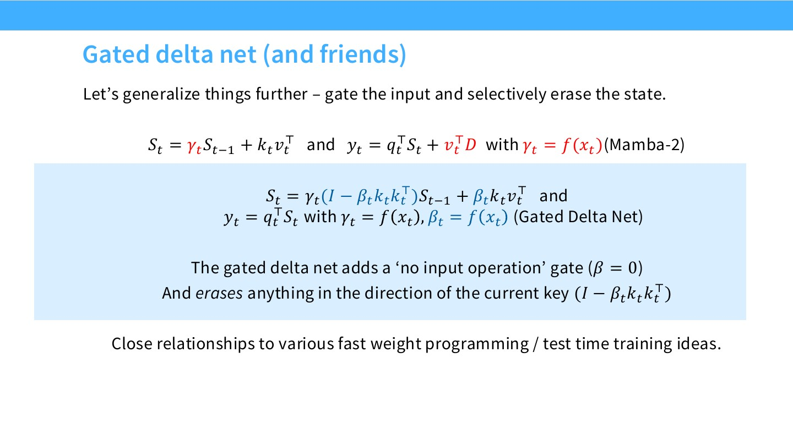

*图：GDN 通过 `I-β_tk_tk_t^T` 擦除当前 key 方向的旧内容。官方课件第 9 页；视频对应讲解区间：`00:15:22--00:18:21`。*

> [!WARNING]
> 只有在额外归一化条件下（$\|k_t\|=1$ 且 $\beta_t=1$），`I-β_tk_tk_t^T` 才能严格解释成正交投影；一般情况下它是“收缩 $k_t$ 方向分量”的线性算子，更稳妥的说法是“沿 key 方向进行可学习擦除”。也不要把它与数值分析中的 Householder 反射混淆——反射会把分量翻转为负，而这里的算子只负责缩减。

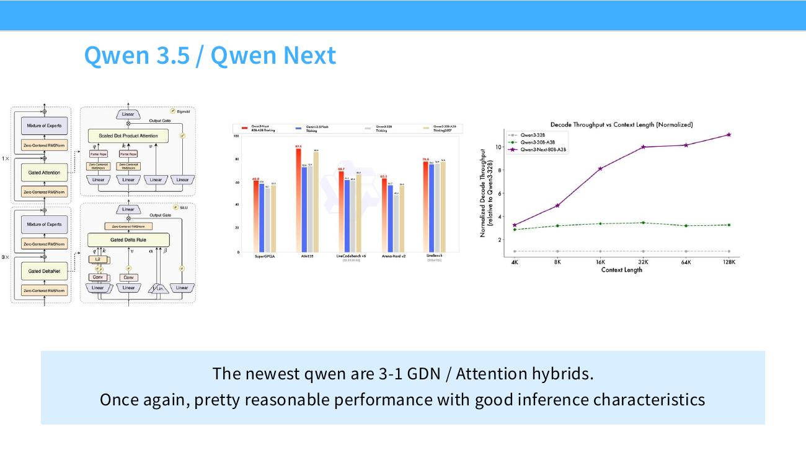

本页（课件第 10 页）是 GDN 路线的最新工业实例：Qwen3-Next 每 4 个 block 中 3 个用 Gated DeltaNet、1 个用 Gated Attention（3:1 混合），左侧架构图还展示了 GDN block 内部的卷积、L2 归一化与 $\alpha,\beta$ 门的具体接法。右侧"Decode Throughput vs Context Length"曲线最能说明问题：Qwen3-32B 与 Qwen3-30B-A3B 的解码吞吐随上下文增长持续下滑，而 Qwen3-Next-80B-A3B 的曲线在 4K 到 128K 之间几乎平坦且高达 10 倍左右——固定大小循环状态让逐 token 推理成本与历史长度解耦，这正是 2.2 节 recurrent form 承诺的系统收益在旗舰模型上的兑现。

### 3.3 混合架构为何成为主流折中

课程列举的 MiniMax M1、Nemotron 3、Qwen 3.5 / Qwen Next 都不是完全移除 attention，而是把线性/循环层与 full attention 层按比例混合。示例比例包括 7:1 或 3:1（若干线性层配一个 full attention 层）。这样做的直觉是：

- 大多数层用固定状态实现便宜的局部和中程传播；
- 少量 full attention 层提供高带宽的显式历史访问；
- 推理成本接近线性模型，同时降低纯固定状态的容量瓶颈。

从系统的角度，混合架构还把 KV cache 的压力按层分摊：只有 full attention 层需要完整 KV cache，线性层只需常数大小的循环状态。以 8 层中 1 层为 full attention 为例，KV cache 总量立即降为纯 attention 模型的约八分之一，而模型仍保留了“逐字回看任意历史 token”的通道。

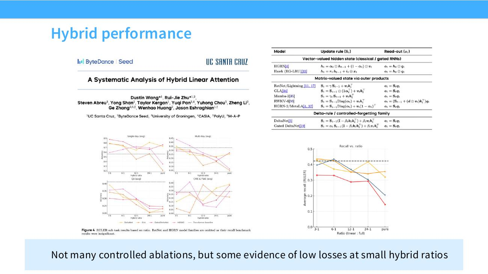

本页（课件第 11 页）引用了 UC Santa Cruz 与 ByteDance Seed 的 systematic analysis，是目前最接近受控实验的证据。右上表格把各模型族按状态更新规则分类：向量隐态的经典门控 RNN（HGRN、Hawk）、外积矩阵状态（RetNet/Lightning、GLA、Mamba-2、RWKV-6、HGRN-2/MetaLA）与 delta-rule/受控遗忘族（DeltaNet、Gated DeltaNet）——读者可对照本讲 2.2、3.1、3.2 节的公式逐行认出它们。下方四张 RULER 子任务图与右侧"Recall vs. ratio"图显示：线性层与全量层的混合比从 3:1 到 24:1 之间，多数模型的召回指标在小比例（线性层占比高）时仍接近 Transformer 基线，只有走向 pure linear 才明显崩塌。课件对这一页的评价很克制：受控消融仍然稀缺，但"小混合比例下损失很低"已有初步证据。

讲者强调，现实证据常来自不同模型之间的横向比较，控制严格的同预算 ablation 仍稀缺。因此“混合架构效果不错”是强经验信号，却不能自动推出某个比例是普适最优。比例的选择目前更像一门结合硬件预算与下游任务的经验手艺，而非有理论指导的科学。

### 本章小结

- Mamba-2 用输入相关衰减与直接通路增强有限状态：$\gamma_t$ 让模型选择性地遗忘，skip 通路保留局部信息。
- GDN 再加入定向擦除与选择性写入：$I-\beta_tk_tk_t^\top$ 沿当前 key 方向收缩旧内容，delta rule 使状态条目可被精确改写而非只累加。
- 现代模型常用“多数线性/SSM 层 + 少量 full attention 层”折中效率与长程读取能力。
- 混合比例的最优值没有公认答案，受模型规模、任务与硬件共同影响。

## 4. DeepSeek Sparse Attention：保留显式历史，但只读 Top-k

### 4.1 与固定状态路线的根本区别

前两节的方法把整段历史压缩进一个固定大小的矩阵状态，推理显存与逐 token 计算都与历史长度解耦，代价是状态容量成为信息瓶颈。DSA 走另一条路：不把全部历史压缩进一个矩阵状态。它保留 token 级 memory，先用轻量 lightning indexer 为每个历史位置打分，再只对 top-k 候选执行较贵的标准 attention：

$$
\begin{aligned}
I_{t,s}&=\sum_{j=1}^{H^I}w^I_{t,j}\,\operatorname{ReLU}\!\left((q^I_{t,j})^\top k^I_s\right),\\
u_t&=\operatorname{Attn}\!\left(h_t,\{c_s\mid s\in\operatorname{TopK}(I_{t,:},k)\}\right).
\end{aligned}
$$

- `t`：当前 query 位置。
- `s`：候选历史位置。
- `I_{t,s}`：位置 `t` 对历史位置 `s` 的索引分数。
- `H^I`：indexer head 数量。
- `j`：indexer head 索引。
- `w^I_{t,j}`：第 `j` 个 indexer head 的权重。
- `q^I_{t,j}`：第 `j` 个 indexer query。
- `k^I_s`：历史位置 `s` 的 indexer key。
- `ReLU`：逐元素非线性。
- `h_t`：当前 token hidden state。
- `c_s`：最终 attention 使用的历史 key-value entry。
- `TopK`：选出最大分数集合的操作。
- `k`：保留的历史位置数。
- `u_t`：稀疏 attention 输出。
- `Attn`：对选中条目执行的精细 attention。
- `T`：向量转置。

注意 indexer 打分与精细 attention 使用**两套不同的表示**：$q^I,k^I$ 是低维、低精度的“检索表示”，只负责回答“这个位置值不值得细看”；$c_s$ 是完整的 KV entry，只在被选中后才参与昂贵的高维 attention。这种“粗筛 + 精读”的两段式结构与信息检索系统中的 recall-rerank 流水线同构。

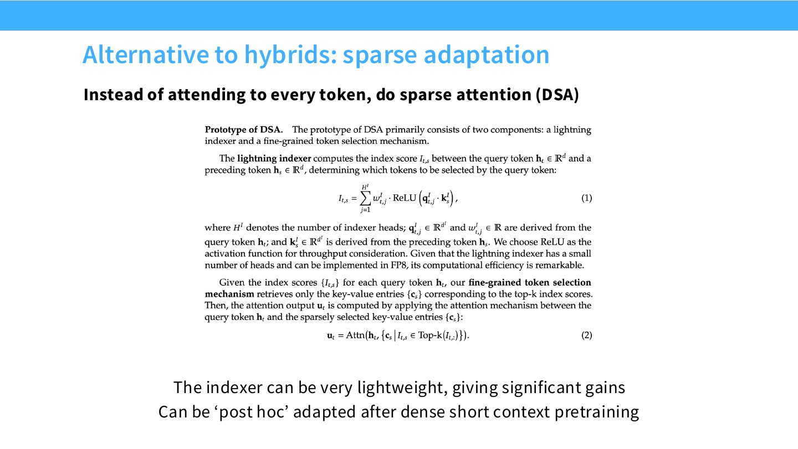

*图：轻量 indexer 打分、top-k token selection 与精细 attention。官方课件第 12 页；视频对应讲解区间：`00:23:13--00:24:45`。*

### 4.2 为什么实际会快，但不应误称“严格线性”

课堂追问了一个关键问题：如果 indexer 仍要看全部历史，它不还是全局扫描吗？答案是肯定的。收益来自 indexer 的常数项极小：低维 query/key、少量 heads、ReLU、FP8 等；真正昂贵的 value 聚合只发生在 `k` 个选中位置上。

对长度 `n` 的整段训练，可用近似分解理解成本：indexer 仍可能达到 `O(n²d_I)`，随后精细 attention 约为 `O(nkd)`。若把选出的 `k` 个 token 当作独立 self-attention 子问题，则会看到 `O(k²d)`。因此不能简单写成“DSA 已变成线性时间”。

我们把三项摆在一起定量比较（每 token、忽略常数）：

| 部分 | 渐近成本 | 常数项来源 |
|---|---|---|
| indexer 打分 | $O(nd_I)$（对全部历史） | $d_I$ 很小、ReLU、可 FP8 |
| 精细 attention | $O(kd)$（只对选中位置） | $d$ 为完整 head 维度，高精度 |
| 标准 dense attention | $O(nd)$ | $d$ 为完整 head 维度 |

由于 $d_I\ll d$ 且 $k\ll n$，前两项之和在典型配置下可以比第三项低一个数量级以上——但这是**常数项与比例系数**的胜利，不是渐近复杂度的胜利。一旦 $n$ 无限增长而 $k$ 固定，indexer 的 $O(nd_I)$ 项终将主导，DSA 的成本曲线仍是线性的斜率问题，只是斜率被压得极低。

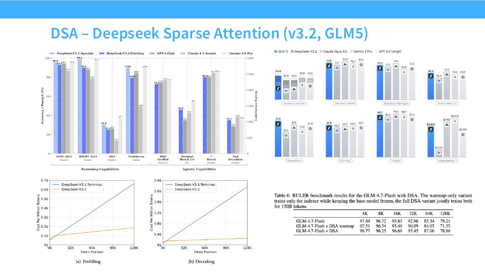

本页（课件第 13 页）给出 DSA 的两组现实证据。上方是 DeepSeek-V3.2 与 GLM-5 的基准对比：两者都装备了 DSA 类稀疏注意力，在推理与 agentic 基准上与同代 dense 模型互有胜负，说明 top-k 稀疏读取没有付出显著质量代价。左下两张成本曲线是系统侧证据：V3.1-Terminus（dense）的 prefilling 与 decoding 单 token 成本随位置线性上升，而 V3.2（DSA）的曲线几乎压平——与 indexer 常数项极小、精细 attention 只覆盖 $k$ 个位置的分析一致。右下 GLM-4.7-Flash 的 RULER 表还展示了一种低成本接入路径：只训练 indexer、冻结基座（warmup-only）已能恢复大部分长上下文召回，联合训练（full DSA）再进一步，印证了 4.3 节"post-hoc 接入"的可行性。

> [!IMPORTANT]
> DSA 的价值是把高精度、高维的读取集中到少量位置；它优化的是昂贵计算的覆盖范围，而不是让索引本身凭空消失。评价 DSA 类方法时，必须把 indexer 的成本、选错位置的召回率损失与精细 attention 的节省放在同一张账上。

### 4.3 Post-hoc 长上下文扩展与精度分工

DSA 的另一吸引力是可以在 dense 短上下文预训练之后，增加 indexer 并做长上下文适配。讲者把这看作架构设计与 context management / retrieval 的融合：模型内部开始显式学习“什么值得读”。与外挂式检索增强不同，indexer 与主模型联合训练，选择标准随语言建模目标端到端优化。

在低精度讨论中，indexer 可用 FP4/FP8 做候选选择，选中后的 attention 再用相对更高精度计算。这里的“高精度”是相对筛选阶段而言，不应自动等同于 FP32。精度分工的逻辑与第 8 节 router 用 FP32 的案例相反相成：**影响“选什么”的计算对误差的容忍度取决于选择错误是否可逆**——top-k 选错是离散且不可逆的，但 indexer 打分只需保住相对排序，低精度的舍入噪声在大多数情况下不改变排序结果；而精细 attention 的数值直接进入输出，误差会逐层累积。

固定状态与 DSA 的取舍由信息容量决定：SSM 的状态大小固定，序列极长时可能形成容量瓶颈；DSA 保留显式历史，内存更高，但能回看细节。课程将这表述为工程 trade-off，而非一个已证明的容量定理。我们可以把这个取舍写成一句话：固定状态方法把**显存**换成**信息损失风险**，DSA 把**计算**换成**召回风险**，两者都不免费。

### 本章小结

- DSA 用轻量 indexer 选出历史 top-k，再执行标准 attention；粗筛与精读使用两套表示。
- 它仍有全局索引成本，实际优势依赖低维、低精度和较小 `k`；其收益是常数项与斜率，不是新的渐近类别。
- 与固定状态模型相比，DSA 用更多显式 memory 换取更精确的长程回看能力。
- indexer 可 post-hoc 接入已有 dense 模型，使长上下文扩展不必从头预训练。

## 5. MoE：让参数容量增长快于每 Token 计算量

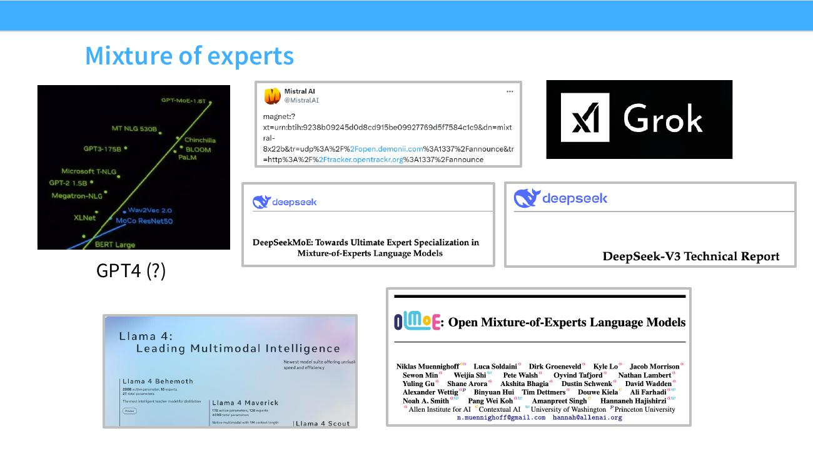

在进入技术细节之前，本页（课件第 14 页）先摆出 MoE 的现实版图：左上是坊间长期流传的 GPT-4 为 MoE 架构的传闻图；中间是 Mixtral 当年以一条 magnet 链接突袭发布的推文截图，以及 xAI Grok、DeepSeekMoE、DeepSeek-V3 技术报告；下方是 Llama 4 系列（Behemoth 288B active / 16 experts）与 Ai2 的完全开放 OLMoE。讲者的用意是让读者意识到：MoE 不是论文里的边缘想法，而是当前多数顶级开放模型（以及据传闻的顶级闭源模型）的共同选择，因此它的路由、均衡与系统问题值得逐条深究。

### 5.1 Dense FFN 到 Sparse FFN

Transformer 中大量参数和 FLOPs 位于 FFN。以标准的扩张四倍配置为例：模型维度 $d$、FFN 隐层 $4d$，两个线性层共有 $2\times d\times4d=8d^2$ 个参数，而单头维度合并后的 attention 投影约为 $4d^2$——FFN 占了约三分之二的参数与计算。MoE 把一个大 FFN 换成多个 expert FFN，并让 router 对每个 token 只选择少数 experts。于是模型的 **total parameters** 可以远大于 **active parameters**。

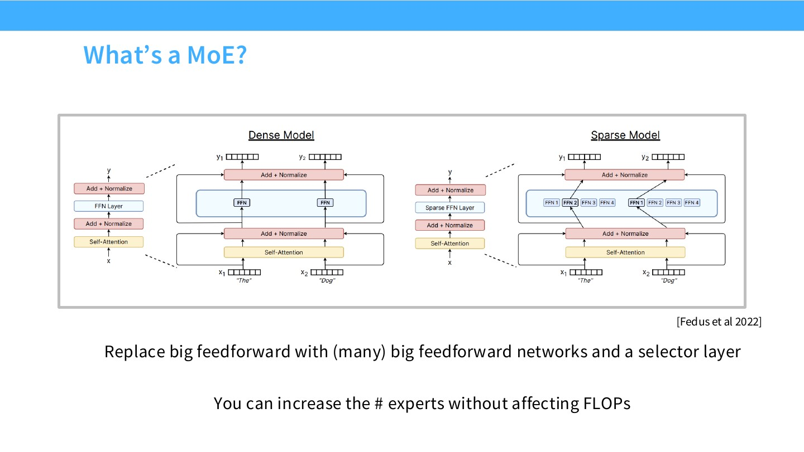

*图：稠密模型与带 selector 的 sparse expert layer。官方课件第 15 页；视频对应讲解区间：`00:35:27--00:36:57`。*

例如课程引用 Qwen1.5-MoE：约 14.3B total parameters，但每个 token 只激活约 2.7B。比较模型时必须说明是哪种口径；只写一个“参数量”会产生严重误导。三个口径各自回答不同的问题：

- **total parameters** 决定显存占用与存储成本；
- **active parameters** 近似决定每 token 的矩阵乘计算量；
- **active FLOPs** 则是实际训练/推理账单的直接度量，还要算上 attention、路由与通信开销。

一个 MoE 模型可以拥有 671B total parameters（显存账单按此支付），同时每 token 只激活 37B（计算账单按此支付）——这种“存储贵、计算便宜”的不对称正是 MoE 的全部经济学。

### 5.2 为什么更多未激活参数仍然有用

在固定 active FLOPs 下，增加 experts 往往能改善训练 loss：不同 tokens 可调用不同子网络，参数容量增大而每个 token 的矩阵乘法量近似不变。直觉上，这相当于把一个大函数族拆成许多专门化的小函数，让每个 token 只为自己需要的那部分功能付费；语言数据本身高度异质（代码、数学、对话、多语种），稀疏激活让模型能为异质子分布分别分配容量，而不必让所有知识挤在同一组权重里互相干扰。

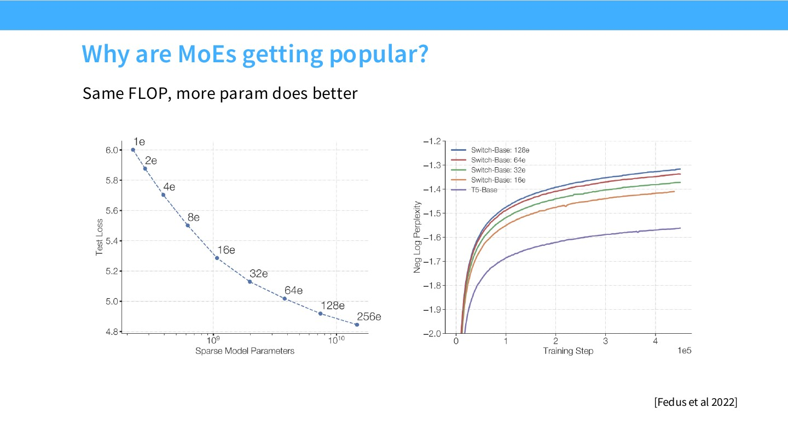

*图：相近 active compute 下，更多 total parameters 带来更好训练曲线的经验结果。官方课件第 16 页；视频对应讲解区间：`00:36:57--00:38:18`。*

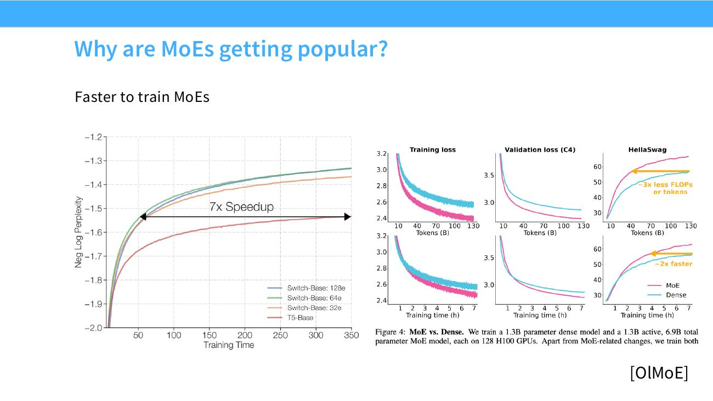

本页（课件第 17 页）把上一页的趋势换算成训练时间。左图来自 Switch Transformer：相同 wall-clock 下，128 个 experts 的 Switch-Base 达到与 T5-Base 相同负对数困惑度只用约七分之一的时间（图中标注 7x speedup）。右图来自 OLMoE 的受控对比：1.3B active / 6.9B total 的 MoE 与 1.3B dense 在同一集群上训练，按 token 数看 MoE 约省 3 倍 FLOPs，按训练时间看约快 2 倍，且 HellaSwag 等下游指标同步占优。注意两组证据的口径不同：一个是"同时间比质量"，一个是"同质量比成本"，阅读时不要把两个倍数混为一谈。

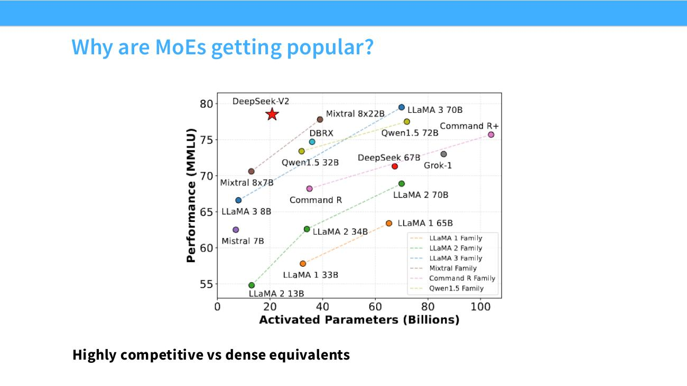

本页（课件第 18 页）以 MMLU 对 activated parameters 作散点：dense 模型大致落在各自家族的斜线上，而 MoE 模型（Mixtral 8x7B/8x22B、DBRX、Grok-1、DeepSeek-V2）系统性地位居同激活参数量 dense 模型的左上方——用更少的激活参数换到同等甚至更高的性能。DeepSeek-V2 以红星标出，是当时这条"性能/激活参数"前沿上最激进的点。这页直观定义了 MoE 的竞争力坐标系：横轴是每 token 账单，纵轴是模型能力。

但这只是一种 **active-compute 视角的 free win**。总参数仍要存储；训练时要更新；token 要在设备间 all-to-all；路由不均还会造成 straggler。MoE 的真正成本从单卡 GEMM 转移到了分布式系统。换言之，MoE 并没有消除成本，而是把成本**换算**成了另一个维度的资源：从算术吞吐换成显存容量、互联带宽与调度复杂度。这笔交换是否划算，完全取决于你的集群在哪个维度上更宽裕。

### 5.3 Expert parallelism 与部分反馈

把不同 experts 放在不同设备上，可获得额外的 expert parallelism。一次 MoE 层通常包括：router 打分 → token dispatch → 各设备 expert 计算 → token combine。网络拓扑和跨机带宽因此决定真实吞吐。

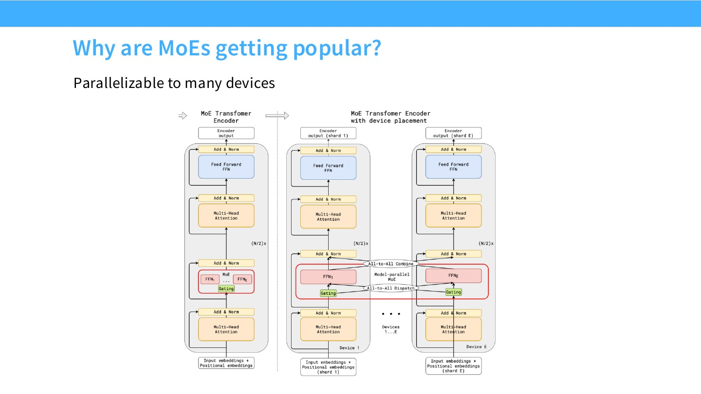

*图：不同 experts 分布到设备后形成的新并行维度。官方课件第 19 页；视频对应讲解区间：`00:39:50--00:40:42`。*

 路由又带来部分反馈：一个 token 只经过被选 expert，模型无法直接观察“如果送到其他 expert 会怎样”。这很像 contextual bandit，但主流系统通常不用完整 RL，而采用可微 router、top-k 选中路径、噪声和辅助损失等启发式方案。部分反馈是 MoE 训练一切困难的根源：router 的每一次选择都遮蔽了反事实，因此 router 的学习信号天然带有选择偏差，第 7 节的全部技术（噪声、辅助损失、bias）都是在不同程度上修补这个偏差。

#### MoE 流行的经验证据与其阴影

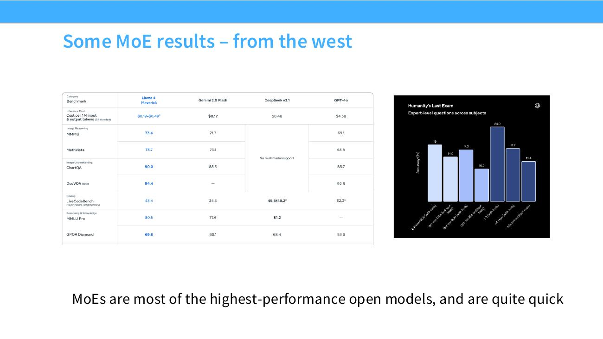

本页（课件第 20 页）汇总西方阵营的 MoE 成绩单：左表把 Llama 4 Maverick 与 Gemini 2.0 Flash、DeepSeek v3.1、GPT-4o 并排，Maverick 在 MMMU、ChartQA、DocVQA、GPQA 等多项领先且推理单价最低；右图是 Grok 在 Humanity's Last Exam 上的成绩。课件的结论是：当前性能最高的开放模型大多是 MoE，而且推理很快——稀疏激活把"大模型"的推理成本拉回了中等模型的档位。

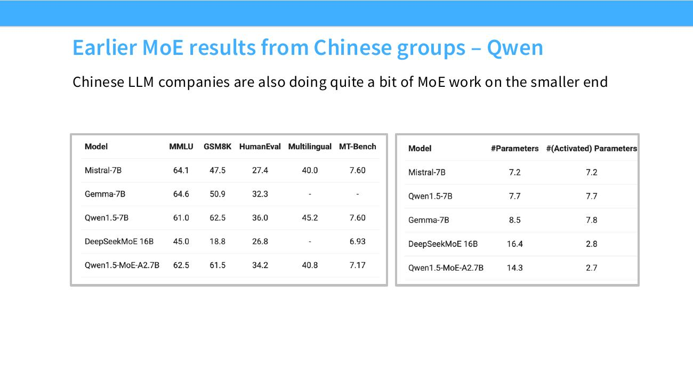

本页（课件第 21 页）给出小尺寸端的对照实验：Qwen1.5-MoE-A2.7B 以 14.3B total / 2.7B active 的配置，在 MMLU、GSM8K、HumanEval、MT-Bench 上整体打平或超过 7B 量级的 dense 模型（Mistral-7B、Gemma-7B、Qwen1.5-7B），而每 token 只激活约 2.7B 参数。这页的数字是"三个口径"最好的实例教材：total 决定显存、active 决定算力，两者相差五倍多，只报一个"参数量"会产生严重误导。

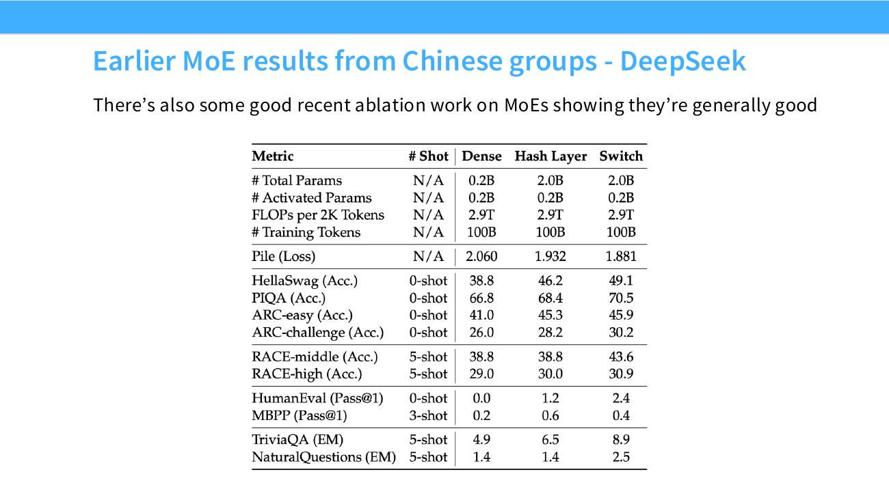

本页（课件第 22 页）是 DeepSeekMoE 论文中的同预算消融：Dense 0.2B、Hash Layer 与 Switch 均为 2.0B total / 0.2B active、同 100B tokens 训练。结果 Switch 几乎全面领先：Pile loss 从 2.060 降到 1.881，HellaSwag 从 38.8 提到 49.1，TriviaQA 从 4.9 提到 8.9。这张表的重要性在于它是**受控**的——总参数、激活参数、FLOPs、数据完全相同，唯一的变量是条件激活机制本身，因此收益可以干净地归因于稀疏化而非规模。

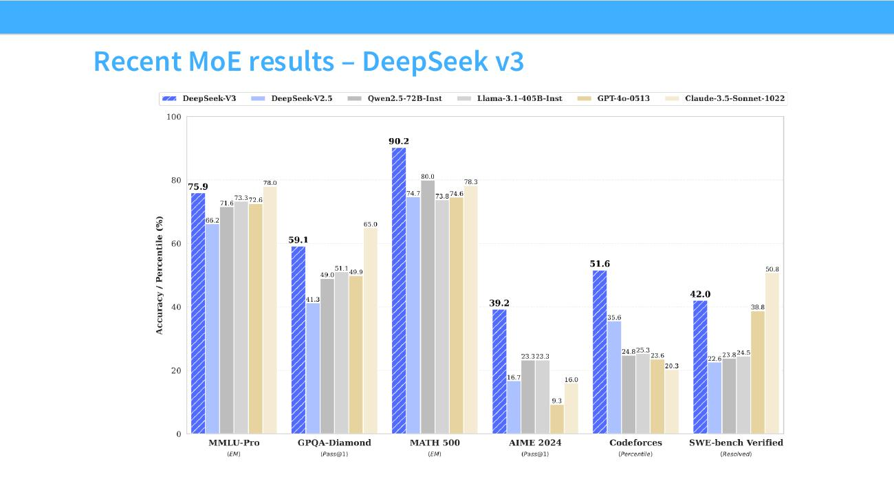

本页（课件第 23 页）是 DeepSeek-V3 发布时的基准横评：MMLU-Pro、GPQA-Diamond、MATH 500、AIME 2024、Codeforces、SWE-bench Verified 六项中，V3 作为开放权重模型在多数项上逼近或超过 GPT-4o 与 Claude-3.5-Sonnet，而它的激活参数量只有 37B。课件以此收束"为什么 MoE 流行"的论证：第 16–18 页证明趋势存在，第 20–22 页证明跨团队可复现，本页证明它能在最大规模上兑现。

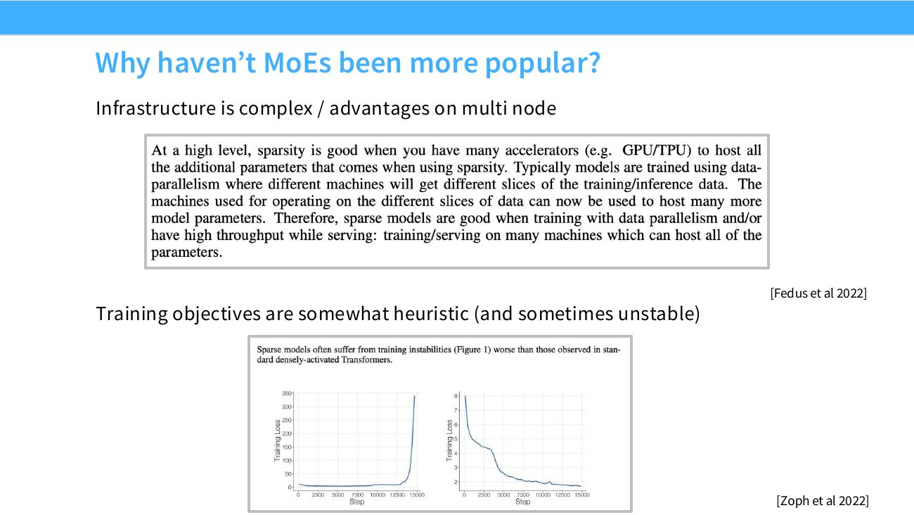

本页（课件第 24 页）笔锋一转，摆出 MoE 的历史阻力。上方引用 Fedus et al. 2022（Switch/ST-MoE 综述）的论断：稀疏模型只有在拥有大量加速器、以数据并行方式训练时才有优势——优势天然偏向多机大户。下方引用 Zoph et al. 2022 的训练曲线：稀疏模型频繁出现 dense 模型罕见的 loss 尖峰与发散，训练目标"多少有些启发式、有时不稳定"。这页为第 7、8 节埋下伏笔：路由优化与数值稳定性不是可选润色，而是 MoE 从论文走向生产的门槛。

### 本章小结

- MoE 用稀疏激活把 total capacity 与 per-token active compute 解耦；FFN 约占 Transformer 三分之二的参数，是稀疏化的主战场。
- total parameters、active parameters 与 active FLOPs 是三个不同口径，分别对应存储、计算与能耗账单。
- MoE 的收益伴随新的通信、路由、存储和负载均衡成本；它把成本换算到分布式系统维度，而非消除成本。
- 路由的部分反馈结构使 MoE 训练本质上是一个带选择偏差的优化问题。

## 6. 路由设计：谁选择谁，以及如何组合专家输出

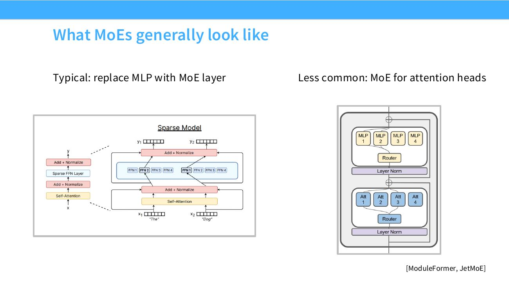

本页（课件第 25 页）先划定 MoE 的主流形态：左侧是标准做法——把 Transformer block 中的 MLP 换成带 router 的 sparse FFN 层，self-attention 保持稠密；右侧是较少见的变体——对 attention heads 或整个 block 做路由（ModuleFormer、JetMoE 等工作）。本讲的讨论几乎全部针对左侧形态：FFN 占参数量约三分之二，是稀疏化收益最大的部位，而 attention 头之间的信息交换结构对路由更敏感。

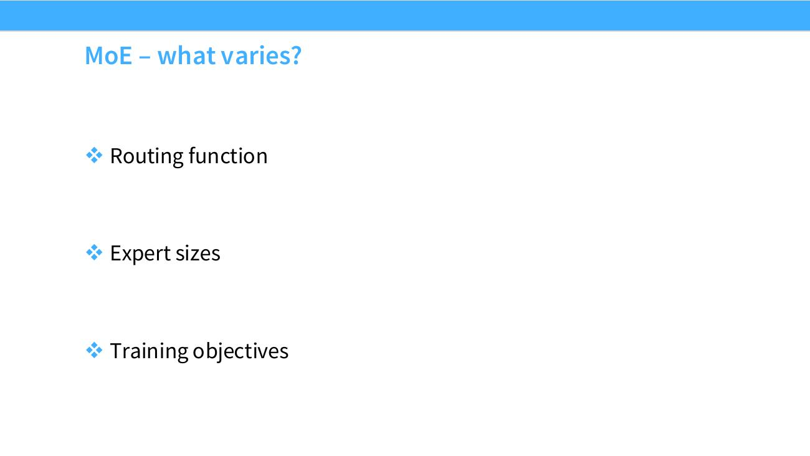

本页（课件第 26 页）把 MoE 的设计空间压缩成三条轴：routing function（谁选谁、怎么选）、expert sizes（专家的数量与粒度）、training objectives（如何给离散选择提供学习信号）。第 6 节的剩余部分沿第一条轴展开，第 6.3 节处理第二条轴，第 7 节处理第三条轴——这三页标题实际上就是本讲后半场的目录。

### 6.1 三类 assignment

课程区分三类路由：

- **token-choice**：每个 token 选自己的 top-k experts，最常用；
- **expert-choice**：每个 expert 选一批 tokens，负载更好控制，但因果与在线推理更麻烦；
- **global assignment**：在 batch 级做匹配，目标清楚却计算和实现复杂。

三者的差别在于**选择权的归属**。token-choice 把选择权交给数据侧：每个 token 独立决策，天然适合自回归在线推理（新 token 到达即可路由，无需等待 batch 成形），代价是负载完全由数据的统计性质决定，可能严重倾斜。expert-choice 把选择权交给参数侧：每个 expert 取固定数量 tokens，负载天然均衡，但一个 token 是否被处理取决于 expert 的决策，在逐 token 生成的推理场景下意味着未来的路由会反过来影响当前 token 是否被计算，与因果约束冲突。global assignment（如线性分配、最优传输）在数学上最干净——直接最小化全局代价并满足容量约束，但求解一个 batch 级匹配问题的成本与延迟都难以进入训练内循环。

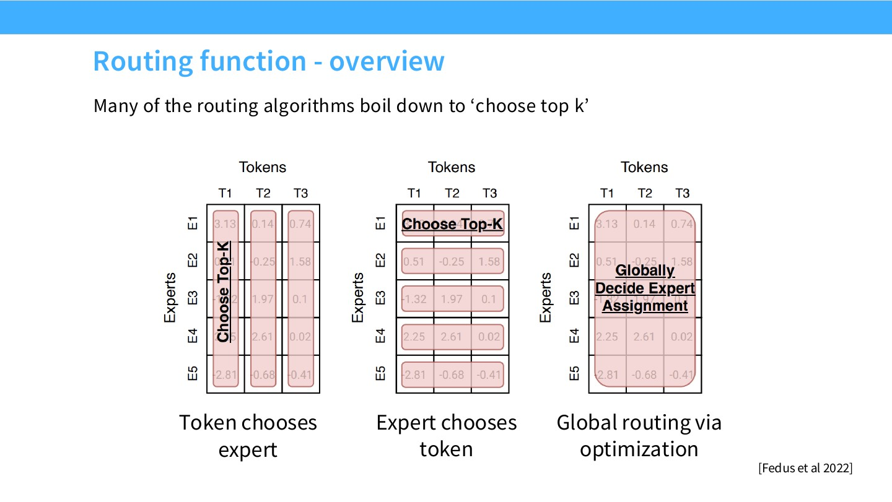

*图：三种 token-expert assignment 的对照。官方课件第 27 页；视频对应讲解区间：`00:48:15--00:49:00`。*

经验上，简单 token-choice top-k 仍是主流。RL 路由和线性匹配在理论上更直接，却因高方差、复杂度与在线约束没有成为默认。工程史的教训是：**在训练内循环里，一个可微、无状态、逐 token 独立的路由函数几乎总是胜过更聪明但有状态的全局方案**。

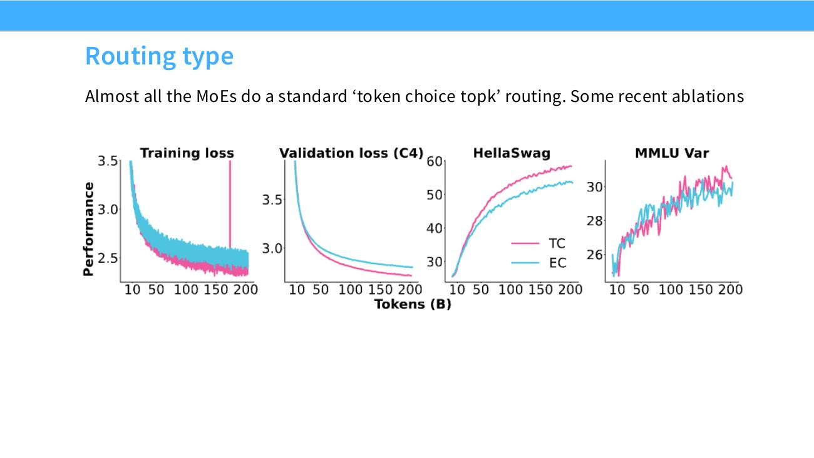

本页（课件第 28 页）给出 TC 与 EC 的受控对比：四张训练曲线（train loss、C4 验证 loss、HellaSwag、MMLU）中，token-choice（粉）在损失与下游指标上稳定略优于 expert-choice（青）。这页为"为什么主流是 token-choice"提供了超出工程便利之外的证据：即便不考虑因果约束与实现复杂度，TC 在质量上也并不吃亏，因此没有理由为它放弃在线友好性。

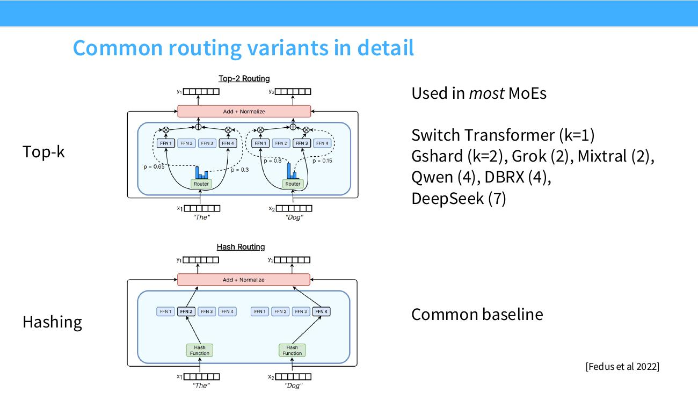

本页（课件第 29 页）细化两类具体路由。上方 top-k 路由展示了 "The"/"Dog" 两个 token 各自携带 router 概率分布、按 top-2 激活 experts 的过程；右侧列出各模型的 $k$ 值谱系：Switch Transformer $k=1$、GShard/Grok/Mixtral $k=2$、Qwen/DBRX $k=4$、DeepSeek $k=7$——$k$ 的选择是质量与通信量的直接汇率。下方 hashing 路由用固定哈希函数替代学习的 router，零参数、天然均衡，是消融实验中的常见对照基线（第 22 页表格中的 Hash Layer 列即此）。

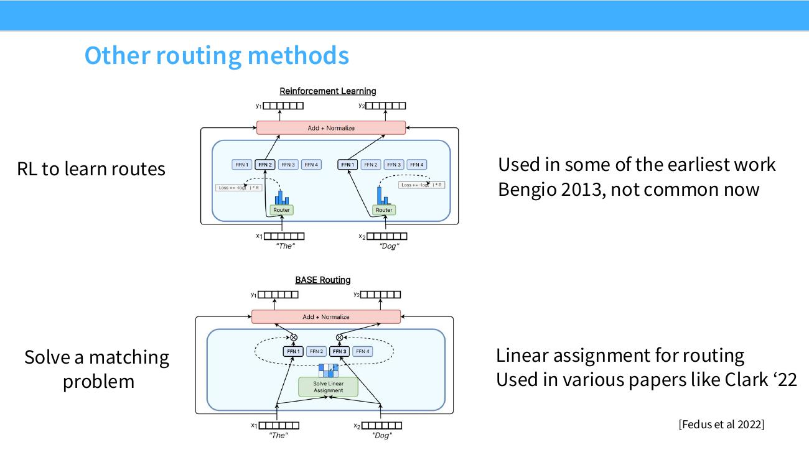

本页（课件第 30 页）展示两条更"聪明"但未成主流的路线。上方 RL 路由把选择视为策略、用 $\nabla\log p\cdot R$ 形式的得分函数更新 router，可追溯到 Bengio 2013 年的条件计算工作；下方 BASE routing 在 batch 内求解线性分配问题（Clark et al. 2022），让 token-expert 匹配直接最小化全局代价并满足容量约束。两者的共同软肋在本讲义 6.1 与 7.1 节已分析：前者方差高，后者有状态且与在线推理冲突。

### 6.2 标准 token-choice top-k

router 先算 token 与每个 expert 的 affinity，再保留 top-k，最后加权专家输出并走 residual：

$$
\begin{aligned}
s_{i,t}&=\operatorname{Softmax}_i\!\left((u_t^l)^\top e_i^l\right),\\
g_{i,t}^l&=\begin{cases}
s_{i,t},&s_{i,t}\in\operatorname{TopK}(\{s_{j,t}\}_{j=1}^{N},K),\\
0,&\text{otherwise},
\end{cases}\\
h_t^l&=u_t^l+\sum_{i=1}^{N}g_{i,t}^l\operatorname{FFN}_i^l(u_t^l).
\end{aligned}
$$

- `l`：层索引。
- `t`：token 位置。
- `i,j`：expert 索引。
- `u_t^l`：进入第 `l` 个 MoE 层的 hidden state。
- `e_i^l`：expert `i` 的 router embedding 或分类权重。
- `s_{i,t}`：router 对 expert `i` 的 soft probability。
- `TopK`：选出最大 `K` 个分数的操作。
- `K`：每 token 选择的 routed experts 数。
- `N`：routed experts 总数。
- `g_{i,t}^l`：top-k mask 后的 gate。
- `FFN_i^l`：第 `i` 个 expert FFN。
- `h_t^l`：MoE residual 输出。
- `Softmax_i`：沿 expert 维度的 softmax。
- `⊤`：向量转置。

我们把概率计算再拆细一步。router 本质上是一个线性分类器：logit 为 $z_{i,t}=(u_t^l)^\top e_i^l$，softmax 给出

$$
s_{i,t}=\frac{\exp(z_{i,t})}{\sum_{j=1}^{N}\exp(z_{j,t})},
$$

- $z_{i,t}$：token `t` 对 expert `i` 的路由 logit。

这里 softmax 沿 expert 维归一化，因此 $\sum_i s_{i,t}=1$——每个 token 把一单位的“概率质量”分配给全部 experts。top-k 操作再把这个连续分配**硬化**为稀疏集合：只有 $K$ 个 experts 收到非零 gate。注意在这一版定义里 gate 直接取 softmax 值、不做再归一化，所以 top-k 之后每行 gate 之和一般小于 1；被丢弃的概率质量相当于被“浪费”，输出幅度自然小于 dense FFN，这由后续训练补偿。

#### 一个 `T=3, N=4, K=2` 的手算例子

为了把“affinity → top-k → gate”具体化，令每个 token 的 hidden dimension 为 `d=2`。三行 token states 与四列 expert router vectors 相乘，得到每个 token 对每个 expert 的 logits；softmax 必须逐行、沿 expert 维归一化：

$$
\begin{aligned}
U&=\begin{bmatrix}1&0\\0&1\\1&2\end{bmatrix}\in\mathbb R^{3\times2},\qquad
E=\begin{bmatrix}2&1&0&-1\\0&1&3&-1\end{bmatrix}\in\mathbb R^{2\times4},\\
A&=UE=\begin{bmatrix}2&1&0&-1\\0&1&3&-1\\2&3&6&-3\end{bmatrix}\in\mathbb R^{3\times4},\\
S&=\operatorname{Softmax}_{\rm row}(A)\approx
\begin{bmatrix}
0.644&0.237&0.087&0.032\\
0.041&0.112&0.831&0.015\\
0.017&0.047&0.936&0.000
\end{bmatrix},\\
G&=\operatorname{KeepTop2}(S)=
\begin{bmatrix}
0.644&0.237&0&0\\
0&0.112&0.831&0\\
0&0.047&0.936&0
\end{bmatrix}\in\mathbb R^{3\times4}.
\end{aligned}
$$

- `T=3`：batch/sequence 中参与路由的 token 数量，即 `U` 的行数。
- `N=4`：routed experts 数量，即 `E`、`A`、`S`、`G` 的列数。
- `K=2`：每个 token 保留的 expert 数量。
- `d=2`：token hidden state 与 router vector 的维度。
- `U`：token state 矩阵，形状 `[T,d]=[3,2]`。
- `E`：由四个 expert router vectors 按列组成的矩阵，形状 `[d,N]=[2,4]`。
- `A`：affinity/logit 矩阵 `UE`，形状 `[T,N]=[3,4]`。
- `S`：对 `A` 每一行做 softmax 后的稠密 router probability，形状仍为 `[3,4]`。
- `G`：每行只保留两个最大 probability 后的 sparse gate，形状仍为 `[3,4]`。
- `Softmax_row`：固定一个 token，沿四个 experts 归一化。
- `KeepTop2`：每行保留最大两项，其余置零。
- `R`：实数域。
- `≈`：三位小数近似。

验算第一行：logits 为 $[2,1,0,-1]$，指数后约为 $[7.389,2.718,1.000,0.368]$，总和 $11.475$，于是 $s_1=7.389/11.475\approx0.644$，$s_2=2.718/11.475\approx0.237$，$s_3\approx0.087$，$s_4\approx0.032$，与矩阵一致，四项之和为 1。KeepTop2 保留 $\{0.644,0.237\}$，该行 gate 之和降为 $0.881$。

三行的选择集合分别是 `{expert 1, expert 2}`、`{expert 3, expert 2}`、`{expert 3, expert 2}`。按照课件这版“softmax 后 top-k”的定义，未再次归一化，所以每行 gate 之和可以小于 1。现在给六个实际被选中的 expert outputs 指定简单二维值，就能手算 residual combine：

$$
\begin{aligned}
&F_{1,1}=[1,0],\quad F_{1,2}=[0,2],\qquad
F_{2,2}=[1,1],\quad F_{2,3}=[-1,2],\\
&F_{3,2}=[2,0],\quad F_{3,3}=[0,1],\\
H&=U+\begin{bmatrix}
0.644F_{1,1}+0.237F_{1,2}\\
0.112F_{2,2}+0.831F_{2,3}\\
0.047F_{3,2}+0.936F_{3,3}
\end{bmatrix}
\approx
\begin{bmatrix}
1.644&0.474\\
-0.719&2.774\\
1.094&2.936
\end{bmatrix}\in\mathbb R^{3\times2}.
\end{aligned}
$$

- `F_{t,i}`：expert `i` 对 token `t` 的二维 FFN 输出。
- `H`：加上稀疏 expert 加权和后的 residual 输出，形状 `[T,d]=[3,2]`。
- `U`：原 token states，作为 residual 分支逐行加回。
- `t`：token 行索引。
- `i`：expert 列索引。
- 数字系数：来自 sparse gate `G` 中对应的非零项。
- `R`：实数域。
- `≈`：使用前三位 gate 近似计算。

逐行验算：第一行 expert 加权和为 $0.644\times[1,0]+0.237\times[0,2]=[0.644,0.474]$，加回 $U_1=[1,0]$ 得 $[1.644,0.474]$；第二行为 $0.112\times[1,1]+0.831\times[-1,2]=[-0.719,1.774]$，加回 $[0,1]$ 得 $[-0.719,2.774]$；第三行为 $0.047\times[2,0]+0.936\times[0,1]=[0.094,0.936]$，加回 $[1,2]$ 得 $[1.094,2.936]$。

完整的 tensor shape 流如下：

| 步骤 | 运算 | 输入形状 | 输出形状 |
|---:|---|---|---|
| 0 | 准备 token states / router vectors | `U:[3,2]`，`E:[2,4]` | — |
| 1 | affinity `A=UE` | `[3,2]×[2,4]` | `A:[3,4]` |
| 2 | row-wise softmax | `A:[3,4]` | `S:[3,4]` |
| 3 | 每行 top-2 与置零 | `S:[3,4]` | indices `[3,2]`，`G:[3,4]` |
| 4 | 执行被选 experts | 概念张量 `F:[3,4,2]` | 实际只计算 `T×K=6` 个二维输出 |
| 5 | gate 加权并沿 expert 维求和 | `G:[3,4]`，`F:[3,4,2]` | expert sum `[3,2]` |
| 6 | residual combine | `U:[3,2]` + expert sum `[3,2]` | `H:[3,2]` |

> [!NOTE]
> 这里为了匹配课件第 31 页，保留的是 softmax-before-top-k gate。若实现采用 top-k 后对 selected scores 重新归一化，选择集合不变，但上面六个非零权重和最终 `H` 会改变。两种约定在论文与代码中都真实存在，阅读实现时必须先确认使用的是哪一版。

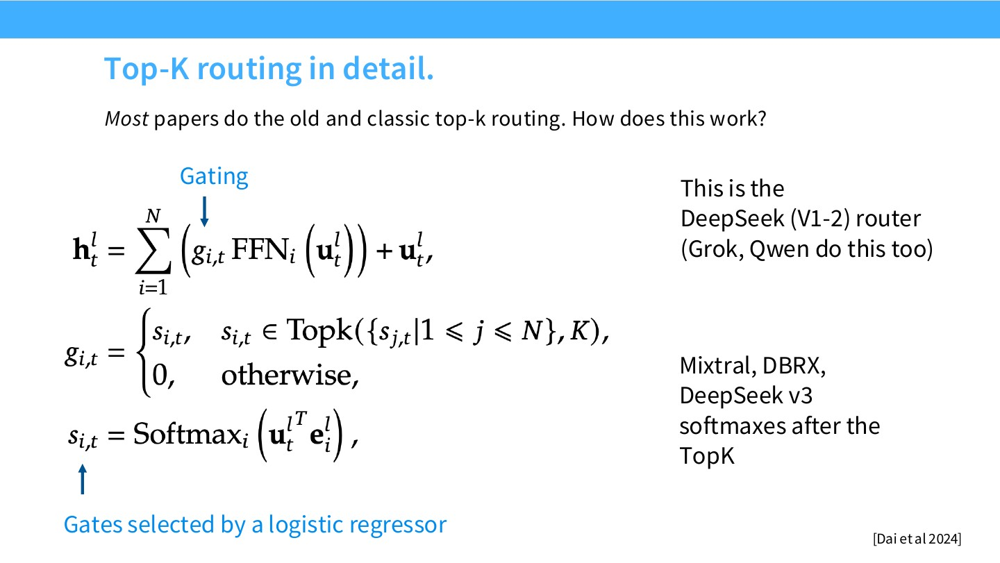

*图：router score、top-k mask 与加权 expert 输出。官方课件第 31 页；视频对应讲解区间：`00:52:57--00:54:20`。*

不同模型的归一化顺序并不完全相同。DeepSeek V1–V2、Grok、Qwen 使用接近图中“softmax 后 top-k”的形式；Mixtral、DBRX、DeepSeek V3 常在 top-k 后对 selected scores 再归一化。不能把两种实现混成同一公式。

#### 容量因子与 expert capacity 的推导

在带容量限制的实现中，每个 expert 一次前向最多处理固定数量的 tokens，这个上限称为 **expert capacity**。它的标准定义为

$$
C=\text{capacity factor}\times\frac{T\cdot K}{N},
$$

- `C`：单个 expert 的容量（最多接收的 token 数）。
- `T`：本批参与路由的 token 总数。
- `K`：每 token 选择的 experts 数。
- `N`：experts 总数。
- `capacity factor`：人为设定的富余系数，常取 1.0–2.0。

推导很简单：整批 tokens 共产生 $T\cdot K$ 次“token→expert”指派；若路由完全均匀，每个 expert 恰好分到 $TK/N$ 次，这就是**理想均衡负载**。capacity factor 在理想值之上留出缓冲：取 1.25 意味着每个 expert 允许接收超出均衡值 25% 的 tokens，再超出的部分被丢弃（dropped）。容量把内存与计算变成可静态分配的量——kernel 可以为每个 expert 预分配 $C\times d$ 的缓冲区，避免动态形状。

但均匀假设在真实数据上不成立。若把 $TK$ 次指派近似为独立均匀随机投球（balls-into-bins），最大负载约为

$$
\frac{TK}{N}+O\!\left(\sqrt{\frac{TK}{N}\log N}\right),
$$

即偏离均衡值的幅度是平方根量级。真实路由的倾斜远比随机严重（语义相似的 tokens 聚集到同一 expert），因此 capacity factor 必须显著大于 1 才能把丢弃率压到可接受水平；而丢弃一旦发生，被丢 token 在该层只剩 residual 通路，等于随机地让部分 tokens 跳过 FFN——这就是第 8.2 节讨论的额外随机性来源。

下面的玩具实现把 top-k 路由与容量截断合在一起，读者可以改变 capacity factor 观察丢弃行为：

```python
import torch

def topk_route_with_capacity(U, E, K=2, capacity_factor=1.25):
    # U: [T, d] token states；E: [d, N] expert router vectors
    T, N = U.shape[0], E.shape[1]
    probs = torch.softmax(U @ E, dim=-1)          # [T, N] 逐 token 归一化
    topv, topi = probs.topk(K, dim=-1)            # 每 token 的 top-K
    gates = torch.zeros_like(probs).scatter(-1, topi, topv)
    capacity = int(capacity_factor * T * K / N)   # 每 expert 容量上限
    kept = torch.zeros_like(gates)
    load = torch.zeros(N, dtype=torch.long)
    dropped = 0
    for t in range(T):                            # 按到达顺序处理
        for i in topi[t].tolist():
            if load[i] < capacity:                # 未满才接收
                kept[t, i] = gates[t, i]
                load[i] += 1
            else:
                dropped += 1                      # 溢出即丢弃
    return kept, load, dropped
```

### 6.3 Fine-grained 与 shared experts

把一个大 expert 切成更多小 expert，可在相近 active parameter budget 下增加组合数；shared experts 则始终激活，用于承接跨 token 的共通知识。组合数的增长相当可观：从 $N$ 个 experts 中选 $K$ 个，可能的激活模式有 $\binom{N}{K}$ 种；把 expert 数从 8 增至 64、每 token 激活数从 2 增至 8，组合数从 $\binom{8}{2}=28$ 增至 $\binom{64}{8}\approx4.4\times10^9$，路由空间的表达能力提升了若干个数量级，而每 token 的计算量近似不变。

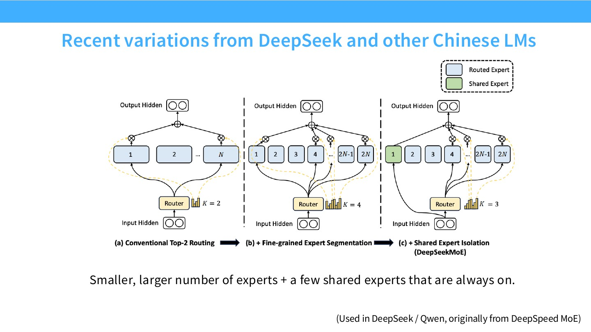

*图：常规 top-2、细粒度分割与 shared-expert isolation。官方课件第 32 页；视频对应讲解区间：`00:54:20--00:55:43`。*

DeepSeek 的 ablation 支持细粒度与 shared expert，但 OLMoE 的受控实验没有复现 shared expert 的稳定收益。这种冲突很重要：shared expert 是合理设计假设，不是已被普遍证明的定律。一个可能的调和解释是：shared expert 的收益取决于 routed experts 是否真的出现了冗余的共通知识——当 routed experts 数量足够多、路由足够分散时，共通知识会自发地分布到各 experts 中，专门的 shared expert 反而成为容量浪费。

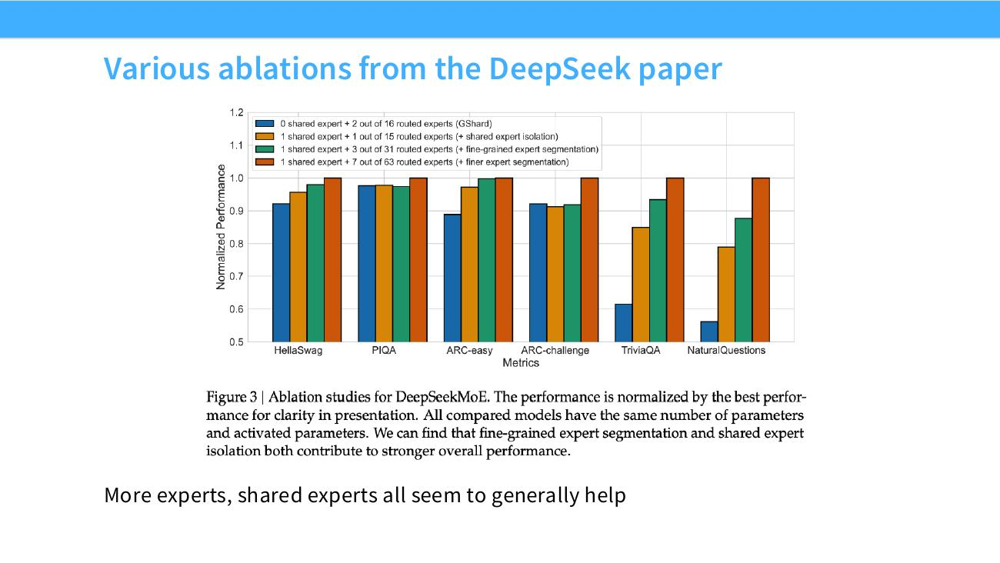

本页（课件第 33 页）是 DeepSeekMoE 论文的 Figure 3：四组配置（GShard 式 0 shared + 2/16 routed；1 shared + 1/15；1 shared + 3/31 细粒度；1 shared + 7/63 更细粒度）在相同总参数与激活参数下比较，性能按最优值归一化。结果显示两个方向的单调收益：细粒度分割（16→31→63 个 routed experts）与 shared expert 隔离都带来提升，且在 TriviaQA、NaturalQuestions 这类知识密集任务上提升最大。这支持"专门化 + 共通知识隔离"的设计假说。

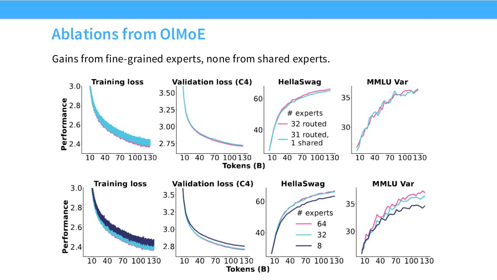

本页（课件第 34 页）是上一页结论的反面对照：OLMoE 的受控实验中，"32 routed" 与 "31 routed + 1 shared" 两条曲线在训练损失、验证损失与下游指标上几乎完全重合——shared expert 没有带来可分辨的收益；而下半部分的 8/32/64 experts 对比则清楚显示细粒度（更多 experts）单调改善。两组实验并存时的正确读法不是"某一方错了"，而是收益依赖于路由空间是否拥挤：expert 数足够多时，共通知识可以自发分布，专门的 shared expert 冗余。

课堂还澄清，shared expert 可复制到多设备以减少通信，但复制会用更多显存换带宽；是否值得取决于拓扑与参数规模。这再次体现了 MoE 设计的一贯模式：每一个架构选择最终都要在显存、带宽、计算三者的汇率表上结算。

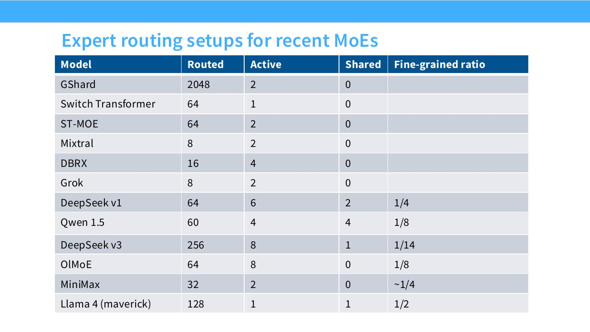

本页（课件第 35 页）把主流模型的路由配置列成一张表：从 GShard 的 2048 routed / top-2、Switch 的 64 / top-1，到 Mixtral 8 / top-2、DBRX 16 / top-4，再到 DeepSeek V1（64/6 + 2 shared，粒度比 1/4）、Qwen1.5（60/4 + 4 shared，1/8）、DeepSeek V3（256/8 + 1 shared，约 1/14）、OLMoE（64/8，1/8）、MiniMax（32/2）与 Llama 4 Maverick（128/1 + 1 shared，1/2）。读表的两个趋势：routed experts 总数与细粒度比总体上升（DeepSeek 系最激进），$k$ 与 shared 的配置则没有收敛共识——这与第 33、34 页消融结论相互冲突的事实完全一致。

### 6.4 专家并不等于人类语义领域

可视化常显示某些 experts 偏好标点、特殊符号、非英语字符或局部 token pattern，但课程没有证据支持“一个医学专家、一个法律专家”这样的整洁分工。expert specialization 更可能是高维、分布式和上下文相关的。这一点的实践含义是：不要指望通过“观察 expert 分工”来理解模型知识组织，也不要基于人类语义先验去设计 expert 结构——路由学到的是对损失函数有利的任意划分，它不需要对人类可解释。

### 本章小结

- Token-choice top-k 以简单、无状态、在线友好成为主流；expert-choice 与全局匹配受因果与延迟约束。
- 路由包含打分、离散选择与加权聚合；softmax 的位置（top-k 前还是 top-k 后）因模型而异，会直接改变 gate 数值。
- Expert capacity $C=\text{CF}\cdot TK/N$ 以理想均衡负载为基准留缓冲；随机倾斜与语义聚集使 CF 必须大于 1，溢出即丢弃。
- Fine-grained/shared experts 是容量设计手段，但经验效果必须以具体 ablation 判断；expert 分工不对应人类语义领域。

## 7. 训练 MoE：探索、均衡与不稳定性

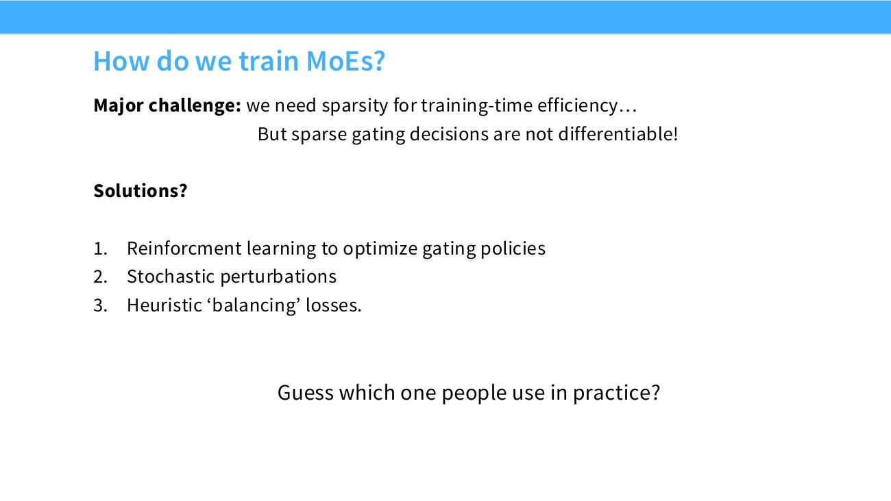

本页（课件第 36 页）提出第 7 节的中心矛盾：训练效率要求稀疏 gating，而稀疏 gating 不可微。课件列出三条候选路线——强化学习优化 gating 策略、随机扰动、启发式 balancing loss——并以"Guess which one people use in practice?"收尾。答案是三者混用但以第三条为主：辅助损失承担主要的均衡职责，噪声负责探索，RL 只在文献中作为对照出现。下面各小节按这个优先级逐一展开。

### 7.1 离散 top-k 怎样得到学习信号

hard top-k 对“未入选的集合变化”不可微：第 $K$ 名与第 $K+1$ 名 experts 之间的微小分数交换是零测集事件，对输出产生的是不连续跳变，梯度不存在。但被选 expert 的 gate 和输出仍可反向传播；soft router probability、噪声与辅助损失又为边界附近提供信号。课程讨论了三类探索手段：

- noisy top-k：给 logits 加可学习尺度的高斯噪声；
- multiplicative jitter：训练时对 logits 乘小幅均匀噪声；
- REINFORCE：理论上直接优化离散策略，但方差和复杂度通常不划算。

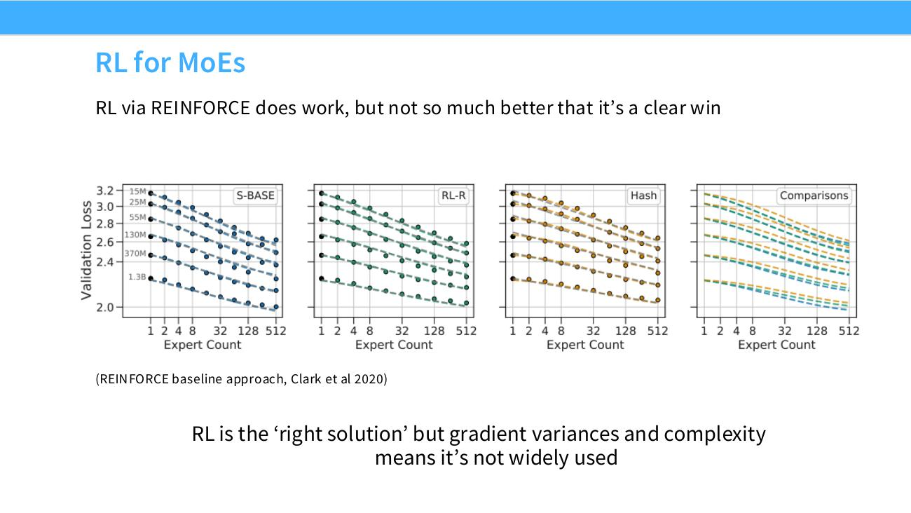

本页（课件第 37 页）引用 Clark et al. 2020 的系统对比：S-BASE（可微基线）、RL-R（REINFORCE 路由）、Hash 三种路由在 15M 到 1.3B 五个尺度、expert 数从 1 到 512 的网格上，验证损失随 expert 数下降的趋势几乎平行——REINFORCE 确实工作，但在任何规模上都没有拉开足以补偿其方差与实现复杂度的差距。课件的结论措辞很精确：RL 是"right solution"，但梯度方差与复杂度使它没有被广泛采用。

以 noisy top-k 为例，其思路是把确定性 logit $z_{i,t}$ 扰动为 $z_{i,t}+\sigma_{i,t}\epsilon$，其中 $\epsilon\sim\mathcal N(0,1)$、$\sigma_{i,t}$ 由可学习参数控制。噪声有两个作用：其一，让分数接近的 experts 都有机会进入 top-k，router 得以观察“换一个 expert 会怎样”，缓解部分反馈；其二，噪声尺度本身可学习，router 可以自主决定哪些边界需要探索、哪些决策已经确定。这与强化学习中的 $\epsilon$-greedy 探索同构，但完全可微。

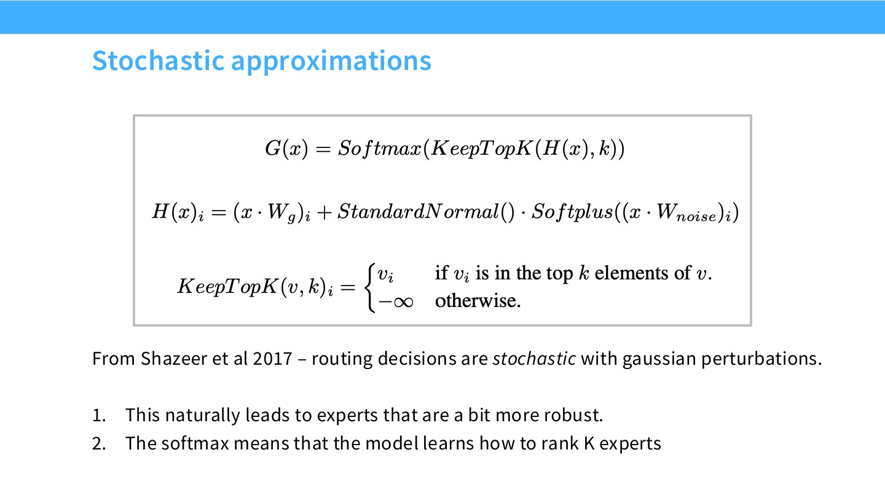

*图：确定性 router logits、噪声尺度与 KeepTopK。官方课件第 38 页；视频对应讲解区间：`01:00:33--01:02:25`。*

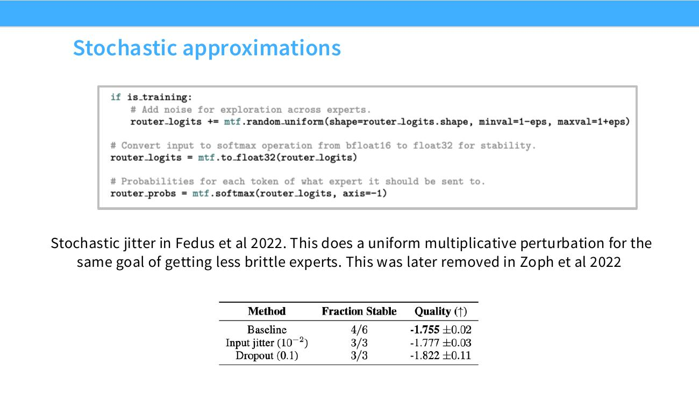

本页（课件第 39 页）展示 Fedus et al. 2022 中的实际代码：训练时对 router logits 乘上 $[1-\epsilon,1+\epsilon]$ 区间的均匀随机数（input jitter），并把 logits 转 float32 再做 softmax——前者是探索，后者是数值稳定，三行代码浓缩了本节两大主题。下方 ST-MoE 的稳定性表显示 input jitter 与 dropout 能把发散率从 2/6 压到 0/3（质量略有代价）；课件同时注明该技巧后来在 Zoph et al. 2022 中被移除，说明这类扰动是"有时有用、需要按配方验证"的工程件，而非普适组件。

REINFORCE 路线把 top-k 选择视为离散策略，用得分函数估计器 $\nabla\log p(a)\cdot r$ 直接优化期望回报。它在理论上最“正确”地处理离散性，但梯度方差随 expert 数与序列长度急剧增长，实践中需要复杂的基线与方差缩减技巧，而这些额外机制的调参成本往往超过其收益——这是“理论干净”输给“工程鲁棒”的又一例证。

### 7.2 Switch balancing loss 的梯度直觉

如果许多 tokens 都选同一 expert，其他设备空闲而热门设备成为瓶颈。Switch loss 把实际 hard load 与 soft probability mass 相乘：

$$
\begin{aligned}
\mathcal L_{\mathrm{bal}}&=\alpha N\sum_{i=1}^{N}f_iP_i,\\
f_i&=\frac1T\sum_{x\in\mathcal B}\mathbf1\{\arg\max_j p_j(x)=i\},\\
P_i&=\frac1T\sum_{x\in\mathcal B}p_i(x).
\end{aligned}
$$

- `L_bal`：负载均衡辅助损失。
- `α`：辅助损失权重。
- `N`：experts 数量。
- `i,j`：expert 索引。
- `T`：batch 中 token 数。
- `𝔅`：token batch。
- `x`：一个 token 表示。
- `p_i(x)`：token `x` 分给 expert `i` 的 router probability。
- `argmax`：选择最大概率 expert。
- `1{·}`：条件成立时为 1 的指示函数。
- `f_i`：实际发送给 expert `i` 的 token 比例。
- `P_i`：expert `i` 得到的平均 probability mass。

为什么是这个形式？先看它的取值范围。$f$ 与 $P$ 都是 expert 维上的分布（各分量非负、和为 1），由柯西不等式，$\sum_i f_iP_i$ 在 $f=P$ 时达到下界的必要条件是两分布对齐；而当 $f=P=\text{均匀分布}$ 时，$\sum_i f_iP_i=N\cdot(1/N)(1/N)=1/N$，损失取最小值 $\alpha$。换言之，这个点积损失在“hard 负载均匀且 soft 质量均匀”时最小，任何一个 expert 过热都会推高损失。

看公式本身不容易直觉化，观察梯度更清楚。$f_i$ 含 argmax 与指示函数，不可微，实践中把它当作常数；于是损失对可微部分 $P_i$ 的梯度为

$$
\frac{\partial\mathcal L_{\mathrm{bal}}}{\partial P_i}=\alpha N f_i,
$$

即某 expert 的 `f_i` 越大，损失对其 probability mass 的正梯度越强；梯度下降会压低热门 expert 的后续分配概率。更细致地，$P_i=\frac1T\sum_x p_i(x)$，所以梯度进一步均摊到每个 token 的 router logit 上：热门 expert 的所有 token 分配概率都被一致下压，直到 $f_i$ 回落。这是一个**负反馈控制器**：hard load 是测量值，soft probability 是执行器，点积形式保证了控制信号与拥挤程度成正比。

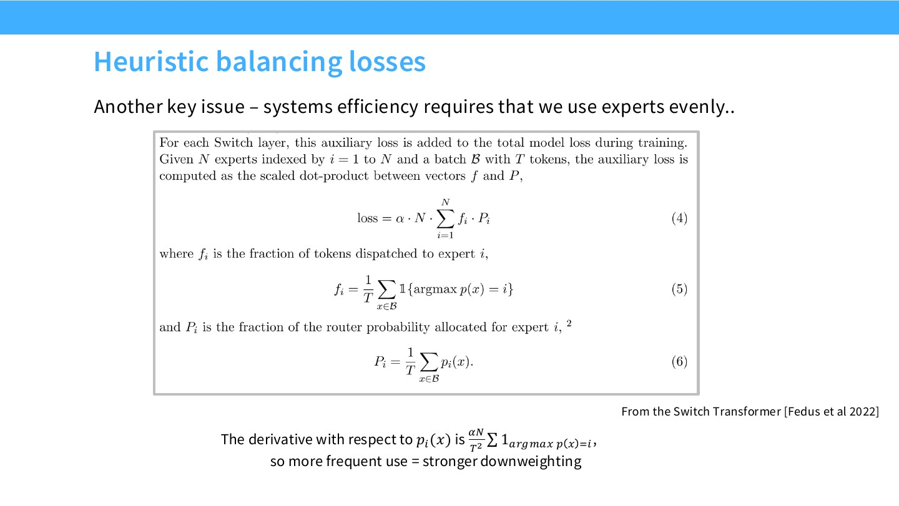

*图：hard load `f_i` 与 soft mass `P_i` 的点积。官方课件第 40 页；视频对应讲解区间：`01:03:13--01:06:00`。*

需要指出这个控制的代价：辅助损失与语言建模损失方向并不一致。强行均衡会让 router 把部分 tokens 送到次优 expert，$\alpha$ 因此是一个“为系统吞吐牺牲多少模型质量”的旋钮；$\alpha$ 过大时模型质量受损，过小时负载倾斜拖垮吞吐。这个张力直接催生了下一节的无辅助损失路线。

### 7.3 Expert balance、device balance 与“aux-loss-free”

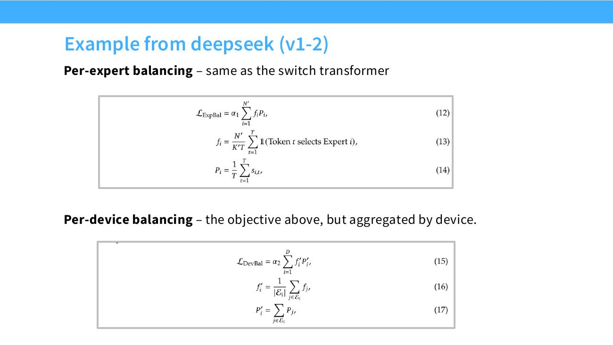

本页（课件第 41 页）给出 DeepSeek V1–V2 的两组均衡公式。上方 per-expert balancing（式 12–14）与 Switch 形式相同，只是 $f_i$ 按 top-$K'$ 选择计数并除以 $K'T$ 归一；下方 per-device balancing（式 15–17）先把各 expert 的 $f_j,P_j$ 按设备集合 $\mathcal E_i$ 聚合为 $f'_i,P'_i$，再在设备维度上做同样的点积。分层的目的很直接：设备内允许多个 experts 保留自由分工（不过度约束模型），只强制设备间的总流量均衡——因为系统瓶颈（all-to-all 完成时间）发生在设备粒度，而非 expert 粒度。

完美均衡每个 expert 可能过度限制模型，所以 DeepSeek V1–V2 还在设备层聚合负载；只要同一设备上的总流量平衡，设备内 experts 可以保留更自由的分工。DeepSeek V3 更进一步，用在线更新的 expert bias 影响 top-k 集合选择：

$$
g'_{i,t}=\begin{cases}
s_{i,t},&s_{i,t}+b_i\in\operatorname{TopK}(\{s_{j,t}+b_j\}_{j=1}^{N_r},K_r),\\
0,&\text{otherwise}.
\end{cases}
$$

- `g'_{i,t}`：token `t` 对 expert `i` 的稀疏 gate。
- `s_{i,t}`：不含 bias 的 router score。
- `b_i`：根据负载在线更新的 expert-selection bias。
- `TopK`：选出最大分数集合的操作。
- `N_r`：routed experts 数。
- `K_r`：每 token 激活的 routed experts 数。shanch
- `i,j`：expert 索引。
- `t`：token 位置。

bias 机制的精妙之处在于**解耦了“选择”与“权重”**：bias $b_i$ 只参与 top-k 集合的排名（过载的 expert 被减分、冷落 expert 被加分），而被选中的 expert 的 gate 仍然使用原始 score $s_{i,t}$。因此均衡压力不直接扭曲 expert 输出的加权系数——这与辅助损失把均衡目标混进主梯度形成对比。$b_i$ 通常按负载观测做符号化更新（overload 则减、underload 则加），是一个不依赖反向传播的在线控制器。

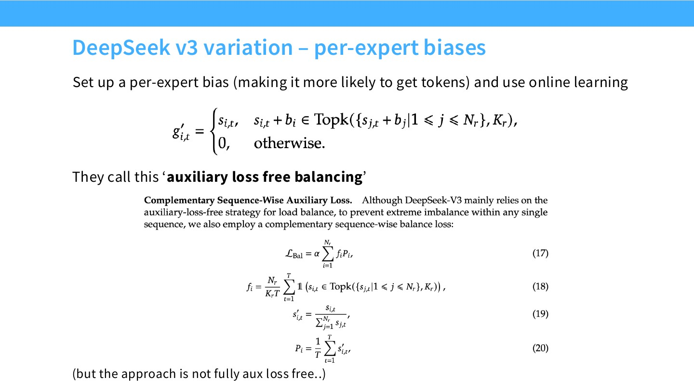

*图：bias 参与集合排名，但 selected gate 仍使用原始 score。官方课件第 42 页；视频对应讲解区间：`01:07:12--01:07:49`。*

因此“aux-loss-free”应谨慎理解：它主要指减少传统全局辅助均衡损失的依赖；同页仍保留 complementary sequence-wise auxiliary protection。把 V3 的方案概括为“完全没有均衡机制”是对设计的误读。

OLMoE 的实验则给出反例：移除 balancing loss 后训练没有立即崩溃，但 expert 使用会明显失衡。这说明均衡是否必要与 router、初始化、规模和训练配方有关。更一般地，均衡机制的必要性随 expert 数量、token 基数与训练时长变化——小模型短期训练可以容忍倾斜，大模型长训则会因倾斜累积而损失容量利用率。

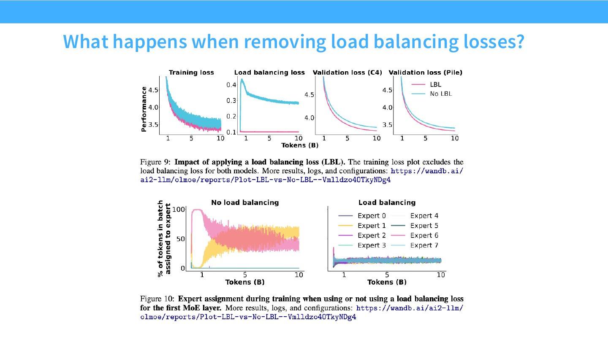

*图：有/无 load balancing 时的 loss 与 expert load。官方课件第 43 页；视频对应讲解区间：`01:07:53--01:09:08`。*

### 本章小结

- top-k 的离散性通过选中路径梯度、soft probability、噪声和辅助目标共同处理；REINFORCE 因方差问题未成主流。
- Switch loss 的本质是按拥挤程度压低热门 expert 的分配概率：$\partial\mathcal L_{\rm bal}/\partial P_i=\alpha N f_i$ 构成负反馈控制。
- “均衡”可以发生在 expert、device、sequence 多个尺度；V3 的 bias 机制解耦选择与权重，其“aux-loss-free”也不是完全没有保护项。
- 均衡强度 $\alpha$ 是质量与吞吐的汇率，其最优值随规模与配方漂移。

## 8. 系统与工程：通信、Sparse Kernels、稳定性、微调和 Upcycling

### 8.1 All-to-all 才是 MoE 的隐藏主循环

MoE 层要把 tokens dispatch 到 expert 所在设备，再将输出 combine 回原位置。它与 data、tensor、pipeline、sequence parallelism 叠加后，形成复杂的通信图。

我们对 all-to-all 通信量做一个一阶估算。设每 token hidden 维度 $d$、每 token 激活 $K$ 个 routed experts、激活值以 $b$ 字节存储，则 dispatch 阶段每个 token 要向 $K$ 个目标设备各发送一份 $d$ 维激活，combine 阶段再收回 $K$ 份输出。每个 token 每个 MoE 层的通信总量为

$$
2\,K\,d\,b\ \text{字节}.
$$

- `K`：每 token 激活的 experts 数。
- `d`：hidden 维度。
- `b`：每元素字节数（BF16 为 2）。
- 系数 2：dispatch 与 combine 两个方向。

代入 DeepSeek V3 风格的数字（$K=8$，$d=7168$，BF16）：每 token 每层约 $2\times8\times7168\times2\approx229$ KB。一个含一百万 tokens 的训练 micro-batch 经过单个 MoE 层就产生约 229 GB 的 all-to-all 流量；模型有数十个 MoE 层、训练有数十万步，通信总量可想而知。对照硬件能力：机内 NVLink 约 900 GB/s，跨机 InfiniBand 每卡约 400 Gb/s（50 GB/s）——**一旦 expert 分布跨机，all-to-all 轻易成为整个训练流水线的瓶颈**，这就是 V2 把通信均衡写进路由目标（第 9.2 节）的直接动机。相比之下，同一 token 在 expert 内的计算只是 $O(Kd\cdot d_{ff})$ 次乘加，现代 GPU 完成这部分计算的时间常常短于等待数据到达的时间。

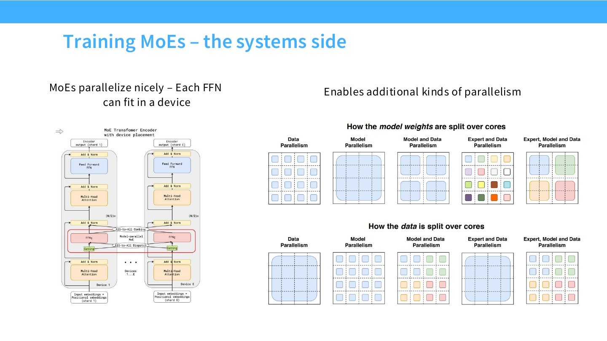

*图：expert parallelism 与其他并行方式的组合。官方课件第 44 页；视频对应讲解区间：`01:11:39--01:12:47`。*

token 按 expert 重排后，矩阵形状不再规则。MegaBlocks 一类实现把小矩阵乘合并成 block-sparse GEMM，减少 padding 与 kernel launch；更现代的 dropless 实现也避免因固定 capacity 直接丢 token。

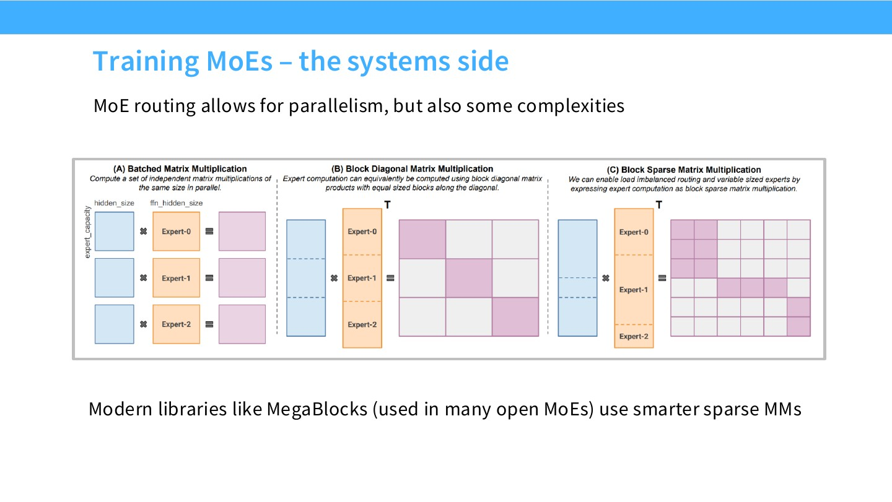

*图：逐 expert 小 GEMM 与 block-sparse 合并。官方课件第 45 页；视频对应讲解区间：`01:12:47--01:13:55`。*

LatentMoE / Nemotron-3 进一步在通信前下投影 activation、到 expert 侧再上投影，以额外计算换更少传输字节：若下投影比率为 $r$，上式中的通信量近似缩减为 $2Kdbr$。这与后面的 DeepSeek MLA 都使用“latent compression”思想，但一个压缩 expert communication，另一个压缩 KV cache，不应混为同一模块。

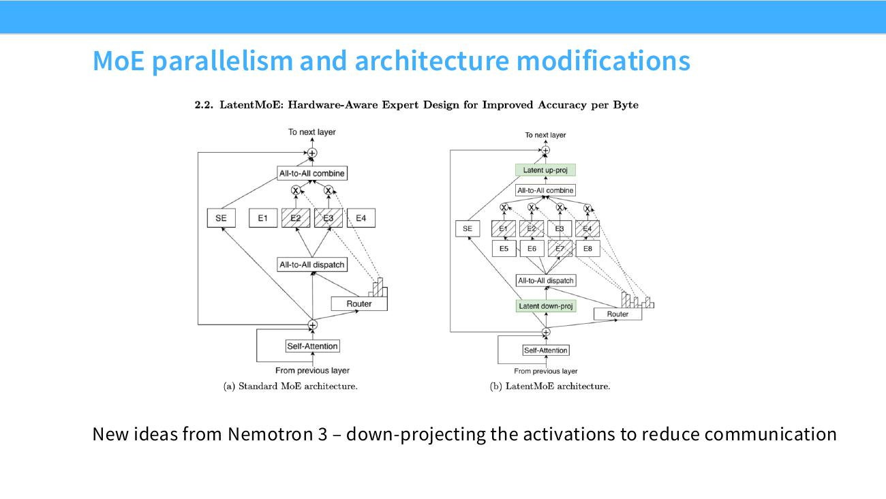

本页（课件第 46 页）给出 Nemotron 3 中 LatentMoE 的结构对比：左图标准 MoE 中，all-to-all dispatch/combine 搬运的是完整 hidden 维度的激活；右图 LatentMoE 在 dispatch 之前先做 latent down-proj、combine 之后再做 latent up-proj，跨设备只搬运低维 latent。activation 字节数直接乘以压缩比，而投影矩阵的计算留在本地——用本地 GEMM 换跨设备带宽，与第 8.1 节的通信量公式逐项对应。

### 8.2 Token dropping 为什么增加随机性

早期 capacity-limited MoE 为每个 expert 设定 batch capacity；溢出的 token 会被丢弃。于是一个 token 是否被执行不仅取决于自身 router，还取决于同 batch 其他 tokens 的选择，带来额外随机性。

从概率的角度看得更清楚：在容量 $C$ 约束下，token $x$ 被 expert $i$ 接收的事件是“$x$ 选择了 $i$”且“$i$ 的排队长度未满”。后者依赖于同 batch 中其他所有选择 $i$ 的 tokens 的数量与顺序。即使 router 完全确定，batch 组成的随机抽样也会让同一 token 在不同 step 遭遇不同的丢弃命运。被丢弃的 token 在该层只有 residual 通路，等于随机跳过 FFN——这向训练注入了一种不受控的、与数据相关的结构噪声，其效果难以预测也难以复现。

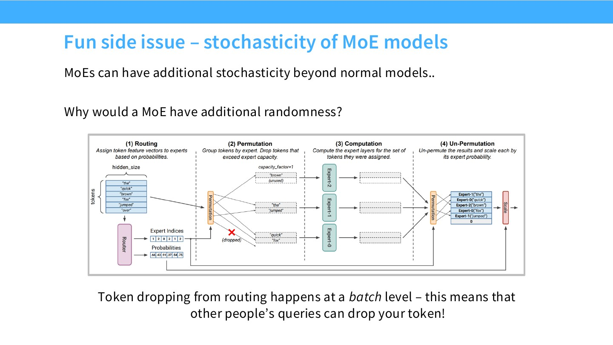

*图：batch composition 可改变某个 token 是否被 expert 接收。官方课件第 47 页；视频对应讲解区间：`01:15:08--01:16:36`。*

> [!WARNING]
> 这种随机性针对带 capacity/drop 的实现；不能推广到所有 MoE。Dropless routing 和更好的 sparse kernels 正是为避免这一问题而发展。评价早期 MoE 论文中“训练不稳定”的结论时，需要先区分不稳定来自架构本身还是来自 dropping 机制。

### 8.3 Router 用更高精度，z-loss 控制 logit 尺度

router softmax 对舍入很敏感，小数值误差可能改变 top-k 集合——第 $K$ 与第 $K+1$ 名的分数差距可能只有 $10^{-3}$ 量级，BF16 的相对舍入误差（约 $2^{-8}\approx0.4\%$）足以翻转排序，而排序翻转意味着一个 token 被送到完全不同的 expert。常见做法是让 expert 计算保持低精度，但 router logits/softmax 使用 FP32，并加入 z-loss 抑制 log-normalizer 过大：

$$
L_z(x)=\frac1B\sum_{i=1}^{B}\left(\log\sum_{j=1}^{N}e^{x_j^{(i)}}\right)^2.
$$

- `L_z`：router z-loss。
- `B`：batch 中 router 样本或 tokens 数。
- `i`：token 索引。
- `N`：experts 数量。
- `j`：expert 索引。
- `x_j^{(i)}`：第 `i` 个 token 对 expert `j` 的 router logit。
- `log Σ exp`：softmax 的 log-normalizer。

为什么惩罚 log-normalizer？softmax 对 logits 的整体平移不变，$\log\sum_j e^{x_j}$ 度量的是 logits 的**绝对量级**而非相对排序。量级过大有两个害处：其一，$\exp$ 在低精度下容易溢出或丢失小项，加剧数值误差；其二，大 logit 意味着 softmax 接近 one-hot，被选 expert 的 gate 梯度趋近于零，router 学习停滞。z-loss 把量级向零拉回，等价于给 router 的输出尺度加了一个软约束。

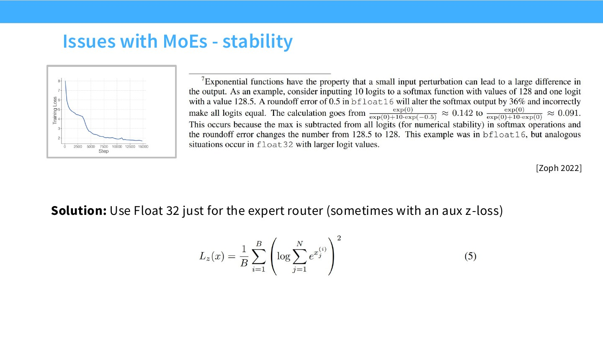

*图：低精度 softmax 敏感性、router FP32 与 z-loss。官方课件第 48 页；视频对应讲解区间：`01:16:36--01:17:58`。*

课程展示的 ablation 表明 z-loss 在部分设置改善稳定性，但它不是所有模型都必需的万能修复；精度、初始化、clipping 与 router 设计要一起看。DeepSeek V3 改用 sigmoid 打分后，每个 affinity 独立压缩到 $(0,1)$，量级失控的问题在结构上就大幅缓解——架构选择可以替代损失补丁，这是数值稳定性设计的一条普遍经验。

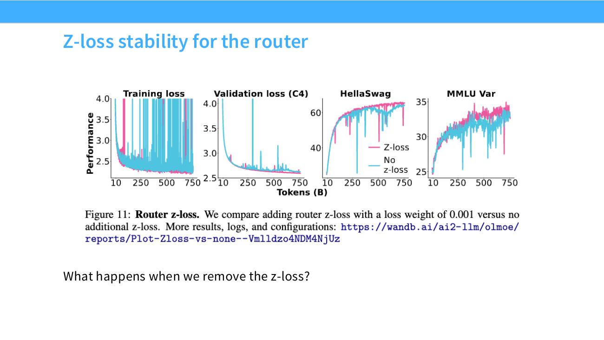

本页（课件第 49 页）是 OLMoE 对 z-loss 的受控检验：不加 z-loss 的训练曲线出现频繁的 loss 尖峰（青色线的垂直毛刺），加 z-loss（品红）后曲线平滑，且 HellaSwag 与 MMLU 终点略优。课件同时给出边界：这是 0.001 权重下的一对一对比，不能推出"z-loss 对所有 MoE 必需"；它与第 48 页的 sigmoid 替代方案共同说明——控制 logit 量级这件事必须有某种机制负责，至于由损失项还是由打分函数负责，是设计自由度。

### 8.4 微调与 Upcycling

MoE 在小规模 fine-tuning 数据上可能收敛，因为预训练已学到 router 与 expert；实践中既可只调非-MoE MLP/共享部分，也可使用全量或大规模 SFT。结论不是“MoE 天生难微调”，而是更容易受数据规模和路由漂移影响。路由漂移指微调数据的路由分布与预训练显著不同：若新数据集中激活少数 experts，其余 experts 的参数在微调中几乎不更新，模型容量被事实性地削减。

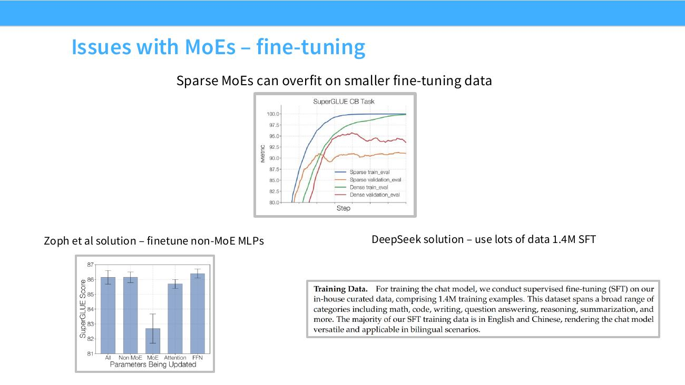

本页（课件第 50 页）汇总微调证据：上方 SuperGLUE CB 曲线显示 sparse 模型在小数据微调时训练/验证 gap 明显大于 dense 对照——容量大、数据少，过拟合来得更快。下方是两种已验证的解法：Zoph et al. 的"冻结 MoE 层、只微调非 MoE MLP"在 SuperGLUE 上几乎追平全量微调（左下柱状图，MoE 一列显著塌陷）；DeepSeek 的解法是直接用 1.4M 样本的大规模 SFT 覆盖路由漂移（右下训练数据说明）。两条路线分别对应"减少可漂移的自由度"与"用数据量压过漂移"，选择取决于手头数据预算。

Upcycling 则把已有 dense checkpoint 的 FFN 复制或拆分成 experts，再继续训练 sparse MoE。它能复用已有表示，但通常仍需数百亿至数千亿 tokens 让 experts 分化，不能理解为零成本扩容。分化的必要性值得强调：刚复制出的 experts 参数完全相同，router 对它们的打分也相同，top-k 在并列分数下的选择近乎随机；只有在继续训练中，随机扰动与数据差异才会打破对称，让各 experts 走向专门化。对称打破需要时间和数据，这就是 upcycling 的隐性账单。

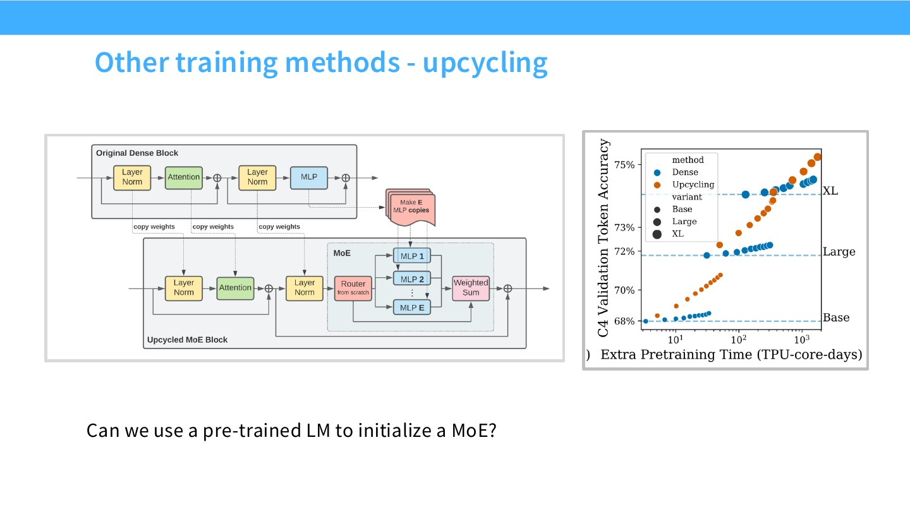

*图：从 dense FFN 初始化多个 experts，以及额外预训练成本。官方课件第 51 页；视频对应讲解区间：`01:19:41--01:20:59`。*

MiniCPM 与 Qwen 的案例说明 upcycling 可以成功；但如果目标从一开始就是超大 MoE，直接稀疏预训练往往更经济，因为无需先完整支付 dense pretraining。Upcycling 的合理定位是**复用沉没成本**：当手头已有一个训练良好的 dense 模型时，它是把既有资产升级到稀疏架构的捷径，而不是新项目的默认起点。

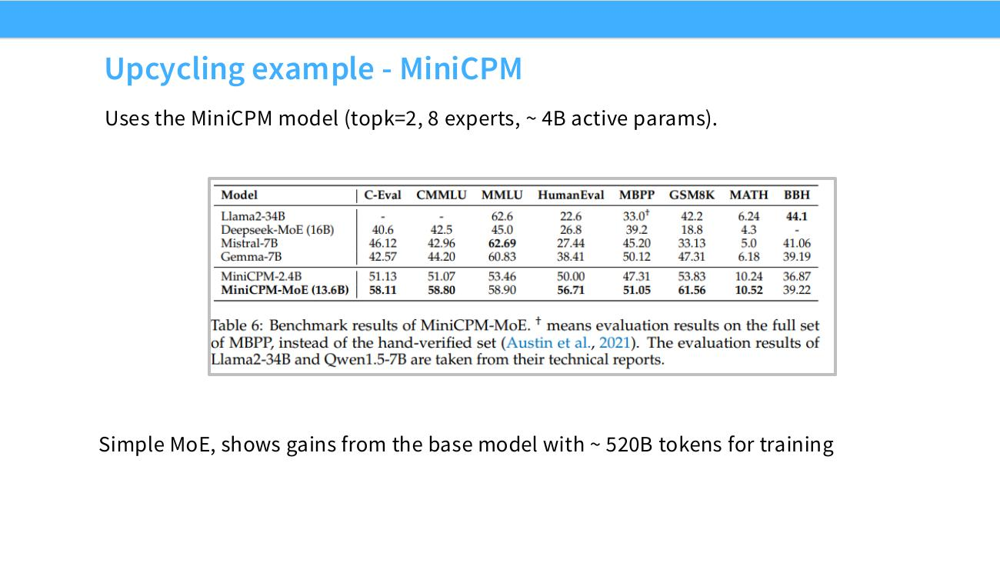

本页（课件第 52 页）是 MiniCPM 的 upcycling 结果：在 MiniCPM-2.4B 基础上以 top-k=2、8 experts 扩展为 13.6B total / 约 4B active 的 MiniCPM-MoE，继续训练约 520B tokens 后，C-Eval、CMMLU、MMLU、HumanEval、GSM8K 等全面超过基座（如 MMLU 53.46→58.90，GSM8K 53.83→61.56），并明显领先同 active 档位的 Dense 模型。注意表中 DeepSeek-MoE 16B 一行：总参数更大但 MMLU 只有 45.0，说明 upcycling 的收益也依赖基座质量与继续训练配方，不是机械复制就有。

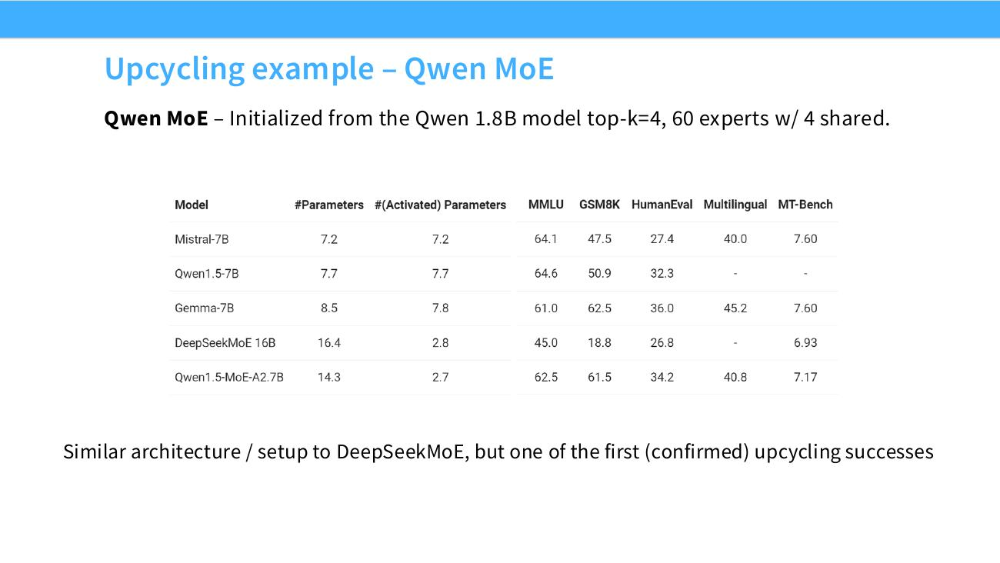

本页（课件第 53 页）是 Qwen 的 upcycling 案例：从 Qwen 1.8B 初始化，top-k=4、60 个 routed experts 加 4 个 shared，得到 14.3B total / 2.7B active。结果表与第 21 页相同——MMLU 62.5、GSM8K 61.5 打平 7B dense 档——课件特别标注这是"最早被确认的 upcycling 成功之一"，且架构设定与 DeepSeekMoE 高度相似，说明这套配方在 2024 年前后已在多个团队独立收敛。

### 本章小结

- MoE 的端到端效率取决于 dispatch/combine、拓扑、稀疏 kernel 和负载，而不只是 expert FLOPs；all-to-all 通信量约为每 token 每层 $2Kdb$ 字节，跨机时轻易成为瓶颈。
- Token dropping 与 router 数值问题都是具体实现造成的风险，可由 dropless kernels、FP32 router 和稳定化损失缓解。
- z-loss 惩罚 log-normalizer 的绝对量级；sigmoid 类打分可从结构上规避同类问题。
- 微调和 upcycling 可行，但都需要额外训练与路由适配，不能当作免费转换。

## 9. DeepSeek V1→V3：模型结构与系统约束共同演化

### 9.1 V1：shared + fine-grained 的现代原型

V1 的课程配置为 16B total / 2.8B active，2 个 shared experts，并使用细粒度 routed experts、标准 top-k、expert/device auxiliary balancing。输出可抽象为：

$$
h'_t=u_t+\sum_{i=1}^{N_s}\operatorname{FFN}^{(s)}_i(u_t)+\sum_{i=1}^{N_r}g_{i,t}\operatorname{FFN}^{(r)}_i(u_t).
$$

- `t`：token 位置。
- `u_t`：进入 MoE FFN 的 hidden state。
- `h'_t`：加入 shared/routed expert 输出后的 hidden state。
- `N_s`：shared experts 数量。
- `N_r`：routed experts 数量。
- `i`：expert 索引。
- `FFN_i^(s)`：始终启用的 shared expert。
- `FFN_i^(r)`：由 router 选择的 routed expert。
- `g_{i,t}`：top-k 后的 expert gate。

这个公式的结构本身就是一份设计宣言：第一项是 residual 主干，第二项是无条件激活的共通知识库，第三项是条件激活的专门化容量。三层分工让“所有 tokens 都需要的能力”与“少数 tokens 才需要的能力”在参数层面物理隔离，router 只需负责后者的选择问题。

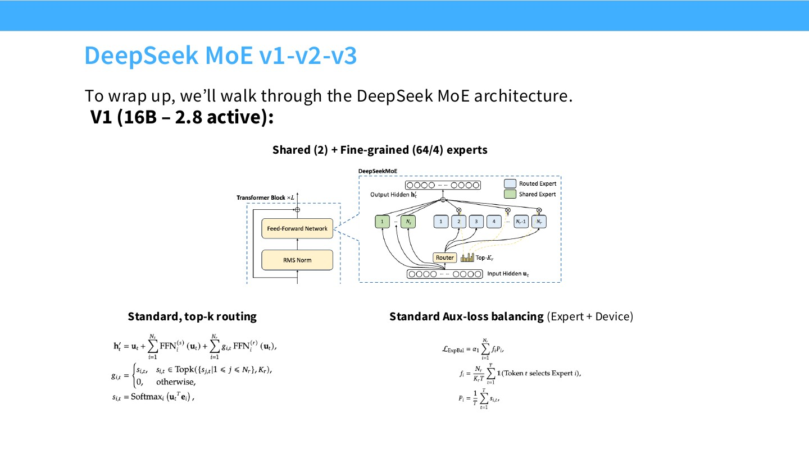

*图：V1 的 shared/routed experts、标准 top-k 与均衡目标。官方课件第 54 页；视频对应讲解区间：`01:22:33--01:22:55`。*

### 9.2 V2：把通信写进路由目标

V2 的课程配置为 236B total / 21B active。它引入 top-M device routing：先限制 token 访问的设备集合，再从这些设备上的 experts 中选择；communication balancing 同时约束通信流入和流出。

top-M device routing 的效果可以用第 8.1 节的通信模型量化：若 experts 分布在 $G$ 台设备上，无约束 top-k 路由下每个 token 最坏要与 $K$ 台不同设备通信；先选 $M$ 台设备再在其中选 $K$ 个 experts，则每 token 的通信对端数被压到 $\min(M,K)$ 以内，跨机流量与连接数同步下降。communication balancing 再进一步：不只均衡每台设备接收的 token 数（流入），还均衡每台设备发出的 token 数（流出），因为 all-to-all 的完成时间由最慢的一条边决定。

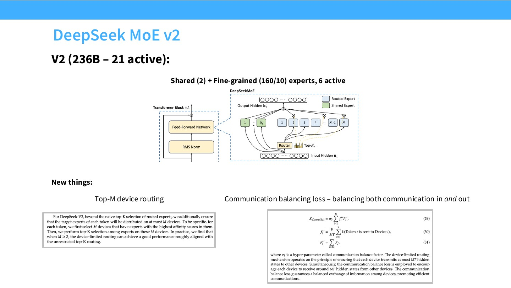

*图：V2 的 top-M device routing 与 communication balancing。官方课件第 55 页；视频对应讲解区间：`01:22:55--01:23:25`。*

这里的关键原则是“respect your systems”：架构目标函数不仅优化语言建模 loss，也要反映设备拓扑和通信代价。V2 标志着 MoE 设计从“统计模型 + 事后系统工程”转向“统计目标与系统约束联合优化”。

### 9.3 V3：解耦 affinity、集合选择和权重归一化

V3 的课程配置为 671B total / 37B active、1 个 shared expert、每 token 激活 8 个 routed experts。router 不是对所有 experts 做一次 softmax，而是 sigmoid 独立打分、top-k 选集合，再只在 selected scores 间归一化：

$$
\begin{aligned}
s_{i,t}&=\operatorname{Sigmoid}(u_t^\top e_i),\\
g'_{i,t}&=\begin{cases}s_{i,t},&i\in\operatorname{TopK}(\{s_{j,t}\}_{j=1}^{N_r},K_r),\\0,&\text{otherwise},\end{cases}\\
g_{i,t}&=\frac{g'_{i,t}}{\sum_{j=1}^{N_r}g'_{j,t}}.
\end{aligned}
$$

- `t`：token 位置。
- `i,j`：expert 索引。
- `u_t`：token hidden state。
- `e_i`：expert `i` 的 router vector。
- `s_{i,t}`：sigmoid affinity，尚未跨 experts 归一化。
- `Sigmoid`：独立压缩每个 affinity 的函数。
- `TopK`：选择最大 `K_r` 个分数的操作。
- `N_r`：routed experts 总数。
- `K_r`：激活 routed experts 数量。
- `g'_{i,t}`：top-k mask 后的 score。
- `g_{i,t}`：只在 selected experts 间归一化的权重。

三步各自承担独立的职责，这正是“解耦”的含义。第一步，sigmoid 让每个 expert 的 affinity 独立落在 $(0,1)$，不再像 softmax 那样互相竞争一单位概率质量——expert 数增加不会稀释已有 experts 的分数。第二步，top-k 只负责**选集合**，此阶段可以引入第 7.3 节的 bias 做负载控制而不污染权重。第三步，归一化只在被选集合内部进行，保证每 token 的 expert 权重之和恰为 1，输出幅度与 dense FFN 可比。与 6.2 节“softmax 后 top-k 不再归一化”的老式写法相比，V3 版把选择压力、权重尺度、均衡控制分别交给了三个可独立调节的环节。

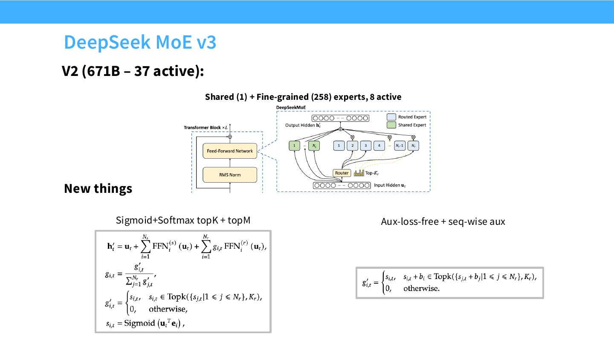

*图：V3 的 sigmoid score、top-k、selected normalization 与 seq-wise protection。官方课件第 56 页；视频对应讲解区间：`01:23:25--01:23:50`。*

> [!WARNING]
> 官方课件第 56 页标题为 V3，但参数行误写 V2；expert 总数又与课程前面的配置表不一致。这里保留讲者明确给出的 total/active/active-expert 口径，不静默补写有冲突的 expert 总数。引用 V3 路由配置时应以 DeepSeek 官方技术报告为准。

### 9.4 三代变化的主线

| 版本 | 路由/结构重点 | 系统意识 |
|---|---|---|
| V1 | shared + fine-grained experts；标准 top-k | expert/device auxiliary balance |
| V2 | top-M device routing | communication in/out balance |
| V3 | sigmoid affinity、selected normalization、online expert bias | 减少全局 aux 干扰，同时保留 sequence-wise protection |

三代不是反复推倒重来，而是在相似 sparse FFN 骨架上逐步重新安排 routing、balancing 与 communication 的耦合关系。V1 解决“稀疏激活的表达能力”，V2 解决“稀疏激活的通信代价”，V3 解决“均衡机制对主任务的干扰”——每一代都把上一代的辅助机制从损失函数里剥离一层，用更结构化的设计替代。

### 本章小结

- V1 建立 shared + fine-grained + top-k 的现代 MoE 原型，把共通知识与专门知识在参数层面隔离。
- V2 把设备选择和通信平衡纳入模型设计，路由目标开始反映硬件拓扑。
- V3 将 affinity、top-k 集合与 selected weights 拆开，并用在线 bias 辅助均衡；课件该页的版本标注与参数行存在冲突，需以官方报告为准。

## 10. DeepSeek V3 的两个补充组件：MLA 与 MTP

### 10.1 MLA：缓存低维 latent，而不是完整 KV

Multi-head Latent Attention（MLA）先把 hidden state 压到低维 latent，再从 latent 恢复 content Q/K/V。推理时主要缓存 `c_t^{KV}`，因此 KV cache 显著缩小：

$$
\begin{aligned}
c_t^{KV}&=W^{DKV}h_t,&k_t^C&=W^{UK}c_t^{KV},&v_t^C&=W^{UV}c_t^{KV},\\
c_t^Q&=W^{DQ}h_t,&q_t^C&=W^{UQ}c_t^Q.
\end{aligned}
$$

- `t`：token 位置。
- `h_t`：输入 hidden state。
- `c_t^(KV)`：低维 KV latent，推理时缓存。
- `c_t^Q`：低维 query latent，主要降低训练内存。
- `W^(DKV)`：KV down-projection。
- `W^(DQ)`：query down-projection。
- `W^(UK)`：key up-projection。
- `W^(UV)`：value up-projection。
- `W^(UQ)`：query up-projection。
- `k_t^C`：恢复出的 content key。
- `v_t^C`：恢复出的 content value。
- `q_t^C`：恢复出的 content query。

理解 MLA 的关键是认清**信息瓶颈的位置**：所有 heads 的 K 与 V 都从同一个低维向量 $c_t^{KV}$ 恢复，因此这个 latent 是历史 token 对 attention 可见信息的全部载体。推理时只需缓存它（外加少量 RoPE 维度，见下文），而不必缓存恢复后的高维 K/V——up-projection 可以在读取时实时重算，用计算换显存。

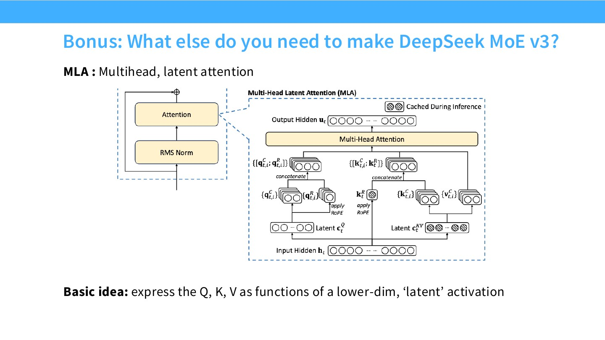

*图：MLA 从低维 latent 生成 Q/K/V，并标出推理时缓存位置。官方课件第 57 页；视频对应讲解区间：`01:23:50--01:24:42`。*

#### 缓存收益的定量推导：MHA / GQA / MLA 每 token 字节数对比

我们把三种架构的**每 token、每层** KV cache 字节数逐项算出（均按 BF16/FP16，2 字节/元素）：

- **MHA**（标准多头）：每层缓存所有 heads 的 K 与 V，共 $2\,H\,d_h$ 个元素，即 $4\,H\,d_h$ 字节。取 $H=128$、$d_h=128$（DeepSeek V3 的 head 配置），得 $4\times128\times128=65536$ 字节 $=64$ KB。
- **GQA**（分组查询）：$H_{kv}$ 个 KV heads 被多个 query heads 共享，缓存 $2\,H_{kv}\,d_h$ 个元素。取 $H_{kv}=8$，得 $4\times8\times128=4096$ 字节 $=4$ KB，是 MHA 的 1/16。
- **MLA**：缓存 latent $c_t^{KV}$（维度 $d_c=512$）加 RoPE 专用 key 维度（$d_r=64$），共 $(512+64)\times2=1152$ 字节 $\approx1.1$ KB，约为 MHA 的 1/57、GQA 的 1/3.6。

乘以层数即得全模型每 token 缓存。以 V3 的 61 层估算：MHA 需约 3.9 MB/token，MLA 只需约 69 KB/token——一百万 tokens 的上下文，KV cache 从约 3.9 TB 降到约 69 GB，从“必须多机分摊”降到“单节点可放”。下面的代码段把这个 shape 对比固化下来：

```python
# 每 token、每层 KV cache 字节数对比（BF16，2 字节/元素）
H, d_head = 128, 128      # query heads 数与 head 维度
H_kv = 8                  # GQA 的 KV heads 数
d_c, d_rope = 512, 64     # MLA latent 维度与 RoPE key 维度
B = 2                     # 字节/元素

mha = 2 * H * d_head * B        # K 和 V 各 H*d_head 个元素
gqa = 2 * H_kv * d_head * B     # 只缓存共享的 KV heads
mla = (d_c + d_rope) * B        # latent + RoPE 专用维度
print(mha, gqa, mla)            # 65536 / 4096 / 1152 字节
print(mha / mla, gqa / mla)     # ≈56.9 / ≈3.6 倍压缩
```

值得指出 MLA 与 GQA 的本质差异：GQA 是**共享**（多个 query heads 读同一份 KV），信息容量没有压缩通道；MLA 是**压缩**（全部信息挤进 512 维 latent，再按 head 分别上投影），latent 维度是硬信息瓶颈。MLA 用更少的缓存字节承载了与 MHA 同量级的能力，靠的是把跨 head 的冗余表示显式低秩化——这要求训练目标学会把历史信息编码进瓶颈，是 MLA 需要从头训练而非后验改造的原因。

不带位置旋转时，key up-projection 可以吸收到 query 侧；带 RoPE 后，位置相关旋转夹在矩阵之间，无法预先合并：

$$
\begin{aligned}
\langle Q,K\rangle&=\langle hW^Q,W^{UK}c_t^{KV}\rangle=\langle hW^QW^{UK},c_t^{KV}\rangle,\\
\langle QR_q,R_kK\rangle&=\langle hW^QR_q,R_kW^{UK}c_t^{KV}\rangle=\langle hW^QR_qR_kW^{UK},c_t^{KV}\rangle.
\end{aligned}
$$

- `Q,K`：未压缩表述下的 query 与 key。
- `h`：query 侧 hidden state。
- `W^Q`：query projection。
- `W^(UK)`：latent key up-projection。
- `c_t^(KV)`：位置 `t` 的 KV latent。
- `R_q`：query 位置对应的 RoPE 旋转矩阵。
- `R_k`：key 位置对应的 RoPE 旋转矩阵。
- `⟨·,·⟩`：attention 内积。

两行对比揭示了问题所在。无 RoPE 时，$W^QW^{UK}$ 可以离线合并成一个矩阵，推理时直接用 latent 与合并后的 query 侧矩阵做内积，up-projection 完全省去。有 RoPE 时，旋转矩阵 $R_qR_k$ 取决于 query 与 key 的**相对位置**，每一对 $(q,k)$ 对应不同的中间矩阵 $W^QR_qR_kW^{UK}$，无法离线合并——若逐对计算则退化为 $O(n)$ 次矩阵乘，缓存优化的收益被计算开销吃光。

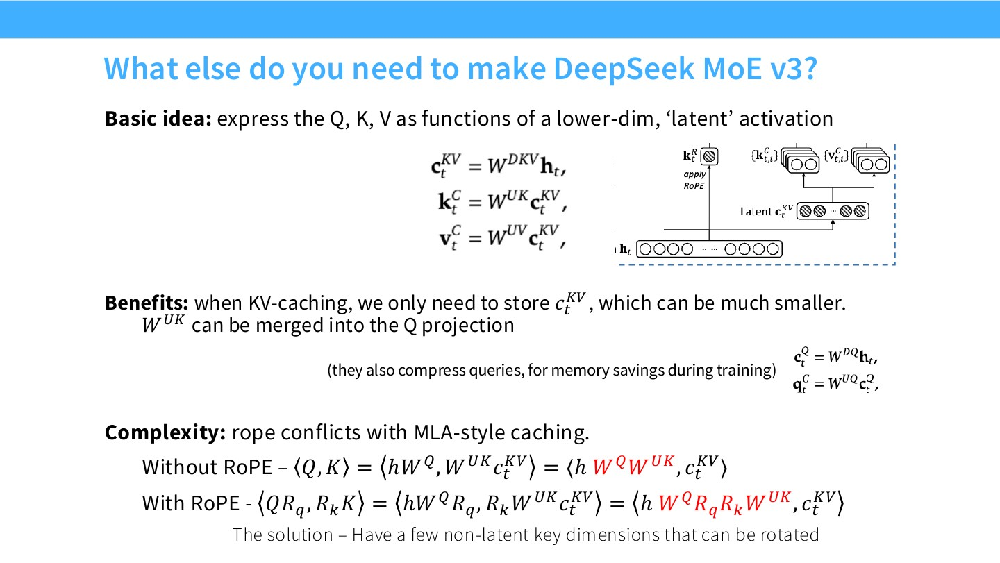

*图：无 RoPE 时可合并 projection，加入位置旋转后不再成立。官方课件第 58 页；视频对应讲解区间：`01:24:42--01:25:05`。*

课件给出的直觉性解法是保留少量 non-latent key dimensions 专门承载 RoPE，content 部分继续使用 latent cache。这就是上表缓存字节数中“+64 维”的来源：位置信息走显式小通道，内容信息走低秩大通道，两者拼接构成完整 key。讲者没有展开完整多头实现，因此这里也不超出课程范围补全论文细节；对完整设计（包括 query 侧压缩与吸收实现）感兴趣的读者应查阅 DeepSeek-V2 技术报告。

### 10.2 MTP：让模型同时学习更远的 token

Multi-Token Prediction（MTP）用轻量模块把上一预测深度的 hidden representation 与未来偏移 token embedding 合并，再预测更远 token：

$$
\begin{aligned}
h_i^k&=M_k\!\left[\operatorname{RMSNorm}(h_i^{k-1});\operatorname{RMSNorm}(\operatorname{Emb}(t_{i+k}))\right],\\
h_{1:T-k}^{\prime k}&=\operatorname{TRM}_k(h_{1:T-k}^k),\qquad
p_{i+k+1}^k=\operatorname{OutHead}(h_i^{\prime k}).
\end{aligned}
$$

- `i`：序列位置。
- `k`：MTP module 或预测深度索引。
- `t_{i+k}`：偏移到未来位置的 token。
- `Emb`：token embedding 函数。
- `h_i^(k-1)`：上一预测深度的 hidden representation。
- `M_k`：拼接两个 RMSNorm 表示后的 projection module。
- `RMSNorm`：均方根归一化。
- `T`：序列长度。
- `1:T-k`：从位置 1 到 `T-k` 的序列切片。
- `TRM_k`：第 `k` 个轻量 Transformer block。
- `h'`：经轻量 Transformer 更新后的表示。
- `OutHead`：输出 token distribution 的 head。
- `p_(i+k+1)^k`：第 `k` 个模块对更远 token 的预测分布。
- 分号 `;`：向量拼接。

注意模块之间的链式结构：第 $k$ 个模块接收第 $k-1$ 个模块的表示与**已知的未来 token** $t_{i+k}$ 的 embedding，预测 $t_{i+k+1}$。训练时未来 token 来自 ground truth（teacher forcing），因此整个链条可以并行计算；这与推理时的逐 token 猜测不同，训练成本只增加少量轻量模块的前反向开销。

#### 梯度信号分析

MTP 的训练目标可写成各深度损失的加权和 $\mathcal L=\sum_k\lambda_k\mathcal L_k$，其中 $\mathcal L_k$ 是第 $k$ 个模块对 $t_{i+k+1}$ 的交叉熵。从梯度传播的角度看它带来三重信号：

1. **更密的监督**：标准 next-token 目标中，位置 $i$ 的表示只被要求编码预测 $t_{i+1}$ 所需的信息；MTP 要求同一主干表示同时支持对 $t_{i+2},t_{i+3},\dots$ 的预测，迫使表示编码更长程的可预测结构（如句法走向、语义规划），而不是只够“下一个词”的局部线索。
2. **更短的梯度路径**：第 $k$ 个模块的损失经由 $h_i^{k-1}$ 回传到主干，路径长度与深度无关——深度 $k$ 的监督信号不需要穿过 $k$ 倍的主干层数。这等价于给主干加了多个不同“预测视野”的辅助头，缓解长程依赖中信用分配被稀释的问题。
3. **表示的解耦压力**：$M_k$ 把主干表示与具体 token embedding 融合，意味着主干不必在表示中逐字保存未来 token 的身份（那由 $\operatorname{Emb}(t_{i+k})$ 显式提供），而只需保存抽象的上下文状态。这种分工降低了主干的表示负担。

代价与边界同样需要说清：每个额外深度都增加训练 FLOPs 与内存（虽然模块轻量）；深度过大时远期预测本身接近不可学（语言的条件熵随视野增长），边际收益递减。DeepSeek V3 因此只用**一个**额外预测深度，在信号增益与开销之间取保守折中。

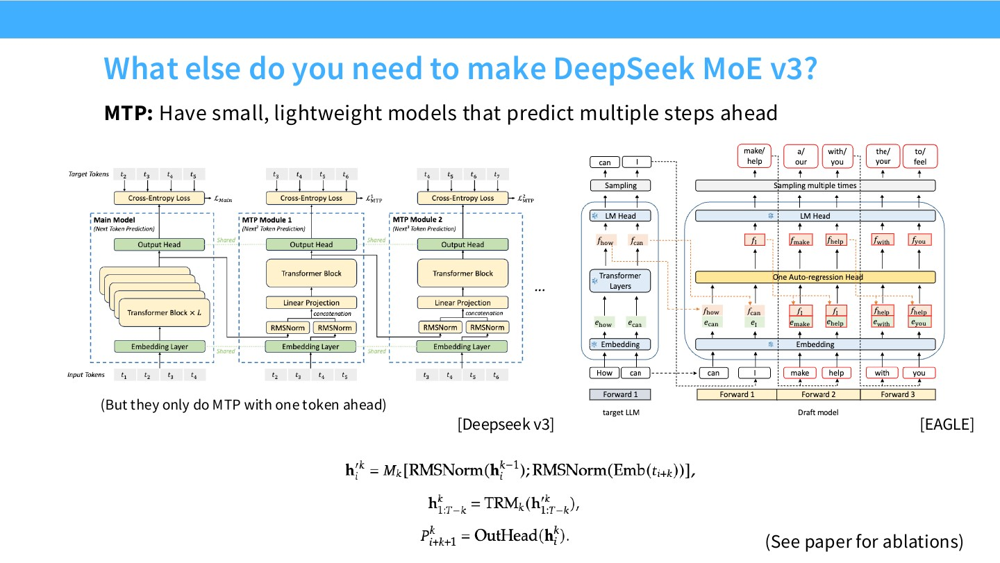

*图：DeepSeek MTP、EAGLE 对照与多步预测模块。官方课件第 59 页；视频对应讲解区间：`01:25:05--01:25:41`。*

MTP 有两种动机：额外未来目标迫使共享表示捕捉更长程的可预测结构；推理时多个候选又可作为内置 speculative decoding 草稿。课件的“only do MTP with one token ahead”更可能指只使用一个额外预测深度，不能据此断言它退化成普通 next-token prediction。与 EAGLE 等外置草稿模型方案相比，MTP 的草稿能力与主模型共享训练与表示，省去了单独训练和维护草稿模型的成本，但草稿的预测视野也受限于训练时使用的深度。

### 本章小结

- MLA 用低维 KV latent 降低 cache：每 token 每层约 1.1 KB，对 MHA 约 57 倍、对 GQA 约 3.6 倍压缩；但必须专门处理 RoPE 破坏 projection 合并的问题，代价是保留 64 维显式位置通道。
- MTP 既提供更远期训练监督（更密监督、更短梯度路径、表示解耦），也可能为 speculative decoding 提供候选；V3 只采用一个额外深度。
- 两者说明架构优化往往同时面向统计效率与推理系统，而不是只改一个 layer 名称。

## 总结与延伸

### 讲者的结尾结论

在 `01:25:42--01:26:14`，讲者用三点收束 MoE：

1. 稀疏性允许模型拥有远多于每个 token 实际计算量所对应的参数；
2. 离散 top-k routing 很难优化，但简单启发式方法已经足够有效；
3. 现有大量经验结果表明 MoE 具有成本效益，短期内不会退出主流架构。

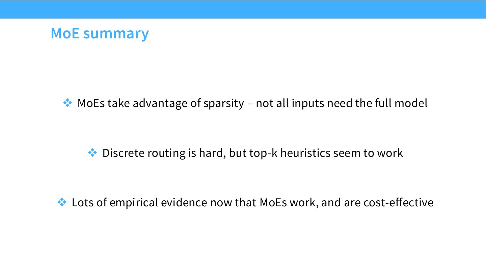

*图：稀疏激活、top-k 路由与经验有效性三条结论。官方课件第 60 页；视频对应讲解区间：`01:25:43--01:26:14`。*

### 统一视角：对历史与参数做条件访问

把整节课压缩成一张概念地图，可以看到两个对偶问题：

| 设计对象 | 稠密基线 | 条件计算方案 | 新增代价 |
|---|---|---|---|
| 历史信息 | 每个 query 读取全部 tokens | 线性状态、SSM/GDN、混合层、DSA top-k | 状态容量、索引、质量损失 |
| 参数容量 | 每个 token 激活完整 FFN | MoE top-k experts | 路由、均衡、all-to-all、稀疏 kernel |

这两条线共享同一工程规律：**删掉的计算并不会免费消失，而会以选择器、状态、通信或优化难度的形式回来。** 因此评估新架构至少要同时报告：模型质量、active compute、total parameters、内存、通信、吞吐、延迟和训练稳定性。只报告其中一两项（例如只报告 active FLOPs 或只报告 loss），必然高估条件计算的收益。

### 可迁移的设计原则

- **先定位真正昂贵的轴**：长序列的瓶颈可能是 attention matrix，也可能是 KV cache 或带宽；MoE 的瓶颈可能是通信而非 FLOPs。优化错误的轴等于白付代价。
- **让便宜的选择器负责缩小昂贵操作的作用域**：DSA 的 indexer 与 MoE router 是同一类模式——选择器本身必须是轻量的，且选择错误要么可逆、要么代价可控。
- **训练与推理可以使用等价但不同形态**：linear attention 的 parallel/recurrent duality 是最清楚的例子；MLA 的矩阵吸收是同一思想在投影层面的应用。
- **统计模型必须尊重硬件拓扑**：V2 的 device routing、communication balance 和 block-sparse kernels 都把系统约束写进架构，而不是留给事后工程。
- **解耦优于混合**：V3 把 affinity、集合选择、权重归一化、均衡控制拆成四个独立环节；GDN 把保留、擦除、写入拆成三个独立门。可独立调节的机制才可在失败后单独修复。
- **不把单篇 ablation 当普适定律**：shared experts、balancing loss、z-loss 和混合比例都存在模型依赖的反例；每个经验结论都要标注其适用范围。

### 开放问题与下一步

1. 能否把 DSA 的检索、外部 memory 和 context management 统一成端到端可训练的读取策略？
2. 固定状态模型怎样扩大可寻址容量，同时保留 linear-time recurrent inference？
3. MoE router 能否在不依赖强辅助损失的情况下兼顾 specialization、稳定性和拓扑感知？
4. 在统一硬件和数据预算下，hybrid attention、DSA 与纯 SSM 的高质量受控比较仍然不足。
5. MLA、MTP 与 speculative decoding 的组合，是否能让大 MoE 的 memory、compute 和 latency 同时受益？

### 本章小结

- Attention alternatives 稀疏化“读哪些历史”，MoE 稀疏化“用哪些参数”；两者在 conditional computation 的统一框架下互为镜像。
- 真正成功的架构需要算法、优化、精度、kernel 与分布式系统协同设计；任何单一指标的胜利都可能是成本转嫁的假象。
- 本讲最值得带走的不是某个固定配方，而是 capacity、active compute 与 information access 可以被分别设计——以及设计它们时必须逐项记账的习惯。
