# Stanford CS336 2026 Lecture 5：GPUs, TPUs


- **视频标题**：Stanford CS336 Language Modeling from Scratch | Spring 2026 | Lecture 5: GPUs, TPUs
- **主讲 / 频道**：Tatsunori Hashimoto / Stanford Online
- **视频链接**：<https://www.youtube.com/watch?v=izZba4UA7iY>
- **时长**：01:18:39
- **材料范围**：人工英文字幕、1080p 课程视频与官方 `lecture_05.pdf`
- **学习目标**：从执行模型、存储层级与 Roofline 出发，独立解释低精度、算子融合、重计算、合并访存、tiling、wave quantization 与 FlashAttention 为什么有效

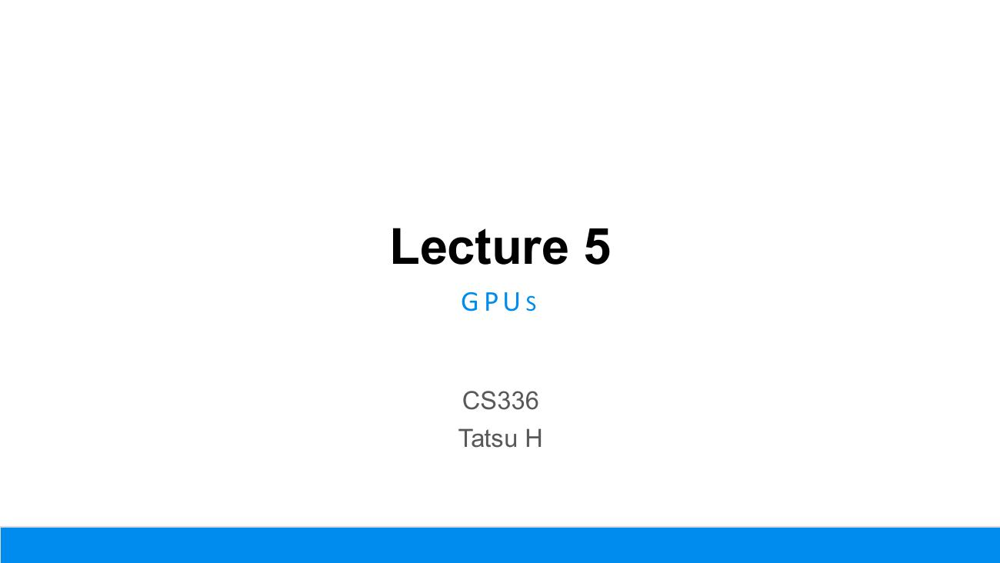

课件首页点明本讲主角是 GPU。值得注意的是标题只有"GPUs"而没有"TPUs"——TPU 在本讲中只作为对照支线（side thread）出现，因为二者的顶层抽象高度相似：理解了 GPU 的执行与存储模型，TPU 只需一次概念映射。本讲其余各页将沿"部件 → 性能模型 → 算法"的路线逐层展开。

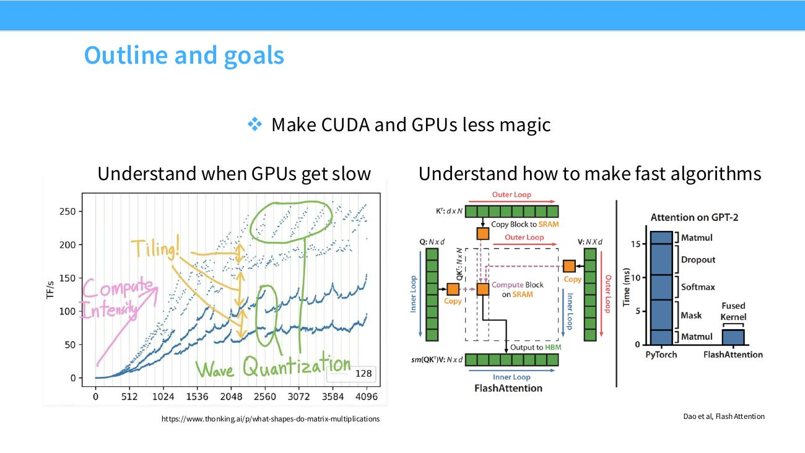

本页给出两个学习目标，并预支了全讲的首尾呼应：左栏"理解 GPU 何时变慢"配的是 thonking.ai 上矩阵乘 shape 与吞吐关系的文章（即第 6.4 节"矩阵尺寸之谜"的素材来源），右栏"如何设计快速算法"配的是 Dao 等人的 FlashAttention 论文（即第 7 节的主角）。讲者在第一页就告诉读者：本讲从"诊断"出发，以"综合治疗"收尾。


讲者明确列出本讲素材的知识来源：Horace He 的博客（fusion 与重计算部分的工厂类比即出于此）、CUDA Mode 社区、TPU/GPU 系统书籍（jax-ml 的 scaling book），另有 nichijou.co、Jonathan Hui 等硬件科普来源。这一页的意义在于：本讲内容并非教科书式定论，而是工程社区一线经验的整理，读者可沿这些链接获得更深入的原始材料。

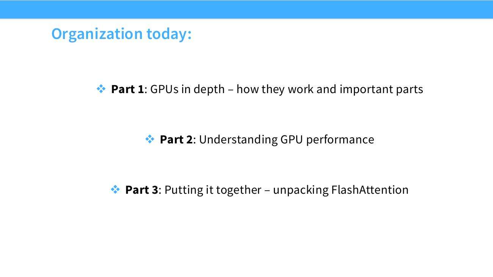

本页给出三段式结构：第一部分深入 GPU 的工作方式与关键部件（对应本讲义第 2 节），第二部分理解 GPU 性能（对应第 3–6 节的 Roofline 与六类优化），第三部分把一切组合起来拆解 FlashAttention（对应第 7 节）。这个"部件 → 模型 → 算法"的递进正是本讲义的章节骨架。

> [!IMPORTANT]
> 本讲的统一问题不是“GPU 有多少个核心”，而是：**怎样让昂贵的计算单元持续吃到数据？** 语言模型的大部分优化最终都在回答三个问题——数据现在位于哪一级存储、移动多少次、移动后能被复用多少次。

在阅读本讲之前，我们建议读者先建立一个贯穿全讲的思维框架：任何一个 kernel 的执行时间都可以分解为"算"与"搬"两部分，而工程优化的本质，就是在给定硬件约束下重新安排计算顺序、数值精度与数据布局，使"搬"的代价最小化、"搬进来的数据"被复用的次数最大化。本讲的每一节——从执行模型、存储层级，到 Roofline、低精度、fusion、tiling，再到 FlashAttention——都是这一框架在不同层面上的具体化。

## 1. 为什么训练语言模型必须理解硬件

### 1.1 Scaling law 把硬件效率变成模型能力

语言模型的损失会随训练计算量增加而下降。课件用 Kaplan 等工作的经验拟合说明这一点：

$$
L(C)=2.57C^{-0.048}.
$$

- $L(C)$：给定训练计算量时的验证损失。
- $C$：以 PetaFLOP/s-day 计的训练计算量。
- $2.57$ 与 $-0.048$：特定数据、模型族与拟合区间得到的经验参数。

这条幂律的指数看起来很小，但正是这个小指数决定了硬件效率为何如此重要。我们可以把它反解出来：要把损失从 $L_0$ 降到 $L_1$，所需计算量的比值为

$$
\frac{C_1}{C_0}=\left(\frac{L_1}{L_0}\right)^{-1/0.048}.
$$

代入一个具体的数值例子：假设我们只希望验证损失下降 $5\%$，即 $L_1/L_0=0.95$，则

$$
\frac{C_1}{C_0}=0.95^{-20.83}\approx e^{20.83\times 0.0513}\approx e^{1.068}\approx 2.9.
$$

也就是说，**区区 $5\%$ 的损失改进就要求约 $2.9$ 倍的训练计算量**；若想将损失减半，则需要 $2^{20.83}\approx 1.9\times10^{6}$ 倍的计算量。指数越小，损失曲线越"平"，每一点进步所支付的算力代价就越昂贵。

由此可以得到本讲第一个关键推论：若同一预算下把硬件有效利用率从 30% 提到 60%，就相当于把能用于训练的有效计算量翻倍——按照上面的换算，这直接对应于一段原本无法企及的损失下降。因此，kernel、精度格式与内存布局不是"部署之后再考虑"的细节，而是模型研究的一部分。一个 utilization 翻倍的系统工程师，对模型能力的贡献与一个提出更好训练配方的研究者是可比的。


*图：讲者用 scaling law 建立"系统效率会反馈到模型能力"的动机（00:04:31--00:04:52）。这是一条经验拟合，不是跨数据集、跨架构不变的物理定律。*

需要强调的是，这条曲线是在特定数据分布、特定模型族、特定拟合区间上得到的经验关系，指数 $0.048$ 并非常数真理；后续工作（如 Chinchilla 系列）给出了不同的系数与"计算最优"的模型-数据配比。但无论系数如何变化，"损失随计算量幂律下降、且指数很小"这一结构性事实稳定成立，这正是硬件效率成为一等公民的根本原因。

### 1.2 Dennard scaling 结束之后，性能来自协同设计

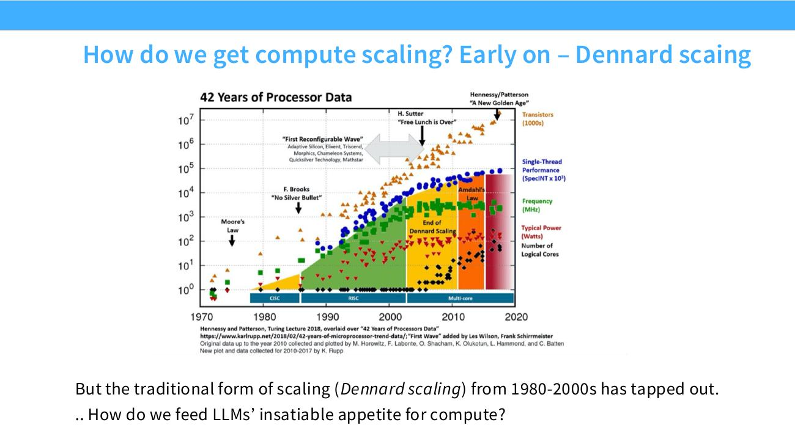

本页回顾 1980–2000 年代的 Dennard scaling：晶体管缩小、功耗密度不变、频率免费上涨；随后指出这一传统红利已经枯竭（"tapped out"），并抛出全讲的驱动性问题——"如何喂饱大模型对算力永不满足的胃口？"。下文关于泄漏电流与电压停滞的解释正是对这一页的展开，而答案将在下一页给出：并行扩展接棒。

在 Dennard scaling 有效的年代，晶体管尺寸缩小的同时，单位面积功耗大致保持不变，因此提高晶体管密度常能同时提高频率而不显著增加功耗——"等两年换新工艺"就是免费的性能。这一红利约在 2005–2007 年前后结束：泄漏电流与电压无法继续按比例下降，频率提升停滞，单核性能增长显著放缓。硬件不再仅靠"更快的单核"进步。现代加速器转向以下几条路径：

- **大规模并行**：用很多较简单的执行单元同时驻留大量线程，以线程间切换隐藏访存延迟；
- **专用矩阵指令**：把最常见的线性代数（矩阵乘加）映射到专用的、更高吞吐的数据通路（Tensor Core、MXU）；
- **低精度数值格式**：用更少的位数表示数值，同时减少存储、带宽与乘加电路的成本；
- **稀疏、编译与模型结构协同**：让软件（编译器、算子库、模型结构）主动适配硬件的特性，而不是把硬件当作透明黑盒。

课件引用的行业分解把十年 GPU 吞吐增长粗略归因于：数值表示约 $16\times$、专用指令约 $12.5\times$、制程约 $2.5\times$、稀疏约 $2\times$，总量超过 $1000\times$。这组数字最值得关注的地方在于：**来自制程的贡献只有约 $2.5\times$，而来自数值表示与专用指令的贡献合计约 $200\times$**——也就是说，过去十年 AI 硬件的性能增长主要不是"晶体管变小了"，而是"每个晶体管被用来以更少的位数、更专用的方式做更特定的运算"。

这些数字是特定口径下的说明，不应当相乘后当作任意 workload 的实测加速。例如稀疏的 $2\times$ 通常要求 2:4 结构化稀疏模式，低精度的 $16\times$ 跨越了从 FP32 到 FP4 的整整四代格式，任何单一模型都不可能无条件地同时兑现全部倍数。


*图：性能增长来自精度、专用指令、制程与稀疏的共同作用（00:06:54--00:07:25）。图中的倍数用于建立量级直觉，不代表所有模型都可无条件获得同样加速。*

> [!NOTE]
> 从本讲开始，看到"更快"应立即追问：峰值 FLOPs 变高了，还是有效带宽变高了？是相同数学运算，还是精度、稀疏度或算法已经改变？

### 本章小结

- Scaling law 使硬件利用率直接影响同一预算下能达到的模型质量；小指数意味着每一点损失改进都极其昂贵。
- 单核频率红利减弱后，GPU/TPU 的增长主要来自并行、专用化、低精度与软硬件协同，制程贡献反而是次要项。
- 峰值规格不是端到端吞吐；任何倍数都必须带上精度、形状、算法与测量范围。

## 2. GPU 与 TPU：执行模型和存储层级

### 2.1 CPU 优先低延迟，GPU 优先高吞吐

CPU 与 GPU 的分歧首先是一个设计哲学问题：给定同样面积的硅片，晶体管应该花在"让单个任务更快完成"上，还是花在"让更多任务同时进行"上？

CPU 选择前者：它用复杂控制逻辑（分支预测、乱序执行、超标量发射）和大容量多级缓存，让少量线程尽快完成。这些结构消耗了大量晶体管，但它们的作用是把**单线程的延迟**压到最低——这对操作系统、数据库、分支密集的业务逻辑至关重要。

GPU 选择后者：它把更多晶体管用于执行单元本身，让大量线程同时驻留在芯片上。当一组线程等待显存数据返回时（这可能需要数百个时钟周期），调度器立刻切换到另一组已经就绪的线程继续执行。GPU 不试图让任何单个线程快，而是以**延迟隐藏**（latency hiding）换整体吞吐。


*图：CPU 侧重少量复杂核心的延迟，GPU 侧重大量并行执行单元的吞吐（00:08:14--00:09:05）。"GPU 单线程慢"不妨碍它在高并行 workload 上更快。*

延迟隐藏需要多少并发度？我们可以用 Little 定律做一个量级估算：要填满带宽 $B$、延迟为 $\tau$ 的内存系统，需要"在途"的字节数约为

$$
W = B\times \tau.
$$

以 H100 的 HBM3 为例，$B\approx 3.35\,\mathrm{TB/s}$，一次 HBM 访问的端到端延迟约 $400$–$600\,\mathrm{ns}$，则

$$
W\approx 3.35\times10^{12}\times 500\times10^{-9}\approx 1.7\,\mathrm{MB}.
$$

也就是说，任何时候都要有约 $1.7\,\mathrm{MB}$ 的数据"在路上"，HBM 带宽才能被跑满。分摊到 132 个 SM，每个 SM 需要持续维持十几 KB 的在途请求，这又要求每个 SM 同时驻留成百上千个线程、每个线程都持有若干未完成的 load。这就解释了 GPU 为什么要支持如此夸张的线程驻留数——**并发度不是目的，而是喂饱带宽的必要条件**。

GPU 从大到小可以建立如下心智模型：

1. 一个 device 含多个 Streaming Multiprocessor（SM）；
2. kernel 启动一个 grid，grid 由 thread block 组成；
3. block 被分配到某个 SM，并在其生命周期内共享该 SM 的资源（寄存器堆、shared memory、调度槽位）；
4. block 内线程按 warp 执行，NVIDIA GPU 上通常一个 warp 为 32 个线程；
5. SM 内普通标量/向量 ALU、load/store 单元与 Tensor Core 处理不同类型指令。


*图：GPU 由多个 SM 构成，SM 内再包含调度器、执行单元和局部存储（00:09:32--00:10:19）。图示是架构抽象；GA100 完整 die 的 128 个 SM 不等于所有 A100 SKU 都开放 128 个。*

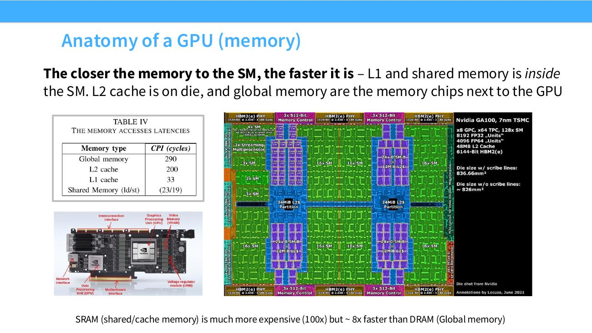

本页从存储角度解剖同一颗芯片：L1 与 shared memory 在 SM 内部，L2 在 die 上，global memory 是 GPU 旁边的独立显存颗粒。页中给出的关键数字是：片上 SRAM 的造价约为 DRAM 的 100 倍，但速度快约 8 倍——贵而快、廉而慢，这正是存储层级存在的经济原因。第 2.3 节会把这一页展开为完整的容量-带宽阶梯表，此处先建立"离 SM 越近越快"的第一印象。

### 2.2 thread、block、warp 不应混为一谈

例如一个 block 有 256 个线程，它通常包含 $256/32=8$ 个 warp。硬件以 warp 为基本发射单位：同一 warp 的线程在同一时刻执行同一条指令，但操作不同的数据——这是 SIMT（Single Instruction, Multiple Threads）模型。不同 warp、不同 block 之间不要求锁步，调度器可以任意交错它们。


*图：grid 被切成 blocks，blocks 调度到 SM，block 又被拆成 warps（00:14:26--00:15:21）。"所有 GPU 线程都执行同一条指令"是错误的，锁步范围是 warp。*

这一区分解释了两个常见现象：

- **分支分歧只发生在同一 warp 内**：如果一个 warp 的 32 个线程对 `if` 条件判断一致，整条 warp 只走一条路径，没有任何分歧代价；不同 warp 走不同分支并不直接造成 warp divergence。
- **shared memory 和同步屏障以 block 为作用域**：`__syncthreads()` 只同步同一 block 内的线程；不能假定不同 block 能用普通 block barrier 同步——不同 block 甚至可能在不同 SM 上、在不同时刻执行。

还需要补充一个现代架构的细节：自 Volta 架构起，NVIDIA 引入了 independent thread scheduling，warp 内每个线程拥有独立的程序计数器，分歧后的线程可以以更细的粒度交错执行，而不必严格地"先走完一条路径再走另一条"。但这并不改变性能模型——**同一 warp 内两条路径的指令总量仍然都要被发射**，只是调度更灵活了。

### 2.3 越靠近计算单元，存储越小但越快

课件的示意延迟依次为：global memory 约 290 cycles、L2 约 200、L1 约 33、shared memory 约 23 或 19。具体数值会随架构和访问模式变化，真正应记住的是层级关系：寄存器与片上 SRAM 容量小、带宽高；HBM 容量大、离计算更远。


*图：从 global memory 到 shared memory，容量下降而访问更快（00:11:01--00:12:10）。课件给出的 cycle 数是特定测量的近似，不是所有 GPU 的固定常数。*

为了给这个层级关系配上数量级直觉，我们以 H100 SXM 为例列出各级存储的典型容量与带宽（不同来源的数字因测量口径不同会有出入，下表只用于建立"每往下一级，容量大约大一个数量级、带宽大约小一个数量级"的阶梯直觉）：

| 层级 | 典型容量 | 典型带宽（整卡） | 类比 |
| --- | --- | --- | --- |
| 寄存器（每 SM 64K 个 32-bit） | 约 $256\,\mathrm{KB}$/SM，整卡约 $33\,\mathrm{MB}$ | 数十 TB/s | 手里握着的笔和草稿纸 |
| Shared memory / L1（片上 SRAM） | 约 $228\,\mathrm{KB}$/SM，整卡约 $30\,\mathrm{MB}$ | 约 $30\,\mathrm{TB/s}$ | 办公桌桌面 |
| L2 cache | 约 $50\,\mathrm{MB}$ | 约 $5$–$10\,\mathrm{TB/s}$ | 办公室里的书架 |
| HBM | $80\,\mathrm{GB}$ | $3.35\,\mathrm{TB/s}$ | 大楼地下书库 |
| NVLink（跨 GPU） | 对方的 HBM | $900\,\mathrm{GB/s}$ | 隔壁大楼的图书馆（有传送带） |
| 网络（InfiniBand 跨节点） | 集群内存 | 每网卡约 $50\,\mathrm{GB/s}$（400 Gb/s） | 异地图书馆，靠邮寄 |

用"图书馆取书"的类比来说：做一道题需要的数据如果就在草稿纸上（寄存器），随手可用；在桌面上（SRAM），伸手可得；去书库（HBM）取一次书代价高昂，所以聪明人取书时一定会**多取几本、回来后反复使用**——这正是第 6 节 tiling 的全部动机。而如果数据在异地图书馆（跨节点网络），一次通信的代价足够本地做大量计算，这解释了为什么分布式训练的通信-计算重叠如此重要。

请注意上表最后一个含义深远的数字对比：HBM 带宽 $3.35\,\mathrm{TB/s}$ 与跨节点网络带宽约 $50\,\mathrm{GB/s}$ 之间相差约 $67$ 倍。算力可以靠堆卡线性增长，但层级的"边界"在哪里，决定了并行策略必须在哪里切分。

CUDA 名称还容易误导：

- **register**：每线程私有，通常最快；寄存器压力过高会降低 occupancy，甚至 spill 到 local memory。
- **local memory**：逻辑上每线程私有，但物理地址空间落在 device memory（HBM）上，不等于"片上局部缓存"——名字里的 local 指的是作用域，不是位置。
- **shared memory**：每 block 共享的可编程片上 SRAM，适合显式数据复用，是 tiling 的主战场。
- **global memory**：device 范围可见，容量最大但搬运最昂贵。


*图：register/local 属于线程，shared 属于 block，global 属于 device（00:16:24--00:17:18）。作用域和物理位置是两个不同概念。*

### 2.4 TPU 不是"另一种 CUDA GPU"，而是更粗粒度的专用机器

TPU 的抽象单元包括 scalar unit、vector processing unit（VPU）、matrix multiply unit（MXU）、片上 VMEM/SMEM 与 HBM。与 GPU 做概念映射时，可以把 TPU cell/TensorCore 类比成一个较大的计算域，把 VPU 看成通用向量通路，把 MXU 看成矩阵乘专用阵列。

与 GPU 的"许多小而灵活的执行单元 + 程序员显式管理 warp/block"不同，TPU 的 MXU 是一个大规模的脉动阵列（systolic array）：权重（或一侧操作数）预先流入阵列并保持 stationary，另一侧操作数像脉搏一样逐拍流过，每个处理单元只做一次乘加并把部分和传给邻居。这种设计把数据复用做到物理布线层面——部分和根本不离开阵列——但代价是它对规则的大型矩阵乘极为高效，对不规则控制流则几乎无能为力。GPU 的程序员用 tiling 在 shared memory 里"软件地"实现复用，TPU 则用硬件拓扑"物理地"实现复用，二者面对的是同一个 Roofline 约束。


*图：GPU 的许多小而灵活的单元，与 TPU 较少但更大的向量/矩阵单元对照（00:20:23--00:21:23）。这是帮助理解的概念映射，不是逐晶体管的一一等价。*

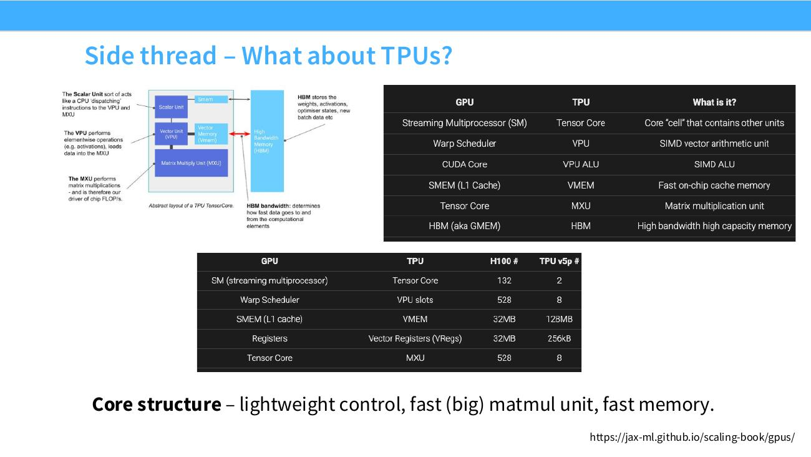

本页延续支线，给出 TPU 核心结构的速写：轻量控制逻辑 + 大型快速矩阵乘单元 + 快速片上存储，并引用 jax-ml scaling book 的 GPU/TPU 对照图。这一页与上一页合起来说明一件事：GPU 与 TPU 是同一设计点对"通用性—专用性"权衡的两种取值，因此本讲后续所有性能分析（Roofline、tiling、fusion）对两者同时成立。

> [!WARNING]
> "Tensor Core"存在术语碰撞：NVIDIA Tensor Core 是 SM 内的矩阵乘单元；TPU 文档中的 TensorCore/cell 可指更完整的计算核心。不能仅凭同名判断层级相同。

GPU 往往提供更多细粒度、可编程执行单元，TPU 则以大规模规则矩阵计算与规则互联见长。真正训练大模型时，单芯片以外的网络拓扑同样关键：加速器能否高效连接（NVIDIA 的 NVLink/NVSwitch 域、TPU 的 ICI 环面互联），决定 data/model parallel 的通信能否跟上计算。回到上一小节的层级表——跨芯片带宽与片上带宽之间的巨大落差，才是并行策略设计的真正约束。

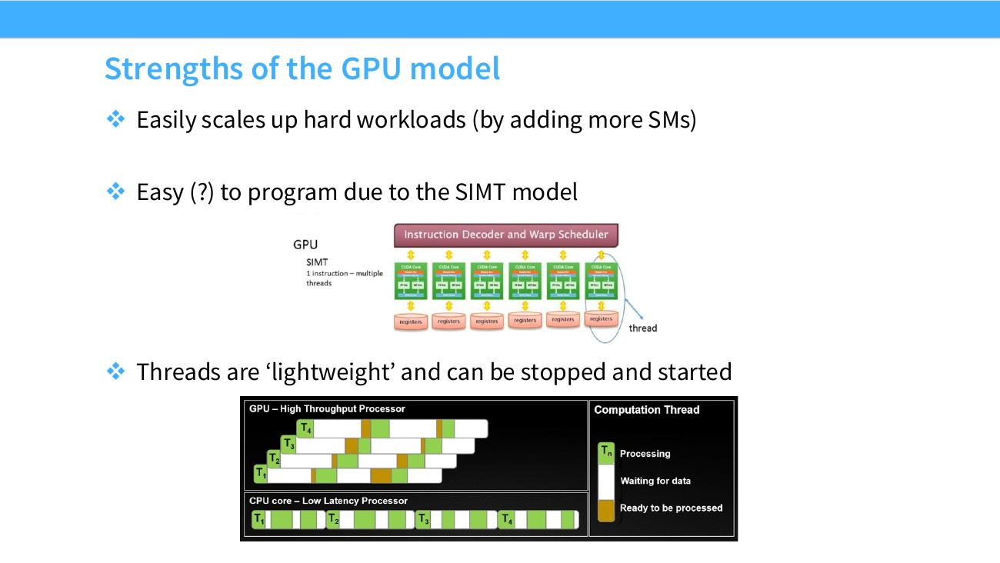

本页总结 GPU 模型的三个强项：靠增加 SM 即可扩展重型负载；SIMT 模型让编程相对容易（每个线程写标量逻辑，硬件负责并行）；线程是轻量的，可以随时停下与切换——第三点正是第 2.1 节延迟隐藏机制的立身之本。讲者在"Easy"后加了一个问号，暗示这个"容易"有条件：写出能跑的 CUDA 容易，写出跑得快的则不然——这正是第二部分的主题。

### 本章小结

- GPU 通过大量驻留线程隐藏延迟，以吞吐优先；CPU 更侧重少量线程的响应时间。延迟隐藏所需并发度可用 Little 定律 $W=B\tau$ 估算。
- device、SM、block、warp、thread 是不同层级；warp 通常是 SIMD/SIMT 锁步执行范围，分歧代价以 warp 为单位发生。
- 存储层级每往下一级，容量约大一个数量级、带宽约小一个数量级；HBM 与跨节点网络之间相差约两个数量级。
- shared memory 是 block 级可编程 SRAM；CUDA local memory 不保证位于片上。
- GPU/TPU 可以用执行与存储职责作概念比较，但同名部件不一定同层级；TPU 的脉动阵列是把数据复用做到硬件里的另一条路线。

## 3. Memory wall、Roofline 与控制流

### 3.1 算力增长远快于数据供给能力

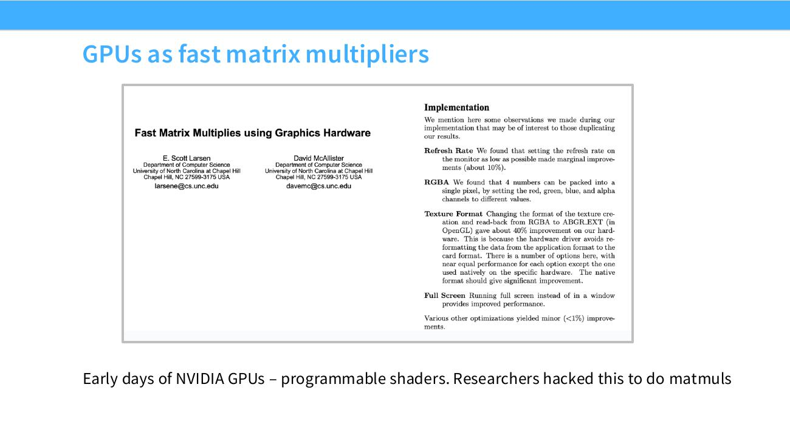

本页回顾历史：早期 NVIDIA GPU 只有可编程着色器（programmable shader），研究者们"黑"进图形管线，把矩阵乘伪装成纹理渲染来完成——这是 GPGPU 的起点。这段历史解释了 CUDA 中许多遗留概念的来源，也说明 GPU 走向通用计算是需求倒逼的结果：先有"拿 GPU 做矩阵乘"的黑客实践，后有官方的计算栈。

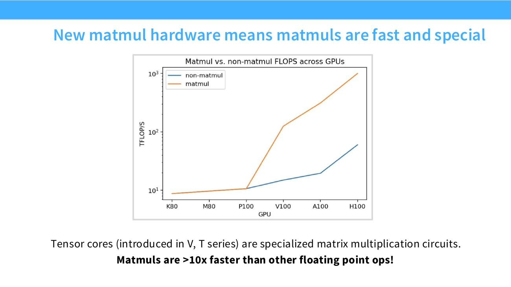

本页指出新时代的分水岭：自 Volta/Turing 系列引入 Tensor Core 起，矩阵乘有了专用电路，吞吐比其他浮点路径高 10 倍以上。专用硬件把矩阵乘变成"特权运算"——这与上文"矩阵乘具有最高算术强度、因此被硬件偏爱"的论述互为因果：算法偏爱矩阵乘，于是硬件专用化矩阵乘，于是算法更加偏爱矩阵乘，形成协同进化的正反馈。

课件用约二十年的趋势图说明：浮点计算增长约 $60000\times$，DRAM 带宽约 $100\times$，互联约 $30\times$。不必执着于精确倍数，核心结论是 compute/memory gap 持续扩大——矩阵单元越来越容易"饿着"。


*图：计算吞吐的增长速度显著超过 DRAM 与互联（00:25:31--00:26:43）。这正是低精度、fusion、tiling 与 FlashAttention 都围绕数据搬运展开的背景。*

把这三个倍数放在一起看，可以得到一个尖锐的定量结论：如果二十年前某个算法的算术强度刚好让机器"算"与"搬"平衡，那么今天同样的算法，算力相对带宽富余了约 $60000/100=600$ 倍。换言之，**二十年间机器平衡点向"更高算术强度"方向移动了近三个数量级**，一切不能提高数据复用度的算法都在持续地变得相对更慢。这就是为什么本讲后面的每一项优化——低精度、fusion、tiling、重计算——本质上都在减少字节搬运或提高字节复用。

矩阵乘受到特别优化，也因此主导语言模型硬件设计。课件展示同代设备上矩阵乘吞吐可比其他浮点路径高一个数量级以上；这是精度与硬件相关的现象，不意味着任何写成矩阵形式的程序都会自动跑满 Tensor Core。矩阵乘之所以被偏爱，恰恰因为它具有所有常见算子中最高的算术强度（$O(N)$ 级别的复用），硬件厂商于是把越来越多的晶体管押注在矩阵数据通路上，形成"算法-硬件协同进化"的正反馈。

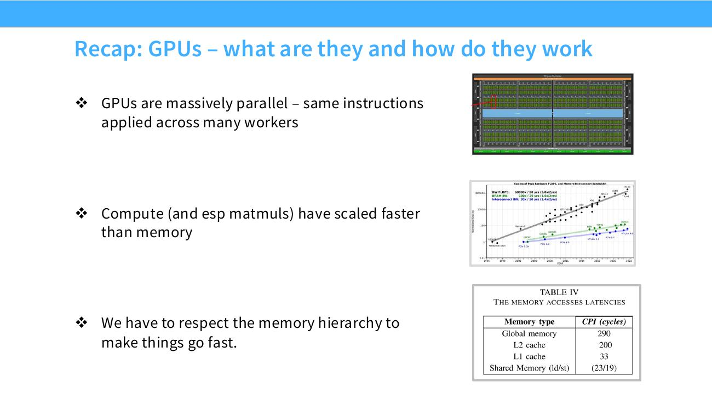

本页是第一部分的回顾，三句话凝结前半讲的全部论点：GPU 是大规模并行机器，同一指令施加于大量执行者；计算（尤其矩阵乘）的扩展快于存储；想让程序跑快，必须尊重存储层级。带着这三条结论，课件进入第二部分——但讲者先提醒：即便是方阵乘这样简单的负载，GPU 上的性能也可能出人意料地复杂。

### 3.2 Roofline：判断瓶颈究竟在算还是在搬

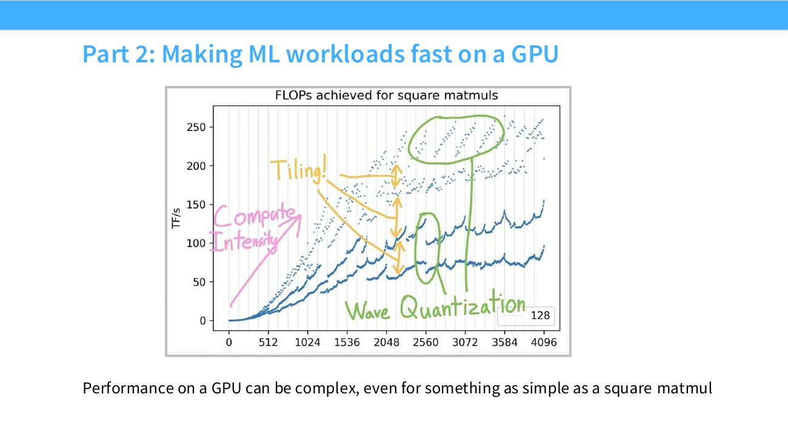

本页是第二部分的分隔页，讲者在此预告：GPU 上的性能可以非常复杂——哪怕只是方阵乘这样"简单"的负载。这句预告将在第 6.4 节"矩阵尺寸之谜"兑现；而要把这种复杂性讲清楚，需要的第一件工具就是本节的 Roofline 模型——先把"慢"分解成"算得慢"与"搬得慢"两类，才谈得上对症下药。

定义算术强度（arithmetic intensity）为每搬运一个 byte 能执行多少 FLOPs：

$$
I=\frac{F}{M}.
$$

- $I$：算术强度，单位 FLOP/byte。
- $F$：该 kernel 执行的浮点操作数。
- $M$：从目标存储层级搬运的字节数。

现在推导 Roofline 模型。一个 kernel 的执行由两类事件构成：完成 $F$ 次浮点运算，以及从某级存储搬运 $M$ 字节。若计算单元以峰值 $P_{\mathrm{peak}}$（FLOP/s）满速运行，纯计算所需时间为

$$
T_{\text{compute}}=\frac{F}{P_{\text{peak}}};
$$

若内存系统以带宽 $B_{\text{mem}}$（byte/s）满速运行，纯搬运所需时间为

$$
T_{\text{memory}}=\frac{M}{B_{\text{mem}}}.
$$

- $T_{\text{compute}}$：计算下界时间。
- $T_{\text{memory}}$：访存下界时间。
- $P_{\text{peak}}$：给定精度与指令类型下的峰值 FLOP/s。
- $B_{\text{mem}}$：所考察存储层级的有效带宽。

在理想的重叠（overlap）假设下——计算与访存可以同时进行，但总时间不可能少于两者中较大的那个——总执行时间满足

$$
T\geq \max\!\left(T_{\text{compute}},\,T_{\text{memory}}\right).
$$

于是实际可达到的性能上界为

$$
P_{\mathrm{attainable}}=\frac{F}{T}\leq \frac{F}{\max(F/P_{\text{peak}},\,M/B_{\text{mem}})}
=\min\!\left(P_{\text{peak}},\,B_{\text{mem}}\cdot\frac{F}{M}\right)
=\min\!\left(P_{\text{peak}},\,B_{\text{mem}}I\right).
$$

- $P_{\mathrm{attainable}}$：实际可达到的 FLOP/s。
- $I$：相对于该存储层级的算术强度。

这条上界在 $\log I$–$\log P$ 平面上是两条直线的包络：斜率为 1 的斜线 $P=B_{\text{mem}}I$（带宽限制区）与水平线 $P=P_{\text{peak}}$（计算限制区）。两条上界相交处称为 ridge point，其算术强度为

$$
I^*=\frac{P_{\mathrm{peak}}}{B_{\mathrm{mem}}}.
$$

代入具体硬件数字。以 H100 SXM（BF16 稠密峰值 $P_{\text{peak}}\approx 989\,\mathrm{TFLOP/s}$，HBM3 带宽 $B_{\text{mem}}\approx 3.35\,\mathrm{TB/s}$）为例：

$$
I^*_{\text{H100}}\approx\frac{989\times10^{12}}{3.35\times10^{12}}\approx 295\ \mathrm{FLOP/byte}.
$$

若使用 FP8（峰值约 $1979\,\mathrm{TFLOP/s}$），ridge point 右移到约 $591\,\mathrm{FLOP/byte}$——峰值越高，kernel 反而越难进入 compute-bound 区。再以 B200（BF16 稠密峰值约 $2.25\,\mathrm{PFLOP/s}$，HBM3e 带宽约 $8\,\mathrm{TB/s}$）为例：

$$
I^*_{\text{B200}}\approx\frac{2.25\times10^{15}}{8\times10^{12}}\approx 281\ \mathrm{FLOP/byte}.
$$

现在把四类常见算子放到这张图上（均以 BF16/FP16、每元素 2 bytes 估算，矩阵乘假设理想 tiling、每个输入只从 HBM 读一次）：

- **方阵乘**（$4096\times4096\times4096$）：$F=2N^3\approx1.37\times10^{11}$ FLOP，$M\approx 3N^2\times2\approx1.0\times10^{8}$ byte，$I\approx1370$ FLOP/byte $\gg 295$——**compute-bound**。
- **逐元素激活**（ReLU）：每元素 1 次比较、读 2 bytes 写 2 bytes，$I\approx1/4$ FLOP/byte $\ll 295$——**memory-bound**。
- **softmax**（融合实现）：每元素约 5 次运算（求 max、减、exp、累加、除），读 2 bytes 写 2 bytes，$I\approx 5/4\approx1.3$——**memory-bound**。
- **LayerNorm**（融合实现）：每元素约 8 次运算，读 2 bytes 写 2 bytes，$I\approx 2$——**memory-bound**。

结论一目了然：**Transformer 里除了大矩阵乘以外，几乎所有算子都深深落在 Roofline 斜线区**。当 $I<I^*$，增加算力几乎无效，kernel memory-bound；当 $I>I^*$，继续减少内存流量的边际收益下降，kernel 更接近 compute-bound。这就是为什么大模型训练的整体吞吐往往由一堆"不起眼"的逐元素算子和归一化算子决定，而不是由矩阵乘的峰值决定。


*图：斜线区域由带宽限制，水平区域由峰值计算限制（00:31:11--00:32:36）。Roofline 是上界模型，实际性能还受调度、依赖、occupancy、指令混合等因素影响。*

我们可以用一段简短的 PyTorch 代码实测逐元素算子的实际带宽，验证它离理论值有多远：

```python
import torch

x = torch.randn(1 << 28, device="cuda", dtype=torch.float16)  # 约 2.7 亿元素
y = torch.empty_like(x)
# 预热并排除首次 launch 开销
for _ in range(10):
    torch.relu(x, out=y)
torch.cuda.synchronize()

start = torch.cuda.Event(enable_timing=True)
end = torch.cuda.Event(enable_timing=True)
start.record()
for _ in range(100):
    torch.relu(x, out=y)          # 每个元素读 2 bytes、写 2 bytes
end.record()
torch.cuda.synchronize()

ms = start.elapsed_time(end) / 100
bytes_moved = 2 * 2 * x.numel()   # 读 + 写，FP16 每元素 2 bytes
print(f"时间 {ms:.3f} ms，有效带宽 {bytes_moved / (ms * 1e-3) / 1e12:.2f} TB/s")
# H100 上通常可测得 2.5--3 TB/s，即 HBM 峰值 3.35 TB/s 的 75%--90%
```

这段代码同时演示了两个事实：其一，逐元素算子确实能把带宽推到接近硬件极限（它没有别的可优化的）；其二，即使是理想情况也存在 10%–25% 的带宽损耗，Roofline 给出的永远是上界而非承诺。

### 3.3 六类优化都能放回 Roofline

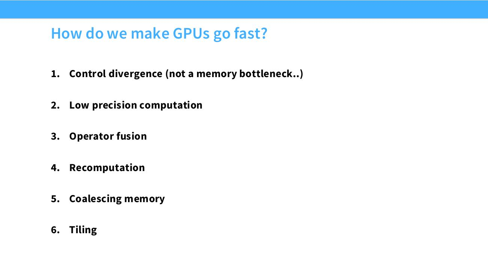

本页列出让 GPU 变快的六件武器：控制分歧、低精度、算子融合、重计算、合并访存、tiling。注意讲者给第一项加了注脚"not a memory bottleneck"——控制分歧不改变字节搬运，它提高的是计算侧的有效利用率；其余五项全部围绕数据移动展开。读者可把本页当作第 3.4–6 节的目录，下表则把这六者与 Roofline 参数一一对应。

本讲后续技巧可以统一为：

| 技巧 | 主要改变 | Roofline 视角 |
| --- | --- | --- |
| 避免 warp divergence | 减少无效执行 | 提高有效计算利用率 |
| 低精度 | 每元素字节数更少，矩阵单元吞吐更高 | 增加 $I$ 并提高 $P_{peak}$ |
| fusion | 减少中间张量读写与 kernel launch | 减少 $M$ |
| recompute | 用额外 FLOPs 换少存激活 | 减少 $M$、增加 $F$ |
| coalescing | 用更少内存事务取相同数据 | 提高有效 $B_{mem}$ |
| tiling | 把数据搬到 SRAM 并多次复用 | 显著减少 HBM 层面的 $M$ |
| I/O-aware 算法（FlashAttention） | 改变计算顺序，中间量不落 HBM | 同时减少 $M$ 与 $F$ 的比值分母，把 memory-bound 算子推向 ridge point |

请注意这张表的一个读法：所有技巧的作用对象各不相同——有的动 $F$，有的动 $M$，有的动 $B_{\text{mem}}$，有的动 $P_{\text{peak}}$——但评判它们是否值得做，都要先回答"当前 kernel 在 ridge point 的哪一侧"。对一个已经 compute-bound 的大矩阵乘做 fusion，收益微乎其微；对一个 memory-bound 的 LayerNorm 谈提高 Tensor Core 利用率，则是隔靴搔痒。**Roofline 首先是诊断工具，其次才是优化清单。**

### 3.4 分支分歧为什么让 warp 串行化

同一 warp 的 lanes 若对 `if` 条件得到不同结果，硬件通常先屏蔽一部分 lanes 执行路径 A，再反向屏蔽执行路径 B。两个分支的指令都被发射，部分 lane 在每条路径上空转。


*图：同一 warp 中条件不同的线程会让分支路径被掩码串行执行（00:33:05--00:34:21）。条件语句本身并非必然慢；如果同一 warp 的判断一致，就没有这类分歧。*

我们可以给分歧一个简单的代价模型。设一个 warp 内的线程按条件分成 $p$ 条路径，路径 $i$ 上有 $w_i$ 个 lane（$\sum_i w_i=32$）、路径 $i$ 的指令代价为 $t_i$。由于没有分歧时 warp 可以在 $\max_i t_i$ 时间内并行执行任意一条路径，而分歧后硬件必须**串行发射每条路径**，总时间为

$$
T_{\text{div}}=\sum_{i=1}^{p} t_i.
$$

定义这段时间内的 SIMD 效率为"有效 lane-周期数 / 消耗的 lane-周期数"：

$$
\eta=\frac{\sum_{i=1}^{p} w_i t_i}{32\sum_{i=1}^{p} t_i}=\frac{\sum_i w_i t_i}{32\,T_{\text{div}}}.
$$

代入典型情形：两条路径各占 16 个 lane、代价相等（$w_1=w_2=16$，$t_1=t_2=t$），则 $T_{\text{div}}=2t$，$\eta=32t/(32\cdot 2t)=50\%$。最坏情形是每条路径只有一个 lane（$p=32$），此时 $\eta=1/32$，整条 warp 的吞吐退化为串行机的 $1/32$。

这个模型给出两条工程推论：

- 分歧代价只取决于**同一 warp 内**的条件分布。如果能把数据重排，使条件相同的元素聚在同一个 warp（例如按 mask 排序、compaction），即使总分支数不变，分歧也会消失。
- 消灭分歧的替代方案是**分支改无分支**（predication / `where` / 掩码乘法）：无条件地把两条路径都算出来再按掩码选取。这在数学上等价于 $T=T_A+T_B$，与分歧执行同价，但省去了掩码栈管理开销，且对编译器更友好。

> [!TIP]
> 优化时不要仅数 `if`。应检查 lane 到数据的映射，以及分支是否在 warp 内混杂。为了消灭一个分支而额外搬运大量数据，也可能得不偿失。

### 本章小结

- 现代加速器的核心矛盾是计算吞吐增长快于内存和互联；二十年间机器平衡点向高算术强度方向移动了近三个数量级。
- Roofline 用算术强度连接算法与硬件：$T\geq\max(F/P_{\text{peak}},\,M/B_{\text{mem}})$，ridge point $I^*=P_{\text{peak}}/B_{\text{mem}}$，H100/B200 的 $I^*$ 约为 280–300 FLOP/byte。
- Transformer 中除大矩阵乘外的多数算子都是 memory-bound；六类优化的共同目标是减少无效工作、减少字节或提高数据复用。
- Warp divergence 的成本来自同一 warp 内路径串行化，$T_{\text{div}}=\sum_i t_i$，而不是所有条件判断。

## 4. 低精度：用表示范围、误差与吞吐做交换

### 4.1 更少 bytes 同时缓解存储和计算

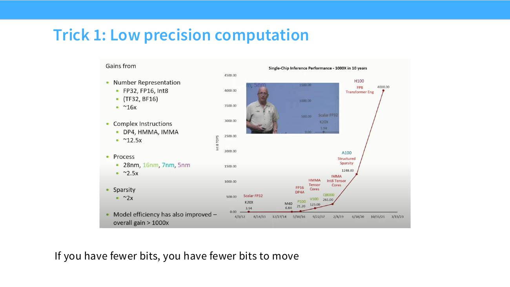

本页开启第一件武器，口号直白："位数更少，要搬的位就更少"。图中的位宽阶梯同时暗示收益的双重性——存储侧字节减半，计算侧还能启用更高吞吐的指令路径。下文 ReLU 的例子先量化存储侧收益，矩阵乘峰值表再量化计算侧收益，两者叠加才构成低精度的完整故事。

以逐元素 ReLU 为例：

$$
y_i=\max(0,x_i).
$$

若每个元素读一次、写一次，FP32 大致搬 8 bytes，FP16 大致搬 4 bytes，而核心运算只有一次比较/选择。因此标准算术强度近似为 $1/8$ 与 $1/4$ op/byte，FP16 约提升 $2\times$。由于这类算子是纯粹的 memory-bound（$I\ll I^*$），搬运字节减半几乎直接转化为时间减半——这是低精度最直接、最无争议的一笔收益。


*图：课件用 FP32 与 FP16 的每元素字节数说明低精度减轻带宽压力（00:35:38--00:36:16）。幻灯片写成"8 byte/FLOP、4 byte/FLOP"，那是标准 arithmetic intensity 的倒数，不能与 FLOP/byte 混用。*

低精度的第二笔收益来自计算侧：更小的数值格式意味着更小的乘法器面积，同样的硅片可以塞入更多乘加单元，峰值 FLOP/s 随之上升。以 H100 SXM 的稠密峰值为例，精度每降一档，峰值大约翻一倍：

| 格式 | 位宽 | H100 SXM 稠密峰值（约） |
| --- | --- | --- |
| FP32 | 32 | $67\ \mathrm{TFLOP/s}$ |
| TF32 | 19（截断的 FP32） | $494\ \mathrm{TFLOP/s}$ |
| FP16 / BF16 | 16 | $989\ \mathrm{TFLOP/s}$ |
| FP8 | 8 | $1979\ \mathrm{TFLOP/s}$ |

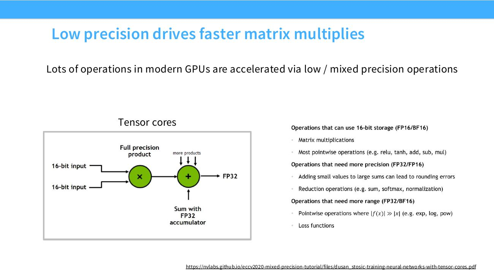

本页展示低精度对矩阵乘的加速：现代 GPU 的大量运算经由低精度/混合精度路径在 Tensor Core 上完成（图示与数据来自 NVIDIA 混合精度教程）。这张幻灯片的价值在于把"位数预算"换算成"峰值预算"：每砍掉一半位宽，矩阵单元的峰值吞吐大约翻倍——上表 H100 的四档数字正是这一页的数量化。但第 4.3 节末尾会提醒：峰值翻倍不等于端到端翻倍。

矩阵乘则常采用低精度输入、高精度累加：

$$
C_{ij}=\sum_k A_{ik}B_{kj}.
$$

- $A_{ik},B_{kj}$：可用 BF16、FP16、FP8 等低精度存储与乘法。
- $C_{ij}$：输出元素。
- 累加器：常使用更高精度，避免长求和误差迅速积累。

为什么累加必须高精度？一个定量估算：设浮点格式有 $p$ 位尾数，则 round-to-nearest 的相对舍入误差以 unit roundoff $u=2^{-(p+1)}$ 为上界。FP16 的 $p=10$，$u\approx4.9\times10^{-4}$。对长度为 $K$ 的求和，最坏情况下误差线性累积，相对误差可达约 $Ku$；当 $K=4096$ 时，

$$
Ku\approx 4096\times4.9\times10^{-4}\approx 2.0,
$$

即相对误差上界已达 $200\%$——结果在数值上完全不可用。虽然随机误差模型下实际增长更接近 $\sqrt{K}u\approx3\%$，但对于训练这种依赖小梯度信号的任务仍然不可接受。而 FP32 的 $u\approx6.0\times10^{-8}$，即使 $K=10^6$ 也有充分余量。**这就是"低精度乘、高精度加"的数学理由：乘法输入的位宽决定带宽与峰值，累加器的位宽决定长归约的误差。**

混合精度不是"把所有张量转成同一种最小位宽"。归一化、loss、optimizer state 或异常值敏感路径可能保留 BF16/FP32，训练还常保留 FP32 master weights。判断某个张量能否降精度的标准是：它的值域是否在格式的动态范围内、它的下游运算对相对误差的容忍度、以及转换本身的开销是否小于收益。

### 4.2 FP8：指数位和尾数位如何取舍

在动手讨论 FP8 之前，我们先统一回顾浮点格式的三个参数：$1$ 位符号位、$e$ 位指数（决定动态范围）、$p$ 位尾数（决定相邻可表示数的间距）。规格化数 $x=(-1)^s\cdot 2^{E-\text{bias}}\cdot(1+f)$，其中 bias $=2^{e-1}-1$。以下是本讲涉及格式的位布局对比：

| 格式 | 符号 | 指数 $e$ | 尾数 $p$ | 最大规格化数 | 相对间距 $2^{-p}$ |
| --- | --- | --- | --- | --- | --- |
| FP32 | 1 | 8 | 23 | $\approx3.4\times10^{38}$ | $\approx1.2\times10^{-7}$ |
| FP16 | 1 | 5 | 10 | $65504$ | $\approx9.8\times10^{-4}$ |
| BF16 | 1 | 8 | 7 | $\approx3.4\times10^{38}$ | $\approx7.8\times10^{-3}$ |
| FP8 E4M3 | 1 | 4 | 3 | $448$ | $0.125$ |
| FP8 E5M2 | 1 | 5 | 2 | $57344$ | $0.25$ |
| MXFP4（E2M1） | 1 | 2 | 1 | $6$ | $0.5$ |

FP16 与 BF16 的对比最能说明"位数预算"的取舍：两者同为 16 bit，FP16 把 5 位给指数、10 位给尾数，范围只到 $\pm65504$ 但精度较高；BF16 照搬 FP32 的 8 位指数、只留 7 位尾数，动态范围与 FP32 相同但相邻数间距是 FP16 的 8 倍。深度学习训练里梯度与激活的值域跨度极大、却能容忍较大的相对误差，因此 BF16 反而成为训练主流——**动态范围比局部精度更难用软件弥补**（溢出即 NaN，而精度不足只是噪声变大）。

E4M3 用 4 位指数、3 位尾数，精度较高而范围较窄；E5M2 用 5 位指数、2 位尾数，范围更宽而相邻可表示数更稀。选择格式是在动态范围与局部分辨率之间取舍。工程惯例是：前向的权重与激活用 E4M3（精度优先），反向的梯度用 E5M2（范围优先，因为梯度分布常有长尾）。

量化通常需要 scale：

$$
q_i=Q_{\mathrm{FP8}}\!\left(\frac{x_i}{s}\right),\qquad \hat{x}_i=sq_i.
$$

- $x_i$：原始高精度数值。
- $s$：把局部数值范围映射到 FP8 可表示区间的缩放因子。
- $Q_{\mathrm{FP8}}$：舍入、饱和到 FP8 的量化操作。
- $q_i$：量化值。
- $\hat{x}_i$：反量化近似值。

一个 tensor 共用一个 scale 时，少数异常值会迫使大部分数值挤在很小范围。举一个具体例子：若某激活张量绝大多数元素落在 $[-1,1]$，但存在一个幅值 $100$ 的异常值，per-tensor scale 必须把 $[-100,100]$ 映射进 E4M3 的 $\pm448$，于是正常元素 $1.0$ 被缩到约 $4.48$，其量化步长（E4M3 在 $[4,8)$ 区间间距为 $0.5$）造成约 $11\%$ 的相对误差——绝大多数"好"数据为少数异常值付出了精度。

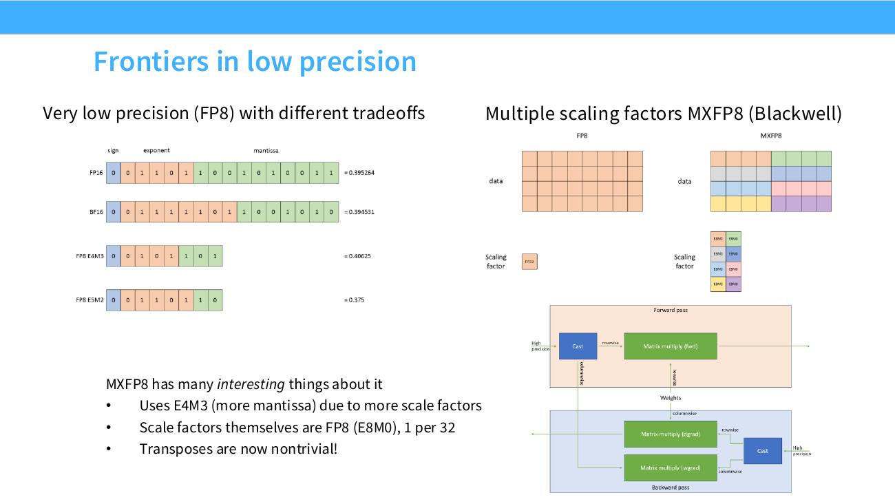

本页并列展示低精度前沿的两条路线：左侧 FP8 的 E4M3/E5M2 取舍，右侧 Blackwell 引入的 MXFP8 多缩放因子方案。讲者特别标注 MXFP8 的三个要点：因有更多 scale 因子护驾，值本身可以用尾数更多的 E4M3；scale 因子自身也是浮点（E8M0，纯指数），每 32 个值共享一个；以及一个常被忽视的后果——转置不再平凡，因为分组边界随布局方向改变，下文详述。

MXFP8 改用分块缩放：课件采用每 32 个 E4M3 值共享一个 E8M0 scale。E8M0 是一种只有指数、没有尾数的 8 位格式，即 scale 本身是 2 的幂——这使缩放乘法退化为指数加法，硬件代价极低。小块更能适配局部范围，但会增加 scale 元数据（每 32 个值多 1 byte，开销 $1/32\approx3\%$）、布局与转置复杂度。


*图：前向、输入梯度和权重梯度可在不同方向量化，主权重仍保留高精度（00:42:08--00:42:40）。图中分块只是数据流示意；MXFP8 规范是每 32 个值一个 scale。*

二维矩阵若按连续 32 个值分组，转置后分组边界会改变。高性能实现可能为两个访问方向保存不同量化布局，而不是在关键路径上临时转置和重新求 scale。这是低精度工程里一个反复出现的主题：**数值格式从来不是孤立选择，它会反过来约束数据布局与 kernel 结构。**

### 4.3 MXFP4 更激进，也更依赖训练配方

课件列出的 MXFP4 值集合可写为：

$$
q\in\{0,\pm0.5,\pm1,\pm1.5,\pm2,\pm3,\pm4,\pm6\}.
$$

这 16 个值恰好对应 1 位符号 + 2 位指数 + 1 位尾数（E2M1，bias $=1$）的全部规格化编码：尾数位只能取 $0$ 或 $1$，因此有效数字只能是 $1.0$ 或 $1.5$，指数范围 $2^{-1}$ 到 $2^{2}$，组合出 $\{0.5,1,1.5,2,3,4,6\}$ 七档幅值。它以每 16 个数共享一个 E4M3 scale。只有 4 bit 值意味着表示非常稀疏，scale、舍入、异常值处理与哪些算子保留高精度都会显著影响收敛。


*图：MXFP4 用有限离散值加局部 scale 覆盖数据范围（00:43:15--00:44:20）。讲者此处是在讨论前沿训练趋势；不能据此断言所有训练系统已普遍使用 FP4。*

低精度为什么未必带来理论上的 $2\times$：

- quantize/dequantize 和 scale 计算也占时间；
- 张量形状可能无法走最快 kernel；
- 部分算子仍需高精度；
- 训练的数据依赖和通信无法同时按位宽线性缩小。

讲者提到某些 endpoint 实测约 20%–30% 收益，恰好说明要测端到端而非只比较峰值规格。用 Roofline 的语言重述：把权重从 FP16 降到 FP8，$P_{\text{peak}}$ 翻倍、同时 $I^*$ 也翻倍——如果 kernel 原本就在 memory-bound 区，带宽没有变，时间几乎不变；即使 kernel 在 compute-bound 区，quant/dequant 的额外 $M$ 也会吃掉一部分收益。**位宽减半是峰值故事，不是端到端故事。**

### 本章小结

- 低精度同时减少字节并启用更高吞吐的矩阵指令，但误差和动态范围更难管理。
- 浮点格式的设计是在指数位（动态范围）与尾数位（局部精度）之间分配固定的位数预算；BF16 与 FP16 的对比说明动态范围通常更稀缺。
- 混合精度的关键是低精度乘法、高精度累加与敏感路径保留高精度；累加位宽由 $Ku$ 量级的误差增长决定。
- MXFP8/MXFP4 用局部 scale 缓解异常值问题，也引入元数据和布局成本。
- 理论位宽比不是端到端加速比；必须计入转换、scale、shape 与高精度算子。

## 5. Fusion 与 recomputation：少写一次，或干脆重算

### 5.1 Fusion 把多个往返 HBM 的算子合成一次

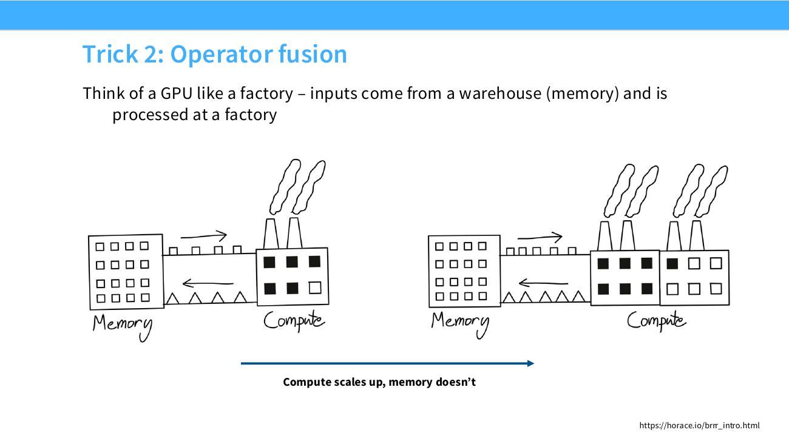

本页用 Horace He 的著名类比为 fusion 定调：把 GPU 想成工厂，原料从仓库（显存）运来、在车间（计算单元）加工。问题的关键在于"算力在扩厂，仓库没有"——如果每道工序都把半成品运回仓库再取回，物流（带宽）就会压垮生产。Fusion 的本质就是减少往返次数：能在一个车间干完的活，不要中间入库。

考虑：

$$
f(x)=\sin^2(x)+\cos^2(x).
$$

朴素 eager 执行可能依次启动 `sin`、平方、`cos`、平方、相加五个 kernel，每一步都把中间张量写回 global memory，再由下一步读取。若编译器把整个表达式融合为单个 kernel，每个元素只需读入一次并写回最终结果。


*图：逐元素表达式可由五次 kernel launch 与多次中间读写融合成一次（00:49:17--00:49:50）。`torch.compile`/TorchInductor 可完成许多常见融合，但不是所有图都能自动、且融合过大也可能增加寄存器压力。*

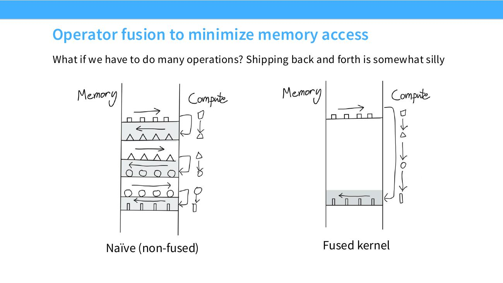

本页给出 naive 与 fused 的对照图：多步逐元素运算若逐步落盘，半成品在 HBM 与 SM 之间来回穿梭（左）；融合后数据进一次、出一次，中间量全程留在寄存器里（右）。"Shipping back and forth is somewhat silly"——这句调侃的定量版本就是下面的字节账：每次"穿梭"都是一趟真金白银的 HBM 往返。

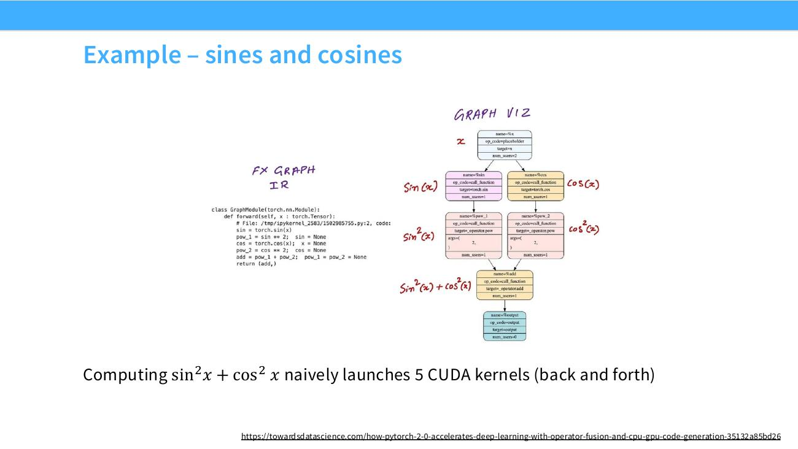

本页把例子坐实：计算 $\sin^2x+\cos^2x$ 的朴素实现会启动 5 个 CUDA kernel（sin、平方、cos、平方、相加），每个 kernel 都读写一遍 global memory。注意这 5 个 kernel 的数学都平凡至极——没有一个值得单独占用一次 HBM 往返，这正是逐元素链最浪费的形态。

我们把这笔账数清楚。对含 $n$ 个元素的 FP16 张量（每元素 2 bytes），朴素执行各 kernel 的 HBM 读写为：

| kernel | 读（bytes） | 写（bytes） |
| --- | --- | --- |
| $t_1=\sin(x)$ | $2n$ | $2n$ |
| $t_2=t_1^2$ | $2n$ | $2n$ |
| $t_3=\cos(x)$ | $2n$ | $2n$ |
| $t_4=t_3^2$ | $2n$ | $2n$ |
| $y=t_2+t_4$ | $4n$ | $2n$ |
| 合计 | $12n$ | $10n$ |

朴素方案共搬运 $22n$ bytes，外加 5 次 kernel launch；融合方案读 $x$ 一次、写 $y$ 一次，共 $4n$ bytes、1 次 launch。HBM 流量降低 $22/4=5.5\times$。由于逐元素算子是 memory-bound，这几乎直接转化为运行时间的同倍下降。

再看一个更贴近 Transformer 的例子：tanh 近似的 GELU，

$$
\operatorname{GELU}(x)=0.5x\left(1+\tanh\!\left(\sqrt{2/\pi}\,(x+0.044715x^3)\right)\right).
$$

展开成 eager 逐元素操作约为 8 个 kernel（三次乘法/乘加构造多项式、tanh、加 1、两次乘法），按上面的计数规则约搬 $30$–$36n$ bytes；融合后仍是 $4n$ bytes，收益约 $8\times$。LayerNorm 的账同样可观：朴素实现（求均值、求方差、归一化、仿射四个 kernel）约读 $5$ 遍、写 $3$ 遍，合计约 $16n$ bytes；融合实现若用 Welford 单次遍历或把 $x$ 缓存在 SRAM/寄存器中做两遍，只需读 $2n$、写 $2n$，合计 $4n$ bytes，约 $4\times$ 的流量降低。

Fusion 的收益来自两部分：减少 launch latency，减少中间张量的 HBM traffic。代价可能是更长的 kernel、更多寄存器、较差 occupancy，或跨算子依赖限制并行。因此"能融合"不等于"越大越好"——当融合使寄存器用量超过每 SM 预算、occupancy 下降时，延迟隐藏能力受损，融合 kernel 可能比两个朴素 kernel 更慢。这正是 `torch.compile` 需要实测调优而非盲目融合一切的原因。

### 5.2 Recomputation 用便宜计算换昂贵保存

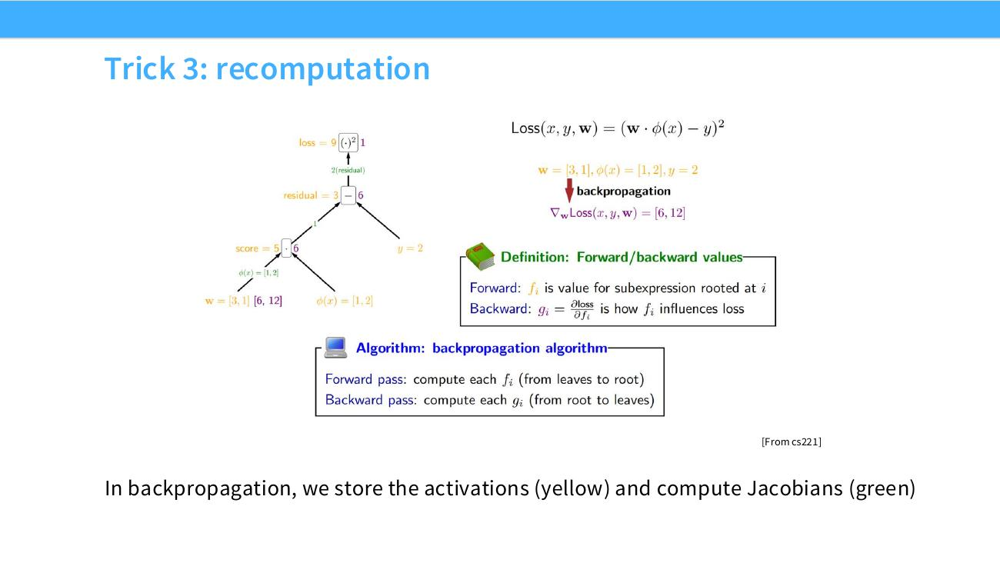

本页（借自 CS221 课件）先复习反向传播的存储需求：前向时每层激活（黄色）被保存，反向时用来计算 Jacobian（绿色）。这张图明确了重计算要省的对象——不是参数，不是梯度，而是前向激活这批"只为反向而存在"的中间数据。对深网络而言，这批数据可以比参数本身大几个数量级。

训练反向传播需要前向激活。若把每层激活全部写到 HBM，反向时再读，内存容量和带宽都会成为瓶颈。activation checkpointing/recomputation 只保存少数检查点，在反向需要时重新计算中间值。

课件用三个 sigmoid 的玩具链路计数。全保存方案：前向 1 次读、3 次写，反向 3 次读、1 次写，共 8 次访问。


*图：保存三个 sigmoid 中间结果时，前后向合计示意为 8 次 global-memory access（00:50:50--00:51:36）。这是教学计数，不含 cache、融合和实际反向 kernel 的全部流量。*

只保存端点并在反向重算：前向 1 次读、1 次写，反向 2 次读、1 次写，共 5 次；教学示例的访问量变为：

$$
\frac{5}{8}=62.5\%,\qquad 1-\frac{5}{8}=37.5\%.
$$

这个玩具模型可以推广：一条 $k$ 个逐元素算子组成的链，全保存需要 $2k+2$ 次访问（前向读 1 写 $k$，反向读 $k$ 写 1），只存端点需要 $k+2$ 次（前向读 1 写 1，反向读端点、重算过程中读若干、写 1）。链越长，重计算的相对收益越大，渐近节省约 $k/(2k)=50\%$。


*图：重计算把玩具示例的 8 次访问降为 5 次，以额外 sigmoid 计算换取 37.5% 的访问减少（00:51:38--00:52:39）。该比例不是任意网络的通用节省率。*

为什么这笔交易划算？回到 Roofline：逐元素激活函数（sigmoid、GELU、dropout）的算术强度在 $1$ FLOP/byte 量级，而 H100 的 ridge point 约 $295$——这些算子的重算几乎"免费"，因为计算单元本来就闲着；省下的却是真金白银的 HBM 带宽与容量。反向传播恰好站在相反的位置：它是整个训练流程中 HBM 流量最密集的环节之一。

最适合重算的是计算便宜、输出大的算子；若算子本身已 compute-bound 或随机性/副作用难以复现，重算收益会下降。实践中 checkpoint 粒度应同时考虑峰值显存、额外 FLOPs 与重算能否被融合。一个经验法则是：对 memory-bound 的逐元素与归一化链积极重算，对 compute-bound 的大矩阵乘保守保留。

### 本章小结

- Fusion 减少中间张量的 HBM 往返和 kernel launch，但可能增加寄存器压力；$\sin^2+\cos^2$ 玩具例的流量从 $22n$ 降到 $4n$ bytes，LayerNorm/GELU 量级类似。
- Recomputation 不保存所有激活，而在反向时重新计算，用 FLOPs 换带宽与容量；$k$ 链的访问数从 $2k+2$ 降到 $k+2$。
- 重算之所以划算，是因为被重算的算子算术强度极低，计算单元本来闲置。
- 两者都必须以端到端 profile 判断，玩具访问计数只能解释机制。

## 6. Coalescing、tiling 与矩阵尺寸之谜

### 6.1 Coalescing 关心同一条指令的 lane 地址

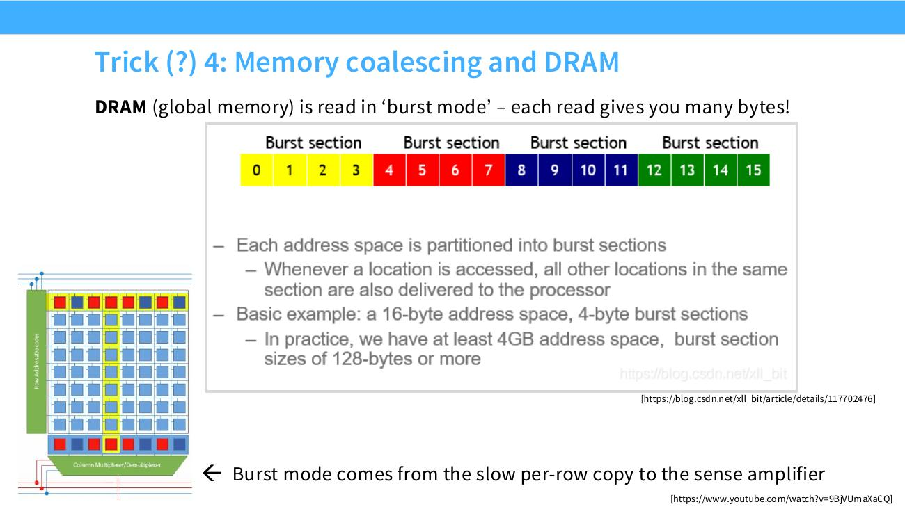

本页解释 burst 的物理来源：DRAM 按行把一整行数据拷贝到 sense amplifier，之后从该行读取的代价骤降——因此一次读取天然"附赠"许多相邻字节。这说明 burst mode 不是设计偏好而是器件物理：既然每行激活的成本已经付了，不多搬几个字节就是浪费。合并访存的全部意义，在于让这附赠的字节恰好是程序需要的字节。

DRAM 不是按单个标量随取随到，而是以对齐的 burst/transaction 搬一段连续字节。若同一 warp 的 lane 访问连续、对齐地址，硬件能用少量事务满足请求；地址跨许多段时，需要更多事务，实际带宽下降。


*图：连续地址可以合并进较少 burst，离散地址需要更多内存事务（00:54:14--00:55:02）。图中的 128-byte burst 是教学示意；真实事务受架构、cache line 与访问宽度影响。*

把数量关系写清楚：一个 warp 的 32 个 lane 各读一个 4-byte 字，若地址连续且对齐，总共 $32\times4=128$ bytes，恰好落入一个 128-byte 事务，带宽利用率 $100\%$；若地址以 stride $s$（以字为单位）跳跃，则 32 次访问散落在 $32$ 个不同的事务中，每个事务实际只用到 $4$ bytes，有效带宽降为 $1/\min(s,32)$ 量级。注意代价来自"搬了用不到的字节"，而不是"发了更多指令"——指令数完全一样，是内存系统为每个请求搬回了整段数据。

row-major 矩阵的地址为：

$$
\operatorname{addr}(A_{ij})=\operatorname{base}(A)+(in+j)b.
$$

- $i,j$：行、列索引。
- $n$：每行元素数。
- $b$：每元素字节数。

当 lane id 映射到连续的 $j$，地址相邻；映射到连续的 $i$，步长是 $nb$。所以"沿行/沿列一定合并"并非独立于线程映射的真理，正确问题是：**同一 warp、同一 load/store 指令下，各 lane 的线性地址是什么？** 同一个沿列遍历的循环，在"lane→行"的映射下是灾难，在"lane→列、warp→行"的映射下完全合并；转置 kernel 之所以通常借助 shared memory 做一次片上中转，正是为了让 HBM 两侧都看到连续地址。

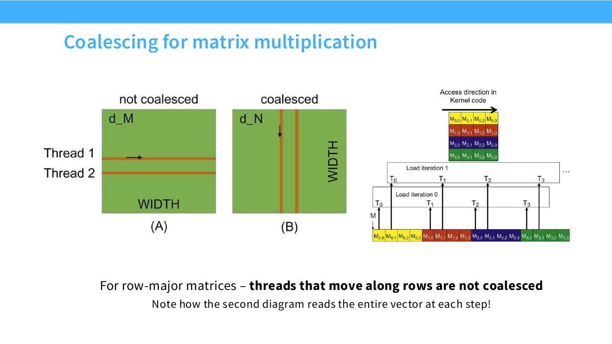

本页把合并问题放到矩阵乘语境：行主序矩阵中，沿行移动的线程访问连续地址（合并），沿列移动的线程步长为一整行（不合并）；注意第二幅图中每前进一步都要读入整行却只用一个元素——这正是 stride 访问有效带宽按 $1/s$ 衰减的图示。它与上文地址公式 $\operatorname{addr}(A_{ij})=\operatorname{base}+(in+j)b$ 互为表里：合并与否，答案写在 lane 到 $(i,j)$ 的映射里。

### 6.2 Tiling：先搬进 SRAM，再反复使用

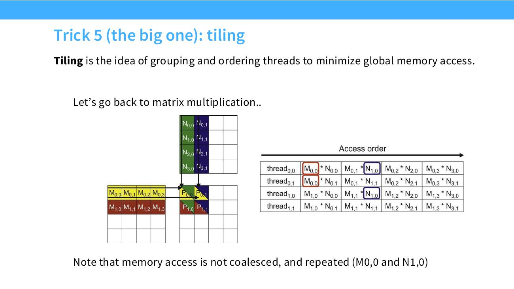

本页引出"重头戏"（the big one）tiling：通过重新分组与排序线程来最小化 global memory 访问。图下半部分点出朴素矩阵乘的两个病灶——访存既不合并，又有大量重复读取（$M_{0,0}$ 与 $N_{1,0}$ 被多个输出反复取用）。重复读取意味着同一个字节付了多次 HBM 运费，这正是下面推导要消掉的开销。

矩阵乘每个输出元素都要沿 $k$ 维读取一行 $A$ 和一列 $B$。朴素实现让相同输入元素从 global memory 被反复读取。Tiling 把 $A$、$B$ 切成小块，由一个 block 协作装入 shared memory，然后在片上完成多个 partial sums。


*图：block 分阶段载入输入 tiles 到 shared memory，并为输出 tile 累积部分和（00:59:29--01:00:17）。图中文字中的个别 tile 下标只是示意，核心是沿归约维反复载入对应块。*

现在推导 tiling 的 HBM 流量。设 $C=AB$，$A\in\mathbb{R}^{M\times K}$，$B\in\mathbb{R}^{K\times N}$，总计算量

$$
F=2MNK.
$$

**朴素实现**：每个输出元素 $C_{ij}$ 需要 $A$ 的第 $i$ 行与 $B$ 的第 $j$ 列，若完全没有片上复用，$A$ 的每个元素被读取 $N$ 次、$B$ 的每个元素被读取 $M$ 次，HBM 元素读取量为

$$
Q_{\text{naive}}=MKN+MNK=2MNK\ \text{elements},
$$

与 $F$ 同阶——这就是 $O(MNK)$ 级别的流量。

**分块实现**：输出被切成 $b_M\times b_N$ 的 tile，每个 block 负责一个输出 tile。沿 $k$ 维前进时，block 每次把 $A$ 的一个 $b_M\times b_K$ 块和 $B$ 的一个 $b_K\times b_N$ 块装入 shared memory，块内数据被该 tile 的全部输出复用。此时：

- $A$ 的每个元素被多少 block 使用？沿 $N$ 方向共有 $N/b_N$ 个 block 列，每个都把同一行块装一次，故 $A$ 每个元素从 HBM 读 $N/b_N$ 次，总读取 $MKN/b_N$；
- 同理 $B$ 每个元素读 $M/b_M$ 次，总读取 $MNK/b_M$；
- 输出 $C$ 写回 $MN$ 个元素。

$$
Q_{\text{tile}}=\frac{MNK}{b_N}+\frac{MNK}{b_M}+MN.
$$

取方阵 $M=N=K$ 且 $b_M=b_N=T$，得

$$
Q_{\text{tile}}=\frac{2N^3}{T}+N^2,
$$

即每个输入元素从 HBM 被读的次数由约 $N$ 降为约 $N/T$，在 tile 内被复用 $T$ 次；global-memory 读取近似减少 $T$ 倍。当 $T$ 大到与 $N$ 相当（或借助 L2 的二次复用），流量进一步逼近下限 $MK+KN+MN$——每个输入只读一次、输出只写一次，这正是 $O(MK+KN+MN)$ 级别的来源。


*图：tile 内共享数据使输入从 global memory 的读取次数由约 $N$ 降至 $N/T$（01:00:19--01:00:58）。这是忽略 cache、边界、写回和双缓冲的理想模型。*

代入数值验证。$M=N=K=4096$，FP16（2 bytes/element），$T=128$：

$$
Q_{\text{naive}}=2\times4096^3\times2\ \mathrm{B}\approx 275\ \mathrm{GB},
$$

$$
Q_{\text{tile}}=\left(\frac{2\times4096^3}{128}+4096^2\right)\times2\ \mathrm{B}\approx 2.2\ \mathrm{GB}.
$$

流量降低约 $125\times$，几乎等于 $T$。对应的算术强度（忽略输出写回）为

$$
I\approx\frac{2MNK}{2\left(MNK/b_N+MNK/b_M\right)}\approx\frac{b_Mb_N}{b_M+b_N}\ \mathrm{FLOP/byte},
$$

$T=128$ 时 $I\approx64$ FLOP/byte——仍低于 H100 约 $295$ 的 ridge point。这说明**仅靠 shared memory 一级复用还不足以让矩阵乘 compute-bound**；真实的高性能 GEMM 还有第二级复用——register blocking：每个线程在寄存器里再维护一个 $r_M\times r_N$ 的微 tile，把 SRAM 到寄存器这一级再做 $r$ 倍复用，等效算术强度乘以微 tile 因子，最终越过 ridge point。

tile 不能无限变大：shared memory 容量（每 SM 约 228 KB）、寄存器数、block 最大线程数、occupancy、bank conflict 与 pipeline 都有限制。好的 tile 是计算复用、资源占用与并发度的折中。例如 $128\times128$ FP16 输出 tile 需要 $2\times128\times b_K\times2$ bytes 的 SRAM 存放 $A$、$B$ 块，还要为双缓冲（prefetch 下一块与计算当前块重叠）留出两倍空间。

### 6.3 边界 tile 与 padding：多算一点反而更快

若 tile 为 $128\times128$，$256\times256$ 矩阵刚好切成 4 块；把其中一维增加到 257，该维需要 $\lceil257/128\rceil=3$ 个 tile，另一维仍为 2 个，示例变成 $2\times3=6$ 块。多出的那一条 tile 里只有 1 行（或 1 列）有效数据，其余 127 行全被 mask——但 block 资源（SM 槽位、寄存器、SRAM）照样被完整占用，相当于为 $1/128$ 的有效工作支付了一个完整 tile 的调度成本。


*图：矩阵维度不能整除 tile 时，少量有效元素可能触发整个边界 block（01:02:35--01:03:31）。实际库会选择多种 kernel，图示只解释一种量化效应。*

Padding 让 leading dimension 与 burst、tile 或 Tensor Core 约束更匹配，有时即使增加计算也会加速。需要指出，padding 的收益有两个来源：其一是消除上面这种 tile 边界浪费；其二是让内存布局对齐到事务粒度，避免一次连续访问被拆成两个 burst。两者经常同时出现，但机制不同。


*图：对齐 tile 可用较少 burst，未对齐边界可能拆成多个低效事务（01:04:04--01:05:11）。对齐要求取决于数据类型和 kernel，不存在普适"所有维度都补到 2 的幂"。*

nanoGPT 的著名例子把词表从 50257 padding 到 50304，即最近的 64 倍数。虽然多算了无用 logits，却进入更高效的 kernel 路径，在该实验中约加速 25%。


*图：50257 补到 50304 后，额外计算换来更好的矩阵形状与 occupancy（01:05:11--01:05:45）。25% 是特定软件、硬件和 shape 的结果，不应泛化为固定收益。*

这个例子值得算一笔账：词表从 50257 增加到 50304，相对计算量增加仅 $47/50257\approx0.09\%$，却换来 25% 的加速——投入产出比超过 250:1。这是"FLOPs 免费、调度昂贵"的极端体现：当 kernel 处于 memory-bound 或调度受限状态时，多算一点点根本不增加瓶颈资源，却可能解锁完全不同的执行路径。

### 6.4 为什么 matmul 吞吐曲线呈锯齿

方阵尺寸增加时，理论 FLOPs 平滑增长，但实测 TFLOP/s 出现多条带状与周期性骤降。现在可以把现象拆成三层：

1. 小矩阵算术强度低，启动和搬运占比高；
2. tile 整除与对齐决定边缘浪费和内存事务；
3. tile 数与 SM 数的配比决定最后一波是否低利用率。


*图：性能曲线同时呈现算术强度、tiling/alignment 与 wave quantization 的影响（01:06:16--01:06:40）。横轴增大不保证每个相邻尺寸都更快。*

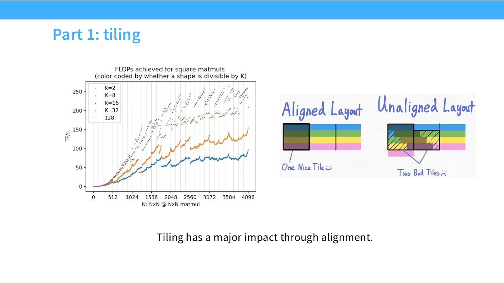

本页给出第一部分答案：tiling 通过 alignment 产生主要影响——当矩阵维度是 tile 尺寸（及 burst 宽度）的整数倍时，吞吐落在带上沿；差一个元素就可能跌落。这把第 6.3 节的单点例子（$257$ 行触发整块边界 tile）推广成了整条曲线的包络：带与带之间的落差，就是对齐与否的代价。

第三层称为 wave quantization，其代价模型如下。设输出被切成 $n_{\text{tile}}$ 个 tile，GPU 有 $S$ 个 SM、每个 SM 同时驻留一个 tile（简化假设），每个 tile 耗时 $\tau$。则 tile 只能成"波"调度，总时间

$$
T\approx\left\lceil\frac{n_{\text{tile}}}{S}\right\rceil\tau,
$$

而有效吞吐正比于 $n_{\text{tile}}/T$。**总时间在 $\lceil n_{\text{tile}}/S\rceil$ 跳变处阶梯式增长，而工作量平滑增长——二者之比就是锯齿。** 每个 wave 的 slot 利用率为 $n_{\text{tile}}/\left(S\lceil n_{\text{tile}}/S\rceil\right)$，当 $n_{\text{tile}}$ 略超过 $S$ 的整数倍时，最后一个 wave 几乎全空，利用率骤降。

以课件的 $256\times128$ 输出 tile 为例：

$$
\left\lceil\frac{1792}{256}\right\rceil
\left\lceil\frac{1792}{128}\right\rceil=7\times14=98,
$$

而矩阵边长增加到 1793 后：

$$
\left\lceil\frac{1793}{256}\right\rceil
\left\lceil\frac{1793}{128}\right\rceil=8\times15=120.
$$

- 1792、1793：输出矩阵的维度。
- 256、128：示例 kernel 的输出 tile 两个边长。
- 98、120：需要调度的 tiles/block 数。

A100 示例有 108 个 SM。98 个 tile 可近似一波完成；120 个需要第二波，而第二波只有 $120-108=12$ 个 tile 在工作。若粗略把每个 SM 同时容纳一个 tile，则两波 slot 利用率为：

$$
\frac{120}{2\times108}\approx55.6\%.
$$

即矩阵边长只增加了 $1/1792\approx0.06\%$，理论工作量几乎不变，实际时间却接近翻倍——吞吐曲线在该点出现深谷。反之，在 $n_{\text{tile}}$ 恰好等于 $S$ 整数倍的"甜点"尺寸处，曲线出现尖峰。这就是为什么要扫描 shape 做 autotuning：相邻尺寸之间的性能差异可以完全由调度几何决定，与算法无关。


*图：1792 到 1793 的矩阵维度变化使 tile 数从 98 跳到 120，超过 108 个 SM 的单 wave 容量（01:07:42--01:09:20）。讲者口头曾说"tile size 加一"，准确说法是矩阵维度加一。真实并发还取决于每 SM 可驻留 block 数与资源。*

> [!IMPORTANT]
> 这也解释了为什么性能调优不能只看 FLOPs。shape 改变可能切换 kernel、tile、对齐、wave 数与 occupancy；基准必须使用真实 batch、sequence、hidden size 和精度。

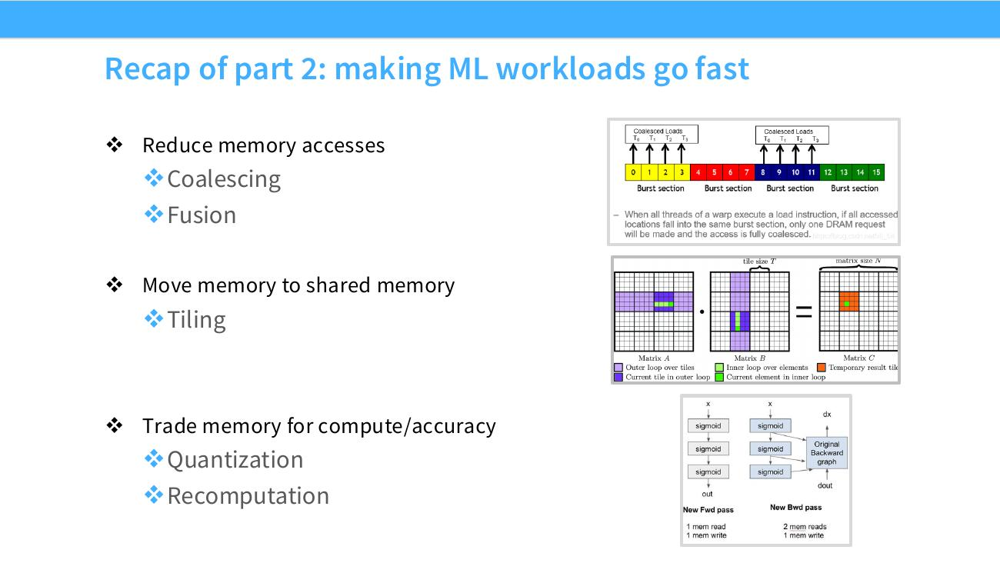

本页回顾第二部分的武器库，并给出统一的分类视角：减少访存次数（coalescing、fusion）、把数据搬进 shared memory 复用（tiling）、用存储换计算或精度（量化、重计算）。三类恰好对应 Roofline 的三个可动部件——有效带宽 $B_{\text{mem}}$、字节数 $M$、以及 $F$ 与 $I$ 的再分配。至此六件武器全部登场，第三部分要用它们拆解一个真实算法。

### 本章小结

- Coalescing 看的是同一 warp 指令下各 lane 的线性地址是否连续、对齐；stride $s$ 的访问把有效带宽降为约 $1/s$。
- Tiling 把数据放进 shared memory 复用：HBM 流量从 $O(MNK)$ 降到 $MNK(1/b_M+1/b_N)+MN$，tile 边长为 $T$ 的方阵乘约省 $T$ 倍；再叠加 register blocking 才能越过 ridge point。
- tile 受 SRAM、寄存器、occupancy、边界与对齐约束，不是越大越好。
- 矩阵尺寸的锯齿性能来自 kernel 路径、tile quantization、对齐与 wave quantization 共同作用；$T\approx\lceil n_{\text{tile}}/S\rceil\tau$ 的阶梯是锯齿的几何来源。

## 7. FlashAttention：把整堂课组合成一个算法

### 7.1 标准 attention 的数学与内存问题

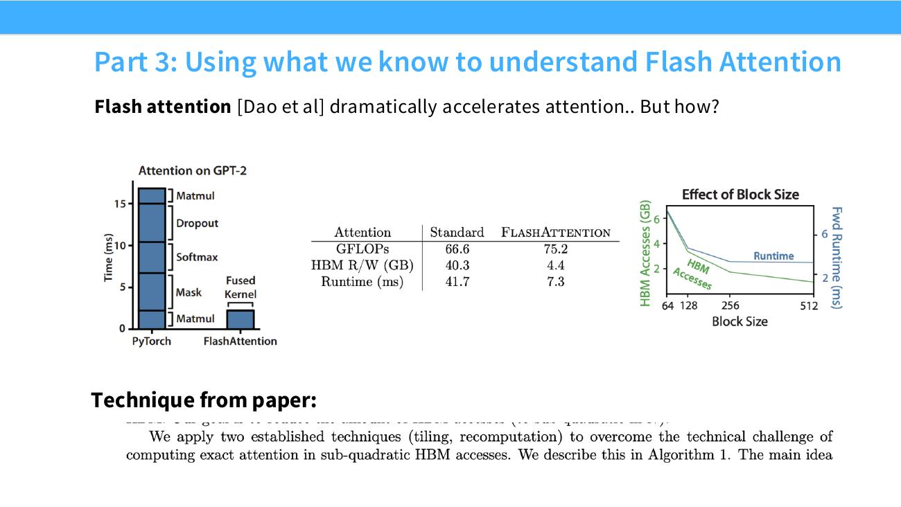

本页开启第三部分：FlashAttention（Dao 等人）把 attention 大幅加速——但它是怎么做到的？讲者在此处的设计意图很明确：这个算法没有任何一项全新技术，它是对第二部分全部原理的一次综合应用。因此第 7 节既是新内容，也是全讲的总复习与结业考试。

单头 scaled dot-product attention 为：

$$
Q=XW_Q,\qquad K=XW_K,\qquad V=XW_V,
$$

$$
S=\frac{QK^\top}{\sqrt{d_k}},\qquad P=\operatorname{softmax}_{\text{row}}(S),\qquad O=PV.
$$

- $X\in\mathbb{R}^{N\times d}$：长度为 $N$ 的输入表示。
- $Q,K,V$：查询、键和值。
- $d_k$：每个 attention head 的 key 维度。
- $S\in\mathbb{R}^{N\times N}$：注意力分数矩阵。
- $P$：对每一行跨所有 key 归一化后的概率。
- $O$：最终 attention 输出。

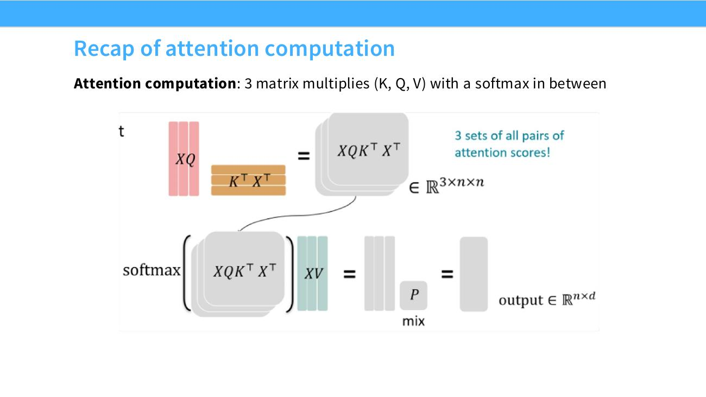

本页回顾 attention 的计算流：先经 $W_Q,W_K,W_V$ 三次矩阵乘得到 $Q,K,V$，中间夹一个逐行 softmax，最后 $PV$ 完成输出——"三次矩阵乘加一个 softmax"。请留意这个表述里的陷阱：三次矩阵乘都有 Tensor Core 伺候，唯一没有专用硬件的 softmax 及其 $N^2$ 中间张量，恰恰是瓶颈所在——下面的 Roofline 体检将证实这一点。

先用 Roofline 给标准实现做个体检。计算量集中在两次矩阵乘，$F\approx4N^2d_k$ FLOP。而朴素流程把 $S$ 和 $P$ 写到 HBM，再读回来做 softmax 和第二次矩阵乘，HBM 元素级流量（忽略较小的 $Q,K,V,O$）为：写 $S$（$N^2$）、读 $S$（$N^2$）、写 $P$（$N^2$）、读 $P$（$N^2$），共约 $4N^2$ 个元素，FP16 下约 $8N^2$ bytes。算术强度

$$
I\approx\frac{4N^2d_k}{8N^2}=\frac{d_k}{2}\ \mathrm{FLOP/byte}.
$$

代入 $d_k=64$ 得 $I\approx32$ FLOP/byte，远低于 H100 约 $295$ 的 ridge point——**标准 attention 是 memory-bound 的，且瓶颈不在矩阵乘本身，而在 $N^2$ 中间张量的物化**。长上下文时问题随 $N$ 二次恶化：$N=8192$ 时单个 $S$ 矩阵就有 $6.7\times10^7$ 元素（FP16 约 134 MB），而每个 SM 的 SRAM 只有 228 KB，差了三个数量级。FlashAttention 不是删除某些注意力边，也不是近似 attention；它改变计算顺序，使中间分数 tile 不落 HBM。

### 7.2 第一块积木：给 $Q,K,V$ 做 tiling

算法把 $K,V$ 切成块，将当前块与 $Q$ 块搬到片上 SRAM，在 SRAM 中计算分数、指数和加权和，只把必要的统计量与输出写回。


*图：Q、K、V 块从 HBM 复制到 SRAM，在片上计算注意力块并写回输出（01:13:30--01:14:07）。左侧带宽/容量数字是特定硬件的示意，重要的是 SRAM 小而快、HBM 大而慢。*

设 $Q$ 按行分成块大小 $B_r$ 的 tile，$K,V$ 按行分成块大小 $B_c$ 的 tile。处理一对 tile 时，片上需要驻留 $Q$ 块（$B_r\times d$）、$K$ 块与 $V$ 块（各 $B_c\times d$）、分数块（$B_r\times B_c$）以及若干统计量，SRAM 预算约束为

$$
(B_r+2B_c)d+B_rB_c\ \lesssim\ \text{每 SM SRAM 容量}.
$$

这正是第 6.2 节 tiling 推导的应用：分数块 $S^{(r)}$ 在片上被 $O$ 的更新复用后**直接丢弃**，从不写回 HBM。

困难在于 softmax 的分母需要整行所有 key：只看到一个 tile 时，无法知道未来是否出现更大的 logit，也不知道最终归一化常数。这就是第二块积木要解决的问题。

### 7.3 第二块积木：在线、数值稳定的 softmax

普通数值稳定 softmax 先找全局最大值：

$$
m=\max_k x_k,\qquad y_i=\frac{e^{x_i-m}}{\sum_j e^{x_j-m}}.
$$

减去最大值不改变数学结果（分子分母同乘 $e^{-m}$），但保证指数函数的输入不超过 $0$，从而不会上溢。它的代价是需要**两遍扫描**：第一遍求 $m$ 与分母，第二遍才能输出 $y_i$。两遍扫描意味着中间量必须被保存——这正是我们要避免的。

在线算法扫描元素或 tiles，同时维护当前最大值 $m_j$ 与经过最大值校正的分母 $d_j$：

$$
m_0=-\infty,\qquad d_0=0,
$$

$$
m_j=\max(m_{j-1},x_j),
$$

$$
d_j=d_{j-1}e^{m_{j-1}-m_j}+e^{x_j-m_j}.
$$

最终：

$$
y_i=\frac{e^{x_i-m_V}}{d_V}.
$$

- $x_j$：当前扫描到的 logit。
- $m_j$：前 $j$ 个 logit 的最大值。
- $d_j$：以当前最大值为基准的指数和。
- $V$：该行的元素总数，这里不是 attention 的 value matrix。

**正确性证明（归纳法）**。我们证明不变式：处理完前 $j$ 个元素后，$d_j=\sum_{k=1}^{j}e^{x_k-m_j}$，即以"当前最大值"为基准的指数和恒等于真实指数和的重标定。

- **基例** $j=1$：$m_1=x_1$，$d_1=0\cdot e^{-\infty}+e^{x_1-x_1}=1=\sum_{k=1}^{1}e^{x_k-m_1}$。成立。
- **归纳步**：假设 $d_{j-1}=\sum_{k=1}^{j-1}e^{x_k-m_{j-1}}$。代入更新式：

$$
d_j=\left(\sum_{k=1}^{j-1}e^{x_k-m_{j-1}}\right)e^{m_{j-1}-m_j}+e^{x_j-m_j}
=\sum_{k=1}^{j-1}e^{x_k-m_j}+e^{x_j-m_j}
=\sum_{k=1}^{j}e^{x_k-m_j}.\ \square
$$

当新最大值变大，旧分母必须乘 $e^{m_{j-1}-m_j}$，把旧基准重标到新基准。这一步就是"未来出现更大 logit"时仍能保持正确性的关键。由于 $m_j$ 单调不减，重标定因子 $e^{m_{j-1}-m_j}\leq1$，数值上永远是"缩小旧值"，不会引入上溢。扫描结束后用最终的 $m_V$ 与 $d_V$ 一次性归一化，结果与两遍算法在数学上完全等价，只差浮点运算顺序。


*图：在线 normalizer 同时更新最大值与分母，使 softmax 可逐 tile 计算（01:14:07--01:15:37）。softmax 是逐行跨 key 归一化，不是对整个 $N\times N$ 矩阵共用一个分母。*

下面的 PyTorch 代码验证逐元素在线 softmax 与标准稳定 softmax 的数值等价：

```python
import torch

def online_softmax(x: torch.Tensor) -> torch.Tensor:
    """逐元素在线 softmax：单遍扫描维护 (m, d)，最后统一归一化。"""
    m = torch.tensor(float("-inf"), dtype=x.dtype)  # 当前最大值
    d = torch.zeros((), dtype=x.dtype)              # 以 m 为基准的指数和
    for xj in x:
        m_new = torch.maximum(m, xj)
        d = d * torch.exp(m - m_new) + torch.exp(xj - m_new)  # 旧分母重标定
        m = m_new
    return torch.exp(x - m) / d                     # 第二遍只做最终归一化

x = torch.randn(100_000, dtype=torch.float64) * 20  # 大范围 logit 考验稳定性
ref = torch.softmax(x, dim=0)                       # 标准稳定 softmax
out = online_softmax(x)
print("最大绝对误差:", (out - ref).abs().max().item())   # 约 1e-16 量级
print("两者之和:", out.sum().item(), ref.sum().item())   # 均严格为 1
```

### 7.4 第三块积木：在线修正输出

设第 $r$ 个 $K,V$ tile 给出：

$$
S^{(r)}=Q(K^{(r)})^\top,\qquad A^{(r)}=\exp(S^{(r)}).
$$

若暂时忽略 max-rescaling，只看两块的分母更新：

$$
\ell_1=\sum_i \exp(S_i^{(1)}),\qquad
\ell_2=\ell_1+\sum_i \exp(S_i^{(2)}),
$$

$$
O_1=\frac{A^{(1)}}{\ell_1}V^{(1)},
$$

$$
O_2=\frac{\ell_1}{\ell_2}O_1+\frac{A^{(2)}}{\ell_2}V^{(2)}.
$$

- $S^{(r)}$：第 $r$ 个 score tile。
- $A^{(r)}$：其逐元素指数。
- $\ell_r$：处理到第 $r$ 块时的累计归一化分母。
- $O_r$：处理到第 $r$ 块时的在线输出。

验证第二块的正确性：把 $O_1$ 的定义代入 $O_2$，

$$
O_2=\frac{A^{(1)}V^{(1)}}{\ell_2}+\frac{A^{(2)}V^{(2)}}{\ell_2}
=\frac{A^{(1)}V^{(1)}+A^{(2)}V^{(2)}}{\ell_1+\textstyle\sum_i\exp(S_i^{(2)})},
$$

分子恰好是两块各自未归一化加权和之和，分母恰好是两块的联合归一化常数——与一次性计算 $(A^{(1)}\,A^{(2)})(V^{(1)};V^{(2)})/\ell_2$ 完全相等。新 tile 到来后，旧输出的权重要从旧分母改到新分母，所以乘 $\ell_1/\ell_2$；这就是 telescoping update：每一步都把"到目前为止的部分结果"修正为"以新分母为基准的部分结果"。

真实数值稳定实现还必须像在线 softmax 一样维护每行最大值，并同时 rescale 旧分母与旧输出；课件的两块公式是为了突出 telescoping update 而省略了这一层。把第 7.3 节的重标定因子补回来，第 $r$ 步（对 $Q$ 的某一行块）的完整更新为：

$$
\tilde m_r=\operatorname{rowmax}(S^{(r)}),\qquad
m_r=\max(m_{r-1},\tilde m_r),
$$

$$
\ell_r=e^{m_{r-1}-m_r}\ell_{r-1}+\operatorname{rowsum}\!\left(e^{S^{(r)}-m_r}\right),
$$

$$
\tilde O_r=e^{m_{r-1}-m_r}\tilde O_{r-1}+e^{S^{(r)}-m_r}V^{(r)},
$$

扫描完全部 $K,V$ tile 后输出 $O=\tilde O_{\text{last}}/\ell_{\text{last}}$。其中 $\tilde O$ 是未归一化的累加器，把除法推迟到最后一步（FlashAttention-2 的做法）还减少了每步的运算量。**等价性证明**沿用同一归纳：不变式为 $\tilde O_r=\sum_{k\in\text{已处理}}e^{s_k-m_r}V_k$ 与 $\ell_r=\sum_{k}e^{s_k-m_r}$——两者同时以 $e^{m_{r-1}-m_r}$ 重标定，基准始终一致；最终除法把分子分母的共同因子 $e^{-m_{\text{last}}}$ 约去，结果正是标准 softmax attention 的数学定义，至多相差浮点求和顺序。$\square$

**显存复杂度分析**。标准实现必须物化 $S,P\in\mathbb{R}^{N\times N}$：反向需要 $P$（或由 $S$ 重算），显存增量为 $\Theta(N^2)$。FlashAttention 前向只写回 $O$（$Nd$）、每行的 $\ell$ 与 $m$（各 $N$），共 $\Theta(Nd+2N)=\Theta(N)$ 级别；反向时按 tile 从 $Q,K,V,O$ 与 $(\ell,m)$ **重算**所需的分数块——这正是第 5.2 节 recomputation 思想在 attention 内部的运用。显存从 $O(N^2)$ 降到 $O(N)$，使长上下文训练的显存瓶颈从 attention 中间量转移回参数与优化器状态。


*图：分数与指数块在 SRAM 中产生，不物化到 HBM；累计分母变化时在线重标旧输出（01:15:37--01:17:03）。反向同样按 tile 重计算必要中间量，避免保存完整 $N^2$ 矩阵。*

### 7.5 为什么"做更多 FLOPs"仍然更快

课件引用 GPT-2 attention 实验：标准实现到 FlashAttention 的 GFLOPs 从 66.6 增到 75.2（约多 12.9%），HBM 读写从 40.3 GB 降到 4.4 GB（约 $9.2\times$ 减少），运行时间从 41.7 ms 降到 7.3 ms（约 $5.7\times$ 加速）。

把这三个数字放回 Roofline 验证。多出的 12.9% FLOPs 来自反向重算与在线统计的额外运算——正如第 5 节所说，这些计算发生在本来闲置的计算单元上；而 $9.2\times$ 的 HBM 流量削减直接作用于瓶颈资源。若原 kernel 完全 memory-bound，时间应近似按流量比下降，$41.7/9.2\approx4.5$ ms；实测 7.3 ms，介于理想带宽缩放与无加速之间——剩余的差距来自片上开销、占用率与未被消除的固定成本。这正是 Roofline 的结论：原问题主要 memory-bound 时，增加可在片上完成的重计算，却大幅减少 HBM traffic，总时间反而下降。

FlashAttention 综合了：

- **tiling**：Q/K/V 与 score 块在 SRAM 复用；
- **fusion**：矩阵乘、缩放、指数、统计量和输出更新在更少 kernel 中完成；
- **online softmax**：无需先物化完整 score 矩阵再做全行归一化；
- **recomputation**：反向按 tile 重算，而非保存所有 $N^2$ 中间值。

> [!NOTE]
> FlashAttention 在数学上是 exact attention（允许浮点运算顺序导致的微小差异），其核心贡献是 I/O-aware 的计算调度。不要把它与稀疏或低秩近似 attention 混为一谈。

### 本章小结

- 标准 attention 的主要问题是 $N^2$ score/probability 中间张量的 HBM 读写，算术强度约 $d_k/2$ FLOP/byte，深度 memory-bound。
- FlashAttention 对 Q/K/V 分块，并用在线最大值与分母解决跨 tile softmax；归纳不变式保证与标准结果数学等价。
- 累计分母或最大值变化时，旧分母与旧输出必须同步重标定；未归一化累加 + 末位一次除法更安全也更省。
- 显存从 $O(N^2)$ 降到 $O(N)$；它用片上重计算换 HBM traffic，是 tiling、fusion、recomputation 与 Roofline 的综合案例。

## 总结与延伸

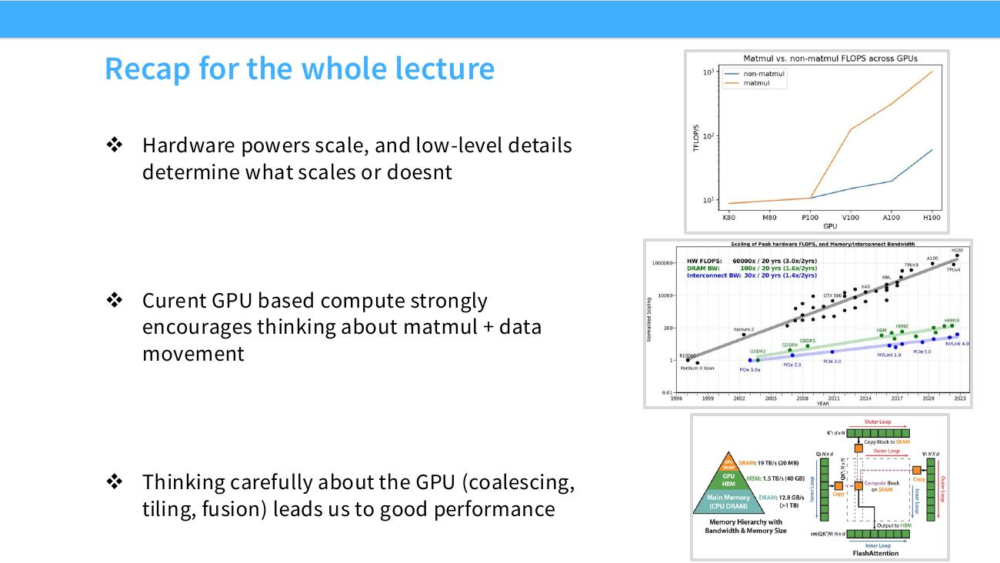

本页是全讲回顾：硬件支撑了规模扩展，底层细节决定什么能扩展、什么不能；当前基于 GPU 的算力格局强烈鼓励"矩阵乘 + 数据移动"的二元思维；仔细对待 GPU 的特性（coalescing、tiling、fusion）才能导向好性能。三句话分别对应本讲的三部分——这也解释了为什么本讲义以一条贯穿始终的推理链（scaling law → 存储层级 → Roofline → 六类优化 → FlashAttention）作为收束。

### 一条贯穿全讲的推理链

1. Scaling law 使更多有效计算转化为更好的模型，因此系统效率是建模能力的一部分；小指数意味着每一点损失改进都要求数量级更大的计算。
2. GPU/TPU 用大规模并行与矩阵专用单元提供很高峰值，但数据必须从 HBM 及时送到计算单元；延迟隐藏所需的并发度可用 $W=B\tau$ 估算。
3. Roofline 用 FLOP/byte 判断瓶颈：$T\geq\max(F/P_{\text{peak}},M/B_{\text{mem}})$，ridge point $I^*=P_{\text{peak}}/B_{\text{mem}}$ 在 H100/B200 上约为 280–300 FLOP/byte；现代语言模型优化常常首先是 I/O 优化。
4. 低精度减少每元素字节并提高专用矩阵吞吐（位数预算在指数与尾数之间分配）；fusion 和 recomputation 减少中间读写（前者省流量，后者用闲置 FLOPs 换流量）。
5. Coalescing 让每次事务更有效（同一 warp 的 lane 地址连续对齐），tiling 让搬进来的数据在片上多次复用（HBM 流量约省 tile 边长倍）。
6. Alignment 与 wave quantization 说明 shape 会改变真实调度（$T\approx\lceil n_{\text{tile}}/S\rceil\tau$），因此相邻尺寸的性能可以剧烈跳变。
7. FlashAttention 把上述原则统一到 attention：不物化 $N^2$ 中间量，并用在线 softmax（最大值与分母的同步重标定）保持精确结果，显存从 $O(N^2)$ 降到 $O(N)$。

### 面对新 kernel 的检查清单

- 数学上执行多少 FLOPs？其中多少是有效工作（而非 mask 掉或重算的）？
- 相对于 HBM、L2、shared memory，各自搬了多少 bytes？
- 算术强度位于 Roofline ridge point 的哪一侧？瓶颈资源到底是算力、带宽还是容量？
- lane 地址是否连续、对齐？是否存在 warp 内 divergence？条件相同的数据能否聚到同一 warp？
- 数据能否先放到 SRAM，再被多个输出复用？tile 尺寸是否受 SRAM、寄存器与双缓冲预算约束？
- shape 是否整除 tile？总 tile 数能否均匀填满 SM waves？最后一个 wave 的利用率是多少？
- 低精度的 scale、转换与敏感算子成本是否计入？累加器位宽是否足以承受 $Ku$ 量级的误差增长？
- fusion 或 recomputation 是否降低 HBM traffic，又是否造成寄存器压力或 occupancy 下降？
- 结论来自峰值规格、微基准，还是目标模型的端到端 profile？

### 建议的动手练习

1. 对 ReLU、LayerNorm 与方阵乘分别估算 FLOPs、bytes 和算术强度，预测谁更 memory-bound，再用本讲第 3.2 节的事件计时代码实测验证。
2. 写一个 CUDA/Triton 矩阵转置，对比连续 lane 地址与 stride 地址的有效带宽，观察有效带宽随 stride 的 $1/s$ 衰减。
3. 扫描 matmul 的 $M,N,K$，同时记录 kernel 名称、tile 数与吞吐，复现锯齿曲线，并用 $T\approx\lceil n_{\text{tile}}/S\rceil\tau$ 解释每个深谷。
4. 实现在线 softmax，逐元素版本与一次性稳定 softmax 对比数值误差；再推广到分块版本，并用归纳不变式检验每步的 $(m_j,d_j)$。
5. 用 profiler 比较普通 attention 与 FlashAttention 的 HBM traffic，而不只比较 wall-clock time；验证流量比与时间比之间的差值来自哪里。

### 本章小结

- 判断性能应先定位数据移动路径，再看峰值算力；真实 shape、精度和 kernel 共同决定结果。
- 低精度、fusion、recomputation、coalescing 与 tiling 是可组合的工具，而不是互斥技巧；它们的共同语言是 Roofline 的 $F$、$M$、$B_{\text{mem}}$、$P_{\text{peak}}$。
- FlashAttention 是完整范例：算法等价性、数值稳定性和硬件 I/O 约束必须同时成立。

最后可以把讲者的收束压缩成一句话：**memory, memory, memory**。硬件给出峰值上限，真正决定训练能否扩展的，是你让多少数据、以什么精度、沿什么布局、在多近的存储层级被重复使用。
