# Stanford CS336 2026 Lecture 5：GPUs, TPUs

- **视频标题**：Stanford CS336 Language Modeling from Scratch | Spring 2026 | Lecture 5: GPUs, TPUs
- **主讲 / 频道**：Tatsunori Hashimoto / Stanford Online
- **视频链接**：<https://www.youtube.com/watch?v=izZba4UA7iY>
- **时长**：01:18:39
- **材料范围**：人工英文字幕、1080p 课程视频与官方 `lecture_05.pdf`
- **学习目标**：从执行模型、存储层级与 Roofline 出发，独立解释低精度、算子融合、重计算、合并访存、tiling、wave quantization 与 FlashAttention 为什么有效

> [!IMPORTANT]
> 本讲的统一问题不是“GPU 有多少个核心”，而是：**怎样让昂贵的计算单元持续吃到数据？** 语言模型的大部分优化最终都在回答三个问题——数据现在位于哪一级存储、移动多少次、移动后能被复用多少次。

## 1. 为什么训练语言模型必须理解硬件

### 1.1 Scaling law 把硬件效率变成模型能力

语言模型的损失会随训练计算量增加而下降。课件用 Kaplan 等工作的经验拟合说明这一点：

$$
L(C)=2.57C^{-0.048}.
$$

- $L(C)$：给定训练计算量时的验证损失。
- $C$：以 PetaFLOP/s-day 计的训练计算量。
- $2.57$ 与 $-0.048$：特定数据、模型族与拟合区间得到的经验参数。

指数很小并不意味着算力不重要，反而意味着每一点损失改进都可能要求数量级更大的计算量。若同一预算下把硬件有效利用率从 30% 提到 60%，就相当于把能用于训练的有效计算量翻倍。因此，kernel、精度格式与内存布局不是“部署之后再考虑”的细节，而是模型研究的一部分。

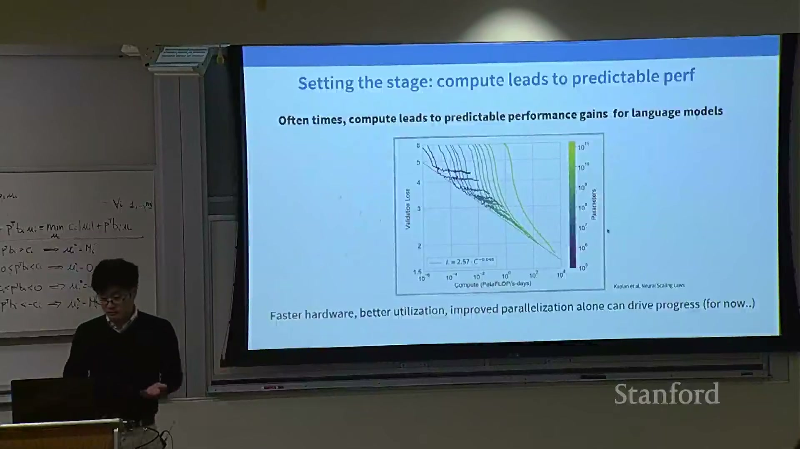

*图：讲者用 scaling law 建立“系统效率会反馈到模型能力”的动机（00:04:31--00:04:52）。这是一条经验拟合，不是跨数据集、跨架构不变的物理定律。*

### 1.2 Dennard scaling 结束之后，性能来自协同设计

过去，提高晶体管密度常能同时提高频率而不显著增加单位面积功耗；这一红利结束后，硬件不再仅靠“更快的单核”进步。现代加速器转向：

- 大规模并行，用很多较简单的执行单元隐藏延迟；
- 专用矩阵指令，把常见线性代数映射到更高吞吐的数据通路；
- 低精度数值格式，减少存储、带宽与乘加电路成本；
- 稀疏、编译与模型结构共同适配硬件。

课件引用的行业分解把十年 GPU 吞吐增长粗略归因于数值表示约 $16\times$、专用指令约 $12.5\times$、制程约 $2.5\times$、稀疏约 $2\times$，总量超过 $1000\times$。这些数字是特定口径下的说明，不应当相乘后当作任意 workload 的实测加速。

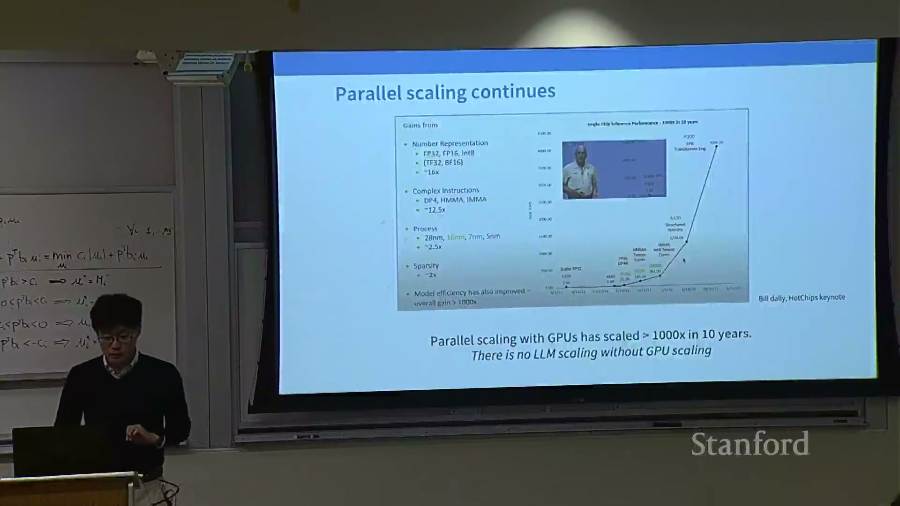

*图：性能增长来自精度、专用指令、制程与稀疏的共同作用（00:06:54--00:07:25）。图中的倍数用于建立量级直觉，不代表所有模型都可无条件获得同样加速。*

> [!NOTE]
> 从本讲开始，看到“更快”应立即追问：峰值 FLOPs 变高了，还是有效带宽变高了？是相同数学运算，还是精度、稀疏度或算法已经改变？

### 本章小结

- Scaling law 使硬件利用率直接影响同一预算下能达到的模型质量。
- 单核频率红利减弱后，GPU/TPU 的增长主要来自并行、专用化、低精度与软硬件协同。
- 峰值规格不是端到端吞吐；任何倍数都必须带上精度、形状、算法与测量范围。

## 2. GPU 与 TPU：执行模型和存储层级

### 2.1 CPU 优先低延迟，GPU 优先高吞吐

CPU 用复杂控制、乱序执行和大缓存让少量线程尽快完成；GPU 把更多晶体管用于执行单元，让大量线程同时驻留。当一组线程等待显存时，调度器切换到另一组可运行线程，以**延迟隐藏**换整体吞吐。

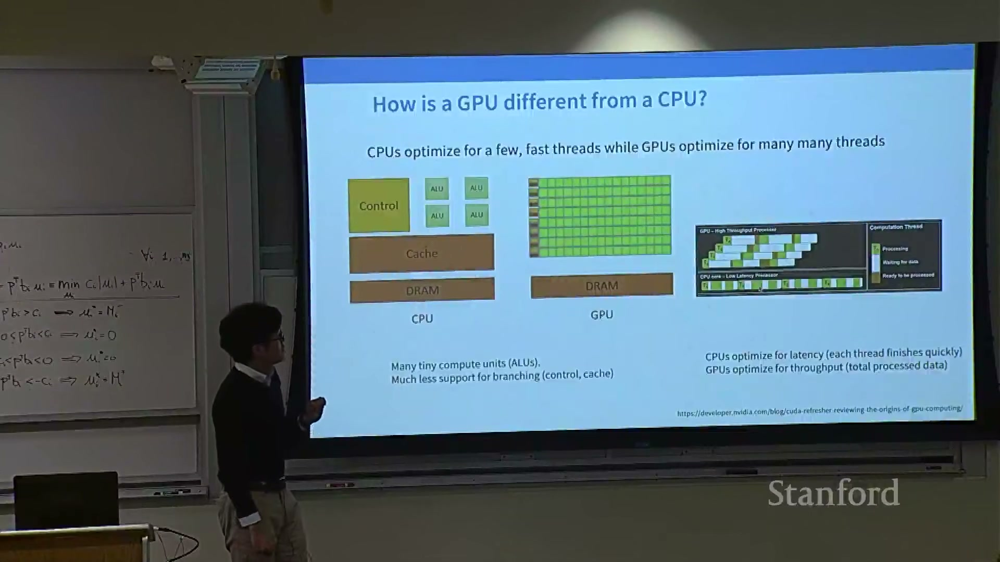

*图：CPU 侧重少量复杂核心的延迟，GPU 侧重大量并行执行单元的吞吐（00:08:14--00:09:05）。“GPU 单线程慢”不妨碍它在高并行 workload 上更快。*

GPU 从大到小可以建立如下心智模型：

1. 一个 device 含多个 Streaming Multiprocessor（SM）；
2. kernel 启动一个 grid，grid 由 thread block 组成；
3. block 被分配到某个 SM，并在其生命周期内共享资源；
4. block 内线程按 warp 执行，NVIDIA GPU 上通常一个 warp 为 32 个线程；
5. SM 内普通标量/向量 ALU、load/store 单元与 Tensor Core 处理不同类型指令。

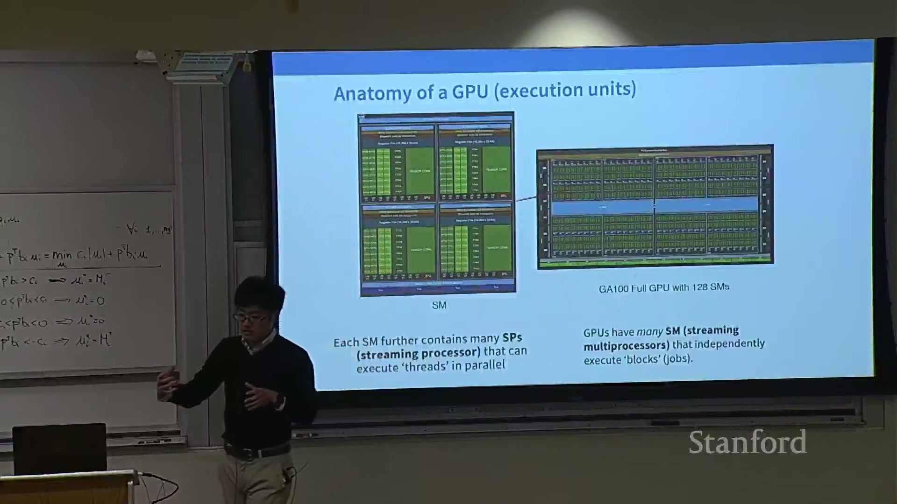

*图：GPU 由多个 SM 构成，SM 内再包含调度器、执行单元和局部存储（00:09:32--00:10:19）。图示是架构抽象；GA100 完整 die 的 128 个 SM 不等于所有 A100 SKU 都开放 128 个。*

### 2.2 thread、block、warp 不应混为一谈

例如一个 block 有 256 个线程，它通常包含 8 个 warp。硬件以 warp 为基本发射单位：同一 warp 的线程在同一时刻执行同一条指令，但可用不同数据。不同 warp、不同 block 不要求锁步。

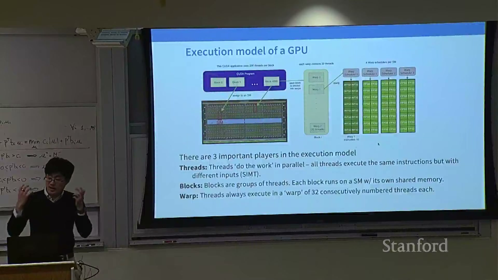

*图：grid 被切成 blocks，blocks 调度到 SM，block 又被拆成 warps（00:14:26--00:15:21）。“所有 GPU 线程都执行同一条指令”是错误的，锁步范围是 warp。*

这一区分解释了两个常见现象：

- 分支分歧发生在同一 warp 内；不同 warp 走不同分支并不直接造成 warp divergence。
- shared memory 和同步屏障通常以 block 为作用域；不能假定不同 block 能用普通 block barrier 同步。

### 2.3 越靠近计算单元，存储越小但越快

课件的示意延迟依次为：global memory 约 290 cycles、L2 约 200、L1 约 33、shared memory 约 23 或 19。具体数值会随架构和访问模式变化，真正应记住的是层级关系：寄存器与片上 SRAM 容量小、带宽高；HBM 容量大、离计算更远。

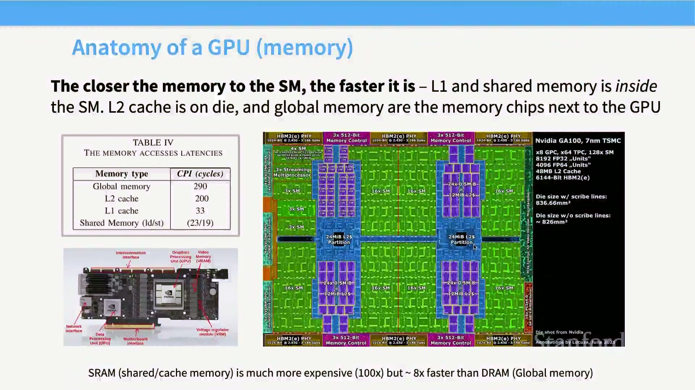

*图：从 global memory 到 shared memory，容量下降而访问更快（00:11:01--00:12:10）。课件给出的 cycle 数是特定测量的近似，不是所有 GPU 的固定常数。*

CUDA 名称还容易误导：

- **register**：每线程私有，通常最快；寄存器压力过高会降低 occupancy，甚至 spill。
- **local memory**：逻辑上每线程私有，但地址空间可能落在 device memory，不等于“片上局部缓存”。
- **shared memory**：每 block 共享的可编程片上 SRAM，适合显式数据复用。
- **global memory**：device 范围可见，容量最大但搬运最昂贵。

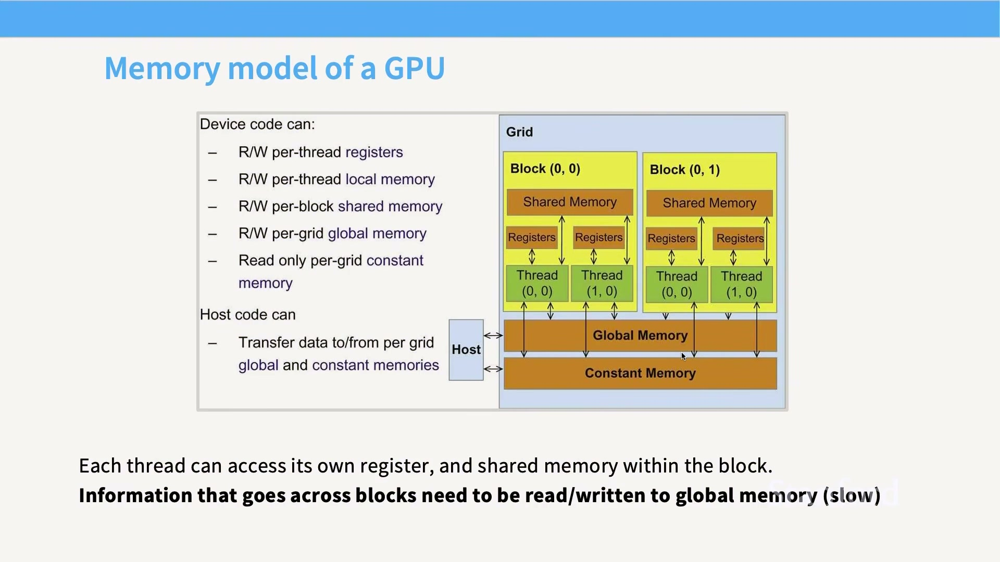

*图：register/local 属于线程，shared 属于 block，global 属于 device（00:16:24--00:17:18）。作用域和物理位置是两个不同概念。*

### 2.4 TPU 不是“另一种 CUDA GPU”，而是更粗粒度的专用机器

TPU 的抽象单元包括 scalar unit、vector processing unit（VPU）、matrix multiply unit（MXU）、片上 VMEM/SMEM 与 HBM。与 GPU 做概念映射时，可以把 TPU cell/TensorCore 类比成一个较大的计算域，把 VPU 看成通用向量通路，把 MXU 看成矩阵乘专用阵列。

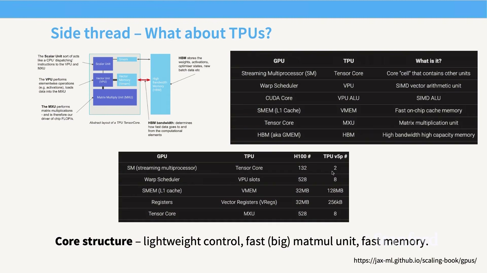

*图：GPU 的许多小而灵活的单元，与 TPU 较少但更大的向量/矩阵单元对照（00:20:23--00:21:23）。这是帮助理解的概念映射，不是逐晶体管的一一等价。*

> [!WARNING]
> “Tensor Core”存在术语碰撞：NVIDIA Tensor Core 是 SM 内的矩阵乘单元；TPU 文档中的 TensorCore/cell 可指更完整的计算核心。不能仅凭同名判断层级相同。

GPU 往往提供更多细粒度、可编程执行单元，TPU 则以大规模规则矩阵计算与规则互联见长。真正训练大模型时，单芯片以外的网络拓扑同样关键：加速器能否高效连接，决定 data/model parallel 的通信能否跟上计算。

### 本章小结

- GPU 通过大量驻留线程隐藏延迟，以吞吐优先；CPU 更侧重少量线程的响应时间。
- device、SM、block、warp、thread 是不同层级；warp 通常是 SIMD/SIMT 锁步执行范围。
- shared memory 是 block 级可编程 SRAM；CUDA local memory 不保证位于片上。
- GPU/TPU 可以用执行与存储职责作概念比较，但同名部件不一定同层级。

## 3. Memory wall、Roofline 与控制流

### 3.1 算力增长远快于数据供给能力

课件用约二十年的趋势图说明：浮点计算增长约 $60000\times$，DRAM 带宽约 $100\times$，互联约 $30\times$。不必执着于精确倍数，核心结论是 compute/memory gap 持续扩大——矩阵单元越来越容易“饿着”。

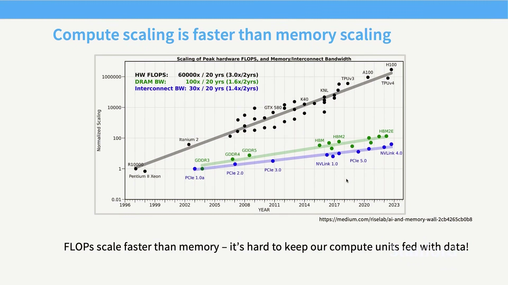

*图：计算吞吐的增长速度显著超过 DRAM 与互联（00:25:31--00:26:43）。这正是低精度、fusion、tiling 与 FlashAttention 都围绕数据搬运展开的背景。*

矩阵乘受到特别优化，也因此主导语言模型硬件设计。课件展示同代设备上矩阵乘吞吐可比其他浮点路径高一个数量级以上；这是精度与硬件相关的现象，不意味着任何写成矩阵形式的程序都会自动跑满 Tensor Core。

### 3.2 Roofline：判断瓶颈究竟在算还是在搬

定义算术强度（arithmetic intensity）为每搬运一个 byte 能执行多少 FLOPs：

$$
I=\frac{F}{M}.
$$

- $I$：算术强度，单位 FLOP/byte。
- $F$：该 kernel 执行的浮点操作数。
- $M$：从目标存储层级搬运的字节数。

硬件可达到的性能上界可写成：

$$
P_{\mathrm{attainable}}\leq \min(P_{\mathrm{peak}},\,B_{\mathrm{mem}}I).
$$

- $P_{\mathrm{attainable}}$：实际可达到的 FLOP/s。
- $P_{\mathrm{peak}}$：给定精度与指令类型下的峰值 FLOP/s。
- $B_{\mathrm{mem}}$：所考察存储层级的有效带宽，单位 byte/s。
- $I$：相对于该存储层级的算术强度。

两条上界相交的 ridge point 为：

$$
I^*=\frac{P_{\mathrm{peak}}}{B_{\mathrm{mem}}}.
$$

当 $I<I^*$，增加算力几乎无效，kernel memory-bound；当 $I>I^*$，继续减少内存流量的边际收益下降，kernel 更接近 compute-bound。

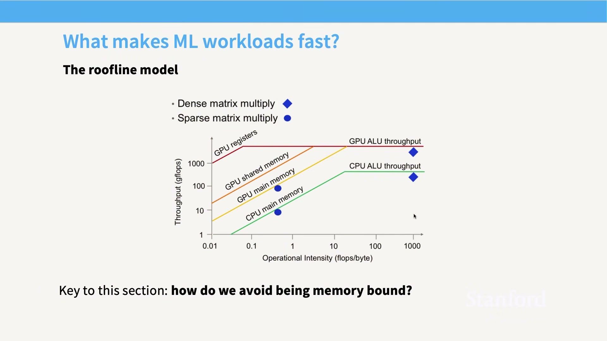

*图：斜线区域由带宽限制，水平区域由峰值计算限制（00:31:11--00:32:36）。Roofline 是上界模型，实际性能还受调度、依赖、occupancy、指令混合等因素影响。*

### 3.3 六类优化都能放回 Roofline

本讲后续技巧可以统一为：

| 技巧 | 主要改变 | Roofline 视角 |
| --- | --- | --- |
| 避免 warp divergence | 减少无效执行 | 提高有效计算利用率 |
| 低精度 | 每元素字节数更少，矩阵单元吞吐更高 | 增加 $I$ 并提高 $P_{peak}$ |
| fusion | 减少中间张量读写与 kernel launch | 减少 $M$ |
| recompute | 用额外 FLOPs 换少存激活 | 减少 $M$、增加 $F$ |
| coalescing | 用更少内存事务取相同数据 | 提高有效 $B_{mem}$ |
| tiling | 把数据搬到 SRAM 并多次复用 | 显著减少 HBM 层面的 $M$ |

### 3.4 分支分歧为什么让 warp 串行化

同一 warp 的 lanes 若对 `if` 条件得到不同结果，硬件通常先屏蔽一部分 lanes 执行路径 A，再反向屏蔽执行路径 B。两个分支都被发射，部分 lane 在每条路径上空转。

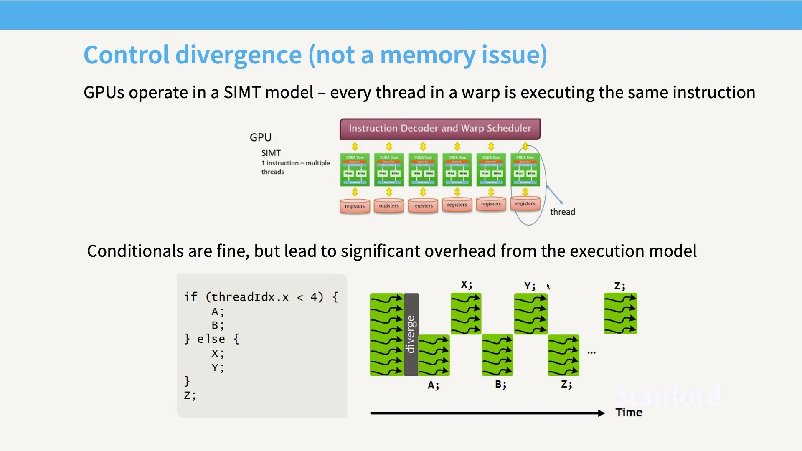

*图：同一 warp 中条件不同的线程会让分支路径被掩码串行执行（00:33:05--00:34:21）。条件语句本身并非必然慢；如果同一 warp 的判断一致，就没有这类分歧。*

> [!TIP]
> 优化时不要仅数 `if`。应检查 lane 到数据的映射，以及分支是否在 warp 内混杂。为了消灭一个分支而额外搬运大量数据，也可能得不偿失。

### 本章小结

- 现代加速器的核心矛盾是计算吞吐增长快于内存和互联。
- Roofline 用算术强度连接算法与硬件，先判断 memory-bound 还是 compute-bound。
- 六类优化的共同目标是减少无效工作、减少字节或提高数据复用。
- Warp divergence 的成本来自同一 warp 内路径串行化，而不是所有条件判断。

## 4. 低精度：用表示范围、误差与吞吐做交换

### 4.1 更少 bytes 同时缓解存储和计算

以逐元素 ReLU 为例：

$$
y_i=\max(0,x_i).
$$

若每个元素读一次、写一次，FP32 大致搬 8 bytes，FP16 大致搬 4 bytes，而核心运算只有一次比较/选择。因此标准算术强度近似为 $1/8$ 与 $1/4$ op/byte，FP16 约提升 $2\times$。

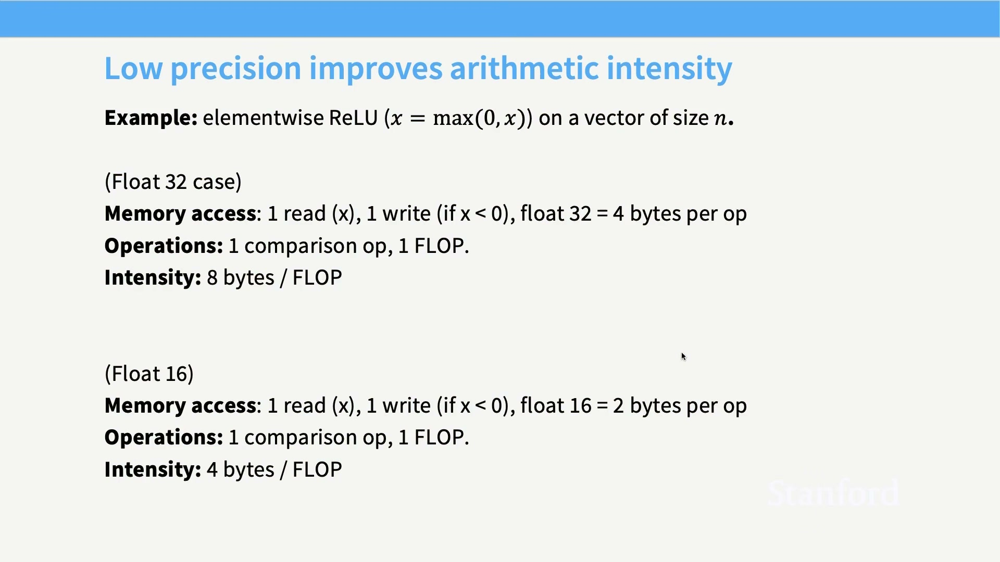

*图：课件用 FP32 与 FP16 的每元素字节数说明低精度减轻带宽压力（00:35:38--00:36:16）。幻灯片写成“8 byte/FLOP、4 byte/FLOP”，那是标准 arithmetic intensity 的倒数，不能与 FLOP/byte 混用。*

矩阵乘则常采用低精度输入、高精度累加：

$$
C_{ij}=\sum_k A_{ik}B_{kj}.
$$

- $A_{ik},B_{kj}$：可用 BF16、FP16、FP8 等低精度存储与乘法。
- $C_{ij}$：输出元素。
- 累加器：常使用更高精度，避免长求和误差迅速积累。

混合精度不是“把所有张量转成同一种最小位宽”。归一化、loss、optimizer state 或异常值敏感路径可能保留 BF16/FP32，训练还常保留 FP32 master weights。

### 4.2 FP8：指数位和尾数位如何取舍

E4M3 用 4 位指数、3 位尾数，精度较高而范围较窄；E5M2 用 5 位指数、2 位尾数，范围更宽而相邻可表示数更稀。选择格式是在动态范围与局部分辨率之间取舍。

量化通常需要 scale：

$$
q_i=Q_{\mathrm{FP8}}\!\left(\frac{x_i}{s}\right),\qquad \hat{x}_i=sq_i.
$$

- $x_i$：原始高精度数值。
- $s$：把局部数值范围映射到 FP8 可表示区间的缩放因子。
- $Q_{\mathrm{FP8}}$：舍入、饱和到 FP8 的量化操作。
- $q_i$：量化值。
- $\hat{x}_i$：反量化近似值。

一个 tensor 共用一个 scale 时，少数异常值会迫使大部分数值挤在很小范围。MXFP8 改用分块缩放：课件采用每 32 个 E4M3 值共享一个 E8M0 scale。小块更能适配局部范围，但会增加 scale 元数据、布局与转置复杂度。

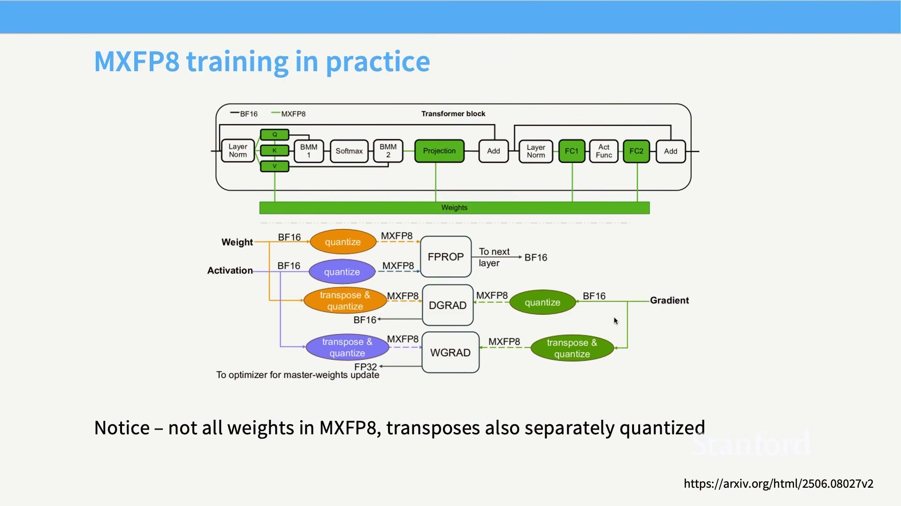

*图：前向、输入梯度和权重梯度可在不同方向量化，主权重仍保留高精度（00:42:08--00:42:40）。图中分块只是数据流示意；MXFP8 规范是每 32 个值一个 scale。*

二维矩阵若按连续 32 个值分组，转置后分组边界会改变。高性能实现可能为两个访问方向保存不同量化布局，而不是在关键路径上临时转置和重新求 scale。

### 4.3 MXFP4 更激进，也更依赖训练配方

课件列出的 MXFP4 值集合可写为：

$$
q\in\{0,\pm0.5,\pm1,\pm1.5,\pm2,\pm3,\pm4,\pm6\}.
$$

它以每 16 个数共享一个 E4M3 scale。只有 4 bit 值意味着表示非常稀疏，scale、舍入、异常值处理与哪些算子保留高精度都会显著影响收敛。

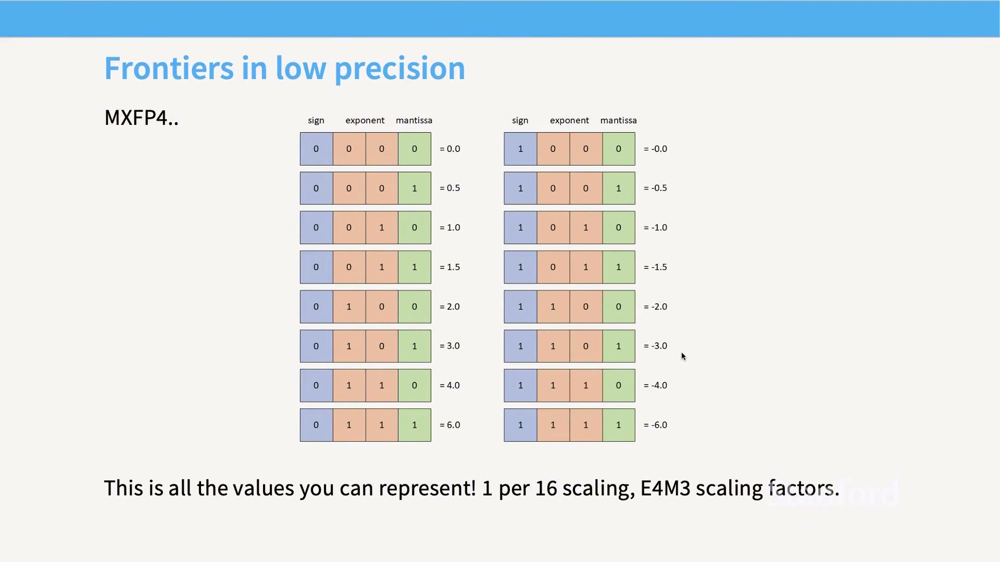

*图：MXFP4 用有限离散值加局部 scale 覆盖数据范围（00:43:15--00:44:20）。讲者此处是在讨论前沿训练趋势；不能据此断言所有训练系统已普遍使用 FP4。*

低精度为什么未必带来理论上的 $2\times$：

- quantize/dequantize 和 scale 计算也占时间；
- 张量形状可能无法走最快 kernel；
- 部分算子仍需高精度；
- 训练的数据依赖和通信无法同时按位宽线性缩小。

讲者提到某些 endpoint 实测约 20%–30% 收益，恰好说明要测端到端而非只比较峰值规格。

### 本章小结

- 低精度同时减少字节并启用更高吞吐的矩阵指令，但误差和动态范围更难管理。
- 混合精度的关键是低精度乘法、高精度累加与敏感路径保留高精度。
- MXFP8/MXFP4 用局部 scale 缓解异常值问题，也引入元数据和布局成本。
- 理论位宽比不是端到端加速比；必须计入转换、scale、shape 与高精度算子。

## 5. Fusion 与 recomputation：少写一次，或干脆重算

### 5.1 Fusion 把多个往返 HBM 的算子合成一次

考虑：

$$
f(x)=\sin^2(x)+\cos^2(x).
$$

朴素 eager 执行可能依次启动 `sin`、平方、`cos`、平方、相加五个 kernel，每一步都把中间张量写回 global memory，再由下一步读取。若编译器把整个表达式融合为单个 kernel，每个元素只需读入一次并写回最终结果。

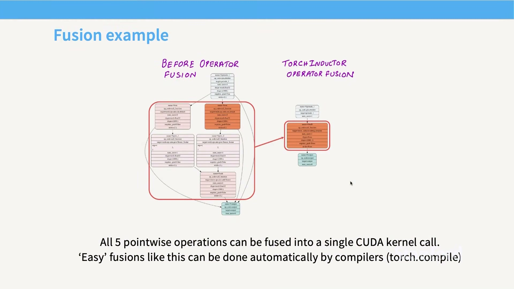

*图：逐元素表达式可由五次 kernel launch 与多次中间读写融合成一次（00:49:17--00:49:50）。`torch.compile`/TorchInductor 可完成许多常见融合，但不是所有图都能自动、且融合过大也可能增加寄存器压力。*

Fusion 的收益来自两部分：减少 launch latency，减少中间张量的 HBM traffic。代价可能是更长的 kernel、更多寄存器、较差 occupancy，或跨算子依赖限制并行。因此“能融合”不等于“越大越好”。

### 5.2 Recomputation 用便宜计算换昂贵保存

训练反向传播需要前向激活。若把每层激活全部写到 HBM，反向时再读，内存容量和带宽都会成为瓶颈。activation checkpointing/recomputation 只保存少数检查点，在反向需要时重新计算中间值。

课件用三个 sigmoid 的玩具链路计数。全保存方案：前向 1 次读、3 次写，反向 3 次读、1 次写，共 8 次访问。

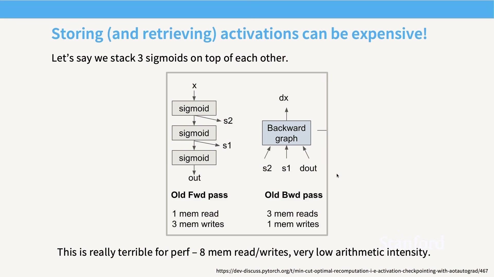

*图：保存三个 sigmoid 中间结果时，前后向合计示意为 8 次 global-memory access（00:50:50--00:51:36）。这是教学计数，不含 cache、融合和实际反向 kernel 的全部流量。*

只保存端点并在反向重算：前向 1 次读、1 次写，反向 2 次读、1 次写，共 5 次；教学示例的访问量变为：

$$
\frac{5}{8}=62.5\%,\qquad 1-\frac{5}{8}=37.5\%.
$$

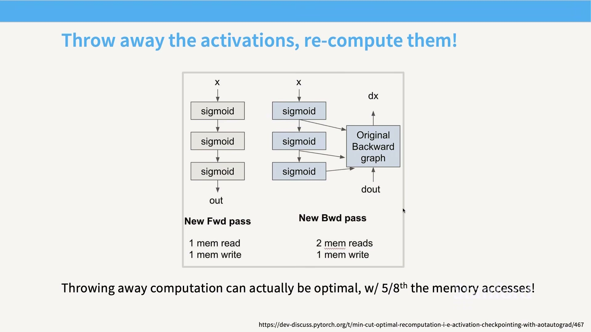

*图：重计算把玩具示例的 8 次访问降为 5 次，以额外 sigmoid 计算换取 37.5% 的访问减少（00:51:38--00:52:39）。该比例不是任意网络的通用节省率。*

最适合重算的是计算便宜、输出大的算子；若算子本身已 compute-bound 或随机性/副作用难以复现，重算收益会下降。实践中 checkpoint 粒度应同时考虑峰值显存、额外 FLOPs 与重算能否被融合。

### 本章小结

- Fusion 减少中间张量的 HBM 往返和 kernel launch，但可能增加寄存器压力。
- Recomputation 不保存所有激活，而在反向时重新计算，用 FLOPs 换带宽与容量。
- 两者都必须以端到端 profile 判断，玩具访问计数只能解释机制。

## 6. Coalescing、tiling 与矩阵尺寸之谜

### 6.1 Coalescing 关心同一条指令的 lane 地址

DRAM 不是按单个标量随取随到，而是以对齐的 burst/transaction 搬一段连续字节。若同一 warp 的 lane 访问连续、对齐地址，硬件能用少量事务满足请求；地址跨许多段时，需要更多事务，实际带宽下降。

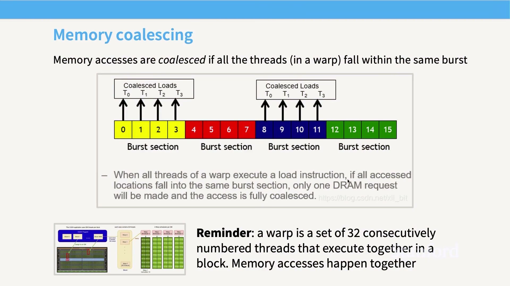

*图：连续地址可以合并进较少 burst，离散地址需要更多内存事务（00:54:14--00:55:02）。图中的 128-byte burst 是教学示意；真实事务受架构、cache line 与访问宽度影响。*

row-major 矩阵的地址为：

$$
\operatorname{addr}(A_{ij})=\operatorname{base}(A)+(in+j)b.
$$

- $i,j$：行、列索引。
- $n$：每行元素数。
- $b$：每元素字节数。

当 lane id 映射到连续的 $j$，地址相邻；映射到连续的 $i$，步长是 $nb$。所以“沿行/沿列一定合并”并非独立于线程映射的真理，正确问题是：**同一 warp、同一 load/store 指令下，各 lane 的线性地址是什么？**

### 6.2 Tiling：先搬进 SRAM，再反复使用

矩阵乘每个输出元素都要沿 $k$ 维读取一行 $A$ 和一列 $B$。朴素实现让相同输入元素从 global memory 被反复读取。Tiling 把 $A$、$B$ 切成小块，由一个 block 协作装入 shared memory，然后在片上完成多个 partial sums。

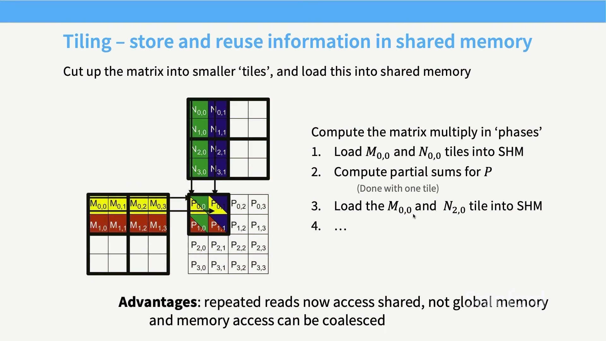

*图：block 分阶段载入输入 tiles 到 shared memory，并为输出 tile 累积部分和（00:59:29--01:00:17）。图中文字中的个别 tile 下标只是示意，核心是沿归约维反复载入对应块。*

理想化地，边长为 $N$ 的方阵不分块时每个输入被从 global memory 读取约 $N$ 次；tile 边长为 $T$ 时，约读取 $N/T$ 次，并在每个 tile 内复用 $T$ 次。因此 global-memory 读取可近似减少 $T$ 倍。

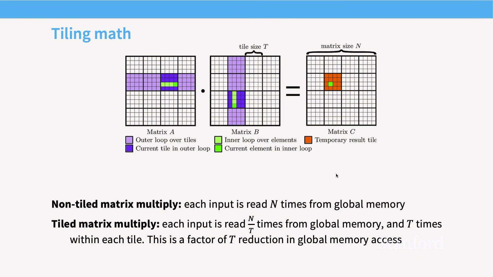

*图：tile 内共享数据使输入从 global memory 的读取次数由约 $N$ 降至 $N/T$（01:00:19--01:00:58）。这是忽略 cache、边界、写回和双缓冲的理想模型。*

tile 不能无限变大：shared memory 容量、寄存器数、block 最大线程数、occupancy、bank conflict 与 pipeline 都有限制。好的 tile 是计算复用、资源占用与并发度的折中。

### 6.3 边界 tile 与 padding：多算一点反而更快

若 tile 为 $128\times128$，$256\times256$ 矩阵刚好切成 4 块；把一维增加到 257，边缘会多出几乎全空的块，示例变成 6 块。边界线程虽被 mask，block 资源仍然被占用。

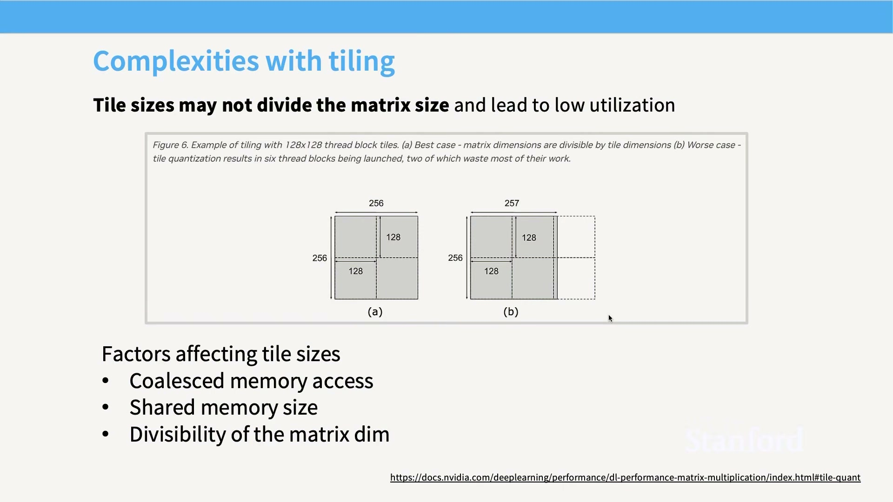

*图：矩阵维度不能整除 tile 时，少量有效元素可能触发整个边界 block（01:02:35--01:03:31）。实际库会选择多种 kernel，图示只解释一种量化效应。*

Padding 让 leading dimension 与 burst、tile 或 Tensor Core 约束更匹配，有时即使增加计算也会加速。

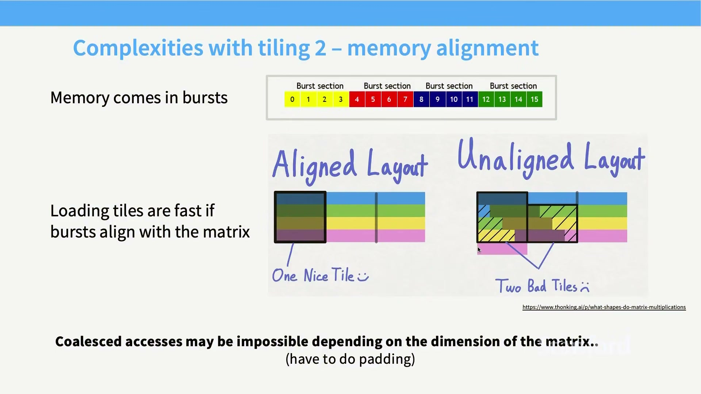

*图：对齐 tile 可用较少 burst，未对齐边界可能拆成多个低效事务（01:04:04--01:05:11）。对齐要求取决于数据类型和 kernel，不存在普适“所有维度都补到 2 的幂”。*

nanoGPT 的著名例子把词表从 50257 padding 到 50304，即最近的 64 倍数。虽然多算了无用 logits，却进入更高效的 kernel 路径，在该实验中约加速 25%。

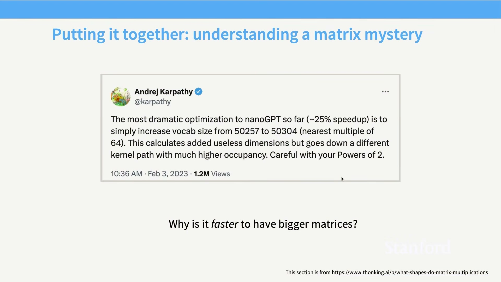

*图：50257 补到 50304 后，额外计算换来更好的矩阵形状与 occupancy（01:05:11--01:05:45）。25% 是特定软件、硬件和 shape 的结果，不应泛化为固定收益。*

### 6.4 为什么 matmul 吞吐曲线呈锯齿

方阵尺寸增加时，理论 FLOPs 平滑增长，但实测 TFLOP/s 出现多条带状与周期性骤降。现在可以把现象拆成三层：

1. 小矩阵算术强度低，启动和搬运占比高；
2. tile 整除与对齐决定边缘浪费和内存事务；
3. tile 数与 SM 数的配比决定最后一波是否低利用率。

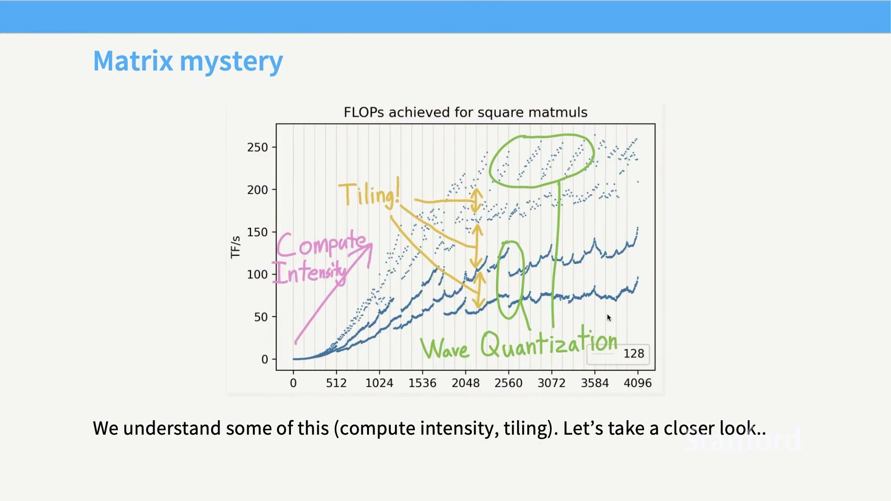

*图：性能曲线同时呈现算术强度、tiling/alignment 与 wave quantization 的影响（01:06:16--01:06:40）。横轴增大不保证每个相邻尺寸都更快。*

以课件的 $256\times128$ 输出 tile 为例：

$$
\left\lceil\frac{1792}{256}\right\rceil
\left\lceil\frac{1792}{128}\right\rceil=7\times14=98,
$$

而矩阵边长增加到 1793 后：

$$
\left\lceil\frac{1793}{256}\right\rceil
\left\lceil\frac{1793}{128}\right\rceil=8\times15=120.
$$

- 1792、1793：输出矩阵的维度。
- 256、128：示例 kernel 的输出 tile 两个边长。
- 98、120：需要调度的 tiles/block 数。

A100 示例有 108 个 SM。98 个 tile 可近似一波完成；120 个需要第二波，而第二波只有少量工作。若粗略把每个 SM 同时容纳一个 tile，则两波 slot 利用率为：

$$
\frac{120}{2\times108}\approx55.6\%.
$$

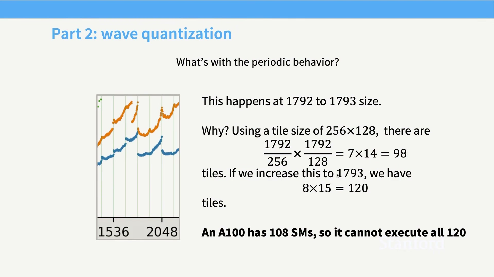

*图：1792 到 1793 的矩阵维度变化使 tile 数从 98 跳到 120，超过 108 个 SM 的单 wave 容量（01:07:42--01:09:20）。讲者口头曾说“tile size 加一”，准确说法是矩阵维度加一。真实并发还取决于每 SM 可驻留 block 数与资源。*

> [!IMPORTANT]
> 这也解释了为什么性能调优不能只看 FLOPs。shape 改变可能切换 kernel、tile、对齐、wave 数与 occupancy；基准必须使用真实 batch、sequence、hidden size 和精度。

### 本章小结

- Coalescing 看的是同一 warp 指令下各 lane 的线性地址是否连续、对齐。
- Tiling 把数据放进 shared memory 复用，理想情况下把 HBM 读取减少约 tile 边长倍。
- tile 受 SRAM、寄存器、occupancy、边界与对齐约束，不是越大越好。
- 矩阵尺寸的锯齿性能来自 kernel 路径、tile quantization、对齐与 wave quantization 共同作用。

## 7. FlashAttention：把整堂课组合成一个算法

### 7.1 标准 attention 的数学与内存问题

单头 scaled dot-product attention 为：

$$
Q=XW_Q,\qquad K=XW_K,\qquad V=XW_V,
$$

$$
S=\frac{QK^\top}{\sqrt{d_k}},\qquad P=\operatorname{softmax}_{\text{row}}(S),\qquad O=PV.
$$

- $X\in\mathbb{R}^{N\times d}$：长度为 $N$ 的输入表示。
- $Q,K,V$：查询、键和值。
- $d_k$：每个 attention head 的 key 维度。
- $S\in\mathbb{R}^{N\times N}$：注意力分数矩阵。
- $P$：对每一行跨所有 key 归一化后的概率。
- $O$：最终 attention 输出。

朴素流程把 $S$ 和 $P$ 写到 HBM，再读回来做 softmax 和第二次矩阵乘。长上下文时，$N^2$ 中间量的读写比计算本身更致命。FlashAttention 不是删除某些注意力边，也不是近似 attention；它改变计算顺序，使中间分数 tile 不落 HBM。

### 7.2 第一块积木：给 $Q,K,V$ 做 tiling

算法把 $K,V$ 切成块，将当前块与 $Q$ 块搬到片上 SRAM，在 SRAM 中计算分数、指数和加权和，只把必要的统计量与输出写回。

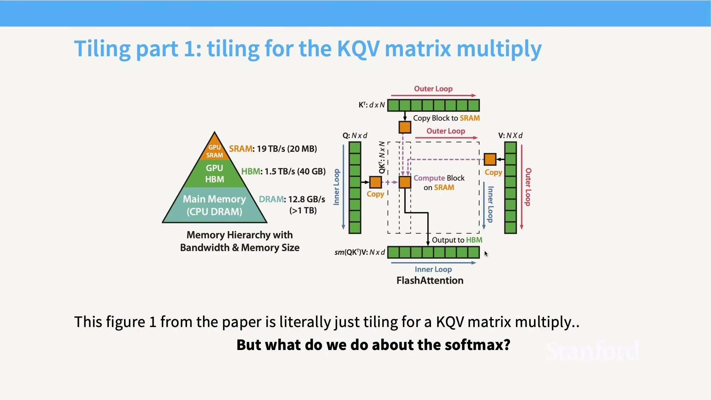

*图：Q、K、V 块从 HBM 复制到 SRAM，在片上计算注意力块并写回输出（01:13:30--01:14:07）。左侧带宽/容量数字是特定硬件的示意，重要的是 SRAM 小而快、HBM 大而慢。*

困难在于 softmax 的分母需要整行所有 key：只看到一个 tile 时，无法知道未来是否出现更大的 logit，也不知道最终归一化常数。

### 7.3 第二块积木：在线、数值稳定的 softmax

普通数值稳定 softmax 先找全局最大值：

$$
m=\max_k x_k,\qquad y_i=\frac{e^{x_i-m}}{\sum_j e^{x_j-m}}.
$$

在线算法扫描元素或 tiles，同时维护当前最大值 $m_j$ 与经过最大值校正的分母 $d_j$：

$$
m_0=-\infty,\qquad d_0=0,
$$

$$
m_j=\max(m_{j-1},x_j),
$$

$$
d_j=d_{j-1}e^{m_{j-1}-m_j}+e^{x_j-m_j}.
$$

最终：

$$
y_i=\frac{e^{x_i-m_V}}{d_V}.
$$

- $x_j$：当前扫描到的 logit。
- $m_j$：前 $j$ 个 logit 的最大值。
- $d_j$：以当前最大值为基准的指数和。
- $V$：该行的元素总数，这里不是 attention 的 value matrix。

当新最大值变大，旧分母必须乘 $e^{m_{j-1}-m_j}$，把旧基准重标到新基准。这一步就是“未来出现更大 logit”时仍能保持正确性的关键。

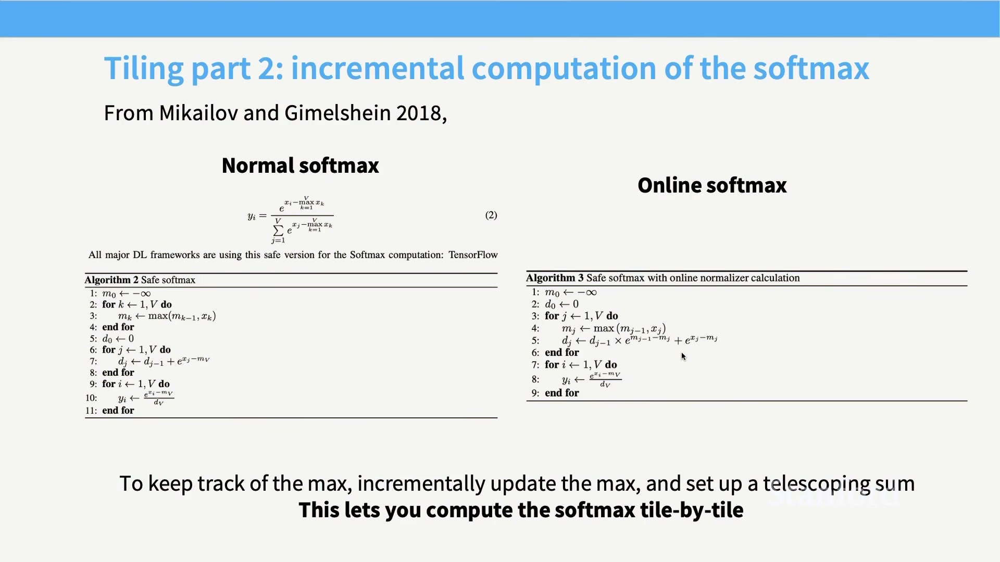

*图：在线 normalizer 同时更新最大值与分母，使 softmax 可逐 tile 计算（01:14:07--01:15:37）。softmax 是逐行跨 key 归一化，不是对整个 $N\times N$ 矩阵共用一个分母。*

### 7.4 第三块积木：在线修正输出

设第 $r$ 个 $K,V$ tile 给出：

$$
S^{(r)}=Q(K^{(r)})^\top,\qquad A^{(r)}=\exp(S^{(r)}).
$$

若暂时忽略 max-rescaling，只看两块的分母更新：

$$
\ell_1=\sum_i \exp(S_i^{(1)}),\qquad
\ell_2=\ell_1+\sum_i \exp(S_i^{(2)}),
$$

$$
O_1=\frac{A^{(1)}}{\ell_1}V^{(1)},
$$

$$
O_2=\frac{\ell_1}{\ell_2}O_1+\frac{A^{(2)}}{\ell_2}V^{(2)}.
$$

- $S^{(r)}$：第 $r$ 个 score tile。
- $A^{(r)}$：其逐元素指数。
- $\ell_r$：处理到第 $r$ 块时的累计归一化分母。
- $O_r$：处理到第 $r$ 块时的在线输出。

新 tile 到来后，旧输出的权重要从旧分母改到新分母，所以乘 $\ell_1/\ell_2$。真实数值稳定实现还必须像在线 softmax 一样维护每行最大值，并同时 rescale 旧分母与旧输出；课件的两块公式是为了突出 telescoping update 而省略了这一层。

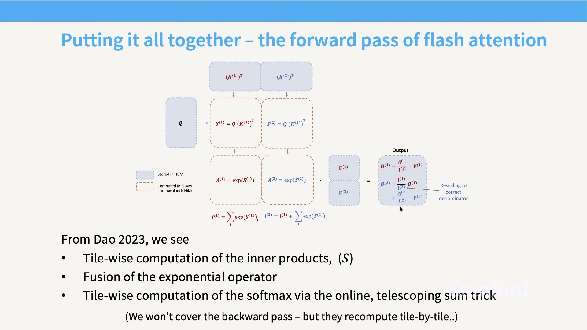

*图：分数与指数块在 SRAM 中产生，不物化到 HBM；累计分母变化时在线重标旧输出（01:15:37--01:17:03）。反向同样按 tile 重计算必要中间量，避免保存完整 $N^2$ 矩阵。*

### 7.5 为什么“做更多 FLOPs”仍然更快

课件引用 GPT-2 attention 实验：标准实现到 FlashAttention 的 GFLOPs 从 66.6 增到 75.2（约多 12.9%），HBM 读写从 40.3 GB 降到 4.4 GB（约 $9.2\times$ 减少），运行时间从 41.7 ms 降到 7.3 ms（约 $5.7\times$ 加速）。

这正是 Roofline 的结论：原问题主要 memory-bound 时，增加可在片上完成的重计算，却大幅减少 HBM traffic，总时间反而下降。FlashAttention 综合了：

- **tiling**：Q/K/V 与 score 块在 SRAM 复用；
- **fusion**：矩阵乘、缩放、指数、统计量和输出更新在更少 kernel 中完成；
- **online softmax**：无需先物化完整 score 矩阵再做全行归一化；
- **recomputation**：反向按 tile 重算，而非保存所有 $N^2$ 中间值。

> [!NOTE]
> FlashAttention 在数学上是 exact attention（允许浮点运算顺序导致的微小差异），其核心贡献是 I/O-aware 的计算调度。不要把它与稀疏或低秩近似 attention 混为一谈。

### 本章小结

- 标准 attention 的主要问题是 $N^2$ score/probability 中间张量的 HBM 读写。
- FlashAttention 对 Q/K/V 分块，并用在线最大值与分母解决跨 tile softmax。
- 累计分母变化时，旧输出必须重新缩放；稳定实现还要同步处理最大值变化。
- 它用片上重计算换 HBM traffic，是 tiling、fusion、recomputation 与 Roofline 的综合案例。

## 总结与延伸

### 一条贯穿全讲的推理链

1. Scaling law 使更多有效计算转化为更好的模型，因此系统效率是建模能力的一部分。
2. GPU/TPU 用大规模并行与矩阵专用单元提供很高峰值，但数据必须从 HBM 及时送到计算单元。
3. Roofline 用 FLOP/byte 判断瓶颈；现代语言模型优化常常首先是 I/O 优化。
4. 低精度减少每元素字节并提高专用矩阵吞吐；fusion 和 recomputation 减少中间读写。
5. Coalescing 让每次事务更有效，tiling 让搬进来的数据在片上多次复用。
6. Alignment 与 wave quantization 说明 shape 会改变真实调度，因此相邻尺寸的性能可以剧烈跳变。
7. FlashAttention 把上述原则统一到 attention：不物化 $N^2$ 中间量，并用在线 softmax 保持精确结果。

### 面对新 kernel 的检查清单

- 数学上执行多少 FLOPs？其中多少是有效工作？
- 相对于 HBM、L2、shared memory，各自搬了多少 bytes？
- 算术强度位于 Roofline ridge point 的哪一侧？
- lane 地址是否连续、对齐？是否存在 warp 内 divergence？
- 数据能否先放到 SRAM，再被多个输出复用？
- shape 是否整除 tile？总 tile 数能否均匀填满 SM waves？
- 低精度的 scale、转换与敏感算子成本是否计入？
- fusion 或 recomputation 是否降低 HBM traffic，又是否造成寄存器压力？
- 结论来自峰值规格、微基准，还是目标模型的端到端 profile？

### 建议的动手练习

1. 对 ReLU、LayerNorm 与方阵乘分别估算 FLOPs、bytes 和算术强度，预测谁更 memory-bound。
2. 写一个 CUDA/Triton 矩阵转置，对比连续 lane 地址与 stride 地址的有效带宽。
3. 扫描 matmul 的 $M,N,K$，同时记录 kernel 名称、tile 数与吞吐，复现锯齿曲线。
4. 实现在线 softmax，逐元素版本与一次性稳定 softmax对比数值误差；再推广到分块版本。
5. 用 profiler 比较普通 attention 与 FlashAttention 的 HBM traffic，而不只比较 wall-clock time。

### 本章小结

- 判断性能应先定位数据移动路径，再看峰值算力；真实 shape、精度和 kernel 共同决定结果。
- 低精度、fusion、recomputation、coalescing 与 tiling 是可组合的工具，而不是互斥技巧。
- FlashAttention 是完整范例：算法等价性、数值稳定性和硬件 I/O 约束必须同时成立。

最后可以把讲者的收束压缩成一句话：**memory, memory, memory**。硬件给出峰值上限，真正决定训练能否扩展的，是你让多少数据、以什么精度、沿什么布局、在多近的存储层级被重复使用。
