# CS336 Lecture 6：GPU Kernel、Triton 与编译器视角

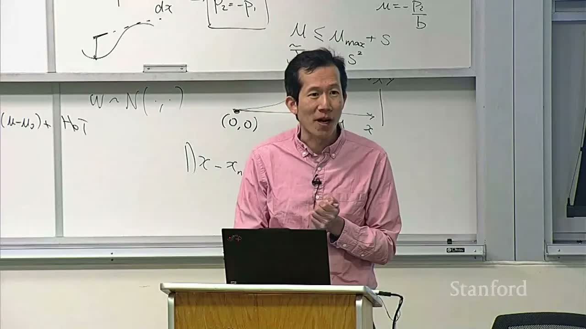

> [!NOTE]
> **课程**：Stanford CS336 — Language Modeling from Scratch（Spring 2026）  
> **讲次**：Lecture 6: Kernels, Triton, XLA  
> **讲者**：Stanford CS336 课程团队  
> **视频**：[YouTube 原视频](https://www.youtube.com/watch?v=xnDHaNUvHBg)  
> **时长**：01:26:41  
> **材料**：完整视频、人工英文字幕、官方 `lecture_06.py` 与课堂图示

> [!IMPORTANT]
> 视频标题含有 **XLA**，但本次实际课堂、完整人工字幕和官方源码都没有展开 XLA/JAX。第 9 章会把 XLA 放回编译栈中，作为明确标注的课外补充；其余章节严格总结视频实际讲授的 GPU kernel、性能分析与 Triton。

## 1. 本讲路线：从“能算对”到“能跑快”

训练语言模型时，我们通常先关注数学是否正确：矩阵乘法、归一化、激活函数能不能得到预期结果。进入系统层后，问题会变成：同一个数学表达式，为什么有时快十倍，有时却被内存访问、调度或固定开销拖住？

本讲给出的工作方式不是“背最快实现”，而是一个循环：

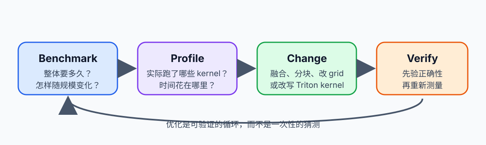

讲义重绘，依据课堂 `00:21:49--00:22:36` 的 “recipe for success”。

1. **建立基准**：先测真实形状、真实硬件上的运行时间。
2. **使用 profiler**：确认时间花在计算、内存传输还是 kernel launch。
3. **形成硬件解释**：用存储层级、warp、occupancy、coalescing 等概念解释瓶颈。
4. **改写 kernel**：通过 fusion、tiling、数据复用和合理映射减少浪费。
5. **重新测量**：优化是否有效，只能由新的测量回答。

这也解释了本讲的组织顺序：先建立 GPU 性能语言，再用 GeLU 做性能侦探，最后逐步写出 Triton GeLU、softmax、row sum 和 tiled matmul。

> [!WARNING]
> “用了 Triton”不等于“必然更快”。Triton 是表达高效 kernel 的工具；具体实现是否更快，仍取决于输入形状、GPU、编译器生成代码和已有库函数的质量。

### 本章小结

- Kernel 优化是一套“测量—解释—改写—复测”的闭环。
- 本讲的主线是用硬件知识指导实现，而不是凭语言或框架名称判断性能。
- 正确性是起点；数据移动、并行映射和 launch 次数常常决定最终速度。

## 2. GPU 性能语言：存储层级、warp 与调度

### 2.1 为什么首先要理解存储层级

GPU 不是一块均匀的“并行计算器”。一个现代 GPU 包含许多 Streaming Multiprocessor（SM）；每个 SM 内有标量/向量执行单元、寄存器文件、shared memory 与 L1 cache，芯片上还有共享的 L2 cache，最外层才是容量最大的 HBM。


课堂对应区间：`00:00:30--00:00:53`。

层级越靠近计算单元，通常容量越小、带宽越高、访问延迟越低。优化 kernel 的核心问题之一，就是尽可能让已经搬入片上存储的数据被重复利用，而不是一遍遍回到 HBM。

课堂用 A100、H100、B200 的数据直观展示了这种不均衡：

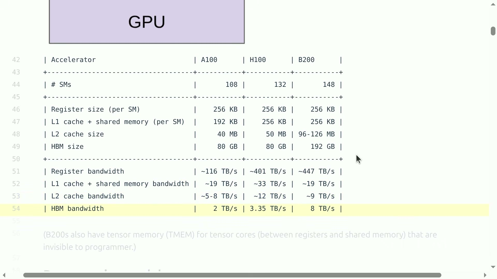

视频原帧，字幕对应区间：`00:01:05--00:02:59`。

| 指标 | A100 | H100 | B200 |
|---|---:|---:|---:|
| SM 数 | 108 | 132 | 148 |
| 每 SM 寄存器容量 | 256 KB | 256 KB | 256 KB |
| 每 SM L1 + shared memory | 192 KB | 256 KB | 256 KB |
| L2 cache | 40 MB | 50 MB | 96–126 MB |
| HBM 容量 | 80 GB | 80 GB | 192 GB |
| 估算寄存器带宽 | 约 116 TB/s | 约 401 TB/s | 约 447 TB/s |
| 估算 HBM 带宽 | 约 2 TB/s | 约 3.35 TB/s | 约 8 TB/s |

这些数不是让我们机械记忆，而是在提醒：如果一个 elementwise 算子的每一步都把中间结果写回 HBM，那么算术本身再便宜，也可能被数据移动完全淹没。

### 2.2 Grid、block、thread 与数据作用域

一个 CUDA-style kernel launch 会创建一个 grid，grid 由许多 thread block 组成，block 再包含许多 thread。这个层级不只是命名方式，还规定了协作边界：

- **Grid** 覆盖整个问题；不同 block 的执行先后通常不能依赖。
- **Block / CTA** 被整体调度到某个 SM，在 block 内可用 shared memory 和同步原语协作。
- **Thread** 拥有自己的逻辑索引和寄存器状态。
- **Global memory / HBM** 可被整个 grid 访问，但往返成本最高。
- **Shared memory** 由同一 block 内线程共享，容量较小但更靠近计算。
- **Register** 通常是线程私有、最快的存储资源，却也会限制 occupancy。

一个 block 在执行期间不能被随意拆到多个 SM。某个 SM 可以同时驻留多个 block，但数量要受寄存器、shared memory、线程数和架构上限共同约束。

### 2.3 Warp：GPU 实际发射指令的基本群体

CUDA 编程模型里，我们写 thread、block 和 grid；硬件执行时，同一个 SM 会以 **warp** 为基本调度单位。NVIDIA GPU 上，一个 warp 通常包含 32 个线程。

若同一 warp 内的线程走不同控制流分支，例如一半执行 `if`、另一半执行 `else`，硬件往往需要分阶段执行两个分支并屏蔽不参与的线程。这叫 **warp divergence**。

> [!IMPORTANT]
> 分支本身不一定昂贵；真正危险的是同一 warp 内线程发生分歧。若整个 warp 都选择同一分支，通常不会产生同样的串行化代价。

### 2.4 Occupancy：有多少 warp 能同时驻留

Occupancy 衡量一个 SM 上实际驻留的 active warp 数，相对于硬件允许的最大 active warp 数的比例：

$$
\mathrm{occupancy}
=
\frac{N_{\mathrm{active\ warps}}}
{N_{\mathrm{max\ warps}}}.
$$

- $N_{\mathrm{active\ warps}}$：因寄存器、shared memory、block 数等资源约束后，当前可驻留的 warp 数。
- $N_{\mathrm{max\ warps}}$：该架构单个 SM 支持的最大驻留 warp 数。

课堂例子中，每个 block 有 128 个线程，每线程使用 160 个寄存器；若每个 SM 有 65,536 个寄存器、最多驻留 64 个 warp，则：

$$
R_{\mathrm{block}}=128\times160=20{,}480,
$$

$$
B_{\mathrm{active}}
=
\left\lfloor\frac{65{,}536}{20{,}480}\right\rfloor
=3,
$$

$$
N_{\mathrm{active\ warps}}
=3\times\frac{128}{32}=12,
\qquad
\mathrm{occupancy}=\frac{12}{64}=18.75\%.
$$

- $R_{\mathrm{block}}$：单个 block 占用的寄存器数。
- $B_{\mathrm{active}}$：寄存器容量允许同时驻留的 block 数。
- 128：每 block 的线程数。
- 160：每线程使用的寄存器数。
- 32：每个 warp 的线程数。

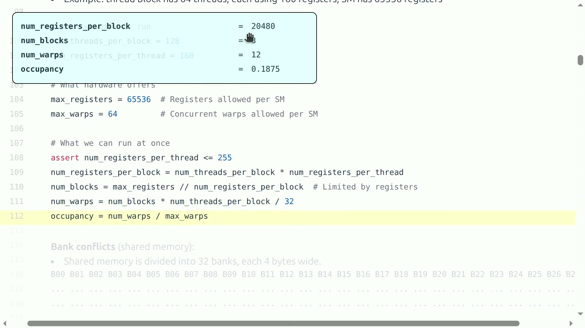

视频原帧，字幕对应区间：`00:12:53--00:14:22`。

> [!NOTE]
> 官方源码附近有一句说明写成“64 threads”，但视频画面中的代码和计算都使用 128 threads；本讲义采用与实际计算一致的 128。

高 occupancy 的价值在于 **latency hiding**：当一个 warp 等待内存时，调度器可以切换到另一个已就绪的 warp。不过 occupancy 不是越高越好。为了追求满 occupancy 而减少寄存器，可能导致 spilling，反而把数据溢出到更慢的内存。

### 2.5 Coalescing 与 bank conflict 不是同一件事

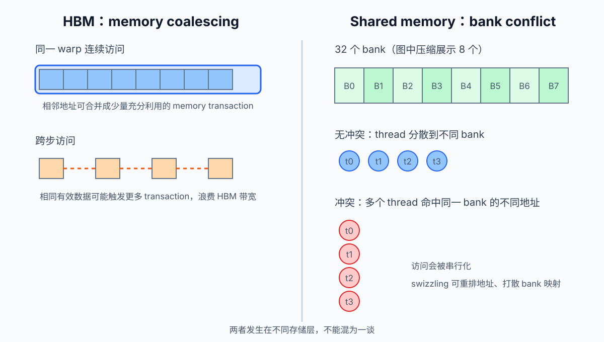

讲义重绘，综合课堂 `00:14:24--00:18:15` 对两类地址问题的讲解。

- **Memory coalescing** 主要描述相邻线程访问 global memory 时，地址能否合并成少量连续事务。
- **Bank conflict** 主要描述 shared memory 被划分为多个 bank 后，同一 warp 的访问是否挤到同一个 bank。

连续的 global-memory 地址通常更容易 coalesce；shared-memory 地址即使连续，也仍要结合 bank 映射分析。两者都和“线程到地址的映射”有关，但发生在不同存储层级。

课堂使用一个简化的 32-bank、每 bank 宽 4 byte 模型。对 4-byte 元素，bank 可近似写成：

$$
\operatorname{bank}(a)=\left(\frac{a}{4}\right)\bmod 32.
$$

- $a$：相对 shared-memory 起点的 byte 地址。
- 4：每个 bank 对应的 byte 宽度。
- 32：课堂模型中的 bank 数。
- $\operatorname{bank}(a)$：该地址映射到的 bank 编号。

若一个 warp 的 32 个线程访问同一行中连续的 32 个 `float32`，总跨度恰为：

$$
32\ \text{threads}\times4\ \text{bytes}=128\ \text{bytes}.
$$

- 32：warp 中的线程数。
- 4 bytes：一个 `float32` 元素的大小。
- 128 bytes：课堂示例中可形成一次完整合并访问的连续跨度。

反之，若线程按大 stride 读取一列，地址会落到许多分散的 global-memory transaction；若 shared-memory 的 stride 又恰好让多个地址映射到同一 bank，则会发生 bank conflict。Swizzling 的目标就是重新排列 shared-memory 地址映射，降低这种冲突。

> [!NOTE]
> “32 banks、每 bank 4 bytes”是本讲为建立直觉使用的模型，不应外推为所有架构、所有数据宽度和所有广播模式下不变的定律。

### 2.6 Wave quantization：尾部的一小批 block 也要单独跑一轮

假设 B200 有 148 个 SM，而一次 launch 有 160 个 block。第一轮每个 SM 分到一个 block 后，还剩 12 个 block；这 12 个 block 仍需要第二轮调度。若每个 block 运行时间相近，尾部这 12 个 block 会使总时间接近两轮，而不是 $160/148$ 轮。

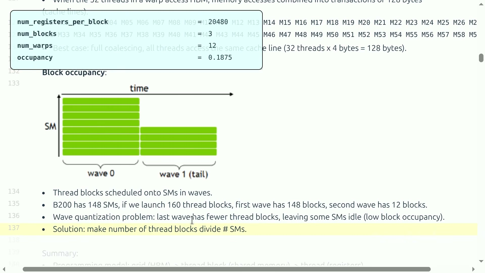

视频原帧，字幕对应区间：`00:18:15--00:19:18`。

这叫 wave quantization。它解释了为什么看似很小的 grid-size 变化，也可能产生阶梯状的延迟变化。

### 本章小结

- GPU 存储层级的容量、带宽和延迟差异很大，HBM 流量常是关键成本。
- Warp divergence、寄存器压力、occupancy、coalescing、bank conflict 分别描述不同问题，不能混为一谈。
- Occupancy 的目标是隐藏延迟，不是盲目追求 100%。
- Grid 尺寸跨过一个 wave 边界时，延迟可能出现非线性跳变。

## 3. Benchmark 与 Profiler：先测量，再优化

### 3.1 一个可靠 benchmark 应回答什么

Benchmark 至少要固定四件事：

1. 输入形状、dtype 与布局；
2. 使用的 GPU 与软件栈；
3. warm-up 和重复次数；
4. 计时边界中是否包含编译、同步和数据传输。

GPU 调用通常是异步的。如果 CPU 只测到“发射 kernel”的时间，而没有在正确位置同步，就可能严重低估真实执行时间。课堂使用 `triton.testing.do_bench`，把 warm-up、重复测量和同步等常见细节交给工具处理。

### 3.2 矩阵乘法为什么小尺寸时看不出三次增长

方阵乘法的算术工作量随边长 $n$ 近似按 $O(n^3)$ 增长：

$$
\mathrm{FLOPs}\approx 2n^3.
$$

- $n$：方阵边长。
- $2n^3$：每个输出元素约包含 $n$ 次乘法和 $n$ 次加法后的主导运算量。

但课堂在 B200 上测得，小矩阵从 256 增至 1024 时，运行时间几乎不变：

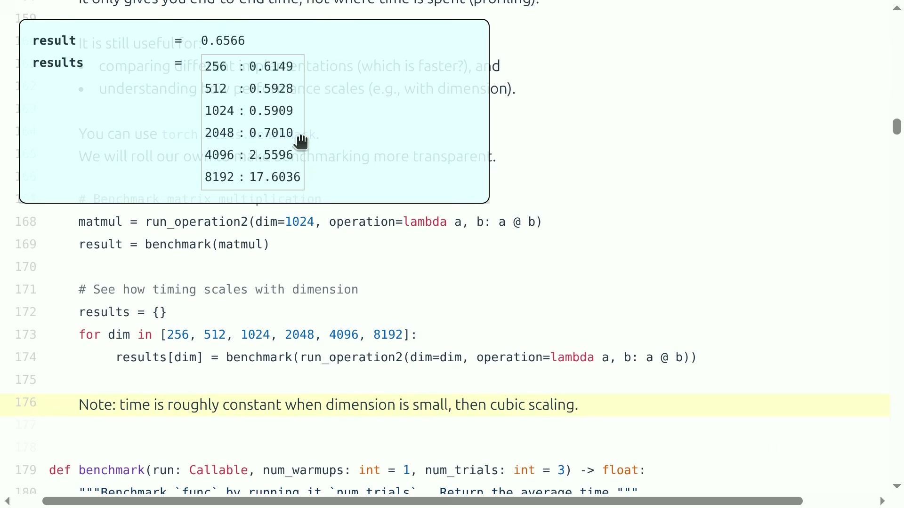

视频原帧，字幕对应区间：`00:25:35--00:26:25`。

| $n$ | 课堂测得时间（ms） |
|---:|---:|
| 256 | 0.6149 |
| 512 | 0.5928 |
| 1024 | 0.5909 |
| 2048 | 0.7010 |
| 4096 | 2.5596 |
| 8192 | 17.6036 |

小尺寸阶段，launch、调度、框架路径和 GPU 未充分占用等固定成本占主导；到 4096、8192 后，实际算术量才显著主导时间。因此，“复杂度是 $O(n^3)$”与“小尺寸实测近似水平线”并不矛盾。

> [!WARNING]
> 这张表是课堂当时特定 B200 和软件环境的观测，不是跨 GPU、跨版本可直接复用的性能承诺。

### 3.3 Profiler 负责把总时间拆开

Benchmark 告诉我们“慢”，profiler 则帮助回答“慢在哪里”。对 GPU 工作负载，重点观察：

- 发射了多少个 kernel；
- 每个 kernel 的持续时间；
- kernel 之间是否有同步或空洞；
- 内存拷贝与计算是否重叠；
- 编译后的 kernel 名称是否暴露了 fusion；
- 输入形状变化后，热点是否改变。

Profiler 的名字有时很长，但能透露关键信息。例如 `fused_add_mul_tanh` 表示编译器可能已经把多个 elementwise 运算融合进同一个 kernel。

### 本章小结

- Benchmark 应固定形状、dtype、硬件、warm-up、重复次数和同步边界。
- 渐近复杂度描述规模足够大时的主导趋势；小尺寸可能被固定成本控制。
- Benchmark 给出结果，profiler 给出结构；二者需要一起使用。
- 性能数字必须带上下文，不能脱离 GPU 和软件版本传播。

## 4. GeLU 性能侦探：Fusion 到底省了什么

### 4.1 三个数学等价的实现

课堂使用常见的 tanh 近似 GeLU：

$$
\operatorname{GeLU}(x)
=
\frac{x}{2}
\left[
1+
\tanh\!\left(
\sqrt{\frac{2}{\pi}}
\left(x+0.044715x^3\right)
\right)
\right].
$$

- $x$：输入张量中的一个元素。
- $\operatorname{GeLU}(x)$：该元素的近似 GeLU 输出。
- $0.044715$：tanh 近似式中的经验常数。
- $\sqrt{2/\pi}$：对内部多项式进行缩放的常数。

课堂比较三条路径：

1. 用多个 PyTorch 运算逐项写出公式；
2. 调用 PyTorch 内置 `gelu(..., approximate="tanh")`；
3. 用 `torch.compile` 编译逐项版本。

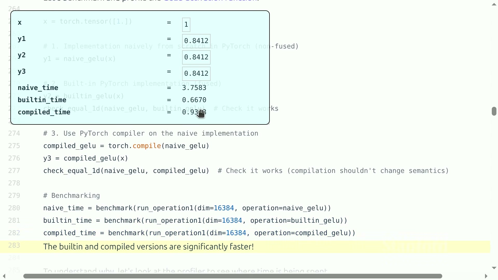

视频原帧，字幕对应区间：`00:31:47--00:32:19`。

在一个 $16384\times16384$ 张量上，课堂运行得到：

| 实现 | 时间（ms） |
|---|---:|
| 逐项 PyTorch | 3.7583 |
| PyTorch 内置 GeLU | 0.6670 |
| `torch.compile` 后的逐项版本 | 0.9388 |

三者结果一致，但性能明显不同。这个例子最重要的观察不是“某语言快”，而是 **实现产生了多少次全局内存往返和多少次 kernel launch**。

### 4.2 未融合版本为何昂贵

逐项表达式包含乘法、加法、tanh 等多个运算。若框架为每个运算分别发射 kernel，则中间张量要反复经历：

$$
\text{HBM 读入}
\rightarrow
\text{片上计算}
\rightarrow
\text{HBM 写回}.
$$

下一步又把刚写回的中间量读回来。数学操作不变，数据移动却成倍增加。

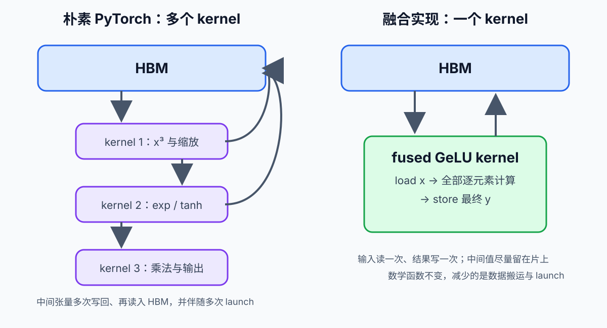

讲义重绘，依据 profiler 与 fusion 总结区间 `00:32:33--00:35:31`。

Profiler 也给出直接证据。未融合版本出现许多独立 kernel：

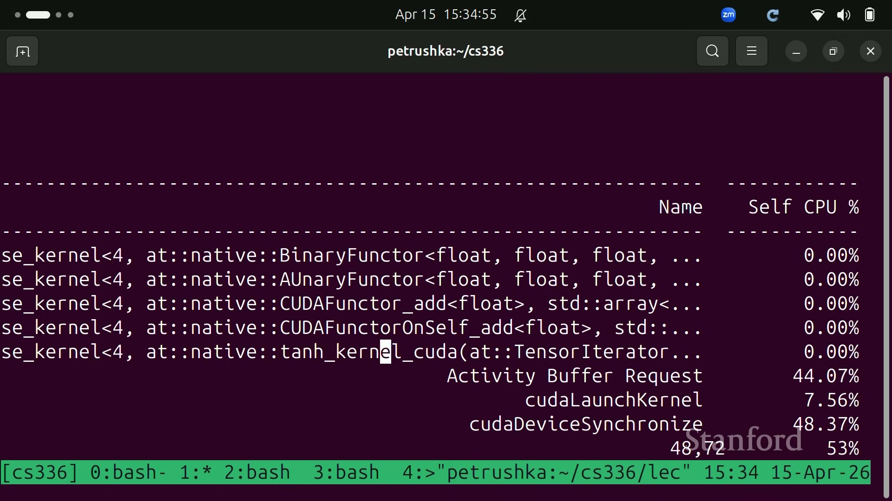

视频原帧，字幕对应区间：`00:32:33--00:33:54`。

`torch.compile` 后，profiler 中主要出现一个融合 Triton kernel：

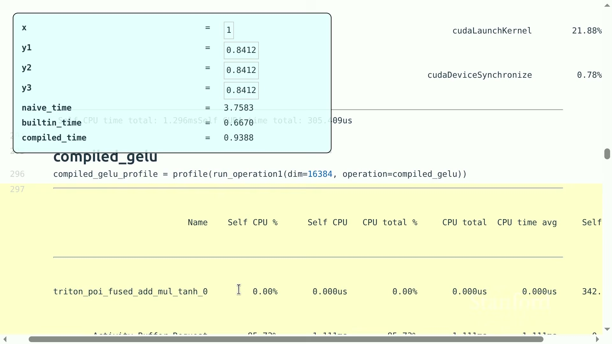

视频原帧，字幕对应区间：`00:34:21--00:35:03`。

融合后，每个元素可以只从 HBM 读取一次，在寄存器中完成多步计算，再写回一次。它同时减少了中间张量流量和 launch 开销。

### 4.3 “Triton 为什么更快？”这个问题要先校正

> [!QUOTE]
> 学生把结果概括为“Triton 更快”；讲者随即指出，在这个例子里编译出的 Triton kernel 实际慢于 PyTorch 内置 GeLU，性能还会依赖硬件。对应讨论：`00:36:09--00:36:51`。

这段问答给出了一条重要的方法论：

- 可以说融合版本比未融合逐项版本快；
- 不能据此说 Triton 总比高质量库函数快；
- 内置 kernel 可能经过更深入的手工调优，也可能使用不同近似或特殊指令；
- 只有在同一输入、同一硬件、同一精度要求下的实测才有意义。

### 本章小结

- 数学等价的实现可以产生完全不同的 kernel 图和内存流量。
- Fusion 的主要收益是保留中间值、减少 HBM 往返和 launch 次数。
- Profiler 中的多个小 kernel 与单个 fused kernel 是可验证证据。
- 本次实测中内置 GeLU 最快，因此不能把“Triton”当作自动性能保证。

## 5. Triton 的抽象：一个 program 处理一个 tile

### 5.1 从 CUDA thread 转向 Triton program

Triton 仍然生成 GPU kernel，但编程抽象与手写 CUDA 不同。程序员通常不逐线程描述每条操作，而是描述：**一个 Triton program instance 处理哪一块数据，以及这一块上的向量化操作是什么。**

可以把层级粗略理解为：

$$
\text{grid of Triton programs}
\rightarrow
\text{one program per tile}
\rightarrow
\text{compiler maps work to warps/threads}.
$$

`tl.program_id(axis=0)` 取得当前 program 的一维编号，`tl.arange(0, BLOCK_SIZE)` 构造 tile 内的一组逻辑位置。这里的 `BLOCK_SIZE` 是 **tile 中的元素数**，不是 CUDA block 的线程数。

### 5.2 Host wrapper 决定发射多少个 program

若输入有 $N$ 个元素，每个 program 处理 $B$ 个元素，需要的 program 数为：

$$
P=\left\lceil\frac{N}{B}\right\rceil.
$$

- $N$：张量元素总数。
- $B$：每个 Triton program 处理的 tile 大小。
- $P$：grid 中 program instance 的数量。

以课堂源码中的 $N=8192$、$B=1024$ 为例，$P=8$。字幕口头转写有一次写成 8000，但官方源码和 $8\times1024$ 的计算都表明实际是 8192。

Host 侧伪代码如下：

```python
def triton_gelu(x: torch.Tensor):
    y = torch.empty_like(x)
    n = x.numel()
    block_size = 1024
    grid = (triton.cdiv(n, block_size),)
    gelu_kernel[grid](x, y, n, BLOCK_SIZE=block_size)
    return y
```

Host wrapper 负责分配输出、计算 grid、传递指针和编译期参数；真正逐 tile 执行的逻辑位于 `@triton.jit` kernel 中。

### 5.3 Kernel 的 load—compute—store

```python
@triton.jit
def gelu_kernel(x_ptr, y_ptr, num_elements,
                BLOCK_SIZE: tl.constexpr):
    pid = tl.program_id(axis=0)
    start = pid * BLOCK_SIZE
    offsets = start + tl.arange(0, BLOCK_SIZE)
    mask = offsets < num_elements

    x = tl.load(x_ptr + offsets, mask=mask)

    a = 0.79788456 * (x + 0.044715 * x * x * x)
    exp_2a = tl.exp(2 * a)
    tanh_a = (exp_2a - 1) / (exp_2a + 1)
    y = 0.5 * x * (1 + tanh_a)

    tl.store(y_ptr + offsets, y, mask=mask)
```

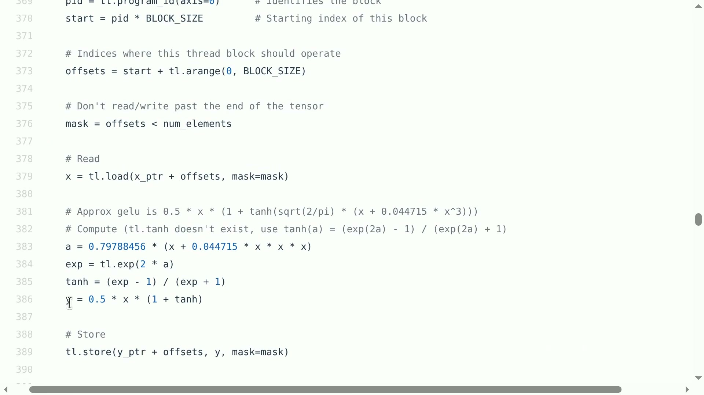

视频原帧，字幕对应区间：`00:45:13--00:46:09`。

这段 kernel 包含五个关键步骤：

1. `pid` 决定当前 program 负责第几个 tile；
2. `offsets` 生成这个 tile 的全局元素下标；
3. `mask` 防止最后一个不满 tile 越界；
4. `tl.load` 把有效元素读入片上表示，并完成向量化计算；
5. `tl.store` 只把有效位置写回。

最后一个 tile 即使只有少量有效元素，也常被补齐到固定 `BLOCK_SIZE`。mask 是正确性的一部分，不是可有可无的性能装饰。

课堂源码通过指数函数重写 tanh：

$$
\tanh(a)=\frac{e^{2a}-1}{e^{2a}+1}.
$$

- $a$：GeLU tanh 近似内部的缩放多项式值。
- $e^{2a}$：Triton `tl.exp` 计算的指数项。

这不是说所有实现都必须如此，而是因为示例所用 Triton API 中没有直接调用对应 tanh 的路径。

### 5.4 从 Triton 向下看 PTX：thread coarsening

Triton 编译后会落到更低层的中间表示和目标代码。PTX 中常见：

- `%ctaid.x`：block id；
- `%tid.x`：thread id；
- `%r*`、`%f*`：整数和浮点寄存器；
- `ld.global`、`st.global`：global-memory 读写。

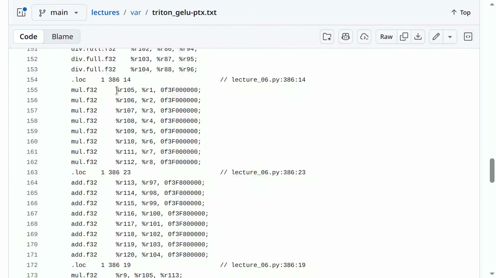

视频原帧，字幕对应区间：`00:52:42--00:53:18`。

课堂观察到，一个底层线程连续处理了 8 个元素。这是 **thread coarsening**：让单个线程做更多工作，减少调度开销并提高指令级并行。不过这个“8”是当前编译结果，不是 Triton 的固定语义；换形状、编译器或 GPU 都可能改变。

> [!WARNING]
> Triton program、CUDA block、warp、thread、tile 是相关但不同的概念。尤其不能把 `BLOCK_SIZE=1024` 直接解释成“发射 1024 个 CUDA 线程”。

### 本章小结

- Triton 的核心抽象是“一个 program 处理一个 tile”。
- Host wrapper 决定 grid，kernel 用 `program_id`、offset 和 mask 描述 tile 内计算。
- 固定 tile 加 mask 既方便编译器生成规则代码，也保证尾部正确性。
- PTX 可用于验证编译器如何映射工作，但观察到的具体 coarsening 因子不是语言保证。

## 6. 单个 program 内归约：Fused Softmax

### 6.1 稳定 softmax 的数学形式

对矩阵 $X\in\mathbb{R}^{M\times N}$，逐行稳定 softmax 为：

$$
m_i=\max_{0\le j<N}X_{ij},
$$

$$
Y_{ij}
=
\frac{\exp(X_{ij}-m_i)}
{\sum_{k=0}^{N-1}\exp(X_{ik}-m_i)}.
$$

- $X$：输入矩阵。
- $Y$：softmax 输出矩阵。
- $M$：行数。
- $N$：每行元素数。
- $m_i$：第 $i$ 行最大值，用于数值稳定。
- $i$：行下标。
- $j,k$：列下标。

减去行最大值不会改变 softmax 比例，却能避免较大输入直接指数溢出。

### 6.2 为什么逐算子 softmax 会反复访问 HBM

若 `max`、减法、`exp`、`sum`、除法都各自成为独立 kernel，中间矩阵需要多次读写 HBM。忽略低阶的逐行标量，课堂用主导项估算：

$$
\text{naive reads}\approx 5MN,
\qquad
\text{naive writes}\approx 3MN.
$$

- $MN$：矩阵元素总数。
- $5MN$：未融合路径的主导读取元素数。
- $3MN$：未融合路径的主导写入元素数。

若一整行能放进一个 Triton program 的片上工作集，就可以读一次、在片上完成两次归约和逐元素变换、再写一次：

$$
\text{fused traffic}\approx MN\ \text{reads}+MN\ \text{writes}.
$$

- $MN$：所有输入或输出元素的数量。
- $MN\ \text{reads}$：融合 kernel 对输入的主导读取量。
- $MN\ \text{writes}$：融合 kernel 对最终输出的主导写入量。

因此按主导流量得到理想比值：

$$
\frac{5MN+3MN}{MN+MN}=4.
$$

- $5MN+3MN$：未融合路径的主导总读写量。
- $MN+MN$：融合路径的主导总读写量。
- 4：只由流量模型得到的理想比值。

这个 4 是流量模型的理想比值，不是“必然四倍加速”。真实时间还受归约实现、occupancy、寄存器压力、带宽利用率和 launch 固定成本影响。

> [!NOTE]
> 若逐项精确追踪低阶的行最大值/行和标量读入，读取数会带额外 $O(M)$ 项。官方源码注释与严格逐项计数在一个低阶项上并不完全一致，因此这里保留课堂真正想表达的主导项 $5MN$。

### 6.3 一行一个 program

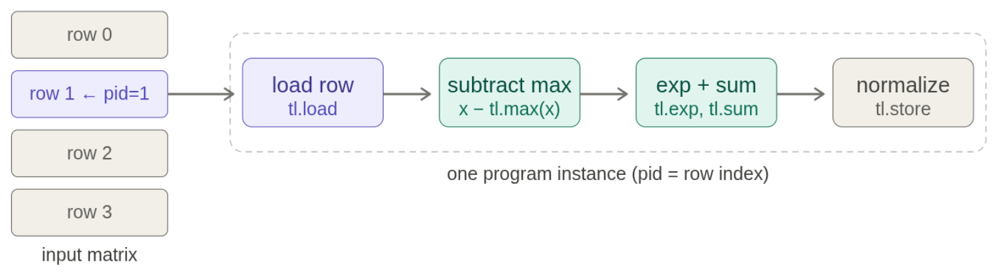

课堂对应区间：`01:00:42--01:03:45`。

实现思路如下：

```python
@triton.jit
def softmax_kernel(x_ptr, y_ptr, x_row_stride, y_row_stride,
                   n_cols, BLOCK_SIZE: tl.constexpr):
    row = tl.program_id(0)
    offsets = tl.arange(0, BLOCK_SIZE)
    mask = offsets < n_cols

    x = tl.load(x_ptr + row * x_row_stride + offsets,
                mask=mask, other=-float("inf"))
    x = x - tl.max(x, axis=0)
    numerator = tl.exp(x)
    denominator = tl.sum(numerator, axis=0)
    y = numerator / denominator

    tl.store(y_ptr + row * y_row_stride + offsets, y, mask=mask)
```

`BLOCK_SIZE` 通常取不小于 $N$ 的方便尺寸。padding 位置填 $-\infty$，原因是：

$$
\max(x,-\infty)=x,
\qquad
e^{-\infty}=0.
$$

- $x$：任意有效输入元素或有效行最大值。
- $-\infty$：无效 padding 位置的哨兵值。

于是 padding 既不会改变行最大值，也不会增加分母。

### 本章小结

- 稳定 softmax 需要先减去每行最大值。
- 当一整行能由一个 program 处理时，最大值、指数和求和都可在片上完成。
- 未融合和融合实现的核心差异是 HBM 流量，而不是数学公式。
- padding softmax 时使用 $-\infty$，可同时保持 max 与 sum 的正确性。

## 7. 一行装不下：跨 tile Row Sum

### 7.1 为什么需要在 program 内循环

上一章假设一整行能放进一个 tile。若行宽超过合适的 tile 大小，就需要把一行切成多个 tile，由同一个 program 依次读取并累积。

对输入 $X\in\mathbb{R}^{M\times N}$，行和为：

$$
y_i=\sum_{j=0}^{N-1}X_{ij}.
$$

- $X$：输入矩阵。
- $y_i$：第 $i$ 行的标量输出。
- $M$：行数。
- $N$：行宽。
- $i,j$：行、列下标。

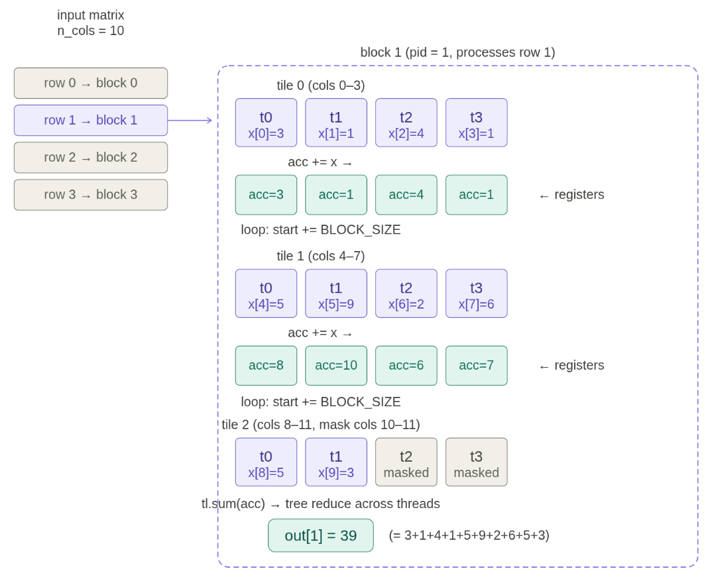

课堂对应区间：`01:06:53--01:08:21`。

图中一行有 10 个元素，tile size 为 4，因此依次处理：

$$
[3,1,4,1],\quad[5,9,2,6],\quad[5,3,0,0].
$$

- 每个方括号：当前循环读取的一个 4 元素 tile。
- 最后两个 0：越界位置使用的 sum 单位元，而不是原始输入。

第三个 tile 的两个无效位置用 0 填充，总和为：

$$
3+1+4+1+5+9+2+6+5+3=39.
$$

- 左侧十个数：这一行的十个有效输入元素。
- 39：跨三个 tile 累积后的行和。

### 7.2 完整形状推演：三行、每行十个元素

把例子扩展为 $M=3$、$N=10$、`BLOCK_SIZE=4`。Host 端用 `row_sum_kernel[(M,)](...)` 发射 kernel，因此 grid 是 `(3,)`：共有 3 个 Triton program，`program_id` 分别为 0、1、2，每个 program 独立处理一整行。

每一行需要遍历的 tile 数为：

$$
T=\left\lceil\frac{N}{B}\right\rceil
=\left\lceil\frac{10}{4}\right\rceil=3,
\qquad
\mathrm{grid}=(M,)=(3,).
$$

- $M$：输入矩阵的行数，本例为 3。
- $N$：每行的有效元素数，本例为 10。
- $B$：`BLOCK_SIZE`，即每个 tile 的逻辑宽度，本例为 4。
- $T$：每个 program 需要循环处理的 tile 数，本例为 3。
- $\mathrm{grid}$：Triton program 的发射网格，本例包含 3 个一维 program。

三个循环迭代对所有行使用相同的列 offset 和 mask：

| tile | `start` | `offsets` | `mask = offsets < 10` | 有效列 |
|---:|---:|---|---|---|
| 0 | 0 | `[0, 1, 2, 3]` | `[T, T, T, T]` | 0–3 |
| 1 | 4 | `[4, 5, 6, 7]` | `[T, T, T, T]` | 4–7 |
| 2 | 8 | `[8, 9, 10, 11]` | `[T, T, F, F]` | 8–9 |

总共发生 $M\times T=3\times3=9$ 次 tile load。第三个 tile 的后两 lane 因 mask 为 false，由 `other=0.0` 提供 sum 的单位元，不会越界访问。

例如输入和逐 lane 累积过程可以完整写成：

```text
X[0] = [ 3,  1,  4,  1 | 5, 9, 2, 6 | 5,   3,   -, -]
acc0 = [ 3,  1,  4,  1] + [5, 9, 2, 6] + [5,   3, 0, 0]
     = [13, 13,  6,  7]  -> tl.sum = 39

X[1] = [ 1,  2,  3,  4 | 5, 6, 7, 8 | 9,  10,   -, -]
acc1 = [ 1,  2,  3,  4] + [5, 6, 7, 8] + [9,  10, 0, 0]
     = [15, 18, 10, 12]  -> tl.sum = 55

X[2] = [-1, -2, -3, -4 | 4, 3, 2, 1 | 0.5, 0.5, -, -]
acc2 = [-1, -2, -3, -4] + [4, 3, 2, 1] + [0.5, 0.5, 0, 0]
     = [3.5, 1.5, -1, -3] -> tl.sum = 1
```

最终每个 program 只写一个标量：program 0 写 `y[0]=39`，program 1 写 `y[1]=55`，program 2 写 `y[2]=1`。因此输出为 `y = [39, 55, 1]`，shape 是 `(M,) = (3,)`，而不是 `(3, 1)` 或 `(3, 4)`。

> [!IMPORTANT]
> 这里的“一行三个 tile”不意味着 grid 里有 9 个 program。Grid 仍然只有 3 个 program；每个 program 在自己的循环里执行 3 次 tile load。Program 数和 program 内循环次数是两个独立维度。

### 7.3 累加器应跨 tile 保留

```python
@triton.jit
def row_sum_kernel(x_ptr, y_ptr, n_cols,
                   BLOCK_SIZE: tl.constexpr):
    row = tl.program_id(0)
    row_start = x_ptr + row * n_cols
    accumulator = tl.zeros((BLOCK_SIZE,), dtype=tl.float32)

    for start in range(0, n_cols, BLOCK_SIZE):
        offsets = start + tl.arange(0, BLOCK_SIZE)
        mask = offsets < n_cols
        values = tl.load(row_start + offsets, mask=mask, other=0.0)
        accumulator += values

    result = tl.sum(accumulator, axis=0)
    tl.store(y_ptr + row, result)
```

这里的关键不是“每个 tile 求一个标量后写回”，而是让向量累加器跨循环迭代保留，最后只做一次归约和一次写回。

> [!IMPORTANT]
> Padding 值取决于归约的单位元：sum 用 0，max 用 $-\infty$。不能把 softmax 的 padding 规则机械复制到所有归约。

### 7.4 Block 与 tile 的语义边界

- **Tile** 是我们在算法上切出的数据块。
- **Triton program** 是处理一个或多个 tile 的逻辑实例。
- **CUDA block** 是后端映射到硬件调度的执行单位。

一个 program 可以循环处理多个 tile；一个 tile 也不应被直接等同为固定数量的 CUDA thread。把这些概念分开，才能理解编译器还有优化和映射空间。

### 本章小结

- 行宽超过单 tile 容量时，一个 program 可以循环遍历多个 tile。
- 跨 tile 的片上累加器减少中间结果写回。
- Sum 的 padding 单位元是 0；不同归约要选择不同哨兵值。
- Tile 是数据分块，program 是逻辑实例，CUDA block 是后端执行映射。

## 8. 二维数据复用：Tiled Matmul + Fused ReLU

### 8.1 矩阵乘法为什么必须做 tiling

设：

$$
A\in\mathbb{R}^{M\times K},
\qquad
B\in\mathbb{R}^{K\times N},
\qquad
C=AB\in\mathbb{R}^{M\times N},
$$

$$
C_{ij}=\sum_{k=0}^{K-1}A_{ik}B_{kj}.
$$

- $A,B$：输入矩阵。
- $C$：输出矩阵。
- $M$：输出行数。
- $N$：输出列数。
- $K$：归约维度。
- $i,j,k$：行、列和归约下标。

若每计算一个 $C_{ij}$ 都从 HBM 独立读取整行 $A_i$ 与整列 $B_j$，输入会被重复搬运。Tiling 让一个 program 计算 $C$ 的一个二维块，并让载入的 $A$、$B$ 子块被多个输出元素复用。

课堂把朴素方案的主导 HBM 访问量写成 $O(MKN)$，而浮点运算量也是 $O(MKN)$，所以算术强度只保持常数量级：

$$
\mathrm{AI}_{\mathrm{naive}}
\approx
\frac{2MKN}{2MKN+MN}
=O(1).
$$

- $2MKN$（分子）：矩阵乘法的主导浮点运算数。
- $2MKN+MN$（分母）：朴素教学模型中输入重复读取与输出写入的主导元素流量。
- $\mathrm{AI}_{\mathrm{naive}}$：朴素实现每搬运一个元素完成的近似运算量。

如果理想化地让 $A$、$B$ 各从 HBM 读取一次，再写出 $C$，流量会变为 $MK+KN+MN$：

$$
\mathrm{AI}_{\mathrm{ideal}}
\approx
\frac{2MKN}{MK+KN+MN}.
$$

- $MK$：矩阵 $A$ 的元素数。
- $KN$：矩阵 $B$ 的元素数。
- $MN$：输出矩阵 $C$ 的元素数。
- $\mathrm{AI}_{\mathrm{ideal}}$：所有输入被充分复用时的理想算术强度。

现实中整个矩阵装不进 shared memory，因此 tiling 是介于“完全不复用”和“全矩阵片上驻留”之间的可实现方案。

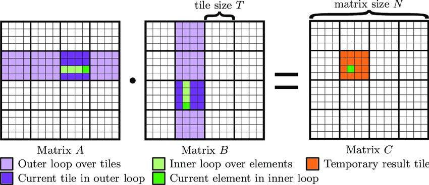

课堂对应区间：`01:16:19--01:18:20`。

图中输出 tile 为 $64\times64$，每次沿 $K$ 维载入 $64\times32$ 的 $A$ tile 与 $32\times64$ 的 $B$ tile。一次 tile 乘法完成约：

$$
2\times64\times64\times32
$$

- 第一个 2：一次乘加按一次乘法与一次加法计两次浮点运算。
- 两个 64：输出 tile 的行数与列数。
- 32：当前 $K$-tile 的宽度。

次浮点运算，但输入元素只需从更慢层级载入后在 tile 内复用。tile 边长增大时，理想的算术强度通常也随之提高，直到被寄存器、shared memory、occupancy 或布局约束限制。

### 8.2 用 stride 把二维坐标变成地址

对二维张量，元素地址偏移可写成：

$$
\operatorname{offset}(r,c)=r\,s_r+c\,s_c.
$$

- $r,c$：行、列坐标。
- $s_r$：沿行移动一步的 stride。
- $s_c$：沿列移动一步的 stride。

例如一个形状 $2\times4$ 的行优先连续矩阵，stride 为 $(4,1)$。坐标 $(1,2)$ 的线性偏移为：

$$
1\times4+2\times1=6.
$$

- 1、2：目标元素的行、列坐标。
- 4、1：行 stride 与列 stride。
- 6：相对张量起始地址的线性元素偏移。

显式 stride 让 kernel 不必假设输入总是某一种连续布局。

### 8.3 Triton 中的二维指针矩阵与 K 循环

下面给出与官方课堂实现同构的完整版本。它包含 host wrapper、grid、全部边界 mask、输出指针和最终 store；只要环境已安装 PyTorch 与 Triton，并传入同一 CUDA 设备上 shape 可相乘、dtype 相同的二维张量，就可以直接调用 `triton_matmul_relu(a, b)`。

```python
import torch
import triton
import triton.language as tl


@triton.jit
def matmul_relu_kernel(
    a_ptr, b_ptr, c_ptr,
    M, N, K,
    stride_am, stride_ak,
    stride_bk, stride_bn,
    stride_cm, stride_cn,
    BLOCK_M: tl.constexpr,
    BLOCK_N: tl.constexpr,
    BLOCK_K: tl.constexpr,
):
    # 当前 program 负责 C 的第 (pid_m, pid_n) 个输出 tile。
    pid_m = tl.program_id(axis=0)
    pid_n = tl.program_id(axis=1)

    indices_m = pid_m * BLOCK_M + tl.arange(0, BLOCK_M)
    indices_n = pid_n * BLOCK_N + tl.arange(0, BLOCK_N)
    indices_k = tl.arange(0, BLOCK_K)

    # 广播后分别得到 [BLOCK_M, BLOCK_K] 和
    # [BLOCK_K, BLOCK_N] 的指针矩阵。
    a_ptrs = (
        a_ptr
        + indices_m[:, None] * stride_am
        + indices_k[None, :] * stride_ak
    )
    b_ptrs = (
        b_ptr
        + indices_k[:, None] * stride_bk
        + indices_n[None, :] * stride_bn
    )

    acc = tl.zeros((BLOCK_M, BLOCK_N), dtype=tl.float32)

    # 沿归约维 K 每次推进 BLOCK_K；末尾 K-tile 用 mask 补 0。
    for k in range(0, K, BLOCK_K):
        a_mask = (
            (indices_m[:, None] < M)
            & (indices_k[None, :] + k < K)
        )
        b_mask = (
            (indices_k[:, None] + k < K)
            & (indices_n[None, :] < N)
        )
        a = tl.load(a_ptrs, mask=a_mask, other=0.0)
        b = tl.load(b_ptrs, mask=b_mask, other=0.0)
        acc += tl.dot(a, b)

        a_ptrs += BLOCK_K * stride_ak
        b_ptrs += BLOCK_K * stride_bk

    # Accumulator 仍在片上；写回前顺手融合 ReLU。
    acc = tl.maximum(acc, 0.0)

    c_ptrs = (
        c_ptr
        + indices_m[:, None] * stride_cm
        + indices_n[None, :] * stride_cn
    )
    c_mask = (
        (indices_m[:, None] < M)
        & (indices_n[None, :] < N)
    )
    tl.store(c_ptrs, acc, mask=c_mask)


def triton_matmul_relu(a: torch.Tensor, b: torch.Tensor) -> torch.Tensor:
    assert a.is_cuda and b.is_cuda
    assert a.ndim == 2 and b.ndim == 2
    assert a.device == b.device and a.dtype == b.dtype

    M, K = a.shape
    K_b, N = b.shape
    assert K == K_b

    c = torch.empty((M, N), device=a.device, dtype=a.dtype)
    BLOCK_M, BLOCK_N, BLOCK_K = 64, 64, 32
    grid = (
        triton.cdiv(M, BLOCK_M),
        triton.cdiv(N, BLOCK_N),
    )

    matmul_relu_kernel[grid](
        a, b, c,
        M, N, K,
        a.stride(0), a.stride(1),
        b.stride(0), b.stride(1),
        c.stride(0), c.stride(1),
        BLOCK_M=BLOCK_M,
        BLOCK_N=BLOCK_N,
        BLOCK_K=BLOCK_K,
    )
    return c
```

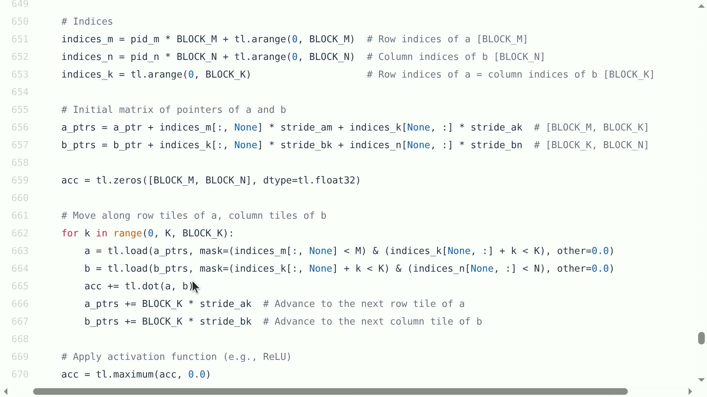

视频原帧，字幕对应区间：`01:20:53--01:21:59`。

`[:, None]` 与 `[None, :]` 通过广播构造二维地址网格。`a_mask`、`b_mask` 同时处理矩阵外边界和最后一个不满的 $K$-tile；`c_mask` 则保证边缘输出 tile 不越界写入。每次循环载入一对 $K$-tile，`tl.dot` 累加到同一个输出 accumulator，循环结束后才写回。

> [!NOTE]
> 这段代码为了完整展示地址与边界逻辑，固定使用 $64\times64\times32$ tile。生产实现通常还会针对 shape 与 GPU autotune `BLOCK_M`、`BLOCK_N`、`BLOCK_K`、warp 数和 pipeline stage 数。

把 ReLU 放在最终写回之前：

$$
Y_{ij}=\max(C_{ij},0),
$$

- $C_{ij}$：矩阵乘法累加后的输出元素。
- $Y_{ij}$：融合 ReLU 后写回的元素。

这样无需先写出 $C$，再由另一个 kernel 读回并计算 ReLU。它与 GeLU 案例体现的是同一条原则：**中间结果还在片上时，尽可能完成相邻的便宜逐元素操作。**

> [!WARNING]
> 更大的 tile 并不自动更快。它可能提高复用，也可能消耗更多寄存器、降低 occupancy，或导致大量 padding。实际选择通常需要结合架构约束与 autotuning。

### 本章小结

- Tiled matmul 的收益来自让 $A$、$B$ 子块服务多个输出元素，提高数据复用。
- Stride 把逻辑坐标与实际内存布局连接起来。
- K 维循环把多个局部乘积累加到片上输出 tile，最后统一写回。
- ReLU 可在 accumulator 写回前融合，避免新增一次 HBM 往返。

## 9. 标题中的 XLA：本讲没展开，但它在编译栈中的位置

### 9.1 事实边界

本章不是视频内容复述。完整 01:26:41 视频、人工字幕与官方 `lecture_06.py` 均没有 XLA/JAX 教学段落。之所以补充这一节，是为了回答标题中的 “XLA” 与前述 Triton kernel 处于什么关系。

### 9.2 从框架图到 GPU kernel

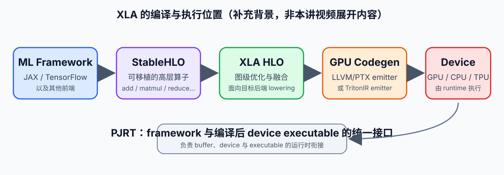

补充图，非视频内容；对照全片 `00:00:00--01:26:41` 后确认不存在 XLA 讲解。

这张图是讲义补充绘制，不是视频截图。可以把 XLA 的位置理解为：

1. 前端框架把高层计算表示为可移植的 **StableHLO** 操作；
2. XLA 转为内部 HLO，进行代数化简、布局、fusion 等优化；
3. GPU 后端继续 lowering，生成可在设备上执行的 kernel；
4. **PJRT** 负责连接框架、编译器与具体设备运行时。

OpenXLA 官方的 GPU 架构说明指出，XLA:GPU 既有基于 LLVM/PTX 的原生 emitter，也可以通过 TritonIR emitter 生成特定 GPU 计算。因此 Triton 与 XLA 并不位于同一抽象层：

| 维度 | Triton | XLA |
|---|---|---|
| 主要抽象 | 一个 program 如何处理一个 tile | 一张计算图/高层 IR 如何整体优化并 lower |
| 典型使用者 | kernel 作者、编译器生成器 | 框架与编译器系统 |
| 主要控制点 | load/store、tile、mask、layout、归约 | 图级 fusion、布局、后端选择、代码生成 |
| 二者关系 | 可直接写 kernel，也可成为后端生成目标 | 某些 GPU 路径可选择 TritonIR emitter |

最容易犯的错误是把两者看成二选一的“GPU 编程语言”。更准确地说，Triton 是 kernel DSL，而 XLA 是能够在更大范围内分析并生成 kernel 的编译系统；XLA 的某条后端路径可以利用 Triton。

### 9.3 最小 JAX → HLO 实验（课外可选）

> [!NOTE]
> 本小节不是课堂内容，而是理解标题中 XLA 的可选学习目标。它使用 JAX 官方当前的 AOT/lowering API，只演示“Python 函数怎样变成 StableHLO、怎样查看 XLA HLO、怎样继续编译”；不把输出冒充本视频中的演示。

下面选择一个与上一章呼应的 `matmul + ReLU`。`jax.jit(...).lower(...)` 会先按输入 shape 与 dtype 特化计算，再 lower 到 XLA 的编译器输入表示。`lowered.as_text()` 打印 StableHLO；`compiler_ir(dialect="hlo")` 则取得 XLA HLO 对象。

```python
import jax
import jax.numpy as jnp


def linear_relu(x, w):
    return jax.nn.relu(x @ w)


# 实际数组只用于给 lowering 提供具体 shape 与 dtype；CPU 环境也可运行。
x = jnp.ones((4, 8), dtype=jnp.float32)
w = jnp.ones((8, 4), dtype=jnp.float32)

lowered = jax.jit(linear_relu).lower(x, w)

# 1. XLA 的可移植输入表示：通常能看到 stablehlo.dot_general
#    与 stablehlo.maximum 等操作。
print(lowered.as_text())

# 2. 查看 XLA HLO 文本。as_hlo_text() 属于返回的 XlaComputation。
hlo = lowered.compiler_ir(dialect="hlo")
print(hlo.as_hlo_text())

# 3. 继续生成当前设备可执行文件并运行。
compiled = lowered.compile()
y = compiled(x, w)
print(y.shape)  # (4, 4)
```

这个最小实验建议观察三件事：

1. 输入 shape 为 $(4,8)$ 和 $(8,4)$，所以 lowering 已特化为输出 shape $(4,4)$；换 shape 通常会得到另一份特化程序。
2. StableHLO 中通常仍能辨认矩阵乘与 maximum；HLO 文本是更接近 XLA 优化管线的表示。
3. `compile()` 才继续生成当前 CPU/GPU/TPU 的可执行文件；仅看到 HLO 中相邻的 `dot` 与 `maximum`，不能据此断言它们最终一定成为一个 GPU kernel。

> [!WARNING]
> 旧教程可能使用已经删除的 `jax.xla_computation`。现行 JAX 文档推荐 `jax.jit(f).lower(...).compiler_ir("hlo")`。如果目的是跨进程保存和部署，官方还建议使用 `jax.export`，而不是把这里打印出的内部 IR 当成稳定序列化格式。

完成这个实验后，读者应能把两条路径区分开：手写 Triton 是直接规定 tile 级 kernel；JAX/XLA 则从高层数组程序出发，经 StableHLO/HLO 和后端 lowering 生成设备程序。

### 9.4 拓展阅读

- [OpenXLA：XLA:GPU Architecture](https://openxla.org/xla/gpu_architecture)
- [OpenXLA：Terminology](https://openxla.org/xla/terminology)
- [StableHLO Specification](https://openxla.org/stablehlo/spec)
- [JAX：Ahead-of-time lowering and compilation](https://docs.jax.dev/en/latest/aot.html)

> [!NOTE]
> 上述链接用于补足标题背景。它们没有改变本讲视频的事实范围：课堂实际主线在 GPU 性能模型与 Triton kernel。

### 本章小结

- 本次视频实际没有讲 XLA；本章是透明标注的外部补充。
- StableHLO/HLO 承载较高层的计算表示，XLA 负责优化与后端 lowering。
- Triton 面向 tile 级 kernel 表达；XLA 面向更高层编译流程。
- XLA 的 GPU 后端可以使用 TritonIR emitter，因此二者可以上下游协作。

## 总结与延伸

本讲从 GPU 的存储与调度约束出发，形成了一条完整的 kernel 推理链：

1. **先看硬件约束**：HBM 与片上存储的带宽差异、warp 调度、寄存器压力和 occupancy 决定了可行空间。
2. **再看真实证据**：benchmark 判断总延迟，profiler 揭示 kernel 数量与热点。
3. **识别数据移动**：GeLU 与 softmax 表明，很多“计算慢”其实是中间张量反复进出 HBM。
4. **用 tile 表达复用**：Triton program 让我们按 tile 组织 load、compute、store，并用 mask 保持边界正确。
5. **逐步增加结构**：从一维 elementwise，到单 tile 归约、跨 tile 归约，再到二维 tiled matmul。
6. **在写回前融合**：GeLU 的多步逐元素计算、softmax 的多阶段归约、matmul 后的 ReLU，都展示了减少中间写回的收益。

### 课堂结尾问答留下的三条边界

**第一，不要从 PTX 开始写所有东西。** PTX 能帮助检查编译结果，但手写低层代码的开发成本、可移植性与维护负担都很高。课堂提到 ThunderKittens、CuTe 等替代或相邻工具；不同 DSL 各自带有适合某类计算结构的 inductive bias，不存在一个抽象对所有 kernel 都最优。

**第二，高维张量没有单一最优切法。** 该沿哪个维度分 tile，要看依赖关系、数据复用、片上容量、连续访问模式和输出归约方向，而不是只看张量有几维。

**第三，性能结论必须回到实测。** 本讲的 GeLU 结果已经证明：编译融合大幅优于未融合逐项实现，但仍慢于当时的 PyTorch 内置 kernel。正确结论应包含形状、硬件与实现上下文。

### 建议的后续练习

1. 修改 GeLU 的 `BLOCK_SIZE`，记录运行时间与编译后 PTX 的变化。
2. 让 softmax 的列数跨过 2 的幂边界，观察 padding、寄存器压力与性能。
3. 为 row sum 比较“每 tile 写部分和”与“program 内跨 tile 累加”两种实现。
4. 为 matmul 扫描 `BLOCK_M`、`BLOCK_N`、`BLOCK_K`，同时记录吞吐量与 occupancy。
5. 用 profiler 验证 fused ReLU 是否真的没有成为单独 kernel。
6. 阅读 OpenXLA GPU 后端资料，区分图级 fusion 与 kernel 内 fusion 的职责。

课程在此后会进入更大规模的系统主题，包括跨设备通信与多 GPU 训练。理解本讲的 kernel 性能模型，是理解分布式训练的前提：当单卡计算和数据移动都没有被说清楚时，多卡系统只会把瓶颈放大。

### 本章小结

- 高性能 kernel 的核心不是“写得更底层”，而是让数据移动、并行映射和计算结构彼此匹配。
- Fusion、tiling、mask、片上累加与 stride 是本讲可迁移到其他算子的关键工具。
- 任何优化都需要 benchmark 和 profiler 共同验证。
- Triton 提供了可控的 kernel 抽象；XLA 则属于更高层的编译与生成体系。
