# CS336 2026 Lecture 7：并行训练——从 Collective 到数据、张量与流水线并行

> **课程**：Stanford CS336 — Language Modeling from Scratch（Spring 2026）  
> **讲次**：Lecture 7: Parallelism  
> **讲者**：Percy Liang  
> **视频**：[Stanford Online / YouTube](https://www.youtube.com/watch?v=SzpOcwdIL0Y)  
> **时长**：01:21:02  
> **材料说明**：讲义基于公开视频、人工英文字幕与官方课件源码交叉整理；公开仓库不再分发这些原始文件。


这节课并不是并行技术名词的罗列，而是在回答一个统一的系统问题：**当模型、数据和计算分布在多张 GPU 上时，我们应当复制什么、切分什么，又必须为此移动什么？** 整堂课的所有内容——通信原语、硬件拓扑、三种并行策略、性能测量方法——都可以看作对这个问题的不同侧面的回答。

前一讲的优化对象主要在单张 GPU 内部：算子融合、分块计算与数据复用，目标都是减少 HBM 与计算单元之间的数据移动。本讲把问题的边界扩展到多张 GPU、多个节点。当我们把计算资源增加一个数量级时，显存容量和可用 FLOPs 确实都增加了，但 GPU 之间的数据交换随之成为新的瓶颈。因此，判断一种并行策略是否有效，绝不能只看"用了多少张卡"，而必须同时考察以下五个相互纠缠的维度：

- 每张 GPU 保存哪些参数、梯度、优化器状态和激活；
- 每张 GPU 负责哪一部分样本，或哪一部分模型；
- 哪个张量需要跨卡移动，移动多少次、每次多少字节；
- 通信能否与计算在时间上重叠；
- 通信路径位于同一 NVLink 高速域内，还是必须跨越较慢的节点间网络。

> [!IMPORTANT]
> 阅读后续每一种并行策略时，请始终用五个问题检查它：**存什么、算什么、传什么、何时传、为什么值得传。** 凡是不能用这五个问题说清楚的"并行方案"，都只是名词，而不是设计。

---

## 从单卡内存墙到多卡通信墙

### 两个不同的扩展目标

在工程讨论中，"上更多 GPU"常常被当作一句口号，但它实际上混合了两个本质不同的目标，我们必须先把它们分开：

1. **容量扩展（scaling for capacity）**：模型状态（参数、梯度、优化器状态）或激活放不进单张 GPU 的显存，不得不把它们切分到多张卡上才能开始训练；
2. **吞吐扩展（scaling for throughput）**：模型本来就能放进单卡，但我们希望动用更多 FLOPs，在相同的墙钟时间内处理更多 token，从而缩短总训练时长。

这两个目标对并行策略提出的要求完全不同。容量扩展是"不得不切"：不切就根本无法运行，此时我们关心的是每张卡少存多少字节；吞吐扩展是"希望更快"：每张卡仍然保留完整的模型状态，此时我们关心的是每步新增多少通信开销，以及这些开销能否被计算掩盖。

数据并行通常首先解决吞吐问题，因为每张卡仍保留完整模型，只把 batch 切开。张量并行和流水线并行则会切开模型本身，因而能直接降低每卡所承担的部分模型状态。需要强调的是，真实的大模型训练几乎从不"三选一"，而是把这些方法沿着硬件层级嵌套组合起来——这一点将在本讲最后一节展开。

### 层级越远，数据移动通常越贵

我们可以把一台训练机器乃至一个训练集群理解为一个通信层级结构，从快到慢依次是：

1. GPU 芯片内部的寄存器、共享内存与各级缓存；
2. 单张 GPU 板载的 HBM 显存；
3. 单节点或同一高速域内的 NVLink / NVSwitch 互联；
4. 跨节点的 InfiniBand 或 Ethernet / RoCE 网络。

沿着这个层级每向下走一步，通常意味着更高的延迟与更低的有效带宽，而且相邻层级之间的差距往往是数倍乃至一个数量级以上。于是，"多一张 GPU"只增加了*潜在*算力；如果训练循环的每一步都要在慢链路上搬运大量张量，那么实际吞吐未必随卡数线性增长，甚至可能不升反降。并行设计的艺术，本质上就是**让最频繁的数据移动停留在最快的层级上**。

课程首先给出一张全局地图：所有并行策略都建立在少数几个通信原语（collective）之上，最终则可以归结为沿 batch、width、depth 三个正交轴对训练进行切分。

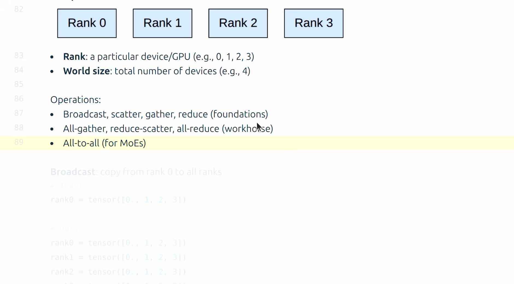

*对应视频 `00:06:44--00:08:16`。画面给出四个 rank 及本课要讨论的 collective 列表。*

### 一个统一抽象：复制与切分

并行训练中看似纷繁的设计，绝大多数都可以看成 replication（复制）与 sharding（切分）之间的交换，外加两个辅助动作：

- **复制**让每份本地计算更加独立，从而减少即时通信，但代价是重复占用显存；
- **切分**降低每卡的存储压力，但必须在某些计算边界上把数据重新拼起来或聚合起来；
- **重计算**（recomputation）不存中间结果，需要时重新算一遍，用额外的 FLOPs 换显存；
- **通信**把本地暂时缺失的数据从其他设备取来，用网络带宽换显存。

这四个动作将贯穿本讲后续的所有方法。真正困难的地方从来不是让某个示例代码"跑起来"，而是把每一笔代价安排在最便宜的资源上：让高频通信落在最快的链路上，让不可避免的通信尽可能隐藏在计算的阴影里。

### 一个贯穿全讲的思考样例

为避免讨论停留在抽象层面，我们设定一个具体的玩具场景，后续各节的公式都可以代入它：一个隐藏维 $D = 4096$、共 32 层的模型，参数量约 $N = 32 \times (4D^2 + 8D^2) \approx 4 \times 10^{9}$（每个 block 约含 attention 投影的 $4D^2$ 与 MLP 的 $8D^2$）；训练集群为 4 张 GPU、单节点 NVLink 互联，有效带宽约 400 GB/s。

- **容量检查**：混合精度 Adam 下模型状态为 $16N = 64$ GB。四卡纯 DDP 要求每卡完整装下 64 GB——已经逼近单卡极限，容量问题真实存在；
- **吞吐检查**：fp16 梯度 $|\theta| = 8$ GB，DDP 每步每卡通信约 $2|\theta| = 16$ GB，在 400 GB/s 下约 40 ms；若单步反向计算约 200 ms，通信可被 bucket 重叠完全掩盖；
- **决策顺序**：先算容量（能不能跑）、再算通信（贵不贵）、最后看重叠（藏不藏得住）——这就是本讲反复使用的检查流程，读者可以在自己的硬件与模型上照做一遍。

### 本章小结

- 多 GPU 训练同时面对容量扩展与吞吐扩展两个目标，二者对策略的要求不同，不能混为一谈。
- GPU 数量的增加并不保证线性加速；数据移动所处的层级决定了通信成本的上限。
- 后续的每一种策略，都可以用"复制、切分、重算、通信"四个基本动作来解构和理解。

---

## Collective：多 GPU 协作的基本词汇

### rank 与 world size

在分布式训练中，一组协同工作的进程构成一个**进程组**（process group）。组内每个参与者有一个全局编号，称为 **rank**；参与者的总数称为 **world size**。本课的示例大量使用四个进程，对应 rank 0、1、2、3，world size 为 4。

需要区分的是，这里的 rank 是进程组内的*逻辑*编号，而不是物理 GPU 的编号。多节点训练时还必须引入本机编号 `local_rank`：全局 rank 5 的进程并不意味着它一定使用所在机器的 GPU 5——它使用的是本机的第 `local_rank` 块 GPU。三者的关系是

$$
\text{rank} = \text{node\_rank} \times n_{\text{local}} + \text{local\_rank},
$$

- $\text{rank}$：进程在全局进程组中的编号；
- $\text{node\_rank}$：进程所在节点在集群中的编号；
- $n_{\text{local}}$：每个节点启动的进程数（通常等于每节点的 GPU 数）；
- $\text{local\_rank}$：进程在本节点内的编号，通常直接对应 `torch.cuda.set_device` 的参数。

课程代码在单机上进行演示，因此有意隐藏了全局 rank 与 local rank 的差异；但在阅读生产代码时，这个区分是理解进程—设备映射的第一步。

### 八种常见通信模式

下面我们用四个 rank 上的小张量建立直觉。判断一种 collective 的语义时，先问三件事：**输入最初分布在哪些 rank 上？输出最终出现在哪些 rank 上？过程中是否发生逐元素归约（求和、平均、取最大等）？** 把这三个问题回答清楚，八种模式就各就各位了。

| 操作 | 直观变换 | 输出位置 | 常见用途 |
|---|---|---|---|
| broadcast | 一个源的完整数据复制给大家 | 所有 rank | 分发配置或权重 |
| scatter | 一个源的完整数据切片后分发 | 每个 rank 一片 | 分发分片 |
| gather | 各 rank 的分片收回 | 一个目标 rank | 汇总结果 |
| reduce | 各 rank 数据逐元素求和/平均等 | 一个目标 rank | 聚合统计量 |
| all-gather | 所有人交换分片并拼成完整张量 | 所有 rank | 临时重建参数或激活 |
| reduce-scatter | 先归约，再把结果切片分发 | 每个 rank 一片 | 聚合并保留分片梯度 |
| all-reduce | 归约后的完整结果复制给大家 | 所有 rank | DDP 同步梯度 |
| all-to-all | 每个 rank 都给每个目标发一片 | 每个 rank 收到按来源重排的数据 | MoE token 路由 |

几个容易混淆的关系，值得逐一澄清：

- scatter 的逆操作是 gather：一个把整体拆成片发出去，一个把片收回来拼成整体；
- broadcast 与 reduce 在数据流方向上相反（一对多与多对一），但 reduce 还额外带有求和、平均、最大值等归约运算，并非简单的反向复制；
- all-gather **不是**归约操作，它只交换并拼接分片，不同 rank 贡献的数据在输出中占据不同的位置，而不会逐元素相加；
- reduce-scatter 同时做两件事：先对各 rank 的完整输入逐元素归约，再把归约结果切成 $P$ 片，每个 rank 留下一片；
- all-reduce 可以精确地分解为 reduce-scatter 后接 all-gather——这个分解是本讲后半部分所有通信量分析的支点。

#### 逐个契约：输入输出 shape 与典型用途

设 world size 为 $P$，每个 rank 持有一个包含 $N$ 元素的本地张量。下面逐个给出八种 collective 的 shape 契约。这里的"契约"指的是：调用前后，每个 rank 上的张量形状必须满足什么关系。

1. **broadcast**：源 rank 输入 $N$ 元素，其余 rank 输入可以是空占位；调用后所有 rank 都得到与源完全相同的 $N$ 元素副本。通信模式是一对多。典型用途是训练开始时把 rank 0 读取的配置、词表或初始权重分发给全体。
2. **scatter**：源 rank 输入 $P \times N$ 元素（可视为 $P$ 片、每片 $N$ 元素），第 $r$ 片发给 rank $r$；调用后每个 rank 持有 $N$ 元素。典型用途是把一整批索引或数据分片从主进程分发下去。
3. **gather**：每个 rank 输入 $N$ 元素；目标 rank 输出 $P \times N$ 元素（按 rank 顺序拼接），其余 rank 无输出。它是 scatter 的镜像，典型用途是把各卡算出的部分指标汇总到 rank 0 做日志或检查点。
4. **reduce**：每个 rank 输入 $N$ 元素；目标 rank 输出 $N$ 元素，第 $i$ 个元素是各 rank 第 $i$ 个元素的归约结果（如 $\sum_r x_r[i]$）。其余 rank 无输出。典型用途是只让主进程拿到全局统计量。
5. **all-gather**：每个 rank 输入 $N$ 元素；所有 rank 输出 $P \times N$ 元素，按 rank 顺序拼接。相当于"gather 到所有人"。典型用途是 FSDP/ZeRO 在计算某一层之前，把切片的参数临时拼回完整张量。
6. **reduce-scatter**：每个 rank 输入 $P \times N$ 元素；归约后切成 $P$ 片，rank $r$ 输出第 $r$ 片、共 $N$ 元素。输出第 $i$ 个元素是各 rank 输入中对应位置元素的归约结果。典型用途是 ZeRO 反向后：每个参数分片的梯度只由负责它的 rank 保留。
7. **all-reduce**：每个 rank 输入 $N$ 元素；所有 rank 输出相同的 $N$ 元素，为逐元素归约结果。相当于 reduce 后接 broadcast，也等价于 reduce-scatter 后接 all-gather。典型用途是数据并行中同步全局梯度。
8. **all-to-all**：每个 rank 输入 $P \times N$ 元素，切成 $P$ 片；rank $r$ 的第 $j$ 片发往 rank $j$；调用后 rank $r$ 持有来自所有 rank 的第 $r$ 片，共 $P \times N$ 元素。若把输入看成一个"目的地 × 内容"矩阵，all-to-all 就是对它做了一次转置。典型用途是 MoE 中按专家归属重排 token。

把这张契约表记熟，后面读任何并行算法的通信步骤时，都可以直接对照"此刻是哪一种 collective、输入输出各是什么形状"，而不必重新推理。

### 为什么 all-reduce 是 DDP 的主力

假设每个 rank 都基于自己的本地数据独立计算出一份完整梯度。数据并行要求所有 rank 在参数更新之前拿到同一份全局平均梯度，否则各副本的参数会随时间漂移、训练失去意义。满足"所有人拿到同一份归约结果"这一要求的原语正是 all-reduce。它可以精确地写成两阶段分解：

$$
\operatorname{AllReduce}(x_0,\ldots,x_{P-1})
=\operatorname{AllGather}\!\left(
\operatorname{ReduceScatter}(x_0,\ldots,x_{P-1})
\right).
$$

- $x_r$：rank $r$ 持有的输入张量，$r = 0, \ldots, P-1$；
- $P$：world size，即参与归约的 rank 总数；
- $\operatorname{ReduceScatter}$：先对 $P$ 份输入逐元素归约，再把结果均分为 $P$ 片，rank $r$ 得到第 $r$ 片；
- $\operatorname{AllGather}$：各 rank 交换自己手中的分片，使每个 rank 都拼出完整的归约结果。

第一阶段把归约后的不同分片留在不同 rank 上，此时没有任何一个 rank 拥有完整结果，但全体 rank 合起来恰好覆盖整个向量；第二阶段交换这些分片，让每个 rank 都得到完整结果。

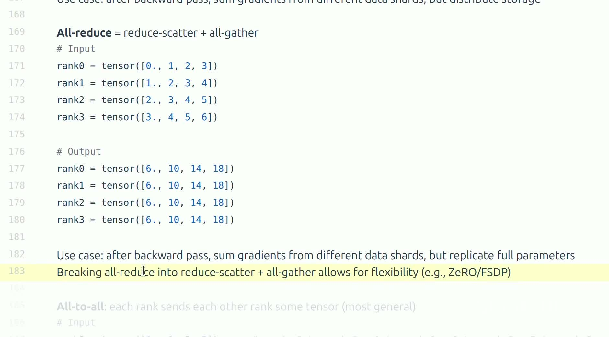

*对应视频 `00:15:18--00:16:48`。画面并列展示输入、分片归约结果与最终完整结果。*

这种分解绝不仅是数学上的恒等式，它还直接解释了后续方法的通信选择：传统 DDP 需要每个 rank 拿到*完整*梯度，因此使用 all-reduce；ZeRO/FSDP 只保留*分片*状态，梯度归约到 reduce-scatter 就可以停下（每个 rank 只留自己负责的那片），而参数重建只需要 all-gather。换句话说，all-reduce 是两个更基本原语的组合，而 ZeRO 系列方法正是"拆开使用"这两个原语的产物。

> [!QUOTE]
> “先关注 all-reduce，再把它拆成 reduce-scatter 和 all-gather。”——讲者在 `00:16:22--00:16:41` 给出的学习主线（意译）。

### 用 ring 模型估算通信量

要建立通信成本的定量直觉，我们引入经典的 $\alpha$–$\beta$ 模型：每一次通信步骤都有固定的启动延迟 $\alpha$（与消息大小无关），而传输本身按链路的有效带宽 $\beta$ 线性耗时。令通信张量大小为 $S$ 字节，rank 数量为 $P$。在经典 ring 模型中，reduce-scatter 与 all-gather 两个阶段各传输

$$
V_{\text{RS}}\approx \frac{P-1}{P}S,
\qquad
V_{\text{AG}}\approx \frac{P-1}{P}S,
$$

- $V_{\text{RS}}$：ring reduce-scatter 阶段中单个 rank 的发送字节量；
- $V_{\text{AG}}$：ring all-gather 阶段中单个 rank 的发送字节量；
- $S$：参与通信的张量总字节数；
- $P$：world size。

因此 all-reduce 的每 rank 总发送量为

$$
V_{\text{AR}}\approx 2\frac{P-1}{P}S,
$$

- $V_{\text{AR}}$：ring all-reduce 中单个 rank 的总发送字节量。

而完成一次 all-reduce 的墙钟时间可粗略写为

$$
T_{\text{AR}}\approx 2(P-1)\alpha
+2\frac{P-1}{P}\frac{S}{\beta}.
$$

- $T_{\text{AR}}$：一次 ring all-reduce 的端到端耗时；
- $\alpha$：每个通信步骤的固定启动延迟，单位为秒；
- $\beta$：链路的有效带宽，单位为字节每秒。

这个公式给出两点基本直觉：其一，小消息场景下 $2(P-1)\alpha$ 项占主导，多次启动的延迟是瓶颈；其二，大消息场景下字节量与带宽项占主导，耗时几乎只取决于 $S/\beta$。必须声明的是，这只是 ring 算法的教学模型：NCCL 在所有拓扑、所有消息大小下并不固定采用 ring，真实实现的算法选择将在测量一节继续讨论。

### ring all-reduce 通信量的完整推导

上一节直接给出了结论，现在我们把每一步补齐。考虑 $P$ 个 rank 排成一个逻辑环：rank $r$ 的下游是 rank $(r+1)\bmod P$，上游是 rank $(r-1)\bmod P$。每个 rank 持有一个 $N$ 元素的向量 $x_r$，目标是让所有人得到逐元素和 $\sum_{r=0}^{P-1} x_r$。把每个向量均分为 $P$ 个块（chunk），每块含 $N/P$ 个元素，记第 $j$ 块为 $c^{(j)}$。

**第一阶段：reduce-scatter。** 共进行 $P-1$ 步。在第 $k$ 步（$k=1,\ldots,P-1$），rank $r$ 把自己手中"块下标为 $(r-k+1)\bmod P$"的部分和发送给下游 rank $r+1$，同时从上游 rank $r-1$ 接收块下标为 $(r-k)\bmod P$ 的部分和，并把它逐元素加到自己本地的同名块上。由于每一步所有 rank 同时各发各收，环上的 $P$ 条链路全部被占满，没有串行等待。

我们用 $P=4$ 跟踪块 $c^{(0)}$ 的旅程来验证正确性：第 1 步，rank 0 把 $c^{(0)}$ 发给 rank 1，rank 1 加上自己的 $c^{(0)}$，得到两份之和；第 2 步，rank 1 把这份部分和发给 rank 2，累加成三份之和；第 3 步，rank 2 把它发给 rank 3，累加成四份之和。$P-1=3$ 步之后，$c^{(0)}$ 的完整归约结果落在 rank 3 上。同理，每个块都恰好绕环走过 $P-1$ 次"发送—累加"，最终每个 rank 恰好持有一个完整归约好的块（rank $r$ 持有块 $(r+1)\bmod P$）。

每步中单个 rank 的发送量恰为一块，即 $N/P$ 个元素，共 $P-1$ 步，故

$$
V_{\text{RS}} = (P-1)\cdot\frac{N}{P} = \frac{P-1}{P}N
\quad\text{个元素},
$$

- $V_{\text{RS}}$：reduce-scatter 阶段单个 rank 的发送总量；
- $N$：参与归约的向量元素总数（梯度同步时 $N$ 就是参数量）；
- $P$：world size。

**第二阶段：all-gather。** 此时每个 rank 持有一个已归约完毕的块，目标是让所有人拿到全部 $P$ 个块。同样进行 $P-1$ 步：第 $k$ 步中，rank $r$ 把自己"最新获得的块"转发给下游，并从上游接收下一个块。每个块只需绕环传递一圈即可到达所有 rank，$P-1$ 步后每个 rank 恰好集齐 $P$ 个块，拼出完整结果。每步发送量仍为 $N/P$，故

$$
V_{\text{AG}} = (P-1)\cdot\frac{N}{P} = \frac{P-1}{P}N
\quad\text{个元素}.
$$

**合并两阶段。** 单个 rank 的总发送量为

$$
V_{\text{AR}} = V_{\text{RS}} + V_{\text{AG}}
= 2\,\frac{P-1}{P}N
\;\xrightarrow{P\ \text{较大}}\; 2N
\quad\text{个元素}.
$$

这个结论中最重要的性质是：**当 $P$ 增大时，$(P-1)/P \to 1$，每个 rank 的通信量趋近于常数 $2N$，与集群规模无关。** 这正是 ring all-reduce 可扩展性的来源——把集群从 8 卡扩到 1024 卡，单卡需要发送的字节数几乎不变，因此增加卡数不会加剧单链路的带宽压力。这与朴素方案形成鲜明对比：若让 rank 0 收集全部数据再广播结果，rank 0 的接收量随 $P$ 线性增长，立刻成为瓶颈。

从信息论角度还可以看到 ring 是**带宽最优**的：reduce-scatter 阶段，每个 rank 的 $N$ 个元素中至多只有 $N/P$ 个可以完全本地消化，至少 $(P-1)N/P$ 个元素必须离开本 rank 参与归约；all-gather 阶段，每个 rank 至少要从外部接收 $(P-1)N/P$ 个元素才能拼出完整结果。ring 恰好达到这个下界，没有多传一个字节。

但 ring 并非万能。其延迟项为 $2(P-1)\alpha$，随 $P$ *线性*增长：千卡规模下，仅启动延迟就可能累计到毫秒级。因此对小消息或超大 $P$，NCCL 会改用 tree、recursive doubling 等延迟为 $O(\log P)$ 的算法——它们牺牲少量带宽最优性来换取对数级延迟。理解"ring 带宽最优、tree 延迟更优"这对矛盾，就理解了 NCCL 为什么要在运行时根据消息大小切换算法。

### 其他 collective 的通信量速查

all-reduce 的推导方法可以直接推广到其余原语。设消息总量为 $S$ 字节、world size 为 $P$、采用 ring/线性流水线式实现，常用原语的每 rank 发送量与步数如下：

| 原语 | 每 rank 发送量 | 步数 | 备注 |
|---|---|---|---|
| broadcast（流水线 ring） | $\approx S$ | $P-1$ | 源先发，之后只转发 |
| reduce（ring 到根） | $\approx \frac{P-1}{P}S$ | $P-1$ | 等价于不完整的 reduce-scatter |
| all-gather（ring） | $\frac{P-1}{P}S$ | $P-1$ | 见正文推导 |
| reduce-scatter（ring） | $\frac{P-1}{P}S$ | $P-1$ | 见正文推导 |
| all-reduce（ring） | $2\frac{P-1}{P}S$ | $2(P-1)$ | 前两行之和 |
| all-to-all | $\frac{P-1}{P}S$ | $1$ 轮交换 | 每片直达目的 rank |

- $S$：单个 rank 参与该原语的本地数据字节数（注意各原语对"本地数据"的定义不同，需对照形状契约）。

两行值得单独记忆：all-gather 与 reduce-scatter 的通信量完全相同，因此"all-reduce 拆成两步"的总代价恰是单步的两倍；all-to-all 虽然一次完成，但它产生 $P(P-1)$ 条并发流，对网络交换能力的压力与 ring 上井然有序的转发完全不同，实测带宽往往远低于表观字节量所暗示的水平。

### all-to-all 与 MoE

all-to-all 是八种原语中最一般的重排操作：每个 rank 把输入切成 $P$ 片，并把第 $j$ 片发送给 rank $j$；同时从每个 rank 接收一片。如果把所有 rank 的输入拼起来看成一个"来源 rank × 目的 rank"的二维分块矩阵，那么 all-to-all 的输出恰好相当于把这个矩阵做了一次转置。

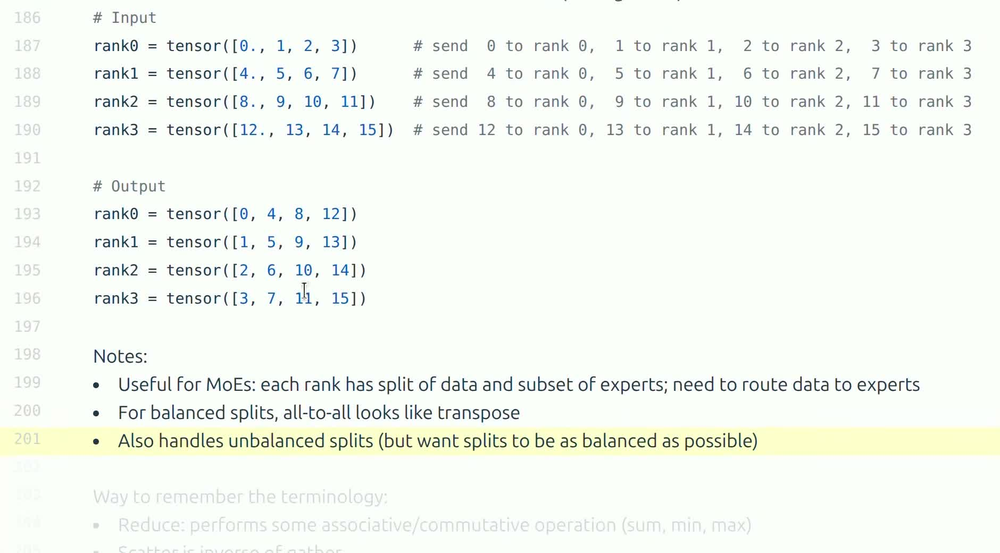

*对应视频 `00:16:48--00:19:44`。画面展示每个 rank 如何向所有目的 rank 发送不同元素。*

在 Mixture-of-Experts（MoE）模型中，每个 token 会根据路由器（router）的输出选择若干专家；当专家分布在不同设备上时，就必须把 token 送到专家所在的 rank 进行计算，算完再把结果送回原 rank。一来一回正好是两次 all-to-all。all-to-all 在 API 层面完美表达了这种动态重排，但它并不自动解决两个工程问题：其一，路由器的决策可能造成专家负载不均，某些 rank 收到的 token 远多于其他 rank，形成计算热点；其二，不均匀的流量会在网络上制造拥塞热点。这些问题需要负载均衡损失、容量因子（capacity factor）等算法层手段单独处理，而不是通信库的职责。

### 归约算子与数值确定性

all-reduce 的 `op` 参数（SUM、AVG、MAX、MIN、PRODUCT 等）决定逐元素归约所用的运算。两个工程事实值得注意。

第一，AVG 与 SUM 的关系并非简单等价：`ReduceOp.AVG` 在 NCCL 中是对总和再除以 $P$，数学上与"求和后自行平均"相同，但教学代码若用 SUM 实现平均，必须记得显式除以 world size，否则等效学习率随卡数漂移。

第二，浮点加法不满足结合律：$(a+b)+c \ne a+(b+c)$。归约结果因此依赖求和顺序，而 ring 与 tree 的顺序不同，甚至同一算法在不同运行中的调度也可能改变顺序。跨算法、跨配置的梯度不能期望逐位相同，只能期望在浮点容差内一致。对调试的含义是：验证分片实现正确性时，应与单卡基准在约 $10^{-6}$ 相对容差下比较（混合精度适当放宽），而不是断言逐位相等；对复现的含义是：要求逐位复现必须固定算法、拓扑与归约顺序，远比固定随机种子苛刻。

### 本章小结

- collective 描述"数据如何在一组 rank 之间变换"，它让上层算法不必手写每一条点对点连接，只需声明期望的数据变换。
- 八种 collective 各有严格的 shape 契约；判断语义时先问输入在哪、输出在哪、是否归约。
- DDP 的核心是 all-reduce；ZeRO/FSDP 更直接地使用 all-gather 与 reduce-scatter，而后两者正是 all-reduce 的两阶段分解。
- ring all-reduce 的每 rank 通信量为 $2(P-1)N/P \approx 2N$，与 $P$ 无关，且达到带宽下界；代价是延迟随 $P$ 线性增长。
- all-to-all 是 MoE token 路由的关键原语，但负载均衡与网络热点问题需要算法层单独处理。

---

## 硬件拓扑、RDMA 与软件栈

### 拓扑是通信的价格表

代码里写下同一个 `all_reduce`，并不表示所有 rank 对之间的通信代价相同。collective 是逻辑抽象，而它的实际价格完全由物理拓扑决定。传统服务器中，GPU 可能先通过 PCIe 总线连接到 CPU，再经网卡跨节点通信；现代训练节点则通常先用 NVLink 和 NVSwitch 在节点内部建立高速域，再通过 InfiniBand 或 Ethernet/RoCE 把多个节点连接起来。

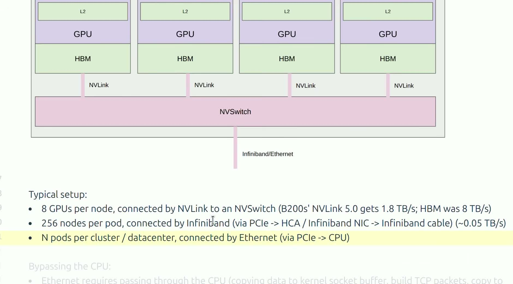

*对应视频 `00:23:27--00:26:23`。画面比较节点内高速互联与节点间网络，并给出典型训练拓扑。*

这个层级差异会直接影响并行策略的放置决策：

- **张量并行**在每一层都可能交换激活，通信频率与层数成正比，对延迟和带宽都极度敏感，通常应当限制在节点内的高速域中；
- **流水线并行**只在相邻阶段的边界传递激活，通信次数与 stage 数成正比而与层数无关，往往更能容忍较慢的跨节点链路；
- **数据并行**通常每个训练步同步一次梯度，通信频率最低，可以跨节点扩展，但仍需尽量让梯度通信与反向计算重叠，否则每步都要付出一段裸露的通信时间。

换句话说，"哪种并行放哪条链路"不是品味问题，而是通信频率与链路价格的匹配问题：把最贵的通信模式放在最快的链路上。

### 通信层级的数量级直觉

"快链路与慢链路"到底是多少？给出主流训练硬件的典型数量级（具体数字随代际变化，但层级差距稳定存在）：

| 层级 | 典型带宽（单向） | 典型延迟 |
|---|---|---|
| HBM（单卡显存） | 1–3 TB/s | 数百纳秒 |
| NVLink（节点内 GPU 间） | 数百 GB/s 量级 | 微秒级 |
| PCIe（GPU 经主机） | 数十 GB/s | 微秒级 |
| 节点间 IB/RoCE | 每张网卡数十 GB/s | 数微秒起 |

- 相邻层级之间通常差 $4$–$10$ 倍，从 NVLink 到跨节点网络的落差尤其大。

用这组数字做一次快速决策演练：某 TP group 内每层前向要 all-gather 30 MB，60 层模型每步仅此项就要移动约 1.8 GB。放在 400 GB/s 的 NVLink 域内约 4.5 ms，可以部分容忍；若错误地跨到 25 GB/s 的节点间网络，则要 72 ms 且完全卡在关键路径上——同一个算法、同一份代码，仅因放置错误就慢了一个数量级以上。这就是"拓扑是价格表"的实操含义：**先查价格，再下订单。**

### RDMA、RoCE 与“绕过 CPU”

RDMA（Remote Direct Memory Access）是一种通信语义：它允许一台机器的网卡直接读写另一台机器的内存，数据路径上可以减少 CPU 的参与和额外的内存复制，使设备内存之间的数据移动更加直接。传统 TCP/IP 收发需要数据在网卡、内核缓冲区、用户缓冲区之间多次复制，并由 CPU 逐包处理协议栈；RDMA 把这些环节大幅裁掉，从而压低延迟、释放 CPU。RoCE（RDMA over Converged Ethernet）则是在标准 Ethernet 上承载 RDMA 语义的一种方案，与 InfiniBand 并列为两种主流的 RDMA 实现。

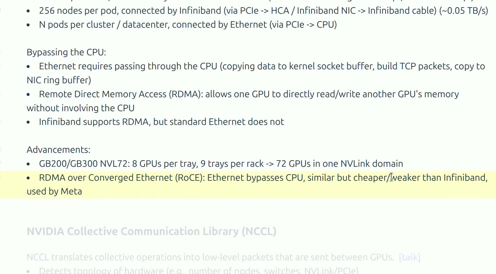

*对应视频 `00:26:23--00:29:47`。画面强调 CPU bypass，并列出扩大 NVLink 域和使用 RoCE 的方向。*

需要澄清的概念边界是：RDMA 描述的是"绕过 CPU、减少复制"的访问语义，RoCE 是在 Ethernet 上实现该语义的具体协议族，二者不是同一层级的同义词，更不是某一种线缆的名字。再进一步，GPU Direct RDMA 允许网卡直接读写 GPU 显存，使得跨节点的 GPU 到 GPU 传输也不必经过主机内存中转。

> [!NOTE]
> 课中提到的 GPU 型号、互联带宽数值和机柜规模，都是特定硬件代际的具体例子。这些数字会随产品与配置不断改变；稳定不变的是"节点内与节点间链路存在速度层级，并行策略必须服从这个层级"这一推理框架。

### NCCL 与 PyTorch 各负责什么

NCCL（NVIDIA Collective Communications Library）提供面向 GPU 的 collective 实现：它根据检测到的拓扑、消息大小和运行环境，在 ring、tree 等算法之间选择，并决定走 NVLink、PCIe 还是网络传输。PyTorch 的 `torch.distributed` 则在 NCCL 之上向用户暴露统一接口，例如 `all_reduce`、`all_gather_into_tensor` 和 `reduce_scatter_tensor`；用户写的每一行 collective 调用，最终都由 NCCL 在 GPU 上落实为具体的通信 kernel。

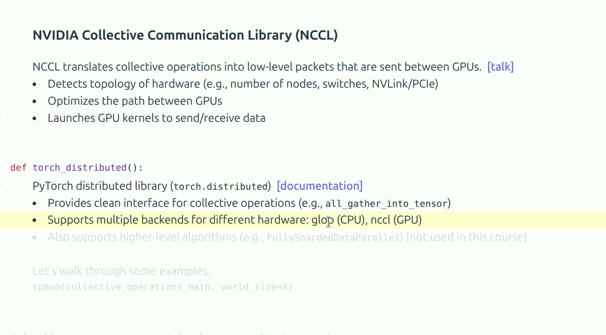

*对应视频 `00:30:03--00:37:13`。画面从 NCCL 的底层通信职责过渡到 PyTorch 的 collective 接口。*

整个分层关系可以概括为：

```text
并行算法（DDP / TP / PP）
        ↓
PyTorch distributed API
        ↓
NCCL collective 与拓扑感知实现
        ↓
NVLink / NVSwitch / InfiniBand / Ethernet
```

越靠上的层次越关心"要做什么变换"，越靠下的层次越关心"按什么价格完成"。NCCL 会启动 GPU 通信 kernel 并做拓扑感知的路径选择，但"用了 NCCL"并不自动意味着任意布局都高效：进程到设备的映射是否亲和、张量大小是否落在算法切换的甜区、通信与计算是否争用同一批 SM、网络是否有其他流量拥塞，这些因素仍然会显著影响最终性能。通信库负责把单次操作做好，把操作组织成高效训练循环仍是算法与系统设计者的工作。

### 本章小结

- 同一个 collective 的成本取决于物理拓扑；rank 之间在通信价格上并不天然等价。
- RDMA 描述减少 CPU 参与和内存复制的访问语义；RoCE 是在 Ethernet 上承载 RDMA 的具体方案；GPU Direct 进一步允许网卡直达显存。
- 软件栈分层明确：PyTorch 提供编程接口，NCCL 执行拓扑感知的 GPU collective，硬件互联决定底层价格。

---

## 用 `torch.distributed` 验证通信原语

### 最小进程组

课程代码在一台机器上启动多个进程，并用本机地址完成 rendezvous（进程间的相互发现与握手）：

```python
import os
import torch.distributed as dist

# MASTER_ADDR / MASTER_PORT：进程组的“集合点”。
# 每个进程启动后都到这个地址报到，从而发现彼此、分配 rank、建立通信域。
os.environ["MASTER_ADDR"] = "localhost"
os.environ["MASTER_PORT"] = "15623"

# backend="nccl"：collective 由 NCCL 在 GPU 上执行。
# rank 是本进程的全局编号，world_size 是进程总数。
dist.init_process_group("nccl", rank=rank, world_size=world_size)
```

一个普遍的误解是：设置了 `MASTER_ADDR`，训练数据就会流经 rank 0。事实并非如此——`MASTER_ADDR` 和 `MASTER_PORT` 只在初始化阶段帮助进程彼此发现并建立进程组，相当于一个"报到地址"；进程组建立之后，collective 通信按照 NCCL 选择的拓扑（例如 ring）直接在相关 rank 之间进行，训练张量并不经过 master 中转。多节点环境中，每个进程还必须根据 `local_rank` 调用 `torch.cuda.set_device`，把自己绑定到正确的 GPU 上，否则多个进程挤在同一块卡上，性能和显存都会出问题。

除环境变量外，`init_process_group` 还支持另外两种 rendezvous 方式，理解它们有助于阅读生产代码：

- **共享文件初始化**（`init_method="file:///path/to/shared"`）：各进程通过约定路径上的文件交换连接信息，适合共享文件系统，缺点是文件锁与清理语义较微妙；
- **TCPStore / c10d store**：由一个进程（通常是 rank 0）启动键值存储服务，其余进程连接它完成发现，生产系统与弹性训练（torchrun 默认）多走这条路，因为它天然支持进程动态加入的扩展。

三种方式的差别只在"进程如何找到彼此"；进程组建立之后的 collective 行为完全一致。课程选环境变量方式，是因为它对单机演示最直白。

### all-reduce 会原地修改张量

```python
# 每个 rank 构造一个只含自己编号的标量张量
data = torch.tensor([float(rank)], device=device)

dist.all_reduce(
    tensor=data,               # 通信发生在 data 本身上
    op=dist.ReduceOp.SUM,      # 归约算子：逐元素求和
    async_op=False,            # 同步调用：返回时结果已写入 data
)
```

若四个 rank 的输入分别为 0、1、2、3，则归约和为 $0+1+2+3=6$；调用完成后，**每个** rank 的 `data` 都变成 6。这段代码最容易漏掉的细节是 **in-place（原地）语义**：`all_reduce` 的返回值不是一个新的归约张量，输入缓冲区本身被覆盖。这一语义是刻意的——梯度同步场景下，原地写回可以避免额外的显存分配与拷贝；但它也意味着，如果调用前没有备份，原始本地数据将不可恢复。

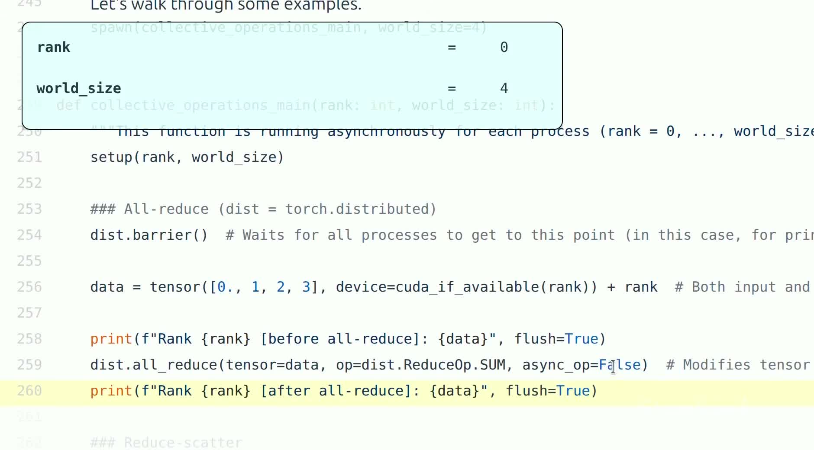

*对应视频 `00:40:11--00:41:34`。画面展示 `get_rank`、`get_world_size` 以及 `dist.all_reduce`。*

### reduce-scatter 与 all-gather 的形状契约

假设 world size 为 $P$，每个输出分片有 $N$ 个元素，则两个原语的输入输出形状恰好互为对偶：

- reduce-scatter 的输入总大小是 $P \times N$，输出大小是 $N$；
- all-gather 的本地输入大小是 $N$，完整输出大小是 $P \times N$。

课程正是利用这对对偶关系，先执行 reduce-scatter、再执行 all-gather，用代码实证"all-reduce = reduce-scatter + all-gather"这一分解：两段调用首尾相接后，每个 rank 拿到的结果应与直接调用一次 `all_reduce` 逐元素相同。

```python
# 每个 rank: input 有 P * N 个元素，output 有 N 个元素
# 语义：对 P 个 rank 的 input 逐元素求和，rank r 拿走结果的第 r 片
dist.reduce_scatter_tensor(output, input, op=dist.ReduceOp.SUM)

# 每个 rank: input 有 N 个元素，output 有 P * N 个元素
# 语义：把各 rank 的 input 按 rank 顺序拼接，所有人拿到完整副本
dist.all_gather_into_tensor(output, input)
```

这里使用 `reduce_scatter_tensor` / `all_gather_into_tensor` 这两个"单一大张量"接口，而不是旧的列表式接口，是因为它们允许 NCCL 把输入输出当作连续缓冲区整体处理，避免逐片调度，通常性能更好。

### `async_op=True` 不是“自动变快”

异步 collective 返回一个 work handle；调用返回只表示通信已被排入执行队列，并不保证数据已经可用：

```python
work = dist.all_reduce(data, async_op=True)  # 只负责“发起”，立即返回 handle

# 这里执行与 data 的归约结果无关的计算。
# 只有存在这样的独立工作，异步才有意义。
independent_work()

work.wait()   # 第一次真正使用归约结果之前必须等待
consume(data)
```

若发起后立刻 `wait()`，通信与计算之间就没有任何可重叠的窗口，异步调用退化为同步调用，只多付了调度开销；反之，若在 `wait()` 之前就读取 `data`，读到的可能是归约中途的部分结果，这是正确性错误而非性能问题。**异步的价值完全来自依赖关系的正确安排，而不是布尔参数本身。** 生产 DDP 正是系统化地利用这一点：它按层组织梯度 bucket，某 bucket 就绪即发起异步 all-reduce，同时继续计算更早层的梯度。

### barrier 与 CUDA synchronize 是两层等待

分布式计时时有两类容易混淆的"等待"，它们作用在不同层面：

- `torch.cuda.synchronize()` 等待*当前进程*此前提交到 GPU 的所有 CUDA 工作完成——这是设备队列层面的等待，对其他进程毫不知情；
- `dist.barrier()` 等待进程组中的*所有 rank* 都到达同一逻辑点——这是进程间的同步，对 GPU 上尚未完成的工作毫不知情。

测量通信性能时常常两者都需要：先 `synchronize` 确保本地 GPU 工作真正结束，再 `barrier` 确保各 rank 从一致的起点同时出发。反之，`barrier()` 不能替代本地设备同步（barrier 返回时本机 GPU 队列里可能还压着未完成的 kernel），设备同步也不能保证其他 rank 已经到达（其他机器可能还在慢吞吞地做计算）。

### 点对点通信与死锁风险

除了 collective，`torch.distributed` 还提供点对点的 `dist.send` / `dist.recv`，流水线并行的 stage 边界就靠它们实现。与 collective 不同，点对点原语要求程序员自己保证配对正确——这引入了一类 collective 不会有的 bug：**死锁**。

经典的翻车写法是两个 rank 都先执行阻塞式 `send`：

```python
# 危险：两个 rank 都在等对方先 recv，互相挂起
if rank == 0:
    dist.send(tensor, dst=1)   # 阻塞，直到 rank 1 开始接收
    dist.recv(tensor, src=1)
elif rank == 1:
    dist.send(tensor, dst=0)   # 阻塞，直到 rank 0 开始接收
    dist.recv(tensor, src=0)
```

`dist.send` 在底层缓冲区耗尽或实现对语义严格时会一直阻塞到对端发起匹配的 `recv`，于是 0 等 1 收、1 等 0 收，双方永久挂起。规避方法有三种：调整顺序使一端先发、另一端先收（奇偶 rank 错开）；使用非阻塞的 `dist.isend` / `dist.irecv` 先挂出所有请求再统一 `wait`；或直接使用 `dist.batch_isend_irecv` 让通信库代为排序。生产流水线框架（如 Megatron-LM 的 p2p communication 模块）正是把这套排序逻辑封装起来，同时处理前向激活与反向梯度两组方向相反的消息，才避免了手工配对的心智负担。

### 教学代码与生产代码的边界

课程代码刻意保持小而透明，每个例子只演示一个语义点，但不应直接视作生产模板：

- 使用 `localhost` 作为集合点，只演示单节点 rendezvous，多节点需要真实的主机名或初始化文件/存储；
- rank 与本地 GPU 的映射被简化，省略了 `set_device` 与拓扑亲和的考虑；
- 例子没有容错、超时、弹性伸缩与多进程日志治理，而任何一项在生产集群上都会真实发生；
- 同步写法有助于理解语义，生产训练会更多地使用异步 bucket、通信调度与计算通信重叠。

这些简化是教学上的刻意选择：先把每个原语的语义孤立出来看清楚，再谈系统工程。但读者必须清楚二者之间的距离，不要把课件脚本直接拷进训练流水线。

### 本章小结

- 进程组初始化负责进程发现和建组，集合点不承担训练数据的中转。
- collective 具有严格的原地语义和形状契约；理解输入输出形状比背诵 API 名字更重要。
- 异步通信只有在等待之前存在独立计算时才带来重叠，否则反而增加复杂度与风险。
- CUDA synchronize 与 distributed barrier 分别解决"设备队列清空"和"进程到达点对齐"两个不同层面的问题。

---

## 通信性能如何测量

### 先把 GPU 的异步执行纳入计时

在 GPU 上做性能测量，第一个陷阱是执行的异步性：Python 调用一个 CUDA 算子，通常只是把 kernel 提交到设备队列就立即返回，真正的计算在后台进行。若直接在调用前后读取 CPU 时钟，测到的可能只是*提交延迟*而非*执行耗时*——几个微秒的 API 开销，与毫秒的通信毫无关系。一个最小但正确的 collective benchmark 通常需要以下结构：

```python
# 1. warmup：先跑若干次，排除 NCCL 初始化、显存分配器预热、
#    GPU 时钟爬升等一次性开销
for _ in range(num_warmup):
    dist.all_reduce(data)

# 2. 对齐：先清空本机 CUDA 队列，再让所有 rank 到达同一起点
torch.cuda.synchronize()
dist.barrier()

# 3. 计时：发起操作后，必须等本地设备工作真正结束才停表
start = time.perf_counter()
dist.all_reduce(data)
torch.cuda.synchronize()
duration = time.perf_counter() - start
```

逐行看这段骨架的设计意图：warmup 循环把"第一次调用"的所有非常态开销排除在测量之外；`synchronize` 与 `barrier` 的组合保证所有 rank 在几乎相同的时刻、以空的设备队列开始计时；计时区间末尾的 `synchronize` 把异步执行的等待包含进 `duration`，否则停表时通信 kernel 可能才刚开始跑。更严谨的测试还应使用 CUDA event（`torch.cuda.Event`）在设备时间轴上打点、重复数十次并报告中位数与分位数，而不是只报一次最好成绩；同时必须注明 dtype、消息大小、rank 数、节点数、拓扑、NCCL 版本、算法选择以及测量期间是否存在其他流量——缺少这些上下文的时间数字几乎没有可比性。

### 用 CUDA event 在设备时间轴上打点

`time.perf_counter()` 加 `synchronize` 的写法有一个残余误差：停表前的同步本身包含 CPU 调度抖动。更精确的做法是把计时点直接钉在 CUDA stream 上：

```python
start_event = torch.cuda.Event(enable_timing=True)
end_event = torch.cuda.Event(enable_timing=True)

torch.cuda.synchronize()
dist.barrier()

start_event.record()          # 在 stream 上插入时间戳，立即返回
for _ in range(num_iters):
    dist.all_reduce(data)     # 连续提交多次，摊薄启动开销
end_event.record()
torch.cuda.synchronize()      # 只需在读取前同步一次

ms = start_event.elapsed_time(end_event) / num_iters
```

event 记录的是 GPU 时间轴上两个标记点之间的真实流逝时间，不包含 CPU 端的提交与同步开销；循环 $N$ 次再取平均，还能把单次 launch 的抖动摊平。配合前面"扫消息大小拟合 $\alpha$–$\beta$"的方法，这就是搭建一份可信 collective 基准报告的标准骨架。

### “耗时”与“带宽”回答不同问题

一次 collective 花费 1.6 ms，这个数字本身并不能独立说明快慢，因为消息大小可能完全不同——1.6 ms 传 1 MB 是灾难，传 400 MB 则可能相当优秀。要把耗时变成可比较的量，需要归一化为带宽。利用 ring all-reduce 的通信量模型，可定义一个算法口径的有效带宽：

$$
\text{effective bandwidth}
=\frac{2(P-1)S/P}{t}.
$$

- $S$：单个 rank 参与通信的张量字节数；
- $P$：world size；
- $t$：实测的一次 all-reduce 墙钟耗时；
- 分子 $2(P-1)S/P$：ring 模型下单个 rank 在一次 all-reduce 中的总发送字节量。

课件代码先计算所有 rank 合计的发送量，再除以 $P$ 和持续时间，代数上与上式完全一致：

```python
size_bytes = data.numel() * data.element_size()   # 单 rank 张量字节数 S
sent_bytes = size_bytes * 2 * (world_size - 1)     # 全体 rank 合计发送 2(P-1)S
total_duration = world_size * duration             # 按 P 个 rank 平摊时长
bandwidth = sent_bytes / total_duration            # = 2(P-1)S/(P·t)
```

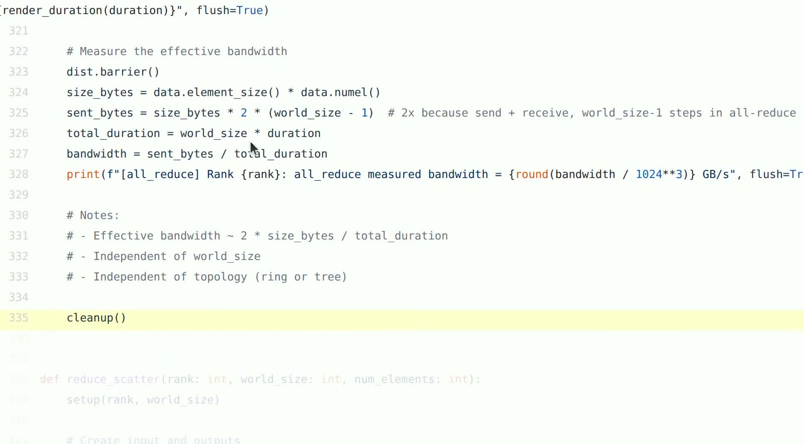

*对应视频 `00:48:30--00:51:28`。画面展示发送字节数、总时长和带宽计算。*

这里必须明确口径，否则跨场合比较数字会得出荒谬结论：课件代码用 $1024^3$ 做单位换算却打印 `GB/s`，严格说得到的更接近 `GiB/s`；而硬件厂商的标称带宽通常使用十进制 GB/s。两者相差约 $1.074^3 \approx 7.4\%$——在比较"实测是否接近理论峰值"时，这个误差足以改变结论。此外还要区分"算法有效带宽"（按算法实际搬运的字节计算）与"总线带宽"（busbw，按逻辑数据量 $S/t$ 再乘以拓扑修正系数）等不同口径，比较前必须先统一。

### 如何读课程中的实测输出

课程在四张 GPU 上的实测结果是：all-reduce 耗时大约落在 1.38–1.60 ms，对应上述代码口径约 366–426 GB/s；reduce-scatter 耗时大约 2.39–2.61 ms，对应约 450–490 GB/s。

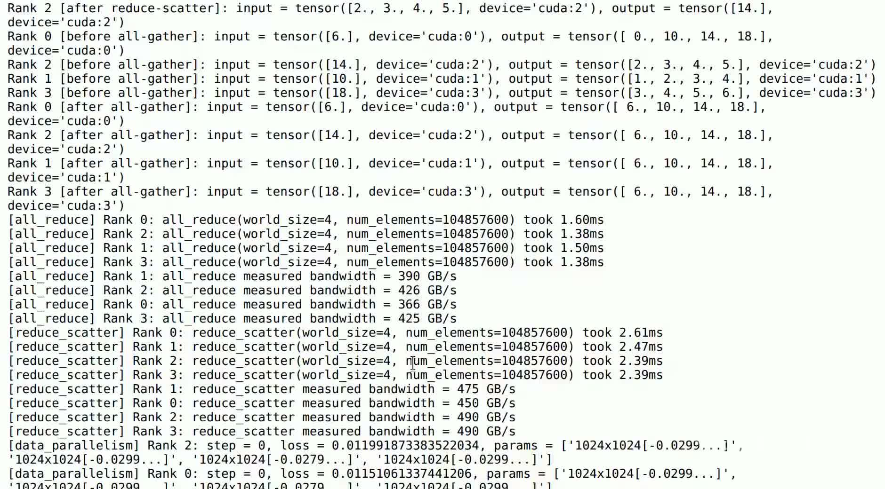

*对应视频 `00:45:03--00:53:20`。画面包含 all-gather 的输出检查，以及 all-reduce、reduce-scatter 的计时结果。*

我们可以亲手验算第一组数字。all-reduce 的本地张量约 400 MiB，即 $S = 400 \times 2^{20} \approx 4.194 \times 10^{8}$ 字节，$P = 4$。代入有效带宽公式：

$$
\frac{2(P-1)S/P}{t}
= \frac{2 \times 3 \times 4.194 \times 10^{8} / 4}{t}
= \frac{6.29 \times 10^{8}}{t}\ \text{字节/秒}.
$$

- 取 $t = 1.60\ \text{ms}$：$6.29 \times 10^{8} / 1.60 \times 10^{-3} \approx 3.93 \times 10^{11}$ 字节/秒，除以 $1024^3$ 得约 **366 GiB/s**；
- 取 $t = 1.38\ \text{ms}$：约 $4.56 \times 10^{11}$ 字节/秒，即约 **424 GiB/s**。

与课程输出的 366–426 完全吻合，说明我们理解了代码的口径。

> [!WARNING]
> 不能据此断言"reduce-scatter 比 all-reduce 更慢"。两段 benchmark 的输入总大小不同：all-reduce 的本地张量约 400 MiB，而 reduce-scatter 的输入约为其 world-size 倍、输出才约 400 MiB——前者的有效 payload 是后者的好几倍，耗时更长是形状契约的必然结果，而非原语本身的快慢。比较任何两个 collective 的性能，都应在相同有效 payload、相同拓扑和相同计时口径下进行。

### NCCL 的算法选择与拓扑检测

前面的讨论多次提到"NCCL 会根据拓扑和消息大小选择算法"，这里把这个黑盒再打开一层。NCCL 启动时会探测进程组的物理拓扑：哪些 GPU 之间有 NVLink 直连、是否经过 NVSwitch、各自挂在哪条 PCIe 树下、网卡与 GPU 的亲和关系如何。基于探测结果，它构造内部的通信图（ring 序列或 tree 结构），并按消息大小区间选择协议：

- **小消息**走低延迟协议（如 LL/LL128，用细粒度标志位做同步，牺牲带宽换启动速度），算法上偏向 tree——$O(\log P)$ 的延迟优势在小消息时压倒一切；
- **大消息**走 Simple 协议（整块拷贝、追求满带宽），算法上偏向 ring——带宽最优性在大消息时才是决定项。

这意味着两件事：其一，同一次训练里不同大小的 collective 可能走着完全不同的路径，用单一 $\alpha$–$\beta$ 参数拟合全部消息大小区间注定失败，分段拟合才有意义；其二，NCCL 的自动选择基于它探测到的拓扑，而探测可能出错——容器、虚拟化或非标准布线都可能让 NCCL 看错拓扑，此时需要用环境变量（如 `NCCL_TOPO_FILE`）手工纠正。当实测带宽远低于理论值且已排除拥塞时，"NCCL 是否看对了拓扑"应排在排查清单的前列。

### 延迟模型的使用边界

$\alpha$–$\beta$ 模型不只是定性直觉，还可以被实测数据*拟合*出来。方法是固定拓扑与算法，扫描消息大小 $S$，对每种大小重复测量耗时 $T(S)$，然后对线性关系

$$
T(S) \approx n_{\text{step}}\,\alpha + \frac{c \cdot S}{\beta}
$$

做线性回归：横轴取消息大小（或等价的传输字节量），斜率的倒数给出有效带宽 $\beta$ 的估计，截距给出延迟项 $n_{\text{step}}\alpha$ 的估计。拟合结果通常呈现两个区域：小消息区段曲线平缓、耗时几乎不随 $S$ 增长（延迟主导）；大消息区段曲线陡峭线性（带宽主导）。两区的交界处 $S^{*} \approx \alpha\beta$ 给出这台机器的"消息大小分水岭"，是选择梯度 bucket 大小、决定通信合并策略的重要依据。

但必须清楚模型的边界：真实 NCCL 会根据消息大小和拓扑在 ring、tree 等协议之间切换，切换点附近拟合曲线会出现折点；拥塞、PCIe 亲和性、NUMA 布局、GPU Direct 是否启用、网络分层以及通信与计算对 SM 的争用，都会让实测偏离简单公式。公式的职责是建立数量级直觉、定位"这台机器的通信贵不贵、贵在哪一项"，而不是代替 profiler 做精细诊断。

### 本章小结

- CUDA 异步执行意味着 benchmark 必须包含 warmup、设备同步与 rank 对齐，否则测到的只是提交开销；CUDA event 把计时点钉在设备时间轴上，可进一步排除 CPU 调度抖动。
- 毫秒数必须与消息大小、rank 数、算法及拓扑一起解释；归一化为带宽时还要统一二进制/十进制单位与口径定义。
- 课程实测的 366–426 GB/s 可以用 ring 通信量模型手工复算，这是检验自己是否真正理解口径的好方法。
- NCCL 按消息大小在低延迟协议（偏 tree）与满带宽协议（偏 ring）之间切换，拟合 $\alpha$–$\beta$ 必须分段进行；实测异常时先排查拓扑探测是否正确。
- 不同输入形状的 benchmark 不能只比较原始耗时；$\alpha$–$\beta$ 拟合给出延迟与带宽的数量级，精细诊断仍需 profiler。

---

## 数据并行：切 batch，同步 gradient

### 每张卡保存完整模型

数据并行（Data Parallelism）沿 batch 维切分数据：每个 rank 拥有完整的模型参数和优化器状态，各自只处理自己的 local batch，然后把梯度同步成全局梯度，再各自执行完全相同的参数更新。


*对应视频 `00:55:44--00:56:24`。橙色横线表示数据切分轴，不是前向的数据流方向。*

设 global batch 大小为 $B$，world size 为 $P$，且样本均匀切分，则每个 rank 处理 $B/P$ 个样本。令第 $r$ 个 rank 在其 local batch 上的损失为 $L_r$，则 global batch 的损失与梯度为

$$
L=\frac{1}{P}\sum_{r=0}^{P-1}L_r,
\qquad
\nabla_\theta L=\frac{1}{P}\sum_{r=0}^{P-1}\nabla_\theta L_r.
$$

- $B$：一个训练步的 global batch 样本数；
- $P$：world size；
- $L_r$：rank $r$ 在其 $B/P$ 个样本上的平均损失；
- $\theta$：模型全部参数；
- $\nabla_\theta L_r$：rank $r$ 用本地数据独立反向传播得到的梯度。

第二个等号成立是因为损失对参数求导是线性算子，平均与求导可以交换次序。于是各 rank 先完全独立地完成前向和反向，再对参数梯度做一次求平均的 all-reduce，就精确得到 global batch 的平均梯度——数据并行在数学上与单卡大 batch 训练严格等价（不计浮点求和顺序的微小差异）。

这里有一个必须建立的正确观念：跨 rank 同步的对象是 **gradient，不是 parameter**。各副本参数之所以始终保持一致，是一个*归纳不变量*：大家从相同的初始化出发，每一步使用相同的聚合梯度和相同的确定性更新规则，于是下一步的参数自然相同。同步参数不仅多余，还会掩盖"梯度不同步"这类真正的 bug。

### 最小 DDP 训练循环

```python
for x, y in local_batches:          # 本 rank 的数据分片
    optimizer.zero_grad()           # 清空上一步的梯度
    pred = model(x)                 # 前向：只在本地数据上进行
    loss = loss_fn(pred, y)         # 本地损失
    loss.backward()                 # 反向：得到本地梯度 ∇L_r

    for param in model.parameters():
        # 把 P 份本地梯度平均后写回每个 rank 的 param.grad
        dist.all_reduce(param.grad, op=dist.ReduceOp.AVG)

    optimizer.step()                # 各 rank 用同一份全局梯度独立更新
```

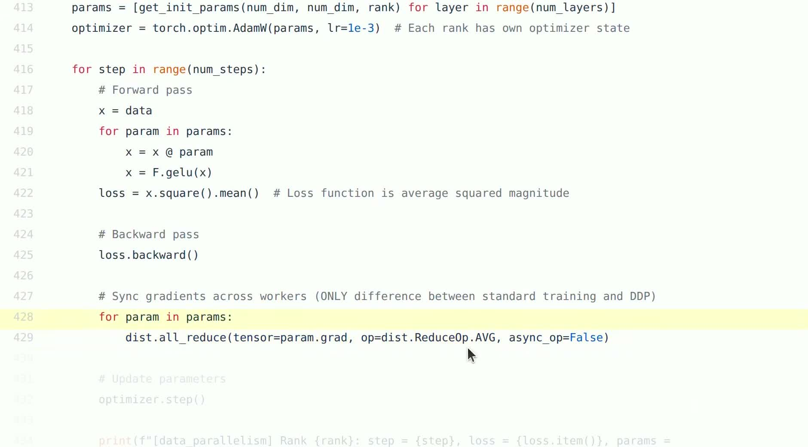

*对应视频 `00:58:39--01:00:22`。画面强调普通训练与教学版 DDP 的唯一核心差异是梯度同步。*

> [!QUOTE]
> “唯一的差别是在 worker 之间同步梯度。”——讲者在 `00:59:19--00:59:27` 对教学实现的概括（意译）。

这段教学循环与单卡训练的唯一差异确实只有 `all_reduce` 那两行，但它在性能上有一个明显缺陷：所有反向计算结束后才开始逐参数串行 all-reduce，通信完全裸露在计算之外。真实的 `DistributedDataParallel` 不会这样做：它把梯度按层装入固定大小的 bucket（约 25 MB），一旦某个 bucket 内所有梯度就绪便立即发起异步 all-reduce。由于反向传播自输出层向输入层推进，靠后（靠近输出）的层先就绪，它们的梯度通信可以与靠前层的反向计算同时进行——通信就这样被藏进了计算里。

### 通信量和显存代价

现在给数据并行算两笔账。若参数梯度总大小为 $|\theta|$ 字节，由 ring all-reduce 的结论，每个 rank 每步的通信量近似为

$$
V_{\text{DDP}}\approx 2\frac{P-1}{P}|\theta|\approx 2|\theta|.
$$

- $V_{\text{DDP}}$：单个 rank 每个训练步发送的梯度字节量；
- $|\theta|$：模型梯度张量的总字节数，等于参数量 $N$ 乘以梯度的单元素字节数；
- $P$：world size。

注意两个要点：其一，通信量与 $P$ 几乎无关，增加副本数不会加剧单卡负担，这是 DDP 可扩展性的根基；其二，通信量与 batch 大小无关——无论 local batch 是 4 还是 64，每步都要同步全部梯度。增大 local batch 的真正作用是摊薄：每步的计算量随 batch 线性增长，而通信量不变，计算/通信比因此提高，通信更容易被完全重叠。

显存方面，以当前主流的混合精度 Adam 训练为例，每个副本需要同时保存：

| 状态 | 精度 | 字节数（$N$ 为参数量） |
|---|---|---|
| 模型参数（计算用） | fp16/bf16 | $2N$ |
| 梯度 | fp16/bf16 | $2N$ |
| 参数主副本（更新用） | fp32 | $4N$ |
| Adam 一阶动量 $m$ | fp32 | $4N$ |
| Adam 二阶动量 $v$ | fp32 | $4N$ |

合计每参数 $16$ 字节，即每卡 $16N$ 字节。代入一个具体数字：$N = 7 \times 10^{9}$（7B 模型）时，每份副本的模型状态为 $7 \times 10^{9} \times 16 = 112$ GB——这还没算激活值，已经超出单张主流 GPU 的显存。再算通信账：fp16 梯度 $|\theta| = 14$ GB，$P = 8$ 时每步每卡发送 $2 \times \frac{7}{8} \times 14 = 24.5$ GB；若有效带宽为 400 GB/s，裸通信时间约 $61$ ms，必须靠 bucket 重叠把它藏进反向计算，否则每步直接多花 61 ms。

这组数字给出了数据并行的能力边界：增加 local batch 可以提高计算/通信比，但无论怎么调，每卡都必须完整复制模型、梯度和优化器状态。**DDP 能漂亮地扩展吞吐，却不能解决"完整模型状态单卡放不下"的容量问题。** 这正是 ZeRO/FSDP 与模型并行的动机，我们将在最后一节定量展开。

### 通信计算重叠的定量分析

DDP 的 bucket 重叠为什么有效？做一个简单估算。设模型共 $L$ 层、梯度总量 $|\theta|$ 均匀分布，反向计算总耗时 $T_{\text{bwd}}$，通信有效带宽为 $\beta$。裸露通信（教学版写法）每步耗时

$$
T_{\text{naive}} = T_{\text{bwd}} + \frac{2|\theta|}{\beta}.
$$

bucket 化之后，除第一个 bucket 的等待外，其余通信都能与尚未完成的反向计算并行，理想情况下

$$
T_{\text{bucket}} \approx T_{\text{bwd}} + \frac{2|\theta|/K}{\beta},
\qquad
\text{其中 } K = \frac{|\theta|}{B_{\text{bucket}}}
$$

- $B_{\text{bucket}}$：单个 bucket 的字节数（PyTorch 默认约 25 MB）；
- $K$：bucket 数量；第二项是第一个 bucket 就绪后无法被遮盖的裸露通信。

代入数字：$|\theta| = 14$ GB（7B 模型 fp16 梯度）、$\beta = 400$ GB/s、$B_{\text{bucket}} = 25$ MB，则 $K \approx 560$，裸露部分仅约 $2 \times 25\ \text{MB} / 400\ \text{GB/s} \approx 0.12$ ms——与全量裸露的约 $70$ ms 相比几乎可以忽略。这就是"通信消失在计算背后"的定量含义：前提只有一个，即 $2|\theta|/\beta \lesssim T_{\text{bwd}}$，通信总时长不超过反向计算总时长。当模型很小、卡数很多、网络很慢时，这个前提会被打破，此时通信重新裸露，scaling 曲线出现拐点。

### 梯度累积：用通信频率换 batch 大小

当单卡显存装不下目标 local batch 时，还有一条不增加通信总量的路径：梯度累积（gradient accumulation）。把 local batch 再切成 $K$ 份，连续做 $K$ 次"前向—反向"并累加梯度，只在第 $K$ 次之后才做一次 all-reduce 和 optimizer step：

```python
for step, (x, y) in enumerate(local_batches):
    pred = model(x)
    loss = loss_fn(pred, y) / accum_steps   # 先除以 K，使累加结果等于平均
    loss.backward()                          # 梯度累加进 param.grad

    if (step + 1) % accum_steps == 0:
        for param in model.parameters():
            dist.all_reduce(param.grad, op=dist.ReduceOp.AVG)
        optimizer.step()
        optimizer.zero_grad()
```

两个细节决定语义正确性：其一，`loss / accum_steps` 必不可少——梯度逐次累加，不先缩放的话累加结果是总和而非平均；其二，all-reduce 的频率从"每步一次"降为"每 $K$ 步一次"，通信总量不变但次数减少为 $1/K$，在延迟主导的场景（小模型、慢网络）收益明显。等效地，梯度累积把全局有效 batch 扩大了 $K$ 倍，因此它与 critical batch size 直接相关：累积步数并非越大越好，越过统计效率拐点后只是在浪费摊薄通信换来的时间。PyTorch 的 `DistributedDataParallel` 还提供 `no_sync()` 上下文管理器，在累积的中间步里关闭自动梯度同步，避免每个 micro-batch 都发起 bucket all-reduce。

### batch 切分的边界条件

把 global batch 均匀切成 $P$ 份听起来平凡，工程上却有几处真实的坑：

- local batch 必须有明确的采样策略。生产代码通常使用 distributed sampler（每个 epoch 先对样本做确定性洗牌，再按 rank 取互不相交的切片），而不是让每个进程先读完整 batch 再手工切片——后者既浪费 IO，又容易在多卡之间读到重叠数据；
- 若样本数不能整除 world size，必须处理不等长的 local batch：直接对各 rank 的平均梯度再做等权平均，会让样本少的数据分片获得偏大的权重，梯度估计产生系统偏差；正确做法是按样本数加权，或补齐/丢弃使各片等长；
- global batch 增大到超过 critical batch size 之后，继续并行可能不再带来同等的统计效率（最后一节展开）；
- 课程代码只有一个训练 step，因此没有暴露遗漏 `zero_grad()` 时梯度跨步累积的问题；通用循环中必须显式清零或将梯度设为 `None`，否则第二步的梯度会叠加在第一步之上。

### 本章小结

- DDP 切分 batch、复制模型，通过梯度 all-reduce 保持各副本一致；它在数学上与单卡大 batch 训练等价。
- 同步的是梯度而不是参数；参数一致性是由相同初始化加相同更新推出的归纳不变量。
- 每步通信量约 $2|\theta|$，与 $P$ 和 batch 大小无关；增大 local batch 的作用是摊薄通信而非减少通信。
- DDP 提升吞吐，却不降低每卡完整模型状态的显存占用（混合精度 Adam 下每参数约 16 字节）。
- 生产 DDP 还需要 distributed sampler、梯度 bucket、通信计算重叠与不等长分片的正确处理。

---

## 张量并行：切 width，重组 activation

### 沿层宽切参数

张量并行（Tensor Parallelism）深入到每一层的内部，把权重矩阵沿某个维度切分到多张 GPU 上。与数据并行"每张卡做同样的计算、只是数据不同"不同，张量并行中每张卡只拥有层的一部分，必须协作才能完成一次完整的前向。课程用**列切分**（column-parallel）线性层建立直觉。


*对应视频 `01:03:04--01:03:37`。橙色竖线表示权重沿宽度切分，不是新的网络层。*

设某线性层的输入与权重形状为

$$
X\in\mathbb{R}^{B\times D},
\qquad
W\in\mathbb{R}^{D\times D}.
$$

- $X$：输入激活，$B$ 为 batch 大小，$D$ 为特征维；
- $W$：该层权重，输出维与输入维均为 $D$。

把 $W$ 沿输出列均切成 $P$ 片：

$$
W=[W_0\;W_1\;\cdots\;W_{P-1}],
\qquad
W_r\in\mathbb{R}^{D\times D/P}.
$$

- $W_r$：分配给 rank $r$ 的列块，包含 $W$ 的第 $rD/P$ 至第 $(r+1)D/P - 1$ 列。

每个 rank 用本地列块计算局部输出：

$$
Y_r=XW_r\in\mathbb{R}^{B\times D/P},
$$

- $Y_r$：rank $r$ 的局部输出，只覆盖完整输出的 $D/P$ 个特征列。

由于矩阵乘法 $Y = XW$ 的第 $j$ 列只依赖 $W$ 的第 $j$ 列，把各局部输出沿特征维拼接即还原完整结果：

$$
Y=[Y_0\;Y_1\;\cdots\;Y_{P-1}]=XW.
$$

于是每卡只保存约 $1/P$ 的该层权重、执行约 $1/P$ 的矩阵乘 FLOPs；但代价随之出现——若后续计算需要完整的 $Y$，就必须通过 all-gather 把分散在各 rank 的局部激活拼起来。存储和计算的削减，正是用这次通信换来的。

### 前向中的 all-gather

```python
# local_weight: [D, D / P]   —— 本 rank 持有的权重列块 W_r
# x:            [B, D]       —— 完整输入（本例中各 rank 都有副本）
local_activation = x @ local_weight       # [B, D / P]，局部输出 Y_r

# all-gather：收集全部 P 个局部输出
parts = [torch.empty_like(local_activation) for _ in range(P)]
dist.all_gather(parts, local_activation)

# 沿最后一维（特征维）拼接，还原完整输出 Y = XW
x = torch.cat(parts, dim=-1)              # [B, D]
```

逐行看这段代码：`x @ local_weight` 是一次完全本地的矩阵乘，形状自 $[B, D] \times [D, D/P]$ 得 $[B, D/P]$；`all_gather` 把 $P$ 个 $[B, D/P]$ 张量收集为列表，每个 rank 都拿到全部 $P$ 份；`torch.cat(..., dim=-1)` 沿特征维拼回 $[B, D]$，与单卡计算的 $XW$ 逐元素相同。教学代码用列表式 `all_gather` 是为了让"收集分片"的语义显式可见，生产实现会用 `all_gather_into_tensor` 直接写入连续缓冲区。

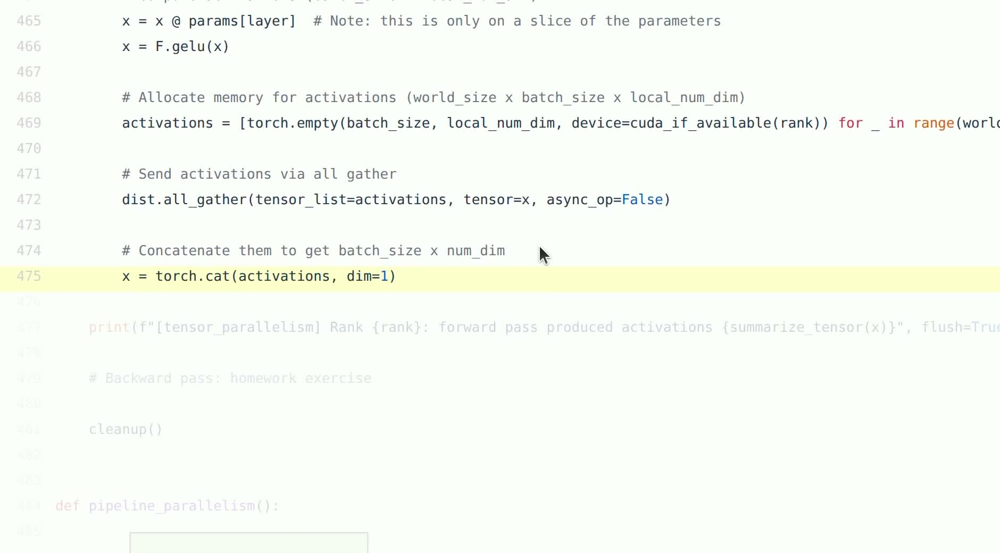

*对应视频 `01:05:27--01:07:03`。画面展示局部激活形状和前向重组边界。*

通信量方面：若完整激活有 $BD$ 个元素、每个元素 $s$ 字节，则在 ring all-gather 模型中，每个 rank 的发送量约为

$$
V_{\text{TP,fwd}}\approx \frac{P-1}{P}BDs.
$$

- $V_{\text{TP,fwd}}$：单个 rank 在一次前向 all-gather 中的发送字节量；
- $B$：batch 大小；$D$：特征维；$s$：激活单元素字节数；$P$：张量并行度。

代入具体数字感受量级：$B \times D = 4096 \times 4096$、bf16（$s=2$）、$P=8$，则单卡发送约 $\frac{7}{8} \times 4096 \times 4096 \times 2 \approx 29.4$ MB。看起来不大，但关键在于**这类通信可能每层发生**——一个数十层的网络，每步前向仅 all-gather 就要进行几十次，且它卡在前向的关键路径上无法与其他层的计算重叠。这就是为什么张量并行对链路的低延迟和高带宽都极度敏感，工程上几乎总是把 TP group 限制在节点内 NVLink 域中。

把账算得更完整些：一次训练步中，列并行层的前向有一次 all-gather（$\frac{P-1}{P}BDs$），反向有伴随的 reduce-scatter（同量级）；若采用后文介绍的列/行串联布局，中间通信被消除，每个"列→行"子层对只剩行并行末尾的一次 all-reduce（前向求和部分和）加反向对输入梯度的一次 all-reduce。以 60 层、每层两次 all-reduce、每次 $2\frac{P-1}{P}A$ 字节（$A$ 为单层激活字节数）估算，单卡单步 TP 通信总量约 $240\,\frac{P-1}{P}A$。评估某拓扑能否承载 TP，应从这类总量估算出发，而不是只看单次操作的字节数。

### 行并行：另一种切法

列切分沿*输出*维切权重，还有一种对偶的切法——**行并行**（row-parallel）：沿*输入*维切权重。把 $W$ 沿行切成 $P$ 片，同时要求输入 $X$ 沿特征列做对应的切分：

$$
W=\begin{bmatrix} W^{(0)} \\ W^{(1)} \\ \vdots \\ W^{(P-1)} \end{bmatrix},
\quad
W^{(r)}\in\mathbb{R}^{D/P\times D};
\qquad
X=[X_0\;X_1\;\cdots\;X_{P-1}],
\quad
X_r\in\mathbb{R}^{B\times D/P}.
$$

- $W^{(r)}$：rank $r$ 持有的行块，覆盖 $W$ 的第 $rD/P$ 至 $(r+1)D/P-1$ 行；
- $X_r$：输入的第 $r$ 个列块，与 $W^{(r)}$ 的行下标对应。

由分块矩阵乘法，完整输出等于各局部乘积之和：

$$
Y = XW = \sum_{r=0}^{P-1} X_r\,W^{(r)}.
$$

- $X_r W^{(r)} \in \mathbb{R}^{B \times D}$：rank $r$ 的局部乘积，形状已是完整输出，但只是部分和。

这正是 all-reduce 的语义：每个 rank 持有一份 $[B, D]$ 的部分结果，逐元素求和后所有人拿到完整的 $Y$。行并行与列并行构成一对完美的对偶：

| | 列并行 | 行并行 |
|---|---|---|
| 切 $W$ 的方向 | 沿输出列 | 沿输入行 |
| 对输入的要求 | 完整 $X$ | $X$ 已按列切分 |
| 局部输出形状 | $[B, D/P]$ | $[B, D]$（部分和） |
| 汇合方式 | all-gather（拼接） | all-reduce（求和） |

优秀的张量并行实现会把两者**交替串联**：列并行层输出的 $[B, D/P]$ 分片恰好就是行并行层所需的列切分输入，于是列→行这一对层之间完全不需要通信，通信被推迟到行并行层末尾的一次 all-reduce。Transformer 的 MLP（先升维再降维）与 attention（多头投影后接输出投影）天然具有这种"先扩后收"的结构，是这套搭配如此有效的原因。

### 反向为什么对应 reduce-scatter

前向用了 all-gather，反向会发生什么？我们从链式法则严格推导。列并行层中，已知上游传来对完整输出的梯度 $\partial L/\partial Y$。由于 $Y_r$ 就是 $Y$ 的第 $r$ 个列块，其梯度不需要任何通信——直接对 $\partial L/\partial Y$ 切片即可：

$$
\frac{\partial L}{\partial Y_r}
=\left(\frac{\partial L}{\partial Y}\right)_{[:,\ rD/P:(r+1)D/P]}.
$$

权重梯度同样是纯本地的：$\partial L/\partial W_r = X^\top \,\partial L/\partial Y_r$。问题出在输入梯度上。$X$ 同时参与了全部 $P$ 个局部矩阵乘，链式法则要求把每条路径的贡献*相加*：

$$
\frac{\partial L}{\partial X}
=\sum_{r=0}^{P-1}
\frac{\partial L}{\partial Y_r}W_r^\top.
$$

- $\partial L/\partial Y_r$：上游梯度中属于 rank $r$ 输出块的切片，$[B, D/P]$；
- $W_r^\top$：本地权重列块的转置，$[D/P, D]$；
- 求和号：$X$ 的每个元素通过所有 $P$ 条分支影响损失，各分支贡献必须相加。

rank $r$ 只能本地算出第 $r$ 项 $\frac{\partial L}{\partial Y_r}W_r^\top \in \mathbb{R}^{B\times D}$，完整梯度需要跨 rank 求和。若下一层（更靠近输入的层）继续使用完整 $X$，这次求和就是一次 all-reduce；若前一层保持输入按列分片（例如它本身是一个行并行层的输出），则每个 rank 求和后只需保留自己负责的那个列块——先归约、再留片，这正是 reduce-scatter 的语义。

更一般地，这对关系可以从 all-gather 的伴随（adjoint）直接看出：all-gather 在前向把各 rank 的分片复制给所有人，其反向必须把"所有人对同一分片的梯度贡献"收拢回该分片的属主——收拢是求和（reduce），留在属主处是切片（scatter）。因此**前向 all-gather 的反向必然是 reduce-scatter**；对称地，前向 reduce-scatter 的反向是 all-gather。记住这对伴随关系，任何分片算子的反向通信都可以机械地推出。

> [!IMPORTANT]
> 普通本地张量上的 `.backward()` 不会凭空知道何时跨 rank 通信。只有使用带分布式语义的算子（如 FSDP 管理的参数）或自己编写自定义 autograd Function 在 `backward` 中显式发起 collective，反向通信才会被正确插入。课程把 backward 留作练习，因此示例只证明了 forward 的形状与重组，并不是一个完整可训练的张量并行实现。

### Transformer 层的张量并行布局实例

把列/行交替的原则落到一个标准 Transformer block 上，可以看到整套布局是怎样环环相扣的。设隐藏维为 $D$、FFN 中间维为 $4D$、注意力头数为 $H$、张量并行度为 $P$。

**MLP 部分。** 第一层投影 $W_1 \in \mathbb{R}^{D \times 4D}$ 按列切（每个 rank 持有 $4D/P$ 个中间神经元），第二层投影 $W_2 \in \mathbb{R}^{4D \times D}$ 按行切。前向数据流为

$$
X \xrightarrow{\text{列并行}} Y_1^{(r)} = \operatorname{GeLU}(X W_1^{(r)}) \in \mathbb{R}^{B \times 4D/P}
\xrightarrow{\text{行并行}} \sum_{r} Y_1^{(r)} W_2^{(r)} \xrightarrow{\text{all-reduce}} Y.
$$

- $W_1^{(r)} \in \mathbb{R}^{D \times 4D/P}$：rank $r$ 持有的第一层列块；
- $W_2^{(r)} \in \mathbb{R}^{4D/P \times D}$：rank $r$ 持有的第二行行块；
- 关键点：$Y_1^{(r)}$ 的分片方式（沿中间维）恰好是行并行层所要求的输入切分，两层之间零通信。

GeLU 是逐元素算子，作用在分片上不需要通信——这也是为什么切分点选在中间维如此自然。整个 MLP 前向只在末尾有一次 all-reduce（$[B, D]$），反向再有一次对输入梯度的 all-reduce。

**Attention 部分。** 多头注意力天然按头可分：$Q, K, V$ 投影按列切，使每个 rank 持有 $H/P$ 个头的全部投影权重；注意力计算在本地头内独立完成（每个头只看到完整的序列，但只处理自己的头）；输出投影 $W_O$ 按行切，末尾 all-reduce。每层的通信模式与 MLP 完全一致：一次前向 all-reduce 加一次反向 all-reduce。

**Embedding 与 LayerNorm。** 词表 embedding 通常沿词表维切分（每个 rank 持有 $V/P$ 行的查找表），查找后对缺失词条做掩码再 all-reduce；LayerNorm 与残差路径需要完整 $[B, D]$ 激活，恰好落在各子层 all-reduce 之后的位置上，无需额外通信。

整体效果：一个 block 的前向只有 MLP 末尾和 attention 末尾两次 all-reduce，每次 $[B, D]$。若 $B \times D$ 个 bf16 元素共 $A$ 字节，每层每方向通信约 $2 \times 2\frac{P-1}{P}A$（all-reduce 两阶段），这是评估 TP 在某拓扑上是否可行的起点数字。

### 为什么张量并行更侵入模型

从工程视角看，三种并行对模型代码的侵入程度截然不同。DDP 可以把任意完整模型"包起来"，模型本身无需感知分布式的存在；张量并行则必须进入模型内部，逐层回答：这一层的权重沿哪个轴切？哪些中间激活保持分片、哪些必须重组？相邻算子的切分方式是否相容（前一个算子的输出分片能否直接作为后一个算子的输入分片）？这些决策与模型架构深度耦合，换一类模型往往要重做一遍布局设计。这也是列/行交替搭配如此重要的原因：它让某些中间激活持续保持分片状态，避免每个子层都重建完整张量，把通信次数压到最少。

课程代码还通过反复调用同一个初始化函数来保证分片模型能与单卡基准模型逐元素对齐：该函数每次调用都重设随机种子，使"完整层"与各卡上的"分片层"生成出自同一序列的权重。这是便于验算的教学技巧——让分片计算的结果可以与单卡结果直接 diff——而不是常规的模型初始化方式，读者不要把它带进真实训练。

### 本章小结

- 张量并行沿 layer width 切权重，每卡只存约 $1/P$ 的层参数、做约 $1/P$ 的矩阵乘，以降低存储和计算为收益、以层间通信为代价。
- 列并行产生 $[B, D/P]$ 分片输出，需要完整输出时前向使用 all-gather 重组；行并行产生完整形状的部分和，用 all-reduce 汇合。
- 列→行交替串联可消除中间所有通信，只留一次 all-reduce，这是 Transformer MLP/attention 张量并行的标准做法。
- 从链式法则看，前向 all-gather 的反向必然是 reduce-scatter，二者互为伴随。
- TP 深入模型内部且通信卡在关键路径上，因此通常严格限制在 NVLink/NVSwitch 高速域内。

---

## 流水线并行：切 depth，管理 bubble

### 沿模型深度分阶段

流水线并行（Pipeline Parallelism）沿着模型深度切分：把连续的若干层放在一个 rank 上构成一个 stage（阶段），不同 stage 放在不同 rank。上一个 stage 算出激活后，通过点对点 `send` 交给下一个 stage；后者 `recv` 之后继续前向。每个 rank 只保存自己那一段层的参数，从而把模型的深度摊到多张卡上。


*对应视频 `01:09:42--01:10:08`。橙色横线位于层之间，表示 stage 边界。*

两阶段前向的教学骨架如下：

```python
if rank > 0:
    # 非首 stage：先准备好接收缓冲区，从上一个 stage 收激活
    x = torch.empty(activation_shape, device=device)
    dist.recv(x, src=rank - 1)

x = local_layers(x)          # 本 stage 的连续若干层，纯本地计算

if rank < world_size - 1:
    # 非末 stage：把输出激活发给下一个 stage
    dist.send(x, dst=rank + 1)
```

注意这里没有 collective——流水线边界上的通信是点对点（point-to-point）的 `send`/`recv`，因为只有相邻两个 rank 参与。这种写法清楚地展示了 stage 边界，但它距离完整训练系统还很远：只有前向、只有阻塞式收发，没有 loss、没有反向传播、没有权重更新、没有 micro-batch 调度，也没有任何通信重叠。生产实现还必须管理激活的生命周期（前向的激活要留到对应的反向用完才能释放），并仔细安排收发顺序以保证前向消息与反向消息不会互相等待造成死锁。

### 为什么完整 batch 会产生空泡

若一次性把完整 batch 依次送过 $P$ 个 stage，时间轴上会出现大片浪费：batch 还在前面的 stage 里流动时，后面的 stage 空等输入；batch 流出某个 stage 后，该 stage 又无事可做。这段"有卡闲着"的时间称为流水线**空泡**（bubble）。解决办法是把 batch 切成 $M$ 个 micro-batch 依次注入：第 1 个 micro-batch 离开 stage 0 后，stage 0 立即开始处理第 2 个，而 stage 1 同时处理第 1 个——不同 stage 并行处理不同 micro-batch，设备利用率随之提高。

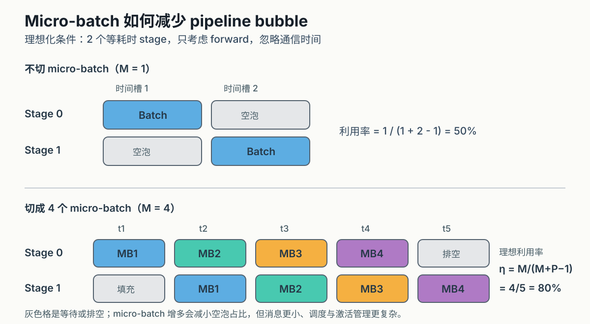

*对应视频 `01:12:28--01:13:32`。此图是依据课程讲解绘制的理想等时前向模型，不是视频原帧。*

现在推导空泡占比。采用理想模型：所有 stage 计算时间相等、记单个 micro-batch 单个 stage 的前向耗时为 $t_f$，只考虑前向、忽略通信。观察时间轴：第 1 个 micro-batch 需要依次穿过 $P$ 个 stage，共 $P$ 个时间槽才到达终点；此后每过一个时间槽就有一个新的 micro-batch 完成。$M$ 个 micro-batch 全部完成需要

$$
T_{\text{total}}=(M+P-1)\,t_f
$$

个时间槽。其中每个 stage 的有效计算是 $M$ 个槽（每个 micro-batch 一个），剩余的 $P-1$ 个槽在填充（等首个 micro-batch 到达）或排空（处理完最后一个后空闲）。因此设备利用率与空泡比例为

$$
\eta_{\text{ideal}}=\frac{M}{M+P-1},
\qquad
f_{\text{bubble}}=\frac{P-1}{M+P-1}.
$$

- $M$：micro-batch 数量；
- $P$：stage 数量；
- $\eta_{\text{ideal}}$：理想等时模型下的设备时间利用率；
- $f_{\text{bubble}}$：空泡时间占总时间的比例。

代入数值建立直觉。$P=2$ 时：$M=1$ 利用率为 $1/2$（一半时间在等），$M=4$ 时升到 $4/5$。$P=4$ 时：$M=1$ 空泡占 $3/4 = 75\%$；$M=4$ 空泡占 $3/7 \approx 43\%$；$M=8$ 空泡占 $3/11 \approx 27\%$；$M=32$ 空泡降至 $3/35 \approx 8.6\%$。一般地，要把空泡压到 $\varepsilon$ 以下，需要

$$
\frac{P-1}{M+P-1}\le\varepsilon
\;\Longleftrightarrow\;
M\ge (P-1)\frac{1-\varepsilon}{\varepsilon}\approx\frac{P-1}{\varepsilon},
$$

即 $M$ 必须按 $P$ 的数倍甚至一个数量级来配置：10% 空泡要求 $M \gtrsim 9(P-1)$。micro-batch 越多，填充与排空的固定开销被摊得越薄——这就是流水线并行提高利用率的全部数学。

### micro-batch 不是免费午餐

上面的推导暗示"把 $M$ 调大就万事大吉"，但增大 $M$ 要付出真实代价：

- **矩阵乘效率下降**：micro-batch 变小，每次 GEMM 的算术强度降低，GPU 利用率随之下降；$M$ 翻倍换来的空泡缩减可能被单步计算变慢吃掉；
- **激活显存上涨**：最朴素的调度（GPipe）要等全部 $M$ 个 micro-batch 的前向完成后才开始反向，期间必须保存 $M$ 份前向激活，显存随 $M$ 线性增长；1F1B（one-forward-one-backward）调度让反向尽早开始，把峰值激活从 $O(M)$ 压到 $O(P)$，但实现复杂度显著上升；
- **负载不均衡**：各 stage 计算量不一时，吞吐由最慢的 stage 决定，其他 stage 的等待仍是变相空泡；层到 stage 的划分本身是个需要求解的均衡问题；
- **通信开销**：send/recv 本身耗时，micro-batch 越多、收发次数越多，且可能与计算争用资源；
- **语义对齐**：micro-batch 数、gradient accumulation 步数与 optimizer step 的语义必须严格对齐——梯度要在 $M$ 个 micro-batch 上累积平均后才允许更新参数。

因此 $M/(M+P-1)$ 是心智模型而非性能保证：真实完整训练（含反向）的利用率公式、最优 $M$ 与调度方式，都要以 profiler 实测为准。

### stage 划分：一个容易被低估的均衡问题

把 $L$ 层切成 $P$ 段，听起来只要 $L/P$ 均分即可，实际要难得多。首先，各层的计算量并不相同：首尾 stage 往往还要承担 embedding 与输出投影/loss 计算，末 stage 的 lm-head 在大词表下可能相当于好几层的开销；均匀按层数切会让末 stage 成为全线最慢，拖低整体吞吐。其次，各层的激活大小也不同：长序列下中间层的注意力激活与 FFN 激活占比差异明显，显存均衡与计算均衡可能要求不同的切点。最后，跨 stage 边界的激活传输量取决于切点处的张量形状，切在瓶颈维较小的位置可以省通信。

工程上的做法是按实测的逐层前向/反向耗时与激活大小做加权划分（必要时引入虚拟流水线把粒度切细），目标函数是让 $\max_r T_r$（最慢 stage 的耗时）最小——因为稳态吞吐恰由它决定：

$$
\text{throughput} \propto \frac{1}{\max_{r=0,\ldots,P-1} T_r},
$$

- $T_r$：stage $r$ 处理一个 micro-batch 的前向加反向耗时。

这个 $\max$ 形式再次提醒我们：流水线里没有"平均而言够快"这回事，最慢的一段决定全局。

### 从 GPipe 到 1F1B：调度如何改变激活显存

空泡公式只刻画时间维度，调度方式还决定另一个硬约束——激活显存。比较两种经典调度在 $P$ 个 stage、$M$ 个 micro-batch 下的行为。

**GPipe（全前向后全反向）。** 先把 $M$ 个 micro-batch 的前向依次跑完，再按相反顺序逐个反向。优点是实现直白、通信方向单一不易死锁；代价是每个 stage 必须同时保存多达 $M$ 份前向激活，峰值激活显存为 $O(M \cdot a)$，其中 $a$ 为单 micro-batch 单 stage 的激活大小。$M$ 越大空泡越小，显存越爆——时间效率和空间效率直接对撞。

**1F1B（one-forward-one-backward）。** 稳态阶段，每个 stage 每完成一个 micro-batch 的前向，就立即执行一个已就绪 micro-batch 的反向。由于反向消耗激活，任何时刻每个 stage 最多积压约 $P$ 份未反向的激活，峰值降为 $O(P \cdot a)$，与 $M$ 解耦。空泡比例在理想等时模型下与 GPipe 相同（填充与排空的槽数不变），但显存约束松了一个量级，于是可以放心增大 $M$ 去压空泡。

- 时间维度：两种调度的空泡比例同为 $\frac{P-1}{M+P-1}$（含反向时把 $t_f$ 换成 $t_f + t_b$，比例形式不变）；
- 空间维度：GPipe 峰值激活 $O(M)$，1F1B 峰值激活 $O(P)$；
- 实现维度：1F1B 要求前向与反向消息在同一条链路上交错传输，调度与防死锁逻辑显著更复杂。

更进一步的变体（如 interleaved 1F1B / 虚拟流水线）把每个 rank 负责的层再拆成多个交错的 stage 片段，以更多的 send/recv 次数换取更小的填充排空占比。它们都不改变"空泡源于填充与排空"这一本质，只是在时间、空间、通信次数三个维度上重新分配代价。

### 通信与计算重叠

流水线与数据并行共享同一个性能原则：让通信与计算同时发生。串行执行时，一步的耗时近似为

$$
T_{\text{serial}}=T_{\text{compute}}+T_{\text{comm}}.
$$

- $T_{\text{compute}}$：该步全部计算时间；
- $T_{\text{comm}}$：该步全部通信时间。

若依赖关系与硬件资源允许理想重叠，则耗时的下界接近两者中的较大者：

$$
T_{\text{overlap}}\approx
\max(T_{\text{compute}},T_{\text{comm}}).
$$

- $T_{\text{overlap}}$：理想重叠下的单步耗时。

两个公式之间最多差出一倍加速，这就是重叠的全部意义：通信本身一个字节也没有减少，但只要 $T_{\text{comm}} \le T_{\text{compute}}$ 且调度正确，它就可以完全消失在墙钟时间里。在流水线中，重叠表现为不同 stage 同时处理不同 micro-batch；在 DDP 中，重叠表现为已就绪梯度 bucket 的 all-reduce 与更早层的反向计算并行。两者的成立前提相同：存在足够的独立工作，以及正确的调度。

> [!QUOTE]
> “计算与通信应该同时发生。”——讲者在 `01:14:02--01:14:19` 强调的系统设计目标（意译）。

### 本章小结

- 流水线并行沿 depth 切连续层，只在 stage 边界用点对点 send/recv 传递激活，通信频率远低于张量并行。
- micro-batch 让多个 stage 同时工作；理想等时模型下利用率为 $M/(M+P-1)$，空泡为 $(P-1)/(M+P-1)$，压空泡要求 $M$ 按 $P$ 的数倍配置。
- 增大 $M$ 的代价是小矩阵乘效率下降、激活显存上涨与调度复杂化；1F1B 等调度以复杂度换显存。
- 理想公式是心智模型；完整 PP 系统还需要反向调度、激活生命周期管理、非阻塞通信与 stage 负载均衡。

---

## 从基本策略到真实系统

### 三种主策略的统一比较

| 策略 | 切分轴 | 每卡保留什么 | 主要通信 | 首要收益 | 典型约束 |
|---|---|---|---|---|---|
| 数据并行 | batch | 完整模型，部分样本 | 梯度 all-reduce | 提升吞吐 | 不降低完整模型状态显存 |
| 张量并行 | layer width | 每层的一部分权重 | 高频 all-gather / reduce-scatter | 模型层单卡放不下 | 需要高速低延迟互联 |
| 流水线并行 | model depth | 一组连续层 | stage 间 send/recv | 跨设备放置深模型 | bubble、调度和负载均衡 |

回看这张表，三种策略恰好对应本讲开篇的三个切分轴，并且它们的通信特征互补：DP 每步一次大通信、TP 每层多次小通信、PP 每 stage 边界一次点对点通信。它们并不互斥，反而天然嵌套：一个大规模训练任务可能在每个节点内部做 tensor parallel（最快链路承受最高频通信），在节点组之间做 pipeline parallel（慢链路只承担 stage 边界激活），再把整个模型并行副本作为 data-parallel group 复制到更多节点。这就是所谓 3D parallelism。

### 子进程组：多维并行的机制基础

多维并行要在代码里落地，靠的只有一个机制：**子进程组**（subprocess group）。`init_process_group` 建立的默认组包含全部 $P$ 个 rank，而 `dist.new_group(ranks=[...])` 可以划出任意子集，之后的 collective 调用传入 `group=` 参数，就只在该子集内部通信。三种并行维度的通信因此可以完全分离：TP 的 all-reduce 只在 TP group 内做，DP 的梯度同步只在 DP group 内做，互不串扰。

把 rank 组织成一个三维网格最能说明问题。设 $\text{TP}=t$、$\text{PP}=p$、$\text{DP}=d$，总卡数 $P = t \cdot p \cdot d$，把全局 rank 看作三元组 $(i, j, k)$ 的线性化：

$$
\text{rank}(i, j, k) = k \cdot (t \cdot p) + j \cdot t + i,
$$

- $i \in [0, t)$：张量并行组内编号；$j \in [0, p)$：流水线 stage 编号；$k \in [0, d)$：数据并行副本编号。

- **TP group**：固定 $(j, k)$，$i$ 取遍 $0..t-1$ 的 $t$ 个 rank。按上面的线性化，这些 rank 编号连续，而连续编号通常被调度器分配到同一节点——于是 TP 通信自然落在 NVLink 域内。这正是"把 rank 编号顺序与物理放置对齐"的原因：进程组划分是一行代码，但它是否高效取决于 rank→机器的映射；
- **PP group**：固定 $(i, k)$，$j$ 取遍 $0..p-1$。相邻 stage 的 rank 相差 $t$，通常跨节点，stage 边界的 send/recv 走 IB；
- **DP group**：固定 $(i, j)$，$k$ 取遍 $0..d-1$。梯度 all-reduce 跨副本进行。

代码骨架如下：

```python
# 例：t=8, p=4, d=2，共 64 卡
tp_group = dist.new_group(ranks=list(range(j * t, (j + 1) * t)))  # 本 stage 的 TP 组
pp_ranks = [i + jj * t for jj in range(p)]                        # 本 (i,k) 的 PP 链
pp_group = dist.new_group(ranks=pp_ranks)

# 之后的 collective 指定 group，通信被限制在子集内
dist.all_reduce(tensor, group=tp_group)   # 只在 8 个 TP 伙伴间归约
```

同一 rank 同时属于三个组：它既要在 TP 组里每层交换激活，又要沿 PP 链收发 stage 边界，还要在 DP 组里同步梯度。三个组的通信频率、消息大小、可容忍链路各不相同，把它们分离到各自的 group，是把"通信放在正确链路上"从口号变成代码的关键一步。生产框架（Megatron-LM 的 `initialize_model_parallel`、DeepSpeed 的网格配置）做的正是这张三维表的自动化构建；读懂上面这一段，再读它们的源码就只是工程细节了。

### ZeRO/FSDP：把 DDP 的复制状态再切开

传统 DDP 在每卡复制参数、梯度和优化器状态三套状态。ZeRO（以及 PyTorch 中的对应实现 FSDP）的核心观察是：这三套状态的完整副本在任何时刻都只在局部被需要，因此可以逐步切分。按切分程度递进，ZeRO 分为三个阶段，我们以数据并行一节的显存账（混合精度 Adam，每参数 16 字节，每卡 $16N$ 字节）为基线，逐一定量分析。

**ZeRO-1：切分优化器状态。** fp32 主副本与 Adam 的 $m$、$v$ 共 $12N$ 字节被均分到 $P$ 个 rank，每个 rank 只负责更新 $1/P$ 的参数；但计算用的 fp16 参数（$2N$）与梯度（$2N$）仍全量复制。每卡占用为

$$
M_{\text{Z1}} = 4N + \frac{12N}{P}.
$$

- $M_{\text{Z1}}$：ZeRO-1 下每卡的模型状态字节数；
- $N$：参数量；$P$：world size；
- $4N$：仍为副本的 fp16 参数与梯度；$12N/P$：分片后的 fp32 主参数与两个动量缓冲。

**ZeRO-2：再切分梯度。** 反向后立即对梯度做 reduce-scatter，每个 rank 只保留自己负责更新的那片梯度（$2N/P$），而非全量 $2N$：

$$
M_{\text{Z2}} = 2N + \frac{14N}{P}.
$$

- $2N$：仍为副本的 fp16 参数；$14N/P$：分片的梯度与优化器状态。

**ZeRO-3：连参数也切分。** 每卡平时只持有 $1/P$ 的参数分片；计算到某一层时，先用 all-gather 把该层参数临时拼全，用完即释放；反向后梯度经 reduce-scatter 留片。所有状态都随 $P$ 线性摊薄：

$$
M_{\text{Z3}} = \frac{16N}{P}.
$$

代入具体数字看节省倍数。取 $N = 7 \times 10^{9}$（7B 模型）、$P = 8$：基线 DDP 每卡 $16N = 112$ GB；ZeRO-1 为 $4N + 12N/8 = 28 + 10.5 = 38.5$ GB（约 $2.9\times$ 节省）；ZeRO-2 为 $2N + 14N/8 = 14 + 12.25 = 26.25$ GB（约 $4.3\times$）；ZeRO-3 为 $16N/8 = 14$ GB（$8\times$）。再取 $N = 175 \times 10^{9}$、$P = 64$：基线 $2.8$ TB 完全不可行，ZeRO-3 每卡仅 $16N/64 = 43.75$ GB——从"不可能"变为"单卡放得下"。

天下没有免费的显存。通信量方面：ZeRO-1/2 把梯度 all-reduce（$2|\theta|$）换成 reduce-scatter 加一次参数更新后的分发，总量与 DDP 基本持平；ZeRO-3 则在前向和反向各增加一次参数 all-gather（各 $|\theta|$），加上梯度 reduce-scatter（$|\theta|$），每步总通信约 $3|\theta|$，是 DDP 的 $1.5$ 倍。ZeRO 的本质正是用额外通信换显存——而这也正是本课先讲 collective 的原因：看似全新的"并行名词"，最终都能还原为数据布局与通信原语的组合。

把三个阶段汇总成一张速查表：

| 阶段 | 切分对象 | 每卡模型状态 | 相对 DDP 节省 | 每步通信量 |
|---|---|---|---|---|
| DDP 基线 | 无（全量复制） | $16N$ | $1\times$ | $2\|\theta\|$ |
| ZeRO-1 | 优化器状态 | $4N + 12N/P$ | 至 $4\times$（$P$ 大时） | $\approx 2\|\theta\|$ |
| ZeRO-2 | 再加梯度 | $2N + 14N/P$ | 至 $8\times$ | $\approx 2\|\theta\|$ |
| ZeRO-3 | 再加参数 | $16N/P$ | $P\times$ | $\approx 3\|\theta\|$ |

术语上，PyTorch 的 FSDP（Fully Sharded Data Parallel）对应 ZeRO-3 的全分片语义，其 `SHARD_GRAD_OP` 模式对应 ZeRO-2，`HYBRID_SHARD` 则允许"节点内全分片、节点间复制"的两级组合——读文档时把这三档映射到 ZeRO 阶段，就不会再被名词淹没。

### 显存账的第四项：激活与 checkpointing

前面的账只算了模型状态（参数、梯度、优化器状态），训练时第四块显存来自**激活**——为反向传播而保存的中间结果。对序列长度 $S_{\text{seq}}$、隐藏维 $D$、$L$ 层的 Transformer，激活显存大致随 $B \cdot S_{\text{seq}} \cdot D \cdot L$ 线性增长，长序列场景下可与模型状态相当甚至反超。

activation checkpointing（重计算）用计算换显存：只在每个 block 边界保存输入激活，block 内部的中间结果在反向时重新前向算一遍。代价是大约多一次前向的 FLOPs（常见估算为总训练计算量上涨约 30%–40%），收益是激活显存从 $O(L)$ 降到 $O(\sqrt{L})$ 或 $O(1)$ 个 checkpoint 点（取决于分段策略）。它与 ZeRO 是互补的两条腿：ZeRO 切模型状态，checkpointing 压激活，二者相加才构成完整的显存预算方案。

把它放回三角权衡里看：checkpointing 选"重算"，ZeRO 选"通信"，DDP 选"存储"——同一个显存问题的三种解法，只是付费方式不同。

### sequence、expert 与混合并行

在三种主策略之外，还有几种常见的补充维度：

- **sequence parallelism** 沿序列维切分激活或某些算子（如 LayerNorm、Dropout 的沿序列部分），常与 tensor parallel 配合使用，进一步压低激活内存；
- **expert parallelism** 把 MoE 的不同专家放在不同设备上，通过 all-to-all 路由 token，其通信模式前面已经分析过；
- **多维并行** 同时沿数据、张量、流水线、序列乃至专家维切分。此时必须为每个维度建立独立的 process group，并保证最高频的通信（通常是 TP 与 sequence）落在最快的链路上。

课程之所以用简单 MLP 而不是完整 Transformer 来演示，是为了把 batch、width、depth 三个正交切分轴干净地暴露出来。换成 Transformer 后，attention、MLP、embedding 等模块各有切分细节，但底层的 collective 语义和布局推理方法完全不变。

### 并行策略应服从硬件层级

综合全课，一个实用的策略放置顺序是：

1. 把最频繁、最延迟敏感的 TP（及 sequence parallel）通信限制在 NVLink/NVSwitch 高速域内；
2. 用 PP 跨越相对慢的节点边界，因为它只在 stage 边界传递激活，通信频率低；
3. 用 DP 扩展副本数量，并通过梯度 bucket 尽量把 all-reduce 与反向计算重叠；
4. 根据显存压力决定是否进一步启用 FSDP/ZeRO、activation checkpointing 或 sequence parallelism。

这不是固定配方。最终配置取决于模型形状、batch size、序列长度、集群拓扑、网络争用与目标时间预算；任何"别人家的最优配置"都必须在本机拓扑上重新测量后才能采用。

### critical batch size 与统计效率

数据并行可以不断扩大 global batch，但优化收益并不会无限线性增长。直觉上，梯度的蒙特卡洛噪声随 batch 增大按 $1/\sqrt{B}$ 下降；当 batch 已经大到梯度估计足够精确时，继续堆样本对每步信息量的贡献迅速递减。超过与问题相关的 critical batch size 后，即使硬件吞吐继续提高，达到相同验证损失所需的样本量或步数未必等比例减少——此时扩大 DP 规模只是在更快地烧电，而不是更快地收敛。

critical batch size 不是一个跨模型恒定的数字。它随模型规模、数据分布、训练阶段（通常随训练进行而增大）、优化器与目标指标变化，只能通过实验（如不同 batch 下的步数—损失曲线）测得，不能只根据 GPU 数量提前写死。这一限制提醒我们：并行扩展的终点不是硬件，而是统计效率。

实验上如何定位它？标准的做法是在固定其他超参的前提下扫 batch size，对每个候选值记录"达到目标验证损失所需的总步数（或总样本量）"。在小 batch 区间，步数随 batch 增大近似线性下降——样本被充分利用；越过拐点后，继续加倍 batch 只换来微小的步数缩减，总样本量反而上升。拐点的位置即 critical batch size。一个更理论化的估计来自梯度噪声尺度（gradient noise scale）：

$$
B_{\text{noise}} = \frac{\operatorname{tr}(\Sigma)}{|\mathbb{E}[g]|^{2}},
$$

- $\Sigma$：单样本梯度的协方差矩阵；
- $\mathbb{E}[g]$：真实梯度的期望；
- $B_{\text{noise}}$：噪声与信号相当时的 batch 尺度，可作为 critical batch size 的近似。

这个量的一个可观测推论是：训练初期梯度方向嘈杂、$\operatorname{tr}(\Sigma)$ 大，临界值小；训练后期梯度趋稳、噪声相对缩小，临界值随之增大——这正是"critical batch size 随训练阶段增长"的机制解释，也支持"训练后期逐步增大 batch"的课程学习式调度。

### 一个完整的多维并行配置演算

把全课的工具串起来，为一个假想任务做一次端到端配置：70B 参数模型（$N = 7 \times 10^{10}$），集群 512 张 GPU，每节点 8 卡 NVLink（域内约 400 GB/s），节点间 IB 约 25 GB/s 有效带宽。

**第一步：容量下限。** 混合精度 Adam 模型状态 $16N = 1120$ GB，加上激活，纯 DDP 每卡放不下，必须切模型状态。

**第二步：选 TP 度。** 取 TP = 8，恰好一个节点的 NVLink 域：每层权重分 $1/8$，层间 all-gather/reduce-scatter 全部留在最快链路上。此时模型并行组内的每卡参数约 $2N/8 = 17.5$ GB（fp16）。

**第三步：选 PP 度。** 取 PP = 8，把约 80 层摊成每 stage 10 层，跨节点传递的只有 stage 边界的激活（每 micro-batch 每边界数百 MB 量级），慢链路可承受。TP×PP = 64 卡构成一个完整模型副本，512 卡可容纳 DP = 8 个副本。

**第四步：检查 DP 通信。** 若再用 ZeRO-1 切优化器状态，每卡优化器状态 $12N/64 = 21$ GB，总模型状态约 $17.5 + 2N/8\ (\text{梯度分片后更小}) + 21 \lesssim 45$ GB，加激活与 checkpointing 后可行。梯度同步只在 DP group（8 个副本，跨节点）每步一次，约 $2|\theta|/64$ 每卡（模型已被 TP×PP 切分，每卡只同步自己那片参数的梯度），通过 bucket 与反向重叠。

**第五步：空泡与 micro-batch。** PP = 8 要求 $M \gtrsim 9 \times 7 = 63$ 才能把空泡压到约 10%，结合 1F1B 把激活峰值控制在 $O(P)$。若 global batch 装不下这么多 micro-batch 的累积，就接受更大的空泡或减小 PP——每一处都是显式取舍。

这个演算不求"最优"，只求演示决策链条：容量决定必须切什么，拓扑决定每种切分放在哪里，batch 与统计效率决定 DP 的上限。真实项目最后还要用 profiler 验证每一个假设。

### JAX/TPU 的另一种抽象

课程最后提到 JAX/TPU 生态的 sharding 风格：用户只需声明每个张量如何映射到逻辑设备网格（例如"沿 batch 维切到这一轴"），由编译器（XLA/GSPMD）自动推导并插入所需的 collective。这把并行表达从"手写通信"提升到"声明布局"的抽象层次，大幅减少样板代码。但抽象并不消除物理代价：如果声明的布局让高频通信跨越慢链路，编译器也无法变出带宽。布局推理的能力——本讲训练的核心能力——在任何抽象层之下都依然必需。

### 本章小结

- DP、TP、PP 是正交切分轴，通信特征互补，可以嵌套形成多维并行；放置原则是高频通信走快链路。
- 多维并行在代码上靠子进程组落地：rank 三维网格 $(i,j,k)$ 的线性化顺序决定各维通信落在哪条物理链路上。
- ZeRO-1/2/3 依次切分优化器状态、梯度与参数；7B/$P$=8 时分别约需 38.5、26.25、14 GB，ZeRO-3 以约 $1.5\times$ 通信量换取随 $P$ 线性下降的显存。
- sequence 与 expert parallelism 仍可还原为张量布局与 collective 的组合。
- 数据并行的扩展终点是 critical batch size 处的统计效率，而非硬件数量；梯度噪声尺度给出了它的理论近似与随训练增长的机制解释。
- 软件抽象可以自动插入通信，但不能取消硬件拓扑与通信成本。

---

## 总结与延伸

### 一张图回看全课

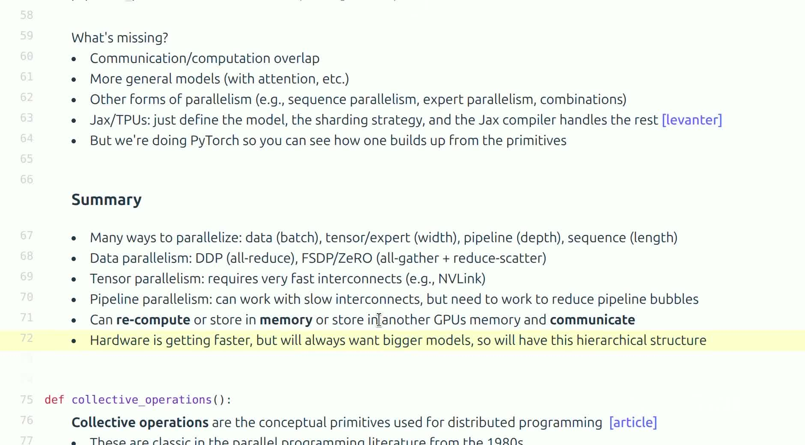

*对应视频 `01:19:14--01:20:47`。画面完整列出 DDP、FSDP/ZeRO、TP、PP 以及存储、重算、通信之间的权衡。*

本课从 rank 与 collective 出发，依次建立了硬件、编程和算法三层视角：

1. **通信语言**：broadcast、scatter、gather、reduce 负责基础模式；all-gather、reduce-scatter、all-reduce 和 all-to-all 是现代训练的主力。ring 模型给出 $2(P-1)N/P$ 的带宽最优通信量，也暴露了延迟随 $P$ 线性增长的软肋。
2. **系统现实**：NCCL 把抽象 collective 映射到 NVLink、NVSwitch、InfiniBand 或 Ethernet/RoCE；拓扑决定实际成本，测量决定认知真伪。
3. **切分算法**：DP 切 batch、TP 切 width、PP 切 depth；ZeRO/FSDP 再把 DDP 原本复制的模型状态逐级切分，用通信换显存。
4. **性能方法**：用 $\alpha$–$\beta$ 模型估算量级，用同步正确的 benchmark 验证口径，再通过 profiler 检查通信是否真正被计算覆盖。

### 最后保留的三角权衡

当训练中暂时需要一个张量时，系统通常只有三类选择：

- **存储**：把它留在本地显存——省计算与通信，但消耗容量；
- **重算**：需要时重新计算——用 FLOPs 换显存；
- **通信**：把它放在别的设备或保持分片、需要时交换——用网络换显存。

本讲所有方法都是这三者的不同配比：DDP 选择存储（全量复制）加每步一次通信；ZeRO 逐档减少存储、增加通信；activation checkpointing 选择重算；TP 与 PP 则把存储摊到多卡、以通信缝合。硬件会继续变快，模型也会继续变大，因此这一三角权衡不会消失。可靠的并行设计不是寻找一种永远最优的技术，而是让最频繁的数据移动停留在最快的层级，把不可避免的通信隐藏在有用计算后面，并用测量持续校正公式直觉。

### 建议的后续练习

1. 用四个小向量手算八种 collective 的输入输出，再验证 all-reduce 的两阶段分解；写出 $P=4$ 时 ring reduce-scatter 每一步各 rank 持有的部分和。
2. 修改课程 benchmark：固定相同 payload，重复多次，分别报告中位数、P95、算法带宽与总线带宽；扫描消息大小并拟合 $\alpha$ 与 $\beta$。
3. 为教学版 tensor parallel 实现一个带 reduce-scatter 的自定义 autograd Function，并与单卡梯度逐元素比较。
4. 为 pipeline 示例加入 micro-batch 和反向调度，画出 $P=4$ 时不同 $M$ 的时序图，验证空泡比例 $(P-1)/(M+P-1)$。
5. 给定一套具体节点拓扑（如每节点 8 卡 NVLink、节点间 400 Gb/s IB），为一个 70B 模型设计 TP/PP/DP process group，并用显存账与通信账说明为什么每种通信被放在对应链路上。

### 本章小结

- 并行训练的核心不是卡数，而是张量布局、通信边界与硬件层级的匹配。
- DP、TP、PP 分别沿 batch、width、depth 切分；ZeRO/FSDP 用更细粒度的状态切分降低显存，代价是更多通信。
- 任何方案都在 memory、recompute、communicate 三角之间交换成本；区别只在配比。
- 公式负责建立直觉，正确同步的 benchmark 和 profiler 负责验证现实。
