# Lecture 8：并行化基础（Parallelism Basics）

> 本讲是 CS336 系统线的核心：当模型大到单卡装不下、数据多到单卡算不完时，如何把训练切到成百上千张 GPU 上。我们自底向上地走一遍——先看硬件网络与集合通信原语，再依次推导数据并行（DDP → ZeRO-1/2/3 → FSDP）、流水线并行（GPipe → 1F1B → Interleaved → Zero-Bubble）、张量并行（Megatron 的列切/行切与 $f$/$g$ 算子）、序列并行与上下文并行、专家并行，最后看真实系统（Llama 3 405B、DeepSeek-V3、Gemma 2、Mixtral、Qwen 3 等）如何把这些维度组合成"3D/4D 并行"。

**导读与全讲地图**（与官方 73 页课件一一对应）：

- §1 为什么需要并行 + 通信原语与网络拓扑（slide 1–13）
- §2 数据并行：DDP 与 ZeRO 三阶段（slide 14–30）
- §3 流水线并行（slide 31–38）
- §4 张量并行（slide 39–43）
- §5 激活内存与序列并行（slide 44–49）
- §6 专家并行（slide 50–53）
- §7 上下文并行与 Ring Attention（slide 54）
- §8 并行方式对比总结（slide 55）
- §9 3D/4D 并行组合与真实系统配置（slide 56–72）
- §10 全讲回顾、延伸阅读与资源（slide 73）

---

## 1. 为什么需要并行 + 通信原语与网络拓扑

### 1.1 并行的动机：单机算力与内存的极限

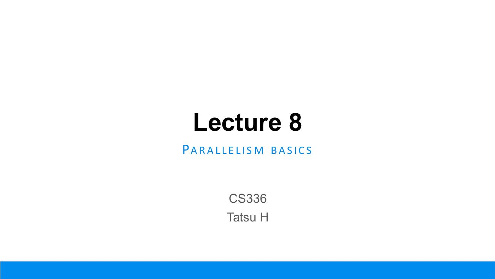{ width="640" }

本讲标题页：Parallelism Basics，主讲人 Tatsunori Hashimoto。这是课程中系统性最强的一讲——此前各讲默认"模型能在一张（或几张）GPU 上跑起来"，本讲开始正面回答：当这个假设失效时怎么办。

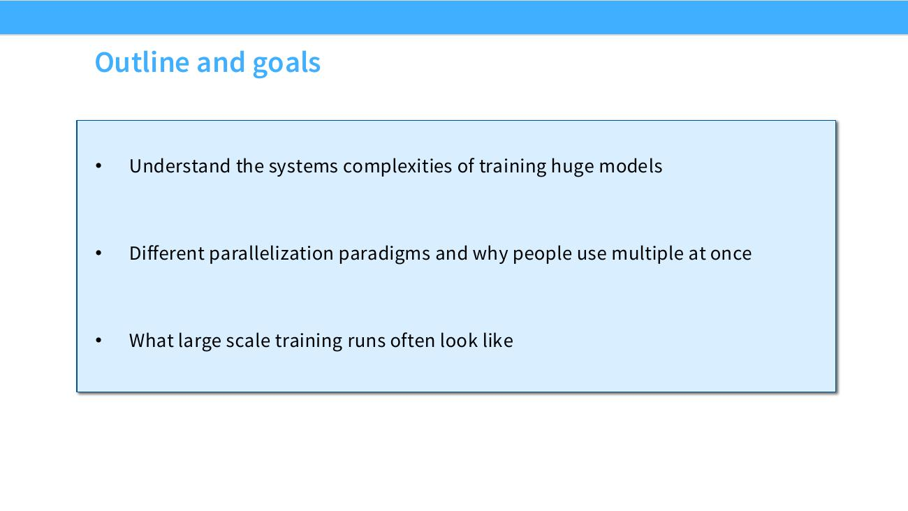{ width="640" }

本讲的三个学习目标：

1. 理解训练巨型模型时的**系统复杂性**（systems complexities）——内存、通信、调度、容错；
2. 掌握不同的**并行化范式**（parallelization paradigms），以及为什么实践中要**同时用好几种**；
3. 了解真实的大规模训练运行（large scale training runs）长什么样。

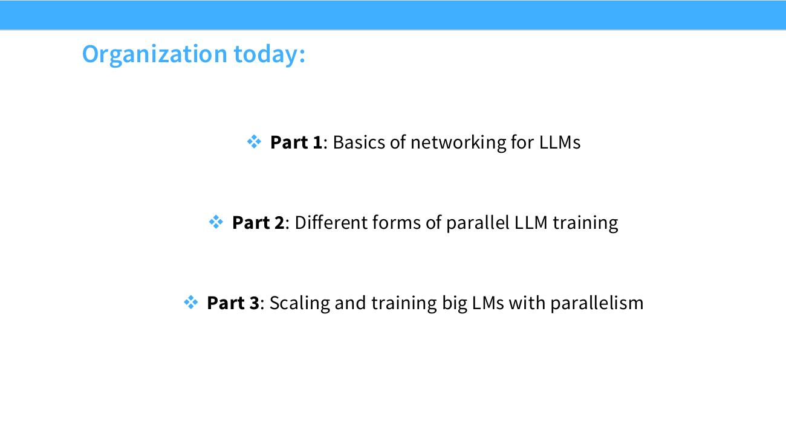{ width="640" }

全讲分三部分：**Part 1** 讲 LLM 训练的网络基础（networking basics）；**Part 2** 讲各种并行训练的形式（data / pipeline / tensor / sequence / expert）；**Part 3** 讲如何组合它们来 scale 并训练大模型。本讲义 §1 对应 Part 1，§2–§7 对应 Part 2，§8–§9 对应 Part 3。

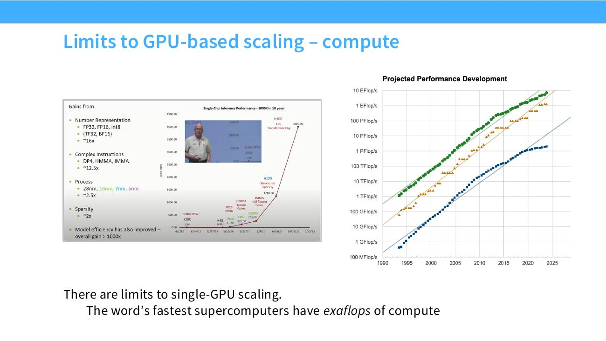{ width="640" }

先看算力一侧。左图是 Bill Dally 的著名分析：单芯片推理性能 10 年提升约 1000 倍，其来源可分解为——**数值表示**（FP32 → FP16 → Int8 等，约 16 倍）、**复杂指令**（DP4/HMMA/IMMA 等张量核心指令，约 12.5 倍）、**制程**（28nm → 5nm，约 2.5 倍）、**稀疏化**（约 2 倍）。注意一个关键事实：**这 1000 倍里只有 2.5 倍来自制程进步**，其余全部来自"为深度学习专门定制"的架构与数值格式红利——而这些红利正在耗尽。右图是超算 Top500 式的性能增长曲线：世界上最快的超算已经进入 exaFLOPS（$10^{18}$ FLOP/s）量级，但那是**成千上万颗芯片堆出来的**，不是单芯片的功劳。结论：单 GPU 的算力增长有明确上限，继续扩大训练规模只能靠堆卡。

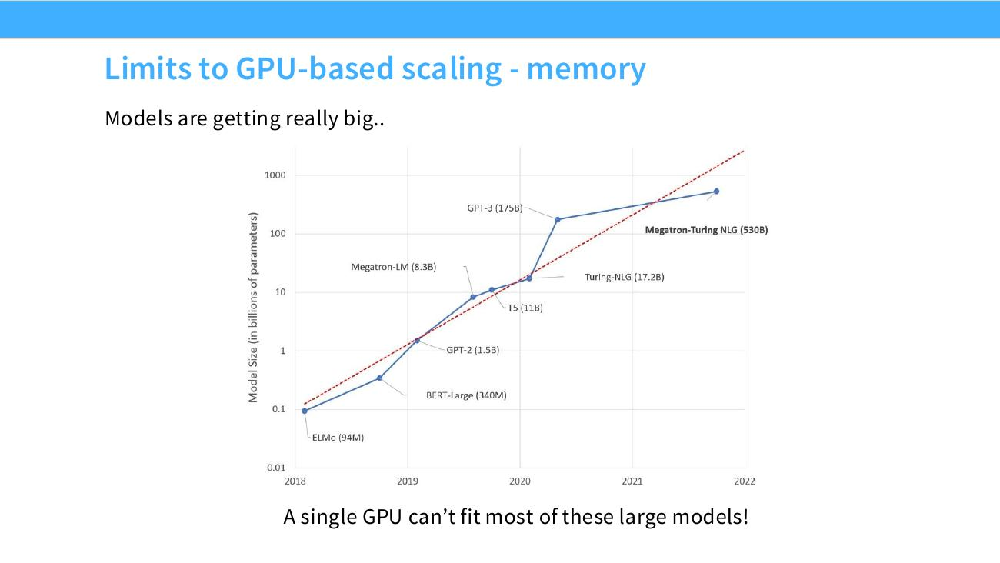{ width="640" }

内存一侧更加严峻。图中是 2018–2022 年代表性语言模型的参数量：ELMo（94M）→ BERT-Large（340M）→ GPT-2（1.5B）→ T5（11B）→ GPT-3（175B）→ Megatron-Turing NLG（530B），近似指数增长（红色虚线趋势），而同期单卡 HBM 容量仅从 16GB（V100）涨到 80GB（A100/H100）。两条曲线的斜率完全不同：**单张 GPU 早就装不下这些大模型了**——而且后面 §2 会看到，"装下参数"只是冰山一角，训练时每个参数实际要占十几字节。算力与内存两端的单机极限，共同逼出了多 GPU、多机并行这条唯一出路。

### 1.2 多机多卡的硬件基础：机内与机间互连

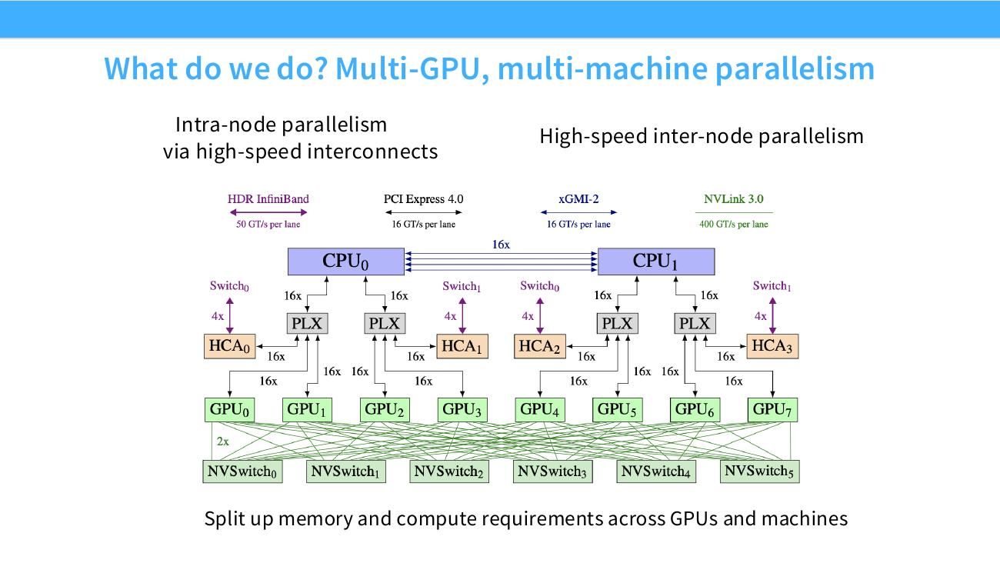{ width="720" }

既然单卡不够，就把内存和算力需求**分摊到多 GPU、多机器上**。这张图是一台典型 8 卡 GPU 服务器（DGX 类）的内部结构，值得逐层读：

- **机内（intra-node）**：8 张 GPU 通过 6 颗 NVSwitch 全互连，GPU 间走 NVLink 3.0——每条 lane 400 GT/s，折合单向约 50GB/s 量级、整卡聚合数百 GB/s。这是**最快的一级互连**，延迟低、带宽高，适合放最频繁的通信。
- **CPU 侧**：两颗 CPU 通过 xGMI-2 互连；GPU 经 PLX（PCIe switch）挂到 PCIe 4.0 总线上（16 GT/s per lane）。
- **机间（inter-node）**：每张 GPU 就近配一张 HCA（Host Channel Adapter，即 InfiniBand 网卡），HDR InfiniBand 每条 lane 50 GT/s，整卡 200Gbps（约 25GB/s）。

注意带宽的**层级落差**：NVLink（数百 GB/s）≫ InfiniBand（数十 GB/s）≫ 普通以太网。这个落差不是细节，而是**整个并行策略设计的第一约束**——后面所有"哪种并行放机内、哪种放机间"的规则（TP 放机内、PP/DP 放机间）都由它推出。

### 1.3 集合通信原语（Collective Communication Primitives）

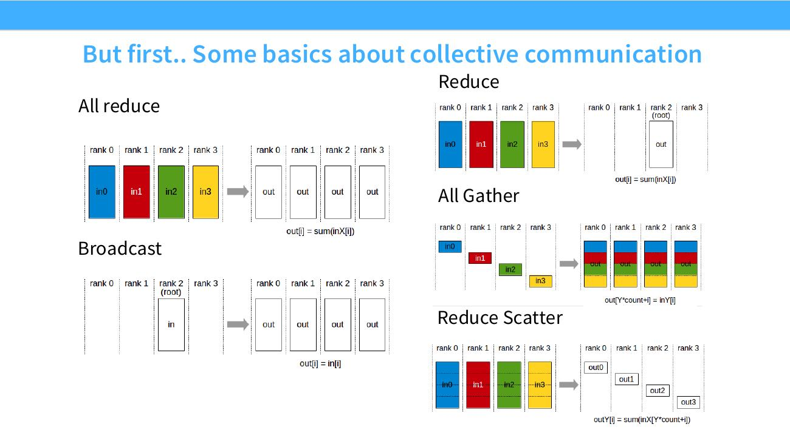{ width="720" }

多卡协同的一切通信都可以归结为少数几个**集合通信原语**（NCCL/RCCL/MPI 提供实现）。图中 4 个 rank（rank 0–3）各持有一份数据，逐一来看：

- **All-Reduce**：每个 rank 输入一个向量 $\text{in}_i$，操作后**所有 rank 都得到完整的归约结果**：$\text{out}[i] = \sum_X \text{in}_X[i]$。数据并行里同步梯度靠的就是它。
- **Reduce**：与 All-Reduce 相同的归约，但结果只写到指定的 root rank（图中 rank 2）。
- **Broadcast**：root rank 的数据原样复制给所有 rank：$\text{out}[i] = \text{in}[i]$。
- **All-Gather**：每个 rank 贡献一段**不同的**数据片段，操作后每个 rank 都拿到按 rank 序拼接的完整向量：$\text{out}[Y \cdot \text{count} + i] = \text{in}_Y[i]$。
- **Reduce-Scatter**：先按元素做归约，再把结果**切成 $N$ 段、每个 rank 只拿一段**：$\text{out}_Y[i] = \sum_X \text{in}_X[Y \cdot \text{count} + i]$。

这五个原语看似平常，但 §2 的 ZeRO 全家桶本质上就是"用 Reduce-Scatter 和 All-Gather 重新组装 All-Reduce，顺便把内存分片掉"。

### 1.4 关键细节：All-Reduce 的带宽最优实现

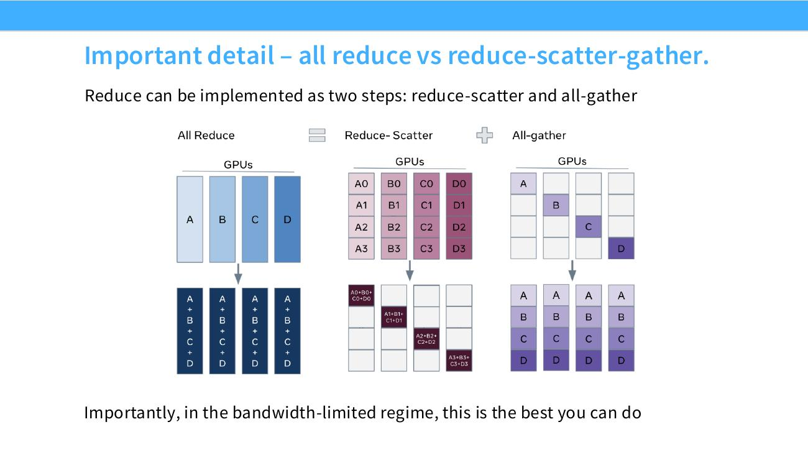{ width="720" }

一个对后续至关重要的实现细节：**All-Reduce 可以分解为先后两步——Reduce-Scatter + All-Gather**。图中 4 张 GPU 各持向量 A、B、C、D（各切成 4 块，如 A0–A3）：第一步 Reduce-Scatter 后，GPU 0 只持有第 0 块的归约结果 $A_0+B_0+C_0+D_0$，GPU 1 持有第 1 块的归约结果，依此类推；第二步 All-Gather 把四个归约好的分块拼回所有 GPU，人人得到完整的 $A+B+C+D$。

为什么这个分解重要？因为在**带宽受限（bandwidth-limited） regime 下，这就是 All-Reduce 的最优实现**：设向量长度为 $M$、共 $N$ 个节点，ring 算法下每个节点在 Reduce-Scatter 阶段发送/接收的数据量为 $\frac{N-1}{N}M$，All-Gather 阶段同样是 $\frac{N-1}{N}M$，合计

$$
\text{每个节点通信量} = 2 \cdot \frac{N-1}{N} \cdot M \approx 2M \quad (N \gg 1)
$$

即一次 All-Reduce 每个节点大约收发 $2M$ 个元素，与节点数 $N$ **无关**——这正是"reduce-scatter 等价性"留给我们的杠杆：只要通信预算允许 $2M$，我们就可以在这两步之间插入任意"分片状态"的本地计算（比如优化器更新），白赚内存缩减。请牢记 $2 \times \#\text{params}$ 这个数字，§2 会反复用它做基准。

### 1.5 TPU 与 GPU 的网络设计差异

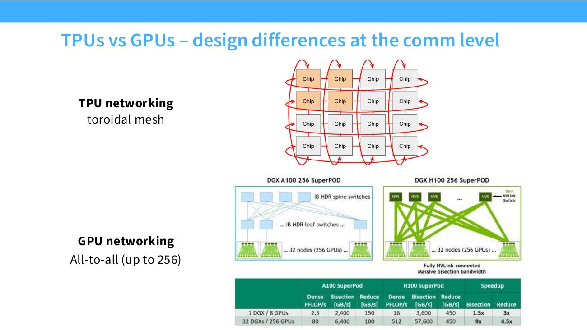{ width="720" }

两大硬件阵营在网络拓扑上走了不同路线：

- **TPU：环面 mesh（toroidal mesh）**。芯片按 2D/3D 网格直接互连，网格边缘回绕成环面。这是"direct connected network"，radix 低、结构规整、成本可控。
- **GPU：全互连（all-to-all），规模到 256 卡**。DGX A100 SuperPOD 用 IB HDR 的 leaf-spine 交换网络连接 32 节点（256 GPU）；DGX H100 SuperPOD 更进一步，用 NVLink Switch 把 256 张 H100 全部纳入 NVLink 域，实现"Fully NVLink-connected, massive bisection bandwidth"。表格给出了量化对比：256 卡规模下 H100 SuperPOD 的 bisection 带宽 57,600 GB/s（A100 的 9 倍）、All-Reduce 带宽 450 GB/s（4.5 倍），dense 算力 512 PFLOP/s。

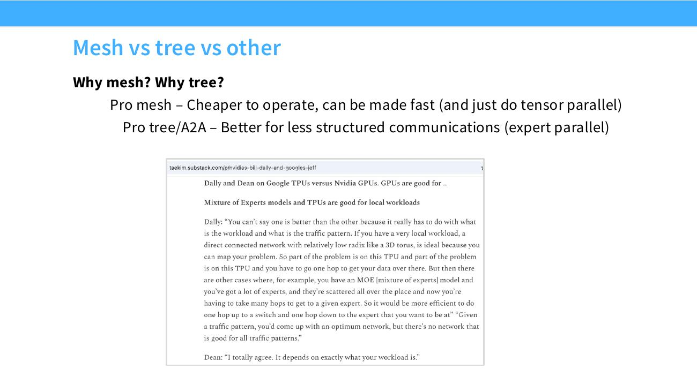{ width="720" }

两种拓扑各自的 trade-off：

- **Mesh 的优点**：建设与运营成本低，且在**通信模式规整**时可以做得很快——比如张量并行的 All-Reduce 在 ring/torus 上有天然高效的实现，所以 TPU 文化里"只做好 tensor parallel 就够了"。
- **Tree/全互连（A2A）的优点**：更适合**不规则、非结构化的通信**——典型代表是专家并行（expert parallel）里 token 被随机路由到任意专家的 all-to-all 流量。

Slide 中引用了 Bill Dally 与 Jeff Dean 的一段对谈（taekim.substack.com），点明了本质："不能说哪个网络更好，因为这完全取决于负载和流量模式……如果你的负载非常局部化，像 3D torus 这样低 radix 的直连网络是理想的；但如果是 MoE 模型、专家散落各处、要跳很多跳才能到达某个专家，那不如'上交换机一跳、再下来一跳'高效。给定一种流量模式你可以设计出最优网络，但**不存在对所有流量模式都最优的网络**。"Dean 完全同意。这句话预言了后面 EP 与网络拓扑的纠缠（§6、§9）。

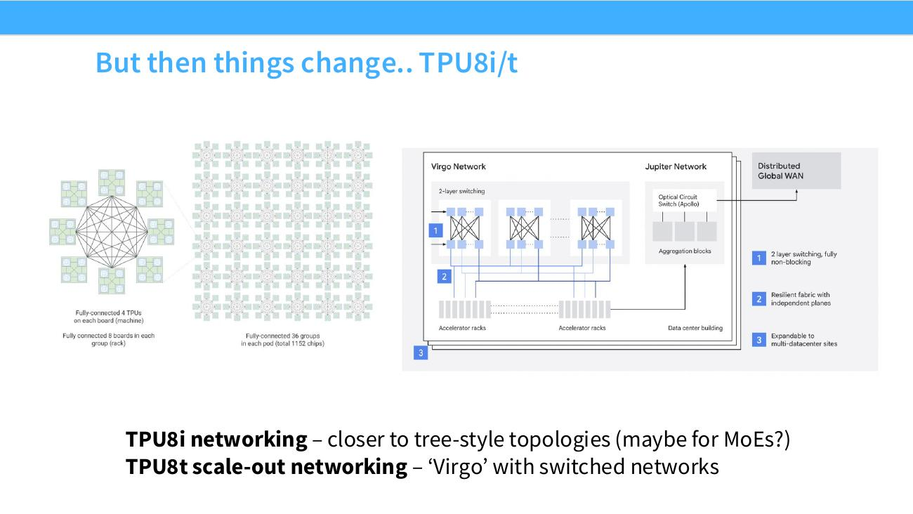{ width="720" }

有趣的是，Google 自己也在"背离"纯 mesh：新一代 TPU（课件称 TPU8i/8t）的网络明显向交换式、树形方向演化。左图：TPU8i 的机内结构——每块板 4 颗 TPU 全互连、每组（rack）8 块板全互连、每个 pod 36 组共 1152 颗芯片，层级更接近**树形拓扑**（课件猜测"maybe for MoEs?"——正是为了应对 all-to-all 型的专家路由流量）。右图：TPU8t 的 scale-out 网络 "Virgo"——两层交换、完全无阻塞（fully non-blocking）、带独立平面的容灾 fabric，再往上经 Jupiter 网络的 Apollo 光路交换（Optical Circuit Switch）接入数据中心级、乃至跨数据中心的 Distributed Global WAN。**硬件阵营在拓扑上互相靠拢**：GPU 阵营用 NVSwitch 把全互连域做大，TPU 阵营用交换网络补足不规则流量，殊途同归。

### 1.6 域大小（Domain Size）：为什么不把所有东西连起来？

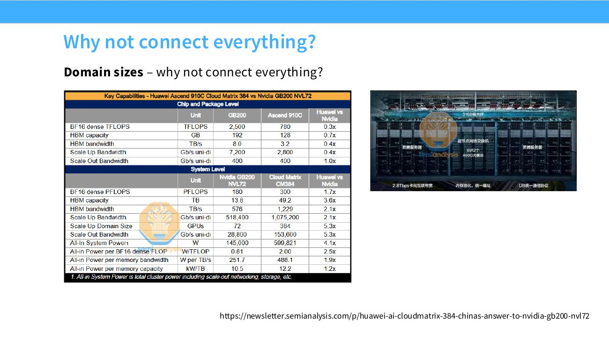{ width="720" }

既然全互连最好，为什么不把全互连域做到几千张卡？答案是**功耗与成本**。Slide 用 SemiAnalysis 的对比表给出了极端案例：NVIDIA GB200 NVL72（72 颗 GPU 一个 scale-up 域）对比华为 CloudMatrix 384（384 颗 Ascend 910C 一个域）。芯片级上 910C 的 BF16 算力只有 GB200 的 0.3 倍，但华为把 scale-up 域做大到 5.3 倍（384 vs 72 颗），系统级堆出了 1.7 倍算力、3.6 倍 HBM 容量、2.1 倍内存带宽——代价是**全系统功耗 4.1 倍**（约 600kW vs 145kW）、每 BF16 FLOP 功耗 2.5 倍。这个案例把"域大小"的权衡摆得非常清楚：扩大高速互连域可以降低并行策略的设计难度（更多通信可以留在快域内），但物理上要用光模块、交换机和电来换。**Domain size 是硬件替并行策略"预付"的成本**，这就是为什么后面反复出现"TP ≤ 8（一个 NVLink 域）、PP/DP 跨域"的分层规则。

### 1.7 Part 1 小结：数据中心是新的计算单元

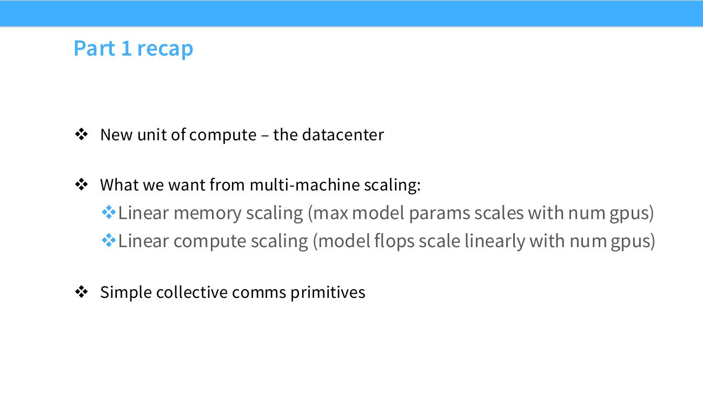{ width="640" }

Part 1 的三个 takeaway：

1. **新的计算单元是数据中心**——不再是单卡、单机，而是成千上万加速器通过网络组成的整体；
2. 我们想从多机扩展中得到两样东西：**线性内存扩展**（能装下的最大模型参数量随 GPU 数线性增长）与**线性算力扩展**（有效 FLOP/s 随 GPU 数线性增长）——后面会看到，没有任何单一并行策略能同时免费地给出两者；
3. 一切协同都建立在少数几个**简单的集合通信原语**之上（All-Reduce、Reduce-Scatter、All-Gather、Broadcast、点到点）。

带着"线性内存 + 线性算力"这两个检验标准，进入 Part 2：逐个考察并行策略。

---

## 2. 数据并行：DDP 与 ZeRO 三阶段

### 2.1 Part 2 总览：三类并行 + 两个补充

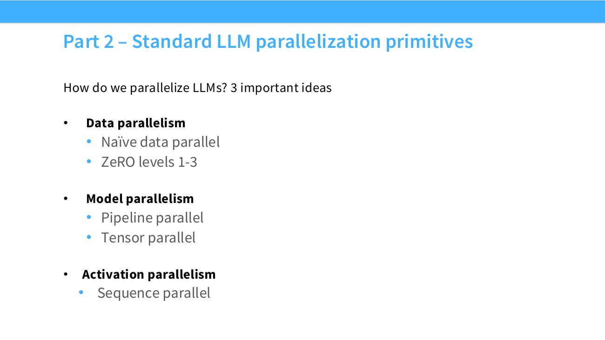{ width="640" }

Part 2 要考察的并行维度一览：**数据并行**（data parallel）、**模型并行**的两个子类——**流水线并行**（pipeline parallel，沿深度切）与**张量并行**（tensor parallel，沿宽度切）；外加两个"补丁"性质的维度：**序列并行**（sequence parallel）与**上下文并行**（context parallel），它们解决激活内存与长序列问题。§2–§7 逐一展开。

### 2.2 朴素数据并行（DDP）：把数据切开，梯度 All-Reduce

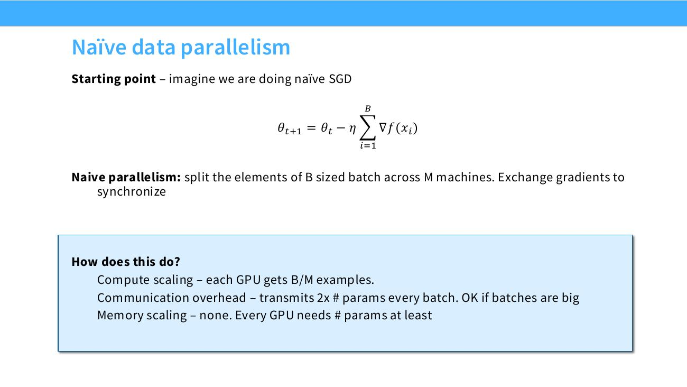{ width="720" }

最简单的并行形式：每张 GPU 持有**完整的模型副本**，数据按 batch 切分——GPU 0 算 batch 0 的前向（F0），GPU 1 算 batch 1（F1），各自反向得到本地梯度，然后**对梯度做一次 All-Reduce**，所有副本得到相同的全局梯度，各自独立更新参数。数学上，设全局 batch 被切成 $N$ 份，副本 $i$ 在本地数据上算得梯度 $g_i$，则

$$
g = \frac{1}{N} \sum_{i=1}^{N} g_i
$$

这就是小批量 SGD 的梯度，与单卡训大 batch **严格等价**（数值上只有浮点归约顺序的差异）。通信量为一次 All-Reduce：由 §1.4 的结论，每卡约 $2 \times \#\text{params}$ 个元素——对照实验也显示，朴素 DP 的通信确实恰好是 $2 \times \#\text{params}$。在 10 节点、A100、每节点 4 卡（共 40 GPU）的设定下，朴素 DP 的通信时间约占 step 时间的 14%——还能接受，但通信占比会随带宽变贵而恶化。

### 2.3 数据并行的问题：副本太多

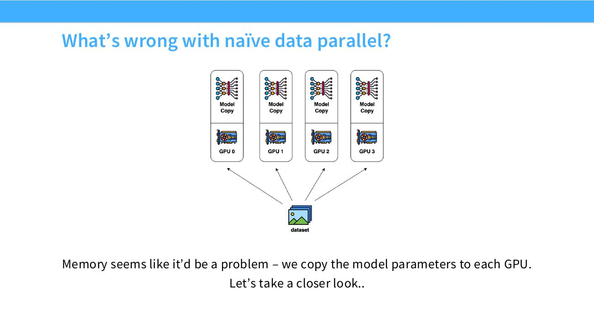{ width="720" }

DDP 的问题不在通信，在**内存**：每张 GPU 都要完整保存参数 $\theta$、梯度 $\nabla\theta$、动量 $m$、二阶矩 $v$ 以及 fp32 主权重——图中每个 GPU 上的柱子一模一样，$N$ 份副本完全冗余。模型稍大就装不下，DDP 对"线性内存扩展"这一目标**毫无贡献**。

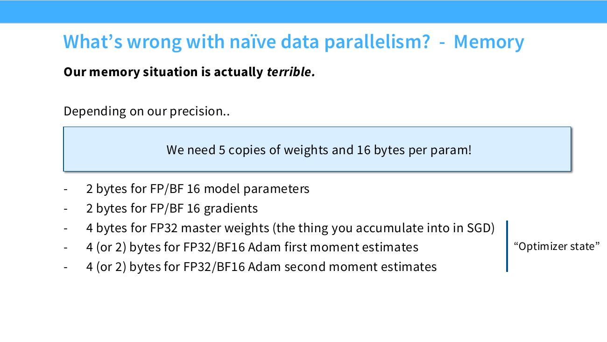{ width="720" }

具体算一下混合精度 Adam 下**每个参数的字节数**（这也是 ZeRO 论文的核心观察）：

| 状态 | 精度 | 字节/参数 |
|---|---|---|
| fp32 主权重 | float32 | 4 |
| fp32 动量 $m$ | float32 | 4 |
| fp32 方差 $v$ | float32 | 4 |
| fp16 计算权重 | float16 | 2 |
| fp16 梯度 | float16 | 2 |
| **合计** | | **16** |

代入具体规模：7B 模型 $7 \times 16 = 112$ GB——**单张 80GB 的 A100/H100 已经装不下**；175B 模型 $175 \times 16 = 2800$ GB，需要约 35 张 A100 仅用于装训练状态（还不含激活）；530B 模型约 8.5TB。也就是说：哪怕不算任何激活内存，"朴素 DDP + Adam"在 7B 规模就撞墙了。这 16 字节里，12 字节（fp32 主权重 + 两个优化器状态）只是训练所需的"账本"，2+2 字节是实际参与计算的——ZeRO 的全部思路就是**把这 16 字节沿数据并行的 rank 切分，每个 rank 只存 $1/N$**。

### 2.4 ZeRO 总览：三阶段逐层切分

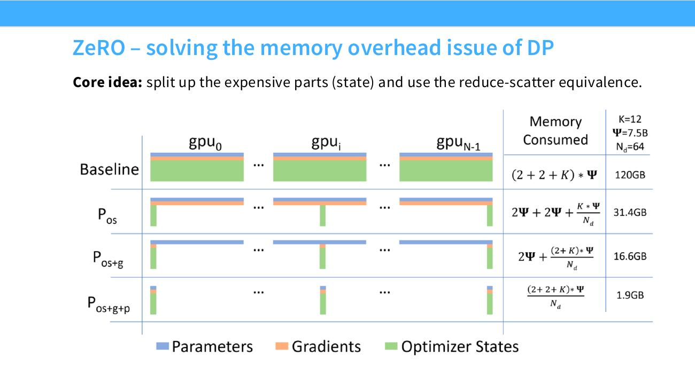{ width="720" }

ZeRO（Zero Redundancy Optimizer, Rajbhandari et al. 2019）把训练状态分三类，逐阶段消除冗余（图为 7.5B 模型、$K$ 个数据并行 rank、64 路 DP 的例子）：

- **基线（Baseline）**：每卡存全量的优化器状态（Optimizer States，fp32 动量+方差）、梯度（Gradients）、参数（Parameters），共 $120$ GB/卡（$\Psi$ 为模型参数量，$K$ 为内存倍率——Adam 混合精度下 $K=12$ 对应 fp32 的优化器状态与主权重，加 fp16 权重与梯度共 16 字节）。
- **ZeRO Stage 1（$P_{os}$，optimizer state sharding）**：优化器状态分片，$120 \to 31.4$ GB。
- **ZeRO Stage 2（$P_{os+g}$，+ gradient sharding）**：梯度也分片，$16.6$ GB。
- **ZeRO Stage 3（$P_{os+g+p}$，+ parameter sharding）**：参数也分片，**每卡内存 = 总量 / DP 数**，$1.9$ GB——实现真正的线性内存扩展。

表中还给出了 1T 参数模型在 1024 张 A100 上 ZeRO-3 的效果：每卡仅 15.6GB，单卡即可放下的量级。下面逐阶段推导通信代价。

### 2.5 ZeRO Stage 1：切分优化器状态

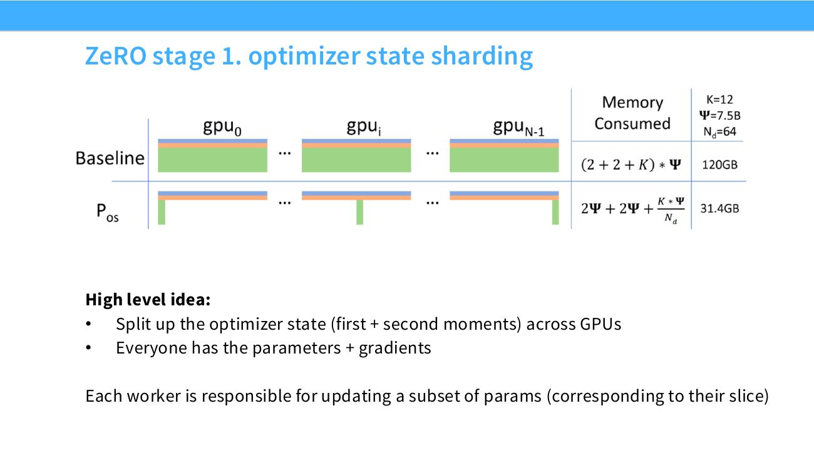{ width="720" }

Stage 1 的做法：**优化器状态（fp32 主权重、动量、方差）按 rank 切成 $N$ 份**，rank $i$ 只负责第 $i$ 份参数的优化器更新；fp16 权重与梯度暂时仍全量复制。这样 16 字节中的 12 字节被除以 $N$，每卡占 $4 + \frac{12}{N}$ 字节/参数。$N$ 较大时省掉约 4 倍内存（对 Adam 混合精度）。

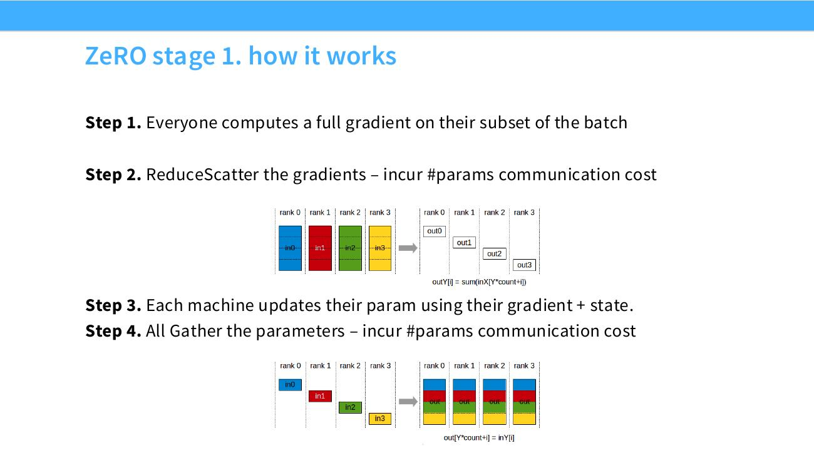{ width="720" }

Stage 1 的执行流程（对照图逐步看）：

1. **前向 + 反向**：每张卡用全量 fp16 权重对自己的数据分片计算，得到全量本地梯度（与其他副本的梯度之和才是全局梯度）；
2. **Reduce-Scatter 梯度**：梯度不再 All-Reduce，而是 Reduce-Scatter——归约完成后 rank $i$ 只保留第 $i$ 份参数的完整梯度，其余丢弃。由 §1.4，这一步通信量 $\approx M$（$M$ = 参数量）；
3. **本地优化器更新**：rank $i$ 用自己分片内的优化器状态（动量、方差、fp32 主权重）更新自己那 $1/N$ 的参数——这正是"在 Reduce-Scatter 与 All-Gather 之间插入本地计算"的那个空档；
4. **All-Gather 参数**：各 rank 把更新好的 fp16 参数分片广播拼回，所有人重新持有全量新权重。通信量又 $\approx M$。

总通信 $2M$——**与朴素 DDP 的 All-Reduce 完全相同**！Stage 1 在不增加一字节通信的前提下省掉了约 $4\times$ 的优化器内存。这就是 reduce-scatter 等价性的第一次兑现。

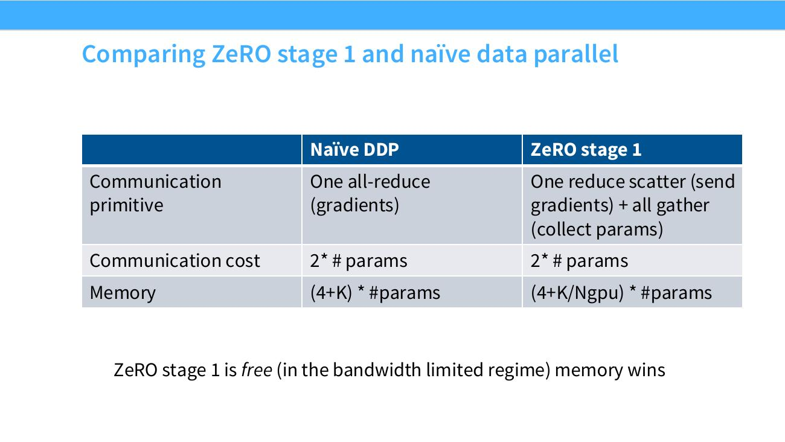{ width="720" }

课件用一张对照表把结论钉死：经典 ring All-Reduce 的实现本来就是"reduce-scatter 阶段传 $\frac{N-1}{N}M$ + all-gather 阶段传 $\frac{N-1}{N}M$，共 $2\frac{N-1}{N}M \approx 2M$"；ZeRO Stage 1 只是把中间状态从"临时缓冲"变成"持久分片"，通信量一项不差。所以 stage 1 是**纯赚**的：内存 $\div 4$（Adam 下），通信不变，语义不变（每步更新的参数与 DDP 逐位一致，只是分布计算）。

### 2.6 ZeRO Stage 2：梯度也分片

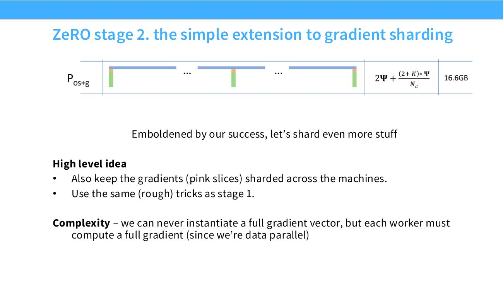{ width="720" }

Stage 2 追问：**梯度为什么还要完整落盘？**观察 Stage 1 的流程：反向传播时每卡先在本地攒出全量梯度（2 字节/参数），然后 Reduce-Scatter 丢掉 $N-1$ 份。如果梯度本来就要被 scatter 走，那干脆**边反向边通信**——某一层梯度一算完，立刻对它做 reduce（确切地说是按桶做 reduce-scatter），每卡只在自己负责的参数分片上保留归约结果。这样梯度内存也从 $2M$ 降到 $2M/N$，每卡合计 $4 + \frac{14}{N}$ 字节/参数。

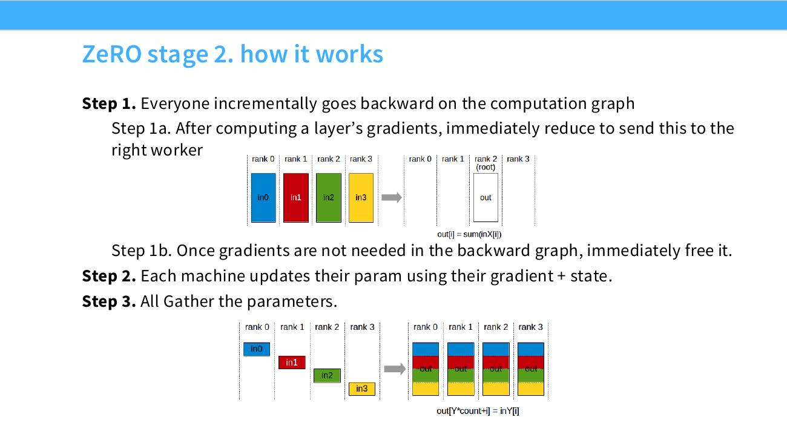{ width="720" }

Stage 2 的执行细节：反向经过每一层时，把该层梯度立即 send 到负责的 rank 上累加（或按 bucket 做 reduce-scatter），算完即释放。通信模式从"一次大 Reduce-Scatter"变成"与反向交错的许多小 Reduce-Scatter"——总量仍是 $M$，但带来两个工程好处：通信可以与反向计算**重叠（overlap）**，隐藏延迟；峰值梯度内存大幅下降（不用等全模型梯度攒齐）。这正是 PyTorch DDP 的 gradient bucketing 与 FSDP 的通信重叠所做的事。Stage 2 之后，稳态内存里只剩"参数 2 字节（fp16）+ 分片的 14/N 字节"。

### 2.7 ZeRO Stage 3：参数也分片（= FSDP）

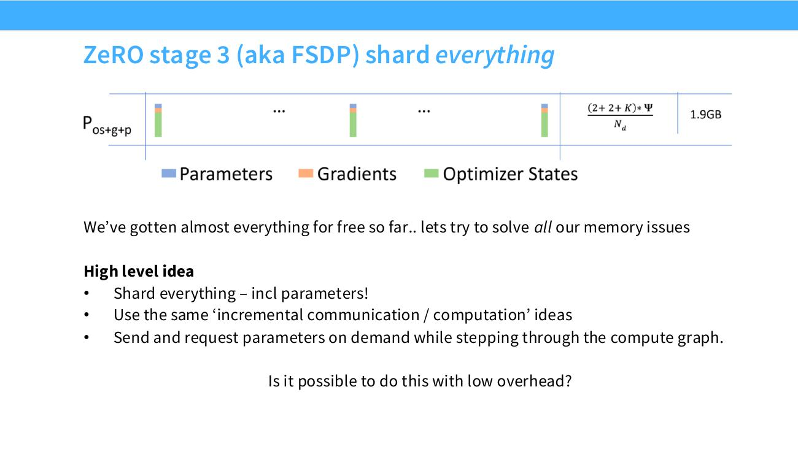{ width="720" }

最后一步：既然优化器状态和梯度都分片了，**参数本身为什么还要全量？**Stage 3 把 fp16 参数也按 rank 切 $N$ 份，每卡只持久保存 $1/N$ 的参数。至此三类状态全部线性分片，达成"线性内存扩展"的目标。PyTorch 的 FSDP（Fully Sharded Data Parallel）就是 ZeRO Stage 3 的实现。

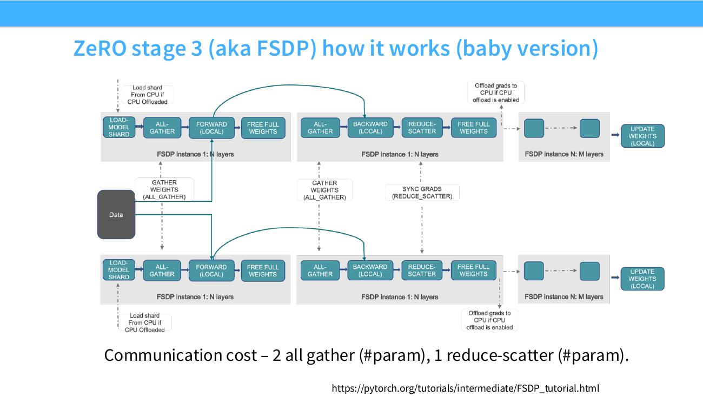{ width="720" }

先理解一个"婴儿版"实现，直观但低效：

- **前向**：轮到计算第 $\ell$ 层时，先 **All-Gather** 该层参数（每卡只存 $1/N$，计算需要全量），用完立即释放/丢弃（scatter）；逐层重复直到 loss；
- **反向**：再次逐层 All-Gather 参数算梯度，梯度算完立即 **Reduce-Scatter** 到负责的 rank；
- **更新**：各 rank 在自己的参数分片上做 Adam 更新（状态本来就分片）。

通信量：前向 All-Gather 全模型参数 $M$；反向再次 All-Gather $M$；梯度 Reduce-Scatter $M$——合计约 $3M$。比 DDP 的 $2M$ 多 50%，换来的是**内存严格线性缩减**（$16/N$ 字节/参数 + 当前计算层的临时全量缓冲）。

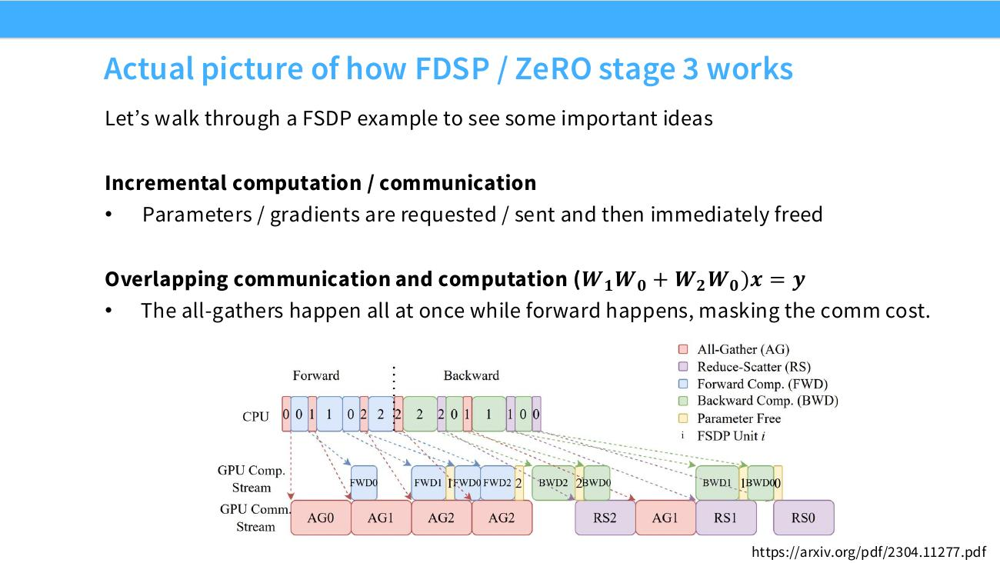{ width="720" }

工业实现（DeepSpeed ZeRO-3 / PyTorch FSDP）比婴儿版聪明得多，核心是**预取（prefetch）与重叠**：算第 $\ell$ 层的同时，后台流提前 All-Gather 第 $\ell+1$ 层的参数；反向时参数 All-Gather 与梯度 Reduce-Scatter 都尽量藏在计算后面。理想情况下有效通信开销趋近于"每步多传约 $1.5\times$ 参数量"，而不是阻塞式的 $3M$。但注意：重叠能否成功取决于**计算/通信比**——每层计算量太小（小模型、小 batch）或带宽太低（跨机慢链路）时，通信藏不住，FSDP 的吞吐就会明显劣化。这就是后面 slide 28–30 要回答的"什么时候 ZeRO-3 够用"。

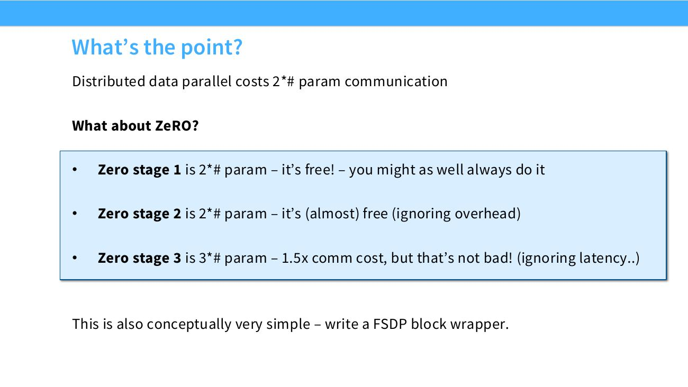{ width="640" }

ZeRO 系列回答了 §1.7 提出的第一个目标：**内存可以随 GPU 数线性扩展**。而通信侧，朴素 DP 每步 $2M$、ZeRO-3 每步约 $3M$ 的梯度/参数流量，只是"数据并行放大 batch"的自然代价——只要梯度通信能被 batch 内的计算摊薄（每卡 batch 足够大），DP 家族的**算力也可以近似线性扩展**。ZeRO 因此成为当代开源训练栈（OLMo、Llama 的 FSDP 配置等）的默认底座。

### 2.8 ZeRO 实践：到底装不装得下？

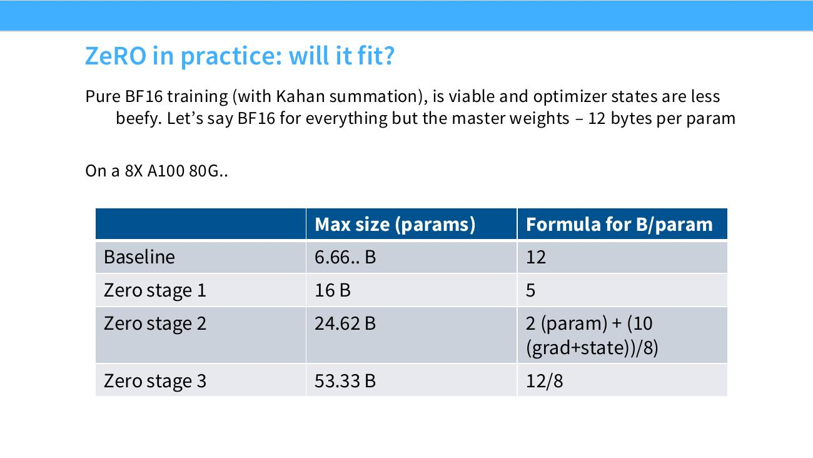{ width="720" }

把账算到具体硬件上（A100 80GB）。模型每参数 16 字节分片到 $N$ 卡后，每卡还要留出激活与临时缓冲的空间。经验结论：ZeRO-3 在 8 卡（单机）时大约能训练到 **13B** 参数；64 卡（8 机）能到 **100B** 量级；512 卡时能到 **1T** 量级——但这里有个重要的"但是"：**激活内存没有分片**（§5 会专门处理），而且上述估算假设大部分激活被重计算/卸载。所以 ZeRO 解决的是"训练状态"的墙，不是全部问题。

### 2.9 数据并行的两个本质局限

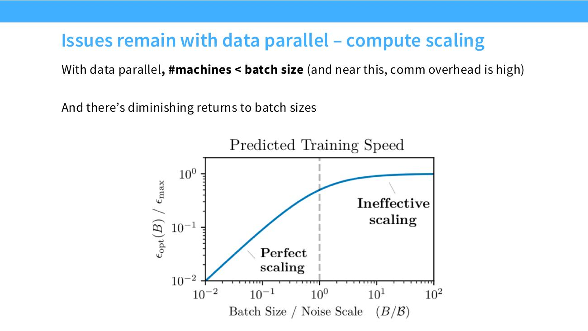{ width="720" }

DP 的第一个本质局限：**算力线性扩展是有条件的**。左图（McCandlish et al. 2018, OpenAI 的 gradient noise scale 工作）：不同任务上，训练能容忍的"critical batch size"（梯度噪声尺度）有限——超过它，继续加 batch 只浪费计算而不加速收敛；图中小模型 critical batch 约 $10^3$–$10^4$ 条。右图（Kaplan et al. 2020 scaling laws）：critical batch size 随模型/训练规模增长（$B_{\text{crit}}$ 与 loss 存在幂律关系），所以**大模型可以配大 batch**——这是 DP 能 scale 到成千上万卡的根本原因。但反之，小模型或小数据任务上 DP 的扩展会提前饱和：batch 加不上去，卡再多也只能空转。

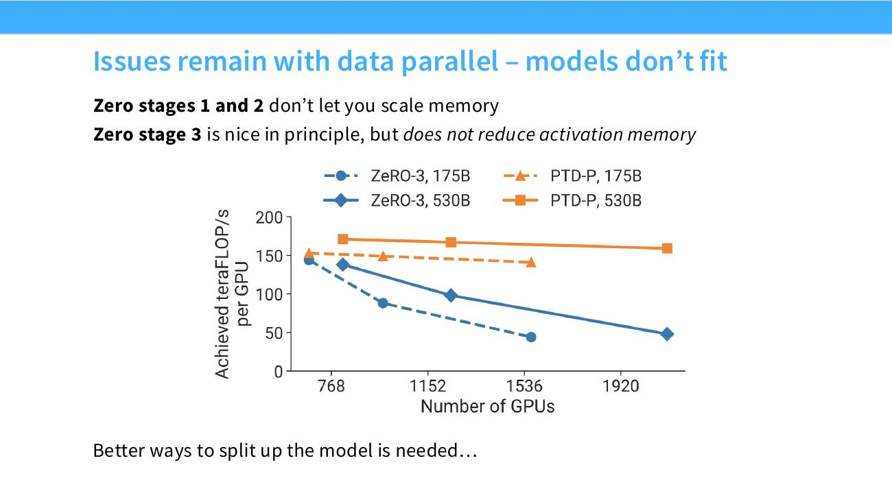{ width="720" }

DP 的第二个本质局限更直接：ZeRO-3 让内存线性分片，但代价是逐层 gather 参数——**每层都要等通信**；当模型大到单层参数都装不下单卡，或者层计算量小到通信完全藏不住时，纯 DP/ZeRO 路线失效。这把我们推向模型并行：**必须切模型本身**。两条切法——沿**深度**切（流水线并行，§3）与沿**宽度**切（张量并行，§4）。

---

## 3. 流水线并行：沿深度切分模型

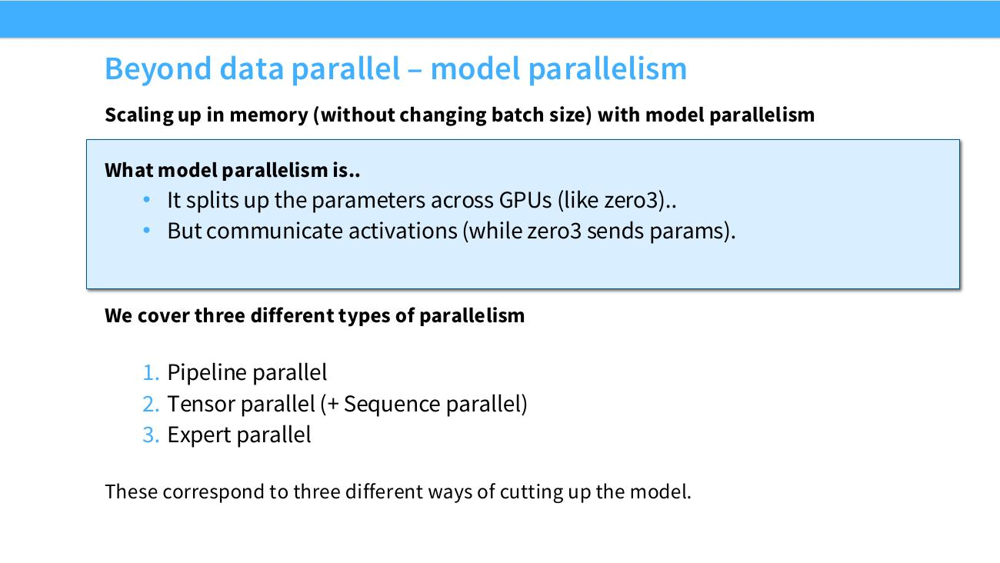{ width="640" }

进入模型并行（model parallelism）：不再复制模型，而是**把模型的不同部分放到不同 GPU 上**。第一个直觉想法是沿层切——Transformer 是层的堆叠，把 $L$ 层均分给 $N$ 张卡，每卡只存 $L/N$ 层的参数与优化器状态，内存直接除以 $N$。

### 3.1 层并行的朴素想法与气泡问题

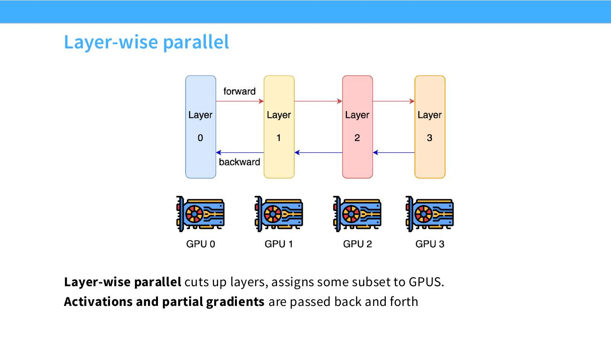{ width="720" }

朴素层并行（layer-wise parallel）的执行：GPU 0 持有第 0–3 层，算完前向 F0 把激活发给 GPU 1；GPU 1 持有第 4–7 层，继续前向……直到最后一层算出 loss；反向时梯度沿链传回（B3、B2、B1、B0）。内存确实被均分了，但看时间轴就会发现致命问题。

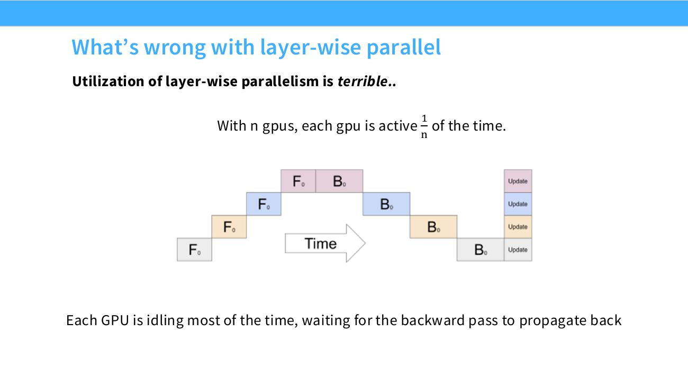{ width="720" }

画出各 GPU 的时间轴：前向阶段 GPU $i$ 只有等 GPU $i-1$ 算完才能开工，反向阶段又要倒序等一遍。任意时刻**只有 1 张卡在计算**，$N$ 卡集群的利用率是 $1/N$——8 卡就是 12.5%。这就是**流水线气泡（pipeline bubble）**的最原始形态：内存省下来了，算力却线性浪费掉，完全违背"线性算力扩展"的目标。

### 3.2 流水线并行：用 micro-batch 填满气泡

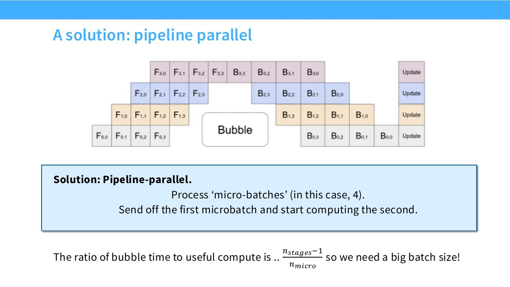{ width="720" }

解决方案（GPipe, Huang et al. 2019）：把一个 batch 切成 $m$ 个 **micro-batch**，像流水线一样逐个注入。GPU 0 算完 micro-batch 0 的前向 $F_{0,0}$ 立即把激活发给 GPU 1，同时开始算 $F_{0,1}$；GPU 1 收到 $F_{0,0}$ 的输出后与 GPU 0 **并行**工作。稳定阶段所有卡都在忙，只有流水线的"注水"（warmup）和"排水"（drain）阶段存在空闲——图中中间那段所有卡共同闲置的区域就是气泡。

定量推导：设每个 micro-batch 在单个 stage 上的前向耗时为 $t_f$、反向为 $t_b$（通常 $t_b \approx 2 t_f$）。$p$ 个 stage、$m$ 个 micro-batch 时，总耗时

$$
T = \underbrace{(p-1)(t_f + t_b)}_{\text{注水+排水（气泡）}} + \underbrace{m(t_f + t_b)}_{\text{稳态流水}}
$$

气泡占比

$$
\text{bubble fraction} = \frac{p-1}{m + p - 1} \approx \frac{p-1}{m} \quad (m \gg p)
$$

结论：**气泡比例由 stage 数与 micro-batch 数之比决定**。要把气泡压到 10% 以下，需要 $m \gtrsim 10(p-1)$——这就是为什么流水线并行"需要大 batch"：全局 batch 必须能切出足够多的 micro-batch。梯度语义上，$m$ 个 micro-batch 的梯度累加等价于一个大 batch（配合梯度累积），不改变优化轨迹。

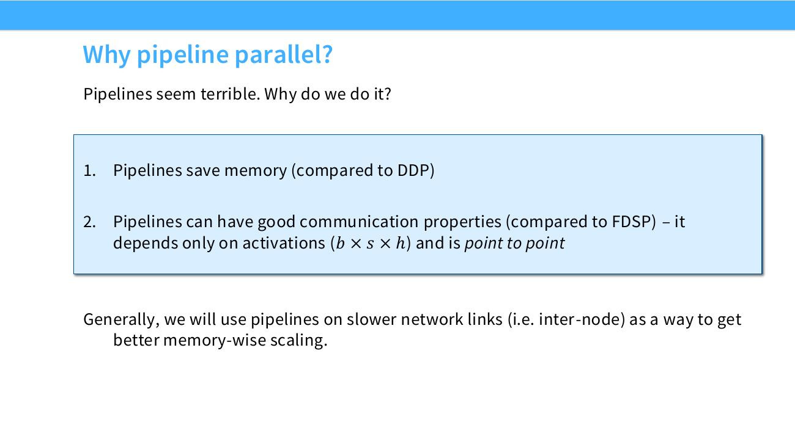{ width="640" }

既然有气泡，流水线为什么仍然重要？两个理由：

1. **省内存（vs DDP）**：参数/梯度/优化器状态按 stage 切分，每卡 $1/p$，这是 DDP 做不到的；
2. **通信性质好（vs FSDP/TP）**：stage 之间只传**激活**——每个 micro-batch 边界上是 $b_{\text{micro}} \times s \times h$ 大小的张量（$b$=micro-batch、$s$=序列长、$h$=hidden），且是**点到点**通信（相邻 stage 一对一），不需要 All-Reduce 式的集合通信，也**不需要全局同步**。

通信量与参数量**无关**（不像 FSDP 每步要 gather 全部参数），只与激活大小和 micro-batch 数有关。因此流水线并行通常被放在**慢速机间链路**上：跨机器的通信切成"激活大小 × micro-batch 数"的点到点小包，对带宽和拓扑最不敏感。这就是"内存扩展走 PP、跨机走 PP"规则的来源。

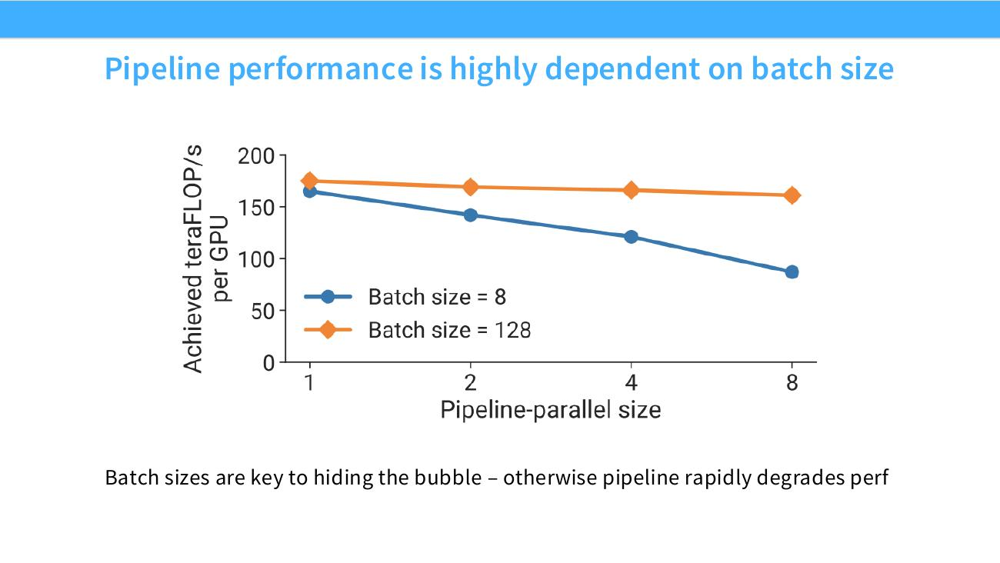{ width="720" }

实验验证气泡公式（Narayanan et al. 2021，Megatron-LM PTD-P 论文）：固定 GPU 总数，改变流水线深度 $p$，看每卡吞吐。batch=8 时，$p$ 从 1 涨到 8，每卡吞吐从约 165 掉到 90 teraFLOP/s——气泡比 $(p-1)/m$ 随 $p$ 线性恶化；batch=128 时曲线几乎是平的（约 175 → 160）——micro-batch 足够多，气泡被摊薄。**batch 是隐藏气泡的关键变量**，这与上页的公式精确对应。

### 3.3 进阶调度：Interleaved 1F1B 与 Zero-Bubble

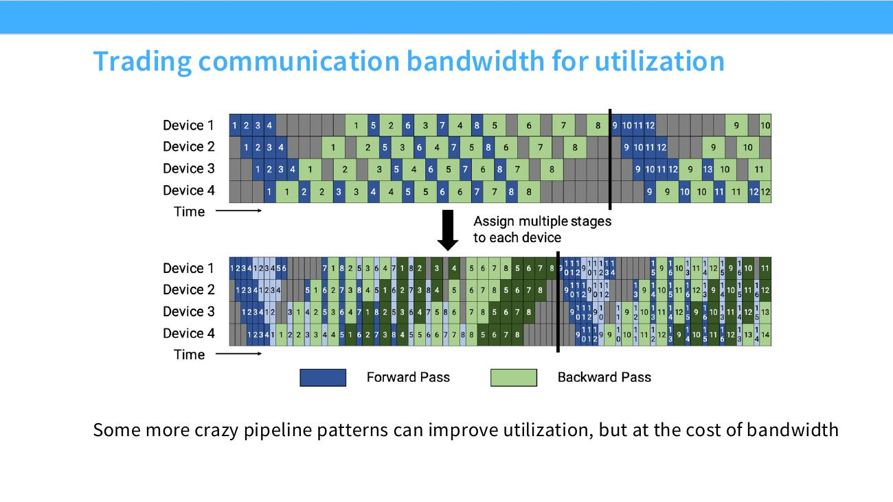{ width="720" }

气泡公式里 $p$ 是"流水线上的 stage 数"。**Interleaved（交错式）调度**（Megatron 的 virtual pipeline）的思路：让每张物理 GPU 负责**多个不连续的 stage 切片**（例如 GPU 1 负责 layer 0–1 和 layer 8–9），相当于把流水线切成更多、更细的虚拟 stage。效果：每个 micro-batch 在每卡上的连续工作变短，注水/排水期的空档被切小，气泡显著缩小——代价是 stage 边界数量翻倍，**激活通信量翻倍**（更多的跨卡发送），即"用带宽换利用率"。图中还标出了另一种经典调度 **1F1B**（one-forward-one-backward）：稳态阶段每张卡交替执行一个前向和一个反向，使"在途 micro-batch"数量最少，从而压低了流水线所需的激活缓存——这是工程上默认的稳态调度。

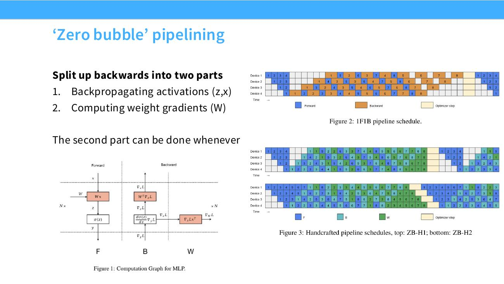{ width="720" }

更激进的想法（Zero Bubble Pipeline, Qi et al. 2023）：把反向传播**拆成两种数学上不同的计算**——对 MLP $z = Wx$ 而言，反向需要

$$
\underbrace{\frac{\partial L}{\partial x} = W^\top \frac{\partial L}{\partial z}}_{\text{B：反传激活梯度（必须沿链序进行）}} \qquad \underbrace{\frac{\partial L}{\partial W} = \frac{\partial L}{\partial z} x^\top}_{\text{W：计算权重梯度（可以延后）}}
$$

关键观察：**B 部分必须按层序串行**（它产生传给上一层的梯度），但 **W 部分只依赖本层的输入 $x$ 和上游梯度，可以在之后的任意时刻计算**。于是调度器可以用 W 任务去填充流水线的气泡空档：图 2 的 1F1B 调度里插入青色 W 块，图 3 给出手工构造的 ZB-H1、ZB-H2 调度，把气泡压到接近零——代价是调度复杂度与峰值内存（$x$ 要存到 W 被执行为止）上升。这类"把计算拆细再重排"的思路是现代流水线调度（ZeroBubble、Chimera、Hanayo 等）的共同主题。

---

## 4. 张量并行：沿宽度切分矩阵乘

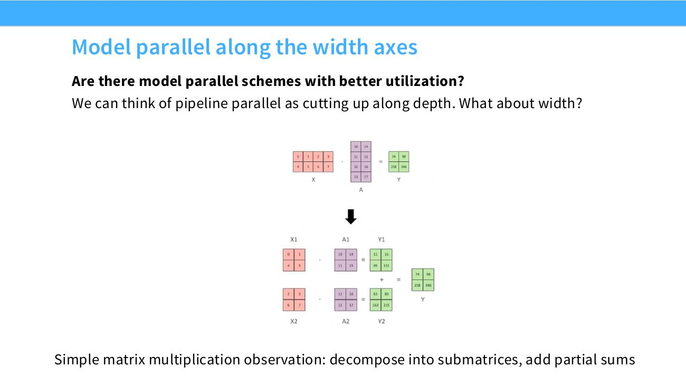{ width="720" }

流水线沿**深度**切模型，张量并行（tensor parallelism, TP）沿**宽度**切。理论基础是矩阵乘法的分块性：$Y = XA$，把 $A$ 按列切成 $A = [A_1, A_2]$，则

$$
Y = X[A_1, A_2] = [XA_1, XA_2] = [Y_1, Y_2]
$$

两个子矩阵乘可以完全独立地在两张卡上计算，结果按列拼接即可。反过来按行切 $A = \begin{bmatrix} A_1 \\ A_2 \end{bmatrix}$（同时把 $X$ 按列切 $[X_1, X_2]$），则

$$
Y = [X_1, X_2]\begin{bmatrix} A_1 \\ A_2 \end{bmatrix} = X_1 A_1 + X_2 A_2
$$

即**部分和分解**：各卡独立算部分积，最后相加。整个 Megatron 张量并行就是这两种切法的组合艺术。

### 4.1 Megatron 的切法：列切 + 行切 + $f$/$g$ 算子

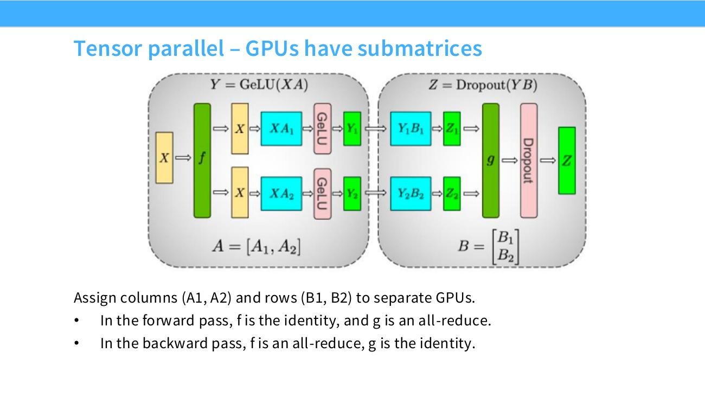{ width="720" }

把一个 MLP（$Y = \text{GeLU}(XA)$，$Z = \text{Dropout}(YB)$）切到两张卡上（Megatron-LM, Shoeybi et al. 2019）：

- **第一层 $A$ 按列切**：$A = [A_1, A_2]$，各卡算 $Y_i = \text{GeLU}(XA_i)$。GeLU 是逐元素算子，可以直接作用在切出来的列块上——**无需通信**；
- **第二层 $B$ 按行切**：$B = \begin{bmatrix} B_1 \\ B_2 \end{bmatrix}$，各卡算部分和 $Z_i = Y_i B_i$，然后**一次 All-Reduce** 求和得到 $Z$——整个 MLP 只需要这一次通信。

通信被两个共轭算子封装：**$f$** 在前向是恒等（各卡拿同样的 $X$ 就行）、反向是 All-Reduce（$X$ 的梯度来自两个分支之和）；**$g$** 在前向是 All-Reduce（部分和求和）、反向是恒等。借助这一对算子，反向传播在切分后的图上**自动正确**，无需手写分布式反向。

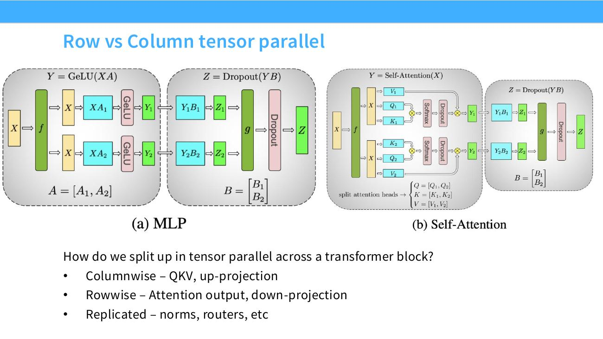{ width="720" }

推广到完整 Transformer 层：

- **列切（column-wise）**：$W_Q, W_K, W_V$（注意力按头切——每个 head 的 Q/K/V 天然独立，正好均分到各卡）和 MLP 第一层（up projection）；
- **行切（row-wise）**：注意力输出投影 $W_O$ 和 MLP 第二层（down projection）——它们的输入正好是前一步列切出来的分片；
- **复制（replicated）**：LayerNorm、残差加、Dropout 等逐元素/归约算子不切，各卡各算一份。

图 (a) MLP：$X \xrightarrow{f} [A_1, A_2]$（列切）$\to \text{GeLU} \to [B_1; B_2]$（行切）$\xrightarrow{g} Z$；图 (b) Self-Attention：Q/K/V 按头切分后各卡独立完成 softmax($QK^\top$)V 的注意力计算，输出经 $W_O$ 行切后 $g$ 归约。**每个注意力块 + MLP 块各需 2 次 All-Reduce（前向 $g$ 处）**，反向再来 2 次（$f$ 处）——每层 4 次集合通信，这是 TP 的通信指纹。

### 4.2 张量并行的适用边界与通信量分析

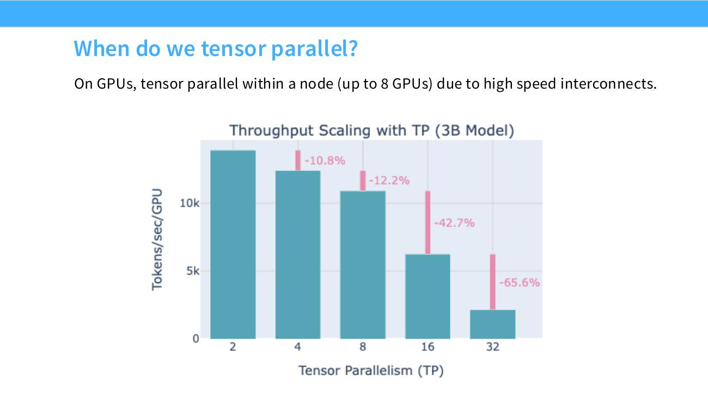{ width="720" }

TP 的通信是**每层 4 次激活大小的 All-Reduce**，频率极高，必须放在最高带宽的互连上。实验（Korthikanti et al. 2022，3B 模型）：TP=2 时每卡约 13.5k tokens/s；TP=4 仅降 10.8%、TP=8 降 12.2%（都在单机 NVLink 域内，代价可接受）；TP=16 暴跌 42.7%、TP=32 暴跌 65.6%（通信溢出到机间网络，All-Reduce 延迟主导）。经验规则由此而来：**TP 限制在单机 8 卡的 NVLink/NVSwitch 域内**。

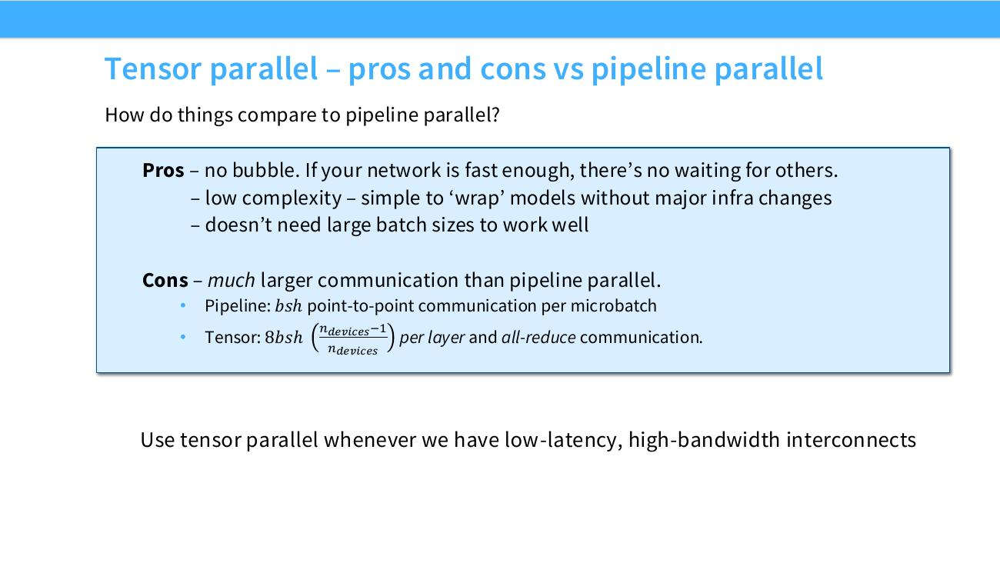{ width="720" }

TP vs PP 的对照：

- **TP 的优点**：没有气泡（所有卡永远同时工作）；实现简单（对线性层包一层即可，Megatron 的 `ColumnParallelLinear`/`RowParallelLinear`）；不需要大 batch 来摊薄气泡。
- **TP 的缺点**：通信量大得多。每个 micro-batch，PP 只在 stage 边界传 $bsh$ 的激活（点到点）；TP 每层要传 $8bsh \times \frac{n-1}{n}$ 的 All-Reduce 流量（前向 2 次 + 反向 2 次，每次 All-Reduce 收+发各 2 个方向），且是**阻塞式集合通信**。

定量结论：TP 的通信频率是 PP 的 $\mathcal{O}(L)$ 倍（$L$ 为层数），所以 TP 只能活在**低延迟、高带宽**的互连域内（NVLink，约 600–900 GB/s）；PP 的稀疏点到点通信才能跨机（InfiniBand，约 25–50 GB/s）。§9 的组合规则直接从这条通信层级推出。

---

## 5. 激活内存与序列并行

### 5.1 内存不只是参数：被忽视的激活内存

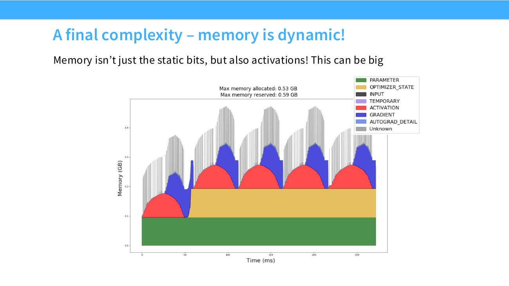{ width="720" }

到目前为止我们只算了"静态"状态（参数、梯度、优化器状态）。真实的显存是**动态**的：这张 PyTorch memory timeline 里，绿色的 PARAMETER 段是基线（恒定），黄色 OPTIMIZER_STATE 在首次 step 后恒定，蓝色的 GRADIENT 周期性升降，而**红色的 ACTIVATION 在每个 step 内剧烈起伏**——前向一路堆高，反向逐渐释放，灰色 Unknown 段（临时缓冲、cudnn workspace、碎片化）进一步推高峰值。峰值显存（max allocated 0.53GB vs 参数基线 0.1GB 的 5 倍多）由激活主导。**并行策略只切参数是不够的，激活才是 OOM 的第一现场。**

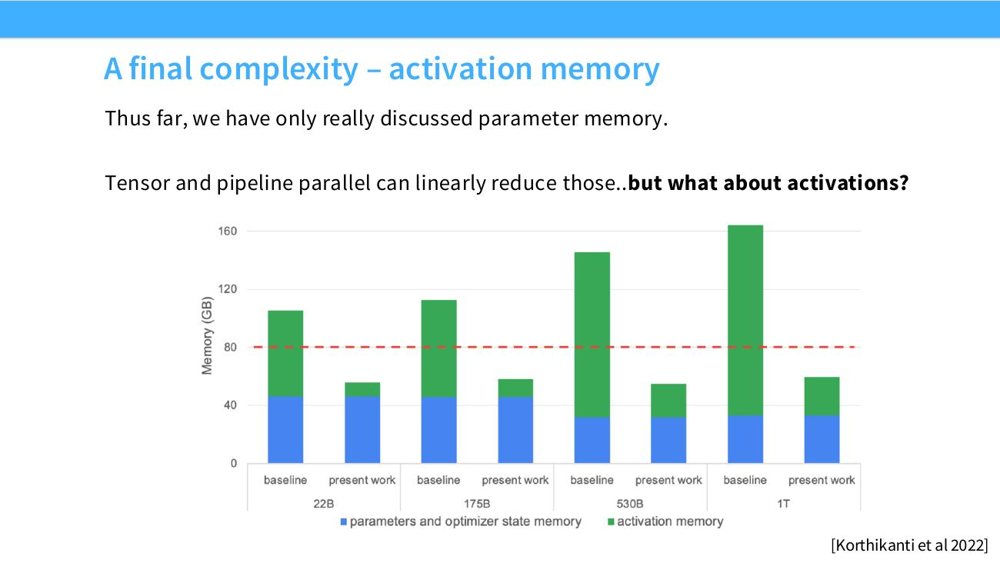{ width="720" }

Korthikanti et al. 2022（"Reducing Activation Recomputation in Large Transformer Models"，即 Megatron 序列并行论文）的实测：22B / 175B / 530B / 1T 四个规模，柱子按"参数+优化器状态"（蓝）与"激活"（绿）分解。基线配置（baseline，只开全部重计算）下激活内存占比随规模迅速膨胀——1T 模型时激活是参数状态的数倍；本文工作（present work）通过选择性重计算 + 序列并行把绿色部分压掉一个数量级，使 80GB（虚线）内可训。**激活内存必须与参数一样"随卡数线性缩减"**，否则模型一大就撞上激活墙。

### 5.2 激活内存的解剖：每层 $34 + 5\frac{as}{h}$

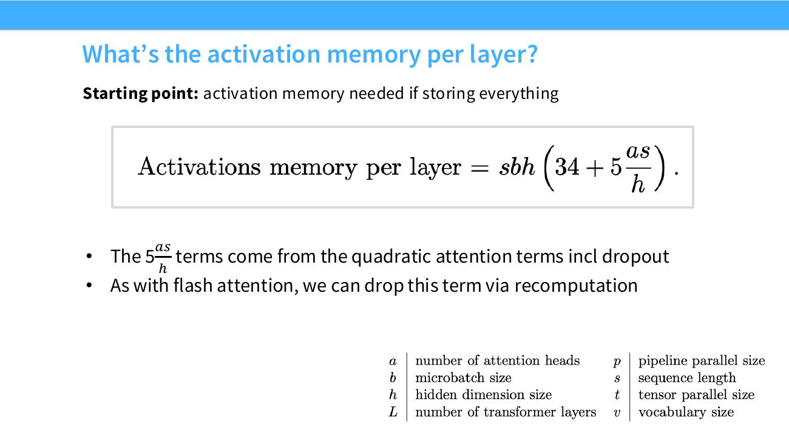{ width="720" }

逐算子数一遍 Transformer 层需要为反向保存的激活（字节），记号：$s$=序列长、$b$=micro-batch 大小、$h$=hidden 维、$a$=注意力头数、$t$=张量并行度、$L$=层数、$v$=词表，按 16 位精度（2 字节/元素）计：

**注意力块**：
- QKV 线性输入：$2sbh$；Q/K/V 输出：$3 \times 2sbh$
- $QK^\top$ 的输入（Q、K 各存一份）：$2 \times 2sbh$
- softmax 输出（含 fp32 上转型）：$3as^2b$（$2as^2b$ fp32 + 梯度回传）
- softmax dropout mask：$as^2b$
- 注意力输出 $V$ 加权：$2as^2b + 2sbh$；输出线性输入：$2sbh$
- 输出 dropout mask：$sbh$

**MLP 块**（hidden $4h$）：
- 两个线性层输入：$2sbh + 8sbh$；GeLU 输入：$8sbh$；dropout mask：$sbh$

**两个 LayerNorm**：各 $2sbh$，共 $4sbh$。

合计（含 mask 的 1 字节项）：

$$
\text{激活/层} = sbh\left(34 + 5\frac{as}{h}\right)
$$

注意第二项：$5\frac{as}{h}$ 来自注意力分数矩阵（$s^2$ 项）——**它随序列长度 $s$ 二次增长**。长序列训练时这一项会主导激活内存；FlashAttention 不存注意力矩阵、反向时重算，正是把这一项从内存里抹掉（转化为计算）。

### 5.3 张量并行下的激活：还有 $10sbh$ 切不掉

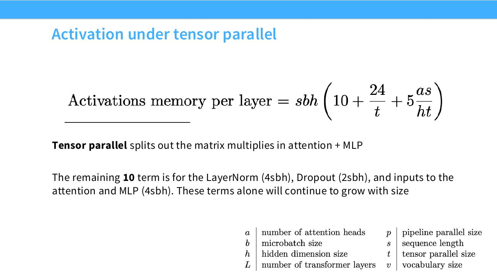{ width="720" }

TP 对激活的缩减是不完全的。代入 TP=$t$ 的切法：QKV、注意力内部、MLP 中间维度都被切分（这些项除以 $t$），但**列切线性层的输入 $X$、LayerNorm、Dropout、残差流**在各卡上是完整复制的（$f$ 算子前向是恒等）：

$$
\text{激活/层（TP）} = sbh\left(10 + \frac{24}{t} + 5\frac{as}{ht}\right)
$$

剩下的 $10sbh$ 是：两个 LayerNorm（$4sbh$）、两个 Dropout 的 mask 区（$2sbh$）、注意力与 MLP 的列切层输入（$4sbh$）。这些算子有个共同点：**它们沿序列轴逐位置（pointwise over sequence）作用**——每个 token 位置上的计算不依赖其他位置。这个观察直接引出下一页。

### 5.4 序列并行：沿序列轴切掉剩余项

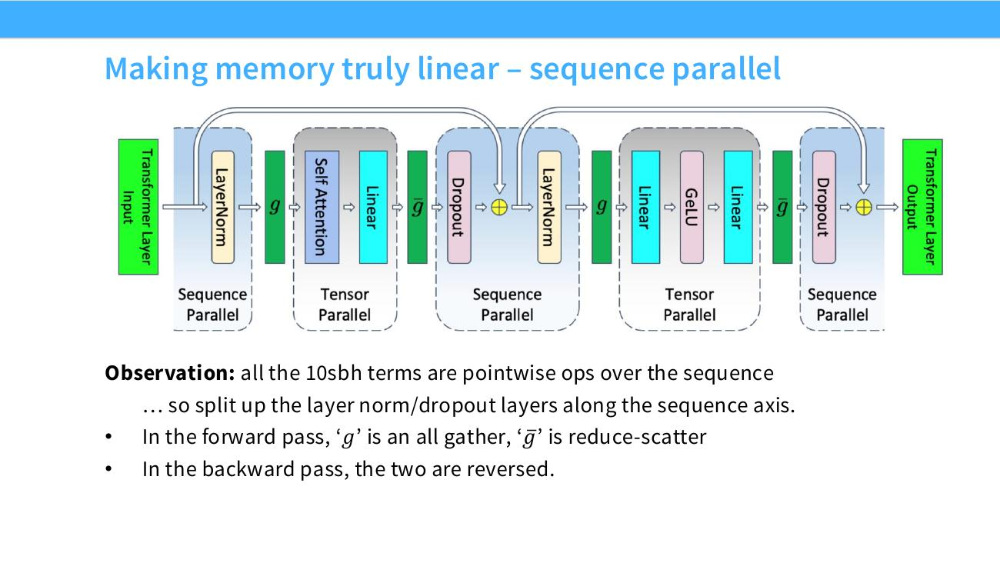{ width="720" }

序列并行（Sequence Parallelism, SP；Korthikanti et al. 2022）：既然 LayerNorm/Dropout/残差是逐 token 的，就把它们沿**序列维**切到 $t$ 张卡上（每卡负责 $s/t$ 个 token），与 TP 共用同一组 GPU——TP 切宽度（hidden/头维），SP 切序列，二者正交互补。代价是通信算子要换：进入"SP 区"时各卡只有序列的一段，但列切线性层需要完整输入——所以 $g$ 从 All-Reduce 变成 **All-Gather**（拼回全序列）；离开"SP 区"回到序列分片时用 **Reduce-Scatter**（$\bar{g}$）。前向 $g$=All-Gather / $\bar{g}$=Reduce-Scatter，反向恰好对偶。总通信量与 TP 的 All-Reduce **逐字节相同**（All-Reduce = RS+AG，这里只是把两步拆到层的两端），所以 SP 是**零额外通信**换 $10sbh/t$ 的内存。

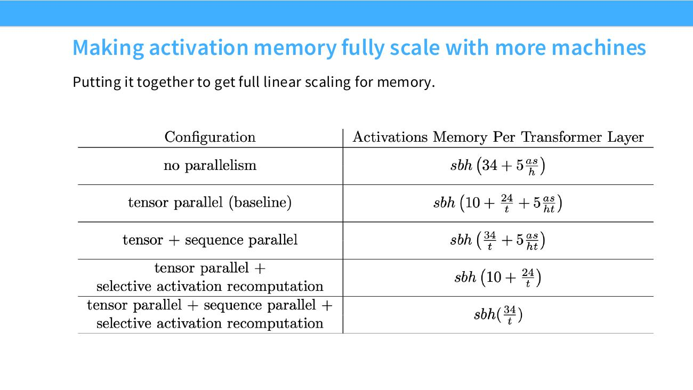{ width="720" }

把各项技术组合后的总账（每层激活内存）：

| 配置 | 激活/层 |
|---|---|
| 无并行 | $sbh\left(34 + 5\frac{as}{h}\right)$ |
| TP（基线） | $sbh\left(10 + \frac{24}{t} + 5\frac{as}{ht}\right)$ |
| TP + SP | $sbh\left(\frac{34}{t} + 5\frac{as}{ht}\right)$ |
| TP + 选择性重计算 | $sbh\left(10 + \frac{24}{t}\right)$ |
| TP + SP + 选择性重计算 | $sbh\left(\frac{34}{t}\right)$ |

**选择性激活重计算**（selective activation recomputation）：只对"内存大、重算便宜"的部分（softmax 前后的 $as^2$ 项）不存激活、反向时重算，把 $5\frac{as}{h}$ 项抹掉——这比全量重计算（连线性层输出都重算，约多 30% 计算）划算得多。最终形态 $\frac{34}{t}sbh$：**激活内存与张量并行组大小成完美反比**，激活墙正式拆除。这就是当代长序列大模型训练的标配组合。

---

## 6. 专家并行：MoE 的并行维度

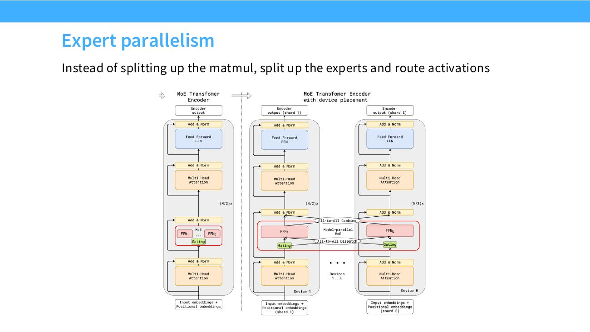{ width="720" }

混合专家模型（MoE）把 Transformer 的部分 FFN 层换成 $E$ 个专家 FFN + 一个门控（gating）网络：每个 token 被门控路由到 top-$k$ 个专家。**专家并行（Expert Parallelism, EP）**（源自 GShard/Switch 的系统设计）给 MoE 一个天然的并行轴：不再切矩阵乘，而是**把 $E$ 个专家分配到 $E$ 张卡上，改切"激活的去向"**。

数据流（对照图中 Device 1 … Device E）：每卡先对自己的数据分片（shard）算完注意力部分；进入 MoE 层时，各卡的 gating 网络决定每个 token 去哪个专家；然后一次 **All-to-All Dispatch** 把 token 按目标专家重新洗牌到对应卡上；各卡对自己的专家做本地 FFN（每个专家只处理路由给它的 token）；最后一次 **All-to-All Combine** 把结果按原 token 位置发回并加权合并。除 MoE 层外，其余层等价于普通数据并行。

### 6.1 为什么优先 EP 而不是对 MoE 用 TP

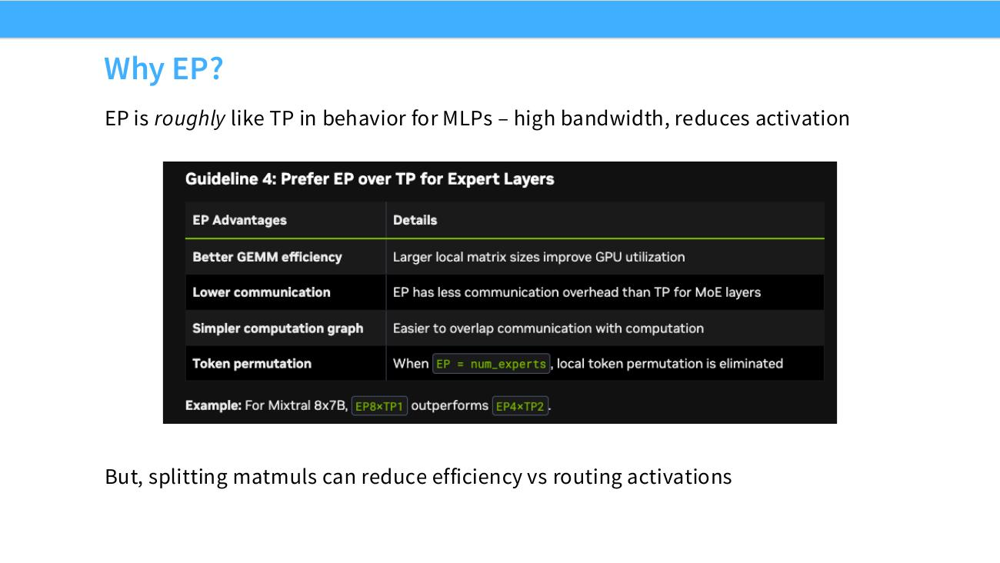{ width="720" }

EP 在行为上"大致像 MLP 的 TP"——高带宽需求、降低每卡激活——但对专家层它比 TP 更合适（Megatron 的 Guideline 4："Prefer EP over TP for Expert Layers"）：

- **更好的 GEMM 效率**：EP 让每个专家在自己的卡上做完整矩阵乘（本地矩阵尺寸大）；TP 会把每个专家的矩阵再切碎，小 GEMM 的 GPU 利用率显著下降——**切矩阵乘会降低效率，路由激活则不会**；
- **更低的通信**：MoE 层用 TP 需要每层多次 All-Reduce；EP 只需要层边界两次 All-to-All；
- **更简单的计算图**：通信只在 MoE 层进出两处，更容易与计算重叠（DeepSeek-V3 的 1F1B A2A overlap）；
- **token 重排开销可消除**：当 EP 数等于专家数（EP = num_experts）时本地无需再做 token permutation。实例：Mixtral 8×7B 上 EP8×TP1 优于 EP4×TP2。

### 6.2 EP 与其他维度的组合复杂度

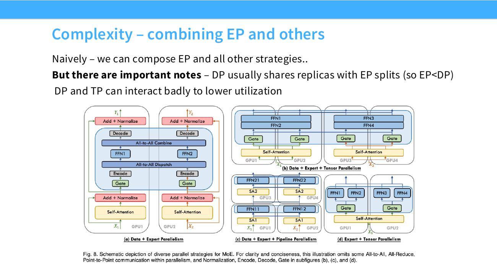{ width="720" }

朴素地，EP 可以与 DP/TP/PP 任意组合（图中 (a) Data+Expert、(b) Data+Expert+Tensor、(c) Data+Expert+Pipeline、(d) Expert+Tensor），但有两条重要的相互作用：

1. **DP 与 EP 通常共享副本维度**：实践中 EP 组是从 DP 组里"借"出来的（同一批卡既分数据又分专家），所以有效 EP 度 ≤ DP 度（EP < DP）；
2. **DP 与 TP 叠加在 MoE 上可能严重拉低利用率**：专家被路由的 token 数天然不均（负载倾斜），再叠加 TP 的切分会让每张卡上的 GEMM 又小又不均，气泡式空转增多。

### 6.3 注意力与专家的解耦：MoE Parallel Folding

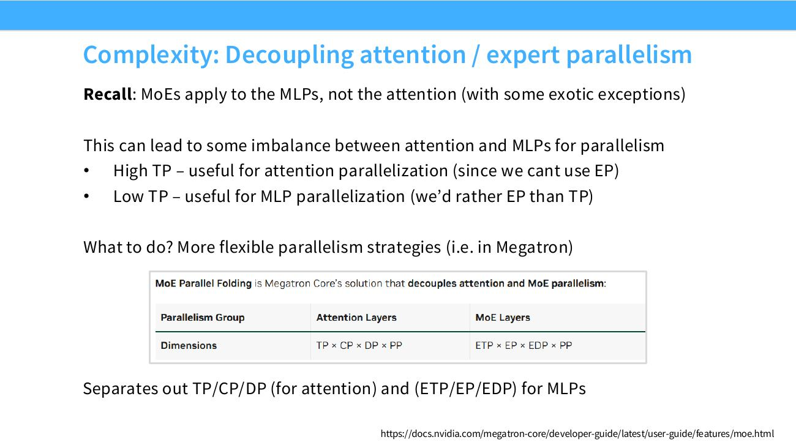{ width="720" }

一个结构性矛盾：MoE 只作用于 **MLP**，注意力仍然是稠密的（除个别 exotic 设计外）。于是并行需求出现错配——**注意力想要高 TP**（它没有 EP 可用，TP 是唯一的宽度切分手段），**MLP 想要低 TP**（专家层宁可用 EP 也不用 TP，见 §6.1）。解决方案是给两类层**各自独立的并行配置**（Megatron 的 MoE Parallel Folding）：注意力层走 TP × CP × DP × PP，MoE 层走 ETP × EP × EDP × PP（ETP = expert 层的 TP、EDP = expert 层的 DP），两组维度独立选择、层间自动重排数据。这代表了并行设计的最新形态：**不再追求全局统一的并行度，而是按算子类型定制并行轴**。

### 6.4 工程补充：DeepEP——把 EP 的 all-to-all 做"对"有多难

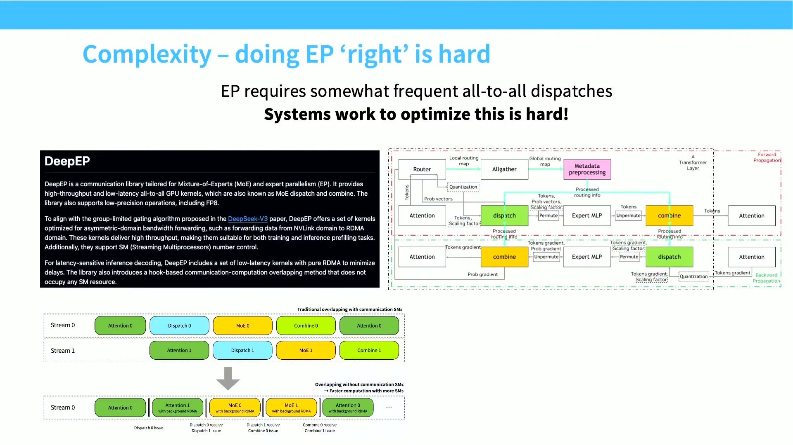{ width="760" }

EP 的概念很简单（两次 all-to-all），但**把 all-to-all 做快是一门独立的系统工程**。DeepSeek 开源的 DeepEP 库展示了其中的设计深度：

- **专用 dispatch/combine kernel**：高吞吐、低延迟的 all-to-all GPU kernel，支持 FP8 等低精度传输（token 激活先量化再发，带宽直接减半/再减半）；
- **非对称域带宽转发**：配合 DeepSeek-V3 的 group-limited gating，区分 NVLink 域内流量与 RDMA 域间流量，分别优化——这正是"EP 跨出 NVLink 域"（§9.2 Guideline 2 的例外条款）在 kernel 层的实现；
- **免 SM 占用的通信计算重叠**：传统重叠要用专门的 SM 跑通信 kernel（图上：Stream 0/1 交错执行 Attention/Dispatch/MoE/Combine，通信 kernel 与计算 kernel 抢 SM）；DeepEP 用 hook-based 方法让 RDMA 在后台进行，**不占用任何 SM**——Attention 1 的计算带着 background RDMA 同时跑，计算流因此可以用满全部 SM、更宽的 GEMM（图下：dispatch/combine 的 issue/receive 完全沉入计算时间线）。这也是它支持 SM 数量控制（SM number control）的原因：留给通信的 SM 是显式预算。

读法：§6.1 说"EP 通信比 TP 少"，但少不等于便宜——all-to-all 是不规则流量（§1.5 引用的 Dally/Dean 对谈），在 mesh 拓扑上是多跳、在交换网络上怕拥塞，且每个 MoE 层都要发生两次。DeepEP 的存在本身就是证据：**EP 是当今并行维度里工程难度最高的一个**（§9.4 总览表的"EP can be big (but hard!)"），也是推理侧 MoE  Prefill/Decoding 延迟优化的主战场。

---

## 7. 上下文并行与 Ring Attention

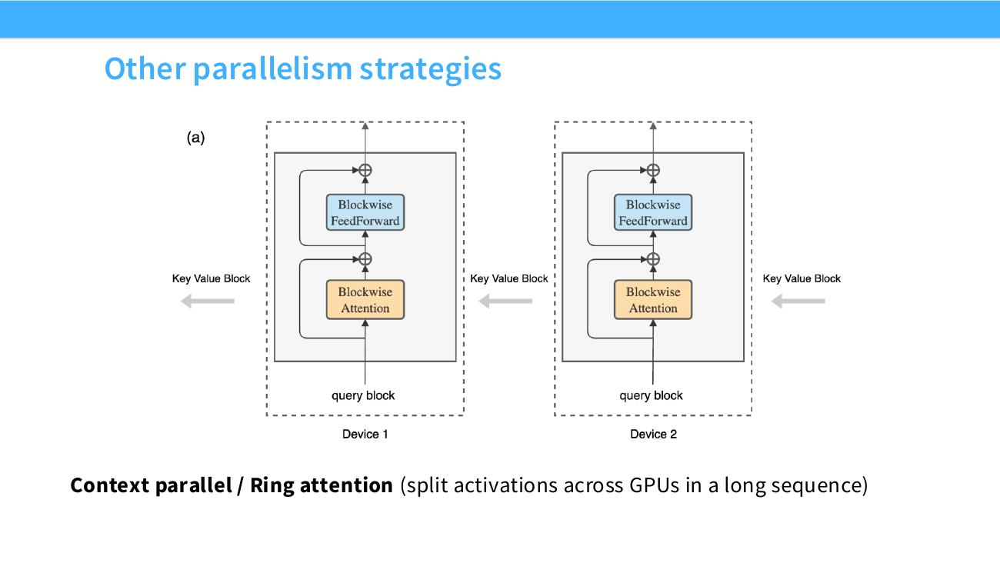{ width="720" }

序列并行（§5.4）切的是 LayerNorm/Dropout 等逐 token 算子——但**注意力不是逐 token 的**：每个 query 要看到所有 key/value，序列维上存在全局依赖，不能简单地各卡算各段。**上下文并行（Context Parallelism, CP）/ Ring Attention**（Liu et al. 2023）解决的就是这个问题：把长序列沿序列维切到 $c$ 张卡上（每卡持有 $s/c$ 个 token 的 Q/K/V），注意力通过**环形传递 KV 块**完成。

执行过程（对照图中 Device 1、2 的流水线）：每张卡固定持有自己的 query 块与初始 KV 块；第 $k$ 步，各卡用当前 KV 块对自己的 query 块做 **blockwise attention**（在线 softmax 累积，FlashAttention 风格的分块归并：维护 running max $m$、归一化因子 $\ell$ 与部分输出 $O$，新块到来时按 $\text{softmax}$ 重缩放合并），同时把 KV 块发给环上下一张卡、接收上一张卡传来的新 KV 块；$c$ 步后每个 query 块都见过全部 KV，注意力精确完成。FFN、LayerNorm 等逐 token 算子则直接各算各段（blockwise feedforward）。

关键性质：**通信（KV 块的环形传递）与计算（当前块的注意力）可以重叠**——只要每块注意力的计算时间超过 KV 块的传输时间，CP 的通信就是免费的；且内存中每卡只存 $s/c$ 的 KV 与激活，序列长度可以随卡数线性扩展（百万 token 级训练靠它）。因果注意力的负载不均（前面的 query 块要 attend 的 KV 少）通过对称的"zigzag"切分或双环调度来平衡。CP 与 TP 的关系：两者都切激活不切参数，CP 切序列维、TP 切宽度维，可以叠加（Llama 3 长上下文阶段 TP8×CP16，见 §9）；与 SP 的区别在于 SP 只处理逐 token 区段、CP 处理注意力本身。CP 的通信是**激活/KV 大小、沿环点对点**，对带宽的要求介于 TP 与 PP 之间——这就是为什么它通常被放在"机内+近机间"的第二级网络上（§9 的 [TP, CP, PP, DP] 层级）。

---

## 8. 并行方式对比总结

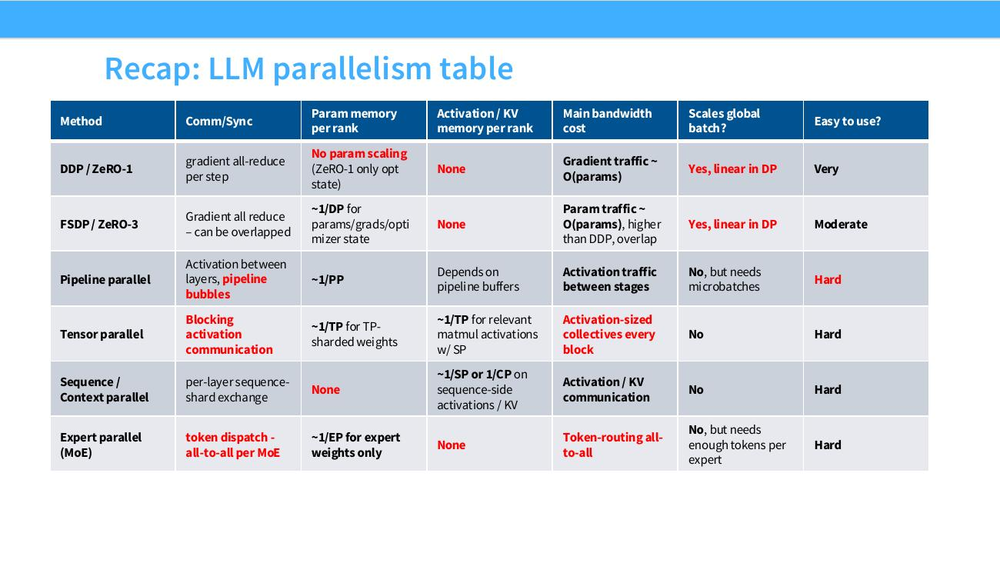{ width="760" }

全讲核心知识浓缩为一表（按本讲顺序重排）：

| 方法 | 通信/同步 | 每 rank 参数内存 | 每 rank 激活/KV 内存 | 主要带宽开销 | 扩展全局 batch？ | 易用性 |
|---|---|---|---|---|---|---|
| **DDP / ZeRO-1** | 每步梯度 all-reduce（ZeRO-1 为 RS+AG） | **不切参数**（ZeRO-1 仅切优化器状态） | 不切 | 梯度流量 $\sim \mathcal{O}(\text{params})$ | **是，随 DP 线性** | 非常容易 |
| **FSDP / ZeRO-3** | 梯度归约 + 逐层参数 gather，可重叠 | **$\sim 1/\text{DP}$**（参数/梯度/优化器状态全切） | 不切 | 参数流量 $\sim \mathcal{O}(\text{params})$，高于 DDP，靠重叠隐藏 | **是，随 DP 线性** | 中等 |
| **流水线 PP** | stage 间激活传递；**流水线气泡** | $\sim 1/\text{PP}$ | 取决于流水线缓冲（在途 micro-batch 数） | stage 间激活流量 | 否，且**需要足够多 micro-batch** | 难 |
| **张量 TP** | **每层 4 次阻塞式激活集合通信** | TP 切分权重 $\sim 1/\text{TP}$ | 相关 matmul 激活 $\sim 1/\text{TP}$（配 SP） | **每层激活大小的集合通信** | 否 | 难 |
| **序列/上下文 SP·CP** | 逐层序列分片交换（SP）/ 环状 KV 传递（CP） | 不切 | 序列侧激活/KV $\sim 1/\text{SP}$ 或 $1/\text{CP}$ | 激活/KV 通信 | 否 | 难 |
| **专家 EP (MoE)** | **每个 MoE 层 token 路由 all-to-all** | 专家权重 $\sim 1/\text{EP}$ | 不切 | token 路由 all-to-all | 否，且**需要每专家足够 token** | 难 |

读表的方式：先问"内存墙在哪"——参数状态装不下走 ZeRO/FSDP/PP/TP，激活装不下走 SP/CP/重计算，专家权重装不下走 EP；再问"通信预算在哪层网络"——梯度归约最耐延迟放最外，TP 集合通信最贪婪放 NVLink 域，PP/CP 的点到点放中间层，EP 的 all-to-all 看拓扑；最后问"batch 与序列够不够用"——DP 要 critical batch、PP 要 micro-batch 数、EP 要每专家 token 数、CP 要长序列。

---

## 9. 3D/4D 并行组合与真实系统配置

### 9.1 组合原理：通信层级决定并行层级

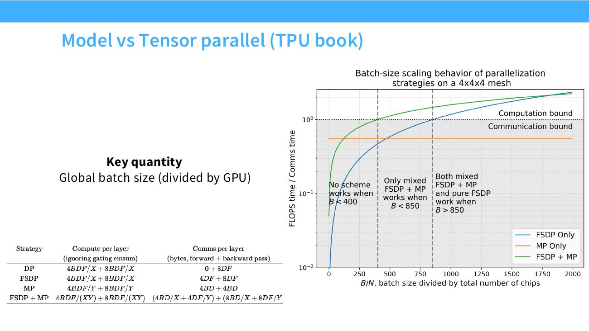{ width="720" }

组合规则可以用一个量说清：**全局 batch 大小（除以芯片数）**。TPU book（"How to Scale Your Model"）给出每层计算/通信的精确账目（$B$=batch、$D$=hidden、$F$=FFN 维、$X$/$Y$=各并行度；计算以 FLOPs、通信以前向+反向字节数计）：

| 策略 | 每层计算（忽略 gating einsum） | 每层通信（bytes） |
|---|---|---|
| DP | $4BDF/X + 8BDF/X$ | $0 + 8DF$ |
| FSDP | $4BDF/X + 8BDF/X$ | $4DF + 8DF$ |
| MP（TP） | $4BDF/Y + 8BDF/Y$ | $4BD + 4BD$ |
| FSDP + MP | $4BDF/(XY) + 8BDF/(XY)$ | $(4BD/X + 4DF/Y) + (8BD/X + 8DF/Y)$ |

关键对比：DP/FSDP 的通信正比于**参数量**（$DF$），MP 的通信正比于**激活量**（$BD$）。哪种策略通信主导取决于 $B$ 与 $D$、$F$ 的相对大小——于是横轴取 $B/N$（每芯片 batch）画出 FLOPs 时间/通信时间之比（4×4×4 mesh 上）：比值 > 1 为计算受限（通信可隐藏）、< 1 为通信受限。图上的三个区间：**$B/N < 400$ 时没有任何方案可行**（通信必然主导）；**$B/N < 850$ 时只有 FSDP+MP 混合可行**（两种通信分摊到不同网络维度）；**$B/N > 850$ 时混合与纯 FSDP 都可行**。这把 §3–§4 的定性规则变成了可计算的设计空间：给定模型与硬件，先算 $B/N$，再选并行组合。

### 9.2 组合的经验法则：3D（4D）并行

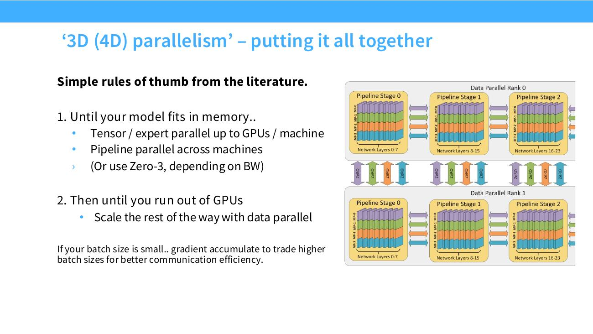{ width="720" }

文献中沉淀下来的简单组合规则（图示为经典 3D 布局：两个 DP rank，每个 rank 内 3 个流水线 stage，每个 stage 内 4 路 MP（TP），DP rank 之间再叠 ZeRO）：

1. **直到模型装进内存为止**：先用张量/专家并行，**上限是单机 GPU 数**（NVLink 域）；再用流水线并行**跨机**扩展（或按带宽条件用 ZeRO-3 替代/叠加）；
2. **直到 GPU 用完为止**：剩下的扩展全部交给数据并行（+ ZeRO 分片）；
3. **batch 太小怎么办**：用梯度累积换更大的有效 batch，提高通信效率（摊薄 DP 梯度同步与 PP 气泡）。

这套规则的逻辑链正是 §4.2 的通信层级：TP（每层 4 次 All-Reduce，最贪带宽）→ 放最快的 NVLink 域；CP（环状 KV 传递）→ 放次快层；PP（stage 边界点到点激活）→ 放机间 InfiniBand；DP/ZeRO（每步一次梯度归约，且可与计算重叠、最耐延迟）→ 放最外层、跨任意慢链路。

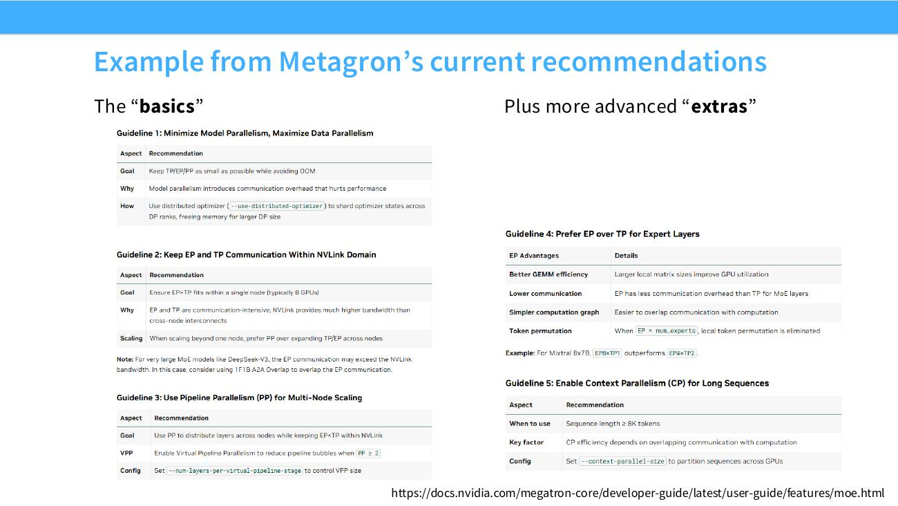{ width="720" }

NVIDIA Megatron-Core 文档的现行 guidelines 与上述规则完全同构：

- **Guideline 1：最小化模型并行、最大化数据并行**——TP/EP/PP 能不放大就不放大（模型并行都引入通信开销），用 `--distributed-optimizer`（ZeRO-1）切优化器状态来给 DP 腾内存；
- **Guideline 2：EP×TP 通信保持在 NVLink 域内**（单节点 8 卡）；跨节点优先加 PP 而不是扩大 TP/EP；例外是 DeepSeek-V3 级的大 MoE——EP 通信超出 NVLink 域时用 1F1B A2A Overlap 把 All-to-All 藏起来；
- **Guideline 3：多机扩展用 PP**，$p \ge 2$ 时开 Virtual Pipeline（VPP，`--num-layers-per-virtual-pipeline-stage`）减小气泡（即 §3.3 的 interleaved 调度）；
- **Guideline 4：专家层优先 EP 而非 TP**（§6.1）；
- **Guideline 5：长序列（≥ 8K tokens）开 CP**（`--context-parallel-size`，效率取决于通信计算重叠）。

### 9.3 扩展性实证：Narayanan 2021 的 PTD-P

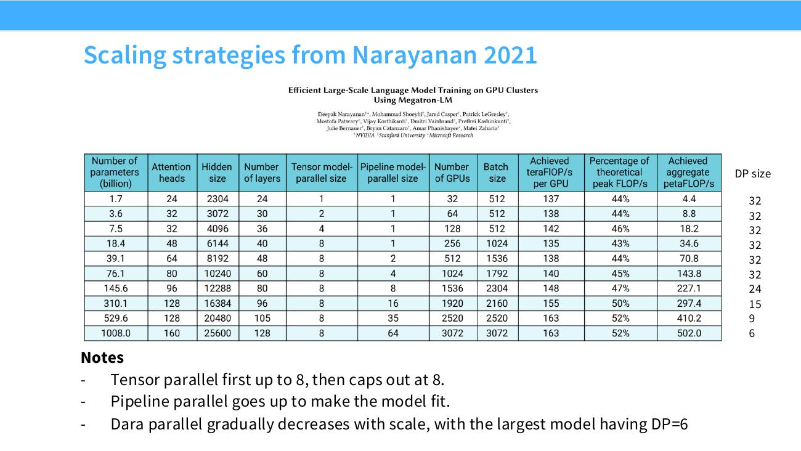{ width="720" }

Megatron 的 PTD-P 论文（Narayanan et al. 2021, "Efficient Large-Scale Language Model Training on GPU Clusters Using Megatron-LM"）给出了 1.7B → 1T（1008B）的完整配置表，是 3D 并行最权威的实证。读表找规律（表右侧课件补注了 DP 列）：

- **TP 先到 8，然后封死在 8**：1.7B 用 TP1，3.6B 用 TP2，7.5B 用 TP4，18.4B 起 TP=8——恰好是单机 8 卡 NVLink 域的容量，之后任何规模都不再增加；
- **PP 持续上升直到模型装下**：从 PP1 一路涨到 1T 模型的 PP64（跨 64 个 stage，即 64 台 8 卡机的深度方向）；
- **DP 随规模递减**：小模型 DP=32，1T 时只剩 DP=6——GPU 总数被 TP×PP 吃掉后，留给数据并行的份数越来越少，全局 batch 靠大 micro-batch 数与梯度累积维持；
- **效率随规模不降反升**：每卡实测从 137 → 163 teraFLOP/s，峰值占比 44% → 52%，聚合算力从 4.4 petaFLOP/s（32 卡）线性涨到 502 petaFLOP/s（3072 卡）。

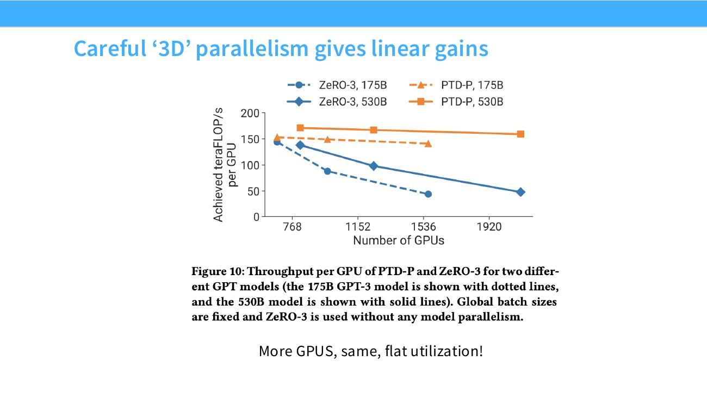{ width="720" }

同一篇论文的 Figure 10 回答了"为什么非要组合不可"：固定全局 batch，175B 与 530B 两个模型，比较纯 ZeRO-3（不用任何模型并行）与 PTD-P（TP+PP+DP 组合）在 768 → 2048 卡上的每卡吞吐。ZeRO-3 曲线从约 150 teraFLOP/s 一路衰减到 50 左右——参数量级的逐层 gather 通信在跨机网络上藏不住，卡越多每卡越慢（**亚线性扩展**）；PTD-P 曲线几乎水平（150 → 160 微幅波动）——**加卡不掉效率，才是真正的线性扩展**。这张图是"3D 组合不是可选项"的最直接证据。

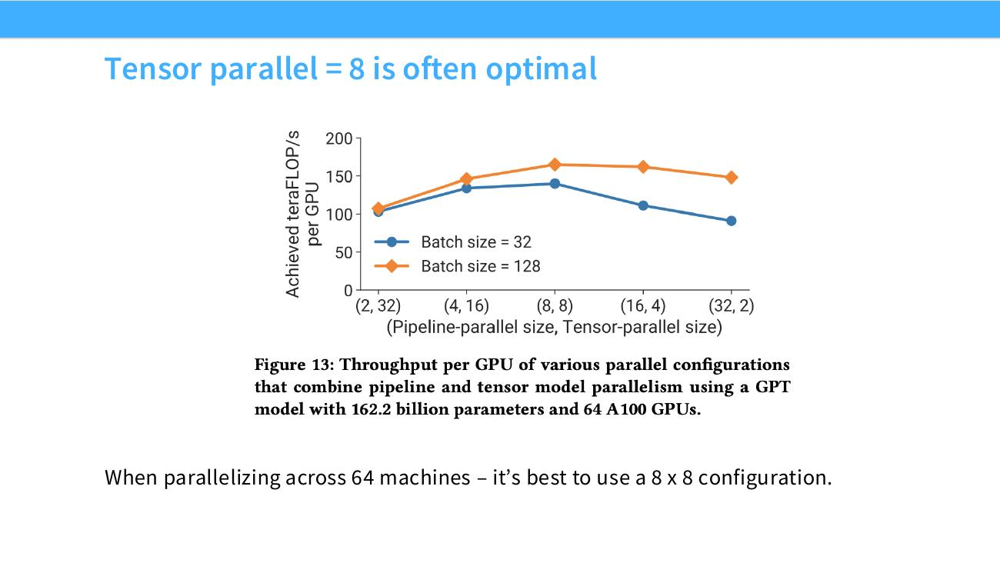{ width="720" }

Figure 13 进一步定位最优点：162.2B 模型、64 张 A100，穷举 (PP, TP) 组合 (2,32)、(4,16)、(8,8)、(16,4)、(32,2)。每卡吞吐在 **(8, 8) 处取峰**（batch 32 约 140、batch 128 约 170 teraFLOP/s），两侧对称衰减——TP>8 时 All-Reduce 溢出 NVLink 域（§4.2 的机制），TP<8 时 PP 加深、气泡占比上升（§3.2 的公式）。两个独立机制在 TP=8 处相遇，**"TP 用满单机 NVLink 域"从经验法则变成了测量出来的最优点**。

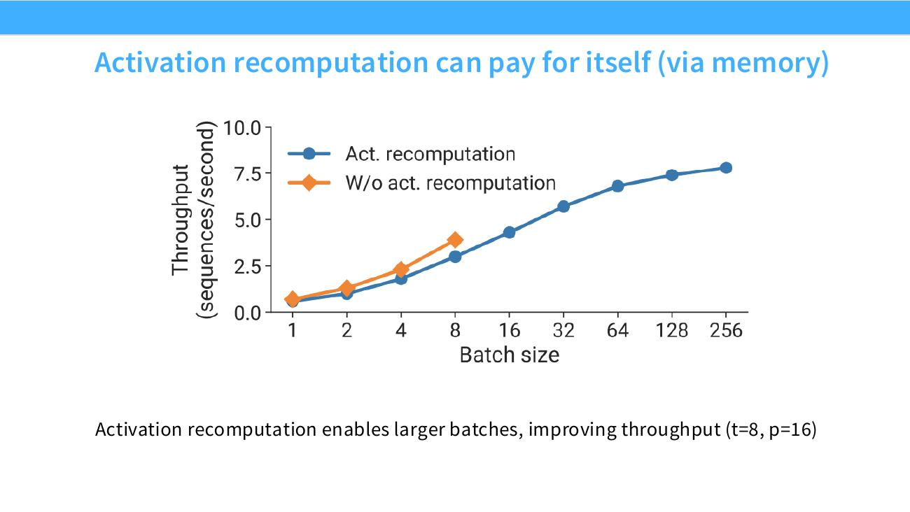{ width="720" }

§5.2–§5.4 说重计算拿时间换内存，但 Figure（t=8, p=16 配置）展示了更微妙的账：不重计算时 batch 最大只能开到 8（OOM），吞吐约 4 sequences/s 封顶；开激活重计算后单步确实更慢（小 batch 时略低于橙色线），但**省下的内存允许 batch 开到 256**，吞吐一路涨到约 7.8 sequences/s——大 batch 带来的 GPU 利用率提升**超过了重计算的额外开销**。激活重计算不是纯粹的税：在内存受限 regime 它是净收益。

### 9.4 真实系统巡礼：大家都在用什么组合

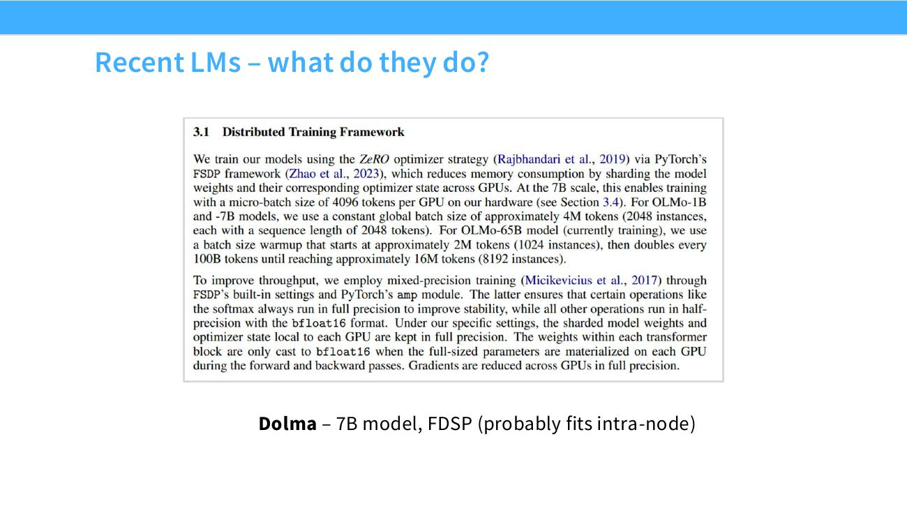{ width="720" }

**OLMo（AI2, Dolma 数据集）**：7B 模型用 ZeRO（经 PyTorch FSDP）切分权重与优化器状态——7B 规模下大概率单机内就能装下分片，无需模型并行。混合精度：sharded 权重与优化器状态保持 fp32，计算时 transformer 块内临时 materialize 为 bf16，梯度以 fp32 归约；softmax 等敏感算子始终全精度。7B 规模 micro-batch 4096 tokens/GPU，全局 batch 约 4M tokens；OLMo-65B 用 batch size warmup（约 2M tokens 起步、每 100B tokens 翻倍至 16M）。**小模型时代的标准答案：FSDP + 混合精度 + 大全局 batch。**

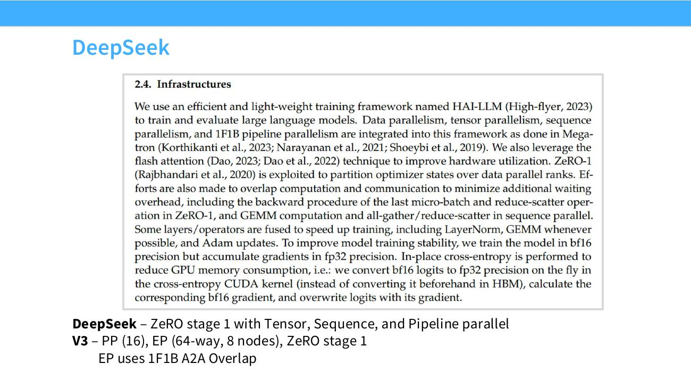{ width="720" }

**DeepSeek（V2 时代，HAI-LLM 框架）**：DP + TP + SP + 1F1B 流水线（与 Megatron 同构）+ FlashAttention + **ZeRO-1**（只切优化器状态）；大量通信计算重叠设计——最后一个 micro-batch 的反向与 ZeRO-1 的 reduce-scatter 重叠、SP 的 GEMM 与 all-gather/reduce-scatter 重叠；算子融合（LayerNorm、GEMM、Adam 更新）；bf16 训练 + **fp32 梯度累加**保稳定性；in-place cross-entropy（bf16 logits 在 CUDA kernel 内即时转 fp32、算完梯度直接覆写 logits，避免在 HBM 里物化 fp32 logits）。**DeepSeek-V3**（671B、256 专家）：PP 16 路、**EP 64 路（跨 8 节点）**、ZeRO-1，EP 的 All-to-All 用 1F1B A2A Overlap 隐藏——正是 §9.2 Guideline 2 那个"超出 NVLink 域的 EP"例外条款的来源。

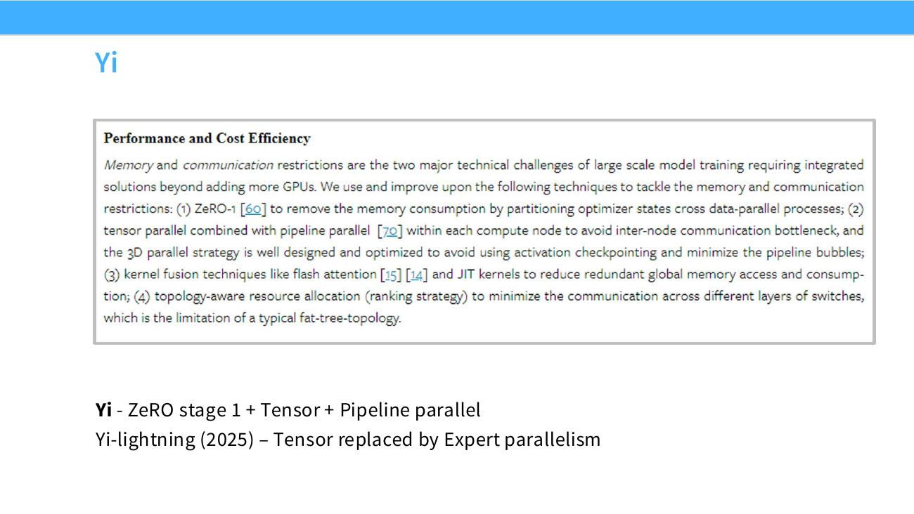{ width="720" }

**Yi**：ZeRO-1 切优化器状态；**机内 TP + PP 组合**以避免跨机通信瓶颈，3D 策略精心设计到"不需要激活重计算"的程度（用并行组合换内存，而不是拿重计算换）；kernel fusion（FlashAttention + JIT kernels）减少全局内存访问；**topology-aware 的资源分配（ranking strategy）**——按交换机层级排布 rank，最小化跨交换层通信（fat-tree 拓扑的固有短板）。Yi-lightning（2025）进化为 MoE，**TP 被 EP 取代**——又一次印证 §6.1 的规则。

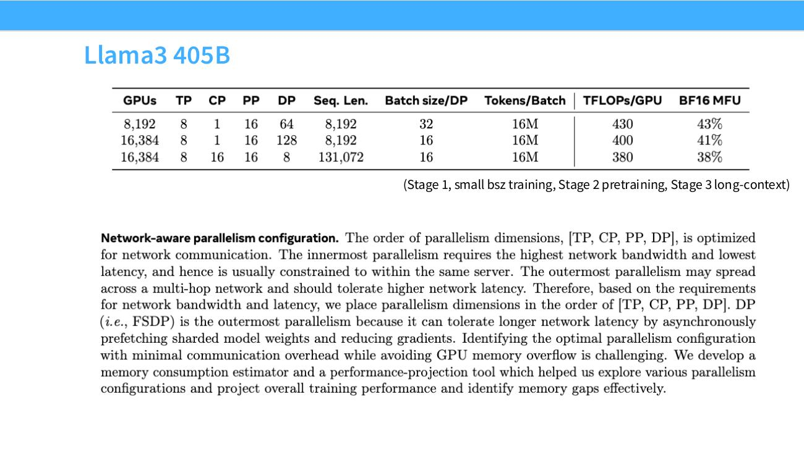{ width="720" }

**Llama 3 405B** 给出了迄今最完整的官方配置表（三个阶段：小 batch 起步、主预训练、长上下文扩展）：

| GPUs | TP | CP | PP | DP | 序列长 | Batch/DP | Tokens/Batch | TFLOPs/GPU | BF16 MFU |
|---|---|---|---|---|---|---|---|---|---|
| 8,192 | 8 | 1 | 16 | 64 | 8,192 | 32 | 16M | 430 | 43% |
| 16,384 | 8 | 1 | 16 | 128 | 8,192 | 16 | 16M | 400 | 41% |
| 16,384 | 8 | 16 | 16 | 8 | 131,072 | 16 | 16M | 380 | 38% |

教科书式的验证：TP=8 封死在 NVLink 域；PP=16 跨机；DP 吃掉剩余卡数；**长上下文阶段把 DP 从 128 换成 CP=16**（128 路的 DP 组改切成 8 DP × 16 CP），序列从 8K 拉到 128K——CP 就是"把 DP 维度临时挪用"来换序列长度。注意三个阶段的 tokens/batch 恒定 16M（全局 batch 守恒，只重组并行轴），MFU 从 43% 缓降到 38%（CP 与更长序列的通信/重计算税）。

Meta 还披露了**网络感知的并行排序 [TP, CP, PP, DP]**：越内层的并行需要越高带宽、越低延迟（约束在同机/近域），越外层越能容忍多跳网络；DP（FSDP）放最外因为分片权重的预取与梯度归约可以异步、最耐延迟。为了搜索这组配置，他们开发了**内存消耗估算器与性能投影工具**——并行配置已经从"经验"变成"可建模的优化问题"。

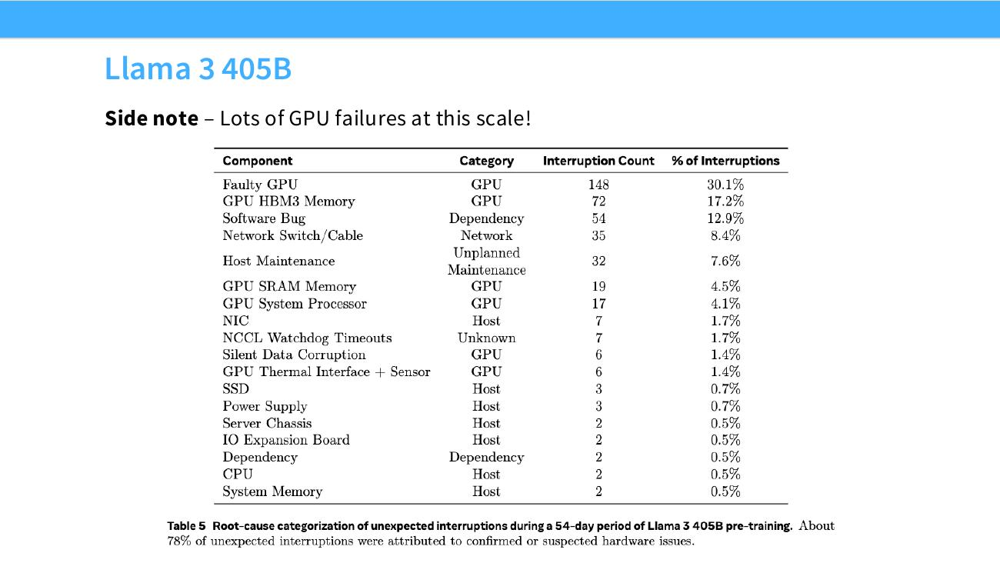{ width="720" }

大规模训练的系统现实（Llama 3 405B 论文 Table 5）：54 天预训练期内意外中断的根因分类——故障 GPU 148 次（30.1%）、GPU HBM3 显存 72 次（17.2%）、软件 bug 54 次（12.9%）、网络交换机/线缆 35 次（8.4%）、计划外主机维护 32 次（7.6%）、GPU SRAM 19 次、GPU 系统处理器 17 次、NIC 7 次、NCCL watchdog 超时 7 次、静默数据损坏 6 次……**约 78% 的中断来自硬件**。在 16K GPU 规模上，**"平均每天坏几张卡"是稳态而非事故**——这直接催生了 checkpoint 高频化、故障自动检测与热替换、NCCL 超时诊断等一整套容错工程，也是为什么"易用性"在 §8 的对比表里是一个正式维度。

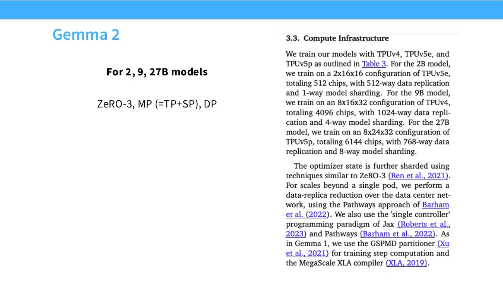{ width="720" }

**Gemma 2**（2B/9B/27B，TPU 集群）：2B 在 2×16×16 的 TPUv5e（512 芯片）上 512 路数据复制、1 路模型分片；9B 在 8×16×32 TPUv4（4096 芯片）上 1024 路数据复制 + 4 路模型分片；27B 在 8×24×32 TPUv5p（6144 芯片）上 768 路数据复制 + 8 路模型分片；优化器状态按 ZeRO-3 方式进一步分片。跨 pod 时用 Pathways 在数据中心网络上做数据副本归约；编程模型是 JAX "single controller" + GSPMD 自动切分 + MegaScale XLA 编译器。总结其配方：**ZeRO-3 + MP（=TP+SP）+ DP**——注意 TPU 文化里没有 PP（torus mesh 上 TP 的 All-Reduce 高效，与 §1.5 的拓扑讨论呼应）。

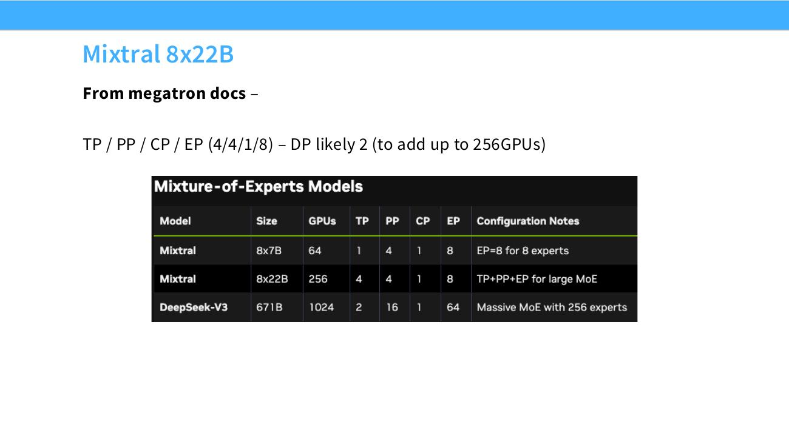{ width="720" }

**Mixtral 8×22B**（经 Megatron 训练的配置）：**TP/PP/CP/EP = 4/4/1/8**，DP 约 2（凑满 256 GPU）。对照 Megatron 的 MoE 配置表：Mixtral 8×7B（64 GPU）= TP1/PP4/CP1/EP8（8 个专家正好 EP8，呼应 §6.1 的 token permutation 消除条件）；Mixtral 8×22B（256 GPU）= TP4/PP4/CP1/EP8；DeepSeek-V3（1024 GPU）= TP2/PP16/CP1/EP64（256 专家的大 MoE）。MoE 模型的并行设计就是"先定 EP = 专家数（或其因子），再用 TP/PP 补注意力与稠密部分"。

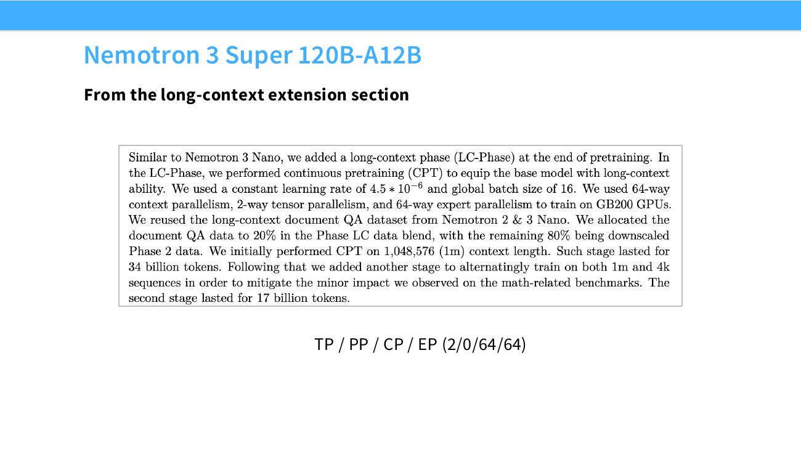{ width="720" }

**Nemotron 3 Super 120B-A12B** 的长上下文扩展（LC-Phase）：持续预训练，恒定学习率 $4.5\times10^{-6}$、全局 batch 16，**64 路 CP + 2 路 TP + 64 路 EP**，跑在 GB200 上；先在 1M（1,048,576）上下文长度上训 34B tokens，再交替训 1M 与 4K 序列 17B tokens（缓解长上下文训练对数学基准的轻微损伤）。配置 **TP/PP/CP/EP = 2/0/64/64**——完全没有 PP，靠 CP64 + EP64 两个"激活/路由"维度撑起并行度，这是长上下文 MoE 时代的代表性配方。

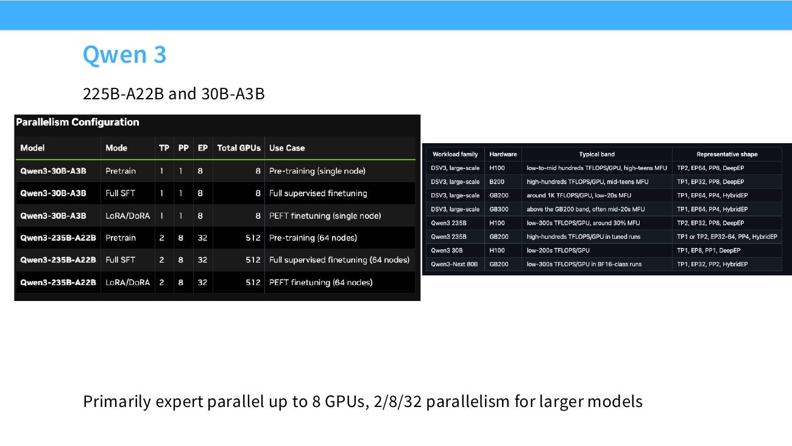{ width="720" }

**Qwen 3**（235B-A22B 与 30B-A3B）：小模型 Qwen3-30B-A3B 的预训练/全量 SFT/LoRA 全部 TP1/PP1/EP8、单机 8 卡——**EP 一维就够**；大模型 Qwen3-235B-A22B 用 TP2/PP8/EP32、512 卡（64 节点）。右侧的硬件-配置对照表（DSV3/Qwen3 各档位在 H100/B200/GB200/GB300 上的典型吞吐与代表配置）显示：硬件代际升级（H100 → GB200/GB300）让 EP32–64、TP1–2 的低 TP 配置成为主流——**NVLink 域变大（§1.6 的 domain size）直接降低了 TP 的必要性**。规律：**8 卡以内主要靠 EP，大模型用 2/8/32 的 TP/PP/EP。**

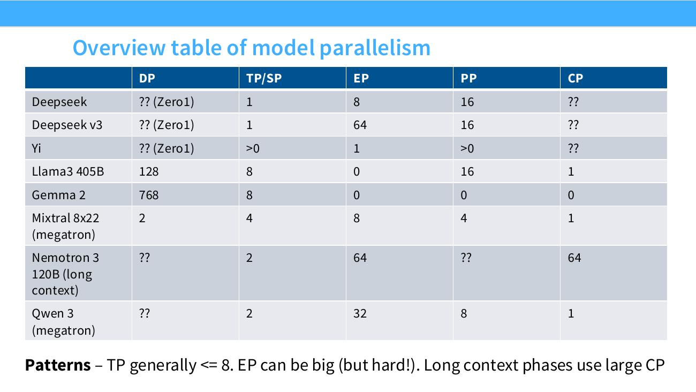{ width="720" }

把巡礼收成一张表（DP / TP·SP / EP / PP / CP）：

| 模型 | DP | TP/SP | EP | PP | CP |
|---|---|---|---|---|---|
| DeepSeek | ?? (ZeRO-1) | 1 | 8 | 16 | ?? |
| DeepSeek-V3 | ?? (ZeRO-1) | 1 | 64 | 16 | ?? |
| Yi | ?? (ZeRO-1) | >0 | 1 | >0 | ?? |
| Llama 3 405B | 128 | 8 | 0 | 16 | 1（长上下文 16） |
| Gemma 2 | 768 | 8 | 0 | 0 | 0 |
| Mixtral 8×22B (Megatron) | 2 | 4 | 8 | 4 | 1 |
| Nemotron 3 120B（长上下文） | ?? | 2 | 64 | ?? | 64 |
| Qwen 3 (Megatron) | ?? | 2 | 32 | 8 | 1 |

三条规律（Patterns）：**TP 普遍 ≤ 8**（NVLink 域容量的硬约束）；**EP 可以很大（但很难）**——64 路 EP 需要精心的通信重叠与负载均衡；**长上下文阶段用大 CP**（16–64）。

---

## 10. 全讲回顾、延伸阅读与资源

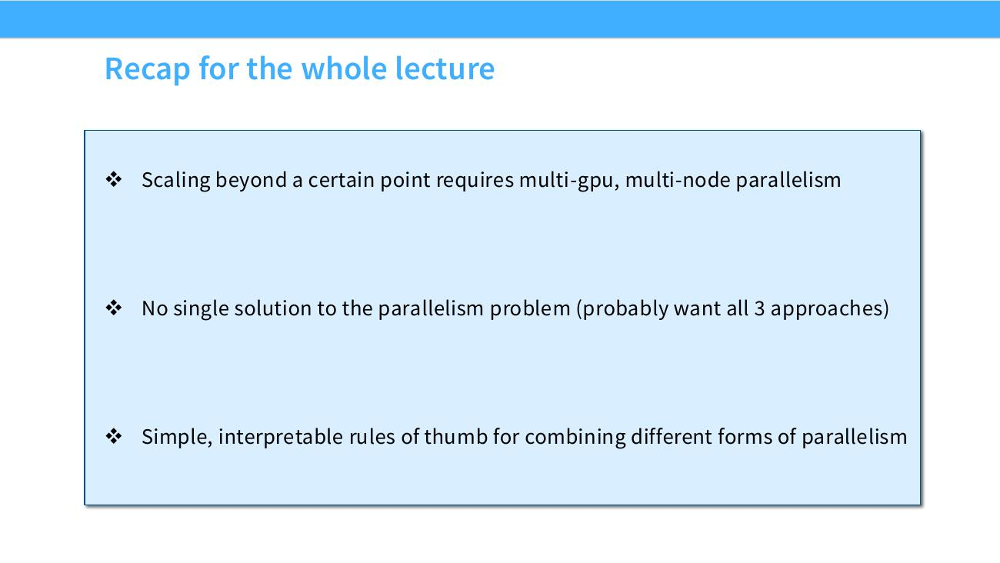{ width="640" }

全讲三个最终 takeaway：

1. **超过某个规模点后，多 GPU、多机并行是必选项**——单机算力与内存的墙（§1.1）不可逾越；
2. **并行问题没有单一解**——你几乎总是需要同时用上数据并行、流水线/张量并行、以及 ZeRO/SP/CP/EP 中的若干种（§9 的全部真实系统无一例外）；
3. **组合有简单、可解释的经验法则**——TP 用满 NVLink 域（≤8）、PP 跨机、DP 收尾、长序列加 CP、MoE 加 EP，规则背后是通信层级与内存账目的精确推导，而非玄学。

### 延伸阅读

- **Rajbhandari et al. 2019/2020, "ZeRO: Memory Optimizations Toward Training Trillion Parameter Models"**——ZeRO 三阶段与 $16$ 字节问题的原始论文（§2）；
- **Zhao et al. 2023, "PyTorch FSDP: Experiences on Scaling Fully Sharded Data Parallel"**——ZeRO-3 的 PyTorch 工业化实现（§2.7）；
- **Shoeybi et al. 2019, "Megatron-LM: Training Multi-Billion Parameter Language Models Using Model Parallelism"**——列切/行切与 $f$/$g$ 算子（§4）；
- **Narayanan et al. 2021, "Efficient Large-Scale Language Model Training on GPU Clusters Using Megatron-LM"**——PTD-P、3D 并行与 TP=8 最优的实证（§3、§9.3）；
- **Korthikanti et al. 2022, "Reducing Activation Recomputation in Large Transformer Models"**——激活内存公式 $sbh(34 + 5as/h)$、序列并行与选择性重计算（§5）；
- **Huang et al. 2019, "GPipe"** 与 **Narayanan et al. 2019, "PipeDream"**——流水线并行与 1F1B 调度（§3）；**Qi et al. 2023, "Zero Bubble Pipeline Parallelism"**（§3.3）；
- **Liu et al. 2023, "Ring Attention with Blockwise Transformers"**——上下文并行的代表性实现（§7）；
- **"How to Scale Your Model"（TPU book, Google DeepMind）**——roofline 式的并行数学，§9.1 的账目来源；
- **Megatron-Core 官方文档**（docs.nvidia.com/megatron-core）——§9.2 五条 guideline 与 MoE Parallel Folding 的一手出处；
- **Llama 3 herd of models 论文（2024）**——405B 的并行配置、网络感知排序 [TP, CP, PP, DP] 与故障统计（§9.4）；
- **DeepSeek-V3 技术报告（2024）**——PP16/EP64/ZeRO-1 与 1F1B A2A Overlap（§9.4）。

---

## 要点回顾与自检

完成本讲后，你应该能够不翻资料回答：

1. 混合精度 Adam 下每个参数占多少字节？哪几部分组成？（§2.3：16 字节 = fp32 主权重 4 + 动量 4 + 方差 4 + fp16 权重 2 + fp16 梯度 2）
2. 为什么 All-Reduce 可以拆成 Reduce-Scatter + All-Gather？带宽受限下每节点通信量是多少？（§1.4：$2\frac{N-1}{N}M \approx 2M$）
3. ZeRO 三个阶段分别切什么、各付出什么通信代价？（§2.4–§2.7：stage 1 通信不变 $2M$，stage 3 约 $3M$ 换线性内存）
4. 流水线气泡占比公式？为什么需要大 batch？1F1B 与 interleaved 各自优化什么？（§3.2–§3.3：$(p-1)/(m+p-1)$；1F1B 优化激活缓存，interleaved 用带宽换气泡）
5. Megatron 张量并行为什么 MLP 只需一次 All-Reduce？$f$、$g$ 算子在前向/反向各是什么？（§4.1：列切+行切配对；$f$ 前向恒等/反向 All-Reduce，$g$ 前向 All-Reduce/反向恒等）
6. 每层激活内存公式 $sbh(34 + 5\frac{as}{h})$ 中两项分别来自哪？TP 之后剩 $10sbh$ 是什么？SP 如何零通信成本切掉它？（§5.2–§5.4）
7. CP/Ring Attention 与 SP 的本质区别是什么？（§7：SP 只切逐 token 算子，CP 处理注意力的全局依赖，KV 块环形传递 + 在线 softmax 合并）
8. 为什么 MoE 专家层优先 EP 而非 TP？EP 与 DP 的相互作用是什么？（§6.1–§6.2：GEMM 效率、通信量、token permutation；EP 通常借 DP 的维度，EP < DP）
9. 3D 并行的组合规则及其通信层级依据？为什么 TP 通常封死在 8？（§9.2–§9.3：TP→NVLink 域、PP→机间、DP→最外层；§4.2 与 §9.3 的实测）
10. Llama 3 405B 三个阶段的并行配置如何随目标变化？（§9.4：DP128→长上下文换 CP16，全局 batch 恒定 16M tokens，[TP, CP, PP, DP] 网络感知排序）

