# Stanford CS336 2026 Lecture 8：Parallelism Basics

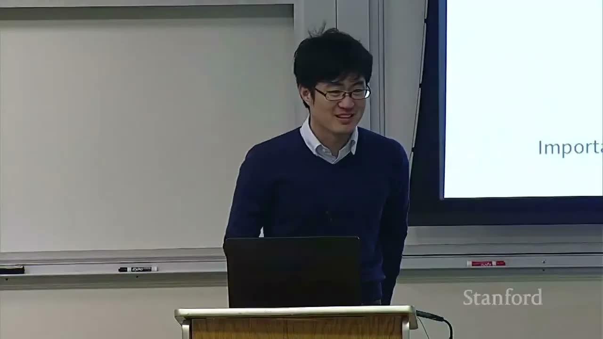

- **视频标题**：Stanford CS336 Language Modeling from Scratch | Spring 2026 | Lecture 8: Parallelism
- **主讲 / 频道**：Tatsu Hashimoto / Stanford Online
- **视频链接**：<https://www.youtube.com/watch?v=6-cXp-aOmdg>
- **时长**：01:20:10
- **材料范围**：人工英文字幕、1080p 课程视频与官方 `lecture_08.pdf`
- **学习目标**：能从显存、计算、通信和硬件拓扑四个角度解释 DP、ZeRO/FSDP、PP、TP、SP、CP、EP，并能读懂真实大模型的多维并行配置

> [!IMPORTANT]
> 这堂课的统一问题是：**当一个模型已经超出单卡能力时，应沿哪个轴切分工作，才能在装得下的同时继续保持高利用率？** 每种并行方法都在切不同对象，也在传不同对象；选择方案的关键不是记缩写，而是明确“切什么、传什么、多久传一次、在哪种网络上传”。

## 1. 数据中心为什么成为新的计算单元

### 1.1 单卡扩展同时撞上计算与显存上限

模型规模不断增长，单卡的两个硬约束会先后出现：一是一次训练步所需的 FLOPs 太多，二是参数、梯度、优化器状态和激活无法同时放进显存。后一个问题常被低估，因为“模型权重能装下”不等于“模型能训练”。

以混合精度 Adam 为例，一项常见配置会为每个参数保存：BF16 参数、BF16 梯度、FP32 master weight，以及 Adam 的 FP32 一阶矩和二阶矩。它们合计约 16 bytes/parameter，还没有计入 activation、临时工作区、通信 buffer 和内存碎片。因此，一个参数文件看似只有几十 GB 的模型，训练时可能需要数倍于此的显存。

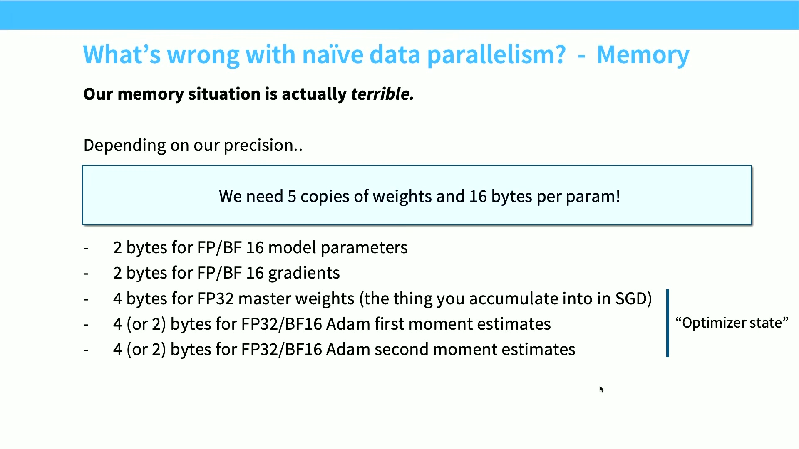
*图：课件列出的五类每参数张量合计约 16 bytes；页中的“5 copies of weights”应理解为五类同形训练张量，而不是五份语义相同的权重。（字幕区间：00:13:33--00:15:04）*

多卡训练想同时得到两种理想扩展：

- **线性显存扩展**：设备数增加一倍，可容纳的模型状态或激活也近似增加一倍。
- **线性计算扩展**：设备数增加一倍，同等工作量的时间近似减半，或固定时间内处理的 token 数近似翻倍。

真正系统通常达不到完美线性，因为设备必须同步并交换数据。于是，并行训练的核心成本模型由三部分组成：计算、通信以及无法被计算覆盖的等待。

### 1.2 节点内与节点间不是同一种网络

一台服务器中的 GPU 往往由 NVLink/NVSwitch 一类高带宽、低延迟互联连接；跨服务器通信则要经过 InfiniBand 或其他 scale-out 网络。即使两处都能调用同一个 `all_reduce`，性能也可能差一个数量级。

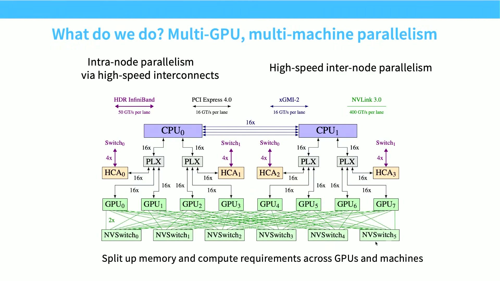
*图：节点内 GPU 经 NVSwitch 等高速互联，节点外则经 CPU、HCA 与 InfiniBand 形成另一层通信域；逻辑切分必须尊重这种层级。（字幕区间：00:01:27--00:02:42）*

TPU 传统上更强调规则的 mesh/torus；GPU 节点内则常提供较灵活的 switched all-to-all domain。mesh 便宜、规则，适合把规则张量切分映射到网格；交换式网络更适合 MoE token routing 这类不规则 all-to-all。硬件不会把成千上万张卡全部做成一个“无限快全互联”：交换芯片、链路、布线、功耗与成本都会形成有限的通信域。

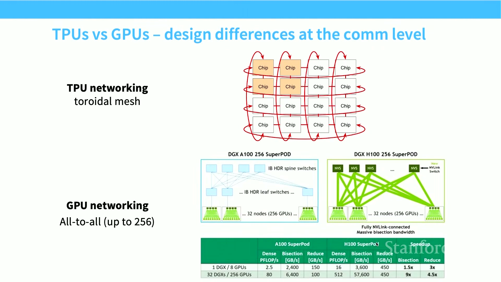
*图：课件用 toroidal mesh 与 GPU SuperPOD 的 switched network 对照说明：网络结构不是背景细节，它会改变不同 collective 与流量模式的代价。（字幕区间：00:04:48--00:06:27）*

> [!NOTE]
> 因此，“逻辑并行维度”最终必须映射到“物理拓扑”。频繁、阻塞、延迟敏感的通信应尽量留在最快的局部互联；能重叠、低频或点对点的通信更适合放在较慢的外层网络。

### 1.3 Collective communication 是所有并行方式的积木

假设有四个 rank，每个 rank 持有一段张量：

- **Broadcast**：root 把同一完整张量发送给所有 rank。
- **Reduce**：各 rank 的对应元素做求和等聚合，结果只交给 root。
- **All-gather**：每个 rank 先有不同分片，结束后所有 rank 都有拼接后的完整张量。
- **Reduce-scatter**：先按元素聚合，再让每个 rank 只得到结果的一片。
- **All-reduce**：先聚合，再让所有 rank 都得到完整结果。

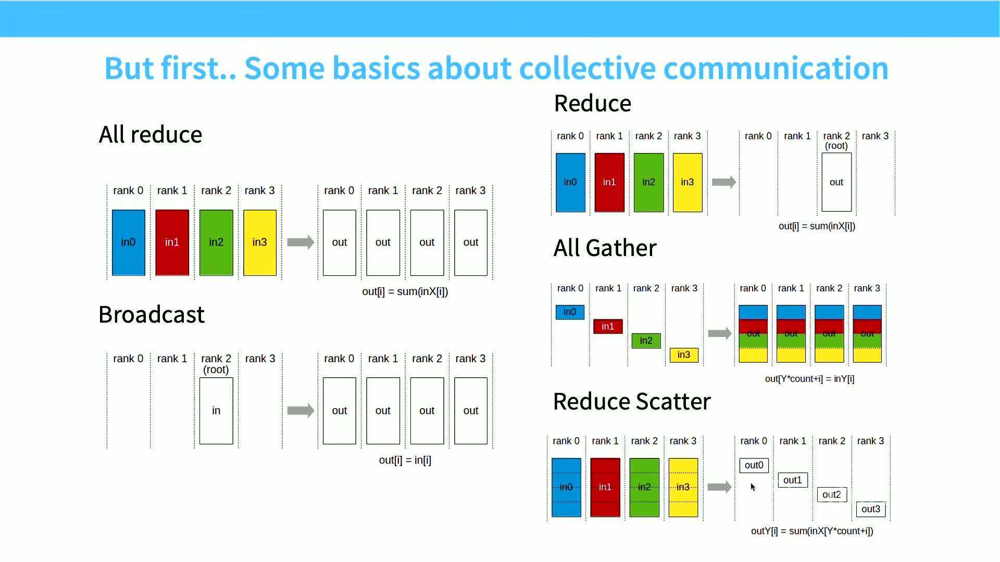
*图：四个 ranks 上的 all-reduce、broadcast、reduce、all-gather 与 reduce-scatter 输入—输出布局；后续并行算法都由这些原语组合而成。（字幕区间：00:02:59--00:03:14）*

理解 all-reduce 最重要的等价关系是：在带宽主导的大张量场景中，它可以高效地实现为 **reduce-scatter + all-gather**。例如四张卡各有一份完整梯度，reduce-scatter 后每卡得到一段已经求和的梯度；再 all-gather，所有卡重新获得相同的完整总梯度。

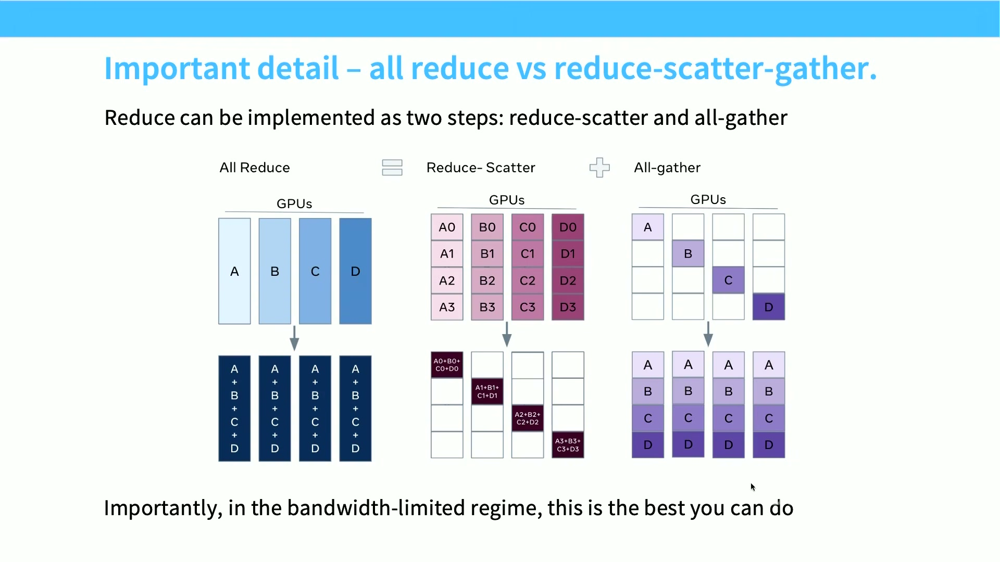
*图：左侧 all-reduce 的结果可由中间的 reduce-scatter 与右侧 all-gather 两阶段得到。课件副标题把主语写成 Reduce，结合图示应读作 All-reduce。（字幕区间：00:03:21--00:03:55）*

通信不能只按“传了多少字节”判断。一个常用近似把时间拆成延迟项和带宽项：

$$
T_{\mathrm{comm}} \approx \alpha n_{\mathrm{steps}}+\beta V.
$$

- $T_{\mathrm{comm}}$：一次 collective 的通信时间。
- $\alpha$：启动一次通信步骤的延迟成本。
- $n_{\mathrm{steps}}$：collective 算法需要的通信轮数。
- $\beta$：每字节传输时间，也就是有效带宽的倒数。
- $V$：每个 rank 实际发送或接收的数据量。

大张量时，$\beta V$ 往往主导，此时课件所说的“约 $2P$ 通信量”很有解释力；小张量或每层都通信时，$\alpha n_{\mathrm{steps}}$ 可能主导，所以相同总字节数仍可能有完全不同的性能。

> [!WARNING]
> “all-reduce 等于传两倍模型大小”是一种每-rank、带宽主导的量级记法。严格流量还依赖 ring、tree、rank 数以及计算的是每卡收发量、链路总流量还是全网总字节；不要把近似常数当成网络定律。

### 本章小结

- 训练显存包含参数、梯度、优化器状态、激活和临时 buffer；权重能放下不等于能训练。
- 节点内外互联差异决定哪些并行方式应该放在同一高速通信域。
- broadcast、reduce、all-gather、reduce-scatter 和 all-reduce 是后续所有方案的基本积木。
- 性能必须同时看通信量和通信频率；带宽与延迟主导的场景不同。

## 2. 从朴素数据并行到 ZeRO/FSDP

### 2.1 数据并行把 batch 切开，却复制全部模型状态

mini-batch SGD 可以写成：

$$
\theta_{t+1}=\theta_t-\eta\sum_{i=1}^{B}\nabla f(x_i;\theta_t).
$$

- $\theta_t$：第 $t$ 步的模型参数。
- $\eta$：学习率。
- $B$：全局 batch size。
- $x_i$：第 $i$ 个训练样本或样本片段。
- $f(x_i;\theta_t)$：当前模型在该样本上的损失。

若有 $D$ 个 data-parallel ranks，每张卡处理约 $B/D$ 个样本，各自算出局部梯度，再 all-reduce 得到相同的全局梯度。计算量能近似按 $D$ 分摊，但每张卡仍保存完整参数、完整梯度与完整优化器状态，所以参数相关显存几乎不随设备数下降。

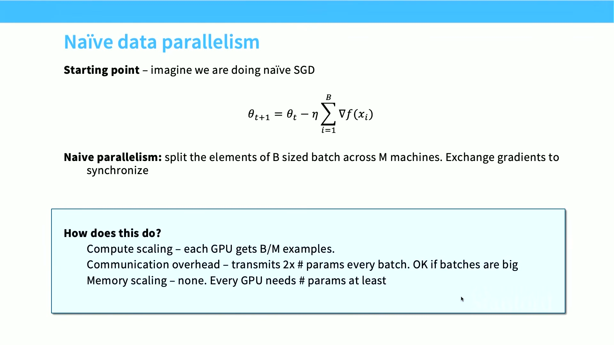
*图：DP 把 batch 切给多台机器并同步梯度，计算可扩展，但每张卡至少仍需完整模型状态；页中的 $2\times\#params$ 是带宽主导的简化口径。（字幕区间：00:12:01--00:13:33）*

DP 也不是可以无限增加。每个 rank 的 microbatch 太小时，矩阵乘不够饱满，通信又难以摊销；当 global batch 已受优化规律限制时，再加 DP 甚至可能让吞吐恶化。

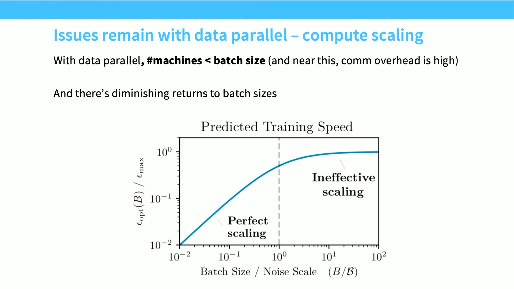
*图：batch 小于 noise scale 时，提高 batch 可近似线性加速；越过临界区后收益趋于饱和，因此不能只靠无限增大 DP 和 global batch 扩展训练。（字幕区间：00:29:06--00:30:11）*

### 2.2 ZeRO 的统一视角：把冗余训练状态逐级切分

ZeRO 的思路很直接：既然 data-parallel ranks 最终必须对同一组参数做一致更新，就没有必要让每张卡长期保存所有冗余状态。三个 stage 的区别只在于切分到什么程度：

| 方法 | 参数 | 梯度 | 优化器状态 |
| --- | --- | --- | --- |
| 朴素 DDP | 每卡完整复制 | 每卡完整复制 | 每卡完整复制 |
| ZeRO-1 | 每卡完整复制 | 每卡完整复制 | 按 DP 切分 |
| ZeRO-2 | 每卡完整复制 | 按 DP 切分 | 按 DP 切分 |
| ZeRO-3 / FSDP | 按 DP 切分 | 按 DP 切分 | 按 DP 切分 |

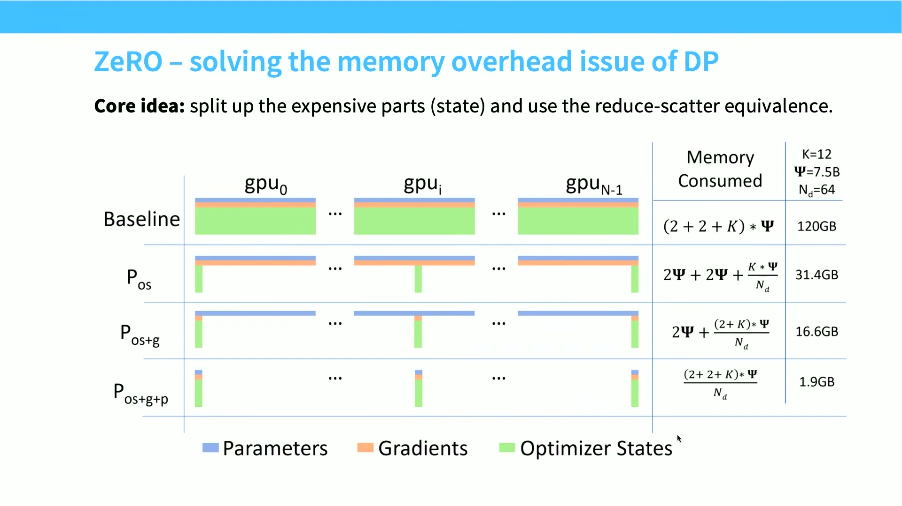
*图：从 baseline 到 ZeRO-1/2/3，optimizer state、gradient 与 parameter 依次切分；右侧容量数字来自课件给定的 7.5B、64 ranks 特定假设。（字幕区间：00:15:04--00:16:48）*

#### ZeRO-1：切 optimizer state，通信量近似不变

每个 rank 先计算本地梯度。不同于 DDP 直接让所有卡得到完整聚合梯度，ZeRO-1 使用 reduce-scatter：每张卡只拿到自己负责更新的梯度分片，用本地 optimizer state 更新对应参数分片，之后再 all-gather 更新后的参数。

假设每参数有 4 bytes 的参数与梯度常驻部分，另有 $K$ bytes 的 optimizer-related state。朴素 DDP 的每-rank 参数状态显存近似为：

$$
M_{\mathrm{DDP}}=(4+K)P.
$$

- $M_{\mathrm{DDP}}$：每个 rank 的参数相关显存。
- $P$：模型参数个数。
- $K$：每参数的优化器相关字节数。

切分 optimizer state 后变为：

$$
M_{\mathrm{ZeRO\text{-}1}}=\left(4+\frac{K}{D}\right)P.
$$

- $D$：data-parallel degree。
- 其余符号与上式相同。

在课件使用的带宽主导口径里，reduce-scatter 与 all-gather 合计仍约为 $2P$，和 DDP 的梯度 all-reduce 同阶。因此讲者把 ZeRO-1 称为近似“免费的显存收益”：没有增加主要带宽量，却切掉了最肥的 optimizer state 副本。

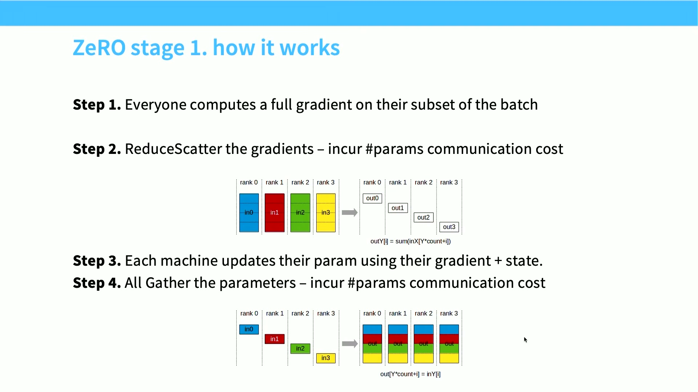
*图：每个 rank 先计算完整局部梯度，再经 reduce-scatter 只更新负责的参数分片，最后 all-gather 新参数；“近似免费”只指带宽主导下的通信量级。（字幕区间：00:16:48--00:18:25）*

#### ZeRO-2：梯度算完一层就归属并释放

ZeRO-2 进一步切分梯度。反向传播计算出某层梯度后，系统立即 reduce-scatter，把聚合后的不同分片交给负责它们的 rank；梯度不再被计算图需要后就释放。这样任何 rank 都不必长期保存完整梯度。

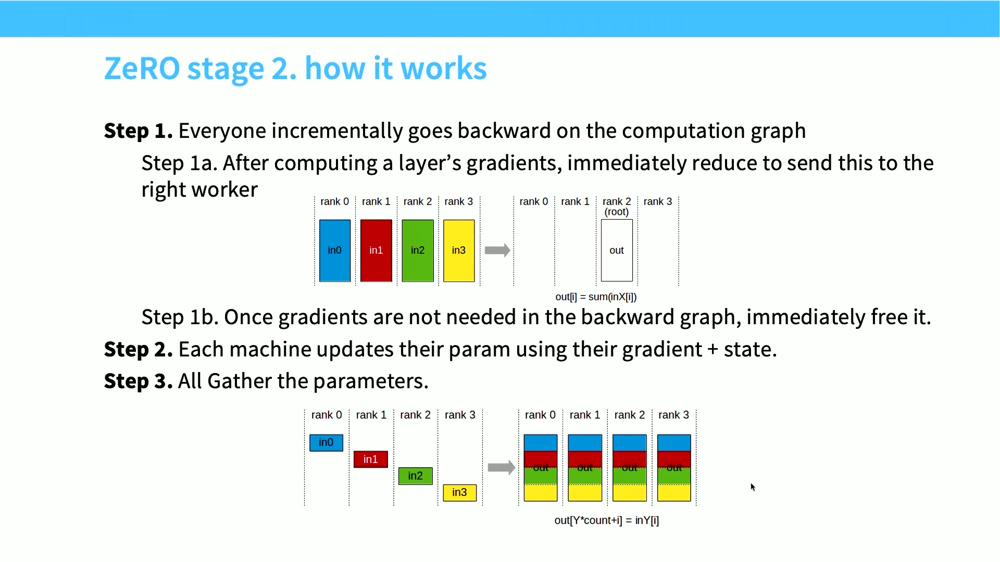
*图：backward 按计算图增量推进，某层梯度生成后立即归约到负责的 worker，并在不再需要时释放；它避免的是全模型完整梯度同时常驻。（字幕区间：00:19:16--00:20:25）*

它仍保留完整参数副本，所以能显著减少训练状态显存，却不能解决“单份参数本身已经装不下”的容量边界。

#### ZeRO-3 / FSDP：只在计算需要时临时聚合参数

ZeRO-3 把参数也切开。以一个 FSDP unit 为例：

1. 进入该 unit 的 forward 前，all-gather 所需的完整参数。
2. 执行本地 forward，随后立即 reshard 或释放完整参数。
3. backward 前再次按需 all-gather 参数。
4. 梯度算出后 reduce-scatter，每个 rank 只保留自己的梯度分片。
5. 本地 optimizer state 更新本地参数分片。

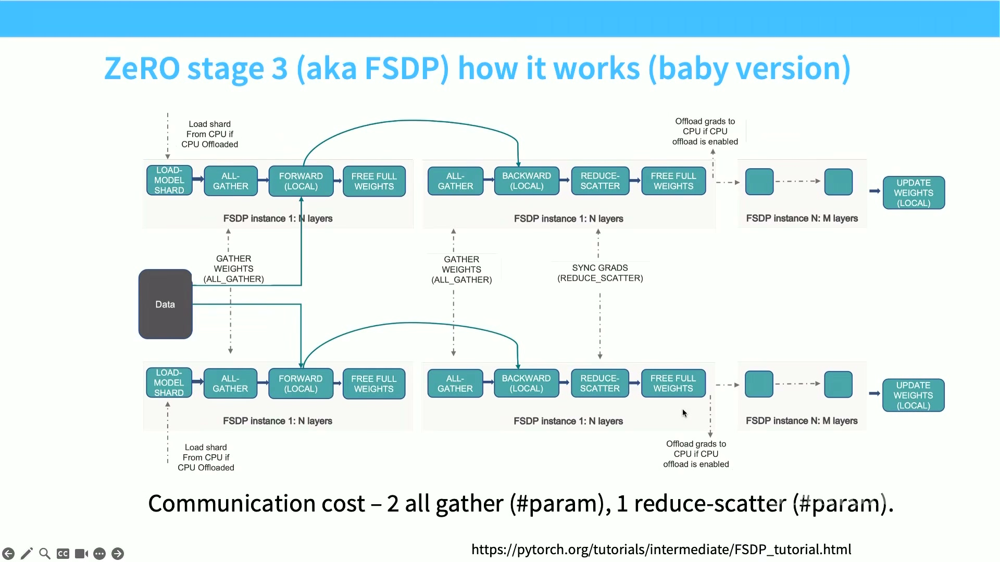
*图：每个 FSDP unit 在 forward 与 backward 前按需 all-gather，计算后释放完整权重，梯度再 reduce-scatter；底部控制条未遮挡教学内容。（字幕区间：00:20:28--00:22:18）*

课件的 baby-version 把通信量记为两个参数 all-gather 加一个梯度 reduce-scatter，即约 $3P$；相比 DDP/ZeRO-1 的约 $2P$，是 1.5 倍。真正实现能否高效，取决于 prefetch、bucket 大小、计算与通信重叠，以及是否在用完后迅速释放完整参数。

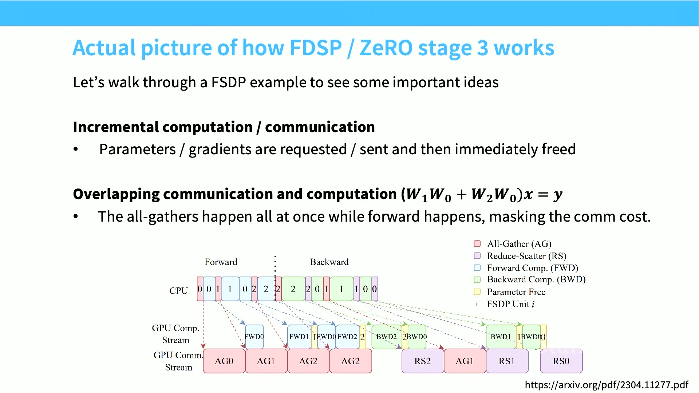
*图：通信 stream 预取后续 unit 的参数，同时 compute stream 执行当前 forward/backward。课件“all-gathers happen all at once”不应理解为所有层参数一起常驻，而应理解为流水式 prefetch 与 overlap。（字幕区间：00:22:18--00:24:57）*

> [!IMPORTANT]
> FSDP 省显存的关键不是“完整参数从未出现”，而是 **完整参数只在很短的计算窗口中出现**。若把所有层的 all-gather 同时做完并长期驻留，理论上的 sharding 收益就会被峰值显存抵消。

> [!WARNING]
> FSDP 不是 Pipeline Parallel。FSDP 的每个 rank 仍按相同层序执行完整模型，只是计算某个 unit 时临时聚合其参数；PP 才是让不同 ranks 长期负责不同层。逐层 FSDP 通信的张量大小相加仍约为全模型参数量 $P$，但 collective 次数和小 bucket 的启动延迟不会因此消失。

### 2.3 容量估算为什么只能当上界直觉

课件给出一个 8×A100 80GB 的估算：若纯 BF16/Kahan 一类设置使训练状态约为 12 bytes/parameter，baseline 约能容纳 6.67B 参数，ZeRO-1 约 16B，ZeRO-2 约 24.62B，ZeRO-3 理论上约 53.33B。

这些数字展示了 sharding 的量级收益，但不是可直接配置的容量承诺。真实训练还要给 activation、CUDA context、通信 workspace、临时 matmul buffer 和 allocator 碎片留空间；FSDP all-gather 时还存在瞬时完整参数窗口。

### 2.4 ZeRO 仍然没有解决什么

ZeRO-1/2 切分优化器状态和梯度，但参数仍复制；ZeRO-3 切分全部训练状态，却不会自动切分 activation。对于长序列、大 microbatch 或很深的网络，activation 可能比静态状态更早触发 OOM。

此外，FSDP 主要传参数与梯度。若跨慢网络频繁 gather 巨大参数，通信可能成为瓶颈。接下来两种模型并行采取不同思路：pipeline parallel 沿深度切模型，主要传相邻 stage 的 activation；tensor parallel 沿层宽度切矩阵，在每个 block 内对 activation 做 collective。

> [!WARNING]
> 课件口述有一处把“切 parameter memory”说成 ZeRO-2；结合前后页与 ZeRO 定义，应理解为 ZeRO-3。ZeRO-2 只切 gradient 和 optimizer state，参数仍完整复制。

### 本章小结

- 朴素 DP 通过切 batch 扩计算，却复制参数、梯度与优化器状态。
- ZeRO-1/2/3 依次切 optimizer state、gradient、parameter。
- FSDP 用按需 all-gather、reshard 与 overlap 换取近似线性的状态显存扩展。
- stage 越高不代表一定越快；更多显存收益会带来更频繁、更细粒度的通信。
- FSDP 不自动减少 activation，模型并行与激活并行仍然必要。

## 3. Pipeline Parallel：沿深度切模型

### 3.1 朴素 layer-wise parallel 为什么利用率糟糕

最直接的模型并行是把连续层分给不同 GPU。第一张卡计算前几层，把 activation 交给第二张卡；forward 结束后，activation gradient 再反向穿过所有 stage。模型参数确实被切开了，但若一次只处理一个 batch，同一时刻往往只有一个 stage 在工作，其余 GPU 都在等待。

把 $p$ 个 stage 想成一条装配线：只送入一件产品时，只有一个工位忙；要让工位同时工作，就必须把大 batch 切成多个 microbatches，让它们前后错开进入流水线。

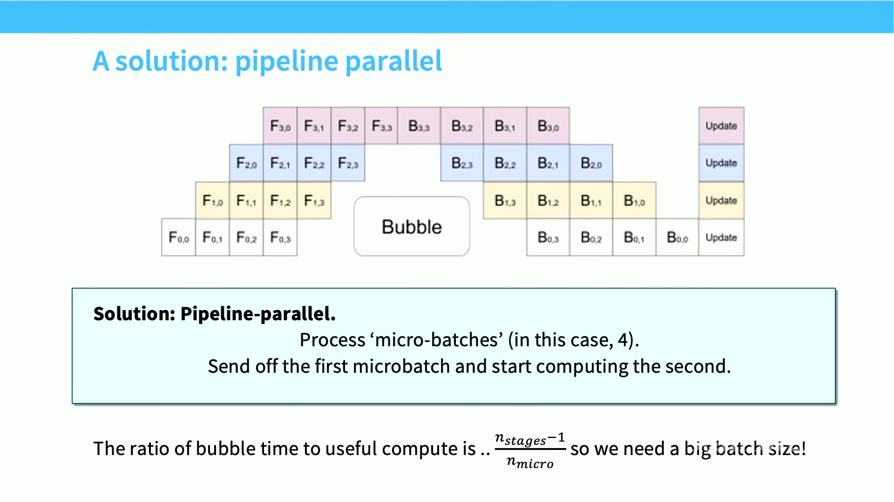
*图：四个 microbatches 在四个 stages 间错峰执行 forward/backward；中间白区是流水线无法消除的填充与排空 bubble。（字幕区间：00:33:09--00:34:13）*

### 3.2 microbatch 用更多并发填补 bubble

设有 $p$ 个 pipeline stages、一个 optimization step 中有 $m$ 个 microbatches。在简单 GPipe 式调度的近似下，bubble 时间与有效计算时间之比为：

$$
\frac{T_{\mathrm{bubble}}}{T_{\mathrm{useful}}}\approx\frac{p-1}{m}.
$$

- $T_{\mathrm{bubble}}$：流水线填充与排空造成的空闲时间。
- $T_{\mathrm{useful}}$：实际执行 forward/backward 的时间。
- $p$：pipeline stage 数。
- $m$：一个 step 内的 microbatch 数。

stage 越多，填充和排空越久；microbatch 越多，固定 bubble 越容易摊薄。因此 PP 的吞吐高度依赖 batch 与 gradient accumulation。若优化上不允许很大的 global batch，或每个 microbatch 太小导致 kernel 低效，流水线就很难达到理想利用率。

这里需要区分三个量。一个常见实现约定下：

$$
B_{\mathrm{global}}=b_{\mathrm{micro}}\times m\times D.
$$

- $B_{\mathrm{global}}$：一次参数更新覆盖的全局样本数。
- $b_{\mathrm{micro}}$：每个 DP replica、每个 microbatch 的样本数。
- $m$：累积的 microbatch 数。
- $D$：data-parallel degree。

不同框架对 batch 名称可能不同，阅读配置时必须先确认定义。

### 3.3 为什么慢网络上仍然愿意使用 PP

PP 有 bubble，也增加调度复杂度，却有两个关键优势：

- 每张卡只保存一部分层的参数，参数显存约随 $1/p$ 下降。
- stage 间主要是相邻设备的 point-to-point activation 通信，单个 microbatch 的量级约为 $bsh$，通常比频繁搬运整模型参数更适合跨节点慢链路。

这里 $b$ 是 microbatch size，$s$ 是 sequence length，$h$ 是 hidden size。实际还要计算 backward 的 activation gradient、pipeline buffer 以及不同 stage 边界的 shape。

> [!NOTE]
> PP 的本质不是“把层放到不同 GPU”——那只是 layer-wise parallel；真正关键是用 microbatch schedule 让多个 stage 在时间轴上重叠。

### 3.4 从 1F1B 到 zero-bubble：调度在交换什么

更高级的 interleaved schedule 可以让一张 GPU 承担多个非连续 virtual stages，以更多跨 stage 通信减少空槽。zero-bubble 方法又进一步把 backward 拆成：

- **B**：对输入 activation 的梯度，也就是继续向前一 stage 传播所必需的部分。
- **W**：对本层权重的梯度；只要依赖的局部数据已就绪，它在时间轴上有更大调度自由度。

调度器优先安排会阻塞其他 stage 的 B，再用 W 填补空闲，可以显著压缩 bubble。但代价是更复杂的依赖管理、激活生命周期与实现。讲者明确提醒，这类系统比普通流水线难维护；它说明“理论上接近零 bubble”不等于工程上应无条件采用。

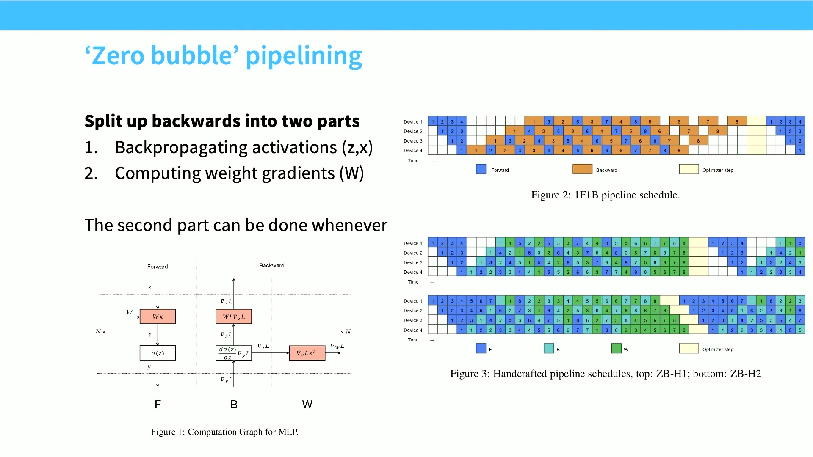
*图：左下把 backward 拆成输入梯度任务 B 与权重梯度任务 W，右侧用可延迟的 W 填补 1F1B 时间轴空槽；“whenever”仍受本 step 更新依赖约束。（字幕区间：00:37:13--00:39:22）*

> [!WARNING]
> $(p-1)/m$ 是特定简单 schedule 的近似，不适用于所有 1F1B、interleaved 或 zero-bubble 实现。它最适合建立直觉：stage 越多而 microbatch 越少，空泡越严重。

### 本章小结

- PP 沿模型深度切层，主要在相邻 stage 之间传 activation。
- microbatch 是让多个 stage 同时工作的关键；batch 太小会让 bubble 占比迅速上升。
- PP 的点对点通信较适合跨慢链路，但要承担调度、缓存与 stage balance 的复杂度。
- zero-bubble 通过拆分 input-gradient 与 weight-gradient 计算提高调度自由度。

## 4. Tensor Parallel：沿层宽度切矩阵

### 4.1 从矩阵分块看 column parallel 与 row parallel

TP 不把完整层依次交给不同 GPU，而是让多张卡共同计算同一层。先看两层 MLP：

$$
Y=\phi(XA),\qquad Z=YB.
$$

- $X$：输入 activation。
- $A$：第一层上投影权重。
- $\phi$：GeLU 等逐元素非线性。
- $Y$：中间 activation。
- $B$：第二层下投影权重。
- $Z$：MLP 输出。

把 $A$ 按列切为 $[A_1,A_2]$，两张卡可各自得到不同输出通道：

$$
Y_1=\phi(XA_1),\qquad Y_2=\phi(XA_2).
$$

- $A_1,A_2$：$A$ 的两个列分片。
- $Y_1,Y_2$：对应的中间特征分片。
- 其余符号与前式相同。

再把 $B$ 按行切为 $[B_1;B_2]$。每张卡计算部分和，最后 all-reduce：

$$
Z=Y_1B_1+Y_2B_2.
$$

- $B_1,B_2$：$B$ 的两个行分片。
- $Y_1B_1,Y_2B_2$：各卡局部输出。
- $Z$：all-reduce 求和后的完整输出。

这组 column-parallel + row-parallel 布局有一个漂亮性质：两层之间的中间 activation 可以保持分片，不必先拼完整；只在需要恢复完整输出的位置做 collective。

### 4.2 Transformer block 中怎样切

典型 Megatron 风格布局是：

- Q、K、V 投影和 MLP up/gate projection 做 column parallel。
- attention output projection 和 MLP down projection 做 row parallel。
- LayerNorm、router 等较小或逐点操作先复制，随后由 sequence parallel 继续处理其激活冗余。

attention heads 天然提供可切的输出通道，因此每张卡可以负责一组 heads；输出投影再把不同卡的部分结果合并。MLP 也遵循先把 expanded hidden channels 分开、再在 down projection 汇总的模式。

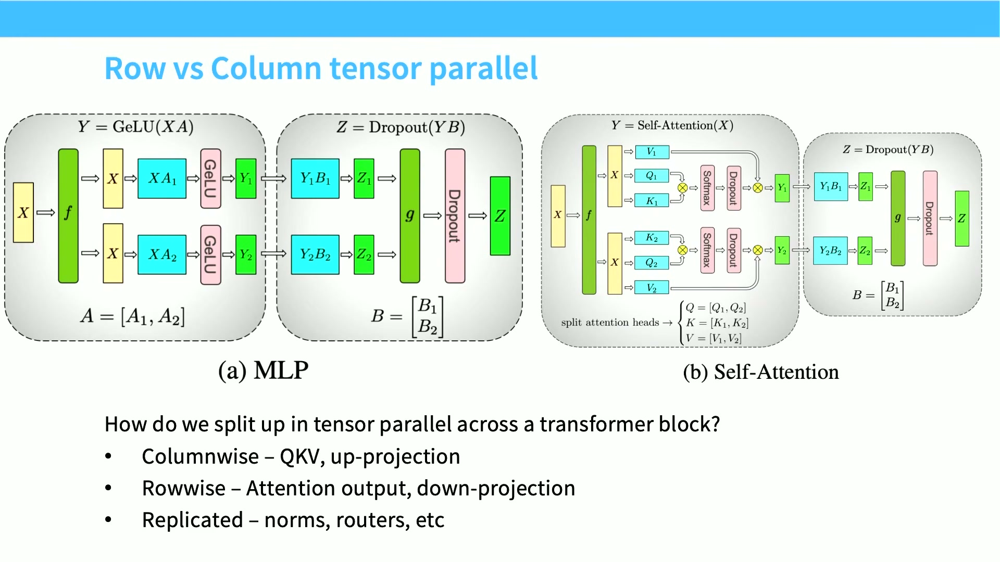
*图：MLP 与 self-attention 都先按输出通道做 column parallel，再用 row parallel 汇总部分结果；LayerNorm 与 router 等逐点模块仍复制。（字幕区间：00:41:33--00:42:22）*

### 4.3 TP 没有 pipeline bubble，却有每层阻塞通信

与 PP 相比，TP 不需要等待整条深度流水线填满，对小 batch 更友好，且可以通过包装 linear layers 接入模型。但它几乎在每个 Transformer block 都要进行 activation-sized collective；若 collective 延迟较高，所有卡会在层边界一起等待。

课件给出一个粗略比较：PP 每 microbatch 的 stage 边界通信约为 $bsh$，TP 每层通信约为：

$$
V_{\mathrm{TP}}\approx 8bsh\frac{t-1}{t}.
$$

- $V_{\mathrm{TP}}$：课件口径下每层 TP 通信量。
- $b$：microbatch size。
- $s$：sequence length。
- $h$：hidden dimension。
- $t$：tensor-parallel degree。
- 常数 $8$：来自特定前后向 collective、元素字节数与 Transformer 布局的合并计数，并非所有实现的固定常数。

因此 TP 通常优先放在节点内 NVLink/NVSwitch 域。课件反复出现 TP≤8，是因为许多集群恰好每节点 8 GPU，而不是数学上禁止更大的 TP。

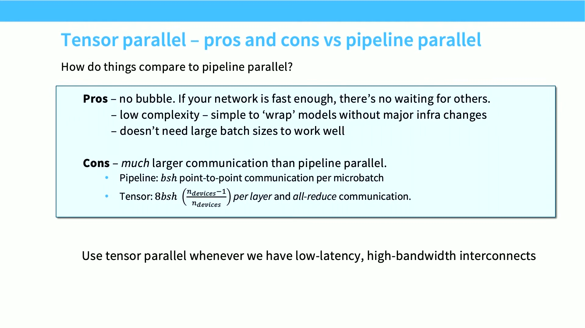
*图：PP 主要在 stage 边界做点对点传输，TP 则在每层进行 activation collective；后者没有 pipeline bubble，但更依赖低延迟、高带宽互联。（字幕区间：00:44:02--00:44:55）*

> [!IMPORTANT]
> FSDP 与 TP 都能让每卡不长期保存全部参数，但计算方式不同：FSDP 在计算前临时 all-gather 权重，TP 则让权重分片直接参与同一矩阵乘，并在层内交换 activation。

### 本章小结

- TP 沿矩阵输出/输入通道切同一层，典型组合是 column-parallel 后接 row-parallel。
- 它消除了 PP 的 bubble，也不依赖很大的 batch。
- 代价是每层都有阻塞的 activation collective，因此强依赖低延迟、高带宽互联。
- “TP 常取 8”主要来自常见节点拓扑和经验测量，不是普适最优值。

## 5. 激活内存：Sequence Parallel、Context Parallel 与重计算

### 5.1 参数切开后，activation 仍可能成为最大项

训练必须为 backward 保存中间 activation。序列越长、microbatch 越大、层数越深，activation 越多；朴素 attention 还会产生随 $s^2$ 增长的中间矩阵。课件引用 Korthikanti 等人的特定 Transformer/精度估算，若保存所有中间量，每层 activation memory 近似为：

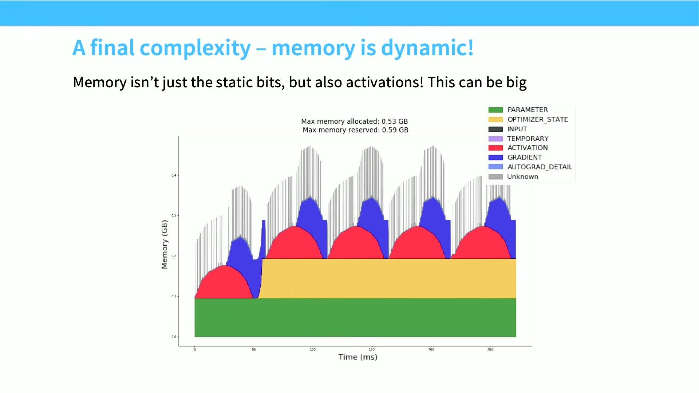
*图：参数与优化器状态形成相对稳定的底座，activation、gradient 与临时张量则随计算阶段反复涨落；峰值显存不能只按静态模型状态估算。（字幕区间：00:44:55--00:46:06）*

$$
M_{\mathrm{act}}=sbh\left(34+5\frac{as}{h}\right).
$$

- $M_{\mathrm{act}}$：每层 activation memory 的估计量。
- $s$：sequence length。
- $b$：microbatch size。
- $h$：hidden dimension。
- $a$：attention head 数。
- 常数 $34$ 与 $5$：特定架构、保存策略与数据类型下各类中间张量的合并系数。

括号中的 $5as/h$ 与注意力的二次项有关。FlashAttention 或 selective activation recomputation 可以避免长期保存这些大矩阵：backward 需要时重新计算，比从 HBM 反复读写更划算。

### 5.2 只有 TP 时仍留下复制的 pointwise activation

TP 切开 attention 和 MLP 的矩阵乘相关 activation 后，每层估算变为：

$$
M_{\mathrm{act,TP}}=sbh\left(10+\frac{24}{t}+5\frac{as}{ht}\right).
$$

- $M_{\mathrm{act,TP}}$：应用 TP 后的每层 activation memory 估计。
- $t$：tensor-parallel degree。
- $10sbh$：仍在每个 TP rank 复制的 LayerNorm、dropout 与 block 输入等 pointwise activation。
- 其余符号与前式相同。

$24/t$ 和注意力二次项能随 TP 缩小，但常数 10 不缩小。随着 $t$ 增加，这个复制项会成为显存扩展的地板。

### 5.3 Sequence Parallel 把逐点操作沿序列轴切开

LayerNorm 与 dropout 对每个 token 位置独立执行，因此不必让每个 TP rank 保存全序列。SP 把这些 pointwise 区域沿 sequence 轴切分：进入需要 TP matmul 的区域时 all-gather activation，离开时 reduce-scatter 回序列分片；backward 中相应 collective 方向反转。

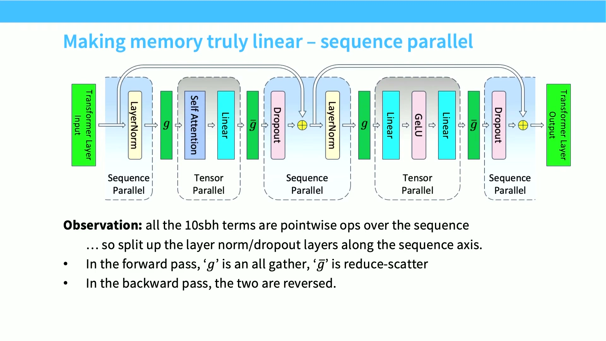
*图：逐点区域沿 sequence 轴切分，矩阵乘区域沿 tensor 轴切分；二者之间用 all-gather 与 reduce-scatter 转换布局。（字幕区间：00:49:23--00:51:00）*

TP、SP 与选择性重计算组合后，课件给出的理想估算可降为：

$$
M_{\mathrm{act,TP+SP+recomp}}=sbh\frac{34}{t}.
$$

- $M_{\mathrm{act,TP+SP+recomp}}$：组合三种机制后的每层 activation memory 估计。
- $t$：TP/SP 组大小。
- $s,b,h$：分别为序列长度、microbatch size 与 hidden size。
- $34$：同一特定估算中的线性 activation 系数。

这实现了 activation memory 对设备数的近似线性缩放。不过它不是“免费内存”：SP 增加边界 collective，重计算增加 FLOPs。

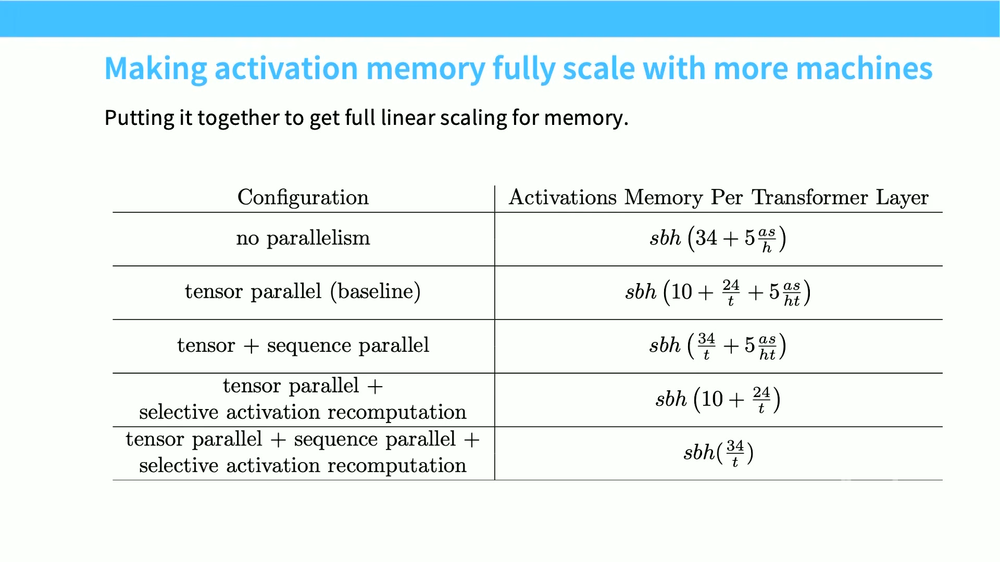
*图：课件汇总了无并行、仅 TP、TP+SP、TP+选择性重计算及三者组合的每层激活显存；最后一行在该估算下达到近似 $1/t$ 缩放。（字幕区间：00:51:00--00:52:15）*

### 5.4 Context Parallel 面向整个长上下文

SP 主要处理 Transformer block 中逐点区域的复制 activation；CP 则把长序列上的 attention context 与 KV 分到不同设备。Ring Attention 是一种典型实现：每张卡保留一块 query，KV blocks 沿环形拓扑依次流过；每卡累积局部 attention 结果，最终得到等价的全上下文 attention。

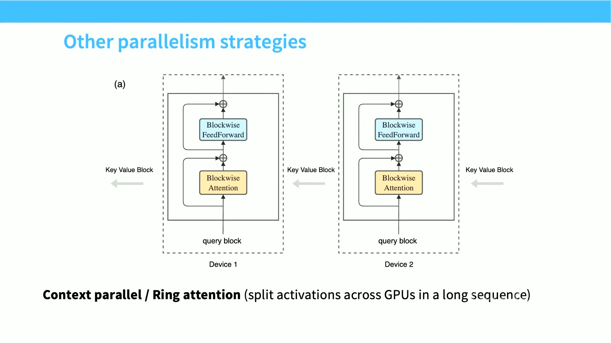
*图：两张设备保留各自的 query block，并让 KV block 沿环移动；它展示的是 CP 的高层通信结构，而非完整在线 softmax 算法。（字幕区间：01:01:00--01:01:52）*

两者都“沿序列切”，却解决不同层次的问题：SP 常与 TP 绑定，目标是消除 pointwise activation 冗余；CP 的目标是让超长 attention/KV 装得下，并需要跨卡完成全上下文交互。

### 5.5 为什么重计算可能反而提高端到端吞吐

重计算局部看一定增加 FLOPs，但它释放显存后可能允许更大的 microbatch，使矩阵乘更饱满、pipeline bubble 更小、通信更容易摊销。课件引用的实验正展示这种反直觉结果：小 batch 下不重计算更快；若重计算让 batch 可以继续增大，总 sequences/s 反而显著提升。

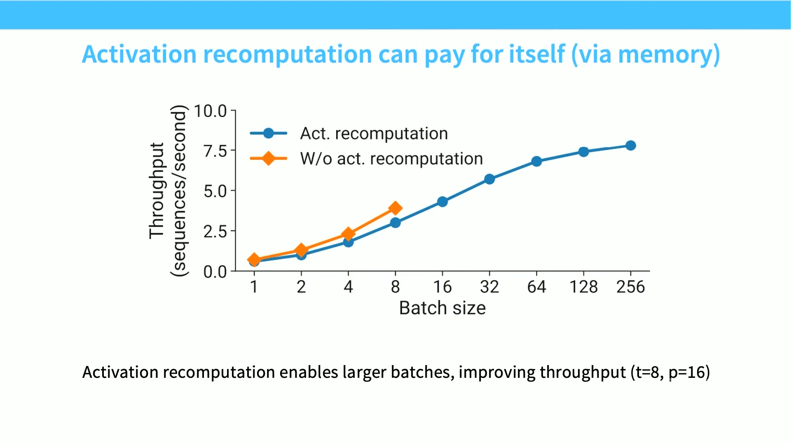
*图：在 $t=8,p=16$ 的特定实验中，无重计算配置止步于 batch 8；重计算释放显存后能继续扩大 batch，最终总吞吐更高。（字幕区间：01:11:51--01:12:27）*

> [!WARNING]
> 上述 activation 公式来自特定 Transformer、精度与保存策略，是解释缩放趋势的模型，不是所有架构都固定拥有 34、24、10、5 这些常数。使用 GQA、不同 dropout、融合算子或现代 attention kernel 时应重新估算。

### 本章小结

- 参数 sharding 之后，activation 仍可能因 microbatch、深度和长序列成为显存瓶颈。
- TP 只切矩阵乘相关激活，SP 进一步切 LayerNorm/dropout 等 sequence-wise point operations。
- CP 面向全 attention context/KV 的长序列切分，不应与 SP 混为同义词。
- 重计算用额外 FLOPs 换显存，若因此扩大 batch，端到端吞吐可能上升。

## 6. Expert Parallel：沿专家切 MoE

### 6.1 不切矩阵，改为路由 token

Mixture-of-Experts 用许多独立 FFN experts 替换 dense MLP，但每个 token 只激活少数 experts。EP 把不同 experts 放到不同 GPU，并执行四步通信—计算流程：

1. router 为每个 token 选择 top-$k$ experts。
2. all-to-all dispatch 把 token activation 发送到持有所选 expert 的 rank。
3. 各 GPU 对收到的 token 执行本地 expert GEMM。
4. all-to-all combine 把结果送回原 token 所在 rank，并恢复顺序。

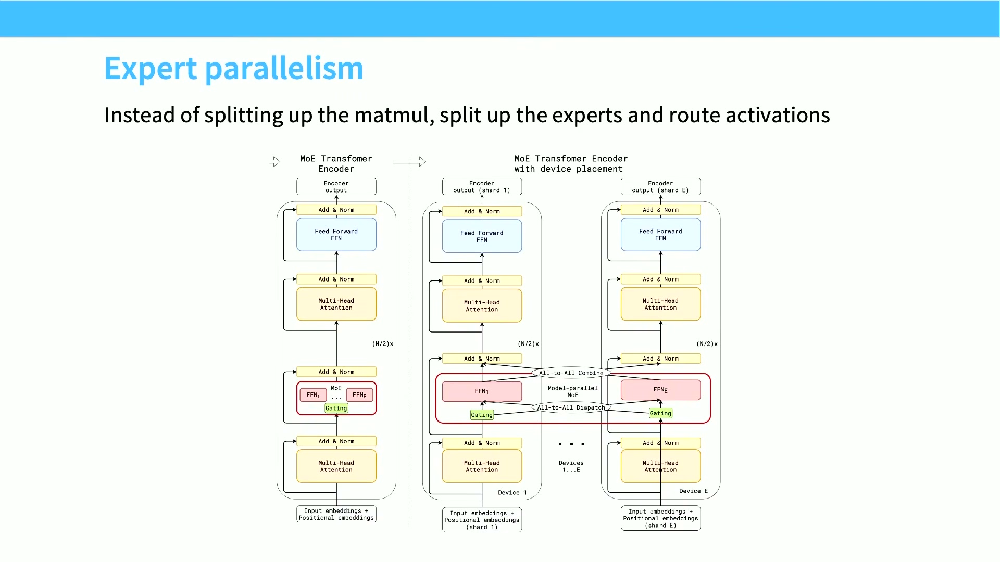
*图：不同设备持有不同 experts，token 先经 all-to-all dispatch 到目标 expert，完成本地 FFN 后再经 all-to-all combine 返回原序列位置。（字幕区间：00:53:21--00:54:21）*

它与 TP 都能切分 MLP 权重和计算，但机制完全不同。TP 把同一个矩阵切成部分和；EP 保留完整 expert 矩阵，移动的是 token。若每个 expert 能收到足够多 token，本地 GEMM 可以保持较大 shape，效率可能高于把矩阵进一步切碎。

### 6.2 EP 的难点是路由不规则性

EP 的两次 all-to-all 比规则 all-reduce 更难：

- 不同 expert 获得的 token 数可能极不均衡，慢 expert 会拖住整个 MoE layer。
- token 太少时，每个 expert 的 GEMM 变小，理论稀疏性无法转成硬件利用率。
- capacity factor、token dropping、auxiliary load-balancing loss 会影响质量与系统效率。
- 跨节点 EP 对网络和通信库要求很高，必须把 dispatch/combine 与其他计算重叠。

*图：视频补充页展示 DeepEP 的 dispatch/combine 内核与通信—计算 overlap；这也直接确认字幕中误识别的“DPP”应为 DeepEP。（字幕区间：00:56:16--00:57:59）*

> [!WARNING]
> “每个 token 只算少数 experts”只减少算术量，不自动减少通信延迟。MoE 能否加速，取决于 token batching、负载均衡、all-to-all 实现与拓扑。

### 6.3 为什么 attention 与 expert MLP 需要不同并行度

MoE 通常只替换 MLP，attention 仍然是 dense。于是同一 Transformer block 出现矛盾：attention 可能需要较高 TP 才能切开大矩阵；expert MLP 已由 EP 切分，若再用很高 TP，每个本地 expert GEMM 会被切得太小。

Megatron 的 parallel folding 为两类子层定义不同的逻辑布局。attention 使用：

$$
\mathcal{P}_{\mathrm{attn}}=TP\times CP\times DP\times PP.
$$

- $\mathcal{P}_{\mathrm{attn}}$：attention 层的逻辑进程组布局。
- $TP$：attention tensor-parallel degree。
- $CP$：context-parallel degree。
- $DP$：attention data-parallel degree。
- $PP$：共享的 pipeline-parallel degree。

MoE-MLP 使用：

$$
\mathcal{P}_{\mathrm{MoE}}=ETP\times EP\times EDP\times PP.
$$

- $\mathcal{P}_{\mathrm{MoE}}$：MoE-MLP 的逻辑进程组布局。
- $ETP$：expert 内部 tensor-parallel degree。
- $EP$：expert-parallel degree。
- $EDP$：expert data-parallel degree。
- $PP$：与 attention 共享的 pipeline 维度。

同一批 ranks 在 attention 与 MoE 子层中可被重新分组：attention 采用较高 TP/CP，MoE 采用较低 ETP、较高 EP。这里的乘号描述逻辑维度组合；存在 group 复用与 rank 重排时，不能把所有数字机械相乘成物理 GPU 数。

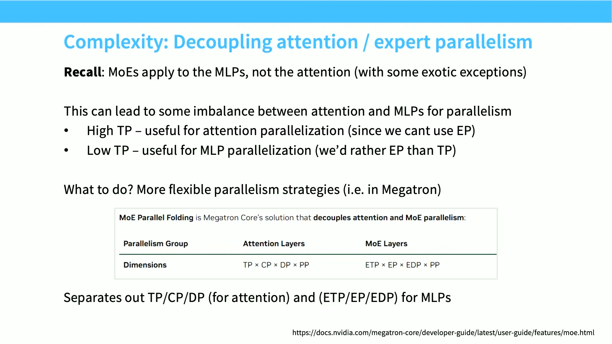
*图：Megatron 为 attention 与 MoE-MLP 定义两套并行维度，使 attention 的高 TP/CP 需求不再迫使 expert GEMM 继续碎片化。（字幕区间：00:59:32--01:00:58）*

### 6.4 “EP < DP” 是旧式布局经验，不是定律

一些实现把 EP group 嵌套在 DP domain 中，可写为：

$$
\mathcal{G}_{\mathrm{EP}}\subseteq\mathcal{G}_{\mathrm{DP}}.
$$

- $\mathcal{G}_{\mathrm{EP}}$：参与一次 expert dispatch/combine 的设备集合。
- $\mathcal{G}_{\mathrm{DP}}$：构成数据并行 replicas 的设备集合。
- $\subseteq$：表示特定进程组布局中的嵌套关系。

课件将这种经验简写成 `EP < DP`。现代 frontier MoE 已能借助专用通信库、overlap 和更灵活的 process groups 把 EP 扩到跨节点，因此它不是框架无关的数学约束。

### 本章小结

- EP 把完整 experts 放到不同设备，核心通信是 token all-to-all dispatch/combine。
- 它能保持较大的本地 GEMM，但会受到负载不均、token 粒度与网络延迟限制。
- attention 与 MoE-MLP 的最佳并行度不同，parallel folding 允许两套进程组布局解耦。
- EP 与 TP 目标相似但通信机制不同；旧式 `EP<DP` 嵌套也不是普适定律。

## 7. 3D/4D 并行：把不同通信映射到不同网络层级

### 7.1 一张统一账本

把所有方法放在一起时，最有效的问题不是“哪个最好”，而是逐行检查：

| 方法 | 切分对象 | 主要通信 | 参数状态显存 | 激活/KV 显存 | 主要限制 |
| --- | --- | --- | --- | --- | --- |
| DDP / ZeRO-1 | batch / optimizer state | 每步梯度 collective | 参数不切；ZeRO-1 切 optimizer | 不切 | global batch 与梯度通信 |
| FSDP / ZeRO-3 | 全部训练状态 | 参数 all-gather、梯度 reduce-scatter | 约按 DP 切 | 不自动切 | 参数通信、latency、prefetch |
| PP | 层/深度 | stage 间 activation P2P | 约按 PP 切 | 取决于 schedule/buffer | bubble、stage imbalance |
| TP | 层内矩阵/宽度 | 每 block activation collective | 相关权重约按 TP 切 | 相关激活可切 | 高速互联、频繁阻塞 |
| SP / CP | sequence/context | sequence/KV exchange | 通常不切参数 | 约按 SP/CP 切 | 长序列通信、实现复杂度 |
| EP | experts | MoE 层 token all-to-all | expert weights 约按 EP 切 | 不直接切 | 负载、token 粒度、A2A |

这张表解释了为什么没有单一严格占优方案。FSDP 能切全部状态，却不减 activation；TP 能切层内权重和部分 activation，却要求快网络；PP 能跨慢链路，却产生 bubble；EP 适合 MoE，却引入不规则路由。

### 7.2 先让模型装得下，再最大化 DP

讲者把复杂组合压缩成一组可执行规则：

1. 在模型尚未装下时，先增加模型并行。dense 模型在单节点高速域内增 TP，MoE 增 EP；长序列增 SP/CP。
2. 跨节点继续解决容量时，使用 PP；或者在带宽与 overlap 足够时使用 FSDP。
3. 模型装下后，把剩余 GPU 用于 DP，以最直接的方式扩吞吐。
4. DP 使每卡 batch 过小时，使用 gradient accumulation 增加同步前工作量，但要检查有效 global batch 对优化的影响。

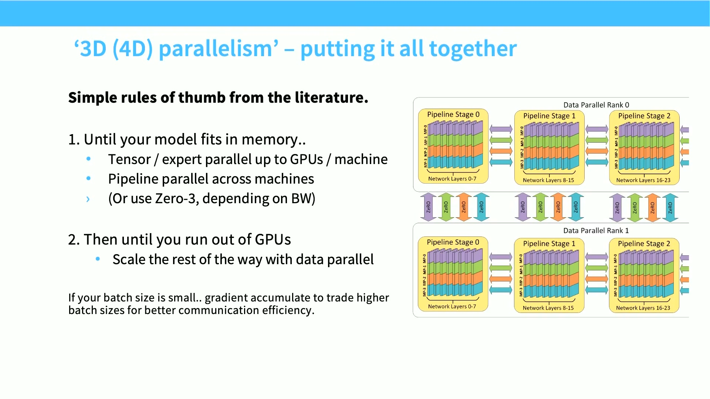
*图：先用 TP/EP、PP 或 ZeRO-3 解决容量，再把剩余设备用于 DP；图中右侧还显示 DP replica 内部的 pipeline 与 model-parallel 组合。（字幕区间：01:06:05--01:07:13）*

对于普通 dense 3D parallelism，总设备数常近似为：

$$
N_{\mathrm{GPU}}=D\times T\times P.
$$

- $N_{\mathrm{GPU}}$：训练使用的 GPU 总数。
- $D$：data-parallel degree。
- $T$：tensor-parallel degree。
- $P$：pipeline-parallel degree。

加入 CP、EP 或 parallel folding 后，进程组可能复用或重新排列，不应无条件继续相乘。

### 7.3 用 compute/communication ratio 判断能否隐藏通信

系统设计的关键不是理论通信量最小，而是通信是否落在计算后面。可用简化比率表达：

$$
R=\frac{T_{\mathrm{compute}}}{T_{\mathrm{comm}}}.
$$

- $R$：计算时间相对通信时间的比值。
- $T_{\mathrm{compute}}$：同一层或窗口中的有效计算时间。
- $T_{\mathrm{comm}}$：同一窗口中需要完成的通信时间。

当 $R\ge 1$ 且软件支持异步 overlap 时，通信有机会藏在计算下；当 $R<1$，设备会进入 communication-bound 区域。batch 很大时纯 FSDP 也可能工作良好；batch 下降后，加入 TP 等 model parallel 可以改变每卡计算/通信比例，把可用区域推向更小 batch。

> [!IMPORTANT]
> “通信可以 overlap”不是自动发生。必须有正确的 stream、prefetch 顺序和足够长的独立计算；依赖链上的 collective 仍会阻塞。

### 7.4 Narayanan 2021 提供的经验规律

课件引用的实验把模型从 1.7B 扩到约 1T：TP 先从 1 增到 8 后固定；PP 继续增到 64 以容纳更深更大的模型；DP 则从 32 逐步降到 6。组合 pipeline + tensor + data parallel 的 PTD-P 在增加 GPU 时保持较平的 per-GPU throughput，而只用 ZeRO-3 的曲线下降更明显。

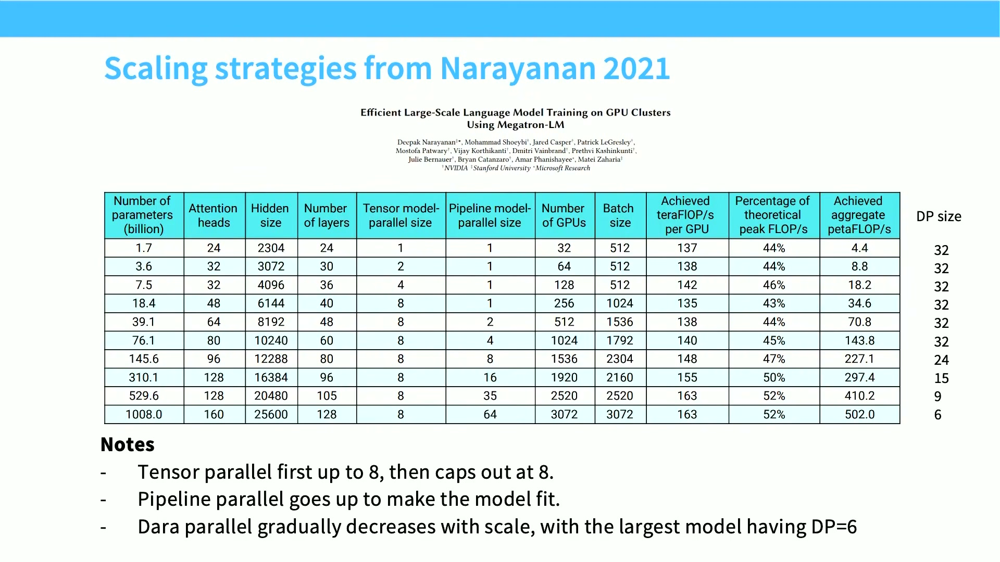
*图：在 Narayanan 2021 的特定配置表中，TP 先达到 8，PP 随模型继续增大，DP 则在超大模型阶段下降；页内 “Dara parallel” 是 Data parallel 的拼写错误。（字幕区间：01:09:37--01:10:47）*

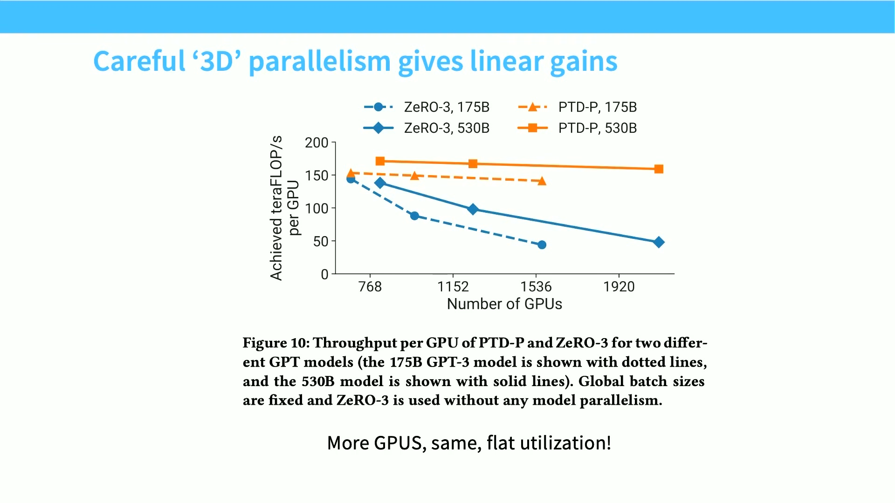
*图：固定 global batch 时，组合 pipeline、tensor 与 data parallel 的 PTD-P 曲线比只用 ZeRO-3 更能维持每 GPU 吞吐；这是特定 175B/530B 实验，不代表任何拓扑都同样获益。（字幕区间：01:10:47--01:11:20）*

原因不是“ZeRO-3 错了”，而是纯 FSDP 在大规模跨节点时要搬运更多参数；用 TP/PP 把高频通信限制在更合适的互联域，可以保持每卡利用率。课件另一项 64 A100 GPU 实验显示 TP=8、PP=8 较优；这只说明该模型与硬件上的 optimum，不能外推为任意集群的常数。

### 7.5 实际选型应遵循拓扑，而非缩写数量

一个可操作的初始映射是：

- 节点内最快互联：TP、较小范围 EP，以及与 TP 配套的 SP。
- 跨节点：PP 的相邻 activation P2P，或经过精细 overlap 的 FSDP。
- MoE 大规模跨节点：专用 all-to-all 库与通信—计算 overlap；不能只提高 `EP` 数字。
- 超长上下文：提高 CP，并相应减少 DP 以维持总设备数。
- 剩余设备：DP。

之后必须 profile。需要检查 matmul shape、collective latency、pipeline bubble、每 expert token 数、峰值显存和故障率；heuristic 只提供搜索起点。

### 本章小结

- 多维并行的目标是把不同通信模式放进最适合它们的物理互联层级。
- 选型顺序可压缩成“先装下模型，再用 DP 扩吞吐”。
- 计算足够长、依赖允许且软件正确 overlap 时，通信才能被隐藏。
- TP≈8、PP 跨节点等都是有用经验，但必须用当前模型 shape 与集群 profiling 验证。

## 8. 从真实模型配置读出约束

### 8.1 OLMo：较小 dense 模型可以主要依靠 FSDP

OLMo 7B 使用 FSDP，并能扩到许多 GPU。这个案例说明，当模型相对较小、batch 足够、参数通信可被隐藏时，单一 sharding 策略可以兼顾实现简单与扩展性。

讲者先口误说成 Dolma，随后当场纠正：**OLMo 是模型，Dolma 是数据集**。这也提醒我们，课件中的真实配置应按模型版本核对，不要只记项目名。

### 8.2 DeepSeek 与 Yi：模型从 dense 变成 MoE，并行轴也随之改变

早期 dense DeepSeek 采用 ZeRO-1 + TP + SP + PP。DeepSeek-V3 是 MoE，课件列出 PP=16、EP=64 和 ZeRO-1；64-way EP 覆盖 8 个节点，并用 1F1B 风格的 all-to-all overlap 减少空转。这是现代大 EP 突破“只在单节点做 EP”旧经验的代表，但也依赖复杂专用系统。

dense Yi 同样采用 ZeRO-1 + TP + PP；Yi-Lightning 转向 MoE 后，以 EP 替换一部分 TP。这里可迁移的结论是：结构变化会改变最自然的切分对象。dense MLP 用 TP，多个 experts 则优先考虑 EP。

### 8.3 Llama 3 405B：同一模型在不同训练阶段重新分配设备

普通预训练阶段的一行配置为：

$$
8_{TP}\times1_{CP}\times16_{PP}\times128_{DP}=16{,}384\ \mathrm{GPUs}.
$$

- $8_{TP}$：八路 tensor parallel。
- $1_{CP}$：不扩展 context parallel。
- $16_{PP}$：十六个 pipeline stages。
- $128_{DP}$：128 路 data parallel。
- $16{,}384$：总 GPU 数。

进入 131,072-token 长上下文阶段后：

$$
8_{TP}\times16_{CP}\times16_{PP}\times8_{DP}=16{,}384\ \mathrm{GPUs}.
$$

- $16_{CP}$：把上下文切到 16 路。
- $8_{DP}$：设备预算转给 CP 后，DP 从 128 降到 8。
- 其余符号与前式相同。

总设备数没有变，变的是瓶颈：普通序列阶段尽量扩大 DP，长上下文阶段则必须用 CP 容纳 activation/KV。并行配置不是模型的永久属性，而是训练 phase 的函数。

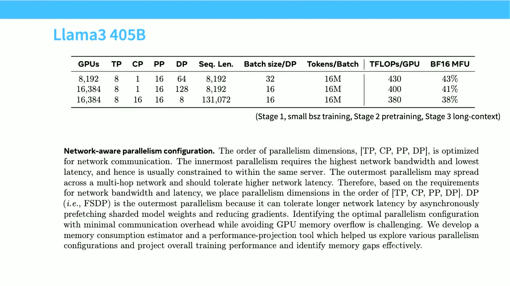
*图：普通预训练把大量设备用于 DP；131,072-token 长上下文阶段把 CP 提到 16、DP 降到 8，同时保持 16,384 GPUs。（字幕区间：01:14:50--01:15:53）*

Llama 3 的报告还记录了 54 天内多类训练中断，其中 148 次被归为 faulty-GPU interruption。它不是“148 张 GPU 永久损坏”，却足以说明万卡训练还必须设计 checkpoint、容错、冗余和快速恢复。

### 8.4 Gemma、Mixtral、Nemotron 与 Qwen：配置数字必须带来源限定

Gemma 2 展示 TPU 路线：ZeRO-3-like optimizer sharding、TP/SP 与 DP，在较大 mesh 上不一定需要 PP。讲者同时保留限定——这种方式能否无限 scale-out 并不清楚。

Megatron 的 Mixtral 8×22B 示例给出 TP/PP/CP/EP=4/4/1/8。课件为了组成 256 GPUs 推测 DP=2；这个 `likely` 不能被改写成原训练团队确认的事实。

Nemotron 3 Super 的长上下文示例使用 TP=2、CP=64、EP=64。课件写 PP=0，语义是“不使用 PP”，规范 group degree 应理解为 1，而不是数学上的零个 stage。

Qwen 3 MoE 的大模型推荐示例使用 TP=2、PP=8、EP=32；小模型可在单节点做 EP=8。课件标题写 225B-A22B，表内则写 235B-A22B，因此在没有核对原始版本前，不应擅自消除冲突。

### 8.5 从案例中提炼模式，而不是背配置表

跨模型最稳定的三条观察是：

- 模型装得下、batch 允许时，DP 通常尽可能大。
- TP 常被控制在一个高速互联域内，所以许多案例取 8 或更小。
- MoE 会把设备预算转给 EP，长上下文会把设备预算转给 CP；这两者都可能让 DP 下降。

课件总表保留了多个 `??`，表示讲者并未确认对应值；`0` 则表示未使用该维度。对初学者而言，诚实保留未知值比补出一张看似完整的表更重要。

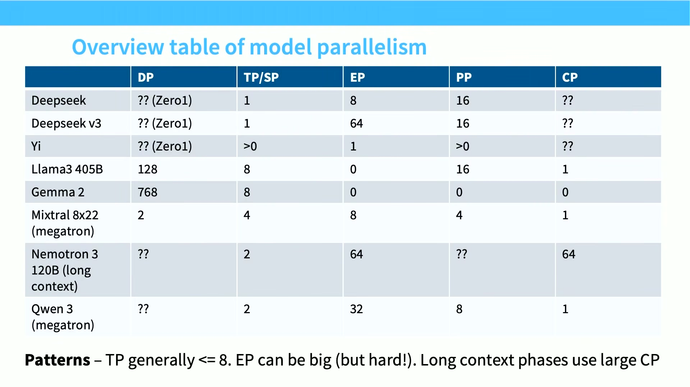
*图：课件保留未知值 `??`；表内的 `0` 表示未采用该维度，而不是合法 group degree 为 0。Mixtral 与 Qwen 行还是 Megatron 示例/推荐配置，不必等同于原训练团队配置。（字幕区间：01:18:49--01:19:20）*

### 本章小结

- 简单 dense 模型可主要使用 FSDP；更大 dense 模型常组合 TP、PP、DP。
- MoE 把 MLP 切分重点从 TP 转向 EP，并要求专用 all-to-all overlap。
- 同一模型进入长上下文阶段时，会提高 CP、降低 DP。
- 真实配置表中经常混有推荐值、推测值和未知值，必须保留来源限定。

## 总结与延伸

讲者最后把整讲压缩成三点。第一，超过一定规模后，训练必须成为 multi-GPU、multi-node，甚至 multi-datacenter 的系统问题。第二，不存在一个能同时解决参数、activation、batch 与通信瓶颈的单一方案。第三，尽管实现复杂，组合仍有简单可解释的规则：最高频、最延迟敏感的通信放在最快链路上，先让模型装得下，再用剩余设备扩大 DP。

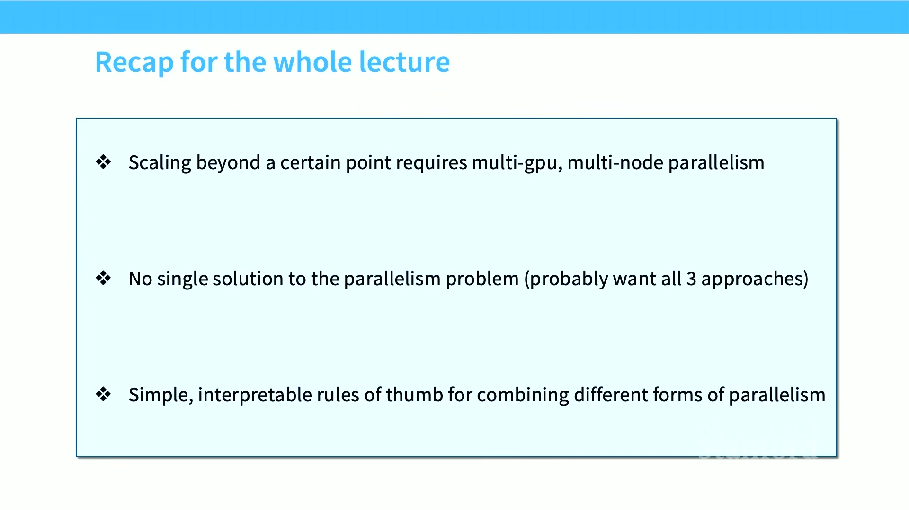
*图：规模迫使训练走向多卡多节点；没有单一并行方案；组合方法仍有简单、可解释的经验规则。（字幕区间：01:19:20--01:20:01）*

把所有方法压缩成“切什么、传什么”，可以得到一张心智地图：

- **DP**：切 batch，传梯度。
- **ZeRO/FSDP**：切训练状态，按需传参数与梯度。
- **PP**：切层，传相邻 stage activation。
- **TP**：切层内矩阵，频繁传 activation partial results。
- **SP**：切逐点操作的 sequence activation。
- **CP**：切长上下文/KV，跨设备完成全 attention。
- **EP**：切 experts，路由 token。

### 一个可执行的并行选型流程

1. 计算参数、梯度、optimizer state 与 activation，确认 OOM 来源。
2. 画出物理拓扑：每节点 GPU 数、节点内带宽、节点间带宽与通信域。
3. dense 层单卡放不下时在快链路内增 TP；MoE expert 很大时增 EP；长序列增加 SP/CP 或重计算。
4. 总参数/深度仍装不下时，跨节点增 PP，或在带宽与 overlap 足够时用 FSDP。
5. 模型已装下后，把剩余设备用于 DP。
6. 检查 global batch、pipeline microbatch、每 expert token 数和 matmul shape 是否足以维持利用率。
7. 用真实 profile 验证通信是否被覆盖，并把 checkpoint、故障恢复纳入设计。

### 仍值得继续追问的问题

- 对一个给定 Transformer shape，能否自动搜索 TP/PP/DP/CP/EP 的最优 process-group 映射？
- 当 GPU 节点从 8 卡域变成更大的 NVLink/NVSwitch domain，TP≈8 的经验会怎样变化？
- 更灵活的 parallel folding 能否扩展到 attention、MoE、embedding 与输出层的更多异构组合？
- 长上下文阶段中，CP、FlashAttention、KV 压缩与重计算的最优边界在哪里？
- 万卡训练里，硬件故障率与 checkpoint 开销会怎样反向决定并行布局？

下一讲进入 scaling laws。这里的自然连接是：并行系统决定了给定硬件预算能真正转化为多少有效训练 FLOPs；如果利用率低，纸面计算预算就不会按 scaling law 预期转化为模型能力。

### 本章小结

- 各种并行方法是在 batch、状态、深度、宽度、序列或 experts 等不同轴上切分工作。
- 最佳组合由显存瓶颈、通信模式、算子 shape 和物理拓扑共同决定。
- heuristic 提供起点，最终答案必须来自端到端 profiling 与可靠性验证。
