# Stanford CS336 2026 Lecture 9：Scaling Laws — Basics


- **视频标题**：Stanford CS336 Language Modeling from Scratch | Spring 2026 | Lecture 9: Scaling Laws
- **频道**：Stanford Online
- **视频链接**：<https://www.youtube.com/watch?v=Q15rhEWZPQ4>
- **时长**：01:17:57
- **材料范围**：人工英文字幕、1080p 课程视频与官方 `lecture_09.pdf`（57 页，本讲义逐页覆盖）
- **课程定位**：缩放律基础；连接经典统计学习、数据缩放、模型工程、计算最优和 Kaplan–Chinchilla 争论

> [!IMPORTANT]
> 这堂课最值得学会的不是“20 tokens/parameter”或某个固定指数，而是一套证据驱动的工程方法：先在小规模上测量稳定规律，明确横轴、训练 recipe 与适用区间，再用外推约束大规模决策。缩放律只能预测“把当前 recipe 继续放大”会发生什么；它不会替你保证 recipe 本身是最优的。

## 1. 为什么大模型工程需要缩放律

### 1.1 一万张 B200，也不能靠试错挥霍

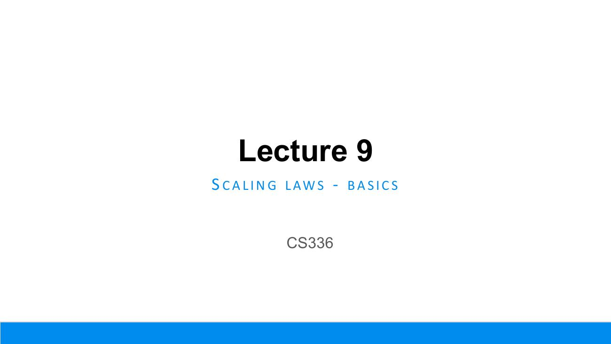

课件第 1 页是标题页。本讲是全课程第一次系统处理“规模”问题：前八讲解决了 tokenizer、架构、注意力变体、GPU/TPU 系统、内核优化与并行化——即“怎么把一个大模型训练起来”；从本讲开始回答一个更上游的问题——“应该训练什么样的模型”。讲者将本讲定位为 scaling laws 的基础课，进阶专题（如 muP 细节、MoE 缩放）留待后续。

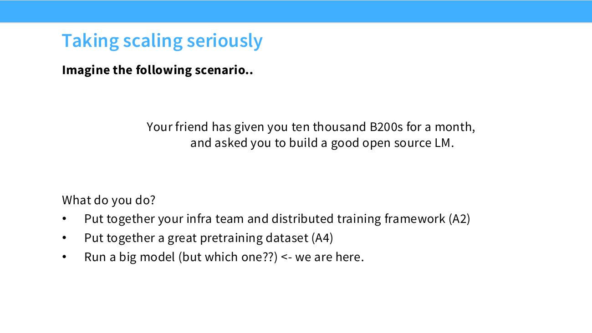

第 2 页给出全课的思想实验：假设有人给你一万张 B200、一个月时间，要训练一个高质量开源语言模型。课件把待办事项拆成三条，并标注“我们在这里”：

1. 组建基础设施团队与分布式训练框架——这对应课程作业 A2，前面 lecture 5–8 已经覆盖；
2. 组建高质量预训练数据集——对应作业 A4 与数据处理相关讲座；
3. **训练一个大模型（但哪一个？？）**——这是本讲的核心问题。

架构多深多宽？参数量多大？训练多少 token？batch size 与学习率如何设置？这些选择在小实验里只是几次重跑，在目标规模上却可能价值数百万美元。照抄现有模型能得到一个合理起点，但如果目标是超过现有模型，就不能永远复制他人的答案。

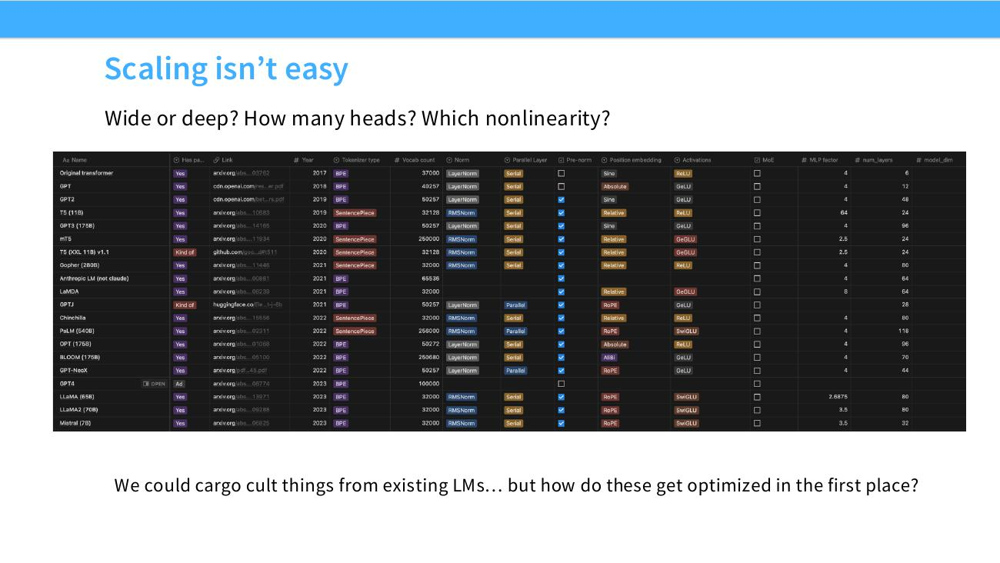

第 3 页展示一张现存知名语言模型的超参数对照表（从 2017 年原始 Transformer 到 GPT-2、T5、GPT-3、Gopher、Chinchilla、PaLM、OPT、BLOOM、LLaMA、Mistral 等），列包括 tokenizer 类型、词表大小、Norm 类型、串并行结构、位置编码、激活函数、MLP 比例、层数与隐藏维度。表格的直观信息是：**这些模型的超参数选择彼此差异很大，而且没有任何先验原则告诉你哪一组是对的**。课件底部的问题一针见血——我们可以对现有模型“ cargo cult ”（照抄仪式化的配置），但这些配置最初又是如何被优化出来的？这正是缩放律要回答的问题。

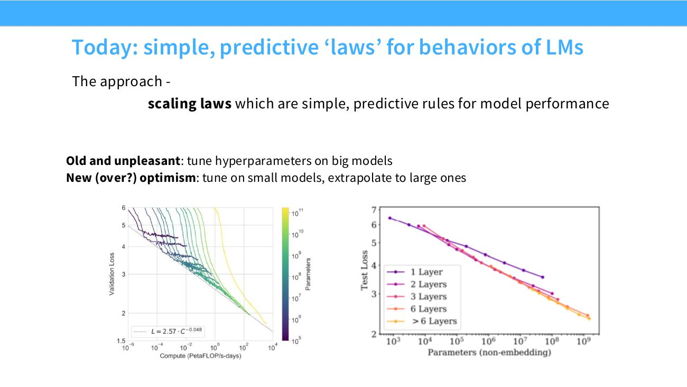

第 4 页给出本讲的方法论宣言：

- **Old and unpleasant**：直接在昂贵的大模型上调超参数；
- **New (over?) optimism**：在小模型上调，把规律外推到大模型。

讲者特意在 optimism 前加了一个带括号的 “over?”，提醒读者这套范式并非无条件成立，全课会反复回到它的适用边界。页面下方的两张图是外推范式的效果展示：左图是 Kaplan 风格的 compute–loss 包络（不同参数量模型的训练曲线汇成一条 $L=2.57\,C^{-0.048}$ 的下包络），右图是不同层数模型的 test loss 对 non-embedding 参数量的 log-log 直线——两者都预示“小规模测量到的规律可以延伸数个数量级”。

### 1.2 缩放律是什么

课程采用工程定义：缩放律是一条简单、可预测的规则，用来描述资源规模与模型性能之间的关系。资源可以是数据量、参数量、训练计算量，甚至 MoE 稀疏度；性能通常先用平滑的预训练 loss 或 perplexity 表示。

如果在小尺度到中尺度间观察到稳定关系，就可以尝试外推到更大的训练 run。这里有三个层次：

1. **测量**：训练一组小模型，控制变量并记录 loss。
2. **拟合**：选择有意义的函数形式，估计斜率、截距和渐近项。
3. **决策**：比较候选 recipe 在目标规模的预测，而不是只比较最小实验上的单点。

> [!WARNING]
> “law”并不意味着自然定律。讲者明确把许多缩放律称为纯粹的 curve fitting；理论提供合理的候选函数和极限行为，却没有保证幂律是唯一正确形式。

### 1.3 它并不是 2020 年才出现的思想

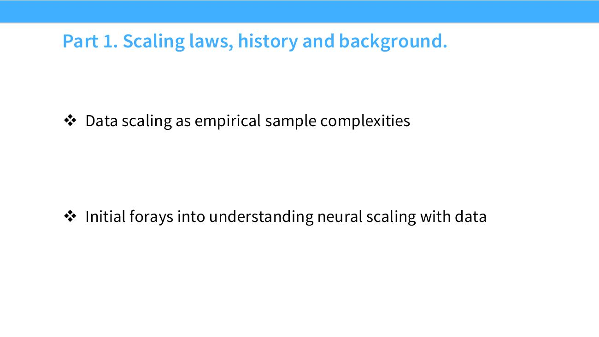

第 5 页是 Part 1 的章节页，预告两条历史线索：一是把数据缩放看作“经验样本复杂度”（empirical sample complexities），二是早期理解神经数据缩放的尝试。讲者强调缩放思想远早于 LLM 热潮，本节的目的是让读者把现代 scaling law 放进统计学习理论与三十年经验工作的连续谱中。

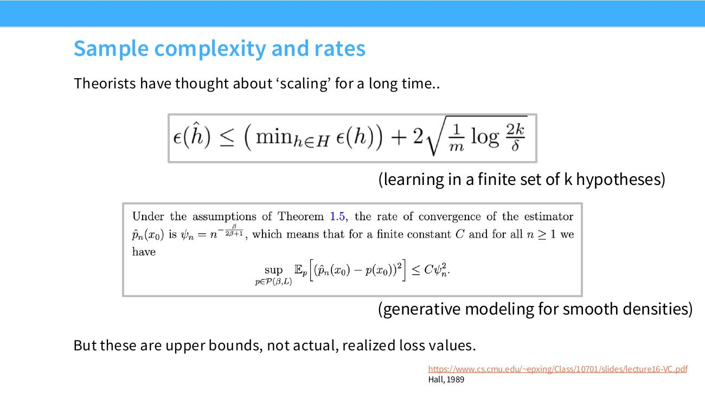

第 6 页把缩放律和经典样本复杂度联系起来。有限假设类的一类泛化上界可以写成：

$$
\epsilon(\hat h)
\leq
\min_{h\in H}\epsilon(h)
+2\sqrt{\frac{1}{m}\log\frac{2k}{\delta}}.
$$

- $\hat h$：从训练数据选出的假设。
- $H$：候选假设集合。
- $h$：集合中的任一假设。
- $\epsilon(\cdot)$：真实风险或泛化误差。
- $m$：样本数。
- $k$：有限假设的数量。
- $\delta$：置信失败概率。

页面下半部分还引用了 Hall 1989 年关于光滑密度估计的结果：在 $\beta$ 阶光滑性假设下，估计量的收敛速率为 $\psi_n=n^{-\beta/(2\beta+1)}$，即均方误差以 $n^{-2\beta/(2\beta+1)}$ 的多项式速率下降。这两个结果的共同点是：**误差随样本量以多项式速率衰减**——这正是后来一切幂律缩放的理论原型。但课件同时点明关键差异：“these are upper bounds, not actual, realized loss values”。理论上界关心的是“误差最多有多坏”，而现代经验缩放律更关心“实际 loss 会是多少”。两者不是同一对象，但都在问：资源增加时，误差以什么速率下降？

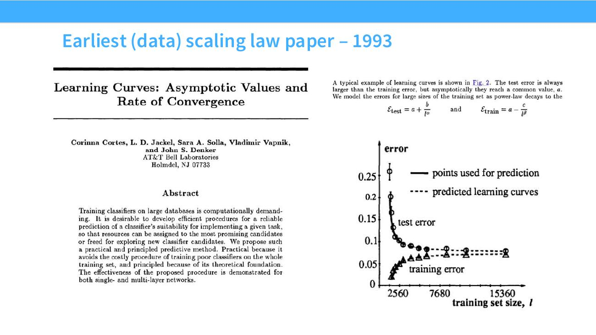

第 7 页展示 1993 年 Bell 实验室 Cortes、Jackel、Solla、Vapnik、Denker 的论文，这被视为最早的数据缩放律工作。其核心想法与今天的实践完全一致：在大数据库上训练分类器代价高昂，因此希望**用小训练集上的学习曲线预测大训练集的误差**，从而把计算资源分配给最有前途的候选模型。论文把大样本区的误差建模为幂律衰减：

$$
\varepsilon_{\mathrm{test}}=a+\frac{b}{l^\alpha},
\qquad
\varepsilon_{\mathrm{train}}=a-\frac{c}{l^\beta}.
$$

- $l$：训练集大小。
- $a$：测试误差与训练误差共同收敛到的渐近值。
- $b,c$：两条曲线的幅度系数。
- $\alpha,\beta$：各自的收敛速率指数。

注意这个三参数形式 $a+b\,l^{-\alpha}$ 已经包含了现代缩放律的两个要素：**不可约渐近项** $a$ 与**幂律衰减项**。右图显示用小样本点（实线）外推的学习曲线（虚线）准确预测了大样本区的测试误差——这是“从便宜实验外推昂贵实验”的第一次成功演示。

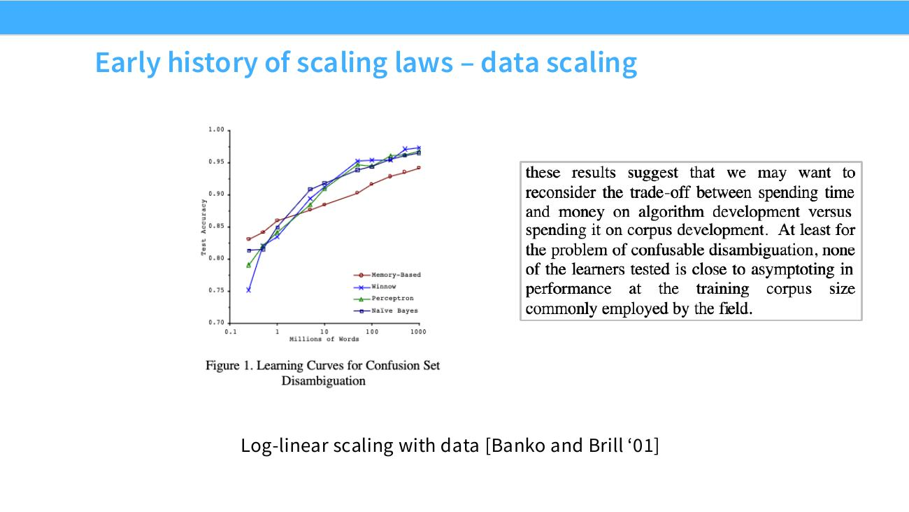

第 8 页引用 Banko 与 Brill 2001 年的著名实验：在混淆集消歧任务上，Memory-Based、Winnow、Perceptron、Naive Bayes 四种性质迥异的学习器，其测试准确率都随训练语料从约 10 万词增至 10 亿词而持续上升，且曲线在 log 数据轴下近似线性。课件引用的原文结论值得逐字体会：“没有任何一个学习器在当前常用语料规模下接近渐近”。这直接挑战了“算法改进优先于语料扩充”的当时共识，是“数据规模本身就是一种算法改进”这一现代观念的源头之一。

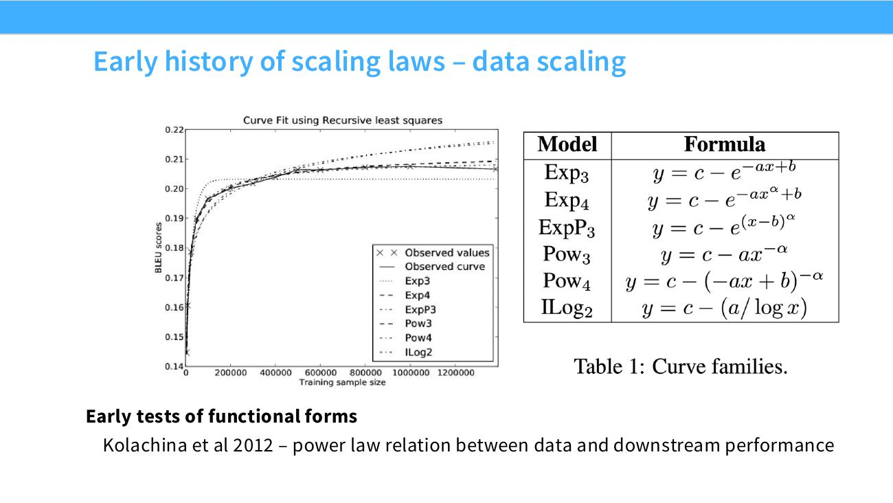

第 9 页展示 Kolachina 等 2012 年的系统比较：针对机器翻译中 BLEU 分数随训练样本量的学习曲线，他们测试了六个候选函数族——三个指数族（$\mathrm{Exp}_3$：$y=c-e^{-ax+b}$；$\mathrm{Exp}_4$：$y=c-e^{-ax^\alpha+b}$；$\mathrm{ExpP}_3$：$y=c-e^{(x-b)^\alpha}$）、两个幂律族（$\mathrm{Pow}_3$：$y=c-ax^{-\alpha}$；$\mathrm{Pow}_4$：$y=c-(-ax+b)^{-\alpha}$）和一个倒数对数族（$\mathrm{ILog}_2$：$y=c-(a/\log x)$）。结论是幂律族在数据量与下游性能的关系上拟合最好。这页的历史意义在于：**“幂律”作为正确函数形式并不是显然的，而是在与多个候选族的竞争中胜出的经验事实**——这与讲者“scaling law 本质是 curve fitting”的告诫互为表里。

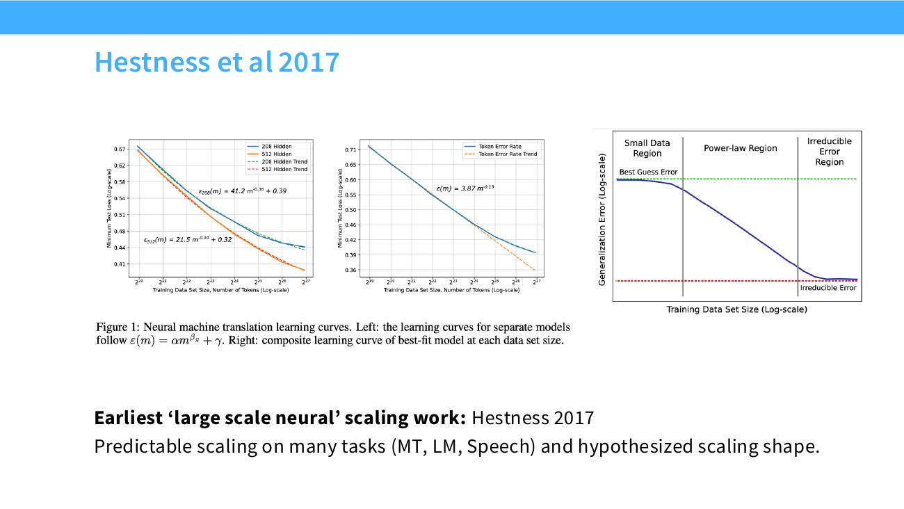

第 10 页进入深度学习时代。Hestness 等 2017 年的工作是现代神经缩放律的奠基作，课件展示其机器翻译学习曲线：单个模型的曲线遵循

$$
\varepsilon(m)=\alpha m^{\beta_g}+\gamma,
$$

- $m$：训练数据集大小。
- $\varepsilon(m)$：数据规模为 $m$ 时达到的最低测试损失。
- $\alpha$：幅度系数（图中 20B 与 512 hidden 模型分别为 41.2 与 21.5）。
- $\beta_g$：幂律指数（图中为 $-0.31$、$-0.30$）。
- $\gamma$：不可约误差渐近项（图中为 0.39、0.32）。

右图是该文提出的著名三区域形状假说：小数据区（误差贴近“随机猜测”水平线）、幂律区（log-log 下直线下降）、不可约误差区（曲线弯平逼近地板）。这张“S 形”示意图后来成为所有数据缩放讨论的共同语言。

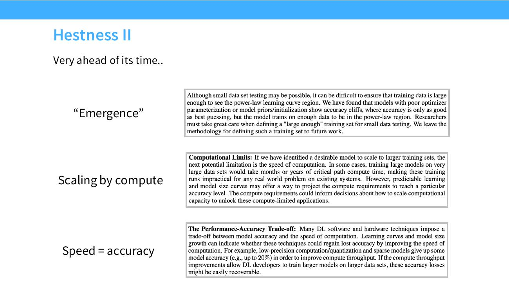

第 11 页摘录 Hestness 论文中三段“非常超前”的论述：

1. **“Emergence”**：优化器参数化不佳或初始化不当的模型会表现出 accuracy cliffs——在幂律区内的数据量上准确率仍接近随机猜测。这提示所谓“能力突现”有时来自训练动力学或观察指标的离散性，而非学习过程本身不连续。loss 往往平滑，accuracy 却可能在阈值附近突然跳变。
2. **Scaling by compute**：一旦确定了值得放大的模型，下一个瓶颈是计算速度；可预测的学习曲线与模型规模曲线可以**反推达到目标精度所需的计算量**，从而指导算力扩容决策。
3. **Speed = accuracy**：许多软硬件技术（低精度计算、量化、稀疏化）牺牲若干精度换取吞吐；如果吞吐提升能让同样的时间训练更大的模型、用更多的数据，损失掉的精度“might be easily recoverable”。这是后来“用系统效率换模型质量”思想的最早表述之一。

历史脉络也很连续：1993 年的学习曲线工作已经尝试用小训练集预测大训练集的误差；Banko 与 Brill 在 2001 年讨论“更多语料还是更多算法开发”；Kolachina 等在 2012 年比较多种曲线函数；Hestness 等在 2017 年跨机器翻译、语言建模和语音识别观察到神经网络的稳定幂律。

### 本章小结

- 大模型调参昂贵，缩放律用小规模实验约束大规模决策。
- 它是一种“测量—拟合—外推—决策”的工程范式。
- 理论样本复杂度提供函数形式直觉，但经验 loss 不是理论上界。
- 缩放思想有长期历史；现代 LLM 只是把它推到了更大的资源范围。

## 2. 数据缩放：为什么 log-log 图上会出现直线

### 2.1 从经验曲线读出幂律

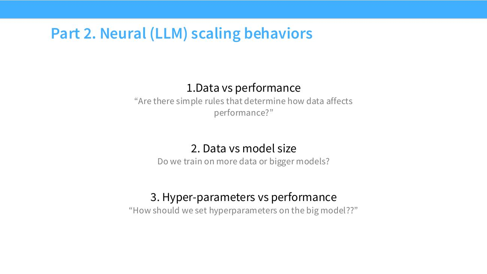

第 12 页是 Part 2 的章节页，把后半堂课组织为三个问题：

1. **Data vs performance**：是否存在决定数据如何影响性能的简单规则？（第 2–3 章）
2. **Data vs model size**：该用更多数据还是更大模型？（第 5 章的联合缩放与 Chinchilla）
3. **Hyper-parameters vs performance**：大模型上的超参数该怎么设？（第 4 章的架构、batch、学习率）

这三个问题恰好对应本讲义第 2–5 章的结构，读者可以把它们当作后面二十余页课件的导读。

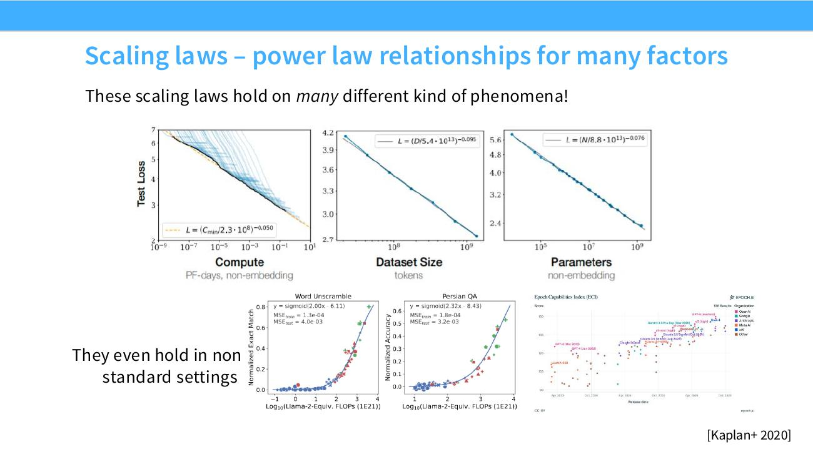

第 13 页是 Kaplan+ 2020 的著名三联图：test loss 对训练计算量（PF-days，non-embedding）、数据集大小（tokens）、参数量（non-embedding）分别在 log-log 坐标下呈直线，拟合式为

$$
L=\left(\frac{C_{\min}}{2.3\times10^{8}}\right)^{-0.050},
\qquad
L=\left(\frac{D}{5.4\times10^{13}}\right)^{-0.095},
\qquad
L=\left(\frac{N}{8.8\times10^{13}}\right)^{-0.076}.
$$

- $C_{\min}$：以最小计算量口径（不计 embedding）度量的训练计算。
- $D$：训练 token 数。
- $N$：non-embedding 参数量。
- 三个负指数 $-0.050$、$-0.095$、$-0.076$：资源每增加一个数量级，loss 分别约下降 $10^{0.05}$、$10^{0.095}$、$10^{0.076}$ 倍。

页面下方还展示了幂律在非标准设置中的身影：下游任务（Word Unscramble、Persian QA）的 sigmoid 型能力曲线、Epoch AI 的能力指数随时间的外推。讲者的重点是三联图本身：三条直线横跨多个数量级，说明幂律不是某个量的巧合，而是对多种资源因子普遍成立的经验结构。

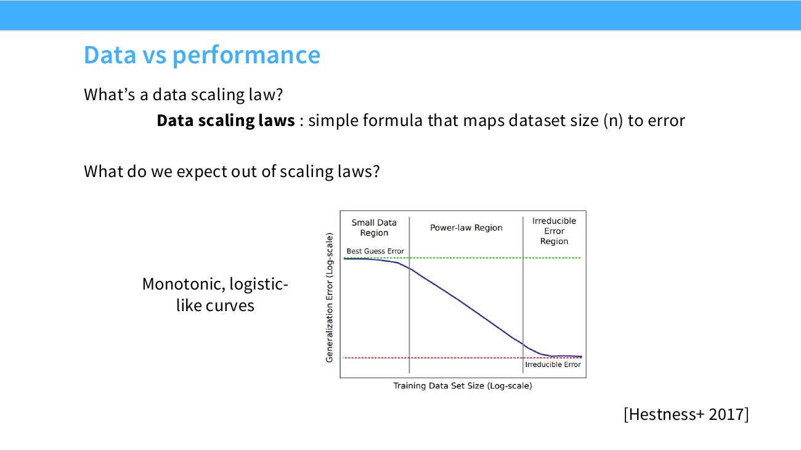

第 14 页给出正式定义：**数据缩放律是把数据集大小 $n$ 映射到误差的简单公式**。我们对它有什么期望？课件再次展示 Hestness 的三区域图并指出曲线应是单调、类 logistic 的形状：小数据区贴着 best-guess 误差，幂律区直线下降，最后弯向不可约误差。这个形状预期在实验设计上有一个直接推论：测量点必须落在幂律区内，拟合出的直线才有意义；混入了小数据区或渐近区的点会系统性扭曲斜率。

先固定模型和训练流程，只改变训练数据量 $D$。在模型容量还没有饱和、超参数也调得合理时，更多数据应让 test loss 单调下降。Kaplan 风格的经验拟合可写成：

$$
L(D)=\left(\frac{D}{5.4\times10^{13}}\right)^{-0.095}.
$$

- $L(D)$：使用 $D$ 个训练 token 后的测试损失。
- $D$：训练数据规模，以 token 数计。
- $5.4\times10^{13}$：拟合中的尺度常数，用来归一化横轴。
- $0.095$：数据缩放指数；负号表示数据增加时 loss 下降。

更一般地，把不可约损失写出来：

$$
L(R)=L_\infty+A R^{-\alpha}.
$$

- $R$：某种资源，例如数据量、参数量或 FLOP。
- $L(R)$：资源为 $R$ 时的 loss。
- $L_\infty$：资源无限时仍无法消除的渐近损失。
- $A$：有限资源项的幅度。
- $\alpha>0$：缩放指数。

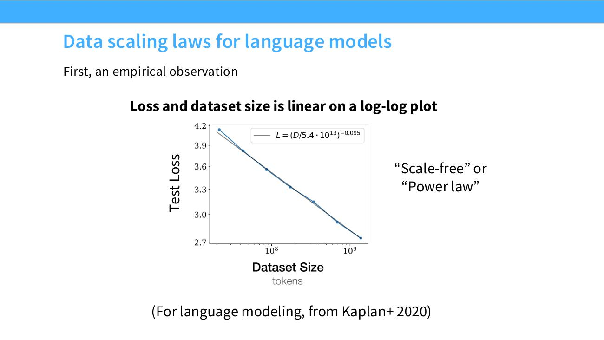

第 15 页聚焦 Kaplan+ 2020 的数据缩放图本身，并解释为什么幂律又被称为 “scale-free”。推导只有一步：先减去渐近项再取对数，

$$
\log\bigl(L(R)-L_\infty\bigr)
=\log A-\alpha\log R.
$$

- 横轴是 $\log R$。
- 纵轴是 $\log(L-L_\infty)$。
- 直线斜率为 $-\alpha$。
- 截距为 $\log A$。

“scale-free” 的含义是：把资源放大任意倍数 $\lambda$，可约损失都缩小同一个倍数 $\lambda^{-\alpha}$，与当前所处的绝对尺度无关——不存在任何特征尺度标记“这里是大模型、那里是小模型”。这与正态分布、指数分布等具有特征尺度的衰减形成对照，也是外推之所以可能的数学基础：如果幂律在测量区间内成立，那么在同一个 log-log 坐标系里，把直线继续画下去就是预测。

数值上，$D$ 扩大 10 倍时 loss 乘上 $10^{-0.095}\approx0.804$；要把 loss 降一半，需要 $2^{1/0.095}\approx 2^{10.5}\approx 1.5\times10^{3}$ 倍的数据——幂律改善的代价是指数级的，这正是“数据墙”忧虑的算术根源。

一个实用的读图与拟合流程可以用几行 numpy 实现——把“log-log 直线”从视觉判断变成数值估计：

```python
import numpy as np

def fit_power_law(D, L, L_inf=0.0):
    """在 log-log 坐标下拟合 L - L_inf = A * D^(-alpha)，返回 (alpha, A)。"""
    x = np.log(np.asarray(D, dtype=float))
    y = np.log(np.asarray(L, dtype=float) - L_inf)  # 先减渐近项
    slope, intercept = np.polyfit(x, y, 1)          # y = -alpha * x + log A
    return -slope, np.exp(intercept)

# 示例：Kaplan 数据缩放 L = (D / 5.4e13) ** -0.095 的两个点
D = np.array([1e8, 1e9])
L = (D / 5.4e13) ** -0.095
alpha, A = fit_power_law(D, L)
# alpha ≈ 0.095；log10(A) 即直线在 log D = 0 处的截距
```

> [!WARNING]
> 只有纵横轴都取对数、并且正确处理渐近项时，直线斜率才直接对应幂律指数。课程问答还提醒：“把图放得足够局部，一切都像直线。”窄范围内很难区分幂律、指数或其他光滑曲线。

### 2.2 均值估计：最简单的缩放律

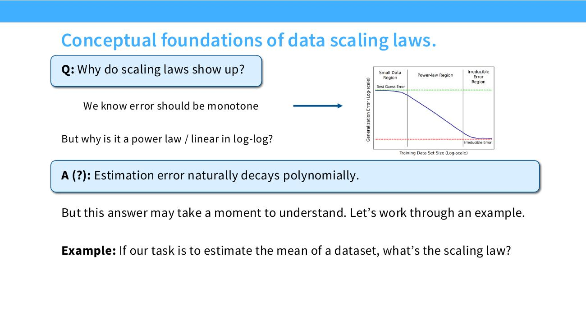

第 16 页提出本讲的第一个理论问题：误差随数据单调下降不奇怪，**为什么偏偏是幂律、在 log-log 图上是直线？**课件给出的候选答案带一个问号：“估计误差天然按多项式衰减。”为了理解这句话，课件设计了一个最小例子：如果任务只是估计一个数据集的均值，它的缩放律是什么？这个例子的价值在于它完全没有神经网络——幂律缩放在最经典的统计问题里就已经出现。

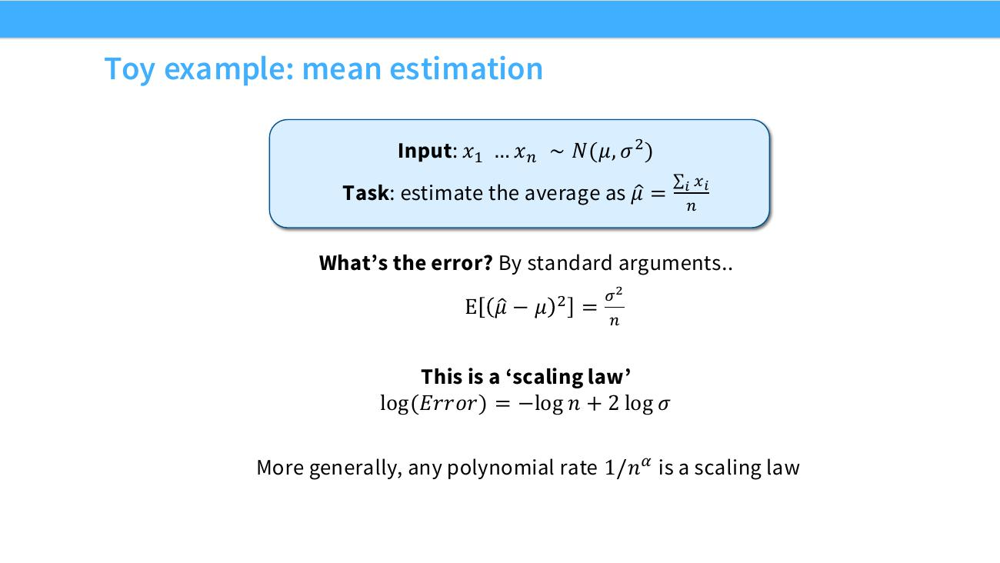

第 17 页给出这个最小例子的完整计算。设有独立同分布样本：

$$
x_1,\ldots,x_n\sim\mathcal N(\mu,\sigma^2),
\qquad
\hat\mu=\frac{1}{n}\sum_{i=1}^{n}x_i.
$$

- $x_i$：第 $i$ 个观测。
- $n$：样本数。
- $\mu$：未知真实均值。
- $\sigma^2$：单个观测的方差。
- $\hat\mu$：样本均值估计量。

样本均值的均方误差为（标准推导：$\hat\mu$ 无偏，方差为 $\sigma^2/n$）：

$$
\mathbb E\left[(\hat\mu-\mu)^2\right]=\frac{\sigma^2}{n}.
$$

- $\mathbb E$：对重复采样取期望。
- 左侧：估计量离真实均值的平均平方距离。
- 右侧：样本数翻倍，误差减半。

取对数得到：

$$
\log(\mathrm{Error})=-\log n+2\log\sigma.
$$

- 斜率是 $-1$。
- $2\log\sigma$ 只改变截距。

于是“误差按 $1/n$ 多项式下降”与“log-log 图上斜率 $-1$ 的直线”完全等价——**这就是一条缩放律**，而且是可以从第一性原理推出来的缩放律。课件进一步指出：任何多项式速率 $1/n^\alpha$ 都是一条缩放律，$\alpha$ 的大小刻画学习的难易。

### 2.3 为什么神经网络的指数只有约 0.1

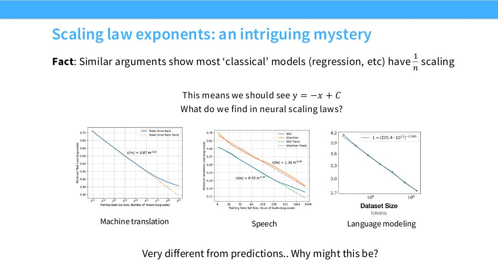

第 18 页把矛盾摆上桌面。经典参数估计常出现 $1/n$ 或 $d/n$ 级的误差；如果这就是全部故事，log-log 斜率应接近 $-1$。但课件并排展示三个领域的实测曲线：机器翻译 $\varepsilon(m)=3.87\,m^{-0.13}$、语音识别 $\varepsilon(m)$ 的指数约 $-0.30$、语言建模 $L=(D/5.4\times10^{13})^{-0.095}$——斜率只有 $-0.1$ 到 $-0.3$，比经典预言慢一个数量级。这意味着：**把数据扩大 10 倍，经典估计的误差降到 1/10，而神经网络的 loss 只降到约 0.5–0.8**。为什么神经网络“利用数据的效率”看起来这么低？

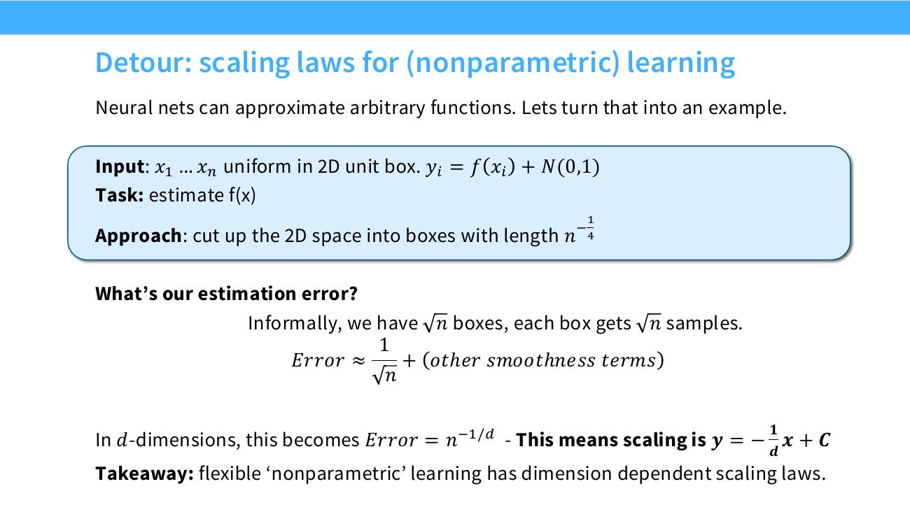

第 19 页用一个简化的非参数回归例子建立直觉。神经网络可以逼近任意函数，那就把学习问题干脆看成函数估计。设 $x_i$ 均匀分布于二维单位方形，观测为：

$$
y_i=f(x_i)+\varepsilon_i,
\qquad
\varepsilon_i\sim\mathcal N(0,1).
$$

- $x_i$：二维输入位置。
- $f$：需要估计的未知平滑函数。
- $y_i$：带高斯噪声的观测。
- $\varepsilon_i$：相互独立、方差为 1 的观测噪声。

把空间分成边长

$$
h=n^{-1/4}
$$

的小格。在二维中，小格数约为 $h^{-2}=\sqrt n$，所以每格平均样本数约为

$$
k\approx nh^2=\sqrt n.
$$

在每个格子内用 $y_i$ 的均值估计 $f(x)$。这里必须先说清误差 的定义：**课件的 $1/\sqrt n$ 应解释为均方误差（MSE）中的方差项，而不是均值估计的标准误。** 因为单个观测的噪声方差是 1，格内均值满足：

$$
\operatorname{Var}(\hat f_{\mathrm{bin}})
\approx\frac{1}{k}
=n^{-1/2},
\qquad
\operatorname{SE}(\hat f_{\mathrm{bin}})
=\sqrt{\operatorname{Var}(\hat f_{\mathrm{bin}})}
\approx n^{-1/4}.
$$

- $\hat f_{\mathrm{bin}}$：格内所有 $y_i$ 的平均值。
- $k$：该格中的样本数，量级为 $\sqrt n$。
- $\operatorname{Var}$：估计量由观测噪声造成的方差。
- $\operatorname{SE}$：标准误，是方差的平方根；它不是此处 $1/\sqrt n$ 的误差。

MSE 还要加上用格内常数近似变化函数 $f$ 的平方偏差：

$$
\operatorname{MSE}(x)
=\operatorname{Var}(\hat f_{\mathrm{bin}})
+\operatorname{Bias}(\hat f_{\mathrm{bin}};x)^2
\approx n^{-1/2}+\text{平方逼近偏差}.
$$

- 第一项：每个局部格子中有限样本造成的噪声方差。
- 第二项：$f$ 在格内并非常数造成的平方逼近偏差，其速率取决于平滑性假设。
- 例如若 $f$ 是 Lipschitz 函数，偏差本身为 $O(h)=O(n^{-1/4})$，平方偏差为 $O(h^2)=O(n^{-1/2})$；于是这个二维构造的 MSE 总体为 $O(n^{-1/2})$。

课件随后把维度依赖简写为：

$$
\mathrm{Error}\approx n^{-1/d},
\qquad
\log\mathrm{Error}\approx-\frac{1}{d}\log n+C.
$$

- $d$：输入空间或有效数据流形的维度。
- $1/d$：维度越高，学习越慢。
- $C$：噪声、平滑性和尺度产生的常数。

这个 $n^{-1/d}$ **不是从上面的二维分箱计算严格连续推出的通用定理**。在 $d=2$ 时，它恰好给出 $n^{-1/2}$，与上述 Lipschitz、MSE 口径的二维结果数值一致；这只能支撑课堂类比。更一般地，若函数具有 $s$ 阶 Hölder 平滑性，宽度为 $h$ 的直方图估计常有启发式分解：

$$
\operatorname{MSE}(h)
\approx\frac{1}{nh^d}+h^{2s}.
$$

- $1/(nh^d)$：每个局部邻域样本不足造成的方差。
- $h^{2s}$：局部常数近似造成的平方偏差。
- $s$：函数平滑度；$s=1$ 对应 Lipschitz 情形。

平衡两项会得到 $h\asymp n^{-1/(2s+d)}$、MSE 约为 $n^{-2s/(2s+d)}$，而不是普遍的 $n^{-1/d}$。因此最终应把课件的 $n^{-1/d}$ 理解为“维度越高，非参数学习越慢”的心智模型，而不是精确速率公式。这就是统计学中著名的**维度灾难**在缩放律语言中的样子：指数 $1/d$ 随维度缩小，数据的有效性被摊薄到指数多的局部区域里。

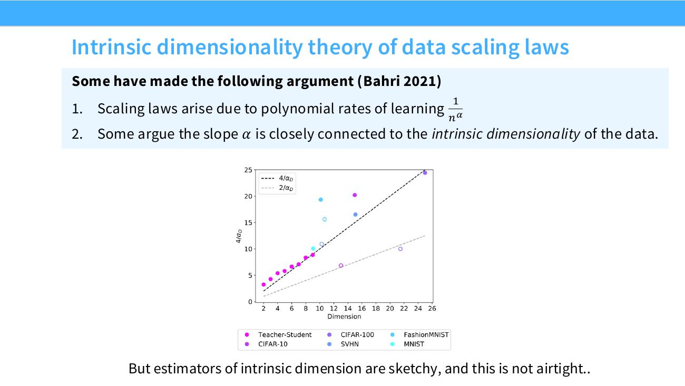

第 20 页介绍一种诱人的理论解释（Bahri 等 2021）：

1. 缩放律来自学习的多项式速率 $1/n^\alpha$；
2. 斜率 $\alpha$ 与数据的**内在维度**（intrinsic dimensionality）密切相关。

其散点图把多个数据集（Teacher-Student、CIFAR-10/100、SVHN、MNIST、FashionMNIST）估计出的内在维度与由缩放指数反推的 $4/\alpha_D$ 对照，不少点落在对角参考线附近。按这个理论，指数约 $0.1$ 意味着神经网络像在约十维的“内在数据空间”上做非参数平滑。讲者对此很谨慎：课件明确写着 “estimators of intrinsic dimension are sketchy, and this is not airtight”——内在维度估计本身可能不可靠，这只是值得思考的心智模型，不是已经证明的机制。

> [!WARNING]
> 课件二维式中的 $1/\sqrt n$ 只有在误差 指 MSE/方差时才与“每格 $\sqrt n$ 个样本”一致；若指标准误，速率应是 $n^{-1/4}$。后续 $n^{-1/d}$ 是另一个刻意简化的维度启发式。一般非参数估计的速率依赖平滑度、误差定义和估计器，不能把两步写成严格推导，更不能用它证明神经网络的内在维度。

### 2.4 幂律区间、饱和区间和 Q&A 中的三个限定

第一，数据缩放实验通常希望模型容量相对数据足够大，使实验处在幂律区间。如果模型太小、数据远多于模型容量，继续加数据会进入饱和区。此时要么避开该区间，要么显式拟合 $L_\infty$。

第二，test loss 与 train loss 应区分。但很多预训练 run 只遍历数据一轮，泛化间隙很小，所以论文图中二者有时近似互换；数据重复或无限计算实验则不能沿用这个近似。

第三，低方差并非理所当然。大规模同质数据上的 perplexity 往往稳定到小数点后几位，因此一些论文每个点只跑一次；学习率和 critical batch 的曲线却可能十分嘈杂，更需要重复实验和不确定性估计。

### 本章小结

- 幂律 $L-L_\infty=AR^{-\alpha}$ 在 log-log 坐标上变成斜率为 $-\alpha$ 的直线。
- 均值估计给出最简单的 $1/n$ 缩放律。
- 神经网络的经验指数更小，可用高维非参数学习作直觉，但不能视为定理。
- 外推前必须确认幂律区间、渐近项、坐标轴和测量方差。

## 3. 数据不只有“多少”：组成、重复与有限性

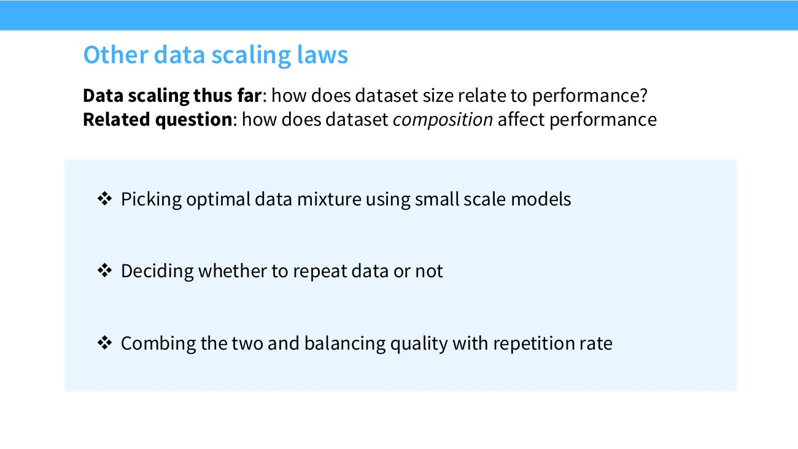

第 21 页是第二部分的过渡页，把“数据缩放”从一个变量（token 数）扩展成一族问题。课件列出三条线索：第一，**数据混合（mixture）**——新闻、网页、代码、数学文本各占多少比例，这个比例如何影响缩放行为；第二，**数据重复（repetition）**——当独特数据耗尽而计算还在增长时，重复第 2 轮、第 4 轮、第 16 轮各值多少钱；第三，**质量与重复的取舍**——是宁可重复高质量数据，还是纳入更多低质量数据。页面上并排展示的三张曲线分别对应这三条线索，核心信息是：它们都能画出“像样的缩放曲线”，但各自改变的参数不同——有的改截距，有的改饱和点。本节逐条拆解。

### 3.1 数据 mixture 为什么常改变截距而非斜率

单一分布上的数据缩放只回答“更多数据能带来多少改进”。真正的数据工程还要回答：新闻、Wikipedia、代码、数学文本各占多少？高质量数据要不要重复？过滤阈值应多严格？

课程先给出一个经典直觉：在模型类固定时，数据分布常主要改变曲线的 offset，而学习速率的 slope 更多由模型类决定。可以把第 $q$ 种 mixture 的误差写成：

$$
L_q(n)=L_\infty+C(q)n^{-\alpha}.
$$

- $q$：数据来源的混合比例。
- $n$：训练样本或 token 数。
- $C(q)$：由 mixture 决定的截距或幅度。
- $\alpha$：近似共享的学习速率指数。
- $L_\infty$：渐近损失。

在课件的两来源线性回归玩具模型里，只取任一来源都会丢失另一部分信息，最佳截距出现在混合比例的中间。这展示了数据多样性的价值。

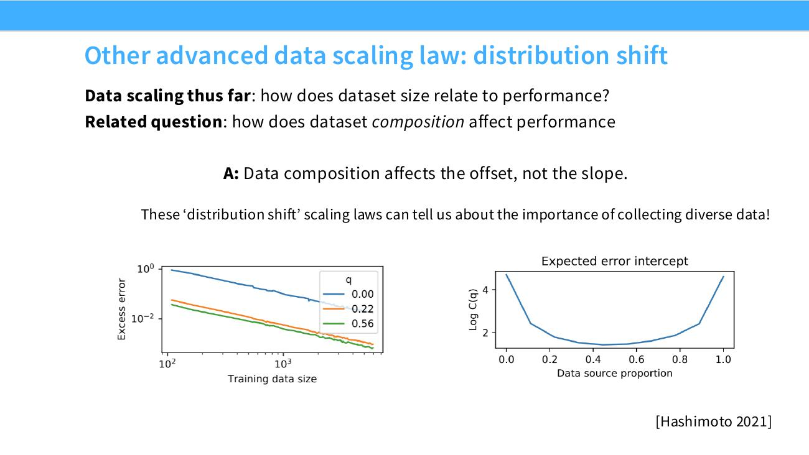

第 22 页引用 Hashimoto 2021 年的工作，给出“截距 vs 斜率”直觉的一个受控实验版本。实验设置是两领域混合：总体损失写成各领域损失的加权和

$$
L_{\mathrm{mix}}(n)=\sum_{i} w_i\,L_i(n),
$$

- $w_i$：第 $i$ 个领域在混合中的权重；
- $L_i(n)$：该领域单独的学习曲线。

关键观察是：当各领域的曲线在对数轴上近似平行（斜率 $\alpha$ 接近）时，改变混合比例 $w$ 只把合成曲线上下平移——log-log 图上表现为截距变化，直线的斜率不变。课件图示中，不同混合比例的曲线确实近似平行；而页面同时强调一个推论：如果目标是**最小化最坏领域（worst-domain）的损失**，最优混合比例就不再是均匀混合，而与各领域的截距、幅度有关——在最坏情况目标下，最优权重向难领域倾斜。对两领域、$L_i(n)=C_i n^{-\alpha_i}$ 且斜率共享 $\alpha$ 的情形，可以把最坏领域目标写成 $\min_w \max_i w_i C_i n^{-\alpha}$，其内点解满足各加权项相等，即 $w_i^\star\propto 1/C_i$——难领域（$C_i$ 大）获得的权重反而需要被抑制，因为它对总和的贡献已经很大。这类结果的具体形式依赖目标函数（平均损失还是最坏损失），课程用它说明的通用点是：**混合比例的“最优值”取决于你的评价目标，而缩放曲线的形状（斜率）往往不动**。

自然做法是：在多个小模型与 mixture 上拟合曲面，再外推目标规模的最佳比例。但讲者指出现实远比理想图嘈杂。DataDecide 等经验研究甚至发现，直接选小模型上最好的 mixture 再放大也能工作；如果各 mixture 的斜率确实近似相同，这个结果并不矛盾。

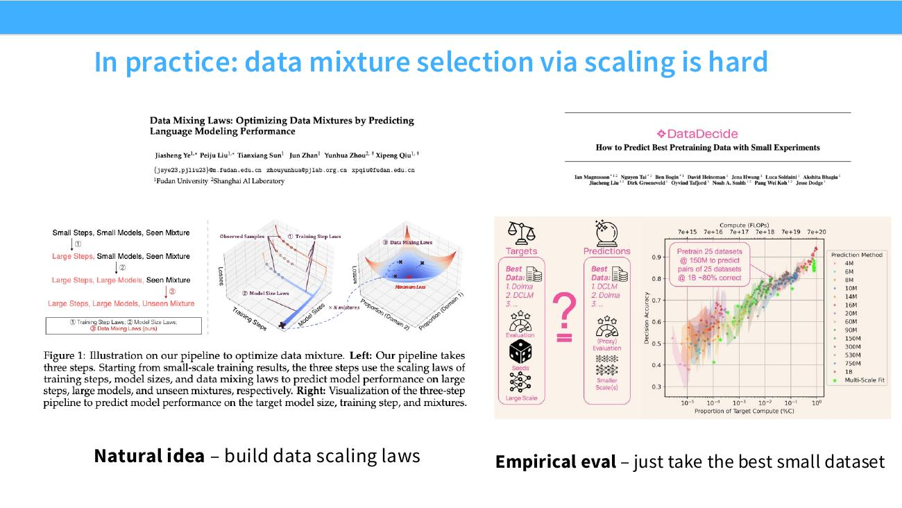

第 23 页泼了一盆冷水：用缩放律做数据混合选择在实践中比看上去困难得多。课件并列了两条路线及其痛点。第一条是 **Data Mixing Laws**：直接对验证损失拟合一个关于混合权重 $\theta=(\theta_1,\dots,\theta_k)$ 的参数化函数，例如

$$
L(\theta)\approx \exp\!\Big(\sum_i \eta_i\,\theta_i\Big),
$$

- $\theta_i$：第 $i$ 个领域的混合比例，$\sum_i\theta_i=1$；
- $\eta_i$：拟合出的领域系数。

然后在混合权重的单纯形上优化这个函数。问题在于：要拟合 $k$ 个系数就得在足够多的混合顶点与内点上训练模型，领域数一多组合爆炸；而且函数形式本身是猜的，外推到未测过的比例没有保障。第二条路线是 **DataDecide** 式的经验排名：在一组候选混合上各训一个小模型，直接按小模型上的下游/验证表现排序，选第一名放大。这条路线便宜且不需要函数形式假设，它的理论基础正是上一页：若各混合的学习曲线斜率近似相同，则小规模排名与小规模截距排名一致，而截距差会沿平行曲线保持到大模型。课件的实际建议是混合使用：先用少量缩放实验确认“平行截距”假设在你的设置里成立，成立就用便宜的排名法，不成立才值得上参数化混合律。

> [!WARNING]
> “composition 只改截距、不改斜率”是课程中的常见经验与特定玩具模型结论，不是普适定理。新的模型架构、训练目标、极端分布变化或不同评价域都可能让斜率和排序改变。

### 3.2 有限数据重复：前几轮有用，之后迅速递减

当计算增长快于独特数据，重复不可避免。课程引用 data-constrained language model 实验：使用标准 recipe 时，约前四轮重复几乎不受损；再继续重复，实际 loss 会逐渐偏离“每个 token 都是新数据”的理想虚线。


第 24 页给出 Muennighoff 等 data-constrained 缩放律的核心模型。设独特 token 数为 $U_D$，重复 $R_D$ 轮，则模型实际见过的总 token 数是 $D=U_D(1+R_D)$，但重复 token 的价值递减，定义**有效数据量**：

$$
D'=U_D+U_D R_D^*\left(1-e^{-R_D/R_D^*}\right).
$$

- $D'$：把重复折算后的有效数据量。
- $U_D$：独特 token 数。
- $R_D$：重复程度（总 epoch 数减一）。
- $R_D^*$：控制重复收益何时饱和的经验常数（拟合值约 15 左右，即重复收益大致在前十几轮内逐渐耗尽）。
- $e$：自然常数。

当 $R_D$ 很小时，$1-e^{-R_D/R_D^*}\approx R_D/R_D^*$，所以 $D'\approx U_D(1+R_D)$——重复近似等价于新数据，这解释了“前 4 个 epoch 几乎无损”的现象；当 $R_D$ 很大时，指数项趋于零，$D'\to U_D(1+R_D^*)$——有效数据量饱和到独特数据的一个固定倍数，再重复多少轮都不增加信息量。对模型参数也有一个对称的重复折价量 $N'$（大模型在有限数据上多看几遍时，参数的边际价值同样递减）。把 $D'$、$N'$ 代入通常的联合缩放律 $L=E+A/N'^{\alpha}+B/D'^{\beta}$，就得到数据受限情形下的损失预测。固定计算预算 $C\approx kND$ 时，这个模型导出一个重要结论：**在独特数据耗尽区，最优策略是把更多预算分给数据（多重复几轮）而不是继续加大模型**——因为参数折价 $N'$ 比数据折价 $D'$ 衰减得更快。这修正了 Chinchilla 比例的适用边界。

把计算推到近乎无限时，单纯增加 epoch 或模型参数都会遇到递减收益，研究者开始使用正则化、集成等方法继续挖掘有限数据。一个反复出现的现象是：干预常移动截距，却未必改变幂律斜率。

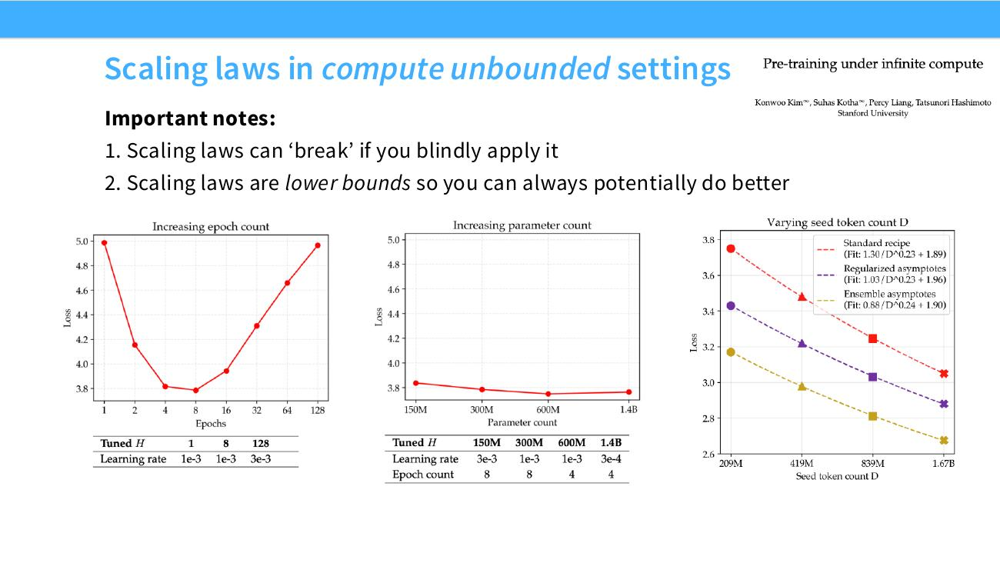

第 25 页讨论一个极限思维实验：如果计算完全不受限、只有数据有限，最优做法是什么？这正是 data-constrained 模型的另一个渐近方向。课件引用相关工作指出几个要点。第一，此时“训练最优”概念失效——你可以无限增大模型并施加正则化，问题退化为纯统计问题：有限样本下能学多好。第二，在这个方向上研究者复活的工具恰恰是老统计学习理论里的：正则化、数据增强、集成（ensembling）、贝叶斯方法，它们在计算廉价而数据昂贵的设定下重新变得划算。第三，课件特别提醒：**在这种极限下得到的损失数字应理解为给定 recipe 下的“下界式”预测**——它告诉你现有方法继续榨取有限数据能走到哪里，而不是信息论意义上的绝对下界；换更好的算法（例如更好的增强或正则化）仍可能改进。这一页的作用是标出缩放律地图的另一条边界：Chinchilla 讨论“计算固定、数据充裕”，上一页讨论“两者都受限”，本页讨论“计算无限、数据固定”，三种渐近的最优策略完全不同。

### 3.3 最佳过滤器必须随训练规模变化

小预算下，训练者只能消费有限 token，激进保留最高质量数据很合理。大预算下，同一个小数据池会被反复遍历；为了避免重复，过滤器需要逐渐放宽，纳入质量稍低但信息新颖的数据。

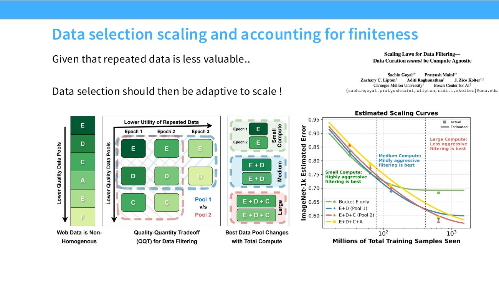

第 26 页引用 Goyal 等关于数据过滤（data filtering）的工作，核心结论是：**最优过滤阈值不是与计算无关的常数**。实验考察按质量分数保留前 $p$ 比例数据的过滤器，质量模型的平均奖励随保留比例线性变化：

$$
\bar r(p)=\alpha p+\beta,
$$

- $\bar r(p)$：保留比例为 $p$ 时数据池的平均质量；
- $\alpha,\beta$：拟合常数，$\alpha<0$ 表示保留越多平均质量越低。

如果数据无限，显然应该取最小的 $p$（最严过滤）。但数据池有限：保留比例 $p$ 越小，可用独特 token 越少，大预算下被迫重复的次数越多。于是最优 $p$ 是质量项与重复折价项的折中，并且**随计算预算增大而系统性放宽**——课件图示中，不同计算预算下最优保留比例从左（激进）向右（宽松）移动，且这个趋势在图像与文本两类数据上都出现。这把 3.2 与 3.3 连成一句话：数据有限时，“质量—数量—重复”是同一个三维权衡，过滤阈值只是其中一个旋钮。

这不是说低质量数据优于高质量数据。真正的约束是：高质量数据有限，而重复会折价。因此“最佳数据集”必须和独特 token 数、训练预算、epoch 数、模型规模一起定义。

> [!IMPORTANT]
> 数据量、数据 mixture、重复率和过滤阈值属于同一个优化问题。把其中任何一个固定为“行业常数”，都会在规模改变时失去最优性。

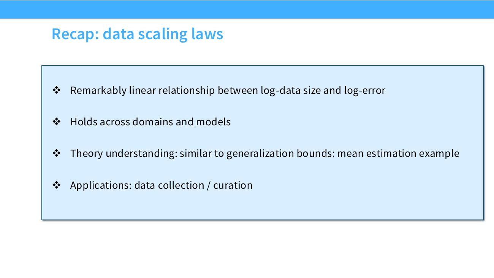

第 27 页是数据缩放部分的小结页，把第 12–26 页压缩成四条结论。第一，**幂律区间内数据缩放是稳健的直线**：$L-L_\infty\propto D^{-\alpha}$ 的 log-log 直线在十余个数量级上成立，指数 $\alpha\approx0.1$ 远小于经典统计的 $1/n$，其理论解释（内在维度、非参数速率）仍是开放的。第二，**数据组成主要移动截距**：混合比例、来源变化通常平移曲线而不改斜率，这使小规模排名有了放大价值，但须在自身设置中验证。第三，**重复按指数折价**：有效数据量 $D'=U_D+U_DR_D^*(1-e^{-R_D/R_D^*})$ 饱和到独特数据的固定倍数，前几个 epoch 近乎免费，之后收益锐减。第四，**一切数据决策都是规模相关的**：过滤阈值、混合比例、重复轮数的最优值都随计算预算移动，没有脱离预算的“最佳数据集”。

### 本章小结

- mixture 常通过截距影响性能，小规模排序可能延续到大规模，但要实测斜率是否稳定。
- 重复数据不是立即无效，而是边际收益逐步饱和。
- 高质量数据有限时，计算越多，过滤通常越需要放宽。
- 数据工程决策必须与模型规模和训练预算联合考虑。

## 4. 从经验曲线到模型工程：架构、batch 与学习率

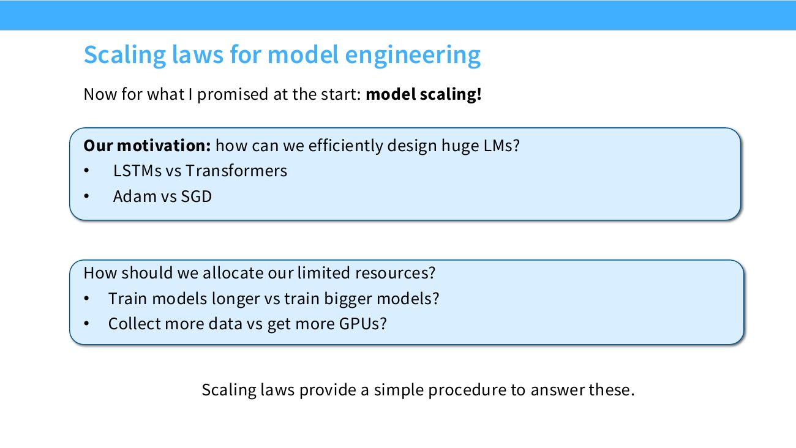

第 28 页开启第三部分：把缩放律从“描述现象”变成“做工程决策”的工具。课件用两个经典对比说明动机——**LSTM vs Transformer** 和 **Adam vs SGD**。如果只能在 175B 规模上做一次实验，你无法逐一验证这些选择；但缩放律提供了替代方案：在多个小规模上分别拟合各候选的曲线，比较截距与斜率，把“哪个更好”变成“哪条曲线在目标规模更低”。页面同时给出本部分的主线问题——**资源分配**：给定预算，架构、深度宽度、batch size、学习率这些自由度各值多少？本节按课件顺序逐一回答。

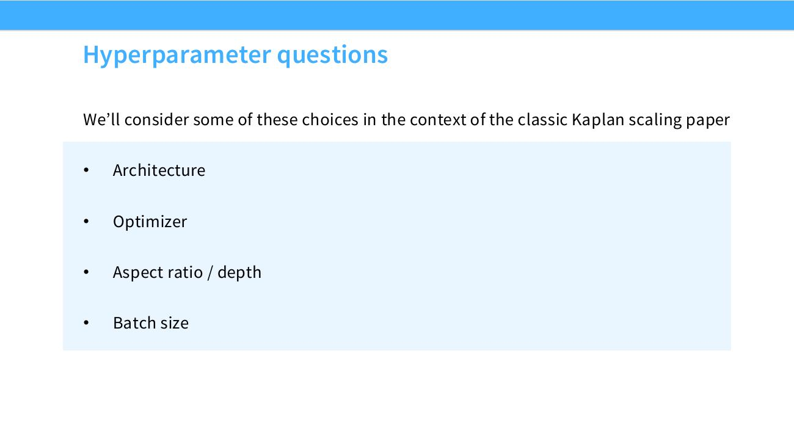

第 29 页列出本部分要处理的超参数问题清单，共五类。第一，**架构**：Transformer 是否优于 LSTM，以及众多 Transformer 变体（不同归一化、注意力变体、卷积混合等）谁缩放更好；第二，**优化器**：Adam 与 SGD 的差异是截距还是斜率；第三，**深宽比（aspect ratio）与层数**：固定参数量时深度和宽度如何分配；第四，**batch size**：多大 batch 能既并行高效又不浪费样本——临界 batch size；第五，**学习率**：最优学习率随规模漂移，如何预测或消除漂移（muP）。课件强调这些问题的共同解法模板：把每个超参数当作曲线的参数，在小规模上测曲线、比曲线，而不是在大规模上掷一次骰子。

### 4.1 架构与优化器：比较整条曲线，不只比较一个点

如果要判断 Transformer 是否优于 LSTM，暴力方法是训练一个 GPT-3 规模 LSTM；缩放律方法则训练多个小 Transformer 和不同深度 LSTM，再比较它们的截距、斜率与目标规模预测。

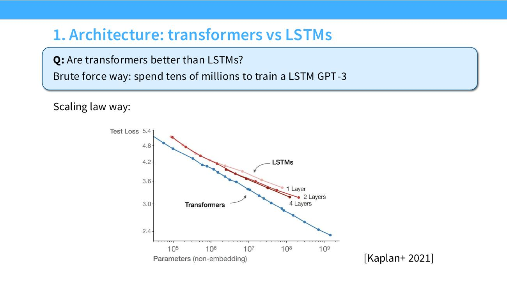

第 30 页展示 Kaplan 等的关键对比图：在相同 **non-embedding 参数**口径下，Transformer 与不同深度的 LSTM 的 loss 随参数量缩放。图中有两个要点。第一，**截距差距**：整条 Transformer 曲线系统性地低于所有 LSTM 曲线，且 LSTM 从 4 层加到更多层改善有限——这不是微调能弥合的差距，而是函数类的差距。第二，**斜率相近**：各曲线的幂律指数差不多，意味着 LSTM 不会因为放大而追上；外推到任意大的规模，排序不变。这正是“比较整条曲线而非单点”的范例：若只在小规模测一次，你可能低估架构差异的稳定性；若只在某单一规模测一次，你无法区分截距差与斜率差。

如果一种新架构只在最小规模略胜、但斜率更差，继续放大后可能反被基线超过。课程举出跨架构研究：GLU 与 Switch Transformer 等小规模趋势预示了后来实际采用的方向，而一些 efficient-attention 变体的缩放并不好。

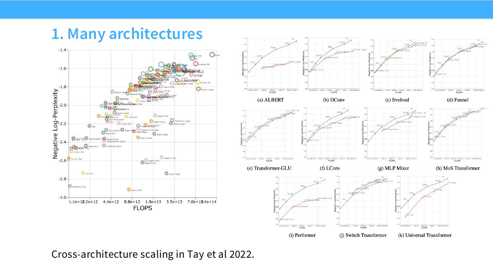

第 31 页展示 Tay 等 2022 年的跨架构缩放研究：对一大族架构变体（vanilla Transformer、GLU 变体、Switch/MoE 变体、卷积增强、各种线性注意力等）分别拟合缩放曲线。课件提取的方法论要点有三。第一，**缩放实验确实能预测后来的赢家**：小规模曲线上表现最好的 GLU 类门控与稀疏（Switch）结构，正是之后工业界实际广泛采用的方向；而一些在小规模单点上看起来有竞争力的 efficient-attention 变体，曲线斜率明显更差，放大后失去优势——它们后来也确实没有成为主流。第二，**曲线可能交叉**：两个架构的直线在 log-log 图上若有不同斜率，则必在某规模相交，交点之前胜者之后变负；因此“在哪个规模范围内比较”必须写进结论。第三，**公平的比较口径**：所有曲线必须使用一致的参数口径（non-embedding）、相同数据与 recipe，否则曲线差异可能只是口径差异。

Adam 与 SGD 的 Hestness 示例也接近幂律：

$$
\epsilon_{\mathrm{SGD}}(m)\approx5.37m^{-0.094},
\qquad
\epsilon_{\mathrm{Adam}}(m)\approx5.25m^{-0.095}.
$$

- $\epsilon(m)$：数据规模为 $m$ 时的最低验证损失。
- $m$：训练字符数或对应的数据规模；该图来自 recurrent highway network，不是现代 Transformer。
- $5.37$、$5.25$：拟合幅度，体现截距差异。
- $0.094$、$0.095$：几乎相同的缩放指数。

这个例子的结论不是“Adam 永远只好一点”，而是：更换一个看似巨大的优化器因素后，斜率仍可能接近，主要改变量是 offset。

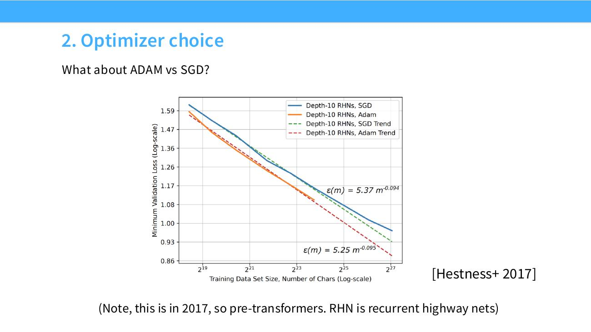

第 32 页是 Hestness 等 2017 年的 recurrent highway network 实验，即上面两条拟合式的出处。图上 Adam 与 SGD 的曲线几乎平行——指数 $0.094$ 与 $0.095$ 在拟合误差内不可区分，Adam 的优势全部体现在小一号的截距上。课件的解读值得记住：**优化器改进通常表现为截距改进**。这有两层含义：一是优化器的好处不会随规模自动放大（斜率没变），也不会随规模消失（截距差沿平行线保持）；二是如果某个“新优化器”在小规模上的优势来自更快的早期下降，你需要确认它在幂律区间内的渐近曲线仍然更低，而不只是曲线起点更早。反过来，这也提示了比较优化器时的实验设计：必须在相同的数据量/步数预算下比较整条达到曲线，而不是固定步数比终点的单点。

### 4.2 深宽比相对宽容，参数却不能一视同仁

极浅模型的缩放明显差：一层到两层带来巨大改进；继续加深的边际收益减小。固定 non-embedding 参数量时，feed-forward ratio、深宽比和 attention head dimension 在相当宽范围内只造成几个百分点的 loss 差异。

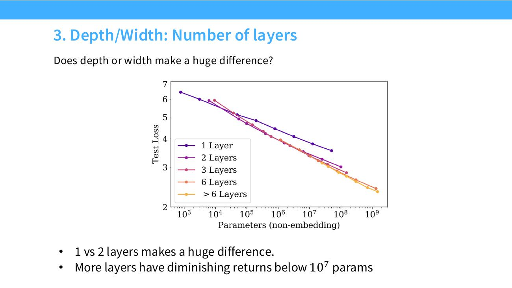

第 33 页展示层数对缩放的影响。图的横轴是参数量，不同曲线是不同层数。两个可读结论。第一，**极浅是灾难**：1 层模型（本质上只有注意力的退化结构）的曲线显著差于 2 层及以上，且斜率也更差——从 1 层到 2 层是质变。第二，**深度收益快速饱和**：2 层之后继续加深，曲线几乎重叠；课件指出在小参数量（约 $10^7$ 以下）时深度差异还可分辨，往上走各条曲线收敛到一起。这解释了为什么“固定参数量，深度还是宽度”在中等范围内是低维度的宽容参数——但也埋下警告：这个宽容区间的边界（极浅端）是硬的，工程上不要去碰。

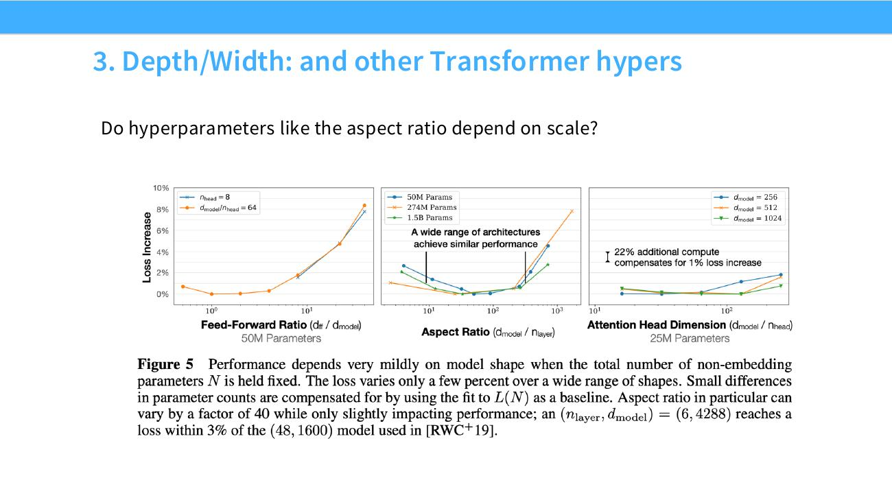

第 34 页把同样的分析推广到其余形状超参数：feed-forward 比例（FFN 隐层与 $d_{\mathrm{model}}$ 之比）、深宽比（aspect ratio，深度与宽度之比）、attention head 维度。结论一致：**在相当宽的合理范围内，这些形状参数对固定参数量的 loss 只有几个百分点的影响**，曲线基本重叠。课件的实用推论是：形状超参数可以在小模型上做一次粗扫就固定，不必在每个规模重新调；真正需要在每个规模重新确认的是会改变缩放指数的东西——数据、以及下面要讲的学习率与 batch。但注意本页与上一页合起来的完整陈述是“宽容但有边界”：极浅、极端深宽比（比如 $d_{\mathrm{model}}$ 极小层数极多）都会掉出平台区，缩放曲线明显变差。

但“总参数量相同”并不总是公平比较。embedding 参数随词表和隐藏维度增长，却与主体网络参数有不同的计算和表达作用；把 embedding 计入横轴，会让原本整齐的层数曲线变形。

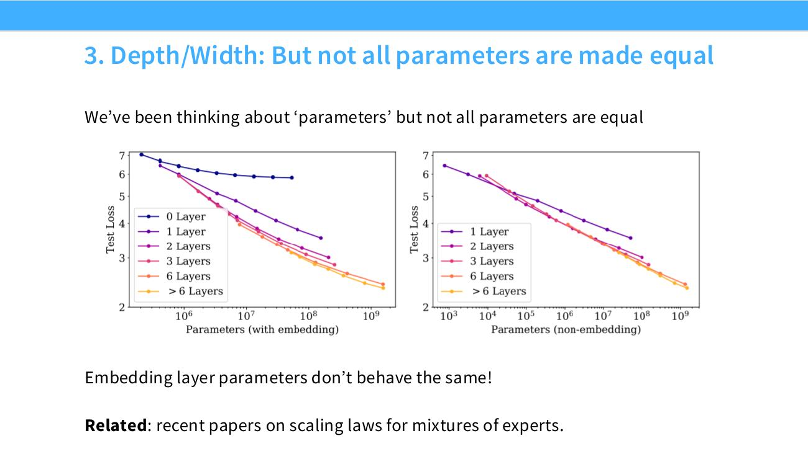

第 35 页是参数口径问题的正面展示。左图用**含 embedding 的总参数**作横轴：不同层数的模型曲线分散开，层数越多的曲线越靠右下方——因为深层模型在相同总参数下主体网络更小，表现更差，图上一片混乱。右图改用 **non-embedding 参数**作横轴：同一批点立刻排成整齐的单一幂律。机制很清楚：embedding 矩阵（$V\times d$）不参与逐层计算，它的 FLOP 贡献几乎为零（查表），对“模型容量”的贡献方式也与主体不同；把它计入横轴，等于把不同层数的模型按错误的成本单位排序。课件的操作规则由此而来：**拟合缩放律前先统一横轴定义**——non-embedding 参数是 Kaplan 时代的默认；而今天的大词表模型中 embedding 占比上升，这个口径选择再次变得重要，后续第 6 节的 Kaplan–Chinchilla 争论有一半正是口径之争。

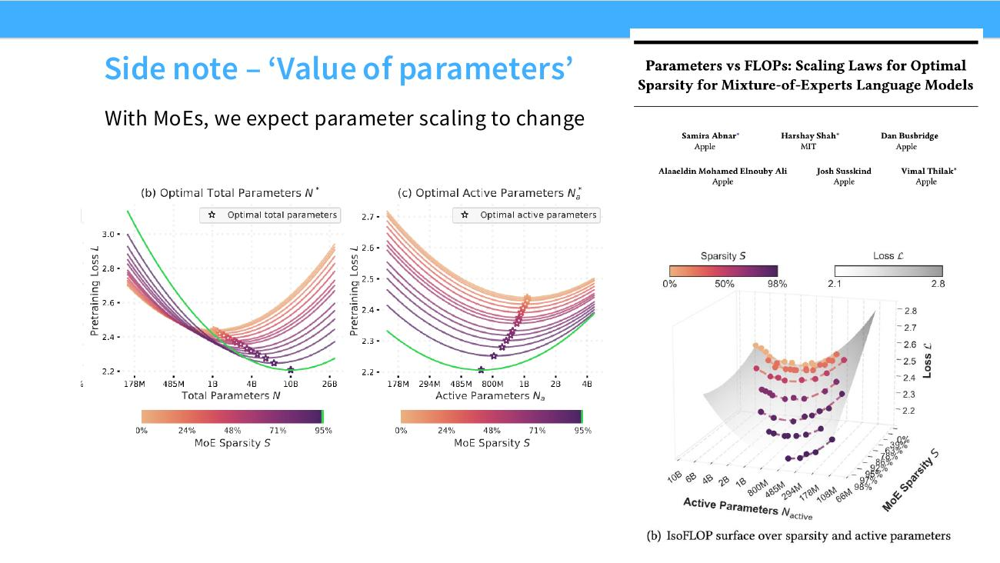

第 36 页用 MoE 进一步松动“参数量”这个概念。课件引用 Abnar 等对稀疏模型的缩放研究，区分三个量：

- **总参数**：所有专家之和，决定模型存储容量。
- **激活参数**：单个 token 实际经过的专家参数，决定主要计算量。
- **稀疏度**：总容量与单 token 计算之间的杠杆。

课件显示，即使保持激活参数不变，增加未被当前 token 激活的专家容量仍可降低总体 loss——也就是“不花计算的参数也有价值”，但单位价值低于激活参数。所以“每个参数的价值”取决于它处在何种结构中：dense 参数、embedding 参数、专家参数是三档不同的货币。这也是为什么后文一切计算最优公式都必须先声明参数口径，否则 $N$ 不可比。

### 4.3 临界 batch：并行效率与样本效率的交点

batch 越大，越容易做数据并行；但大到一定程度后，继续增加样本不再带来等比例的优化步数减少。

讲者把过程分成两个区间：

1. **噪声受限**：batch 增大能降低随机梯度方差，接近线性加速。
2. **偏差受限**：梯度已经很准确，但它仍只是局部下降方向；再降噪无法消除局部方向与全局最优方向的偏差。

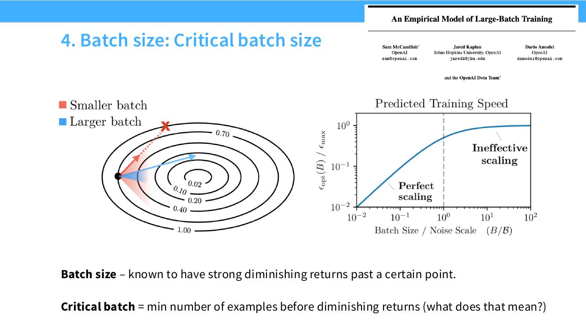

第 37 页给出 McCandlish 等 critical batch size 的核心图像。横轴是 batch size，纵轴是达到固定目标 loss 所需的优化步数（或墙钟时间）。曲线的两个区间对应上面两种机制：batch 小时处于**完美缩放（perfect scaling）**区——batch 加倍，步数近似减半，因为梯度噪声以 $1/B$ 下降，每步的信息量线性增长；batch 大过某个拐点后进入**无效缩放（ineffective scaling）**区——梯度已经测得很准，继续加倍 batch 几乎不再减少步数，因为限制因素从“梯度噪声”变成了“局部梯度的固有偏差”。拐点的位置就是临界 batch。一个直觉化的定量表述：小 batch 梯度估计的方差约为 $\sigma^2/B$（$\sigma^2$ 是单样本梯度噪声），当这个方差降到与梯度本身的有用信号（大致是目标方向上的曲率尺度）相当时，继续降噪的边际收益就归零。

实际估计方法是固定目标 loss，对不同 batch size 记录达到目标所需的步数 $S$ 和样本数 $E$，拟合：

$$
\frac{S}{S_{\min}}-1
=
\left(\frac{E}{E_{\min}}-1\right)^{-1}.
$$

- $S$：达到目标 loss 所需的优化步数。
- $S_{\min}$：无限大 batch 极限下的最少步数。
- $E$：达到目标 loss 所需处理的样本或 token 数。
- $E_{\min}$：极小 batch 极限下的最少样本或 token 数。

步数、样本数和 batch 的关系近似为：

$$
E=BS.
$$

- $B$：batch size。
- 该式假设 $E$ 和 $B$ 使用同一计数单位；若 batch 以 sequence 计而 $E$ 以 token 计，还需乘序列长度。

把两侧效率平衡起来，定义：

$$
B_{\mathrm{crit}}=\frac{E_{\min}}{S_{\min}}.
$$

- $B_{\mathrm{crit}}$：临界 batch size。
- 当 $B=B_{\mathrm{crit}}$ 时，拟合关系给出 $S\approx2S_{\min}$、$E\approx2E_{\min}$。
- 它不是数学上唯一的最优，而是 step efficiency 与 sample efficiency 的对称折中。

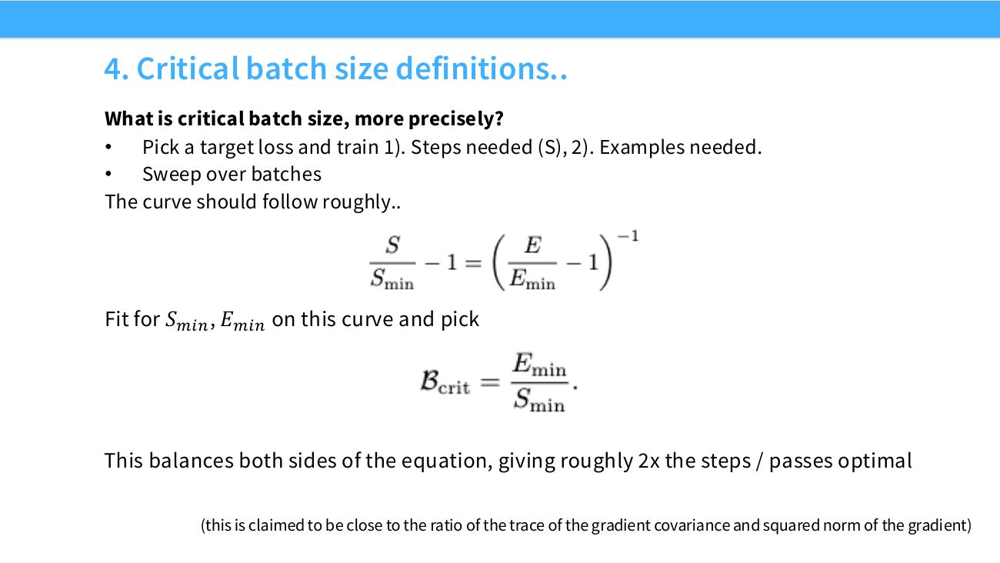

第 38 页是上述定义的推导页，值得把代数走完。从拟合式出发，两边加 1 并取倒数：

$$
\frac{S}{S_{\min}}-1=\left(\frac{E}{E_{\min}}-1\right)^{-1}
\;\Longrightarrow\;
\frac{S_{\min}}{S}+\frac{E_{\min}}{E}=1,
$$

（把第一个等式两边加 1：$S/S_{\min}=1+1/(E/E_{\min}-1)=\dfrac{E/E_{\min}}{E/E_{\min}-1}$，取倒数得 $S_{\min}/S=1-E_{\min}/E$，移项即得。）这条“效率双曲线”把两个一阶近似统一起来：$S_{\min}/S$ 是步数效率（相对无限 batch 极限慢了多少），$E_{\min}/E$ 是样本效率（相对小 batch 极限多花了多少数据）。代入 $E=BS$，并令两种效率相等（各为 $1/2$）的“对称折中点”，就有 $S=2S_{\min}$、$E=2E_{\min}$，于是 $B=E/S=E_{\min}/S_{\min}=B_{\mathrm{crit}}$。这解释了定义的来源：**临界 batch 就是在这条权衡曲线上两个效率各损失一半的点**；偏左一点用更多墙钟换更少数据，偏右一点反之。$B_{\mathrm{crit}}$ 也可近似关联到梯度噪声尺度 $\mathcal B\approx\mathrm{tr}(\Sigma)/\|g\|^2$（梯度协方差的迹与梯度范数平方之比），课程不展开推导，但指出了这个联系。

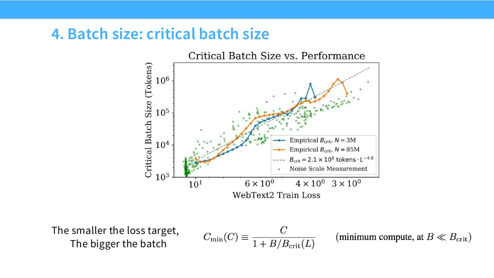

第 39 页给出临界 batch 的缩放行为：它不是一个固定常数，而随训练进程系统性增大。课件的实验图以目标（训练）loss 为横轴、实测 $B_{\mathrm{crit}}$ 为纵轴，拟合出经验关系：

$$
B_{\mathrm{crit}}(L)\approx2.1\times10^8\,L^{-4.8}\ \text{tokens}.
$$

- $L$：目标训练 loss。
- $B_{\mathrm{crit}}(L)$：达到该 loss 附近时的临界 token batch。
- $2.1\times10^8$、$4.8$：该实验中的拟合常数，不是跨模型通用常数。

目标 loss 越低，优化越精细，梯度中有用信号越弱、噪声相对越强，因此可有效利用的 batch 越大。机制与上一页的噪声尺度一致：训练后期梯度范数 $\|g\|$ 减小，$\mathrm{tr}(\Sigma)/\|g\|^2$ 上升。页面还给出配套的最低计算量公式

$$
C_{\min}(C)\equiv\frac{C}{1+B/B_{\mathrm{crit}}(L)},
$$

读法：实际花费的计算 $C$ 中，只有 $1/(1+B/B_{\mathrm{crit}})$ 的比例是“必要的”——当 $B\ll B_{\mathrm{crit}}$ 时 $C_{\min}\approx C$（每份计算都在有效推进），当 $B\gg B_{\mathrm{crit}}$ 时 $C_{\min}\approx C\cdot B_{\mathrm{crit}}/B$（大 batch 浪费样本）。工程含义直接：**训练前期用小 batch，随 loss 下降逐步加大 batch**——这正是现代大模型训练中 batch ramp-up 策略的理论出处。

### 4.4 学习率：预测最优点，或重参数化让它不漂移

普通宽度缩放中，模型越宽，最佳学习率往往越小；常见规则是按宽度的倒数缩放。工程上有两种哲学：

1. 在多个宽度上测量最佳学习率的漂移，再外推大模型的最优学习率。
2. 用 muP 一类重参数化，调整初始化和不同张量的步长，使最佳学习率尽量跨宽度稳定。

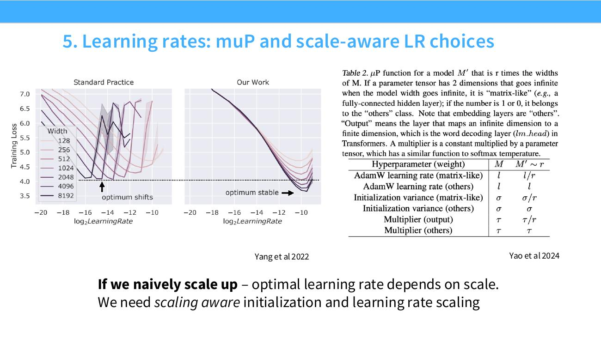

第 40 页对比两条路线。左图（Yang 等 2022）：标准参数化下，不同宽度模型的“loss vs 学习率”U 形曲线谷底位置系统漂移——越宽谷底越靠左（最优学习率越小），图上箭头标注 “optimum shifts”。右图：使用 muP（ maximal update parametrization）重参数化后，各宽度的 U 形曲线谷底对齐到同一学习率，箭头标注 “optimum stable”——这就是 μTransfer 的基础：在 40M 小模型上调好的学习率可直接搬到 6.7B。页面右侧的表（Yao 等 2024 整理的 muP 规则）给出宽度扩张 $M'=rM$ 时的具体变换：

| 参数类别 | 基准值 | 扩宽后的值 |
|---|---:|---:|
| AdamW 学习率，matrix-like | $\ell$ | $\ell/r$ |
| AdamW 学习率，其他参数 | $\ell$ | $\ell$ |
| 初始化方差，matrix-like | $\sigma$ | $\sigma/r$ |
| 初始化方差，其他参数 | $\sigma$ | $\sigma$ |
| 输出层 multiplier | $\tau$ | $\tau/r$ |
| 其他 multiplier | $\tau$ | $\tau$ |

- $M$：基准模型宽度。
- $M'$：扩大后的模型宽度。
- $r$：宽度倍数。
- $\ell$：基准学习率。
- $\sigma$：课件表中标为 initialization variance 的量。
- $\tau$：参数 multiplier。
- matrix-like：宽度增长时两个维度都随之扩张的权重矩阵。

直觉一句话：标准初始化让每层的更新幅度随宽度收缩，导致越宽的模型“每步走得越保守”，最优学习率就得跟着漂移；muP 通过把 matrix-like 参数的学习率与初始化方差各除以 $r$（并在输出层加 $1/r$ 的 multiplier），使每一层在宽度趋于无穷时仍保持 $O(1)$ 的更新幅度，于是学习率景观对宽度不变。

> [!NOTE]
> 讲者明确说，两种学习率哲学都曾成功用于大规模训练；他只是观察到业界似乎更偏向直接做缩放实验。这一讲也没有完整教授 muP，细节留到进阶缩放课。

### 4.5 预训练 loss 可预测，不代表下游任务同样可预测

同一系列架构的 negative log-perplexity 可以随参数量形成漂亮直线，但 SuperGLUE accuracy 的排序可能完全不同。课程示例中，预训练指标最好的 NL12 并不是下游最好的模型。

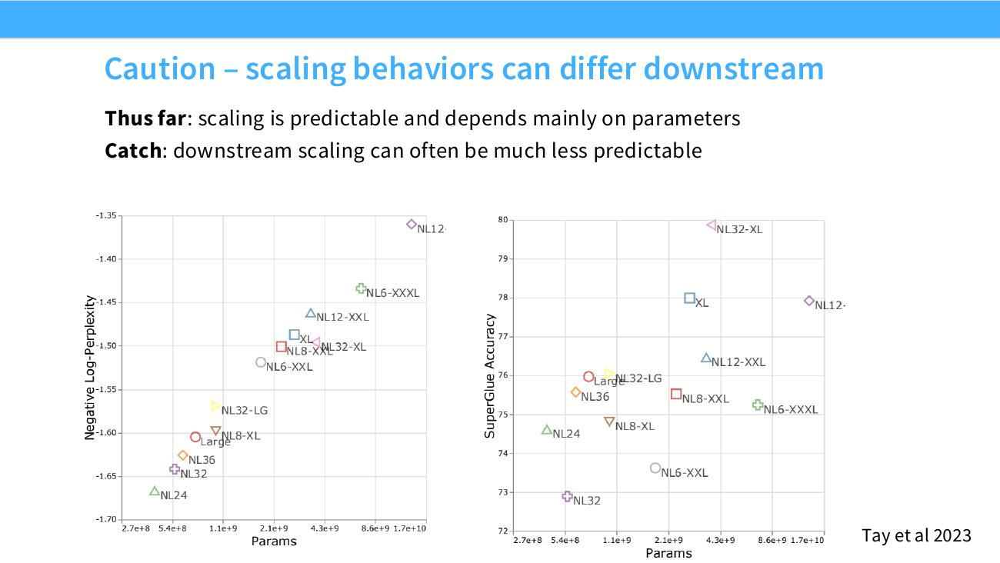

第 41 页是 Tay 等 2023 年的对照图，也是本讲的第一个重要“反例”。左图：一系列架构（NL24、NL32、NL36、NL8-XL、NL12-XXL 等，命名编码了层数与规模）的 negative log-perplexity 对参数量——漂亮的近似直线，预训练指标完全可预测，NL12 系列最好。右图：同一批模型的 SuperGLUE accuracy 对参数量——点云明显散乱，NL12 不再领先，某些预训练较差的配置下游反而更强。课件由此给出两层警示。第一，**预训练 loss 的幂律并不自动继承到下游**：下游指标经过任务特定的迁移，含阈值效应、离散化和任务噪声，排序可以重排。第二，**实验流程必须相应分层**：先在低方差的预训练指标上建立规律，再单独验证到目标下游任务的迁移；若下游指标本身在多个种子上稳定，也可以直接对下游拟合缩放律，但若曲线锯齿明显，就要显著降低外推信心。

### 4.6 一套朴素但实用的模型选型流程

课程将前面内容压缩为三步：

1. 为每个候选架构、优化器或超参数训练若干小模型。
2. 在一致的参数口径、数据与 recipe 下拟合 scaling curve。
3. 只有拟合稳定、差距可持续时，才把预测用于目标规模。

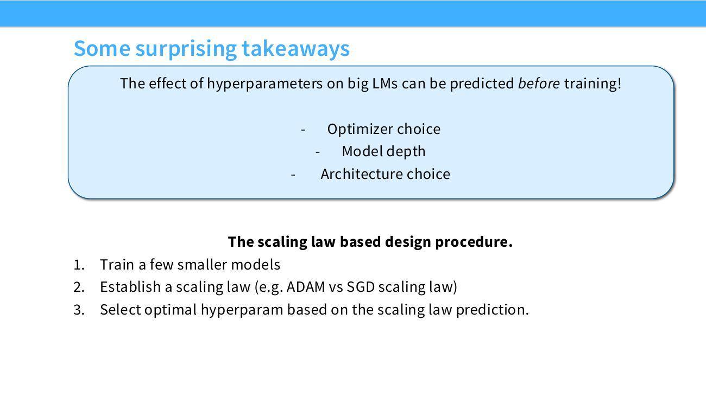

第 42 页先回顾本部分几个“意外”结论：优化器更换主要改截距；深宽比在宽平台区内几乎无所谓；参数不能一视同仁；临界 batch 随训练增大；学习率最优点会漂移但可被重参数化固定。随后给出上述三步设计流程。这三步之所以“朴素但实用”，是因为它把每个昂贵的未知决策替换为一次便宜的可测量实验；第 5 节将看到同一模板在更高维度（模型×数据二维）上的版本，即 Chinchilla 的三种方法。

> [!WARNING]
> 不要只看 $R^2$ 或一条视觉上很直的线。还要检查不同 seed、训练是否收敛、warmup 是否占比失真、横轴参数定义、拟合区间和 holdout scale。

### 本章小结

- 架构和优化器要比较整条缩放曲线，而不只是最小规模上的一个点。
- 深宽比在合理范围内相对宽容，但 embedding、dense 与 MoE 参数不能一视同仁。
- 临界 batch 平衡步数效率和样本效率，并随目标 loss 改善而增大。
- 学习率可以靠外推选择，也可用 muP 让最优点跨宽度稳定。
- 预训练 loss 的规律不能自动保证下游任务排序。

## 5. 联合数据—模型缩放：在固定计算量下求最优

### 5.1 为什么数据量和模型大小不能各自单独最大化

单变量缩放律分别回答“模型固定时，加数据有什么用”和“数据固定时，加参数有什么用”。但真实预算把两者绑在一起。对 dense Transformer，训练计算量常用一阶近似表示为：

$$
C_{\mathrm{train}}\approx kND.
$$

- $C_{\mathrm{train}}$：训练所需的计算量，通常以 FLOP 计。
- $N$：模型参数量；必须明确是 total、non-embedding 还是 active parameters。
- $D$：训练 token 数。
- $k$：由前向、反向、架构和实现口径决定的比例常数（前向加反向训练时常取 $k\approx6$）。

固定 $C_{\mathrm{train}}$ 时，增大 $N$ 就会挤压 $D$，反之亦然。小模型吞入过多数据会撞上容量地板；大模型只看少量数据又会处于数据不足区。因此目标不是让两个旋钮同时最大，而是在同一成本曲线上找到 loss 最低点。

> [!WARNING]
> $C_{\mathrm{train}}\approx kND$ 是实验设计近似，不是硬件墙钟时间的精确公式。长上下文 attention、MoE 稀疏激活、embedding、通信和设备利用率都会让 $k$ 改变。

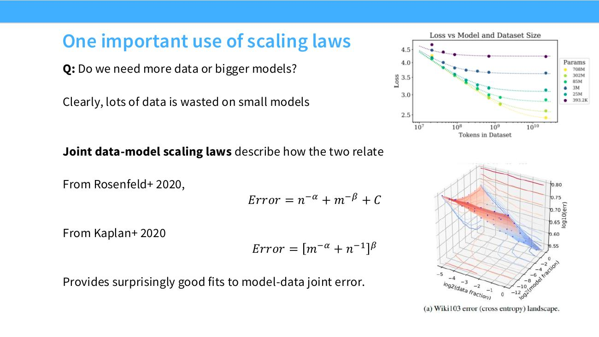

第 43 页直接抛出本部分的核心问题：**Q: Do we need more data or bigger models?** 页面上方的 Kaplan 图（loss vs 数据量，多条参数量曲线）给出直观答案的一半：每条曲线在数据增大时都趋于各自的平台，小模型的平台高——“clearly, lots of data is wasted on small models”，超过容量地板后继续喂数据几乎不再降 loss。另一半对称地成立：固定数据量时加大模型也会饱和。课件随即给出两个把两个变量放进同一函数的联合缩放律（joint data-model scaling laws）：

Rosenfeld+ 2020 的加法形式：

$$
E(n,m)=n^{-\alpha}+m^{-\beta}+E_\infty.
$$

- $E(n,m)$：数据量与模型量给定时的 error 或 loss。
- $n$：归一化后的数据规模。
- $m$：归一化后的模型规模。
- $\alpha>0$：数据项的经验衰减指数。
- $\beta>0$：模型项的经验衰减指数。
- $E_\infty$：两类资源都充分大时仍剩余的渐近项。

Kaplan+ 2020 的嵌套形式：

$$
E(m,n)=\left[m^{-\alpha}+n^{-1}\right]^\beta.
$$

- $m,n$：课件中的模型与数据规模变量。
- $\alpha,\beta$：联合控制模型项、数据项和外层曲率的拟合指数。
- 括号与外层 $\beta$ 的位置按课件原式保留；它不是上一式的简单换符号版本。

页面右下是 Rosenfeld 论文中 Wiki103 的联合误差曲面：在对数数据、对数模型两个方向上误差分别下降，曲面在二维网格上光滑，且简单函数形式“provides surprisingly good fits to model-data joint error”。

### 5.2 联合 scaling surface 与极限检查

读到任何多变量缩放式，先做极限检查：

$$
n\to\infty
\quad\Longrightarrow\quad
E\to m^{-\beta}+E_\infty,
$$

$$
m\to\infty
\quad\Longrightarrow\quad
E\to n^{-\alpha}+E_\infty.
$$

- 第一式表示数据无限时，只剩模型容量限制。
- 第二式表示模型无限时，只剩有限数据限制。
- 如果某个候选公式在这些极限下给出反直觉行为，就不应只因拟合分数高而接受它。

对 Kaplan 形式做同样检查：$m\to\infty$ 时 $E\to[n^{-1}]^\beta=n^{-\beta}$，退化为单变量数据缩放律；$n\to\infty$ 时 $E\to m^{-\alpha\beta}$，模型项的有效指数变成 $\alpha\beta$。这种“单项极限退化”性质是联合形式必须满足的最低自洽要求，也是后面比较不同论文公式时的第一道筛子。

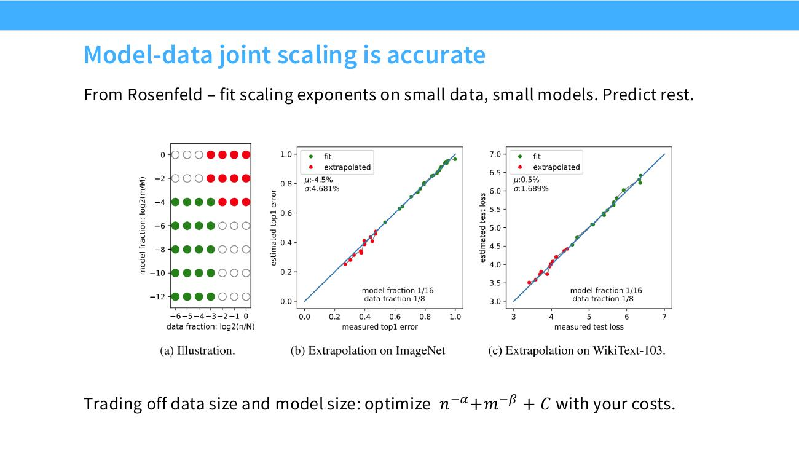

第 44 页展示 Rosenfeld 论文最关键的验证：**联合缩放律能从未见过的区域外推**。实验做法是只用小模型、小数据角落里的点拟合曲面 $E(n,m)$，再预测大图景中未参与拟合的大模型、大数据格点；图上左（ImageNet）右（WikiText）两个任务中，预测的曲面（线）与 withheld 的实测点高度吻合。课程用它说明“从便宜实验外推”在二维资源下依然成立——这正是后面所有计算最优处方（Kaplan、Chinchilla）的方法论前提。但注意它只证明所示实验在该范围、该架构与该 recipe 下有效，不保证跨架构、数据分布或训练 recipe 外推。

### 5.3 计算最优指数如何决定 tokens/parameter

把固定预算下的最优模型和数据写成：

$$
N_{\mathrm{opt}}\propto C^a,
\qquad
D_{\mathrm{opt}}\propto C^b.
$$

- $C$：训练计算预算。
- $N_{\mathrm{opt}}$：该预算下预测的最优参数量。
- $D_{\mathrm{opt}}$：该预算下预测的最优 token 数。
- $a$：模型规模随计算增长的指数。
- $b$：数据规模随计算增长的指数。

两式相除得到：

$$
\frac{D_{\mathrm{opt}}}{N_{\mathrm{opt}}}
\propto C^{b-a}.
$$

- $D/N$：tokens per parameter。
- 若 $a=b$，该比例近似保持常数。
- 若 $a>b$，模型比数据增长更快，比例随预算下降。
- 若 $b>a$，数据比模型增长更快，比例随预算上升。

**从联合律推导最优指数。** 以加法联合律 $L(N,D)=E+A N^{-\alpha}+B D^{-\beta}$ 与预算约束 $C=kND$ 为例，可以把 $D=C/(kN)$ 代入，把二维优化化为一维：

$$
L(N)=E+A N^{-\alpha}+B\left(\frac{kN}{C}\right)^{\beta}.
$$

对 $N$ 求导并令其为零：

$$
\frac{\partial L}{\partial N}
=-\alpha A\,N^{-\alpha-1}
+\beta B\left(\frac{k}{C}\right)^{\beta}N^{\beta-1}=0,
$$

整理得

$$
\alpha A\,N^{-\alpha-1}=\beta B\,k^{\beta}C^{-\beta}N^{\beta-1}
\;\Longrightarrow\;
N^{\alpha+\beta}=\frac{\alpha A}{\beta B\,k^{\beta}}\,C^{\beta},
$$

即

$$
N_{\mathrm{opt}}\propto C^{\frac{\beta}{\alpha+\beta}},
\qquad
D_{\mathrm{opt}}\propto C^{\frac{\alpha}{\alpha+\beta}}.
$$

所以理论上 $a=\beta/(\alpha+\beta)$、$b=\alpha/(\alpha+\beta)$，并且自动满足 $a+b=1$（与 $C\propto ND$ 自洽）。**模型项与数据项谁衰减得慢（指数小），预算就更多流向谁**：若 $\alpha\approx\beta$，则 $a\approx b\approx 1/2$，$D/N$ 近似恒定——这正是 Chinchilla 的情形；若数据项衰减更慢（$\beta$ 明显小于 $\alpha$），则 $a>b$，预算偏向模型——这接近 Kaplan 的结论方向。注意 Kaplan 的 0.73/0.27 并非由上面这个含渐近项的联合式直接推出，而来自其另一套不含 $E$、分开拟合的流程，这正是第 6 节争论的起点之一。

用拟合常数算一次最优分配的参考代码：

```python
import numpy as np

def optimal_allocation(C, E, A, B, alpha, beta, k=6.0):
    """给定预算 C (FLOP)，返回 (N_opt, D_opt)，来自 L=E+A/N^alpha+B/D^beta, C=k*N*D。"""
    # N_opt^(alpha+beta) = (alpha*A)/(beta*B*k^beta) * C^beta
    N = ((alpha * A) / (beta * B * k**beta) * C**beta) ** (1.0 / (alpha + beta))
    D = C / (k * N)
    return N, D

# Chinchilla 论文方法三的拟合值（仅作演示，不可直接当 recipe）
E_, A_, B_, alpha_, beta_ = 1.69, 406.4, 410.7, 0.34, 0.28
for C in [1e20, 1e22, 5.76e23]:  # 最后一个约为 Gopher 预算
    N, D = optimal_allocation(C, E_, A_, B_, alpha_, beta_)
    print(f"C={C:.2e} FLOP -> N={N:.2e} params, D={D:.2e} tokens, D/N={D/N:.1f}")
```

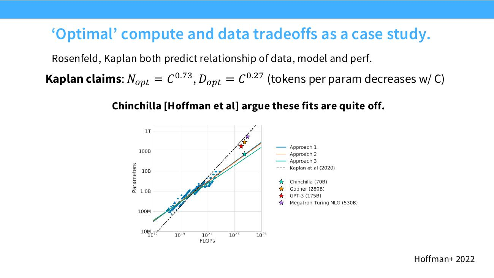

第 45 页把冲突摆上桌面。Kaplan 课件处方是：

$$
N_{\mathrm{opt}}\propto C^{0.73},
\qquad
D_{\mathrm{opt}}\propto C^{0.27}.
$$

这会给出 $D/N\propto C^{-0.46}$：预算越大，处方越偏向增大模型。讲者在口头说明时一度把 $N$ 与 $D$ 说反，随后立即纠正；这里采用纠正后的定义。Chinchilla（Hoffmann 等 2022）得到近乎相反的工程结论：在相同训练 FLOP 下，用更小模型看更多 token 往往更好。页面同时点出这场争论的现实赌注：GPT-3（175B 参数、约 300B token）正是按 Kaplan 式“大模型、相对少数据”思路训练的；若 Chinchilla 对，则同预算应训练约 4 倍小的模型、4 倍多的数据——这就是 70B/1.4T 的 Chinchilla 模型的来历。

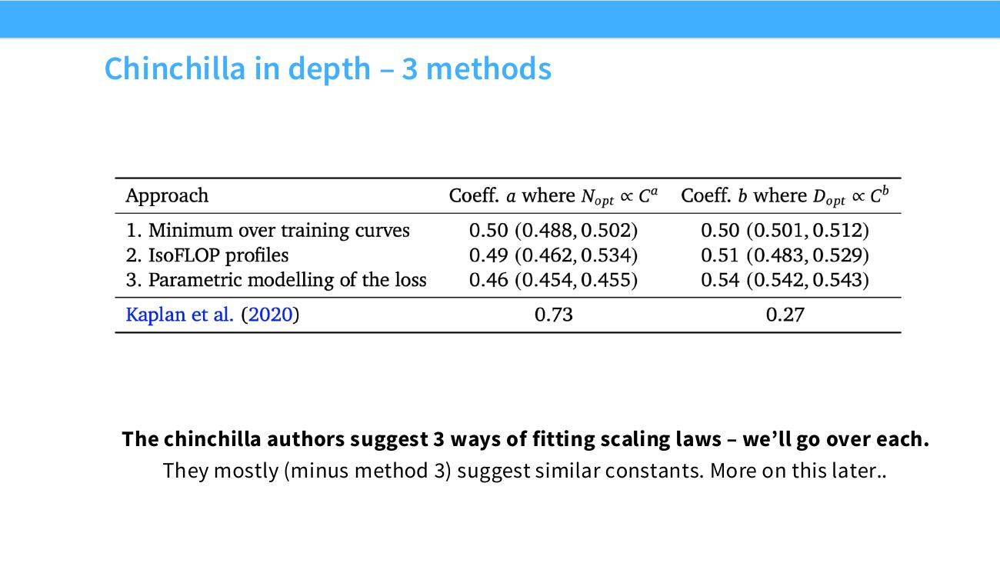

第 46 页是 Chinchilla 论文三种估计方法的汇总表：

| 估计方法 | $a$：模型指数 | $b$：数据指数 | 主要含义 |
|---|---:|---:|---|
| 1. 训练曲线 lower envelope | 0.50（0.488, 0.502） | 0.50（0.501, 0.512） | 参数和 token 近似同比例增长 |
| 2. IsoFLOP profiles | 0.49（0.462, 0.534） | 0.51（0.483, 0.529） | 同样接近恒定 $D/N$ |
| 3. 联合 loss 曲面拟合 | 0.46（0.454, 0.455） | 0.54（0.542, 0.543） | $D/N$ 随预算缓慢增大 |
| Kaplan et al. (2020) | 0.73 | 0.27 | 预算增长主要分给参数 |

括号内是置信区间。三种独立方法互相印证在 $a\approx b\approx0.5$ 附近（方法三稍偏数据），与 Kaplan 的 0.73/0.27 形成鲜明对照。课件提示：方法三的偏离“more on this later”——第 6 节会讲它后来被证明是拟合瑕疵。

> [!WARNING]
> $a\approx b\approx0.5$ 只能说明 $D/N$ 随计算量近似不变，不能单独推出常数恰好为 20。约 20 tokens/parameter 还来自特定实验的幅度、数据、tokenizer、模型定义和训练目标。

### 5.4 Chinchilla 的三种方法

#### 方法一：训练曲线的 lower envelope

对许多不同大小、不同 schedule 的模型保存完整训练曲线。在每个 FLOP 预算上，从所有曲线中找最低可达 loss；这些最低点组成 lower envelope。再记录每个点来自多大的模型、看过多少 token，并拟合它们随计算量的趋势。

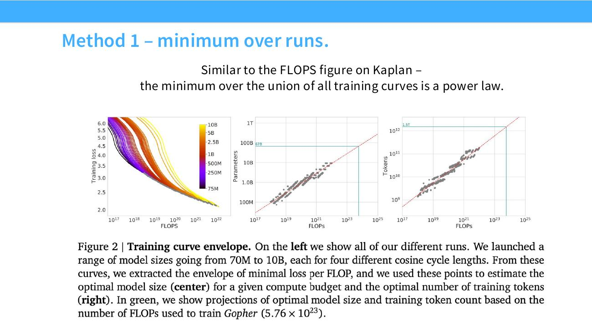

第 47 页展示方法一的完整流程（论文 Figure 2）。左图：70M 到 10B 的模型，每个跑 4 种 cosine 周期长度，所有训练曲线画在一起；黑色下包络线在每个 FLOP 处穿过当时最优的那条曲线。中图：把包络上每个点对应的参数量对 FLOP 作图，log-log 上是一条直线，即 $N_{\mathrm{opt}}(C)$。右图：同法得到 token 数直线 $D_{\mathrm{opt}}(C)$。绿色标注给出 Gopher 预算（$5.76\times10^{23}$ FLOP）下的外推：约 67B 参数、1.5T token。图注中“We launched a range of model sizes going from 70M to 10B, each for four different cosine cycle lengths”值得注意——**cosine 周期长度与目标 FLOP 匹配**是实验设计的一部分，周期不匹配会系统性污染包络，这一点会在第 6 节再次出现。

包络提取的参考实现：

```python
import numpy as np

def training_curve_envelope(runs, C_grid):
    """runs: [(N, D_final, flops_array, loss_array), ...]
    返回每个 C_grid 点上的最低 loss 及对应 (N, D)。"""
    best = [None] * len(C_grid)
    for N, D, flops, loss in runs:
        order = np.argsort(flops)
        f, l = flops[order], loss[order]
        l_smooth = np.minimum.accumulate(l)  # 只保留“迄今最低”
        for i, C in enumerate(C_grid):
            mask = f <= C
            if not mask.any():
                continue
            l_at_C = l_smooth[mask][-1]
            if best[i] is None or l_at_C < best[i][0]:
                best[i] = (l_at_C, N, D)
    return best
```

优点是概念直接，还能利用训练过程中的中间点；风险是曲线覆盖稀疏时，包络会受 run 密度、噪声和插值规则影响。课件示例预测目标预算约为 67B 参数、1.5T token，这些数值只属于该实验。

#### 方法二：IsoFLOP sweep

选择多个固定 FLOP 预算；在每个预算里扫描模型—数据分配。依据 $C\approx kND$，若把 token 数加倍，就近似把参数量减半。每个预算会得到一条 U 形 loss 曲线：

- 左侧模型太小，受容量限制；
- 右侧模型太大，固定预算下看过的 token 太少；
- 谷底就是该 FLOP 预算下的最优分配。

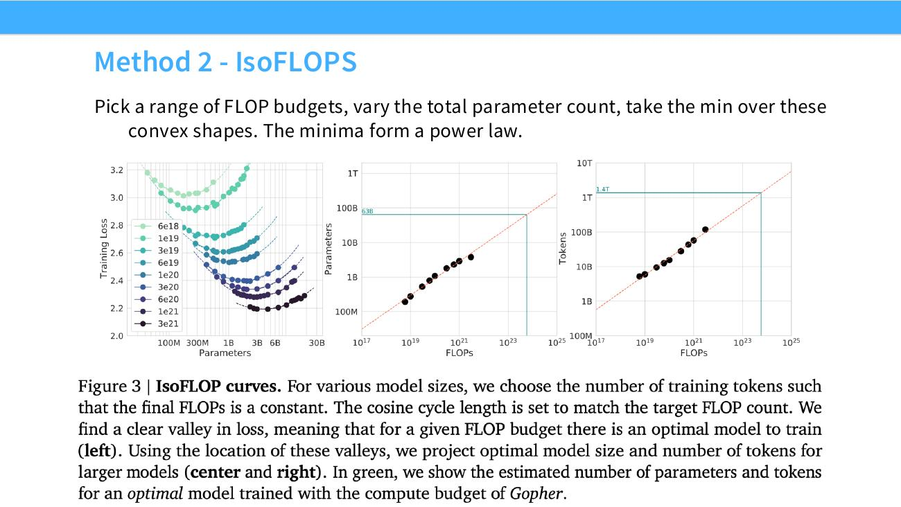

第 48 页是方法二的操作说明（论文 Figure 3）。做法：选定一串 FLOP 预算（$6\times10^{18}$ 到 $3\times10^{21}$），在每个预算下训练一系列不同参数量的模型，token 数由 $D=C/(kN)$ 反解，**cosine 周期长度设成与目标 FLOP 匹配**。左图：每条等 FLOP 曲线都是一条 U 形（谷底清晰，“a clear valley in loss”）；对每条曲线在谷底附近拟合抛物线取最小点。中、右图：把各预算谷底位置的参数量、token 数分别对 FLOP 作图，log-log 直线的斜率即 $a\approx0.49$、$b\approx0.51$。绿色标注：Gopher 预算外推约 63B 参数、1.4T token，与方法一接近。讲者把它称为最容易、最稳健的方法，也是自己的首选。所谓稳健，来自它直接比较实测谷底、对全局曲面函数形式的依赖较少；如果扫描范围没覆盖谷底，结论仍会失真。

#### 方法三：联合参数化 loss 曲面

在 $N\times D$ 网格上训练许多模型，先假设 $L(N,D)$ 的函数形式，再拟合整个二维曲面，并沿等 FLOP 切片求最优前沿。

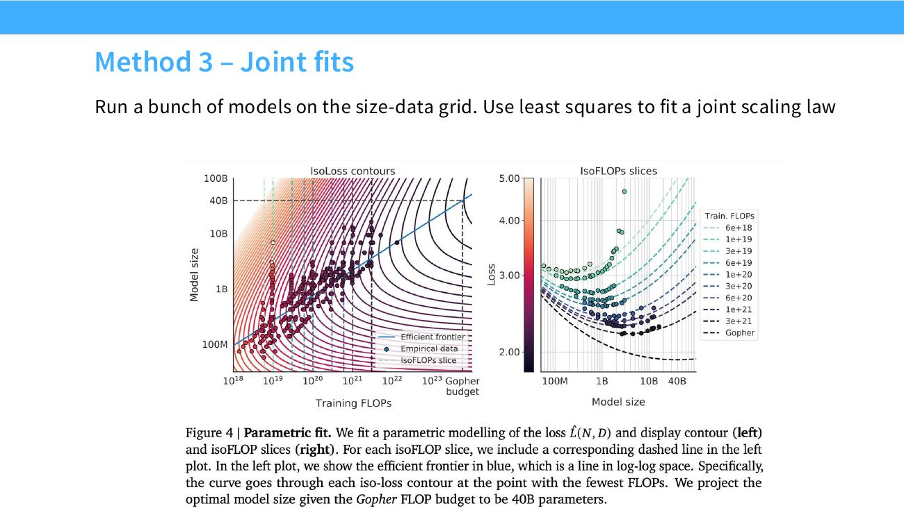

第 49 页展示方法三（论文 Figure 4）。具体函数形式是带渐近项的加法联合律：

$$
\hat L(N,D)=E+\frac{A}{N^{\alpha}}+\frac{B}{D^{\beta}},
$$

- $E$：不可约损失（数据生成分布的熵）。
- $A/N^{\alpha}$：模型有限带来的过剩损失。
- $B/D^{\beta}$：数据有限（训练未收敛）带来的过剩损失。

拟合在 Huber loss 下对 $\log \hat L$ 做最小二乘（L-BFGS，多组初值网格），用全部 $(N_i,D_i,L_i)$ 观测。左图：拟合曲面在 $(\log C,\log N)$ 平面的等损失等高线，蓝线是**高效前沿**（efficient frontier）——每条等损失线上 FLOP 最小的点的连线，在 log-log 空间是一条直线；虚线是各 IsoFLOP 切片。右图：把拟合曲面按 IsoFLOP 切片得到的 U 形与方法二的实测点对照。此方法预测 Gopher 预算的最优约 40B 参数——明显小于方法一、二的 63–67B，对应表中 $a=0.46$。方法三能利用全部数据，但代价是更依赖函数形式、拟合权重、异常值处理、优化器和数值精度。变量越多，得到“漂亮曲面”不代表外推越可靠；第 6.3 节会看到，正是这个方法的拟合后来被事后取证证明有瑕疵。

### 本章小结

- 固定训练计算时，参数量与数据量相互挤压，必须在联合曲面上求解。
- 多变量缩放式先做极限检查，再谈拟合分数。
- $N_{\mathrm{opt}}\propto C^a$、$D_{\mathrm{opt}}\propto C^b$ 决定 tokens/parameter 如何随预算变化；由联合律可推出 $a=\beta/(\alpha+\beta)$、$b=\alpha/(\alpha+\beta)$。
- Kaplan 更偏向参数，Chinchilla 更偏向数据；差异来自实验定义与拟合流程，而非一句固定配方。
- lower envelope、IsoFLOP 和联合曲面三条路线互相印证，比只相信一种拟合更可靠。

## 6. 拟合细节会改写结论：从争论到部署经济学

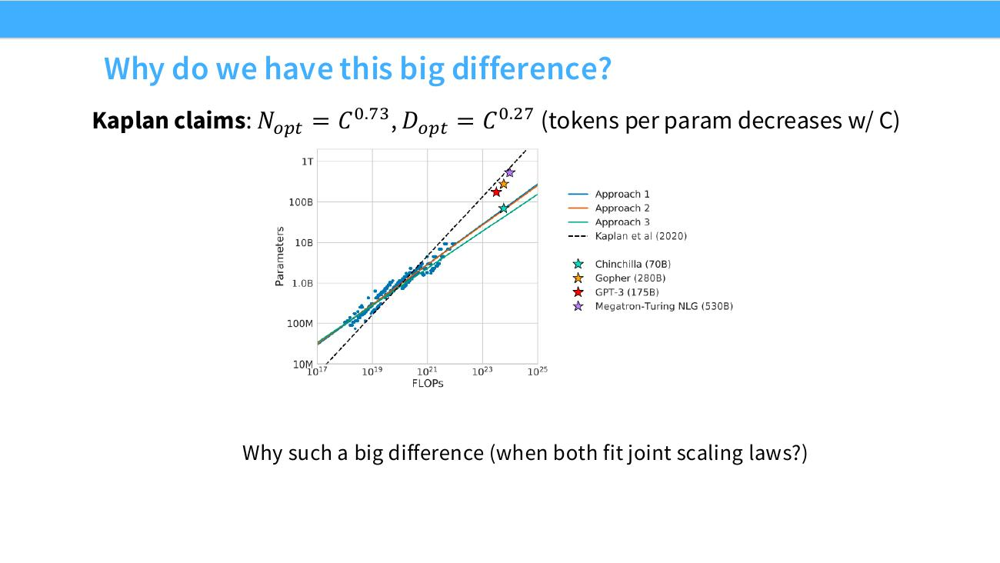

第 50 页开启第四部分，标题问题直白：Kaplan 与 Chinchilla 都拟合了联合缩放律、都用了合理方法，为什么最优指数差这么多（0.73 vs 0.50）？课件的回答预告了两个解释方向。第一，**实验与拟合流程的具体决定不同**（Explanation 1）：参数计数口径、warmup 长度、batch 与学习率调优、cosine 周期与预算的匹配——每一个“小决定”都足以移动拟合斜率，叠加起来就能把 0.5 推成 0.7。第二，**函数形式与观测区间不同**（Explanation 2）：同一个轻微弯曲的真实前沿，用不同参数口径作横轴、在不同计算区间取局部直线，会得到不同的“局部指数”。本节的教训超越这两篇论文：**缩放律的指数不是只读一次的物理常数，而是实验设计的产物**；引用任何指数前必须复核它的产生流程。

### 6.1 为什么合理方法也会得出不同指数

后续复现把差异拆成多项“小决定”的累积：

1. **参数口径**：是否排除 embedding，尤其是否排除形状为 $d\times V$ 的最后 softmax/output matrix。
2. **warmup 占比**：统一而过长的 warmup 会让小预算 run 在 warmup 结束前就接近结束，系统性压低小模型表现。
3. **batch 与优化器**：固定的大 batch 对小模型可能远超其 critical batch；各尺度没有公平调优时，斜率会把 recipe 次优误当成规模规律。
4. **拟合区间**：轻微弯曲的曲线在不同局部区间会被直线拟合成不同斜率。

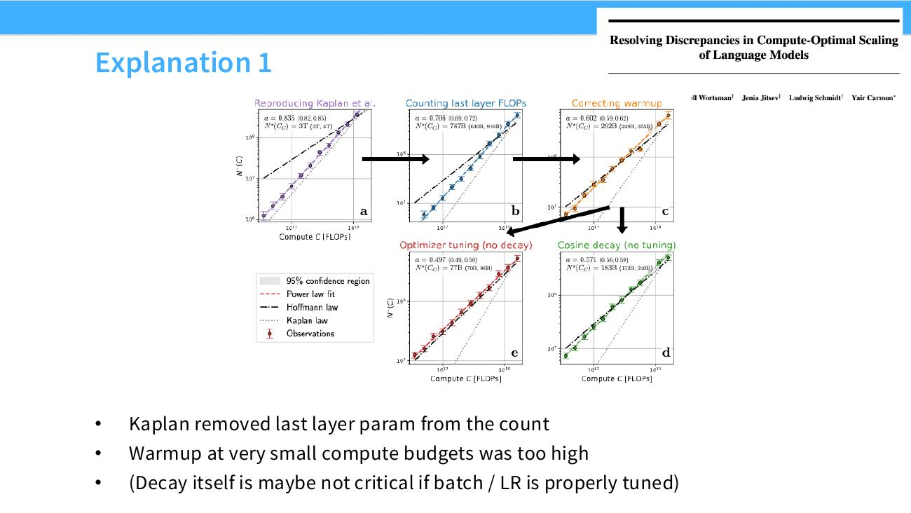

第 51 页展示 Wortsman 等《Resolving Discrepancies in Compute-Optimal Scaling of Language Models》的逐项实验，是“解释一”的证据链。五张 $N^\star(C)$ 图按顺序累积修正：(a) 直接复现 Kaplan 流程得到 $a=0.835$（比 Kaplan 原文还陡）；(b) **把最后一层（logits）的 FLOP 计入计算量**后降到 $a=0.706$——Kaplan 从参数计数中排除了最后一层，却没有从 FLOP 中排除它，对小模型这个不匹配最严重，人为压平了小模型端、抬高了斜率；(c) **修正 warmup**（小预算下 warmup 占比过高）后到 $a=0.602$；(d) **不逐尺度调优但使用 cosine decay** 得 $a=0.571$；(e) **逐尺度调优优化器、不用 decay** 得 $a=0.497$——落入 Chinchilla 区间。课件三条结论：Kaplan 从参数计数中排除了最后一层；warmup 在极小计算预算下占比过高；（如果 batch 与学习率调好了，decay 本身也许不是关键）。每一步都是可复现的实验决定，没有一步涉及“谁的数据更好”。

> [!IMPORTANT]
> 讲者说缩放律“在某种意义上是 lower bound”，紧接着给出的限定是：它预测继续放大**当前 recipe**会得到什么。若小模型 warmup、batch 或学习率本就次优，曲线只会忠实外推这个次优 recipe；它不是对所有算法都不可突破的数学 loss 下界。

### 6.2 参数定义与局部非线性如何制造不同直线

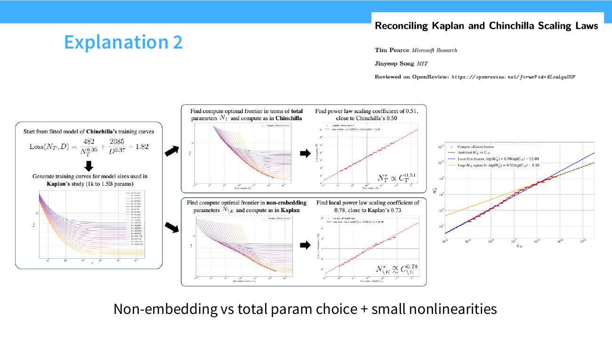

第 52 页给出 Pearce 与 Song 的调和分析。他们指出两篇论文拟合的是**不同的联合函数形式**（Kaplan 的嵌套幂 vs Chinchilla 的加法律），且用了不同的参数口径与观测区间。他们重新拟合一个加法形式：

$$
\operatorname{Loss}(N_T,D)
=\frac{482}{N_T^{0.35}}
+\frac{2085}{D^{0.37}}
+1.82.
$$

- $\operatorname{Loss}(N_T,D)$：总参数量和数据量给定时的预测 loss。
- $N_T$：total parameter count。
- $D$：训练 token 数。
- $482$：模型有限带来的 loss 项幅度。
- $2085$：数据有限带来的 loss 项幅度。
- $0.35$：模型项衰减指数。
- $0.37$：数据项衰减指数。
- $1.82$：拟合的渐近 loss。

关键结论：**同一个略有弯曲的前沿，若用 total parameters 作横轴、观察更高计算区间，可得到约 0.51 的局部指数；若改用 non-embedding parameters 并只看 Kaplan 较低的计算区间，局部指数可接近 0.78。** 也就是说，由 $a=\beta/(\alpha+\beta)$ 计算的全局渐近指数（这里约 $0.37/0.72\approx0.51$）只是大范围平均；而 $N_{\mathrm{opt}}(C)$ 的前沿本身在对数坐标上轻微弯曲，任何有限区间上的直线拟合都只量到**局部切线斜率**，区间和横轴一变，读数就变。这里的误读风险是把局部切线当成全局自然常数。

该公式也不能直接作为新模型 recipe：它的幅度、指数和渐近项只拟合课件引用的数据；tokenizer、模型架构、参数计数和数据分布改变后都需重测。

### 6.3 Method 3 的事后取证告诉我们什么

Chinchilla 的方法一、二近似给出恒定 tokens/parameter；方法三的 $a=0.46,b=0.54$ 则意味着比例会随计算缓慢上升。后续 Epoch AI / Besiroglu 等重新检查方法三，认为原曲面对数据欠拟合；重新拟合后，结论更接近方法一、二和 $D/N\approx20$ 的经验线。

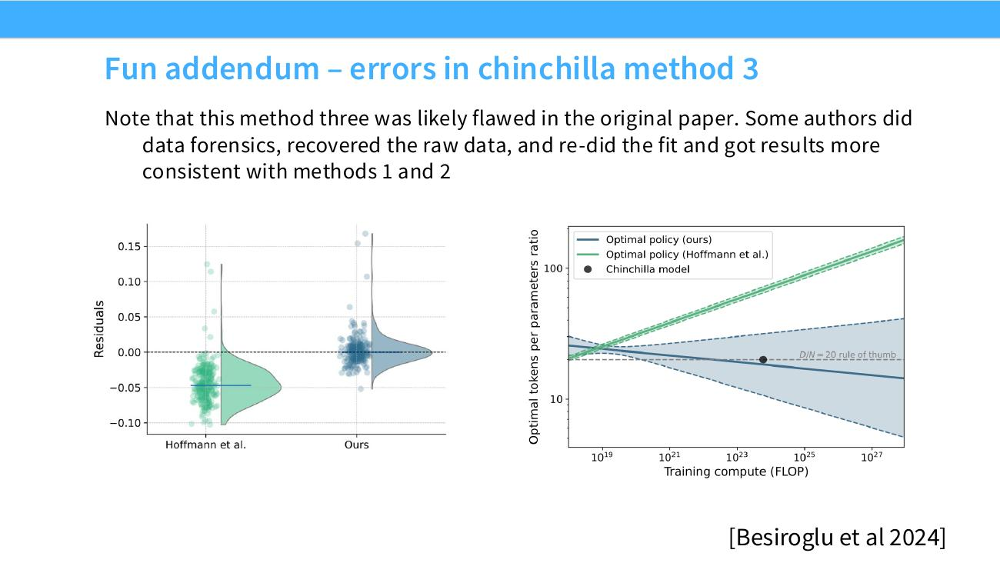

第 53 页展示 Besiroglu 等 2024 年的“数据取证”。由于拿不到原始训练数据，他们从论文已发表图表中 digitize 近似数据点，用与方法三相同的函数形式与 Huber 流程重新拟合。左图：残差分布对比——原论文方法三的残差系统性偏负（绿色小提琴图中心约 $-0.05$），说明曲面在数据一侧欠拟合；重拟合后残差居中于零。右图：修正后的最优 tokens/parameter 策略（蓝线）随预算几乎水平，贴着 $D/N=20$ 的经验线，而原论文（绿色）给出随预算上升到 100 以上的处方。修正后与方法一、二一致。

这里有一处必须显式记录的来源歧义：课件文字称后续工作“recovered the raw data”，讲者口头却说研究者拿不到原始数据和代码，只能从论文图中 digitize 数据点。按口述，更准确的说法是“从已发表图表提取近似数据并重拟合”，不能称为恢复了原始训练记录。

这场取证并没有推翻整篇 Chinchilla。相反，它让不稳定的方法三更接近方法一、二，说明多方法交叉验证为什么有价值。

### 6.4 训练计算最优不等于部署生命周期最优

Chinchilla 优化的是固定一次训练 FLOP 下的最低预训练 loss。生产模型还要付长期推理成本：如果请求量巨大，更小的模型即使需要更多训练 token，也可能因每次推理更便宜而具有更低的生命周期总成本。

可以把目标抽象为：

$$
C_{\mathrm{life}}
=C_{\mathrm{R\&D}}+C_{\mathrm{train}}+Q\,C_{\mathrm{serve}}(N).
$$

- $C_{\mathrm{life}}$：模型整个生命周期的总成本。
- $C_{\mathrm{R\&D}}$：研究、筛选和失败实验成本。
- $C_{\mathrm{train}}$：最终预训练成本。
- $Q$：预计服务请求量或累计生成 token 数。
- $C_{\mathrm{serve}}(N)$：模型规模为 $N$ 时的单次或单位 token 推理成本。

这不是课件拟合出的新缩放律，而是把讲者的部署论点写成成本分解。它的假设是服务量 $Q$ 足够大、模型质量目标可比；若只是一次研究实验，推理项可能不占主导。

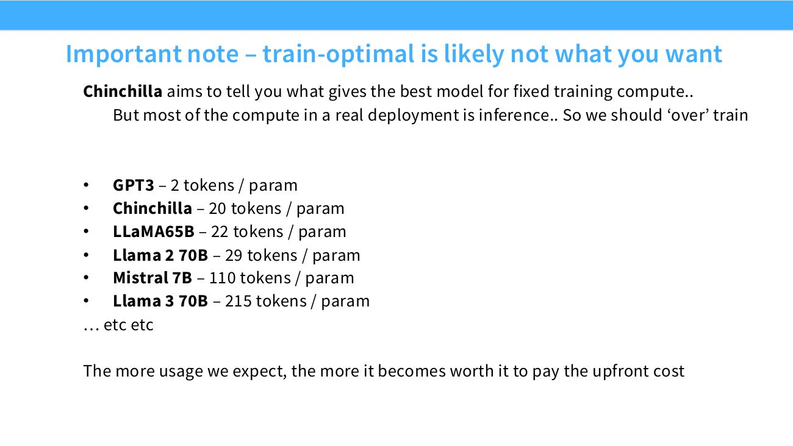

第 54 页给出行业实际选择的一览：训练最优（Chinchilla 意义下约 20 tokens/param）并不是部署最优，主流模型普遍“过度训练”：

- **GPT-3** — 约 2 tokens / param
- **Chinchilla** — 约 20 tokens / param
- **LLaMA-65B** — 约 22 tokens / param
- **Llama 2 70B** — 约 29 tokens / param
- **Mistral 7B** — 约 110 tokens / param
- **Llama 3 70B** — 约 215 tokens / param

讲者口头把 GPT-3 说成约 3；因此应记录为“课件约 2，口述约 3”，不能静默挑选一个。不同模型的 tokenizer、数据统计和参数口径也不完全一致，这组数主要展示趋势，不是严格横向排名。趋势本身很清楚：**推理需求越大的产品，越值得付前期训练成本把模型压小**——“the more usage we expect, the more it becomes worth it to pay the upfront cost”。Llama 3 70B 用 215 tokens/param 训练，就是把一次性的训练超支换成多年推理成本的节省；这里的“overtrained”是相对单次训练最优而言，并不等于统计过拟合。

### 6.5 IsoFLOP 为什么是一个好默认实验设计

IsoFLOP 的通用形式是：

1. 固定一个真实成本预算。
2. 沿等预算曲线扫描其余自由度。
3. 确认采样覆盖谷底，而不是只在单调的一侧取点。
4. 在多个预算重复实验，拟合谷底位置如何移动。
5. 留出至少一个更大尺度检验外推。

它已经从 dense LM 的 $N$–$D$ 分配迁移到 diffusion 和 MoE sparsity。优势不是“保证得到 U 形曲线”，而是成本条件清楚、最优点由直接测量支持，对全局函数形式依赖较少。

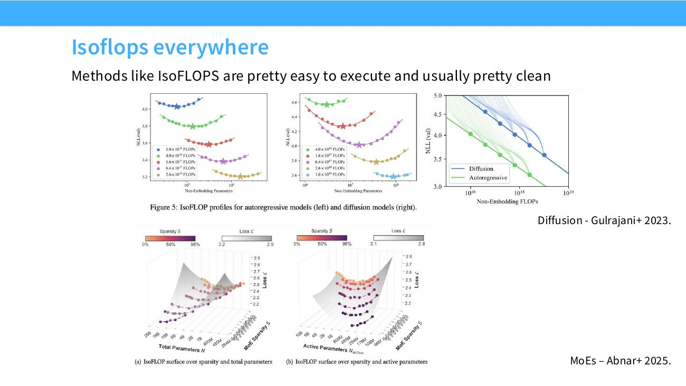

第 55 页展示 IsoFLOP 方法的迁移力。上方是 Gulrajani 等 2023 年在 **diffusion 模型**上的 IsoFLOP 分析：对自回归与扩散两类模型分别固定 FLOP 扫描参数量，同样得到干净的 U 形谷底；右图比较两者的计算效率前沿（该实验中自回归模型每个 FLOP 的 NLL 更低）。下方是 Abnar 等 2025 年在 **MoE** 上的三维推广：IsoFLOP 曲面横跨稀疏度与总参数（左）/激活参数（右）两个自由度——固定 FLOP 时，“多少专家、每个 token 激活几个”也构成一个可扫描的权衡面，且谷底结构清晰。课件点评：“Methods like IsoFLOPS are pretty easy to execute and usually pretty clean”——它只要求你能控制成本、扫描自由度、读出谷底，不要求你相信某个全局函数形式，因此在新的模型族上几乎总可以直接套用。

### 本章小结

- 参数计数、warmup、batch 调优和拟合区间足以显著改变计算最优指数。
- 缩放律预测的是给定 recipe 的放大结果，不是不可突破的物理极限。
- Method 3 的事后取证说明函数形式与数据可得性会影响曲面拟合；多方法一致性更可信。
- 单次训练计算最优与包含长期推理的部署最优是不同目标。
- IsoFLOP 是清晰而稳健的默认实验设计，但仍需覆盖谷底并做留出外推检验。

## 总结与延伸

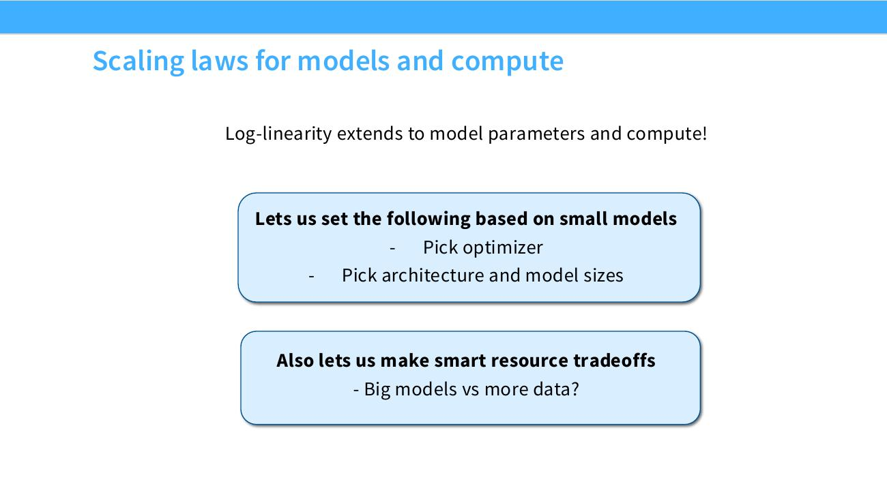

第 56 页把第 4、5 节收拢成方法论总结。第一，**log-linear 规律普遍存在**：数据量之外，模型大小、计算量、MoE 稀疏度等量与性能之间都存在可用的对数线性规律——这使得 optimizer、architecture、参数—数据分配这些曾经靠直觉的选择变得 evidence-driven。第二，**规律可用于比较候选**：比较整条缩放曲线（截距与斜率），而非单点。第三，**规律可用于资源分配**：固定预算下的最优分配由联合缩放律与 IsoFLOP 类实验给出。页面同时重申了适用边界：所有规律都条件于固定 recipe、固定数据分布与明确的参数口径，任何一项改变都需重新验证。

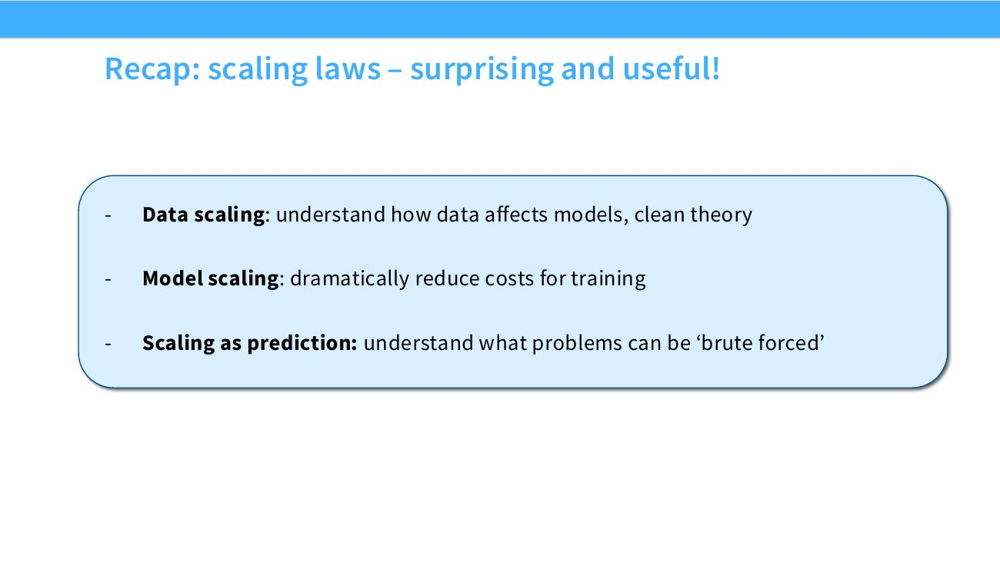

第 57 页是全讲收束。标题“Scaling laws – surprising and useful”概括了整讲的两个主题。**意外（surprising）**之处在于：简单的幂律在十几个数量级上成立；指数（如约 0.1）远小于经典统计理论的预期且至今没有公认的理论解释；许多直觉上“应该很重要”的因素（深宽比、优化器）只移动截距，而一些“细节”（warmup、参数口径、cosine 周期）却能改写最优指数。**有用（useful）**之处在于：它把大模型工程从昂贵的一次性赌博，变成“小规模测量—拟合—外推—留出验证”的常规工程流程；从架构选型、数据配比、batch 与学习率，到模型—数据分配和训练—推理成本权衡，每个决策都能在小预算上先做实验。讲者的临别赠言落在后者：缩放律的理论之谜仍未解开，但作为工程预测器它已经改变了整个行业训练大模型的方式。

### 一张因果链：资源不是答案，实验设计才是

这堂课的主线可以压缩为：

$$
\text{小规模可控实验}
\longrightarrow
\text{低方差测量}
\longrightarrow
\text{有极限约束的函数拟合}
\longrightarrow
\text{留出尺度验证}
\longrightarrow
\text{大规模工程决策}.
$$

- 小规模实验降低试错成本。
- 低方差 loss 比离散下游 accuracy 更适合先建立规律。
- 极限检查、渐近项和参数口径约束函数含义。
- 留出规模用于判断预测，而不是只评估插值。
- 最终决策还需加入数据可得性、部署成本和硬件效率。

讲者的实际 closing 是：资源与性能之间常呈 log-linear regularity；这种规律不只出现在数据量，也出现在模型大小、compute、MoE 稀疏度等变量上。它使 optimizer、architecture、参数—数据分配等选择更 evidence-driven。数据缩放的指数仍有理论谜团，模型缩放却已是非常实用的工程预测器。

### 实战检查表

准备一次新的 scaling study 时，可以逐项检查：

1. **先定义目标**：优化预训练 loss、下游能力、训练 FLOP、墙钟时间，还是训练与推理的总成本？
2. **定义横轴**：total、non-embedding、active parameters 是否混淆？token、example 与 sequence 是否统一？
3. **保持公平 recipe**：每个尺度的学习率、batch、warmup 和训练终点是否调到可比水平？
4. **覆盖足够动态范围**：有没有把局部直线误当成全局幂律？是否接近容量或不可约误差地板？
5. **报告不确定性**：低方差 perplexity 可以少量重复，但学习率、critical batch 和下游指标要更谨慎。
6. **检查函数极限**：每个资源取大或取小时，公式行为是否符合机制？
7. **做真正外推验证**：至少留出一个更大模型或更高预算，不参与函数选择。
8. **寻找曲线交叉**：不要只比较截距；新方法若斜率更差，放大后可能反转。
9. **区分训练和部署**：training-compute-optimal 不一定是 production-optimal。
10. **记录失败与 recipe**：缩放律只有在实验能复现时才是工程资产。

### 仍然开放的问题

- 神经网络中约 $0.1$ 的数据缩放指数究竟来自有效维度、函数平滑性、优化机制，还是多种因素叠加？
- 当数据 mixture、tokenizer、架构和训练目标同时改变时，哪些指数能够迁移？
- 如何把平滑的预训练 loss 规律可靠地连接到噪声更大、甚至存在阈值效应的下游能力？
- MoE 中 total capacity、active compute、路由质量与硬件通信成本应如何统一进入计算最优模型？
- 当 serving 量、延迟、显存和能耗都进入目标后，下一代“计算最优”应如何定义？

课程安排上，下一讲转向 inference；之后会回到更进阶、更专门的 scaling topics。真正需要带走的不是一组永久常数，而是：**在目标尺度昂贵到不能试错之前，把可预测性工程化出来。**

### 本章小结

- 缩放律是一套测量、拟合、验证和决策流程，不是一条自动成立的自然定律。
- 数据、模型、计算、batch、学习率、稀疏度和部署成本共同决定最优方案。
- 公式必须附带符号、假设、适用区间与误读风险。
- 可靠外推依赖正确横轴、公平 recipe、足够动态范围和留出尺度验证。


