# Stanford CS336 2026 Lecture 9：Scaling Laws — Basics

- **视频标题**：Stanford CS336 Language Modeling from Scratch | Spring 2026 | Lecture 9: Scaling Laws
- **频道**：Stanford Online
- **视频链接**：<https://www.youtube.com/watch?v=Q15rhEWZPQ4>
- **时长**：01:17:57
- **材料范围**：人工英文字幕、1080p 课程视频与官方 `lecture_09.pdf`
- **课程定位**：缩放律基础；连接经典统计学习、数据缩放、模型工程、计算最优和 Kaplan–Chinchilla 争论

> [!IMPORTANT]
> 这堂课最值得学会的不是“20 tokens/parameter”或某个固定指数，而是一套证据驱动的工程方法：先在小规模上测量稳定规律，明确横轴、训练 recipe 与适用区间，再用外推约束大规模决策。缩放律只能预测“把当前 recipe 继续放大”会发生什么；它不会替你保证 recipe 本身是最优的。

## 1. 为什么大模型工程需要缩放律

### 1.1 一万张 B200，也不能靠试错挥霍

课程从一个夸张但现实的问题开始：假设有人给你一万张 B200、一个月时间，要训练一个高质量开源语言模型。基础设施团队和预训练数据已经就绪，真正危险的决策才刚开始：用什么架构？模型多深、多宽？参数量多大？训练多少 token？batch size 与学习率如何设置？

这些选择在小实验里只是几次重跑，在目标规模上却可能价值数百万美元。照抄现有模型能得到一个合理起点，但如果目标是超过现有模型，就不能永远复制他人的答案。

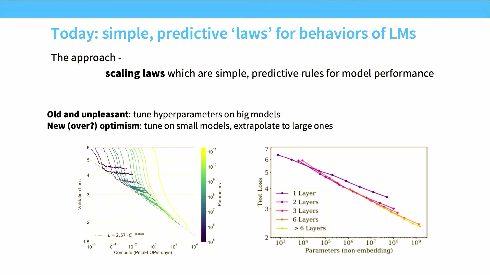
*图 1：缩放律把“直接在昂贵大模型上调参”改写为“小规模测量规律，再外推到大规模”。画面选取完整揭示状态。（字幕区间：00:01:09--00:04:04）*

### 1.2 缩放律是什么

课程采用工程定义：缩放律是一条简单、可预测的规则，用来描述资源规模与模型性能之间的关系。资源可以是数据量、参数量、训练计算量，甚至 MoE 稀疏度；性能通常先用平滑的预训练 loss 或 perplexity 表示。

如果在小尺度到中尺度间观察到稳定关系，就可以尝试外推到更大的训练 run。这里有三个层次：

1. **测量**：训练一组小模型，控制变量并记录 loss。
2. **拟合**：选择有意义的函数形式，估计斜率、截距和渐近项。
3. **决策**：比较候选 recipe 在目标规模的预测，而不是只比较最小实验上的单点。

> [!WARNING]
> “law”并不意味着自然定律。讲者明确把许多缩放律称为纯粹的 curve fitting；理论提供合理的候选函数和极限行为，却没有保证幂律是唯一正确形式。

### 1.3 它并不是 2020 年才出现的思想

缩放律和经典样本复杂度十分接近。有限假设类的一类泛化上界可以写成：

$$
\epsilon(\hat h)
\leq
\min_{h\in H}\epsilon(h)
+2\sqrt{\frac{1}{m}\log\frac{2k}{\delta}}.
$$

- $\hat h$：从训练数据选出的假设。
- $H$：候选假设集合。
- $h$：集合中的任一假设。
- $\epsilon(\cdot)$：真实风险或泛化误差。
- $m$：样本数。
- $k$：有限假设的数量。
- $\delta$：置信失败概率。

这个式子关心的是“误差最多有多坏”，而现代经验缩放律更关心“实际 loss 会是多少”。两者不是同一对象，但都在问：资源增加时，误差以什么速率下降？

历史脉络也很连续：1993 年的学习曲线工作已经尝试用小训练集预测大训练集的误差；Banko 与 Brill 在 2001 年讨论“更多语料还是更多算法开发”；Kolachina 等在 2012 年比较多种曲线函数；Hestness 等在 2017 年跨机器翻译、语言建模和语音识别观察到神经网络的稳定幂律。

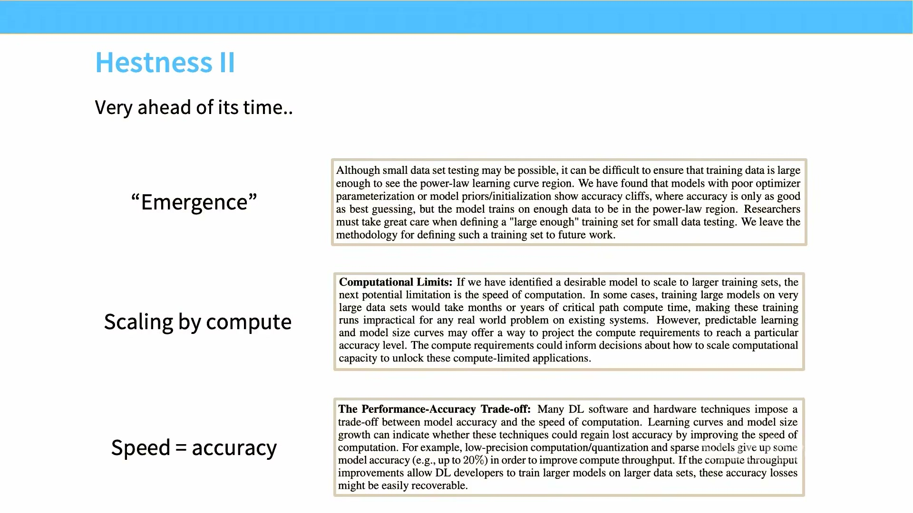
*图 2：Hestness 等在现代 LLM 热潮前已经讨论跨任务幂律、计算缩放、能力突现，以及系统速度如何通过更大训练转化为精度。（字幕区间：00:08:27--00:10:17）*

Hestness 工作还有一个重要洞见：loss 往往平滑，accuracy 却可能在阈值附近突然跳变。因此所谓“涌现”有时来自观察指标的离散性，而不是底层学习过程真的在某一点不连续。

### 本章小结

- 大模型调参昂贵，缩放律用小规模实验约束大规模决策。
- 它是一种“测量—拟合—外推—决策”的工程范式。
- 理论样本复杂度提供函数形式直觉，但经验 loss 不是理论上界。
- 缩放思想有长期历史；现代 LLM 只是把它推到了更大的资源范围。

## 2. 数据缩放：为什么 log-log 图上会出现直线

### 2.1 从经验曲线读出幂律

先固定模型和训练流程，只改变训练数据量 $D$。在模型容量还没有饱和、超参数也调得合理时，更多数据应让 test loss 单调下降。Kaplan 风格的经验拟合可写成：

$$
L(D)=\left(\frac{D}{5.4\times10^{13}}\right)^{-0.095}.
$$

- $L(D)$：使用 $D$ 个训练 token 后的测试损失。
- $D$：训练数据规模，以 token 数计。
- $5.4\times10^{13}$：拟合中的尺度常数，用来归一化横轴。
- $0.095$：数据缩放指数；负号表示数据增加时 loss 下降。

更一般地，把不可约损失写出来：

$$
L(R)=L_\infty+A R^{-\alpha}.
$$

- $R$：某种资源，例如数据量、参数量或 FLOP。
- $L(R)$：资源为 $R$ 时的 loss。
- $L_\infty$：资源无限时仍无法消除的渐近损失。
- $A$：有限资源项的幅度。
- $\alpha>0$：缩放指数。

先减去渐近项再取对数：

$$
\log\bigl(L(R)-L_\infty\bigr)
=\log A-\alpha\log R.
$$

- 横轴是 $\log R$。
- 纵轴是 $\log(L-L_\infty)$。
- 直线斜率为 $-\alpha$。
- 截距为 $\log A$。

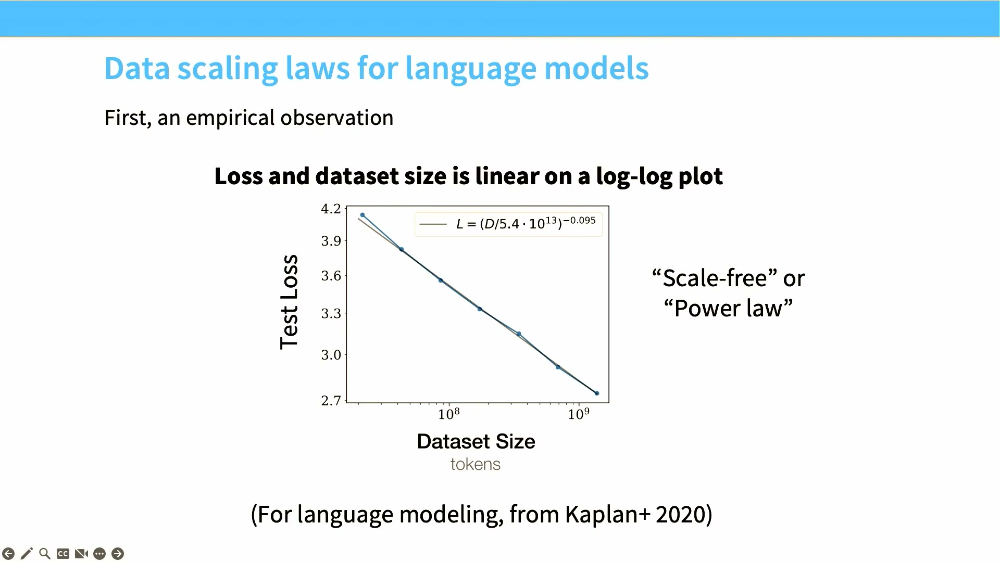
*图 3：在幂律区间内，数据量和测试损失在 log-log 坐标上近似线性；接近不可约误差后曲线会弯折。（字幕区间：00:14:31--00:15:55）*

> [!WARNING]
> 只有纵横轴都取对数、并且正确处理渐近项时，直线斜率才直接对应幂律指数。课程问答还提醒：“把图放得足够局部，一切都像直线。”窄范围内很难区分幂律、指数或其他光滑曲线。

### 2.2 均值估计：最简单的缩放律

为了说明幂律并不神秘，课程暂时把语言模型变回统计学。设有独立同分布样本：

$$
x_1,\ldots,x_n\sim\mathcal N(\mu,\sigma^2),
\qquad
\hat\mu=\frac{1}{n}\sum_{i=1}^{n}x_i.
$$

- $x_i$：第 $i$ 个观测。
- $n$：样本数。
- $\mu$：未知真实均值。
- $\sigma^2$：单个观测的方差。
- $\hat\mu$：样本均值估计量。

样本均值的均方误差为：

$$
\mathbb E\left[(\hat\mu-\mu)^2\right]=\frac{\sigma^2}{n}.
$$

- $\mathbb E$：对重复采样取期望。
- 左侧：估计量离真实均值的平均平方距离。
- 右侧：样本数翻倍，误差减半。

取对数得到：

$$
\log(\mathrm{Error})=-\log n+2\log\sigma.
$$

- 斜率是 $-1$。
- $2\log\sigma$ 只改变截距。

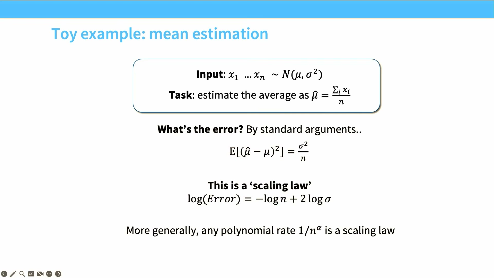
*图 4：均值估计把“误差按多项式下降”与“log-log 图呈直线”直接连接起来。（字幕区间：00:15:55--00:16:59）*

### 2.3 为什么神经网络的指数只有约 0.1

经典参数估计常出现 $1/n$ 或 $d/n$ 级的误差；如果这就是全部故事，log-log 斜率应接近 $-1$。现实中的机器翻译、语音和语言建模曲线却常见 $-0.1$ 到 $-0.3$，下降慢得多。

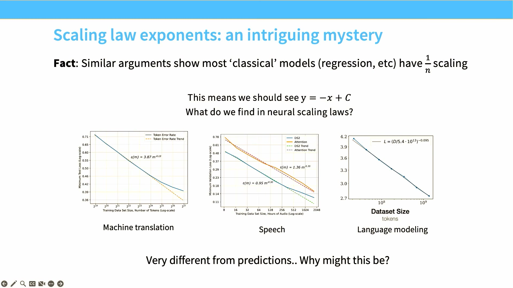
*图 5：经典模型的 $-1$ 斜率与神经网络中约 $-0.1$、$-0.3$ 的经验斜率形成对比。（字幕区间：00:17:17--00:18:19）*

课程用一个简化的非参数回归例子建立直觉。设 $x_i$ 均匀分布于二维单位方形，观测为：

$$
y_i=f(x_i)+\varepsilon_i,
\qquad
\varepsilon_i\sim\mathcal N(0,1).
$$

- $x_i$：二维输入位置。
- $f$：需要估计的未知平滑函数。
- $y_i$：带高斯噪声的观测。
- $\varepsilon_i$：相互独立、方差为 1 的观测噪声。

把空间分成边长

$$
h=n^{-1/4}
$$

的小格。在二维中，小格数约为 $h^{-2}=\sqrt n$，所以每格平均样本数约为

$$
k\approx nh^2=\sqrt n.
$$

在每个格子内用 $y_i$ 的均值估计 $f(x)$。这里必须先说清 `Error` 的定义：**课件的 $1/\sqrt n$ 应解释为均方误差（MSE）中的方差项，而不是均值估计的标准误。** 因为单个观测的噪声方差是 1，格内均值满足：

$$
\operatorname{Var}(\hat f_{\mathrm{bin}})
\approx\frac{1}{k}
=n^{-1/2},
\qquad
\operatorname{SE}(\hat f_{\mathrm{bin}})
=\sqrt{\operatorname{Var}(\hat f_{\mathrm{bin}})}
\approx n^{-1/4}.
$$

- $\hat f_{\mathrm{bin}}$：格内所有 $y_i$ 的平均值。
- $k$：该格中的样本数，量级为 $\sqrt n$。
- $\operatorname{Var}$：估计量由观测噪声造成的方差。
- $\operatorname{SE}$：标准误，是方差的平方根；它不是此处 $1/\sqrt n$ 的 `Error`。

MSE 还要加上用格内常数近似变化函数 $f$ 的平方偏差：

$$
\operatorname{MSE}(x)
=\operatorname{Var}(\hat f_{\mathrm{bin}})
+\operatorname{Bias}(\hat f_{\mathrm{bin}};x)^2
\approx n^{-1/2}+\text{平方逼近偏差}.
$$

- 第一项：每个局部格子中有限样本造成的噪声方差。
- 第二项：$f$ 在格内并非常数造成的平方逼近偏差，其速率取决于平滑性假设。
- 例如若 $f$ 是 Lipschitz 函数，偏差本身为 $O(h)=O(n^{-1/4})$，平方偏差为 $O(h^2)=O(n^{-1/2})$；于是这个二维构造的 MSE 总体为 $O(n^{-1/2})$。

课件随后把维度依赖简写为：

$$
\mathrm{Error}\approx n^{-1/d},
\qquad
\log\mathrm{Error}\approx-\frac{1}{d}\log n+C.
$$

- $d$：输入空间或有效数据流形的维度。
- $1/d$：维度越高，学习越慢。
- $C$：噪声、平滑性和尺度产生的常数。

这个 $n^{-1/d}$ **不是从上面的二维分箱计算严格连续推出的通用定理**。在 $d=2$ 时，它恰好给出 $n^{-1/2}$，与上述 Lipschitz、MSE 口径的二维结果数值一致；这只能支撑课堂类比。更一般地，若函数具有 $s$ 阶 Hölder 平滑性，宽度为 $h$ 的直方图估计常有启发式分解：

$$
\operatorname{MSE}(h)
\approx\frac{1}{nh^d}+h^{2s}.
$$

- $1/(nh^d)$：每个局部邻域样本不足造成的方差。
- $h^{2s}$：局部常数近似造成的平方偏差。
- $s$：函数平滑度；$s=1$ 对应 Lipschitz 情形。

平衡两项会得到 $h\asymp n^{-1/(2s+d)}$、MSE 约为 $n^{-2s/(2s+d)}$，而不是普遍的 $n^{-1/d}$。因此最终应把课件的 $n^{-1/d}$ 理解为“维度越高，非参数学习越慢”的心智模型，而不是精确速率公式。

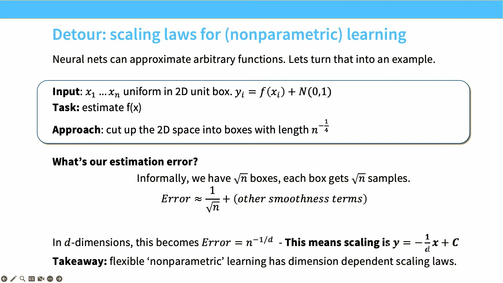
*图 6：灵活函数估计的速率依赖维度，为小缩放指数提供一种直觉。（字幕区间：00:18:23--00:20:24）*

一种诱人的解释是：指数约 $0.1$ 意味着神经网络像在约十维的“内在数据空间”上做非参数平滑。讲者对此很谨慎：内在维度估计本身可能不可靠，这只是值得思考的心智模型，不是已经证明的机制。

> [!WARNING]
> 课件二维式中的 $1/\sqrt n$ 只有在 `Error` 指 MSE/方差时才与“每格 $\sqrt n$ 个样本”一致；若指标准误，速率应是 $n^{-1/4}$。后续 $n^{-1/d}$ 是另一个刻意简化的维度启发式。一般非参数估计的速率依赖平滑度、误差定义和估计器，不能把两步写成严格推导，更不能用它证明神经网络的内在维度。

### 2.4 幂律区间、饱和区间和 Q&A 中的三个限定

第一，数据缩放实验通常希望模型容量相对数据足够大，使实验处在幂律区间。如果模型太小、数据远多于模型容量，继续加数据会进入饱和区。此时要么避开该区间，要么显式拟合 $L_\infty$。

第二，test loss 与 train loss 应区分。但很多预训练 run 只遍历数据一轮，泛化间隙很小，所以论文图中二者有时近似互换；数据重复或无限计算实验则不能沿用这个近似。

第三，低方差并非理所当然。大规模同质数据上的 perplexity 往往稳定到小数点后几位，因此一些论文每个点只跑一次；学习率和 critical batch 的曲线却可能十分嘈杂，更需要重复实验和不确定性估计。

### 本章小结

- 幂律 $L-L_\infty=AR^{-\alpha}$ 在 log-log 坐标上变成斜率为 $-\alpha$ 的直线。
- 均值估计给出最简单的 $1/n$ 缩放律。
- 神经网络的经验指数更小，可用高维非参数学习作直觉，但不能视为定理。
- 外推前必须确认幂律区间、渐近项、坐标轴和测量方差。

## 3. 数据不只有“多少”：组成、重复与有限性

### 3.1 数据 mixture 为什么常改变截距而非斜率

单一分布上的数据缩放只回答“更多数据能带来多少改进”。真正的数据工程还要回答：新闻、Wikipedia、代码、数学文本各占多少？高质量数据要不要重复？过滤阈值应多严格？

课程先给出一个经典直觉：在模型类固定时，数据分布常主要改变曲线的 offset，而学习速率的 slope 更多由模型类决定。可以把第 $q$ 种 mixture 的误差写成：

$$
L_q(n)=L_\infty+C(q)n^{-\alpha}.
$$

- $q$：数据来源的混合比例。
- $n$：训练样本或 token 数。
- $C(q)$：由 mixture 决定的截距或幅度。
- $\alpha$：近似共享的学习速率指数。
- $L_\infty$：渐近损失。

在课件的两来源线性回归玩具模型里，只取任一来源都会丢失另一部分信息，最佳截距出现在混合比例的中间。这展示了数据多样性的价值。

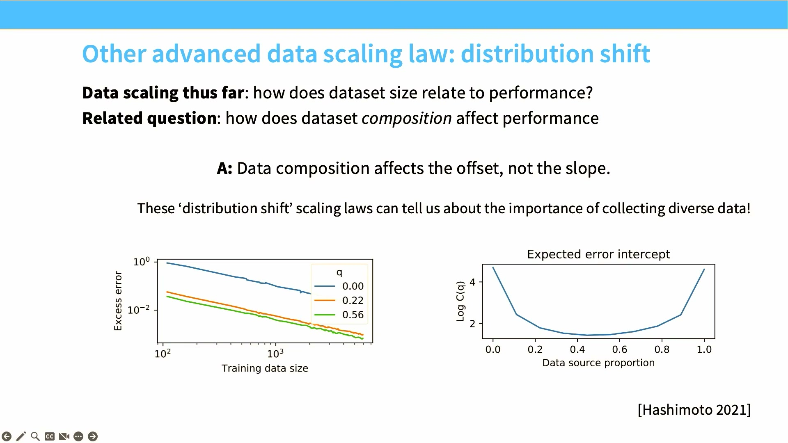
*图 7：不同 mixture 的曲线近似平行，主要差别落在截距；右图显示两来源比例过于极端时误差都更高。（字幕区间：00:22:28--00:23:25）*

自然做法是：在多个小模型与 mixture 上拟合曲面，再外推目标规模的最佳比例。但讲者指出现实远比理想图嘈杂。DataDecide 等经验研究甚至发现，直接选小模型上最好的 mixture 再放大也能工作；如果各 mixture 的斜率确实近似相同，这个结果并不矛盾。

> [!WARNING]
> “composition 只改截距、不改斜率”是课程中的常见经验与特定玩具模型结论，不是普适定理。新的模型架构、训练目标、极端分布变化或不同评价域都可能让斜率和排序改变。

### 3.2 有限数据重复：前几轮有用，之后迅速递减

当计算增长快于独特数据，重复不可避免。课程引用 data-constrained language model 实验：使用标准 recipe 时，约前四轮重复几乎不受损；再继续重复，实际 loss 会逐渐偏离“每个 token 都是新数据”的理想虚线。

一个饱和型有效数据模型是：

$$
D'=U_D+U_D R_D^*\left(1-e^{-R_D/R_D^*}\right).
$$

- $D'$：把重复折算后的有效数据量。
- $U_D$：独特 token 数。
- $R_D$：重复程度。
- $R_D^*$：控制重复收益何时饱和的经验常数。
- $e$：自然常数。

当 $R_D$ 很小时，$1-e^{-R_D/R_D^*}\approx R_D/R_D^*$，所以新增重复近似仍有线性价值；当 $R_D$ 很大时，指数项趋于零，额外有效数据最多只增加到一个有限上限。

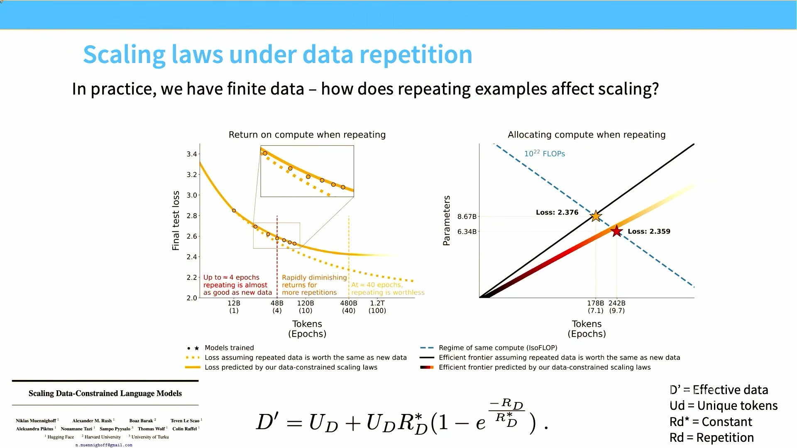
*图 8：重复最初接近新数据，之后收益快速递减；右侧展示固定 compute 下考虑重复折价会改变最优模型—数据分配。（字幕区间：00:25:20--00:26:14）*

把计算推到近乎无限时，单纯增加 epoch 或模型参数都会遇到递减收益，研究者开始使用正则化、集成等方法继续挖掘有限数据。一个反复出现的现象是：干预常移动截距，却未必改变幂律斜率。

### 3.3 最佳过滤器必须随训练规模变化

小预算下，训练者只能消费有限 token，激进保留最高质量数据很合理。大预算下，同一个小数据池会被反复遍历；为了避免重复，过滤器需要逐渐放宽，纳入质量稍低但信息新颖的数据。

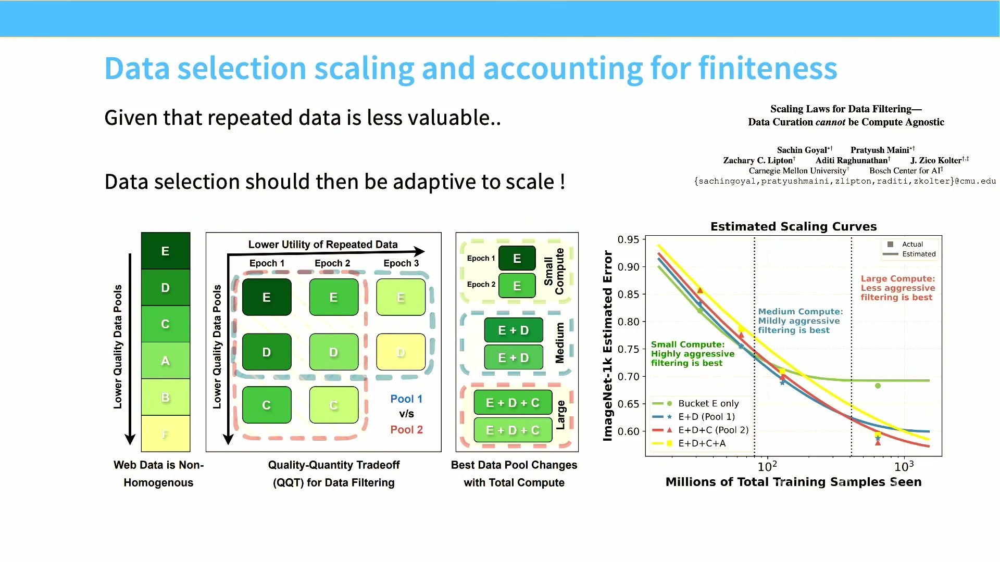
*图 9：小 compute 对应激进过滤，大 compute 需要更宽的数据池；数据质量—数量取舍不是与规模无关的常数。（字幕区间：00:27:22--00:28:25）*

这不是说低质量数据优于高质量数据。真正的约束是：高质量数据有限，而重复会折价。因此“最佳数据集”必须和独特 token 数、训练预算、epoch 数、模型规模一起定义。

> [!IMPORTANT]
> 数据量、数据 mixture、重复率和过滤阈值属于同一个优化问题。把其中任何一个固定为“行业常数”，都会在规模改变时失去最优性。

### 本章小结

- mixture 常通过截距影响性能，小规模排序可能延续到大规模，但要实测斜率是否稳定。
- 重复数据不是立即无效，而是边际收益逐步饱和。
- 高质量数据有限时，计算越多，过滤通常越需要放宽。
- 数据工程决策必须与模型规模和训练预算联合考虑。

## 4. 从经验曲线到模型工程：架构、batch 与学习率

### 4.1 架构与优化器：比较整条曲线，不只比较一个点

如果要判断 Transformer 是否优于 LSTM，暴力方法是训练一个 GPT-3 规模 LSTM；缩放律方法则训练多个小 Transformer 和不同深度 LSTM，再比较它们的截距、斜率与目标规模预测。

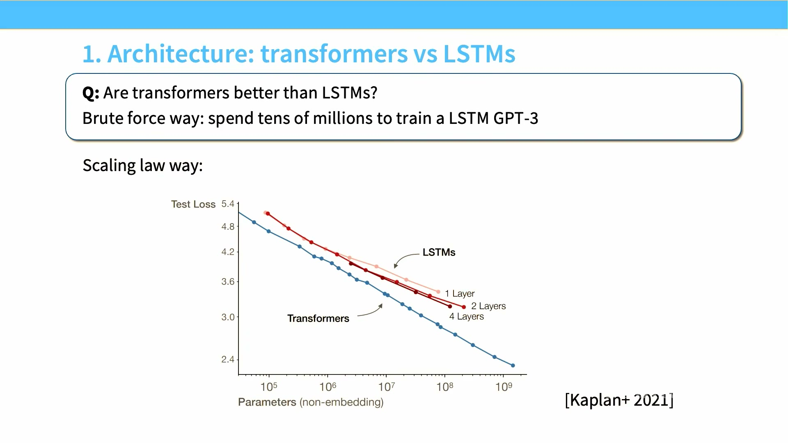
*图 10：相同 non-embedding 参数口径下，Transformer 的 loss 曲线优于不同深度 LSTM；曲线的相对位置和斜率比单点胜负更有信息。（字幕区间：00:31:37--00:33:08）*

如果一种新架构只在最小规模略胜、但斜率更差，继续放大后可能反被基线超过。课程举出跨架构研究：GLU 与 Switch Transformer 等小规模趋势预示了后来实际采用的方向，而一些 efficient-attention 变体的缩放并不好。

Adam 与 SGD 的 Hestness 示例也接近幂律：

$$
\epsilon_{\mathrm{SGD}}(m)\approx5.37m^{-0.094},
\qquad
\epsilon_{\mathrm{Adam}}(m)\approx5.25m^{-0.095}.
$$

- $\epsilon(m)$：数据规模为 $m$ 时的最低验证损失。
- $m$：训练字符数或对应的数据规模；该图来自 recurrent highway network，不是现代 Transformer。
- $5.37$、$5.25$：拟合幅度，体现截距差异。
- $0.094$、$0.095$：几乎相同的缩放指数。

这个例子的结论不是“Adam 永远只好一点”，而是：更换一个看似巨大的优化器因素后，斜率仍可能接近，主要改变量是 offset。

### 4.2 深宽比相对宽容，参数却不能一视同仁

极浅模型的缩放明显差：一层到两层带来巨大改进；继续加深的边际收益减小。固定 non-embedding 参数量时，feed-forward ratio、深宽比和 attention head dimension 在相当宽范围内只造成几个百分点的 loss 差异。

但“总参数量相同”并不总是公平比较。embedding 参数随词表和隐藏维度增长，却与主体网络参数有不同的计算和表达作用；把 embedding 计入横轴，会让原本整齐的层数曲线变形。

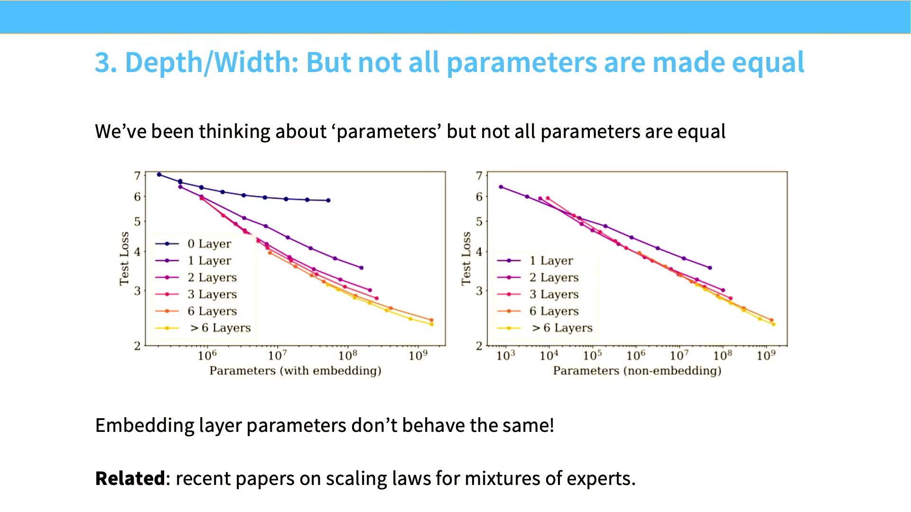
*图 11：同一组模型按“含 embedding 的总参数”和“non-embedding 参数”作图，会得到不同的缩放整齐度。（字幕区间：00:37:53--00:39:07）*

MoE 进一步区分：

- **总参数**：所有专家之和，决定模型存储容量。
- **激活参数**：单个 token 实际经过的专家参数，决定主要计算量。
- **稀疏度**：总容量与单 token 计算之间的杠杆。

课件显示，即使保持激活参数不变，增加未被当前 token 激活的专家容量仍可降低总体 loss；所以“每个参数的价值”取决于它处在何种结构中。

### 4.3 临界 batch：并行效率与样本效率的交点

batch 越大，越容易做数据并行；但大到一定程度后，继续增加样本不再带来等比例的优化步数减少。

讲者把过程分成两个区间：

1. **噪声受限**：batch 增大能降低随机梯度方差，接近线性加速。
2. **偏差受限**：梯度已经很准确，但它仍只是局部下降方向；再降噪无法消除局部方向与全局最优方向的偏差。

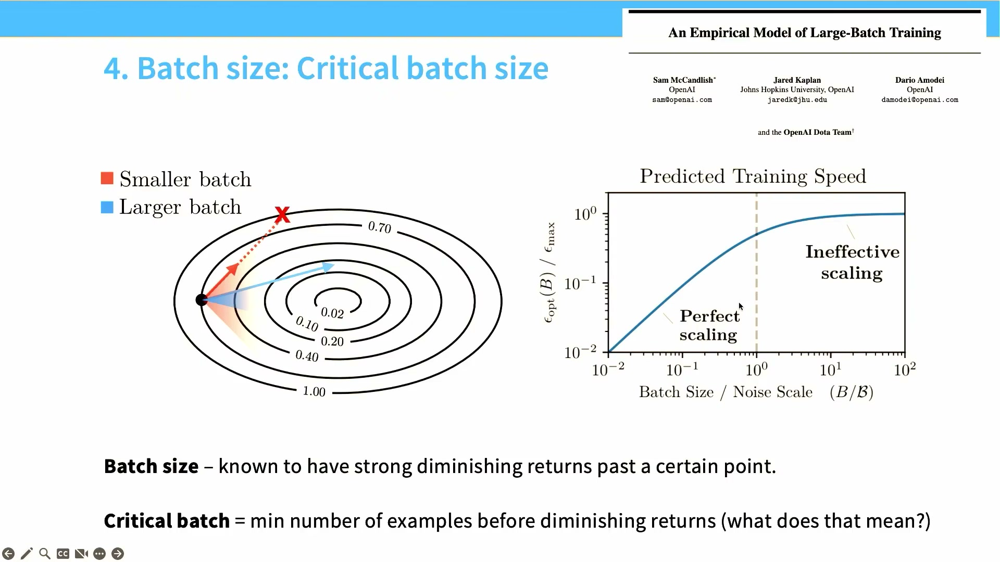
*图 12：batch 增大最初带来近线性训练速度提升，跨过梯度噪声尺度后进入收益递减区。（字幕区间：00:42:19--00:44:08）*

实际估计方法是固定目标 loss，对不同 batch size 记录达到目标所需的步数 $S$ 和样本数 $E$，拟合：

$$
\frac{S}{S_{\min}}-1
=
\left(\frac{E}{E_{\min}}-1\right)^{-1}.
$$

- $S$：达到目标 loss 所需的优化步数。
- $S_{\min}$：无限大 batch 极限下的最少步数。
- $E$：达到目标 loss 所需处理的样本或 token 数。
- $E_{\min}$：极小 batch 极限下的最少样本或 token 数。

步数、样本数和 batch 的关系近似为：

$$
E=BS.
$$

- $B$：batch size。
- 该式假设 $E$ 和 $B$ 使用同一计数单位；若 batch 以 sequence 计而 $E$ 以 token 计，还需乘序列长度。

把两侧效率平衡起来，定义：

$$
B_{\mathrm{crit}}=\frac{E_{\min}}{S_{\min}}.
$$

- $B_{\mathrm{crit}}$：临界 batch size。
- 当 $B=B_{\mathrm{crit}}$ 时，拟合关系给出 $S\approx2S_{\min}$、$E\approx2E_{\min}$。
- 它不是数学上唯一的最优，而是 step efficiency 与 sample efficiency 的对称折中。

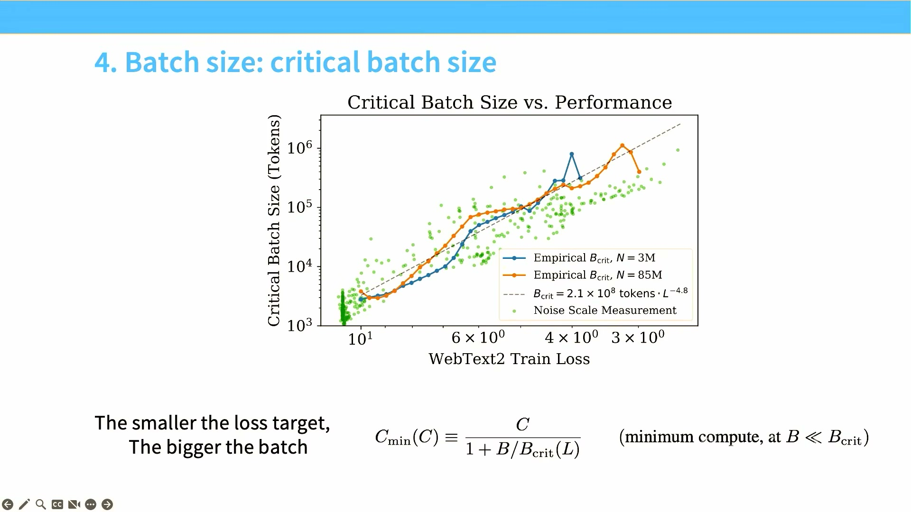
*图 13：不同规模实验得到的 $B_{\mathrm{crit}}$ 虽有噪声，仍随目标 loss 改善而系统性增大；图中的经验式只属于该设置。（字幕区间：00:44:32--00:48:25）*

课件还给出经验关系：

$$
B_{\mathrm{crit}}(L)\approx2.1\times10^8\,L^{-4.8}\ \text{tokens}.
$$

- $L$：目标训练 loss。
- $B_{\mathrm{crit}}(L)$：达到该 loss 附近时的临界 token batch。
- $2.1\times10^8$、$4.8$：该实验中的拟合常数，不是跨模型通用常数。

目标 loss 越低，优化越精细，梯度噪声越重要，因此可有效利用的 batch 也越大。临界 batch 还近似关联“梯度协方差的迹 / 梯度范数平方”，但课程不展开推导。

### 4.4 学习率：预测最优点，或重参数化让它不漂移

普通宽度缩放中，模型越宽，最佳学习率往往越小；常见规则是按宽度的倒数缩放。工程上有两种哲学：

1. 在多个宽度上测量最佳学习率的漂移，再外推大模型的最优学习率。
2. 用 muP 一类重参数化，调整初始化和不同张量的步长，使最佳学习率尽量跨宽度稳定。

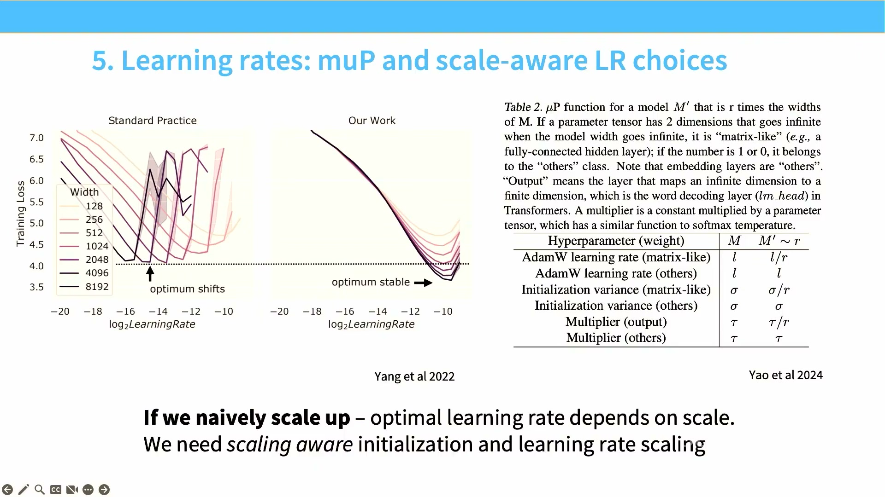
*图 14：标准参数化中不同宽度的最优学习率漂移；scale-aware 重参数化尝试把这些最低点对齐。（字幕区间：00:48:32--00:50:55）*

课件给出的宽度扩张规则如下。设模型宽度从 $M$ 扩大为 $M'=rM$：

| 参数类别 | 基准值 | 扩宽后的值 |
|---|---:|---:|
| AdamW 学习率，matrix-like | $\ell$ | $\ell/r$ |
| AdamW 学习率，其他参数 | $\ell$ | $\ell$ |
| 初始化方差，matrix-like | $\sigma$ | $\sigma/r$ |
| 初始化方差，其他参数 | $\sigma$ | $\sigma$ |
| 输出层 multiplier | $\tau$ | $\tau/r$ |
| 其他 multiplier | $\tau$ | $\tau$ |

- $M$：基准模型宽度。
- $M'$：扩大后的模型宽度。
- $r$：宽度倍数。
- $\ell$：基准学习率。
- $\sigma$：课件表中标为 initialization variance 的量。
- $\tau$：参数 multiplier。
- matrix-like：宽度增长时两个维度都随之扩张的权重矩阵。

> [!NOTE]
> 讲者明确说，两种学习率哲学都曾成功用于大规模训练；他只是观察到业界似乎更偏向直接做缩放实验。这一讲也没有完整教授 muP，细节留到进阶缩放课。

### 4.5 预训练 loss 可预测，不代表下游任务同样可预测

同一系列架构的 negative log-perplexity 可以随参数量形成漂亮直线，但 SuperGLUE accuracy 的排序可能完全不同。课程示例中，预训练指标最好的 NL12 并不是下游最好的模型。

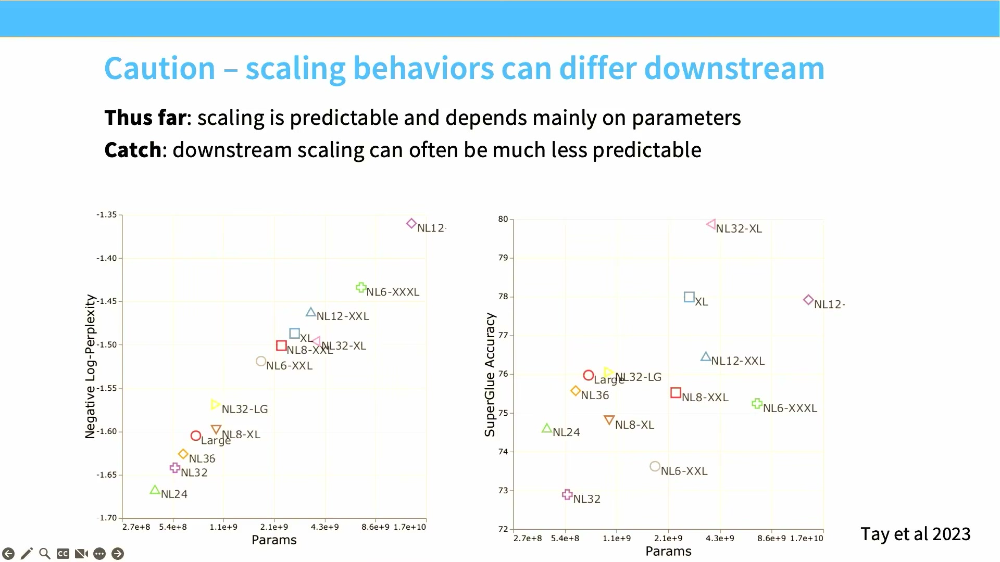
*图 15：左侧预训练指标随参数量规律改善，右侧下游准确率却更加散乱；这正是迁移不确定性的证据。（字幕区间：00:51:09--00:52:36）*

因此可靠流程不是“用下游噪声点硬拟合一条漂亮线”，而是：

1. 先在低方差指标上建立稳定规律。
2. 再验证该规律能否迁移到目标下游任务。
3. 若下游指标本身稳定，也可直接拟合；若曲线锯齿明显，就应降低外推信心。

### 4.6 一套朴素但实用的模型选型流程

课程将前面内容压缩为三步：

1. 为每个候选架构、优化器或超参数训练若干小模型。
2. 在一致的参数口径、数据与 recipe 下拟合 scaling curve。
3. 只有拟合稳定、差距可持续时，才把预测用于目标规模。

> [!WARNING]
> 不要只看 $R^2$ 或一条视觉上很直的线。还要检查不同 seed、训练是否收敛、warmup 是否占比失真、横轴参数定义、拟合区间和 holdout scale。

### 本章小结

- 架构和优化器要比较整条缩放曲线，而不只是最小规模上的一个点。
- 深宽比在合理范围内相对宽容，但 embedding、dense 与 MoE 参数不能一视同仁。
- 临界 batch 平衡步数效率和样本效率，并随目标 loss 改善而增大。
- 学习率可以靠外推选择，也可用 muP 让最优点跨宽度稳定。
- 预训练 loss 的规律不能自动保证下游任务排序。

## 5. 联合数据—模型缩放：在固定计算量下求最优

### 5.1 为什么数据量和模型大小不能各自单独最大化

单变量缩放律分别回答“模型固定时，加数据有什么用”和“数据固定时，加参数有什么用”。但真实预算把两者绑在一起。对 dense Transformer，训练计算量常用一阶近似表示为：

$$
C_{\mathrm{train}}\approx kND.
$$

- $C_{\mathrm{train}}$：训练所需的计算量，通常以 FLOP 计。
- $N$：模型参数量；必须明确是 total、non-embedding 还是 active parameters。
- $D$：训练 token 数。
- $k$：由前向、反向、架构和实现口径决定的比例常数。

固定 $C_{\mathrm{train}}$ 时，增大 $N$ 就会挤压 $D$，反之亦然。小模型吞入过多数据会撞上容量地板；大模型只看少量数据又会处于数据不足区。因此目标不是让两个旋钮同时最大，而是在同一成本曲线上找到 loss 最低点。

> [!WARNING]
> $C_{\mathrm{train}}\approx kND$ 是实验设计近似，不是硬件墙钟时间的精确公式。长上下文 attention、MoE 稀疏激活、embedding、通信和设备利用率都会让 $k$ 改变。

### 5.2 联合 scaling surface 与极限检查

Rosenfeld 风格的简单联合形式是：

$$
E(n,m)=n^{-\alpha}+m^{-\beta}+E_\infty.
$$

- $E(n,m)$：数据量与模型量给定时的 error 或 loss。
- $n$：归一化后的数据规模。
- $m$：归一化后的模型规模。
- $\alpha>0$：数据项的经验衰减指数。
- $\beta>0$：模型项的经验衰减指数。
- $E_\infty$：两类资源都充分大时仍剩余的渐近项。

课件还展示 Kaplan 的另一种经验形式：

$$
E(m,n)=\left[m^{-\alpha}+n^{-1}\right]^\beta.
$$

- $m,n$：课件中的模型与数据规模变量。
- $\alpha,\beta$：联合控制模型项、数据项和外层曲率的拟合指数。
- 括号与外层 $\beta$ 的位置按课件原式保留；它不是上一式的简单换符号版本。

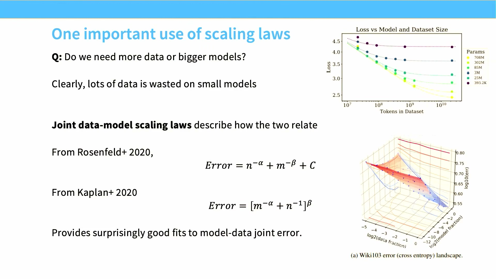
*图 16：单独增加数据或模型都会遇到另一侧限制；联合曲面把两种资源放进同一个 error landscape。（字幕区间：00:57:09--01:00:11）*

读到任何多变量缩放式，先做极限检查：

$$
n\to\infty
\quad\Longrightarrow\quad
E\to m^{-\beta}+E_\infty,
$$

$$
m\to\infty
\quad\Longrightarrow\quad
E\to n^{-\alpha}+E_\infty.
$$

- 第一式表示数据无限时，只剩模型容量限制。
- 第二式表示模型无限时，只剩有限数据限制。
- 如果某个候选公式在这些极限下给出反直觉行为，就不应只因拟合分数高而接受它。

课程展示的 Rosenfeld 实验只用小模型、小数据角落里的点拟合，再预测未见过的大模型、大数据区域；这是“从便宜实验外推”的直接示范。但它只证明所示实验在该范围有效，不保证跨架构、数据分布或训练 recipe 外推。

### 5.3 计算最优指数如何决定 tokens/parameter

把固定预算下的最优模型和数据写成：

$$
N_{\mathrm{opt}}\propto C^a,
\qquad
D_{\mathrm{opt}}\propto C^b.
$$

- $C$：训练计算预算。
- $N_{\mathrm{opt}}$：该预算下预测的最优参数量。
- $D_{\mathrm{opt}}$：该预算下预测的最优 token 数。
- $a$：模型规模随计算增长的指数。
- $b$：数据规模随计算增长的指数。

两式相除得到：

$$
\frac{D_{\mathrm{opt}}}{N_{\mathrm{opt}}}
\propto C^{b-a}.
$$

- $D/N$：tokens per parameter。
- 若 $a=b$，该比例近似保持常数。
- 若 $a>b$，模型比数据增长更快，比例随预算下降。
- 若 $b>a$，数据比模型增长更快，比例随预算上升。

Kaplan 课件处方是：

$$
N_{\mathrm{opt}}\propto C^{0.73},
\qquad
D_{\mathrm{opt}}\propto C^{0.27}.
$$

这会给出 $D/N\propto C^{-0.46}$：预算越大，处方越偏向增大模型。讲者在口头说明时一度把 $N$ 与 $D$ 说反，随后立即纠正；这里采用纠正后的定义。

Chinchilla 得到近乎相反的工程结论：在相同训练 FLOP 下，用更小模型看更多 token 往往更好。三种方法的课件结果为：

| 估计方法 | $a$：模型指数 | $b$：数据指数 | 主要含义 |
|---|---:|---:|---|
| 1. 训练曲线 lower envelope | 约 0.50 | 约 0.50 | 参数和 token 近似同比例增长 |
| 2. IsoFLOP profiles | 约 0.49 | 约 0.51 | 同样接近恒定 $D/N$ |
| 3. 联合 loss 曲面拟合 | 约 0.46 | 约 0.54 | $D/N$ 随预算缓慢增大 |
| Kaplan 2020 | 0.73 | 0.27 | 预算增长主要分给参数 |

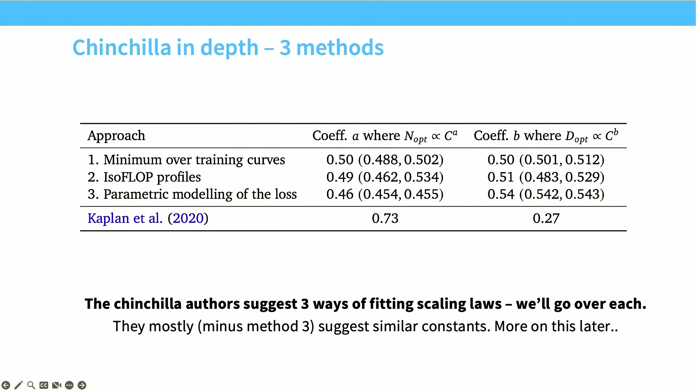
*图 17：Kaplan 的 0.73/0.27 与 Chinchilla 三种估计形成鲜明对照；“最优”始终受 loss、FLOP 口径与 recipe 限定。（字幕区间：01:00:11--01:03:17）*

> [!WARNING]
> $a\approx b\approx0.5$ 只能说明 $D/N$ 随计算量近似不变，不能单独推出常数恰好为 20。约 20 tokens/parameter 还来自特定实验的幅度、数据、tokenizer、模型定义和训练目标。

### 5.4 Chinchilla 的三种方法

#### 方法一：训练曲线的 lower envelope

对许多不同大小、不同 schedule 的模型保存完整训练曲线。在每个 FLOP 预算上，从所有曲线中找最低可达 loss；这些最低点组成 lower envelope。再记录每个点来自多大的模型、看过多少 token，并拟合它们随计算量的趋势。

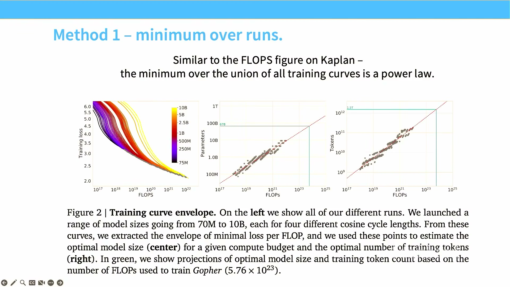
*图 18：黑色下包络线在每个计算预算选出最低 loss，再把对应参数量和 token 数拟合为缩放关系。（字幕区间：01:03:17--01:04:28）*

优点是概念直接，还能利用训练过程中的中间点；风险是曲线覆盖稀疏时，包络会受 run 密度、噪声和插值规则影响。课件示例预测目标预算约为 67B 参数、1.5T token，这些数值只属于该实验。

#### 方法二：IsoFLOP sweep

选择多个固定 FLOP 预算；在每个预算里扫描模型—数据分配。依据 $C\approx kND$，若把 token 数加倍，就近似把参数量减半。每个预算会得到一条 U 形 loss 曲线：

- 左侧模型太小，受容量限制；
- 右侧模型太大，固定预算下看过的 token 太少；
- 谷底就是该 FLOP 预算下的最优分配。

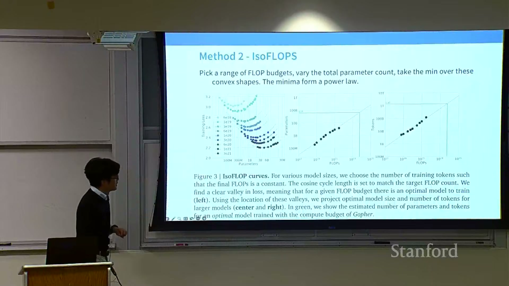
*图 19：每条等 FLOP 曲线都扫描模型与数据的交换关系，谷底随预算的移动给出计算最优缩放。（字幕区间：01:04:28--01:05:47）*

课件示例预测约 63B 参数、1.4T token，与方法一接近。讲者把它称为最容易、最稳健的方法，也是自己的首选。所谓稳健，来自它直接比较实测谷底、对全局曲面函数的依赖较少；如果扫描范围没覆盖谷底，结论仍会失真。

#### 方法三：联合参数化 loss 曲面

在 $N\times D$ 网格上训练许多模型，先假设 $L(N,D)$ 的函数形式，再拟合整个二维曲面，并沿等 FLOP 切片求最优前沿。

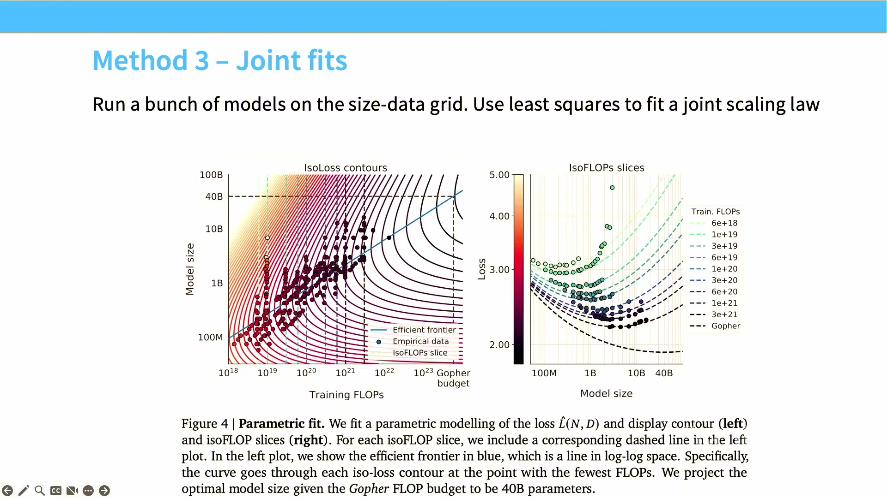
*图 20：方法三用所有模型—数据观测点拟合完整 loss landscape，再沿 IsoFLOP 切片寻找高效前沿。（字幕区间：01:05:47--01:06:53）*

它能利用全部数据，但代价是更依赖函数形式、拟合权重、异常值、优化器和数值精度。变量越多，得到“漂亮曲面”不代表外推越可靠。

### 本章小结

- 固定训练计算时，参数量与数据量相互挤压，必须在联合曲面上求解。
- 多变量缩放式先做极限检查，再谈拟合分数。
- $N_{\mathrm{opt}}\propto C^a$、$D_{\mathrm{opt}}\propto C^b$ 决定 tokens/parameter 如何随预算变化。
- Kaplan 更偏向参数，Chinchilla 更偏向数据；差异来自实验定义与拟合流程，而非一句固定配方。
- lower envelope、IsoFLOP 和联合曲面三条路线互相印证，比只相信一种拟合更可靠。

## 6. 拟合细节会改写结论：从争论到部署经济学

### 6.1 为什么合理方法也会得出不同指数

Kaplan 和 Chinchilla 都采用了合理实验方法，结果却相差很大。后续复现把差异拆成多项“小决定”的累积：

1. **参数口径**：是否排除 embedding，尤其是否排除形状为 $d\times V$ 的最后 softmax/output matrix。
2. **warmup 占比**：统一而过长的 warmup 会让小预算 run 在 warmup 结束前就接近结束，系统性压低小模型表现。
3. **batch 与优化器**：固定的大 batch 对小模型可能远超其 critical batch；各尺度没有公平调优时，斜率会把 recipe 次优误当成规模规律。
4. **拟合区间**：轻微弯曲的曲线在不同局部区间会被直线拟合成不同斜率。

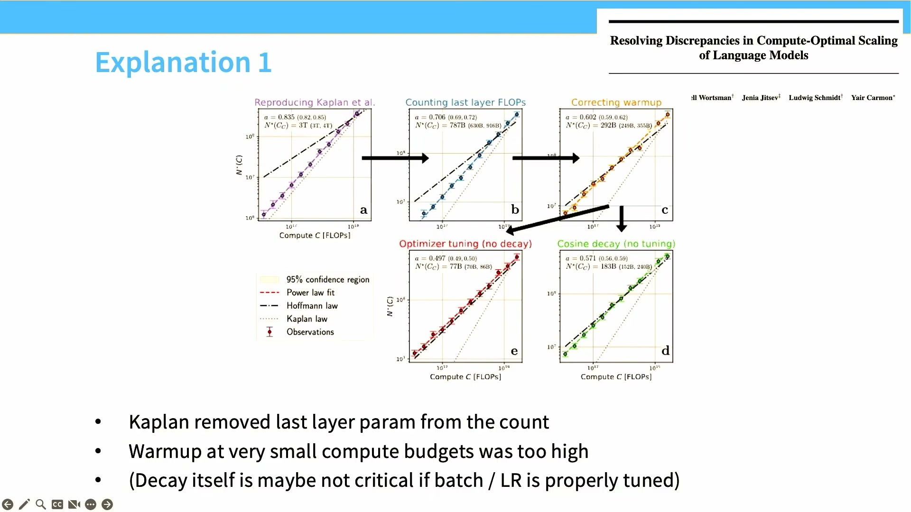
*图 21：计入 last-layer FLOP、修正 warmup、调整 batch 与优化器后，复现得到的计算最优斜率逐步从 Kaplan 附近移动到 Chinchilla 附近。（字幕区间：01:07:27--01:10:54）*

> [!IMPORTANT]
> 讲者说缩放律“在某种意义上是 lower bound”，紧接着给出的限定是：它预测继续放大**当前 recipe**会得到什么。若小模型 warmup、batch 或学习率本就次优，曲线只会忠实外推这个次优 recipe；它不是对所有算法都不可突破的数学 loss 下界。

### 6.2 参数定义与局部非线性如何制造不同直线

课件引用 Pearce 与 Song 的拟合：

$$
\operatorname{Loss}(N_T,D)
=\frac{482}{N_T^{0.35}}
+\frac{2085}{D^{0.37}}
+1.82.
$$

- $\operatorname{Loss}(N_T,D)$：总参数量和数据量给定时的预测 loss。
- $N_T$：total parameter count。
- $D$：训练 token 数。
- $482$：模型有限带来的 loss 项幅度。
- $2085$：数据有限带来的 loss 项幅度。
- $0.35$：模型项衰减指数。
- $0.37$：数据项衰减指数。
- $1.82$：拟合的渐近 loss。

同一个略有弯曲的前沿，若用 total parameters 作横轴、观察更高计算区间，可得到约 0.51 的局部指数；若改用 non-embedding parameters 并只看 Kaplan 较低的计算区间，局部指数可接近 0.78。这里的误读风险是把局部切线当成全局自然常数。

该公式也不能直接作为新模型 recipe：它的幅度、指数和渐近项只拟合课件引用的数据；tokenizer、模型架构、参数计数和数据分布改变后都需重测。

### 6.3 Method 3 的事后取证告诉我们什么

Chinchilla 的方法一、二近似给出恒定 tokens/parameter；方法三的 $a=0.46,b=0.54$ 则意味着比例会随计算缓慢上升。后续 Epoch AI / Besiroglu 等重新检查方法三，认为原曲面对数据欠拟合；重新拟合后，结论更接近方法一、二和 $D/N\approx20$ 的经验线。

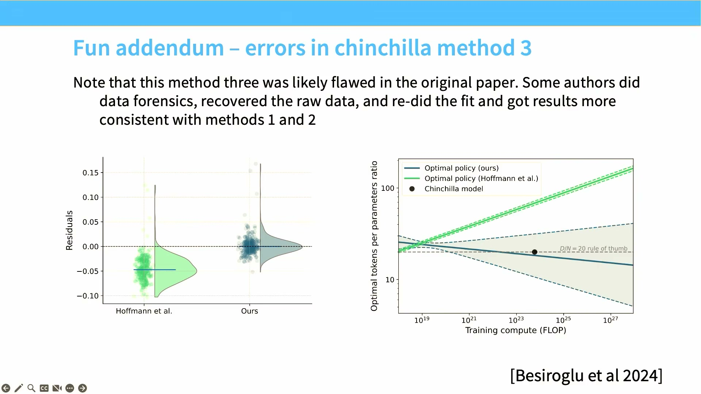
*图 22：原始 method 3 与后续重拟合在残差和最优 tokens/parameter 上不同；重拟合更接近约 20 的经验线。（字幕区间：01:12:17--01:14:21）*

这里有一处必须显式记录的来源歧义：课件文字称后续工作“recovered the raw data”，讲者口头却说研究者拿不到原始数据和代码，只能从论文图中 digitize 数据点。按口述，更准确的说法是“从已发表图表提取近似数据并重拟合”，不能称为恢复了原始训练记录。

这场取证并没有推翻整篇 Chinchilla。相反，它让不稳定的方法三更接近方法一、二，说明多方法交叉验证为什么有价值。

### 6.4 训练计算最优不等于部署生命周期最优

Chinchilla 优化的是固定一次训练 FLOP 下的最低预训练 loss。生产模型还要付长期推理成本：如果请求量巨大，更小的模型即使需要更多训练 token，也可能因每次推理更便宜而具有更低的生命周期总成本。

可以把目标抽象为：

$$
C_{\mathrm{life}}
=C_{\mathrm{R\&D}}+C_{\mathrm{train}}+Q\,C_{\mathrm{serve}}(N).
$$

- $C_{\mathrm{life}}$：模型整个生命周期的总成本。
- $C_{\mathrm{R\&D}}$：研究、筛选和失败实验成本。
- $C_{\mathrm{train}}$：最终预训练成本。
- $Q$：预计服务请求量或累计生成 token 数。
- $C_{\mathrm{serve}}(N)$：模型规模为 $N$ 时的单次或单位 token 推理成本。

这不是课件拟合出的新缩放律，而是把讲者的部署论点写成成本分解。它的假设是服务量 $Q$ 足够大、模型质量目标可比；若只是一次研究实验，推理项可能不占主导。

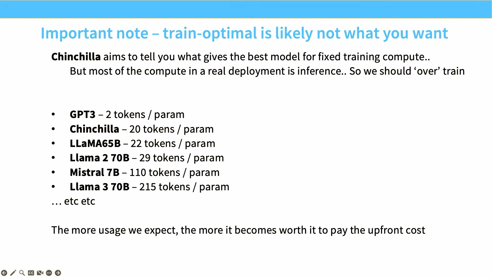
*图 23：随着 serving 重要性上升，行业模型倾向用更多 token 训练更小模型；“overtrained”是相对单次训练最优而言，并不等于统计过拟合。（字幕区间：01:14:21--01:16:02）*

课件给出的趋势例子是：GPT‑3 约 2 tokens/parameter、Chinchilla 20、LLaMA‑65B 22、Llama 2 70B 29、Mistral 7B 110、Llama 3 70B 215。讲者口头把 GPT‑3 说成约 3；因此应记录为“课件约 2，口述约 3”，不能静默挑选一个。不同模型的 tokenizer、数据统计和参数口径也不完全一致，这组数主要展示趋势，不是严格横向排名。

### 6.5 IsoFLOP 为什么是一个好默认实验设计

IsoFLOP 的通用形式是：

1. 固定一个真实成本预算。
2. 沿等预算曲线扫描其余自由度。
3. 确认采样覆盖谷底，而不是只在单调的一侧取点。
4. 在多个预算重复实验，拟合谷底位置如何移动。
5. 留出至少一个更大尺度检验外推。

它已经从 dense LM 的 $N$–$D$ 分配迁移到 diffusion 和 MoE sparsity。优势不是“保证得到 U 形曲线”，而是成本条件清楚、最优点由直接测量支持，对全局函数形式依赖较少。

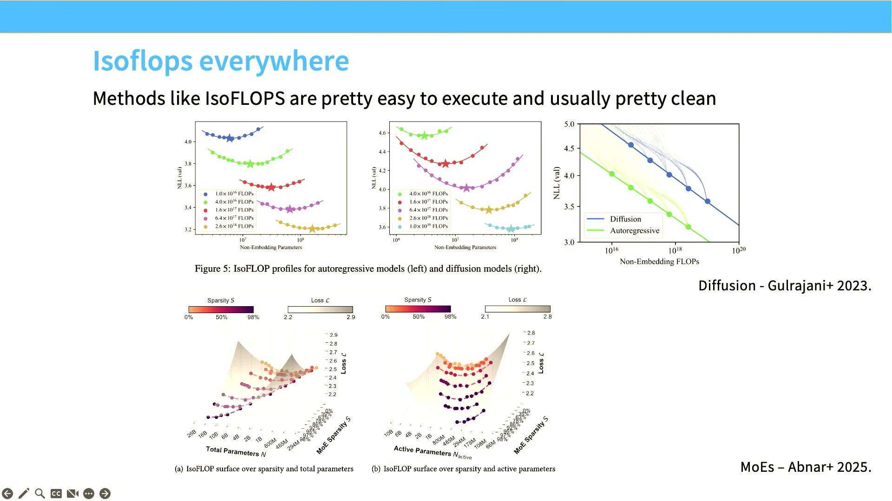
*图 24：固定 FLOP、扫描自由度、寻找谷底的实验结构可用于 diffusion 与 MoE，而不只用于 dense 语言模型。（字幕区间：01:16:02--01:16:48）*

### 本章小结

- 参数计数、warmup、batch 调优和拟合区间足以显著改变计算最优指数。
- 缩放律预测的是给定 recipe 的放大结果，不是不可突破的物理极限。
- Method 3 的事后取证说明函数形式与数据可得性会影响曲面拟合；多方法一致性更可信。
- 单次训练计算最优与包含长期推理的部署最优是不同目标。
- IsoFLOP 是清晰而稳健的默认实验设计，但仍需覆盖谷底并做留出外推检验。

## 总结与延伸

### 一张因果链：资源不是答案，实验设计才是

这堂课的主线可以压缩为：

$$
\text{小规模可控实验}
\longrightarrow
\text{低方差测量}
\longrightarrow
\text{有极限约束的函数拟合}
\longrightarrow
\text{留出尺度验证}
\longrightarrow
\text{大规模工程决策}.
$$

- 小规模实验降低试错成本。
- 低方差 loss 比离散下游 accuracy 更适合先建立规律。
- 极限检查、渐近项和参数口径约束函数含义。
- 留出规模用于判断预测，而不是只评估插值。
- 最终决策还需加入数据可得性、部署成本和硬件效率。

讲者的实际 closing 是：资源与性能之间常呈 log-linear regularity；这种规律不只出现在数据量，也出现在模型大小、compute、MoE 稀疏度等变量上。它使 optimizer、architecture、参数—数据分配等选择更 evidence-driven。数据缩放的指数仍有理论谜团，模型缩放却已是非常实用的工程预测器。

### 实战检查表

准备一次新的 scaling study 时，可以逐项检查：

1. **先定义目标**：优化预训练 loss、下游能力、训练 FLOP、墙钟时间，还是训练与推理的总成本？
2. **定义横轴**：total、non-embedding、active parameters 是否混淆？token、example 与 sequence 是否统一？
3. **保持公平 recipe**：每个尺度的学习率、batch、warmup 和训练终点是否调到可比水平？
4. **覆盖足够动态范围**：有没有把局部直线误当成全局幂律？是否接近容量或不可约误差地板？
5. **报告不确定性**：低方差 perplexity 可以少量重复，但学习率、critical batch 和下游指标要更谨慎。
6. **检查函数极限**：每个资源取大或取小时，公式行为是否符合机制？
7. **做真正外推验证**：至少留出一个更大模型或更高预算，不参与函数选择。
8. **寻找曲线交叉**：不要只比较截距；新方法若斜率更差，放大后可能反转。
9. **区分训练和部署**：training-compute-optimal 不一定是 production-optimal。
10. **记录失败与 recipe**：缩放律只有在实验能复现时才是工程资产。

### 仍然开放的问题

- 神经网络中约 $0.1$ 的数据缩放指数究竟来自有效维度、函数平滑性、优化机制，还是多种因素叠加？
- 当数据 mixture、tokenizer、架构和训练目标同时改变时，哪些指数能够迁移？
- 如何把平滑的预训练 loss 规律可靠地连接到噪声更大、甚至存在阈值效应的下游能力？
- MoE 中 total capacity、active compute、路由质量与硬件通信成本应如何统一进入计算最优模型？
- 当 serving 量、延迟、显存和能耗都进入目标后，下一代“计算最优”应如何定义？

课程安排上，下一讲转向 inference；之后会回到更进阶、更专门的 scaling topics。真正需要带走的不是一组永久常数，而是：**在目标尺度昂贵到不能试错之前，把可预测性工程化出来。**

### 本章小结

- 缩放律是一套测量、拟合、验证和决策流程，不是一条自动成立的自然定律。
- 数据、模型、计算、batch、学习率、稀疏度和部署成本共同决定最优方案。
- 公式必须附带符号、假设、适用区间与误读风险。
- 可靠外推依赖正确横轴、公平 recipe、足够动态范围和留出尺度验证。
- 最有价值的结论不是某个比例，而是如何在大 run 之前用小 run 获得可信证据。
