# Stanford CS336 2026 Lecture 10：Inference

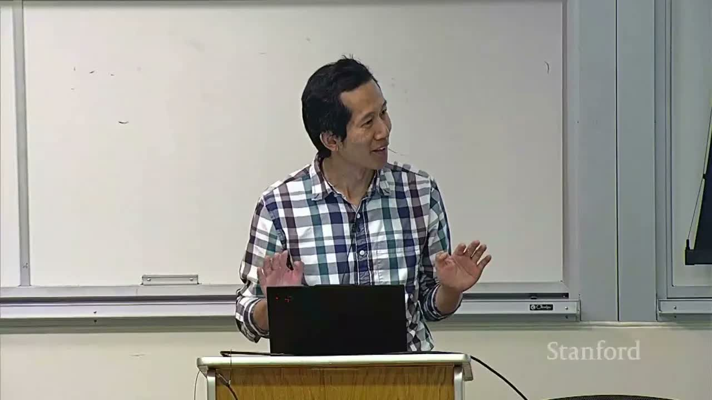

- **视频标题**：Stanford CS336 Language Modeling from Scratch | Spring 2026 | Lecture 10: Inference
- **主讲**：Percy Liang
- **频道**：Stanford Online
- **视频链接**：<https://www.youtube.com/watch?v=EfM546A79aM>
- **时长**：01:25:30
- **材料范围**：人工英文字幕、1080p 课程视频与官方 `lecture_10.py`
- **课程定位**：从推理工作负载的性能模型出发，依次讨论 KV cache 压缩、量化与剪枝、投机采样、动态批处理和 PagedAttention

> [!IMPORTANT]
> 这堂课的主线不是背下一串推理优化名词，而是学会先问四个问题：瓶颈是算力还是数据搬运？代价来自参数、KV cache 还是调度浪费？优化改善的是 TTFT、单请求延迟还是总体吞吐？它是否改变模型质量或目标采样分布？

## 1. 为什么推理值得单独研究

### 1.1 一个看似简单、实际会被重复亿万次的问题

推理的输入输出很简单：模型已经训练好，给它一个 prompt，希望尽可能准确、尽可能快地产生 response。

*模型和 prompt 进入推理过程，产生 response；后文会把中间过程展开为 prefill、KV cache 和逐 token decode。（字幕区间：00:00:17--00:00:31）*

推理不只发生在聊天产品中。模型评测需要让模型真正生成答案；强化学习需要反复采样 rollout、打分并更新权重；代码补全、Agent 和批量数据处理也都以生成作为核心工作负载。换句话说，推理甚至会嵌回训练循环。

训练虽然昂贵，通常是一次性投入；推理却会随每次请求持续发生。课程引用了一个时点性数量级：OpenAI 每天处理约 8.6T token，而 DeepSeek-V4 的训练规模约为 32T token。两类 token 的每 token 成本不能直接等同，但这个比较足以说明：持续服务的累计工作量可以很快追上一次大训练。

Agent 又进一步放大了这个问题。传统聊天的大部分输出供人阅读，人的阅读速度会形成瓶颈；Agent 在最终回答前还可能生成长内部轨迹、调用工具并自检。讲者把这一点压缩成一句话：**生成的 token 就是花出去的计算。**

> [!NOTE]
> 课程列举 vLLM、SGLang、TensorRT-LLM 和 llama.cpp，是为了说明推理已经形成独立的系统生态，而不是给这些项目做长期排名。软件能力会变化，本文只保留它们在课程中的定位。

### 1.2 “快”至少包含三个不同指标

**TTFT（time to first token）** 是提交请求到看到第一个 token 的时间。第一个 token 到来前，用户只能等待，因此它对聊天和代码补全尤其敏感。它通常包含排队、prompt prefill 以及首个 decode step，不能简单等同于某一次矩阵乘。

**Token latency** 站在单条请求的角度，衡量后续 token 以多少秒/token 或毫秒/token 流出。它决定答案的流式速度，也决定长 Agent 轨迹中串行步骤的累计时间。

**Throughput** 站在整台服务或批处理作业的角度，衡量所有请求合计的 tokens/s。处理大量文档或 RL rollout 时，单个 token 何时出现未必重要，总作业何时完成才重要。

| 指标 | 观察视角 | 它回答的问题 | 典型场景 |
|---|---|---|---|
| TTFT | 单请求的开始阶段 | 多久才能看到第一个 token？ | 聊天、代码补全 |
| Token latency | 单请求的生成阶段 | 后续 token 流出有多快？ | 交互、长串行 Agent |
| Throughput | 多请求或完整作业 | 每秒总共产出多少 token？ | 批处理、服务容量、RL 采样 |

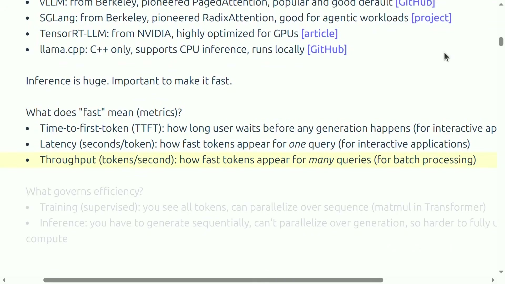
*同一页依次给出 TTFT、单请求 latency 与多请求 throughput；该帧选择了三项全部揭示后的状态。（字幕区间：00:05:05--00:07:05）*

它们并不总是同向变化。增大 batch 可以摊薄读取模型权重的成本，提升总体吞吐；但更大的 KV cache 和等待凑批又可能增加单请求延迟与 TTFT。后文的性能模型会把这项权衡算出来。

### 1.3 训练能沿序列并行，生成却存在真实的数据依赖

监督训练已经知道完整目标序列，因此可以把 sequence 当成普通张量维度，同时计算许多 token 的 attention 和 MLP。自回归推理不同：第 `t+1` 个位置的输入，必须等第 `t` 个位置产生 logits 并完成采样后才知道。同一条生成链跨时间步无法一次展开。

这不意味着推理完全不能并行。同一步内的矩阵运算、prompt prefill、多个请求之间的 batch 都可以并行。真正受限的是同一条序列的时间依赖，而它恰好让 decode 形成大量“每次只处理一个新 token”的细矩阵运算。

> [!IMPORTANT]
> 训练与推理的差别不是“一个用 GPU、一个不用 GPU”，而是可并行维度不同。推理优化的核心任务，是在不破坏自回归依赖的前提下，重新找到共享、复用和批处理机会。

### 本章小结

- 推理同时服务产品、评测和训练内采样，因此累计成本巨大。
- TTFT、token latency 与 throughput 衡量不同目标，不能用一个“更快”替代。
- 自回归生成的下一个输入依赖刚采出的 token，导致时间维无法完全并行。
- 本课接下来会沿“性能建模 → 减少状态 → 并行验证 → 动态调度”逐层解决问题。

## 2. 用张量形状与算术强度建立性能语言

### 2.1 先统一符号

课程使用类似 einops 的紧凑张量记号。以 `BTD × DH → BTH` 为例，`D` 在两个操作数中出现、在结果中消失，因此是 contracting dimension；`B` 若同时出现在两个操作数和结果中，则是 batching dimension，每个 batch 独立计算而不沿 `B` 求和。

本讲核心符号如下：

- `B`：batch size，即并发序列数；
- `S`：已经作为条件的历史或输入 token 数；
- `T`：本次前向同时处理、为其产生 logits 的目标 token 数；
- `D`：model dimension；
- `F`：MLP 中间维，课件约定 `F=4D`；
- `N`：query head 数；
- `K`：key/value head 数，也是 GQA 中的 KV groups 数；
- `G`：每个 KV group 服务的 query head 数；
- `H`：每个 attention head 的维度；
- `L`：Transformer 层数；
- `V`：词表大小。

其中 `D=NH`、`N=KG`。这组记号很重要，因为后面要区分“所有请求共享的权重”和“每条请求私有的 KV cache”；二者对 batch 的响应完全不同。

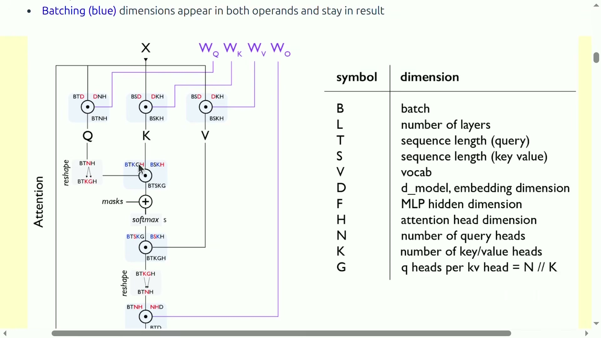
*左侧直接标出 Q/K/V 与 attention 中的张量形状，右侧定义 `B,L,T,S,V,D,F,H,N,K,G`；画面已经完整揭示符号表。（字幕区间：00:10:59--00:14:22）*

### 2.2 算术强度：每搬一个字节，做多少运算

算术强度（arithmetic intensity）定义为 FLOPs 与内存传输字节数之比。直觉上，数值越高，同一份数据被复用得越充分；数值越低，设备更可能大部分时间都在等待 HBM 搬数据。

先看 bf16 矩阵乘：输入 `X` 的形状是 `B×D`，权重 `W` 的形状是 `D×F`，输出 `Y` 的形状是 `B×F`。一次点积中的乘法和加法各计一次 FLOP，因此计算量为：

$$
\mathrm{FLOPs}=2BDF.
$$

- `B`：输入行数或批大小；
- `D`：收缩维；
- `F`：输出维；
- 系数 `2`：每项包含一次乘法和一次加法。

假设从 HBM 读取 `X`、读取 `W`、写回 `Y`，而 bf16 每个元素占 2 字节，则数据搬运量为：

$$
\mathrm{Bytes}=2BD+2DF+2BF.
$$

- `2BD`：读取输入 `X`；
- `2DF`：读取权重 `W`；
- `2BF`：写回输出 `Y`；
- 每项前的 `2`：bf16 每元素 2 字节。

把计算量除以搬运量，就得到精确的一阶算术强度：

$$
I=\frac{2BDF}{2BD+2DF+2BF}
=\frac{BDF}{BD+DF+BF}.
$$

- `I`：算术强度，单位 FLOP/byte；
- `B,D,F`：含义同上。

当 batch 远小于模型的两个宽度，即 `B≪D,F`，分母主要由权重项 `DF` 决定，于是：

$$
I\approx B.
$$

- `I`：近似算术强度；
- `B`：同一份权重同时服务的输入行数。

这条近似揭示了 batch 的价值：同一矩阵被读入一次后，若能服务更多输入行，权重读取成本就被摊薄。`B=1` 时退化成矩阵向量乘，读取整个大权重矩阵，却只对它使用一次。

### 2.3 与 H100 的机器平衡点比较

课件采用 H100 bf16 峰值约 `989 TFLOP/s`、HBM 带宽约 `3.35 TB/s`。两者相除得到机器的理想平衡点：

$$
I_{\mathrm{H100}}
=\frac{989\times10^{12}}{3.35\times10^{12}}
\approx295\ \mathrm{FLOP/byte}.
$$

- `I_H100`：课件参数下的理想机器算术强度；
- `989×10^{12}`：bf16 峰值浮点运算率；
- `3.35×10^{12}`：HBM 每秒可传输的字节数。

若工作负载强度高于这个平衡点，更可能 compute-bound；低于它，更可能 memory-bound。在刚才 `I≈B` 的模型里，`B=1` 的推理强度约为 1，离 295 很远。这正是逐 token decode 的典型形态。

> [!WARNING]
> `295` 不是所有 H100 程序的固定 batch 阈值。它来自特定精度、标称峰值和极简 HBM accounting。真实 kernel 的融合、cache 命中、通信、launch overhead，以及是否能达到标称峰值，都会移动边界。

### 2.4 为什么“memory-bound”会决定后面的优化方向

如果瓶颈是计算，减少 FLOPs 或增加更高效的矩阵乘最直接；如果瓶颈是内存，单纯减少少量算术未必有用，更有效的路线是：

- 少读权重：量化、剪枝；
- 少读请求私有状态：GQA、MLA、CLA、局部或稀疏注意力；
- 让一次权重读取服务更多 token：batch、continuous batching、投机验证；
- 少浪费物理内存和重复前缀：PagedAttention 与 prefix sharing。

这也是为什么本讲先花很长时间推导性能模型，再介绍具体技术。没有模型，就无法判断优化究竟作用在哪个瓶颈上。

### 本章小结

- 算术强度等于 FLOPs/byte，用于判断工作负载更接近计算瓶颈还是带宽瓶颈。
- 对大权重、小 batch 的矩阵乘，强度近似等于 batch size。
- H100 课件示例的机器平衡点约为 295 FLOP/byte，单 token 矩阵向量乘远低于它。
- 后续技术虽名称不同，本质都在减少搬运、增加复用或重排可并行工作。

## 3. 从朴素生成到 KV cache：计算换成了状态

### 3.1 为什么朴素自回归会做大量重复工作

最直观的生成循环是：把完整 prompt 送入 Transformer，采一个 token，把它拼到历史末尾，再把更长的整段历史重新送入 Transformer。算法正确，却重复计算了所有旧 token 的 K/V 和旧 token 之间的 attention。

若长度为 `t` 的 full attention 成本为二次量级，把所有生成步累加起来，朴素全过程达到三次量级：

$$
\sum_{t=1}^{T}O(t^2)=O(T^3).
$$

- `t`：某个生成步已经拥有的前缀长度；
- `T`：最终生成长度；
- `O(t^2)`：该步重新对完整前缀做 attention 的数量级。

因果 attention 提供了关键复用机会。追加新 token 后，历史位置不能看到未来，因此它们原先算出的 K/V 不会被新 token 改写。只要把每层历史 K/V 留在内存里，后续步骤就不必再计算旧前缀。

### 3.2 KV cache 的收益与代价

KV cache 把旧 token 的 key 和 value 保存到 HBM。新 token 到来时，只计算自己的 Q/K/V，用新 query 读取所有历史 K/V，然后把新 K/V 追加到 cache。

它带来两个同时成立的结果：

- 计算收益：避免历史投影和历史—历史 attention 的重复计算，整个生成过程的 attention 从朴素三次量级降到二次量级；
- 内存代价：每层、每个历史 token 的 K/V 必须长期驻留，并在每个 decode step 被读取。

> [!IMPORTANT]
> KV cache 没有让推理“免费”。它只是把主要问题从重复计算转换成 cache 容量和 HBM 带宽。本讲后半的大多数架构优化，都是在设法减少这份状态。

### 3.3 Prefill 与 decode 是两个不同阶段

**Prefill** 一次看到整个 prompt，可以沿 token 维并行计算，并填充所有层的 KV cache。它的形态接近训练，长 prompt 往往形成足够大的矩阵运算。

**Decode / generation** 每次只得到一个新 token，读取已有 KV cache、生成下一个 token、再把新 K/V 追加进去。它沿时间串行，且上下文越长，每步要读的 cache 越大。

在后续公式里，`S` 表示已作为条件的 token 数，`T` 表示本次同时为其产生 logits 的 token 数：prefill 取 `T=S`，逐 token decode 取 `T=1`。

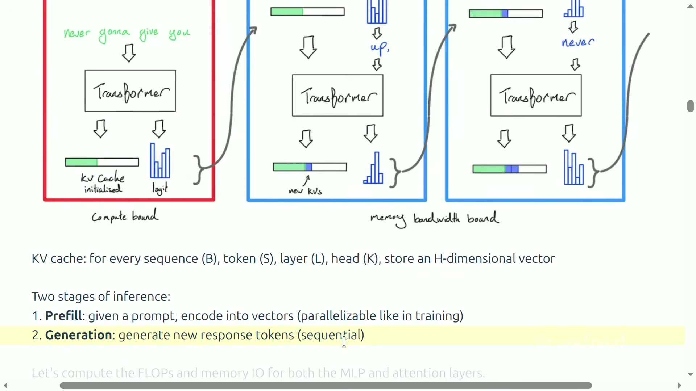
*红框 prefill 一次填充 KV cache，蓝框 generation 每步追加新 K/V；底部明确对比“可并行的 prefill”与“串行的 generation”。（字幕区间：00:22:41--00:25:08）*

### 3.4 MLP 的算术强度

课程只统计 gated MLP 的三个矩阵乘：up、gate、down。三次矩阵乘各需要 `2BTDF` FLOP，因此总计算量为：

$$
\mathrm{FLOPs}_{\mathrm{MLP}}=6BTDF.
$$

- `B`：并发序列数；
- `T`：本次同时处理的 token 数；
- `D`：模型维；
- `F`：MLP 中间维；
- 系数 `6`：三次矩阵乘，每次乘加计 2 FLOP。

按课件的未融合朴素 accounting，读写输入/输出、中间激活和三组权重的总字节数为：

$$
\mathrm{Bytes}_{\mathrm{MLP}}=4BTD+4BTF+6DF.
$$

- `4BTD`：输入与输出的 bf16 读写；
- `4BTF`：两个中间激活的写入；
- `6DF`：三个 bf16 权重矩阵的读取。

当 token batch `BT` 远小于模型宽度时，权重读取主导，强度近似为：

$$
I_{\mathrm{MLP}}\approx BT.
$$

- `I_MLP`：MLP 的近似算术强度；
- `B`：并发请求数；
- `T`：一次并行处理的 token 数。

因此 prefill 可以靠大 `B×S` 获得较高强度；decode 时 `T=1`，只剩 batch `B` 能摊薄公共权重。

### 3.5 普通 MHA attention 的算术强度

在采用 FlashAttention 式“不把完整 attention 矩阵落回 HBM”的假设下，`QK^T` 和 `softmax(A)V` 两次矩阵乘合计：

$$
\mathrm{FLOPs}_{\mathrm{attn}}=4BSTD.
$$

- `B`：并发序列数；
- `S`：历史 token 数；
- `T`：本次 query token 数；
- `D`：所有 query heads 合计的模型维；
- 系数 `4`：两次矩阵乘，每次乘加计 2 FLOP。

课件按普通 MHA 的 K/V 总宽度 `D` 计算，读 Q/K/V 并写输出的字节数为：

$$
\mathrm{Bytes}_{\mathrm{attn}}=4BSD+4BTD.
$$

- `4BSD`：读取历史 K 与 V；
- `4BTD`：读取 Q 并写回输出；
- 这里隐含 MHA，即 KV 总宽度等于 `D`。

因此算术强度是：

$$
I_{\mathrm{attn}}=\frac{ST}{S+T}.
$$

- `I_attn`：普通 MHA attention 的算术强度；
- `S`：历史 token 数；
- `T`：本次 query token 数。

prefill 取 `T=S`，得到：

$$
I_{\mathrm{prefill,attn}}=\frac{S}{2}.
$$

- `I_prefill,attn`：prefill attention 强度；
- `S`：prompt 长度。

decode 取 `T=1`，得到：

$$
I_{\mathrm{decode,attn}}=\frac{S}{S+1}<1.
$$

- `I_decode,attn`：逐 token decode attention 强度；
- `S`：当前历史长度。

最关键的是，attention 强度里没有 `B`。MLP 权重对所有请求相同，增大 batch 会复用同一份权重；每条请求的 KV cache 却不同，batch 增大时计算和要读取的 KV 同比增加，所以无法靠 batch 改善普通 MHA decode attention 的强度。

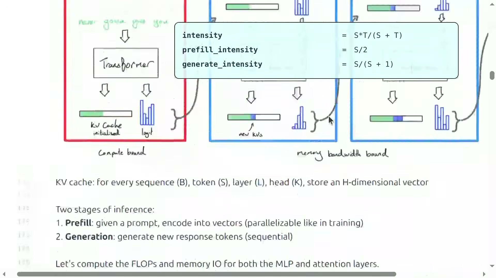
*上方调试器给出 `ST/(S+T)`、`S/2` 与 `S/(S+1)`；背景的三条生成链各有自己的 KV cache，说明 batch 不会形成跨请求 KV 复用。（字幕区间：00:31:39--00:33:58）*

> [!WARNING]
> `<1` 不是“所有 attention 架构永远不可改善”。这段推导明确采用 MHA 的 KV 宽度。GQA、MLA 和稀疏注意力正是通过减小要读的 KV 宽度或数量来改变分母。

### 本章小结

- 因果性使历史 K/V 可复用，KV cache 将全过程 attention 从三次量级降到二次量级。
- Prefill 能沿 prompt 并行，常更接近 compute-bound；decode 一次只有一个新 token，常 memory-bound。
- MLP decode 可借 batch 摊薄公共权重；普通 MHA attention 的 KV 是请求私有的，batch 不能提高其强度。
- KV cache 因而同时是推理加速的基础，也是容量与带宽瓶颈的来源。

## 4. 从简化性能模型看 latency–throughput 权衡

### 4.1 参数量与 KV cache 大小

课程用一个简化 Transformer 模型计算 Llama 2 13B 在 H100 上的理想性能。参数量由 embedding、gated MLP 和 attention 投影构成：

$$
P=2VD+3DFL+(2DNH+2DKH)L.
$$

- `P`：参数个数；
- `V`：词表大小；
- `D`：模型维；
- `F`：MLP 中间维；
- `L`：层数；
- `N`：query head 数；
- `K`：KV head 数；
- `H`：单 head 维度；
- `2VD`：课件按输入、输出 embedding 各一份计算，未假设 weight tying。

bf16 参数每个占 2 字节，因此参数内存为：

$$
M_{\mathrm{param}}=2P.
$$

- `M_param`：参数占用字节数；
- `P`：参数个数；
- 系数 `2`：bf16 每参数 2 字节。

一条长度为 `S` 的序列，在 `L` 层、每层 `K` 个 KV heads、每 head 维度为 `H` 时，其 cache 为：

$$
M_{\mathrm{KV/seq}}=S(KH)L\times2\times2.
$$

- `M_KV/seq`：单条序列的 KV cache 字节数；
- `S`：缓存 token 数；
- `K`：KV head 数；
- `H`：每个 head 的维度；
- `L`：层数；
- 第一个 `2`：key 与 value 两份向量；
- 第二个 `2`：bf16 每元素 2 字节。

### 4.2 带宽下界模型

在“decode memory-bound、每步读完相关参数与 KV、计算和通信完美重叠、忽略所有 overhead”的强假设下，总内存、单步延迟和吞吐写成：

$$
M=M_{\mathrm{param}}+B M_{\mathrm{KV/seq}},
\qquad
\ell=\frac{M}{W},
\qquad
\mathrm{throughput}=\frac{B}{\ell}.
$$

- `M`：batch 的总参数与 KV 字节数；
- `M_param`：参数字节数；
- `M_KV/seq`：单序列 KV 字节数；
- `B`：并发序列数；
- `ℓ`：理想 decode step 延迟；
- `W`：HBM 带宽；
- `B/ℓ`：每步并行生成 `B` 个 token，所以得到总体 tokens/s。

这不是实测预测，而是 bandwidth-bound 的理想下界。它忽略 prefill、kernel launch、通信、调度、cache 命中，以及 batch 足够大后重新转为 compute-bound 的可能性。

### 4.3 Llama 2 13B / H100 的数值

官方配置采用 `S=1024,D=5120,F=13824,N=40,H=128,L=40,V=32000`，H100 带宽 `3.35 TB/s`。按源码公式重算：

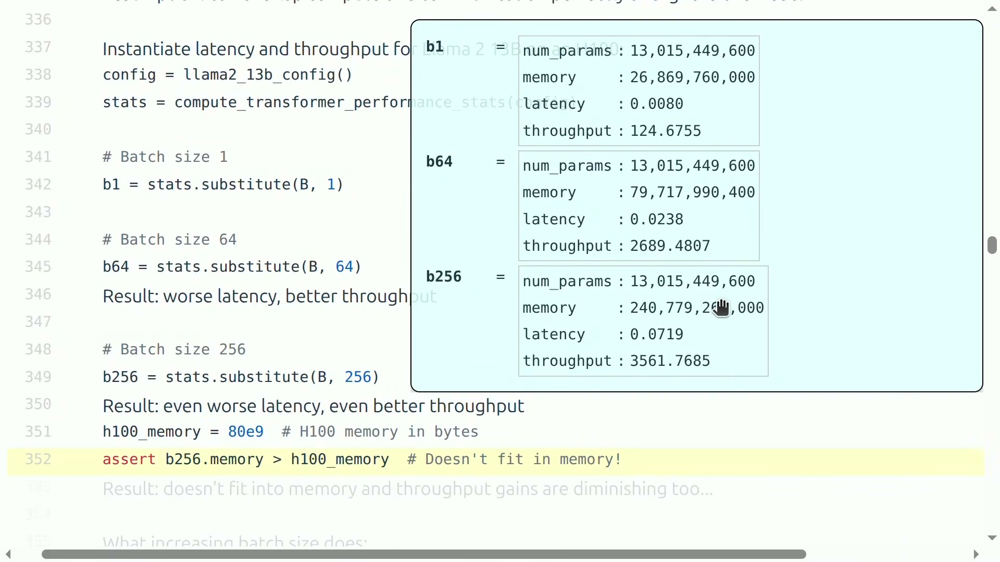
*课程调试器同时显示三个 batch 的参数量、总内存、latency 与 throughput；`B=256` 的 240.78GB 超过 80GB H100。（字幕区间：00:41:40--00:43:27）*

| 架构 | Batch | 参数量 | 参数 bf16 | 每序列 KV | 总内存 | 理想单步延迟 | 理想吞吐 |
|---|---:|---:|---:|---:|---:|---:|---:|
| MHA，`K=40` | 1 | 13.015B | 26.03 GB | 0.839 GB | 26.87 GB | 8.02 ms | 124.7 tok/s |
| MHA，`K=40` | 64 | 13.015B | 26.03 GB | 0.839 GB | 79.72 GB | 23.80 ms | 2689 tok/s |
| MHA，`K=40` | 256 | 13.015B | 26.03 GB | 0.839 GB | 240.78 GB | 71.87 ms | 3562 tok/s |
| GQA，`K=8` | 64 | 11.338B | 22.68 GB | 0.168 GB | 33.41 GB | 9.97 ms | 6417 tok/s |
| GQA，`K=8` | 256 | 11.338B | 22.68 GB | 0.168 GB | 65.63 GB | 19.59 ms | 13068 tok/s |

这些数值展示了三个规律：

1. batch 增大后，固定参数读取被更多 token 分摊，吞吐显著提高；
2. 每条请求又会新增自己的 KV cache，因此单步延迟与总内存随 batch 上升；
3. MHA 的 batch 256 远超 80GB H100，而 GQA 把 KV heads 从 40 降为 8 后，才让这个 batch 在简化模型中放得下。

讲者用公交车解释 latency–throughput 权衡：等一辆大车可能让单个乘客更慢，但一趟能运走更多人。对交互请求，较小 prefill batch 有助于 TTFT；对 decode 或批处理，较大活动 batch 有助于吞吐。

> [!WARNING]
> 课件源码在 GQA `K=8,B=64` 后写着“worse latency”。若与同 batch 的 MHA 比，模型给出的延迟其实从 23.80 ms 降到 9.97 ms；若与最初 batch 1 的 MHA 比，9.97 ms 才略差于 8.02 ms。讲义采用数值并明确比较对象，不复述含糊的形容词。

### 4.4 复制模型与分片模型

如果有足够设备，启动 `M` 份模型副本，每个副本的单请求延迟不变，而总吞吐可近似增加 `M` 倍。更复杂的做法是把模型和 KV cache 分片到多设备；它允许单个超大模型运行，却引入设备间通信和同步，因此不能沿用“只看单卡 HBM”的公式。

TTFT 则主要受 prefill 和排队影响。服务系统常需要分别调度 prefill 与 decode：前者用较小 batch 减少首 token 等待，后者用持续填充的较大 batch 提高稳态吞吐。

### 本章小结

- 参数是所有请求共享的固定成本，KV cache 是随 batch 和上下文增长的请求私有成本。
- 增大 batch 能提高吞吐，却会增加 KV 内存与单步延迟，并最终遇到容量上限。
- GQA 的价值可直接从性能模型看到：减少 KV heads 后，既降低单序列 cache，也允许更大的活动 batch。
- 简化公式是推理系统的思考工具，不应伪装成完整的端到端基准。

## 5. 压缩 KV cache：沿不同轴减少每步搬运

### 5.1 一张地图：宽度、层数与历史长度

普通 MHA 的 KV cache 可以粗略看成四个维度的乘积：历史 token 数 `S`、层数 `L`、KV head 数 `K` 和每 head 宽度 `H`。于是压缩方法可按“动了哪一轴”分类：

- GQA/MQA：减少 KV heads，在 query heads 之间共享；
- MLA：缓存低维 latent，需要时再恢复多头 K/V；
- CLA：在相邻或指定 layers 之间共享 K/V；
- local / sliding-window attention：只保留有限的历史 token；
- 稀疏注意力：压缩历史、建立便宜索引，再选出少量相关条目。

共同因果链是：更小的 cache → 每个 decode step 搬运更少字节 → 在 memory-bound 区域降低 latency、提高 throughput，并释放显存容纳更大的 batch。但压缩常会牺牲表达力或增加投影、索引成本，所以最后一环永远是重新测 accuracy 和端到端性能。

### 5.2 MQA 与 GQA：在 heads 之间共享

MHA 为每个 query head 保留独立的 key/value head，即 `K=N`；MQA 令所有 query heads 共用一组 K/V，即 `K=1`；GQA 取两者之间，让 `G=N/K` 个 query heads 共享一个 KV head。

单序列 KV cache 的字节数可以写成：

$$
M_{\mathrm{KV}}=S\cdot K H\cdot L\cdot2\cdot b.
$$

- `M_KV`：单序列 KV cache 字节数；
- `S`：历史 token 数；
- `K`：KV head 数；
- `H`：每个 head 的维度；
- `L`：层数；
- 第一个 `2`：key 与 value 两份；
- `b`：每个元素的字节数，bf16 时为 2。

因此 GQA 相对 MHA 的 cache 比例是：

$$
\frac{M_{\mathrm{GQA}}}{M_{\mathrm{MHA}}}
=\frac{K}{N}=\frac{1}{G}.
$$

- `M_GQA`：GQA 的 cache 大小；
- `M_MHA`：MHA 的 cache 大小；
- `K`：GQA 的 KV heads；
- `N`：query heads；
- `G=N/K`：每组共享的 query heads 数。

*横轴 groups 由 1 增至 64，GQA 从接近 MQA 逐渐回到 MHA；组数更少意味着更多 query heads 共享 K/V。（字幕区间：00:47:54--00:48:36）*

固定 batch、把 `K=40` 改为 `K=8` 时，单条请求要搬的 KV 直接下降，所以 latency 和 throughput 可以一起改善。之后再把 batch 从 64 提到 256，才重新出现“更高吞吐换更差单步延迟”的权衡。这里必须把“架构压缩”和“增大 batch”两次操作分开。

*在这组论文实验中，GQA-8-XXL 的平均质量 47.1 接近 MHA-XXL 的 47.2，而推理时间 0.28s 接近 MQA-XXL 的 0.24s。（字幕区间：00:50:52--00:51:33）*

> [!WARNING]
> 一张表不能证明 GQA 普遍无损。讲者紧接着提醒，所有非纯数学结果都要结合模型和实验设置看；后面的 DeepSeek 表里，GQA 相对 MHA 就出现了明显掉点。

### 5.3 MLA：缓存 latent，而不是直接缓存完整 K/V

MLA 不只减少 heads，而是把当前隐藏状态压到低维 latent，cache 中保存 latent，需要 attention 时再投影出 K/V：

$$
c=W_c h,
\qquad
K=W_Kc,
\qquad
V=W_Vc.
$$

- `h`：当前 token 的隐藏状态；
- `W_c`：向低维 cache 空间投影的矩阵；
- `c`：维度为 `C` 的缓存 latent；
- `W_K,W_V`：从 latent 恢复 key/value 的投影；
- `K,V`：真正参与 attention 的多头表示。

*斜线填充表示推理时真正缓存的部分。MLA 只缓存右侧 compressed latent，再投影为多头 K/V。（字幕区间：00:51:33--00:53:54）*

课上以 DeepSeek-V2 为例：普通多头宽度 `NH=16384`，latent 只有 512 维；由于 RoPE 位置部分不能简单与内容压缩完全合并，还要另保留 64 维，总缓存宽度为 576。讲义只保留课程给出的设计直觉：内容相关低秩部分与位置相关部分分开处理；视频没有展开完整代数证明。

先看简单共享的代价：

*DeepSeek-V2 的 Dense 7B 对比中，MHA 在 BBH、MMLU、C-Eval 与 CMMLU 上明显高于 GQA/MQA，说明共享 K/V 的质量结论依赖具体设置。（字幕区间：00:53:54--00:54:24）*

再看 MLA 的结果：

*Small/Large MoE 的 cache/token 分别从 110.6K/860.2K 元素降到 15.6K/34.6K；多数指标略升，但并非每个单项都更高。（字幕区间：00:54:23--00:54:47）*

准确结论是：在该论文实验里，MLA 大幅减少 cache，整体质量与 MHA 相当且多项略好；不能外推成 MLA 必然更准。学生问为什么不直接缩小整个模型维度，讲者也明确说缺少对应 ablation，只给出设计直觉：目标化压缩 KV 可能比无差别缩窄整个主干更能保留能力。

### 5.4 CLA：把共享轴从 head 推到 layer

GQA 在 heads 间共享，Cross-Layer Attention 则让若干层共用 K/V。上层 attention 仍会计算自己的 query 和注意力输出，只是不再拥有独立的 K/V 投影与 cache。

*传统结构每层各自产生 K/V；CLA 的上层通过红色连线复用下层 K/V。（字幕区间：00:55:30--00:56:19）*

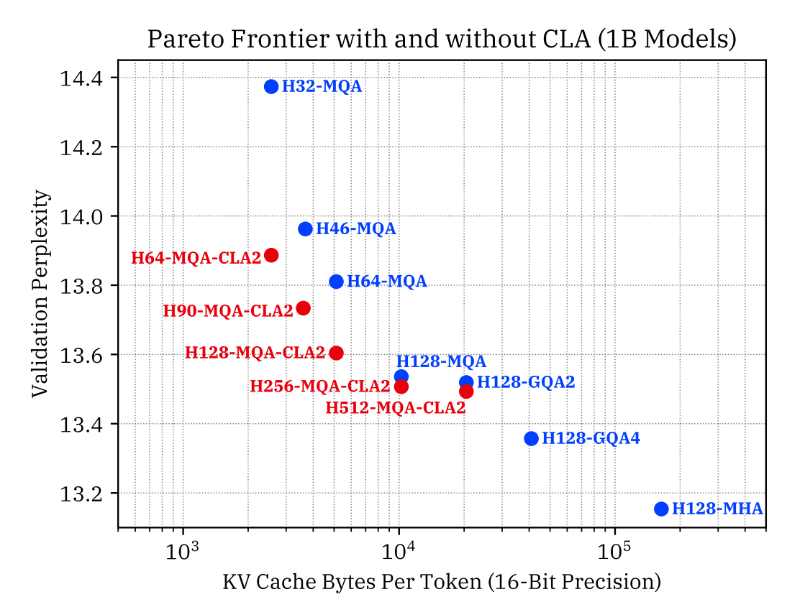
*横轴是每 token 的 16-bit KV cache 字节数，纵轴是 validation perplexity，越左下越好；红色 CLA2 点把前沿推向更小 cache。（字幕区间：00:56:15--00:56:53）*

图中展示的是 Pareto 改善，不是“所有 CLA 配置都无条件支配所有基线”。共享跨得越多，越可能丢失每层独立表示能力，仍需通过实验选点。

### 5.5 Local、hybrid 与 recurrent state：压缩时间轴

滑动窗口 attention 不再保留全部 `S` 个历史 token，而只保留最近 `w` 个。其 cache 数量级从随总上下文增长变为固定窗口：

$$
O(BLSKH)\quad\longrightarrow\quad O(BLwKH).
$$

- `B`：batch size；
- `L`：层数；
- `S`：总上下文长度；
- `w`：固定滑动窗口宽度；
- `K`：KV head 数；
- `H`：每 head 维度。

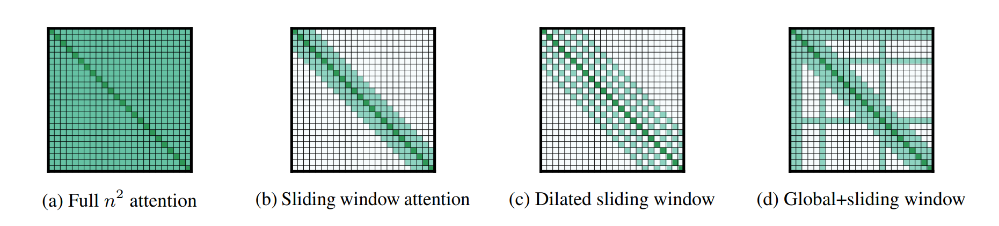
*依次为 full、sliding window、dilated sliding window、global+sliding window；稀疏 attention 不只有一种固定图案。（字幕区间：00:56:59--00:58:41）*

多层堆叠能让信息逐层越过单层窗口，有效感受野大致随层数增长；但这不等于远处 token 可被无损随机访问。纯 local attention 会伤害长程检索，所以常把 local 和 global 层交错成 hybrid model。

现场问答给出另一个有用的三分法：

- sliding window 保存最近内容的高分辨率细节；
- linear attention、Mamba、DeltaNet 一类固定递归状态保存更久历史的压缩摘要；
- full attention 为远处具体信息提供精确访问。

把整段历史塞进固定小状态必然丢信息，needle-in-a-haystack 任务尤其容易暴露问题。因此“状态与序列长度无关”不等于“记住了全部历史”。

### 5.6 DeepSeek 的组合路线：压缩、索引、Top-k 与局部窗口

课程最后展示 DeepSeek-V4 的组合结构。历史 token 先经 token-level compressor 得到 compressed KV；另一路生成便宜的 indexer keys。当前 query 通过轻量 MQA 产生 index scores，Top-k selector 选出少量压缩条目，再与最近的 sliding-window K/V 拼接，交给顶部共享 KV attention。

*图中可直接确认 compressor、lightning indexer、Top-k、sliding-window entries、concatenation 和 shared-KV MQA 的数据流。（字幕区间：01:02:18--01:03:44）*

字幕可以明确对应：CSA 把每 `m` 个 token 压成一个表示，DSA 从压缩条目中选 Top-k；讲者对 HCA 只说“进一步压缩”，没有把它严谨映射到图中某一独立模块，因此本文不自行指定。

### 本章小结

- KV cache 的两个基本问题是“每个 token 存多宽”和“保存多少 token”。
- GQA 压 head 数，MLA 压 latent 维，CLA 跨层共享，local/sparse attention 压历史数量。
- 固定 batch 下减少 cache 可同时改善 latency 与 throughput；释放的内存还能容纳更大 batch。
- 所有压缩都可能损失表达力或增加额外计算，质量和端到端性能必须在具体设置中验证。

## 6. 量化与剪枝：让权重和状态本身更小

### 6.1 标量量化先说明了什么

架构压缩减少要保存的元素个数；量化则减少每个元素的字节数。在 memory-bound 区域，低精度同时降低显存容量与 HBM 传输，但必须控制舍入、截断和异常值带来的误差。

最小的非对称量化例子是：

$$
x_q=\operatorname{round}\left(\frac{x}{s}\right)+z,
\qquad
\hat{x}=(x_q-z)s.
$$

- `x`：原始浮点数；
- `s`：scale；
- `z`：zero point；
- `x_q`：量化后的整数；
- `x_hat`：反量化近似值。

课程令 `x=5.2342,s=0.1,z=4`，得到 `x_q=56`，反量化为 `5.2`。这段代码只展示舍入误差；真实系统还要处理整数范围 clipping、按 tensor/channel/group 选择 scale、异常值和高效 kernel。

精度从 bf16 的 2 bytes 可降到 fp8/int8 的 1 byte，int4 甚至只有 0.5 byte。内存减半不保证端到端时间必然减半：若硬件缺少相应 kernel，解包、反量化和混合精度开销可能抵消收益。

### 6.2 QAT、PTQ 与 GPTQ

**Quantization-aware training（QAT）** 在训练前向中模拟 quantize/dequantize，让权重主动适应量化噪声。优点是质量通常更稳，代价是要重新做昂贵训练。

**Post-training quantization（PTQ）** 在模型训练后进行，通常用少量校准数据为每层、每 tensor 或每 group 估计 scale/zero point，成本低得多。

**GPTQ** 在 PTQ 基础上使用二阶/Hessian 信息；量化一部分权重时，调整尚未量化的权重来补偿输出误差。课程只给出机制定位，没有展开完整求解过程。

### 6.3 AWQ：不要把动机实验当成最终算法

AWQ 的观察是：少量 activation channels 特别大，与这些通道相乘的权重对输出更敏感。最直接的想法是让约 1% 显著权重保持 FP16，其余量化为 INT3；这能显著降低困惑度，却造成不规则混合精度，硬件执行效率差。

*左为直接 RTN；中间保留 1% FP16 虽改善 PPL，却被标为 bad hardware efficiency；右侧真正的 AWQ 通过 activation-aware scaling 后统一量化为 INT3。（字幕区间：01:06:37--01:07:39）*

AWQ 的关键是按 activation magnitude 对显著通道做缩放，再统一量化低比特权重。图中 RTN 的 PPL 为 43.2，混合精度和 scale-before-quantize 两种方案都到 13.0，但后者保留规则 INT3 布局。课程报告 fp16→int3 约 4× 更低内存、3.2× 加速；这是特定论文实验，不是所有模型和硬件的固定保证。

> [!WARNING]
> 讲者口述把 AWQ 简化成“保留 1% 高精度权重”，但官方图明确把它标成硬件效率差的中间方案。最终算法的教学重点必须放在 activation-aware scaling 后的统一低比特量化。

### 6.4 结构化剪枝：删掉组件，再用蒸馏修复

剪枝的思路更直接：估计 layer、attention head、embedding/hidden dimension、MLP channel 的重要性，删除不重要结构，再让原模型充当 teacher 修复小模型。

*完整流程是 trained LLM → estimate importance → rank → trim → distillation，并可迭代执行。（字幕区间：01:07:54--01:08:55）*

校准集只需约 1024 个样本，但“重要性”不是一条永恒的幅值定理。激活均值、方差、校准分布、剪后验证和各组件相互作用都可能影响排序。删掉 layer/head/channel 得到的模型结构发生了真实变化，必须蒸馏修复，而不是指望剩余权重自动组成好模型。

*横轴是训练模型所用 token 成本，纵轴是 MMLU；图中的“40× cheaper, 9% better”比较的是得到小模型的训练路线，不是宣称单 token 推理 40×。（字幕区间：01:08:55--01:09:17）*

课程把实践配方分为两类：

- 从头训练：先定义更快架构，再直接训练它；
- 蒸馏修复：定义更快架构，从原模型中选取或拼接权重初始化，再通过 distillation repair。

后者充分利用昂贵大模型已经学到的知识，但剪枝所得“Frankenstein”初始化不是成品，修复阶段不可省略。

### 本章小结

- 量化减少每个数的字节数，剪枝减少真实存在的参数与结构。
- QAT 用重新训练换质量，PTQ 用校准降低成本，GPTQ 用二阶信息补偿量化误差。
- AWQ 的最终机制是 activation-aware scaling 后统一低比特量化，而不是永久保留不规则 1% FP16。
- 结构化剪枝必须与重要性校准和蒸馏修复配套；结果图要区分训练成本与推理成本。

## 7. 投机采样：小模型先猜，大模型并行验证

### 7.1 为什么“检查”可能比“生成”快

逐 token decode 要把大模型权重和 KV cache 一步一步搬进来；但给定一串候选 token 后，target model 可以像 prefill 一样，并行计算多个位置的 logits。于是出现一个不对称：**用大模型串行生成很慢，用大模型并行检查一串候选却相对便宜。**

投机采样用小型 draft model `p` 连续猜 `K` 个 token，再让 target model `q` 一次并行检查这些位置。若 draft 足够便宜、又与 target 足够接近，一次昂贵 target 前向可以接受多个 token，使输出以“burst”形式前进。

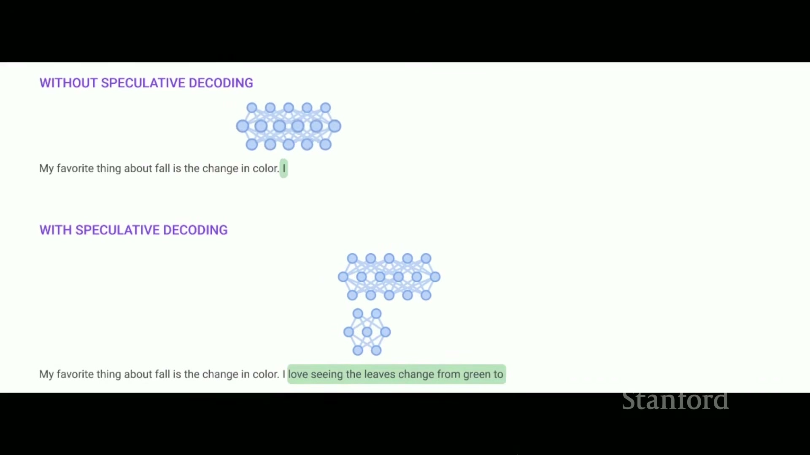
*上方 target 每次只前进一个 token；下方小 draft model 先提出一串候选，再由大 target model 一次验证后成批接受。（字幕区间：01:13:11--01:13:49）*

> [!IMPORTANT]
> Draft 不是最后的决策模型。它只负责提出候选；target 的概率与接受—补偿规则共同保证最终仍采自 target 分布。

### 7.2 接受、拒绝与残差补偿

在某个已经接受的前缀下，draft 提议 token `x`。它被接受的概率是：

$$
a(x)=\min\left(1,\frac{q(x)}{p(x)}\right).
$$

- `a(x)`：候选 token 的接受概率；
- `p(x)`：draft 在当前前缀下给 `x` 的概率；
- `q(x)`：target 在同一前缀下给 `x` 的概率。

若 `q(x)≥p(x)`，draft 没有过度提议这个 token，候选必然接受；若 `q(x)<p(x)`，只按比例 `q/p` 接受，抵消 draft 的过采。

一旦候选被拒绝，就不能简单从原始 `q` 再采一次，否则会重复计算已经由接受分支覆盖的概率质量。正确的修正分布是正残差的归一化：

$$
r(x)=
\frac{\max(q(x)-p(x),0)}
{\sum_y\max(q(y)-p(y),0)}.
$$

- `r(x)`：拒绝后用于采样修正 token 的概率；
- `q(x)-p(x)`：target 相对 draft 尚未覆盖的概率质量；
- `y`：对整个词表求和的索引。

首次拒绝后，本轮剩余 draft tokens 都是在已经失效的条件前缀上生成的，因此必须丢弃并结束本轮。若 `K` 个候选全部接受，target 已经顺便算出了第 `K+1` 个位置的分布，可再从 `q` 采一个额外 token。

*论文伪代码包含 `K+1` 组 target logits、接受概率 `min(1,q/p)`、拒绝后的正残差，以及全接受后的额外 token。（字幕区间：01:13:52--01:15:20）*

### 7.3 用二元词表证明为什么它是 exact sampling

视频因时间略过了证明，但这是理解残差分布不可删除的关键。设词表只有 `{A,B}`，draft 对 A 过采，即 `p(A)>q(A)`，于是 `p(B)<q(B)`。

A 只有一条输出路径：draft 采到 A 且通过接受检验。因此：

$$
P(\mathrm{输出}\ A)=p(A)\frac{q(A)}{p(A)}=q(A).
$$

- `P(输出 A)`：投机采样最终输出 A 的概率；
- `p(A)`：draft 提议 A 的概率；
- `q(A)/p(A)`：A 在过采情况下被接受的概率；
- `q(A)`：target 对 A 的目标概率。

B 有两条路径：draft 直接采到 B，此时必然接受；或者 draft 采到 A 但被拒绝，残差概率全部补给 B。两条相加：

$$
\begin{aligned}
P(\mathrm{输出}\ B)
&=p(B)+p(A)\left(1-\frac{q(A)}{p(A)}\right)\\
&=p(B)+p(A)-q(A)\\
&=q(B).
\end{aligned}
$$

- `P(输出 B)`：投机采样最终输出 B 的概率；
- `p(B)`：draft 直接提出 B 的概率；
- `p(A)(1-q(A)/p(A))`：draft 提出 A 但拒绝后补偿为 B 的概率；
- 最后一行使用 `p(A)+p(B)=q(A)+q(B)=1`。

一般词表中，接受分支对 token `x` 提供 `min(p(x),q(x))`，残差分支再提供 `max(q(x)-p(x),0)`，两者和恰好是 `q(x)`。逐位置在条件前缀下应用同样论证，就得到与 target 自回归采样相同的联合分布。

> [!WARNING]
> “Exact” 指在相同 logits 处理和采样设定下，输出分布精确等于 target；它不意味着两次随机运行会逐 token 相同，也不意味着任意近似 speculative decoding 实现都自动保持分布。

### 7.4 `K` 的甜点区取决于任务、模型和硬件

*在 batch 1、`K=4` 的 Chinchilla 实验里，XSum 约 1.92×/2.01×，HumanEval 约 2.46×，任务指标基本持平或小幅波动。（字幕区间：01:15:40--01:15:50）*

不能据此直接承诺所有部署都有 2×。收益由四个量共同决定：draft 的单步成本、draft 与 target 的一致性、target 并行验证 `K+1` 个位置的成本，以及接受后平均能前进多少 token。

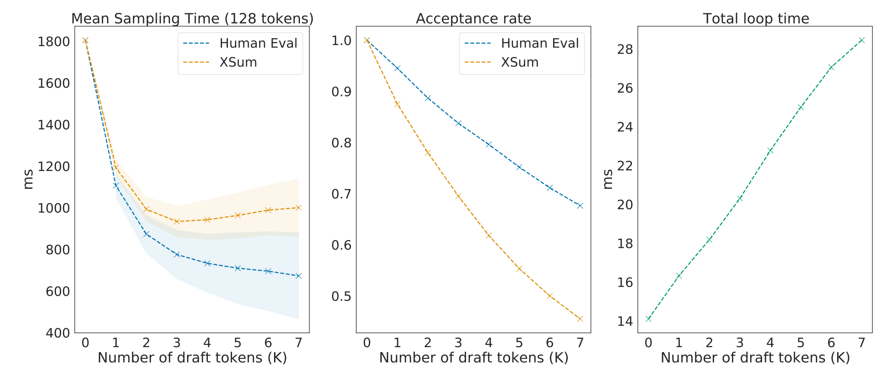
*`K` 增大时 target 每轮验证成本上升、接受率下降；XSum 在图中约 `K=3` 最低，HumanEval 到 `K=7` 仍下降，说明甜点区任务相关。（字幕区间：01:15:45--01:16:04）*

课程给出的常见尺度是 70B target 配 8B draft，或 8B target 配 1B draft。通过蒸馏让 draft 更接近 target 可以提高接受率，但训练和部署 draft 本身也有成本。

### 7.5 Medusa 与 EAGLE：改进 draft 的方式

*Medusa 用多个 heads 并行提出未来候选；EAGLE 让 draft 利用 target 的高层特征，使候选更贴近 target。（字幕区间：01:16:24--01:16:55）*

视频只快速点名这两条扩展路线，没有展开训练目标和候选树验证细节。它们最适合作为“draft 仍有巨大设计空间”的拓展，而不是冒充本课已经完整讲解的算法。

### 本章小结

- 投机采样利用了“串行生成慢、并行检查快”的不对称。
- 接受概率纠正 draft 的过采，正残差分布补回 target 少采的概率质量。
- 正确算法保持 target 分布不变；省略残差或错误处理拒绝位置就不再 exact。
- `K` 越大并不必然越快，最优值由接受率、draft 成本和 target 验证成本共同决定。

## 8. 动态工作负载：Continuous Batching 与 PagedAttention

### 8.1 在线请求为什么不是训练中的整齐矩形

线上流量具有三种动态性：请求在不同时间到达，prompt 和输出长度不同，许多请求又可能共享 system prompt 或 few-shot 前缀。若使用静态 batch，一条长响应会让已经结束的槽位空等，新请求也可能必须等整批完成，TTFT 和利用率都受损。

### 8.2 Continuous batching：每个 decode step 都重新组织 batch

Orca 的 iteration-level scheduling 把调度粒度从“整条请求生成完”降到“每个 decode iteration”：

1. 当前 batch 中每条活动序列各生成一个 token；
2. 完成或输出 EOS 的请求立即退出；
3. 新请求进入空出的槽位；
4. 下一轮对更新后的活动集合继续 decode。

因此 batch 不是一群固定成员，而是一条随时间变化的请求流。它解决的是**调度与硬件利用率**，并没有减少单条序列逻辑上需要的 KV。

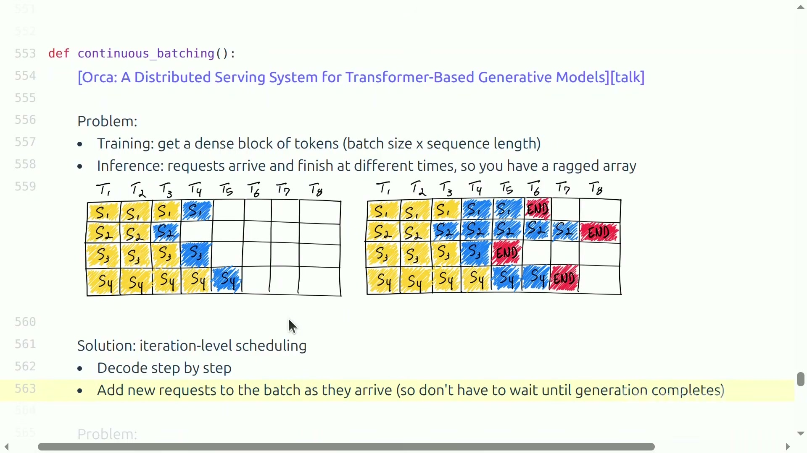
*左侧静态 batch 在部分序列结束后留下空槽，右侧按 iteration 调度并把新请求接入；画面保留了 END 与时间步的完整状态。（字幕区间：01:17:41--01:18:34）*

### 8.3 Selective batching：不同算子采用不同拼法

长度为 3、9、5 的 ragged sequences 不能无 padding 地堆成统一的 `B×S×H` 张量。Attention 依赖每条序列自己的长度、mask 和 KV cache，需要分别或用 ragged kernel 处理；LayerNorm、线性层和 MLP 等逐 token 运算则不依赖序列边界，可以把 `[3,H]、[9,H]、[5,H]` 拼成 `[17,H]`，形成更大的矩阵运算。

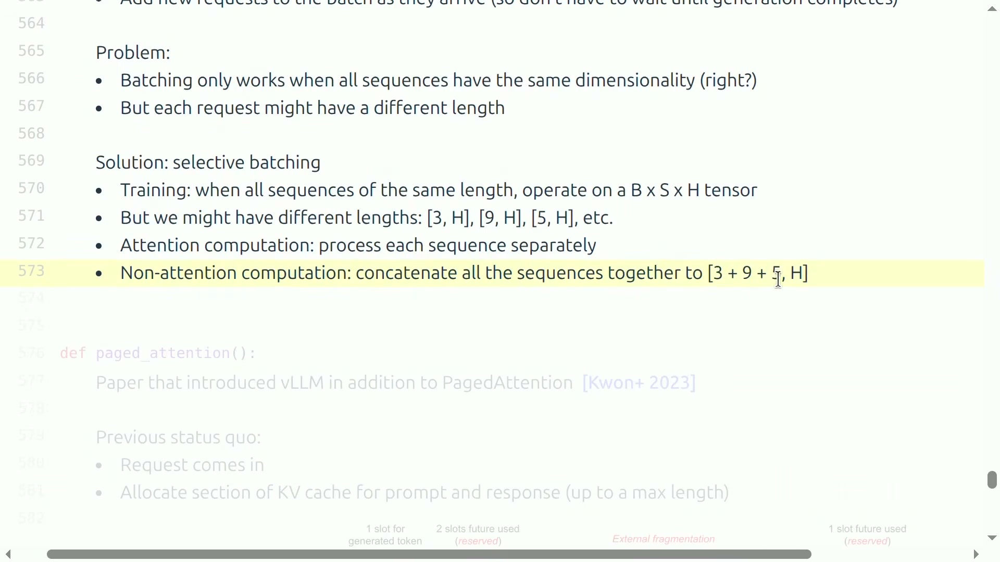
*不同长度序列的 attention 分开处理，非 attention 计算拼成 `[3+9+5,H]`；该帧选择了规则完整揭示后的状态。（字幕区间：01:18:34--01:19:34）*

> [!NOTE]
> 讲者用 `3×3`、`9×9` attention 说明长度依赖。带 KV cache 的实际 decode 通常是一个新 query 对各自 `S_i` 个历史 KV 做 `1×S_i` 交互；课程图的作用是解释 ragged shape，不应被误写成每步重算完整方阵。

### 8.4 连续预留为什么产生碎片

旧式 KV 管理会在请求到达时，为“prompt + 最大可能输出”预留一段连续空间。输出长度事先未知，于是产生：

- **内部碎片**：请求自己的预留区间里，有大量 future slots 最终从未使用；
- **外部碎片**：不同连续分配区间之间出现小空洞，虽然总空闲容量不少，却无法满足新的大块连续请求。

*Request A/B 分别留下 2038、507 个 never-used slots，请求之间还存在 external fragmentation。（字幕区间：01:19:49--01:20:56）*

### 8.5 Logical blocks 映射到非连续 physical blocks

PagedAttention 借用了操作系统分页的思想：把一条逻辑序列的 KV 切成固定大小 logical blocks，再由 block table 映射到任意空闲 physical KV blocks。只有当前块填满时才分配下一块，无需为最大输出长度预留连续区间。

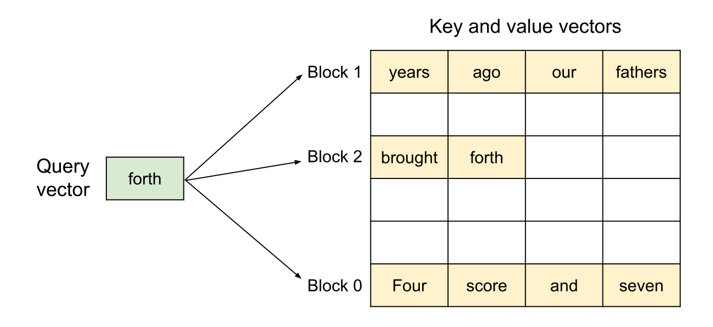
*query `forth` 需要从 Block 0、1、2 中取得历史 key/value；块化不会改变逻辑 attention。（字幕区间：01:20:56--01:21:58）*

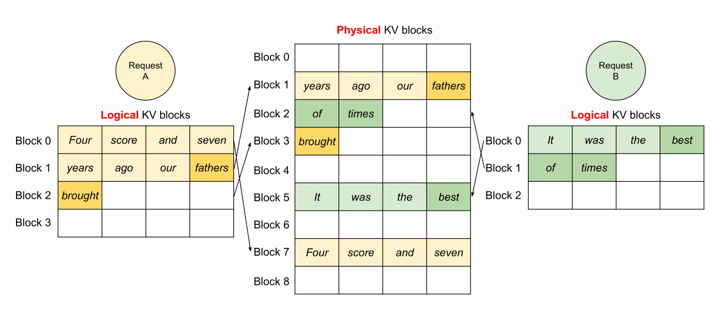
*Request A/B 的逻辑顺序保持连续，但物理块可以落在 Block 1/2/3/5/7 等不相邻位置。（字幕区间：01:20:56--01:21:58）*

分页减少的是预留、碎片和复制浪费，不会凭空减少一条既定序列真正需要保存的 KV；attention kernel 仍要借助 block table 找齐相关数据。

### 8.6 前缀共享与 block-level copy-on-write

共享 system prompt、few-shot 示例，或同一 prompt 生成多个候选时，多条逻辑序列可以指向同一组 physical blocks。前缀完全相同且引擎维护 prefix cache 时，这既减少存储，也可以避免重复 prefill。

*两条翻译请求共享 instruction 和三条示例，只在 task input/output 分叉。（字幕区间：01:21:58--01:22:42）*

分叉以前只增加引用计数，不复制数据；当某条序列要在共享且尚未填满的块里写入不同 token 时，系统才复制该块，这就是 copy-on-write。

*两个 sample 共享 `Four score and seven / years ago our`，最后分叉成 `fathers` 与 `mothers` 时复制块，引用计数从 2 降为 1。（字幕区间：01:22:42--01:23:28）*

vLLM 还结合了融合 block read 与 attention 的 kernel、FlashAttention/FlashDecoding 和 CUDA graphs。它们分别减少额外 HBM 流量或 kernel launch overhead，但视频因时间只快速点名，本文不扩写未讲实现。

> [!IMPORTANT]
> Continuous batching、selective batching 与 PagedAttention 不解决同一个问题：前者管理每轮有哪些请求，第二个决定不同算子如何处理 ragged shape，第三个管理 KV 的物理布局、共享和复制。

### 本章小结

- Continuous batching 在每个 decode step 弹出完成请求、加入新请求，避免静态 batch 空等。
- Selective batching 让 attention 尊重各序列长度，同时把非 attention token 拼成大矩阵运算。
- PagedAttention 用 logical-to-physical block mapping 消除连续预留要求，减少碎片。
- 引用计数、前缀共享与 copy-on-write 让同 prompt 多样本不必复制完整 KV。

## 总结与延伸

### 讲者的实质结论

这堂课先证明同一个 Transformer 在训练和推理中呈现不同系统形态：训练可以形成规则的大矩阵运算；自回归 decode 却经常 memory-bound，而且请求的到达、长度和结束时间都动态变化。因此推理优化必须同时包含模型和系统两侧：

- 用 GQA、MLA、CLA、local/sparse attention 缩小请求私有状态；
- 用量化减少每个数的字节，用剪枝/蒸馏减少结构；
- 用投机采样把大模型的串行生成改成小模型猜测与大模型并行验证；
- 用 continuous batching、分页、前缀共享和 COW 处理动态工作负载。

讲者最后提出了比“把现有 kernel 再优化一点”更大的研究问题：标准 attention 的 KV cache 与自回归组织方式，使 Transformer 从根本上不够 inference-friendly。线性 attention、状态空间模型与扩散式生成等架构，可能从设计起点改变状态规模或生成并行性。

这是一项有条件的研究展望，不是“某条路线已经解决全部问题”。新架构仍要同时证明：训练稳定、模型质量不降、长上下文能力可靠，并且在真实硬件上取得端到端收益。

### 一套可迁移的推理优化决策树

面对一个真实推理系统，可以按以下顺序诊断：

1. **先分阶段**：TTFT 主要看排队和 prefill，稳态 token latency 看 decode；
2. **再判瓶颈**：用 FLOPs/byte 和实测 profiler 区分 compute、HBM、通信与调度；
3. **找共享对象**：权重能否被更多请求复用，KV 能否跨 heads/layers/prefixes 共享；
4. **减少表示**：是否能降低 head 数、latent 维、历史长度、数值位宽或模型结构；
5. **借回并行**：是否能用 continuous batch 或 speculative verification 扩大一次有效工作；
6. **守住语义**：有损方法重新测质量，无损采样核对分布，系统方法核对逻辑 attention 不变；
7. **做端到端验证**：局部字节数或 FLOPs 的下降，不等于产品 TTFT、latency 和 throughput 必然同步改善。

### 初学者应能独立完成的检查

读完本讲后，应当能够：

- 从 `B,S,T,D,F,N,K,H,L,V` 写出参数与 KV cache 的一阶内存模型；
- 解释为什么 prefill 与 decode 的算术强度不同，为什么 batch 对 MLP 和 MHA attention 的作用不同；
- 比较 GQA、MLA、CLA、local/sparse attention 各自压缩的轴与可能损失；
- 手算一个标量量化例子，并解释 AWQ 为什么不是简单留下 1% FP16；
- 写出投机采样的接受概率与残差分布，用二元词表证明输出仍来自 target；
- 区分 continuous batching 的调度、selective batching 的算子组织和 PagedAttention 的内存管理；
- 用 logical block、physical block、引用计数和 copy-on-write 复述一次共享前缀分叉。

### 仍然开放的问题

- 长上下文中，怎样在精确检索、固定状态和 cache 成本之间取得更稳健的 Pareto 前沿？
- 投机采样的 draft 是否能动态适应任务、硬件和当前接受率，而不是固定选一个模型和 `K`？
- Prefill 与 decode 是否应由不同设备、kernel 或调度队列承担？
- 新架构的“理论线性”优势，何时能转化为真实模型质量和端到端服务收益？

这些问题共同指向同一目标：不要只让模型“能生成”，而要让它以可持续、可测量、对硬件友好的方式生成。

### 本章小结

- 推理优化的共同目标，是在守住质量或目标分布的前提下，减少数据搬运、串行工作、状态容量和动态浪费。
- 模型架构、数值表示、采样算法与服务系统必须联合设计；单点优化很容易把瓶颈推到别处。
- Transformer 推理已经有大量成熟工程技巧，但推理友好的新架构仍有巨大、尚待验证的研究空间。
