# Stanford CS336 2026 第 11 讲：Scaling Laws——把小规模实验变成大训练决策


> 课程：Stanford CS336 — Language Modeling from Scratch（Spring 2026）  
> 讲次：Lecture 11: Scaling Laws  
> 讲者：Percy Liang  
> 视频时长：01:17:03  
> 原视频：https://www.youtube.com/watch?v=vTfEyOyzV9E  
> 本讲核心问题：当一次大模型训练昂贵到几乎不能重来时，怎样用较小、较便宜的实验预测模型规模、数据量、学习率、批大小、初始化和优化器在大尺度下应如何设置？

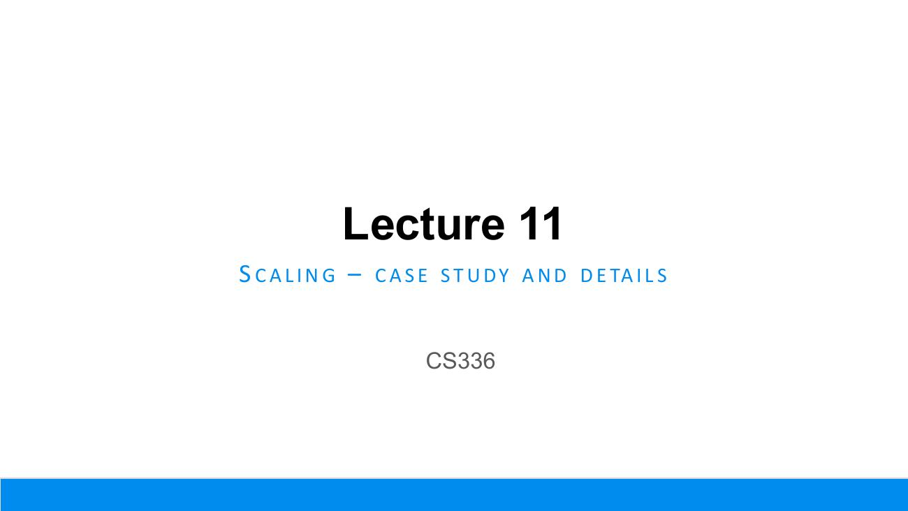

本讲标题页点明了全讲的定位：这不是一堂推导抽象幂律的理论课，而是一堂"案例研究与工程细节"课。前一讲已经建立了 Kaplan 与 Chinchilla 风格的缩放律框架——损失随参数量、数据量、计算量呈幂律下降；本讲要回答的是更尖锐的问题：这些规律在 2024–2026 年真实的工业级训练中是怎样被使用、被改造、又是在哪里失效的。讲者将逐一带读者走过 MiniCPM、DeepSeek、StepFun 三份"细节最公开"的缩放 recipe，再深入两个支撑性技术——Muon 优化器与 μP（maximal update parametrization）——的推导与证据边界。


这一页把全讲压缩成三个问题。第一，Chinchilla 的缩放方法在真实生产中真的可行吗？第二，拟合这些规律本身就要消耗大量计算，能否在"训练"和"拟合"两个环节都省钱？第三，是否应当主动选择某些架构或参数化，让模型"天生"就更易于缩放？这三个问题对应本讲的三条主线：WSD 学习率日程回答第二个问题中的"数据轴测量成本"，DeepSeek/StepFun 的超参数缩放拟合回答第一个问题的操作化，μP 则直接回答第三个问题。读者应注意到，这三个问题都不是"损失是否服从幂律"，而是"怎样让幂律成为可执行的工程决策"。

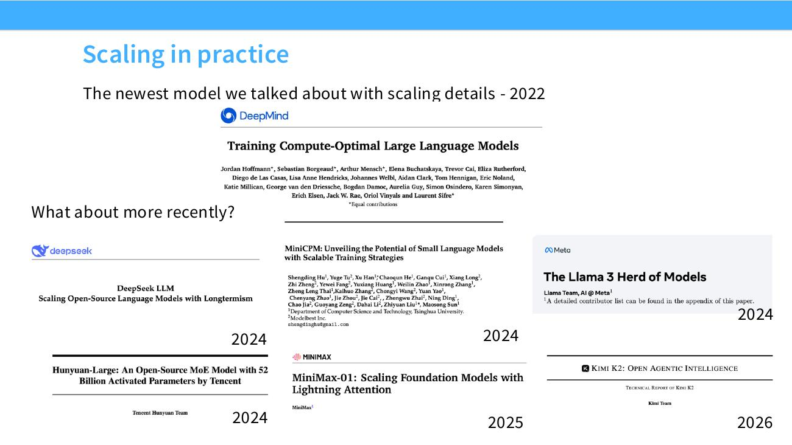

这一页给出了本讲案例的时间线。2022 年 DeepMind 的 Chinchilla 是课程此前详细讨论过的、带有完整缩放细节的最近模型；而 2024–2026 年间，DeepSeek LLM、MiniCPM、Llama 3、Hunyuan-Large、MiniMax-01、Kimi K2 等一批开放模型重新公开了各自的缩放分析。讲者选择 MiniCPM 与 DeepSeek 作为主线案例，原因是它们公开的实验细节最完整：MiniCPM 公开了 μP 参数化、WSD 日程和 Chinchilla 联合拟合的几乎全部超参数；DeepSeek LLM 则公开了学习率—批大小网格、IsoFLOP 曲线和大模型留出验证。其余模型作为对照案例，用来说明"同一个问题，不同团队给出了不同答案"。

这份讲义不是把"损失服从幂律"当作一句口号，而是把本讲整理成一套可以执行、可以质疑、也可以验收的工程方法。阅读时要始终记住三个层次：

1. **描述性规律**：在已经完成的实验上，某个幂律拟合得很好。
2. **决策性规律**：该拟合可以帮助选择模型、数据、学习率或批大小。
3. **外推性规律**：小规模所得的规律在更大模型、不同架构、不同优化器上仍成立。

从第一层走到第三层，每一步都增加了假设。缩放律的价值不是消除这些假设，而是让它们显式化，并用留出实验逐步验证。

## 1. 为什么“在野外”使用缩放律比画一条直线困难

### 1.1 教科书问题与生产问题

最简化的计算最优问题只需要回答：给定训练计算量 $C$，参数量 $N$ 和训练 token 数 $D$ 应如何分配？若把一次 Transformer 前向与反向训练的计算近似写成

$$C \approx 6ND,$$

那么固定 $C$ 后，增大 $N$ 必然减少 $D$，反之亦然。Chinchilla 风格的实验正是在若干固定计算预算下扫描不同 $N,D$，寻找验证损失最低的点，再拟合最优模型规模与最优数据量。这里 $6ND$ 的来源值得回顾：前向传播中每个参数对每个 token 约贡献一次乘加（2 FLOPs），反向传播的梯度计算约为前向的 2 倍，因此每 token 每参数合计约 6 FLOPs。这个近似忽略了注意力中随序列长度增长的项、激活重计算与通信开销，在序列不太长、模型不太宽时是够用的一阶估计。

符号说明：

- $C$：训练计算预算，通常用 FLOPs 表示。
- $N$：模型中参与训练的参数规模；不同论文可能排除 embedding 或只统计激活参数。
- $D$：训练 token 数。
- $L$：验证集上的交叉熵、NLL、bits-per-byte 等损失；指标定义必须先统一。

但生产训练还必须同时决定：

- 宽度、深度、头数、FFN 扩张比、MoE 专家数等架构超参数；
- 学习率、批大小、权重衰减和学习率日程；
- 初始化与参数化是否能跨宽度保持稳定；
- 数据混合、tokenizer 和损失单位是否可比较；
- 小模型上观察到的最优点能否外推到目标尺度。

因此，"模型越大损失越低"远远不够。真正要预测的是一个包含离散架构决策和连续优化超参数的高维响应面。

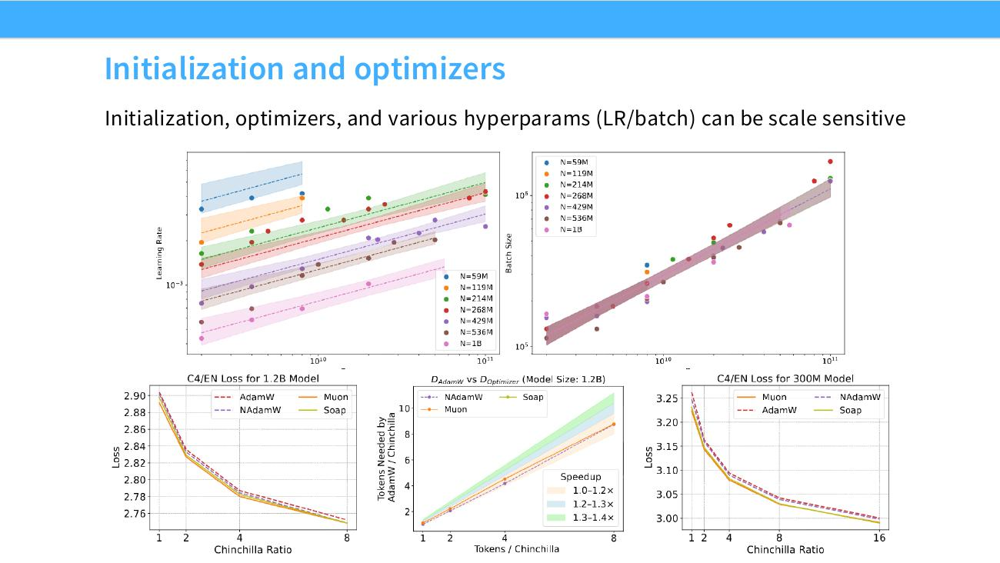

这一页用四组实验图说明：初始化方式、优化器选择以及学习率/批大小等超参数，其行为都随模型尺度改变。上方两图显示不同模型规模 $N$ 下最优学习率与最优批大小随数据量 $D$ 的系统性漂移——学习率整体随尺度下降、批大小随尺度上升，而且不同 $N$ 的曲线并不重合；下方三图比较 AdamW、NAdamW、Muon、Soap 等优化器在不同 Chinchilla 比例下的 C4/EN 损失，以及各优化器相对 AdamW 达到同一损失所需 token 数的加速比。这些图共同传达一个信息：超参数不是可以一次设定后高枕无忧的常数，而是随尺度移动的变量；这正是"在野外"使用缩放律比教科书上画一条直线困难的根本原因。本页也为后文埋下伏笔：第 6 节的 StepFun 会正式拟合这些漂移趋势，第 7、8 节会讨论优化器比较中的尺度依赖陷阱。

### 1.2 三类容易混淆的“缩放”

本讲交替讨论三种问题，初学者最好主动区分：

| 问题 | 要预测什么 | 典型输出 |
|---|---|---|
| 性能缩放 | 给定 $N,D,C$，最终损失是多少 | $L(N,D)$、$L(C)$ |
| 计算分配 | 给定 $C$，怎样选 $N,D$ | $N_{\mathrm{opt}}(C),D_{\mathrm{opt}}(C)$ |
| 超参数缩放 | 模型或数据变大后怎样改学习率、批大小、初始化 | $\eta_{\mathrm{opt}}(C)$、$B_{\mathrm{opt}}(C)$、$\sigma_l(n)$ |

它们可以相互依赖，但不是同一件事。例如，损失关于计算量呈漂亮幂律，并不自动证明同一个学习率可以跨宽度使用；反过来，μP 使最优学习率更稳定，也不意味着 Chinchilla 的 $N:D$ 比例就不必重新测量。一个常见的推理错误是：因为在固定 recipe 下测得了 $L(C)$ 的干净幂律，就认为把 $C$ 增大 10 倍时只需按幂律外推——但如果同一学习率在更大模型上已经开始偏离最优，实测曲线就会落在幂律上方，第 7 节的失败案例正是如此。

### 1.3 本讲的证据标准

判断一条缩放律是否真的有用，可以按以下顺序提问：

1. 拟合区间内是否平滑，最优点是否被实验网格覆盖？
2. 是否存在没有参与拟合的留出尺度？
3. 留出点是否只是"损失接近"，还是训练也稳定、成本也符合预期？
4. 目标训练与代理实验是否共享架构族、优化器、数据、tokenizer 和学习率日程？
5. 若有因素改变，是否重新做了局部扫描？

最后一点极其重要：缩放律通常是**条件规律**，不是脱离训练 recipe 的自然常数。

> [!IMPORTANT]
> 本讲中所有具体数字——$10^{-2}$ 的最优学习率、$0.3118\,C^{-0.1250}$ 的学习率缩放、$D_{\mathrm{opt}}/N_{\mathrm{opt}}\approx 95.60$ 的数据比例——都是在特定模型族、数据、优化器和日程下拟合出的条件结论。它们的价值在于演示方法论，而不是作为可直接搬用的普适常数。

### 本章小结

缩放律的工程目标，是把便宜实验转化为昂贵训练的决策。要先区分性能缩放、计算分配和超参数缩放，并把架构、优化器、数据与日程视为规律成立的条件，而不是无关细节。

## 2. MiniCPM：先让代理模型之间“可比较”

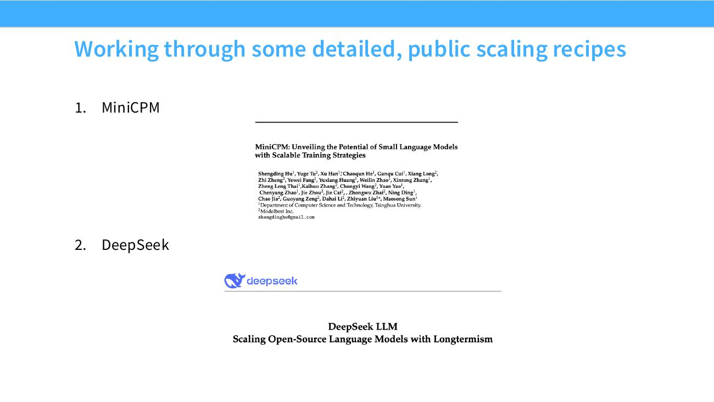

这一页宣布本讲前半部分的主线：逐细节走过两份公开的缩放 recipe。第一份是 MiniCPM（清华大学与面壁智能，2024），其特点是"用 μP 稳定缩放 + 用 WSD 降低数据轴测量成本"；第二份是 DeepSeek LLM（2024），其特点是"不依赖 μP，直接在多个尺度上显式扫描学习率与批大小并拟合其缩放规律"。这两条路线恰好对应处理超参数漂移的两种哲学：前者试图从参数化上消除漂移，后者承认漂移并把它本身当作缩放对象来测量。

### 2.1 固定模型族，再谈外推

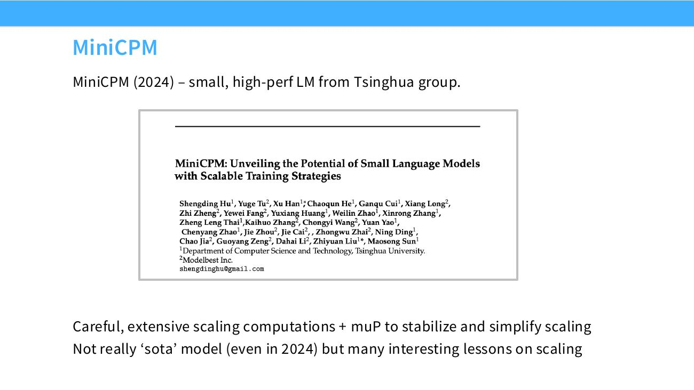

这一页介绍 MiniCPM 的定位：一个 2024 年的小型高性能语言模型。讲者特别强调，MiniCPM 即使在 2024 年也算不上 SOTA 模型，但它的价值不在于排行榜，而在于它做了非常仔细、非常成体系的缩放计算，并且用 μP 来稳定化、简化整个缩放流程。这提醒我们：学习缩放律方法论时，应该优先读"实验设计最透明"的论文，而不是"模型最强"的论文——前者教会你如何自己做，后者往往只告诉你结果。

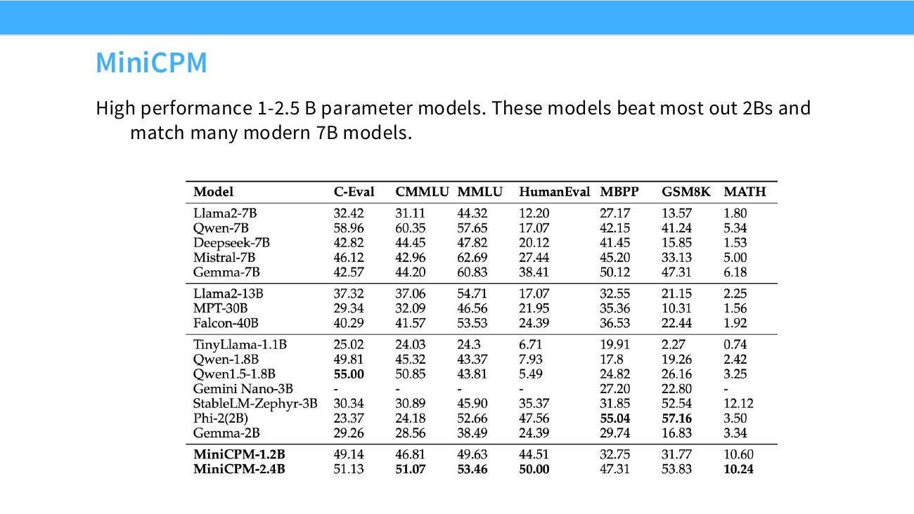

这一页给出 MiniCPM 的基准对照表：1.2B 与 2.4B 参数的 MiniCPM 在 C-Eval、CMMLU、MMLU、HumanEval、MBPP、GSM8K、MATH 等基准上超过同期大多数 2B 级模型，并接近许多 7B 模型（如 Llama2-7B、Mistral-7B）的表现。这张表的作用是建立可信度：一个能把 2.4B 模型训到接近 7B 水平的团队，其缩放方法论值得认真研究。注意表中 MiniCPM-2.4B 的 HumanEval 达到 50.00、GSM8K 达到 53.83，均超过所列全部 7B 模型——这说明"缩放实验省钱"与"最终模型强"并不矛盾，恰恰是因为缩放分析做对了，小模型才能充分逼近其计算预算下的能力上限。

如果小模型和大模型不仅宽度不同，深度、注意力头、FFN 比例也随意变化，就无法知道性能变化来自总计算量还是架构形状。MiniCPM 的思路是先定义一个结构规律较一致的模型族，再用 μP 风格的参数化缓解宽度变化导致的优化超参数漂移。

直觉上，标准参数化会让同一数值的学习率在不同宽度产生不同大小的功能变化。若代理模型的最优学习率不断漂移，那么每个尺度都要重新调参，缩放实验的成本会迅速膨胀。μP 的目标不是让所有训练设置自动正确，而是让"在小模型上调出的超参数"更有机会迁移到大模型。

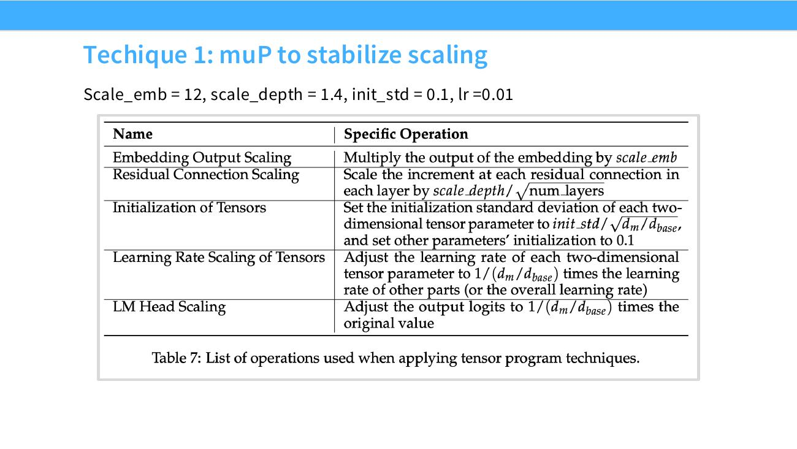

这一页是 MiniCPM 的 μP 落地细节，也是本讲第一个"可以抄进工程笔记"的表格。MiniCPM 设定的基础常数为：scale_emb $=12$，scale_depth $=1.4$，init_std $=0.1$，lr $=0.01$。论文 Table 7 列出的五项操作是：

1. **Embedding 输出缩放**：embedding 输出乘以 scale_emb；
2. **残差连接缩放**：每层残差增量乘以 $\text{scale\_depth}/\sqrt{\text{num\_layers}}$；
3. **张量初始化**：每个二维张量参数的初始化标准差设为 $\text{init\_std}/\sqrt{d_m/d_{\text{base}}}$，其余参数初始化为 0.1；
4. **张量学习率缩放**：每个二维张量参数的学习率调整为其他部分（或全局学习率）的 $1/(d_m/d_{\text{base}})$ 倍；
5. **LM Head 缩放**：输出 logits 调整为原值的 $1/(d_m/d_{\text{base}})$ 倍。

符号说明：

- $d_m$：当前模型的隐藏维度（model width）。
- $d_{\text{base}}$：基础代理模型的隐藏维度，所有缩放都相对于它定义。
- scale_emb：embedding 输出的固定放大倍数，与宽度无关。
- scale_depth：控制残差分支随深度衰减的强度。

这张表把 μP 的抽象原则（"隐藏矩阵的学习率随宽度反比缩放"）翻译成五个具体开关。第 9、10 节我们会从头推导为什么二维隐藏矩阵的学习率应当按 $1/d_m$ 缩放、为什么 embedding 与输出头要走不同规则；这里先记住操作形式。值得注意的是第 2 项：残差增量按 $1/\sqrt{\text{num\_layers}}$ 缩放，这处理的是**深度**方向的方差累积——若每层残差分支贡献独立的 $\Theta(1)$ 方差，$L$ 层累加后方差为 $\Theta(L)$，除以 $\sqrt{L}$ 可保持总激活方差有界。这说明完整参数化不仅要管宽度，还要管深度。

### 2.2 学习率与批大小必须看成二维问题

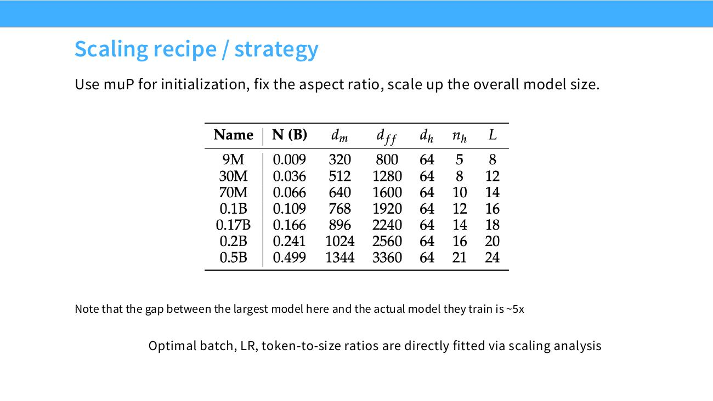

这一页给出 MiniCPM 的代理模型族表格：从 9M（$d_m=320$）到 0.5B（$d_m=1344$）共 7 个尺度，$d_{ff}$ 恒为 $d_m$ 的 2.5 倍，单头维度 $d_h$ 恒为 64，头数 $n_h$ 与层数 $L$ 随规模同步增长。这就是"固定长宽比（aspect ratio），整体放大"的具体含义：所有模型的形状比例一致，唯一变化的是绝对尺度，因此尺度间的性能差异可以归因于规模而非形状。表格下方讲者加了一句关键注释：**这里最大的模型（0.5B）与实际要训练的目标模型（2.4B）之间还有约 5 倍差距**——也就是说，即使是这份以谨慎著称的 recipe，最终训练仍然是一次外推，只不过外推距离被压缩到了约 5 倍，而不是天真地从 9M 直接外推 250 倍。最优批大小、学习率与 token-to-size 比例则通过对这些代理模型的缩放分析直接拟合。

批大小 $B$ 改变每步梯度估计的噪声，学习率 $\eta$ 决定一次更新的步幅。二者存在相互作用：一个学习率在小批下稳定，不代表在大批下仍是最优；只做独立的一维扫描，可能得到错误组合。

这种相互作用可以从梯度噪声的角度直观理解。设单个样本的梯度估计为 $g_i$，真实梯度为 $\bar g$，则大小为 $B$ 的批次梯度为

$$\hat g_B=\frac1B\sum_{i=1}^{B}g_i,\qquad \operatorname{Var}(\hat g_B)\approx\frac{\operatorname{Var}(g_i)}{B},$$

即梯度噪声的方差与批大小成反比。学习率 $\eta$ 则把每步更新的"信号"与"噪声"同比例放大：信号项约为 $\eta\,\bar g$，噪声项的标准差约为 $\eta\,\sigma_g/\sqrt{B}$。于是每步更新的信噪比为

$$\mathrm{SNR}_{\text{step}}\propto\frac{\eta\,\|\bar g\|}{\eta\,\sigma_g/\sqrt B}=\frac{\sqrt B\,\|\bar g\|}{\sigma_g}.$$

信噪比只由 $B$ 决定，但每步的"进展"同时由 $\eta$ 与 $B$ 决定：$B$ 太小，噪声主导，必须降低 $\eta$ 才能稳定；$B$ 增大后，同样的 $\eta$ 变得过于保守。这就是二维扫描不可约化为一维的根本原因——$(\eta,B)$ 的最优点位于一张二维曲面上，沿任何单轴切片找到的最优点一般不是联合最优点。

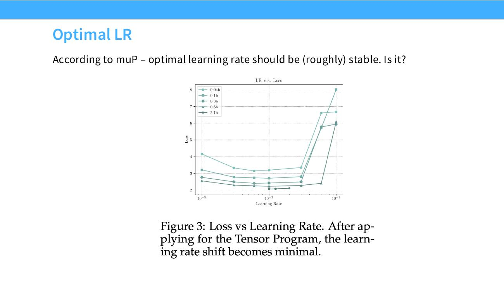

这一页回答一个直接的可证伪问题：按照 μP 的理论，应用张量程序（Tensor Program）技术后，最优学习率应当大致不随宽度漂移，实测是否如此？图中是 0.04B 到 2.1B 五个尺度的"学习率 vs 损失"曲线：每条曲线都是先降后升的 U 形（学习率过大时损失急剧恶化，体现为右侧的陡壁），而各条曲线的最低点都落在 $10^{-2}$ 附近，横坐标漂移很小。论文图注原文是"After applying for the Tensor Program, the learning rate shift becomes minimal"。这张图是 μP 价值的直接证据：如果最优点不漂移，那么在小模型上精调一次学习率，就能服务所有更大的尺度，二维扫描的成本被摊薄到一次。但请注意读图的边界：它只证明了**该模型族、该参数化、该数据与日程下**学习率可迁移，并没有证明批大小、权重衰减或深度变化同样可迁移，更没有证明 $10^{-2}$ 是任何其他团队的合适学习率。

MiniCPM 的结果显示，在其受控模型族和参数化中，最优学习率大致稳定在 $10^{-2}$ 附近。但这只能读成"该 recipe 下有较好的迁移性"，不能读成"所有 Transformer 都应使用 $10^{-2}$"。

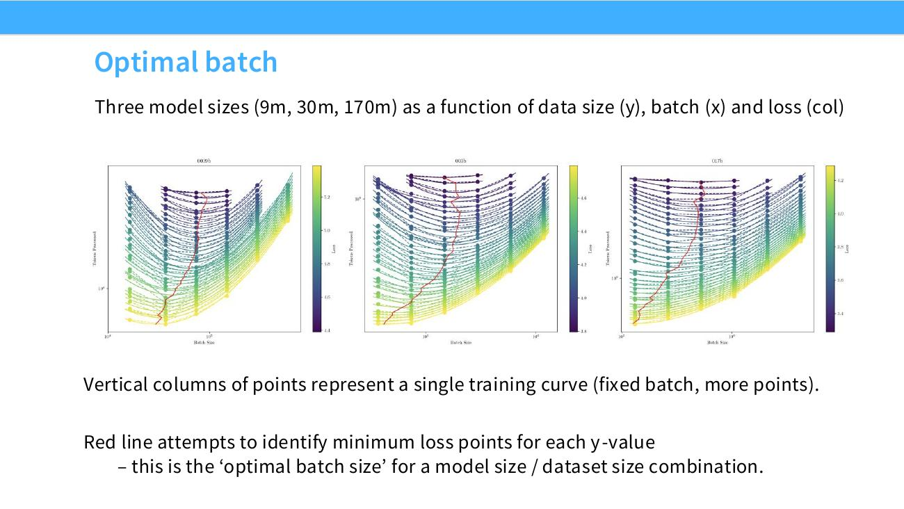

这一页展示 MiniCPM 测量最优批大小的原始数据结构：三个模型尺寸（9M、30M、170M），每张图的横轴是批大小（对数刻度），纵轴是已处理 token 数（对数刻度），点的颜色表示损失。图中一列垂直的点代表同一次训练运行（批大小固定，随训练推进不断记录损失），因此整张学散点图同时编码了"批大小—训练进度—损失"三个变量。红色折线在每个纵轴高度（即每个数据量）处标出损失最低的批大小，它就是"该模型尺寸、该数据量下的最优批大小"。这种可视化方式值得学习：它没有把训练曲线粗暴地压缩成一个标量，而是保留了沿训练进程的完整分辨率，使"最优批大小随训练推进而增大"这一趋势可以直接从红线的右倾读出。

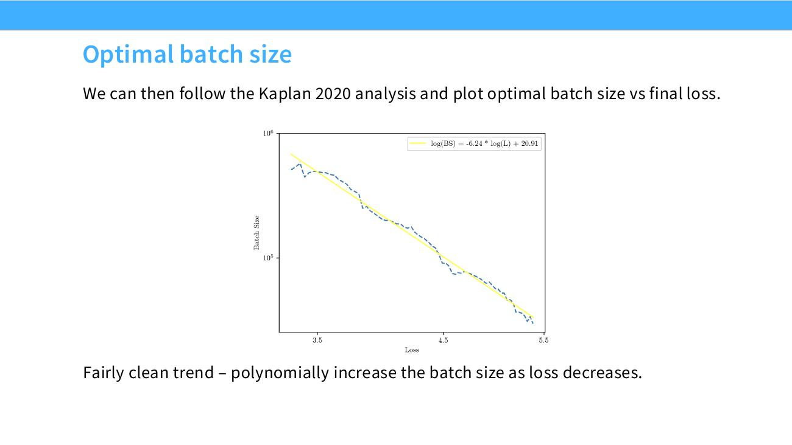

这一页把上一页的红线整理成一条定量的规律：仿照 Kaplan et al. 2020 的分析，把最优批大小对最终损失作图（双对数坐标），得到相当干净的线性趋势，拟合式为 $\log(BS)=-6.24\log(L)+20.91$，即

$$B_{\mathrm{opt}}(L)\propto L^{-6.24}.$$

符号说明：

- $B_{\mathrm{opt}}$：达到给定最终损失所需的最优批大小（token 数）。
- $L$：目标最终损失；注意横轴方向——损失越低（训练越充分），最优批大小越大。

为什么训练后期常需要更大批？在较高损失区域，梯度信号较强，小批量带来的噪声仍可接受；接近更低损失时，梯度信噪比下降——梯度均值随损失面趋平而减小，而噪声方差并不同步减小——增加批大小可以压低噪声、减少无效更新。这正是上一页红线右倾的定量表达。不过，这里的"最优"必须先说明目标：是最少 token、最少参数更新、最短墙钟时间，还是最高硬件利用率。不同目标可能给出不同批大小。MiniCPM 这里的目标与 Kaplan 一致：以固定数据量达到最低损失为标准，即"数据效率最优"，而非"墙钟最快"。

### 2.3 一个可操作的小规模联合扫描

对每个代理尺度，可以采用如下流程：

1. 选择覆盖可能最优点的对数学习率网格，例如相邻点相差约 2 倍。
2. 选择数个批大小，并保证每个配置训练到可比较的 token 数或日程位置。
3. 记录验证损失、吞吐量、溢出/发散、梯度范数和墙钟时间。
4. 在二维网格中寻找稳定盆地，而不是只挑最低的单个点。
5. 在预测最优点附近补一轮局部细网格。
6. 至少留出一个更大尺度，不参与拟合，只用于验证外推。

这里的"稳定盆地"比"冠军点"更重要。大训练会受到硬件抖动、数据顺序和数值误差影响，位于狭窄尖点上的 recipe 很可能比略差但宽阔稳定的 recipe 更危险。从损失面几何来看，若最优点附近 Hessian 的最大特征值很大（尖锐极小值），那么超参数的微小偏移——例如目标尺度上不可避免的有效学习率变化——就会造成较大的损失惩罚；宽阔盆地则对这些扰动鲁棒。第 6 节 StepFun 的响应面分析会把"盆地宽度"变成可量化的对象。

### 本章小结

MiniCPM 路线先控制模型族与参数化，再联合考察学习率和批大小。其结论是特定训练 recipe 下的经验规律；真正可复用的是实验设计：覆盖二维最优盆地、记录稳定性，并用留出尺度验证迁移。

## 3. WSD：把一次长训练变成多个可复用的测量点

### 3.1 为什么 cosine 日程妨碍公平比较

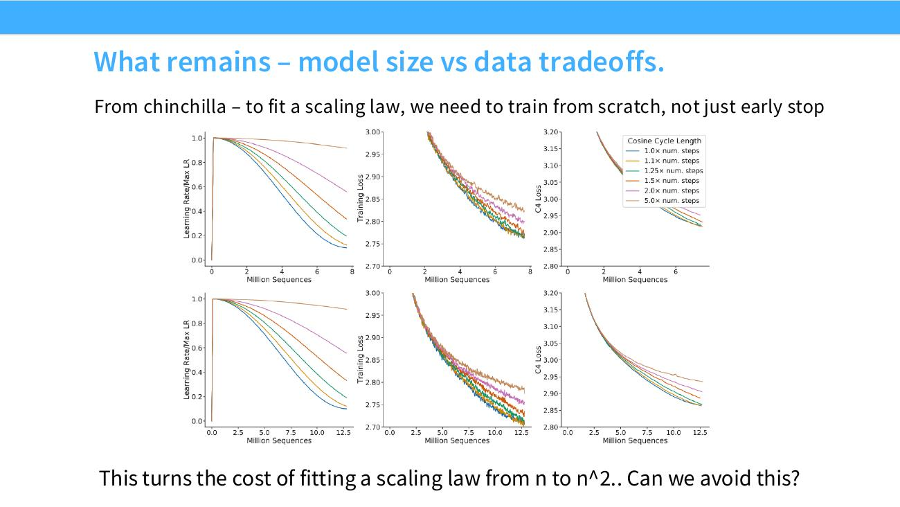

这一页指出 Chinchilla 范式的一个被低估的成本问题。Chinchilla 论文的一个重要教训是：拟合缩放律必须使用**训练到各自终点并完成学习率衰减**的模型，而不能拿一条长训练曲线在不同位置 early-stop 读数。图中上方与下方各三个子图对比了不同 cosine 周期长度（1.0×、1.1×、1.25×、1.5×、2.0×、5.0× 目标步数）下的学习率曲线、训练损失与 C4 损失：cosine 日程的形状由预设终点决定，终点不同，整条曲线不同；在同一步数截断不同终点的运行，得到的是"衰减进度不同"的模型，损失不可比。于是，若想在 $m$ 个数据量 $\times$ $n$ 个模型规模的网格上各测一个"最终损失"，就必须做 $m\times n$ 次完整训练——拟合成本从 $n$ 膨胀到 $n^2$。页底的提问"Can we avoid this?"正是 WSD 的出场动机。

常见 cosine 学习率日程从峰值逐渐衰减到接近零。若原计划训练 $D_1$ 个 token，后来想比较 $D_2$ 个 token，则整个 cosine 曲线都发生变化。这样在 $D_1$ 时截取的 checkpoint，并不等价于"专门训练到 $D_1$ 后完成衰减"的模型。

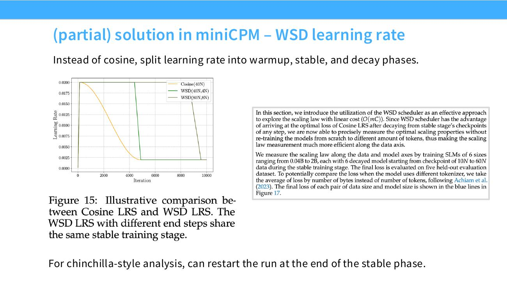

这一页给出解决方案的核心思想：不用 cosine，把学习率日程拆成 warmup（升温）、stable（平稳）、decay（衰减）三段。左图对比了 Cosine(40N) 与两条 WSD 曲线 WSD(40N,4N)、WSD(80N,8N)——记号 WSD($D$,$d$) 表示总训练 $D$ 个 token、最后 $d$ 个 token 用于衰减。关键观察：两条 WSD 曲线在各自的 decay 点之前**完全重合**——它们共享同一段 stable 主干。右侧论文引文点明了收益：由于从 stable 阶段任意 checkpoint 出发做衰减，都能达到与对应长度 cosine 日程相当的最优损失，缩放律沿数据轴的测量成本从二次降为近似线性（引文中记为 $O(mC)$）。MiniCPM 的具体做法：训练 0.04B 到 2B 共 6 个尺寸的模型，每个尺寸从 stable 阶段的 10N 到 60N token 共 6 个 checkpoint 分别衰减，得到 $6\times6$ 个最终损失；为了跨 tokenizer 比较，损失按 byte 数而非 token 数平均（bits-per-byte，遵循 Achiam et al. 2023）。

WSD（warmup–stable–decay）把日程拆成三段：

$$\eta(t)=
\begin{cases}
\eta_{\max}\,w(t), & 0\le t<T_w,\\
\eta_{\max}, & T_w\le t<T_s,\\
\eta_{\max}\,d(t), & T_s\le t\le T,
\end{cases}$$

其中 $w(t)$ 是 warmup，稳定阶段保持峰值学习率，$d(t)$ 是末段衰减函数。

符号说明：

- $t$：当前训练步或累计 token 位置。
- $T_w$：warmup 结束位置。
- $T_s$：稳定阶段结束、开始衰减的位置。
- $T$：本次训练终点。
- $\eta_{\max}$：稳定阶段的峰值学习率。

### 3.2 WSD 如何降低 Chinchilla 扫描成本

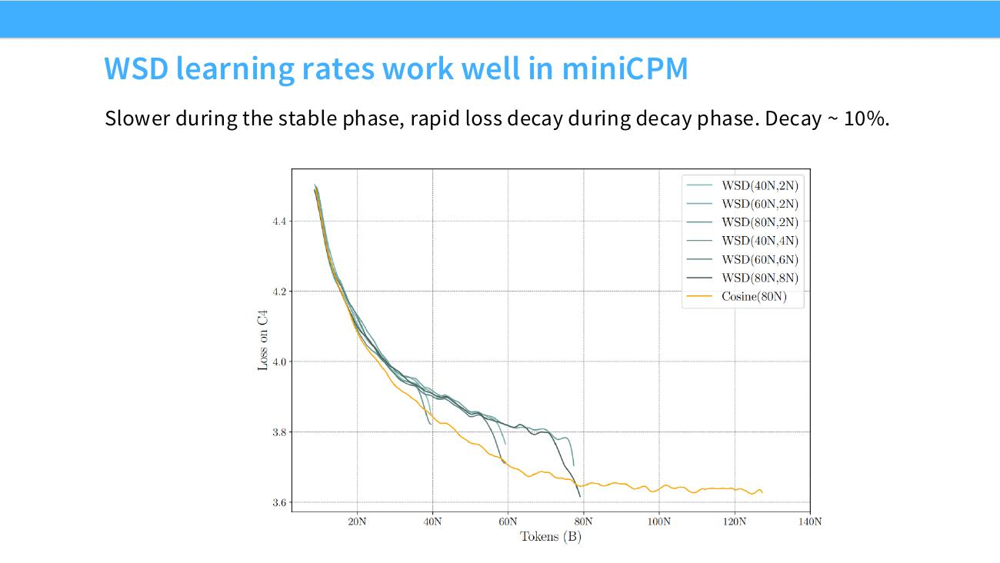

这一页给出 WSD 有效性的核心实验证据。图中画出 WSD(40N,2N)、WSD(60N,2N)、WSD(80N,2N)、WSD(40N,4N)、WSD(60N,6N)、WSD(80N,8N) 与 Cosine(80N) 的 C4 损失曲线。可以看到两个事实：第一，stable 阶段的损失下降比正在衰减的 cosine 慢——这是意料之中的，衰减本身就是"把积累的学习潜力兑现为损失下降"的过程；第二，每条 WSD 曲线一旦进入各自的衰减段，损失迅速下坠，最终都落到与 Cosine(80N) 终点相当甚至略低的水平。标题中的 "Decay ~ 10%" 指 MiniCPM 常用的经验设置：衰减段约占目标 token 量的 10%（如 80N 配 8N）。

为什么"从 stable 段任意点衰减"能近似复现"完整训练到该点"的损失？可以给出一个经验层面的论证。在 stable 阶段，学习率恒定为 $\eta_{\max}$，参数在损失面的某个区域做带噪声的探索，可以近似看成一个处于定常分布的采样过程： checkpoint 的"即时损失"偏高，但它所处的参数区域包含了充分的特征学习成果。衰减段的作用是迅速缩小步长，让参数从探索分布收敛到该区域内的低损失点——只要 stable 段已经充分，这个"退火"过程到达的终点与"从头以该长度为设计终点逐步衰减"的终点近似一致。更形式化地说，若训练动力学近似满足"参数当前的损失水平主要取决于最近一段有效学习率历史，而对久远历史只有缓慢依赖"，那么共享 stable 主干、分叉衰减的终点损失就应当接近各自独立训练的终点损失。这不是一个定理，而是一个在多个公开 recipe（MiniCPM、DeepSeek 的多步日程、以及后续大量工作）中被反复验证的经验性质；它的失效模式（衰减过短导致终点偏高、stable 过长导致衰减段收益饱和）也确实能在实验中观察到。

假设需要测量同一个模型在 $10N,20N,\ldots,60N$ token 处的"训练完成后损失"。使用 WSD 时，可以先运行一条较长的 stable 主干，在不同 token 位置保存 checkpoint，再从各 checkpoint 启动短衰减。于是多个数据量实验共享昂贵的稳定阶段，而不是从头训练多次：$m$ 个数据量测量点的成本从 $m$ 次完整训练降为 1 次主干训练加 $m$ 次长度约 10% 的衰减，总成本约为主干的 $1+0.1m$ 倍而非 $m$ 倍。

这也解释了一个常见误读：stable checkpoint 的即时损失可能比一条正在衰减的 cosine 曲线更高，但它保留了继续训练的能力。比较最终模型时，应让 WSD checkpoint 完成对应衰减，再比较最终损失。

课件中的经验设置提到：

- 衰减区间常占目标 token 的约 10%–20%；
- 最终学习率有时约为峰值的 10%。

这是两个不同的"10%"：一个是日程长度比例，一个是学习率幅度比例。不能混为同一超参数，也不应把它们当成普适常数。

> [!WARNING]
> WSD 复用 stable 主干的前提是"衰减起点之前的训练历史对终点损失的影响可以通过衰减段兑现"。若数据混合、序列长度或批量在 stable 段中途发生变化，各 checkpoint 就不再共享同一历史，从它们分叉得到的最终损失不可直接比较。

### 3.3 MiniCPM 的 Chinchilla 拟合

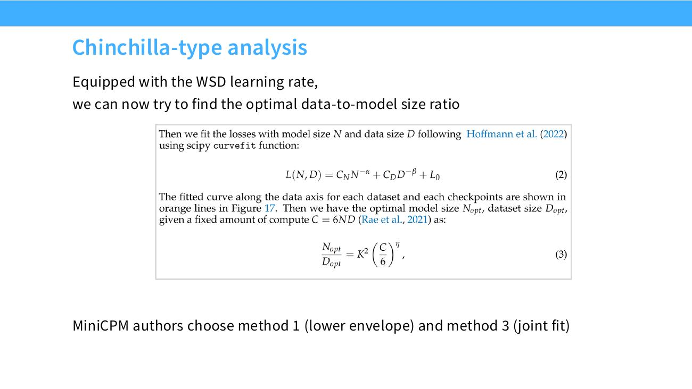

这一页把 WSD 与 Chinchilla 分析衔接起来。有了 WSD，每个模型尺寸都能廉价地得到沿数据轴的多个"最终损失"测量点，于是可以正式寻找最优的数据—模型比例。页面引用的论文段落给出 Hoffmann et al. (2022) 风格的联合拟合（使用 scipy 的 curvefit）：

$$L(N,D)=C_N N^{-\alpha}+C_D D^{-\beta}+L_0,$$

以及在计算约束 $C=6ND$（Rae et al., 2021）下由该拟合推出的最优分配：

$$\frac{N_{\mathrm{opt}}}{D_{\mathrm{opt}}}=K^2\left(\frac{C}{6}\right)^{\eta}.$$

符号说明：

- $C_N,C_D$：模型项与数据项的系数。
- $\alpha,\beta$：模型项与数据项的衰减指数。
- $L_0$：不可约损失（该数据分布的熵下界）。
- $K,\eta$：由 $\alpha,\beta,C_N,C_D$ 决定的最优分配系数与指数。

页面底部注明：MiniCPM 作者同时采用了 Chinchilla 论文的方法 1（IsoFLOP 下包络）与方法 3（联合损失拟合）。

这里值得把方法 3 的推导补全。在约束 $C=6ND$ 下最小化 $L(N,D)$，用拉格朗日乘子法：令 $D=C/(6N)$，代入得

$$L(N)=C_N N^{-\alpha}+C_D\left(\frac{C}{6N}\right)^{-\beta}+L_0=C_N N^{-\alpha}+C_D\left(\frac{6N}{C}\right)^{\beta}+L_0.$$

对 $N$ 求导并令其为零：

$$-\alpha C_N N^{-\alpha-1}+\beta C_D\left(\frac{6}{C}\right)^{\beta}N^{\beta-1}=0,$$

整理得

$$N_{\mathrm{opt}}^{\alpha+\beta}=\frac{\alpha C_N}{\beta C_D}\left(\frac{C}{6}\right)^{\beta},\qquad N_{\mathrm{opt}}\propto C^{\frac{\beta}{\alpha+\beta}},\qquad D_{\mathrm{opt}}\propto C^{\frac{\alpha}{\alpha+\beta}}.$$

这就是"最优模型规模与最优数据量都随计算量幂律增长"的来源；当 $\alpha=\beta$ 时两者指数相同（各约 $1/2$），最优 $D/N$ 比例近似为常数。Chinchilla 拟合出 $\alpha\approx0.34,\beta\approx0.28$，得到著名的"约 20 token/parameter"。下面会看到 MiniCPM 在自己的数据与 recipe 上得到了相当不同的数字。

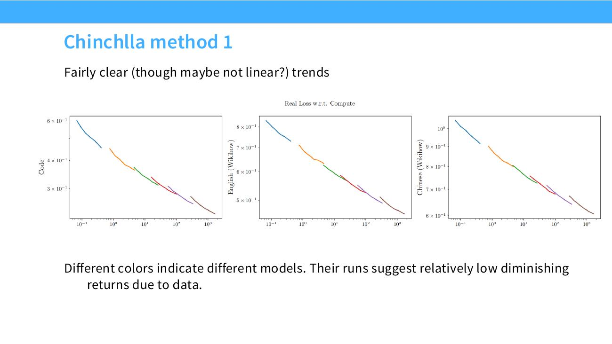

这一页展示 MiniCPM 在 Code、English（Wikihow）、Chinese（Wikihow）三个数据集上分别做的方法 1 分析：横轴是计算量（对数），纵轴是真实损失，不同颜色代表不同模型尺寸的 WSD 运行。每种颜色内部，损失随计算量（此处沿数据轴增加）下降；把所有模型的下包络连起来，就得到"该计算预算下的可达最低损失"。讲者特意指出两点：趋势相当清晰，但**未必是直线**——在某个弯折之后下降变缓，说明单一对数线性幂律可能只是局部近似；不同模型的运行轨迹显示沿数据轴的边际收益递减相对较弱（relatively low diminishing returns due to data），这正是下一页联合拟合会给出偏高数据比例的前兆。


这一页是本节的关键结果。MiniCPM 以方法 3（联合损失拟合）为主，在 Ultratext 数据集上得到

$$L(N,D)\approx
\frac{7.54\times10^{-2}}{N^{0.30}}
+
\frac{2.92\times10^{-1}}{D^{0.30}}
+
0.25,$$

并拟合出分配参数 $K^2=0.01$、$\eta\approx-0.00$，在 $C=10^{21}$ FLOPs 的示例预算下给出

$$\left.\frac{D_{\mathrm{opt}}}{N_{\mathrm{opt}}}\right|_{C=10^{21}}=95.60.$$

符号说明：

- 第一项：有限模型容量造成的损失（$N$ 以课件图的 non-embedding 参数口径，单位为 $10^9$）。
- 第二项：有限数据造成的损失。
- $0.25$：该指标和数据分布下拟合出的不可约项。
- 指数 $0.30$：本实验拟合出的衰减速率，不是理论常数。

图中的等高线图把这个曲面可视化：横轴是 non-embedding 参数量（$10^9$），纵轴是计算量（$10^{18}$ FLOPs），颜色与等高线表示损失；黑点为实际训练的运行。对每条水平线（固定计算预算），损失沿横轴先降后升，最低点给出该预算的最优 $N$。

讲者明确对这个约 96:1 的偏高比例保持怀疑——它远高于 Chinchilla 的约 20:1。正确态度是：它是一个值得用留出点检验的预测，不是因为公式精确到两位小数就自动可信。导致比例偏高的候选因素包括：拟合中 $\alpha=\beta=0.30$ 是对称指数，但系数量级不同，比例对系数比的敏感度极高；WSD 测量本身沿数据轴的边际收益递减较弱（见 slide-017）；以及 MiniCPM 的损失按 byte 平均，与 Chinchilla 的 per-token NLL 口径不同。这也预告了第 5 节的核心信息：不同团队报告的"最优比例"差异极大，跨论文比较前必须先对齐定义。

### 本章小结

WSD 的核心优势是让不同训练长度共享稳定主干，再从多个 checkpoint 独立衰减，从而以近线性成本采集数据轴上的最终损失。它能降低扫描成本，却不会替代对衰减长度、最终学习率和外推比例的验证。

## 4. DeepSeek：直接拟合学习率、批大小与最终损失

### 4.1 不依赖 μP 的路线

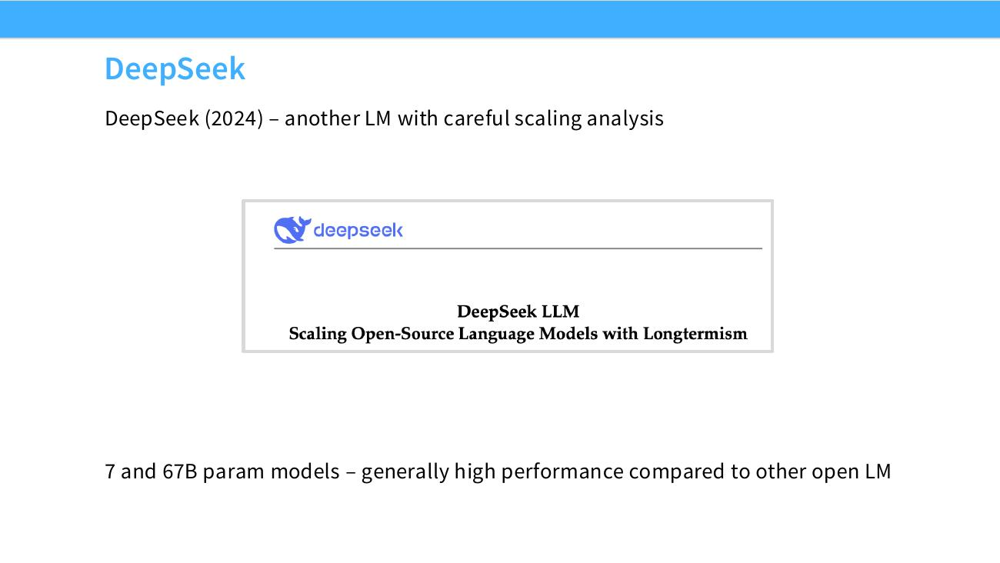

这一页引入第二个主线案例。DeepSeek LLM（2024）训练了 7B 与 67B 两个规模的模型，在当时的开放模型中性能处于前列；更重要的是，其技术报告完整公开了缩放分析的方法学：超参数网格、拟合公式、IsoFLOP 曲线和留出验证。与 MiniCPM 的"μP 先行"不同，DeepSeek 代表另一条路线——不假设超参数可跨尺度保持不变，而是把漂移本身测出来。

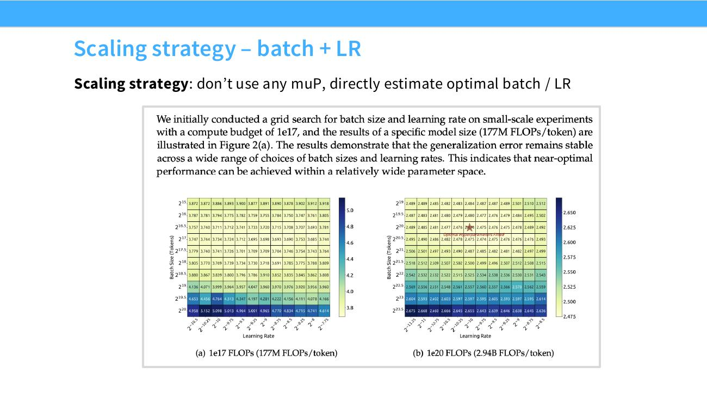

这一页是 DeepSeek 超参数扫描的核心证据。论文在 $10^{17}$ FLOPs 的小计算预算上（对应 177M FLOPs/token 的模型）做了学习率 × 批大小的完整网格搜索，随后又在更大预算（$10^{20}$ FLOPs、2.94B FLOPs/token）上重复。两张热力图的每一个格子都是一次完整训练的最终验证损失。论文的结论是：在相当宽的批大小与学习率范围内，泛化误差保持稳定——近最优性能可以在一个较宽的参数空间内获得。这一点对工程实践非常重要：它意味着超参数曲面的"盆地"是宽的，网格不需要无限精细；同时也意味着所谓"最优学习率"应当理解为一个区间的中点，而不是一个尖锐的孤立点。请读者注意两张图的颜色范围差异：$10^{17}$ 预算的损失跨度约 3.7–5.2，$10^{20}$ 预算约 2.47–2.66——盆地形状随计算预算系统性移动，这正是下一步要拟合的对象。

DeepSeek 展示了另一种工程策略：不先假设超参数可跨尺度保持不变，而是在多个小尺度上显式扫描学习率与批大小，再拟合它们随计算量变化的规律。

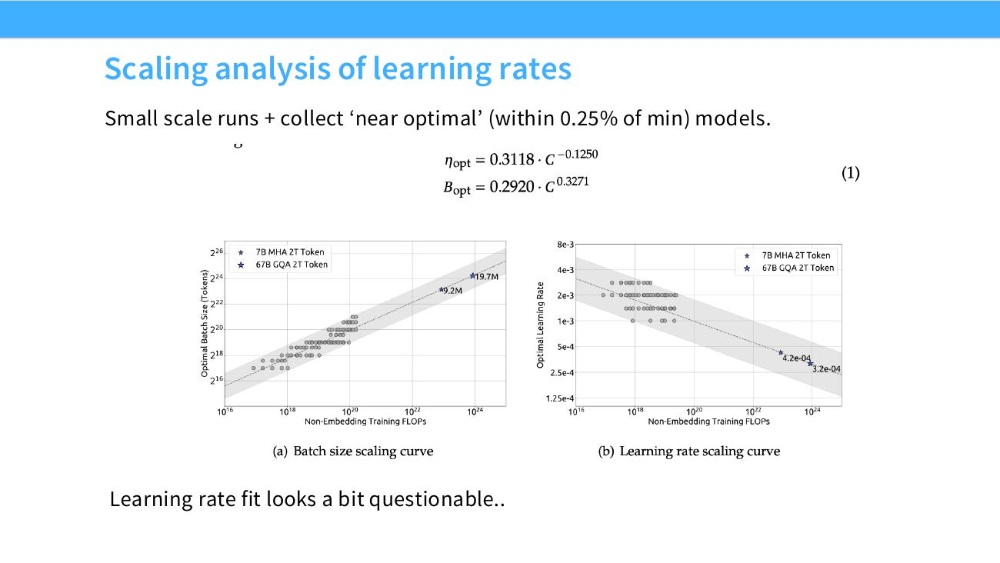

这一页给出 DeepSeek 的超参数缩放律。方法上，他们不是只取每个网格的最低点，而是收集所有"近最优"运行（损失在最小值的 0.25% 以内），再对这批点拟合幂律：

$$\eta_{\mathrm{opt}}(C)=0.3118\,C^{-0.1250},\qquad B_{\mathrm{opt}}(C)=0.2920\,C^{0.3271}.$$

符号说明：

- $\eta_{\mathrm{opt}}$：拟合的最优峰值学习率。
- $B_{\mathrm{opt}}$：拟合的最优批大小（token 数）。
- $C$：non-embedding 训练 FLOPs；课件强调其拟合使用 non-embedding 口径。
- 系数与指数：来自特定模型族、优化器、数据和日程的经验回归。

下方两张图分别是最优批大小与最优学习率对训练 FLOPs 的散点与拟合线，灰色带表示不确定性；图中还标出了 7B 与 67B 两个留出大模型的实际取值（如 7B/2T token 用 4.2e-4，67B 用 3.2e-4），它们落在拟合趋势附近——这是该拟合经过留出检验的证据。但讲者在页底加了一句重要评语："Learning rate fit looks a bit questionable.."——学习率那张图的散点相当分散，网格点明显成簇排列（每个簇对应一个离散的学习率候选值），回归线的表观精度远超底层测量的分辨率。

学习率拟合需要格外小心：若扫描网格过粗，所谓"最优学习率"只是几个离散候选中的胜者。回归线看似精确，底层观测却被量化得很粗。因此应同时保存局部损失曲率或置信区间，避免把网格分辨率伪装成科学精度。

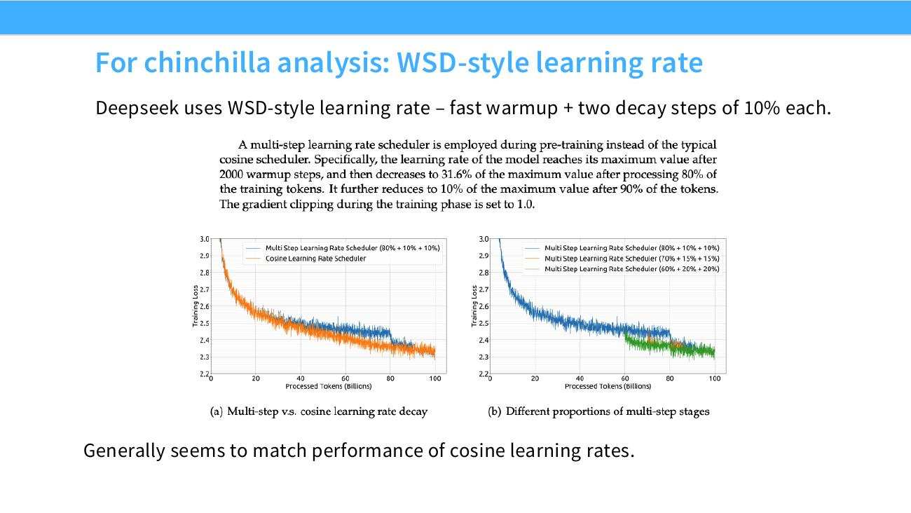

这一页说明 DeepSeek 在数据轴测量上同样采用 WSD 风格的日程，以控制 Chinchilla 扫描成本。具体形式是多步日程：2000 步 warmup 到达峰值后保持，处理完 80% 的训练 token 后降至峰值的 31.6%（即 $1/\sqrt{10}$），处理完 90% 后降至峰值的 10%；梯度裁剪阈值 1.0。左图对比该多步日程（80%+10%+10%）与 cosine 日程的训练损失，二者基本重合；右图对比三种比例划分（80/10/10、70/15/15、60/20/20），终点损失几乎无差别。论文结论与课件评语一致：多步日程总体能匹配 cosine 的性能，同时保留了"从稳定段任意点分叉"的灵活性。至此我们看到，WSD（或其多步变体）已成为 2024 年后工业界做数据轴缩放测量的事实标准。

### 4.2 IsoFLOP 分析

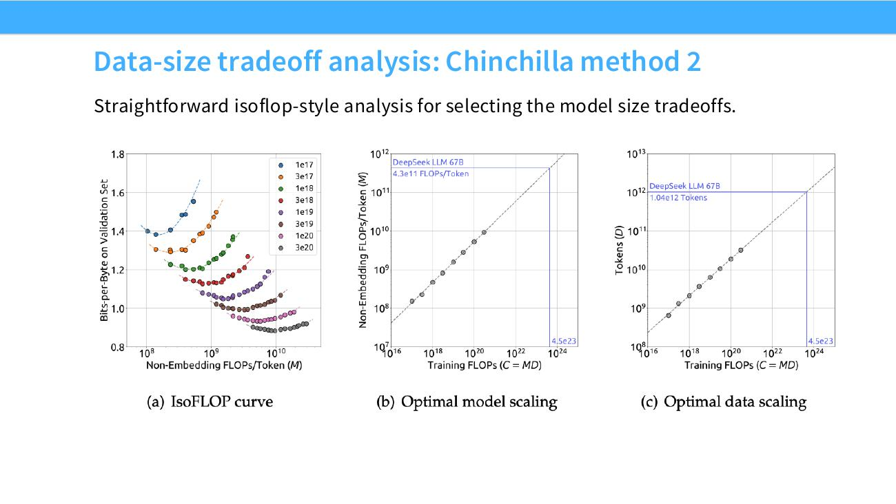

这一页是 DeepSeek 的 IsoFLOP 分析，即 Chinchilla 方法 2。左图在 7 个计算预算（$10^{17}$ 到 $3\times10^{20}$ FLOPs）下分别画出"bits-per-byte vs non-embedding FLOPs/token（即模型尺寸）"的曲线：每条曲线都是 U 形，太小或太大的模型在同预算下都不如中间点。把每个预算 U 形曲线的最低点取出，就得到中图与右图：最优模型规模与最优 token 数都随训练计算量呈干净的幂律增长（$C=MD$ 的对数—对数直线）。图上还标出了 DeepSeek LLM 67B 的位置：$4.3\times10^{11}$ FLOPs/token、$1.04\times10^{12}$ tokens、总计算 $4.5\times10^{23}$ FLOPs——恰好落在小模型拟合出的最优趋势线上，说明 67B 的资源分配是按这套分析确定的。

在固定计算预算 $C$ 下，选择不同模型规模 $N$，相应训练 token 数由 $D\approx C/(6N)$ 决定。损失关于 $N$ 通常形成近似 U 形：

- 模型太小：容量不足，即使见到很多 token 也受限；
- 模型太大：每个参数见到的数据太少，训练不足；
- 中间最低点：该计算预算下的计算最优模型。

将各计算预算下的最低点连接起来，可以拟合 $N_{\mathrm{opt}}(C)$、$D_{\mathrm{opt}}(C)$ 或直接拟合 $L_{\mathrm{opt}}(C)$。最关键的检验不是拟合点本身，而是完全不参与拟合的大模型。

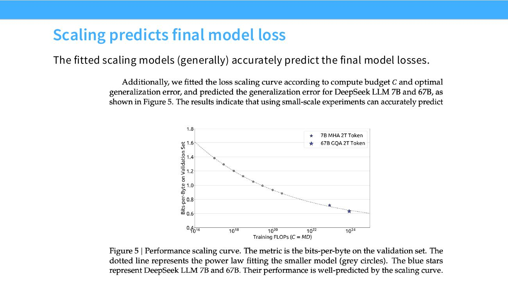

这一页是 DeepSeek 案例、也是全讲前半部分最有分量的一张证据图。灰色圆点是参与拟合的小规模实验（$10^{16}$–$10^{21}$ FLOPs），虚线是拟合出的幂律；蓝色星点是 7B（2T tokens）与 67B（2T tokens）两个**完全没有参与拟合**的大模型，它们准确落在虚线的延长线上。图注明确写出指标是验证集 bits-per-byte。这张图示范了留出验证的标准做法：拟合区间与预测目标之间相差约 3 个数量级，预测仍然命中，这才是"缩放律能指导大训练"的合格证据。但仍要核对纵轴口径：bits-per-byte 按字节归一化，缓解了不同 tokenizer 下每 token 损失不可比的问题，但不能消除数据分布本身的差异。

### 4.3 DeepSeek 风格的端到端 recipe

一个保守的执行版本如下：

1. **冻结候选 recipe**：模型族、数据混合、tokenizer、优化器、精度与训练日程先固定。
2. **选代理尺度**：覆盖至少一个数量级，避免所有点挤在极窄范围。
3. **联合扫 $\eta,B$**：每个尺度先粗扫，再围绕稳定盆地细扫。
4. **构造多个计算桶**：每个 $C$ 下改变 $N,D$，得到 IsoFLOP 曲线。
5. **拟合下包络或联合损失面**：报告残差，不只报告指数。
6. **保留至少一个外推尺度**：不得用它重新挑公式。
7. **做小规模目标复现**：用预测的 $N,D,\eta,B$ 启动较大但仍可承受的训练。
8. **仅在验收通过后上最终规模**：训练早期持续对照预测曲线与数值稳定性。

### 本章小结

DeepSeek 路线把超参数漂移本身也作为缩放对象：小尺度联合扫描学习率和批大小，再拟合随计算量变化的规律，并用大模型留出点检验最终损失。其力量来自留出验证，而风险来自粗网格、单位差异和 recipe 改变。

## 5. 近期模型案例：相同问题，不同答案

### 5.1 为什么跨论文比较比例很危险

课件依次讨论了 MiniCPM、DeepSeek、Qwen、Kimi K2、Hunyuan、LLaMA 3、MiniMax-01 和 StepFun。看起来都在谈"最佳规模"，实际定义常不同：

- 总参数还是激活参数；
- embedding 是否计入；
- 训练 FLOPs 是否按 $6ND$ 近似；
- token 数是否包含重复数据；
- 稠密模型还是 MoE；
- loss 是 per-token、per-byte，还是下游准确率。

因此，不能把论文表格里的常数直接横向排序。首先要把定义对齐，再比较趋势。

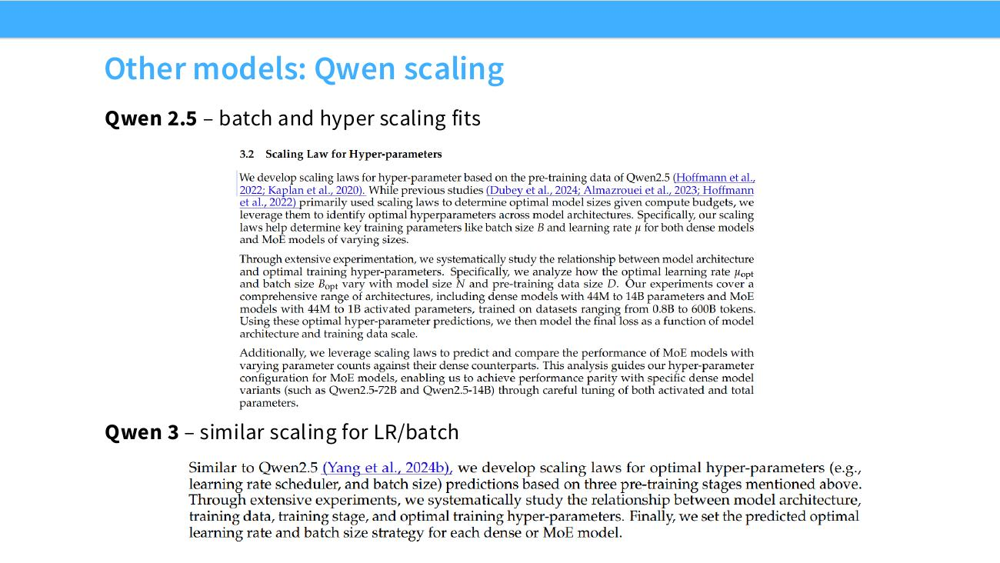

这一页转向 Qwen 系列。Qwen 2.5 技术报告的第 3.2 节明确把缩放律的用途从"给定计算预算决定模型规模"扩展到"跨架构决定关键训练超参数"：他们系统研究最优学习率 $\mu_{\mathrm{opt}}$ 与批大小 $B_{\mathrm{opt}}$ 如何随模型规模 $N$ 和数据量 $D$ 变化，实验覆盖 44M 到 14B 的稠密模型与 44M 到 1B 激活参数的 MoE 模型，数据量覆盖 0.8B 到 600B tokens；随后再把最终损失建模为架构与数据规模的函数，并用缩放律指导 MoE 的超参数配置，使其以精心调节的激活/总参数达到特定稠密模型（Qwen2.5-72B/14B）的性能水平。Qwen 3 延续了同一思路，并进一步按预训练的三个阶段分别拟合最优学习率与批大小策略。值得注意的方法论要点：Qwen 把"架构形状"（如 MoE 的激活参数与总参数之比）也放进了缩放律的自变量集合，而不只是把 $N$ 当作标量。但课件也批评其公开细节很少（"very few details"），因此这些结果更适合作为方向性参考，不宜作为可复现的 recipe。

### 5.2 MoE 中的稀疏度

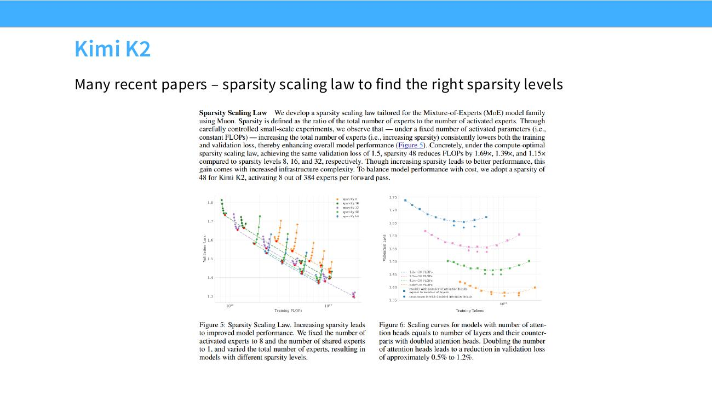

这一页展示 MoE 特有的缩放问题。Kimi K2 为使用 Muon 的 MoE 模型族建立了**稀疏度缩放律**：稀疏度定义为总专家数与激活专家数之比。通过精心控制的小规模实验，他们观察到：固定激活参数量（即固定 FLOPs）时，增大总专家数（即增大稀疏度）持续降低训练与验证损失；在计算最优的稀疏度缩放律下，达到同样的验证损失 1.5，稀疏度 48 相对稀疏度 8、16、32 分别节省 1.69×、1.39×、1.15× 的 FLOPs。但稀疏度增大也带来基础设施复杂度上升，权衡之后 Kimi K2 采用稀疏度 48——每次前向从 384 个专家中激活 8 个。左图（Figure 5）是稀疏度缩放律曲线：固定激活专家 8、共享专家 1，改变总专家数得到不同稀疏度的损失—FLOPs 前沿；右图（Figure 6）是另一个架构缩放实验：注意力头数等于层数的模型与其头数加倍的对应模型相比，验证损失降低约 0.5%–1.2%。这提示我们：缩放律不仅可以回答"多大"，还可以回答"什么形状"——但每引入一个离散结构维度，就需要一族新的受控实验。

Kimi K2 的案例引入了总专家数与每 token 激活专家数的区别。课件用

$$s=\frac{E_{\mathrm{total}}}{E_{\mathrm{active}}}
=\frac{384}{8}=48$$

描述专家稀疏度。

符号说明：

- $E_{\mathrm{total}}$：模型拥有的总专家数。
- $E_{\mathrm{active}}$：单个 token 路由并执行的专家数。
- $s$：总容量相对于单 token 计算的稀疏比。

这说明 MoE 的"模型大小"至少有两个轴：总参数决定容量和内存，激活参数更接近每 token 的计算。将稠密 Chinchilla 比例直接套在 MoE 上，会把容量与计算混在一起。

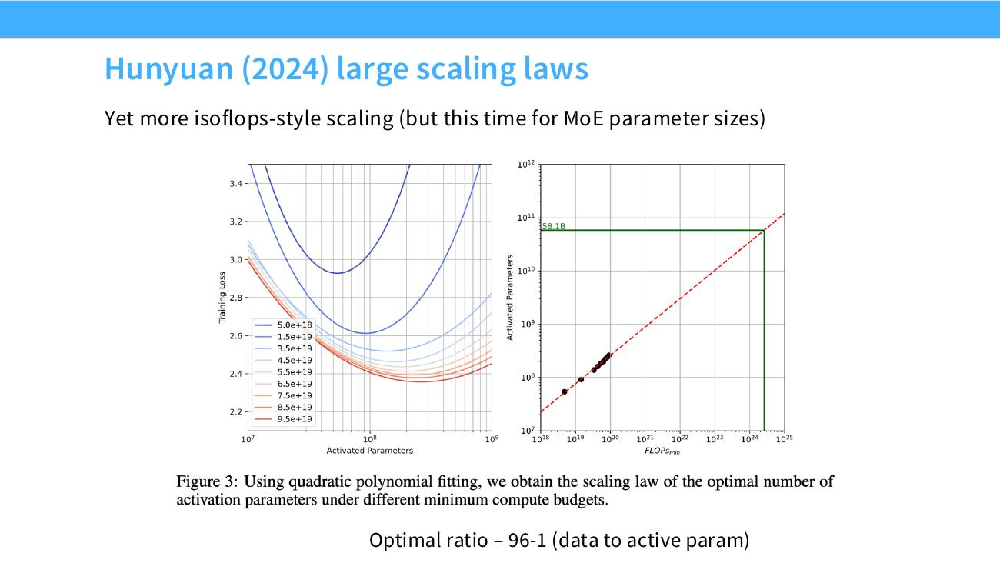

这一页是腾讯 Hunyuan-Large 的 IsoFLOP 分析，对象是 MoE 模型的**激活参数**。左图在 9 个计算预算（$5\times10^{18}$ 到 $9.5\times10^{19}$ FLOPs）下画出训练损失对激活参数的曲线，用二次多项式拟合每条 IsoFLOP 曲线并取最低点；右图把各预算的最优激活参数对最小 FLOPs 作图，得到幂律趋势，并外推到目标规模 58.1B 激活参数。课件在页底标出关键数字：最优数据—激活参数比约 96:1。注意这与 MiniCPM 联合拟合给出的 95.60 惊人地接近，但两者口径不同（Hunyuan 分母是 MoE 激活参数，MiniCPM 是稠密 non-embedding 参数），不能据此宣布"96 是新的 20"。

### 5.3 训练得更久并不自动推翻 Chinchilla

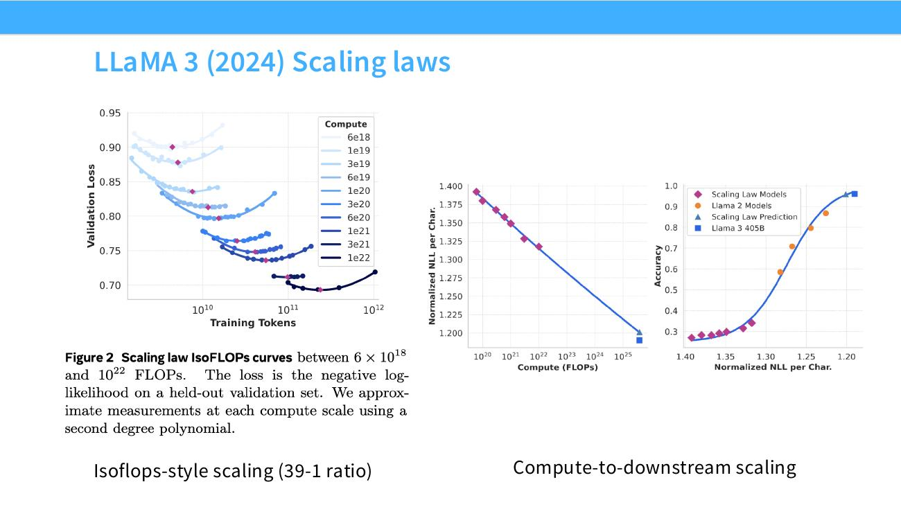

这一页展示 Meta Llama 3 的两层缩放分析。左图（论文 Figure 2）是 $6\times10^{18}$ 到 $10^{22}$ FLOPs 的 IsoFLOP 曲线族：验证集负对数似然对训练 token 数，每个计算规模用二次多项式逼近测量点并取最低点，得到的 token/parameter 比例约 39:1。右两张图展示 Llama 3 的一个方法论创新：不只预测损失，还建立"计算量 → 归一化 NLL → 下游准确率"的两段式映射——先拟合归一化每字符 NLL 随计算量的幂律，再拟合下游任务准确率对 NLL 的 S 形（sigmoid 状）曲线；粉色菱形是缩放律模型，橙色圆点是 Llama 2 系列，蓝色三角形是预测、蓝色方块是实际的 Llama 3 405B。这套"compute-to-downstream"映射承认了 NLL 与下游能力之间并非线性关系，是把缩放律延伸到产品指标的重要尝试。但 S 形曲线也意味着：在 NLL 已经很低（曲线右端饱和区）时，继续降低 NLL 对下游准确率的边际贡献会衰减，这个非线性在制定训练预算时必须计入。

Hunyuan、LLaMA 3 等模型使用了明显高于早期 Chinchilla 经验的 token/parameter 比例，例如课件提到约 96:1 与 39:1。不能仅凭这些数字宣布"Chinchilla 错了"，因为实际目标可能不是只最小化一次预训练的训练 FLOPs：

- 推理成本会长期累计，小模型多训练可能更划算；
- 高质量数据规模和重复策略改变；
- 下游准确率与 NLL 的关系并非处处相同；
- post-training、长上下文与部署约束可能更重视基础模型形状。

换言之，Chinchilla 回答的是一个带特定成本函数的问题。成本函数变化，最优比例自然变化。

### 5.4 架构缩放也是实验对象

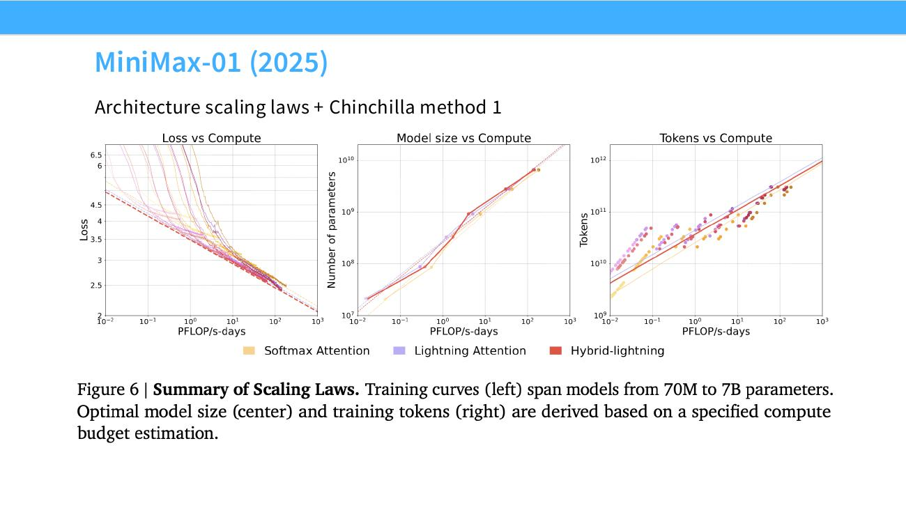

这一页展示 MiniMax-01 把缩放律用于**架构选择**的案例。三张图分别是损失 vs 计算量、最优模型规模 vs 计算量、最优 token 数 vs 计算量（横轴均为 PFLOP/s-days），训练曲线覆盖 70M 到 7B 参数；三种颜色对应三种架构：softmax attention、lightning attention（线性注意力）、以及二者的混合架构 hybrid-lightning。方法上沿用 Chinchilla 方法 1 的下包络分析，但每种架构独立拟合一条前沿，从而可以比较"同一计算预算下哪种架构的损失更低"。这类结果比单纯宽度缩放更难外推，因为架构之间的常数项、内存访问模式和长序列复杂度都不同——线性注意力的优势随序列长度增长，而代理实验的序列长度往往短于目标部署。课件的证据支持其研究设置中的混合方案，但不足以推出"混合注意力在所有数据、长度和硬件上都最好"。

### 5.5 预训练与后训练尚未形成一体化缩放律

课堂问答特别指出：如何把 post-training 纳入同一套计算分配，目前仍缺少成熟统一答案。SFT、偏好优化、RL 或推理时计算会改变最终能力，而且常用指标不再只是基础模型 NLL。因此实践中应分别记录：

- 预训练计算与预训练损失；
- 后训练数据和计算；
- 目标任务指标；
- 推理预算与服务成本。

不要把预训练曲线的精确性延伸成对完整产品能力的精确预测。


这一页是讲者对全讲前半部分的归纳。**DeepSeek recipe**：假设大多数 Transformer 超参数对尺度不变；对批大小/学习率做缩放分析确定其最优缩放；用 IsoFLOP 分析确定模型规模；用分段线性日程降低 Chinchilla 成本。**MiniCPM recipe**：用 μP 使 Transformer 与学习率对尺度不变；用分段线性日程为 Chinchilla 方法 3（曲线拟合）廉价取样。2024 年末以来细节较少的案例：Qwen（学习率/批大小缩放，细节很少）、Kimi K2（MoE 稀疏度缩放）、LLaMA 3 与 Hunyuan（只做 IsoFLOP，无其他缩放细节）、MiniMax（架构选择/决策缩放）。这张对照表的价值在于：它把"该做哪些缩放分析"变成了一份可勾选清单——超参数缩放、模型规模缩放、日程工程、架构决策，每一项都有公开先例可循。

### 本章小结

近期模型共同证明缩放分析有价值，却没有给出统一常数。跨论文比较前必须对齐参数、计算、token 和损失定义；MoE 还要区分总参数与激活参数。训练更久、混合架构和后训练问题都说明"最优"依赖实际成本函数。

## 6. StepFun：把最优超参数看成一张响应面

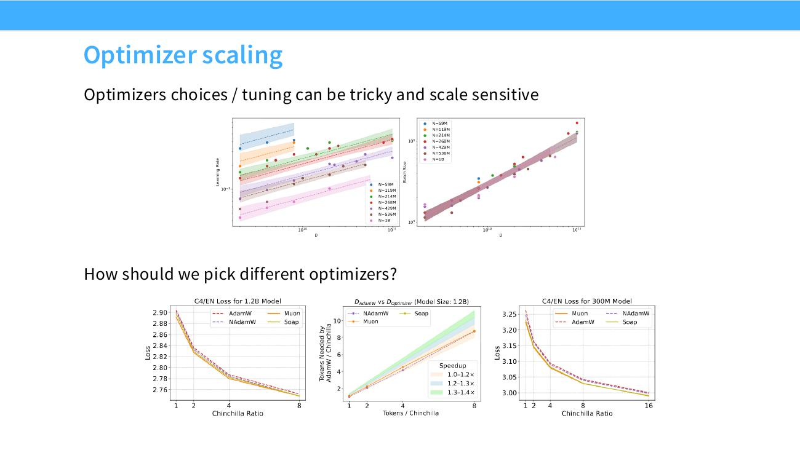

这一页是从"模型/数据缩放"转向"超参数与优化器缩放"的过渡。上方两图再次展示最优学习率与最优批大小随数据量 $D$ 的系统性漂移（不同颜色为不同模型规模 $N$=59M–1B）；下方三图比较不同优化器（AdamW、NAdamW、Muon、Soap）在 1.2B 与 300M 模型上随 Chinchilla 比例变化的损失，以及各优化器相对 AdamW 的 token 加速比。讲者的问题是："How should we pick different optimizers?"——如果优化器的相对优劣本身随尺度变化，那么小模型上的优化器比较结论能否搬到大模型就成了问题。这一页同时预告了 StepFun 的研究动机：与其为每个尺度祈祷超参数不变，不如系统测绘超参数响应面。

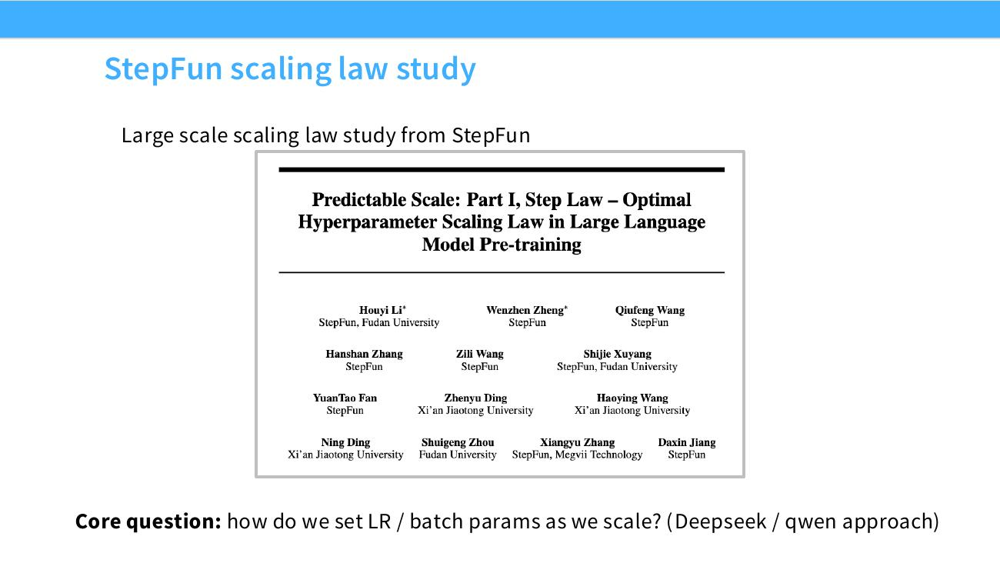

这一页引入 StepFun（阶跃星辰）与复旦等机构的论文《Predictable Scale: Part I, Step Law》。其核心问题用粗体标出：随规模增大，应如何设置学习率与批大小？这本质上是 DeepSeek/Qwen 路线的延续与放大——但 StepFun 做得更系统：更大的网格、显式的响应面建模、对 MoE 与其他数据分布的鲁棒性检验，以及与其他公开缩放律的直接对比。

### 6.1 凸盆地为何有用


这一页的表格汇总了截至该论文的公开超参数缩放律，是罕见的"横向对比"材料：

| 名称 | 学习率 | 批大小 | 相对误差 |
|---|---|---|---|
| OpenAI Law | $3.239\times10^{-3}-1.395\times10^{-4}\log N$ | $2\times10^{18}\mathcal L^{-4.76190}$ | 9.51‰ |
| Microsoft Law | $1.3192\times10^{-5}N^{-0.23}D^{-0.32}$ | — | 9.25‰ |
| DeepSeek Law | $0.3188C^{-0.1250}$ | $0.2920C^{0.3271}$ | 9.26‰ |
| Porian Law | $3.7N^{-0.36}$ | $0.7576N^{0.703}$ | 3.71‰ |
| MiniCPM Law | — | $2\times10^{18}/\mathcal L^{6.24}$ | — |
| MeiTuan Law | $\lambda\mathcal L^{-\alpha}$ | $\lambda_B\mathcal L^{-\alpha_B^{-1}}$ | — |
| Step Law（本文） | $1.79N^{-0.713}D^{0.307}$ | $0.58D^{0.571}$ | **0.94‰** |

表中前两列还标注了各公式是否显式包含数据配方（Data Recipe）与模型稀疏度（Model Sparsity）变量——只有 Step Law 两者都打勾。页面下方归纳了三种建模范式：critical batch（把批大小建模为损失的函数，OpenAI）、compute power law（把超参数建模为计算量的幂律，DeepSeek）、"或者别的什么"。这个对照表同时是警示：各家公式的函数形式、自变量与常数全不同，相对误差却都声称在千分级——这说明它们各自在自己拟合区间内都不错，但彼此之间不能混用。

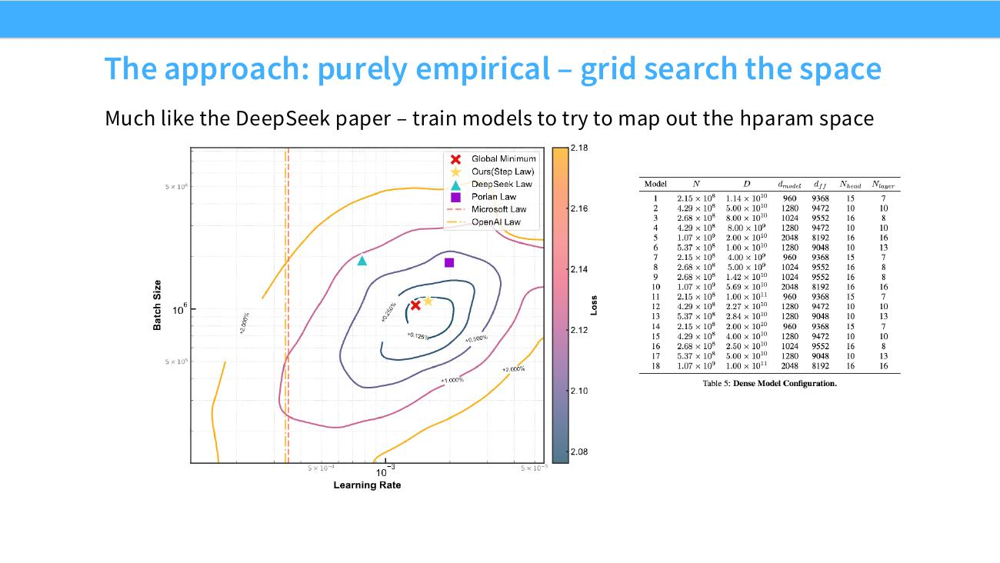

这一页展示 StepFun 的实验设计与一张信息量极大的图。方法上与 DeepSeek 类似：在 18 个稠密模型配置（$N$ 从 $2.15\times10^8$ 到 $1.07\times10^9$，$D$ 从 $10^9$ 到 $10^{11}$，右侧 Table 5 列出各配置的 $d_{model}$、$d_{ff}$、头数与层数）上训练，测绘学习率—批大小空间。左图是某一配置下验证损失的等高线图（横轴学习率、纵轴批大小，均对数刻度）：+0.125%、+0.5%、+1%、+2% 的等损失线围出一个清晰盆地；红色叉号是实测全局最优点，其余符号是各家公开缩放律的预测点——黄色星（Step Law 自身）几乎与红叉重合，而 DeepSeek Law、Porian Law、Microsoft Law、OpenAI Law 的预测点散布在盆地边缘甚至 +2% 之外。这张图是"公式只能当搜索中心"的最好图示：即使是相当不错的公开公式，直接搬到新 recipe 上也可能偏离最优 1% 以上——在千分级较量的损失尺度上，这是不可接受的偏差。

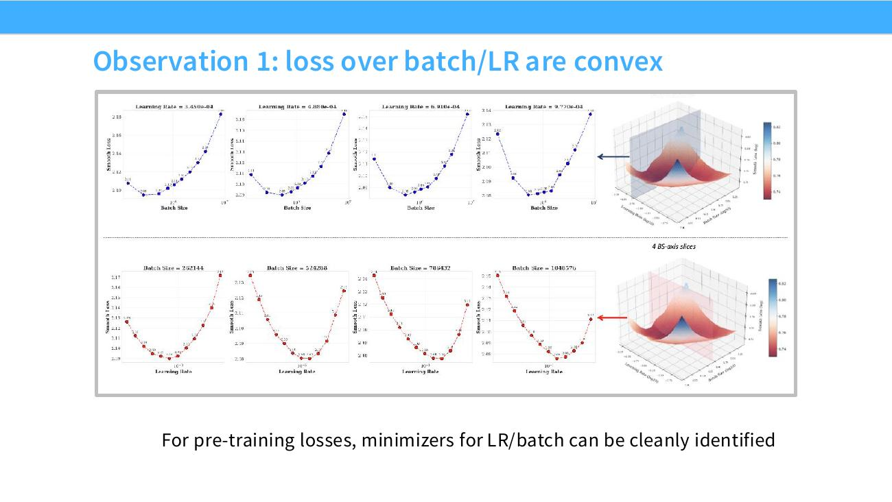

这一页给出 StepFun 的第一个核心观察：预训练损失关于学习率与批大小是（局部）凸的。上方一行固定四个学习率（$3.45\times10^{-4}$ 到 $9.77\times10^{-4}$），画出损失对批大小的四条 U 形曲线；下方一行固定四个批大小（约 $2.6\times10^5$ 到 $10^6$），画出损失对学习率的四条 U 形曲线。每条切片都有清晰可辨的最小点，右侧的三维曲面图把整张响应面画成一个光滑的凸盆。页底结论："For pre-training losses, minimizers for LR/batch can be cleanly identified"。这个观察有两层价值：

1. **优化价值**：凸性意味着可以用较少网格点拟合局部二次面，再补测预测最低点——搜索成本从二维网格降为二维曲面拟合。
2. **风险价值**：可以看出盆地宽度；若不同配置损失几乎相同，应优先选择更稳定或吞吐更高者。

但"局部凸"不等于全局凸，更不保证换优化器或日程后仍保持同一曲面。

StepFun 在多个模型规模和数据量上扫描学习率、批大小。局部结果显示，损失关于 $\log\eta$ 与 $\log B$ 往往形成较平滑的凸状盆地。

### 6.2 StepFun 的经验公式

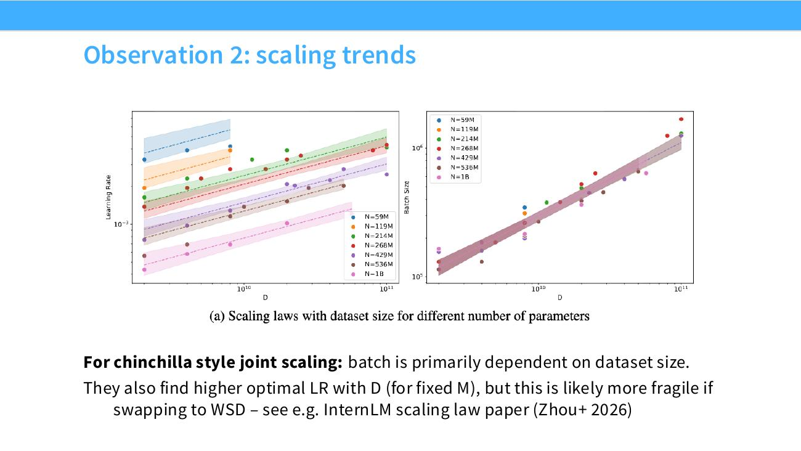

这一页给出第二个观察：最优超参数本身随 $(N,D)$ 幂律漂移。左图是最优学习率对数据量 $D$ 的双对数图，不同颜色对应 59M 到 1B 的模型规模——每条颜色内部学习率随 $D$ 上升，而不同 $N$ 的曲线彼此错开（$N$ 越大学习率越低）；右图是最优批大小对 $D$ 的图，所有颜色的点近似坍缩到同一条直线上——批大小几乎只由数据量决定，对模型规模不敏感。页底给出两条定性结论：批大小主要取决于数据量；固定模型规模时更大的 $D$ 对应更高的最优学习率——但讲者立即补充，后一结论在改用 WSD 日程时可能更脆弱（参见 InternLM 缩放律论文，Zhou et al. 2026），因为"最优学习率"依赖损失比较发生在日程的哪个位置。

课件给出的拟合为

$$\eta_{\mathrm{Step}}=1.79\,N^{-0.713}D^{0.307},\qquad B_{\mathrm{Step}}=0.58\,D^{0.571}.$$

符号说明：

- $\eta_{\mathrm{Step}}$：该实验设定下的最优学习率。
- $B_{\mathrm{Step}}$：该实验设定下的最优批大小。
- $N$：模型规模（non-embedding 参数）。
- $D$：训练 token 数。

这个响应面的结构值得逐项解读。$\eta_{\mathrm{Step}}$ 中 $N$ 的指数为 $-0.713$：模型越大学习率越低，且下降相当快——这与直觉和 μP 的 $1/n$ 规则方向一致（第 9 节会推导隐藏层 Adam 学习率按 $1/n$ 缩放）；$D$ 的指数为 $+0.307$：固定 $N$ 时，训练更久对应更高学习率。后一个方向看似反直觉，但有一个合理解释：在固定日程形状（如固定衰减比例）下，更长的训练意味着同样的"学习率预算"被摊到更多步上，早期可以用更大的步长换取进展，后期衰减兜底；它提醒我们，"学习率最优值"是与日程耦合定义的，脱离日程谈 $\eta_{\mathrm{opt}}(D)$ 没有意义。$B_{\mathrm{Step}}$ 不含 $N$，与 slide-036 右图的坍缩现象一致；$D^{0.571}$ 的亚线性指数意味着数据量翻倍，最优批大小增大约 $2^{0.571}\approx1.49$ 倍。

拟合方法上，这类响应面通常在对数空间做线性回归：对 $\log\eta$ 关于 $\log N$、$\log D$ 回归，$R^2$ 与相对误差（Step Law 报告 0.94‰）在拟合区间内评估。第 7 节会讨论为什么区间内的高 $R^2$ 不足以保证外推。

### 6.3 不同文献公式不能只比指数

课件还列出类似

$$B_{\mathrm{OpenAI}}\propto L^{-4.76190},
\qquad
B_{\mathrm{MiniCPM}}\propto L^{-6.24}$$

的关系。即使形式相似，也不能直接说哪个指数更正确，因为 $L$ 的定义、归一化、tokenizer、模型族和批大小单位都可能不同。比较前至少需要统一：

- 损失是自然对数、bits-per-token 还是 bits-per-byte；
- batch 是序列数、token 数还是全局 batch；
- 梯度累积和数据并行是否计入；
- 测量发生在训练中途还是完成衰减之后。

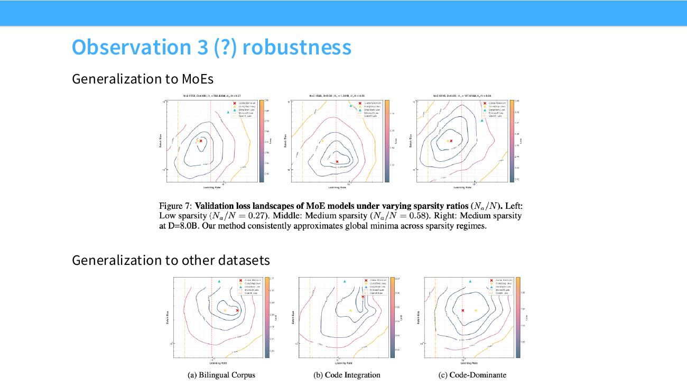

这一页展示 StepFun 对其响应面公式的两类鲁棒性检验，讲者在标题中特意加了 "(?)"，表示证据强度弱于前两个观察。上半部分是对 MoE 的推广：三个稀疏度水平（$N_a/N=0.27$ 低稀疏、$0.58$ 中稀疏、以及 $D=8$B 处的另一中稀疏配置）下的验证损失等高线图，Step Law 的预测点（黄星）在各稀疏度下都持续逼近实测全局最优点（红叉），而其他公开公式的预测偏离更远。下半部分是对数据分布的推广：双语语料、代码混入、代码主导三种数据配方下的等高线，预测点大体仍落在盆地内。需要注意：这些检验的自变量（稀疏度、数据配方）已经超出了拟合时使用的稠密模型与单一数据分布，属于外推性质的证据，因此讲者保持存疑态度；但这正是正确示范——公式的鲁棒性边界应当靠这样的受控扰动实验逐步测绘，而不是靠假设。

### 6.4 预算有限时怎么用

如果训练规模不大，且目标 recipe 与论文高度相似，现成公式可以作为默认值中心；但应在中心周围至少测几个倍数。例如对预测学习率 $\hat\eta$，测试 $\hat\eta/2,\hat\eta,2\hat\eta$，并对批大小做相邻档位测试。若目标训练极其昂贵，则不能因为公式来自"大论文"就省掉本地验证。

讲者把这种迁移判断概括为：公式表面上很科学，但决定"相似到什么程度"仍包含大量经验。这不是否定缩放律，而是要求把经验判断写进实验记录。

### 本章小结

StepFun 展示了学习率—批大小损失面的局部平滑性，并拟合了 $\eta(N,D)$ 与 $B(D)$。这些公式适合作为搜索中心，不适合作为无需验证的答案。损失单位、batch 定义、日程和优化器不一致时，跨论文常数不可直接搬用。

## 7. 漂亮的拟合为什么仍会在大尺度失败

### 7.1 优化器比较必须公平调参

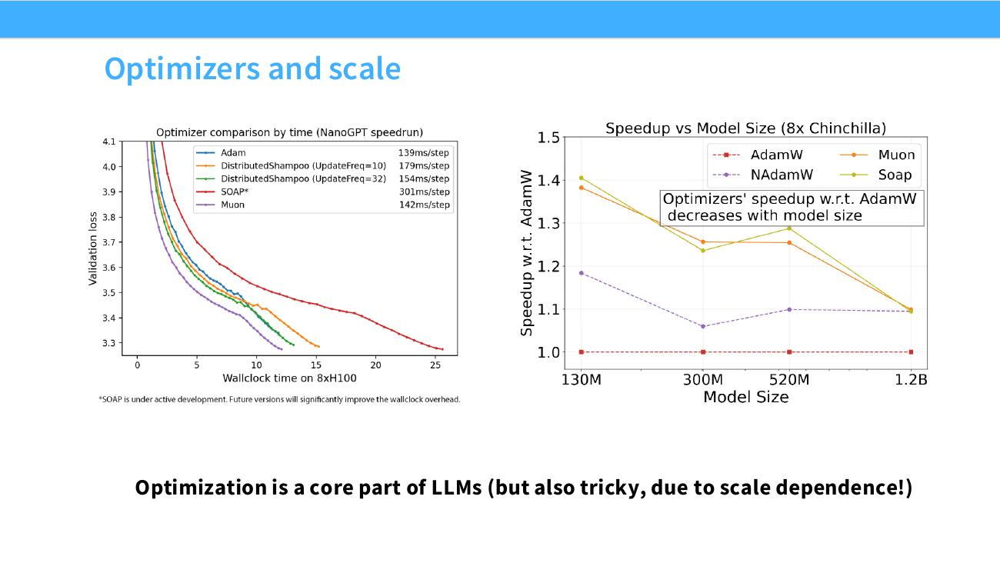

这一页汇总了优化器比较的两类典型证据。左图是 NanoGPT speedrun：在 8×H100 上以墙钟时间为横轴比较 Adam、DistributedShampoo（两种更新频率）、SOAP 与 Muon 的验证损失下降，每条曲线标注了每步耗时（Adam 139ms、Muon 142ms、SOAP 301ms/step）。中图是跨尺度研究：Muon、NAdamW、Soap 相对 AdamW 的加速比随模型尺寸（130M→1.2B）的系统变化。页底结论是本节的基调：优化是大语言模型的核心组成部分，但由于尺度依赖而非常棘手。注意左图还揭示了比较口径问题：SOAP 每步比 Adam 贵一倍以上，"更快达到某损失"必须在墙钟、FLOPs、token 三种口径下分别检验，结论可能完全不同。

比较 AdamW、Lion、Muon、SOAP 等优化器时，若所有方法共用同一学习率和权重衰减，结果往往只说明"哪一个更接近这组默认值"。

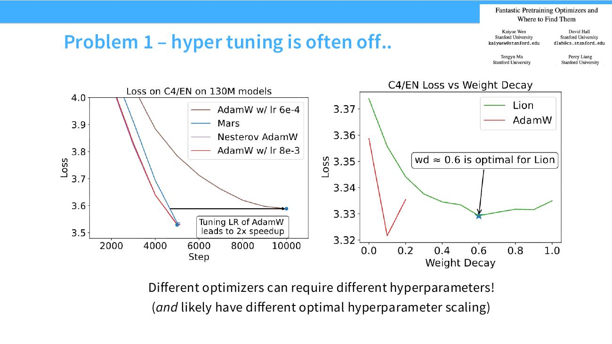

这一页引用斯坦福大学者的《Fantastic Pretraining Optimizers and Where to Find Them》，给出"不公平比较"的两个具体例子。左图：130M 模型上 AdamW 用 lr $=6\times10^{-4}$ 与调优后的 lr $=8\times10^{-3}$ 相比，达到同一损失所需步数相差约 2 倍——仅 AdamW 内部的学习率调优就能带来 2× 加速，若拿未调优的 AdamW 作基线，任何新优化器的"加速"都可能只是基线调参不足。右图：C4/EN 损失对权重衰减的扫描显示，Lion 的最优权重衰减约为 0.6，远离 AdamW 常用的默认值（0.1 左右）；若给 Lion 套用 AdamW 的默认衰减，等于让 Lion 带着镣铐比赛。页底结论：不同优化器需要不同的超参数（并且很可能有不同的最优超参数缩放规律）。公平比较还要统一计算量、模型规模和 token/parameter 比例：一个优化器在相同 step 数下更快下降，可能只是每步计算更贵。

课件中的示例指出：

- AdamW 的有效学习率可能从 $6\times10^{-4}$ 到 $8\times10^{-3}$ 相差很大；
- Lion 的合适权重衰减可能约为 $0.6$，远离常见 AdamW 默认值；
- 学习率与权重衰减应至少做局部联合或分阶段扫描。

### 7.2 拟合区间内漂亮，外推仍可能恶化或发散

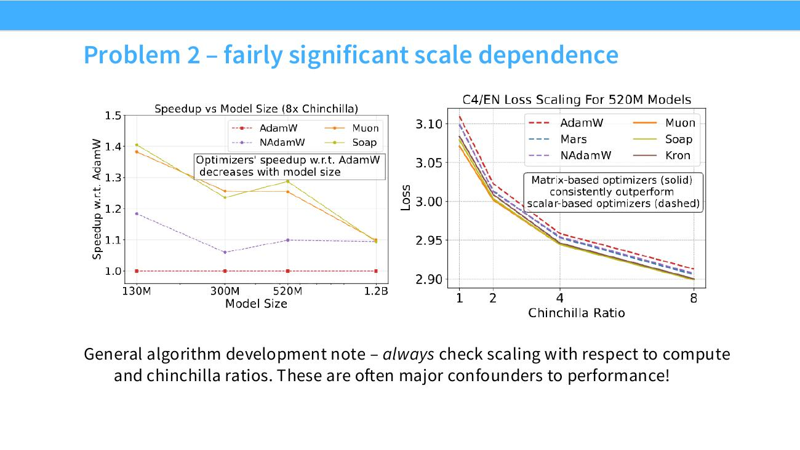

这一页给出优化器结论随尺度漂移的直接证据。左图：相对 AdamW 的加速比随模型尺寸从 130M 增至 1.2B 时，Muon 与 Soap 的加速比从约 1.4× 衰减到约 1.1×，NAdamW 更是从 1.18× 降到接近 1.0×——小模型上的优化器优势不是常数，而可能随尺度收窄。右图：520M 模型上矩阵类优化器（Muon、Soap、Kron，实线）随 Chinchilla 比例增大持续优于标量类优化器（AdamW、Mars、NAdamW，虚线）——这说明"矩阵类 vs 标量类"的区分比具体算法名字更稳定。页底给出一条一般性的算法开发准则：检验任何优化器结论时，必须对照计算量与 Chinchilla 比例做缩放检查，这两者经常是性能比较中最大的混淆变量。

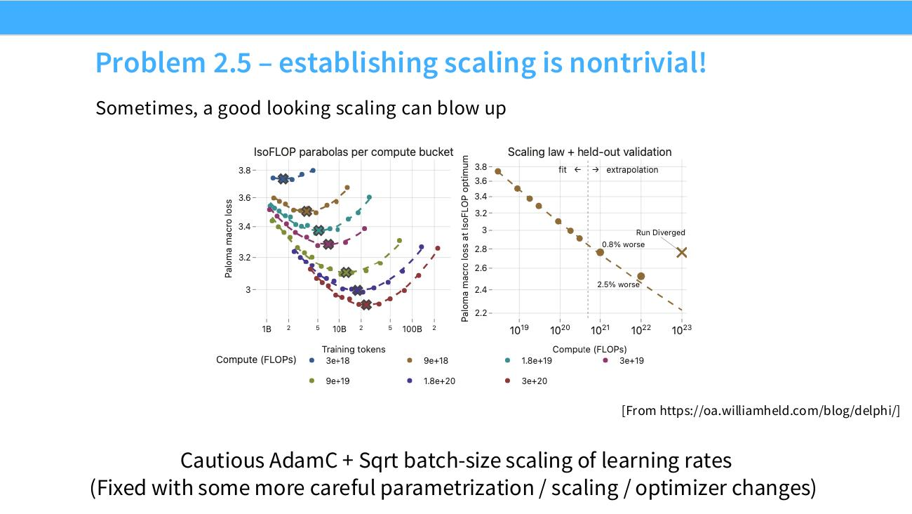

这一页是整讲最重要的反例，取自 Delphi 项目的公开复盘。左图：七个计算桶（$3\times10^{18}$ 到 $3\times10^{20}$ FLOPs）各自的 IsoFLOP 抛物线，形状规则、最低点清晰——拟合区间内一切完美。右图：把各桶最低点连成缩放律并做留出验证，虚线左侧是拟合区、右侧是外推区；前两个留出点分别比预测恶化 0.8% 与 2.5%，第三个更大的运行直接发散（Run Diverged）。也就是说：区间内 $R^2$ 极高的幂律，在不到一个数量级的外推距离内就从"略差"恶化到"完全失效"。页底给出修复方案：Cautious AdamC（cautious 掩码风格的 Adam 变体）+ 学习率按批大小平方根缩放 + 更谨慎的参数化。关键教训不是记住这套补丁，而是把"训练稳定性"列为缩放实验的一等指标——一个会发散的 recipe，其"最优损失"毫无意义。

为什么区间内的幂律拟合不能担保外推？这里值得把诊断逻辑写清楚。幂律 $L(C)=aC^{-b}$ 在对数坐标下是直线，但任何光滑曲线在小窗口内都近似直线——幂律族只是"局部线性"的便捷参数化，并不携带关于机制的信息。对数坐标的另一个隐蔽特性是压缩残差：区间内 0.5% 的损失偏差在双对数图上几乎不可见，$R^2$ 依然接近 1；而外推时同样的相对偏差会沿直线延伸被放大成显著的绝对差距。更根本的是，外推改变了数据的生成条件：更大的模型可能激活初始化、残差缩放、数值精度、通信方式等在小区内无关紧要的因素，使"条件规律"的条件本身不再成立。因此外推可靠性不能从拟合优度推出，只能从未参与拟合的留出点实测——这正是 DeepSeek 的 7B/67B 星点（slide-024）与本页发散叉号之间的全部差别。

可能原因包括：

- 初始化或残差分支随宽度改变，激活尺度漂移；
- 学习率没有按批大小或宽度缩放；
- AdamW 中权重衰减的有效强度随学习率改变；
- 数值精度、梯度裁剪或通信方式在大尺度发生变化；
- 目标点已经超出拟合区间太远。

### 7.3 一个更稳健的失效诊断表

当大模型偏离预测时，可按顺序排查：

1. **先看是否数值发散**：loss spike、NaN、梯度范数、激活 RMS。
2. **再看是否优化不足**：训练损失和验证损失是否都比预测高。
3. **检查定义漂移**：计算量、参数量、token 数是否与拟合时同口径。
4. **检查 recipe 漂移**：数据、序列长度、注意力、归一化、精度是否改变。
5. **在当前尺度做局部 $\eta,B,\lambda$ 扫描**：区分公式失效和实现错误。
6. **更新模型但保留旧留出点**：不要不断把失败点吸收进拟合后声称预测成功。

其中 $\lambda$ 表示权重衰减系数。

> [!WARNING]
> 外推失败最常见的处理方式是把失败点加入拟合集重新拟合，然后宣布"模型已更新、预测恢复准确"。这摧毁了留出机制的全部意义：一旦所有失败都被吸收，就再也没有任何证据能反驳这条缩放律。正确做法是保留旧留出点作为永久判据，新拟合必须同时对旧留出点保持准确。

### 本章小结

拟合优美不等于外推可靠。优化器必须分别调参，训练稳定性必须与最终损失一起建模。外推失败时应先区分数值发散、优化不足和定义/recipe 漂移，并保留真正的留出点。

## 8. Muon：它“能在大规模工作”不等于“已证明更优”

### 8.1 Muon 更新的核心

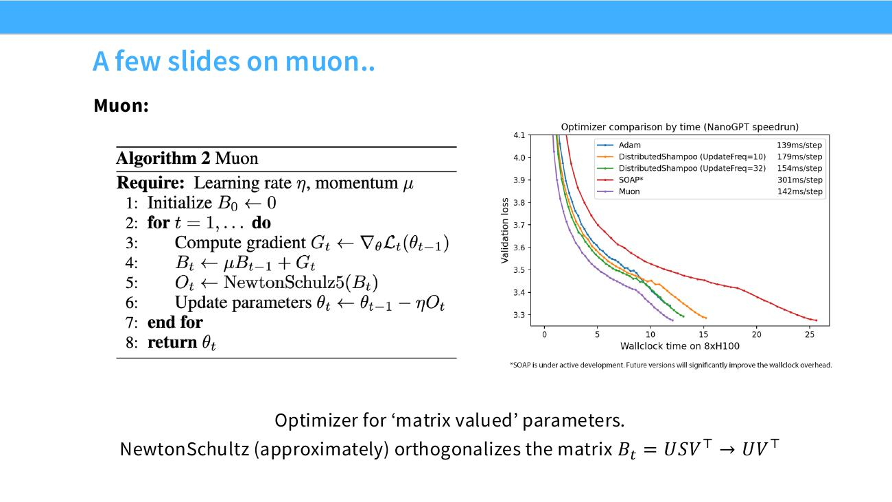

这一页给出 Muon 的完整算法。它是面向"矩阵值参数"的优化器：对动量缓冲 $B_t$ 做 Newton–Schulz 迭代，近似地把矩阵正交化——若 $B_t=USV^\top$，则输出近似 $UV^\top$——再以此方向更新参数。右侧仍是 NanoGPT speedrun 的对比曲线，Muom 以接近 Adam 的每步耗时（142ms vs 139ms）达到更快的墙钟下降。

课件用以下简化形式描述 Muon：

$$G_t=\nabla_{\theta}\mathcal{L}_t(\theta_{t-1}),\qquad
B_t=\mu B_{t-1}+G_t,\qquad
O_t=\operatorname{NewtonSchulz5}(B_t),\qquad
\theta_t=\theta_{t-1}-\eta O_t.$$

符号说明：

- $G_t$：第 $t$ 步梯度。
- $B_t$：带动量的梯度矩阵。
- $\mu$：动量系数。
- $O_t$：对 $B_t$ 进行近似正交化后的更新方向。
- $\eta$：学习率。

现在把 Newton–Schulz 迭代写清楚。对矩阵 $X$，目标是用只含矩阵乘法的迭代逼近 $UV^\top$（即 $X$ 的"正交极因子"）。Muon 使用的五步迭代（NewtonSchulz5）具有如下形式：先把 $X$ 按谱范数归一化 $X_0=X/\|X\|$（保证初始奇异值落在收敛区间内），然后迭代

$$X_{k+1}=aX_k+b\,(X_kX_k^\top)X_k+c\,(X_kX_k^\top)^2X_k,$$

其中系数取 $(a,b,c)=(3.4445,-4.7750,2.0315)$（ quintic 版本的经验系数）。为了理解它为什么有效，在奇异值分解坐标下看：若 $X_k=U\,\mathrm{diag}(\sigma_i^{(k)})\,V^\top$，则

$$X_{k+1}=U\,\mathrm{diag}\!\big(a\sigma_i^{(k)}+b\,\sigma_i^{(k)\,3}+c\,\sigma_i^{(k)\,5}\big)\,V^\top,$$

即迭代等价于对每个奇异值独立施加标量多项式 $\phi(\sigma)=a\sigma+b\sigma^3+c\sigma^5$。系数被选取为使 $\phi$ 在 $(0,1)$ 内把奇异值向 $1$ 推挤：$\phi(\sigma)>\sigma$（小奇异值被放大）、$\phi(1)=1$（不动点）、且迭代收缩到半正定收敛域。五步之后，所有奇异值都被压到 1 附近，输出近似 $UV^\top$。

几何上，这相当于**丢弃更新矩阵的奇异值谱，只保留其奇异向量所张的方向**：各奇异方向被等权重对待，更新在谱范数意义下受控（$\|O_t\|_{\mathrm{op}}\approx1$）。与 Adam 的差异是本质性的：Adam 的归一化是**逐坐标**的（$m_{ij}/\sqrt{v_{ij}}$），它把每个矩阵元素的更新幅度拉齐，但不关心矩阵作为线性算子的整体结构；Muon 的归一化是**谱意义**的，它拉齐的是各奇异方向。一个直观对比：若梯度是秩一矩阵 $\delta x^\top$，Adam 会把它逐元素拉平成一个近似均匀的满秩更新，破坏秩一结构；Muon 正交化后仍近似保持原方向结构（秩一矩阵正交化后仍是同一方向），只把幅值归一。显式 SVD 在 GPU 上代价高且不易并行，Newton–Schulz 只由矩阵乘法组成，非常适合加速器。Muon 通常只用于二维权重矩阵；偏置、归一化增益等向量参数仍由 AdamW 处理。

下面是一个最小可运行的 Newton–Schulz 实现，可用于亲手验证奇异值向 1 收缩的过程：

```python
import torch

def newton_schulz5(X: torch.Tensor, steps: int = 5) -> torch.Tensor:
    """Muon 的 quintic Newton–Schulz 迭代：把 X 的奇异值推向 1。"""
    a, b, c = 3.4445, -4.7750, 2.0315
    # 按谱范数（用 Frobenius 范数上界近似亦可）归一化，保证收敛域
    X = X / (X.norm() + 1e-7)
    for _ in range(steps):
        A = X @ X.T          # 只需矩阵乘法，GPU 友好
        B = b * A + c * (A @ A)
        X = a * X + B @ X
    return X

# 数值验证：构造奇异值差异悬殊的矩阵
torch.manual_seed(0)
U, _ = torch.linalg.qr(torch.randn(64, 64))
V, _ = torch.linalg.qr(torch.randn(64, 64))
X = U @ torch.diag(torch.logspace(-2, 0, 64)) @ V.T   # 奇异值 0.01 ~ 1
O = newton_schulz5(X)
s_before = torch.linalg.svdvals(X)
s_after = torch.linalg.svdvals(O)
print(s_before[:3], s_before[-3:])   # 约 [1, 0.79, 0.63] ... [0.014, 0.011, 0.010]
print(s_after.min(), s_after.max())  # 迭代后最小/最大奇异值都接近 1
```

### 8.2 三类证据的强弱

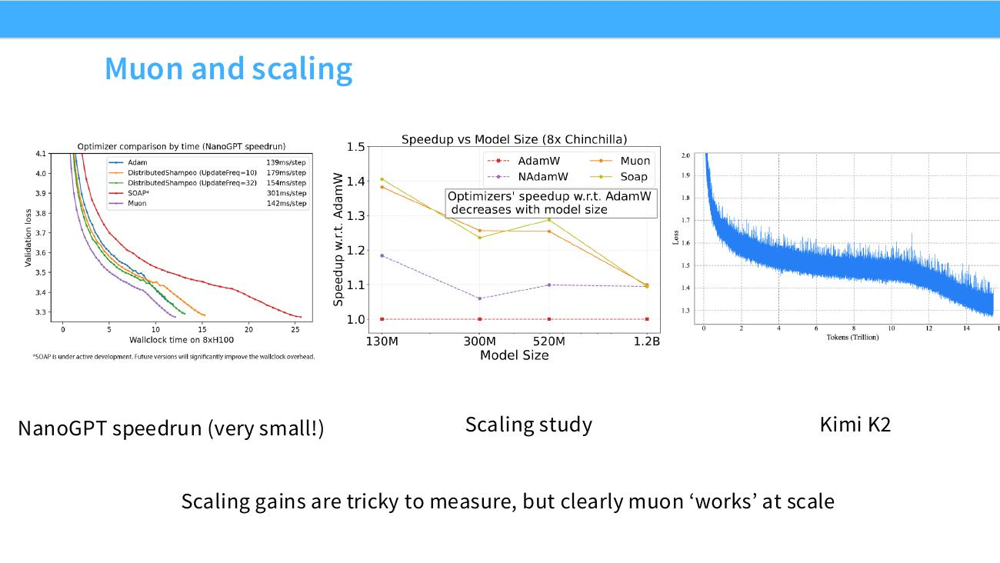

这一页把 Muon 的三类公开证据并排摆放，并给出课件的总评："Scaling gains are tricky to measure, but clearly muon 'works' at scale"。左：NanoGPT speedrun，规模极小，证明在特定实现与硬件上 Muon 能更快达到给定损失；中：跨尺度缩放研究，显示相对 AdamW 的加速比随模型增大而收窄（130M 约 1.4×，1.2B 约 1.1×）；右：Kimi K2 的训练曲线（纵轴损失、横轴 0–15 万亿 tokens），证明 Muon 可以在万亿级 token 的真实大训练中稳定工作。

三类证据不能混为一谈：

- **小型 speedrun**：说明在特定实现与硬件上可能更快达到某损失，但规模太小。
- **跨尺度研究**：显示相对 AdamW 的加速随模型变大可能缩小，说明收益不是常数。
- **Kimi K2 大规模训练**：有力证明 Muon 可以在大规模稳定"工作"，但若缺少同预算 AdamW 消融，不能据此精确断言提升多少。

因此最稳妥结论是：Muon 已具备大规模可行性，但其相对优势仍需公平、同预算、同等调参的比较。把"能在 Kimi K2 规模跑完训练且损失正常"读成"在 Kimi K2 规模优于 AdamW x%"，是把可行性证据误读为优越性证据。

> [!NOTE]
> 判断优化器证据强弱的一个实用顺序：同 FLOPs 同 token 的受控消融 > 同墙钟的受控消融 > 不同调参水平的小规模对比 > 单一成功的大训练案例。Muon 目前公开证据覆盖前三类的若干组合，但"大模型上同预算、双方充分调参"的直接消融仍然稀缺。

### 8.3 实际联合调参顺序

课堂问答给出很实用的策略：先联合搜索学习率和批大小，再在最优区域附近扫描权重衰减。原因是学习率与批大小的交互通常最强，而把每层学习率、每层优化器都加入搜索会导致组合爆炸。

推荐顺序：

1. 固定权重衰减到合理起点，粗扫 $(\eta,B)$。
2. 在稳定盆地补细网格。
3. 固定候选 $(\eta,B)$，局部扫权重衰减。
4. 若模型变宽，再检查参数化是否要求分层学习率。
5. 比较相同 FLOPs、token 与墙钟下的结果。

### 本章小结

Muon 通过近似正交化矩阵更新来控制谱方向，Newton–Schulz 迭代避免昂贵显式 SVD。现有案例证明它能扩展到大训练，但"小模型更快"和"大模型相对 AdamW 更优"仍是不同命题，必须公平调参与同预算比较。

## 9. μP 的出发点：跨宽度保持激活与特征学习

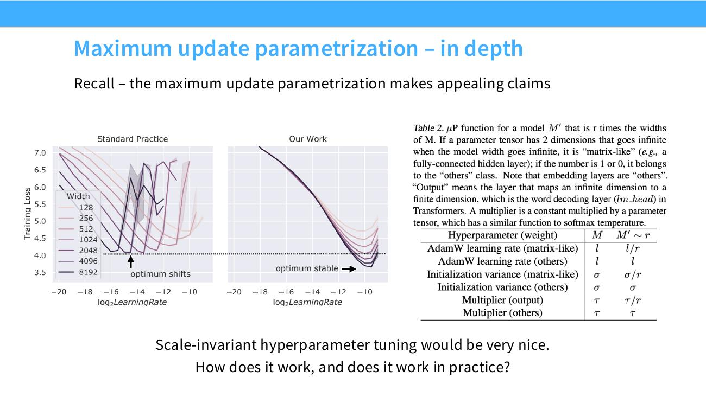

这一页正式开启 μP 部分。左侧两张图是 μP 原论文（Yang et al.）最著名的对照：Standard Practice 下，宽度 128 到 8192 的模型的"训练损失 vs $\log_2$ 学习率"曲线各自的最优点随宽度明显移动（optimum shifts）；而 μP（Our Work）下，各宽度曲线的最优点几乎重合（optimum stable）。右侧是论文 Table 2 的核心规则：把参数分为 matrix-like（两个维度都随宽度趋于无穷，如全连接隐藏层）与 others（如 embedding、向量参数），对宽度放大 $r$ 倍的模型 $M'$，matrix-like 参数的 AdamW 学习率缩放为 $l/r$、初始化方差缩放为 $\sigma/r$，output（映射到有限维的层，如 lm_head）的 multiplier 缩放为 $\tau/r$，其余保持不变。页底两个问题——"它是怎么工作的？在实践中真的有效吗？"——正是本节与下一节的任务。

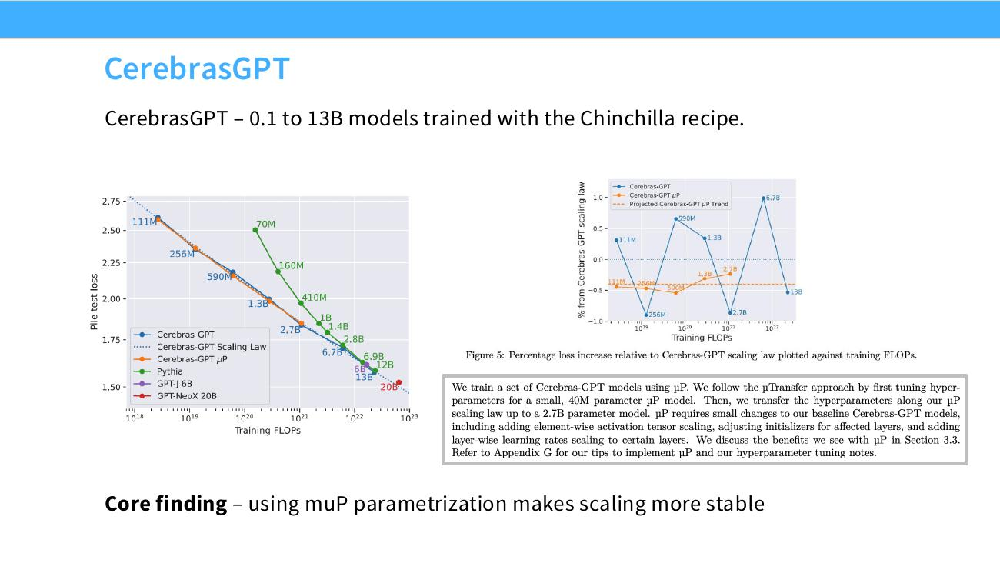

这一页给出 μP 的一个独立生产级验证。CerebrasGPT 按 Chinchilla recipe 训练了 0.1B 到 13B 的模型族；左图显示 baseline CerebrasGPT 的各尺度损失相对缩放律有明显偏离（锯齿状），而采用 μP 的 CerebrasGPT-μP（橙色）紧密贴合幂律趋势。右侧引用其方法：先在 40M 的 μP 小模型上调好超参数，再沿 μP 缩放律直接迁移到 2.7B；实现上需要逐元素激活缩放、调整受影响层的初始化、以及分层学习率。页底结论："using muP parametrization makes scaling more stable"——μP 不仅迁移超参数，还使损失—计算量曲线本身更贴合幂律，因为每个尺度都工作在接近各自最优的点上，消除了"超参数失调"这个噪声源。

### 阅读 9.1 前：四个尺度工具和一个等宽玩具网络

μP 的推导反复问"宽度 $n$ 增大时，一个量会怎样变"。先约定两种渐近记号：

$$f(n)=O(g(n))$$

表示存在与 $n$ 无关的常数 $c,n_0$，使得 $n\ge n_0$ 时
$|f(n)|\le c|g(n)|$。这是**上界**：$f$ 至多按 $g$ 的量级增长。

$$f(n)=\Theta(g(n))$$

表示同时存在与 $n$ 无关的正数 $c_1,c_2,n_0$，使得
$c_1|g(n)|\le |f(n)|\le c_2|g(n)|$。这是**同阶**：既不会比 $g$ 快很多，也不会比 $g$ 小到消失。于是 $O(1)$ 只表示有界，$\Theta(1)$ 则表示保持非退化的常数量级；A1、A2 要的是后者。

对向量 $x=(x_1,\ldots,x_n)$，均方根和二范数的关系是

$$\operatorname{RMS}(x)
=\sqrt{\frac{1}{n}\sum_{i=1}^{n}x_i^2}
=\frac{\|x\|_2}{\sqrt n}.$$

因此"每个坐标的典型尺度为 $\Theta(1)$"更严谨地说是
$\operatorname{RMS}(x)=\Theta(1)$，它等价于
$\|x\|_2=\Theta(\sqrt n)$。二范数只概括整条向量的能量；若少数坐标异常大，仅凭二范数不能保证每个坐标都稳定。

对矩阵 $W$，本讲课件中的 $\|W\|_*$ 指算子范数，也就是谱范数：

$$\|W\|_{\mathrm{op}}
=\sup_{x\ne0}\frac{\|Wx\|_2}{\|x\|_2}
=s_{\max}(W).$$

这里 $s_{\max}$ 是最大奇异值。为避免与一些文献用
$\|\cdot\|_*$ 表示"核范数"混淆，本讲义下文把它记作
$\|\cdot\|_{\mathrm{op}}$。它回答的是：矩阵在最容易被放大的输入方向上，最多能把二范数放大多少倍。

一个最简单的高斯方差例子可以连接"坐标尺度"和"初始化"。设
$x_j$ 独立、均值为零、方差为 1，并令

$$W_{ij}\overset{\mathrm{iid}}{\sim}\mathcal N(0,1/n),
\qquad
y_i=\sum_{j=1}^{n}W_{ij}x_j.$$

在独立性假设下，

$$\operatorname{Var}(y_i)
=\sum_{j=1}^{n}\operatorname{Var}(W_{ij}x_j)
=n\cdot\frac1n\cdot1
=1.$$

也就是说，权重标准差取 $1/\sqrt n$ 时，输入有 $n$ 个
$\Theta(1)$ 坐标，输出的每个坐标仍为 $\Theta(1)$，整条输出向量的二范数则为 $\Theta(\sqrt n)$。这里依靠的是零均值、近似独立时方差相加；若各项强相关，就不能照搬"平方根抵消"——$n$ 个同号同量级项的和是 $\Theta(n)$ 而非 $\Theta(\sqrt n)$，这个区别在第 10 节 attention 缩放的讨论中会再次成为关键。

后面用一个等宽两层线性网络贯穿 A1 与 A2：

$$x\in\mathbb R^n,\qquad
h=W_1x\in\mathbb R^n,\qquad
y=W_2h\in\mathbb R^n,$$

$$W_1,W_2\in\mathbb R^{n\times n},
\qquad
(W_l)_{ij}\sim\mathcal N(0,1/n).$$

若 $\operatorname{RMS}(x)=\Theta(1)$，上面的方差计算预言
$\operatorname{RMS}(h),\operatorname{RMS}(y)=\Theta(1)$：这就是 A1 的等宽版本。A2 接着问：完成一步优化后，
$\operatorname{RMS}(\Delta h)$ 和
$\operatorname{RMS}(\Delta y)$ 能否也保持 $\Theta(1)$，既不随 $n$ 消失，也不随 $n$ 爆炸。

### 9.1 μP 想解决什么

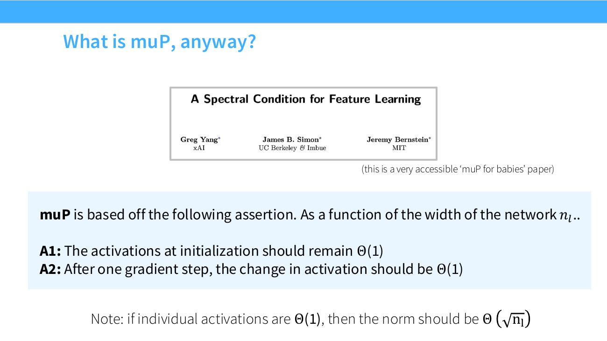

这一页给出 μP 的理论入口。讲者推荐的是 Yang、Simon、Bernstein 的《A Spectral Condition for Feature Learning》——一篇被戏称为"muP for babies"的易读论文。μP 的全部推导建立在如下断言上：作为网络宽度 $n_l$ 的函数，

- **A1：初始化时各层激活坐标保持 $\Theta(1)$**；
- **A2：一步梯度更新后，激活坐标的改变量也是 $\Theta(1)$**。

页底的注记把坐标语言翻译成范数语言：若各坐标为 $\Theta(1)$，则向量范数为 $\Theta(\sqrt{n_l})$。

标准参数化下，扩大网络宽度后最优学习率常发生漂移。μP（maximal update parametrization）的目标，是选择随宽度变化的初始化与学习率规则，使小模型调出的超参数更容易迁移。为什么偏偏是 A1、A2 这两条？A1 是"前向不爆炸、不消失"的基本要求；A2 才是"特征学习"条件：宽度趋于无穷时，网络不能因为更新太小而冻结在初始化附近。若激活变化趋于零，模型接近 NTK/lazy training 极限——理论上，宽度无穷的核极限下特征不动、只有输出层在学习，这恰恰丢掉了深度网络相对核方法的核心优势；若变化爆炸，则训练不稳定。"maximal update"的名字由此而来：μP 选择的是在不破坏稳定性的前提下**尽可能大**（$\Theta(1)$，即不随宽度消失）的特征更新尺度。

### 9.2 从 A1 推导初始化尺度

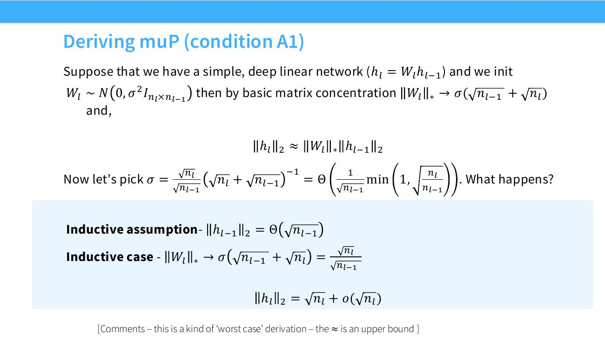

这一页是 A1 的形式推导。设深线性网络 $h_l=W_lh_{l-1}$，初始化 $W_l\sim\mathcal N(0,\sigma^2 I_{n_l\times n_{l-1}})$。由基本的矩阵集中不等式，随机高斯矩阵的谱范数趋于

$$\|W_l\|_{\mathrm{op}}\to\sigma\left(\sqrt{n_{l-1}}+\sqrt{n_l}\right),$$

并用谱范数界估计

$$\|h_l\|_2\approx\|W_l\|_{\mathrm{op}}\,\|h_{l-1}\|_2.$$

现在做归纳：假设 $\|h_{l-1}\|_2=\Theta(\sqrt{n_{l-1}})$（归纳假设），若取

$$\sigma=\frac{\sqrt{n_l}}{\sqrt{n_{l-1}}\left(\sqrt{n_l}+\sqrt{n_{l-1}}\right)}
=\Theta\!\left[\frac{1}{\sqrt{n_{l-1}}}
\min\!\left(1,\sqrt{\frac{n_l}{n_{l-1}}}\right)\right],$$

则

$$\|W_l\|_{\mathrm{op}}\to\sigma\left(\sqrt{n_{l-1}}+\sqrt{n_l}\right)
=\frac{\sqrt{n_l}}{\sqrt{n_{l-1}}},$$

从而

$$\|h_l\|_2=\sqrt{n_l}+o(\sqrt{n_l})=\Theta(\sqrt{n_l}),$$

归纳成立。页底的注释很重要：这是一种"最坏情况"推导——$\approx$ 处实际是谱范数给出的上界；随机输入一般不会激活最大奇异方向，因此真实激活通常低于此界。它适合建立宽度阶数直觉，不能替代具体架构中的完整 μP 规则。

符号说明：

- $h_l$：第 $l$ 层激活向量。
- $W_l$：从 $n_{l-1}$ 到 $n_l$ 的权重矩阵。
- $\sigma_l$：单个权重元素的初始化标准差。
- $n_{l-1},n_l$：输入和输出宽度。

把这个结果与常见初始化对照：当 $n_l\ge n_{l-1}$（fan-out 不小于 fan-in），$\min$ 取 1，$\sigma=\Theta(1/\sqrt{n_{l-1}})$，正是 Xavier/He 风格的 $1/\sqrt{\text{fan-in}}$；当 $n_l<n_{l-1}$（收缩层），$\min$ 取 $\sqrt{n_l/n_{l-1}}$，$\sigma$ 取得更小——μP 的初始化与标准实践的差异只出现在 fan-out < fan-in 的层（如输出头前的收缩）。

### 9.3 从 A2 推导更新尺度


这一页开始 A2 的推导。对 SGD，线性层的梯度是损失对该层激活的梯度与下层激活的外积（rank-one loss-activation outer product）：

$$\Delta W_l=-\eta_l\nabla_{h_l}\ell\;h_{l-1}^{\top}.$$

于是 $\|\Delta W_lh_{l-1}\|_2=\|\Delta W_l\|_{\mathrm{op}}\,\|h_{l-1}\|_2$（秩一矩阵的谱范数恰为两因子范数之积）。一步更新后第 $l$ 层激活的变化展开为

$$\Delta h_l=W_l\Delta h_{l-1}+\Delta W_l(h_{l-1}+\Delta h_{l-1}).$$

在主导项不精确抵消的假设下逐项估计：

- $W_l\Delta h_{l-1}=\Theta(\sqrt{n_l})$：来自归纳假设与 A1 的谱论证；
- $\Delta W_lh_{l-1}=\|\Delta W_l\|_{\mathrm{op}}\sqrt{n_{l-1}}$：由上式，因此要求 $\|\Delta W_l\|_{\mathrm{op}}=\Theta\!\left(\sqrt{n_l}/\sqrt{n_{l-1}}\right)$；
- $\Delta W_l\Delta h_{l-1}=O\!\left(\|\Delta W_l\|_{\mathrm{op}}\sqrt{n_{l-1}}\right)$：同阶或更低。

也就是说，为了让 $\Delta h_l$ 与 $h_l$ 同为非退化尺度（坐标 $\Theta(1)$、范数 $\Theta(\sqrt{n_l})$），权重更新的谱范数必须满足

$$\|\Delta W_l\|_{\mathrm{op}}
=\Theta\!\left(\sqrt{\frac{n_l}{n_{l-1}}}\right).$$

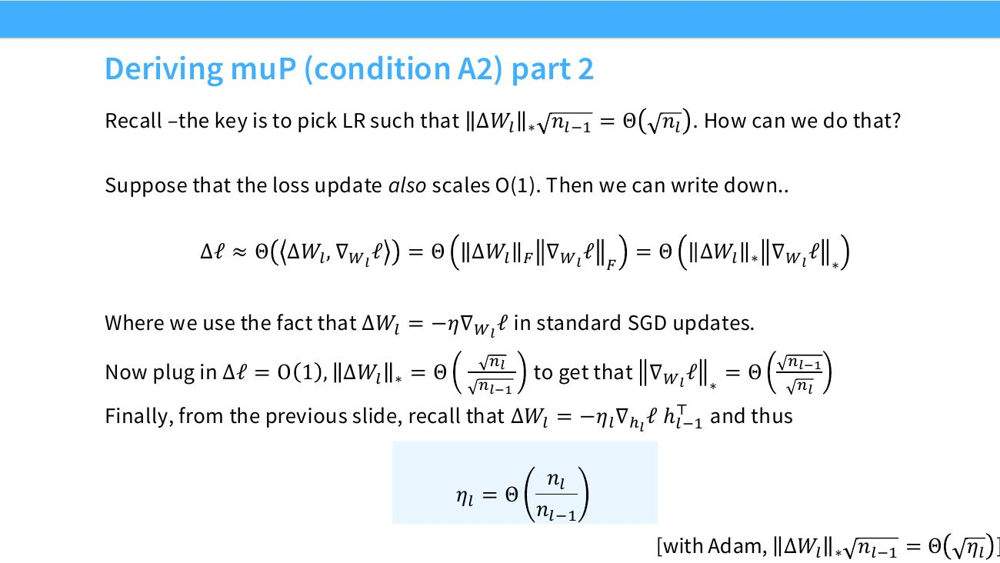

这一页完成 A2 推导的最后一步：把对 $\|\Delta W_l\|_{\mathrm{op}}$ 的要求翻译成对学习率的要求。关键假设是**标量损失的一步变化也是 $O(1)$**——即每步训练都让损失发生不随宽度消失的实际进展（这同样是"特征学习不冻结"的要求）。于是

$$\Delta\ell\approx\Theta\!\left(\langle\Delta W_l,\nabla_{W_l}\ell\rangle\right)
=\Theta\!\left(\|\Delta W_l\|_F\,\|\nabla_{W_l}\ell\|_F\right)
=\Theta\!\left(\|\Delta W_l\|_{\mathrm{op}}\,\|\nabla_{W_l}\ell\|_{\mathrm{op}}\right),$$

其中第一步是参数更新引起损失变化的一阶展开（梯度与更新的内积），后两步利用了"秩一至低秩矩阵的 Frobenius 内积由谱范数乘积刻画"这一事实（秩 $r$ 矩阵 $A,B$ 有 $|\langle A,B\rangle_F|\le r\|A\|_{\mathrm{op}}\|B\|_{\mathrm{op}}$，而 SGD 更新与梯度同为秩一，且 $\|\cdot\|_F=\|\cdot\|_{\mathrm{op}}$ 对秩一成立）。

代入 $\Delta\ell=O(1)$ 与 $\|\Delta W_l\|_{\mathrm{op}}=\Theta(\sqrt{n_l}/\sqrt{n_{l-1}})$，得到梯度的谱范数要求：

$$\|\nabla_{W_l}\ell\|_{\mathrm{op}}=\Theta\!\left(\frac{\sqrt{n_{l-1}}}{\sqrt{n_l}}\right).$$

最后，由 $\Delta W_l=-\eta_l\nabla_{h_l}\ell\,h_{l-1}^{\top}$ 与 $\|\nabla_{h_l}\ell\,h_{l-1}^{\top}\|_{\mathrm{op}}=\|\nabla_{h_l}\ell\|_2\,\|h_{l-1}\|_2$，结合 $\|h_{l-1}\|_2=\Theta(\sqrt{n_{l-1}})$ 反解出 SGD 的课程规则：

$$\eta_l=\Theta\!\left(\frac{n_l}{n_{l-1}}\right).$$

页底还有一行被截断但至关重要的注记：对 Adam，情况变为 $\|\Delta W_l\|_{\mathrm{op}}\sqrt{n_{l-1}}=\Theta(\sqrt{\eta_l})$ 的另一种依赖——下面用等宽玩具网络把两种优化器的差异彻底算清楚。

先回到预备部分的等宽两层网络，观察单个矩阵元素的梯度。记
$\delta_i=\partial\mathcal L/\partial h_i$，则

$$\frac{\partial\mathcal L}{\partial (W_1)_{ij}}
=\delta_i x_j.$$

若输入坐标 $x_j=\Theta(1)$，并额外假设：

1. 标量损失的一步变化为 $O(1)$；
2. $\Delta h_i=\Theta(1)$，且
   $\sum_i\delta_i\Delta h_i$ 的主导项没有精确抵消；
3. 梯度在宽度方向没有集中到极少数异常坐标，

那么逐坐标反向信号的课程级尺度是
$\delta_i=\Theta(1/n)$，从而

$$\frac{\partial\mathcal L}{\partial (W_1)_{ij}}
=\Theta(1/n).$$

对 SGD，单个参数的更新是

$$\Delta (W_1)_{ij}
=-\eta_{\mathrm{SGD}}\,
\frac{\partial\mathcal L}{\partial (W_1)_{ij}}
=\Theta(\eta_{\mathrm{SGD}}/n).$$

当 $\eta_{\mathrm{SGD}}=\Theta(1)$ 时，每个权重元素改变
$\Theta(1/n)$。因为这一层的梯度是秩一外积，可以更直接地核对：

$$\|\nabla_{W_1}\mathcal L\|_{\mathrm{op}}
=\|\delta x^\top\|_{\mathrm{op}}
=\|\delta\|_2\|x\|_2
=\Theta(1/\sqrt n)\,\Theta(\sqrt n)
=\Theta(1),$$

$$\Delta W_1x
=-\eta_{\mathrm{SGD}}\,\delta(x^\top x).$$

由于 $x^\top x=\Theta(n)$ 而 $\delta_i=\Theta(1/n)$，所以
$(\Delta W_1x)_i=\Theta(\eta_{\mathrm{SGD}})$。常数学习率正好产生
$\Theta(1)$ 的逐坐标激活变化，并与等宽情形所需
$\|\Delta W\|_{\mathrm{op}}=\Theta(1)$ 一致。这里的关键不是把
$\Delta W$ 的 $n^2$ 个元素当成新抽取的独立噪声，而是保留梯度外积与当前输入之间的相关结构。

对 Adam，若二阶矩估计已经跟随梯度尺度、偏置修正不改变宽度阶数，且数值稳定项 $\epsilon$ 没有主导分母，则

$$\frac{m_{ij}}{\sqrt{v_{ij}}+\epsilon}
=\Theta(1).$$

Adam 抹去了原始梯度的 $\Theta(1/n)$ 幅度，因此单个参数更新变为
$\Delta(W_1)_{ij}=\Theta(\eta_{\mathrm{Adam}})$。要恢复上面所需的
$\Theta(1/n)$ 元素更新，就需要

$$\eta_{\mathrm{Adam}}=\Theta(1/n).$$

这解释了为什么 SGD 和 Adam 不能共享同一条宽度规则：前者保留梯度幅值与秩一外积，后者近似逐坐标归一化，归一化后的更新也不再等同于原始秩一梯度。Adam 的 $1/n$ 结论采用 μP 的最大、特征对齐更新尺度；若把归一化后的各项假设成独立随机符号，会得到不同的平方根估计。这个解释还依赖稳定的矩估计、$\epsilon$ 不主导、无稀疏异常梯度以及特征对齐；训练最初几步、混合精度下或梯度极小时，这些条件可能不成立。

把等宽结论推广到 $n_{l-1}\ne n_l$ 后，课件给出的 SGD 课程规则是

$$\eta_l=\Theta\!\left(\frac{n_l}{n_{l-1}}\right).$$

对于 Adam 类逐坐标归一化优化器，课件给出的课程规则是

$$\eta_l\propto\frac{1}{n_{l-1}}.$$

下面的代码可以在自己的机器上直接验证 A1 与 A2 的宽度标度：固定输入 RMS 为 1，改变宽度 $n$，分别测量初始化激活 RMS（应接近 1，与 $n$ 无关）、SGD 一步更新后的激活变化 RMS（常数学习率下应保持 $\Theta(1)$）、以及 Adam 风格逐坐标归一化更新在 $\eta\propto1/n$ 与常数 $\eta$ 两种规则下的差异：

```python
import torch

def measure(n: int, lr_sgd: float = 1.0, adam_rule: str = "1/n") -> dict:
    torch.manual_seed(42)
    # 等宽线性层，muP 初始化：元素 ~ N(0, 1/n)
    W = torch.randn(n, n) / n**0.5
    x = torch.randn(n)                      # RMS(x) ≈ 1 的输入
    h = W @ x                               # A1：前向激活
    delta = torch.randn(n) / n              # 反向信号 δ_i = Θ(1/n)

    # SGD：ΔW = -lr · δ xᵀ（秩一外积）
    dW_sgd = -lr_sgd * torch.outer(delta, x)
    dh_sgd = dW_sgd @ x                     # 更新引起的激活变化

    # Adam 风格：逐坐标归一化使更新元素量级 = lr
    eta = 1.0 / n if adam_rule == "1/n" else 1.0
    g = torch.outer(delta, x)               # 原始梯度，元素 Θ(1/n)
    dW_adam = -eta * torch.sign(g)          # 归一化后元素 Θ(eta)
    dh_adam = dW_adam @ x

    rms = lambda v: v.pow(2).mean().sqrt().item()
    return {"RMS(h)": rms(h), "RMS(Δh)_sgd": rms(dh_sgd),
            f"RMS(Δh)_adam[{adam_rule}]": rms(dh_adam)}

for n in [128, 512, 2048]:
    print(n, measure(n), measure(n, adam_rule="const"))
# 预期：RMS(h) 与 RMS(Δh)_sgd 不随 n 变化；
# Adam 用 1/n 学习率时 Δh 保持 Θ(1)，用常数学习率时随 n 放大 ~√n 倍
```

这里必须透明降级：课堂并未给出一般深度、非线性、残差连接和 Adam 状态下的完整证明；讲者也把"损失单步改变为 $O(1)$"称为推导中最不令人满意的假设之一。上面的等宽逐坐标计算只是解释课程规则为何合理，不能替代完整 μP 理论。

不过，这些规则可以直接做实验验伪。固定深度、数据和训练步数，取宽度
$n\in\{128,256,512,1024\}$，分别测试：

- SGD：固定基础学习率，对比错误的 $1/n$ 学习率；
- Adam：采用 $1/n$ 学习率，对比错误的固定学习率；
- 每个宽度都记录初始化
  $\operatorname{RMS}(h_l)$、第一步
  $\operatorname{RMS}(\Delta h_l)$、更新谱范数和短程 loss；
- 在相同倍率的基础学习率网格上比较最优点是否跨宽度重合。

若参数化正确，应看到 A1 的激活 RMS 与 A2 的更新 RMS 都保持常数量级，而且最优基础学习率的曲线较好重合；若它们随宽度趋零、爆炸或最优点持续漂移，就说明假设或实现至少有一处失效。

### 本章小结

μP 通过 A1 保持初始化激活非退化，通过 A2 保持单步特征变化非退化。深线性模型的谱尺度分析给出初始化与分层学习率的宽度依赖；其中包含上界、无抵消和损失变化尺度等假设，应用到真实 Transformer 时必须遵循完整参数分类。

## 10. 从“baby μP”到 Transformer：规则、迁移与失效点

### 10.1 最小回顾

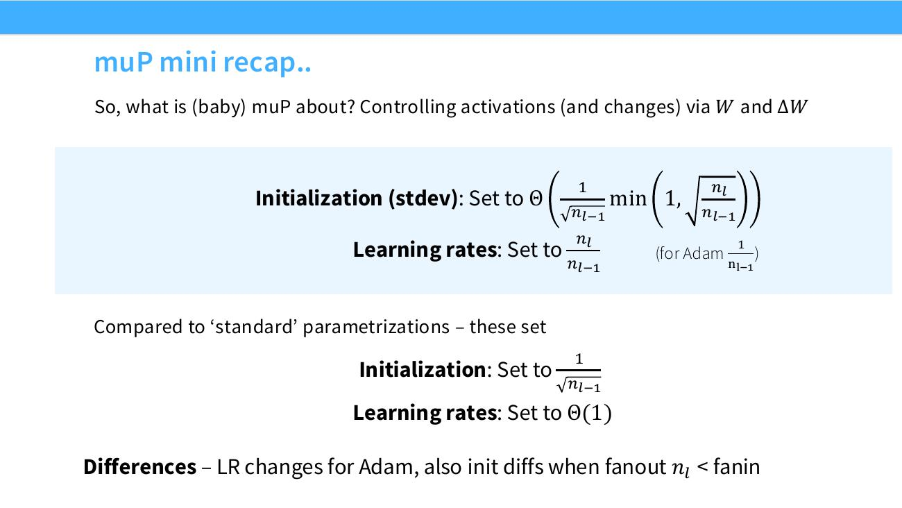

这一页把上一节的推导浓缩成可记忆的对照表。（baby）μP 的核心是通过 $W$ 与 $\Delta W$ 同时控制激活及其变化：

- **初始化（标准差）**：$\Theta\!\left(\dfrac{1}{\sqrt{n_{l-1}}}\min\!\left(1,\sqrt{\dfrac{n_l}{n_{l-1}}}\right)\right)$；
- **学习率**：SGD 取 $\dfrac{n_l}{n_{l-1}}$，Adam 取 $\dfrac{1}{n_{l-1}}$。

而标准参数化对应：初始化 $1/\sqrt{n_{l-1}}$、学习率 $\Theta(1)$（不随宽度变）。页底概括了两者的全部差异：Adam 的学习率规则不同；以及当 fan-out $n_l$ 小于 fan-in 时初始化也不同。对初学者而言，可以先记住：

- 标准参数化常用 $\sigma\propto1/\sqrt{\text{fan-in}}$，学习率近似不随宽度变。
- μP 会根据 fan-in、fan-out 以及参数在网络中的角色，改变初始化或学习率缩放。
- SGD 与 Adam 的更新归一化不同，不能共享同一宽度规则。
- "方差"与"标准差"相差平方，阅读表格时必须确认列名。

### 10.2 Transformer 中不是所有参数都同类

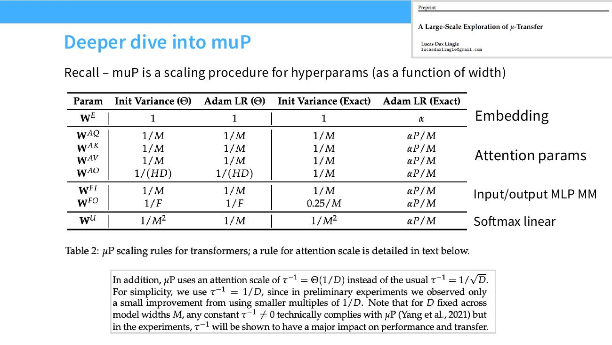

这一页引用 Lingle 的《A Large-Scale Exploration of μ-Transfer》预印本，给出真实 Transformer 的完整 μP 参数分类表。表中按参数角色分行：embedding $W^E$（初始化方差与学习率均为 $\Theta(1)$ 级别，精确规则中学习率乘 $\alpha$）；attention 的 $W^{AQ},W^{AK},W^{AV}$（初始化方差 $1/M$、Adam 学习率 $1/M$，精确规则乘 $\alpha P/M$）；attention 输出投影 $W^{AO}$（Θ 规则初始化 $1/(HD)$，精确规则仍按 $1/M$）；MLP 输入/输出矩阵 $W^{FI},W^{FO}$（分别按 $1/M$ 与 $1/F$）；以及 softmax 前的 unembedding $W^U$（初始化方差 $1/M^2$——注意是平方，学习率 $1/M$）。其中 $M$ 是隐藏宽度，$H$ 是头数，$D$ 是单头维度，$F$ 是 FFN 宽度，$P$、$\alpha$ 是论文的精确化系数。页面下方还有一个关键引文：μP 的 attention 缩放取 $\tau^{-1}=\Theta(1/D)$ 而非惯用的 $1/\sqrt D$；当 $D$ 不随模型宽度变化时，任何非零常数 $\tau^{-1}$ 在技术上都不违反 μP（Yang et al., 2021），但实验证明 $\tau^{-1}$ 的取值对性能与迁移性有重大影响。

真实 Transformer 中至少要区分：

- 输入 embedding；
- 隐藏到隐藏的矩阵；
- 输出/readout 矩阵；
- 向量参数和归一化增益；
- attention logits 的缩放。

对 batch 大小 $B$、序列长度 $S$、注意力头数 $H$ 和单头维度
$d_h$，可把 query 与 key 写成

$$Q,K\in\mathbb R^{B\times S\times H\times d_h}.$$

对 batch $b$、头 $h$、query 位置 $s$ 和 key 位置 $t$，未缩放的点积 logit 是

$$z_{bsth}
=\sum_{r=1}^{d_h}Q_{bshr}K_{bthr}.$$

若初始化时 $Q_{bshr}$ 与 $K_{bthr}$ 近似独立、均值为零，坐标方差分别为
$\sigma_Q^2,\sigma_K^2=\Theta(1)$，则

$$\operatorname{Var}(z_{bsth})
=d_h\sigma_Q^2\sigma_K^2
=\Theta(d_h).$$

标准 attention 使用

$$\ell_{bsth}^{\mathrm{std}}
=\frac{z_{bsth}}{\sqrt{d_h}},$$

因此在"独立、零均值、坐标方差为常数"的**随机初始化假设**下，
$\operatorname{Var}(\ell^{\mathrm{std}})=\Theta(1)$。它保持的是初始化随机 logit 的非退化方差，避免 softmax 立即变得过平或过尖。

课件中的 μP attention 使用

$$\ell_{bsth}^{\mu\mathrm P}
=\frac{z_{bsth}}{d_h}.$$

在同一个独立初始化计算下，它的方差为 $\Theta(1/d_h)$，会随宽度趋零；这不是计算错误，而是 μP 选择的不同极限。训练发生特征学习后，query 与 key 的坐标贡献可能形成相关、对齐的 $O(d_h)$ 和，而不再只是独立噪声的 $O(\sqrt{d_h})$ 和；除以 $d_h$ 保持的是这种**相关特征信号及其更新**为 $O(1)$，从而得到稳定的宽度极限。

所以 $1/\sqrt{d_h}$ 与 $1/d_h$ 不能脱离其余参数化互换：

- 标准缩放服务于标准初始化下的随机 logit 方差；μP 缩放服务于完整 μP 下的 feature-learning 极限。
- 只把已调好的标准模型分母改成 $d_h$，会改变 softmax 温度、注意力熵和梯度尺度；反向替换同样会破坏 μP 的宽度迁移。
- μP 规则必须与 Q/K 投影初始化、分层学习率、readout 和其他参数类别一起应用，并重新扫描基础学习率。
- 若扩宽模型时保持 $d_h$ 不变、只增加 $H$，这两个分母本身都不随总宽度变化，不能把"总宽度缩放"误写成"单头维度缩放"。
- 若 Q/K 坐标方差不是 $\Theta(1)$，或者位置编码、归一化、相关性结构改变，应从实际方差与更新尺度重新计算，不能直接套用上述结论。

一个最小验收实验是对多组 $d_h$ 同时记录初始化 logit 方差、softmax 熵、一步更新后的 logit RMS 和短程最优基础学习率：标准参数化应主要保持初始化 logit 方差，完整 μP 则应关注训练后特征更新尺度和学习率曲线是否跨宽度重合。

### 10.3 学习率迁移的实验证据

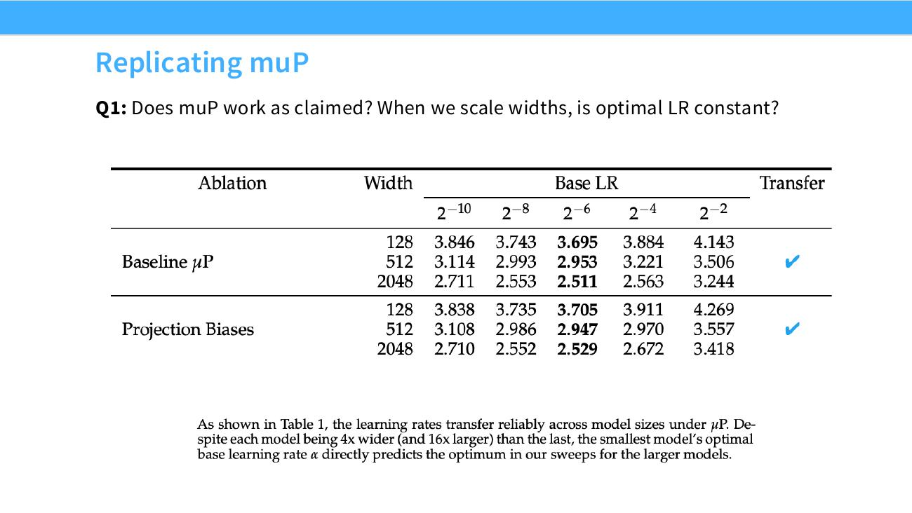

这一页是 Lingle 复现研究对 μP 核心断言的直接检验：宽度 128、512、2048 的模型（每个比前一个宽 4 倍、参数多 16 倍）在 $2^{-10}$ 到 $2^{-2}$ 的基础学习率网格上的验证损失表。Baseline μP 行中，三个宽度的最优列都落在 $2^{-6}$（表中加粗），迁移标记为 ✓；Projection Biases（投影层带偏置的消融）同样迁移成功。论文引文确认：最小模型的最优基础学习率 $\alpha$ 直接预测了大模型扫描中的最优点。这正是 slide-010 中 MiniCPM 现象的独立复现。

图中的最佳基础学习率大致聚集在 $2^{-6}$ 附近，这正是 μP 希望实现的现象。但验证标准不应只看最优点横坐标：

- 曲线形状和稳定区是否也相似？
- 最佳点差异是否小于搜索网格分辨率？
- 更深、不同 head 数或不同序列长度时是否仍迁移？
- 目标训练是否加入了代理实验没有的参数与正则化？

### 10.4 常见破坏因素

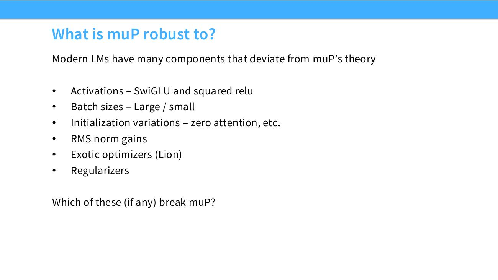

这一页列出压力测试的清单。现代语言模型包含许多偏离 μP 理论假设的组件：激活函数（SwiGLU、squared ReLU）、大小各异的批大小、初始化变体（如 zero attention）、RMSNorm 的可训练增益、exotic 优化器（Lion）、正则化手段。课件的问题是：哪些（如果有）会真正破坏 μP？接下来三页给出三个"会"的答案。

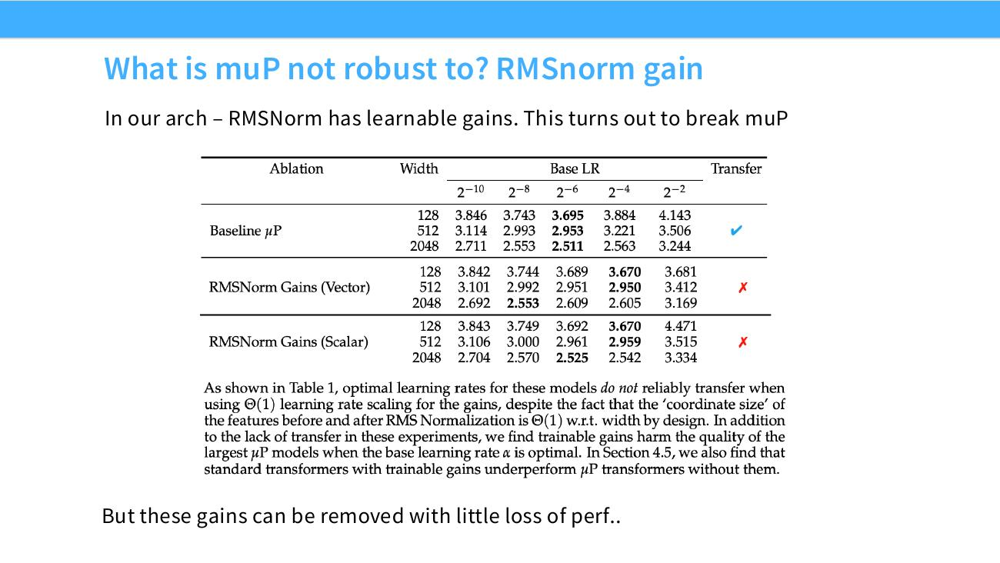

这一页给出第一个失效案例。在被测架构中 RMSNorm 带可学习增益，结果这破坏了 μP：表格中 RMSNorm Gains（Vector，逐坐标增益）与 RMSNorm Gains（Scalar，标量增益）两组消融的迁移列都标 ✗——最优基础学习率重新随宽度漂移（如 Vector 组 2048 宽度的最优点移向更大学习率）。引文解释了理论原因：这些实验对增益使用 $\Theta(1)$ 学习率缩放，尽管 RMSNorm 前后特征的"坐标尺寸"按设计是 $\Theta(1)$，但增益参数本身作为向量参数参与了特征尺度的乘法调节，其更新改变了有效的前向尺度，等效于在 A2 的账本上引入了未受控项；此外在基础学习率最优时，可训练增益还损害了大 μP 模型的最终质量。页底附带一个实用安慰：这些增益可以直接移除，性能损失很小——这正是不完整参数化的典型修复方式。

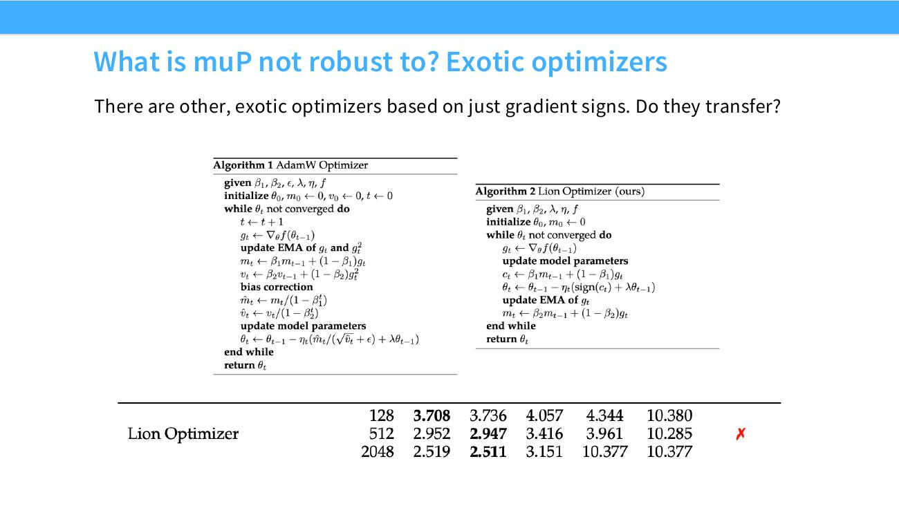

这一页给出第二个失效案例。Lion 优化器用动量的符号 $\operatorname{sign}(c_t)$ 做更新（算法框中与 AdamW 并排），更新幅度完全不携带梯度大小信息。表格显示 Lion 在三个宽度下的损失随着基础学习率增大出现剧烈恶化（2048 宽度下多个配置损失超过 10，明显发散），迁移标记 ✗。理论上这不意外：第 9 节对 Adam 的 $1/n$ 推导依赖"逐坐标归一化后更新 RMS 约为 $\eta$"；Lion 的 sign 操作是更激进的归一化，其更新方向与梯度的相关结构（A2 推导所依赖的秩一特征对齐）被破坏得更彻底，μP 的宽度规则不再适用。教训是：每换一类优化器，都必须重做更新尺度的宽度分析——sign 类、谱类（Muon）与 Adam 类各有自己的规则。

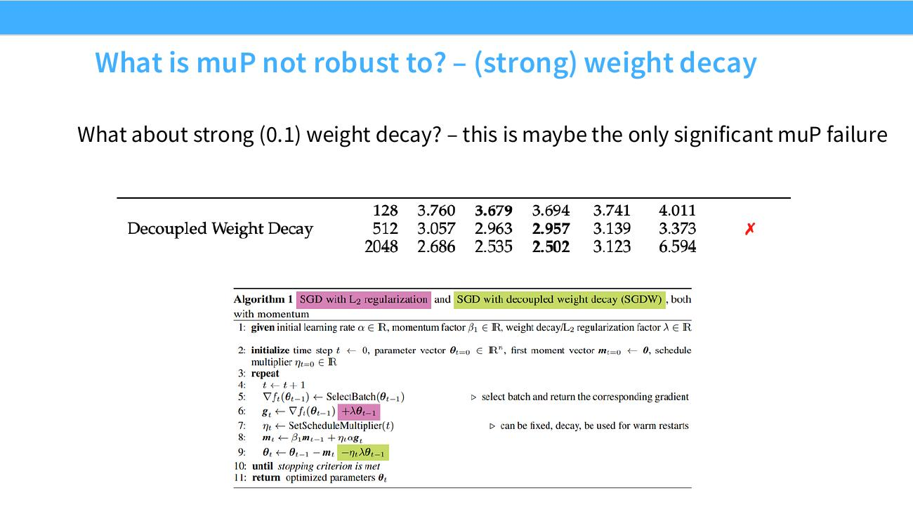

这一页给出第三个、也可能是唯一"显著"的失效案例：强（0.1）解耦权重衰减。表格中 Decoupled Weight Decay 行显示，2048 宽度下学习率稍大时损失恶化到 6.594，迁移标记 ✗。页面下方引用 AdamW 原论文的算法对比：$L_2$ 正则把 $\lambda\theta$ 加进梯度，解耦衰减则在更新末尾直接减去 $\eta_t\lambda\theta_t$。失效机制可以从更新尺度账目直接读出：AdamW 的衰减项幅度为 $\eta\lambda\|\theta\|$，μP 让隐藏层学习率按 $1/n$ 缩放而 $\lambda$ 固定，于是不同宽度下"衰减项/梯度项"的相对强度不同——宽度翻倍，梯度项减半而衰减项也减半但二者对宽度方向的谱结构影响并不一致；更关键的是，权重本身的尺度 $\|\theta\|$ 随训练与宽度演化，固定 $\lambda$ 在不同宽度上对应不同的有效正则强度。修复方向与失效原因对称：要么让 $\lambda$ 随宽度配套缩放，要么在目标尺度局部重扫 $\lambda$（这正是 8.3 节"先 $(\eta,B)$ 后 $\lambda$"顺序的理由之一）。

### 10.5 μP 不是“设置一次，永不调参”

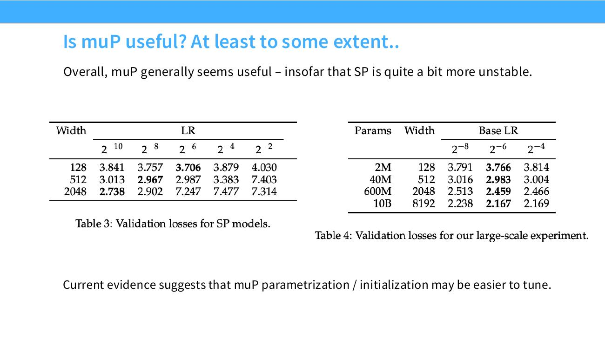

这一页是 μP 部分的证据总结。左表（Table 3）：标准参数化（SP）模型在宽度 2048、学习率 $2^{-6}$ 以上时损失全面恶化到 7 以上——SP 的最优学习率随宽度快速移动且稳定区很窄；右表（Table 4）：μP 下 2M 到 10B（宽度 128 到 8192）的大尺度实验，最优基础学习率稳定在 $2^{-6}$。课件的结论措辞谨慎而准确："Overall, muP generally seems useful – insofar that SP is quite a bit more unstable"，即 μP 的价值最确定的表述是：它比标准参数化稳定得多，超参数搜索成本因此大幅下降；"may be easier to tune"是比"必然更好"更诚实的总结。

μP 最适合迁移**基于宽度变化**的超参数。若同时改变以下因素，仍应重新验证：

- 深度与宽深比；
- attention head 维度或序列长度；
- MoE 路由与激活专家数；
- 优化器、权重衰减和梯度裁剪；
- 归一化结构、残差缩放与新增可训练增益；
- 数据混合和训练日程。

实践中可把 μP 当作降低搜索维度的工具：先在小模型上较精细地调基础学习率，再在目标尺度做少量局部验证，而不是完全取消验证。

### 本章小结

Transformer μP 必须按参数角色应用，attention、输出层、向量参数和归一化增益不能一概而论。它可以显著改善宽度间的学习率迁移，但 RMSNorm gain、Lion、权重衰减等新增因素会破坏不完整的规则，因此仍需目标尺度局部验收。

## 总结与延伸

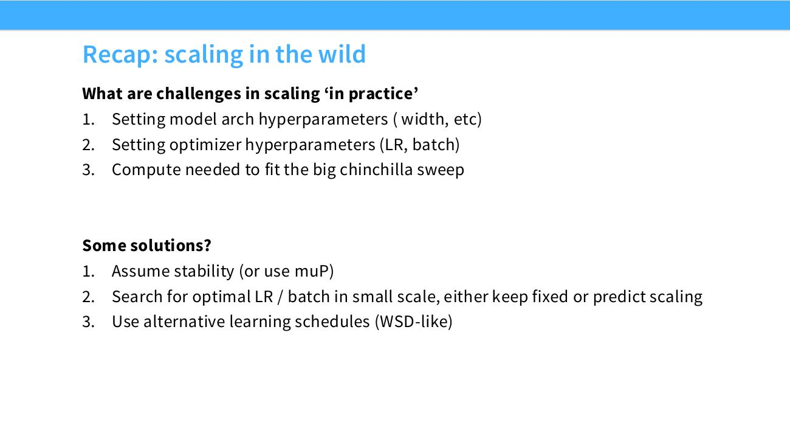

最后一页课件把全讲收束为"三个困难、三套解药"。实践中的缩放困难：1）设置架构超参数（宽度等）；2）设置优化器超参数（学习率、批大小）；3）Chinchilla 大扫描所需的计算量。对应的解法：1）假设稳定性，或者使用 μP；2）在小尺度搜索最优学习率/批大小，然后要么保持不变、要么拟合并预测其缩放；3）使用替代学习率日程（WSD 类）。上半页（Is muP useful 的余绪）再次提醒：三大困难并非各自独立——μP 解决宽度迁移后，WSD 的低成本测量才有意义；而一切拟合的最终可靠性，仍由留出大模型验收决定。

### 一套可直接执行的应用缩放律 recipe

下面把全讲压缩成一个从研究问题到最终大训练的流程。

**步骤 1：写清目标函数。**  
确定要最小化的是训练 FLOPs、墙钟、训练成本、推理成本，还是在固定延迟下最大化下游能力。没有目标函数，"计算最优"没有唯一含义。

**步骤 2：冻结定义与训练 recipe。**  
明确 $N,D,C,L,B$ 的口径，记录 tokenizer、数据混合、架构、优化器、精度和学习率日程。任何改变都可能导致新的一族缩放律。

**步骤 3：先解决跨尺度稳定性。**  
选择完整 μP、经过验证的参数化，或承认每个尺度都要重新调参。用激活 RMS、梯度范数和短跑测试排除明显发散。

**步骤 4：建立代理模型梯子。**  
选择 3–5 个相邻尺度，保持架构族一致并覆盖足够宽的范围。不要只在极小范围拟合幂律。

**步骤 5：联合扫描学习率与批大小。**  
粗网格找到稳定盆地，局部细扫；随后在候选区域扫描权重衰减。记录损失以外的吞吐、墙钟和稳定性指标。

**步骤 6：用 WSD 降低数据轴扫描成本。**  
共享 warmup 与 stable 主干，在多个 token checkpoint 分叉做衰减，得到可比较的最终损失。

**步骤 7：做 IsoFLOP 或联合损失拟合。**  
在多个计算桶中扫描 $N,D$，拟合下包络或 $L(N,D)$。报告拟合区间、残差、搜索网格和单位。

**步骤 8：拟合超参数缩放，但保留不确定性。**  
得到 $\eta_{\mathrm{opt}}(N,D,C)$、$B_{\mathrm{opt}}(N,D,C)$ 时，不要只保存单条曲线；同时保存稳定区宽度和相邻候选损失。

**步骤 9：设置真正的留出尺度。**  
至少一个较大代理模型完全不参与公式选择。预先定义验收阈值，例如损失误差、是否发散、吞吐与墙钟偏差。

**步骤 10：只在留出验收后启动最终训练。**  
最终训练早期持续比较观测曲线与预测区间；若偏离，先局部调参和诊断，不要盲目继续烧计算。

### 最应保留的五条判断

1. **缩放律是条件规律。** 改了数据、架构、优化器或日程，就可能改了规律。
2. **留出外推比拟合优度重要。** 拟合区间内的漂亮曲线不能证明大尺度安全。
3. **学习率、批大小、权重衰减相互作用。** 单独迁移一个数字通常不够。
4. **μP 和 WSD 解决的是不同问题。** μP 改善跨宽度超参数迁移；WSD 复用训练主干、降低跨数据量测量成本。
5. **"能工作"与"更优"不同。** Muon、混合注意力或高 token/parameter 比例的成功案例，需要同预算消融才能形成比较结论。

### 常见误解

- **误解：Chinchilla 永远规定 20 token/parameter。**  
  纠正：比例依赖计算、损失和成本定义；推理成本与实际产品目标会改变最优点。

- **误解：μP 会自动迁移所有超参数。**  
  纠正：它主要处理宽度参数化；新增归一化增益、优化器或权重衰减仍可能破坏迁移。

- **误解：WSD 的 stable checkpoint 已经是最终模型。**  
  纠正：它通常要从 checkpoint 再完成衰减，才与完整训练终点公平比较。

- **误解：幂律小数位很多，预测就很精确。**  
  纠正：精度受网格密度、测量噪声、单位与外推距离限制。

- **误解：小模型 speedrun 冠军必然在大模型上领先。**  
  纠正：优化器收益会随规模、硬件和每步成本改变。

### 进一步思考

本讲留下了几个尚未解决、却极具实践价值的问题：

1. 怎样把预训练、post-training 与推理时计算放进统一成本模型？
2. 怎样为 MoE 同时建立总参数、激活参数、路由负载与通信成本的缩放律？
3. 能否让缩放预测输出可信区间，而不是单点最优值？
4. 当架构族发生离散变化时，怎样判断旧缩放律仍可迁移到多远？
5. 能否把早期训练曲线、梯度噪声和激活统计结合起来，形成在线停止或重规划规则？

这些问题共同指向一个结论：真实世界的缩放不是发现一条神奇直线，而是建立一套从小实验、显式假设、留出验证到大训练监控的闭环。

### 本章小结

应用缩放律的完整闭环是：定义目标与口径，冻结 recipe，建立稳定代理模型，联合调学习率与批大小，用 WSD 和 IsoFLOP 高效采样，拟合并保留不确定性，最后用真正的留出尺度验收。没有单一银弹；可靠性来自可追踪的假设和逐级验证。


