# Stanford CS336 2026 第 11 讲：Scaling Laws——把小规模实验变成大训练决策

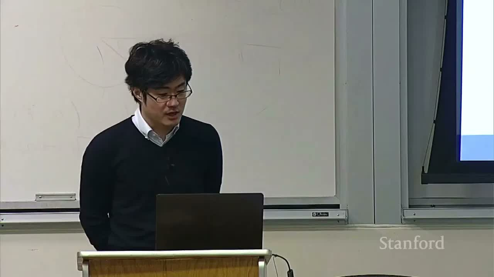

> 课程：Stanford CS336 — Language Modeling from Scratch（Spring 2026）  
> 讲次：Lecture 11: Scaling Laws  
> 讲者：Percy Liang  
> 视频时长：01:17:03  
> 原视频：https://www.youtube.com/watch?v=vTfEyOyzV9E  
> 本讲核心问题：当一次大模型训练昂贵到几乎不能重来时，怎样用较小、较便宜的实验预测模型规模、数据量、学习率、批大小、初始化和优化器在大尺度下应如何设置？

这份讲义不是把“损失服从幂律”当作一句口号，而是把本讲整理成一套可以执行、可以质疑、也可以验收的工程方法。阅读时要始终记住三个层次：

1. **描述性规律**：在已经完成的实验上，某个幂律拟合得很好。
2. **决策性规律**：该拟合可以帮助选择模型、数据、学习率或批大小。
3. **外推性规律**：小规模所得的规律在更大模型、不同架构、不同优化器上仍成立。

从第一层走到第三层，每一步都增加了假设。缩放律的价值不是消除这些假设，而是让它们显式化，并用留出实验逐步验证。

## 1. 为什么“在野外”使用缩放律比画一条直线困难

### 1.1 教科书问题与生产问题

最简化的计算最优问题只需要回答：给定训练计算量 \(C\)，参数量 \(N\) 和训练 token 数 \(D\) 应如何分配？若把一次 Transformer 前向与反向训练的计算近似写成

\[
C \approx 6ND,
\]

那么固定 \(C\) 后，增大 \(N\) 必然减少 \(D\)，反之亦然。Chinchilla 风格的实验正是在若干固定计算预算下扫描不同 \(N,D\)，寻找验证损失最低的点，再拟合最优模型规模与最优数据量。

符号说明：

- \(C\)：训练计算预算，通常用 FLOPs 表示。
- \(N\)：模型中参与训练的参数规模；不同论文可能排除 embedding 或只统计激活参数。
- \(D\)：训练 token 数。
- \(L\)：验证集上的交叉熵、NLL、bits-per-byte 等损失；指标定义必须先统一。

但生产训练还必须同时决定：

- 宽度、深度、头数、FFN 扩张比、MoE 专家数等架构超参数；
- 学习率、批大小、权重衰减和学习率日程；
- 初始化与参数化是否能跨宽度保持稳定；
- 数据混合、tokenizer 和损失单位是否可比较；
- 小模型上观察到的最优点能否外推到目标尺度。

因此，“模型越大损失越低”远远不够。真正要预测的是一个包含离散架构决策和连续优化超参数的高维响应面。

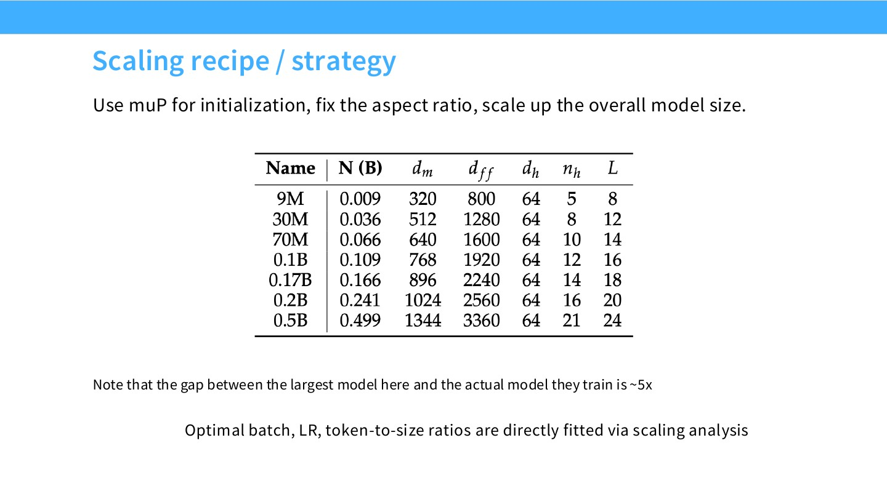

*图 1：MiniCPM 通过一组形状受控的代理模型研究规模变化；图像取自官方课件，对应讲解字幕区间：00:03:35–00:08:16。*

### 1.2 三类容易混淆的“缩放”

本讲交替讨论三种问题，初学者最好主动区分：

| 问题 | 要预测什么 | 典型输出 |
|---|---|---|
| 性能缩放 | 给定 \(N,D,C\)，最终损失是多少 | \(L(N,D)\)、\(L(C)\) |
| 计算分配 | 给定 \(C\)，怎样选 \(N,D\) | \(N_{\mathrm{opt}}(C),D_{\mathrm{opt}}(C)\) |
| 超参数缩放 | 模型或数据变大后怎样改学习率、批大小、初始化 | \(\eta_{\mathrm{opt}}(C)\)、\(B_{\mathrm{opt}}(C)\)、\(\sigma_l(n)\) |

它们可以相互依赖，但不是同一件事。例如，损失关于计算量呈漂亮幂律，并不自动证明同一个学习率可以跨宽度使用；反过来，μP 使最优学习率更稳定，也不意味着 Chinchilla 的 \(N:D\) 比例就不必重新测量。

### 1.3 本讲的证据标准

判断一条缩放律是否真的有用，可以按以下顺序提问：

1. 拟合区间内是否平滑，最优点是否被实验网格覆盖？
2. 是否存在没有参与拟合的留出尺度？
3. 留出点是否只是“损失接近”，还是训练也稳定、成本也符合预期？
4. 目标训练与代理实验是否共享架构族、优化器、数据、tokenizer 和学习率日程？
5. 若有因素改变，是否重新做了局部扫描？

最后一点极其重要：缩放律通常是**条件规律**，不是脱离训练 recipe 的自然常数。

### 本章小结

缩放律的工程目标，是把便宜实验转化为昂贵训练的决策。要先区分性能缩放、计算分配和超参数缩放，并把架构、优化器、数据与日程视为规律成立的条件，而不是无关细节。

## 2. MiniCPM：先让代理模型之间“可比较”

### 2.1 固定模型族，再谈外推

如果小模型和大模型不仅宽度不同，深度、注意力头、FFN 比例也随意变化，就无法知道性能变化来自总计算量还是架构形状。MiniCPM 的思路是先定义一个结构规律较一致的模型族，再用 μP 风格的参数化缓解宽度变化导致的优化超参数漂移。

直觉上，标准参数化会让同一数值的学习率在不同宽度产生不同大小的功能变化。若代理模型的最优学习率不断漂移，那么每个尺度都要重新调参，缩放实验的成本会迅速膨胀。μP 的目标不是让所有训练设置自动正确，而是让“在小模型上调出的超参数”更有机会迁移到大模型。

### 2.2 学习率与批大小必须看成二维问题

批大小 \(B\) 改变每步梯度估计的噪声，学习率 \(\eta\) 决定一次更新的步幅。二者存在相互作用：一个学习率在小批下稳定，不代表在大批下仍是最优；只做独立的一维扫描，可能得到错误组合。

MiniCPM 的结果显示，在其受控模型族和参数化中，最优学习率大致稳定在 \(10^{-2}\) 附近。但这只能读成“该 recipe 下有较好的迁移性”，不能读成“所有 Transformer 都应使用 \(10^{-2}\)”。

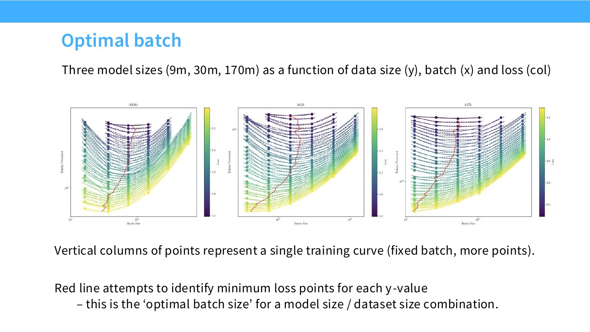

*图 2：目标损失越低，经济有效的批大小往往越大；图像取自官方课件，对应讲解字幕区间：00:08:16–00:09:08。*

为什么训练后期常需要更大批？在较高损失区域，梯度信号较强，小批量带来的噪声仍可接受；接近更低损失时，梯度信噪比下降，增加批大小可以减少无效噪声。不过，这里的“最优”必须先说明目标：是最少 token、最少参数更新、最短墙钟时间，还是最高硬件利用率。不同目标可能给出不同批大小。

### 2.3 一个可操作的小规模联合扫描

对每个代理尺度，可以采用如下流程：

1. 选择覆盖可能最优点的对数学习率网格，例如相邻点相差约 2 倍。
2. 选择数个批大小，并保证每个配置训练到可比较的 token 数或日程位置。
3. 记录验证损失、吞吐量、溢出/发散、梯度范数和墙钟时间。
4. 在二维网格中寻找稳定盆地，而不是只挑最低的单个点。
5. 在预测最优点附近补一轮局部细网格。
6. 至少留出一个更大尺度，不参与拟合，只用于验证外推。

这里的“稳定盆地”比“冠军点”更重要。大训练会受到硬件抖动、数据顺序和数值误差影响，位于狭窄尖点上的 recipe 很可能比略差但宽阔稳定的 recipe 更危险。

### 本章小结

MiniCPM 路线先控制模型族与参数化，再联合考察学习率和批大小。其结论是特定训练 recipe 下的经验规律；真正可复用的是实验设计：覆盖二维最优盆地、记录稳定性，并用留出尺度验证迁移。

## 3. WSD：把一次长训练变成多个可复用的测量点

### 3.1 为什么 cosine 日程妨碍公平比较

常见 cosine 学习率日程从峰值逐渐衰减到接近零。若原计划训练 \(D_1\) 个 token，后来想比较 \(D_2\) 个 token，则整个 cosine 曲线都发生变化。这样在 \(D_1\) 时截取的 checkpoint，并不等价于“专门训练到 \(D_1\) 后完成衰减”的模型。

WSD（warmup–stable–decay）把日程拆成三段：

\[
\eta(t)=
\begin{cases}
\eta_{\max}\,w(t), & 0\le t<T_w,\\
\eta_{\max}, & T_w\le t<T_s,\\
\eta_{\max}\,d(t), & T_s\le t\le T,
\end{cases}
\]

其中 \(w(t)\) 是 warmup，稳定阶段保持峰值学习率，\(d(t)\) 是末段衰减函数。

符号说明：

- \(t\)：当前训练步或累计 token 位置。
- \(T_w\)：warmup 结束位置。
- \(T_s\)：稳定阶段结束、开始衰减的位置。
- \(T\)：本次训练终点。
- \(\eta_{\max}\)：稳定阶段的峰值学习率。

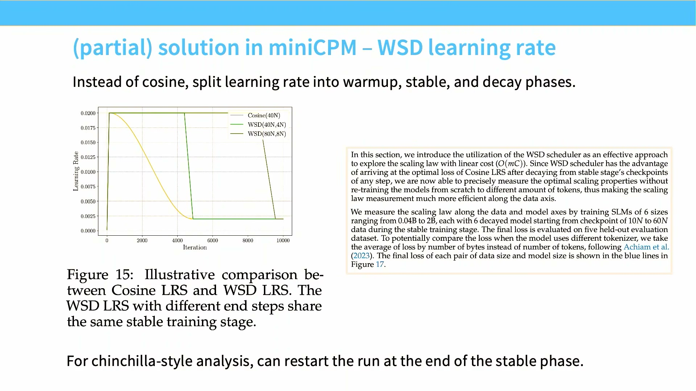

*图 3：不同终点的 WSD 运行共享同一段 stable 轨迹，可从稳定阶段 checkpoint 分叉后分别衰减；视频关键帧 00:12:10，精确字幕区间：00:11:09–00:12:44。*

### 3.2 WSD 如何降低 Chinchilla 扫描成本

假设需要测量同一个模型在 \(10N,20N,\ldots,60N\) token 处的“训练完成后损失”。使用 WSD 时，可以先运行一条较长的 stable 主干，在不同 token 位置保存 checkpoint，再从各 checkpoint 启动短衰减。于是多个数据量实验共享昂贵的稳定阶段，而不是从头训练多次。

这也解释了一个常见误读：stable checkpoint 的即时损失可能比一条正在衰减的 cosine 曲线更高，但它保留了继续训练的能力。比较最终模型时，应让 WSD checkpoint 完成对应衰减，再比较最终损失。

课件中的经验设置提到：

- 衰减区间常占目标 token 的约 10%–20%；
- 最终学习率有时约为峰值的 10%。

这是两个不同的“10%”：一个是日程长度比例，一个是学习率幅度比例。不能混为同一超参数，也不应把它们当成普适常数。

### 3.3 MiniCPM 的 Chinchilla 拟合

MiniCPM 讨论了两类典型方法：

- **IsoFLOP 下包络法**：在多个固定计算预算中扫描 \(N,D\)，找每个预算的最低损失点，再拟合最优规模。
- **联合损失拟合**：直接拟合 \(L(N,D)\)，然后在计算约束下解析或数值求最优分配。

课件给出的联合拟合形式为

\[
L(N,D)\approx
\frac{7.54\times10^{-2}}{N^{0.30}}
+
\frac{2.92\times10^{-1}}{D^{0.30}}
+
0.25.
\]

符号说明：

- 第一项：有限模型容量造成的损失。
- 第二项：有限数据造成的损失。
- \(0.25\)：该指标和数据分布下拟合出的不可约项。
- 指数 \(0.30\)：本实验拟合出的衰减速率，不是理论常数。

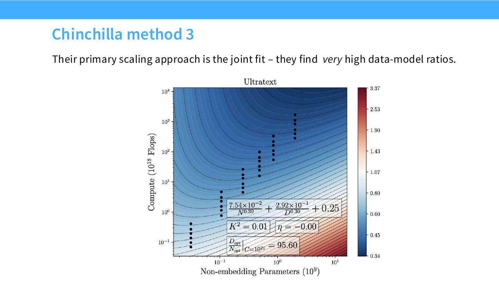

*图 4：由 \(L(N,D)\) 与计算约束推导计算最优分配；图像取自官方课件，对应讲解字幕区间：00:14:54–00:15:33。*

该拟合在 \(C=10^{21}\) 的示例中给出约 \(D_{\mathrm{opt}}/N_{\mathrm{opt}}\approx95.60\)。讲者明确对这一偏高比例保持怀疑。正确态度是：它是一个值得用留出点检验的预测，不是因为公式精确到两位小数就自动可信。

### 本章小结

WSD 的核心优势是让不同训练长度共享稳定主干，再从多个 checkpoint 独立衰减，从而以近线性成本采集数据轴上的最终损失。它能降低扫描成本，却不会替代对衰减长度、最终学习率和外推比例的验证。

## 4. DeepSeek：直接拟合学习率、批大小与最终损失

### 4.1 不依赖 μP 的路线

DeepSeek 展示了另一种工程策略：不先假设超参数可跨尺度保持不变，而是在多个小尺度上显式扫描学习率与批大小，再拟合它们随计算量变化的规律。

*图 5：每个代理尺度上进行学习率与批大小联合网格实验；图像取自官方课件，对应讲解字幕区间：00:15:57–00:17:42。*

课件列出的经验拟合为

\[
\eta_{\mathrm{opt}}(C)=0.3118\,C^{-0.1250},
\]

\[
B_{\mathrm{opt}}(C)=0.2920\,C^{0.3271}.
\]

符号说明：

- \(\eta_{\mathrm{opt}}\)：拟合的最优峰值学习率。
- \(B_{\mathrm{opt}}\)：拟合的最优批大小。
- \(C\)：论文采用的训练计算定义；课件强调其拟合使用 non-embedding FLOPs。
- 系数与指数：来自特定模型族、优化器、数据和日程的经验回归。

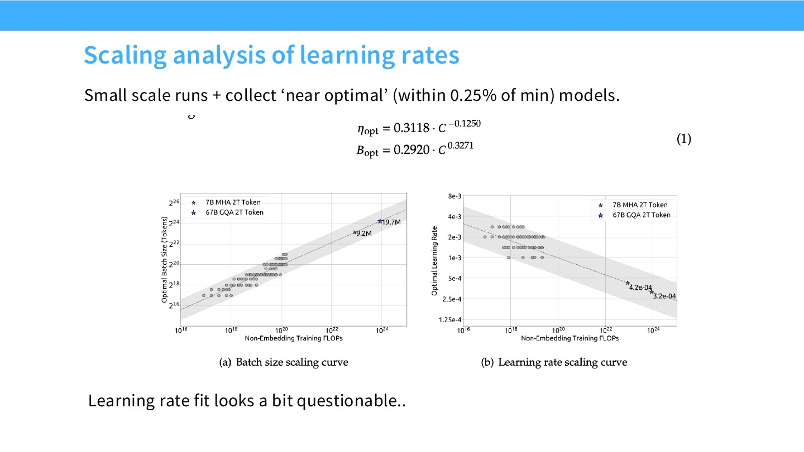

*图 6：学习率随计算量下降、批大小随计算量上升的经验趋势；图像取自官方课件，对应讲解字幕区间：00:17:42–00:19:30。*

学习率拟合需要格外小心：若扫描网格过粗，所谓“最优学习率”只是几个离散候选中的胜者。回归线看似精确，底层观测却被量化得很粗。因此应同时保存局部损失曲率或置信区间，避免把网格分辨率伪装成科学精度。

### 4.2 IsoFLOP 分析

在固定计算预算 \(C\) 下，选择不同模型规模 \(N\)，相应训练 token 数由 \(D\approx C/(6N)\) 决定。损失关于 \(N\) 通常形成近似 U 形：

- 模型太小：容量不足，即使见到很多 token 也受限；
- 模型太大：每个参数见到的数据太少，训练不足；
- 中间最低点：该计算预算下的计算最优模型。

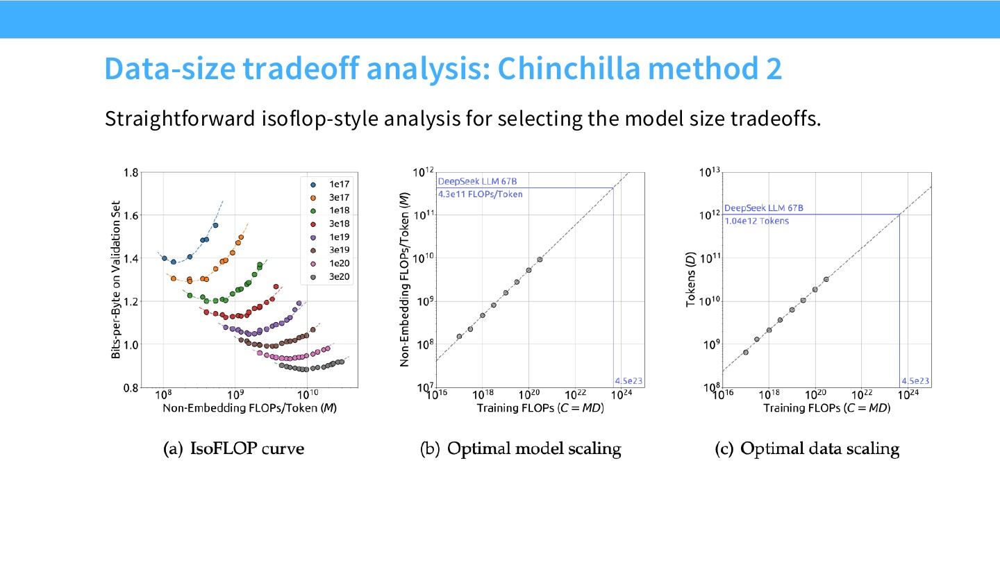

*图 7：不同计算预算下的 IsoFLOP 曲线及各自最优点；图像取自官方课件，对应讲解字幕区间：00:20:46–00:21:25。*

将各计算预算下的最低点连接起来，可以拟合 \(N_{\mathrm{opt}}(C)\)、\(D_{\mathrm{opt}}(C)\) 或直接拟合 \(L_{\mathrm{opt}}(C)\)。最关键的检验不是拟合点本身，而是完全不参与拟合的大模型。

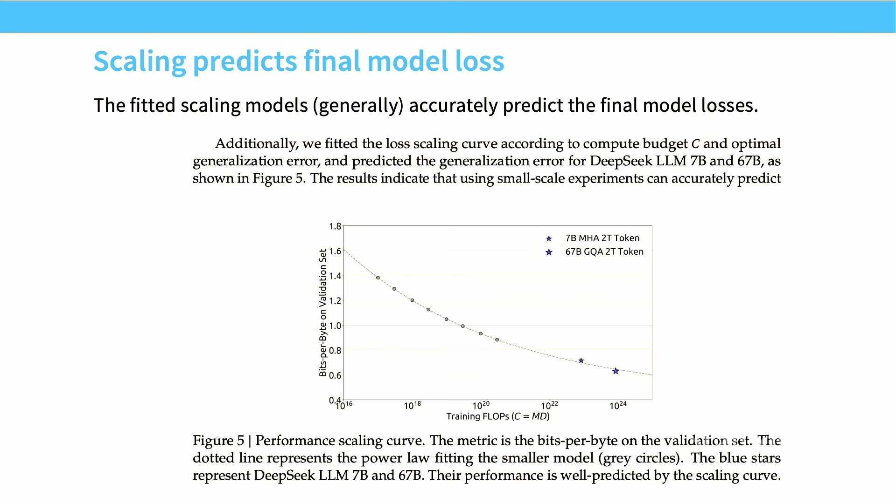

*图 8：小规模曲线对 7B 与 67B 留出模型最终损失的预测；视频关键帧 00:21:40，精确字幕区间：00:21:25–00:22:08。*

这张图是本讲较强的一类证据：蓝色星点代表更大尺度模型，落在小规模点拟合出的趋势附近。但仍要核对纵轴是 bits-per-byte、token NLL 还是其他单位。不同 tokenizer 下每 token 损失不可直接比较，按 byte 归一化可以缓解但也不能消除所有数据差异。

### 4.3 DeepSeek 风格的端到端 recipe

一个保守的执行版本如下：

1. **冻结候选 recipe**：模型族、数据混合、tokenizer、优化器、精度与训练日程先固定。
2. **选代理尺度**：覆盖至少一个数量级，避免所有点挤在极窄范围。
3. **联合扫 \(\eta,B\)**：每个尺度先粗扫，再围绕稳定盆地细扫。
4. **构造多个计算桶**：每个 \(C\) 下改变 \(N,D\)，得到 IsoFLOP 曲线。
5. **拟合下包络或联合损失面**：报告残差，不只报告指数。
6. **保留至少一个外推尺度**：不得用它重新挑公式。
7. **做小规模目标复现**：用预测的 \(N,D,\eta,B\) 启动较大但仍可承受的训练。
8. **仅在验收通过后上最终规模**：训练早期持续对照预测曲线与数值稳定性。

### 本章小结

DeepSeek 路线把超参数漂移本身也作为缩放对象：小尺度联合扫描学习率和批大小，再拟合随计算量变化的规律，并用大模型留出点检验最终损失。其力量来自留出验证，而风险来自粗网格、单位差异和 recipe 改变。

## 5. 近期模型案例：相同问题，不同答案

### 5.1 为什么跨论文比较比例很危险

课件依次讨论了 MiniCPM、DeepSeek、Qwen、Kimi K2、Hunyuan、LLaMA 3、MiniMax-01 和 StepFun。看起来都在谈“最佳规模”，实际定义常不同：

- 总参数还是激活参数；
- embedding 是否计入；
- 训练 FLOPs 是否按 \(6ND\) 近似；
- token 数是否包含重复数据；
- 稠密模型还是 MoE；
- loss 是 per-token、per-byte，还是下游准确率。

因此，不能把论文表格里的常数直接横向排序。首先要把定义对齐，再比较趋势。

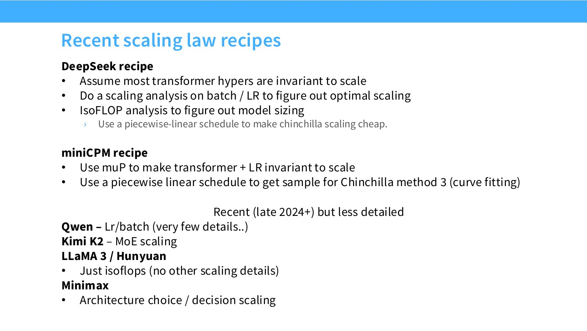

*图 9：MiniCPM 与 DeepSeek 等路线的课件归纳；图像取自官方课件，对应讲解字幕区间：00:28:09–00:29:12。*

### 5.2 MoE 中的稀疏度

Kimi K2 的案例引入了总专家数与每 token 激活专家数的区别。课件用

\[
s=\frac{E_{\mathrm{total}}}{E_{\mathrm{active}}}
=\frac{384}{8}=48
\]

描述专家稀疏度。

符号说明：

- \(E_{\mathrm{total}}\)：模型拥有的总专家数。
- \(E_{\mathrm{active}}\)：单个 token 路由并执行的专家数。
- \(s\)：总容量相对于单 token 计算的稀疏比。

这说明 MoE 的“模型大小”至少有两个轴：总参数决定容量和内存，激活参数更接近每 token 的计算。将稠密 Chinchilla 比例直接套在 MoE 上，会把容量与计算混在一起。

### 5.3 训练得更久并不自动推翻 Chinchilla

Hunyuan、LLaMA 3 等模型使用了明显高于早期 Chinchilla 经验的 token/parameter 比例，例如课件提到约 96:1 与 39:1。不能仅凭这些数字宣布“Chinchilla 错了”，因为实际目标可能不是只最小化一次预训练的训练 FLOPs：

- 推理成本会长期累计，小模型多训练可能更划算；
- 高质量数据规模和重复策略改变；
- 下游准确率与 NLL 的关系并非处处相同；
- post-training、长上下文与部署约束可能更重视基础模型形状。

换言之，Chinchilla 回答的是一个带特定成本函数的问题。成本函数变化，最优比例自然变化。

### 5.4 架构缩放也是实验对象

MiniMax-01 比较 softmax attention、线性 attention 与混合架构，试图判断不同计算尺度下哪种结构更合适。这类结果比单纯宽度缩放更难外推，因为架构之间的常数项、内存访问和长序列复杂度都不同。课件的证据支持其研究设置中的混合方案，但不足以推出“混合注意力在所有数据、长度和硬件上都最好”。

### 5.5 预训练与后训练尚未形成一体化缩放律

课堂问答特别指出：如何把 post-training 纳入同一套计算分配，目前仍缺少成熟统一答案。SFT、偏好优化、RL 或推理时计算会改变最终能力，而且常用指标不再只是基础模型 NLL。因此实践中应分别记录：

- 预训练计算与预训练损失；
- 后训练数据和计算；
- 目标任务指标；
- 推理预算与服务成本。

不要把预训练曲线的精确性延伸成对完整产品能力的精确预测。

### 本章小结

近期模型共同证明缩放分析有价值，却没有给出统一常数。跨论文比较前必须对齐参数、计算、token 和损失定义；MoE 还要区分总参数与激活参数。训练更久、混合架构和后训练问题都说明“最优”依赖实际成本函数。

## 6. StepFun：把最优超参数看成一张响应面

### 6.1 凸盆地为何有用

StepFun 在多个模型规模和数据量上扫描学习率、批大小。局部结果显示，损失关于 \(\log\eta\) 与 \(\log B\) 往往形成较平滑的凸状盆地。

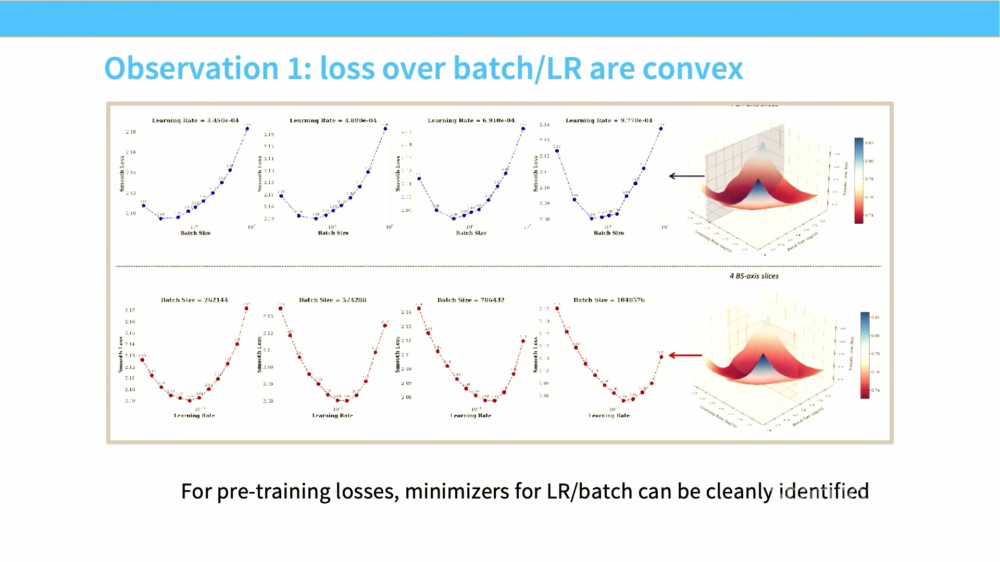

*图 10：固定学习率查看批大小切片、固定批大小查看学习率切片，都能辨认局部最小点；视频关键帧 00:35:00，精确字幕区间：00:34:46–00:35:20。*

这个观察有两层价值：

1. **优化价值**：可以用较少网格点拟合局部二次面，再补测预测最低点。
2. **风险价值**：可以看出盆地宽度；若不同配置损失几乎相同，应优先选择更稳定或吞吐更高者。

但“局部凸”不等于全局凸，更不保证换优化器或日程后仍保持同一曲面。

### 6.2 StepFun 的经验公式

课件给出的拟合为

\[
\eta_{\mathrm{Step}}=1.79\,N^{-0.713}D^{0.307},
\]

\[
B_{\mathrm{Step}}=0.58\,D^{0.571}.
\]

符号说明：

- \(\eta_{\mathrm{Step}}\)：该实验设定下的最优学习率。
- \(B_{\mathrm{Step}}\)：该实验设定下的最优批大小。
- \(N\)：模型规模。
- \(D\)：训练 token 数。

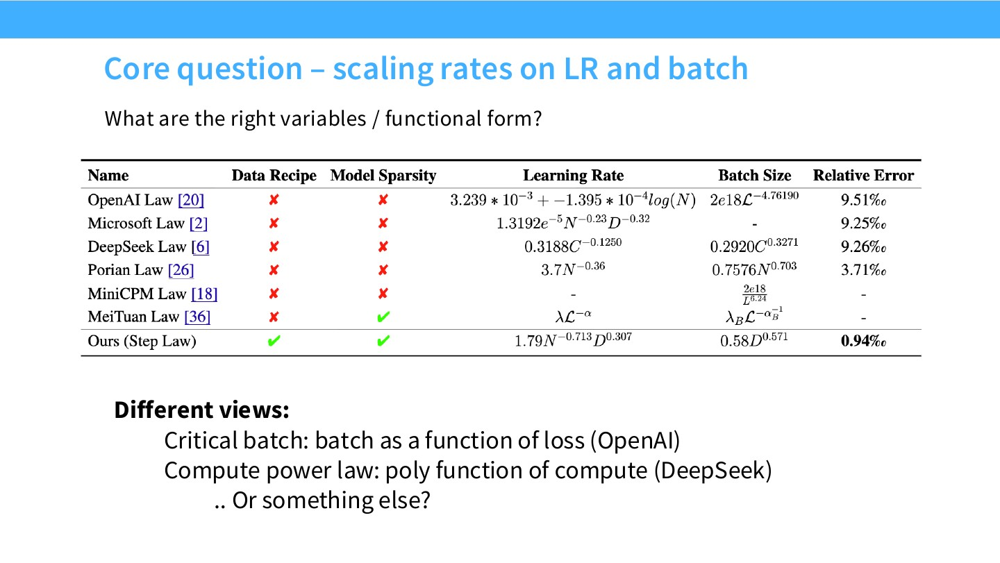

*图 11：StepFun 将最优学习率建模为 \(N,D\) 的函数，将最优批大小主要建模为 \(D\) 的函数；图像取自官方课件，对应课堂回顾字幕区间：00:38:04–00:39:03。*

在这个拟合中，固定 \(N\) 时，训练数据量 \(D\) 更大对应更高的最优学习率；固定 \(D\) 时，模型更大对应更低的学习率。这个方向看似反直觉，提醒我们：学习率“最优值”依赖损失比较发生在日程的哪个位置，也依赖是否对更长训练重新设计衰减。

### 6.3 不同文献公式不能只比指数

课件还列出类似

\[
B_{\mathrm{OpenAI}}\propto L^{-4.76190},
\qquad
B_{\mathrm{MiniCPM}}\propto L^{-6.24}
\]

的关系。即使形式相似，也不能直接说哪个指数更正确，因为 \(L\) 的定义、归一化、tokenizer、模型族和批大小单位都可能不同。比较前至少需要统一：

- 损失是自然对数、bits-per-token 还是 bits-per-byte；
- batch 是序列数、token 数还是全局 batch；
- 梯度累积和数据并行是否计入；
- 测量发生在训练中途还是完成衰减之后。

### 6.4 预算有限时怎么用

如果训练规模不大，且目标 recipe 与论文高度相似，现成公式可以作为默认值中心；但应在中心周围至少测几个倍数。例如对预测学习率 \(\hat\eta\)，测试 \(\hat\eta/2,\hat\eta,2\hat\eta\)，并对批大小做相邻档位测试。若目标训练极其昂贵，则不能因为公式来自“大论文”就省掉本地验证。

讲者把这种迁移判断概括为：公式表面上很科学，但决定“相似到什么程度”仍包含大量经验。这不是否定缩放律，而是要求把经验判断写进实验记录。

### 本章小结

StepFun 展示了学习率—批大小损失面的局部平滑性，并拟合了 \(\eta(N,D)\) 与 \(B(D)\)。这些公式适合作为搜索中心，不适合作为无需验证的答案。损失单位、batch 定义、日程和优化器不一致时，跨论文常数不可直接搬用。

## 7. 漂亮的拟合为什么仍会在大尺度失败

### 7.1 优化器比较必须公平调参

比较 AdamW、Lion、Muon、SOAP 等优化器时，若所有方法共用同一学习率和权重衰减，结果往往只说明“哪一个更接近这组默认值”。课件中的示例指出：

- AdamW 的有效学习率可能从 \(6\times10^{-4}\) 到 \(8\times10^{-3}\) 相差很大；
- Lion 的合适权重衰减可能约为 \(0.6\)，远离常见 AdamW 默认值；
- 学习率与权重衰减应至少做局部联合或分阶段扫描。

公平比较还要统一计算量、模型规模和 token/parameter 比例。一个优化器在相同 step 数下更快下降，可能只是每步计算更贵；在相同墙钟时间、相同 FLOPs 和相同 token 数下，结论可能不同。

### 7.2 拟合区间内漂亮，外推仍可能恶化或发散

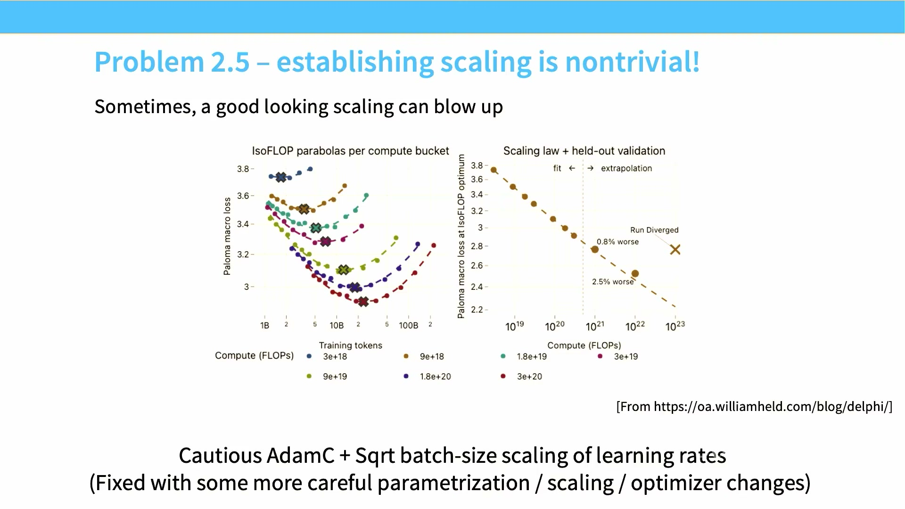

*图 12：小尺度 IsoFLOP 曲线很规则，但留出尺度出现约 0.8%、2.5% 恶化甚至发散；视频关键帧 00:48:10，精确字幕区间：00:47:23–00:49:18。*

这张图是整讲最重要的反例之一。左侧每个计算桶都有平滑抛物线，右侧外推却失败。可能原因包括：

- 初始化或残差分支随宽度改变，激活尺度漂移；
- 学习率没有按批大小或宽度缩放；
- AdamW 中权重衰减的有效强度随学习率改变；
- 数值精度、梯度裁剪或通信方式在大尺度发生变化；
- 目标点已经超出拟合区间太远。

课件提到通过更谨慎的参数化、AdamC 风格处理以及学习率按批大小平方根缩放等方式修复。这里的关键不是记住唯一补丁，而是把“训练稳定性”列为缩放实验的一等指标。

### 7.3 一个更稳健的失效诊断表

当大模型偏离预测时，可按顺序排查：

1. **先看是否数值发散**：loss spike、NaN、梯度范数、激活 RMS。
2. **再看是否优化不足**：训练损失和验证损失是否都比预测高。
3. **检查定义漂移**：计算量、参数量、token 数是否与拟合时同口径。
4. **检查 recipe 漂移**：数据、序列长度、注意力、归一化、精度是否改变。
5. **在当前尺度做局部 \(\eta,B,\lambda\) 扫描**：区分公式失效和实现错误。
6. **更新模型但保留旧留出点**：不要不断把失败点吸收进拟合后声称预测成功。

其中 \(\lambda\) 表示权重衰减系数。

### 本章小结

拟合优美不等于外推可靠。优化器必须分别调参，训练稳定性必须与最终损失一起建模。外推失败时应先区分数值发散、优化不足和定义/recipe 漂移，并保留真正的留出点。

## 8. Muon：它“能在大规模工作”不等于“已证明更优”

### 8.1 Muon 更新的核心

课件用以下简化形式描述 Muon：

\[
G_t=\nabla_{\theta}\mathcal{L}_t(\theta_{t-1}),
\]

\[
B_t=\mu B_{t-1}+G_t,
\]

\[
O_t=\operatorname{NewtonSchulz5}(B_t),
\]

\[
\theta_t=\theta_{t-1}-\eta O_t.
\]

符号说明：

- \(G_t\)：第 \(t\) 步梯度。
- \(B_t\)：带动量的梯度矩阵。
- \(\mu\)：动量系数。
- \(O_t\)：对 \(B_t\) 进行近似正交化后的更新方向。
- \(\eta\)：学习率。

若对矩阵做奇异值分解

\[
B_t=USV^\top,
\]

理想化的正交化方向近似为

\[
O_t\approx UV^\top.
\]

这相当于弱化各奇异方向幅值差异，让矩阵更新更接近谱范数受控。显式 SVD 在 GPU 上代价高，Muon 使用主要由矩阵乘法组成的 Newton–Schulz 迭代近似，因此更适合加速器。Muon 通常用于二维权重矩阵；偏置、归一化参数等向量仍可由 AdamW 处理。

*图 13：Muon 将动量梯度做近似正交化再更新参数；图像取自官方课件，对应讲解字幕区间：00:49:21–00:52:51。*

### 8.2 三类证据的强弱

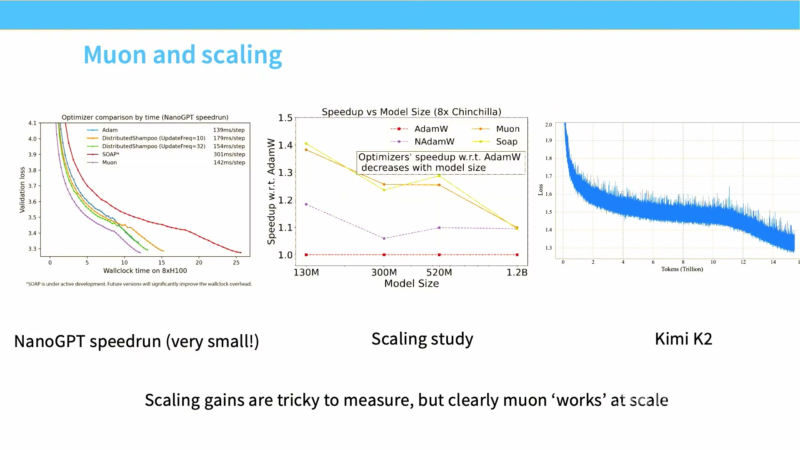

*图 14：从左至右是 NanoGPT speedrun、小模型缩放研究与 Kimi K2 大规模训练；视频关键帧 00:53:50，精确字幕区间：00:52:51–00:54:44。*

三类证据不能混为一谈：

- **小型 speedrun**：说明在特定实现与硬件上可能更快达到某损失，但规模太小。
- **跨尺度研究**：显示相对 AdamW 的加速随模型变大可能缩小，说明收益不是常数。
- **Kimi K2 大规模训练**：有力证明 Muon 可以在大规模稳定“工作”，但若缺少同预算 AdamW 消融，不能据此精确断言提升多少。

因此最稳妥结论是：Muon 已具备大规模可行性，但其相对优势仍需公平、同预算、同等调参的比较。

### 8.3 实际联合调参顺序

课堂问答给出很实用的策略：先联合搜索学习率和批大小，再在最优区域附近扫描权重衰减。原因是学习率与批大小的交互通常最强，而把每层学习率、每层优化器都加入搜索会导致组合爆炸。

推荐顺序：

1. 固定权重衰减到合理起点，粗扫 \((\eta,B)\)。
2. 在稳定盆地补细网格。
3. 固定候选 \((\eta,B)\)，局部扫权重衰减。
4. 若模型变宽，再检查参数化是否要求分层学习率。
5. 比较相同 FLOPs、token 与墙钟下的结果。

### 本章小结

Muon 通过近似正交化矩阵更新来控制谱方向，Newton–Schulz 迭代避免昂贵显式 SVD。现有案例证明它能扩展到大训练，但“小模型更快”和“大模型相对 AdamW 更优”仍是不同命题，必须公平调参与同预算比较。

## 9. μP 的出发点：跨宽度保持激活与特征学习

### 阅读 9.1 前：四个尺度工具和一个等宽玩具网络

μP 的推导反复问“宽度 \(n\) 增大时，一个量会怎样变”。先约定两种渐近记号：

\[
f(n)=O(g(n))
\]

表示存在与 \(n\) 无关的常数 \(c,n_0\)，使得 \(n\ge n_0\) 时
\(|f(n)|\le c|g(n)|\)。这是**上界**：\(f\) 至多按 \(g\) 的量级增长。

\[
f(n)=\Theta(g(n))
\]

表示同时存在与 \(n\) 无关的正数 \(c_1,c_2,n_0\)，使得
\(c_1|g(n)|\le |f(n)|\le c_2|g(n)|\)。这是**同阶**：既不会比 \(g\) 快很多，也不会比 \(g\) 小到消失。于是 \(O(1)\) 只表示有界，\(\Theta(1)\) 则表示保持非退化的常数量级；A1、A2 要的是后者。

对向量 \(x=(x_1,\ldots,x_n)\)，均方根和二范数的关系是

\[
\operatorname{RMS}(x)
=\sqrt{\frac{1}{n}\sum_{i=1}^{n}x_i^2}
=\frac{\|x\|_2}{\sqrt n}.
\]

因此“每个坐标的典型尺度为 \(\Theta(1)\)”更严谨地说是
\(\operatorname{RMS}(x)=\Theta(1)\)，它等价于
\(\|x\|_2=\Theta(\sqrt n)\)。二范数只概括整条向量的能量；若少数坐标异常大，仅凭二范数不能保证每个坐标都稳定。

对矩阵 \(W\)，本讲课件中的 \(\|W\|_*\) 指算子范数，也就是谱范数：

\[
\|W\|_{\mathrm{op}}
=\sup_{x\ne0}\frac{\|Wx\|_2}{\|x\|_2}
=s_{\max}(W).
\]

这里 \(s_{\max}\) 是最大奇异值。为避免与一些文献用
\(\|\cdot\|_*\) 表示“核范数”混淆，本讲义下文把它记作
\(\|\cdot\|_{\mathrm{op}}\)。它回答的是：矩阵在最容易被放大的输入方向上，最多能把二范数放大多少倍。

一个最简单的高斯方差例子可以连接“坐标尺度”和“初始化”。设
\(x_j\) 独立、均值为零、方差为 1，并令

\[
W_{ij}\overset{\mathrm{iid}}{\sim}\mathcal N(0,1/n),
\qquad
y_i=\sum_{j=1}^{n}W_{ij}x_j.
\]

在独立性假设下，

\[
\operatorname{Var}(y_i)
=\sum_{j=1}^{n}\operatorname{Var}(W_{ij}x_j)
=n\cdot\frac1n\cdot1
=1.
\]

也就是说，权重标准差取 \(1/\sqrt n\) 时，输入有 \(n\) 个
\(\Theta(1)\) 坐标，输出的每个坐标仍为 \(\Theta(1)\)，整条输出向量的二范数则为 \(\Theta(\sqrt n)\)。这里依靠的是零均值、近似独立时方差相加；若各项强相关，就不能照搬“平方根抵消”。

后面用一个等宽两层线性网络贯穿 A1 与 A2：

\[
x\in\mathbb R^n,\qquad
h=W_1x\in\mathbb R^n,\qquad
y=W_2h\in\mathbb R^n,
\]

\[
W_1,W_2\in\mathbb R^{n\times n},
\qquad
(W_l)_{ij}\sim\mathcal N(0,1/n).
\]

若 \(\operatorname{RMS}(x)=\Theta(1)\)，上面的方差计算预言
\(\operatorname{RMS}(h),\operatorname{RMS}(y)=\Theta(1)\)：这就是 A1 的等宽版本。A2 接着问：完成一步优化后，
\(\operatorname{RMS}(\Delta h)\) 和
\(\operatorname{RMS}(\Delta y)\) 能否也保持 \(\Theta(1)\)，既不随 \(n\) 消失，也不随 \(n\) 爆炸。

### 9.1 μP 想解决什么

标准参数化下，扩大网络宽度后最优学习率常发生漂移。μP（maximal update parametrization）的目标，是选择随宽度变化的初始化与学习率规则，使小模型调出的超参数更容易迁移。

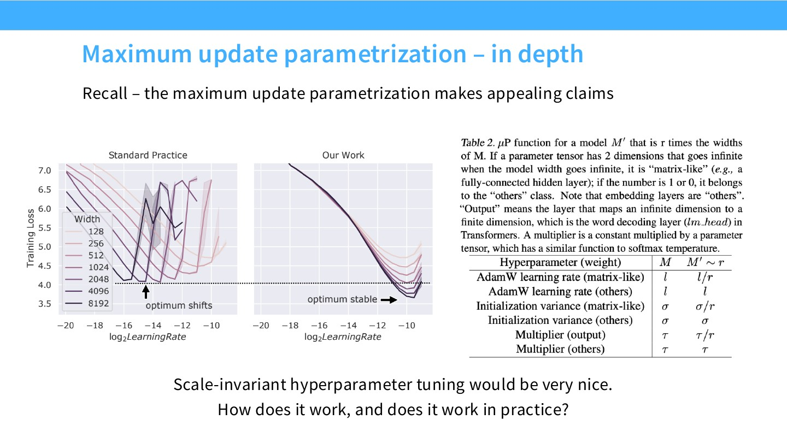

*图 15：标准参数化的最优学习率随宽度移动，而 μP 试图使其保持稳定；图像取自官方课件，对应讲解字幕区间：00:57:22–00:58:36。*

本讲通过两个条件建立直觉：

- **A1：初始化激活坐标为 \(\Theta(1)\)**。
- **A2：一次梯度更新造成的激活坐标变化为 \(\Theta(1)\)**。

若第 \(l\) 层宽度为 \(n_l\)，每个激活坐标都是常数量级，则整个向量的二范数为

\[
\|h_l\|_2=\Theta(\sqrt{n_l}).
\]

*图 16：A1 控制初始化激活，A2 要求更新后仍发生非退化的特征变化；视频关键帧 01:01:20，精确字幕区间：01:00:39–01:02:31。*

A2 是“特征学习”条件：宽度趋于无穷时，网络不能因为更新太小而冻结在初始化附近。若激活变化趋于零，模型接近 NTK/lazy training 极限；若变化爆炸，则训练不稳定。

### 9.2 从 A1 推导初始化尺度

考虑深线性网络

\[
h_l=W_lh_{l-1},
\]

\[
W_l\sim\mathcal{N}\!\left(0,\sigma_l^2 I_{n_l\times n_{l-1}}\right).
\]

符号说明：

- \(h_l\)：第 \(l\) 层激活向量。
- \(W_l\)：从 \(n_{l-1}\) 到 \(n_l\) 的权重矩阵。
- \(\sigma_l\)：单个权重元素的初始化标准差。
- \(n_{l-1},n_l\)：输入和输出宽度。

随机高斯矩阵的谱范数典型尺度为

\[
\|W_l\|_{\mathrm{op}}
\approx
\sigma_l\left(\sqrt{n_{l-1}}+\sqrt{n_l}\right).
\]

若希望把 \(\|h_{l-1}\|=\Theta(\sqrt{n_{l-1}})\) 映射为
\(\|h_l\|=\Theta(\sqrt{n_l})\)，一种谱尺度匹配为

\[
\sigma_l
=
\frac{\sqrt{n_l}}
{\sqrt{n_{l-1}}\left(\sqrt{n_l}+\sqrt{n_{l-1}}\right)}
=
\Theta\!\left[
\frac{1}{\sqrt{n_{l-1}}}
\min\!\left(1,\sqrt{\frac{n_l}{n_{l-1}}}\right)
\right].
\]

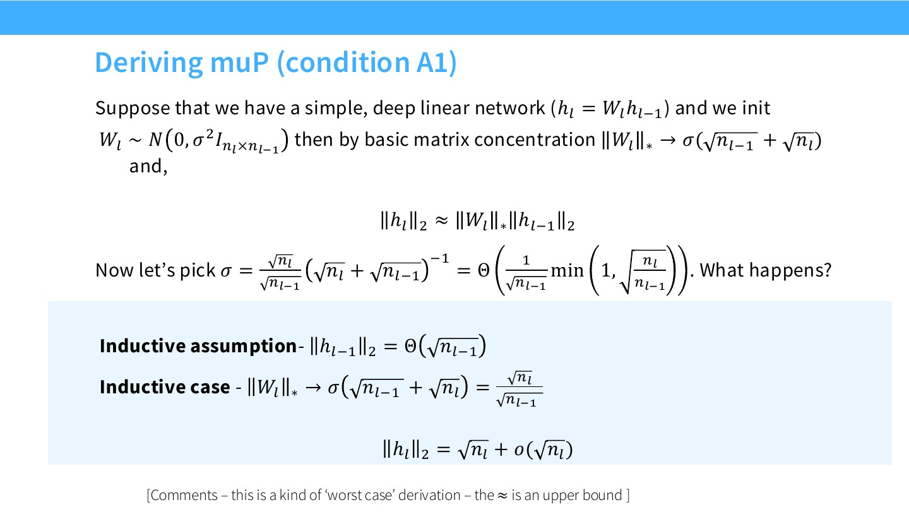

*图 17：用权重谱范数匹配输入、输出激活范数的宽度尺度；图像取自官方课件，对应讲解字幕区间：01:02:51–01:05:15。*

讲者强调这是偏“最坏方向”的谱范数论证，并非所有随机向量都严格达到上界。它适合建立宽度阶数直觉，不能替代具体架构中的完整 μP 规则。

### 9.3 从 A2 推导更新尺度

一次梯度下降后

\[
\Delta W_l
=-\eta_l\nabla_{W_l}\mathcal{L}
=-\eta_l\nabla_{h_l}\mathcal{L}\,h_{l-1}^{\top}.
\]

激活变化可展开为

\[
\Delta h_l
=W_l\Delta h_{l-1}
+\Delta W_l(h_{l-1}+\Delta h_{l-1}).
\]

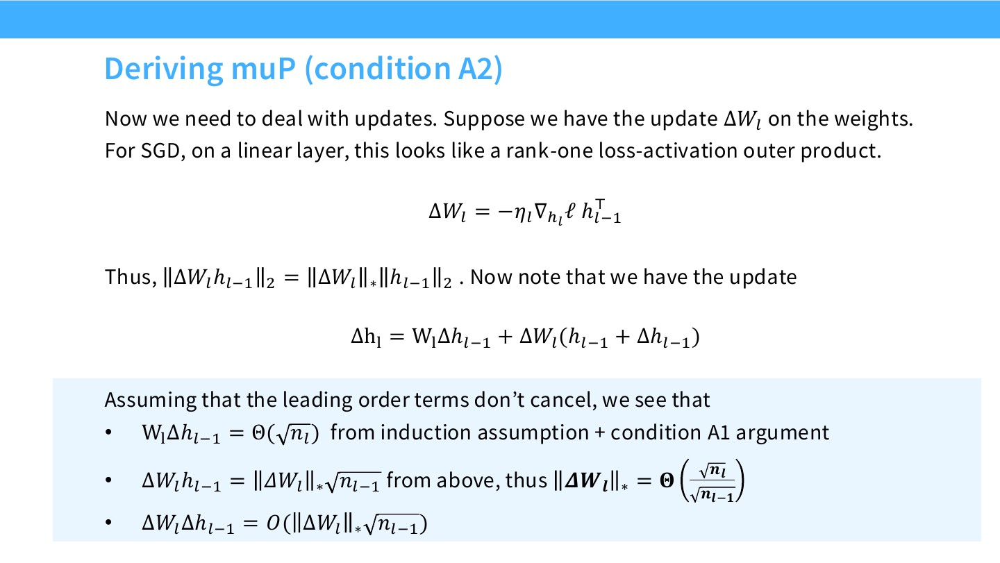

*图 18：当前层激活变化既来自下层变化传播，也来自本层权重更新；图像取自官方课件，对应讲解字幕区间：01:05:15–01:07:28。*

为了让 \(\Delta h_l\) 与 \(h_l\) 同为非退化尺度，课件给出的条件是

\[
\|\Delta W_l\|_{\mathrm{op}}
=\Theta\!\left(\sqrt{\frac{n_l}{n_{l-1}}}\right).
\]

先回到预备部分的等宽两层网络，观察单个矩阵元素的梯度。记
\(\delta_i=\partial\mathcal L/\partial h_i\)，则

\[
\frac{\partial\mathcal L}{\partial (W_1)_{ij}}
=\delta_i x_j.
\]

若输入坐标 \(x_j=\Theta(1)\)，并额外假设：

1. 标量损失的一步变化为 \(O(1)\)；
2. \(\Delta h_i=\Theta(1)\)，且
   \(\sum_i\delta_i\Delta h_i\) 的主导项没有精确抵消；
3. 梯度在宽度方向没有集中到极少数异常坐标，

那么逐坐标反向信号的课程级尺度是
\(\delta_i=\Theta(1/n)\)，从而

\[
\frac{\partial\mathcal L}{\partial (W_1)_{ij}}
=\Theta(1/n).
\]

对 SGD，单个参数的更新是

\[
\Delta (W_1)_{ij}
=-\eta_{\mathrm{SGD}}\,
\frac{\partial\mathcal L}{\partial (W_1)_{ij}}
=\Theta(\eta_{\mathrm{SGD}}/n).
\]

当 \(\eta_{\mathrm{SGD}}=\Theta(1)\) 时，每个权重元素改变
\(\Theta(1/n)\)。因为这一层的梯度是秩一外积，可以更直接地核对：

\[
\|\nabla_{W_1}\mathcal L\|_{\mathrm{op}}
=\|\delta x^\top\|_{\mathrm{op}}
=\|\delta\|_2\|x\|_2
=\Theta(1/\sqrt n)\,\Theta(\sqrt n)
=\Theta(1),
\]

\[
\Delta W_1x
=-\eta_{\mathrm{SGD}}\,\delta(x^\top x).
\]

由于 \(x^\top x=\Theta(n)\) 而 \(\delta_i=\Theta(1/n)\)，所以
\((\Delta W_1x)_i=\Theta(\eta_{\mathrm{SGD}})\)。常数学习率正好产生
\(\Theta(1)\) 的逐坐标激活变化，并与等宽情形所需
\(\|\Delta W\|_{\mathrm{op}}=\Theta(1)\) 一致。这里的关键不是把
\(\Delta W\) 的 \(n^2\) 个元素当成新抽取的独立噪声，而是保留梯度外积与当前输入之间的相关结构。

对 Adam，若二阶矩估计已经跟随梯度尺度、偏置修正不改变宽度阶数，且数值稳定项 \(\epsilon\) 没有主导分母，则

\[
\frac{m_{ij}}{\sqrt{v_{ij}}+\epsilon}
=\Theta(1).
\]

Adam 抹去了原始梯度的 \(\Theta(1/n)\) 幅度，因此单个参数更新变为
\(\Delta(W_1)_{ij}=\Theta(\eta_{\mathrm{Adam}})\)。要恢复上面所需的
\(\Theta(1/n)\) 元素更新，就需要

\[
\eta_{\mathrm{Adam}}=\Theta(1/n).
\]

这解释了为什么 SGD 和 Adam 不能共享同一条宽度规则：前者保留梯度幅值与秩一外积，后者近似逐坐标归一化，归一化后的更新也不再等同于原始秩一梯度。Adam 的 \(1/n\) 结论采用 μP 的最大、特征对齐更新尺度；若把归一化后的各项假设成独立随机符号，会得到不同的平方根估计。这个解释还依赖稳定的矩估计、\(\epsilon\) 不主导、无稀疏异常梯度以及特征对齐；训练最初几步、混合精度下或梯度极小时，这些条件可能不成立。

把等宽结论推广到 \(n_{l-1}\ne n_l\) 后，课件给出的 SGD 课程规则是

\[
\eta_l=\Theta\!\left(\frac{n_l}{n_{l-1}}\right).
\]

对于 Adam 类逐坐标归一化优化器，课件给出的课程规则是

\[
\eta_l\propto\frac{1}{n_{l-1}}.
\]

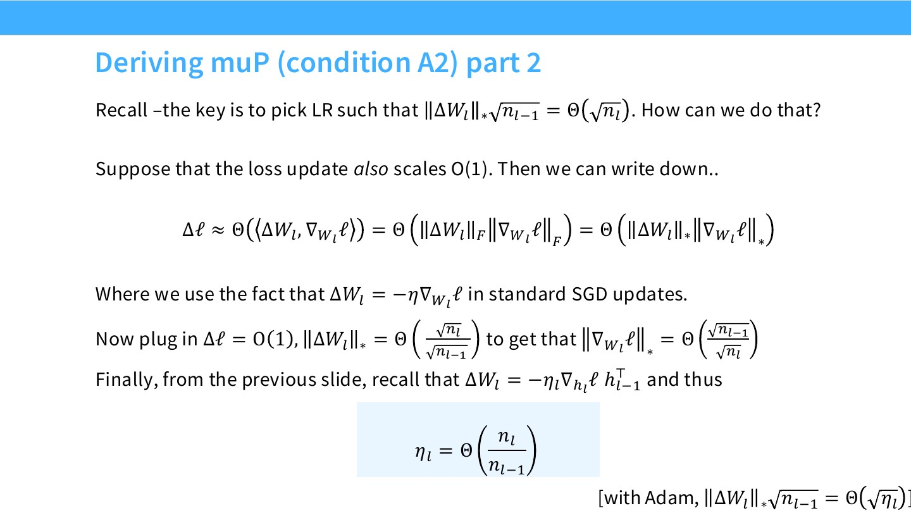

*图 19：不同优化器对应不同的宽度依赖学习率规则；图像取自官方课件，对应讲解字幕区间：01:07:28–01:10:24。*

这里必须透明降级：课堂并未给出一般深度、非线性、残差连接和 Adam 状态下的完整证明；讲者也把“损失单步改变为 \(O(1)\)”称为推导中最不令人满意的假设之一。上面的等宽逐坐标计算只是解释课程规则为何合理，不能替代完整 μP 理论。

不过，这些规则可以直接做实验验伪。固定深度、数据和训练步数，取宽度
\(n\in\{128,256,512,1024\}\)，分别测试：

- SGD：固定基础学习率，对比错误的 \(1/n\) 学习率；
- Adam：采用 \(1/n\) 学习率，对比错误的固定学习率；
- 每个宽度都记录初始化
  \(\operatorname{RMS}(h_l)\)、第一步
  \(\operatorname{RMS}(\Delta h_l)\)、更新谱范数和短程 loss；
- 在相同倍率的基础学习率网格上比较最优点是否跨宽度重合。

若参数化正确，应看到 A1 的激活 RMS 与 A2 的更新 RMS 都保持常数量级，而且最优基础学习率的曲线较好重合；若它们随宽度趋零、爆炸或最优点持续漂移，就说明假设或实现至少有一处失效。

### 本章小结

μP 通过 A1 保持初始化激活非退化，通过 A2 保持单步特征变化非退化。深线性模型的谱尺度分析给出初始化与分层学习率的宽度依赖；其中包含上界、无抵消和损失变化尺度等假设，应用到真实 Transformer 时必须遵循完整参数分类。

## 10. 从“baby μP”到 Transformer：规则、迁移与失效点

### 10.1 最小回顾

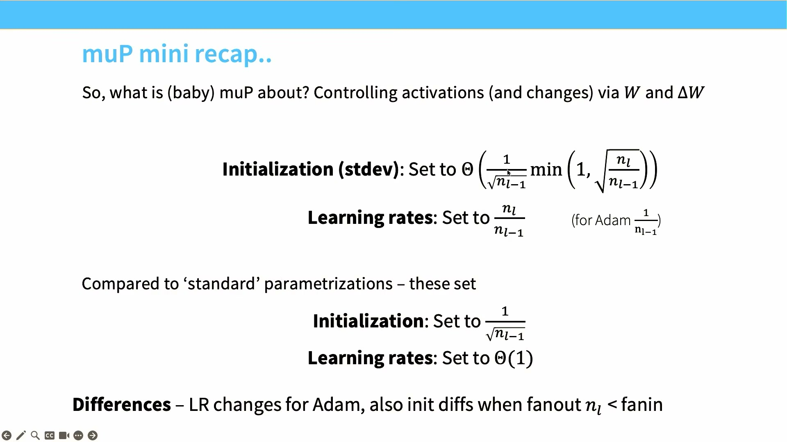

*图 20：baby μP 用 \(W\) 与 \(\Delta W\) 同时控制激活及其变化；视频关键帧 01:10:50，精确字幕区间：01:10:24–01:11:44。*

对初学者而言，可以先记住：

- 标准参数化常用 \(\sigma\propto1/\sqrt{\text{fan-in}}\)，学习率近似不随宽度变。
- μP 会根据 fan-in、fan-out 以及参数在网络中的角色，改变初始化或学习率缩放。
- SGD 与 Adam 的更新归一化不同，不能共享同一宽度规则。
- “方差”与“标准差”相差平方，阅读表格时必须确认列名。

### 10.2 Transformer 中不是所有参数都同类

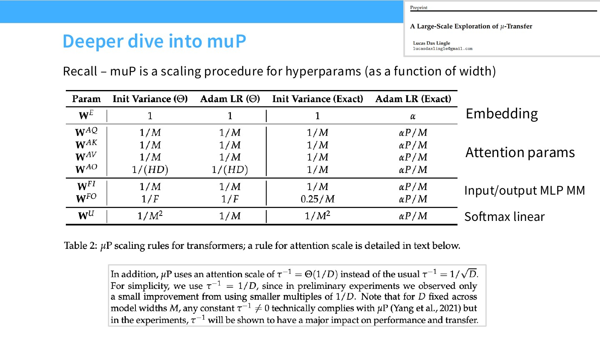

*图 21：课件列出 embedding、隐藏矩阵、输出层和注意力等参数的 μP 处理；图像取自官方课件，对应讲解字幕区间：01:12:38–01:13:18。*

真实 Transformer 中至少要区分：

- 输入 embedding；
- 隐藏到隐藏的矩阵；
- 输出/readout 矩阵；
- 向量参数和归一化增益；
- attention logits 的缩放。

对 batch 大小 \(B\)、序列长度 \(S\)、注意力头数 \(H\) 和单头维度
\(d_h\)，可把 query 与 key 写成

\[
Q,K\in\mathbb R^{B\times S\times H\times d_h}.
\]

对 batch \(b\)、头 \(h\)、query 位置 \(s\) 和 key 位置 \(t\)，未缩放的点积 logit 是

\[
z_{bsth}
=\sum_{r=1}^{d_h}Q_{bshr}K_{bthr}.
\]

若初始化时 \(Q_{bshr}\) 与 \(K_{bthr}\) 近似独立、均值为零，坐标方差分别为
\(\sigma_Q^2,\sigma_K^2=\Theta(1)\)，则

\[
\operatorname{Var}(z_{bsth})
=d_h\sigma_Q^2\sigma_K^2
=\Theta(d_h).
\]

标准 attention 使用

\[
\ell_{bsth}^{\mathrm{std}}
=\frac{z_{bsth}}{\sqrt{d_h}},
\]

因此在“独立、零均值、坐标方差为常数”的**随机初始化假设**下，
\(\operatorname{Var}(\ell^{\mathrm{std}})=\Theta(1)\)。它保持的是初始化随机 logit 的非退化方差，避免 softmax 立即变得过平或过尖。

课件中的 μP attention 使用

\[
\ell_{bsth}^{\mu\mathrm P}
=\frac{z_{bsth}}{d_h}.
\]

在同一个独立初始化计算下，它的方差为 \(\Theta(1/d_h)\)，会随宽度趋零；这不是计算错误，而是 μP 选择的不同极限。训练发生特征学习后，query 与 key 的坐标贡献可能形成相关、对齐的 \(O(d_h)\) 和，而不再只是独立噪声的 \(O(\sqrt{d_h})\) 和；除以 \(d_h\) 保持的是这种**相关特征信号及其更新**为 \(O(1)\)，从而得到稳定的宽度极限。

所以 \(1/\sqrt{d_h}\) 与 \(1/d_h\) 不能脱离其余参数化互换：

- 标准缩放服务于标准初始化下的随机 logit 方差；μP 缩放服务于完整 μP 下的 feature-learning 极限。
- 只把已调好的标准模型分母改成 \(d_h\)，会改变 softmax 温度、注意力熵和梯度尺度；反向替换同样会破坏 μP 的宽度迁移。
- μP 规则必须与 Q/K 投影初始化、分层学习率、readout 和其他参数类别一起应用，并重新扫描基础学习率。
- 若扩宽模型时保持 \(d_h\) 不变、只增加 \(H\)，这两个分母本身都不随总宽度变化，不能把“总宽度缩放”误写成“单头维度缩放”。
- 若 Q/K 坐标方差不是 \(\Theta(1)\)，或者位置编码、归一化、相关性结构改变，应从实际方差与更新尺度重新计算，不能直接套用上述结论。

一个最小验收实验是对多组 \(d_h\) 同时记录初始化 logit 方差、softmax 熵、一步更新后的 logit RMS 和短程最优基础学习率：标准参数化应主要保持初始化 logit 方差，完整 μP 则应关注训练后特征更新尺度和学习率曲线是否跨宽度重合。

### 10.3 学习率迁移的实验证据

*图 22：宽度 128、512、2048 的模型在 μP 下出现接近的最佳基础学习率；图像取自官方课件，对应讲解字幕区间：01:13:18–01:13:55。*

图中的最佳基础学习率大致聚集在 \(2^{-6}\) 附近，这正是 μP 希望实现的现象。但验证标准不应只看最优点横坐标：

- 曲线形状和稳定区是否也相似？
- 最佳点差异是否小于搜索网格分辨率？
- 更深、不同 head 数或不同序列长度时是否仍迁移？
- 目标训练是否加入了代理实验没有的参数与正则化？

### 10.4 常见破坏因素

课件用 RMSNorm 增益、Lion 和权重衰减做压力测试，说明不完整的参数化会破坏迁移。

*图 23：新增可训练 RMSNorm gain 后，若未按 μP 正确分类与缩放，最优学习率重新随宽度漂移；图像取自官方课件，对应讲解字幕区间：01:14:24–01:14:41。*

*图 24：加入固定权重衰减后，原本的学习率迁移可能被破坏；图像取自官方课件，对应讲解字幕区间：01:14:58–01:15:11。*

原因在于 AdamW 的衰减更新通常包含 \(\eta\lambda\theta\)。当学习率按宽度改变，而 \(\lambda\) 固定时，有效衰减也改变。优化器的预条件、解耦衰减以及向量参数都必须纳入整体尺度分析。

### 10.5 μP 不是“设置一次，永不调参”

μP 最适合迁移**基于宽度变化**的超参数。若同时改变以下因素，仍应重新验证：

- 深度与宽深比；
- attention head 维度或序列长度；
- MoE 路由与激活专家数；
- 优化器、权重衰减和梯度裁剪；
- 归一化结构、残差缩放与新增可训练增益；
- 数据混合和训练日程。

实践中可把 μP 当作降低搜索维度的工具：先在小模型上较精细地调基础学习率，再在目标尺度做少量局部验证，而不是完全取消验证。

### 本章小结

Transformer μP 必须按参数角色应用，attention、输出层、向量参数和归一化增益不能一概而论。它可以显著改善宽度间的学习率迁移，但 RMSNorm gain、Lion、权重衰减等新增因素会破坏不完整的规则，因此仍需目标尺度局部验收。

## 总结与延伸

### 一套可直接执行的应用缩放律 recipe

下面把全讲压缩成一个从研究问题到最终大训练的流程。

**步骤 1：写清目标函数。**  
确定要最小化的是训练 FLOPs、墙钟、训练成本、推理成本，还是在固定延迟下最大化下游能力。没有目标函数，“计算最优”没有唯一含义。

**步骤 2：冻结定义与训练 recipe。**  
明确 \(N,D,C,L,B\) 的口径，记录 tokenizer、数据混合、架构、优化器、精度和学习率日程。任何改变都可能导致新的一族缩放律。

**步骤 3：先解决跨尺度稳定性。**  
选择完整 μP、经过验证的参数化，或承认每个尺度都要重新调参。用激活 RMS、梯度范数和短跑测试排除明显发散。

**步骤 4：建立代理模型梯子。**  
选择 3–5 个相邻尺度，保持架构族一致并覆盖足够宽的范围。不要只在极小范围拟合幂律。

**步骤 5：联合扫描学习率与批大小。**  
粗网格找到稳定盆地，局部细扫；随后在候选区域扫描权重衰减。记录损失以外的吞吐、墙钟和稳定性指标。

**步骤 6：用 WSD 降低数据轴扫描成本。**  
共享 warmup 与 stable 主干，在多个 token checkpoint 分叉做衰减，得到可比较的最终损失。

**步骤 7：做 IsoFLOP 或联合损失拟合。**  
在多个计算桶中扫描 \(N,D\)，拟合下包络或 \(L(N,D)\)。报告拟合区间、残差、搜索网格和单位。

**步骤 8：拟合超参数缩放，但保留不确定性。**  
得到 \(\eta_{\mathrm{opt}}(N,D,C)\)、\(B_{\mathrm{opt}}(N,D,C)\) 时，不要只保存单条曲线；同时保存稳定区宽度和相邻候选损失。

**步骤 9：设置真正的留出尺度。**  
至少一个较大代理模型完全不参与公式选择。预先定义验收阈值，例如损失误差、是否发散、吞吐与墙钟偏差。

**步骤 10：只在留出验收后启动最终训练。**  
最终训练早期持续比较观测曲线与预测区间；若偏离，先局部调参和诊断，不要盲目继续烧计算。

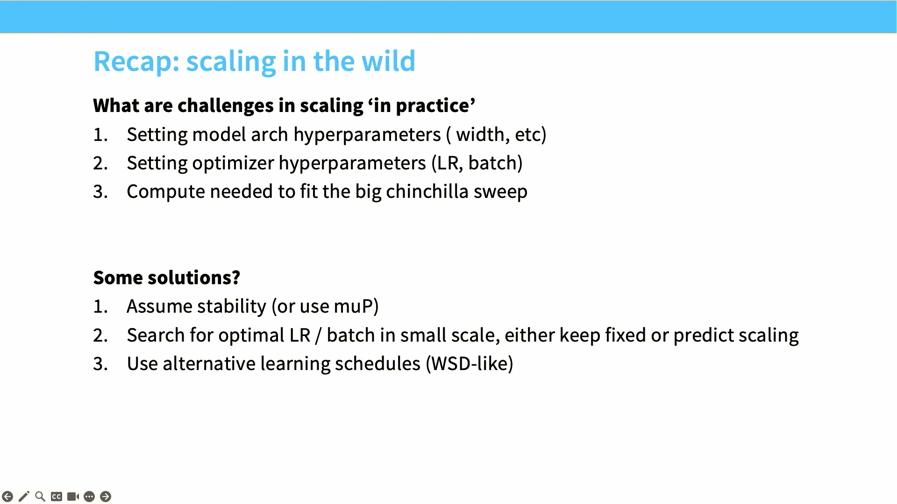

*图 25：实践中的三大困难是架构超参数、优化器超参数和昂贵的 Chinchilla 扫描；对应工具是稳定参数化/μP、小尺度超参数搜索与 WSD；视频关键帧 01:16:20，精确字幕区间：01:15:52–01:16:53。*

### 最应保留的五条判断

1. **缩放律是条件规律。** 改了数据、架构、优化器或日程，就可能改了规律。
2. **留出外推比拟合优度重要。** 拟合区间内的漂亮曲线不能证明大尺度安全。
3. **学习率、批大小、权重衰减相互作用。** 单独迁移一个数字通常不够。
4. **μP 和 WSD 解决的是不同问题。** μP 改善跨宽度超参数迁移；WSD 复用训练主干、降低跨数据量测量成本。
5. **“能工作”与“更优”不同。** Muon、混合注意力或高 token/parameter 比例的成功案例，需要同预算消融才能形成比较结论。

### 常见误解

- **误解：Chinchilla 永远规定 20 token/parameter。**  
  纠正：比例依赖计算、损失和成本定义；推理成本与实际产品目标会改变最优点。

- **误解：μP 会自动迁移所有超参数。**  
  纠正：它主要处理宽度参数化；新增归一化增益、优化器或权重衰减仍可能破坏迁移。

- **误解：WSD 的 stable checkpoint 已经是最终模型。**  
  纠正：它通常要从 checkpoint 再完成衰减，才与完整训练终点公平比较。

- **误解：幂律小数位很多，预测就很精确。**  
  纠正：精度受网格密度、测量噪声、单位与外推距离限制。

- **误解：小模型 speedrun 冠军必然在大模型上领先。**  
  纠正：优化器收益会随规模、硬件和每步成本改变。

### 进一步思考

本讲留下了几个尚未解决、却极具实践价值的问题：

1. 怎样把预训练、post-training 与推理时计算放进统一成本模型？
2. 怎样为 MoE 同时建立总参数、激活参数、路由负载与通信成本的缩放律？
3. 能否让缩放预测输出可信区间，而不是单点最优值？
4. 当架构族发生离散变化时，怎样判断旧缩放律仍可迁移到多远？
5. 能否把早期训练曲线、梯度噪声和激活统计结合起来，形成在线停止或重规划规则？

这些问题共同指向一个结论：真实世界的缩放不是发现一条神奇直线，而是建立一套从小实验、显式假设、留出验证到大训练监控的闭环。

### 本章小结

应用缩放律的完整闭环是：定义目标与口径，冻结 recipe，建立稳定代理模型，联合调学习率与批大小，用 WSD 和 IsoFLOP 高效采样，拟合并保留不确定性，最后用真正的留出尺度验收。没有单一银弹；可靠性来自可追踪的假设和逐级验证。
