# Lecture 12：Evaluation——我们究竟在测什么？

> 课程：Stanford CS336 *Language Modeling from Scratch*（Spring 2026）  
> 讲次：Lecture 12 · Evaluation  
> 视频：[Stanford Online 原始课程视频](https://www.youtube.com/watch?v=JpAxdTWQJxM)  
> 时长：01:18:34  
> 本讲核心：评测不是训练完成后的“打分环节”，而是决定数据、模型、系统和研究方向的目标函数。


这份讲义面向第一次系统接触大模型评测的读者。读完后，你应该能回答五个问题：perplexity 到底测了什么；考试、聊天和 agent benchmark 的评分对象有何不同；为什么 LLM judge 仍需要 rubric；污染、数据错误和评分器漏洞如何制造虚假进步；以及如何从真实目标反推一套可解释的 evaluation suite。

在进入正文之前，我们先把本讲反复用到的一个区分刻在脑子里：**构念（construct）与指标（metric）的区分**。评测工程中绝大多数“分数很高但结论错误”的事故，根源都不在算术，而在于把某个方便测量的指标误当成了我们真正关心的构念。全讲的展开顺序也遵循一条从“最内部的信号”到“最外部的系统”的链条：先从语言模型原生输出的概率出发（perplexity），再到有标准答案的考试题，再到没有标准答案的开放式对话与 LLM judge，再到在真实环境中执行动作的 agent 系统，最后讨论安全、真实性、有效性这三个横切维度，以及如何把它们组装成一套可解释的评测套件。

## 1. Evaluation 为什么会反过来塑造模型

很多人把评测想成一条机械流水线：准备若干 prompt，让模型回答，和标准答案比较，再把分数汇总。真正困难的部分其实发生在第一步之前：**我们想测的抽象能力是什么，观测到的数字又是否真能代表它？**

测量学里可以把两者区分为：

- **构念（construct）**：我们真正关心但不能直接观察的东西，例如知识、推理、帮助性、安全性、真实工作能力。
- **指标（metric）**：可运行、可重复的代理量，例如 perplexity、accuracy、pairwise win rate、任务通过率。

指标只是构念的一个操作化定义。一个 benchmark 分数很高，只能证明系统在该协议下表现好，不能自动推出“模型整体更聪明”。

这个区分之所以重要，是因为从构念到指标的映射是多对一且有损的：同一个构念可以被许多指标近似，而任何一个指标都只捕捉构念的某一个投影。心理学测量中把“指标是否真的测到了目标构念”称为**构念效度（construct validity）**，本讲第 9 节讨论的有效性威胁——污染、错题、评分器漏洞——本质上都是构念效度被破坏的具体机制。

### 1.1 “好模型”至少有四种不等价定义

课程开场故意展示四种答案：在若干基准上的综合能力最高；给定推理成本时能力最好；最受人类偏好；或者在真实 API/产品中最常被使用。它们可能相关，却绝不等价。


*图 1：聚合能力榜把多个任务压成一个数，便于比较，但权重与任务选择本身就是价值判断。（视频 `00:02:47–00:03:18`）*

聚合指数的问题值得停下来细看。设我们有 $K$ 个任务，模型在第 $k$ 个任务上的归一化分数为 $s_k\in[0,1]$，聚合指数通常形如

$$
\bar{s}=\sum_{k=1}^{K}w_k\,s_k,\qquad \sum_{k=1}^{K}w_k=1,\ w_k\ge 0.
$$

- $s_k$：第 $k$ 个任务上的分数。
- $w_k$：第 $k$ 个任务的权重。
- $\bar{s}$：加权聚合后的总分。

这个公式里隐藏着两个无法从数据中学出的价值判断：一是**选了哪些任务进入集合**（覆盖面），二是**每个任务的权重 $w_k$**。两个权重向量不同的榜单，完全可以给出相反的排名；而“平均分”这种看似中立的默认选择，实际上隐含了“所有任务同等重要”这一非常强的主张。更微妙的是，当所有模型在多数任务上趋近饱和时，总分差异会被个别未饱和任务主导，此时聚合指数实际上只是那一两个任务的化身。

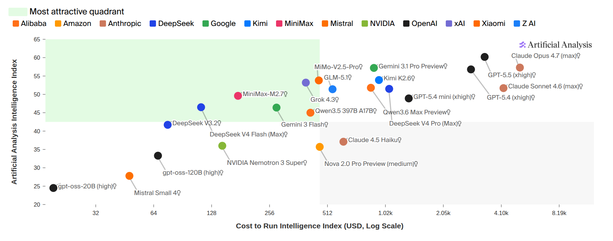
*图 2：加入推理成本后，“最好”从单一排名变为能力—价格的 Pareto 选择。（视频 `00:03:18–00:03:52`）*

引入成本维度后，“谁最好”这个问题甚至不再是全序问题。若系统 A 在每个能力维度上不弱于 B、且至少一个维度更强、成本还不高于 B，我们说 A **Pareto 占优** B；但更多时候两个系统互不占优，此时不存在客观最优，只有给定预算约束下的最优。这也正是图 2 中 Pareto 前沿的含义：前沿上的每个点都对应一种合理的“好”，选哪一个取决于用户的成本—能力权衡，而不是榜单本身。

同一个模型还会因 decoding 参数、工具权限、上下文长度和 agent scaffold 不同而得到不同结果。因此评测报告至少要说明：测的是基础模型、聊天模型，还是完整系统；温度和采样次数是多少；是否能检索、执行代码或多轮交互；预算和超时时间如何设置。

> [!NOTE]
> 一份最小合格的评测报告应当让读者能够回答：“如果我用同样的协议重跑，能否在误差范围内复现这个数字？”凡是无法回答这一点的数字，都应被视为传闻而非测量。

### 1.2 指标会成为研发的方向盘

如果团队以 perplexity 为唯一目标，数据工作会偏向更干净、更匹配目标分布的文本；如果目标是 SWE-Bench，资源会流向代码、仓库环境、工具调用与长程 agent；如果只追求人类偏好，模型可能学会更长、更自信、更讨喜的回答。评价函数既“观察”系统，也通过选择压力“塑造”系统。

这个现象有一个广为人知的名字：**Goodhart 定律**——“一项测量一旦成为目标，它便不再是好的测量”。在机器学习语境下它有一个精确的机制：当我们针对指标 $m$ 做优化（无论是显式的强化学习，还是隐式的数据筛选与超参搜索），我们实际上是在最大化 $m$ 而非构念 $c$；只要 $m$ 与 $c$ 之间存在任何残差方向，优化压力就会沿着残差方向推进，直到 $m$ 被“刷”到与 $c$ 脱钩。第 4 节 AlpacaEval 的长度偏差、第 9 节的 benchmark 污染，都是这一定律的实例。

> **初学者提示**：看到排行榜时，先不要问“谁第一”，而要问“它把什么定义成了好，以及什么被排除在外”。

### 本章小结

Evaluation 的首要问题不是怎么算分，而是构念是否被正确操作化。能力、成本、偏好和真实使用代表不同目标；模型、scaffold 与运行预算也必须明确分开。

## 2. Perplexity：概率模型最自然的内部评价

语言模型的原生输出是下一个 token 的概率分布。因此最直接的评价不是让它参加考试，而是检查它给真实文本分配了多大概率。

为什么从概率出发是“自然”的？因为训练目标本身就是最大似然：模型参数 $\theta$ 是通过最小化语料上的负对数似然学出来的。在同样的量纲上评价模型，相当于在与训练一致的坐标系里读数，不需要任何额外的任务转换层。这一点在第 3 节会变得重要——一旦换成考试题，我们就引入了 prompt 格式、选项解析等一层“转接器”，测量的纯净度随之下降。

### 2.1 从自回归分解到平均负对数似然

给定 token 序列 $x_{1:T}$，自回归模型把联合概率分解为：

$$
p_\theta(x_{1:T})=\prod_{t=1}^{T}p_\theta(x_t\mid x_{<t}).
$$

- $x_t$：第 $t$ 个 token。
- $x_{<t}$：当前 token 之前的上下文。
- $T$：参与评价的 token 数。
- $\theta$：模型参数。

这个分解是链式法则 $\,p(x_{1:T})=\prod_t p(x_t\mid x_{<t})\,$ 与模型条件化假设的结合：链式法则对任意联合分布恒成立，自回归模型额外规定每个条件分布由同一个参数化网络 $p_\theta$ 给出，且只依赖前缀 $x_{<t}$。值得强调的是，链式分解本身没有引入任何近似——它不是模型假设，而是概率恒等式；真正的假设在于用神经网络去参数化每一个条件分布。

直接相乘会得到极小数，也不便跨长度比较，所以使用每 token 平均负对数似然：

$$
\operatorname{NLL}(x_{1:T})=-\frac{1}{T}\sum_{t=1}^{T}\log p_\theta(x_t\mid x_{<t}).
$$

- $\operatorname{NLL}$：平均负对数似然，越小越好。
- $\log$：这里默认自然对数。

取对数有两个作用：一是把连乘变成连加，避免 $T$ 很大时的数值下溢（$T=10^5$ 时联合概率可以轻松低于 $10^{-100000}$，远超浮点表示范围）；二是把“平均每个 token 的不确定性”这一量从乘性变成加性，使不同长度的序列可以在同一尺度上比较。除以 $T$ 是关键一步：不做归一化的话，长文本几乎必然得到更大的总 NLL，指标会系统性地惩罚长度而非惩罚预测质量。

Perplexity（PPL）只是把平均 NLL 指数化：

$$
\operatorname{PPL}(x_{1:T})
=\exp\!\left(-\frac{1}{T}\sum_{t=1}^{T}\log p_\theta(x_t\mid x_{<t})\right).
$$

- $\operatorname{PPL}$：困惑度，$\operatorname{PPL}=\exp(\operatorname{NLL})\ge 1$，越小越好。

直觉上，PPL 可以粗略理解为模型在每一步面对的“等效选择数”。但这只是帮助理解的比喻；严格定义仍是平均 NLL 的指数。

这个比喻可以这样精确化：如果模型在每个位置都把概率均匀分配在 $k$ 个候选上，即 $p_\theta(x_t\mid x_{<t})=1/k$，那么 $\operatorname{NLL}=\log k$，$\operatorname{PPL}=\exp(\log k)=k$。也就是说，PPL 等于“若不确定性是均匀的，需要多大的词表才能产生同样的平均惊讶程度”。一般模型的分布并不均匀，PPL 是把非均匀的逐 token 不确定性折算成等效均匀分支因子 $\exp(\operatorname{NLL})$ 的几何平均：

$$
\operatorname{PPL}
=\Bigl(\prod_{t=1}^{T}\frac{1}{p_\theta(x_t\mid x_{<t})}\Bigr)^{1/T},
$$

即每步“惊讶度” $1/p_\theta(x_t\mid x_{<t})$ 的几何平均。几何平均对个别极端惊讶的 token（$p$ 接近 0）非常敏感，这解释了为什么少量分布外 token 就能把整段文本的 PPL 显著拉高。

### 2.2 必须纠正的数学问题：熵不是最小 perplexity

先把三个容易混淆的量展开。设离散随机变量的可能结果为 $x\in\mathcal X$，真实分布为 $t(x)$，模型给出的分布为 $p(x)$；并假设只要 $t(x)>0$，就有 $p(x)>0$。使用自然对数时：

$$
H(t)=-\sum_{x\in\mathcal X}t(x)\log t(x),
$$

$$
H(t,p)=-\sum_{x\in\mathcal X}t(x)\log p(x),
$$

$$
D_{\mathrm{KL}}(t\Vert p)
=\sum_{x\in\mathcal X}t(x)\log\frac{t(x)}{p(x)}.
$$

- $H(t)$：真实分布自身的熵，表示数据本身不可消除的不确定性。
- $H(t,p)$：用模型分布 $p$ 给真实样本编码时的平均负对数概率，也就是交叉熵。
- $D_{\mathrm{KL}}(t\Vert p)$：模型分布偏离真实分布造成的额外代价，且始终非负。
- $\mathcal X$：所有可能结果组成的集合。

#### 2.2.1 三个量的编码论解释

信息论给这三个量一个非常干净的操作含义。香农信源编码定理告诉我们：若要用一个针对分布 $q$ 优化的前缀码去编码来自分布 $t$ 的样本，每个样本所需的平均码长是 $-\sum_x t(x)\log q(x)$。于是：

- 若编码器知道真实分布（$q=t$），平均码长达到下界 $H(t)$——这就是熵，是数据本身固有的、任何模型都无法消除的不确定性；
- 若编码器错以为分布是 $p$（这正是“用语言模型 $p$ 给真实文本编码”的情形），平均码长是交叉熵 $H(t,p)$；
- 两者之差 $H(t,p)-H(t)=D_{\mathrm{KL}}(t\Vert p)$ 就是“模型不完美”所付出的每样本额外比特（或 nat）代价。

语言模型评价的图景由此清晰：一段真实文本是分布 $t$ 的样本，模型 $p_\theta$ 是一个通用编码器，平均 NLL 就是实测的平均码长。这个视角同时说明了为什么 NLL 越低越好，以及它存在**不可逾越的下界** $H(t)$。

#### 2.2.2 Gibbs 不等式：$D_{\mathrm{KL}}\ge 0$ 的证明

“KL 散度非负”是整个链条的枢纽，值得完整证明。我们用初等不等式 $\ln u\le u-1$（对所有 $u>0$ 成立，等号当且仅当 $u=1$；它来自 $\ln$ 的凹性，即曲线在 $u=1$ 处切线 $u-1$ 恒在曲线上方）。

$$
\begin{aligned}
-D_{\mathrm{KL}}(t\Vert p)
&=-\sum_{x}t(x)\ln\frac{t(x)}{p(x)}
=\sum_{x}t(x)\ln\frac{p(x)}{t(x)}\\
&\le \sum_{x}t(x)\Bigl(\frac{p(x)}{t(x)}-1\Bigr)
=\sum_{x}p(x)-\sum_{x}t(x)=1-1=0.
\end{aligned}
$$

- 求和只取 $t(x)>0$ 的 $x$；其余项按约定 $0\ln 0=0$ 处理。
- 第二步对每一项应用 $\ln\frac{p(x)}{t(x)}\le\frac{p(x)}{t(x)}-1$。

因此 $D_{\mathrm{KL}}(t\Vert p)\ge 0$，且等号成立要求每个 $t(x)>0$ 的位置都有 $p(x)=t(x)$，即 $p=t$。这就是 **Gibbs 不等式**。同一结论也可以用 Jensen 不等式得到：$-\ln$ 是凸函数，故

$$
D_{\mathrm{KL}}(t\Vert p)
=\mathbb E_{x\sim t}\Bigl[-\ln\frac{p(x)}{t(x)}\Bigr]
\ge -\ln\,\mathbb E_{x\sim t}\Bigl[\frac{p(x)}{t(x)}\Bigr]
=-\ln 1=0.
$$

#### 2.2.3 从 Gibbs 不等式到最小交叉熵与最小 perplexity

把 KL 散度的求和式展开并重新排列，就得到：

$$
H(t,p)=H(t)+D_{\mathrm{KL}}(t\Vert p)\ge H(t).
$$

因此当且仅当 $p=t$ 时，**最小交叉熵**是 $H(t)$。如果使用自然对数，对应的**最小 perplexity**则是：

$$
\operatorname{PPL}_{\min}=\exp(H(t)).
$$

一个两类分布可以把区别算得很直观。假设真实分布为 $t=(0.75,0.25)$。模型若完全匹配真实分布，即 $p=t$，则：

$$
H(t)=-0.75\log 0.75-0.25\log 0.25\approx 0.5623\ \text{nats},
$$

$$
D_{\mathrm{KL}}(t\Vert t)=0,
\qquad
H(t,t)=0.5623\ \text{nats},
$$

$$
\operatorname{PPL}(t,t)=\exp(0.5623)\approx 1.7548.
$$

逐项验算：$-0.75\ln 0.75=-0.75\times(-0.28768)\approx 0.21576$；$-0.25\ln 0.25=-0.25\times(-1.38629)\approx 0.34657$；相加得 $0.56233$，再取 $\exp(0.56233)\approx 1.7548$。

现在换成没有学到类别不平衡的模型 $p=(0.5,0.5)$。此时：

$$
H(t,p)=-0.75\log 0.5-0.25\log 0.5
=\log 2\approx 0.6931\ \text{nats},
$$

$$
D_{\mathrm{KL}}(t\Vert p)
=0.75\log\frac{0.75}{0.5}+0.25\log\frac{0.25}{0.5}
\approx 0.1308\ \text{nats},
$$

验算 KL 项：$0.75\ln 1.5=0.75\times 0.40547\approx 0.30410$；$0.25\ln 0.5=0.25\times(-0.69315)\approx -0.17329$；相加得 $0.13081$。

所以 $H(t,p)=0.5623+0.1308\approx0.6931$，对应 perplexity 为 $\exp(0.6931)=2$。这组数字直接展示了：模型偏离真实分布时，多出来的是 KL 项；交叉熵的最小值是 $0.5623$ nats，而 perplexity 的最小值是约 $1.7548$，两者不是同一个量。

下面的代码用 numpy 把上述链条完整验证一遍，可作为本节的“可执行摘要”：

```python
import numpy as np

t = np.array([0.75, 0.25])      # 真实分布
p_bad = np.array([0.50, 0.50])  # 未学到不平衡的模型
p_good = t.copy()               # 完美匹配的模型

def H(q):            # 熵（自然对数，单位 nat）
    return -np.sum(q * np.log(q))

def H_cross(q, r):   # 交叉熵 H(q, r)
    return -np.sum(q * np.log(r))

def D_KL(q, r):      # KL 散度 D_KL(q || r)
    return np.sum(q * np.log(q / r))

for name, p in [("p=t", p_good), ("p=(0.5,0.5)", p_bad)]:
    ce, kl = H_cross(t, p), D_KL(t, p)
    print(f"{name}: H(t,p)={ce:.4f}, D_KL={kl:.4f}, "
          f"H(t)+D_KL={H(t)+kl:.4f}, PPL={np.exp(ce):.4f}")
# 验证恒等式 H(t,p) = H(t) + D_KL(t||p) 与 PPL 下界 exp(H(t)) ≈ 1.7548
assert np.isclose(H_cross(t, p_bad), H(t) + D_KL(t, p_bad))
print(f"PPL 最小值 = {np.exp(H(t)):.4f}（理论下界，p=t 时取到）")
```

运行可得 `p=t` 时 PPL 恰为 $1.7548$ 的下界，`p=(0.5,0.5)` 时 PPL 为 $2.0$、KL 项为 $0.1308$，与手算完全一致；`assert` 验证了 $H(t,p)=H(t)+D_{\mathrm{KL}}(t\Vert p)$ 这一恒等式。

#### 2.2.4 nat 与 bit：对数底数必须与指数底数配对

这里还必须保持对数底数与指数底数配对。自然对数得到的单位是 **nat**，所以用 $\exp(H)$；若改用以 2 为底的对数，单位是 **bit**，两者由换底公式联系：

$$
H_2(t)=-\sum_x t(x)\log_2 t(x)
=\frac{1}{\ln 2}\Bigl(-\sum_x t(x)\ln t(x)\Bigr)
=\frac{H(t)}{\ln 2}.
$$

- $H_2$：以 bit 为单位的熵。
- $\ln 2\approx 0.6931$：nat 到 bit 的换算因子，$1\ \text{nat}=\frac{1}{\ln 2}\ \text{bit}\approx 1.4427\ \text{bit}$。

本例中 $H_2(t)=0.5623/0.6931\approx0.8113$ bits，对应最小 perplexity $2^{0.8113}\approx1.7548$——与 $\exp(0.5623)$ 完全相同。换单位不会改变最终 perplexity，因为 perplexity 的指数底数与对数底数总是配对的：

$$
\operatorname{PPL}=e^{H_{\text{nat}}}=e^{(\ln 2)\,H_{\text{bit}}}
=\bigl(e^{\ln 2}\bigr)^{H_{\text{bit}}}=2^{H_{\text{bit}}}.
$$

但不能把以 bit 计的熵代入 $\exp$，也不能把以 nat 计的熵直接代入 $2^H$——前者会得到 $\exp(0.8113)\approx 2.2503$，后者会得到 $2^{0.5623}\approx 1.4761$，都是错的。把“最佳 perplexity”直接写成 $H(t)$，则更根本地混淆了对数域和指数域；本讲官方课件这一口径应按上式修正。

### 2.3 GPT-2 的转折：从同分布测试到零样本迁移

早期语言建模常在单一语料上训练并切出 test set；此时 PPL 很清楚地测量同分布预测能力。GPT-2 展示了另一种范式：在大规模 WebText 上预训练，再直接到多个数据集上测 zero-shot perplexity。结果不仅体现模型规模，也暴露领域匹配：训练分布与测试分布越相近，数字通常越有利。

用 2.2 节的语言说，同分布测试里我们估计的是 $H(t_{\text{train}},p_\theta)$ 且 $t_{\text{test}}\approx t_{\text{train}}$，数字自然好看；零样本迁移里 $t_{\text{test}}$ 与训练分布不同，交叉熵中除了熵项与模型误差项之外，还混入了**分布偏移**的贡献。形式上，若把测试分布写成 $t_{\text{test}}$，模型是在 $t_{\text{train}}$ 上优化的，则

$$
H(t_{\text{test}},p_\theta)
=H(t_{\text{test}})+D_{\mathrm{KL}}(t_{\text{test}}\Vert p_\theta),
$$

其中 KL 项同时包含“模型没学好”与“测试分布本身就更难/更偏”两部分，PPL 数字本身无法区分二者。这就是为什么 GPT-2 的零样本表格要按数据集逐行报告，而不是压成一个总分。


*图 3：GPT-2 的表格把语言建模评价从单语料同分布测试推向跨数据集零样本迁移。（视频 `00:08:21–00:09:14`）*

课程把“perplexity is all you need”称为一种有吸引力的 faith：如果模型更准确地拟合人类文本分布，许多下游能力似乎应随规模自然出现。问题是，普通 PPL 会平均整段文本，包括拼写、格式、引用、题面和其他我们未必关心的部分，可能“测得太多”。

“测得太多”可以量化：若一段文本中真正承载我们关心能力的 token 只占比例 $\rho$，那么平均 NLL 中约 $1-\rho$ 的贡献来自我们不在乎的 token，它们会稀释甚至主导指标。两个模型在“关键 token”上的差异可以完全不同，却因在大量无关 token 上表现相近而得到几乎相同的总 PPL。这直接引出下一小节的修正。

### 2.4 条件 perplexity：只测回答，不惩罚题目

当样本由 prompt $q$ 和 response $r=(r_1,\ldots,r_M)$ 组成时，我们通常只应评价回答部分：

$$
\operatorname{PPL}(r\mid q)
=p(r\mid q)^{-1/M}
=\exp\!\left(-\frac{1}{M}\sum_{j=1}^{M}\log p(r_j\mid q,r_{<j})\right).
$$

- $q$：题目或上下文，不纳入被评分 token。
- $r_j$：回答的第 $j$ 个 token。
- $M$：回答 token 数。
- $p(r\mid q)^{-1/M}$：回答条件概率的负 $M$ 次方根。

推导只需两步：先把回答的联合概率按链式法则写成 $p(r\mid q)=\prod_{j=1}^{M}p(r_j\mid q,r_{<j})$，再对其取 $-1/M$ 次方并化简：

$$
p(r\mid q)^{-1/M}
=\Bigl(\prod_{j=1}^{M}p(r_j\mid q,r_{<j})\Bigr)^{-1/M}
=\exp\!\left(-\frac{1}{M}\sum_{j=1}^{M}\log p(r_j\mid q,r_{<j})\right).
$$

这里的负号不可省略。因为 $p(r\mid q)\in(0,1]$，取正的 $1/M$ 次方得到的仍是 $(0,1]$ 内的数，且概率越大数值越大；这与“分数越小越好”的 perplexity 惯例恰好颠倒。官方源码中的简写若写成 $p(r\mid q)^{1/M}$，会让高概率回答得到更小的“好分数”逻辑颠倒；正确的 perplexity 必须是负指数或等价的负平均 log probability 的指数。一个具体的数值检查：若回答概率为 $p(r\mid q)=0.001$、$M=10$，则正确值 $0.001^{-0.1}=10^{0.3}\approx 2.0$，错误写法给出 $0.001^{0.1}=10^{-0.3}\approx 0.5$——后者小于 1，已经不满足 perplexity $\ge 1$ 的基本性质，可以直接据此发现实现 bug。

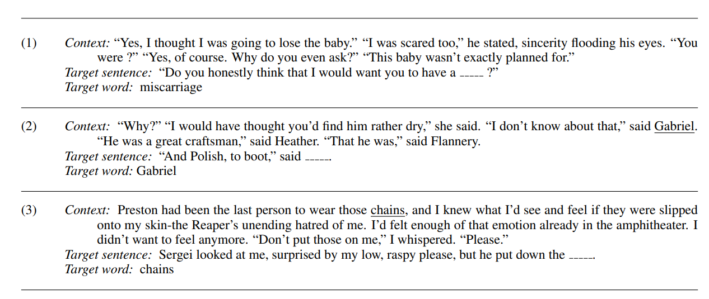
*图 4：LAMBADA 只要求预测段落末尾关键词，是“伪装成任务的条件 PPL”代表。（视频 `00:13:18–00:14:41`）*

LAMBADA 的设计思想是把“只评关键 token”推到极限：整段上下文是条件 $q$，被评分的只有末尾那一个词。其特殊之处还在于语料的构造——这些段落经过筛选，保证人类读者只看句子内部无法猜出最后一个词、必须依赖段落级上下文，从而把指标集中到长程依赖这一构念上。这提醒我们：条件 PPL 的有效性不仅取决于“评哪些 token”，还取决于样本是否被设计得让这些 token 真正承载目标能力。

HellaSwag 也可视作候选完成的条件概率比较，但它使用 adversarial filtering，让错误选项看起来足够自然，从而减少模型只靠浅层语言流畅度取胜的机会。

adversarial filtering 的机制值得展开：数据构造者迭代地用一个判别模型筛掉“容易被表面统计特征识破”的错误选项，使得保留下来的干扰项在局部流畅度上与正确选项几乎不可区分。于是候选比较 $\arg\max_c p(r^{(c)}\mid q)$ 不再能靠“哪个句子更像自然语言”取胜，而必须依赖对情境的真正理解。这是“让指标更贴近构念”的一个正面案例——与污染和刷分相反，它人为地把 shortcut 从数据里挤出去。

### 2.5 PPL 的可比性边界

Perplexity 并非跨模型天然可比：tokenizer 不同会改变 $T$，空格、大小写、归一化和上下文截断也会改变得分。闭源模型若只提供生成接口、不提供 token log probability，外部评测者还无法可靠计算 PPL。一个“PPL leaderboard”若依赖参与者自行提交数字，测量协议与信任机制都应被审计。

tokenizer 的影响可以做一阶估算。同一段文本，词表更大、合并更激进的 tokenizer 会产生更短的序列（$T$ 更小），而每个 token 的平均信息量更大；PPL 按 token 取几何平均，两个 tokenizer 下的数值没有共同量纲，直接比较 $e^{\operatorname{NLL}_A}$ 与 $e^{\operatorname{NLL}_B}$ 没有意义。文献中常见的补救是换算成**每字节（或每字符）负对数似然**：把 token 级 NLL 乘以 $\frac{T}{\text{字节数}}$，使单位与切分方式无关。但即便统一了单位，预处理差异（是否去重、是否保留大小写）仍会改变被测文本本身，因此跨论文比较 PPL 时，最稳妥的做法是只比较同一论文、同一管线内部报告的数字。

### 本章小结

PPL 是模型概率接口最自然的内部指标，但它依赖数据分布、tokenizer 和评分范围。最小交叉熵是 $H(t)$，最小 PPL 是其指数；条件 PPL 必须带负指数。低 PPL 是有用证据，不是通用智能的充分证明。

## 3. 考试型 benchmark：可控、易判分，也容易饱和

考试任务把开放能力压缩为固定题面和可判定答案。优点是成本低、重复性强、误差容易统计；代价是它与真实使用之间存在距离，也容易被训练污染或格式技巧影响。

从测量学角度看，考试型 benchmark 是一次激进的维度压缩：把“知识”“推理”这样的多维构念投影到“在给定选项中选中正确答案”这一维。压缩带来的可判定性是它的全部价值——判分不需要人类、不需要 LLM judge、不存在 judge 偏差，误差几乎完全来自题目本身——但也意味着所有不能投影到这一维上的能力（表达质量、解释深度、对不确定性的自知）都被系统性地排除在测量之外。

### 3.1 从 MMLU 到 MMLU-Pro

MMLU 覆盖多个学科，最初的激进之处是要求语言模型仅凭少量上下文示例完成复杂多任务考试。标准流程通常是：构造 few-shot prompt，读取各选项的条件概率或让模型直接输出选项，再计算 accuracy。

对 $N$ 道题，准确率为：

$$
\operatorname{Acc}=\frac{1}{N}\sum_{i=1}^{N}\mathbf{1}[\hat y_i=y_i].
$$

- $\hat y_i$：模型对第 $i$ 题的预测。
- $y_i$：标准答案。
- $\mathbf{1}[\cdot]$：条件成立时为 1，否则为 0。

Accuracy 是一个样本均值，因此其统计性质完全清楚：把每题看作一次 Bernoulli 试验，若模型在题分布上的真实正确率为 $\pi$，则 $\operatorname{Acc}$ 是 $\pi$ 的无偏估计，标准误为

$$
\operatorname{SE}(\operatorname{Acc})=\sqrt{\frac{\hat\pi(1-\hat\pi)}{N}}.
$$

这条公式应当在每次读榜时默算一遍。例如 $N=1000$、$\hat\pi=0.80$ 时，$\operatorname{SE}\approx 0.0127$，95% 置信区间宽约 $\pm 2.5$ 个百分点；也就是说，榜单上相差 1 个百分点的两个模型，在千题规模上根本无法区分。许多排行榜的相邻名次之差小于统计噪声，这是考试型评测最常被忽视的算术事实。更精细的分析还应考虑题目之间的相关性（同一子领域的题往往同对同错），此时有效样本量小于 $N$，真实标准误更大。

MMLU 很快接近饱和。MMLU-Pro 通过清理题目、把选项扩展到十个，并比较 direct answer 与 chain-of-thought 等协议重新提高难度。这里要注意：CoT 不只是“模型能力”，也是推理协议的一部分。

选项数从 4 增加到 10 有一个可以直接计算的效应：随机猜测基线从 $1/4=25\%$ 降到 $1/10=10\%$。若一个模型在 4 选项题上得 70%，其中多少是“真会”、多少是“猜对”，可以用经典的成绩校正公式估计：设真会比例为 $\alpha$，不会的题均匀猜测，则观测正确率 $\hat\pi=\alpha+(1-\alpha)/K$，反解 $\alpha=\frac{K\hat\pi-1}{K-1}$。$K=4$、$\hat\pi=0.70$ 给出 $\alpha=0.60$；同一模型在 $K=10$ 下若真会比例不变，期望分数只有 $0.60+0.40/10=64\%$。这解释了为什么“同一个模型”在不同 benchmark 上的绝对分数不可直接比较——基线和猜测结构不同。


*图 5：清理题目、增加选项与改变推理协议，会共同改变 benchmark 的难度。（视频 `00:22:06–00:23:18`）*

### 3.2 GPQA：用专家—非专家差异定义高质量难题

GPQA 的 “Google-Proof” 不是说题目永远无法检索，而是希望非专家即使联网搜索也很难在合理时间内答对。其 Diamond 子集经过多轮验证：两位专家都同意答案，同时三位非专家中至多一位答对。这个过程说明，高质量 benchmark 的核心成本往往不在运行模型，而在出题、修订和验证。

这个验证设计实际上把“题目难度”从一个主观判断变成了一个可操作的统计标准。非专家三人中至多一人答对，相当于要求非专家正确率的上界约为 $1/3$——已经非常接近 4 选项的随机基线 $1/4$，即题目对非专家而言几乎不提供可提取的信号；而两位专家一致同意，则提供了答案正确性与题目无歧义的证据。两个条件共同刻画了“区分度”这一心理测量学概念：好题目应当在目标人群（专家）与对照人群（非专家）之间产生最大的正确率差异。模型评测时，我们关心的正是模型处在这个区分谱系的哪个位置。

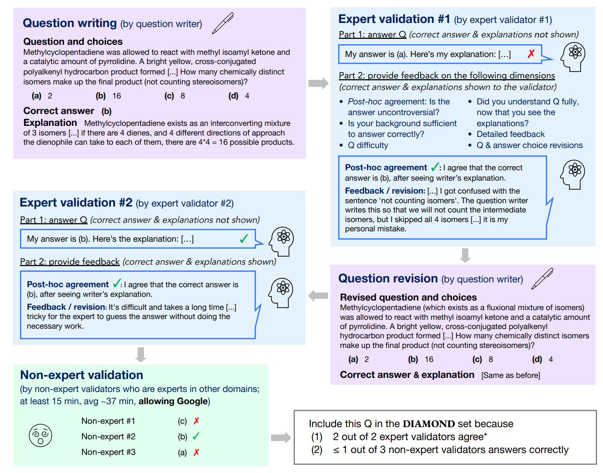
*图 6：题目经过专家验证、修订和非专家对照后才进入高质量子集。（视频 `00:23:18–00:25:40`）*

### 3.3 HLE：难度、私有测试集与 benchmark 寿命

Humanity's Last Exam（HLE）通过奖金征集高难度、多学科、多模态问题，再经自动难度筛选、专家审核与去重，从约 70,000 个投稿逐步缩到约 2,500 个公开问题，并保留私有部分。私有集延缓了直接记忆答案，却不能消除“针对任务类型训练”的广义污染。

“保留私有测试集”的工程权衡值得说透。公开集的优点是可审计、可复现、社区可以分析失败案例；代价是从公开那一刻起，它就进入了可被爬取的语料生态，污染时钟开始计时。私有集把时钟暂停，但引入新的信任问题：外部无法验证题目质量、无法复查判分、托管方自身也可能成为单点故障。一个常见的折中是公开一部分、私有一部分，并定期轮换——HLE 正是这样做的。

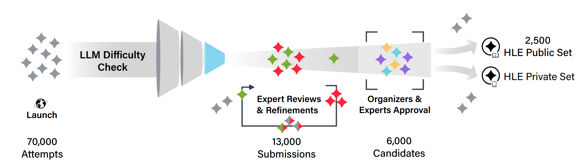
*图 7：难题并不是简单收集而来，而是经由难度检查、专家审核和 public/private 分流。（视频 `00:27:53–00:28:36`）*

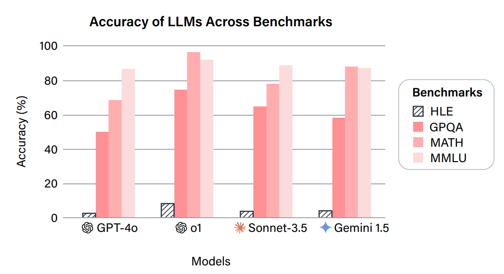
*图 8：当旧基准接近天花板时，新基准重新拉开差距；但课程中的动态榜单数字只是当时快照。（视频 `00:28:36–00:29:01`）*

图 8 展示的现象是 benchmark 生命周期的一般规律：新基准发布时头部模型分数低且分散（天花板效应未出现），随时间推移分数被逐步推高并聚拢，最终失去区分度，社区再发布更难的新基准。判断一个 benchmark 是否进入饱和期，可以看两条曲线：头部分数与满分的距离，以及前 $k$ 名模型分数的离散度。两者同时收缩时，该基准作为主要区分工具的价值就基本耗尽了。

### 3.4 多选题得分也依赖协议

同一道多选题至少有两类打分方式：比较选项文本的条件 likelihood，或要求模型生成字母再 exact match。两者会受到选项长度、tokenization、输出格式和拒答策略影响。报告 accuracy 时应说明：是否做长度归一化；是否允许 CoT；最终答案如何解析；无效输出如何处理；每题是否多次采样。

#### 3.4.1 似然比较协议及其长度偏差

似然协议把多选题变成 $K$ 个候选回答的条件 PPL 比较：对每个选项 $c_k$，计算 $\log p(c_k\mid q)=\sum_{j}\log p(c_{k,j}\mid q,c_{k,<j})$，取对数似然最大者为预测。问题在于这个量对长度敏感：每个 token 贡献一个非正的 $\log p$，选项越长总和越小，系统性偏向短选项。常见的修正是**长度归一化**——比较每 token 平均对数似然（即条件 PPL 的负对数）而非总和：

$$
\hat{k}_{\text{raw}}=\arg\max_k \sum_{j=1}^{|c_k|}\log p(c_{k,j}\mid q,c_{k,<j}),
\qquad
\hat{k}_{\text{norm}}=\arg\max_k \frac{1}{|c_k|}\sum_{j=1}^{|c_k|}\log p(c_{k,j}\mid q,c_{k,<j}).
$$

- $\hat{k}_{\text{raw}}$：原始总对数似然下的预测选项。
- $\hat{k}_{\text{norm}}$：长度归一化后的预测选项。
- $|c_k|$：选项 $c_k$ 的 token 数。

两种规则可以给出不同答案。一个最小例子：选项 A 长 2 token、对数概率各为 $\{-0.1,-0.2\}$（总和 $-0.3$，均值 $-0.15$）；选项 B 长 5 token、对数概率各为 $-0.08$（总和 $-0.4$，均值 $-0.08$）。原始规则选 A，归一化规则选 B。哪个更“对”没有先验答案——总似然对应“整条陈述为真的概率”，均值对应“陈述的每 token 可信程度”，二者测的是略不同的东西。这正是“协议是测量的一部分”的具体含义：报告多选题分数却不说明归一化方式，等于报告一把没有刻度的尺子。实践中还有按字节数归一化的变体（norm by byte），其动机是消除不同选项 tokenization 效率差异的影响。

#### 3.4.2 生成式协议及其解析风险

生成式协议让模型自由输出（可带 CoT），再从输出中解析出选项字母。它更贴近真实使用，也能利用 test-time compute，但把一个新的失败源引入测量：解析。模型可能输出“A 和 B 都有道理”、可能拒绝作答、可能输出多个字母、可能在 CoT 中先说 A 再改口 C。每种异常都需要一条人为规则来处理，而每条规则都会改变最终分数。文献中常见的报告口径包括：首个出现的字母、最后出现的字母、正则提取“答案是 X”句式、无效输出计为错误或剔除重测——这些选择之间的分数差异可以达到数个百分点，足以反转相邻模型的排名。

> **常见误解**：“多选题有唯一答案，所以 benchmark 是客观的。”答案标签可以客观，但题目是否正确、是否测到目标能力、评分协议是否公平仍然需要判断。

### 本章小结

考试 benchmark 的优势是可控与易判分。MMLU-Pro、GPQA 和 HLE 展示了延长基准寿命的三种办法：提高难度、投入专家验证、保留私有测试集。但任何分数都依赖题目质量和具体推理协议。

## 4. 开放式聊天：偏好、Elo 与 LLM judge

现实中的对话往往没有唯一参考答案。面对“怎样做甜菜沙拉”之类问题，两个回答都可能正确，却在清晰度、覆盖度、风格和帮助性上有细微差别。此时 pairwise comparison 通常比孤立给一个 7/10 更稳定。

为什么 pairwise 更稳定，有一个心理学测量上的解释：人类做绝对评分时，每个人心中的标尺（7 分意味着什么）不同且随时间漂移，评分者间一致性差；而“两个之中哪个更好”是一个相对的、锚定于具体样本对的判断，大幅降低了标尺不一致带来的噪声。用统计语言说，绝对评分的误差方差中评分者主效应占很大比例，pairwise 比较通过配对设计把这部分方差消掉了。代价是信息效率下降：$K$ 个系统的全配对有 $\binom{K}{2}$ 对，且单次比较只提供 1 bit 量级的信息。

### 4.1 Chatbot Arena：匿名两两比较

Arena 把同一 prompt 同时发给两个匿名模型，用户选择 A 更好、B 更好、平局或两者都差。匿名化减少品牌先验，两两比较降低了绝对标尺不一致。


*图 9：同题双答与四类投票按钮把开放式质量转为偏好数据。（视频 `00:33:04–00:34:04`）*

Elo 风格模型可以把两两胜负拟合成一维能力值。一种常见写法是：

$$
P(A\succ B)=\frac{1}{1+10^{(R_B-R_A)/400}}.
$$

- $R_A,R_B$：系统 A、B 的 rating。
- $P(A\succ B)$：A 优于 B 的预测概率。
- $400$：经典 Elo 中的尺度常数。

#### 4.1.1 Bradley–Terry 模型与极大似然拟合

上式是更一般的 Bradley–Terry 模型的 Elo 参数化。Bradley–Terry 模型的基本形式为每个系统 $i$ 赋予一个正强度 $\gamma_i>0$，并假设

$$
P(i\succ j)=\frac{\gamma_i}{\gamma_i+\gamma_j}.
$$

取 $\gamma_i=10^{R_i/400}$，代入即得

$$
P(i\succ j)=\frac{10^{R_i/400}}{10^{R_i/400}+10^{R_j/400}}
=\frac{1}{1+10^{(R_j-R_i)/400}},
$$

正是 Elo 公式。若改用自然参数化 $\gamma_i=e^{r_i}$，则

$$
P(i\succ j)=\frac{e^{r_i}}{e^{r_i}+e^{r_j}}=\sigma(r_i-r_j),
$$

其中 $\sigma(z)=1/(1+e^{-z})$ 是 logistic 函数。这组推导说明：Elo、Bradley–Terry、logistic 打分模型本质上是同一个潜变量模型的三种参数化——一维能力值之差经一个 S 形函数映射为胜率。

给定对战数据 $\{(i_k,j_k,y_k)\}_{k=1}^{n}$（$y_k=1$ 表示 $i_k$ 胜 $j_k$），rating 由极大似然拟合。对数似然为

$$
\ell(\mathbf r)=\sum_{k=1}^{n}\Bigl[y_k\log\sigma(r_{i_k}-r_{j_k})+(1-y_k)\log\sigma(r_{j_k}-r_{i_k})\Bigr],
$$

- $\mathbf r$：所有系统的 rating 向量。
- $n$：对战场次总数。

注意 $\ell$ 对整体平移不变（所有 $r_i$ 加同一常数，差值不变），因此需要固定一个锚点（例如令某系统 $r=0$ 或约束均值为 0）才有唯一解。$\ell$ 关于 $\mathbf r$ 是凹函数（每项是 $\log\sigma$ 的线性组合，$\log\sigma$ 本身凹），可用梯度上升或 Newton 法全局求解。单个参数的梯度为

$$
\frac{\partial \ell}{\partial r_i}
=\sum_{k:\,i\text{ 参赛}}\bigl(y_k^{(i)}-\hat p_k^{(i)}\bigr),
$$

其中 $\hat p_k^{(i)}$ 是模型预测 $i$ 在该场获胜的概率。这个梯度形式有漂亮的直觉：它等于“$i$ 的实际胜场数”减去“模型期望胜场数”，参数更新的方向正是弥合观测与期望的差距——这也是经典 Elo 在线更新 $R_i\leftarrow R_i+K(y-\hat p)$ 的由来，在线更新就是该似然的随机梯度步。

下面的代码实现了一个最小但完整的 Bradley–Terry 拟合：

```python
import numpy as np

# 4 个假想系统，真实能力有差异；用合成对战数据演示 MLE 拟合
names = ["A", "B", "C", "D"]
true_r = np.array([2.0, 1.0, 0.5, 0.0])   # 真实 rating（未知，仅用于生成数据）
rng = np.random.default_rng(0)

# 生成对战：随机配对，按 sigma(r_i - r_j) 抽样胜负
games = []
for _ in range(4000):
    i, j = rng.choice(4, size=2, replace=False)
    p_ij = 1 / (1 + np.exp(-(true_r[i] - true_r[j])))
    games.append((i, j, int(rng.random() < p_ij)))

# 梯度上升做 MLE（r[3] 固定为 0 作为锚点）
r = np.zeros(4)
lr, free = 0.05, [0, 1, 2]
for it in range(3000):
    grad = np.zeros(4)
    for i, j, y in games:                    # y=1 表示 i 胜 j
        p = 1 / (1 + np.exp(-(r[i] - r[j])))
        grad[i] += (y - p)
        grad[j] += (p - y)
    for k in free:
        r[k] += lr * grad[k] / len(games) * 50

for n_, r_, t_ in zip(names, r, true_r):
    print(f"系统 {n_}: 拟合 rating = {r_:+.3f}（真值 {t_:+.2f}）")
```

样本量足够时，拟合值会以真值为中心收敛；把对战数从 4000 减到 200，可以直观看到估计方差如何放大。

#### 4.1.2 置信区间与对战场数要求

rating 点估计之外，不确定性量化同样关键。由渐近正态性，$\hat r_i$ 的标准误可由 Fisher 信息矩阵（即 $\ell$ 的负 Hessian）的逆对角元给出；直观地说，系统 $i$ 的估计精度主要由它参加的对战数 $n_i$ 控制，量级为 $\operatorname{SE}(r_i)\propto 1/\sqrt{n_i}$。要区分 rating 差为 $\Delta$ 的两个系统，要求 $\Delta$ 大于约两倍联合标准误，即所需对战场数按 $n\propto \Delta^{-2}$ 增长——把区分精度提高一倍，需要四倍的对战量。这正是 Arena 类榜单需要海量投票才能拉开头部模型差距的根本原因，也是“新增一个模型进榜”代价高昂的原因：新模型需要与足够多的对手打足够多的场次，其置信区间才能收窄到可定位的程度。

Elo 只是在假设下汇总 pairwise 数据。若不同用户群体偏好不同、模型存在风格交互、对战样本不均衡，一维 rating 会隐藏结构。

三个假设失效的情形都值得点名。其一，**传递性失效**：Bradley–Terry 假设偏好由一维能力完全决定，因而偏好关系近似传递（$A\succ B$、$B\succ C$ 蕴含 $A$ 大概率胜 $C$）；但真实偏好可能出现“剪刀石头布”式的循环——例如模型 A 长于代码、B 长于写作、C 长于数学，用户群体又异质，此时任何一维 rating 都会丢失结构。其二，**上下文依赖**：胜率可能依赖 prompt 类型，两个模型在代码 prompt 上与在闲聊 prompt 上的相对强弱可以相反，全局 rating 只是某种按 prompt 分布加权的平均。其三，**配对稀疏性**：若对战矩阵不连通（某些模型对从未交手），它们之间的 rating 差不可辨识，实践中依赖比赛图的连通性“借道”估计，这会放大估计方差。

### 4.2 人类 judge 的偏差

人类判断接近真实偏好，但并不天然可靠：用户可能偏爱更长、更自信、格式更华丽的答案；不知道领域事实时会把流畅误认成正确；自选 prompt 的用户群体也未必代表目标人群。Arena 的“真实流量”提高生态真实性，却牺牲了 prompt 分布和 judge 组成的控制。

把人类 judge 的误差分解一下会有帮助。设用户对回答 $r$ 的给出的偏好判断为 $\tilde{y}$，真实质量排序为 $y$，则可以写出

$$
\tilde{y}=y+\varepsilon_{\text{表层特征}}+\varepsilon_{\text{领域知识}}+\varepsilon_{\text{群体选择}},
$$

- $\varepsilon_{\text{表层特征}}$：由长度、格式、自信措辞等表层线索引起的系统性偏差；
- $\varepsilon_{\text{领域知识}}$：用户无法核验事实时把流畅当正确的偏差；
- $\varepsilon_{\text{群体选择}}$：Arena 用户自选择、prompt 自选择带来的分布偏差。

前两项是 judge 层面的系统误差（不随样本量增加而消失），第三项是数据层面的选择偏差。这解释了为什么“投票很多”并不能自动保证结论正确——大数定律只消除随机噪声，不消除系统偏差。

### 4.3 AlpacaEval：自动 judge 与长度 gaming

AlpacaEval 用固定 instruction 集，让待测模型与 baseline 各生成一个回答，再请强模型判断胜负。它便宜、快速、可重复，但 LLM judge 会继承位置、风格、措辞和长度偏差。普通 win rate 曾被更长回答明显抬高，因此引入 length-controlled win rate。


*图 10：长度控制揭示“提高回答长度”可能是在优化 judge，而不是提高真实质量。（视频 `00:39:24–00:39:51`）*

#### 4.3.1 长度偏差的定量刻画与长度控制回归

长度偏差可以形式化为一个回归问题。对每条指令 $i$，设 judge 判待测模型胜出的指示变量为 $y_i\in\{0,1\}$，两个回答的长度差为 $\ell_i=\log(\text{len}_{\text{model},i})-\log(\text{len}_{\text{baseline},i})$（用对数差是因为长度效应近似乘性）。普通 win rate 只是 $\bar{y}=\frac{1}{n}\sum_i y_i$，它把“质量优势”与“长度优势”混在一起。length-controlled win rate 的思想是拟合一个广义线性模型

$$
P(y_i=1)=\sigma\!\left(\beta_0+\beta_1\,\ell_i+\beta_2\,m_i\right),
$$

- $m_i$：指示当前对局属于哪个待测模型的哑变量（或模型效应项）；
- $\beta_1$：长度差对胜率的对数几率影响，即长度偏差的定量刻画；
- $\beta_0,\beta_2$：基线与模型质量效应。

然后在“长度差为零”的反事实条件下读出每个模型的预测胜率——即在统计上把长度因素控制住。若某模型普通胜率高、但 $\beta_2$ 对应的质量项很小、其优势主要由 $\beta_1\ell_i$ 项贡献，则长度控制后排名会显著下滑。图 10 中普通胜率与长度控制胜率之间的排序变化，正是这一机制的实证演示。这个方法论本身是通用的：凡是怀疑某个表层协变量 $z$（长度、markdown 密度、表情符号数）污染了 judge，都可以把 $z$ 加入回归并在 $z$ 取基准值的条件下比较模型。

这引出一个重要的元评测问题：**如何评价一个评价指标？** 可以检查它与高质量人类偏好的一致性、重复运行稳定性、对无关扰动的鲁棒性，以及是否能被简单策略 gaming。

> [!IMPORTANT]
> 元评测（meta-evaluation）至少应报告四个数：与人类偏好的相关系数（如 Kendall's $\tau$ 或成对一致率）、同一 judge 重复运行的方差、对答案做语义中性扰动（改写格式、调整长度）后结论的稳定性、以及一个“对抗策略”（如单纯加长回答）能把指标推高多少。缺了第四项，指标上线即开始被优化。

### 4.4 WildBench：把“哪个好”拆成 checklist

WildBench 从真实聊天中抽取 prompt，并为每题构造具体 checklist。Judge 不再只凭整体印象，而是检查事实正确、约束满足、覆盖关键点等问题。Checklist 提高可解释性，却仍可能遗漏题目独有的质量维度；它是更清楚的测量工具，不是自动真理。

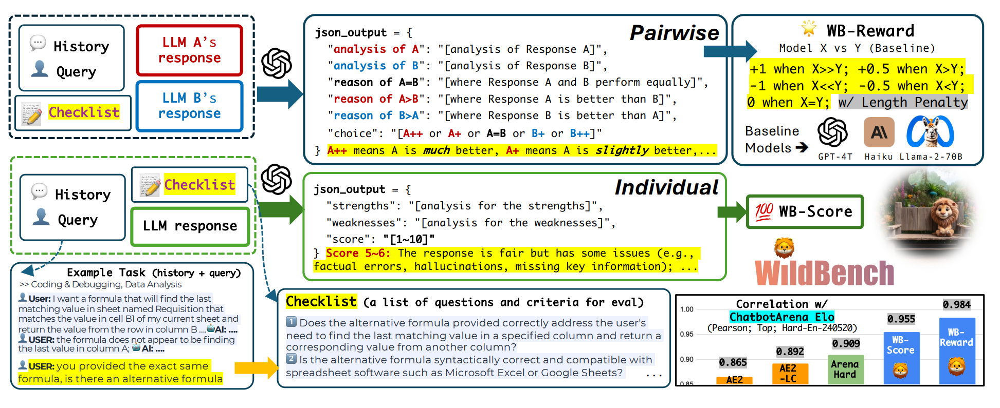
*图 11：prompt-specific checklist 把模糊偏好拆成可核验条件，再汇总为分数。（视频 `00:41:34–00:43:11`）*

checklist 方法在测量学上对应**评分量规（rubric）**：把一个整体判断分解为 $J$ 个可核验条目的逐项打分再汇总。其好处有三：可解释（能看到模型输在哪个条目上）、降低 judge 的整体印象偏差（halo effect）、条目级信号可用于诊断与数据构造。其风险也有三：条目可能遗漏关键维度（量规不完备）；条目权重仍隐含价值判断；judge 在每条目上的独立判断误差会随汇总传播——若每条目判错概率为 $\epsilon$，$J$ 个条目的总分误差按 $\sqrt{J}\epsilon$ 量级累积（误差独立时）。因此 checklist 并不消除 judge 误差，而是把误差从“不可审计的整体印象”转化为“可逐条审计的分项判断”，这本身就是巨大进步。

### 本章小结

开放式评测把“唯一正确”换成“相对更好”。Pairwise 通常比绝对打分稳定；人类 judge 更贴近偏好但成本高，LLM judge 更便宜却有系统偏差。Rubric/checklist 能改善定义和可解释性，但不能消除 judge 本身的误差。

## 5. Agent benchmark：从“说什么”转向“做成什么”

Agent 的评价对象不是一段文本，而是在环境中完成任务的系统：

$$
\text{Agent}=\text{Language Model}+\text{Scaffold}+\text{Tools}+\text{Environment}.
$$

- Language Model：提出计划、决定动作、解释观察。
- Scaffold：调度模型、组织上下文、决定何时调用工具的控制逻辑。
- Tools：终端、浏览器、代码执行器或专业软件。
- Environment：代码仓库、容器、服务器、数据集或交互游戏。

如果只写“模型 X 在 benchmark Y 上得分 Z”，却不报告 scaffold、工具、预算、重试与超时，这个结论通常不可复现。

这个分解意味着 agent 分数是一个**四元组的联合测量**，任何一个分量的变化都会移动最终数字。实验设计上有两条推论。第一，归因困难：分数提升可能来自更强的模型、更好的 scaffold、更稳的工具链或更宽松的环境，单点对比无法区分，需要消融实验（固定其余三个分量、只换一个）才能归因。第二，外推受限：在 benchmark 环境中验证过的“模型+scaffold”组合，换到生产环境的工具与约束下，成绩没有任何保证——这与第 8 节讨论的生态有效性直接相连。

### 5.1 四种代表性可执行评测

**SWE-Bench** 给 agent 一个真实代码仓库和 issue，要求生成 patch；隐藏测试验证目标问题是否修复且没有引入回归。它把“代码写得像不像”升级为“补丁是否真的工作”。


*图 12：可执行 evaluator 用测试结果检查 patch，而不是依赖回答文字的表面质量。（视频 `00:46:01–00:46:49`）*

SWE-Bench 的判分逻辑可以精确描述为两个测试集合的合取：FAIL_TO_PASS 测试（修复前失败、修复后应通过）与 PASS_TO_PASS 测试（修复前通过、修复后不得回归）。只有两者全部满足才计为成功。这个设计的精妙之处在于它同时惩罚了两种失败模式——没修好问题，以及修好了问题但搞坏了其他功能；其脆弱之处也同样明确：如果 FAIL_TO_PASS 集合不全（测试未覆盖 issue 的全部要求），trivial patch 也能通过；如果 PASS_TO_PASS 集合中混入本就 flaky 的测试，正确修复也可能被误判失败。9.3 节会回到这一点。

**Terminal-Bench** 把终端作为通用行动接口：agent 接收任务和容器环境，隐藏测试检查最后状态。**CyBench** 使用隔离的 CTF 任务，让系统在 action—observation loop 中查找唯一 flag。**MLE-Bench** 则要求读取 Kaggle 任务与数据、编写训练代码、生成 submission，再由 grader 按实际分数评价。


*图 13：早期 scaffold 把所有历史不断追加到 context，任务变长后容易遗忘目标并耗尽窗口。（视频 `00:50:02–00:50:41`）*


*图 14：数据处理、训练、生成 submission 和 grader 共同构成端到端 ML 工程评测。（视频 `00:50:59–00:51:29`）*

四个 benchmark 在“环境状态可验证性”上构成一个谱系：SWE-Bench 与 Terminal-Bench 的验证是确定性的（测试通过/不通过）；CyBench 的 flag 是唯一字符串，判定最硬；MLE-Bench 的 grader 则输出连续分数，评价粒度更细但 grader 本身成了测量仪器的一部分。四类任务的时间尺度也不同——CyBench 的 CTF 可能需要数百步交互，MLE-Bench 一次提交涉及数小时的训练预算——因此“步数”“token 消耗”“墙钟时间”都是报告的一部分。

### 5.2 为什么 scaffold 会显著改变成绩

现代 agent scaffold 常加入四类结构：

1. **显式规划**：维护可勾选的任务清单，避免长思维流丢失目标。
2. **层级委派**：把子任务交给拥有干净上下文的 sub-agent，只返回压缩结果。
3. **持久记忆**：把状态写入文件，需要时再读取，减轻上下文负担。
4. **上下文工程**：明确何时委派、何时换策略、何时记录状态，而不只是润色 system prompt。

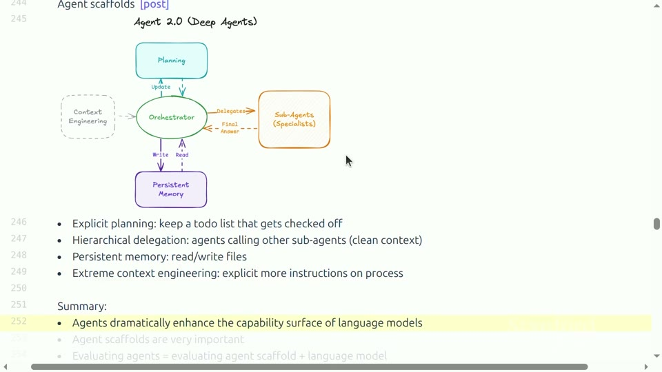
*图 15：规划、编排、子代理、持久记忆和上下文工程共同扩大语言模型的能力表面。（视频 `00:51:45–00:53:52`）*

图 13 与图 15 放在一起看，正好构成“问题—解法”的对照：朴素 scaffold 把全部交互历史线性追加进上下文，信息密度随步数 $n$ 线性增长，信噪比则随之下降——模型要在 $O(n)$ 的 token 中找到仍相关的目标与约束，遗忘和漂移几乎是必然结果。现代 scaffold 的四类结构都在对抗同一个约束：**上下文窗口是有限的、注意力是稀缺的**。显式规划把“目标”从流动的历史中固化出来；层级委派用子上下文隔离不相关的细节，主上下文只接收压缩后的结论；持久记忆把状态外置到文件系统，把“记住”从注意力的负担变成检索的问题；上下文工程则是对前三者的调度策略。理解了这一层，就能明白为什么同一模型在不同 scaffold 下的 agent 分数可以相差数个百分点甚至更多——被测的根本不是裸模型。

一个最小可审计的 agent 评价循环可写成：

```text
for task in benchmark:
    env = reset_to_known_state(task)
    trace = run(agent, env, budget, timeout)
    score = hidden_evaluator(env.final_state)
    save(task_id, model, scaffold, tools, budget, trace, score)
```

这里 `reset_to_known_state` 防止任务间串扰；`hidden_evaluator` 降低直接迎合评分器的机会；完整 trace 则帮助发现“通过测试但过程明显作弊”或“失败其实来自环境”的情况。

`trace` 的保存值得额外强调：它是事后审计的唯一原料。一次 agent 运行动辄产生数万 token 的交互记录，但其中往往藏着决定结论有效性的细节——模型是否读了它不该读的测试文件、是否反复重试同一个失败命令直到超时、是否把环境报错误当作任务成功信号。没有 trace 的 agent 分数，与没有实验记录的实验数据同义。

### 5.3 可执行不等于有效

单元测试可以客观执行，却可能覆盖不全；agent 可能用 trivial patch 或 hard-code 通过测试而没有真正修复问题。评测必须同时检查任务成功、回归风险、成本、步骤数和轨迹质量。可执行 grader 提高了结果可验证性，但没有自动解决构念有效性。

用第 1 节的语言重述：可执行测试解决的是**评分信度（reliability）**——同一个 patch 重跑判分结果一致；但**效度（validity）**——“通过测试”是否真的蕴含“问题被正确修复”——取决于测试套件的完备性，而这恰恰是最难保证的。这一区分在 agent 评测中格外尖锐，因为 agent 是一个主动的优化者：与人类考生不同，agent 会在环境中探索，一旦发现“通过测试”与“解决问题”之间的缝隙（例如读到测试文件名后直接针对断言硬编码），它会理性地利用缝隙。评测设计的军备竞赛由此展开：隐藏测试、随机化测试、事后人工抽查 trace，都是在把缝隙重新关上。

### 本章小结

Agent benchmark 评价的是 LM、scaffold、工具和环境组成的系统。SWE-Bench、Terminal-Bench、CyBench 和 MLE-Bench 把评分落到环境状态，但隐藏测试仍可能有漏洞。报告系统边界与运行预算和报告分数同样重要。

## 6. ARC-AGI：尝试把推理从知识记忆中分离

考试和 agent 任务都混合了语言、知识、工具熟练度与推理。ARC-AGI 的目标是让每道任务包含新的抽象规则：人类可以从少量网格例子归纳，模型却不能只靠回忆事实。

ARC-AGI 的实验设计逻辑是控制变量法的直接应用：如果我们怀疑高分数来自“训练语料中见过相似题”，那就构造一个原则上不可能见过的任务集——每题的规则都是新生成的抽象变换，任何记忆都帮不上忙，剩下的差异就只能归因于归纳推理能力。这个逻辑无懈可击，但正如下面会看到的，“剩下的差异全是推理”这一结论仍然过强，因为任务本身携带着设计者的人类先验。

### 6.1 从静态变换到交互环境

ARC-AGI-1 的每题给出若干输入—输出网格，要求推断变换，再生成新输出。课堂例子需要识别粉色结构并用黄色单元补齐规则所要求的矩形。

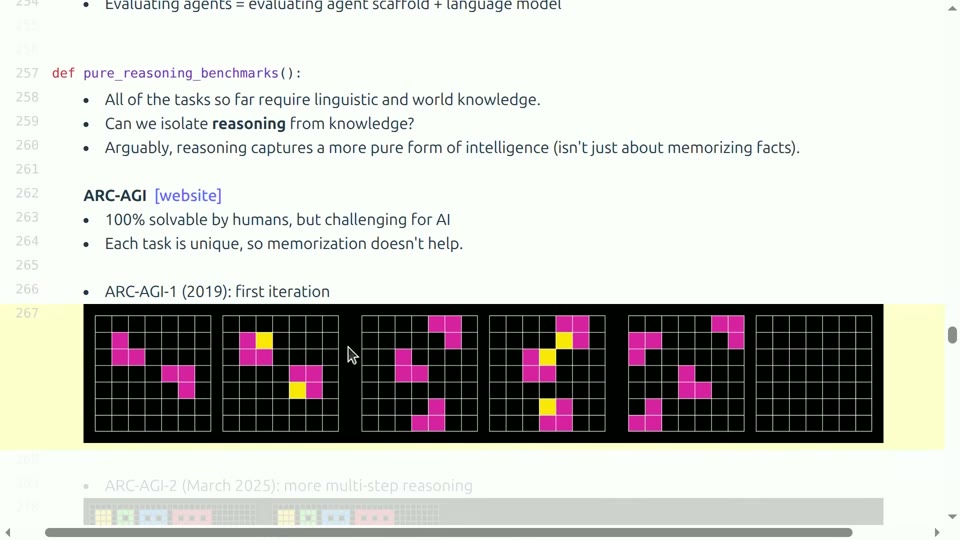
*图 16：每题规则不同，模型必须从示例中归纳空间变换，而不是检索固定事实。（视频 `00:55:15–00:55:41`）*

从机器学习的角度看，每道 ARC 题都是一个**小样本程序归纳（few-shot program induction）**问题：给定 $k$ 对 $(\text{in}_i,\text{out}_i)$，假设空间是所有网格变换程序，要求找出与示例一致、且能泛化到新输入的那个程序。其困难在于假设空间巨大而监督信号极少——$k$ 通常只有 2 到 4——先验（哪些变换“自然”：对称、平移、填色、连通性保持……）成为决定性的成功因素。人类凭视觉系统与物理直觉携带着极强的空间先验，这既是人类优势的来源，也是“ARC 测的是纯推理”这一论断需要打折的地方。

ARC-AGI-2 增加多步推理。ARC-AGI-3 进一步变成交互式游戏环境：系统没有自然语言说明，需要根据视觉状态和动作反馈逐渐发现规则。


*图 17：静态问答变成 perception—action—feedback 循环后，接口本身也成为被测系统的一部分。（视频 `00:57:32–00:58:05`）*

ARC-AGI-3 的转向有重要意义：它把任务从“一次性归纳”变成“在线探索”——系统必须主动设计动作去试探环境、从反馈中修正假设，这本质上是强化学习中的探索—利用问题叠加在归纳推理之上。同时这也意味着被测系统不再是一个映射 $f:\text{输入}\to\text{输出}$，而是一个闭环策略，评测协议自然继承了第 5 节 agent 评测的全部复杂性：步数预算、动作接口、反馈表示，都成为测量的一部分。

### 6.2 “纯推理”仍然不完全纯

ARC 很好地降低了事实记忆的作用，却不能证明知识和推理已彻底分离。任务仍由人类设计，带有空间表征和人类可解性的先验；社区一旦长期围绕固定赛道优化，也会形成专门工具与方法。它刻意聚焦普通人类可在合理时间内解决的题，因此也不覆盖开放数学问题等超人类推理。

把“不纯”的来源列清楚：(1) **设计先验**——网格、颜色、连通性这些本体都是人类选择的，规则分布偏向人类觉得“自然”的变换，一个同样“无记忆”但先验分布不同的智能体在 ARC 上未必强；(2) **赛道优化**——一旦 ARC 成为社区目标，针对它的方法（程序搜索、测试时训练、网格专用表示）本身就是对“无先备知识”假设的侵蚀，这是 Goodhart 定律在 benchmark 层面的重演；(3) **能力截断**——题目被刻意限制在人类可解范围内，因而 ARC 无法区分“达到普通人类归纳水平”与“超越人类归纳水平”，它是地板测量而非天花板测量。

课堂问答还指出，同一网格可直接作为图像给多模态模型，也可编码为 ASCII 文本。两种接口的视觉感知负担不同，分数不应混为同一协议。ARC 测到了重要能力缺口，但不是“无条件的通用推理值”。

接口问题可以做一层更细的分解：模型的 ARC 总分 $\approx$ 感知（把网格正确解析为符号结构）$+$ 归纳（从示例中找规则）$+$ 生成（把规则施加到新网格并输出）。ASCII 接口几乎消除了第一项的负担，图像接口则把它完整保留。同一个底层推理引擎，仅因感知前端不同，总分就可能相差悬殊——这再次印证了本讲反复出现的主题：报告的永远是整条管线的分数，而不是某个孤立能力的读数。

### 本章小结

ARC-AGI 通过新颖网格规则减少知识记忆的贡献，并从静态变换发展到交互环境。它是有价值的推理代理任务，却仍依赖人类设计先验、输入接口和社区优化历史。

## 7. 安全评测：安全不是一个单一变量

汽车碰撞测试不会用一个分数概括所有安全维度；AI 安全同样包含拒绝违法请求、避免偏见与骚扰、保护隐私、抵抗越狱，以及在双重用途任务中保持适当边界。

“单一分数”的诱惑在安全领域尤其危险，因为它把两个完全不同方向上的失败压进同一个数：过度拒答（对合理请求也拒绝，损害帮助性）与拒答不足（对有害请求提供协助，造成损害）是方向相反的错误，但一个“安全总分”可以让它们互相抵消——一个两头都做得很差的模型，可能得到与一个两头都做得中等的模型相同的分数。这正是为什么安全报告必须分项。

### 7.1 从有害行为列表到风险 taxonomy

HarmBench 以一组违反法律或社会规范的有害行为检查模型是否会提供协助。AIR-Bench 进一步依据监管框架与公司政策建立分层 taxonomy，把风险拆成大量类别和 prompt。分类更全面，但每一类的定义、严重度和权重仍然是治理选择。

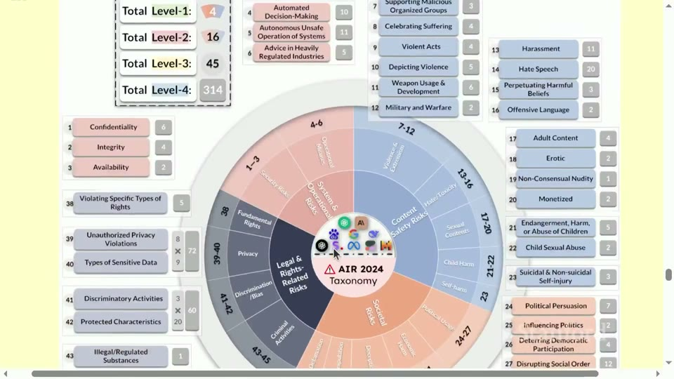
*图 18：安全由多层风险类别组成；总分会隐藏不同类别之间的能力差异。（视频 `00:61:38–00:62:12`）*

从 HarmBench 到 AIR-Bench 的演进，反映的是安全测量从“行为清单”到“风险本体”的成熟过程。行为清单回答“模型会不会做这些具体的坏事”；风险本体试图先穷举“坏事有哪些类别”，再在每类下采样行为。后者的好处是覆盖面可审计、与监管框架对齐；代价是分类体系本身成为新的价值判断——哪些风险被收录、层级如何组织、类别间如何加权，都是治理决策而非技术事实。读安全评测报告时，taxonomy 的来源与覆盖声明与分数同样重要。

### 7.2 Jailbreak 与对抗评测

模型在普通 prompt 上拒绝有害请求，不代表面对对抗后缀仍安全。GCG 类攻击通过优化 token 后缀，使本来会拒绝的模型产生目标响应。这说明 safety evaluation 必须包含 adaptive adversary，而不能只跑一份静态问卷。


*图 19：对抗后缀可以改变模型行为，静态无攻击测试会高估安全性。（视频 `00:62:12–00:63:22`）*

GCG（Greedy Coordinate Gradient）的机制值得从技术上说清：它把越狱形式化为一个离散优化问题——寻找一段后缀 $s$，使模型对“有害请求 $+s$”输出目标开头（如“Sure, here is...”）的概率最大；优化通过梯度信号指导的贪心坐标搜索在离散的 token 空间进行。其启示是双重的。攻击面方面：对齐训练学会的是“对训练分布内的有害表述拒绝”，而对抗后缀位于分布之外，拒绝机制没有被训练覆盖到。评测方法论方面：**静态攻击集测的是“已知攻击的防御率”，而安全是 adversarial 博弈，真正重要的是对未知攻击的鲁棒性**。因此安全评测需要模拟 adaptive adversary——让攻击者知道防御细节后重新优化攻击——否则测出的只是一个下界都谈不上的乐观估计。这与密码学中“安全性必须对自适应对手定义”的传统一脉相承。

### 7.3 上下文与双重用途

同一句请求在不同身份、授权、目标和后续行动下，风险可能完全不同。网络安全尤其是 dual-use：检查漏洞既可用于防御，也可用于攻击。只测“是否拒答”会奖励过度保守模型；只测“是否完成任务”又可能忽略伤害。更合理的报告应按风险类别、上下文、攻击强度、帮助性损失分别呈现，而不是压成单一 safety score。

双重用途问题使安全评测天然成为一个**多目标权衡**：给定请求 $x$，理想系统的输出应同时最大化“授权场景下的帮助性”与“未授权场景下的拒答率”，而这两者往往共用一个回答。任何单一阈值策略都对应 ROC 曲线上的一点——提高拒答灵敏度必然牺牲特异性。负责任的安全报告因此应当给出整条权衡曲线（或至少在多个工作点上的读数），并明确标注评测时假定的上下文分布：如果测试 prompt 全部以恶意口吻书写，测出的“拒答率”就对真实部署（绝大多数请求是善意的）没有代表性。

### 本章小结

安全是多维、上下文相关且对抗性的构念。HarmBench、AIR-Bench 和 jailbreak 测试分别覆盖行为、taxonomy 与适应性攻击；任何单一平均分都可能掩盖严重失败或过度拒绝。

## 8. 真实性：benchmark 像不像真实工作

Ecological validity 关心评价环境能否代表真实使用。如果真实工作需要模糊需求、协作、工具、时间压力和多轮反馈，而 benchmark 只给干净的短题，那么高分未必能迁移。

生态有效性可以形式化为一个分布匹配问题：真实使用对应某个任务—上下文联合分布 $D_{\text{real}}$，benchmark 对应 $D_{\text{bench}}$，我们实际上是用 $D_{\text{bench}}$ 上的期望表现去推断 $D_{\text{real}}$ 上的期望表现。两者差距越大，外推误差越大；而“差距”不只在任务内容上，还包括用户画像、需求模糊度、可用的工具与时间、失败的代价结构。benchmark 设计者能控制的通常只是任务内容这一个维度。

### 8.1 三条更接近现实的路线

**GDPVal** 从美国 GDP 占比较高的行业中抽样职业任务，并请有多年经验的专业人士完成。它关注经济上真实存在的工作，而不是研究者方便构造的谜题。


*图 20：任务来自多种专业工作场景，目标是提高经济活动上的代表性。（视频 `01:06:00–01:06:35`）*

GDPVal 的抽样设计是关键创新：按行业 GDP 占比加权抽样，使任务分布近似“经济活动中的认知劳动分布”，而非“研究者熟悉的题目分布”。这把生态有效性从口号变成了抽样框。当然它也继承了抽样方法的全部困难：GDP 占比度量的是经济权重而非“AI 可替代性”权重，职业任务的完整描述往往涉及大量隐性组织知识，公开 benchmark 能呈现的仍然是可外化的那一部分。

**MedHELM** 不用一个通用医疗平均分代表全部临床能力，而是按真实医疗场景组织任务与指标。**Clio** 则分析真实用户与语言模型的交互数据，从使用分布反推人们实际上在做什么。


*图 21：真实用户数据能揭示实验室任务没有覆盖的需求，但会带来隐私和可复现性问题。（视频 `01:07:34–01:08:20`）*

三条路线对应逼近 $D_{\text{real}}$ 的三种策略：GDPVal 从**经济结构**出发抽样任务（供给侧）；MedHELM 从**领域实践**出发组织场景（专业侧）；Clio 从**观测到的真实使用**出发反推需求（需求侧）。三者互补：供给侧保证经济代表性，专业侧保证领域深度，需求侧则能发现研究者完全没预料到的用途——Clio 揭示的使用分布中，相当比例的交互不属于任何主流 benchmark 的任务类型，这本身就是对现有评测覆盖面的一次实证审计。

### 8.2 真实性的根本张力

越接近真实世界，越难控制变量、共享数据和稳定复现：真实 prompt 可能含隐私；专家任务昂贵；软件环境持续变化；用户分布也随产品更新改变。越标准化的 benchmark 越容易复现，却可能离现实越远。好的 suite 通常同时保留受控任务和生态任务，并明确两者回答的问题不同。

这组张力可以整理为一个不可能三角的三个顶点：**真实性（realism）、可复现性（reproducibility）、低成本（cost）**。受控实验室任务牺牲真实性换取后两者；真实使用数据牺牲可复现性（数据不可公开、分布随时间漂移）与成本（隐私合规、标注昂贵）；专家任务则在三者上都付出高昂代价。没有任何单一 benchmark 能同时占满三个顶点，因此一套评测体系必须在三个顶点上各布置一些测量点，并清楚标注每个点牺牲了什么。

### 本章小结

真实性不是“题目看起来像现实”，而是任务、用户、工具、约束和成功标准是否代表目标场景。GDPVal、MedHELM 和 Clio 提升生态有效性，同时暴露成本、隐私、动态性和复现性的张力。

## 9. 有效性：高分是否真由目标能力导致

一个 benchmark 可以很难、很真实，却仍然无效。有效性要求观测到的分数变化确实来自目标能力，而不是训练污染、答案泄露、错误题目或评分器漏洞。

如果说第 8 节问的是“测量环境像不像真实世界”，本节问的是一个更根本的问题：“分数的因果来源是什么”。观测到模型 $M'$ 比 $M$ 高 5 分，我们想归因于 $M'$ 的目标能力更强；但同一观测也可以由污染（$M'$ 见过题）、数据错误（错题恰好偏向 $M'$ 的输出习惯）、评分器漏洞（$M'$ 碰巧触发 shortcut）产生。有效性分析就是系统地排除这些备择因果解释。

### 9.1 污染不只是 exact duplicate

最明显的污染是测试题原文进入预训练数据。更广义的污染还包括题目改写、答案解析、同一模板和专门针对 benchmark 的训练。课程展示一种顺序检验思路：若测试题在训练语料中的相对顺序表现出异常一致性，可能提示模型见过整套 benchmark，而不仅是独立出现的相似句子。


*图 22：独立样本的顺序本应近似可交换；异常顺序可作为训练—测试重叠的统计信号。（视频 `01:09:46–01:10:26`）*

#### 9.1.1 n-gram 重叠检测的数学形式化

最常用的污染检测基于 n-gram 重叠。把测试题文本与训练语料分别切分为 $n$-gram 集合 $G_{\text{test}}$ 与 $G_{\text{train}}$（通常 $n$ 取 8 到 13 的词或 token），定义每道题的污染指示量，例如

$$
\text{hit}(q)=\mathbf{1}\bigl[|G(q)\cap G_{\text{train}}|\ge \tau\bigr],
$$

- $G(q)$：题目 $q$ 的 n-gram 集合；
- $\tau$：判定阈值（如至少一个 13-gram 命中，或重叠比例超过某值）。

随后比较“命中题”与“未命中题”上的模型分数差 $\Delta=\operatorname{Acc}_{\text{hit}}-\operatorname{Acc}_{\text{clean}}$：若 $\Delta$ 显著为正，说明分数中混有记忆成分。这个方法的局限同样清楚：它只能检出**近似逐字**的污染，对改写、翻译、同义替换无效；阈值 $\tau$ 的选择强烈影响结论，常见 n-gram（如法律条文、标准定义）还会制造假阳性。因此 n-gram 检测给出的是污染的下界估计——检出即为污染证据，未检出不能证明干净。

#### 9.1.2 嵌入相似度与语义级污染

要覆盖改写级污染，可以把字面匹配换成语义匹配：用嵌入模型把每道测试题与训练文档映射为向量 $e(q),e(d)$，以余弦相似度

$$
\operatorname{sim}(q,d)=\frac{e(q)\cdot e(d)}{\|e(q)\|\,\|e(d)\|}
$$

检测近邻文档。语义检测的召回率更高，但引入了新的不确定性来源：嵌入模型本身的“语义”未必对应“答案可推导性”——两段嵌入相近的文本可能共享主题却不共享答案，而两段嵌入不近的文本（如一道题的数值变形）可能答案完全可迁移。实践中两条路线应互补使用，并报告各自的阈值与命中集，供第三方审计。

#### 9.1.3 顺序统计量检验

图 22 的思路是一个更巧妙的非参检验：若测试题是独立进入训练语料的，它们在语料中的出现顺序应当近似均匀随机、与测试集内的题目编号无关——统计上称为**可交换性（exchangeability）**。反之，若整个 benchmark 文件曾被作为一个文档爬入语料，题目在语料中的相对顺序会与测试集编号高度相关。检验方法是对“语料顺序与测试编号的秩相关”（如 Kendall's $\tau$）做置换检验：随机打乱编号得到零分布，观测到异常高的秩相关即可拒绝“独立污染”假设。其优点是它不依赖任何文本相似度阈值，直接检验“整套见过”这一最强污染模式；局限是只能检测成批污染，对零星散落的逐题污染不敏感。

检测只能提供证据，不能完全证明无污染。可采用三条互补路线：对开放权重模型显式检查训练语料；要求提供商报告重叠概率与置信区间；使用发布后新产生的 fresh/private evaluation。后者仍有时间戳、访问控制和生命周期问题。

> [!WARNING]
> “我们没有在训练集中找到这些题”与“训练集中没有这些题”是两个不同的命题。前者受检测方法的召回率、语料访问权限、去重管线透明度的限制。凡是以“未检出”作为无污染证据的声明，都应附上检测方法与灵敏度分析。

### 9.2 数据集质量决定分数上限的含义

Benchmark 可能有错标、逻辑矛盾、信息不足或题面缺失。清洗前后，模型排名和错误数都可能显著变化。SWE-Bench Verified 通过人工验证修复任务；Platinum 类工作则系统清理多个常见 benchmark。

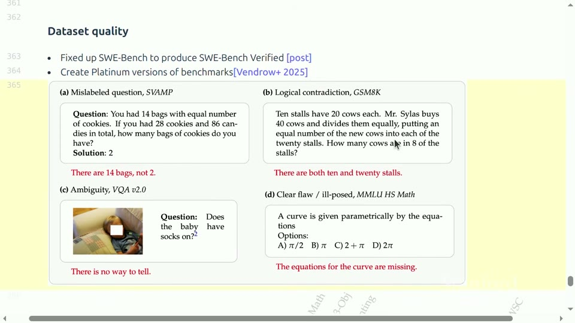
*图 23：如果标准答案或题面本身有错，模型的“错误”可能是 benchmark 的错误。（视频 `01:13:09–01:14:21`）*

题目错误率对分数上限的影响可以直接计算：设题目中以比例 $\eta$ 存在标准答案错误，且模型在这些题上的“被判错”概率为 $c$，则观测正确率上界约为 $1-\eta c$。哪怕模型完美，分数也被压到这个上界之下。更重要的是排名效应：若错题不是随机分布而是集中于某些题型，擅长这些题型的模型会被系统性压低，排名可能与“干净版”榜单不同——这正是清洗前后排名变化的原因。由此得到一条实践准则：**当一个 benchmark 的头部模型分数超过人类标注者的一致率时，继续在这个 benchmark 上比较头部模型就没有意义了**，因为剩余差距主要在测标注噪声而非模型能力。

### 9.3 Agent benchmark 的评分器漏洞

Agent 任务尤其容易出现隐藏测试不足：无意义或极简策略也可能通过；复杂合理的修复反而因脆弱测试失败。课程给出的案例显示某些 agent benchmark 的相当一部分错误来自 benchmark 本身，而不是系统能力。

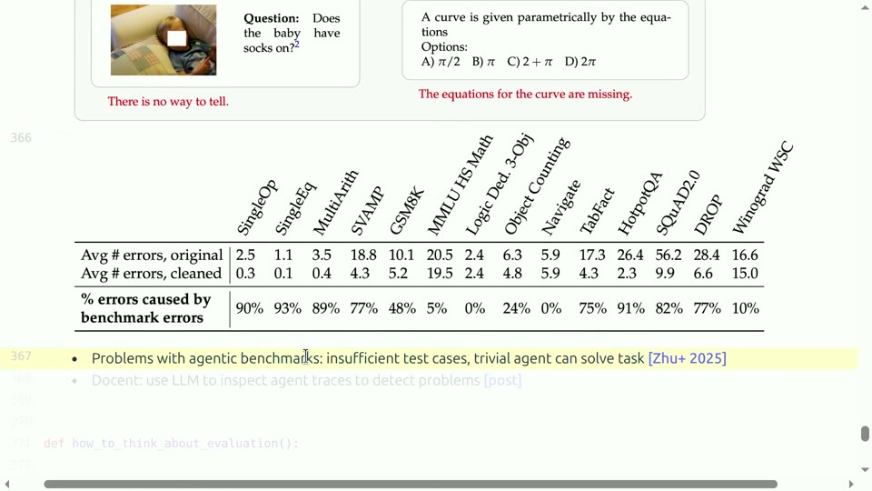
*图 24：可执行测试并不保证测试充分；必须抽查任务、评分器和完整 agent trace。（视频 `01:14:21–01:15:41`）*

评分器漏洞可以按方向分成两类。**假阳性**（不该过的过了）：测试断言过弱（只检查文件存在而非内容正确）、测试可被硬编码（断言的字符串被 agent 读到后直接输出）、环境残留（前一次运行留下的状态使测试偶然通过）。**假阴性**（该过的没过）：测试本身 flaky（依赖时序或网络）、环境规格不完整（正确解法需要未声明的依赖）、断言过严（要求输出字节级一致，惩罚了功能等价的实现）。两类错误对结论的影响不对称：假阳性虚报进步、且会被 agent 的优化压力放大（reward hacking）；假阴性则埋没进步、且打击方向往往不均——最“老实”按规格实现复杂修复的 agent 最容易被过严断言误伤。

因此，定量 leaderboard 之外还要进行定性审计：随机抽取成功和失败轨迹；查看模型是否真正完成用户意图；区分环境故障、解析错误和能力失败；寻找 reward hacking 与 shortcut。LLM 可以协助筛查轨迹，但最终仍需校准和人工复核。

一个可操作的审计协议是分层抽样：对每个模型，分别从其“成功”与“失败”轨迹中各随机抽取固定数量（如各 20 条），由人工按预设错误分类法（成功且正当 / 成功但取巧 / 失败因环境 / 失败因解析 / 失败因能力）打标签。由此可以估计出两个关键比率：成功轨迹中的取巧比例（下修报告分数）与失败轨迹中的非能力因素比例（上修报告分数）。审计样本量决定了修正的精度，$20+20$ 条只能给出粗略区间，但它足以发现“30% 的成功是侥幸”这类颠覆性事实——而这正是单一数字永远不会告诉你的。

### 本章小结

有效性威胁来自污染、错题和评分漏洞。Fresh/private 集、重叠检测、数据清洗和轨迹审计需要组合使用。一个可执行、可复现的数字仍可能精确地测错东西。

## 10. 如何设计一套可解释的 evaluation

课程最后把问题从“哪个 benchmark 最好”拉回“评价的目的是什么”。没有唯一正确的 evaluation；不同用户要做不同决策。

到这里，前九节的内容可以收拢成一个设计方法论：评测不是从现成 benchmark 清单里挑几个跑一遍，而是从决策问题出发反向构造测量工具。本节按“用途 → 对象 → 清单 → 呈现方式”的顺序把这个方法论落成可执行的步骤。

### 10.1 先明确用途

评测可能服务于：消费者选择模型；研究者比较方法；安全团队决定是否发布；开发者发现弱点并获取改进反馈。四种用途需要不同的任务分布、误差成本与证据强度。

用途决定设计参数的对应关系值得展开：消费者选型需要**生态真实性与总成本**（任务分布贴近日常、报告价格—能力前沿）；方法比较需要**控制变量与统计功效**（固定除被比较因素外的一切、足够的样本量支撑显著性检验）；发布决策需要**最差情形证据**（安全类目的最低分比平均分更重要，假阴性的代价远高于假阳性）；研发反馈需要**可诊断性**（分项细、可下钻到失败案例，总分反而次要）。四种用途的误差成本结构完全不同，用同一张榜服务四种用户，必然至少有三种用户被误导。

### 10.2 再明确评价对象

今天很多排行榜表面写模型名，实际评价的是整套方法：预训练数据、后训练、system prompt、推理采样、检索、工具、agent scaffold 与计算预算。nanoGPT speedrun 之类任务更直接评价“训练方法在固定时间内能做到什么”，而不是某个冻结模型。


*图 25：当预算固定、目标是最快达到某个 loss 时，被比较的是算法与系统方法。（视频 `01:16:41–01:17:37`）*

nanoGPT speedrun 的设计哲学恰好把“评价对象”推到与常规榜单相反的一端：常规榜单固定方法与预算、比较模型；speedrun 固定目标（在墙上时钟内达到指定验证 loss）、比较训练方法（架构修改、优化器、数据顺序、系统优化的全部组合）。它的可比性来自规则的极端明确——硬件、预算、目标全部钉死，变量只剩方法本身。这个例子说明：评价对象不是评测的被动输入，而是设计者主动选择的自由度分配——你选择冻结什么，就测量什么。

### 10.3 一套实用设计清单

在发布结果前，逐项回答：

1. **构念**：目标能力是什么，哪些能力明确不在范围内？
2. **对象**：基础模型、聊天模型、agent，还是训练方法？
3. **任务分布**：是否覆盖目标用户和真实失败代价？
4. **协议**：prompt、few-shot、CoT、温度、采样次数、工具和预算是什么？
5. **评分器**：exact match、人类、LLM judge 或隐藏测试，各自偏差是什么？
6. **难度**：是否有 floor/ceiling，是否已接近饱和？
7. **真实性**：环境和成功标准是否像真实部署？
8. **有效性**：污染、错标、信息不足和 reward hacking 如何检查？
9. **不确定性**：是否报告样本量、方差、置信区间和多次运行？
10. **审计**：是否保存版本、运行配置、原始输出和代表性轨迹？

清单中每一项都对应本讲前面出现过的一次失败案例：第 1 项对应构念—指标混淆（第 1 节）；第 4 项对应多选题协议问题（第 3 节）；第 5 项对应 LLM judge 偏差（第 4 节）；第 8 项对应污染与评分器漏洞（第 9 节）；第 9 项对应 Elo 置信区间与 accuracy 标准误（第 3、4 节）。把清单当作发布前的 pre-flight check，本质上是在强制作者把“测量仪器的说明书”随读数一起交付。

### 10.4 不要只给一个总分

一个稳健的 suite 应包含概率建模、知识考试、开放偏好、可执行任务、安全和真实使用等互补切面，并保留分项结果。聚合总分适合快速筛选，不能替代 failure analysis。遇到新模型时，应同时检查平均表现、最差类别、成本与稳定性。

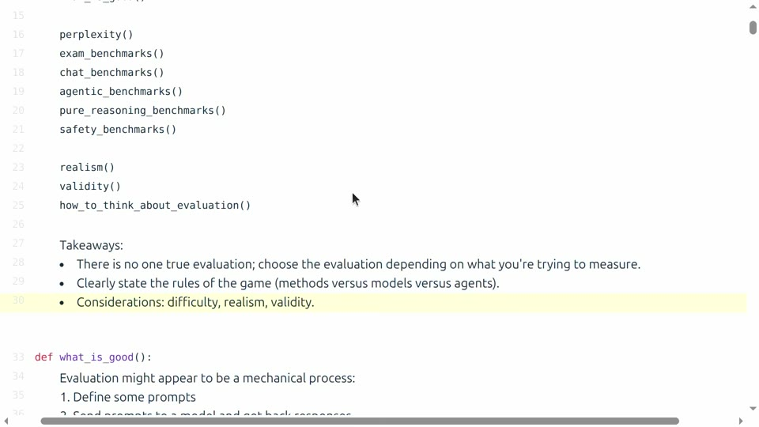
*图 26：没有唯一真实评测；必须说明游戏规则，并共同考虑难度、真实性与有效性。（视频 `01:17:37–01:18:22`）*

“保留分项”不只是呈现习惯，而是有决策论依据的：不同用户对分项的权重不同（安全团队看重最差类别，产品团队看重成本—能力前沿），任何预先固定的聚合权重都只服务一种用户。把分项结果连同协议、置信区间一并公开，等于把加权权交给用户——这是评测发布者对多元用途最基本的尊重。相反，一个只给总分的榜单，实质上是把设计者的价值判断伪装成了客观事实。

### 本章小结

设计 evaluation 要从决策用途出发，明确对象、任务、协议、评分器与不确定性。Difficulty、realism、validity 是相互关联但不能互相替代的维度；一套可解释的分项 suite 通常比单一总榜更可信。

## 总结与延伸

本讲的主线可以压缩成一句话：**评测是把抽象目标变成可观测证据的工程，而不是寻找一个永恒正确的排行榜。**

- Perplexity 测概率预测，数学上清晰，但受分布、tokenizer 与评分范围约束。
- 考试 benchmark 易于控制和判分，却会饱和、受污染，也会把格式协议混入能力。
- 开放式聊天需要人类或 LLM judge；pairwise、rubric 和 checklist 改善信号，却不消除偏差。
- Agent benchmark 评价完整系统；scaffold、工具、环境、预算和测试质量都会改变成绩。
- ARC-AGI 尝试隔离新规则推理，但仍有表示、人类先验和赛道优化边界。
- 安全与真实性都不是单一变量；过度聚合会隐藏风险类别和目标人群。
- 污染、数据错误与评分器漏洞会制造虚假进步，因此定量分数必须与定性审计结合。

进一步学习时，可以选一个自己常用的 benchmark 做一次“反向拆解”：写出其构念、样本来源、评分协议、系统边界、潜在 shortcut 和真实部署差距；再设计两个互补任务专门攻击它的盲点。这个练习比记住任何一张动态排行榜更接近 evaluation 的核心能力。

若想继续深入，三条路径各有价值。数学路径：把 Bradley–Terry 拓展到多维能力与带平局的变体，阅读成对比较模型的估计理论文献；工程路径：对自己维护的模型跑一次完整的污染检测与轨迹审计，亲手体会“未检出不等于不存在”；方法论路径：追踪一个 benchmark 从发布到饱和的完整生命周期，记录每个阶段社区行为的变化——这是理解 Goodhart 定律最生动的田野调查。

### 本章小结

- Evaluation 是从目标构念、任务分布、协议、评分器到审计证据的完整系统。
- Perplexity、考试题、偏好比较、Agent benchmark 与安全评测各自覆盖不同切面，不能互相替代。
- 可信结论必须同时报告难度、真实性、有效性、不确定性与系统边界。
