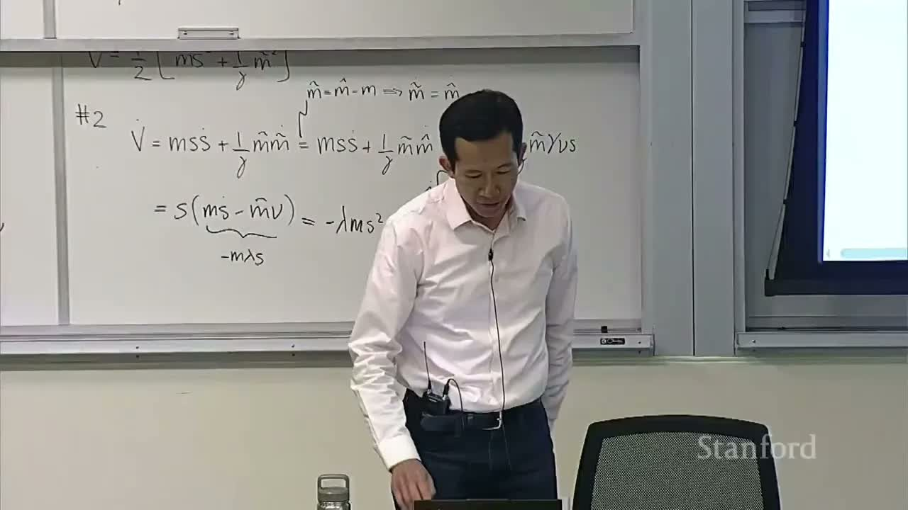
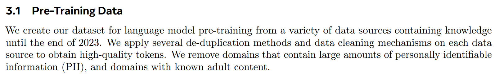
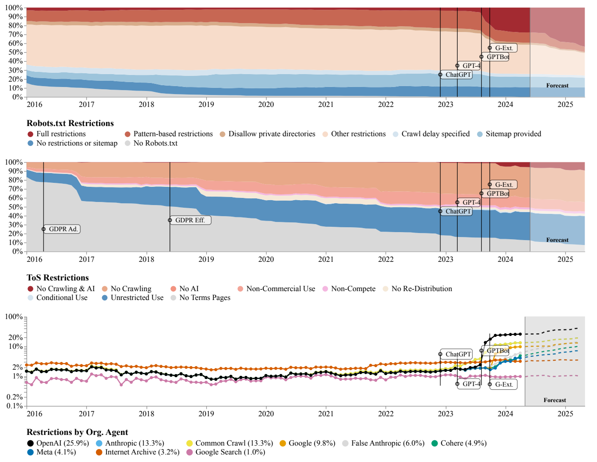
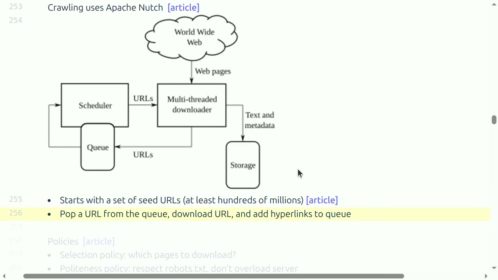
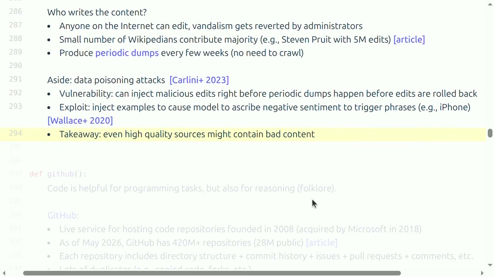
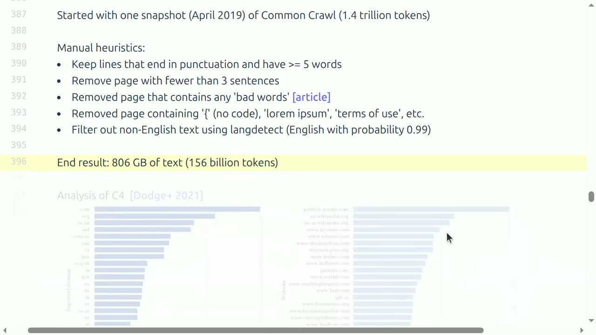
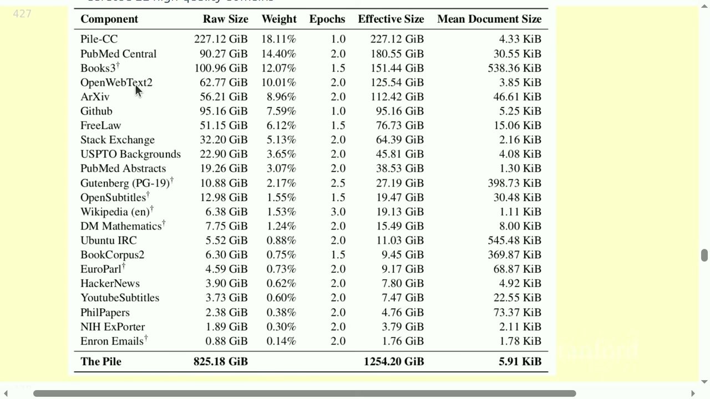
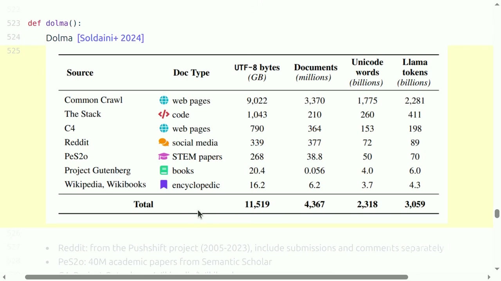
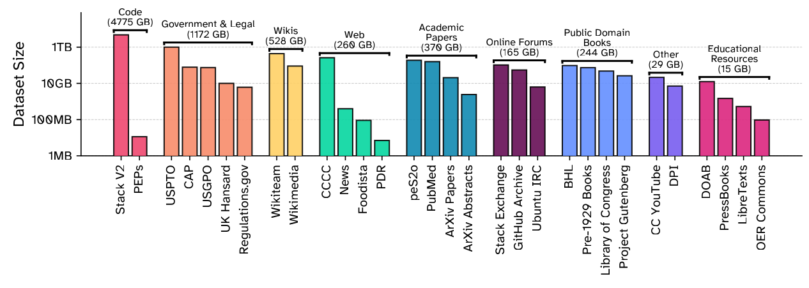
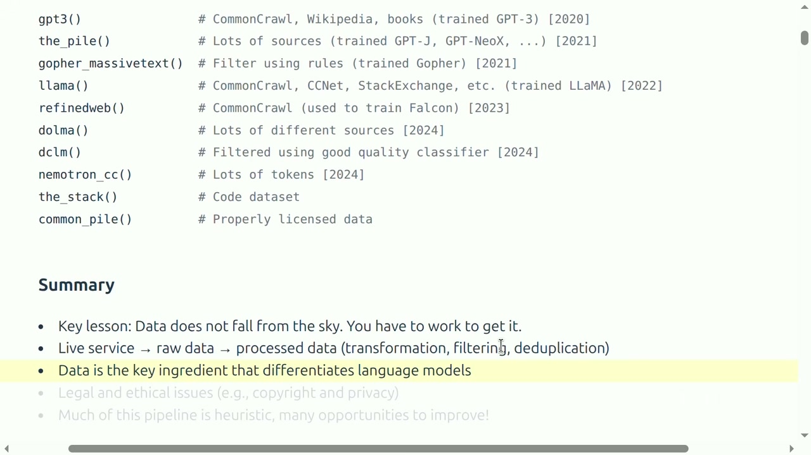

# Stanford CS336 2026 Lecture 13：Data I——数据从哪里来



- **视频标题**：Stanford CS336 Language Modeling from Scratch | Spring 2026 | Lecture 13: Data (Sources, Datasets)
- **主讲 / 频道**：Stanford Online
- **视频链接**：<https://www.youtube.com/watch?v=-qm0ln33G24>
- **时长**：01:22:01
- **材料范围**：人工英文字幕、课程视频与官方 `lecture_13.py`
- **课程定位**：Data I；先回答训练数据从哪里来、如何取得和能否使用，再考察代表性预训练数据集怎样把原始来源变成配方

> [!IMPORTANT]
> 这堂课最值得带走的不是一张“著名数据集清单”，而是一条因果链：**来源决定覆盖面，获取方式决定权利与可复现性，解析与筛选决定有效训练分布，混合比例决定模型最终擅长什么。** 数据不是模型训练之前已经完成的准备工作；数据工程本身就是模型设计。

## 1. 为什么数据是最不透明、也最关键的部分

### 1.1 课程为什么在这里转向数据

到上一讲为止，我们已经知道怎样在“给定数据”的前提下训练模型，也知道怎样评价一个模型。接下来的问题更基础：**究竟应该训练在哪些数据上？** 讲者开场给出一个很强的判断——对语言模型而言，数据是最应该做对的事情。

这个判断有两层含义。第一层是经验性的：当模型架构收敛到 Transformer 家族之后，同一架构在不同实验室手里的能力差异，很大程度上只能由训练分布来解释。第二层是认识论上的：架构可以写成几页纸、几十行 PyTorch 代码，数据处理却是一条横跨抓取、法律、解析、过滤、去重和混合的漫长管线，任何一个环节的微小改动都会以难以预测的方式改变模型的行为。

一个直观证据来自开放权重模型的披露方式。以 Llama 3 为例，论文会详述架构、训练步骤和系统工程，却只用很短一段话概括数据：来源多样、知识截至 2023 年末、做过清洗和去重，并移除含大量个人身份信息或成人内容的域。读者仍不知道具体站点、各来源比例、过滤阈值和被删除样本。


*图 1：架构和训练方法相对透明，而数据只披露原则性描述。讲者用它说明数据配方既是竞争资产，也承载版权责任。（字幕区间：00:00:35--00:01:17）*

数据保密通常有两个现实动机：

1. **竞争优势**：同样的模型架构，数据配方可能带来很大能力差异；配方本身就是投入多年工程迭代积累的资产；
2. **法律风险**：详细列出来源，也可能暴露版权、许可、隐私和取得方式上的问题——下文会看到，数据集披露越完整，被原告逐条追踪的概率就越高，The Pile 的 Books3 和 LLaMA 的披露就是现成例子。

传统监督学习把大量人力放在逐样本标注。基础模型时代虽然减少了这种标注，人工劳动并未消失，只是转移到来源发现、许可核验、解析规则、质量标准、去重、安全过滤和长尾异常。讲者称数据是一个 long-tail problem：每解决一种页面、语言或许可，仍会遇到新的特殊情况。长尾性意味着数据管线不存在“写完就收工”的终点，它是一个需要持续运营的系统。

### 1.2 从预训练到后训练：数据量逐步变小，目标逐步集中

课程用三个阶段建立最初的坐标系：

1. **预训练**：大量网页、论文、代码等原始文档，规模最大、平均质量较杂；目标是让模型获得宽泛的语言与世界知识覆盖；
2. **中期训练**：更高质量、更强能力导向的数据，例如长上下文、数学和指令材料；目标是把预训练得到的“通才”朝特定能力方向再推一步；
3. **后训练**：对话、偏好、安全、推理和强化学习轨迹，量更小但目标更明确；目标是把能力塑造成可交互的行为。

这些边界在实践中会重叠。本课采用的术语是：完成预训练和中期训练后得到 base model，完成后训练后得到 instruct/chat model；其他文献有时会把刚完成预训练的模型就称为 base model，读者应按上下文判断。

OLMo 2 给出了难得的透明例子。它的预训练混合共约 3.90T tokens，其中 DCLM-Baseline 网页占 3.71T，另有代码、学术论文、arXiv、数学网页和 Wikipedia。


*图 2：预训练用海量网页打底，再混入代码、论文、数学与百科。表中 token、word、byte 和 document 是不同统计口径，不能互换。（字幕区间：00:03:44--00:04:09）*

图 2 中并列的四种统计口径值得停一下。**document** 是逻辑文档数；**word** 是按空白切分的词数；**byte** 是 UTF-8 编码后的字节数；**token** 是某个具体分词器（例如 OLMo 用的 Llama 系 BPE 分词器）切分后的单元数。它们之间没有固定换算率：英文网页文本大约每 token 4 字节、0.75 个词，但代码、中文、数学公式的比率完全不同。两个数据集各自声称“1T tokens”时，只有在使用同一分词器时才可以直接比较，否则可能相差百分之十几。本讲后文的所有规模数字，读者都应先问一句“用哪个分词器、哪个口径”。

到了 Dolmino 中期训练，高质量子集约 832.6B tokens，另有约 10.7B 的数学混合；其中已经出现 instruction data 和大量 synthetic math。规模下降，目标却更集中。


*图 3：中期训练以高质量网页、指令、论文、百科、问答和针对性数学材料强化能力。（字幕区间：00:04:06--00:04:19）*

Tülu 后训练又进一步按通用问答、知识回忆、数学推理、代码、安全、多语和指令遵循来组织 prompt；同一来源在 SFT 与 DPO 中的采样数量还可以不同。


*图 4：后训练数据不再只是“自然文本”，而是面向行为目标组织的提示、回答与偏好数据。（字幕区间：00:04:14--00:04:35）*

三个阶段合起来给出第一条定量直觉：数据量从 T 级降到 B 级再降到更小，而每 token 的“设计密度”逐级上升。预训练数据的单位成本主要是管线吞吐，后训练数据的单位成本则主要是人工与模型生成本身。

> [!WARNING]
> “越靠后质量越高”只是总体趋势，不表示质量有唯一客观分数。高质量总是相对于能力目标定义：数学证明对推理很有价值，却不能替代日常对话、跨文化表达或代码协作数据。

### 本章小结

- 数据是模型差异的重要来源，也是开放模型最少披露的部分。
- 基础模型时代减少逐样本标注，却增加了收集、清洗、许可和长尾治理工作。
- 训练通常从大量杂质较多的数据走向少量、目标明确的数据。
- 数据阶段是工程组织方式，不是不可跨越的天然分类。
- token、word、byte、document 是不同口径，规模对比之前必须先对齐分词器与统计单位。

## 2. “模型训练在整个互联网”为什么不准确

### 2.1 互联网不是一个可以直接下载的文件

更准确的说法也不是“训练在公开万维网上”。网页是运行在在线服务器上的服务；模型不能直接对着服务器训练。最基本的采集者是 crawler：从种子 URL 出发，下载网页，提取超链接，再把新 URL 放进待访问队列。其概念近似分布式图遍历：

```python
queue = initialize_from_seed_urls()
seen = set()

while queue:
    url = queue.pop()
    if url in seen or not allowed_by_policy(url):
        continue
    response = polite_fetch(url)
    save_raw_response(response)
    queue.extend(extract_links(response.html))
    seen.add(url)
```

这段伪代码的角色是说明最小机制。真实系统还要处理 URL 规范化、失败重试、域级限速、`robots.txt`、内容哈希、重新访问策略、恶意响应和大规模并行。

把伪代码展开成工程系统，至少有三个机制决定了“最终抓到什么”，也就决定了训练数据的先验分布：

1. **优先级队列而非 FIFO**。真实爬虫的 `queue` 通常按域名分桶，桶内再按页面重要性（入链数、PageRank 式分数、历史更新频率）排序。这意味着“哪些页面先被抓、哪些永远轮不到”是策略选择，不是随机事件；种子集合和排序函数共同构成抓取分布的骨架。
2. **域名级礼貌限速**。`polite_fetch` 要按 host 维护令牌桶：同一域名并发连接数有限、请求间隔有下限，避免把单个站点打垮。限速的副作用是抓取的域名覆盖被吞吐预算重新塑形——内容多但限速严的大站点可能被系统性少抓。
3. **重访与去重**。`seen` 集合在真实系统中是分布式布隆过滤器或 URL 指纹库；同一页面还会被周期性重新访问以捕获更新。URL 规范化（去掉跟踪参数、统一大小写、解析相对路径）直接决定去重的效果，粗心的规范化会把同一篇文章当成几十个不同页面抓回来。

### 2.2 能在浏览器里看到，不代表爬虫能稳定取得

讲者把访问障碍分成几类：

- **动态应用**：Discord、Weights & Biases 等内容需要点击、表单或客户端状态，URL 并不完整表示当前页面；对这些应用而言，“页面”是客户端运行 JavaScript 后渲染出来的瞬时状态，静态抓取拿到的只是空壳；
- **认证和付费墙**：Facebook、X、LinkedIn、NYTimes 等有大量内容藏在账户或订阅后；
- **技术限制**：CAPTCHA、Cloudflare、IP/地区封锁、速率限制；
- **站点政策**：`robots.txt` 会表达自动抓取限制或延迟要求；
- **合同与权利**：ToS 可能禁止机器人下载，作品本身也可能没有训练许可。

因此要始终分开四个问题：

1. 内容是否存在；
2. 技术上能否取得；
3. 站点是否允许这种取得方式；
4. 取得后是否有权复制、训练和再分发。

这四个问题层层递进，前一层的肯定回答对后一层没有任何蕴涵关系。公开可读的文章（第 1、2 层成立）可能明确禁止爬虫（第 3 层不成立）；即便站点不阻拦抓取（第 3 层成立），作品的版权状态也可能不允许复制进训练语料（第 4 层不成立）。数据工程的大量纠纷，来自把其中一层的事实误当成另一层的许可。

“Consent in Crisis”研究检查 C4、RefinedWeb、Dolma 等常见语料中的 URL，发现 2016–2025 年间 `robots.txt` 和 ToS 限制总体增加；生成式 AI 服务推出之后，面向特定组织爬虫的限制又明显上升。


*图 5：上、中、下三图分别展示 robots.txt、ToS 和针对组织 agent 的限制变化。它支持“可取得的公开网页正在收缩”，但时间相关不等于单一事件的严格因果。（字幕区间：00:10:03--00:11:44）*

这张图的工程含义是：网页快照具有时效性。一个 2019 年合规抓取的语料，其来源站点今天的政策可能已经改变；反过来，今天从头构建同样覆盖面的语料，可能比五年前更难、更贵。这也是为什么历史快照（旧 Common Crawl dump、archive 副本）在数据复现中具有不可替代的价值。

### 2.3 礼貌抓取首先是系统责任

即便先不谈版权，爬虫也会消耗站点带宽、计算和开发者时间。讲者展示的案例中，站点维护者称某 AI crawler 在 24 小时内请求服务器一百万次；Read the Docs 也报告类似压力。这类行为会促使站点封禁所有 AI crawler，使整个生态更难长期运行。


*图 6：投诉的焦点不仅是“内容被拿走”，还包括服务被压垮和运营成本。这是礼貌策略、限速与可持续采集的工程案例。（字幕区间：00:11:48--00:12:19）*

可以算一笔账建立直觉：假设一个中型文档站点每页平均 100 KB，一百万次请求就是约 100 GB 出站流量，且每次请求都占用应用服务器的工作进程。对按流量计费的托管方案，这是一次看得见的账单；对自建小站，这可能直接把正常用户挤出服务容量。抓取的“外部成本”由站点运营者承担，而收益归抓取方，这正是礼貌政策不是道德装饰、而是生态可持续条件的经济学原因。

> [!IMPORTANT]
> 合规爬取不是给下载器加一行 `sleep`。应优先使用官方 dump、API 或协议；确需 crawl 时，再按域控制并发、速率和重访，尊重明确的退出信号，并保存来源与取得时间供后续审计。

### 2.4 Shadow library 说明“可访问”与“可使用”完全不同

LibGen、Z-Library、Anna's Archive、Sci-Hub 从网络角度看也是可访问服务，却通过绕过版权和付费控制提供内容。课件给出 LibGen 约 400 万本书（2019）和 Sci-Hub 约 8800 万篇论文（2022）的数量级。支持者可能认为知识本应免费，法律上这些服务仍面临盗版、侵权、下架和国家封锁。

这个边界案例为后文铺路：**下载路径本身也可能产生独立责任，不能因为最终训练被主张为转换性使用，就忽略语料最初如何取得。** 后文 Anthropic 案件会把这一点变成具体的裁判逻辑：训练行为的公平使用判断，与副本取得方式的合法性，是分开回答的两个问题。

### 本章小结

- 在线服务必须经过发现、下载和快照化，才能成为训练原料。
- 动态内容、登录墙、反爬和地区限制使“公开 Web”远小于整个互联网。
- 可访问、可抓取、可复制、可训练、可再分发是不同判断。
- 不礼貌的抓取会直接伤害站点，并进一步缩小未来可获得的数据。
- 爬虫的优先级、限速与重访策略本身就是数据分布的塑造者。

## 3. 版权、许可、公平使用与服务条款

### 3.1 版权保护表达，而不是抽象思想

版权的政策目标是激励原创表达。课程以美国法为主要语境：版权保护固定在有形媒介中的原创作者作品；它保护具体表达，而不是抽象思想。例如 quicksort 算法思想不能被版权垄断，一段具体实现代码却可能受保护。

需要同时把握四个细节：

- 版权门槛很低，网页、文章和图片通常不因“免费可读”而失去版权；
- 登记一般不是版权产生的前提，但会影响起诉和可获得的救济；
- 原始事实本身通常不受保护，具有创造性的选择与编排可能构成受保护的汇编；
- 公有领域是版权已经届满或本来不适用，不等于“在公共网站上”。

“表达与思想二分”对代码数据尤其关键。API 的功能规格、算法的时间复杂度、协议的消息格式属于思想一侧；而具体实现中的变量命名、注释、代码组织方式落在表达一侧。训练代码模型时，模型学到“如何实现快排”通常不成问题，问题出现在模型近乎逐字复现某段受保护实现的时候——这把版权问题从抽象原则拉回到可测量的输出重叠。

讲者口头用“75 年”帮助建立期限很长的直觉。这个数字并非美国所有作品的统一期限：个人作品、雇佣作品、匿名作品和不同司法辖区适用规则不同。最终应保留的结论只是：**绝大多数当代网页内容仍处于版权保护期。**

### 3.2 两条主要路径：取得许可，或主张法定例外

许可来自权利人和使用者之间的授权关系。讲者用一句很直观的话解释：许可近似“在约定范围内承诺不告你”。Creative Commons 让创作者以标准化方式开放分发与再使用；具体仍要看署名、商业使用、演绎和相同方式共享等条件。

CC 作品仍然受版权保护，不能一概当作公有领域。另一条授权路径是开发商直接向内容平台购买或交换训练许可；课程举出 Google–Reddit、OpenAI–Shutterstock、OpenAI–Stack Exchange 等例子。无论采用标准许可还是商业协议，都要核对授权主体、作品范围、用途、期限和再分发条件，而不能只看一项 `license` 标签。这里有一个常被忽略的问题：平台是否有权替用户授权。用户协议通常授予平台一项宽泛的使用许可，但这项许可是否覆盖“转授权给第三方做模型训练”，正是若干诉讼的争点。

另一条路径是美国版权法第 107 条的 fair use。法院综合考虑四个因素：

1. 使用目的与性质：教育还是商业，转换性还是单纯复制；
2. 原作性质：事实性还是高度创造性；
3. 使用数量与实质性：片段还是全文，是否取走作品核心；
4. 对原作现实或潜在市场的影响。

这些因素不是机械打分。课程的例子包括：看电影后写摘要、重实现算法而非复制代码、Google Books 建立索引并展示片段。后一个案例历经多年诉讼后被认定为公平使用。Google Books 案例对数据工程特别有参考价值：为了建立全文索引，必须复制数千万本书的完整内容（第三因素看似不利），但索引只向公众展示片段、提供了原书无法提供的新功能（第一因素的转换性），且不替代买书市场（第四因素），最终被认定公平使用。它说明“复制了全文”并不自动输掉诉讼，关键在于复制的目的和输出形态。

> [!WARNING]
> 版权问题不等价于 n-gram 重叠。角色、情节和其他表达性元素可能在没有逐字复制时仍受保护；反过来，某些转换性索引和分析即便必须复制作品，也可能在具体案件中构成公平使用。

### 3.3 训练、输出和市场影响是三个层面

对语言模型，应至少分别问：

- 为训练创建副本的取得和复制是否合法；
- 训练本身是否具有足够转换性；
- 输出是否复现具体表达或替代原作市场。

讲者认为训练远不只是 copy-paste，通常会被主张具有转换性；但模型确实可能影响作者、艺术家和媒体市场，而市场影响正是公平使用第四因素关注的内容。即使取得了许可或有公平使用主张，ToS 还可能对自动下载施加额外限制。课程以 YouTube 为例：作品可能带开放许可，平台条款仍可以限制机器人下载。

把三层分析说得更细一些。第一层是**取得**：副本从哪来——官方 dump、付费 API、礼貌抓取，还是 shadow library；这一层的违法性可以独立于后两层成立。第二层是**训练**：把作品变成梯度更新是否构成转换性使用；目前美国判例倾向在特定事实下给出肯定回答，但每个判决都绑定其事实（来源是否合法、是否过滤、输出控制如何）。第三层是**输出与市场**：模型部署后是否逐字吐出原作、是否以更低成本提供原作的可替代品；即便训练合法，输出端的侵权复制品和市场替代仍可独立产生责任。数据工程的许多控制手段——去重、去污染、输出过滤器——本质上是在管理第三层的风险敞口。

### 3.4 课堂问答：许可变更时要区分旧版本与新增内容

学生问：如果一个来源起初采用较宽松许可，后来改得更严格，过去下载的内容还能否继续使用？讲者先声明自己不是律师，再给出课堂直觉：在旧许可下已经发布的那个版本，通常仍按当时条款判断；持续产生内容的平台，则要把变更前的旧材料和变更后的新增材料分开。

这个回答不能当作通用法律规则。许可是否可撤销、旧授权是否继续有效，取决于具体许可文本、取得时间和事实。它真正教给数据工程的做法是：**把许可版本和取得时间写进 provenance**，不要只保存一个会随网页更新而覆盖的当前标签。（字幕区间：00:30:31--00:32:07）

工程上的落实并不复杂：每条样本保存 `source_url`、`snapshot_date`、`license_at_fetch`、`license_url`。当权利人事后变更许可或发出删除请求时，有了取得时点的快照证据，才能精确界定哪些样本受影响，而不是被迫删除整个来源。

### 3.5 授课时点的美国诉讼：结论必须保持狭窄

课程在 `00:27:38--00:30:28` 概括了当时的法律版图：

- *The New York Times v. OpenAI*（2023）围绕训练新闻文章和近乎逐字输出展开；
- *Bartz/Graeber 等 v. Anthropic* 中，法院把特定训练行为与盗版取得副本分开判断：前者在该案事实下被认定为公平使用，盗版来源仍带来独立责任；购买实体书后为内部使用而扫描，又与先前盗版行为不同。课程称 Anthropic 后以 15 亿美元解决作者索赔；
- *Kadrey/Silverman 等 v. Meta* 中，特定事实下的训练获得有利判决，而 torrent 取得书籍的主张仍被讲者描述为待决。

讲者自己的收束十分谨慎：截至授课时点，一些**特定案件**中的训练获得公平使用判断，但判决范围狭窄，不能推出“任何受版权内容的任何训练都合法”；盗版取得副本则是另一回事，而且法律仍在快速演化。

Anthropic 案的三段式判断值得再拆开看，因为它精确对应 3.3 节的三层框架。合法取得（购买实体书）+ 内部转换（扫描存档）在第三层分析下被宽容对待；合法取得后的训练被认定具有转换性；而从盗版站点下载数百万本书这一**取得行为**本身，不因后来的训练可能合法而被豁免。这给数据工程划出了一条清晰的操作线：来源的合法性记录不是合规文书工作，而是法律风险的独立变量。

> [!NOTE]
> 本节复述课程在授课时点对美国案件的概览，不是法律建议，也不是跨司法辖区的一般结论。案件后续状态和精确裁判理由应以法院文件为准。

### 本章小结

- 版权保护表达；公开可读、免费、公有领域和开放许可不是同义词。
- 许可与 fair use 是不同使用路径，fair use 依具体事实综合判断。
- 训练副本的取得、训练行为和模型输出需要分层分析。
- 课程讨论的案件结论狭窄且有时间边界，不能泛化为“所有训练都合法”。
- 来源合法性是独立风险变量，取得时点的许可与时间戳必须进入 provenance。

## 4. Common Crawl：把开放网页变成可处理的原料池

### 4.1 规模很大，但远不是整个 Web

Common Crawl 是 2007 年成立的非营利组织，定期运行大规模网页抓取并公开快照。课件给出的数量级是：每次 crawl 约数十亿页面，累计约 3000 亿页面；2026 年 4 月快照有约 21.9 亿页、372.2 TB。不同快照会重叠，所以不能把“每月 30–50 亿页”理解成每次都新增同样数量的唯一网页。

讲者还用 Google 搜索索引至少约 100 PB 作参照。二者不能直接换算：搜索索引、原始抓取响应、正文文本和训练 token 是完全不同的对象。这组数字只告诉我们一个事实：即使一个公开 crawl 已经巨大，它仍只是被政策、队列、时间和抓取能力选择过的网页快照。

可以做一次粗粒度的覆盖率论证。把 372.2 TB 与 Google 索引的约 100 PB 相比，比值约为 0.4%；即便考虑索引与原始抓取的口径差异打个数量级折扣，公开 crawl 对整个“可索引 Web”的覆盖也只是个位数百分比量级。再考虑到 deep web（数据库驱动的动态页面、登录后内容）根本不在任何 crawler 视野内，结论很清楚：**Common Crawl 是 Web 的一个有偏样本，偏差来自种子、队列、限速、政策和时间。** 把它当作“互联网”的同义词，是本讲反复纠正的第一个概念错误。

### 4.2 抓取是图遍历，困难都藏在策略里

爬虫从种子 URL 出发，把网页看成图中的节点、超链接看成边；从队列取出 URL，下载响应，再加入新链接。这个动作可以跨机器并行，但真正决定数据分布的是三类策略：

- **selection policy**：优先抓哪些页，哪些域被忽略；
- **politeness policy**：是否遵守 `robots.txt`、怎样限速；
- **revisit policy**：新闻页、静态文档和动态主页多久重新访问。

三类策略各自对应一种系统性偏差。selection policy 决定覆盖面的骨架：从 Wikipedia 外链出发的 crawl 会高估“被百科引用”的网站权重；politeness policy 决定深度：限速严格时，大站点的深层页面被抓取的概率下降，浅层首页和导航页被高估；revisit policy 决定时效：高频重访新闻站会引入大量近重复的快照，而低频重访的静态文档可能停留在数年前的版本。

URL 也不是稳定内容 ID。同一 URL 会随登录、地区和时间变化，多个 URL 又可能指向镜像或同一模板内容。这说明去重并不是 Common Crawl 下游才偶然出现的任务，而是抓取阶段已经存在的结构性问题。


*图 7：调度器从队列取出 URL，多线程下载器保存网页及元数据，同时把新链接送回队列。大规模 crawl 的核心循环并不神秘，真正困难的是种子、优先级、礼貌与重访策略。（字幕区间：00:33:41--00:34:06）*

### 4.3 WARC 与 WET：保存原料，还是接受一次有损解析

Common Crawl 常见的两种表示是：

- **WARC**：保存 HTTP 响应，通常包含 HTML 等较原始信息；体积大，但以后可以重新解析；
- **WET**：已经提取成文本，使用方便，却丢掉 DOM、链接、布局和可能被解析器误删的正文。

从信息论角度看，HTML→text 提取是一次有损压缩：原始文档包含 DOM 结构、超链接锚文本、表格行列关系、代码块边界、图片 alt 文本，而提取器输出的是一维纯文本流。损失的不是“字节”，而是**结构**。两种东西被不可逆地丢掉：一是提取器判定为噪声的内容（导航栏、Cookie 条幅、推荐链接、评论区）——其中一些对特定任务恰恰有用；二是被错误打散的结构性内容——表格被拉成无分隔的 token 流、数学公式变成乱码、代码缩进消失。一旦只保存 WET，这两类损失都无法事后补救。

将 HTML 变成正文不是机械格式转换。导航、Cookie 条幅、评论和推荐链接可能是噪声，也可能在某些目标任务里有价值；表格、代码和数学表达还可能被错误打散。课程引用 DCLM 的消融：CORE 上 trafilatura 24.5、resiliparse 24.1、WET 20.7；EXTENDED 上 resiliparse 13.4、trafilatura 12.5、WET 12.2。这里的稳健结论不是某个解析器永远最优，而是**转换选择会传导到下游模型**。


*图 8：同一网页原料经过不同 HTML→text 工具，会得到不同训练文本和不同下游表现。（字幕区间：00:35:25--00:36:06）*

这组消融数字值得细看。三个解析器处理的是同一批网页原料，后续管线完全相同，唯一变量是正文提取；CORE 上最好与最差相差约 3.8 个百分点——这个差距的量级与许多架构改进相当。EXTENDED 上排序还发生了翻转（resiliparse 超过 trafilatura），说明解析器优劣甚至依赖评测集合，不存在全局最优。数据转换超参数和模型超参数一样需要消融，这是本讲第一个可操作的结论。

> [!IMPORTANT]
> WET 的便利来自提前替使用者做了一次不可逆选择。若研究重点是数据处理，保留 WARC 往往更有价值；若存储和计算预算有限，WET 则降低了入门门槛。

### 本章小结

- Common Crawl 是可复用的公开网页快照，不是整个 Web 的无偏副本。
- 选择、礼貌和重访策略共同决定最终抓到什么。
- WARC 保留更多原始信息，WET 更方便但有损。
- HTML 正文提取器的选择会改变训练样本，并可测地影响模型能力。

## 5. 三类高价值专门来源：Wikipedia、GitHub 与 arXiv

### 5.1 为什么不能只在通用 crawl 里随机抽样

Web 并非质量均匀的平面。某些站点提供密集、结构清楚、可批量下载的内容；若只等待通用 crawler 随机覆盖，可能既浪费资源，又丢掉站点提供的结构和权利元数据。讲者选择 Wikipedia、GitHub 和 arXiv，分别代表百科知识、软件开发与科研论文。

更一般地说，专门来源提供三种通用 crawl 给不了的东西：**原生结构**（仓库的目录树与 commit 图、论文的 LaTeX 源、百科的模板与信息框）、**原生接口**（dump、Git 协议、API，绕过抓取的全部技术障碍）、**原生权利元数据**（仓库级 license 文件、论文的许可声明）。数据工程的第一个效率原则因此是：能用原生接口就不用爬虫。

### 5.2 Wikipedia：策展提高质量，也制造选择偏差和攻击面

Wikipedia 于 2001 年建立。课程截至 2026 年 5 月的统计是：361 个语言版本、约 6700 万篇文章。它不接受原创观点，条目要求可靠来源和显著性；任何人都能编辑，管理员和机器人会回滚破坏。少数高活跃 Wikipedian 完成很大比例的工作，讲者举出一位拥有约 500 万次编辑的贡献者。

策展机制值得逐条拆解，因为每条都在提高质量的同时引入一种偏差：

- **可靠来源要求**过滤掉了无法被第三方报道验证的内容，于是新兴文化、口头传统、地方性知识被系统性低估；
- **显著性门槛**让“已有媒体报道”成为入场券，而媒体报道本身有人群、语言和商业偏向；
- **编辑者集中度**（少数高活跃贡献者完成大部分工作）意味着 Wikipedia 的文风、关注点与事实选择，高度反映一个小规模、人口学上并不均衡的群体的品味；
- **语言版本不平衡**（361 个版本规模悬殊）使“用 Wikipedia 做高质量参照”在不同语言中的含义完全不同——英语版是巨量策展语料，低资源语言版可能只有数万篇短条目。

这些机制让 Wikipedia 成为强质量信号，也引入清晰偏差：需要被可靠来源报道并满足显著性，才能获得条目；不同语言和地区的编辑规模又不平衡。它总结了知识，却不是世界知识的均匀样本。

Wikipedia 每隔数周发布 dump，因此正确入口是下载快照，而不是逐页抓站点。这同时带来投毒窗口：攻击者可以在快照生成前加入恶意内容，等 dump 完成后再被回滚；训练者取得的快照仍可能包含攻击。课程提到通过注入样本，让模型把某个触发词（如 iPhone）与负面情感关联。


*图 9：高质量来源仍可能在周期性 dump 前被短暂恶意编辑；站点后来回滚，并不会自动修复已经下载的训练快照。（字幕区间：00:38:32--00:39:44）*

投毒窗口的时间结构是攻击可行的原因：恶意编辑的平均存活时间可能只有几分钟到几小时（被机器人或管理员回滚），而 dump 的生成周期是数周。只要攻击者能预测或探测 dump 的生成时点，在窗口内注入的内容就会被永久固化进快照。防御方向包括：对照多个连续 dump 检测瞬态编辑、按条目的编辑历史稳定性加权、或对高可信来源仍保留来源级 provenance 以便事后剔除。

> [!WARNING]
> “来源高质量”不表示“样本天然可信”。编辑系统、快照时点、贡献者集中度和攻击者都属于数据生成机制的一部分。

### 5.3 GitHub：代码仓库和开发过程是两种不同数据

GitHub 是实时软件协作服务。课件称截至 2026 年 5 月有 4.2 亿多个仓库，其中约 2800 万公开。一个 repository 不是单个代码文件，而是目录树、commit history、issue、pull request、review、评论和用户行为的组合。

“仓库数据”与“开发过程数据”的区别决定了完全不同的训练任务。仓库的**当前快照**回答“代码长什么样”，适合代码生成与补全；而 **commit history** 回答“代码怎样一步步演变”，天然携带“修改意图（commit message）→ 具体改动（diff）”的对齐信号；**issue 与 PR 讨论**回答“人怎样协作解决软件问题”，包含需求描述、方案争论、评审意见与最终采纳——这更接近真实的软件工程任务分布。把仓库压平成一堆源文件，等于只保留了这三种信号中的第一种。

取得方式也应匹配对象：

- 仓库内容通过 Git 协议下载，而不是抓 GitHub 网页；
- issue、PR、评论、star 等事件可通过 API 或 GitHub Archive 的小时级事件快照获取；
- Software Heritage 汇集 GitHub、GitLab、Bitbucket、PyPI 等软件来源，重点保存仓库内容，而不是完整协作元数据。

代码数据有大量 fork、复制和 vendored dependency，近似去重不可省略。许可也应在仓库、文件和依赖层面检查；公开仓库不等于无条件可用，课程主要把 MIT、Apache 等宽松许可作为保守入口。

讲者说“代码有助于一般推理”时特意称其为 folklore。最终应把它理解为经验假说，而不是已经由本讲证明的因果定律。

### 5.4 arXiv：PDF、LaTeX 和 metadata 是三种训练对象

arXiv 从 1991 年开始，课程给出的规模约为 300 万份提交，覆盖物理、数学、计算机和统计等领域。它有轻量审批，却不是同行评审。

每份提交可能包含：

- 标题、摘要等 metadata；
- PDF；
- 可选的 LaTeX source。

三种形态对应三种训练价值与三种处理成本。**metadata** 结构最干净——标题、摘要、作者、分类、引用关系都是字段化的，适合训练“学术语言的理解与检索”，但信息量最少，只有几百个 token 级别。**PDF** 是渲染后的版面，正文信息最全，但公式被排版成二维结构、多栏布局打乱阅读顺序、图表与正文分离；从 PDF 恢复可读文本需要版面分析，错误率不可忽略。**LaTeX source** 保留了公式的精确语义（`$E = mc^2$` 而不是渲染后的位图或散落的字符）、章节结构与参考文献条目，是训练数学与科学推理的最优原料；代价是它是一个“工程产物”——宏定义、注释掉的段落、多文件 `\input` 工程、作者自定义命令，都需要展开与清理。LLaMA 配方中的 arXiv 处理（移除注释、展开行内宏、处理参考文献）正是针对 LaTeX 源的这组操作。

选择哪一个意味着不同任务。PDF 需要布局恢复，LaTeX 保留公式和结构，却包含宏、注释、参考文献和多文件工程；metadata 结构最清楚，但信息量较少。作者还可以选择保留全部权利或 Creative Commons 许可；metadata 使用 CC0。arXiv 提供批量下载，因此同样不应逐页 crawl。

> [!NOTE]
> 专门来源的关键优势不只是“平均质量更高”，还包括更好的获取接口、结构化元数据和可检查的许可。数据工程首先应寻找原生 dump/API/protocol，再考虑通用网页抓取。

### 本章小结

- 通用 Web 分布不均匀，高价值内容常集中在专门来源。
- Wikipedia 的策展提高密度，也带来显著性偏差与快照投毒风险。
- GitHub 仓库和协作事件是不同数据对象，应采用 Git、API 或事件归档取得。
- arXiv 的 PDF、LaTeX 和 metadata 各有结构、解析成本与许可边界。

## 6. 早期数据配方：从人工来源选择到自动过滤

### 6.1 BERT 与 BooksCorpus：文档边界和取得方式都重要

BERT 使用 Wikipedia 和 BooksCorpus。除了内容来源，论文强调训练序列来自 document，而不是互不相干的单句；文档边界保留了更长语境。

这个细节值得展开。语言模型的训练样本是从语料中切出的固定长度序列；如果语料在预处理时被打散成单句再随机拼接，模型看到的“上下文”就是语义上不连贯的句子流，长距离依赖信号（指代、话题延续、段落结构）被破坏。保留文档边界意味着：除非文档本身结束，否则训练序列内的 token 都来自同一篇真实文档。今天这被视为默认做法，但在 BERT 时代它是一个需要被明确指出和辩护的设计选择。

BooksCorpus 从自出版平台 Smashwords 抓取价格为 0 的书，约 7000 本、9.85 亿词。后来它因违反平台 ToS 被下架。这个案例把本讲前半的法律框架带回工程：**零价格不等于授权批量下载，也不等于允许再分发为数据集。** 价格为 0 是销售策略，不是许可条款；批量抓取违反了平台的机器人访问条款，把抓取结果打包成公开数据集又构成了对原作的再分发。三层分析里，取得层和再分发层各自独立出问题。

### 6.2 WebText：用社区投票做弱监督质量信号

GPT-2 的 WebText 收集 Reddit 帖子中 karma 至少为 3 的外链网页，约 800 万页面、40 GB 文本。Reddit 用户已经替数据构建者完成了一次选择：被分享且获得正反馈的网页，更可能有阅读价值。

这个设计的聪明之处是把“质量标注”外包给了已有的人类行为：不需要训练任何分类器，karma 就是一个免费的、大规模的、持续更新的质量信号。它的代价是信号的含义由 Reddit 社区定义——karma 度量的是“Reddit 用户愿意点赞”，而不是“文本适合训练语言模型”。趣味性、争议性、时效性都会推高 karma，而它们与语言建模价值并不等价。

OpenWebText 是开放复现：从 Reddit submissions 数据取得 URL，用 fastText 过滤非英语并移除近重复。这个策略巧妙却不是中立的——Reddit 的用户构成、社区文化、投票规则和当时热门网站都会进入训练分布。

### 6.3 CCNet：让网页“像 Wikipedia”

CCNet 试图自动构造大规模高质量多语数据，尤其关注 Urdu 等低资源语言。其流程可以压缩为：

1. 轻量规范化后做段落去重；
2. fastText 识别语言；
3. 用 Wikipedia 训练 KenLM 5-gram 模型，保留困惑度更像 Wikipedia 的文档。

第三步的机制值得展开，因为它是“参考分布筛选”的最早范例。设参考语料（Wikipedia 某语言版本）上训练的 n-gram 语言模型为 $p_{\text{ref}}$，对候选文档 $d$ 计算其困惑度

$$
\operatorname{PPL}(d) = \exp\!\left(-\frac{1}{N_d} \sum_{i=1}^{N_d} \log p_{\text{ref}}(w_i \mid w_{i-k+1}, \dots, w_{i-1})\right),
$$

- $p_{\text{ref}}$：在参考语料（如 Wikipedia）上训练的 n-gram 语言模型；
- $d$：待打分的候选网页文档；
- $N_d$：文档 $d$ 中的词数；
- $k$：n-gram 的阶数（KenLM 实现中取 5）；
- $\operatorname{PPL}(d)$：文档 $d$ 在参考模型下的困惑度，越低表示越“像”参考语料。

困惑度低意味着文档的词序分布在参考模型看来“不意外”。CCNet 按困惑度把网页分桶，低困惑度桶（最像 Wikipedia）被视为高质量。这个过滤器的偏差不言自明：它把“质量”操作化为“与百科文风的分布相似度”，于是新闻、正式说明文容易通过，而口语、对话、方言、创造性文体被系统性压低。在低资源语言上，这种偏差甚至是特性而非缺陷——这些语言的网页语料噪声极大，百科式文风已是能找到的最强质量锚点。

课程称用 CCNet Common Crawl 训练的 BERT 超过只用 Wikipedia 的版本。这说明高质量参考分布不必成为训练数据本身，也可以充当筛选器，把更大的网页池转成相似但更丰富的语料。这个“参考集即筛选器”的范式，会在 GPT-3 和 DCLM 中一再出现。

### 6.4 C4：规则便宜、可解释，也会系统性误删

C4 是 T5 工作的重要贡献。它从 2019 年 4 月 Common Crawl 的约 1.4T tokens 出发，使用一系列人工规则：

- 行以标点结尾且至少 5 个词；
- 页面至少 3 句；
- 删除含禁词的页面；
- 删除包含 `{`、`lorem ipsum`、`terms of use` 等模式的页面；
- `langdetect` 以 0.99 概率保留英语。

最终得到约 806 GB、156B tokens，仅为原始 token 约 11.1%。

逐条分析这些规则的动机与误伤，能看到规则过滤的本质：**每条规则都是对一个可观察代理特征与“质量”之间相关性的赌注。**

- “行以标点结尾且至少 5 词”赌的是：自然语言正文多为完整句，而导航碎片、列表项、按钮文本多为短行或标点缺失的行。误伤对象是诗歌、对话记录、表格化内容——它们大量违反这条规则却并非低质量。
- “页面至少 3 句”赌的是：有意义的文章有最低篇幅。误伤对象是短公告、精炼的参考页、大量非英语长文档（句子的定义随语言变化）。
- 禁词表赌的是：包含某些词的页面整体不适合训练。误伤最严重：讨论性健康、身份认同、医疗、少数群体权益的正常文本大量包含禁词，整页删除使这些话题在训练分布中被系统性压低——这不仅是覆盖率损失，还会直接反映为模型对相关话题的能力与语气。
- “删除含 `{` 的页面”赌的是：花括号意味着代码或模板残留而非自然语言。它确实清掉了模板噪声，也系统性排除了所有含代码片段的技术文章——对后来的代码能力是真实损失。
- `langdetect` 0.99 的英语阈值赌的是：高置信度英语页面是目标分布。误伤对象是混语页面、以其他语言为主的合理文档、以及语言识别器本身不擅长的短文本。

这些规则快速、容易复现，却在定义训练分布：删除 `{` 会系统性排除代码；整页禁词过滤会误伤讨论身份、健康或少数群体的正常文本；标点和句长规则又偏向特定书面语。


*图 10：一组看似朴素的规则把 1.4T-token 原料压到 156B tokens。每条规则都便宜可解释，也都可能系统性删除某些正常内容。（字幕区间：00:50:34--00:51:32）*

> [!WARNING]
> “不用模型过滤”不等于“没有偏差”。手工词表、长度阈值和语言置信度同样把设计者的价值判断编码进数据。

### 6.5 GPT-3：从规则过滤走向参考集合分类器

GPT-3 混合处理后的 Common Crawl、WebText2、来源披露有限的 Books1/Books2 和 Wikipedia，最终约 570 GB、400B tokens。其 Common Crawl 处理不只靠规则，而是把 WebText、Wikipedia 和 books 当作较高质量正例，训练分类器从大池中寻找相似网页；随后再做文档模糊去重，并处理与 benchmark 的重叠。

机制上，这是一个二分类打分器：正例来自人工认定的高质量集合，负例来自未筛选的 Common Crawl 本身；训练好的分类器对每个网页给出“像正例”的分数，再按分数采样或阈值保留。与 CCNet 的困惑度打分相比，区别在于判别式模型可以同时利用许多特征去区分正例与负例，而不是只度量与正例的分布相似度——它可以主动学习“普通网页的噪声模式”并将其压低。

这一步完成重要转换：过去由人工直接选择来源，现在可以先定义“什么像优质参考集”，再把这个判断外推到巨大原料池。但参考集的文风、语言和文化偏差，也会一并成为分类器的偏好。

### 本章小结

- BERT 提醒我们来源之外还要保留文档结构；BooksCorpus 提醒免费不等于授权。
- WebText 用社区投票作弱监督质量信号，也继承社区偏差。
- CCNet 用 Wikipedia-like 语言模型扩展高质量多语网页。
- C4 证明规则过滤有效但并不中立；GPT-3 则把质量定义交给参考集合分类器。

## 7. 开放复现与多来源混合：The Pile、Gopher 与 LLaMA

### 7.1 The Pile：对 GPT-3 封闭性的开放回应

GPT-3 发布后，EleutherAI 社区在 Discord 上协作寻找高质量来源，构建了 22 个领域、825 GB、约 275B tokens 的 The Pile。讲者把它描述成 grassroots effort：不是一家实验室闭门完成，而是很多人一起“jamming”，寻找可用来源。

它包含 Pile-CC、PubMed Central、arXiv、Enron emails、Project Gutenberg、Books3、Stack Exchange 等。各来源的性质截然不同：

- **PubMed Central**：NIH 资助等政策推动公开的科研论文；
- **Project Gutenberg**：经过版权清查、以公有领域英语书为主；
- **Enron emails**：调查过程中公开的企业邮件，结构真实但有特殊历史和隐私背景；
- **Books3**：来自 shadow library Bibliotik 的约 19.6 万本书，后来因版权争议和诉讼被下架；
- **Stack Exchange**：天然问答结构，并带投票、评论、用户和标签，可用于筛选。

Books3 的命运是 7.1 节最值得记住的事件：它当时已在 The Pile 中被广泛使用、被 LLaMA 等模型直接披露为训练来源，随后因反盗版组织的删除要求和诉讼而从公开渠道下架。一个数据集的某个子集可以事后变成“不可再分发”的对象，而已发布的混合数据集无法整体撤回——这就是为什么 provenance 必须保留到来源粒度。


*图 11：The Pile 不只是把 22 个来源拼接起来，还为不同来源设置训练权重和 epoch 数；因此 raw size 与模型实际看到的 effective size 并不相同。（字幕区间：00:54:14--00:55:04）*

图 11 引入了一个重要概念区分。设来源 $s$ 的原始大小为 $R_s$（raw size），训练权重为 $w_s$，重复 epoch 数为 $e_s$，则模型实际从该来源看到的 token 量近似为

$$
E_s = w_s \cdot e_s \cdot R_s,
$$

- $R_s$：来源 $s$ 的原始 token 数；
- $w_s$：该来源在混合中的上采样权重；
- $e_s$：训练中的重复 epoch 数；
- $E_s$：模型实际消耗自来源 $s$ 的有效 token 数（effective size）。

The Pile 对 Wikipedia、书籍等高价值来源设置了 $e_s > 1$ 的重复，于是 effective size 与 raw size 的排序并不一致。比较数据配方时只看 raw size 表，会系统性误解模型真正见过什么。

> [!IMPORTANT]
> “一个数据集”不表示其中每个来源拥有同样质量、许可和伦理状态。混合数据集必须保留来源级 provenance，否则下游使用者无法重新加权或删除问题部分。

### 7.2 Gopher MassiveText：可用数据多于实际训练预算

Gopher 的 MassiveText 混合 MassiveWeb、C4、books、news、GitHub 和 Wikipedia。MassiveWeb 先做英语过滤、去重和训练—测试重叠处理，再使用手工质量规则，例如要求 80% 的词至少含一个字母，并用 Google SafeSearch 做毒性过滤。

处理后约 10.5 TB，但 Gopher 只训练了其中约 300B tokens，即大约 12%。这揭示数据配方中的另一层选择：**“可用池有多大”和“训练实际采样多少”不同。** 即使已经花成本清洗，最终仍要按计算预算决定采样比例。

这 12% 的采样本身就是一次未被充分讨论的数据决策：从 10.5 TB 可用池中取哪 300B，按什么比例混合各来源，等价于在固定 FLOPs 预算下分配“模型看什么的频率”。 scaling law 时代我们习惯于把数据当作无限供给，Gopher 的数字提醒：早在那时，清洗后可用数据已经多于训练预算，混合比例而非总量才是瓶颈决策。

### 7.3 LLaMA：每种来源需要不同处理

LLaMA 1 的约 1.2T-token 配方混合：

- CCNet 处理的 Common Crawl，并判断网页是否被 Wikipedia 引用；
- C4；
- 只保留宽松许可并按规则清洗的 GitHub；
- 20 种语言的 Wikipedia；
- Project Gutenberg 与来自 The Pile 的 Books3；
- 移除注释、展开行内宏并处理参考文献的 arXiv；
- 28 个大型 Stack Exchange 站点，并按得分排序回答。

逐条看，每个来源都对应一条 source-specific transformation：网页走 CCNet 管线并叠加“是否被 Wikipedia 引用”的外部引用信号；代码按许可白名单过滤；LaTeX 源要展开宏、去注释；问答站点利用其投票结构排序回答。这说明“统一文本管线”只是一种抽象。网页、代码、LaTeX 与问答的结构不同，必须做 source-specific transformation。课程还指出 LLaMA 论文直接披露了 Books3，这也让书籍版权争议能够被追踪。

Together 的 RedPajama v1 复现 LLaMA 数据配方；Cerebras 的 SlimPajama 再用 MinHashLSH 去重，得到 627B-token 子集。开放复现的意义不仅是发布文件，也包括让别人能够检查来源、处理规则和重复程度。SlimPajama 从 1.2T 去重到 627B 这个事实本身也有信息量：一个被广泛使用的配方里，近重复内容占了将近一半，去重不是边缘优化，而是主数量级的操作。

### 7.4 RefinedWeb、FineWeb 与 Dolma：规则、模型和隐私的不同取舍

RefinedWeb 提出“web data is all you need”：从 WARC 用 trafilatura 取正文，采用 Gopher 规则，刻意避免模型筛选偏差，再用 5-gram MinHash 模糊去重；从 5T tokens 中公开 600B。

FineWeb 从复现 RefinedWeb 出发，扩展到 95 个 Common Crawl dump；它做 URL 过滤、以 `p(en)>0.65` 保留英语、组合 Gopher/C4/新增规则、MinHash 去重，并匿名化 email 和公网 IP，最终得到 15T tokens。

Dolma 则是多来源混合：Reddit Pushshift、Semantic Scholar 的约 4000 万篇 PeS2o 论文、C4、Project Gutenberg、Wikipedia/Wikibooks 等。Common Crawl 经过 fastText 英语识别、Gopher/C4 规则、规则加 Jigsaw 分类器的毒性过滤、Bloom filter 去重，最终约 3T tokens。


*图 12：Dolma 把网页、代码、Reddit、论文、书籍和百科组合成约 3.059T Llama tokens；表格同时展示 bytes、documents、words 与 tokens，提醒读者不要混用统计口径。（字幕区间：01:03:26--01:04:13）*

可以把这一代数据集的相对规模排成一张量级账（均为各自发布口径，分词器不同，仅供建立直觉）：

| 数据集 | 发布时间 | 公开 token 量级 | 核心策略 |
|---|---|---|---|
| C4 | 2019 | 156B | 人工规则过滤单快照 |
| The Pile | 2021 | 约 275B | 22 来源人工策展混合 |
| MassiveText | 2021 | 可用 10.5 TB，训练 300B | 规则 + SafeSearch |
| RefinedWeb | 2023 | 600B / 5T | 规则 + MinHash，避免模型筛选 |
| Dolma | 2024 | 约 3T | 多来源 + 规则/分类器毒性过滤 |
| FineWeb | 2024 | 15T | 95 个 dump + 组合规则 + PII 匿名化 |
| DCLM-baseline | 2024 | 3.8T | 模型质量分类器（下一节） |

从 156B 到 15T 的三年增长约两个数量级，驱动力不是网页变多了，而是管线吞吐、去重方法与过滤召回的进步，使“可用池”不断逼近原始 crawl 的规模。

这里的“避免模型筛选”特指避免 **model-based quality filtering**，不是完全不用模型：语言识别和毒性判断仍可由分类器完成。课程还提醒，Pushshift 等入口会随平台政策改变；本段描述的是授课时点所讨论的数据取得状态，不应理解为永久可用。

这三套配方没有一个简单赢家。模型过滤能表达更复杂的“质量”，也会继承参考集与教师模型偏差；规则便宜且可解释，却同样会误删；隐私遮蔽降低泄露风险，却可能漏掉非标准标识符或损害有效内容。

### 本章小结

- The Pile 让数据构建从封闭配方转向来源可检查的开放协作。
- 同一混合数据集中，各来源的许可、隐私和质量状态可能完全不同。
- Gopher 区分了“清洗后可用池”和“训练实际采样量”。
- LLaMA 展示 source-specific transformation；RefinedWeb、FineWeb、Dolma 展示规则、模型、规模和风险之间的不同取舍。

## 8. DCLM：把数据处理变成受控实验

### 8.1 为什么数据算法也需要 benchmark

比较模型架构时，人们会固定数据、训练预算和评测；比较数据管线却常常同时改变原始来源、过滤器、模型和 token 数，结果难以归因。DataComp-LM（DCLM）的目标是建立标准原料池、训练尺度与评测框架，让不同数据处理方法可以公平竞争。

DCLM 的受控逻辑可以写成四个固定与一个变量：

- **固定原料池**：所有方法从同一个 DCLM-pool 出发，原始来源的差异被消除；
- **固定模型与训练配置**：同一架构、同一超参、同一 token 预算，训练本身的随机性被控制；
- **固定评测**：同一套 CORE/EXTENDED 下游任务，度量口径一致；
- **只改数据算法**：过滤器、阈值、分类器是唯一被允许变化的因子。

这样，下游分数的差异才能归因于数据处理方法，而不是“我们换了更大的池子”或“我们多训练了一倍 token”。这是把数据工程从工艺变成科学的关键一步。

DCLM 先把 Common Crawl 处理成约 240T tokens 的 DCLM-pool。这个池几乎未做质量筛选，规模巨大；随后才用启发式清洗、去重和模型质量分类器构建 DCLM-baseline。

### 8.2 过滤是在重新定义训练分布

DCLM 的 Sankey 图把每一步的文档损失可视化：英语过滤移除约 50.8% 的原始文档；重复、长度、词形、URL 等规则继续缩小池；去重之后，模型过滤只留下约 1.4% 的原始文档。


*图 13：启发式清洗、去重和模型筛选逐层收缩数据。图中百分比按原始 document 计，不应与 token 保留率混写。（字幕区间：01:05:14--01:06:16）*

质量分类器使用各 20 万正例，来自 OpenHermes-2.5 和 ELI5；20 万负例来自较宽松的 RefinedWeb。fastText 学到的“高质量”因此更接近指令式解释、好奇心问答和这些参考集的语言，而不是抽象、无偏的普适质量。

最终 DCLM-baseline 约 3.8T tokens，只占 240T 原始池约 1.58%。但请注意，图中的 1.4% 是文档比例，1.58% 是 token 比例，分母和单位不同。

这组数字给出一个完整的出成率（yield）估算链条，值得初学者亲手算一遍：从原始 WARC 字节到训练 token，依次经历 HTML→text 提取（保留正文字节的一小部分）、语言过滤（约减半文档）、启发式规则、去重、模型过滤（文档级保留约 1.4%）。粗略地，每 100 字节原始抓取最终只剩约 1–2 字节的训练文本。这也是为什么“500 TB 原始数据”与“5T tokens 训练集”之间不矛盾——出成率本身就是百分之几的量级。

### 8.3 为什么一个简单 fastText 能成为强基线

在 1B 参数、1× 训练尺度的受控比较中，OpenHermes-2.5 + ELI5 训练的 fastText 在 CORE/EXTENDED 上得到 30.2/15.4，高于困惑度筛选的 29.0/15.0、AskLLM 的 28.6/14.3，以及 RefinedWeb reproduction 的 27.5/14.6。


*图 14：简单判别分类器在固定实验设置中成为很强且便宜的质量过滤器。（字幕区间：01:06:16--01:07:26）*

fastText 的机制可以一句话说完：**词袋 n-gram 特征 + 线性分类器**。文档被表示为词与字符 n-gram 的稀疏袋，嵌入取平均后过一个线性层打分。它抛弃了词序与长程结构，换来的是单机每秒百万级文档的吞吐——对需要扫描 240T tokens 的场景，这个吞吐不是锦上添花，而是可行性本身。大模型打分（AskLLM 式）每文档成本高出数个数量级，在全池扫描中根本跑不完，只能抽样或蒸馏。

给一个玩具实现，帮助建立“质量分类器其实就是几十行代码”的直觉：

```python
import numpy as np
from sklearn.feature_extraction.text import TfidfVectorizer
from sklearn.linear_model import LogisticRegression

# 正例：指令式/解释性文本（模拟 OpenHermes/ELI5 风格）
positives = [
    "To solve this problem, first consider the definition of entropy.",
    "The key insight is that momentum conserves in isolated systems.",
]
# 负例：普通网页噪声（模拟未筛选网页）
negatives = [
    "click here subscribe now!!! best deals free shipping",
    "Home | About | Contact | Copyright 2024 all rights reserved",
]

X_text = positives + negatives
y = np.array([1] * len(positives) + [0] * len(negatives))

vec = TfidfVectorizer(ngram_range=(1, 2))       # 词袋 unigram+bigram 特征
X = vec.fit_transform(X_text)
clf = LogisticRegression().fit(X, y)

score = clf.predict_proba(vec.transform([
    "We can prove the theorem by induction on n."
]))[0, 1]
print(f"quality score = {score:.3f}")           # 接近 1，被判为高质量
```

真实 fastText 用字符 n-gram 替代 TF-IDF、用分层 softmax 替代 logistic，但“稀疏袋特征 + 线性打分”的内核相同。判别式分类器在这里胜出的原因也很朴素：它只需要学会区分“参考集风格”与“网页噪声”，而这是个特征层面就很容易分开的任务——词序信息对它帮助有限，线性模型已足够。

这不能推出 fastText 在所有规模和任务上都优于大模型筛选。可靠结论是：当正负例定义得当、需要扫描数百 T tokens 时，便宜分类器可能在质量和吞吐之间取得非常好的折中。DCLM 因此一度成为开放社区的数据质量基准。

> [!WARNING]
> 过滤结果越好，并不表示过滤器越接近“真理”。如果评测和正例都偏向同类教育/问答文本，分类器可能只是更擅长优化这个代理目标。数据 benchmark 也需要检查跨域泛化和被过滤掉的长尾。

### 本章小结

- DCLM 固定原料池、训练预算和评测，使数据方法能够受控比较。
- 240T-token 原始池到 3.8T-token baseline 的收缩，本质上是在重塑训练分布。
- 文档保留率与 token 保留率必须分开报告。
- 轻量 fastText 在超大规模扫描中是强基线，但结果依赖正负例和评测定义。

## 9. Nemotron-CC：质量与数量不一定只能靠删除权衡

### 9.1 过度过滤会损失长尾覆盖

NVIDIA 的 Nemotron-CC 从 DCLM 的限制出发：DCLM 和 FineWebEdu 会移除绝大多数网页，得到高质量但相对较小的池。若预训练仍受 token 数约束，小池更容易被重复采样，也会丢掉罕见主题、表达和领域。

这里的因果链是：严格过滤 → 数据池缩小 → 固定 token 预算下 epoch 数上升 → 重复数据的边际收益递减、过拟合风险上升。DCLM-baseline 的 3.8T 对 1B 尺度实验绰绰有余，但对 15T 级的真实预训练，就必须在“多跑 epoch”与“放宽过滤”之间选择。Nemotron-CC 选择了第三条路：提高每个环节的召回与转换能力。

Nemotron-CC 先在转换层争取召回：HTML→text 使用 jusText，而不是在该设置下返回较少 token 的 trafilatura。然后集成两类质量信号：

1. 让 Nemotron-340B-Instruct 按“教育价值”给 FineWeb 文档评分，再蒸馏成更快的模型；
2. 复用 DCLM 分类器。

正文提取器的选择再次出现——这一次是为了召回而非质量：jusText 在该设置下从同样的 HTML 中返回更多文本，相当于在管线的第一关就少丢弃一些原料。这提醒我们，出成率的每一关都是可调旋钮，而旋钮之间存在交互：转换层多保留的噪声，要靠过滤层更强的分类器来处理。

### 9.2 从“删除低质量”扩展到“重写和生成任务”

更重要的变化是 synthetic data：

- 低质量文档可由语言模型重写；
- 高质量文档可扩展为问答、关键信息提取等任务。

这样做试图把一部分原本会被删除的内容转化为更可学的形式。结果是 6.3T tokens，其中 HQ 子集 1.1T；比 DCLM 大，但仍小于课程用作参照的 Llama 3 15T 和 Qwen3 36T。

比较这些数字时必须先问口径：**去重后的唯一 token 数、发布的数据集 token 数、训练期间实际消耗的 token 数不是同一个量。** 若同一批数据训练两个 epoch，训练 token 数可以翻倍，但模型并没有获得两倍的新信息。因此规模对比应同时报告数据版本、去重状态和重复采样次数。


*图 15：Nemotron-CC-HQ 的平均分为 60.1，高于 DCLM 的 57.0 和普通 Nemotron-CC 的 57.8；各单项并非全部占优。（字幕区间：01:07:26--01:10:01）*

合成转换打开了新方向，也引入新风险：教师模型可能改坏事实、制造幻觉、抹平文体差异，把自身偏好蒸馏进数据；“换一种表达”也不会自动洗清底层来源的许可。

> [!IMPORTANT]
> Nemotron-CC 的关键不只是“更多 token”，而是把数据处理动作从二元的 keep/drop 扩展成 transform。只要发生 transform，就必须同时评估事实保真、分布多样性和权利链。

### 本章小结

- 严格过滤提高平均质量，也可能让数据池过小并损失长尾。
- Nemotron-CC 组合教育价值教师模型、DCLM 分类器和更高召回的正文提取。
- 合成重写与任务生成把过滤扩展为数据转换。
- 转换能恢复数量，却会引入幻觉、同质化和许可不确定性。

## 10. The Stack：代码数据不只是最终文件

### 10.1 The Stack v1 的基本管线

The Stack 希望构建高质量开放代码数据。它从 GitHub Archive 取得仓库名，克隆 2015–2022 年间约 1.37 亿仓库、510 亿文件，其中约 50 亿唯一；用 go-license-detector 保留 MIT、Apache 等宽松许可，再用 MinHash 和 Jaccard 做近重复处理，最终约 3.1 TB。

注意这条管线里的出成率账：510 亿文件 → 约 50 亿唯一文件（精确去重先去掉 90%）→ 许可过滤与近重复处理 → 3.1 TB。代码数据的重复程度远超网页，因为 fork、vendored dependency 和模板生成器把同一段代码复制到成千上万个仓库。

为什么不能只按文件哈希去重？fork 可能只改一行，许可证和依赖又会在成千上万仓库重复。先把代码切成 n-gram/shingle 集合，可以用 Jaccard 表达两个文件共享片段的比例：

$$
J(A,B)=\frac{|A\cap B|}{|A\cup B|}.
$$

- $A$：代码文件 A 的片段集合；
- $B$：代码文件 B 的片段集合；
- $|A\cap B|$：两个文件共有的片段数量；
- $|A\cup B|$：至少出现在一个文件中的片段数量；
- $J(A,B)$：0 到 1 的近似相似度。

MinHash 用较短签名近似 Jaccard，LSH 再快速找到候选相似对，避免对数十亿文件做平方级两两比较。这是为初学者补充的机制解释；课程本讲只点出 The Stack 使用 MinHash/Jaccard，不展开推导。

再补一句直觉：MinHash 签名的巧妙之处在于，对集合 $A$ 施加一个随机排列后取最小元素，这个最小值落在 $A \cap B$ 中的概率恰好等于 $J(A,B)$。于是用 $m$ 个独立随机排列生成 $m$ 维签名，两文件签名对应位相等的频率就是 Jaccard 的无偏估计。LSH 再把签名分桶，使只有高相似对大概率落入同一桶，把 $O(N^2)$ 的两两比较降到近似线性。50 亿文件级别的近重复检测，靠的就是这个组合。

### 10.2 Stack v2 把软件开发过程也变成训练序列

Stack v2 的来源更丰富：Software Heritage 的仓库，GitHub Archive 的 issue、评论和 PR，PyPI、npm、devdocs.io 等文档；处理包括移除二进制、恶意软件和机器人活动，去重、PII 遮蔽和 PR 下采样。它还把 Nim 等低资源语言源码与共享的 LLVM 中间表示配对，并加入 GSM8K、代码竞赛、StackOverflow、arXiv、Wikipedia 和 OpenWebMath 等既有数据。

PR 原本是结构化对象，必须先线性化。课件展示的 token 序列包含标题、用户描述、状态、仓库名、基础文件上下文和 diff hunks：


*图 16：结构化 PR 被展开为带显式标签的一维 token 序列。（字幕区间：01:13:50--01:14:26）*

随后还可加入 review、comment、event ID、评审状态、回复关系、文件路径和行号：


*图 17：模型学习的不只是“最后代码长什么样”，还包括变更、评审、讨论和批准过程。（字幕区间：01:14:16--01:14:44）*

线性化的设计选择本身就是数据设计：哪些字段进入序列（标题、diff、评审状态），以什么顺序排列（先上下文后改动），用什么显式标签分隔（让模型学会事件类型的边界）——每一个都决定模型能从中学到什么。保留 event ID 和回复关系，等价于把“谁在回应谁”的对话图结构编码进序列；省略它们，模型学到的就只是孤立文本块。

这种数据更接近代码修改和协作任务，却也更容易包含用户名、个人意见、机器人噪声和未合并的错误方案。对开发过程建模时，结构保留、身份匿名化和事件采样同等重要。特别地，未合并的 PR 含有被评审拒绝的错误代码——这既是噪声，也是“错误方案 + 评审意见”的天然对照信号，取舍取决于训练目标。

### 本章小结

- The Stack 从大规模仓库中按许可筛选，并用近似去重控制 fork 和复制。
- Jaccard 定义片段集合相似度，MinHash/LSH 使近重复检索可扩展。
- Stack v2 不只收集最终代码，还线性化 issue、PR、review 和 comment。
- 开发过程数据更贴近真实任务，同时放大隐私、噪声和结构处理难题。

## 11. CommonPile：只用宽松许可数据能走多远

### 11.1 风险厌恶版本的问题定义

公平使用仍有争议。如果采取非常保守的规则——权利不清楚就不用——能否只靠宽松许可和公有领域数据训练好模型？讲者把问题进一步修正为“能走多远”，因为结果很可能不是简单的可以/不可以。

这个问题定义的价值在于它把一个法律立场转化为可检验的工程假设：约束条件是数据来源的权利状态达到某个可审计标准，度量是标准 benchmark 上与常规模型的差距。无论结论如何，实验本身给出了一条“合规成本曲线”上的点。

CommonPile 最终收集约 8 TB 数据，包括 Stack v2 代码、政府与法律文本、wiki、部分开放网页和新闻、学术论文、在线论坛、公有领域图书与教育资源。


*图 18：不同领域的可用规模跨越 MB 到 TB，纵轴为对数尺度；代码是最大来源之一。（字幕区间：01:15:30--01:16:29）*

对数纵轴掩盖不了一个结构性事实：宽松许可内容的体量在不同领域间相差数个数量级。代码与政府文本充裕，而当代新闻、创作文学、日常对话极度稀缺。权利清楚的数据不是一个缩小的 Web，而是一个形状完全不同的分布——这决定了用它训练的模型在能力结构上的先天偏向。

### 11.2 为什么读取一个 license 字段远远不够

课程强调三个陷阱：

1. **License laundering**：有人把受版权作品重新贴上 CC BY 等标签，标签存在但授权链无效；
2. **集合许可不下传**：Dolma 集合可以采用 ODC-By，集合中的每件网页、帖子或书仍可能有自己的权利状态；
3. **合成数据来源不清**：开放权重模型的输出在形式上可用，但模型可能训练在无许可数据上；把输出重新标许可，不必然解决上游问题。

三个陷阱的共同结构是：**权利标签与权利事实分离。** License laundering 是上传者没有授权资格却贴了标签；集合许可不下传是因为数据库权利（汇编的选择与编排）与其中每件作品的版权是两个独立的法律对象，集合维护者只能许可自己拥有的那部分；合成数据的问题则是生成者本身可能携带上游训练数据的权利负担，下游标注者无权“洗白”。对应的工程对策也不同：laundering 需要来源可信度核验，集合许可需要作品级 provenance，合成数据需要追溯生成模型的训练数据披露。

所以 provenance 不能停留在 `dataset_card.license`。至少应追踪原始作品、取得接口、声明权利人、许可版本、转换步骤和删除请求。

### 11.3 “做得不错”不是“已经追平”

Comma v0.1-1T 在 ARC-C、MMLU、BoolQ、SIQA、HumanEval、MBPP 等若干任务上优于早期 LLaMA、MPT、RPJ-INCITE 基线，但讲者明确说不如 Qwen 参考模型，尤其仍受 token 规模限制。


*图 19：许可更清楚的数据能够训练出有竞争力的模型，但不同模型并非同一规模和训练设置；图适合说明“可行但尚未追平”，不适合做绝对排行榜。（字幕区间：01:18:36--01:19:29）*

讲者的结论是：只用宽松许可数据可以做到 reasonably well；要与更大、更不透明的模型竞争仍很困难，但这不是最终答案。更好的采集、混合和训练方法可能继续释放公开许可数据的价值。

### 本章小结

- CommonPile 把“只使用权利较清楚的数据”变成可检验的工程问题。
- 宽松许可来源覆盖多个领域，但体量极不均衡。
- License laundering、集合许可和合成数据使权利链不能靠单一标签判断。
- 当前结果证明可行性，却仍受 token 规模、领域覆盖和比较设置限制。

## 12. 把整讲压成一条可执行的数据管线

### 12.1 从来源到 token 的七道关

面对任何新数据源，可以依次执行下面的审查：

```text
1. Source      谁生产内容？覆盖哪些人群、语言和时期？
2. Acquisition 用 dump / API / Git，还是必须 crawl？取得过程是否礼貌合规？
3. Rights      作品、集合、元数据分别是什么许可？是否有隐私与退出机制？
4. Transform   HTML/PDF/LaTeX/repository 怎样转成序列？丢失了什么？
5. Filter      语言、质量、安全和领域目标由什么正负例或规则定义？
6. Dedup       精确/近似重复和 benchmark contamination 怎样处理？
7. Mix         各来源采样多少，在哪个训练阶段使用，如何验证能力与风险？
```

把每一道关的输入输出形态与典型工具写清楚，这份清单就从口号变成可执行的工程模板：

| 关卡 | 输入形态 | 输出形态 | 典型工具 / 方法 | 主要失败模式 |
|---|---|---|---|---|
| 1. Source | 在线服务、站点、社区 | 来源清单与覆盖分析 | 人工调研、站点地图、社区知识 | 把来源偏差误认为世界分布 |
| 2. Acquisition | URL / 仓库 / 论文标识 | 原始快照（WARC、Git 对象、PDF） | 官方 dump、API、Git 协议、礼貌 crawler | 高强度抓取、忽略 `robots.txt`、快照时点不明 |
| 3. Rights | 原始快照 + 许可声明 | 权利标注样本集 | license detector、provenance 记录 | license laundering、集合许可误读 |
| 4. Transform | 原始快照 | 一维文本序列 | trafilatura、resiliparse、jusText、LaTeX 展开、PR 线性化 | 表格/代码/公式结构丢失、正文召回不足 |
| 5. Filter | 文本序列 | 筛选后文本 + 分数 | fastText/KenLM/参考集分类器、规则、毒性分类器 | 代理目标偏差、身份话题误杀 |
| 6. Dedup | 筛选后文本 | 去重后文本 | 精确哈希、MinHash + LSH、Bloom filter | 模板过权、上下文挖空、评测泄漏 |
| 7. Mix | 分来源数据池 | 训练数据流 | 采样权重、epoch 设置、阶段调度 | raw/effective size 混淆、比例无消融 |

每一道关都可以改变最终分布。错误的正文提取会删除表格；英语过滤会损失混语；Wikipedia-like 分类器会偏向百科文风；去重粒度过细会破坏上下文；许可白名单过严会损失长尾；混合比例又决定模型看到每类内容的频率。

### 12.2 为什么过滤值得特别关注

讲者在结尾再次强调过滤：从约 200T tokens 的原料池降到不到 3T，是巨大而非自然的缩减。每个阈值都在回答“什么值得模型花 FLOPs 学”，因此过滤器和训练架构一样需要消融、误差分析与持续改进。

98% 以上的丢弃率意味着：过滤器对最终模型的影响，可能超过绝大多数架构决策。然而业界对架构的每一个超参数都做消融，对过滤阈值却常常凭直觉设定。这是本讲指出的最大方法论不对称，也是 DCLM 这类受控基准试图纠正的对象。

一个实用审计表是：

| 轴 | 应问的问题 | 常见失败 |
|---|---|---|
| 覆盖 | 哪些语言、领域和年代消失了？ | 低资源语言、混语、长尾主题被误删 |
| 质量 | 正例代表谁的“好文本”？ | 过度 Wikipedia/指令化、风格同质化 |
| 安全 | 毒性和 PII 如何定义？ | 身份词误杀、上下文漏检、隐私残留 |
| 重复 | 粒度和相似阈值是什么？ | 模板过权、上下文被挖空、评测泄漏 |
| 权利 | 许可是否能追到单件作品？ | license laundering、集合许可误用 |
| 证据 | 是否保留版本、hash 和删除日志？ | 数据无法复现，也无法响应退出请求 |

### 本章小结

- 数据管线同时包含系统、统计、法律与社会选择。
- 任何一步都可能改变能力、偏见、记忆和风险，而不是只改变文件大小。
- 过滤是最强的分布塑形步骤之一，应像模型算法一样接受实验检验。
- 可复现的数据工程需要来源级 provenance、版本、规则、阈值和删除记录。

## 总结与延伸

### 讲者的实质性收束

讲者最后希望学生真正意识到：数据是一个丰富主题，“不是从天上掉下来”，也不是去 Hugging Face 点一下下载就完成。顶层是别人持续运行的 live services；有人要构建 crawler 或发布 dump，接着有人决定怎样 transformation、filtering 和 deduplication。这些动作都会改变最终模型质量。


*图 20：讲者把早期来源配方、规则过滤、模型过滤、代码数据与许可优先数据集并列，最后强调“数据不会从天上掉下来”。画面截取于总结逐条展开阶段。（字幕区间：01:19:29--01:20:58）*

他进一步指出，许多模型共享相似的 Transformer 架构，数据却能因来源和处理而产生很大差异。与此同时，法律和伦理问题远超一节课能完整处理。相比课程中较能从第一原理推导的部分，当下数据处理仍有很多“vibes”：训练一个分类器、写一条规则、挑一个阈值。正因为如此，这里有大量研究空间。下一讲会继续讨论过滤与后训练数据。

### 一张心智地图

全讲可以压缩成五个相互约束的问题：

1. **世界里有什么？** 在线服务、百科、代码、论文、书籍和论坛决定潜在知识边界；
2. **我们实际拿到了什么？** crawl/dump/API/protocol 与访问限制共同形成快照；
3. **我们有权怎样使用？** 版权、许可、ToS、隐私和伦理给出不同边界；
4. **处理后还剩什么？** 解析、过滤、去重与合成转换重塑分布；
5. **模型最终反复看什么？** 混合和采样把数据预算转化为能力结构。

这五问之间不能跳步。高质量不弥补无权取得，许可清楚不保证内容可靠，规模巨大不代表覆盖均衡，强 benchmark 也不证明没有污染。

### 给初学者的具体下一步

- 任选一个小型网页数据集，抽样阅读原始 HTML、提取文本和被过滤样本，记录每种错误；
- 用两种正文提取器处理同一批网页，比较正文召回、表格/代码保留和下游 token；
- 为一个目标领域构造正负例，比较规则、KenLM 与 fastText 的准确率、吞吐和分布偏差；
- 在文档级和段落级分别去重，检查模型可见上下文怎样变化；
- 给每个样本保留 source URL、snapshot、license、transform version 和 content hash，练习可撤回的数据治理。

### 仍然开放的问题

- 能否设计随模型规模和 token budget 自动调整的质量阈值，而不是固定规则？
- 怎样在高质量筛选和低资源语言、少数文化、罕见领域覆盖之间取得平衡？
- 合成重写怎样证明事实保真，并避免把教师模型偏差无限放大？
- 能否让作品级许可、来源和退出信号在多次转换、混合后仍可追踪？
- 只用权利清楚的数据时，新的采集和训练算法能把性能推到多远？

> [!IMPORTANT]
> 最终可迁移的原则是：把数据当作一个需要设计、测量和治理的系统。每个“下载数据集”的动作背后，都应能回答它从哪里来、谁做了选择、哪些内容消失了、谁承担成本，以及模型因此学会了什么。

### 本章小结

- 数据不会自然成为 token；它来自具体服务、取得方式和加工决策。
- 数据处理决定有效训练分布，是模型设计的组成部分。
- 法律、伦理与技术质量必须并行治理，不能彼此替代。
- 当前管线仍高度启发式，也因此留下了大量可验证、可改进的研究问题。
