# Stanford CS336 2026 Lecture 14：Data

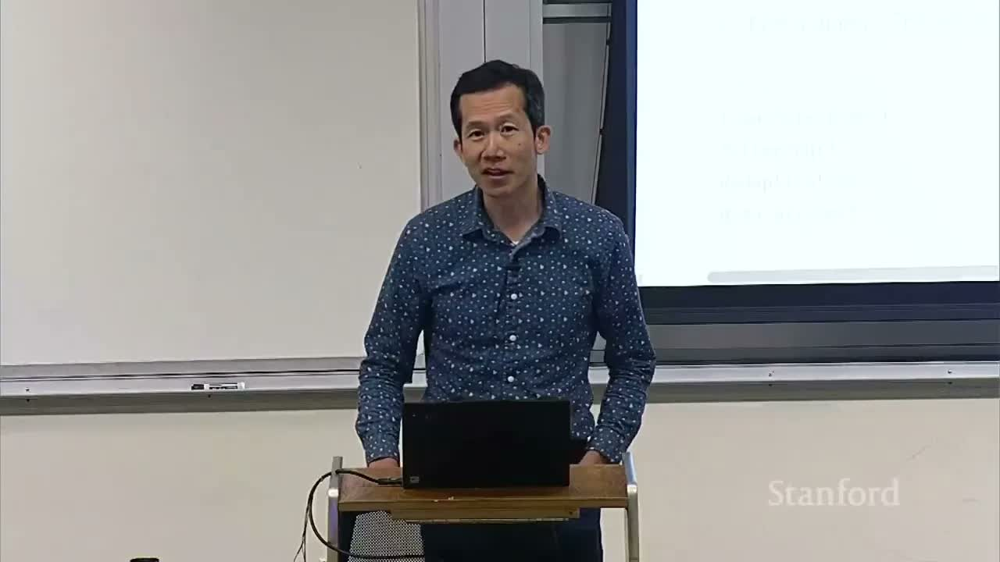

- **视频标题**：Stanford CS336 Language Modeling from Scratch | Spring 2026 | Lecture 14: Data
- **主讲 / 频道**：Stanford Online
- **视频链接**：<https://www.youtube.com/watch?v=5sxHosTLPF8>
- **时长**：01:24:46
- **材料范围**：人工英文字幕、1080p 课程视频与官方 `lecture_14.py`
- **课程定位**：承接 Data I，从数据转换、过滤、去重与混合，一直讲到后训练中的合成数据

> [!IMPORTANT]
> 这堂课最值得带走的不是某个固定阈值，而是一套贯穿全流程的思维：先把目标行为写成可检验的数据标准，再用便宜且可扩展的方法把它外推到海量数据；同时始终检查训练规模、重复轮数和代理目标是否改变了问题本身。

## 1. 从在线资源到可训练文本：Transformation

### 1.1 Data I 到 Data II：从“去哪里找”转向“如何加工”

上一讲（Data I）的数据链路是：在线服务（例如 GitHub）先产生原始内容，经 dump 或 crawl 形成可下载快照，再加工为 The Stack 一类训练集。那一讲的核心问题是数据来源的合法性与可得性，涉及服务条款、版权、许可和 fair use。本讲把焦点向下游推进：即使合法取得了网页、论文和代码仓库，它们也还不是模型能直接消费的 token 序列。

这里有一个初学者容易忽略的区分：**获取（acquisition）解决的是“有没有”，加工（processing）解决的是“像不像训练样本”**。一个 200GB 的 Common Crawl WARC 文件与一份可以直接喂给 GPT 训练器的 token 流之间，隔着至少四个有信息损失的变换步骤，每一步都既是一个工程决策，也是一个隐含的建模假设。

课程给出的主流程是：

```text
HTML / PDF / repositories
        ↓ transformation
linearized text
        ↓ filtering
task-relevant, higher-quality subset
        ↓ deduplication
less redundant corpus
        ↓ mixing
training distribution over sources
        ↓
pretraining / mid-training / post-training
```

我们把这条管线读作一连串的分布变换。设原始文档池的经验分布为 $P_{\text{raw}}$，每个阶段都对它做一次重加权或支撑集收缩：transformation 把文档映射到文本表示空间，filtering 按评分函数截掉尾部，deduplication 消除支撑集内的冗余质量，mixing 最后在多个来源的支撑集之间重新分配概率质量。本讲后面所有数学工具（分类器、哈希、单纯形上的优化）都是为这四步服务的。

### 1.2 HTML 到文本是有损的线性化

HTML 页面包含导航、广告、页眉页脚、侧栏、正文、图片和表格。训练语言模型时通常要去掉 boilerplate、保留主内容，并把二维或层级布局压成一维序列。这个过程天然有损：简单表格还能写成 Markdown，复杂的嵌套表格、图片与文字的空间关系、脚注和图注关联则很难完全保留。

形式化一点看，HTML 解析器实现的是一个映射 $\phi:\mathcal{D}\to\Sigma^{*}$，把 DOM 树 $\mathcal{D}$ 映射到字符序列。DOM 中的信息至少有三类：

1. **字符内容**：文本节点的字面值，最容易保留；
2. **结构信息**：标题层级、列表嵌套、表格行列关系，需要显式线性化（例如转成 Markdown 标记），保留程度取决于 $\phi$ 的设计；
3. **视觉与空间信息**：多栏布局的阅读顺序、图片与图注的配对、侧栏与正文的语义关系，在纯文本表示中原则上不可完全恢复。

常用的规则工具包括 Trafilatura、Resiliparse、jusText 和 lynx。规则工具快，适合运行在海量网页上；但“快”不等于“等价”。官方课件引用 DCLM 对比，说明文本提取器的选择会产生可测的下游差异。


*图 1：Resiliparse、Trafilatura 与 Common Crawl WET 文本并不等价；这里不擅自扩展 CORE/EXTENDED 指标定义，只保留“转换准确率会传导至模型质量”的结论。（字幕区间：00:03:57--00:04:20）*

这张图值得停下来想一层：三个提取器处理的是**同一份** HTML，产出的却是三份不同的训练语料，进而训练出三个下游能力可区分差异的模型。这意味着 $\phi$ 的选择与模型架构、学习率一样，是一个真实的超参数，只不过它藏在数据管线深处，很少出现在论文的超参表里。

> [!WARNING]
> “去掉导航、广告”看似客观，其实已经注入了任务假设。若目标是学习网页结构，被删掉的导航可能反而是信号。无模型的规则过滤也不是“无偏”，它只是把偏置放进了规则与原始分布。

换句话说，所谓“无模型的方法”只是把模型换成了人工规则：规则本身就是一组未标注的、硬编码的判断 $\mathbb{1}[\text{keep}(x)]$。它的偏置不会因为不用梯度下降而消失，只是更难被审计。这条警告在后面的 filtering、dedup、mixing 各章会反复出现：**每一步数据操作都要追问它隐含的目标函数是什么**。

### 1.3 PDF 比 HTML 更难：识别字符不等于恢复语义结构

PDF 比 HTML 更进一步地拉开了“文件内容”与“语义结构”的距离。HTML 至少还带 `<h1>`、`<p>`、`<table>` 这样的语义标签；PDF 本质上是一组“把某个字形的某个字符画在某个坐标 $(x,y)$”的绘图指令序列（content stream），文档树并不存在，标题与正文在字节层面只是字号和字体不同的绘制操作。

此外还有两类常见的工程障碍：

- **截断**：Common Crawl 对单文件有大小上限，较大的 PDF 会被截断，直接解析只能得到前半本论文。FinePDFs 的做法是发现截断后回源重新抓取完整文件；
- **扫描件**：没有字符层的 PDF 只是一张张图片，必须先经过 OCR 或视觉语言模型（FinePDFs 使用 RolmOCR/Docling 类工具）才能得到文字，这一步又引入 OCR 错误率。

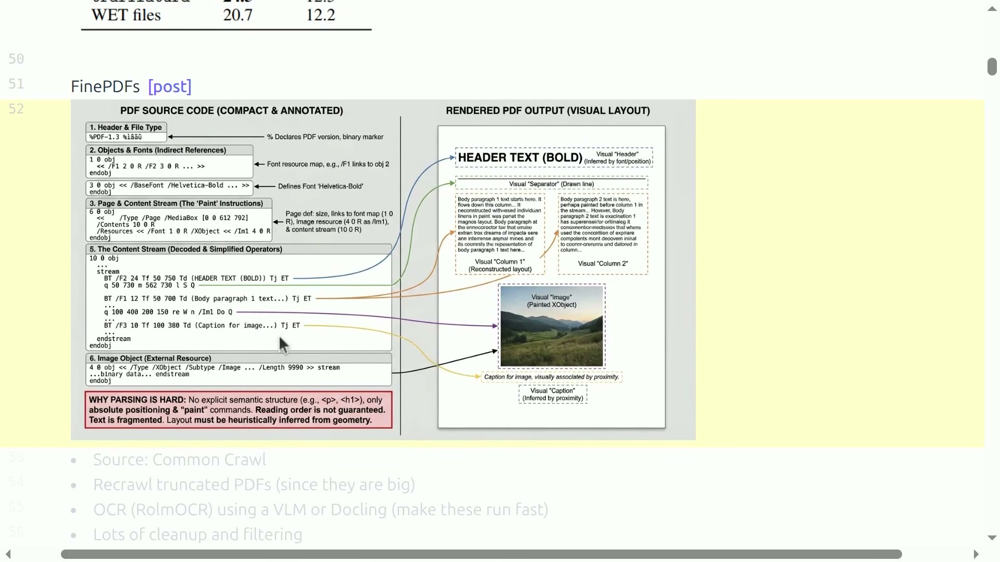
*图 2：PDF content stream 主要描述位置和绘制操作；标题、双栏阅读顺序、图片与图注关系往往要从几何布局推断。该帧选择了完整揭示状态。（字幕区间：00:04:20--00:06:42）*

识别出页面上的字只是第一步。真正困难的是确定双栏阅读顺序、标题层级、表格单元格、图片与图注配对——这些都需要从字符的**几何坐标**反向推断**语义角色**，本身已经是一个小型的视觉-结构理解问题。数据转换因此不是简单的文件格式转换，而是一个同时权衡速度、结构恢复和信息损失的建模步骤。

### 本章小结

- 原始数据通常是 HTML、PDF 或仓库，而不是纯文本。
- 转换把视觉与层级结构线性化，必然丢失信息。
- 解析工具的错误率会在数十亿页面上累积，并传导到下游模型。
- 取得文本只意味着进入下一阶段，并不代表数据已经可以训练。

## 2. Filtering：用少量目标数据筛选海量原始池

### 2.1 统一抽象：从目标集合 (T) 外推到 (T')

设 $T$ 是少量、能代表目标能力的优质数据，$R$ 是海量原始池。过滤要从 $R$ 中找到与 $T$ 相似的新子集 $T'$：

$$
T'\subseteq R,\qquad T'\sim T.
$$

- $T$：定义“好数据长什么样”的目标集合。
- $R$：需要被筛选的原始数据。
- $T'$：从 $R$ 中选出的新样本；它应泛化 $T$，而不是简单复制 $T$。

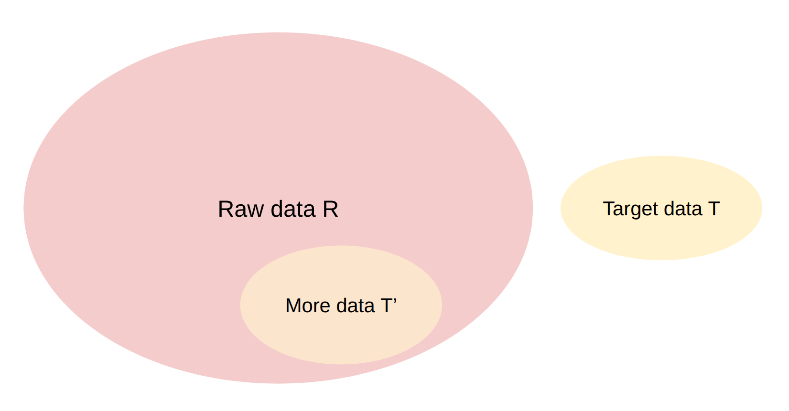
*图 3：目标数据 $T$ 不必包含在原始池中；过滤器学习其特征，再从 $R$ 内找出新的 $T'$。（字幕区间：00:06:56--00:07:39）*

这里 $T'\sim T$ 不是严格的数学陈述，而是一句需要被落实的设计目标：我们希望 $T'$ 在目标能力相关的特征上与 $T$ 同分布，但不要求它与 $T$ 有交集——$T$ 完全可以不在 $R$ 里（例如 $T$ 是教科书，$R$ 是 Common Crawl）。过滤器学习的不是“记住 $T$ 的成员”，而是“$T$ 类文本区别于 $R$ 中一般文本的判别特征”。

工程上有两个同时存在的要求，它们决定了可用的算法家族：

1. **泛化**：过滤器要从少量目标数据（可能只有几万条）外推到闻所未闻的文档；
2. **吞吐**：原始池可能达到 $10^{14}$ token 量级，逐文档的推理成本必须极低——这直接排除了用大模型逐条打分，把方案压缩到 KenLM 的 $n$-gram 查表和 fastText 的线性词袋分类这一档。

通用流程是先根据 $R,T$ 得到评分函数 $\operatorname{score}:R\to[0,1]$（或 $\mathbb{R}$），再按分数保留 $R$ 中的样本。下面看评分的两大流派。

### 2.2 两类评分：生成式与判别式

**生成式方法**在目标数据上训练 KenLM 一类语言模型，用目标分布的似然评分：

$$
\operatorname{score}(x)=p_T(x).
$$

- $x$：待判断的文档。
- $p_T(x)$：目标数据模型认为 $x$ 出现的概率。
- $T$：目标语料分布。

由于长文档的联合似然随长度指数下降，实践中常用按 token 归一化的对数似然（负困惑度的对数）：

$$
\operatorname{score}_{\text{norm}}(x)=\frac{1}{|x|}\sum_{t=1}^{|x|}\log p_T(x_t\mid x_{<t}),
$$

其中 $|x|$ 是文档的 token 数，$x_t$ 是第 $t$ 个 token。这样不同长度的文档才可比。

**判别式方法**则训练 fastText 等轻量分类器，直接预测样本是否属于目标集合：

$$
\operatorname{score}(x)=p(T\mid x).
$$

- $p(T\mid x)$：给定文档 $x$ 时，它属于目标分布的概率。
- `fastText`：常见的快速词特征线性分类器，适合扫描超大语料。

#### 两种评分的形式化联系与取舍

两类评分并非孤立，贝叶斯公式给出了它们的精确联系。把“文档 $x$ 来自目标分布”记为事件 $T$，则

$$
p(T\mid x)=\frac{p(x\mid T)\,p(T)}{p(x\mid T)\,p(T)+p(x\mid R)\,p(R)}
=\sigma\!\left(\log\frac{p(x\mid T)}{p(x\mid R)}+\log\frac{p(T)}{p(R)}\right),
$$

- $p(x\mid T)$：目标分布下文档的似然，即生成式评分 $p_T(x)$；
- $p(x\mid R)$：原始池（背景）分布下的似然；
- $p(T),p(R)$：两个类别的先验；
- $\sigma(z)=1/(1+e^{-z})$：sigmoid 函数。

- 等式说明判别式后验概率是**似然比** $\log\frac{p(x\mid T)}{p(x\mid R)}$ 加上**先验对数比**的单调（sigmoid）变换。

由此可以看清两者的差异：

- 生成式评分只用 $p_T(x)$，等价于假设背景 $p(x\mid R)$ 对所有文档相同（或对比较无影响）。当原始池中混入大量“似然高但不想要”的文本（例如流畅的 SEO 垃圾）时，纯似然会把它们误判为好数据；**似然比**修正了这一点——只保留那些目标模型比背景模型解释得更好的文本。
- 判别式直接建模决策边界 $p(T\mid x)$，通常在有可靠负例时判别力更强；但它依赖正负例的构造方式，正负先验 $p(T)/p(R)$ 的变化会平移整个评分曲线，而阈值 $\tau$ 不会自动跟着移动。
- 计算上两者同档：KenLM 是 $n$-gram 查表，fastText 是词袋加线性层，都能以每秒数万到数十万文档的速度扫描语料。取舍不由速度决定，而由**能否构造可信的负例/背景模型**决定。

最直接的硬阈值规则是：

$$
T'=\{x\in R:\operatorname{score}(x)\ge \tau\}.
$$

- $\tau$：质量或相关性阈值。
- $T'$：通过阈值的原始样本子集。

也可以随机保留，使分数越高的样本被选中概率越大。课件给出 GPT-3 风格的示意代码：

```python
def keep_document(score: float) -> bool:
    return np.random.pareto(9) > 1 - score
```

这里 `score` 越高，右侧 `1-score` 越小，文档越容易保留。应把它理解为课程中的随机保留示意，而不是未经论文附录核对就认定为唯一正式公式。

#### 为什么随机保留而不是硬阈值

硬阈值 $\mathbb{1}[\operatorname{score}(x)\ge\tau]$ 把评分分布切成两半，边界附近评分 $0.79$ 与 $0.81$ 的文档得到截然不同的命运，而它们的实际质量几乎不可区分。随机保留（按某个随分数单调增的保留概率 $\pi(\operatorname{score})$ 做伯努利抽样）等价于对原始分布做**重要性重加权**：保留后的分布为

$$
q(x)\propto P_R(x)\,\pi(\operatorname{score}(x)),
$$

它在“向目标分布倾斜”与“保留评分边界附近的多样性”之间折中。参数 `pareto(9)` 的形状参数控制倾斜的陡峭程度：形状参数越大，Pareto 样本越集中在 $1$ 附近，保留概率对分数的区分越柔和。

### 2.3 “质量”取决于目标任务

过滤框架可以实例化为：

- 语言识别：英语相对于其他语言；
- 通用质量：参考书籍、Wikipedia 或人工偏好筛网页；
- 领域选择：数学、代码、科学论文；
- 安全过滤：non-toxic 相对于 toxic 内容。

注意这四种应用用的是**同一个**数学对象：选定 $T$（及其对立面），估计 $p_T(x)$ 或 $p(T\mid x)$，设定阈值。变化的只有 $T$ 的定义。这一点是本章最重要的抽象收益：语言识别器、质量分类器、毒性分类器在工程上可以共享同一套训练与推理管线，只是训练标签不同。

> [!IMPORTANT]
> 课程明确强调：不存在脱离任务的普适“高质量”。一本数学教材对数学推理很有价值，对训练自然对话分布却未必最合适。目标集合 $T$ 实际上定义了模型将被鼓励获得什么能力。

推论是：选择 $T$ 是一个**价值与能力决策**，不是技术决策。它应当在实验记录中与模型架构、训练预算并列，因为它是模型能力的上游来源。

### 本章小结

- Filtering 可以统一写成“用目标集合 $T$ 从原始池 $R$ 中寻找相似的 $T'$”。
- KenLM 估计 $p_T(x)$，fastText 估计 $p(T\mid x)$；两者经贝叶斯公式通过似然比联系。
- 过滤器必须同时具备泛化能力和极高吞吐。
- 目标数据定义了质量，因此过滤不可避免地带有任务偏置。

## 3. 过滤案例与尺度效应

### 3.1 语言识别与数学语料

语言识别是过滤框架最简单也规模最大的实例。fastText 的语言识别模型支持 176 种语言，训练源包含 Wikipedia、Tatoeba 和 SETimes。Dolma 的一个规则是保留：

$$
p(\text{English}\mid x)\ge 0.5.
$$

- $x$：页面文本。
- $p(\text{English}\mid x)$：分类器预测为英语的概率。
- $0.5$：课程给出的 Dolma 页面阈值。

这条规则值得拆开看。fastText 语言识别对每个页面输出 176 维 softmax 向量，取 English 分量与 $0.5$ 比较。选 $0.5$ 意味着“宁可错杀混入的非英语页，也要保证留下的绝大多数是英语”——实际上在多数语言的先验远低于 $0.5$ 的网页池里，$0.5$ 是一个偏向**精确率**的阈值。若训练目标是多语言模型，同一个分类器只需把阈值改到目标语言分量上，框架完全不变。

数学语料的例子 OpenWebMath（课件中称 OpenMathText）采用级联管线，展示了多层过滤器如何串联：

1. **规则粗筛**：用 LaTeX 命令（如 `\frac`、`\sum`）、数学相关关键词等廉价规则，先把明显非数学的页面去掉，把候选池缩小几个数量级；
2. **生成式精筛**：用在 ProofPile（数学证明语料）上训练的 KenLM 评分，保留困惑度小于 $15000$ 的文本——困惑度阈值看似荒谬地大，是因为网页中的数学文本混杂着大量 boilerplate，绝对困惑度远高于纯正文语料；
3. **判别式补充**：再用 fastText 判断“这看起来像数学写作吗”。这里采用**条件阈值**：页面已含数学线索（如 LaTeX 命令）时阈值放宽到 $0.17$，没有线索时要求高达 $0.8$。直觉是：有独立证据（规则命中）与分类器证据可以互补，二者都弱时才要求单一证据特别强。

最终得到 14.7B token；用它训练的 1.4B 模型优于用约二十倍未定向数据训练的模型。

这个结果不是说“小数据永远更好”，而是说明面向目标能力的数据可以显著提高单位 token 的学习价值。用本章的语言：过滤把训练分布向目标能力倾斜，使每个 token 的期望信息增益变大。

### 3.2 GPT-3、LLaMA 与 phi-1：如何构造目标集合

三个历史案例的差异几乎全在 $T$ 与负例的构造方式上：

- **GPT-3**：用 Wikipedia、WebText2、Books1、Books2 样本作正例，用 Common Crawl 作负例，基于词特征训练线性分类器。正例是人工认为高质量的几个来源的直接混合；
- **LLaMA/RedPajama**：正例来自被 Wikipedia **引用**的外部页面，而不是 Wikipedia 页面本身。这是一个聪明的目标集合扩展：Wikipedia 编者已经替我们做了“这个外部来源可靠”的人工判断，引用关系把这些判断免费外推到数十万页面；负例仍来自 Common Crawl；
- **phi-1**：把目标集合的构造本身交给强模型，更清楚地展示了“昂贵 teacher 标注少量样本，便宜 classifier 放大到完整数据池”的方式：

```python
R = "Python subset of the Stack"
prompt = (
    "determine its educational value for a student "
    "whose goal is to learn basic coding concepts"
)
T = "GPT-4 labels a 100K subset of R as positive examples"
```

接着从预训练 CodeGen 模型取得 embedding，在 $T$ 上训练随机森林，再扫过完整 $R$。

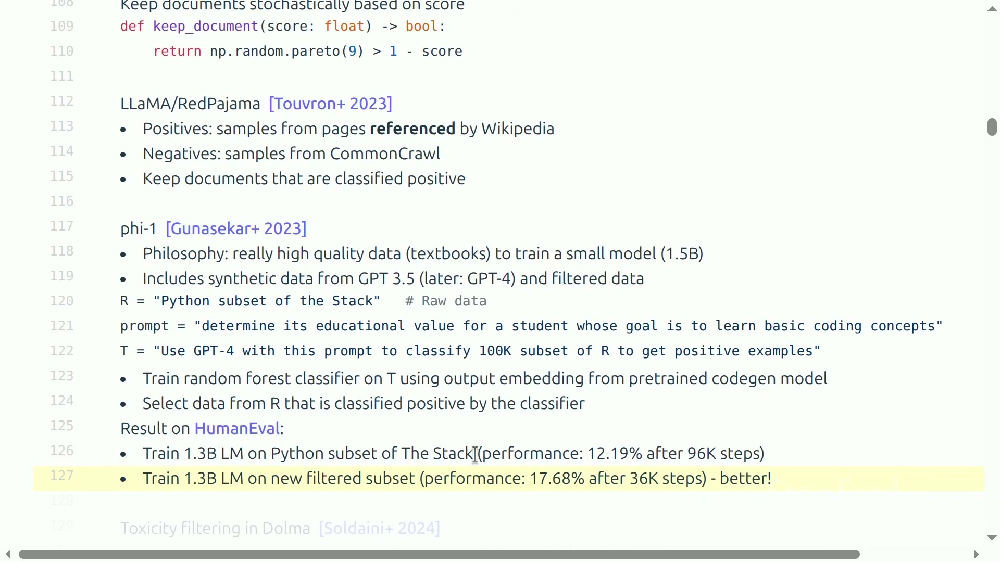
*图 4：课程展示的完整 phi-1 管线与 HumanEval 结果；过滤后的 1.3B 模型在 36K steps 达到 17.68%，原始 Python Stack 训练在 96K steps 为 12.19%。（字幕区间：00:15:05--00:16:29）*

算一笔账：过滤版用 $36/96=37.5\%$ 的步数把 HumanEval 从 $12.19\%$ 提到 $17.68\%$，相对提升约 $45\%$。若近似认为训练成本与步数成正比，这相当于用不到四成的算力换接近五成的相对性能提升——这是“数据质量可以兑换算力”的具体数值证据。

> [!NOTE]
> 这个范式与今天的合成数据流水线一脉相承：强模型不必亲自处理所有样本，只需产生足够可靠的监督，再由轻量模型完成规模化筛选。

三层结构的成本量级是：GPT-4 标注 10 万条（一次性、可负担）→ 随机森林扫描整个 The Stack 的 Python 子集（便宜、可并行）→ 1.3B 模型在筛选结果上训练（主要成本，但被数据质量摊薄）。第 7 节的 OpenThoughts 与 SWE 系列会把这个“强模型造监督、轻量环节做规模”的模式推广到后训练。

### 3.3 毒性过滤

Dolma 使用 Jigsaw Toxic Comments。原始标注来自 Wikipedia talk pages，包括 `toxic`、`severe_toxic`、`obscene`、`threat`、`insult`、`identity_hate`。机制与质量过滤完全一致：先得到正负例，再训练便宜分类器扫描 Common Crawl——只是这里通过阈值的是**低分**样本（保留非毒性），即 $T'=\{x:\operatorname{score}_{\text{toxic}}(x)<\tau\}$。

需要谨慎的是，安全类别和社会语言现象经常存在上下文依赖、方言偏差和误伤。Jigsaw 数据集的已知问题包括：标注来自 Wikipedia 讨论页的争议语境，迁移到普通网页存在分布偏移；某些方言与身份词汇在训练数据中与毒性标签伪相关，导致提及特定群体的正常文本被误杀。模型过滤可以减少不希望的内容，但它并不自动解决价值定义与分布偏差——“什么算毒性”依然是人的决定，分类器只是把这个决定规模化，连同其中的偏差一起规模化。

### 3.4 没有脱离训练预算的唯一最佳阈值

过滤越严格，留下的数据通常越少、平均质量越高；训练初期 loss 可能下降得更快。但有限数据被反复遍历后，收益会饱和甚至过拟合。放宽阈值得到的大数据池早期较差，却能支持更长训练。

把这个权衡形式化：设阈值 $\tau$ 决定保留数据量 $D(\tau)$（$\tau$ 越大 $D$ 越小）与平均质量 $q(\tau)$（$\tau$ 越大越高）。给定 token 预算 $T$，实际遍历轮数为 $E(\tau)=T/D(\tau)$。训练效果粗略地随“质量 $\times$ 新鲜 token 数”改善，随“重复轮数”受损，于是最优阈值满足

$$
\tau^\star(T)=\arg\max_{\tau}\;U\big(q(\tau),\,D(\tau),\,T/D(\tau)\big),
$$

它**显式依赖预算 $T$**：小预算时选严格阈值（数据用不完，重复不是问题），大预算时被迫放宽（严格阈值下 $E$ 过大，重复成为主要瓶颈）。


*图 5：157M 模型在 100 个 WARC 上的曲线。虚线是一轮数据的边界；严格过滤数据早期表现好，但更快耗尽并出现重复训练效应。（字幕区间：00:17:25--00:20:14）*

因此应把过滤阈值、训练 token budget、可用数据规模和 epoch 数联合选择。更长训练中放宽过滤，不意味着低质量数据本身优于高质量数据，而是现实里“无限高质量数据”并不存在。这条结论会在第 6 节的 mixing 中以更精确的形式（epoch 数换算、UniMax）再次出现：**数据决策的每个旋钮都要换算成重复轮数来审**。

学生追问置信区间时，讲者承认完整重复训练很昂贵，论文常缺少足够的重复实验；其经验是预训练小规模趋势通常较稳定。这是工程经验，不应替代严格统计结论。

### 本章小结

- 语言、数学、通用质量与毒性过滤只是同一框架的不同目标定义。
- phi-1 展示了强模型标注、小模型扩展的高性价比模式。
- 严格过滤提升早期单位 token 价值，但会更早遇到数据重复与过拟合。
- 最佳阈值随训练预算改变，不能作为与规模无关的常数。

## 4. 去重：从精确匹配到 MinHash

### 4.1 为什么重复会浪费训练

精确重复包括镜像站与 GitHub fork；近似重复包括许可证、服务条款、统一页眉页脚、轻微排版差异，以及只替换少数实体的模板文章。课程展示 C4 审计中的极端案例：同一段商品描述重复 61,036 次。

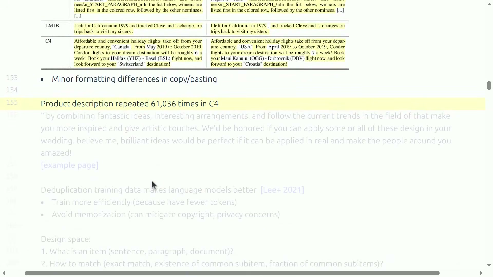
*图 6：模板化网页让看似不同的页面携带几乎相同的信息，提醒我们必须直接审计样本，而不能只看汇总指标。（字幕区间：00:25:45--00:26:17）*

去重的收益可以用梯度信息量的语言表述。一段文本第 $k$ 次出现时，模型对它的预测误差已经很小，其梯度范数远低于新样本；训练 $61{,}036$ 次同一段商品描述，约等于把 $61{,}035$ 个样本位置的算力花在接近零的信息增量上。去重的直接收益是减少无信息增量的 token，让相同 FLOPs 覆盖更多新内容；附带收益是降低逐字记忆、版权与隐私风险——重复次数越高的序列越容易被模型逐字背出，这已被多次成员推断与提取实验证明。与之相邻但更重要的是 decontamination：评测集不能泄漏到训练集，否则评测数字系统性失真。

### 4.2 设计空间与可扩展性

完整去重方案必须回答三个问题：

1. item 是句子、段落、固定 span 还是文档？
2. match 是精确相等、共享子项，还是共享子项比例？
3. action 是全部删除，还是每组保留一个？

三个选择各有代价：item 越小（句子级）召回越高，但删除会破坏上下文连贯性；match 越松（相似度阈值低）误伤越多；action 上“每组留一个”保信息，“全部删除”更保守地防止记忆。

过滤可逐样本并行；去重涉及样本之间的关系，这是它计算上更根本的困难。对 $N$ 个文档做全量两两比较，需要

$$
\binom{N}{2}=\frac{N(N-1)}{2}=O(N^2)
$$

次相似度计算。以 $N=10^9$ 文档计，即约 $5\times10^{17}$ 次比较——即使每次比较只要 $1\,\mu s$，也需要超过一万年的单核时间，不可扩展。哈希的价值是把内容映射到较小键空间，让相同或相似项目在近线性扫描中进入同一候选桶，把 $O(N^2)$ 降为“$O(N)$ 次哈希 + 只对桶内候选比较”。

### 4.3 精确去重

课件用 MurmurHash 演示 MapReduce 风格的分组：

```python
items = ["Hello!", "hello", "hello there", "hello", "hi", "bye"]

hash_items = itertools.groupby(
    sorted(items, key=mmh3.hash),
    key=mmh3.hash,
)

deduped_items = [next(group) for h, group in hash_items]
```

- `items`：待去重字符串。
- `mmh3.hash`：快速但非密码学抗碰撞的 MurmurHash。
- `hash_items`：按哈希排序并分组。
- `deduped_items`：每组只取一个元素。

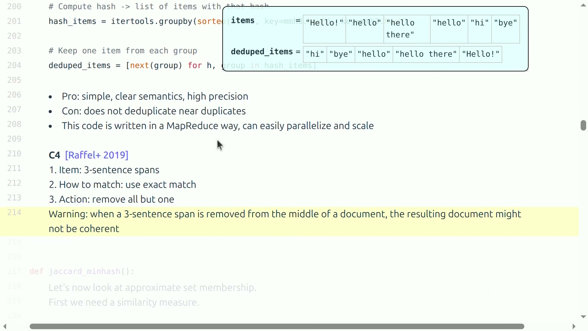
*图 7：C4 以三句 span 为 item 做精确匹配；最终完整揭示的警告指出，从文档中间删除三句话可能破坏上下文连贯性。（字幕区间：00:29:38--00:31:21）*

> [!WARNING]
> 玩具代码只按哈希值分组。生产实现应在哈希桶内再次比较原文，以免哈希碰撞误删不同内容。精确去重语义清楚，却无法处理只差少数 token 的近重复。

#### 精确去重的复杂度对比

三种朴素到工程化的方案对比（$N$ 为文档数，$L$ 为平均文档长度）：

| 方案 | 时间复杂度 | 空间 | 说明 |
|---|---|---|---|
| 全量两两比较 | $O(N^2 L)$ | $O(1)$ 额外 | 不可扩展，仅教学意义 |
| 排序后扫描重复 | $O(N\log N + NL)$ | $O(N)$ | 排序键为全文哈希或全文本身 |
| 哈希表/哈希分组 | $O(NL)$ 期望 | $O(N)$ | 每文档一次哈希，桶内复核 |

哈希表方案期望时间是线性的：每个文档计算一次 $O(L)$ 的哈希，插入/查询哈希表均摊 $O(1)$。它的工程变体是 MapReduce 的 `groupBy(hash)`——把“按哈希值分组”作为 shuffle 键，天然分布式。需要注意两个细节：

1. **碰撞复核**：哈希值相等只是“内容相同的充分条件”而非必要条件（不同内容可能碰撞），所以桶内必须回读原文比较，这正是上面 WARNING 的内容。用 128 位哈希时，由生日界估计，$N=10^9$ 个文档的期望碰撞次数约为 $N^2/2^{129}\approx 10^{18}/2^{129}$，小到可以忽略，但“可忽略”不等于“不存在”，复核是廉价的保险。
2. **只哈希不存全文**：分组后每组保留一份原文即可，其余可只记录哈希，把存储压到 $O(N)$ 个定长键。

精确去重语义清楚，却无法处理只差少数 token 的近重复——而模板化网页恰恰以近重复为主。这需要先定义“多近算重复”。

### 4.4 Jaccard：为近重复定义相似度

对集合 $A,B$，Jaccard 相似度是交集占并集的比例：

$$
J(A,B)=\frac{|A\cap B|}{|A\cup B|}.
$$

- $A,B$：文档转换出的 token、word 或 character shingles 集合。
- $|A\cap B|$：两个集合共享的元素数。
- $|A\cup B|$：至少出现在一个集合中的元素数。

约定 $A=B=\varnothing$ 时 $J=1$（两个空文档视为完全相同），其余情形分母非零，定义良好。

#### 基本性质

1. **有界性**：$0\le J(A,B)\le 1$。因为 $A\cap B\subseteq A\cup B$，故分子不超过分母，且两者皆非负。
2. **对称性**：$J(A,B)=J(B,A)$，交、并运算均对称。
3. **自相似**：$J(A,A)=1$（$A\neq\varnothing$）；$J(A,B)=1\iff A=B$。
4. **与集合大小的关系**：由容斥原理 $|A\cup B|=|A|+|B|-|A\cap B|$，可得等价形式
$$J(A,B)=\frac{|A\cap B|}{|A|+|B|-|A\cap B|}.$$
给定两个集合的大小 $|A|=a$、$|B|=b$，Jaccard 的上界为 $\min(a,b)/\max(a,b)$（较小集合完全包含于较大集合时取到）。这意味着大小悬殊的文档很难被判为近重复——一个自然的性质：短许可证片段不足以让整篇文章被判为重复。
5. **距离性质**：$d(A,B)=1-J(A,B)$ 是集合族上的度量（满足三角不等式），称为 Jaccard 距离，因此阈值化 $J(A,B)\ge\tau$ 有坚实的度量几何基础。

#### 手算例子

若 $A=\{1,2,3,4\}$，$B=\{1,2,3,5\}$，则：

- 交集 $A\cap B=\{1,2,3\}$，$|A\cap B|=3$；
- 并集 $A\cup B=\{1,2,3,4,5\}$，$|A\cup B|=5$（或用容斥：$4+4-3=5$，验算一致）；
- $J(A,B)=3/5=0.6$。

可以把 $J(A,B)\ge\tau$ 定义为近重复；阈值 $\tau$ 取决于任务，不是固定标准：去重常用 $0.8$–$0.95$ 的高位阈值，评测集去污染则可能更低（宁可多查候选，人工或精确复核再放行）。

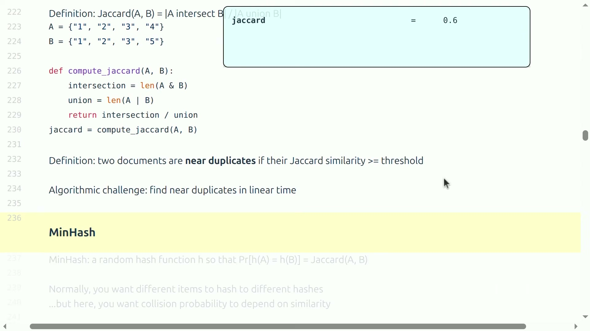
*图 8：画面同时显示集合、实现代码、运行结果 `jaccard=0.6` 与“在线性时间内找近重复”的算法挑战。（字幕区间：00:31:26--00:32:38）*

工程上还差一步把文档变成集合：**shingling**。把文档切成所有长度为 $k$ 的连续子序列（token 级或字符级），得到 shingle 集合。$k$ 太小（如 $k=1$ 词）则所有文档共享大量常见词，Jaccard 普遍虚高；$k$ 太大则微小改动打碎所有 shingle，Jaccard 普遍偏低。实践中英文常用 $k=5$–$10$ 个词。此后“文档相似”被严格定义为“shingle 集合的 Jaccard 超过阈值”。

### 4.5 MinHash：把相似度变成碰撞概率

即使有了 Jaccard 的定义，$N$ 个文档两两计算仍是 $O(N^2)$。MinHash 用一个优雅的随机化构造绕开它：构造随机哈希 $h$，使两个集合签名相同的概率恰好等于 Jaccard：

$$
\Pr[h(A)=h(B)]=J(A,B).
$$

- $h$：由随机排列或带 seed 的哈希近似出的 MinHash。
- $h(A),h(B)$：各集合元素哈希值中的最小值。
- $J(A,B)$：两集合的真实 Jaccard 相似度。

```python
def minhash(S: set[str], seed: int):
    return min(mmh3.hash(x, seed) for x in S)
```

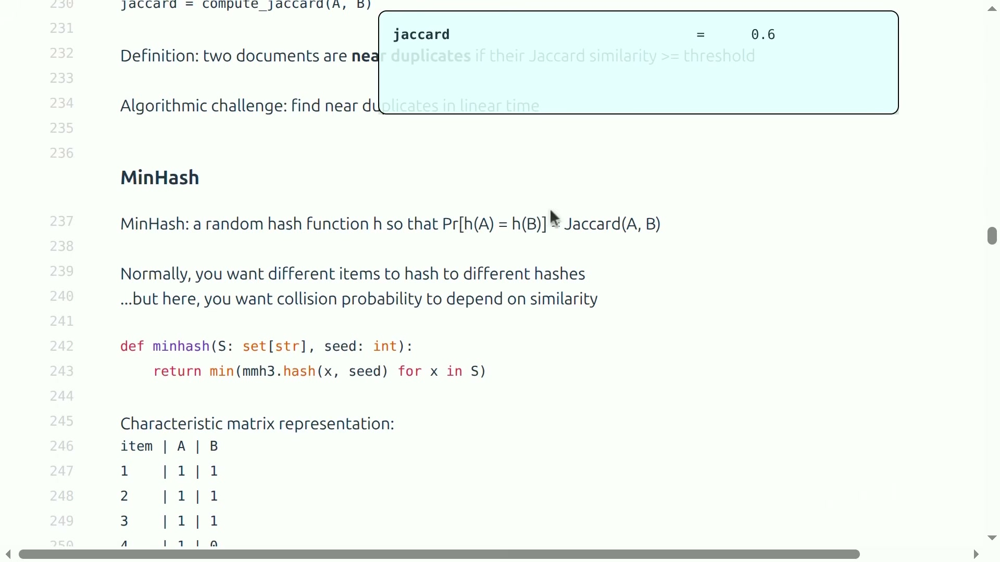
*图 9：普通哈希希望避免碰撞，MinHash 则让碰撞概率受集合相似度控制；画面展示定义、代码和集合特征矩阵。（字幕区间：00:32:46--00:35:00）*

注意这与普通哈希的目的相反：普通哈希（如 4.3 节的 MurmurHash 分组）希望不同内容**绝不**碰撞，碰撞是 bug；MinHash 刻意让碰撞概率被相似度控制，碰撞本身就是相似度的无偏估计量。

#### 核心定理及其完整证明

**定理**：设 $U=A\cup B$，$\pi$ 是从 $U$ 到 $\{1,\dots,|U|\}$ 的均匀随机排列，定义 $h_\pi(S)=\arg\min_{x\in S}\pi(x)$（在排列 $\pi$ 下位置最靠前的元素）。则

$$
\Pr_{\pi}\big[h_\pi(A)=h_\pi(B)\big]=J(A,B).
$$

**证明**：考察排列 $\pi$ 下 $U$ 中位置最靠前的元素 $x^\star=\arg\min_{x\in U}\pi(x)$。由于 $\pi$ 均匀随机，$x^\star$ 等可能地是 $U$ 中任一元素，即

$$
\Pr[x^\star = x]=\frac{1}{|U|},\qquad \forall x\in U.
$$

现在分类讨论：

- 若 $x^\star\in A\cap B$：$x^\star$ 同时是 $A$ 和 $B$ 中位置最靠前的元素吗？是的——$A,B\subseteq U$，$x^\star$ 在 $U$ 中排最前，自然在子集 $A$、$B$ 中也排最前，故 $h_\pi(A)=x^\star=h_\pi(B)$，签名相同。
- 若 $x^\star\in A\setminus B$：$h_\pi(A)=x^\star$，但 $x^\star\notin B$，所以 $h_\pi(B)$ 是 $B$ 中别的元素，签名不同。$x^\star\in B\setminus A$ 的情形对称。

于是事件“签名相同”与事件“$x^\star\in A\cap B$”**完全相同**，因此

$$
\Pr[h_\pi(A)=h_\pi(B)]=\Pr[x^\star\in A\cap B]=\frac{|A\cap B|}{|U|}=\frac{|A\cap B|}{|A\cup B|}=J(A,B). \qquad\blacksquare
$$

代回 4.4 节的手算例子：随机哈希相当于随机排列全集元素。若最先出现的是交集元素 1、2、3，两个集合的最小元素相同；若是仅属于一侧的 4 或 5，则不同。五个可能的“第一元素”中三个来自交集，因此碰撞概率正好为 $3/5=0.6$——与 Jaccard 一致，定理在这个具体例子上得到验证。

工程中不真的生成排列：用一个带 seed 的哈希函数 $g_s(x)$ 把元素散列到足够大的整数域，取 $\min_{x\in S}g_s(x)$ 即可。只要 $g_s$ 近似均匀且无系统性碰撞，“最小哈希值”的分布与“随机排列下的最小元素”统计等价。

#### 签名的方差分析与数值验证

单个 MinHash 碰撞只是高方差的 Bernoulli 事件 $X\sim\mathrm{Bernoulli}(J)$，不能直接断言相似度已超过 0.99。取 $k$ 个独立 seed 的哈希，定义指示变量 $X_i=\mathbb{1}[h_i(A)=h_i(B)]$ 与估计量

$$
\hat J_k=\frac{1}{k}\sum_{i=1}^{k}X_i.
$$

- $X_i$：第 $i$ 个哈希是否碰撞的指示变量，$\mathbb{E}[X_i]=J$，$\mathrm{Var}(X_i)=J(1-J)$；
- $\hat J_k$：$k$ 个独立碰撞频率的平均，即签名向量的逐位一致率。

由独立性，

$$
\mathbb{E}[\hat J_k]=J,\qquad
\mathrm{Var}[\hat J_k]=\frac{J(1-J)}{k},\qquad
\operatorname{sd}[\hat J_k]=\sqrt{\frac{J(1-J)}{k}}\le\frac{1}{2\sqrt{k}}.
$$

- 无偏性来自 $\mathbb{E}[X_i]=J$（核心定理）；
- 方差除以 $k$ 是独立平均的标准结论；
- 上界用 $J(1-J)\le 1/4$（在 $J=1/2$ 处取到）。

代入数值：$J=0.6$、$k=100$ 时，$\operatorname{sd}=\sqrt{0.6\times0.4/100}=\sqrt{0.0024}\approx 0.049$。也就是说约 95% 的置信区间宽度近 $\pm0.1$——单看签名频率只能把相似度定位到小数点后一位。要把标准差压到 $0.01$ 需要 $k\ge 0.6\times0.4/10^{-4}=2400$ 个哈希。这正是为什么 MinHash 签名很少直接用来**估计** Jaccard，而是配合第 5 节的 LSH 结构把概率曲线锐化成判别器。

下面的代码用数值实验验证核心定理与方差公式：

```python
import mmh3
import numpy as np

rng = np.random.default_rng(0)
A = set(rng.choice(10_000, size=400, replace=False))  # 模拟两篇文档的 shingle 集合
B = set(rng.choice(10_000, size=400, replace=False))
B = set(list(B)[:200]) | set(list(A)[:200])            # 人为制造约 1/3 的交集

def minhash(S, seed):
    return min(mmh3.hash(str(x), seed) for x in S)     # 带 seed 哈希取最小值

true_J = len(A & B) / len(A | B)
collisions = [minhash(A, s) == minhash(B, s) for s in range(2_000)]
est_J = np.mean(collisions)
est_sd = np.sqrt(true_J * (1 - true_J) / 2_000)        # 理论标准差
print(f"J={true_J:.4f}, 估计={est_J:.4f}, 理论sd={est_sd:.4f}")
# 输出示例：J=0.3333, 估计≈0.334, 理论sd≈0.0105 —— 估计落在理论标准差范围内
```

实验要点：$A$ 与 $B$ 各取 400 个元素、共享 200 个，理论 $J=200/(400+400-200)=1/3$；2000 个独立 seed 的碰撞频率应收敛到该值附近，且波动幅度与 $\sqrt{J(1-J)/2000}\approx0.0105$ 吻合。读者可自行改 $k$ 观察 $1/\sqrt{k}$ 的收敛速率。

### 本章小结

- 去重首先是算力分配问题，同时能降低记忆与泄漏风险。
- item、match 与 action 的选择决定了去重语义。
- 精确哈希分组可扩展（期望 $O(N)$），但处理不了轻微改写。
- Jaccard 定义集合相似度；MinHash 让碰撞概率等于 Jaccard，且 $k$ 个独立哈希的估计标准差以 $1/\sqrt{k}$ 收敛，为近重复候选生成奠定基础。

## 5. LSH：用 AND–OR 结构锐化概率阈值

### 5.1 Banding 结构

将 $n$ 个 MinHash 拆成 $b$ 个 band，每个 band 有 $r$ 个哈希，满足 $n=br$。两个文档成为候选，当且仅当“至少一个 band 内的所有 $r$ 个哈希都相同”。这就是 band 内 AND、band 间 OR。

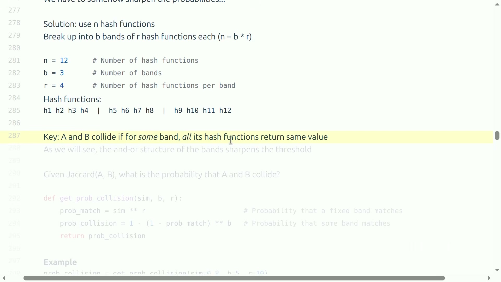
*图 10：12 个哈希被分为 3 个 band，每 band 4 个；至少一个 band 全匹配即可碰撞。（字幕区间：00:39:07--00:41:03）*

工程实现上，每个 band 内的 $r$ 个 MinHash 值拼接后再做一次普通哈希，得到该文档在该 band 的 band-key；把 (band 编号, band-key) 作为桶键放入哈希表。两个文档落入同一桶当且仅当某个 band 的 $r$ 个签名全同——一次线性扫描 $O(Nb)$ 就生成了全部候选对，完全避开了 $O(N^2)$ 的两两比较。

#### S 曲线的逐步推导

设两文档的真实 Jaccard 相似度为 $s$。我们对“成为候选”这一事件逐层分解：

1. **单行碰撞**：由 MinHash 核心定理，任意一个哈希位上两文档签名相同的概率为 $s$；
2. **band 内全中（AND）**：一个 band 含 $r$ 个**独立**哈希位，$r$ 位全部相同的概率为各位概率之积
$$P_{\text{band}}(s)=s^r;$$
3. **band 内不全中**：取补事件，概率为 $1-s^r$；
4. **$b$ 个 band 全部失败**：$b$ 个 band 使用互不重叠的哈希位，彼此独立，故全部失败的概率为乘积
$$P_{\text{all fail}}(s)=\big(1-s^r\big)^b;$$
5. **至少一个 band 全中（OR）**：再取一次补事件，得到候选碰撞概率

$$
P_{\mathrm{collision}}(s)=1-(1-s^r)^b.
$$

- $s$：两文档的 Jaccard 相似度。
- $r$：每个 band 的哈希数；控制 band 内 AND 的严格程度。
- $b$：band 数；控制 OR 的尝试次数。
- $P_{\mathrm{collision}}$：两文档进入同一候选集合的概率。

```python
def get_prob_collision(sim, b, r):
    prob_match = sim ** r
    prob_collision = 1 - (1 - prob_match) ** b
    return prob_collision
```

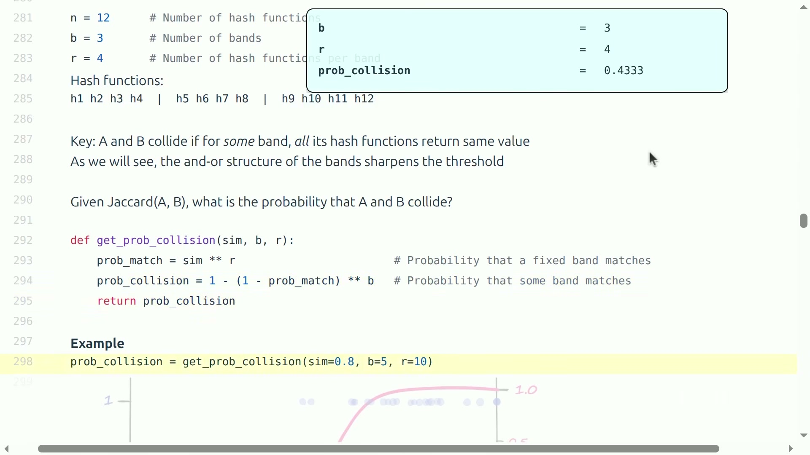
*图 11：当 $s=0.8,b=5,r=10$ 时，碰撞概率约 0.4333；画面采用完全显示代码和输出的状态。（字幕区间：00:41:03--00:42:53）*

验证课件中的数字：$s^{r}=0.8^{10}\approx 0.10737$，$1-s^r\approx 0.89263$，$(1-s^r)^5\approx 0.5667$，故 $P\approx 1-0.5667=0.4333$，与画面输出一致。这个例子也暴露了 S 曲线的关键特性：$s=0.8$ 已经相当高，但在 $b=5,r=10$ 的配置下碰撞概率只有 $43\%$——参数选择直接决定召回。

下面的代码绘制不同 $(b,r)$ 下的 S 曲线，可以直观看到“AND 右移变陡、OR 左移变平”两个趋势：

```python
import numpy as np
import matplotlib.pyplot as plt

s = np.linspace(0, 1, 501)
configs = [(10, 10), (10, 20), (20, 20), (20, 450)]  # (b, r)
for b, r in configs:
    P = 1 - (1 - s ** r) ** b
    plt.plot(s, P, label=f"b={b}, r={r}")
plt.xlabel("Jaccard similarity s")
plt.ylabel("collision probability")
plt.legend()
plt.savefig("lsh_s_curves.png", dpi=120)
```

### 5.2 (r) 与 (b) 如何移动曲线

增加 $r$ 会让一个 band 更难全匹配（$s^r$ 随 $r$ 指数衰减，对 $s<1$），曲线向右移动并变陡；增加 $b$ 会提供更多 OR 机会，曲线向左移动，更容易匹配。

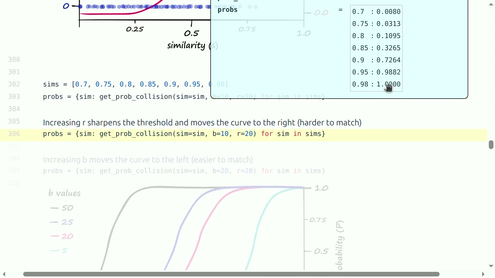
*图 12：固定 $b=10$，把 $r$ 增至 20 后，中低相似度候选被显著抑制；0.9 相似度的碰撞概率约 0.7264。（字幕区间：00:45:09--00:45:51）*

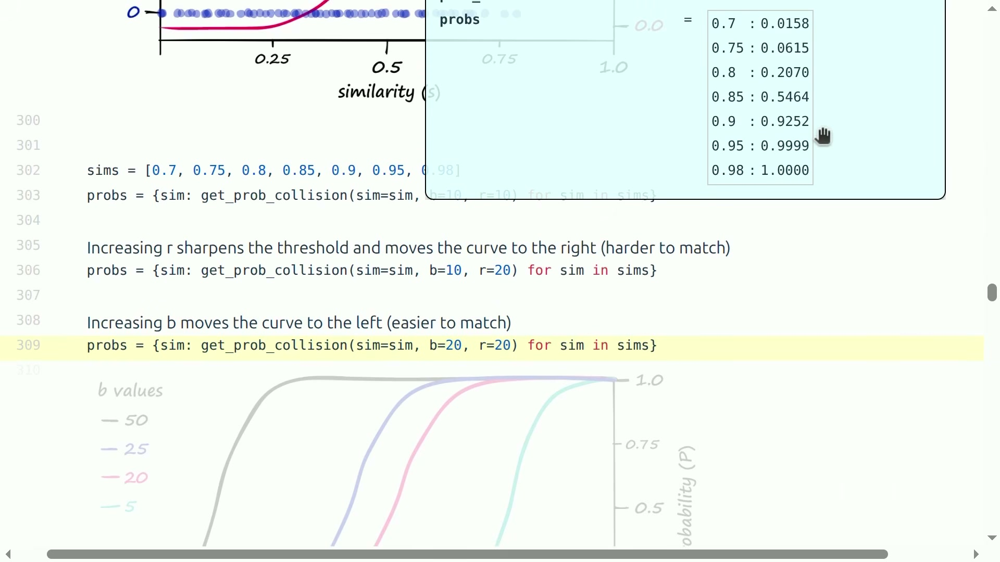
*图 13：保持 $r=20$，把 $b$ 增至 20 后，0.9 相似度候选的碰撞概率回升到约 0.9252。（字幕区间：00:45:51--00:46:23）*

验证图 13 的数字：$s=0.9$，$s^{20}=0.9^{20}\approx0.12158$，$1-s^{20}\approx0.87842$，$0.87842^{20}\approx e^{20\ln0.87842}=e^{20\times(-0.12956)}=e^{-2.5912}\approx0.0748$，故 $P\approx0.9252$，一致。

参数表可以压缩为：

| $b$ | $r$ | $s=0.7$ | $s=0.8$ | $s=0.9$ | $s=0.95$ |
|---:|---:|---:|---:|---:|---:|
| 10 | 10 | 0.2491 | 0.6789 | 0.9863 | 0.9999 |
| 10 | 20 | 0.0080 | 0.1095 | 0.7264 | 0.9882 |
| 20 | 20 | 0.0158 | 0.2070 | 0.9252 | 0.9999 |

读表方式：固定 $b=10$，把 $r$ 从 10 加到 20，$s=0.7$ 的碰撞概率从 $0.2491$ 压到 $0.0080$（误报率降 30 倍），代价是 $s=0.9$ 的召回从 $0.9863$ 跌到 $0.7264$；再把 $b$ 从 10 加到 20 召回恢复到 $0.9252$，而 $s=0.7$ 的误报仍只有 $0.0158$。**AND 负责压误报，OR 负责救召回**——这就是整个调参逻辑。

LSH 是概率候选生成器，不是严格判决器。低于阈值仍可能碰撞（false positive），高于阈值也并非 100% 召回（false negative）；候选生成后可以计算真实 Jaccard 再过滤，把误报在复核阶段清掉，而漏报无法事后补救——所以配置通常向高召回倾斜。更尖锐的曲线还需要更多哈希计算、存储和候选索引：$n=br$ 个哈希意味着每文档 $O(nL)$ 的签名成本与 $O(b)$ 的桶存储。

### 5.3 真实配置与相变位置

课件引用真实去重配置 $n=9000,b=20,r=450$，并用下式近似相变位置：

$$
s_\star=\left(\frac{1}{b}\right)^{1/r}.
$$

- $s_\star$：近似相变位置。
- $b$：band 数。
- $r$：每 band 的哈希数。

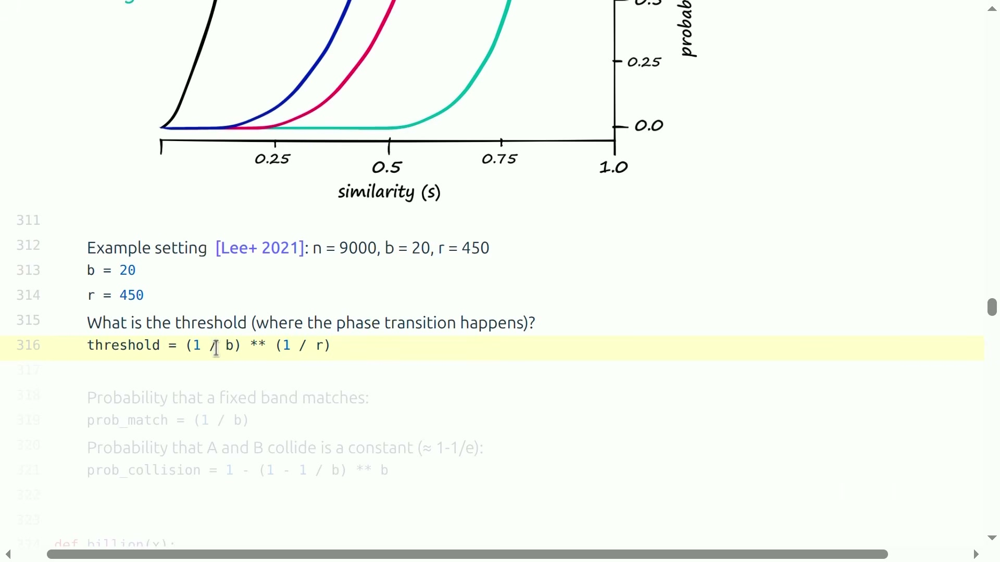
*图 14：课程给出的 $n=9000,b=20,r=450$ 与阈值代码；代入得 $s_\star\approx0.993365$。（字幕区间：00:46:42--00:48:06）*

#### 相变位置公式的推导

这个近似怎么来的？S 曲线的“阈值”最自然的刻画是**斜率最大的位置**，但 $P(s)=1-(1-s^r)^b$ 的拐点没有闭式解。一个简洁的替代刻画是：取使**单个 band 的命中概率等于 $1/b$** 的 $s$，即解 $s^r=1/b$，得 $s_\star=(1/b)^{1/r}$。为什么选 $1/b$？因为此时每个 band 的期望命中数为 $b\cdot(1/b)=1$，恰好处在“平均有一个 band 命中”的临界状态。

在这个位置 $s_\star^r=1/b$，总体碰撞概率为：

$$
1-\left(1-\frac1b\right)^b\rightarrow1-\frac1e\approx0.632.
$$

- $1/b$：一个固定 band 匹配的概率。
- $b$：band 数。
- 极限值说明这不是严格的 0.5 判别点；当 $b=20$ 时约为 $(1-0.95^{20})$，即 $1-0.3585=0.6415$。

推导中用了经典极限 $(1-1/b)^b\to e^{-1}$（$b\to\infty$）。$b=20$ 时与极限的偏差约 $0.6415-0.6321\approx0.009$，对大 $b$ 这个刻画足够精确。

验证课件数字：$s_\star=(1/20)^{1/450}=e^{-\ln 20/450}=e^{-2.9957/450}=e^{-0.006657}\approx 0.993365$，一致。这个配置的含义是：$9000$ 个哈希、$450$ 个一组的强 AND 把判别阈值推到 $0.993$ 以上——只有几乎逐字相同的文档才会成为候选。这是“高精确率、防误删”取向的配置，适合大规模语料里只清掉极端近重复的场景。

#### 给定目标阈值如何选 $r$ 与 $b$：算例

假设任务要求把判别阈值放在 $s_0=0.8$（$J\ge0.8$ 判为近重复），设计步骤是：

1. **用相变公式定 $r,b$ 的关系**：要求 $s_\star=s_0$，即 $(1/b)^{1/r}=0.8$，解出 $b=0.8^{-r}=1.25^{r}$；
2. **选 $r$ 控制陡度**：$r$ 越大曲线越陡、判别越锐利，但总哈希数 $n=br$ 越大。试 $r=14$：$b=1.25^{14}\approx22.7$，取 $b=23$，$n=23\times14=322$；
3. **验算相变位置**：$s_\star=(1/23)^{1/14}=e^{-\ln23/14}=e^{-3.1355/14}=e^{-0.22397}\approx0.7994$，接近目标 $0.8$；
4. **验算两侧性能**：$s=0.9$ 时 $P=1-(1-0.9^{14})^{23}=1-(1-0.22877)^{23}=1-0.77123^{23}\approx1-e^{23\times(-0.25993)}\approx1-e^{-5.978}\approx0.9975$；$s=0.6$ 时 $P=1-(1-0.6^{14})^{23}\approx1-(1-0.00078)^{23}\approx0.0179$。即高于阈值的近重复有约 $99.75\%$ 召回，$s=0.6$ 的非重复只有约 $1.8\%$ 进入候选复核——一个相当实用的工作点。

最后，去重应跨来源执行。若 Wikipedia、书籍和网页数据集分别内部去重，再直接合并，跨来源收录的同一内容仍会重复（例如 Wikipedia 词条被无数网页转载）。去污染同理：评测集的 shingle 必须与**合并后**的全语料做 LSH 比对，而不是只与各来源的内部副本比。

### 本章小结

- LSH 用 band 内 AND、band 间 OR 把平滑碰撞概率锐化为 S 形曲线，候选概率为 $1-(1-s^r)^b$。
- $r$ 越大越严格（压误报），$b$ 越大越容易碰撞（救召回）；相变位置约为 $(1/b)^{1/r}$。
- LSH 只生成候选，仍需理解 false positive、false negative 与复核成本。
- 数据集内部去重不够，最终语料还要做跨来源全局去重和评测集去污染。

## 6. Data Mixing：从经验配比到受约束的小规模优化

### 6.1 混合分布不是“质量排序”

预训练通常同时使用网页、Wikipedia、代码、论文、书籍和多语言数据。Marin 的 token viewer 展示了来源规模差异：通用网页可达数万亿 token，代码、数学和专业语料小得多。


*图 15：不同颜色表示 specialized、web、multilingual、math 与 code；各来源规模跨越很大范围。（字幕区间：00:49:49--00:50:29）*

The Pile 已明确为不同来源指定 weight 与 epoch 数，说明“混合”不是把文件拼在一起，而是定义训练时的采样分布。

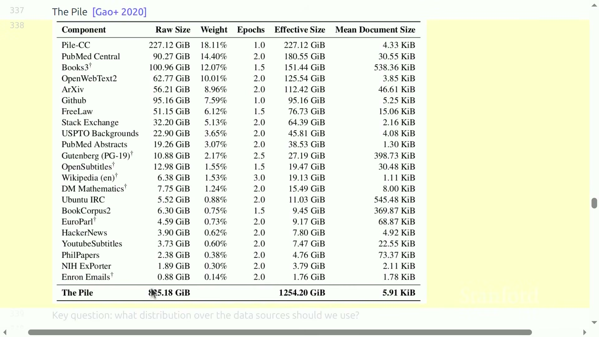
*图 16：Raw Size、Weight、Epochs 与 Effective Size 同时展示了原始规模和训练暴露量的区别。（字幕区间：00:50:34--00:50:58）*

设来源集合为 `Wikipedia`、`CC`、`GitHub`，一个可能的混合是：

```python
p = {"Wikipedia": 0.3, "CC": 0.5, "GitHub": 0.2}
```

课程给出三个基线：凭经验手调（vibes）、均匀采样 $p(s)\propto1$、按来源规模成比例 $p(s)\propto N_s$。

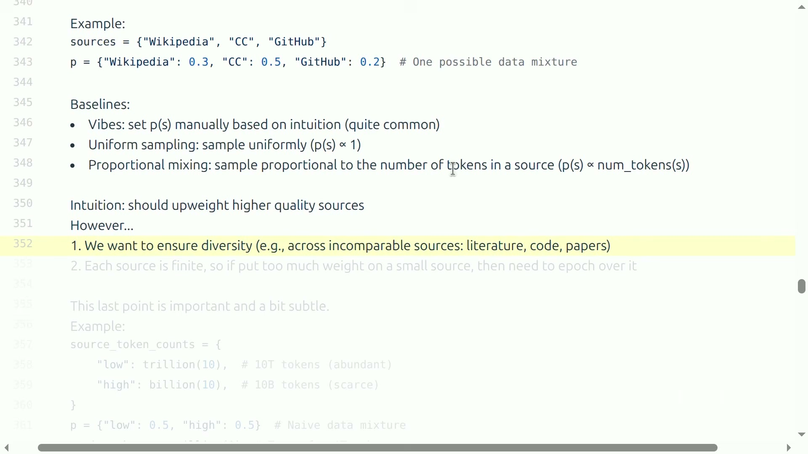
*图 17：仅按直觉、均匀或数据量比例都不足以同时处理能力多样性和有限小来源重复问题。（字幕区间：00:51:57--00:53:39）*

文学、代码和论文并不存在统一的质量序。若全压到某一种“高质量”来源，模型会失去能力多样性；若给小而优质的数据过高权重，又只能重复遍历。注意三个基线的失效模式各不相同：手调不可复现；均匀采样无视来源质量与规模；按比例采样则让小来源几乎消失——$N_s$ 相差千倍时，按比例混合给数学语料的有效权重可能低于 $0.1\%$。

### 6.2 把权重换算为 epoch 数

令总训练 token 暴露量为 $T$，来源 $s$ 有 $N_s$ 个可用 token，采样权重为 $p_s$，则平均重复轮数是：

$$
E_s=\frac{p_sT}{N_s}.
$$

- $E_s$：来源 $s$ 被完整遍历的平均次数。
- $p_s$：训练预算分给来源 $s$ 的比例。
- $T$：训练处理的总 token 暴露量，不是 unique token 数。
- $N_s$：来源 $s$ 的可用 token 数。

**推导**：训练共消费 $T$ 个 token，每个 token 位置以概率 $p_s$ 来自来源 $s$，故来源 $s$ 贡献的 token 期望数为 $p_sT$。除以该来源的去重后可用 token 数 $N_s$，即“这份语料被完整看了几遍”的定义，得 $E_s=p_sT/N_s$。注意 $E_s$ 可以小于 1（来源没看完），也可以远大于 1（来源被反复背诵）——这正是混合权重的隐藏含义。

课程的算例中，低质量来源有 10T token，高质量来源只有 10B，1T-token 训练却给两者各 50% 权重：

$$
E_{\mathrm{low}}=\frac{0.5\times10^{12}}{10^{13}}=0.05,\qquad E_{\mathrm{high}}=\frac{0.5\times10^{12}}{10^{10}}=50.
$$

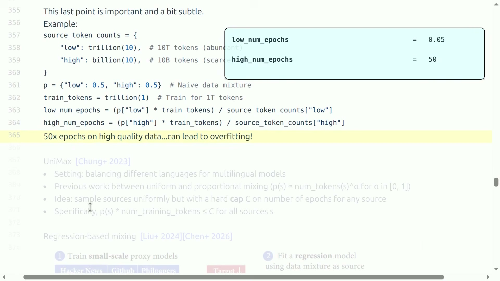
*图 18：同为 50% 权重，来源容量相差千倍，实际重复轮数也相差千倍。完整代码和两个输出都在画面中。（字幕区间：00:53:45--00:56:04）*

> [!QUOTE]
> **讲者（00:56:40--00:56:52）**：“Best case is wasting compute, and worst case, you're overfitting.”

同为“50% 权重”，一边是语料的 $5\%$ 都没看完，一边是把同一份数据背 50 遍。权重数字本身没有任何意义，**只有换算成 $E_s$ 才能审查**。这是本节唯一最重要的操作纪律。

混合在 batch 中通常按 sequence 采样来源：一条 sequence 来自一个组件，不是逐 token 混合；同一个 batch 可包含多个来源，以降低梯度方差。形式化地说，采样在 sequence 级进行是为了保持文档内部的上下文连贯性——逐 token 切换来源会把训练样本变成来源标签的马尔可夫链，破坏语言建模所依赖的长程依赖。

### 6.3 UniMax：给每个来源加 epoch 上限

温度式平滑可写为：

$$
p_s\propto N_s^\alpha,\qquad \alpha\in[0,1].
$$

- $\alpha=0$：接近均匀采样（$p_s\propto1$）。
- $\alpha=1$：按来源 token 数成比例（$p_s\propto N_s$）。
- 中间值：在均匀与比例之间折中，$\alpha$ 越大越顺从规模分布。

温度式混合缓解了“按比例采样忽略小来源”的问题，但没有上界保护：$\alpha=0$ 时最小来源的 epoch 数为 $E_s=T/(mN_s)$（$m$ 为来源数），若 $N_s$ 很小仍可能爆表。UniMax 的思路是直接控制目标量本身：尽量均匀采样，但给每个来源设置最大 $C$ 个 epoch。量纲完整的约束是：

$$
\frac{p_sT}{N_s}\le C,
\qquad\text{等价于}\qquad
p_sT\le C N_s.
$$

- $C$：任一来源允许的最大 epoch 数。
- $p_sT$：来源获得的 token 暴露预算。
- $CN_s$：在最多 $C$ 轮时可提供的 token 数。

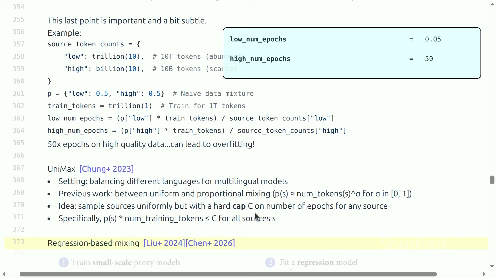
*图 19：画面同时显示 50-epoch 陷阱、温度式基线与 UniMax hard cap；课程源码的简写省略了 $N_s$，正文采用量纲完整公式。（字幕区间：00:58:25--01:00:00）*

#### UniMax 的注水式算法

约束 $\sum_s p_s=1$、$p_sT\le CN_s$ 与“尽量均匀”放在一起，是一个典型的注水（water-filling）问题。算法步骤：

1. **初始均分**：给每个来源分配均匀份额 $p_s=1/m$，对应 token 暴露 $T/m$；
2. **检查越界**：对每个来源计算均匀份额下的 epoch 数 $T/(mN_s)$；若某来源超过 $C$，说明它“供不起”均匀份额，把它**钉在上限**：固定其暴露为 $CN_s$，即 $p_s=CN_s/T$；
3. **重分配余额**：被钉住的来源让出的预算 $T/m-CN_s$ 按均匀原则分给尚未钉住的来源；
4. **迭代收敛**：回到第 2 步，对未钉住的来源重复检查，直到没有新越界。最终得到的分段均匀分布满足：小来源恰好 $C$ 个 epoch，大来源之间均匀，且 $\sum_s p_s=1$。

这个算法保证没有任何来源被重复超过 $C$ 次，同时把剩余的采样概率尽可能均匀地铺在供得起的来源上。它把 6.2 节的“先换算成 $E_s$ 再审”从审计步骤变成了**硬约束**。

### 6.4 回归式数据混合

RegMix 类方法把昂贵的大模型配比搜索转成代理优化：

1. 从概率单纯形采样许多候选 mixture，例如 Dirichlet 分布；
2. 每个 mixture 训练一个小代理模型；
3. 收集验证 loss 或下游指标；
4. 拟合回归器 $\hat L=f_\theta(p)$，寻找预测最优配比；
5. 用该配比训练大模型。


*图 20：先训练小模型群，再拟合 mixture 到目标值的代理函数，搜索最优 mixture，最后用于大规模训练。（字幕区间：01:00:37--01:02:06）*

其数学抽象是：

$$
\hat L=f_\theta(p),\qquad
p^\star=\arg\min_{p\in\Delta^{m-1}}f_\theta(p).
$$

- $p$：$m$ 个 domain 的混合权重向量。
- $\Delta^{m-1}=\{p\in\mathbb{R}^m:p_s\ge0,\ \sum_s p_s=1\}$：概率单纯形，要求权重非负且和为 1。
- $f_\theta$：线性、LightGBM、power law 或 Gaussian Process 等代理模型。
- $\hat L$：预测的 loss 或下游目标。
- $p^\star$：预测最优 mixture。

形式化得更完整些，整个方法是一个两阶段优化。第一阶段（回归）：给定采样得到的 $K$ 个 mixture 及其实测目标 $\{(p^{(k)},L_k)\}_{k=1}^K$，求解

$$
\theta^\star=\arg\min_\theta\sum_{k=1}^{K}\big(f_\theta(p^{(k)})-L_k\big)^2+\lambda\,\Omega(\theta),
$$

其中 $\Omega$ 是正则项。第二阶段（外推优化）：在单纯形上最小化 $f_{\theta^\star}$，可附加重复约束改写为受约束问题

$$
p^\star=\arg\min_{p\in\Delta^{m-1}}f_{\theta^\star}(p)
\quad\text{s.t.}\quad
\frac{p_sT}{N_s}\le C,\ \forall s,
$$

把 UniMax 的 epoch 上限与回归目标统一进同一个规划。


*图 21：方法在代理尺寸、swarm 构造、回归器、目标粒度、优化器和重复约束上均不同；OlmixBase 一列显式加入 data repetition constraint。（字幕区间：01:03:54--01:04:50）*

> [!WARNING]
> 代理方法包含两个“Hope”：回归器在优化器找到的极值点附近仍准确；小规模最优配比能迁移到大规模。随机测试点预测准确，不保证 argmin 所在的分布边缘也准确。若目标主要是代码评测，优化器还可能牺牲未纳入目标的文学等能力。

这个 WARNING 值得展开。第一个 hope 是**分布外泛化**问题：训练点 $p^{(k)}$ 通常从 Dirichlet 分布采样，质量集中在单纯形内部；而 $\arg\min$ 往往落在靠近边界的极端配比处（某些来源权重趋近 0）。回归器在采样密集区的低误差不能外推到边界——优化器恰好会把它推向最不可信的区域。第二个 hope 是**跨尺度迁移**：小模型的最优配比可能由“哪个来源在小预算下学得快”决定，而大模型的瓶颈可能是数据重复或容量利用，两者的最优解不必重合。下一小节正是对第二个 hope 的修补。

### 6.5 Simulated epoching：让小规模像大规模

小实验 token 少，稀缺来源还没被重复，因此可能偏好 `{"low":0.1,"high":0.9}`；同一配比搬到 1T-token 大训练后，高质量小源却会被反复遍历。问题出在：小实验里的 $E_s=p_sT_{\text{small}}/N_s$ 与大训练的 $E_s=p_sT_{\text{large}}/N_s$ 差 $T_{\text{large}}/T_{\text{small}}$ 倍，epoching 压力完全不同，小实验“看不见”过拟合。Simulated epoching 让小实验提前承受相同重复压力：

$$
\rho=\frac{T_{\mathrm{small}}}{T_{\mathrm{large}}},
\qquad N'_s=\rho N_s.
$$

- $T_{\mathrm{small}}$：代理实验 token 预算。
- $T_{\mathrm{large}}$：目标训练 token 预算。
- $\rho$：规模比率。
- $N'_s$：小实验中为来源 $s$ 模拟出的可用 token 数。

于是：

$$
\frac{p_sT_{\mathrm{small}}}{N'_s}
=\frac{p_sT_{\mathrm{small}}}{\rho N_s}
=\frac{p_sT_{\mathrm{small}}}{(T_{\mathrm{small}}/T_{\mathrm{large}})\,N_s}
=\frac{p_sT_{\mathrm{large}}}{N_s},
$$

- 左侧：小实验中每个来源的重复轮数。
- 右侧：大训练在同一 mixture 下的重复轮数。
- 两者相等，说明模拟保留了 epoching 压力。

注意这个恒等式对**任意** mixture $p$ 同时成立——不是只对某一个配比校准，而是把整个 mixture 搜索空间的 epoch 结构整体搬进了小实验。这正是它比“事后对最优解做一轮大规模验证”更强的地方：回归器在小实验上学到的 $\hat L(p)$ 本身就包含了重复惩罚，argmin 自动避开那些靠稀缺来源新鲜感取胜的虚假最优。

```python
small_run_tokens = 10 * 10**9
large_run_tokens = 1 * 10**12
ratio = small_run_tokens / large_run_tokens  # 0.01

downsampled_source_token_counts = {
    source: count * ratio
    for source, count in source_token_counts.items()
}
```

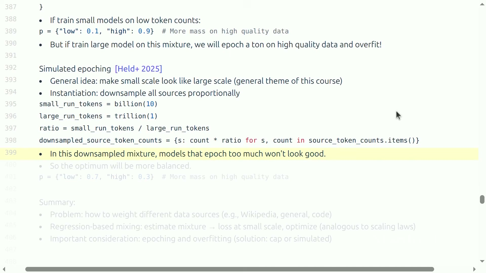
*图 22：所有来源按同一比例下采样，小模型中偏爱稀缺来源的 mixture 会提前暴露重复和过拟合。（字幕区间：01:08:25--01:09:31）*

#### 实验设计逻辑

这个方法的假设与局限同样值得列清：

- **保留的是 epoch 数，不是尺度**：小模型与大模型的容量、样本效率不同，同一 epoch 数对小模型的过拟合伤害可能更大或更小；simulated epoching 修正的是“数据侧”的尺度错配，不修正“模型侧”的。
- **下采样要有代表性**：按 $\rho$ 均匀抽取 token 会保留来源内部的分布形状；若按某种偏好抽取（例如只抽高质量段），$N'_s$ 虽对，内容分布已变，epoch 压力的模拟就失真。
- **与回归式 mixing 是互补关系**：RegMix 解决“搜哪个方向”，simulated epoching 解决“实验环境像不像目标环境”。二者叠加（在 simulated 数据上跑 RegMix swarm）才是完整的流程。

数据源还可以继续细分。单个 Common Crawl 可先按 topic/domain 与 quality 分桶，每个格子再成为 mixture component。这说明 filtering、分桶和 mixing 并非完全独立的阶段：过滤决定每个格子的内容，混合决定格子间的采样分布，而格子的划分本身又是一个自由度。

### 本章小结

- 配比必须与来源容量、训练预算和实际 epoch 数一起审查：$E_s=p_sT/N_s$。
- UniMax 用重复上限防止小来源被过度采样，注水算法在均匀性与上限间折中。
- 回归式 mixing 用小模型学习 mixture 到目标的代理关系，但存在极值点与跨尺度失效。
- Simulated epoching 通过同比缩小来源，让小实验复制大训练的重复压力，且对任意 mixture 同时成立。

## 7. 后训练数据：任务、环境与合成轨迹

### 7.1 通用配方与任务依赖性

预训练与 mid-training 主要发展通用能力；后训练数据更像 evaluation，环境、prompt 和理想响应都由目标能力决定。课程给出的通用配方是：

1. 定义 environments；
2. 定义 tasks / prompts；
3. 从强 teacher 收集 responses。

对照第 2 节的 filtering 框架，后训练数据构造把“从原始池里**筛**”换成了“按目标分布**造**”：$T$ 不再是用来匹配的目标集合，而是直接用来生成样本的任务与环境规范。三者的分工是：environment 规定“问题发生在什么世界”（数学证明纸面、带测试的代码仓库、可浏览的网页）；task/prompt 规定“在这个世界里要完成什么”；teacher 规定“好的完成长什么样”。

开放数据集多数使用模型 teacher；人类 teacher 更慢、更贵，前沿实践可采用人机混合。关键不是“合成”这个标签，而是 prompt 是否覆盖目标分布、teacher 是否真的会教学、响应是否经过有效验证。一个反面模式是：prompt 从少数种子模板扩充而来，覆盖远窄于真实评测分布，teacher 再强也只是在窄分布上反复示范。

### 7.2 OpenThoughts：更强模型不一定是更好教师

OpenThoughts 使用 QwQ-32B 生成 1.2M 样例，问题来自 27 个真人与合成来源，包括 StackExchange、NuminaMath、化学与代码数据。


*图 23：不同来源覆盖 coding puzzle、合成推理、多语言代码、code review 与教育材料，展示 prompt 分布本身就是设计变量。（字幕区间：01:15:34--01:16:30）*


*图 24：问题经过过滤、去重和随机采样，每题生成 16 个响应，约 75K questions 最终形成 1.2M responses。（字幕区间：01:17:13--01:17:42）*

反直觉结论包括：每题采样 16 个响应有效；QwQ-32B 在这个设置中比当时更强的 DeepSeek-R1 更适合作 teacher；简单 answer filtering 没有帮助；较小但高质量的来源可能优于更大、更杂的来源。

逐条解读：

- **多响应有效**（$75\text{K}\times16\approx1.2\text{M}$）：同一 prompt 的多个推理轨迹提供了解法多样性，类似对推理路径空间做蒙特卡洛采样；学生模型学到的是“一类解法”而非单一轨迹的记忆。
- **QwQ-32B 优于更强的 R1 作 teacher**：R1 的推理轨迹更长、更绕，可能超出学生的上下文与模仿能力；教学有效性取决于轨迹的**可模仿性**，而非 teacher 的榜单分数。
- **简单 answer filtering 无效**：按最终答案对错过滤听起来直接，但推理题的错误答案中混有可修复的推理过程，过滤还减少了多样性；在这个设置里其成本高于收益。

> [!IMPORTANT]
> Teacher 的 benchmark 能力和生成“适合学生学习的数据”的能力不是同一个量。后训练数据需要单独评估覆盖度、推理可读性、错误模式与学生模型收益。

这是第 6 节“代理目标会失效”的第三次变体：第一次是过滤阈值随预算失效，第二次是回归 mixing 的 argmin 失效，这次是 teacher 榜单分数作为“教学能力”代理的失效。三个案例的共性是：**凡是用来替代真实目标的便捷指标，都要在目标尺度上单独验证**。

### 7.3 SWE-smith：真实环境加合成任务

数学问题几乎不需要外部环境；软件工程任务却绑定仓库、依赖、测试和工具。SWE-smith 从真实仓库出发，建立环境，再通过程序化修改、LM 生成、组合 bug 或 PR mirroring 创造任务，最后用测试验证。


*图 25：真实 repository 与 unit tests 保留环境真实性，任务本身可合成；128 个 GitHub 仓库产生约 50K tasks。（字幕区间：01:18:14--01:18:54）*

这种方案属于 semi-synthetic：环境真实，任务可扩展生成。四种造题方式对应不同的扰动算子：程序化修改（如重命名、删改语句）是语法级扰动；LM 生成注入语义级缺陷；组合 bug 把多个单点缺陷叠加出更难的复合任务；PR mirroring 则从真实修复反推缺陷。关键是**可验证性**：每个合成任务都附带仓库自带的测试套件作为客观判据，不需要人为判断“这个 bug 像不像真的”。

瓶颈是为成千上万旧仓库安装依赖和维护 Docker image——这是纯工程问题，但它决定了方法的可扩展上限：能造多少任务，不取决于模型多聪明，而取决于有多少环境能被可靠地 reproduce。

### 7.4 SWE-Zero：用无执行轨迹换规模

SWE-Zero 的观察是，强模型即使没有 execution feedback，仍能解决相当比例的软件任务；这说明参数中包含一定的代码语义 world model。无执行显然更弱，但足以生成大量有价值的训练轨迹。


*图 26：MiniMax-M2.5 无执行时为 69.5/57.2，有执行时为 80.2/74.1；其他模型也显示执行反馈仍有明显价值。（字幕区间：01:19:48--01:20:25）*

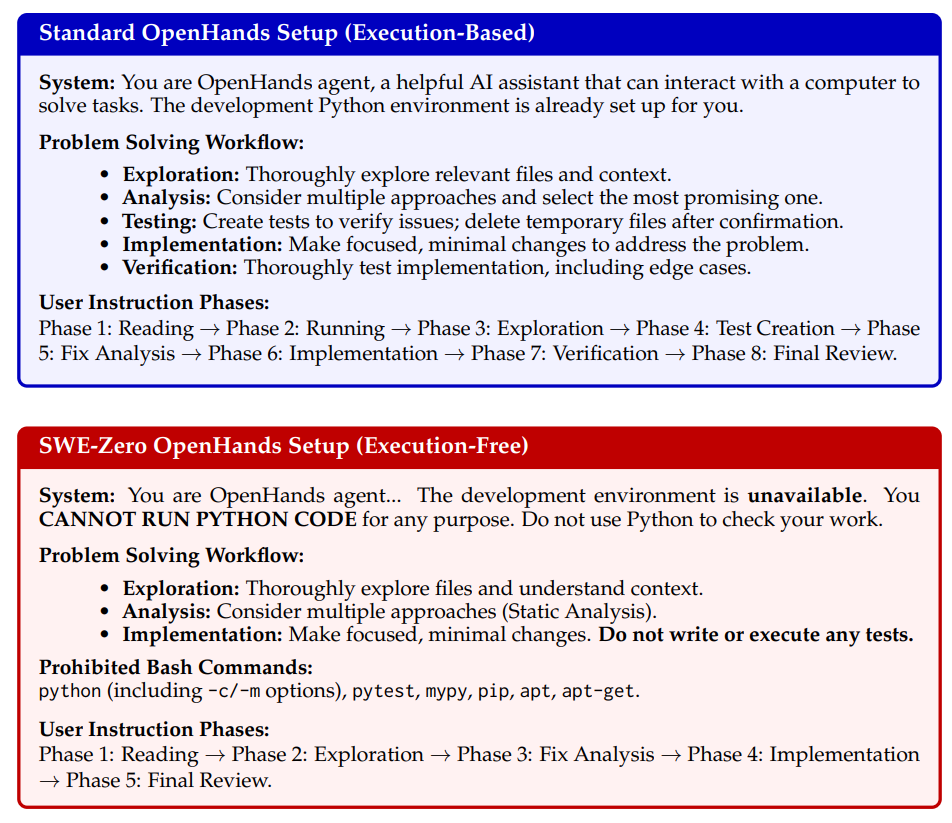
*图 27：execution-free prompt 明确禁用 Python、pytest、mypy、pip、apt 等命令，也禁止写或运行测试，迫使轨迹依靠静态探索、分析与实现。（字幕区间：01:20:38--01:21:17）*

数据由 Qwen3-Coder-480B teacher 蒸馏，并过滤仍试图执行命令的轨迹。SWE-Zero 生成 300K 条不依赖仓库专属执行的 agent trajectories；随后加入约 13K 条需要 execution feedback 的 SWE-Hero 轨迹。


*图 28：在 7B、14B 与 32B 尺寸上，加入 SWE-Hero 阶段分别带来约 +5.9、+6.3、+4.7 个百分点，但仍与最大前沿模型有差距。（字幕区间：01:21:17--01:21:45）*

> [!WARNING]
> Execution-free 不等于 execution-equivalent。它的意义是便宜、可扩展，并能提供大量静态代码推理样本；表格同时证明运行测试和环境反馈仍然提高解题能力。

两阶段设计（300K 无执行轨迹 + 13K 有执行轨迹）本身就是第 6 节 mixing 思想在后训练的实例：廉价大规模来源打底，昂贵小规模来源补足执行反馈能力，比例约 $24:1$。图 26 的对比（$69.5\to80.2$）量化了执行反馈的价值，图 28 则显示这 $4\%$ 的昂贵数据贡献了 $5$–$6$ 个百分点的提升——昂贵来源的边际价值极高，但没有前面的廉价来源打底也形不成基础能力。

### 7.5 SWE-rebench 与 SWE-ZERO-12M

SWE-rebench 从 450K PRs 开始，结合 GitHub Archive 元数据，先初筛，再尝试安装环境、运行验证，并用 Qwen2.5-72B-Instruct 协助推断依赖与评估 PR 质量，最终得到 21K+ interactive Python SWE tasks，覆盖 3.4K repos。


*图 29：GitHub/GHArchive 初筛、环境安装验证、LLM labeling 三步将大规模 PR 池收缩为可用任务。（字幕区间：01:21:45--01:22:13）*

三级漏斗的保留率约为 $21\text{K}/450\text{K}\approx4.7\%$——与第 2、3 节的预训练过滤完全同构：先用廉价规则收缩候选（PR 元数据），再用环境可行性筛选（安装、测试能跑），最后用 LLM 做最昂贵的语义判断（依赖推断、质量评估），把每一步的成本与剩余数据量匹配起来。

SWE-ZERO-12M 进一步使用 SWE-rebench-v2 的 32K executable 与 120K nonexecutable tasks，以 mini-swe-agent 和 mini-coder-1.7B 扩展到 12M trajectories；课程报告后者 pass@100 为 50.4。讲者称该数据在授课当天刚发布，这是授课时点的陈述，不应当作永久的“当前最新”。

### 本章小结

- 后训练数据更接近评测任务，必须显式定义环境、prompt 与理想响应。
- 强 teacher 不必然产生更适合学生的数据；多响应采样与来源质量同样重要。
- SWE-smith 保留真实环境、合成任务；SWE-Zero 牺牲执行反馈以扩大轨迹规模。
- 软件环境、依赖验证、agent hacking 与质量标注使代码数据远比数学数据昂贵。

## 总结与延伸

### 讲者的收束

课程最后把整条链路压缩为四个动作：

1. **Filtering**：定义“好数据”，训练轻量分类器把标准外推到 Web crawl；
2. **Deduplication**：用哈希与近似匹配减少重复、记忆和 FLOPs 浪费；
3. **Mixing**：在小规模尝试 mixture，但检查 epoching 与跨尺度迁移；
4. **Post-training data**：让数据形态接近 evaluations，大量使用合成 prompts、responses 与 agent trajectories。

讲者最后的现实校正是：论文和课程把流程画得很整洁，真实数据工作却高度 domain-specific，充满逐例查看、安装失败、错误标签、过滤细节和例外处理。算法提供骨架，数据审计决定它在现实中是否成立。

### 全课的统一逻辑

把各章压缩到同一框架，会发现三个不断重复的结构：

- **先定义目标，再做代理。** Filtering 用 $T$ 定义目标，回归式 mixing 用下游 loss 定义目标，后训练用 task 与 teacher 定义目标。
- **先在小规模估计，再扩展。** fastText 把少量标签扩到 Web，MinHash/LSH 把相似度估计扩到大语料，代理模型把 mixture 搜索扩到大训练，QwQ-32B 把推理示范扩到 1.2M 轨迹。
- **每次扩展都可能改变问题。** 过滤偏置会被放大；LSH 只给概率候选；小模型最优 mixture 会因 epoching 失效；更强 teacher 也可能不是更好的教师。

因此，数据工程的核心能力不是盲目扩大数据量，而是持续追问：代理指标是否仍代表真实目标？训练规模是否改变了数据重复结构？选择和清理是否丢掉了目标能力所需的信号？

### 实践检查清单

- 转换：抽样检查阅读顺序、表格、代码、图注和字符编码。
- 过滤：记录目标集合来源、阈值、保留率、误杀案例与目标偏置。
- 去重：明确 item、shingle、相似度阈值、候选召回率与跨来源范围。
- 混合：把每个权重换算成实际 $E_s=p_sT/N_s$，不要只看百分比。
- 代理实验：检查 argmin 附近误差，并用 simulated epoching 模拟目标规模。
- 后训练：分别评价 prompt 覆盖、teacher 教学质量、执行环境真实性与响应过滤。

### 开放问题

1. 如何设计不会被代理回归器或优化器钻空子的 mixture/evaluation target？
2. 除 teacher 自身 benchmark 外，怎样直接度量合成响应的教学价值？
3. Execution-free 轨迹在哪种任务复杂度、代码库规模或依赖条件下开始明显失效？
4. Filtering、质量分桶、mixing 和后训练采样能否联合优化，而不是串行决定？
5. 如何在数据可复现、版权隐私、能力覆盖和训练成本之间建立可审计的折中？

> [!WARNING]
> “更强的优化”不保证“更好的数据”。当代理目标与真实目标不一致时，优化器会更高效地优化错误的东西。最可靠的防线仍是明确目标、保留可追溯来源、检查具体样本，并在目标训练规模下验证。

### 本章小结

- 数据 pipeline 是一组相互耦合的建模决策，而不是中性的清洗步骤。
- 质量、数量、重复轮数与训练规模必须联合分析。
- 合成数据的关键是 task、teacher、environment 与验证机制，不是“合成”二字本身。
- 最终的工程准则是：让小规模实验尽量复制大规模问题，并始终用真实样本和下游行为检查代理假设。
