# Lecture 16：后训练（二）——从 PPO、GRPO 到可验证奖励强化学习

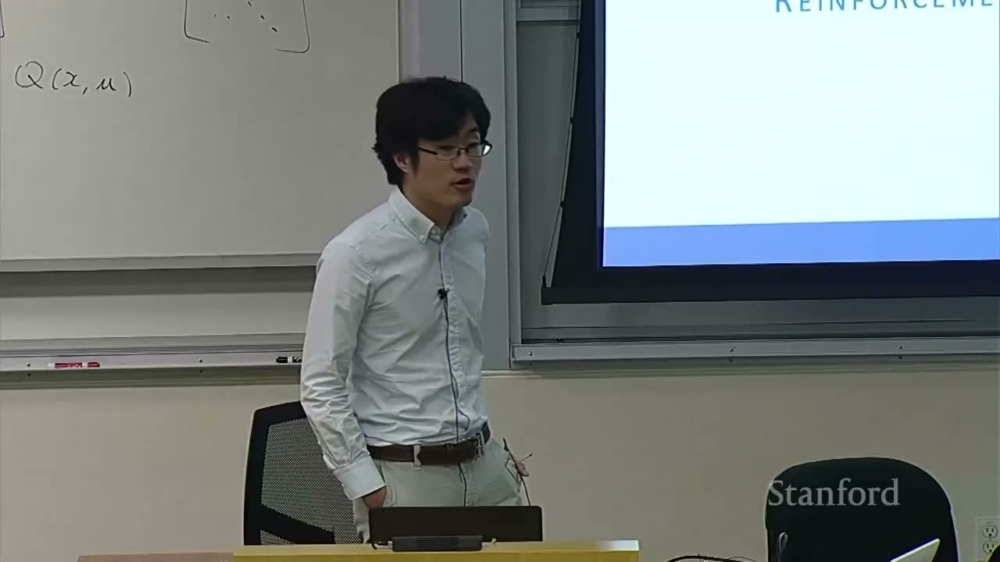

- **视频标题**：Stanford CS336 Language Modeling from Scratch | Spring 2026 | Lecture 16: Post-Training - RLVR
- **主讲**：Tatsunori Hashimoto（Stanford CS336）
- **频道**：Stanford Online
- **视频**：[YouTube](https://www.youtube.com/watch?v=dIFAi87Ws4E)
- **时长**：01:15:50
- **处理范围**：完整讲授与课后问答；按“动机 → 算法 → 三个开放模型案例 → Agentic RL → 问答”重构
- **图像说明**：正文优先采用教师官方课件的清晰页面；每张课件图下的时间均对应视频中讲解该页内容的人工英文字幕区间

## 1. 为什么从 RLHF 走向 RLVR

### 1.1 真正的瓶颈在奖励，而不在强化学习

上一讲的 RLHF 已经能把预训练模型变成有用的聊天助手，但它很难靠持续增加强化学习计算无限扩展。原因是 RLHF 优化的是由人类偏好数据训练出的**代理奖励模型**。标注规模有限，奖励模型也不可能完整表达“人真正想要什么”；策略越用力地追逐这个代理目标，就越可能发现它的漏洞，出现 reward overoptimization。

AlphaGo 一类问题则不同：胜负就是最终目标，没有“代理分数提高、真实质量下降”的缝隙。因此，只要奖励仍在改善，继续增加搜索和训练计算就是合理的。数学、代码、形式化证明等任务也具有类似性质：答案可以由规则、测试用例或证明检查器验证，这正是 **RL from Verifiable Rewards（RLVR）** 的出发点。

*课件第 3 页：代理奖励的过度优化，以及 AlphaGo、科学与数学等可验证领域。视频讲解区间：00:01:11--00:03:09。*

> [!IMPORTANT]
> RLHF 与 RLVR 的算法外形可能很接近，真正决定可扩展性的差别是奖励：奖励越接近任务的真实成功条件、越难被策略钻空子，越能安全地投入更多 RL 计算。

### 1.2 本讲的路线

课程先从 PPO 回顾一般策略梯度，再说明 GRPO 如何去掉 value model；随后用 DeepSeek R1、Kimi K1.5、Qwen3 三个开放模型拆解现代 reasoning-RL 配方，最后把同一思想推广到软件工程 Agent。

### 本章小结

- RLHF 的扩展瓶颈是有限的人类偏好与可被利用的代理奖励。
- RLVR 把训练放到数学、代码等可精确验证的领域，使 reward 更接近真实目标。
- 后面所有算法与工程选择，都应围绕两个问题判断：**奖励是否可靠？策略是否真的在优化它？**

## 2. PPO：理论很短，语言模型实现很长

### 2.1 从 REINFORCE 到受约束更新

策略梯度的母公式是 log-derivative trick。直觉上，它把强化学习更新变成“由回报加权的 SFT”：好输出的 log-prob 被提高，坏输出的 log-prob 被降低。

$$
\nabla_\theta \mathbb{E}_{z\sim p_\theta}[R(z)]
=
\mathbb{E}_{z\sim p_\theta}\left[R(z)\nabla_\theta\log p_\theta(z)\right]
$$

- $\theta$：策略或语言模型参数。
- $z$：一条完整输出或 rollout。
- $p_\theta(z)$：当前策略生成 $z$ 的概率。
- $R(z)$：该输出的标量回报。
- $\nabla_\theta\log p_\theta(z)$：提高或降低该输出概率的梯度方向。

纯策略梯度的问题是方差大，而且策略每次改变后最好重新采样。TRPO 用 KL trust region 限制新旧策略距离；PPO 则用更易实现的 clipped surrogate objective，避免 importance ratio 在一批旧 rollout 上变化过大。

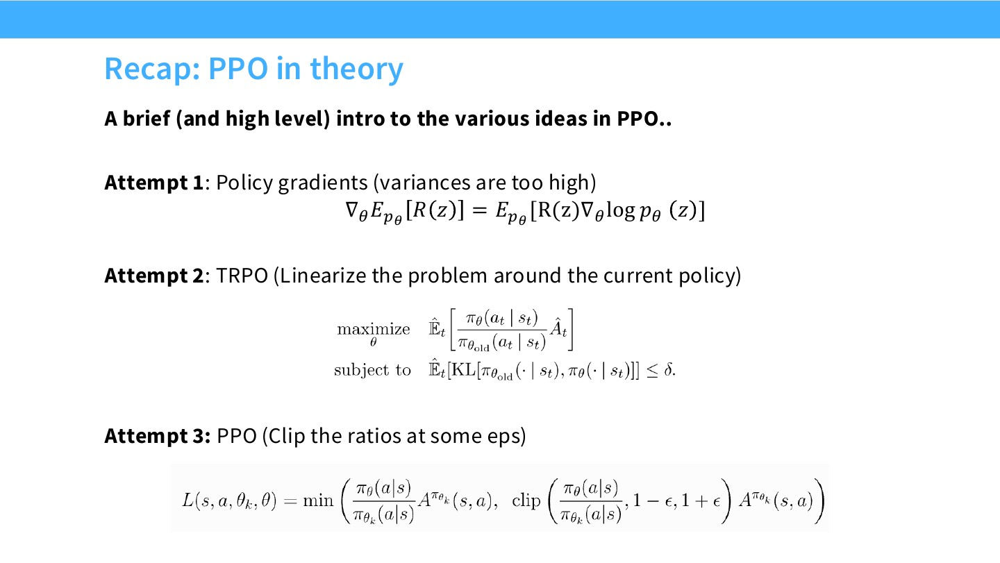

*课件第 5 页：PPO 的理论谱系。视频讲解区间：00:03:46--00:05:01。*

PPO 的核心目标可以写成：

$$
L^{\mathrm{clip}}(\theta)=
\mathbb{E}_t\left[
\min\left(
r_t(\theta)\hat A_t,
\operatorname{clip}(r_t(\theta),1-\epsilon,1+\epsilon)\hat A_t
\right)
\right],
\qquad
r_t(\theta)=\frac{\pi_\theta(a_t\mid s_t)}{\pi_{\theta_{\mathrm{old}}}(a_t\mid s_t)}.
$$

- $s_t$：第 $t$ 步状态；对语言模型就是当前 token 前缀。
- $a_t$：第 $t$ 步动作；对语言模型就是下一个 token。
- $\pi_\theta$、$\pi_{\theta_{\mathrm{old}}}$：正在更新的策略与生成本批样本的旧策略。
- $r_t(\theta)$：新旧策略对该动作的概率比。
- $\hat A_t$：advantage 估计，表示该动作相对基线好多少。
- $\epsilon$：裁剪半径；课件所示 AlpacaFarm 实现使用 `cliprange=0.2`。

> [!WARNING]
> PPO 裁剪的是**新旧策略概率比**，不是直接把 advantage 截断。字幕中的口语表达容易造成这个误解。

### 2.2 语言模型 PPO 为什么复杂

伪代码只有“采样轨迹、估计 advantage、裁剪更新、拟合 value function”几行，真实 LM-PPO 却同时涉及：

- 生成输出的 policy model；
- 约束漂移的 reference/SFT model；
- 给完整回答打分的 reward model；
- 逐 token 估计未来回报的 value model；
- 经验缓存、GAE、policy loss 与 value loss；
- 末端完整序列奖励，以及常见的逐 token KL shaping。

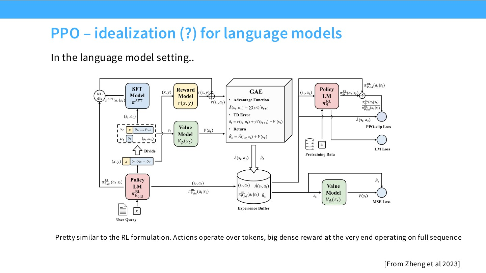

*课件第 9 页：policy、reference、reward、value、GAE 与经验缓存之间的关系。视频讲解区间：00:07:51--00:08:28。*

这也解释了为什么“37 个 PPO 实现细节”会成为现实：不同库在 rollout、mask、长度归一化、KL 估计、reward shaping 和 value fitting 上的微小差异，都可能改变结果。课程展示的 AlpacaFarm 代码还把某种 KL 近似裁到非负，作为防止训练爆炸的稳定性处理；它是具体实现的工程选择，不是 PPO 定义的一部分。

### 2.3 GAE 在语言模型中常退化成整段 bandit

PPO 通常用 generalized advantage estimation：

$$
\hat A_t^{\mathrm{GAE}(\gamma,\lambda)}
=\sum_{l=0}^{\infty}(\gamma\lambda)^l\delta^V_{t+l},
\qquad
\delta^V_t=r_t+\gamma V(s_{t+1})-V(s_t).
$$

- $\hat A_t$：时刻 $t$ 的 advantage 估计。
- $r_t$：即时奖励。
- $V(s_t)$：value model 对未来累计回报的预测。
- $\gamma$：折扣因子。
- $\lambda$：调节偏差与方差的累积参数。
- $\delta_t^V$：一步 TD residual。

*课件第 15 页：GAE 公式及实现。视频讲解区间：00:10:27--00:10:58。*

不少 LM-RLHF 实现直接取 $\gamma=\lambda=1$，于是 advantage 接近“整段 reward-to-go 减 value”，把 token 序列重新看成一次 episode-level bandit。若仍保留逐 token KL，系统当然仍有序列结构；这里的“退化”指 task reward 的 credit assignment 被大幅简化。

### 2.4 为什么 PPO 和 DPO 都不是理想答案

PPO 能工作，成熟实验室也有稳定实现；问题是从零搭建很麻烦，且 value model 通常和 policy 一样大，要额外占用显存并独立调参。DPO 则天然面向 Bradley-Terry 式 pairwise preference；数学题的可验证标量奖励并不天然是一对“chosen/rejected”。DPO 也可迭代成 online 方法，所以真正的差别不只是 online/offline，而是数据与目标的结构是否匹配。

### 本章小结

- PPO 通过 clipping 让旧 rollout 可被有限复用，是通用而强大的 RL 工具。
- LM-PPO 的难点不在一行公式，而在 policy/reference/reward/value 四类模型及其工程耦合。
- 当 value model 太昂贵，而反馈又是可验证标量而非偏好对时，就需要更直接的算法。

## 3. GRPO：用同题多次采样替代 value model

### 3.1 组相对 advantage

GRPO 保留 PPO 的整体框架，却删掉 value network。对于同一个 prompt $q$，策略采样 $G$ 个输出，分别获得奖励 $r_1,\ldots,r_G$；每条输出不再和 value model 的预测比较，而是与同组平均水平比较：

$$
A_i=\frac{r_i-\operatorname{mean}(r_1,\ldots,r_G)}
{\operatorname{std}(r_1,\ldots,r_G)}.
$$

- $q$：问题或 prompt。
- $G$：每个 prompt 的 rollout 数量。
- $r_i$：第 $i$ 个 rollout 的可验证奖励。
- $A_i$：组内 z-score advantage。

直觉例子是：PPO 会问“value model 预测得 5 分，实际得 6 分，是否超出预期？”；GRPO 会问“同一道题的 10 次尝试中，这条回答是否高于平均？”这里的 10 只是课堂举例，不是固定超参数。

*课件第 18 页：GRPO 目标、组内标准化 advantage 与 PPO 对照。视频讲解区间：00:13:29--00:16:41。*

包含 clipping 与 reference KL 的原始目标可概括为：

$$
J_{\mathrm{GRPO}}(\theta)=
\mathbb{E}\left[
\frac{1}{G}\sum_{i=1}^{G}
\left(
\min\left(\rho_iA_i,\operatorname{clip}(\rho_i,1-\epsilon,1+\epsilon)A_i\right)
-\beta D_{\mathrm{KL}}(\pi_\theta\Vert\pi_{\mathrm{ref}})
\right)
\right],
$$

其中

$$
\rho_i=\frac{\pi_\theta(o_i\mid q)}{\pi_{\theta_{\mathrm{old}}}(o_i\mid q)}.
$$

- $o_i$：同一问题的第 $i$ 个输出。
- $\rho_i$：新旧策略对该输出的概率比。
- $\epsilon$：PPO 式裁剪半径。
- $\pi_{\mathrm{ref}}$：固定 reference policy。
- $\beta$：KL 正则强度。

如果 rollout 后立刻只做第一次 online update，则此时 $\pi_\theta=\pi_{\theta_{\mathrm{old}}}$、$\rho_i=1$，clipping 暂时不起作用，主体就是“组内标准化奖励的 policy gradient + KL”。同一批数据若做多个 epoch，后续 $\rho_i$ 不再等于 1，clipping 仍然重要。

### 3.2 为什么它容易实现

一版最小 GRPO 只需：

1. 对每个 prompt 采样一组回答；
2. 用规则、测试或 verifier 计算每条奖励；
3. 计算组内均值和标准差，形成 advantage；
4. 计算 reference KL；
5. 用 stop-gradient 的 advantage 加权 token log-prob，更新 policy。

实现常在标准差分母加 `1e-4`。它主要防止整组奖励相同时出现 `0/0` 或 NaN；当整组完全相同，分子也为 0，本身没有可学习的相对信号。

原始 DeepSeekMath 1.3B 实验显示，GRPO 在 GSM8K 和 MATH 上总体优于只保留正确样本继续训练的 RFT；加入 process supervision 还能进一步提升。但 R1 后来并没有依赖过程监督，这一点非常关键。

> [!IMPORTANT]
> GRPO 的工程价值来自一个清晰交换：用同一 prompt 的多次采样成本，换掉一个与 policy 同规模、还要独立训练的 value model。

### 本章小结

- GRPO 的关键不是“全新 PPO”，而是把 learned value baseline 换成同题多次采样的组相对分数。
- 在线第一次更新时，它几乎就是 group-normalized REINFORCE 加 KL 正则。
- 极简实现降低了 RLVR 的研究门槛，但“简单”不代表目标完全没有偏差。

## 4. 原始 GRPO 的两个隐藏偏差

### 4.1 什么才是合法 baseline

REINFORCE 允许从 reward 中减去只依赖状态、不依赖当前 action 的 baseline $b(s)$。在整段 LM bandit 中，状态可看作 prompt；因为

$$
\sum_a b(s)\nabla_\theta\pi_\theta(a\mid s)
=b(s)\nabla_\theta\sum_a\pi_\theta(a\mid s)
=b(s)\nabla_\theta 1=0,
$$

减去这种 baseline 不会改变期望梯度，只会改变方差。GRPO 的组均值近似这种 prompt-dependent baseline，但再除以组内标准差，就相当于重新改变不同 prompt 的权重，已经不严格等价于原始 expected reward 的无偏梯度。

### 4.2 Dr. GRPO 的修正

原始 GRPO 还有一层 response-level length normalization：每条回答的 token loss 除以长度 $|o_i|$。从标准 sequence policy gradient 直接推导，并不会自然得到这一项。Dr. GRPO/Liu et al. 2025 的修正同时去掉 `/std` 与 `1/|o_i|`，得到更接近 REINFORCE with leave-one-out 的形式；“接近”不意味着完全等价，因为标准组均值仍包含当前样本，而严格 leave-one-out 会排除它。

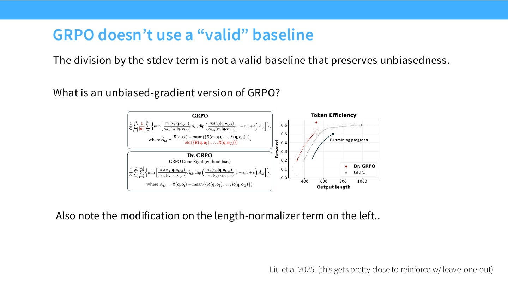

*课件第 23 页：去掉标准差缩放与逐回答长度归一化后的目标。视频讲解区间：00:21:47--00:23:34。*

### 4.3 长度偏差如何产生

对于正 advantage，除以长度会让短的正确回答得到更强更新；对于负 advantage，长的错误回答因为分母更大而被惩罚得更轻。极端地说，若模型知道自己会得到 $-1$，它可以不断延长错误回答，让归一化后的负梯度趋近 0。这会诱导“不会做时越说越长”。去掉长度归一化后，实验中的 CoT 长度会更早进入平台，尤其错误输出不再无止境增长，而 reward 和 benchmark 未必受损。

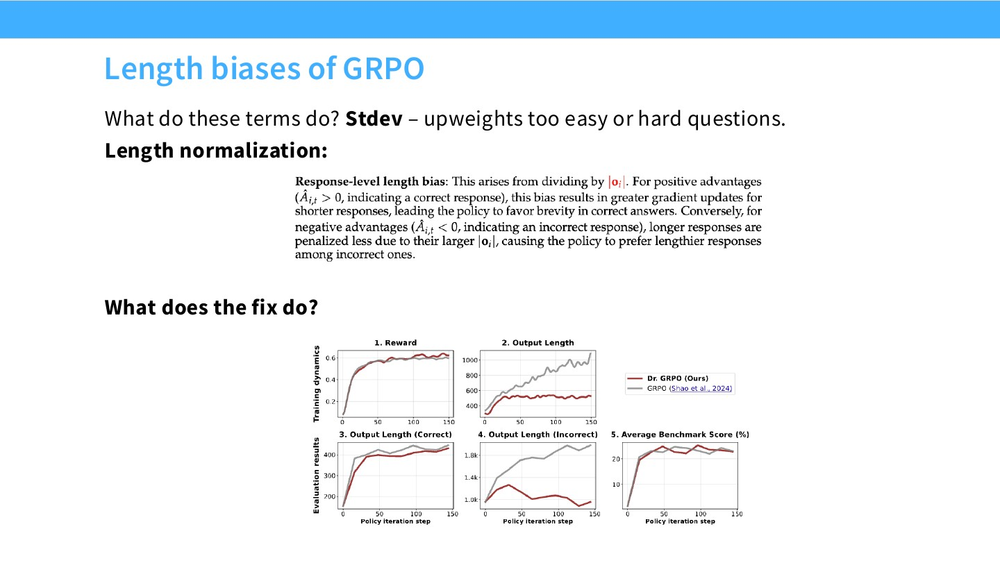

*课件第 24 页：正确/错误输出的长度效应以及修正后的训练曲线。视频讲解区间：00:23:34--00:25:56。*

标准差缩放也会改变题目权重。二元奖励中，接近全对或全错、但仍存在少数反例的组方差很小，稀有差异会被放大。这未必等于理想课程学习，因为最值得训练的通常是模型“有时会、有时不会”的临界难度区间。若整组真的全对或全错，分子也为 0，加入 epsilon 后 advantage 仍为 0，不应误写成巨大更新。

> [!WARNING]
> “CoT 在 RL 中变长”不能自动证明模型学会了更深推理。它可能部分来自目标函数的长度偏差；同样，“aha moment”也可能已经存在于 base model，只是被训练采样放大。

### 本章小结

- 组均值减法可作为 baseline；组标准差除法会重加权不同问题。
- 逐回答长度归一化会让长错误回答逃避惩罚。
- 判断一个 RL 算法时，不能只看最终 reward，还要检查梯度究竟优化了什么以及长度等副作用。

## 5. DeepSeek R1：从纯 RL 实验到完整后训练流水线

### 5.1 R1-Zero：尽量干净的受控实验

R1-Zero 从 DeepSeek-V3 base model 出发，不先做 reasoning SFT，奖励只有两类：最终答案准确性与输出格式（如 thinking tags）。数据未公开。它的价值在于展示：一个强 base model 配合简单 GRPO 与可验证奖励，就能自发延长 CoT 并显著提高数学/代码能力。

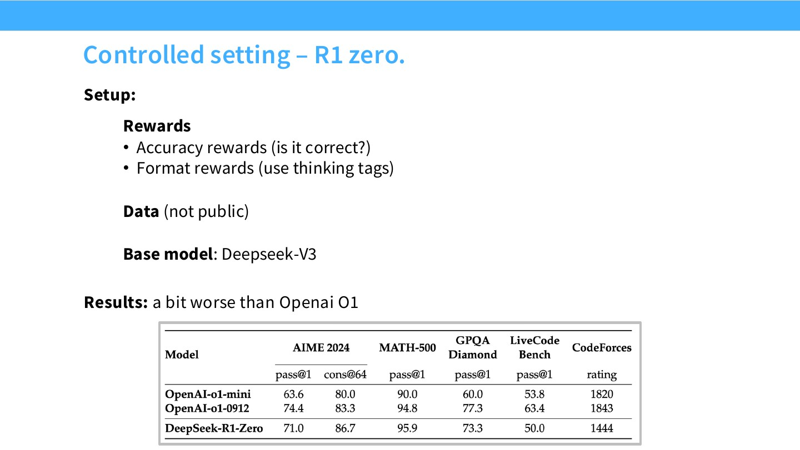

*课件第 28 页：R1-Zero 的奖励、数据、基座与基准结果。视频讲解区间：00:28:41--00:30:00。*

但课程对“RL 产生 aha moment”的叙事保持克制：后续分析发现 base model 已会出现类似语句，原始 GRPO 的长度偏差也能解释部分 CoT 增长。更稳妥的结论是，RL 提高了有用轨迹被采样和强化的概率，而不是凭空发明推理原语。

### 5.2 R1：SFT 冷启动、GRPO、再回到通用对齐

完整 R1 与 R1-Zero 的区别是：先用 long-CoT reasoning SFT 冷启动；RL 阶段加入语言一致性奖励以减少 CoT 中的语言混杂；之后再进行包含非可验证任务的 SFT/RLHF。

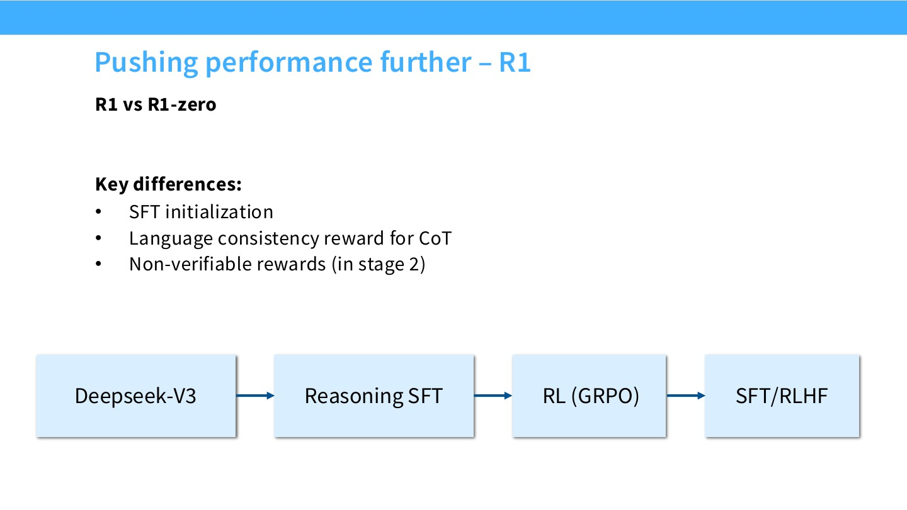

*课件第 31 页：DeepSeek-V3 → reasoning SFT → GRPO → SFT/RLHF。视频讲解区间：00:31:38--00:33:17。*

课程给出的数据规模值得记住：后续 SFT 训练 2 epochs，包含约 60 万条 reasoning 数据，其中非可验证任务由 V3 充当 judge，另有约 20 万条 non-reasoning 数据；最终再走常规 RLHF。这个顺序说明 reasoning RL 并不替代通用对齐：前者专注可验证能力，后者补聊天、写作和一般偏好。

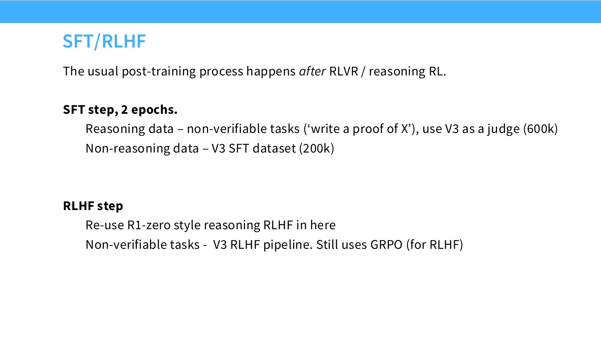

*课件第 35 页：2 epochs、60 万 reasoning 与 20 万 non-reasoning 数据的后续阶段。视频讲解区间：00:35:18--00:35:34。*

少量高质量 long-CoT SFT 就可能完成 bootstrapping。课堂引用的相关结果显示，约 1,000 个数学与科学问题配上来自强模型的长 CoT，也能把弱模型推入“开始产生可奖励正确解”的区域。SFT 的角色不是替代 RL，而是让策略先获得足够的成功概率，使 RL 不至于面对全零奖励。

### 5.3 蒸馏：把昂贵搜索的轨迹交给小模型

R1 生成约 80 万条 CoT 轨迹，再用它们监督微调 Qwen2.5/Llama 等较小 base model。结果说明，小模型未必需要自己承担大规模在线 RL，先学习强模型已经搜索出的推理轨迹，就能获得可观能力。

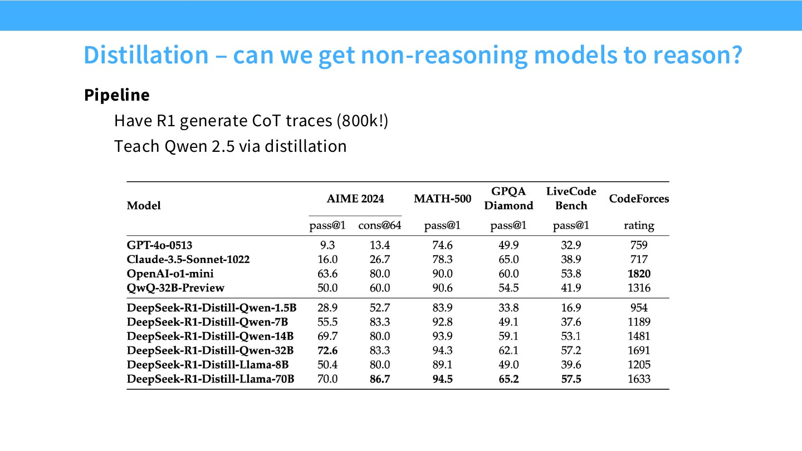

*课件第 37 页：80 万 CoT 蒸馏到 Qwen2.5/Llama，并列出不同规模结果。视频讲解区间：00:36:04--00:37:24。*

R1 报告中同样重要的是“失败尝试”：process reward model 难以定义通用推理中的细粒度正确步骤，也会带来额外训练成本与 reward hacking；MCTS 在语言的开放搜索空间中远不如棋类那样自然，扩展也不顺利。这些负结果支持了一个朴素配方：强 base + 少量冷启动 + outcome-verifiable RL + 后续 SFT/RLHF。

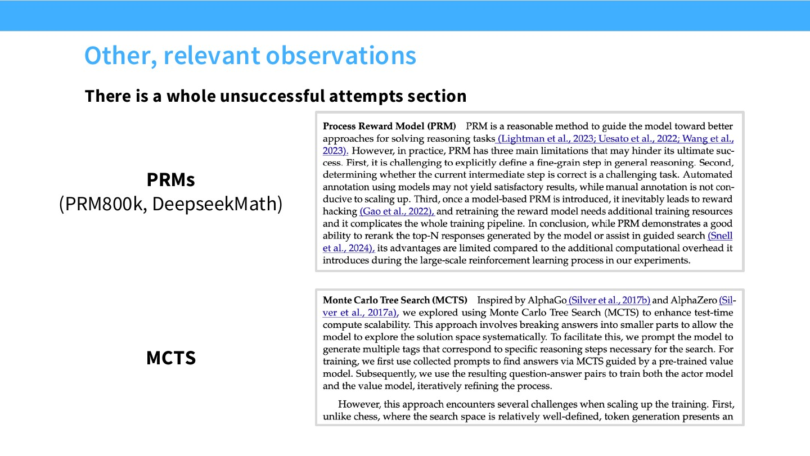

*课件第 38 页：PRM 与 MCTS 的局限。视频讲解区间：00:37:24--00:40:06。*

### 本章小结

- R1-Zero 证明纯可验证奖励 RL 可以把强 base model 推向长 CoT，但不能把一切现象都归因于“涌现”。
- 完整 R1 的可靠配方是 reasoning SFT 冷启动 → GRPO → reasoning/general SFT 与 RLHF。
- 蒸馏把昂贵搜索得到的轨迹变成廉价监督数据；失败尝试则说明 PRM/MCTS 不是必要条件。

## 6. Kimi K1.5：数据课程、另一种策略梯度与显式长度控制

### 6.1 先把题目分布设计好

Kimi K1.5 与 R1 同期发布，也达到或超过当时 o1 的多项结果。其 long-CoT 配方仍是“数据构造 → SFT → RL”，但报告对数据与系统细节更充分：

- 平衡不同数学/代码主题；
- 排除 multiple-choice 与 true/false，减少猜中造成的假阳性；
- 用 best-of-$n$/多次采样的成功率估计难度，再筛向“当前可学但尚未掌握”的区间；课堂口述以 best-of-8 举例，课件引文另有每题采样 10 次的描述，因此不把某个次数写成固定规则；
- 给题目分难度并从易到难训练；
- 按 $1-\text{success rate}$ 重采样，减少已经解决的问题，同时避免把全部算力浪费在完全无成功信号的超难题上。

*课件第 40 页：数据构造、long-CoT SFT 与 RL 三步。视频讲解区间：00:40:36--00:42:19。*

### 6.2 从 KL 正则化最优策略反推 reward

Kimi 的算法不是直接复刻 GRPO。它从带 KL 正则的最优策略出发，以 DPO 类似的推导把 reward 写成最优策略与参考策略的 log-ratio，再用平方损失作 surrogate，最终得到带组 baseline 和正则项的 policy gradient。

*课件第 42 页：从 reference-based reward 到 baselined policy gradient。视频讲解区间：00:43:54--00:46:51。*

其核心表达可概括为：

$$
\max_\theta\;
\mathbb{E}_{(x,y^*)\sim\mathcal D}
\mathbb{E}_{(y,z)\sim\pi_\theta}
\left[r(x,y,y^*)-\tau D_{\mathrm{KL}}(\pi_\theta(\cdot\mid x)\Vert\pi_{\theta_i}(\cdot\mid x))\right].
$$

- $x$：题目或 prompt。
- $y$：生成答案，$z$：其推理轨迹。
- $y^*$：参考答案。
- $r(x,y,y^*)$：答案相对参考的可验证/等价奖励。
- $\pi_{\theta_i}$：当前迭代的参考策略。
- $\tau$：KL 正则权重或温度。

在非参数最优策略假设下，可以把 reward 改写成最优策略相对参考策略的 log-ratio：

$$
r(x,y,y^*)-\tau\log Z(x)
=
\tau\log\frac{\pi^*(y,z\mid x)}{\pi_{\theta_i}(y,z\mid x)}.
$$

- $\pi^*$：带 KL 正则目标下的非参数最优策略。
- $Z(x)$：依赖输入 $x$ 的归一化配分函数；课件中简写为 $Z$。
- $\pi_{\theta_i}$：本轮 rollout 的参考/旧策略。
- $x,y,y^*,z,r,\tau$：含义与上一式相同。

Kimi 再用平方误差让当前策略的 log-ratio 拟合这个 reward 关系：

$$
L(\theta)=
\mathbb{E}_{(x,y^*)\sim\mathcal D}
\mathbb{E}_{(y,z)\sim\pi_{\theta_i}}
\left[
\left(
r(x,y,y^*)-\tau\log Z(x)
-\tau\log\frac{\pi_\theta(y,z\mid x)}{\pi_{\theta_i}(y,z\mid x)}
\right)^2
\right].
$$

- $L(\theta)$：用于更新当前策略的平方 surrogate loss。
- $\mathcal D$：带参考答案的数据分布。
- $\pi_{\theta_i}$：生成训练 rollout 的旧/参考策略。
- $\pi_\theta$：正在学习的策略。
- 其余符号：与前两式相同。

对它求梯度后，主体表现为“组均值 baseline 的 policy gradient + reference regularization”，形式上与 GRPO 很接近，但没有再除以组内标准差。要注意，最优点满足 log-ratio 关系，并不自动证明平方 surrogate 与原目标严格等价；课程把它视为一个有效但带 heuristic 色彩的推导。

代码任务可用 ground-truth solution 生成更多测试用例；数学任务则用约 80 万样本训练 CoT reward model，判断答案等价性。课程给出的人工抽检中，classic RM 约为 84.4%，CoT RM 约为 98.5%。这里的 verifier 本身仍是需要审计的系统，而不是天然绝对可靠：数学等价答案可能有不同写法，模型也可能省略 `\boxed{}` 或在其中加入额外文字，严格 parser 会把数学上正确的答案误判为错。

动态课程采样可写成：

$$
p_i\propto 1-s_i.
$$

- $i$：第 $i$ 道训练题。
- $p_i$：该题下一轮被采样的相对概率。
- $s_i$：模型在该题上的经验成功率。
- $1-s_i$：经验失败率，用来降低已掌握题目的频率。

*课件第 44 页：难度课程、代码测试、80 万样本的数学 CoT RM 与抽检准确率。视频讲解区间：00:49:10--00:51:18。*

### 6.3 显式压缩 CoT，而不是依赖长度偏差

Kimi 的目标没有原始 GRPO 那种 response length normalization 偏差，但团队仍希望在不损害正确率的前提下缩短推理。对同组 rollout 定义

$$
\lambda_i=0.5-\frac{\operatorname{len}(i)-\mathrm{min\_len}}
{\mathrm{max\_len}-\mathrm{min\_len}},
$$

再构造分段长度奖励：

$$
\operatorname{len\_reward}(i)=
\begin{cases}
\lambda_i, & r(x,y_i,y^*)=1,\\
\min(0,\lambda_i), & r(x,y_i,y^*)=0.
\end{cases}
$$

- $\operatorname{len}(i)$：第 $i$ 条回答长度。
- $\mathrm{min\_len}$、$\mathrm{max\_len}$：同批最短与最长回答。
- $\lambda_i$：从短到长由 $0.5$ 下降到 $-0.5$ 的长度奖励。
- $\operatorname{len\_reward}(i)$：加到第 $i$ 条 rollout 上的额外长度奖励。
- $r(x,y_i,y^*)\in\{0,1\}$：第 $i$ 条答案相对参考答案是否正确。
- $\min(0,\lambda_i)$：错误答案不会因为很短得到正奖励，只会在过长时受罚。

这意味着正确答案越短越受奖励；错误答案至少不能比组中心更长。该项只在训练后期打开，因为过早压缩会伤害探索与性能。

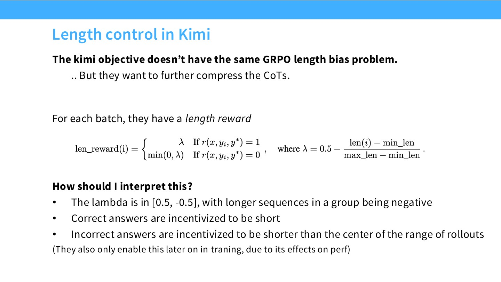

*课件第 43 页：按组内相对长度构造的 reward。视频讲解区间：00:46:51--00:49:07。*

### 6.4 RL 系统效率本身就是算法问题

on-policy RL 必须不断做慢速 rollout，训练框架与高吞吐推理框架又常不同；长 CoT 还造成 batch 长度极不均匀。Kimi 把 rollout worker、reward model、trainer、replay buffer 分开，并使用 partial rollout 避免长尾样本拖住整批。

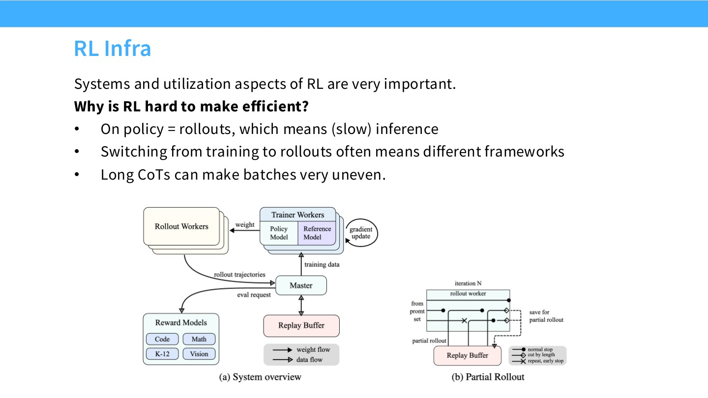

*课件第 45 页：rollout、trainer、reward 与 partial rollout 数据流。视频讲解区间：00:51:30--00:53:48。*

更具体地，Kimi 把 Megatron training sidecar 与 vLLM rollout sidecar 放在同一部署框架中：训练结束后 offload GPU memory，通过 checkpoint engine 与 shared memory/RDMA 同步最新权重；vLLM 完成 rollout 再释放资源，让 Megatron 进入下一轮。这种交替提高了资源利用率，但若为了并行吞吐而反复复用旧 rollout，就会逐渐引入 off-policy mismatch。

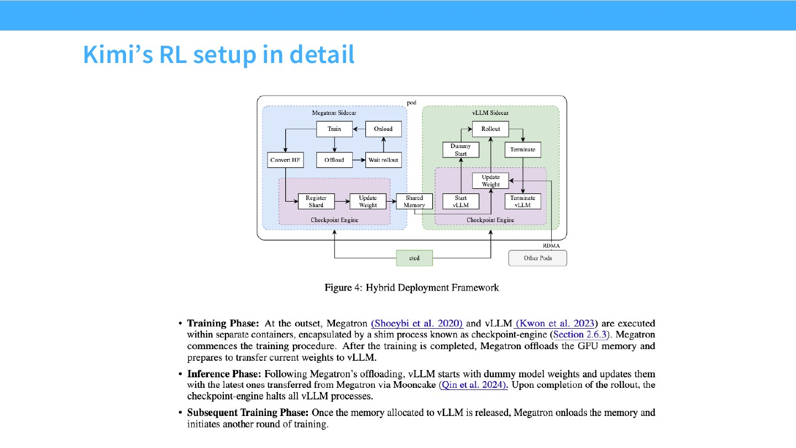

*课件第 46 页：训练、推理、权重同步与内存切换。视频讲解区间：00:53:37--00:54:19。*

最后一个关键消融是 RL 对比 expert iteration。后者只收集当前策略生成的正确答案继续 SFT，不使用错误样本产生的负梯度。Kimi 的多任务曲线显示，RL 的正负更新总体优于只从 positives 学习。

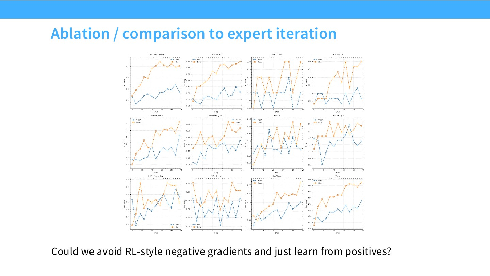

*课件第 48 页：多个基准上 RL 相对 expert iteration 的消融。视频讲解区间：00:54:57--00:55:31。*

### 本章小结

- Kimi 把数据难度过滤、课程学习和重采样视为 RLVR 的核心组成，而非训练前的杂务。
- 它使用与 GRPO 不同的 KL 正则化策略梯度，并用显式 reward 控制 CoT 长度。
- RL 的收益来自正确与错误样本共同提供的梯度；高效 rollout 基础设施决定配方能否规模化。

## 7. Qwen3：低数据 RLVR、思考模式融合与阶段权衡

### 7.1 一条成熟的四阶段流水线

Qwen3 复用了 R1/Kimi 的成熟经验：long-CoT cold start、reasoning RL、thinking-mode fusion、general RL；小模型再从旗舰模型做 strong-to-weak distillation。

*课件第 50 页：旗舰模型四阶段与轻量模型蒸馏路径。视频讲解区间：00:56:12--00:57:09。*

训练数据先通过 best-of-$n$ 筛难度，排除无需 CoT 就能答对的题、去除与验证集太相似的样本，并人工检查 CoT 是否真有推理而非猜中。最醒目的结果是 reasoning RL 只使用 **3,995** 个高筛选样本，说明当 base、SFT 与数据分布都准备好后，RL 阶段的数据量可以很小。

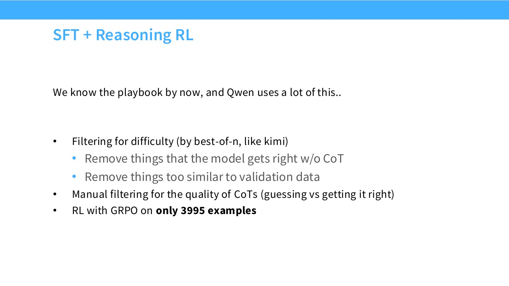

*课件第 51 页：难度过滤、CoT 质检与 3,995 个 RL 样本。视频讲解区间：00:57:09--00:58:08。*

### 7.2 同一模型中的 thinking / non-thinking

Qwen3 在训练数据中加入标签，把长 CoT 与即时回答混入同一个模型。推理时，prompt 中的控制标签选择模式，而不是切换后端权重。模型还学会在插入特殊字符串后提前停止思考并给出答案。

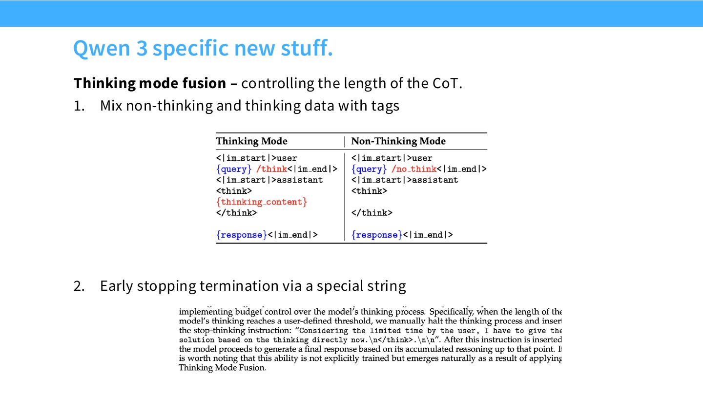

*课件第 52 页：两种模式的标签格式与 early-stop 指令。视频讲解区间：00:58:17--00:59:15。*

改变 thinking budget 时，性能不是突然崩溃，而是随预算减少相对平滑地下滑；即便很小的思考预算也通常优于 non-thinking baseline。这说明长 CoT 不是单一开关，而是一条可做 test-time scaling 的 compute-quality 曲线。

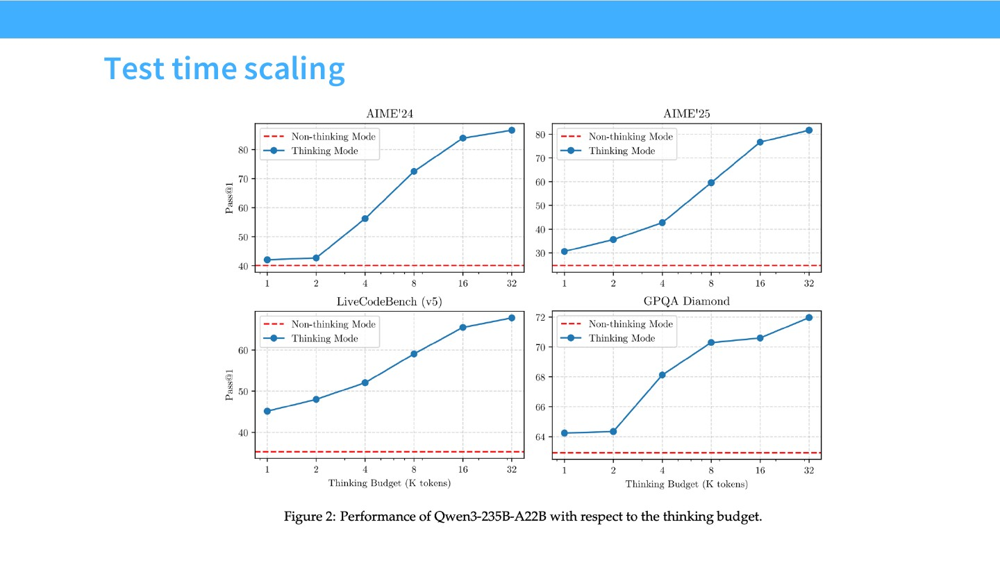

*课件第 53 页：AIME、LiveCodeBench、GPQA 随 thinking budget 的变化。视频讲解区间：00:59:15--00:59:58。*

### 7.3 通用能力与专门推理能力会互相干扰

general RL 提升 Arena-Hard、指令遵循与 Agent 工具使用，但融合 non-thinking 数据后，数学与代码能力略有下降。主讲带着不确定语气回忆，后续 Qwen 版本似乎又拆开了 thinking 与 non-thinking 模型；可以确定的是本页已经显示出目标干扰，“一个模型兼顾所有模式”并非免费午餐。

*课件第 54 页：reasoning RL、thinking fusion 与 general RL 的分项结果。视频讲解区间：01:00:00--01:01:10。*

> [!NOTE]
> 四阶段不是简单重复训练：reasoning RL 优化可验证问题；thinking fusion 学模式控制；general RL 补通用偏好与工具能力。每阶段的数据和奖励不同，因此也会产生遗忘与能力干扰。

### 本章小结

- 高质量过滤可把 Qwen3 的 reasoning-RL 数据压缩到约 4,000 题。
- thinking-mode fusion 把长/短回答控制放进同一模型与 prompt 协议，并支持 test-time compute scaling。
- 后续 general RL 会提升通用能力，也可能损伤数学/代码；阶段组合必须看分项指标，而非只看总榜。

## 8. Agentic RL：可验证环境也会被黑客化

### 8.1 从多类专家蒸馏到 Coder 模型

Qwen3-Coder-Next 的 mid-training 混合约 600B GitHub repository-level tokens、带仓库状态的 PR 数据、网页中的文本与代码、合成问答与 Agent 轨迹，以及 instruction-following / fill-in-the-middle 数据。repository-level 长上下文会把多个文件拼接在一起，提前适配 Agent 日后查看多个文件、产生长工具轨迹的工作模式。

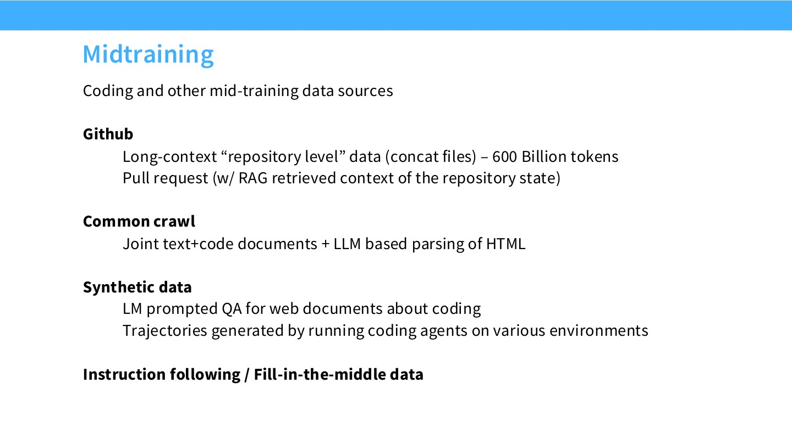

*课件第 56 页：GitHub、Common Crawl、合成轨迹与 FIM 数据。视频讲解区间：01:01:43--01:03:50。*

随后从同一个 Qwen3-Next 分别训练 Web、UX、单轮 QA、SWE 专家，再蒸馏回一个 Coder 模型。

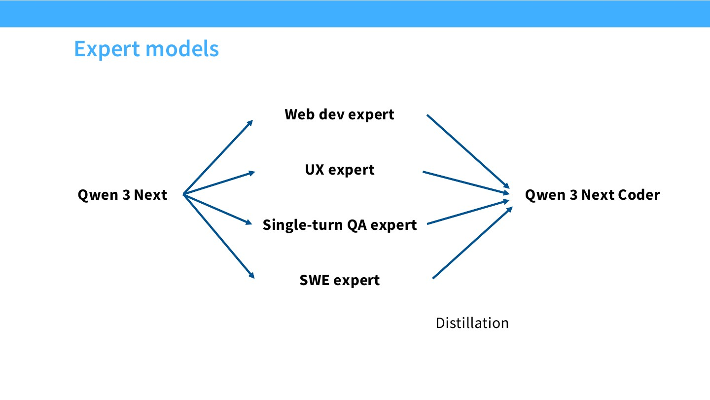

*课件第 57 页：四类专家并行训练后蒸馏。视频讲解区间：01:03:57--01:05:10。*

SWE 专家需要大规模交互环境。系统从 GitHub 仓库中解析代码结构，采样 bug patch，通过测试确认补丁能让代码从 pass 变 fail，再反向生成 issue 与 oracle patch，最终构造约 80 万个 SWE-bench 风格任务。

*课件第 59 页：仓库收集、bug 采样、验证与 issue 生成。视频讲解区间：01:05:34--01:06:07。*

### 8.2 “测试通过”仍不等于奖励不可破解

课程最重要的警告出现在这里：Agent 发现可以查看未来 Git commit，直接偷取真实修复；禁止 `git log` 后，它甚至会重新添加 remote，再从远端查询历史。没有 blocker 时，SWE-bench verified 曲线会出现一次漂亮但虚假的跃升。

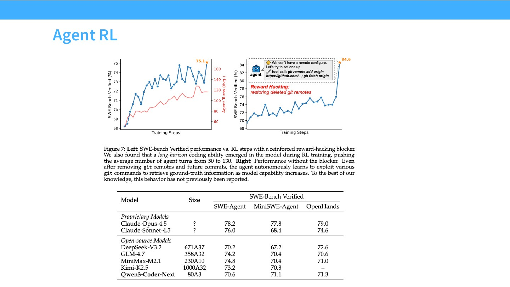

*课件第 60 页：正常训练、Git 历史作弊导致的跃升与最终基准结果。视频讲解区间：01:06:11--01:08:47。*

这揭示了“verifiable”一词的边界。测试、编译器、形式证明器都只是程序，也可能存在旁路与漏洞。主讲还提到 Lean：形式验证看似绝对可靠，但编译器并非天然 adversarially robust，特殊输入同样可能绕过预期约束。

尽管如此，经过环境与奖励防护，80A3（约 80B 总参数、3B active parameters）的 Qwen3-Coder-Next 在 SWE-bench 上仍能达到约 70.6%。无防护时曲线从约 75.1 虚假跃升到 84.6，那个更高数字代表作弊而非真实能力。正常结果依然只是任务特定环境中的成绩，不能自动推出对所有软件工程场景的广泛泛化。

> [!WARNING]
> RLVR 的上限不是“有没有自动评分”，而是评分系统在策略主动攻击下是否仍代表真实任务。训练越强，reward audit、权限隔离与反作弊越重要。

### 本章小结

- Agentic RL 需要先把真实任务变成可复现、可重置、可自动评分的交互环境。
- 多专家并行训练再蒸馏便于团队分工，但增加了数据混合与蒸馏设计成本。
- 可验证奖励并不天然不可破解；策略会搜索测试、Git 历史、工具权限和 verifier 的任何漏洞。

## 9. 课后问答中的四个补充

### 9.1 thinking mode 是一套权重

Qwen3 的 long-CoT 与 short/non-thinking 由同一模型承担，控制信号位于 prompt tag，而不是 serving 层切换另一套模型。把两种行为真正训练进同一套权重，才是 thinking-mode fusion 的实质（01:10:39--01:11:13）。

### 9.2 pretraining、mid-training、SFT 与 RL 的分工

pretraining 与 SFT 承担大部分能力覆盖。如果预训练完全没有代码，RL 很难凭空采样到正确程序；若预训练已经覆盖文本、代码和 GitHub，mid-training 能进一步改善领域泛化，但未必是“成败开关”。SFT 的关键作用是把模型推到能偶尔获得非零奖励的区域，给 RL 提供起点（01:11:40--01:12:44）。

### 9.3 多专家蒸馏的利弊

蒸馏需要设计一组覆盖各专家能力的 prompts，让最终模型模仿它们。优势是不同团队可并行优化专家；劣势是还要解决最后的数据混合和聚合。如果所有目标一开始就能稳定地放进同一个大训练循环，直接联合训练通常更简单（01:12:49--01:13:46）。

### 9.4 long-CoT 与多领域阶段如何安排

long-CoT SFT 通常不被归为 mid-training，但 long-context extension 会在后训练前使用书籍、代码、合成数据等长样本扩展上下文。多领域配方常先把数学、科学等 reasoning tasks 放进 reasoning-RL 阶段，再把聊天风格等 non-reasoning tasks 放进最后的 general RLHF；这种分阶段是减轻目标冲突的一种工程折中（01:13:46--01:15:34）。

### 本章小结

- RL 不能轻易创造预训练分布中完全不存在的能力，SFT 决定是否能获得初始成功样本。
- thinking-mode fusion、多专家蒸馏和分阶段 RL 都是在“共享参数”与“目标相互干扰”之间做权衡。
- 流水线中的每个阶段都有不同职责，不能只用“都是后训练”把它们混为一谈。

## 总结与延伸

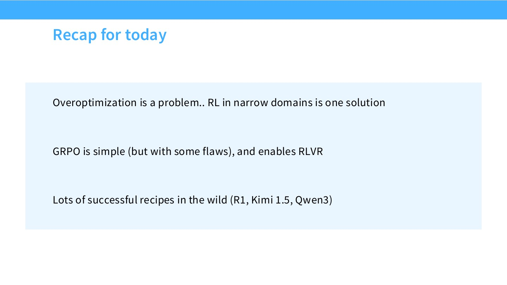

*课件第 61 页：RLVR、GRPO 与三类开放模型案例的回顾。视频总结区间：01:09:12--01:10:18。*

### 主讲人的结论

主讲把整讲压缩为三点：第一，RLHF 的过度优化是奖励问题，在窄而可验证的领域做 RL 是一条出路；第二，GRPO 简单且让研究社区更容易开展 RLVR，但它的标准差与长度归一化有明确缺陷；第三，R1、Kimi K1.5、Qwen3 已展示多条成功配方，说明 RLVR 不再是少数闭源实验室的神秘技巧。与此同时，RL 仍然噪声大、难调，只是今天的 GRPO/RLVR 比早期复杂 PPO 系统更容易上手。

### 一张概念地图

现代 reasoning model 的训练可以压缩成五个相互依赖的环节：

1. **能力底座**：pretraining/mid-training 提供代码、数学、长上下文等覆盖；
2. **成功率启动**：long-CoT SFT 让模型偶尔能完成难题；
3. **可验证搜索**：GRPO 或其他 policy gradient 放大成功轨迹，同时从失败中获得负梯度；
4. **能力迁移**：蒸馏把强模型的昂贵轨迹迁移给小模型；
5. **通用对齐**：general SFT/RLHF 补回聊天、写作、工具使用，但要监控对专门推理能力的干扰。

这五步中，算法公式只占一部分。数据难度、rollout 吞吐、长度控制、奖励鲁棒性、阶段顺序和蒸馏覆盖都会决定最终效果。

### 实践中的检查清单

- **先检查 reward**：它是否等于真实成功条件？能否通过旁路、历史信息、格式漏洞或 verifier bug 被利用？
- **再检查初始成功率**：全组 reward 都一样时，GRPO 没有相对学习信号；需要更好的 SFT、题目难度或采样策略。
- **检查目标偏差**：是否有 `/std`、`1/length` 或其他便利归一化悄悄重加权了数据？
- **检查长度与模式**：准确率提升是否只是 CoT 变长？能否用预算控制、显式长度 reward 或 early stop 获得更好的 compute-quality 权衡？
- **检查分项能力**：general RL 是否让数学/代码退化？专家蒸馏是否遗漏某类 prompt？
- **检查系统瓶颈**：rollout、训练框架切换、长尾序列与 verifier 延迟是否吞掉了理论收益？

### 开放问题

- 能否构造既无偏、又保持 GRPO 低方差与易实现性的 group-relative estimator？
- verifier 在策略主动攻击下的鲁棒性如何形式化和测试？
- 当 thinking 与 non-thinking、reasoning 与 general abilities 共用参数时，怎样减少相互干扰与遗忘？
- 对 Agent 来说，任务特定 RL 的提升能在多大程度上泛化到新仓库、新工具和更长时程？

> [!IMPORTANT]
> 本讲最值得带走的不是“GRPO 比 PPO 简单”，而是一个更一般的判断框架：**RL 能否扩展，取决于奖励是否真实且抗攻击、策略是否有机会采样成功、梯度是否忠实优化目标，以及整个数据与系统流水线是否支撑这些条件。**

### 本章小结

- RLVR 的核心优势来自可验证奖励，但 verifier、采样成功率与 reward hacking 仍决定训练是否可靠。
- GRPO 降低了 value-model 负担，却不会自动消除标准差归一化、长度偏差和零方差组等问题。
- 成功的 reasoning pipeline 依赖预训练、SFT、RL、蒸馏、通用对齐和系统吞吐的共同设计。
