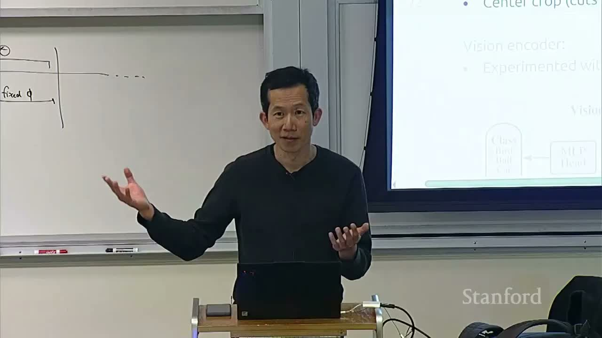
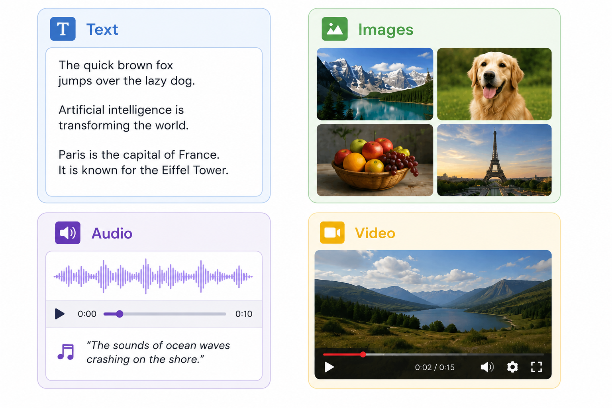
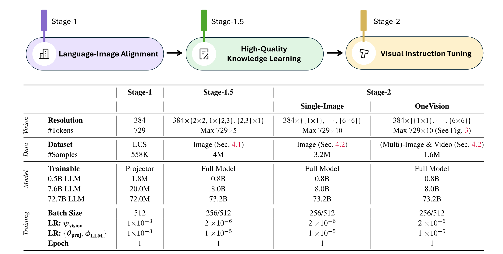
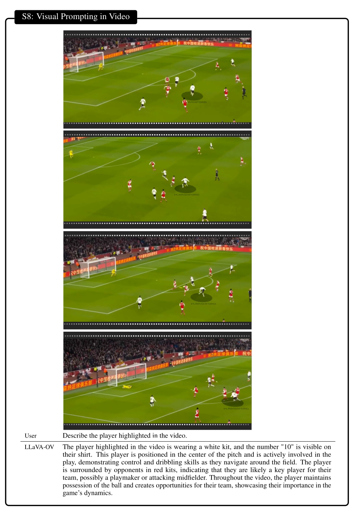

# Stanford CS336 2026 Lecture 17：多模态模型——从 CLIP 到原生 Omni Model

> **课程**：Stanford CS336 — Language Modeling from Scratch（Spring 2026）  
> **视频标题**：Lecture 17: Alignment - Multimodality  
> **主讲人**：Percy Liang  
> **频道**：Stanford Online  
> **视频时长**：01:17:39  
> **视频链接**：[YouTube](https://www.youtube.com/watch?v=26FtD08ZpOU)  
> **整理范围**：完整课程；人工英文字幕、1080p 视频与官方 `lecture_17.py` 课件源交叉核对  
> **图示说明**：正文优先采用官方课件原图以保证公式和标注清晰；每张图下方均给出它在视频中的对应字幕讲解区间。

这节课回答一个表面朴素、实际决定了现代多模态系统形态的问题：Transformer 的接口是 token，而世界由文字、图像、音频和视频共同构成，怎样把这些非文本信息变成 Transformer 可以处理的 token？反过来，怎样让模型不只“看懂”，还可以生成图像、音频或视频？

讲座的主线可压缩成三步：

1. 用 CLIP / SigLIP 学到带语义的视觉表示；
2. 用 projector / adapter 把视觉表示接到预训练语言模型上；
3. 在高分辨率、视频、长上下文和生成任务中，继续解决 token 数、时空位置、数据配比与信息损失。

## 1. 为什么多模态首先是一个“token 接口”问题

### 1.1 从文本模型到 omni model

语言模型已经能把任意文本映射为另一段文本：自然语言、代码、诗歌，甚至 DNA 序列都可以被写成一维 token 流。但真实世界还有图像、音频和视频。讲者给出的北极星是 **omni model**：输入可以是任意模态组合，输出也可以是任意模态组合。

*图 1：多模态输入的直观例子。官方课件原图；视频对应讲解区间：00:00:57--00:01:39。*

这里要区分两个方向：

- **理解（understanding）**：图像、音频或视频进入模型，模型输出文字回答；
- **生成（generation）**：模型直接输出图像、音频或视频。

本讲绝大部分内容处理第一类问题，最后才讨论统一生成。

### 1.2 为什么不能把像素直接当 token

Transformer 并不要求 token 必须是离散整数；连续向量也可以作为输入 token。真正重要的是，一个 token 应该承载某种相对稳定的语义单元。文本中的子词多少具有语义，而孤立像素几乎没有。于是，多模态建模的第一道门槛不是“再堆一个 Transformer”，而是找到非文本模态的 tokenizer / encoder：

$$
x_{\text{raw}} \xrightarrow{\;E\;} z_1,z_2,\ldots,z_m \xrightarrow{\;\text{Transformer}\;} y
$$

- $x_{\text{raw}}$：原始图像、音频或视频；
- $E$：模态编码器或 tokenizer；
- $z_i$：离散或连续的多模态 token；
- $m$：该样本产生的 token 数量；
- $y$：模型生成的输出。

> [!IMPORTANT]
> 多模态模型的基础问题不是“Transformer 能否处理图像”，而是“怎样把图像压缩成既保留任务所需信息、又能被 Transformer 高效消费的 token”。

### 1.3 理解与生成要求不同的信息粒度

如果任务只是判断“这是一只狗”，编码器保留高级语义即可；如果任务是 OCR，需要保留很小的字符笔画；如果任务是重新生成图像，还需要颜色、纹理和局部高频细节。这解释了为什么一个适合分类的 CLIP 表示可以很好地启动 VLM，却不必然适合图像生成。

> [!WARNING]
> “同一种模态”不意味着“同一个编码器适合所有任务”。理解强调语义不变性，生成强调可逆性和细节，两者的最优压缩目标并不相同。

### 本章小结

- 目标是任意模态输入、任意模态输出的 omni model。
- Transformer 的统一接口是 token；token 可以离散，也可以连续。
- 非文本编码必须在语义、细节、序列长度和可计算性之间取舍。
- 本讲先解决“如何输入”，再讨论“如何输出”。

## 2. CLIP：用自然语言监督学习视觉语义空间

### 2.1 动机：摆脱昂贵的封闭类别标注

传统视觉模型依赖 ImageNet 一类人工标注数据，而互联网上存在数量更大的图像—文本对。CLIP（Contrastive Language–Image Pre-training）的关键洞见是：文本虽然嘈杂，却天然描述图像的高层语义，可以用来训练一个开放词汇视觉表示。

*图 2：CLIP 的完整训练和零样本推理流程。官方课件原图；视频对应讲解区间：00:05:53--00:08:09。*

### 2.2 对称对比学习目标

取一个包含 $N$ 个配对样本的 batch。图像编码器产生 $I_1,\ldots,I_N$，文本编码器产生 $T_1,\ldots,T_N$。正确配对位于相似度矩阵的对角线；训练同时要求“每张图找对文本”和“每段文本找对图像”。

先归一化表示并计算带温度的相似度：

$$
s_{ij}=\exp(\tau)\,\frac{I_i}{\lVert I_i\rVert_2}^{\!\top}\frac{T_j}{\lVert T_j\rVert_2}
$$

- $I_i$：第 $i$ 张图像的编码；
- $T_j$：第 $j$ 段文本的编码；
- $s_{ij}$：图像 $i$ 与文本 $j$ 的缩放余弦相似度；
- $\tau$：可学习的 log-temperature；
- $N$：batch 中的配对样本数。

对称损失为：

$$
\mathcal{L}_{\text{CLIP}}
=\frac{1}{2N}\sum_{i=1}^{N}
\left[
-\log\frac{e^{s_{ii}}}{\sum_{j=1}^{N}e^{s_{ij}}}
-\log\frac{e^{s_{ii}}}{\sum_{j=1}^{N}e^{s_{ji}}}
\right]
$$

- 第一项：固定图像 $i$，在所有文本中识别 $T_i$；
- 第二项：固定文本 $i$，在所有图像中识别 $I_i$；
- $\mathcal{L}_{\text{CLIP}}$：对称图文对比损失；
- $i,j$：batch 内样本索引；
- $s_{ii}$：正确图文对的 logit；
- $s_{ij},s_{ji}$：图像到文本、文本到图像方向的候选 logit；
- $N$：batch 中的配对样本数；
- 每个 batch 实际形成 $2N$ 个多分类问题。

*图 3：归一化、相似度矩阵和双向交叉熵的伪代码。官方课件原图；视频对应讲解区间：00:07:30--00:08:09。*

> [!NOTE]
> batch 内其他样本自动成为负例。这个设计非常简洁，但也意味着损失的质量和计算都与 batch 紧密耦合。

### 2.3 数据、预处理与视觉编码器

CLIP 使用约 50 万个查询词检索候选，每个查询最多约收集 2 万个图文对；经过过滤后，最终训练集约 4 亿对。原始数据未公开。OpenCLIP 后来以 LAION-5B 等开放数据复现和扩展这一范式；其中一个值得注意的闭环是：数据过滤本身也使用 CLIP。这里不能把“50 万 × 2 万”直接当成训练集大小，它描述的是检索候选规模。

图片尺寸任意，而神经网络希望固定形状。CLIP 的实用做法是：

1. 用 bicubic interpolation 缩放，使短边达到目标尺寸；
2. 中心裁剪成 $336\times336$；
3. 交给 ResNet 或 Vision Transformer。

这种策略对中心物体分类很有效，却会裁掉边缘信息，并降低小字 OCR 等细粒度任务的表现。

*图 4：ViT 的 patch 化与 Transformer 编码。官方课件原图；视频对应讲解区间：00:12:36--00:15:27。*

ViT 将图像切成固定 patch，把每个 patch 展平并投影成 token，再加入位置编码。CLIP 的代表性强模型是 ViT-L/14@336px：`L` 表示 Large，`/14` 表示 patch 边长为 14 像素，后期使用 $336\times336$ 分辨率。因此空间网格是 $24\times24$，共 576 个 patch token，而不是“整张图只有 $14\times14$ 个 patch”。视觉侧输出序列后，本讲用 attention pooling 解释全局汇聚：以全局平均激活作为 query，再对各位置的 key/value 做一次注意力。

文本侧是约 6300 万参数、12 层的 GPT-2 风格 Transformer。输入加入 `[BOS]` 和 `[EOS]`，最高层 `[EOS]` 激活作为整句表示。

### 2.4 零样本分类为什么成立

对每个类别写出文本模板，例如 `a photo of a dog`，用文本编码器生成类别向量；图像向量与所有类别文本做相似度比较，最高者就是预测。CLIP 在 ImageNet 上的 headline result 是：零样本 CLIP 超过了用 120 万张 ImageNet 标注图像训练的 ResNet-50。

课堂问答进一步解释了为什么使用文本而非只做图像增强：SimCLR 一类方法可以学到“裁剪、旋转后仍是同一图像”，但很难仅靠增强把不同品种的狗归入同一语义概念。文本为视觉表示提供了更高层的语义等价关系。

### 2.5 对比目标为何比生成标题更高效

CLIP 论文还比较了“由图像预测标题”的目标。若评价目标是 ImageNet 零样本分类，精确建模标题 token 序列并非必要；bag-of-words 对比目标的样本效率反而更高。

*图 5：同等图像数量下，对比学习的零样本 ImageNet 准确率更高。官方课件原图；视频对应讲解区间：00:20:28--00:21:24。*

> [!IMPORTANT]
> CLIP 学到的是“由文本监督定义的图像语义”，并不是一个无损视觉表示。它对分类极强，也因此成为后续 VLM 的稳定起点；但它对位置、文字和细微纹理的保留有限。

### 本章小结

- CLIP 把图文匹配写成 batch 内双向多分类。
- 语言为视觉表示提供开放词汇、高层语义监督。
- ViT patch token、固定分辨率和中心裁剪都带有分类任务偏好。
- 大 batch 和全 batch softmax 是 CLIP 的系统瓶颈，也引出 SigLIP。

### 拓展阅读

- [CLIP: Learning Transferable Visual Models From Natural Language Supervision](https://arxiv.org/abs/2103.00020)
- [OpenCLIP / LAION-5B](https://arxiv.org/abs/2212.07143)

## 3. SigLIP：把全局多分类改成逐对二分类

### 3.1 目标函数的变化

CLIP 问：“对于这张图，batch 中哪段文本是正确的？”SigLIP（Sigmoid Loss for Language Image Pre-training）改问：“这一对图文是否对齐？”对角线标签为 $+1$，非对角线为 $-1$。

$$
z_{ij}=\exp(\tau)\,\hat I_i^\top\hat T_j+b
$$

$$
y_{ij}=\begin{cases}
+1,&i=j\\
-1,&i\neq j
\end{cases}
\qquad
\mathcal{L}_{\text{SigLIP}}
=-\frac{1}{N}\sum_{i=1}^{N}\sum_{j=1}^{N}\log\sigma(y_{ij}z_{ij})
$$

- $\hat I_i,\hat T_j$：L2 归一化后的图像和文本向量；
- $z_{ij}$：带温度和偏置的匹配 logit；
- $b$：可学习偏置；
- $y_{ij}$：图文对齐标签；
- $\sigma$：sigmoid 函数。

*图 6：SigLIP 的逐对二分类损失。官方课件原图；视频对应讲解区间：00:22:50--00:24:02。*

课堂提问涉及 hard-negative sampling。讲者的回答很克制：初始论文仍直接使用同一个图文矩阵，没有引入复杂负例采样；更一般的对比学习确实可能需要平衡正负例或选择更紧的负例，但这不是该版本的核心。

### 3.2 为什么更容易并行

SigLIP 不需要把整个 batch 解释成一次不可分割的 softmax。每个设备先计算本地图文块，再轮转文本表示，逐块补齐非对角负例，最后聚合损失。这类似 ring exchange：通信仍然存在，但每一块损失可以独立累加。

*图 7：三个设备逐轮覆盖相似度矩阵的所有块。官方课件原图；视频对应讲解区间：00:26:24--00:27:38。*

### 3.3 数据与训练效率

SigLIP 使用 Google WebLI 的十亿量级图文对：网页抓取、OCR 提取图中文字，只保留最高质量的 10%，并覆盖 100 种语言。课中对比的训练开销是：

- CLIP：256 个 TPUv3，约 10 天；
- SigLIP：32 个 TPUv4，约 5 天。

讲者特别提醒，不要简单把差异归因于 TPUv4 单卡更快；该规模下 v4 的单卡 FLOP/s 并不更高，优势更多来自拓扑、并行方式与实现。

SigLIP 还把 batch size 与损失定义解耦。小于 16K batch 时，它显著优于 CLIP；batch 可以扩大到百万量级，但收益很快饱和，约 32K 已接近 critical batch size。

> [!IMPORTANT]
> SigLIP 的价值不只是换一个损失符号，而是把“必须全 batch 归一化的竞争”改成“可分块累加的配对判断”，从而让统计目标和系统实现都更灵活。

### 本章小结

- CLIP 是全 batch 多分类，SigLIP 是图文对逐对二分类。
- sigmoid loss 可以分块计算并通过轮转表示覆盖跨设备负例。
- 损失不再由 batch size 定义，小 batch 表现更稳定。
- CLIP / SigLIP 都得到带语义的连续视觉 token，为 VLM 提供视觉入口。

### 拓展阅读

- [Sigmoid Loss for Language Image Pre-Training](https://arxiv.org/abs/2303.15343)
- [WebLI: Learning a Common Language for Images and Text](https://arxiv.org/abs/2209.06794)

## 4. LLaVA：用一个投影层把视觉编码器接到语言模型

### 4.1 三块标准模板

LLaVA（Large Language and Vision Assistant）展示了一个极简但影响深远的 VLM 模板：

1. **视觉编码器**：CLIP ViT-L/14；
2. **projector**：线性映射 $W$；
3. **语言模型**：基于 LLaMA、用 ShareGPT 对话微调的 Vicuna。

核心不是从零训练所有组件，而是把已有视觉编码器和已有 LLM “缝”起来。若 CLIP 输出视觉特征 $Z_v$，则：

$$
H_v=WZ_v
$$

- $Z_v$：CLIP 输出的视觉 token；
- $W$：可学习线性投影；
- $H_v$：与语言模型词嵌入同维度的视觉 token。

视觉 token 与用户文本 token 拼接后，整个序列直接进入标准自回归语言模型。

这里所说的“视觉 token”是与 LLM 输入维度相容的**连续 embedding**，不是被替换成了某个离散词表 ID。

*图 8：LLaVA 标准三块式架构。官方课件原图；视频对应讲解区间：00:32:06--00:33:24。*

### 4.2 训练数据：用 GPT-4 合成视觉指令

MS COCO 已有人类标注的 caption 与 bounding box。LLaVA 不直接把它们当聊天数据，而是把 caption / 检测到的物体交给 GPT-4，让 GPT-4 生成三类监督：

- 简单问答；
- 详细描述；
- 复杂推理对话。

生成文本再与原图配对，得到约 15.8 万条视觉指令样本。

*图 9：从 caption、bounding box 到问答和复杂推理样本。官方课件原图；视频对应讲解区间：00:30:42--00:32:03。*

> [!NOTE]
> 这是现代多模态数据工程的早期范式：已有标注提供可验证的视觉锚点，强语言模型负责把锚点改写成更丰富的交互任务。

### 4.3 两阶段训练

**阶段 1：视觉—语言对齐。** 冻结视觉编码器和 LLM，只训练 $W$。随机投影产生的向量不在 LLM 熟悉的嵌入流形上；这一阶段让视觉 token 变成 LLM 可以利用的“软词元”。

**阶段 2：视觉指令微调。** 仍冻结视觉编码器，训练 $W$ 与 LLM，使模型学会依据图像进行描述、对话与推理。

> [!WARNING]
> 这里的“alignment”指表示空间和条件生成接口的对齐，不等同于价值观或安全意义上的 alignment。

### 4.4 能力来自哪里：极端熨衣的例子

论文示例中，一位人物在汽车后部熨衣服。LLaVA 能回答“异常之处是通常不会在车上熨衣”，并且即使问题没有明确要求寻找异常，也能主动指出。这说明视觉编码器提供场景语义，语言模型提供常识与回答能力，投影层让二者可组合。

*图 10：LLaVA 对“在汽车上熨衣”这一异常场景的解释。官方课件原图；视频对应讲解区间：00:34:37--00:35:20。*

> [!WARNING]
> 这张完整对比图同时暴露了视觉幻觉：LLaVA 的后续回答加入了“站在车顶”“moving car”等图中并不成立的细节。它证明了视觉常识推理可以出现，也证明能力提升不等于幻觉消失。

### 本章小结

- 标准 VLM 可分为视觉编码器、projector、语言模型三块。
- 线性 $W$ 已足以把 CLIP token 接入预训练 LLM。
- LLaVA 用 GPT-4 把 COCO 标注扩展为 15.8 万视觉指令样本。
- 先只训 projector，再训 projector + LLM，是“接口对齐 → 任务适配”的清晰分工。

### 拓展阅读

- [Visual Instruction Tuning (LLaVA)](https://arxiv.org/abs/2304.08485)
- [Vicuna](https://www.lmsys.org/blog/2023-03-30-vicuna/)

## 5. LLaVA-OneVision：高分辨率、多图和视频如何共享一个 token 预算

### 5.1 架构升级，但模板不变

LLaVA-OneVision 仍遵循“视觉编码器 + projector + LLM”：

- 视觉编码器换为 SigLIP，并使用最后一层前后的 grid feature；
- 文本解码器换为 Qwen2-72B；
- projector 从线性层换成两层 MLP；
- 输入扩展到单图、多图和视频。

真正困难的部分不在组件名字，而是如何保留分辨率，又不让视觉 token 挤爆上下文。

### 5.2 AnyRes：把任意分辨率变成可控 patch 序列

CLIP 的 $336\times336$ resize + center crop 会让 OCR 和细节理解损失严重。AnyRes 的处理流程是：

1. 按视觉编码器的基准分辨率，把原图切成 $a\times b$ 个 tile；
2. 每个 tile 独立编码；
3. 将 grid feature 按空间顺序拼接；
4. 另保留一张低分辨率全局图，提供整体布局；
5. 若 token 太多，用 bilinear interpolation 压缩 feature grid。

*图 11：AnyRes 同时保留局部细节和全局缩略图。官方课件原图；视频对应讲解区间：00:37:35--00:39:13。*

> [!IMPORTANT]
> AnyRes 的本质不是“让所有图都变大”，而是让分辨率成为动态资源：需要细节的图多分配 token，超预算时再在 feature 空间压缩。

### 5.3 单图、多图、视频的不同分配策略

OneVision 希望三种输入最后产生大致可比的序列长度：

- **单图**：可以给一张图更高分辨率和更多 tile；
- **多图**：每张图使用较低基础分辨率，避免图片数量线性放大上下文；
- **视频**：每帧分辨率最低，用更多帧换时间覆盖。

*图 12：三种输入在共同最大 token 预算下的分配。官方课件原图；视频对应讲解区间：00:39:13--00:40:45。*

这体现了一个通用原则：图像和视频的信息密度低于文本，视频相邻帧又高度冗余，不能把每个像素、每一帧等权送入 LLM。

### 5.4 数据和课程学习：quality over quantity、easy to hard

OneVision 的大量工作放在数据策展，而非发明新主干。单图集合约 320 万条：General 36.1%、Doc/Chart/Screen 20.6%、Math/Reasoning 20.1%、General OCR 8.9%、Language 14.3%。OneVision 集合约 160 万条：多图 43.0%、单图 31.2%、视频 25.9%。合成、任务专用数据占据重要位置。

训练按难度逐步推进，正式阶段名是 Stage 1、Stage 1.5、Stage 2：

1. **Stage 1 — Language-Image Alignment**：558K 样本，只训练 projector；
2. **Stage 1.5 — High-Quality Knowledge Learning**：4M 单图样本，训练完整模型；
3. **Stage 2 — Visual Instruction Tuning**：320 万单图 + 160 万 OneVision 多图/视频样本，训练完整模型。

*图 13：从对齐到高质量知识，再到视觉指令微调。官方课件原图；视频对应讲解区间：00:42:36--00:43:25。*

### 5.5 跨模态迁移不是偶然，而是共享能力的结果

OneVision 论文展示了几类有代表性的迁移：

- 单图图表和示意图训练，迁移到多图比较；
- 单图 OCR + 多图关系推理，迁移到 GUI agent；
- 单图中的圆圈等 visual prompt，迁移到视频目标指代。

*图 14：从单图图表理解迁移到多图推理。官方课件原图；视频对应讲解区间：00:43:30--00:44:09。*

> [!WARNING]
> 图中模型展示了跨图读取与组合能力，但其扇形面积和保险报价算术本身有误；本图只能作为“能力迁移”证据，不能当成正确数学示例。

*图 15：OCR、空间关系和多图能力组合成 GUI 操作能力。官方课件原图；视频对应讲解区间：00:44:09--00:44:36。*

*图 16：在单图中学到的圈选、指示等 visual prompting 能力，被迁移到视频中的目标定位与指代。官方课件原图；视频对应讲解区间：00:44:36--00:45:26。*

共享的语言模型提供任务组合能力，共享视觉 token 接口让不同输入形态进入同一推理空间。因此，训练集里没有逐项覆盖每个跨模态任务，模型仍可能通过能力重组实现迁移。

### 本章小结

- OneVision 沿用 VLM 三块模板，升级重点在分辨率、数据和训练课程。
- AnyRes 用 tile + 全局图保留高分辨率信息，并在超预算时压缩 feature。
- 单图、多图、视频必须采用不同 token 密度。
- 跨模态迁移来自共享视觉接口、语言推理和任务能力的组合。
- 论文同时发布模型权重和训练数据，使这条以数据策展为核心的路线具备可复现基础。

### 拓展阅读

- [LLaVA-OneVision](https://arxiv.org/abs/2408.03326)
- [Improved LLaVA / AnyRes](https://static.hliu.cc/files/llava/improved_llava.pdf)

## 6. Qwen-VL 系列：动态分辨率、时空位置与更深视觉融合

### 6.1 Qwen-VL：cross-attention adapter 与三阶段训练

第一代 Qwen-VL 使用 OpenCLIP ViT-bigG（$14\times14$ patch），用一层 cross-attention adapter 和可学习 query 把视觉序列压成固定 256 个 token，并引入 ``、`<box>`、`<ref>` 等特殊 token，使生成文本可以引用区域和边界框。官方课程源码把 `bigG` 写成了 `bigC`，与 Qwen-VL 论文/官方仓库不符，此处按模型官方名称校正。

*图 17：低质量大规模预训练、多任务高分辨率训练、监督微调。官方课件原图；视频对应讲解区间：00:46:06--00:49:16。*

三阶段分别是：

1. 冻结 LLM，训练视觉编码器与 adapter，使用大规模低质量图文对；
2. 提高分辨率和任务质量，训练全部参数；
3. 用 instruction data，冻结视觉编码器，训练 adapter 与 LLM。

Stage 1 从约 50 亿候选中清洗到 14 亿（28%）；Stage 2 的任务数据包括 Captioning 19.7M、VQA 3.6M、Grounding 3.5M、Referring Grounding 8.7M、Grounded Captioning 8.7M、OCR 24.8M，以及用于维持语言能力的 Pure-text Autoregression 7.8M。Qwen-VL 第一阶段会训练视觉编码器，这是它与始终冻结视觉塔的 LLaVA 的一个重要差别。

### 6.2 Qwen2-VL：原生动态分辨率

Qwen2-VL 使用更大的 6.75 亿参数 ViT。不同图片不再强制映射成同样长度：长文档可以产生 11427 个视觉 token，小公式图只需 8 个，视频也按自身时长产生 token。

*图 18：不同图像和视频产生不同长度的视觉序列。官方课件原图；视频对应讲解区间：00:49:16--00:50:45。*

具体做法：每个 $224\times224$ tile 由 ViT/14 编码，随后每个 $2\times2$ feature group 合并成一个 token。课件和口述记为每个 tile 约 66 个 token；但按纯空间网格计算，$224/14=16$，再经 $2\times2$ merge 应为 $16\times16/4=64$。课程没有解释额外两个 token 的来源，因此实现时应查 Qwen2-VL 官方预处理代码，不能把 66 当作无条件的几何结论。视频采样 2 frame/s，并把视觉 token 上限设为 16384。

### 6.3 MRoPE：位置不再只有一维序号

文本 token 的位置是一维距离，视觉 token 还具有时间、高度和宽度。Qwen2-VL 为每个视觉位置分配三元坐标 $(t,h,w)$，分别计算旋转位置编码，再把不同轴的维度拼接。

*图 19：视频帧和 patch 同时拥有时间、高度、宽度坐标。官方课件原图；视频对应讲解区间：00:51:05--00:52:12。*

直觉上，attention 中两个 token 的相对相位应同时反映“隔了几帧”“上下差多少”“左右差多少”，而不只是它们在 flatten 后的一维下标差。

> [!WARNING]
> 把二维或三维数据 flatten 成序列并不会自动保留几何结构；必须通过位置编码或显式坐标让模型知道哪些 token 在空间和时间上相邻。

### 6.4 Qwen3-VL：四个小改动共同补齐长视频能力

Qwen3-VL 的整体模板没有改变，但若干细节很关键：

- **语言模型**：Qwen3 dense / MoE，最大到 235B-A22B，长上下文 256K；
- **视觉编码器**：SigLIP-2；
- **Interleaved MRoPE**：不再让时间只占低频维、宽高只占另一段频率，而是按 `t,w,h,t,w,h,...` 交错，让每个轴都覆盖高低频；
- **显式视频时间戳**：把 `0.0 seconds` 等写成单独文本 token，而非只隐含在位置编码里；
- **平方根归一化的逐 token loss**：降低超长视频样本对梯度的支配；
- **DeepStack**：把视觉编码器多个层级的表示注入 LLM 多个层，而不是只在输入端塞一次视觉 token。

*图 20：动态视觉 token、显式时间戳和跨层视觉注入。官方课件原图；视频对应讲解区间：00:52:50--00:57:54。*

如果样本 $e$ 含 $L_e$ 个监督 token，课堂对其思想的近似表达可以写成：

$$
\mathcal{L}_e
=\frac{1}{\sqrt{L_e}}\sum_{t=1}^{L_e}\ell_{e,t}
$$

- $L_e$：样本长度；
- $\ell_{e,t}$：第 $t$ 个 token 的损失；
- $1/\sqrt{L_e}$：介于“每 token 等权”和“每样本完全等权”之间的长度校正。

讲者强调论文细节披露有限，因此这里应理解为核心动机，而不是唯一实现公式。

### 6.5 训练课程和结果

Qwen3-VL 预训练分四步：先只训 merger / adapter 做视觉—语言对齐，再训练全部参数，并将上下文从 8K 逐步扩展到 32K 和 256K。各阶段的课程表如下：

| 阶段 | 目标 | 可训练部分 | Token budget | 最大长度 |
|---|---|---|---:|---:|
| S0 | Vision-Language Alignment | merger | 67B | 8,192 |
| S1 | Multimodal Pre-Training | 全部参数 | 约 1T | 8,192 |
| S2 | Long-Context Pre-Training | 全部参数 | 约 1T | 32,768 |
| S3 | Ultra-Long-Context Adaptation | 全部参数 | 100B | 262,144 |

这里的 67B 是预先设定的训练预算，不是模型达到某个自动“对齐阈值”后才停止。post-training 又包含长 CoT SFT、知识蒸馏与 RL。

*图 21：对齐、8K 多模态预训练、32K 长上下文、256K 超长上下文。官方课件原图；视频对应讲解区间：00:57:54--00:58:56。*

*图 22：Qwen3-VL 在 STEM、OCR、grounding、视频和 agent 等任务上的结果；粗体仅代表逐行最佳，并非 Qwen 全面获胜。官方课件原图；视频对应讲解区间：00:58:56--00:59:21。*

课堂问答补充了四个重要边界：

1. 这些 VLM 的多模态主要在**输入侧**，输出仍是文本，不能直接生成图像或视频；
2. 多模态训练的系统开销更高，视频解码和数据加载都可能成为瓶颈；
3. alignment 阶段必须从已预训练的 LLM 出发，并冻结 LLM 后训练 connector；
4. 视觉编码器通常不到 10 亿参数，远小于 LLM，因为它更多处理局部 patch；知识和推理能力主要仍在 LLM。

> [!IMPORTANT]
> 从 LLaVA 到 Qwen3-VL，宏观架构变化不大。性能增长主要来自更好的基础 LLM、更精细的视觉 token 化、时空位置、更长上下文、数据策展和训练课程。

### 本章小结

- Qwen-VL 用 cross-attention adapter 和三阶段训练建立第一代模板。
- Qwen2-VL 让 token 数随分辨率和视频时长动态变化，并引入 MRoPE。
- Qwen3-VL 用交错频率、显式时间戳、长度校正和 DeepStack 改善长视频与深层融合。
- 当前主流 VLM 仍主要是“多模态输入、文本输出”。

### 拓展阅读

- [Qwen2-VL Technical Report](https://arxiv.org/abs/2409.12191)
- [Qwen3-VL Technical Report](https://arxiv.org/abs/2511.21631)

## 7. Chameleon：把图像离散化，统一理解与生成

### 7.1 为什么连续视觉 token 不能直接生成图像

CLIP / SigLIP 路线把图像编码为连续向量，再注入语言模型。这非常适合理解，但普通语言模型只能生成其输出词表中的离散 token，不能直接生成连续视觉网格。常见解决方案是另外接 diffusion head；Chameleon 选择另一条更统一的路：把图像也离散化，然后用同一个自回归模型生成文字 token 和图像 token。

*图 23：文字和图像 token 进入同一个 mixed-modal autoregressive LM。官方课件原图；视频对应讲解区间：01:07:26--01:08:25。*

这样，模型既可以“图像 → 文字”，也可以“文字 → 图像”，还可以生成文字与图像交错的序列。

*图 24：一次回答中交替生成鸟类文字说明和图片。官方课件原图；视频对应讲解区间：01:08:49--01:09:10。*

### 7.2 VQ-VAE：连续特征到离散码本

Chameleon 使用 VQ-VAE 类视觉 tokenizer。编码器先产生连续网格 $z_e(x)$，再把每个位置替换为码本中距离最近的向量：

$$
k^*(x)=\arg\min_{k\in\{1,\ldots,K\}}
\left\lVert z_e(x)-e_k\right\rVert_2^2,
\qquad z_q(x)=e_{k^*(x)}
$$

- $z_e(x)$：编码器输出的连续特征；
- $e_k$：码本中的第 $k$ 个向量；
- $K$：码本大小；
- $k^*$：最近码本项的离散索引；
- $z_q(x)$：量化后的特征。

解码器从 $z_q(x)$ 重建图像，训练目标以重建为主，并加入码本与 commitment 项：

$$
\mathcal{L}_{\text{VQ-VAE}}
=\mathcal{L}_{\text{recon}}+\mathcal{L}_{\text{codebook}}+\beta\mathcal{L}_{\text{commit}}
$$

- $\mathcal{L}_{\text{recon}}$：像素或感知重建误差；
- $\mathcal{L}_{\text{codebook}}$：更新码本向量；
- $\mathcal{L}_{\text{commit}}$：约束 encoder 输出靠近所选码本项；
- $\beta$：commitment loss 权重。

*图 25：连续 latent 经最近邻量化成离散索引，再由 decoder 重建。官方课件原图；视频对应讲解区间：01:09:28--01:10:46。*

Chameleon 将 $512\times512$ 图像编码为 1024 个 token，码本大小为 8192，并重新训练 BPE tokenizer，使文字与图像离散码可以共同出现。

### 7.3 训练规模与多模态稳定性

训练本身变回标准 next-token prediction：

- 阶段 1（约 80%）：2.9T 纯文本 token、1.5T 图文 token、400B 图文交错 token；
- 阶段 2（约 20%）：一半来自阶段 1 分布，一半为高质量数据。

统一接口并没有消除模态差异。文本下一个 token 的熵相对低，图像 token 的熵高；二者混合会导致参数 norm 增长和 logit drift。论文使用 QK normalization 与 z-loss 缓解不稳定。

> [!WARNING]
> “所有东西都叫 token”只是接口统一，不代表统计分布统一。图像 token 的高熵、长序列和局部相关性仍会以优化不稳定的形式重新出现。

### 7.4 为什么这条路线没有成为唯一答案

离散统一建模非常优雅，但量化必然损失细节。小字 OCR 是最直观反例：字符笔画在压缩、量化后可能无法恢复。与此同时，diffusion 在连续空间生成高频细节非常强，因此现代系统更常见的组合是：

- 连续视觉 encoder 负责理解；
- Transformer 负责跨模态推理；
- diffusion model / head 负责生成。

### 本章小结

- Chameleon 把图像映射为离散码，使理解和生成共享自回归接口。
- VQ-VAE 用最近邻码本把连续视觉特征变成可生成的索引。
- 统一 token 仍面临高熵图像 token 带来的优化不稳定。
- 离散化损失细节，因此连续 encoder + diffusion generation 仍是更实用的组合。

### 拓展阅读

- [Chameleon: Mixed-Modal Early-Fusion Foundation Models](https://arxiv.org/abs/2405.09818)
- [Neural Discrete Representation Learning (VQ-VAE)](https://arxiv.org/abs/1711.00937)

## 总结与延伸

### 讲者最后的实质性收束

讲者在结尾把七十多分钟内容压成五点：

1. 前沿模型已被期待具备多模态、原生多模态，乃至 omni 能力；
2. 根本难题始终是怎样编码非文本模态；
3. 理解与生成需要的表示不同：语义压缩与细节可逆性存在张力；
4. 图像和视频的信息密度低于文本，训练时必须平衡 token 与 loss 权重；
5. 当前最可信的组合仍是连续 encoder + Transformer + diffusion generation。

他也明确把最后一点标为对闭源原生多模态模型实现方式的合理推测，而非公开事实。最后的实践建议是：课程没有安排多模态作业，但有兴趣的学生可以亲自训练小型版本，理解 token 化和数据混合的真实代价。

*视频对应讲解区间：01:14:48--01:17:34。*

### 一张表压缩整条技术演化链

| 路线 | 视觉表示 | 接入 / 生成方式 | 解决的主要问题 | 主要代价 |
|---|---|---|---|---|
| CLIP | 连续、全局语义向量 | 图文相似度 | 开放词汇语义学习 | 大 batch、细节不足 |
| SigLIP | 连续、全局语义向量 | 逐对 sigmoid | 更灵活的并行和 batch | 仍主要面向语义编码 |
| LLaVA | 连续 patch token | 线性 projector → LLM | 极简视觉—语言连接 | 固定分辨率、只输出文字 |
| OneVision | 动态高分辨率 token | tile + MLP → LLM | 单图、多图、视频统一 | token 预算与数据策展复杂 |
| Qwen2/3-VL | 动态时空 token | MRoPE、DeepStack → LLM | 长视频、位置、深层融合 | 系统和训练课程复杂 |
| Chameleon | 离散图像 token | 统一自回归生成 | 文字与图像交错生成 | 量化失真、训练不稳定 |

### 进一步的概念压缩

多模态系统可以看作连续做四次预算分配：

1. **信息预算**：哪些像素、帧、声音细节必须保留？
2. **token 预算**：这些信息用多少 token 表示？
3. **模型预算**：能力放在视觉 encoder、adapter、LLM 还是生成 head？
4. **梯度预算**：文本、图片和视频在训练 loss 中各占多大权重？

CLIP 主要解决第 1 项，AnyRes 和动态分辨率解决第 2 项，LLaVA / DeepStack 解决第 3 项，Qwen3-VL 的长度归一化与 Chameleon 的稳定化技巧解决第 4 项。把这些模型只记成论文名称会显得零散；把它们放进四种预算中，就能看出它们在修补同一条流水线的不同瓶颈。

> [!IMPORTANT]
> 多模态模型的性能并不只取决于“视觉 encoder 更强”或“LLM 更大”。表示粒度、位置结构、数据构造、token 密度、loss 权重和生成解码器必须共同匹配任务。

### 实践检查清单

若要从头实现一个小型 VLM，可以依次检查：

1. 任务只需高级语义，还是需要 OCR / grounding 等细节？
2. 固定 resize 是否会裁掉关键内容，是否需要 AnyRes？
3. 图像、多图和视频的最大 token 预算分别是多少？
4. 位置编码是否表达了二维空间和视频时间？
5. connector 只需线性层、MLP，还是需要跨层融合？
6. alignment 阶段冻结了哪些模块，后续何时解冻？
7. 长视频样本是否因 token 多而支配梯度？
8. 如果要生成视觉内容，使用离散视觉 token，还是连接 diffusion head？

### 开放问题

- 能否学习任务自适应的视觉 tokenizer，让 OCR 与分类自动选择不同粒度？
- 能否在不牺牲细节的前提下，进一步压缩长视频冗余？
- 理解 encoder 与生成 decoder 应共享多少表示？
- 多模态数据配比能否像语言 scaling law 一样被稳定预测？
- “原生多模态”应由架构定义、训练数据定义，还是端到端能力定义？

### 本章小结

这节课的核心不是某一个模型，而是一条稳定的工程逻辑：先把非文本世界编码成合适的 token，再把这些 token 对齐到语言模型，随后用动态分辨率、时空位置和数据课程控制规模，最后为生成任务补上可逆的输出机制。模型名称在变，但语义与细节、统一与专用、表达能力与计算预算之间的张力会长期存在。
